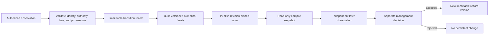
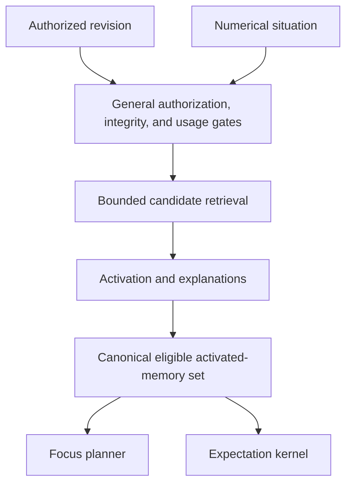
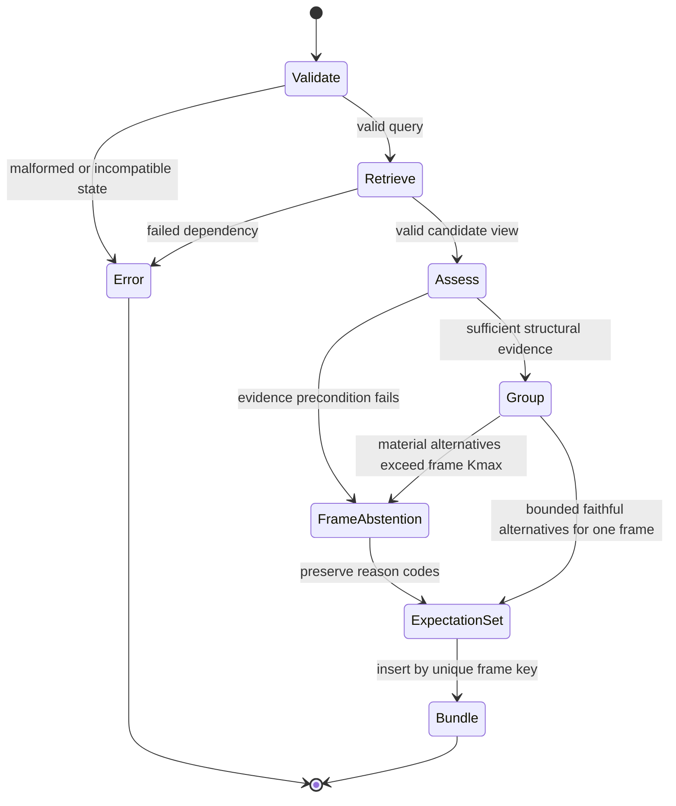
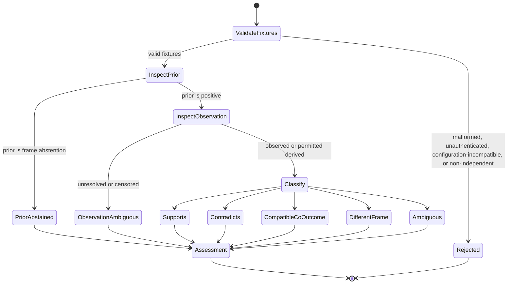
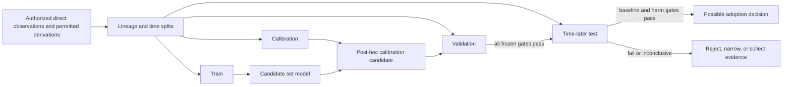

# Predictive attention and expectation

Status: Proposed

## Purpose

This specification is the canonical terminology, data, mathematical, and
update contract for Nemosyne's proposed memory-grounded expectation layer. It
defines how authorized direct observations and explicitly permitted registered
derivations may support a bounded set of present-state hypotheses, passive
successor expectations, or conditional outcome expectations without selecting
an action.

The contract is proposed. No transition-memory store, expectation kernel,
expectation corpus, calibration model, or product implementation exists in the
repository. The existing activation kernel supplies bounded relevance scores
for already normalized inputs; it does not implement any formula in this
specification and does not make an expectation probable or true.

This document is the only current specification that owns the expectation
notation and derivation. Architecture, proof, renderer, and delivery documents
refer here instead of restating the formulas.

### Claim discipline

The design is informed by work on memory-based prediction, episodic future
construction, attention, expectation, and selective prediction. Those sources
do not select Nemosyne's schema, equations, thresholds, or software
boundaries. Predictive processing remains an influential but empirically mixed
framework. Nemosyne does not claim to reproduce a brain, human consciousness,
inner speech, chain of thought, or biologically faithful prediction.

## Definitions

### Canonical terminology

| Term | Canonical meaning | Explicitly not |
| --- | --- | --- |
| **World state** | The external and internal conditions that exist at a time, whether or not the compiler can observe them | A fully known database row |
| **Trigger** | The new authenticated user prompt that requests one compiler response | The complete situation |
| **Situation** | The request-local, typed numerical representation \(Q=\operatorname{encode}(P,S,\Xi;K)\) derived from the trigger, up to three caller-provided situation statements, contextual time, optional metadata, and authenticated pinned numerical configuration | A prose summary invented by the compiler, or a container for principal, authorization time, policy, disclosure, or authorization-view state |
| **Cognitive memory unit** | One immutable, versioned, provenance-bound memory record with authoritative exact data and rebuildable numerical facets | A raw text chunk or one opaque embedding |
| **Transition memory** | A cognitive memory unit that binds an observed before-state, an explicit condition or absence, an observed/censored after-state, and a horizon | Proof that a condition caused the outcome |
| **Activation** | A bounded relevance or accessibility score produced by the separately specified activation contract | Probability, truth, utility, safety, or importance in every context |
| **Focus** | Supported information that deserves processing priority in the current situation | A prediction or selected action |
| **Hypothesis** | A qualified proposition whose truth is not established by the current request | A fact or instruction |
| **Expectation** | A hypothesis about a hidden present state or a possible later state, supported by eligible transition evidence for one prediction frame | A goal, answer, action, command, or calibrated probability |
| **Outcome** | The observed after-state meaning recorded by an eligible transition | A renderer-generated continuation |
| **Condition** | An explicit action, external event, state predicate, or observed absence under which a transition was recorded | A recommended action |
| **Horizon** | A typed point or interval separating the prediction reference time from the state being hypothesized | Recency of the memory record |
| **Prediction error** | A typed relation between a later authenticated observation and a prior expectation revision | Surprise unless a complete calibrated probability model exists |
| **Relative support** | A normalized share of dependency-budgeted evidence across the complete known-plus-unknown group family before any output omission | Probability, confidence, or an exhaustive open-world distribution |
| **Calibrated probability** | A probability estimate whose interpretation and error have passed a separately accepted calibration protocol on disjoint observations | A normalized score or model logit |
| **Uncertainty** | A vector of evidence diagnostics, including missingness, novelty, disagreement, unknown support, dependency concentration, and retrieval status | One universal scalar |
| **Abstention** | A valid expectation result that deliberately emits no positive expectation because evidence preconditions or bounded faithful representation fail | A runtime error or a negative prediction |
| **Goal** | A desired state with legitimate source authority | An expected state |
| **Action** | An operation an agent may choose or execute | A condition merely mentioned by a transition |
| **Plan** | The bounded, source-bound internal `FocusExpectationPlan` supplied to the renderer | An action plan |

Terms in this table are normative throughout current V1 specifications. A
focused specification may refine a term but must not assign it a conflicting
meaning.

### Expectation notation

The cross-specification notation registry and derivation-owner index are owned
by the
[V1 proof program](v1-proof-program.md#canonical-notation-and-derivation-ownership).
The expectation derivation below uses that registry and owns the corresponding
expectation formulas. It does not redefine activation, planning, or rendering
symbols.

The displayed formulas define exact real-number semantics. They do not select
an executable floating-point, fixed-point, rational, or log-domain
representation. An executable expectation configuration is valid only when it
contains one content-identified `NumericalPolicyId` whose authenticated
artifact defines all of the following:

- the representation and finite encoded domain for every scalar family;
- canonical conversion from exact ingress values and one canonical encoding of
  zero, including the handling or prohibition of negative zero;
- the exact evaluation and accumulation order for every product, sum,
  reduction, maximum, division, comparison, and transcendental function;
- rounding after every primitive operation and conversion;
- underflow, overflow, division-by-zero, and non-finite intermediate behavior;
- threshold-boundary and equality behavior, including exact ties and the
  explicit absence of epsilon comparisons;
- canonical output serialization and cross-platform reproducibility
  requirements; and
- a typed error for every value or operation outside the policy's domain.

No executable numerical policy is the default. A missing, unauthenticated,
unsupported, internally inconsistent, or incompletely specified
`NumericalPolicyId` is a configuration error before expectation evaluation.
The existing activation kernel's separately specified `f64` behavior does not
implicitly select the expectation policy. Every executable proof and receipt
binds the exact numerical-policy identity.

Symbols reused across expectation formulas have the following local meanings.
Symbols absent from this table are local to the single formula or paragraph
that introduces them.

| Symbol | Local meaning |
| --- | --- |
| \(\psi\) | One validated expectation query |
| \(\tau_i\) | Eligible observed transition \(i\) |
| \(\mathcal E_\psi\) | Canonical set of transitions eligible for \(\psi\) |
| \(\mathcal F_x\) | Configured comparable state-facet set |
| \(\mathcal F_i^{\mathrm{cmp}}\) | Subset of configured facets legitimately comparable for transition \(i\) |
| \(\chi_{i,\psi}\) | Hard frame-local eligibility indicator |
| \(C_i^x,C_i^c,C_i^h\) | State, condition, and horizon compatibility |
| \(\gamma_i^{\mathrm{cov}},\eta_i^{\mathrm{match}}\) | Comparable-facet coverage and conditional match |
| \(\varrho_i,\alpha_i\) | Compatible typed transition-reliability value and qualified support weight |
| \(a,h,d\) | Alternative family, outcome group, and dependency group |
| \(\mathcal A_f,class(a),class(\psi)\) | Frame-family set and total configured family/frame classifiers |
| \(\mathcal K_a,\bot_a,\mathcal H_a\) | Known, unknown, and complete groups of family \(a\) |
| \(u_{a,h,d},b_{a,d},\bar u_{a,h,d}\) | Raw, total, and allocated dependency support |
| \(s_{a,h},Z_a,r^{\mathrm{share}}_{h\mid a}\) | Group support, complete family support, and family-relative share |
| \(N_{\mathrm{support},a},N_{a,h}\) | Family and hypothesis participation-ratio diagnostics |
| \(\mathcal M_{f,a},\mathcal M_f,\mathcal O_{f,a}\) | Material family groups, tagged material frame union, and non-material positive known groups |
| \(\mu^{\mathrm{rep}}_{a,h}\) | Selected stored representative for one outcome group |
| \(\mathcal E_\psi^{\mathrm{cov}},\Gamma,\gamma_\psi^{\max}\) | Coverage-qualified transition set, its nearest compatible-case score, and best eligible comparable-facet coverage |
| \(K_{\max}\) | Positive frame-wide material-hypothesis limit |
| \(n_{\mathcal A},q_{\mathcal A}\) | Shared activated-set record count and total bounded field/reference count validated by this stage |
| \(n_b,x_b,p_b,g_b,d_{b,h},o_b,e_b\) | Per-frame transition, facet, support-entry, group, representative, output-reference, and exact-sidecar-byte counts used by the complexity contract |
| \(c_\delta,s_\delta\) | Worst-case time and additional-memory bounds of one outcome-distance evaluation |
| \(\operatorname{sort}(z)\) | Canonical comparison-ordering work for a finite collection of cardinality \(z\) |

Each normative formula group is preceded by a stable `EXP-*` identifier.
Consecutive displayed equations before the next identifier belong to that
group. The identifier names this document's owning derivation and is not a
runtime identifier.

### Logical memory planes

A cognitive memory unit has two inseparable logical planes:

```text
CognitiveMemoryUnit
├── authoritative exact plane
│   ├── immutable identities and schema version
│   ├── source provenance and dependency group
│   ├── authority, authorization, and allowed use
│   ├── validity, supersession, contradiction, and deletion state
│   ├── exact values and byte-preserving payloads
│   └── observation and derivation status
└── rebuildable numerical plane
    ├── typed vectors with space and encoder identities
    ├── scalars, masks, relations, and normalization identity
    ├── source bindings to the exact plane
    └── revision-pinned retrieval indexes
```

The exact plane is the source of claim identity, authority, provenance, and
loss-sensitive values. The numerical plane is the source of similarity and
activation computation. Neither plane is independently sufficient.

Missing, unknown, inapplicable, explicit none, and numeric zero are distinct.
Vectors with different registered spaces are incomparable until a versioned
transform explicitly maps them to one common space.

### Transition-memory contract

A transition record has the following logical wireframe:

```rust
pub struct TransitionRecord {
    id: TransitionId,
    record_version: RecordVersion,
    schema: TransitionSchemaId,
    subject: SubjectId,
    before: StateObservation,
    condition: TransitionCondition,
    after: OutcomeObservation,
    horizon: Horizon,
    validity: ValidityInterval,
    reliability: TransitionReliability,
    uncertainty: TransitionUncertainty,
    provenance_root: ProvenanceRootId,
    dependency_group: DependencyGroupId,
    authority: AuthorityLabel,
    authorization: DisclosurePolicyRef,
    allowed_usage: UsagePolicy,
    exact_sidecar: ExactSidecarRef,
    facets: FacetManifest,
}
```

This is a logical contract, not a committed Rust API or physical database row.
Private fields, validated constructors, and reading getters are required when
implemented.

Observation status and meaning form one tagged value rather than two fields
that can disagree:

```rust
pub struct StateObservation {
    observed_at: ObservationTime,
    value: ObservationValue<StateMeaningId, StateVariableSchemaId>,
    uncertainty: ObservationUncertainty,
    exact_bindings: CanonicalSet<ExactBindingRef>,
}

pub struct OutcomeObservation {
    observed_at: ObservationTime,
    value: ObservationValue<OutcomeMeaningId, OutcomeVariableSchemaId>,
    uncertainty: ObservationUncertainty,
    exact_bindings: CanonicalSet<ExactBindingRef>,
}

pub enum ObservationValue<MeaningId, VariableSchemaId> {
    Observed {
        meaning: MeaningId,
    },
    Derived {
        meaning: MeaningId,
        derivation: RegisteredDerivationId,
    },
    Unresolved {
        variable: VariableSchemaId,
        reason: UnresolvedObservationCode,
    },
    Censored {
        variable: VariableSchemaId,
        censoring: CensoringSchemaId,
    },
    Contradicted {
        prior_meaning: MeaningId,
        contradiction: ObservationEvidenceRef,
    },
    Predicted {
        meaning: MeaningId,
        expectation: PriorExpectationRef,
    },
}

pub enum ObservationTime {
    Exact {
        at: ExactInstant,
    },
    Interval {
        inclusive_start: ExactInstant,
        inclusive_end: ExactInstant,
    },
    Unknown {
        reason: UnknownObservationTimeCode,
    },
}

pub struct TransitionReliability {
    schema: ReliabilitySchemaId,
    state: ReliabilityState,
    migration: Option<ReliabilityMigrationRef>,
}

pub enum ReliabilityState {
    Derived {
        value: UnitInterval,
        derivation: ReliabilityDerivationId,
        calibration_domain: ReliabilityCalibrationDomainId,
    },
    Missing {
        reason: MissingReliabilityCode,
    },
    Unknown {
        reason: UnknownReliabilityCode,
    },
    Inapplicable {
        reason: InapplicableReliabilityCode,
    },
}

pub struct ReliabilityMigrationRef {
    migration: ReliabilityMigrationId,
    source_record: TransitionRecordRevisionId,
    source_schema: ReliabilitySchemaId,
    source_state: ReliabilityMigrationSource,
    source_state_digest: ReliabilityStateDigest,
}

pub enum ReliabilityMigrationSource {
    Derived {
        derivation: ReliabilityDerivationId,
        calibration_domain: ReliabilityCalibrationDomainId,
    },
    Missing {
        reason: MissingReliabilityCode,
    },
    Unknown {
        reason: UnknownReliabilityCode,
    },
    Inapplicable {
        reason: InapplicableReliabilityCode,
    },
}
```

These are logical wireframes, not committed public Rust APIs. The two
observations own their respective tagged value and observation uncertainty.
`TransitionRecord` has no duplicate record-level observation status.
`TransitionUncertainty` describes only uncertainty in associating the two
observations with the declared condition, horizon, and temporal alignment; it
does not overwrite either observation's uncertainty. Every uncertainty value
has a registered schema, finite domain, unit or category vocabulary,
missingness semantics, and derivation identity. A renderer never receives an
unlabeled uncertainty scalar. The enum tag is the one closed canonical
`ObservationStatus` vocabulary. A reading `status()` getter may expose
`Observed`, `Derived`, `Unresolved`, `Censored`, `Contradicted`, or `Predicted`;
there is no independently constructible status field.

`TransitionReliability` is one typed, versioned value, not an unlabeled scalar.
Its schema fixes the score's finite domain, interpretation, source-feature
contract, missingness vocabulary, and canonical representation. A `Derived`
state carries one finite `UnitInterval`, the registered derivation that
produced it, and the calibration domain in which that derivation is permitted
to support an expectation. Numeric zero is an available derived value and is
not `Missing`, `Unknown`, or `Inapplicable`.

The pinned expectation configuration supplies one total reliability-
compatibility relation over reliability schema, derivation, calibration
domain, transition schema, observation states, and prediction-frame class.
A known, well-formed incompatibility or a non-`Derived` state makes that
transition ineligible for the frame and retains a typed exclusion diagnostic.
An unknown or malformed schema, applicable derivation or calibration domain,
missingness code, source-state binding, or migration identity is a structural
error. A field that does not belong to the selected state variant is also a
structural error rather than an ignored value.

Reliability migration never occurs implicitly during compilation. Migration
lineage belongs to `TransitionReliability`, not to one state variant, because
a registered migration may map any source state to any target state. A
separately authorized management operation or derived-artifact rebuild may
apply one authenticated, versioned `ReliabilityMigrationId` with declared
source and target schemas, state-transition matrix, derivations, calibration
domains, missingness mapping, finite-range behavior, and compatibility proof.
It publishes a new immutable record version or revision-bound derived
artifact.

Its `ReliabilityMigrationRef` binds the exact source record revision and
schema, a canonical digest of the complete source state, and variant-specific
source metadata. A `Derived` source supplies its derivation and calibration
domain. `Missing`, `Unknown`, and `Inapplicable` sources supply only their
registered reason code and cannot carry or require a fabricated derivation,
numeric value, or calibration domain. The reference's source variant and
metadata must reconstruct and match the authenticated source record and
digest exactly; mismatch is a structural error.

The outer `schema` and `state` are the migration target. A target `Derived`
state therefore carries its own derivation, calibration domain, and finite
value, while a target unavailable state carries only its typed reason. The
optional migration reference remains representable on every target state.
Compilation accepts a target value only under the target contract pinned by
the compile configuration. A valid migrated unavailable target remains
frame-ineligible while preserving its lineage; migration does not convert
missingness into support. No matching migration means incompatibility; equal
numeric payloads under different schemas or calibration domains do not
establish compatibility. Rollback restores the exact prior immutable record
revision or artifact, including its original state variant, rather than
translating a value in place or applying an inverse migration.

The payload and support contract is total:

| Tag | Required payload | Eligible as `before` | Eligible as `after` |
| --- | --- | --- | --- |
| `Observed` | One exact typed meaning | Positive support | Positive known-outcome support |
| `Derived` | One exact typed meaning and registered derivation | Positive support only when that derivation class is permitted for `before` | Positive known-outcome support only when that derivation class is permitted for `after` |
| `Unresolved` | Variable schema and registered reason; no asserted meaning | Ineligible | Explicit unknown-group support |
| `Censored` | Variable schema and censoring schema; no asserted meaning | Ineligible | Explicit unknown-group support |
| `Contradicted` | Prior meaning and independent contradiction evidence | Ineligible; audit history only | Ineligible; audit and counter-history only |
| `Predicted` | Meaning and prior-expectation identity | Ineligible | Ineligible |

An `Unresolved` or `Censored` after-value contributes to exactly one unknown
group only when its variable schema maps to one registered alternative family.
No mapping, several mappings, a meaning payload on either tag, or a missing
reason or censoring schema is a structural error. An exact binding must belong
to a field present in the selected tag and pass its own authority and type
contract; a binding cannot smuggle an asserted meaning into a non-meaning tag.

The `before.observed_at`, `after.observed_at`, and `horizon` values must satisfy
the registered temporal-consistency contract. An exact time is one instant. An
interval is closed, has `inclusive_start < inclusive_end`, and carries no
implied point estimate. A singleton is canonically `Exact`, never a
zero-width `Interval`. `Unknown` carries one registered reason and no hidden
instant. Unknown or interval-valued times are not replaced with zero, a
midpoint, or an ambient clock. A transition is eligible only when the pinned
temporal relation can prove the required before/after ordering and horizon
compatibility for every instant admitted by both observations. An unknown time
or an interval for which that universal relation is undecidable makes the
transition ineligible; it does not become unknown-outcome support. A
constructor rejects an impossible interval or ordering, a horizon outside its
registered tolerance, an observation status incompatible with its payload, or
an uncertainty value without its schema.

`TransitionCondition` is exactly one of:

- `NoInterventionObserved`;
- `ActionObserved(ActionId)`;
- `ExternalEventObserved(EventId)`;
- `StateConditionObserved(ConditionId)`; or
- `Unknown`.

`Unknown` never matches `NoInterventionObserved`. A record following an
observed action records an association under that condition; it does not
establish the action's causal effect.

A transition may provide positive known-outcome support only through the first
two table rows and only when both roles are eligible under the pinned
configuration. A censored or unresolved before-state makes the transition
ineligible even for unknown-outcome support. A later observed replacement
requires a new immutable record version rather than reinterpretation of a
contradicted, censored, unresolved, or predicted payload.



Compile never follows the management arrows.

### Situation and expectation query

The caller provides one immutable prompt, zero to three situation statements,
one contextual time, and explicit optional metadata. The compiler resolves and
pins the authenticated numerical configuration \(K\) before encoding.
Principal, trusted authorization time, policy, disclosure, and
authorization-view state remain outside the numerical situation. They are
used only by the separately owned pre-retrieval authorization path and later
appear, where required, as opaque lineage identities in \(\Lambda_A\).

```text
Situation / numerical query state Q
├── ingress projection
│   ├── request content identity
│   ├── situation content identity
│   └── authenticated configuration identity
├── trigger projection
│   └── typed prompt-derived numerical facets
├── caller context
│   ├── 0..3 situation statements
│   ├── contextual time
│   └── explicit optional location/project/application metadata
└── presence and confidence
    ├── known
    ├── unknown
    ├── absent
    └── inapplicable
```

Prompt-derived and caller-provided signals retain different provenance.
The byte-identical original prompt buffer is retained separately by the
compiler and is not a field of \(Q\).
Caller-provided contextual time affects relevance and historical scope but not
authorization expiry or current instruction authority. Location may be an
exact sidecar plus typed numerical facets; absence never permits environment
discovery. Changing principal, trusted authorization time, policy, disclosure,
or authorization-view state without changing \(P,S,\Xi,K\) cannot change
\(Q\) or an expectation query's numerical situation; it may change which
memory records are eligible before the shared set is constructed.

**EXP-QRY-001 — expectation-query tuple.**

An expectation query is:

\[
\psi=(k_\psi,x_\psi,c_\psi,I_\psi)
\]

where:

- \(k_\psi\) is `PresentStateHypothesis`, `PassiveSuccessor`, or
  `ConditionalOutcome`;
- \(x_\psi\) is the typed numerical situation state;
- \(c_\psi\) is an explicit condition compatible with the query kind; and
- \(I_\psi\) is a typed nonnegative horizon point, key, or half-open interval.

A conditional query without an explicit condition is invalid. A passive query
requires `NoInterventionObserved`, not an inferred absence. Present-state
hypotheses use a registered present-state horizon key rather than a zero-length
duration interval.

### Eligible activated-memory set

General authorization, disclosure, deletion, request-usage, revision, and
representation-integrity checks precede retrieval and activation. They do not
apply expectation-kind, observation-status, condition, or horizon predicates:
those predicates belong to the expectation projection after the focus and
expectation branches receive the same shared set. The shared branch input is:

The general request-usage gate retains a record when its authenticated
allowed-use ceiling permits at least one requested branch use and carries that
ceiling into the set. Each branch then enforces its own permitted use as a
projection predicate without reopening authorization. A record permitted only
for one branch remains invisible to the other.

```text
EligibleActivatedMemorySet
├── source_receipt
│   ├── request_id
│   ├── situation_id
│   ├── memory_revision_id
│   ├── policy_revision_id
│   ├── authorization_view_id
│   ├── retrieval_result_id
│   ├── activation_set_id
│   └── configuration_id
├── activated records
│   ├── record and proposition identities
│   ├── activation score and explanation reference
│   ├── typed facets and presence masks
│   ├── exact-sidecar references
│   ├── provenance and dependency group
│   └── authority and allowed-use ceiling
└── retrieval diagnostics
    ├── candidate limit
    ├── completeness class
    └── index and representation identities
```

**EXP-LIN-001 — shared branch-lineage tuple.**

The complete immutable lineage tuple is:

\[
\Lambda_A =
(
request\_id,
situation\_id,
memory\_revision\_id,
policy\_revision\_id,
authorization\_view\_id,
retrieval\_result\_id,
activation\_set\_id,
configuration\_id
).
\]

This specification is the sole owner of the tuple's field set and order. Every
field is a typed canonical numeric or content identity. A missing field,
duplicate field, identity mismatch, or tuple assembled from more than one
request-local derivation is a structural error. The tuple contains no raw
evidence or diagnostic prose.



The set is canonically ordered by stable record identity for deterministic
processing. It remains logically unordered for any later learned set model.
The focus planner and expectation kernel may project different views but may
not independently repeat authorization or retrieve ambient memory.

Bounded retrieval covers the configured union of general focus cues and every
validated prediction-frame cue before activation. A branch-specific cue may
add a candidate to that union but may not remove a candidate needed by the
other branch. Retrieval limits and completeness diagnostics describe the union.
No prediction frame is required for a valid focus-only shared set.

### Expectation-projection hard eligibility

Structural validation of the shared set is total before either projection. An
invalid number, identifier, provenance/dependency identity, schema, revision
binding, relation, or vector-space contract is a typed error for the entire
evaluation; it is never converted into an invisible candidate omission. The
expectation projection then validates transition-specific fields, including
observation status, before applying the following frame-local predicate.

**EXP-ELIG-001 — frame-local transition eligibility.**

For transition \(i\) and expectation query \(\psi\):

\[
\chi_{i,\psi} =
\begin{cases}
1,&\text{all expectation-query eligibility predicates pass}\\
0,&\text{otherwise}
\end{cases}
\]

Let \(\mathcal T(\mathcal A)\) be the canonical transition projection of the
shared activated set. The eligible-transition set is:

\[
\mathcal E_\psi=
\{\tau_i\in\mathcal T(\mathcal A)\mid\chi_{i,\psi}=1\}.
\]

Expectation-query predicates include:

- an allowed-use ceiling that permits the requested expectation kind;
- compatible subject, scope, facet schemas, vector spaces, and horizon type;
- condition semantics required by the query kind;
- eligible observation status; and
- one compatible `Derived` transition-reliability value under the pinned
  reliability contract.

General policy exclusion is not abstention and not inhibition and has already
removed the record from the shared set. A record that is generally eligible
but fails \(\chi_{i,\psi}\) remains available to the focus branch while
contributing no support or content-bearing expectation diagnostic for frame
\(\psi\).

### Typed transition reliability

Reliability admission is a typed operation performed before qualified support
is evaluated.

**EXP-REL-001 — typed reliability admission.**

For one structurally valid transition and frame, the pinned compatibility
contract returns exactly one of:

\[
\operatorname{admitRel}(\tau_i,\psi)=
\begin{cases}
\operatorname{Compatible}(v),
&\text{the state is `Derived` and its complete contract is compatible},\\
\operatorname{Excluded}(code),
&\text{the valid state is unavailable or its contract is incompatible},\\
\operatorname{Error}(code),
&\text{an identity, state, or migration contract is unknown or malformed}.
\end{cases}
\]

For a `Derived` target, the complete contract includes reliability schema,
derivation, calibration domain, transition schema, observation states,
prediction-frame class, and any authenticated migration lineage. For an
unavailable target, validation uses its schema, exact state variant, reason,
and migration lineage without inventing derived-only fields. `Compatible`
carries the exact finite value \(v\in\mathbb U\), sets \(\varrho_i=v\), and
satisfies the reliability conjunct of \(\chi_{i,\psi}\). `Excluded` sets that
conjunct to zero and emits one typed frame-local exclusion diagnostic; it does
not synthesize \(\varrho_i\). `Error` aborts the evaluation and cannot be
converted to either exclusion or abstention.

A compatible derived value of zero remains an available reliability
observation and may satisfy \(\chi_{i,\psi}\), although it makes the
transition's qualified support zero. `Missing`, `Unknown`, and
`Inapplicable` are unavailable states, not alternative spellings of zero.
Derived values from distinct reliability schemas or calibration domains are
incomparable unless the value carries a registered migration lineage admitted
by the pinned compatibility contract. Every source and target state pair is
validated against the migration's declared state-transition matrix.
Compilation performs no migration, fallback calibration, neutral-value
substitution, or numeric-only compatibility test.

### Facet compatibility and missing values

Let \(\mathcal F_x\) be the configured state-facet set, each with fixed
normalized weight
\(\omega_f\in(0,1]\), with a canonical finite sum of exactly one under the
registered numerical contract. Let \(\delta_{i,f}^{\mathrm{cmp}}=1\) only when
query and transition both provide comparable values for facet \(f\); otherwise
\(\delta_{i,f}^{\mathrm{cmp}}=0\). Let
\(\sigma_f(x_{\psi,f},x_{i,f})\in\mathbb U\) be the registered finite similarity.

Every facet schema has exactly one closed missingness policy:

```rust
pub enum MissingFacetPolicy {
    Optional,
    RequiredOnQuery,
    RequiredOnTransition,
    RequiredOnBoth,
}
```

This is a logical wireframe, not a committed Rust API. Policy evaluation is
total and has this precedence:

1. an unknown facet, malformed value, unknown vector space, failed required
   transform, or value outside the registered facet domain is a structural
   error;
2. a legitimately absent or schema-declared incomparable query value under
   `RequiredOnQuery` or `RequiredOnBoth` sets the frame-level
   `MissingRequiredFacet` predicate and forbids positive emission for that
   frame;
3. a legitimately absent or schema-declared incomparable transition value
   under `RequiredOnTransition` or `RequiredOnBoth` sets
   \(\chi_{i,\psi}=0\) for that transition; and
4. every other legitimate absence or incomparability sets
   \(\delta_{i,f}^{\mathrm{cmp}}=0\) and affects only coverage and its presence
   mask.

When both query and transition requirements fail, the frame-level query result
in step 2 takes precedence; transition-level exclusions remain reconstructible
diagnostics. No implementation may choose between exclusion and abstention for
the same policy.

**EXP-CMP-001 — comparable-facet coverage.**

For transition \(i\), the legitimately comparable facet subset is:

\[
\mathcal F_i^{\mathrm{cmp}}
=
\{f\in\mathcal F_x\mid\delta_{i,f}^{\mathrm{cmp}}=1\}.
\]

The registered similarity \(\sigma_f(x_{\psi,f},x_{i,f})\) is defined for
every \(f\in\mathcal F_i^{\mathrm{cmp}}\) and is never evaluated outside that
subset. Observed comparable-facet coverage is:

\[
\gamma_i^{\mathrm{cov}} =
\frac{\sum_{f\in\mathcal F_i^{\mathrm{cmp}}}\omega_f}
     {\sum_{f\in\mathcal F_x}\omega_f}
\]

**EXP-CMP-002 — conditional comparable-facet match.**

When \(\mathcal F_i^{\mathrm{cmp}}\ne\varnothing\), its conditional match is:

\[
\eta_i^{\mathrm{match}} =
\frac{\sum_{f\in\mathcal F_i^{\mathrm{cmp}}}\omega_f\sigma_f(x_{\psi,f},x_{i,f})}
     {\sum_{f\in\mathcal F_i^{\mathrm{cmp}}}\omega_f}
\]

**EXP-CMP-003 — state compatibility.**

The state compatibility used by the baseline is:

\[
C_i^x =
\frac{\sum_{f\in\mathcal F_i^{\mathrm{cmp}}}\omega_f\sigma_f(x_{\psi,f},x_{i,f})}
     {\sum_{f\in\mathcal F_x}\omega_f}
\]

An empty configured facet set or nonpositive configured weight denominator is
a configuration error. When the comparable-facet denominator in EXP-CMP-002
is positive, the identity
\(C_i^x=\gamma_i^{\mathrm{cov}}\eta_i^{\mathrm{match}}\) also holds. When no
facet is comparable after the missingness policy is applied,
\(\gamma_i^{\mathrm{cov}}=0\), \(C_i^x=0\), and
\(\eta_i^{\mathrm{match}}\) is absent; the product identity and the absent
conditional match are not evaluated. Missing values are not silently
described as observed mismatches. Reports expose
\(\gamma_i^{\mathrm{cov}}\), optional
\(\eta_i^{\mathrm{match}}\), the presence mask, and every exclusion or
frame-level missingness disposition so their different meanings remain
reconstructible.

### Condition and horizon compatibility

\(C_i^c\in\mathbb U\) is produced by one registered, versioned condition
compatibility function. Different action or external-event identities are
hard-incompatible by default. A soft condition match requires an authored
semantic relation and independent evaluation.

For positive half-open duration intervals \(I_\psi=[l_\psi,u_\psi)\) and
\(I_i=[l_i,u_i)\) expressed in one canonical integer unit, the no-coefficient
baseline is Jaccard overlap:

**EXP-HOR-001 — interval horizon compatibility.**

\[
C_i^h=
\frac{\lvert I_\psi\cap I_i\rvert}
     {\lvert I_\psi\cup I_i\rvert}
\]

Both intervals require \(0\le l<u\), a common horizon schema, and
overflow-safe integer arithmetic. Exact horizon keys use identity
compatibility. Alternative temporal kernels, tolerances, and learned scales
are versioned artifacts, not hidden defaults.

Different horizons are not contradictions. For example, "tests still fail in
one minute" and "tests pass after a ten-minute rebuild" may both be supported.

### Qualified transition support

**EXP-WGT-001 — qualified transition support.**

The baseline transition weight is:

\[
\alpha_i =
\begin{cases}
0,&\chi_{i,\psi}=0,\\
A_i C_i^x C_i^c C_i^h \varrho_i,&\chi_{i,\psi}=1.
\end{cases}
\]

The second branch is evaluated only after `EXP-REL-001` has produced a
compatible \(\varrho_i\); an excluded transition has no fabricated reliability
value. Every evaluated factor belongs to \(\mathbb U\), so real-number
semantics give \(0\le\alpha_i\le1\).

The signal-lineage manifest covers every raw feature and derived channel used
by \(A_i\), \(C_i^x\), \(C_i^c\), \(C_i^h\), and \(\varrho_i\). The reference
interpretation restricts \(A_i\) to accessibility signals disjoint from
transition state, condition, horizon, and reliability compatibility.
Intentional reuse or interaction requires a named term, explicit feature
lineage, an ablation, and a decision. Hidden reuse makes the score
uninterpretable even when it remains bounded.

An executable policy must preserve the formula's declared zero and positivity
semantics within its proved domain. In particular, it may not silently map a
mathematically positive supported product to zero. It must instead prove a
positive lower bound for its admitted factors, use a representation whose
declared domain preserves the result, or return the policy's typed numerical
error. Any log-domain, fixed-point, rational, floating-point, or compensated
implementation is governed by its exact `NumericalPolicyId`; this formula
selects none of them.

### Prediction frames and outcome groups

One `PredictionFrameKey` contains:

- expectation kind;
- subject and scope;
- condition identity and modality; and
- horizon cell or exact horizon key.

The key has a total canonical order. Its comparison tuple is expectation-kind
tag (`PresentStateHypothesis`, `PassiveSuccessor`, then
`ConditionalOutcome`), ascending subject and scope identifiers,
condition-modality tag (`NoInterventionObserved`, `ActionObserved`,
`ExternalEventObserved`, `StateConditionObserved`, then `Unknown`), ascending
condition identifier when present, ascending horizon-schema identifier, and
finally the canonical horizon key or checked interval endpoints. An
inapplicable tuple component is represented by its typed absence tag, not an
invented sentinel identifier.

The frame is partitioned into explicit alternative families \(a\), identified
by versioned `AlternativeSetId` values. Every family also carries one
`AlternativeFamilyClassId` derived by a versioned total classifier from its
registered `OutcomeVariableSchemaId`. The class is a closed semantic planning
category, not a request-local identity, equivalence claim, support scale, or
denominator. Its classifier and schema identities are covered by the
expectation-configuration fingerprint.

Members of one family answer one outcome variable and are pairwise mutually
exclusive. Compatible co-outcomes belong to different families and never
compete for one denominator. For example, "tests still fail" and "the cache is
rebuilt" may coexist and therefore cannot be two alternatives merely because
they share a frame. A constructor rejects an unknown family class, a class that
does not match the registered outcome-variable schema, or a classifier that is
not total over the supported schema domain.

An `OutcomeMeaningId` or versioned authored equivalence key defines one outcome
group \(h\) inside one family. A relation called equivalence must be reflexive,
symmetric, and transitive. Pairwise `similarity >= threshold` is not generally
transitive and must not create an equivalence class. If canonicalization is
unavailable, V1 keeps outcomes separate or uses a separately specified
deterministic clustering relation whose chaining behavior is explicit.

`Contradicts` is irreflexive and symmetric, disjoint from equivalence, and
congruent under equivalence: equivalent members must have the same
contradiction relations. Every family validator rejects self-contradiction,
overlap between equivalence and contradiction, a non-exclusive member pair, or
inconsistent relations across an equivalence class. Exhaustiveness is explicit
rather than assumed.

Let \(\mathcal K_a\) be the finite set of known outcome groups in family \(a\).
Each family also contains exactly one tagged unknown/other group \(\bot_a\),
and its complete normalization family is:

**EXP-FAM-001 — complete known-plus-unknown alternative family.**

\[
\mathcal H_a=\mathcal K_a\cup\{\bot_a\}.
\]

The unknown group contains
eligible unresolved, censored, and unknown evidence for that family and
participates in its denominator. It does not represent every outcome absent
from memory and does not make the family an exhaustive model of the world.
Novelty and retrieval incompleteness remain independent abstention inputs.
Output omission does not remove a known group from \(\mathcal H_a\); it changes
only whether that group's surface is renderable.

### Dependency-budgeted support

`ProvenanceRootId` identifies origin for audit. `DependencyGroupId` is the
conservative mathematical unit used to prevent known correlated records from
multiplying support. A dependency group is not claimed to be statistically
independent from other groups.

For alternative family \(a\), outcome group \(h\in\mathcal H_a\), and
dependency group \(d\):

**EXP-SUP-001 — raw dependency-group support.**

\[
u_{a,h,d} =
\max\{\alpha_i\mid i\in h\land d_i=d\}
\]

with \(u_{a,h,d}=0\) when the set is empty.

**EXP-SUP-002 — one dependency budget per family.**

Define:

\[
b_{a,d}=\max_{h\in\mathcal H_a} u_{a,h,d}
\]

\[
z_{a,d}=\sum_{h\in\mathcal H_a} u_{a,h,d}
\]

and allocate one dependency budget only across the mutually exclusive outcomes
in that family:

**EXP-SUP-003 — dependency-budget allocation.**

\[
\bar u_{a,h,d}=
\begin{cases}
0,&z_{a,d}=0\\
b_{a,d}\frac{u_{a,h,d}}{z_{a,d}},&z_{a,d}>0.
\end{cases}
\]

**EXP-SUP-004 — family support and family-relative shares.**

Then:

\[
s_{a,h}=\sum_d\bar u_{a,h,d}
\qquad
Z_a=\sum_{h\in\mathcal H_a}s_{a,h}=\sum_db_{a,d}
\]

For \(Z_a>0\), relative support inside the family is:

\[
r^{\mathrm{share}}_{h\mid a}=\frac{s_{a,h}}{Z_a}.
\]

Each family denominator includes known, unknown, and positive-support groups
that do not meet the frozen materiality predicate. The kernel never prunes a
material group to satisfy the frame limit: if the complete material union
exceeds the per-frame limit, the whole frame abstains. It also never
renormalizes the visible material groups to one. Shares from different
families are not added, ranked, or compared as though they formed one
distribution.

After materiality has been evaluated, define the non-material positive known
groups:

**EXP-OMIT-001 — material and omitted known-group partitions.**

\[
\mathcal M_{f,a}=
\{h\in\mathcal K_a\mid\operatorname{material}(a,h)\},
\qquad
\mathcal O_{f,a}=
\{h\in\mathcal K_a\mid s_{a,h}>0\land h\notin\mathcal M_{f,a}\}.
\]

The family-bound `OmittedSupport` control reports:

**EXP-OMIT-002 — omitted-support aggregate.**

\[
s_{\mathrm{omitted},f,a}=\sum_{h\in\mathcal O_{f,a}}s_{a,h},
\qquad
r^{\mathrm{share}}_{\mathrm{omitted}\mid f,a}=
\begin{cases}
0,&Z_a=0\\
s_{\mathrm{omitted},f,a}/Z_a,&Z_a>0,
\end{cases}
\]

plus \(\lvert\mathcal O_{f,a}\rvert\). `OmittedSupport` means
`BelowMaterialityKnownSupport`; it never means a material group was removed by
count-based truncation. It is an aggregate control, not a new member of
\(\mathcal H_a\); inserting it into the denominator would double-count the
omitted groups.

This allocation fixes a defect in a simpler per-outcome maximum: one dependency
group cannot contribute its full budget independently to several conflicting
outcomes. It does not prove that separate dependency groups are statistically
independent, that all evidence was retrieved, or that
\(r^{\mathrm{share}}_{h\mid a}\) is a probability.

### Effective support-group count

**EXP-ESS-001 — family effective support-group count.**

When \(Z_a=0\), define \(N_{\mathrm{support},a}=0\). Otherwise:

\[
N_{\mathrm{support},a}=
\frac{(\sum_db_{a,d})^2}{\sum_db_{a,d}^2}.
\]

For \(D_+>0\) positive family-bound dependency budgets:

\[
1\le N_{\mathrm{support},a}\le D_+.
\]

**EXP-ESS-002 — hypothesis effective support-group count.**

For one positive-support hypothesis:

\[
N_{a,h}=
\frac{s_{a,h}^2}{\sum_d\bar u_{a,h,d}^2},
\]

and \(N_{a,h}=0\) when \(s_{a,h}=0\). A minimum-support-groups gate uses
\(N_{a,h}\), not the family-level value. Both quantities are
participation-ratio diagnostics. The family value detects concentration among
all positive dependency budgets, including budgets assigned to unknown
support; the hypothesis value detects concentration of one known hypothesis.
They are not independent sample sizes, survey design effects, variance
estimates, confidence intervals, or proofs of source independence.

The executable numerical contract covers every derived product, square, sum,
and division in this section. A policy may use the following scale-invariant
evaluation form when it declares the form and its operation order. It evaluates
allocation as \(b_{a,d}(u_{a,h,d}/z_{a,d})\), rejects a mathematically positive
result that its representation would silently lose to zero, and rejects every
non-finite intermediate. For a stable participation ratio, let
\(b_{\max}=\max_db_{a,d}>0\) and \(w_d=b_{a,d}/b_{\max}\), then compute:

**EXP-NUM-001 — scale-invariant participation-ratio form.**

\[
N_{\mathrm{support},a}=
\frac{(\sum_dw_d)^2}{\sum_dw_d^2}.
\]

The same scaling applies to \(N_{a,h}\). This algebraically equivalent form is
not an implicit implementation default. A fixed-point, rational, log-domain,
floating-point, or compensated implementation must bind its complete rounding
and error behavior through `NumericalPolicyId`.

### Representative medoid

For each nonempty \((a,h,d)\), select the transition with greatest
\(\alpha_i\); an exact tie uses the smallest `TransitionId`. Let those
positive-weight dependency representatives form
\(\mathcal D^{\mathrm{rep}}_{a,h}\). Each member \(j\) retains its dependency
group \(d_j\), qualified weight \(\alpha_j\), allocated dependency support
\(\bar u_{a,h,d_j}\), outcome meaning \(y_j\), and transition identity.

When the configuration registers a finite symmetric outcome dissimilarity
\(\delta_y\in\mathbb U\) with \(\delta_y(y,y)=0\), the group representative is
the weighted medoid:

**EXP-REP-001 — weighted representative medoid.**

\[
\mu^{\mathrm{rep}}_{a,h} =
\operatorname*{arg\,min}_{j\in\mathcal D^{\mathrm{rep}}_{a,h}}
\sum_{k\in\mathcal D^{\mathrm{rep}}_{a,h}}
\bar u_{a,h,d_k}\delta_y(y_j,y_k).
\]

An exact tie uses the smallest `TransitionId`. The medoid is therefore one
stored eligible outcome, not a synthetic vector mean. Its exact sidecars are
only its own exact values. A medoid does not prove truth or semantic centrality
outside the declared dissimilarity. No triangle inequality is assumed. If the
group already has one canonical authored proposition surface, that surface is
preferred and no quadratic medoid calculation is required.

If the configured distance is legitimately unavailable for this group, define
the total fallback key:

**EXP-REP-002 — distance-free representative fallback.**

\[
key_{\mathrm{fallback}}(j)=
\left(
-\bar u_{a,h,d_j},
-\alpha_j,
TransitionId(j)
\right),
\qquad
\mu^{\mathrm{rep}}_{a,h}=
\operatorname*{arg\,min}_{j\in\mathcal D^{\mathrm{rep}}_{a,h}}
key_{\mathrm{fallback}}(j).
\]

Tuple comparison is ordinary lexicographic order: greater allocated
dependency support wins, then greater qualified transition support, then the
smallest transition identity. The first two components use the exact
canonical order defined by `NumericalPolicyId`; implementations need not
materialize negative encoded values. An unknown distance identity, malformed
distance, non-finite result, asymmetric result under a symmetric contract, or
distance failure inside its declared domain is a structural error and cannot
invoke this fallback.

### Counterevidence

**EXP-CTR-001 — within-family counter-support.**

For a known group \(h\in\mathcal K_a\), counter-support is:

\[
\operatorname{counter}(a,h)=
\sum_{\substack{g\in\mathcal K_a\\g\ne h}}s_{a,g}.
\]

Only mutually exclusive groups in the same explicit family participate.
The explicit unknown group is not a proposition that contradicts \(h\), so its
support is excluded from counter-support and retained as a separate diagnostic.
Different-horizon, different-subject, compatible co-outcomes, and unrelated
outcomes also remain separate diagnostics. Support is never reduced by
subtracting counter-support; both are preserved.

### Coverage and out-of-distribution diagnostics

The baseline reports, rather than collapses:

- comparable-facet coverage \(\gamma_i^{\mathrm{cov}}\);
- best eligible comparable-facet coverage and nearest coverage-qualified
  compatible-case score, defined below;
- distance-like novelty \(\nu=1-\Gamma\);
- \(D_+\), \(N_{\mathrm{support},a}\), and \(N_{a,h}\);
- unknown share \(r^{\mathrm{share}}_{\bot_a\mid a}\) per alternative family;
- retrieval status `Complete`, `Bounded`, `Degraded`, or `Failed`;
- required missing facets; and
- corpus, schema, encoder, and distance identities.

For a nonempty canonical eligible-transition set \(\mathcal E_\psi\), define
the report-only best coverage:

**EXP-COV-001 — coverage-qualified nearest case and novelty.**

\[
\gamma_\psi^{\max}
=
\max_{i\in\mathcal E_\psi}\gamma_i^{\mathrm{cov}}.
\]

The expectation configuration supplies two finite frozen minima by validated
prediction-frame class:
\(\theta_{\mathrm{cov}}(class(\psi))\in\mathbb U\) and
\(\theta_{\mathrm{near}}(class(\psi))\in\mathbb U\). The transitions allowed
to establish proximity are exactly:

\[
\mathcal E_\psi^{\mathrm{cov}}
=
\left\{
\tau_i\in\mathcal E_\psi
\mid
\gamma_i^{\mathrm{cov}}
\ge
\theta_{\mathrm{cov}}(class(\psi))
\right\}.
\]

Only when \(\mathcal E_\psi^{\mathrm{cov}}\ne\varnothing\), define:

\[
\Gamma
=
\max_{i\in\mathcal E_\psi^{\mathrm{cov}}}(C_i^xC_i^cC_i^h),
\qquad
\nu=1-\Gamma.
\]

**EXP-COV-002 — exact below-coverage predicate.**

\[
\operatorname{belowCoverage}(\psi)=
\begin{cases}
\operatorname{false},
&\mathcal E_\psi=\varnothing,\\
\operatorname{true},
&\mathcal E_\psi\ne\varnothing
\land\mathcal E_\psi^{\mathrm{cov}}=\varnothing,\\
\left[
\Gamma<\theta_{\mathrm{near}}(class(\psi))
\right],
&\mathcal E_\psi^{\mathrm{cov}}\ne\varnothing.
\end{cases}
\]

Equality with either minimum passes that comparison. The same transition that
establishes proximity must therefore have passed the coverage minimum. A
high-coverage but distant transition and a low-coverage but nearby transition
cannot combine their separate maxima into a positive coverage disposition.

When \(\mathcal E_\psi\) is empty, \(\gamma_\psi^{\max}\), \(\Gamma\), and
\(\nu\) are absent diagnostics, `belowCoverage` is false, and the result
abstains with `NoEligibleTransitions`; no numeric default or additional
`BelowCoverage` reason is invented. When \(\mathcal E_\psi\) is nonempty but
\(\mathcal E_\psi^{\mathrm{cov}}\) is empty,
\(\gamma_\psi^{\max}\) remains available, \(\Gamma\) and \(\nu\) are absent,
and `belowCoverage` is true. No nearest-case score is synthesized from a
transition that failed the coverage minimum.

\(\nu\) is not an out-of-distribution proof unless the registered
representation supplies an appropriate metric and a threshold frozen on
disjoint calibration data. Even then the claim is relative to the declared
corpus and supported population. The expectation kernel cannot infer physical
retrieval recall from its returned candidates.

### Uncertainty and disagreement

Uncertainty remains a diagnostic vector. It includes:

- unknown relative support \(r^{\mathrm{share}}_{\bot_a\mid a}\) per family;
- dominant known-support margin
  \((s_{a,(1)}-s_{a,(2)})/Z_a\) per family, with second support defined as zero
  when exactly one known group has positive support;
- normalized dispersion over known mutually exclusive alternatives;
- support and counter-support by group;
- \(D_+\), \(N_{\mathrm{support},a}\), and \(N_{a,h}\);
- facet coverage and novelty;
- missingness;
- retrieval completeness; and
- omitted-support mass.

For one family with \(n_{a,+}>1\) positive-support known mutually exclusive groups
and positive total known support, let
\(p_{h\mid a}=s_{a,h}/\sum_{g\in\mathcal K_a}s_{a,g}\) for
\(h\in\mathcal K_a\). Diagnostic dispersion may be:

**EXP-DSP-001 — report-only within-family support dispersion.**

\[
\Delta_a^{\mathrm{disp}}=
-\frac{\sum_{h\in\mathcal K_a:p_{h\mid a}>0}p_{h\mid a}\ln p_{h\mid a}}{\ln n_{a,+}}.
\]

The convention \(0\ln0=0\) is explicit. For \(n_{a,+}\le1\), define
\(\Delta_a^{\mathrm{disp}}=0\). When known support is zero, the margin and
\(\Delta_a^{\mathrm{disp}}\) are absent and the family cannot emit a positive
hypothesis. \(\Delta_a^{\mathrm{disp}}\) is score dispersion, not epistemic
probability. It remains report-only unless the selected `NumericalPolicyId`
defines a deterministic logarithm and the diagnostic has separate executable
evidence. V1 does not create one weighted uncertainty scalar.

### Bounded alternatives and diversity

The kernel creates one total tagged canonical record order. Tag ranks and
tag-specific comparison keys are exactly:

1. `Hypothesis` (`0`): ascending `AlternativeSetId`, descending finite
   \(s_{a,h}\), ascending `OutcomeMeaningId`, then ascending representative
   `TransitionId`;
2. `UnknownSupport` (`1`): ascending `AlternativeSetId`;
3. `OmittedSupport` (`2`): ascending `AlternativeSetId`;
4. `CounterSupport` (`3`): ascending `AlternativeSetId`, then ascending
   `OutcomeMeaningId`;
5. `CoverageDiagnostic` (`4`): ascending `FacetId`;
6. `RetrievalDiagnostic` (`5`): ascending `RetrievalDiagnosticId`;
7. `ExcludedActionSemantic` (`6`): ascending `ActionId`;
8. `FrameAbstention` (`7`): ascending content-derived
   `ExpectationAbstentionId`;
9. `AbstentionReason` (`8`): the declaration order of the closed
   `AbstentionReasonCode` enum; and
10. `DerivationReference` (`9`): ascending `DerivationReferenceId`.

The comparison is lexicographic over tag rank and that tag's typed key. All
support values are finite and canonical numeric zero has one representation;
an exact support tie proceeds to identifiers. No absent field is compared
through a synthetic zero, empty string, or maximum identifier. Each control
collection contains at most one record for its tag-specific key. A duplicate
control key or a collision after the complete hypothesis key is a structural
error, not an insertion-order tie.

This complete per-set tuple is `ExpectationRecordOrderKey`. The bundle-wide
`ExpectationBundleOrderKey` prepends the ascending canonical
`PredictionFrameKey` to that tuple. Both keys are derived, never caller-authored.
Every expectation record projected into planning copies its bundle-wide key
unchanged; a mismatch between record content and key is a structural error.
These are serialization keys only. The planning specification owns separate
content-identified frame and family priorities.

For each registered alternative-family class, the content-identified
expectation configuration supplies one total classifier \(class(a)\) and
finite thresholds
\(\theta_s(class(a))\ge0\),
\(\theta_{\mathrm{share}}(class(a))\in\mathbb U\),
\(\theta_N(class(a))\ge1\), and
\(\theta_{\mathrm{material\text{-}unknown}}(class(a))\in\mathbb U\).
They respectively mean minimum dependency-budgeted support, minimum
family-relative share, minimum effective support-group count, and the minimum
unknown share that must remain as an explicit material control. They have no
defaults.

**EXP-MAT-001 — total known-group materiality.**

For a known group \(h\in\mathcal K_a\), define:

\[
\operatorname{material}(a,h)=
\left[
s_{a,h}>0
\land s_{a,h}\ge\theta_s(class(a))
\land r^{\mathrm{share}}_{h\mid a}
      \ge\theta_{\mathrm{share}}(class(a))
\land N_{a,h}\ge\theta_N(class(a))
\right].
\]

Square brackets denote one Boolean result, not a numeric score. Every
comparison is inclusive at the threshold. An unavailable threshold, a value
outside its declared finite domain, a non-total family classifier, or an
attempt to compare groups from different families is a configuration error.

**EXP-MAT-002 — total material-unknown predicate.**

For the one explicit unknown member of family \(a\), define:

\[
\operatorname{materialUnknown}(a)=
\left[
Z_a>0
\land s_{a,\bot_a}>0
\land r^{\mathrm{share}}_{\bot_a\mid a}
      \ge\theta_{\mathrm{material\text{-}unknown}}(class(a))
\right].
\]

This predicate never turns \(\bot_a\) into a hypothesis. It requires the
unknown-support control and its complete diagnostic when the frame is
otherwise positive. Equality with the frozen threshold is material.

**EXP-MAT-003 — tagged frame-wide material union.**

For frame \(f\), let \(\mathcal A_f\) be its canonical finite set of
alternative families and define:

\[
\mathcal M_f=
\mathop{\biguplus}_{a\in\mathcal A_f}
\{(a,h)\mid h\in\mathcal M_{f,a}\}.
\]

The tagged disjoint union preserves the alternative-family identity even when
two families use equal underlying outcome identifiers. Its cardinality is the
total number of material hypotheses across the frame.
The frame-local \(K_{\max}>0\) bounds the **total** number of renderable
hypotheses in \(\mathcal M_f\), not each family independently. The kernel never
ranks one family's support against another to satisfy this limit. If
\(\lvert\mathcal M_f\rvert>K_{\max}\), the whole frame abstains with
`MaterialSetExceedsFrameLimit`; it does not prune a family, keep only a
dominant group, or defer semantic selection to the combined planner.

When \(1\le\lvert\mathcal M_f\rvert\le K_{\max}\) and no frame-level
abstention predicate below holds, every member is retained with:

- every other material mutually exclusive alternative in its own family;
- explicit unknown support when `materialUnknown(a)` holds;
- counterevidence and omitted-support controls; and
- at most one stored representative per outcome group.

Unknown-only support never becomes a hypothesis. The expectation kernel does
not consume the global attention budget \(B\). Failure to fit a valid selected
closure under \(B\) belongs to planning. Planning returns
`InsufficientAttentionBudget` when either its mandatory minimum cannot fit or
otherwise justified nonempty attention exists but no faithful nonempty
projection fits; this expectation stage does not classify that budget result.

### ExpectationSet contract

One `ExpectationSet` describes exactly one `PredictionFrameKey`. It cannot
contain hypotheses, controls, or abstention records from another frame.

```text
ExpectationSet
├── schema and configuration fingerprint
├── source_receipt: exact copy of Lambda_A
├── prediction frame
├── result disposition
│   ├── positive with hypotheses
│   └── abstention with exactly one FrameAbstentionCandidate
├── alternative_families
│   ├── AlternativeSetId
│   ├── AlternativeFamilyClassId
│   ├── OutcomeVariableSchemaId
│   └── complete known-plus-unknown member identities
├── hypotheses[0..Kmax]
│   ├── ExpectationKind
│   ├── AlternativeSetId
│   ├── AlternativeFamilyClassId
│   ├── representative OutcomeMeaningId
│   ├── condition and horizon
│   ├── support and counter-support
│   ├── family-relative support (non-probability)
│   ├── dependency representatives
│   ├── exact-sidecar bindings
│   ├── uncertainty diagnostics
│   └── authority and allowed-use ceiling
├── frame_abstention[0..1]
│   ├── ExpectationAbstentionId and AbstentionMeaningId
│   ├── exact PredictionFrameKey, condition, horizon, and scope
│   ├── nonempty reason-code set
│   ├── supporting diagnostics and derivation references
│   ├── authority and allowed-use ceiling
│   ├── RendererEligible or ValidatorOnly disposition
│   └── ExpectationBundleOrderKey
└── controls
    ├── unknown support
    ├── omitted support and count
    ├── coverage and retrieval status
    ├── excluded action semantics
    └── complete derivation references
```

`FrameAbstentionCandidate` is the canonical source-bound proposition projected
into planning as \(z_f\). V1 has one closed abstention meaning,
`EvidenceInsufficientForPositiveExpectation`. Its
`AbstentionMeaningId` means only that the eligible evidence for its exact frame
is insufficient to emit a positive expectation under the listed reasons and
qualifiers. It does not mean that no outcome exists, that an outcome is
unlikely, or that a downstream action should be selected. Its
`ExpectationAbstentionId` is derived from the schema and
configuration fingerprints, exact \(\Lambda_A\), prediction frame, meaning,
condition, horizon, ordered reason codes, supporting control identities,
authority, allowed-use ceiling, and render disposition. Display text and
insertion order never participate in identity.

An abstention candidate retains the exact retrieval, coverage, unknown,
omitted-support, counterevidence, and dependency controls needed to justify
its reason codes. Each retained control is linked by canonical identity; a
reason without its required supporting control is a structural error. Reason
codes are nonempty, duplicate-free, and stored in declaration order. The
candidate copies the set's exact `source_receipt`; it cannot cite an
unauthorized source or a different request, situation, memory, policy,
authorization view, retrieval result, activation set, or configuration.

The result disposition is exclusive:

- a positive set contains one or more positive hypotheses and no
  `FrameAbstentionCandidate`; or
- an abstaining set contains exactly one `FrameAbstentionCandidate`, no
  positive hypothesis, and the same nonempty reason-code set in its validator
  controls.

`RendererEligible` is an authority ceiling, not a planning instruction. It
permits the combined planner to retain the proposition as a renderable
`ExpectationAbstention` when the plan contract allows it. `ValidatorOnly`
forbids that projection. Neither disposition may be upgraded downstream, and
the planner may not synthesize a fallback abstention for a positive set.

Every derived report is reconstructible from retained eligible transition
references, qualified weights, group relations, and pinned configuration.

### ExpectationBundle contract

A compile may request zero or more distinct prediction frames. The registered
configuration supplies one finite positive \(F_{\max}\); the request cannot
increase it. A versioned, validated frame-query derivation maps the request and
configuration to this collection; the expectation kernel does not invent
additional frames. Each validated frame query is evaluated independently into
one `ExpectationSet`, and the compiler returns their bounded collection:

```text
ExpectationBundle
├── schema fingerprint
├── source_receipt: exact copy of Lambda_A
├── frame_limit: F_max
└── sets: 0..F_max entries
    ├── exactly one ExpectationSet per PredictionFrameKey
    ├── canonical ascending PredictionFrameKey order
    └── frame-local hypotheses or frame-local abstention
```

The empty bundle is valid when no expectation frame was requested or
qualified. Duplicate frame keys, more than \(F_{\max}\) frame queries,
inconsistent bundle lineage, an `ExpectationSet` whose exact `source_receipt`
differs field-for-field from the bundle's \(\Lambda_A\), or a set whose
embedded frame differs from its map key are errors. A valid evidence
abstention affects only its frame and remains in the bundle; it does not
suppress a valid set for another frame. A structural or dependency error
aborts construction of the whole bundle, so no partial bundle is returned.

Normalization, alternative ordering, counter-support, materiality, and
abstention are frame-local. The bundle never renormalizes, adds, ranks, or
compares support across frames. In particular, a short-horizon hypothesis
cannot outrank or contradict a long-horizon hypothesis merely because both
sets occur in the same bundle. Bundle order provides deterministic
serialization only; it conveys no global importance.

### Abstention and errors

Invalid state is an error. Insufficient valid evidence is an abstention. They
are never interchangeable.

Representative error classes include:

- invalid number, horizon, identifier, or schema;
- duplicate prediction frame, frame-count overflow, inconsistent bundle
  lineage, or set/frame-key mismatch;
- incompatible vector or distance space;
- missing or forged provenance/dependency identity;
- invalid outcome equivalence or contradiction relation;
- corrupt or revision-mismatched evidence;
- unknown condition semantics; and
- failed retrieval or activation dependency.

The closed `AbstentionReasonCode` values, in canonical declaration order, are:

- `NoEligibleTransitions`;
- `ZeroSupport`;
- `NoKnownOutcomeSupport`;
- `BelowMateriality`;
- `MissingRequiredFacet`;
- `RetrievalIncomplete`;
- `BelowCoverage`;
- `InsufficientSupportGroups`;
- `ExcessUnknownSupport`;
- `MaterialSetExceedsFrameLimit`.

The pinned configuration also supplies:

- the required frame-facet set;
- \(\theta_{\mathrm{cov}}(class(\psi))\) and
  \(\theta_{\mathrm{near}}(class(\psi))\), the finite inclusive minimum
  comparable-facet and nearest-case thresholds from `EXP-COV-002`;
- the retrieval statuses permitted for positive emission;
- \(\theta_{\mathrm{unknown,max}}(class(a))\in\mathbb U\), the maximum
  permitted unknown share for each family class; and
- \(\theta_{\mathrm{material\text{-}unknown}}(class(a))\), the inclusive
  threshold from `EXP-MAT-002`.

`Failed` retrieval remains an error and is never an abstention predicate.
After structural validation, the kernel evaluates all following Boolean
predicates and stores every true reason in the declaration order above:

**EXP-ABS-001 — total frame-abstention predicates.**

| Reason | Exact predicate |
| --- | --- |
| `NoEligibleTransitions` | The frame's eligible transition set \(\mathcal E_\psi\) is empty |
| `ZeroSupport` | \(\mathcal E_\psi\ne\varnothing\) and \(Z_a=0\) for every family |
| `NoKnownOutcomeSupport` | Some \(Z_a>0\), but \(s_{a,h}=0\) for every known group in every family |
| `BelowMateriality` | Some known group has positive support, but \(\mathcal M_f=\varnothing\) |
| `MissingRequiredFacet` | At least one query value governed by `RequiredOnQuery` or `RequiredOnBoth` is legitimately absent or schema-declared incomparable |
| `RetrievalIncomplete` | Retrieval completed without error, but its status is outside the configuration's positive-emission set |
| `BelowCoverage` | \(\operatorname{belowCoverage}(\psi)\) from `EXP-COV-002` |
| `InsufficientSupportGroups` | At least one known group has positive support, and every positive-support known group has \(N_{a,h}<\theta_N(class(a))\) |
| `ExcessUnknownSupport` | At least one family with \(Z_a>0\) has \(r^{\mathrm{share}}_{\bot_a\mid a}>\theta_{\mathrm{unknown,max}}(class(a))\) |
| `MaterialSetExceedsFrameLimit` | \(\lvert\mathcal M_f\rvert>K_{\max}\) |

When no eligible case exists, unavailable nearest-case diagnostics do not
create an additional `BelowCoverage` reason. When a diagnostic required by a
predicate is malformed rather than legitimately absent, construction fails
instead of abstaining. The frame result is positive exactly when the ordered
reason set is empty and \(1\le\lvert\mathcal M_f\rvert\le K_{\max}\); otherwise
it is one source-bound abstention containing the complete ordered reason set.
This defines one total disposition function for every structurally valid
frame input.

Several competing hypotheses may therefore be the correct non-abstaining
result. A small margin alone is not an abstention predicate. Thresholds may
enter a supported configuration only after being frozen on disjoint
calibration evidence.



### Observation and prediction-error contract

This subsection defines an offline conformance function for sealed evaluation
fixtures. It is not a compile request field, product result, runtime endpoint,
memory-management operation, or retained user-facing assessment service. A
later authenticated observation fixture does not mutate an immutable
`ExpectationSet` fixture. The total assessment function is:

**EXP-OBS-001 — sealed observation assessment.**

\[
\operatorname{assess}(E_{\mathrm{prior}},o,K_{\mathrm{obs}})
\rightarrow
\operatorname{PredictionAssessment}
\;\mid\;
\operatorname{ObservationError},
\]

where `o` is a structurally valid, independently sourced sealed observation
fixture, \(E_{\mathrm{prior}}\) is one immutable prior expectation fixture, and
\(K_{\mathrm{obs}}\) is the pinned frame-relation configuration. The assessment
contains both fixture identities, the configuration identity, complete
evidence-receipt identity, and exactly one disposition:

```rust
pub enum PredictionAssessmentDisposition {
    Compared {
        relations: NonEmptyCanonicalMap<
            HypothesisId,
            HypothesisObservationRelation,
        >,
    },
    PriorAbstained {
        reasons: NonEmptyCanonicalSet<AbstentionReasonCode>,
    },
    ObservationAmbiguous {
        reason: ObservationAmbiguityCode,
    },
}

pub enum HypothesisObservationRelation {
    Supports,
    Contradicts,
    CompatibleCoOutcome,
    DifferentFrame,
    Ambiguous,
}
```

These are logical wireframes. A positive prior produces one relation for every
prior hypothesis in canonical hypothesis order, including hypotheses in
different families. A prior frame-abstention produces `PriorAbstained` and
does not fabricate hypotheses to compare. A meaning-less but otherwise valid
later observation produces `ObservationAmbiguous`.



The function uses this total validation and disposition precedence:

1. validate both fixtures, their complete identities and lineages,
   authenticity, authorization for sealed evaluation, frame-relation
   configuration, observation payload/tag contract, and independent-observation
   provenance;
2. reject `Predicted` and `Contradicted` later fixtures as
   `ObservationError`, regardless of the prior disposition;
3. return `PriorAbstained` when \(E_{\mathrm{prior}}\) is a valid frame
   abstention, without fabricating hypotheses or classifying relations;
4. for a positive prior, return `ObservationAmbiguous` for a valid
   `Unresolved` or `Censored` later fixture; and
5. for a positive prior and a valid `Observed` or explicitly permitted
   `Derived` fixture, classify one relation for every prior hypothesis.

No earlier semantic disposition can bypass structural, authenticity, or
independence validation. A failed validation returns no partial assessment.

For an eligible meaning-bearing observation, classification is total and uses
this precedence:

1. `DifferentFrame` when subject, condition, scope, or horizon is incompatible;
2. `Supports` when the frame is compatible and the observed meaning is
   equivalent to the hypothesis outcome in the same alternative family;
3. `Contradicts` when the frame is compatible and the two meanings are
   explicitly mutually exclusive in the same family;
4. `CompatibleCoOutcome` when the frame is compatible and the observed meaning
   belongs to a different registered family whose outcome may coexist; and
5. `Ambiguous` when the frame is compatible but no registered equivalence,
   exclusion, or compatible-family relation decides the case.

An invalid or contradictory relation graph is `ObservationError`, not
`Ambiguous`. This precedence covers every structurally valid observation tag
and every admissible same- or different-frame meaning relation.

Assessment alone does not change \(\psi\), transition support, either fixture, or
persistent memory. The conformance harness may rerun the deterministic kernel
only as a separately identified evaluation case with a new validated query and
immutable eligible transition fixture. In the product, an independently
authenticated observation can affect a later result only through the separate
management path, a new memory revision, and a new explicit compile.
`CompatibleCoOutcome`, `DifferentFrame`, and `Ambiguous` never trigger implicit
recomputation.

Bayesian updating is permitted only when a separate accepted model provides
calibrated priors and \(P(o\mid h)\) for the applicable family and frame.
`-log P(o)` may be called surprise only when a complete calibrated predictive
distribution, including unknown outcomes, exists.

Persistence of the new observation requires a separate authorized
memory-management command. Renderer text, downstream model text, an action
chosen because of an expectation, or the expectation itself is never an
observation.

### Learned predictor research boundary

A learned predictor is P2 research, not a V1 release dependency. It becomes
eligible only after:

- the deterministic baseline and evaluator exist;
- observed transition data with consent and provenance exists;
- train, calibration, validation, and time-later test lineages are disjoint;
- deterministic candidate and abstention baselines are frozen; and
- headroom over the baseline is demonstrated without greater harm.

The first learned stage should score or rerank support-bound candidate groups
rather than invent open-world outcomes. An unordered input set requires a
permutation-invariant architecture. Candidates include a small pair scorer,
Deep Sets, Set Transformer, anchor/mixture predictor, or a domain-specific
state-space model. Architecture selection requires task evidence rather than
analogy.



One forward pass may emit \(N_{\mathrm{slot}}\) parallel slots, including null/abstention
slots. Model logits are not probabilities. Probability exposure requires
separate calibration by frame, horizon, language, and claim-bearing subgroup,
plus distribution-shift checks.

The research interface includes one independently computed, content-identified
OOD assessment:

```rust
pub struct LearnedOodAssessment {
    detector: LearnedOodDetectorId,
    representation: VectorSpaceId,
    calibration_population: PopulationId,
    supported_envelope_revision: SupportedEnvelopeRevisionId,
    threshold_revision: ThresholdRevisionId,
    disposition: LearnedOodDisposition,
}

pub enum LearnedOodDisposition {
    InDomain {
        score: FiniteNonNegativeDiagnostic,
        threshold: FiniteNonNegativeDiagnostic,
    },
    OutOfDomain {
        reason: LearnedOutOfDomainReason,
    },
    Indeterminate {
        reason: LearnedOodIndeterminateCode,
    },
}

pub enum LearnedOutOfDomainReason {
    ScoreAboveThreshold {
        score: FiniteNonNegativeDiagnostic,
        threshold: FiniteNonNegativeDiagnostic,
    },
    OutsideSupportedEnvelope {
        dimensions: NonEmptyCanonicalSet<LearnedOodDomainDimension>,
    },
    ShiftDetected {
        receipt: ShiftMonitorReceiptId,
    },
}
```

These are logical wireframes. The supported-envelope artifact is total over
the closed dimensions of input schema, prediction-frame class, horizon class,
language, representation, target population, and validity interval. The
detector artifact maps its raw distance or energy to one canonical
nonnegative **outlierness** score: larger means farther from the calibrated
in-domain population. The mapping, finite score domain, threshold, calibration
population, shift-monitor input contract, and closed indeterminate-reason
vocabulary are frozen before evaluation and included in the predictor
artifact fingerprint. The score is not a probability.

**EXP-OOD-001 — pre-invocation learned OOD disposition.**

The gate evaluates exactly once in this order:

1. authenticate and validate the detector, representation, supported envelope,
   calibration population, threshold revision, shift monitor, and their
   declared compatibility; a missing artifact, identity mismatch, unknown
   domain value, malformed contract, expired artifact, or incompatible
   representation is a structural predictor error;
2. if one or more well-formed request dimensions lie outside the frozen
   supported envelope, return `OutOfDomain::OutsideSupportedEnvelope` with the
   complete canonical dimension set;
3. evaluate the frozen shift monitor; a valid `Shifted` result returns
   `OutOfDomain::ShiftDetected`, while a valid `Undetermined` result returns
   `Indeterminate` with its one closed reason;
4. for a compatible monitor result, compute the canonical finite outlierness
   score exactly once; a non-finite or out-of-domain score is a structural
   predictor error; and
5. return `InDomain` when \(score\le threshold\), including equality, and
   `OutOfDomain::ScoreAboveThreshold` only when \(score>threshold\).

`Indeterminate` is permitted only for a legitimate `Undetermined` monitor
result explicitly admitted by its schema, such as a declared unavailable
monitor signal. It cannot hide a missing artifact, incompatible identity,
non-finite score, or unsupported domain value.

The OOD gate executes before learned-model invocation. `InDomain` permits one
slot evaluation. Every `OutOfDomain` and `Indeterminate` result skips the
learned model and deterministically produces an abstention-only research result
with, respectively, `LearnedOutOfDistribution` or
`LearnedOodIndeterminate`. A candidate or model-authored reason is therefore
impossible on either path. The gate does not trigger an unrecorded retry or
request-time fallback.

The deterministic expectation baseline remains a separately evaluated system,
not a silent recovery path. Any future product configuration that falls back
from one predictor to another must define that behavior, lineage, latency,
error mapping, and qualification in a later accepted decision.

The research boundary has one proposed logical slot schema:

```rust
pub struct LearnedPredictionSlot {
    slot_id: PredictorSlotId,
    frame: PredictionFrameKey,
    horizon: Horizon,
    disposition: LearnedSlotDisposition,
}

pub enum LearnedSlotDisposition {
    Candidate {
        alternative_set: AlternativeSetId,
        outcome: OutcomeMeaningId,
        relative_logit: FiniteLogit,
        dispersion: FiniteNonNegativeDiagnostic,
        source_attribution: NonEmptyBoundedCanonicalSet<TransitionId>,
    },
    Abstention {
        reason: LearnedModelAbstentionCode,
    },
    Null,
}
```

This is a proposed experiment interface, not an adopted Rust API. A candidate
slot may reference only an outcome and family already present in the
deterministic support-bound candidate input for the same frame. Its horizon is
an exact copy of that frame's horizon. `relative_logit` is comparable only
among candidate slots in the same frame and alternative family. `dispersion`
is an uncalibrated diagnostic, not epistemic uncertainty or probability.
Source-attribution identities must be eligible members of the exact model
input; they are provenance bindings to test by deletion and permutation
ablations, not a claim that an internal model explanation is faithful.

**EXP-LRN-001 — learned-slot semantic identity.**

Every non-null slot has exactly one tagged semantic key:

\[
key_{\mathrm{semantic}}(s)=
\begin{cases}
\operatorname{Candidate}(
frame(s),horizon(s),alternativeSet(s),outcome(s)
),&disposition(s)=\operatorname{Candidate},\\
\operatorname{Abstention}(
frame(s),horizon(s),reason(s)
),&disposition(s)=\operatorname{Abstention}.
\end{cases}
\]

The tags keep candidate and abstention namespaces disjoint. The horizon is
part of the key even though a valid slot must copy the frame horizon.

An in-domain learned abstention slot selects exactly one registered
model-abstention reason and carries no score, outcome meaning, support, or
self-declared probability. OOD reasons are generated only by the independent
pre-invocation gate above and are not members of this slot vocabulary. A null
slot contributes no semantic output and has no semantic key. Duplicate
`PredictorSlotId` values or duplicate complete non-null semantic keys are
structural errors even when the other identity is different. A candidate
outside the input families, an inconsistent frame or horizon, missing
candidate attribution, non-finite values, or a non-null result beyond the
configured cardinality is also structural failure. Canonical postprocessing
groups candidate slots using the deterministic expectation contract; the model
cannot redefine equivalence, contradiction, authority, materiality, or
abstention semantics. Permutation of the unordered input must leave the
canonical non-null semantic result unchanged under the pinned execution
identity.

An open-world language-model proposer remains P3 research outside V1. Its
outputs are ungrounded speculative candidates, receive no self-assigned
probability or authority, and cannot become persistent truth.

### Properties established by the proposed real-number derivation

Under the stated eligibility, relation, finite-number, and grouping
preconditions:

- \(0\le\alpha_i\le1\);
- \(\sum_{h\in\mathcal H_a}\bar u_{a,h,d}=b_{a,d}\le1\) for every
  family and dependency group;
- \(0\le Z_a\le D_+\);
- when \(Z_a>0\), \(r^{\mathrm{share}}_{h\mid a}\in[0,1]\) and
  \(\sum_{h\in\mathcal H_a}r^{\mathrm{share}}_{h\mid a}=1\);
- an exact content duplicate is removed before aggregation and therefore
  cannot change aggregate \(u\), \(b\), \(s\), \(Z\), or relative support;
- adding a nonduplicate record to an existing \((a,h,d)\) whose
  \(\alpha_i\) does not exceed the current \(u_{a,h,d}\) leaves aggregate
  support unchanged, although an exact-weight record with a smaller stable
  identifier may change the selected representative;
- one dependency group's total family contribution is saturated only when
  \(b_{a,d}=1\); another record can otherwise increase \(u_{a,h,d}\),
  \(b_{a,d}\), or redistribute that group's budget;
- \(1\le N_{\mathrm{support},a}\le D_+\) when \(Z_a>0\);
- a medoid is one eligible stored representative;
- canonical ties and ordering are defined;
- input permutation does not change real-number results;
- fixed candidate, group, alternative, and output limits bound computation and
  rendering; and
- the report can be reconstructed from retained source observations and
  configuration.

The \(N_{\mathrm{support},a}\) bound follows from Cauchy-Schwarz:
\((\sum b_{a,d})^2\le D_+\sum b_{a,d}^2\), while nonnegative cross terms give
\((\sum b_{a,d})^2\ge\sum b_{a,d}^2\).

Duplicate invariance is an aggregate-support property only. Exact duplicate
records are canonicalized by content identity before representative and
sidecar selection; otherwise a lower record identifier could legitimately
change the representative even when support is unchanged. Forging a new
dependency group remains a provenance-integrity failure, not a mathematical
case the aggregation can detect.

### Properties not established

The derivation does not prove:

- that \(r^{\mathrm{share}}_{h\mid a}\) is a probability or calibrated confidence;
- that an outcome is true, causal, safe, desirable, or complete;
- that dependency groups are mutually independent;
- that retrieval found every relevant transition;
- that vector similarity or outcome canonicalization is semantically correct;
- that any weight, threshold, distance, medoid, or limit is optimal;
- that an OOD flag generalizes beyond its calibration population;
- downstream utility or absence of expectation anchoring;
- generalization to another domain, language, model, user, or hardware; or
- biological fidelity.

An observed after-state following an observed action is not an identified
interventional effect of that action. Causal language requires a separate
causal model and identification assumptions.

### Computational complexity

This section owns the deterministic predictive-stage asymptotic contract. For
the shared activated set and frame \(b\), let:

- \(n_{\mathcal A}\) be the number of shared activated records;
- \(q_{\mathcal A}\) be the total count of their bounded fields, relations,
  bindings, and reference entries validated by this stage;
- \(n_b\) be the number of transitions in \(\mathcal E_{\psi_b}\);
- \(x_b=\lvert\mathcal F_{x,b}\rvert\) be its configured facet count;
- \(p_b\) be the number of canonical
  `(transition, family, outcome, dependency)` support entries after projection;
- \(g_b\) be the total known-plus-unknown outcome-group count across its
  alternative families;
- \(d_{b,h}\) be the positive dependency-representative count in group \(h\);
- \(c_\delta\) and \(s_\delta\) be the worst-case time and additional-memory
  bounds of one authenticated outcome-distance evaluation;
- \(o_b\) be the number of references retained in the complete frame result;
- \(e_b\) be the exact-sidecar bytes retained by that frame result; and
- \(N_{\mathrm{frame}}\) be the number of distinct evaluated frames.

These variables count canonical logical entries, not allocation capacity or
raw duplicate imports. The reference algorithm processes frames sequentially
after validating the one shared activated set.

For a nonnegative integer \(z\), \(\operatorname{sort}(z)=0\) when
\(z\leq1\) and \(\operatorname{sort}(z)=z\log z\) when \(z\geq2\); it counts
the comparison-ordering work rather than unrelated constant validation work.
Every sum over an empty finite index set is zero. Every maximum used in this
section over an empty frame, family, or positive-representative index set is
also defined as zero.

| Operation | Time | Additional memory |
| --- | ---: | ---: |
| Shared-set structural and lineage validation | \(O(n_{\mathcal A}+q_{\mathcal A})\) | \(O(1)\) beyond retained input |
| Compatibility and qualified weights | \(O(n_bx_b)\) | \(O(n_b)\) |
| Canonical transition and support-entry ordering | \(O(\operatorname{sort}(n_b)+\operatorname{sort}(p_b))\) | \(O(n_b+p_b)\) |
| Sparse dependency aggregation | \(O(p_b)\) after ordering | \(O(p_b)\) |
| Weighted medoids | \(O(\sum_h d_{b,h}^2c_\delta)\) | \(O(\max_h d_{b,h}+s_\delta)\) |
| Materiality, diagnostics, and alternative ordering | \(O(\operatorname{sort}(g_b))\) | \(O(g_b)\) |

For \(N_{\mathrm{frame}}\le N_{\mathrm{frame,max}}\), total frame evaluation
is the sum of the per-frame bounds, and canonical bundle ordering adds
\(O(N_{\mathrm{frame}}+\operatorname{sort}(N_{\mathrm{frame}}))\) time,
including fixed per-frame dispatch and validation, and
\(O(N_{\mathrm{frame}})\) references:

**EXP-CPLX-001 — bounded bundle-evaluation time.**

\[
O\left(
n_{\mathcal A}+q_{\mathcal A}+
N_{\mathrm{frame}}+
\sum_{b=1}^{N_{\mathrm{frame}}}
\left(
n_bx_b+\operatorname{sort}(n_b)+\operatorname{sort}(p_b)+
\sum_{h\in b}d_{b,h}^2c_\delta
+\operatorname{sort}(g_b)
\right)
+\operatorname{sort}(N_{\mathrm{frame}})
\right).
\]

The sequential reference algorithm's peak additional memory, excluding the
immutable shared activated-set input but including retained bundle results, is
the following. References, identifiers, and numerical values have
configuration-bounded representation size; exact payload storage is counted by
bytes:

**EXP-CPLX-002 — bounded bundle-evaluation space.**

\[
O\left(
\max_b
\left(
n_b+p_b+g_b+\max_h d_{b,h}+s_\delta
\right)
+N_{\mathrm{frame}}
+\sum_{b=1}^{N_{\mathrm{frame}}}o_b
+\sum_{b=1}^{N_{\mathrm{frame}}}e_b
\right).
\]

There is no cross-frame all-pairs operation. Before frame work begins, the
authenticated configuration enforces finite positive limits
\(n_{\mathcal A}\le n_{\mathcal A,\max}\),
\(q_{\mathcal A}\le q_{\mathcal A,\max}\),
\(n_b\le n_{\max}\),
\(x_b\le x_{\max}\),
\(p_b\le p_{\max}\),
\(g_b\le g_{\max}\),
\(d_{b,h}\le d_{\max}\),
\(N_{\mathrm{frame}}\le N_{\mathrm{frame,max}}\),
\(o_b\le o_{\max}\),
\(e_b\le e_{\max}\), and
\(K_{\max}\le g_{\max}\), plus finite limits for
\(c_\delta\), \(s_\delta\), and wall time. A limit violation is a typed
structural or resource error before an allocation or loop exceeds the
corresponding bound; it is not silent truncation.

The shared eligible-set validation and immutable facet projections may be
reused across frames, but support allocation remains frame-local. Medoids
operate over dependency representatives, not every duplicate record. A
parallel implementation must preserve the exact result and numerical
evaluation contract and declares its larger worker-dependent memory bound;
the sequential bound above remains the canonical conformance oracle.

The optional learned-predictor research boundary is not included in these
deterministic bounds. Before any learned candidate can become an adopted
runtime dependency, its authenticated artifact must separately declare and
measure architecture-specific time, parameter, activation-memory, slot,
attribution, OOD-gate, and runtime limits under the operational envelope.

The selected `NumericalPolicyId` defines one canonical accumulation algorithm
and identifier order; compensated and pairwise algorithms are candidates, not
defaults. Counts and integer horizon arithmetic use checked operations.
Zero-vector cosine, non-finite values, incompatible spaces, and negative zero
follow that policy's explicit typed error or canonicalization rule. Threshold
tests include immediately below, at, and above each boundary.

## Preconditions

- The compile call pins one immutable memory revision, authorization view,
  policy revision, query, and content-identified configuration.
- Authorization and usage gating occur before candidate competition.
- The expectation query has one supported kind, subject/scope, condition
  semantics, and horizon schema.
- A compile supplies no more than the configured finite positive
  \(F_{\max}\) distinct frame queries. Every resulting set shares the bundle's
  exact complete \(\Lambda_A\) lineage tuple.
- The frame-query derivation, frame-key ordering, per-frame limits, total
  bundle-output limit, and closed record-tag order are versioned parts of the
  pinned configuration.
- Every transition has validated observation status, reliability schema and
  state, provenance root, dependency group, and exact/numerical revision
  bindings.
- Activation inputs satisfy the separate activation specification.
- Reliability compatibility and migration registries and all facet, condition,
  horizon, equivalence, contradiction, and distance functions are versioned
  and total on their declared domains; every numeric result is finite.
- Every outcome belongs to exactly one validated alternative family for each
  outcome variable it answers; compatible co-outcomes use separate families.
- Equivalence and contradiction satisfy their algebraic consistency rules, and
  every family is validated as pairwise mutually exclusive.
- Candidate retrieval reports its completeness class and respects finite
  limits.
- The configuration authenticates one complete `NumericalPolicyId` and defines
  canonical identifiers, ordering, accumulation, alternative limits, total
  family/frame classifiers, missing-facet policies, and every threshold it
  uses.

## Invariants

- Focus and expectation branch from the same eligible activated-memory set
  before final focus pruning.
- Hard policy exclusion is never represented by a low soft score.
- Unknown, absent, inapplicable, explicit none, and zero remain distinct.
- Only a compatible typed `Derived` reliability value can enter
  \(\alpha_i\); exclusion, missingness, and migration never synthesize a
  neutral scalar.
- Expectations never gain more authority than their essential sources.
- Every hypothesis retains its condition, horizon, representative, support,
  counterevidence, uncertainty, and provenance bindings.
- Material incompatible alternatives are preserved or the kernel abstains.
- Unknown and omitted support remain in the normalization denominator.
- Each `ExpectationSet` contains exactly one frame; one
  `ExpectationBundle` contains at most one set for each frame and never
  compares support across frames.
- One dependency group contributes at most one total support budget across the
  mutually exclusive outcomes in one alternative family.
- Relative support is never labeled or consumed as probability.
- Coverage and proximity can authorize a positive disposition only through at
  least one transition that satisfies both gates in sequence.
- The kernel selects no action and produces no answer.
- Prediction and renderer outputs are not observations and do not mutate
  persistent memory.
- Every result is finite, bounded by configured cardinality and cost limits,
  canonically ordered, and reproducible from retained inputs under its declared
  numerical contract.

## Edge cases

- No eligible transition produces `NoEligibleTransitions`, not a fabricated
  default hypothesis.
- A compatible derived reliability of zero remains available and yields zero
  qualified support; `Missing`, `Unknown`, `Inapplicable`, and a known
  incompatible reliability contract exclude the transition from that frame.
- An unknown or malformed reliability schema, derivation, calibration domain,
  missingness code, or migration lineage is a structural error. Equal numeric
  values under incompatible contracts are not interchangeable.
- A valid cross-state migration preserves variant-specific source and target
  metadata without manufacturing a calibration domain for an unavailable
  state. Rollback restores the exact source revision and variant.
- Eligible transitions with all zero qualified weights produce `ZeroSupport`.
- Unknown-only family support produces `NoKnownOutcomeSupport`.
- One supported outcome may be rendered as a single hypothesis, but lack of a
  competing outcome does not make it certain.
- Several close outcomes remain separate unless a valid equivalence relation
  groups them.
- Nontransitive similarities `a~b`, `b~c`, and `a!~c` cannot form an
  equivalence class by threshold alone.
- Exact duplicates within one dependency group do not add support.
- A higher-support nonduplicate in the same dependency group may increase that
  group's budget until \(b_{a,d}=1\); duplicate handling is not a general
  saturation claim.
- One dependency group that contains contradictory outcomes splits one budget
  rather than contributing fully to both.
- The same outcome at short and long horizons belongs to different frames and
  is not contradictory by default.
- A bundle may contain a positive short-horizon set and an abstaining
  long-horizon set; abstention remains local to the latter frame.
- A censored outcome contributes to unknown handling, not a positive outcome.
- `Unknown` intervention cannot satisfy a passive no-intervention query.
- A conditional expectation with no supplied condition is invalid.
- A highly activated but condition-incompatible transition has
  \(\chi_{i,\psi}=0\) or \(C_i^c=0\).
- A high-coverage distant transition and a low-coverage nearby transition do
  not jointly satisfy coverage: proximity is computed only over the
  coverage-qualified transition set.
- A nonempty eligible set with no coverage-qualified transition reports best
  eligible coverage, leaves \(\Gamma\) and \(\nu\) absent, and abstains with
  `BelowCoverage`.
- Below-materiality known support remains in the family denominator and its
  aggregate control; material hypotheses are never removed by count-based
  truncation.
- A material set that exceeds frame-local \(K_{\max}\) produces
  `MaterialSetExceedsFrameLimit`; a structurally faithful mandatory or
  otherwise justified nonempty projection that cannot fit global attention
  budget \(B\) produces `InsufficientAttentionBudget` in planning.
- A sealed authenticated observation fixture may classify the dominant
  hypothesis as contradicted without rewriting the prior expectation fixture;
  product relative support changes only after a separate management operation
  and a new explicit compile over a new evidence revision.
- An observed outcome after an action remains associative evidence unless a
  causal identification contract applies.
- A retrieval result marked degraded cannot silently pass a gate that requires
  complete retrieval.
- Subnormal products, zero denominators, checked-time overflow, and undefined
  distances follow the exact selected numerical or representative-fallback
  contract; no hidden fallback or `NaN` is permitted.

## Verification

The first executable implementation requires:

- constructor tests for every identifier, presence state, status, typed
  reliability state, horizon, relation, sidecar reference, and finite number;
- property tests for boundedness, permutation invariance, canonical ordering,
  dependency budgets, exact-duplicate invariance, submaximum and
  maximum-budget behavior, medoid membership, and reconstructibility;
- fixtures for every record-tag rank, tag-specific tie-break, and duplicate
  control-key rejection;
- abstention-candidate fixtures for content identity, exact lineage,
  source/control closure, nonempty canonical reasons, positive/abstention
  exclusivity, and renderer-eligibility non-escalation;
- bundle tests for unique frames, the \(F_{\max}\) boundary, canonical frame
  order, inconsistent lineage, frame-local abstention, and absence of
  cross-frame ranking or normalization;
- exact hand calculations for support splitting across contradictory outcomes;
- threshold tests immediately below, at, and above every configured boundary;
- all four `MissingFacetPolicy` variants for query absence, transition
  absence, simultaneous absence, legitimate incomparability, and malformed
  representation;
- class-based materiality fixtures, equal underlying outcome identifiers in
  distinct tagged families, material-unknown equality, and complete
  frame-limit abstention without pruning;
- empty/nonempty eligible sets, no coverage-qualified transition, immediately
  below/equal/above cases for both coverage minima, and the split-maxima
  counterexample in which coverage and proximity are passed by different
  transitions;
- compatible derived zero and unit reliability, every unavailable reliability
  state, schema/derivation/calibration-domain incompatibility, unknown
  contract identities, every permitted and forbidden source/target state
  migration pair, authenticated cross-state migration acceptance, exact
  rollback restoration, and missing, stale, or mismatched migration rejection;
- numerical-policy authentication, incomplete-policy rejection, operation
  ordering, rounding, positive-underflow, overflow, non-finite, negative-zero,
  exact-tie, and cross-platform receipt cases;
- medoid and distance-free fallback fixtures for each component of the total
  representative key, including malformed-distance rejection;
- forged dependency-group and provenance failures;
- nontransitive similarity counterexamples;
- unknown, censored, unresolved, and omitted-support cases;
- horizon and condition incompatibility cases;
- receipt reconstruction that binds every admitted reliability value to its
  target schema, target state, derivation, and calibration domain, and binds
  source-state metadata plus migration lineage exactly when
  `migration.is_some()`; separate native and migrated fixtures must reject
  both invented native lineage and missing migrated lineage;
- retrieval `Complete`, `Bounded`, `Degraded`, and `Failed` cases;
- structural and evidence abstention reason tests;
- all-zero, unit, subnormal, and maximum-cardinality numerical cases;
- comparison against semantic nearest-neighbor, per-outcome maximum, raw
  duplicate-counting, and no-expectation baselines;
- time-later observed outcomes and deliberately wrong dominant expectations,
  including validation precedence for a prior abstention combined with a
  non-independent, predicted, contradicted, unresolved, or censored later
  fixture;
- learned-OOD fixtures for outside-envelope dimensions, detected shift,
  legitimate indeterminacy, incompatible artifacts, non-finite scores, and
  scores below, equal to, and above the frozen threshold; every out-of-domain
  or indeterminate fixture asserts that the learned model was not invoked;
- learned-slot fixtures that distinguish duplicate slot identities from
  duplicate tagged semantic keys under different slot identities;
- calibration diagrams and proper scoring rules only after probability
  calibration is proposed;
- counterfactual pairs that change condition, horizon, provenance dependency,
  or one observation while freezing all other inputs; and
- receipt reproduction from retained transition-level observations.

Required canonical scenarios include:

1. no useful memory and no expectation;
2. focus-only because memory is relevant but not predictive;
3. one strongly supported expectation with explicit non-certainty;
4. several competing expectations and counterevidence;
5. insufficient coverage and abstention;
6. a wrong dominant expectation classified offline against a later
   authenticated observation fixture, followed separately by a new-query
   fixture over an explicitly changed evidence revision;
7. duplicate memories sharing one dependency group;
8. contradictory outcomes at different horizons;
9. exact timestamps and locations retained through sidecars;
10. instruction-like content inside memory remaining untrusted data;
11. a coding-agent diagnosis with several plausible failure outcomes;
12. time-sensitive personal context;
13. multilingual input and output;
14. byte-identical original prompt framing; and
15. a downstream agent selecting its own validation action.

The deterministic baseline must precede a learned predictor. Train,
calibration, validation, and time-later test sets are split by semantic lineage,
provenance root, dependency group, subject, and temporal leakage risks.

## Open questions

- Which transition and outcome schemas are necessary for the first coding-agent
  evidence boundary?
- Which condition and horizon compatibility functions survive counterexample
  and ablation testing?
- Can canonical outcome identities be authored reliably, or is a deterministic
  clustering contract required?
- Which fixed-point, rational, or floating-point policy gives the required
  reproducibility and performance?
- What minimum coverage, support-group, unknown-share, conflict, and retrieval
  thresholds are justified by calibration evidence?
- What \(K_{\max}\) and medoid limits fit the final attention and resource
  budgets?
- What independent observations are available for time-later evaluation?
- Does expectation text add downstream value beyond focus-only attention
  without unacceptable anchoring harm?
- Is a learned set predictor useful after the deterministic baseline, and for
  which supported frames?

These questions remain evidence-gated. This specification intentionally
defines no production coefficient, threshold, model, or probability claim.

## References

### Project contracts

- [Superseded Decision 0011: Adopt a local read-only attention compiler for V1](../decisions/0011-adopt-local-read-only-attention-compiler-v1.md)
- [Decision 0014: Adopt memory-grounded predictive attention](../decisions/0014-adopt-memory-grounded-predictive-attention.md)
- [Situation-conditioned activation](situation-conditioned-activation.md)
- [Cognitive memory activation and focus](cognitive-memory-activation-and-focus.md)
- [V1 product contract](v1-product-contract.md)
- [V1 reference architecture](v1-reference-architecture.md)
- [V1 proof program](v1-proof-program.md)
- [V1 delivery program](v1-delivery-program.md)

### Research evidence

Primary experiments motivating, but not selecting, the software model:

- Addis, D. R., Wong, A. T., and Schacter, D. L. (2007),
  [Remembering the past and imagining the future: common and distinct neural
  substrates during event construction and
  elaboration](https://pubmed.ncbi.nlm.nih.gov/17126370/).
- Bein, O., Duncan, K., and Davachi, L. (2020),
  [Mnemonic prediction errors bias hippocampal
  states](https://www.nature.com/articles/s41467-020-17287-1).
- Ekman, M., Kusch, S., and de Lange, F. P. (2023),
  [Successor-like representation guides the prediction of future events in
  human visual cortex and hippocampus](https://doi.org/10.7554/eLife.78904).
- Alink, A. and Blank, H. (2019),
  [Distinct Neural Mechanisms of Spatial Attention and
  Expectation](https://pmc.ncbi.nlm.nih.gov/articles/PMC6433765/).

The following synthesis and review sources provide background and limitations;
they are not primary experimental proof of Nemosyne's mechanism:

- Buckner, R. L. (2010), [The Role of the Hippocampus in Prediction and Imagination](https://doi.org/10.1146/annurev.psych.60.110707.163508).
- Schacter, D. L. et al. (2012), [The Future of Memory: Remembering, Imagining, and the Brain](https://pmc.ncbi.nlm.nih.gov/articles/PMC3815616/).
- Bein, O. et al. (2023), [Predictions transform memories](https://pmc.ncbi.nlm.nih.gov/articles/PMC10591973/).
- Summerfield, C. and Egner, T. reviewed in [Dissociating the impact of attention and expectation](https://pmc.ncbi.nlm.nih.gov/articles/PMC6756985/).
- Walsh, K. S. et al. (2020), [Evaluating the neurophysiological evidence for predictive processing](https://pmc.ncbi.nlm.nih.gov/articles/PMC7187369/).
- Lee, J. et al. (2019), [Set Transformer](https://proceedings.mlr.press/v97/lee19d.html).
- Guo, C. et al. (2017), [On Calibration of Modern Neural Networks](https://proceedings.mlr.press/v70/guo17a.html).
- Sun, Y. et al. (2022), [Out-of-Distribution Detection with Deep Nearest Neighbors](https://proceedings.mlr.press/v162/sun22d.html).
- Gangrade, A. et al. (2021), [Selective Classification via One-Sided Prediction](https://proceedings.mlr.press/v130/gangrade21a.html).
- Kaufman, L. and Rousseeuw, P. J. (1990), [Partitioning Around Medoids](https://doi.org/10.1002/9780470316801.ch2).
- Pearl, J. (2009), [Causal diagrams and identification](https://www.cambridge.org/core/books/abs/causality/causal-diagrams-and-the-identification-of-causal-effects/5353E736C46B19565AAEE8C871E6F3C1).
