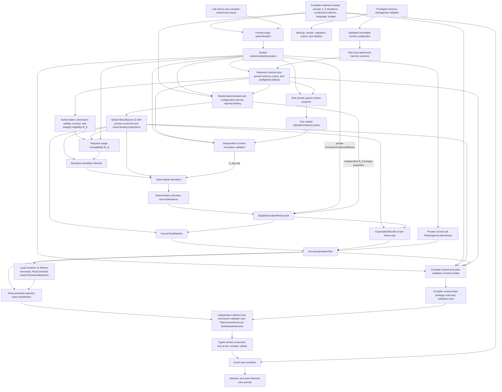

# V1 delivery program

Status: Proposed

## Purpose

This specification turns the accepted V1 product direction into an ordered,
reviewable, and evidence-gated delivery program from research through shipment.
It inventories the current repository truth, assigns one owner to every
contract, records consolidation decisions, defines work-package interfaces,
maps every product requirement to implementation and evidence, and fixes the
dependency and promotion order.

It is not evidence that V1 works and is not permission to implement the entire
architecture at once. A later work package may begin only when its entrance
criteria are met. A simpler component that passes the same gate remains
preferred over a more complex one. A failed premise, safety boundary, or
resource gate stops or narrows the program instead of being hidden by schedule
pressure.

No software can be proved complete for every future environment. In this
program, **V1 complete** means that the frozen supported claim, configuration,
platforms, languages, and failure boundaries pass every named gate with
inspectable evidence and one reproducible release rehearsal. Everything
outside that envelope remains unsupported.

## Definitions

### Program states

| State | Meaning | Promotion condition |
| --- | --- | --- |
| `Proposed` | Contract or work package is documented but not selected or implemented | Focused review and any required accepted decision |
| `Selected` | Scope, owner, dependencies, interfaces, and gates are frozen for one implementation attempt | Entrance criteria and predecessor receipts pass |
| `Implemented` | Code and tests exist for the selected contract | Repository checks and package verification pass |
| `Evaluated` | Frozen implementation has a retained development or calibration receipt | Named component gate passes |
| `Qualified` | One exact artifact/configuration passes its promotion contract | Independent held-out or sealed gate passes |
| `Shippable` | One release candidate passes G0 through G10 | Signed shipment receipt and rollback rehearsal |
| `Stopped` | A mandatory premise or gate failed | New evidence-backed decision narrows, replaces, or ends the path |

These are delivery states, not specification statuses. A work package never
marks a specification `Validated` merely because code exists.

### Current repository inventory

The inventory at the start of this program is:

| Surface | Current truth | Maturity | Program treatment |
| --- | --- | --- | --- |
| `nemosyne-core` activation kernel | Deterministic ranking of already normalized evidence and inhibition signals with explanations | Experimental implementation | Preserve as a replaceable numerical primitive; do not call it the V1 retriever |
| `nemosyne-evaluation` | Deterministic evaluation of fixed activation parameters | Experimental implementation | Reuse for fixed-intermediate evidence only |
| `nemosyne-evaluation-corpus` | Small versioned coding-agent activation corpus | Experimental evidence | Retain as development regression data; never relabel as sealed V1 evidence |
| Product contract | One local read-only compile call returning attention plus byte-identical prompt | Proposed specification; historical Decision 0011 is superseded and its retained boundary is carried forward by Decision 0014 | Canonical observable V1 boundary |
| Numerical cognitive memory and focus | Hybrid exact/numerical memory and focus-candidate contract | Proposed specification; earlier terminal focus decision superseded | Canonical focus branch and memory representation boundary |
| Predictive attention | Transition evidence, alternatives, abstention, observation assessment, and support math | Proposed specification, accepted direction in Decision 0014 | Canonical expectation branch |
| Combined planning | One source-bound focus-and-expectation plan | Proposed specification, accepted direction in Decisions 0014, 0015, and 0016 | Canonical renderer-facing semantic object |
| Renderer | Local lexicalizer with exact slots and independent validation | Proposed specification, accepted direction in Decisions 0015 and 0016 | Must not become a predictor, answerer, or action planner |
| Compile-integrity boundaries | Aggregate-only query flow, exact same shared-set instance, distinct runtime/content/configuration identities, exact-byte collision checks, independent validation, closed errors, and no partial success | Proposed specification, accepted direction in Decision 0016 | Refines the 0014/0015 architecture without changing the observable result |
| Memory store, encoder, retriever, expectation kernel, planner, renderer, compiler, and CLI | Not implemented | Proposed only | Build in risk order after predecessor gates |
| V1 usefulness and resource claims | No end-to-end observations | Unproven | G1 headroom before broad implementation; G9 sealed evaluation before claim |

### Documentation ownership matrix

Each normative subject has one canonical owner. Other documents link to the
owner and may describe placement but must not redefine the contract.

| Subject | Canonical owner |
| --- | --- |
| Observable input, output, non-scope, and requirements `V1-R01..R25` | [`v1-product-contract.md`](v1-product-contract.md) |
| Component graph, callable API, CLI, persistence concept, trust boundary, resources, and release shape | [`v1-reference-architecture.md`](v1-reference-architecture.md) |
| Privileged management-adapter topology, authority boundary, and compile exclusion | [`v1-reference-architecture.md`](v1-reference-architecture.md); `MEM-03` is the implementation owner |
| Formal obligations, experiments, statistics, gates, and evidence receipts | [`v1-proof-program.md`](v1-proof-program.md) |
| Cognitive memory planes, numerical facets, activation preparation, consolidation, and `FocusCandidateSet` | [`cognitive-memory-activation-and-focus.md`](cognitive-memory-activation-and-focus.md) |
| `EligibleActivatedMemorySet` eligibility, completeness, lineage, and canonical order | [`predictive-attention-and-expectation.md`](predictive-attention-and-expectation.md); `COMP-01` is only its runtime builder |
| Transition schema, expectation equations, alternative families, uncertainty, abstention, and observation assessment | [`predictive-attention-and-expectation.md`](predictive-attention-and-expectation.md) |
| `FocusExpectationPlan`, roles, closure, cost, selection, controls, plan shapes, `PlanCanonicalEnvelopeV1`, and `PlanContentId` content domain | [`focus-and-expectation-planning.md`](focus-and-expectation-planning.md) |
| Numerical-prefix bridge, exact slots, lexical generation, candidate identity sealing, substitution/validation, and renderer errors | [`vector-to-attention-renderer.md`](vector-to-attention-renderer.md) |
| Aggregate-only compile flow, independently provable shared-set instance, plan-semantic versus renderer configuration identity, authenticated renderer-configuration content equality, compiler pre-validation joins, closed error ownership, bounded ingress, and no partial semantic success | [Decision 0016](../decisions/0016-adopt-sealed-compile-integrity-boundaries.md), realized by the focused planning, renderer, reference-architecture, and proof specifications |
| Candidate-model cohort, training comparison, promotion thresholds, resource measurement, and deployment artifact | [`local-renderer-model-qualification.md`](local-renderer-model-qualification.md) |
| Existing activation equation and public Rust behavior | [`situation-conditioned-activation.md`](situation-conditioned-activation.md) |
| Fixed-parameter activation evaluation | [`activation-parameter-evaluation.md`](activation-parameter-evaluation.md) |
| Revision-1 activation corpus | [`curated-activation-evidence.md`](curated-activation-evidence.md) |
| Delivery order, work-package interfaces, traceability, risks, and shipment process | This specification |
| Historical rationale | `docs/decisions` |
| Implemented public API | Rustdoc |
| Executable behavior | Tests and retained evidence receipts |

### Consolidation record

Three consolidation passes govern this document set.

| Pass | Conflict or duplication | Resolution |
| --- | --- | --- |
| Semantic | Focus, expectation, goal, action, answer, fact, confidence, and probability were easy to collapse in prose | Canonical distinct types in the predictive-attention specification and requirement `V1-R15` |
| Semantic | “Expectation” could mean one guessed outcome | Finite competing hypotheses grouped only by explicit mutually exclusive alternative family, with unknown and omitted support |
| Semantic | A normalized score could be described as probability | Rename it family-relative evidence share and prohibit probabilistic interpretation until a separate calibrated model passes |
| Semantic | An observed action in a transition could be rendered as advice | Conditions and actions remain distinct; V1 selects no action |
| Architecture | Decision 0011's focus-only product semantics no longer covered qualified prediction | Decision 0011 is superseded by Decision 0014; its local, read-only, one-result, and prompt-integrity boundaries are retained explicitly |
| Architecture | The earlier terminal `AttentionPlan` was focus-only | Decisions 0012 and 0013 are superseded; focus and expectation branch from one shared set and join in `FocusExpectationPlan` |
| Architecture | Focus pruning could erase transition evidence before prediction | Branch from the complete eligible activated set before final plan selection |
| Architecture | Separate renderer calls could diverge | One combined plan, one lexicalization pass, one validator boundary |
| Architecture | Request authority was attached to `Compiler::open` or exposed as a caller-constructible compile input | `Compiler::open` accepts only a bounded untrusted installation locator and resolves bootstrap trust, registries, and platform handles itself; each public `compile` accepts only bounded untrusted `CompileCallClaims`, and the compiler-owned platform authenticator derives a fresh crate-private `InvocationContext` |
| Architecture | The earlier private-authentication refinement exposed independently mixable projections and overloaded content binding as call identity | One sealed crate-private `AuthenticatedInvocation` owns the complete retained request, authenticated comparisons, trusted authorization time, and fresh runtime-instance brand; downstream private projectors borrow the aggregate, while one separate nonserializable `InvocationInstanceWitness` preserves call membership without changing semantics |
| Architecture | A free configuration path could bypass installation trust | CLI selects only an authenticated installed configuration identity |
| API | Configuration fingerprint appeared as a second product result | `CompiledPrompt` exposes only compiled bytes; privileged receipts are separate |
| Delivery | Atomic stdout was claimed for an external stream | Buffer before delivery, report exit `10`, and require callers to discard possible partial bytes |
| Mathematical | Compatible outcomes shared one denominator | Normalize only within explicit mutually exclusive alternative families |
| Mathematical | Duplicate and correlated records could multiply support | Content canonicalization plus one bounded support budget per dependency group and family |
| Mathematical | Missing facets and numeric zero were indistinguishable | Retain presence masks and coverage diagnostics even where numerical support is zero |
| Mathematical | Later observation could implicitly rewrite prediction support | Offline assessment uses immutable fixtures; product recomputation requires separately managed evidence and a new explicit compile |
| Mathematical | Planning required an abstention proposition that the expectation set did not supply | Define one exclusive, content-identified, source-bound `FrameAbstentionCandidate` with complete reason/control closure |
| Mathematical | Renderer cost could enter feasibility without a total finite comparison domain or distinguish optional infeasibility from mandatory failure | Define checked nonnegative integer cost domains, empty identities, complete supported-domain bounds, optional infeasibility, mandatory minimum failure, and renderer-owned bound violation |
| Architecture | Bundle serialization order or request-local IDs could silently become semantic planning priority | Keep serialization keys order-only; define static semantic frame, family, and role classes plus separate planning-priority keys |
| Data contract | Transition status and uncertainty had duplicate or undefined ownership | Define complete state/outcome observations, one status field per observation, and distinct observation versus transition uncertainty |
| Mathematical governance | Cross-document notation duplicated formulas and reused symbols | Establish one global notation and derivation-owner registry; focused specifications own formulas and other documents link |
| Mathematical governance | Later refinements left cue absence, graph expansion, executable floating-point normalization, and effective-denominator notation underspecified | Use disjoint present/absent cue states, canonical bounded breadth-by-depth expansion, exact binary-rational accumulation with pinned binary64 division, distinct denominator symbols, and closed typed failures |
| Semantic identity | Frame-local controls and exact values could collide or leak content into model-visible identities | Use one closed frame-qualified expectation-control key domain; let branches carry only a value-, lineage-, and request-independent `ExactSlotOwnerSemanticDescriptor`, let planning alone verify and map that descriptor to `ExactSlotOwnerSemanticKey`, and group exact slots only by the complete `(ExactSlotOwnerSemanticKey, ExactSlotSemanticLocator)` pair; exact content and request-local instances remain privileged sidecars, never semantic or tensor identities |
| Security and validation | Separately supplied query projections, a self-validating signal context, a validator-visible invocation witness, or an injectable validation result could create mixed-call or stale-call joins | Pass one sealed `BoundQuery` aggregate to every downstream boundary, validate the single projected signal context independently against the current sealed invocation, let the compiler alone consume the plan witness and own the private context/product callsite, and expose only a one-way least-privilege read-only view to a no-compiler-dependency validator |
| Compile integrity | Lifetimes, digest equality, reconstructed branch inputs, and an overloaded configuration/content identity could not prove one coherent compile | Decision 0016 requires aggregate-only `BoundQuery`, independent invocation and set-instance witnesses, a \(K_R\)-independent `PlanContentId`, separately authenticated `RendererConfigurationId` plus exact canonical \(K_R\) content, exact-byte collision comparison before independent validation, closed typed ownership, bounded ingress, and no partial semantic success |
| ML research | Parallel learned-predictor slots lacked a typed semantic boundary | Define candidate, abstention, and null slots with frame, horizon, logits, dispersion, and source-attribution constraints without adopting the model |
| Delivery | Implementation order followed component familiarity rather than premise risk | Headroom and evidence harness precede broad architecture implementation |

The consolidation claims above are backed by named source-pass records for
this proposed revision. They become immutable receipts only when the final
`DOC-00` merge receipt binds their reviewed blob and the required independent
reviews:

| Receipt / status | Pass and reviewed scope | Before → after evidence | Reviewer independence and disposition |
| --- | --- | --- | --- |
| `CONSOL-01` / Source pass | Semantic and mathematical pass over product, memory, predictive, planning, renderer, evaluation, and proof contracts | Ambiguous focus/expectation/action/fact/probability terms and duplicated notation → one ownership matrix, distinct types, global notation and trace links; native versus migrated reliability semantics are explicit in `FND-039`, private authority is absent from situation semantics under `FND-046`, coverage uses only positively attributed visible positions under `FND-049` and `FND-055`, non-vacuous threshold domains are explicit under `FND-051`, `FND-054` plus `FND-058` separate pure \(Q_{\mathrm{num}}\) from exact bound \(Q\), `FND-063..066`, `FND-071..078`, and `FND-080` close the later query, stage-noninterference, cue, graph, executable-arithmetic, control-key, exact-slot, social-comparison, and empty-domain refinements, `FND-081..087` close aggregate-query, focus-input, slot-owner, error-classification, witness, and shared-set ambiguity, and `FND-088..127` close remaining aggregate, candidate/content/configuration identity, exact-value, estimand-domain, activation-workspace, renderer-resource, opaque-render, executable G1/G9, exact-slot, shared-set, substitution-error, canonical-envelope, and evidence-receipt gaps; `FND-117..121` close finite G1 threshold domains, distinct leakage estimands, the G9 population relation, complete gate propagation, and \(I_E\) receipt reconstruction, `FND-122..126` close renderer-configuration binding, collision comparison, exact shared-object wording, typed error/cost ownership, and the missing durable decision, and `FND-127` separates pre-access rejection receipts from full valid-experiment receipts. `FND-131..134` then separate \(K_S\) from \(K_R\), make exact shared-set routing independently provable, replace unenforceable referent identity with authenticated canonical-content equality, and restore substitution-only budget ownership. `FND-137..140` complete dual-witness propagation, require renderer ID-plus-content equality everywhere, separate runtime full-configuration lineage from canonical \(K_S\), and restore substitution-only exact budget enforcement; `FND-145` and `FND-149` close the last focus/planning dual-witness omissions, and `FND-151` restores view-only formal validation notation; conflicts remain in the finding ledger | Principal-architect pass; independent confirmation pending `REV-02`, `REV-03`, `REV-04`, `REV-09`, `REV-10`, `REV-12`, and `REV-17` |
| `CONSOL-02` / Source pass | Architecture/API pass over component graph, authority, interfaces, API/CLI, persistence, renderer and release | Overlapping shared-set/focus, compiler/CLI, validator/qualification and authorization/shipment ownership → split packages and sole interface owners `FND-027..031`, `FND-036..037`; trust boundary, cancellation, complete-request binding, ingress identity, authority-free planning, sole ingress ownership, narrow combined-planner inputs, explicit exact-surface projection, unique diagram identities, and one authentication/control-resolution order close through `FND-040..047`, `FND-052..057`, `FND-059`, and `FND-060`; `FND-061..100` close complete-call retention, sealed invocation/query ownership, aggregate anti-mixing, current-call validation, private witness propagation/erasure, semantic identities, total errors, exact-value-free descriptors, compiler-private validation-context ownership, and one-way no-injection validation; `FND-104..127` close the G9 lifecycle, canonical plan-content identity, G1/G9 controls, exact-slot ownership, exact same shared-set branch input, separately sealed `RendererConfigurationId`, exact-byte collision joins, eleven substitution variants, substitution-owned renderer cost, Decision 0016, no partial success, and the receipt split. `FND-128..136` clarify overlapping milestone semantics, fixture-versus-runtime producer timing, mandatory critical-path joins, \(K_S\)-only plan identity, exact set-instance witnessing, authenticated \(K_R\) content equality, sole budget ownership, absolute bounded ingress, and truthful transport-prefix failure semantics. `FND-137..151` reconcile both branch witnesses, renderer ID-plus-content commitments, planning's runtime/canonical configuration split, cost ownership, implementable ingress allocation boundaries, valid producer-consumer timing, optional-path wave semantics, and the validator's least-privilege type, comparison, formal-notation, and verifier-input boundary across every active surface, plus source-appropriate ingress complexity | Principal-architect pass; independent confirmation pending `REV-01`, `REV-05..09`, `REV-11`, `REV-13`, `REV-15`, and `REV-16` |
| `CONSOL-03` / Source pass | Delivery/evidence pass over packages, dependencies, gates, risks, decisions, reviews and shipment | Prose roadmap and checklists → normalized package records, DAG, critical paths, milestones, waves, registers, review plan, trace schema and release state machine `FND-016..019`, `FND-026`, `FND-032..035`, `FND-038`; stale conformance claims append receipts under `FND-048`, evaluator complexity includes its per-scenario canonicalization under `FND-050`, and current reconciliation is mapped by `FND-061..151` plus append-only `DOC-CONF-06..21`; `FND-103..127` pin the candidate-independent G9 lifecycle, complete G1/G9 controls, exact-slot/shared-object/error/identity contracts, and receipt split; `FND-128..130` reconcile milestone overlap, schema-fixture timing, and critical-path joins; `FND-131..136` propagate the plan/configuration/ingress/transport integrity corrections; `FND-137..143` close the dual-witness, renderer-content, planning-identity, budget, ingress, interface-timing, and optional-wave audit findings; `FND-144` removes the last global-barrier implication from the wave table; `FND-145..151` close the final active architecture/API/formal surface gaps without changing the graph | Principal-architect pass; confirmation pending `REV-04`, `REV-10`, `REV-14`, `REV-17`, and `REV-18`; all empirical choices remain Open |

The merge receipt converts these source passes into content-bound receipts. A
later semantic, architecture, or delivery change appends a new consolidation
receipt and never rewrites the bound result.

### Research evidence ledger

Research informs hypotheses and constraints; it does not validate Nemosyne's
implementation or prove biological fidelity.

| Claim used by the program | Source and evidence type | Engineering implication | Limitation and non-proof |
| --- | --- | --- | --- |
| Episodic remembering and imagined future construction recruit overlapping memory systems | Addis, Wong, and Schacter 2007, primary fMRI experiment, “Remembering the past and imagining the future” | Test whether retrieved episode structure can support future-state hypotheses | Neural overlap does not specify a software schema, equation, or benefit |
| Mnemonic prediction errors can bias hippocampal state representations | Bein, Duncan, and Davachi 2020, primary behavioral/neuroimaging experiment, “Mnemonic prediction errors bias hippocampal states” | Preserve transition, temporal, and context structure and test error-sensitive alternatives | Laboratory effects do not prove coding-agent utility |
| Successor-like representations can guide prediction of future events | Ekman, Kusch, and de Lange 2023, primary experiment, “Successor-like representation guides the prediction of future events in human visual cortex and hippocampus” | Treat activated memory as one input to expectation formation | Does not justify treating support as probability or truth |
| Prospection and constructive memory are related but fallible | Buckner 2010 and Schacter et al. reviews | Preserve alternatives, uncertainty, and abstention | Reviews motivate questions; they do not select thresholds |
| Predictions can transform later memories | Bein et al. 2023 review, “Predictions transform memories” | Separate prediction output from independently authorized observation and memory management | Does not imply V1 should learn automatically |
| Attention and expectation can have distinct effects | Alink and Blank 2019 primary experiment plus Summerfield and Egner review | Keep focus and expectation as separate branches and evaluate their interaction factorially | Experimental definitions vary by task and do not establish Nemosyne's ontology |
| Predictive-processing evidence is mixed and theory-sensitive | Walsh et al. review | State falsifiable software hypotheses and negative controls rather than a universal brain claim | No conclusion about the exact V1 mechanism |
| Set models can represent unordered evidence with learned interactions | Lee et al. 2019, Set Transformer | Retain a learned set predictor as a later comparison after the deterministic baseline | Architecture capacity is not evidence of calibration or superiority |
| Neural confidence is often miscalibrated | Guo et al. 2017 | Never expose model scores as probabilities without a frozen calibration protocol | Classification calibration results do not automatically transfer to expectation sets |
| Distance-aware methods can improve out-of-distribution detection | Sun et al. 2022 | Measure novelty and selective abstention separately from support | OOD score quality is dataset- and representation-specific |
| Selective prediction requires explicit coverage-risk tradeoffs | Gangrade et al. 2021 | Gate positive expectations and report abstention by reason | Theory assumptions may not match generative downstream tasks |
| Local small language models and multilingual checkpoints exist | Official Qwen3 release materials | A local lexicalizer is technically testable | Advertised language support and benchmark scores do not qualify the renderer |
| SQLite supports transactions, WAL, backup, and integrity checks | Official SQLite documentation | It is one viable local persistence candidate to evaluate | Base SQLite does not provide encryption at rest; storage selection remains open |

### Canonical architecture wireframe



The compile path has read-only capabilities. Provisioning, memory management,
artifact installation, training, calibration, and evaluation are separate
offline or privileged paths. `MEM-03` owns the privileged management-adapter
boundary; the compiler dependency graph cannot construct or receive that
adapter.

Renderer and validation lifetimes prevent a candidate or context from
outliving its borrowed plan and prevent unchecked detachment; they do not
prove that two borrows refer to the same object. The deterministic
`PlanContentId` derived from complete canonical plan content is the sole
candidate-to-plan content identity. The independently sealed
`RendererConfigurationId` identifies the exact authenticated \(K_R\), which
contains every renderer implementation, artifact, tokenizer, lexical
grammar/model, precision, decoding, platform-dependent execution selection,
resource limit, and other field capable of changing emitted bytes. Equal
configuration IDs therefore imply byte-identical deterministic output for
equal plan content; a target-platform class groups claims only and is not an
execution identity. Separately constructed canonical-content-identical plans
and their candidates are interchangeable only when \(K_R\) also matches and
must then yield identical substitution, validation, and product bytes. The
compiler quarantines equal `PlanContentId` with different retained canonical
bytes before validator entry; the independent validator owns ordinary
candidate/validation-view `PlanIdentityMismatch` and
`RendererConfigurationMismatch`.

`API-01` authenticated preflight is the sole trust-establishing constructor of
immutable shared-domain `AuthenticatedRendererConfiguration` values. Renderer
construction, exact substitution, compiler context construction, and
independent validation receive authenticated values whose
`RendererConfigurationId` and exact canonical \(K_R\) bytes both equal the
preflight selection. Reborrowing the same value is the normal implementation,
but referent identity is not the contract: a separately authenticated
canonical-content-identical value is equivalent, while a projection, narrower
reconstruction, unauthenticated value, or same-ID/different-byte value fails
closed. The value exposes bounded byte-affecting state and no trust-resolution,
update, filesystem, network, registry, installation, or artifact-mutation
capability.

### Work-package contract

Every work package is one normalized record joined by `id` across the full work
breakdown, execution metadata, responsibility, verification, dependency, and
gate registries in this specification. Absence is never inferred: an
inapplicable field is written as `none` with a reason. All packages in this
revision are `Proposed`; changing one to `Selected` requires its named entrance
receipt, an accountable human assignment, and any required accepted decision.

The canonical record is:

```text
WorkPackage
├── id, concise title, status, work type, priority, milestone, and target date
├── owner role and accountable human (`unassigned` until selection; no target
│   date before a human and high-confidence estimate are recorded)
├── objective, user value, and architecture value
├── product requirements and canonical specifications
├── accepted decisions or explicitly open decision
├── explicit predecessors, entrance receipts, and unlocked successors
├── exact scope and non-scope
├── versioned interfaces and artifacts consumed and produced
├── likely files or crates
├── documentation, mathematical, API, and migration impact
├── deterministic tests, adversarial cases, benchmarks, and proof obligations
├── security and privacy review
├── failure behavior and rollback or deletion path
├── measurable acceptance criteria and evidence required before merge
├── complexity estimate and estimate confidence
├── parallel lane and authority-surface conflicts
├── normal or stacked pull-request mode and stack parent
└── contributed gates and residual risks
```

A package is the smallest mergeable unit whose behavior, tests,
documentation, and rollback remain coherent. A pull request may implement one
package or a tightly coupled pair only when the dependency table explicitly
permits stacking. It may not combine an upstream experiment with downstream
production adoption before the evidence is reviewed.

`WorkType` is one of `Documentation`, `Decision`, `ResearchSpike`,
`Implementation`, `Evaluation`, `Qualification`, `Integration`,
`Verification`, or `Release`. Complexity is independently one of `S`, `M`, or
`L`; a research spike is not itself a complexity estimate. Every estimate also
states `low`, `medium`, or `high` confidence. A low-confidence estimate is
planning metadata, not permission to expand scope, and must be replaced by a
measured estimate before selection.

Two packages may share a parallel lane only after all predecessors pass and
only when the parallel-safety registry shows no incompatible edit to the same
authority surface. A stacked pull request is never a substitute for an
unpassed gate.

### Full work breakdown

#### Foundation and premise

| ID | Concise title, objective, scope, and non-scope | Depends on | Acceptance and exit evidence | Contributes to |
| --- | --- | --- | --- | --- |
| `DOC-00` | **Re-found the V1 contracts.** Reconcile product, architecture, mathematics, renderer, proof, and delivery documents; add Decisions 0014, 0015, and 0016; supersede Decisions 0011–0013 without rewriting history; retain conflict and ownership maps; no production code or selected empirical threshold | None | Documentation checks, three consolidation receipts, eighteen signed independent review receipts, and committed-blob manual conformance receipt | G0 |
| `EVD-01` | **Establish the evidence envelope.** Implement the sole versioned experiment-manifest and two disjoint immutable receipt schemas: a minimal `PreAccessRejectionReceipt` over an opaque attempt identity; exact attempted bytes and digest or a bounded parse prefix with failing field; only established identities; one closed reason and validation stage; verifier, validation implementation, hardware, OS, and time identity; and proof of no outcome access or arithmetic; and a full reconstructible `ValidExperimentReceipt` only after `ValidForOutcomeAccess`. Preserve semantic-lineage split, failure retention, baseline runner, and deterministic analysis skeleton; no product algorithm | `DOC-00` | Golden valid receipts and minimal rejection receipts; prove rejected attempts cannot claim a signed valid G1 envelope, G9 protocol, or G9 run-manifest identity, fabricate absent fields, contain outcome dispositions, or enter analysis; prove a valid G9 protocol alone grants no outcome access and creates no full experiment receipt; envelope migration tests and reproducible failed and inconclusive valid runs | G2 and evidence entrance |
| `TGT-00` | **Freeze the G1 evaluation envelope.** Before outcomes are visible, freeze target population and sampling frame, task taxonomy, downstream-agent and language cohort, margins, multiplicity, harm, anchoring, four separate answer/action/fact/probability-leakage domains and limits, subgroup rules, exclusions, analysis identity, design weights, and the closed expert-authored conditions `g1_prompt`, `g1_situation`, `g1_focus`, `g1_correct`, `g1_wrong`, and `g1_abstain`. Freeze `g1_prompt` as original prompt only; `g1_situation` as that prompt plus the same situation/metadata and no persistent memory; `g1_focus` as expert focus only; and the remaining conditions as that identical focus plus, respectively, one correctly qualified expectation, one deliberately wrong dominant expectation with otherwise matched qualification, or explicit renderer-visible abstention. The four expert-attention conditions must share independently authored focus, language, placement, effective budget, and attention-token count, changing only the expectation intervention. Freeze the complete headroom domain \(\mathcal T_H^{(\mathrm{G1})}=I_D^{(\mathrm{G1})}\uplus I_I^{(\mathrm{G1})}\), positive pre-outcome design weights, exposure minima, binary outcomes, the two baseline-specific \(\Delta_{F,b,d}^{(\mathrm{G1})}\), population-harm \(h_{F,b,d}^{(\mathrm{G1})}\), conditional-reversal \(h_{F,b,d\mid b}^{(\mathrm{G1})}\), and their superiority, non-inferiority, harm, reversal, subgroup, and multiplicity thresholds. For every \(b\in\{P,S\}\) and \(d\in\{D,I\}\), require all thresholds to be finite with \(0<\delta_{F,b,D}^{\min,(\mathrm{G1})}<1\), \(0<\delta_{F,b,I}^{\mathrm{NI},(\mathrm{G1})}<1\), \(0<h_{F,b,d}^{\max,(\mathrm{G1})}<1\), and \(0<h_{F,b,d\mid b}^{\max,(\mathrm{G1})}<1\); a missing, nonfinite, zero, negative, or out-of-domain value prevents construction and signature of a valid `IF-G1-ENVELOPE` before outcome access and yields only a `PreAccessRejectionReceipt`. Predeclare correct-expectation contribution (`g1_correct - g1_focus`) and wrong-sensitivity comparisons (`g1_wrong` versus `g1_correct` and `g1_abstain`) over a prospectively frozen \(I_E^{(\mathrm{G1})}\subseteq I_D^{(\mathrm{G1})}\) with positive task, independent-cluster, and required-subgroup exposure. Never alias any G1 domain, case, variant, label, outcome, weight, threshold, or estimand with G9; no operational or release claim | `EVD-01` | Independently reviewed, content-identified G1 manifest with pre-outcome signatures, the six-label injective condition map, matched expert-condition invariants, frozen construction/token matching, complete G1 domain membership/weights/formulas/finite threshold domains, four distinct leakage estimands, expectation-branch estimands, exposure minima, multiplicity/anchoring/harm rules, lineage-disjointness, and unsupported cases; rejected attempts retain only the minimal no-access receipt and never a valid manifest identity | G1 entrance |
| `EVD-02` | **Test product headroom.** Execute exactly the six `TGT-00` expert-authored conditions and reconstruct separately for both \(I_D^{(\mathrm{G1})}\) and \(I_I^{(\mathrm{G1})}\): `g1_focus` versus each of `g1_prompt` and `g1_situation` using \(\Delta_{F,b,d}^{(\mathrm{G1})}\), \(h_{F,b,d}^{(\mathrm{G1})}\), and \(h_{F,b,d\mid b}^{(\mathrm{G1})}\); `g1_correct - g1_focus` over \(I_E^{(\mathrm{G1})}\); and `g1_wrong` versus each of `g1_correct` and `g1_abstain`, including the frozen contribution, harm, anchoring, and four separately reconstructed answer/action/fact/probability-leakage estimands. Before opening outcomes, verify the matched expert-focus/language/placement/effective-budget/attention-token-count invariants, injective role map, frozen memberships, pre-outcome weights, exposure minima, and every finite strict threshold domain; an invalid envelope is rejected and is not an observed `Inconclusive` result. After a valid envelope opens, classify every missing, invalid, empty, zero-denominator, or underexposed required condition, domain, subgroup, \(I_E^{(\mathrm{G1})}\), \(I_D^{(\mathrm{G1})}\), or \(I_I^{(\mathrm{G1})}\) cell before affected normalization/arithmetic as `Inconclusive`, leave its estimate and interval absent, perform no division, preserve the G1 root for audit only, and do not tune or reuse any G1 case, variant, label, outcome, weight, threshold, or estimand in G9 | `EVD-01`, `TGT-00` | Blinded six-condition labels and one retained pass, fail, or `Inconclusive` G1 receipt with separate domain-specific headroom, harm, reversal, correct-contribution, wrong-versus-correct, wrong-versus-abstain, and four leakage outputs against every frozen threshold, exposure, multiplicity, anchoring, harm, and matching rule; invalid-envelope rejection has no outcome access | G1 |
| `BND-01` | **Encode formal boundary fixtures.** Implement executable fixtures for authorization, snapshots, exact slots, transition alternatives, abstention, plan roles, and prohibited capabilities; select no implementation technology | `EVD-01` | Every F1–F17 obligation has at least one positive fixture and one counterexample | G2 |
| `TGT-01` | **Freeze the operational envelope.** After G1, freeze a supported subset of the `TGT-00` task, agent, and language cohort, hardware and OS cohort, installation and redistribution profile, process topology, model-residency policy, deterministic inference boundary, offline boundary, measurable resource ceilings, and exact finite positive `AbsoluteIngressLimitsV1` ceilings for every prompt source plus aggregate request bytes. Installed configurations may only lower those public context-independent limits; select no model, storage engine, or semantic algorithm | Passing G1 receipt from `EVD-02` | Accepted operational-envelope decision and content-identified conformance manifest with unsupported cases and exact absolute ingress ceilings | G3 entrance |
| `SEC-00` | **Freeze the security architecture.** Select principals, prompt origin, trust roots and rotation, request authority, snapshot revocation, capability/process graph, no-network enforcement, management and diagnostic authority, secrets, and failure posture before production code | `BND-01`, `TGT-01` | Accepted threat model and security decision, misuse cases, boundary fixtures, and zero unresolved architecture-level critical finding | G3 entrance |

#### Dependency-light semantics

| ID | Concise title, objective, scope, and non-scope | Depends on | Acceptance and exit evidence | Contributes to |
| --- | --- | --- | --- | --- |
| `CORE-01` | **Implement canonical primitives.** Inventory and reuse the existing public `CandidateId`, `ChannelId`, `UnitInterval`, and evaluation-owned `ScenarioId`; add only nonduplicative validated identifiers, finite values, presence states, schema and configuration identities, provenance roots, dependency groups, authority labels, and canonical ordering; no storage or runtime model | Passing G1 receipt from `EVD-02`, `BND-01` | Public-contract, old/new-path compatibility, deprecation, downstream compile, arbitrary-order, primitive-duplication, and dependency tests | G3 entrance |
| `CORE-02` | **Implement shared domain records.** Add request, situation, memory-facet, exact-sidecar-reference, versioned source-tagged social-identity, opaque `SignalDerivationContext`, validated `SignalValues`, spreading-graph, `EligibleActivatedMemorySet`, private noncloneable `EligibleSetInstanceWitness<'call>`, `SemanticConfigurationId`, `PlanSemanticSourceProjectionV1`, and public `AbsoluteIngressLimitsV1` domain contracts. The signal context exposes no public constructor or authority-bearing field; only validated values expose read-only signal inputs; ingress limits are finite, positive, versioned, and can only be narrowed by installed configuration; no authentication aggregate, encoding, retrieval, signal algorithm, or shared-set construction | `CORE-01`, `SEC-00` | Cross-object lineage, authority, social-schema/source-tag, signal-context field/privacy, graph-shape, invalid-state, brand-erasure, canonical-order, set-witness privacy/nonsemantic behavior, \(K_S/K_R\) projection, and ingress-limit validation tests | G3 entrance |
| `EVAL-01` | **Implement typed evaluation payloads.** Add generic case, split, metric, comparison, and payload types inside the `EVD-01` receipt envelope; do not redefine the envelope or add runtime dependencies | `EVD-01`, `CORE-01` | Deterministic payload reconstruction and permutation tests | G3 entrance |
| `EVAL-02` | **Govern evaluation corpora.** Add a counterexample-corpus registry with semantic-root split enforcement and coverage reports; do not admit model-generated truth | `EVAL-01`, `BND-01` | Leakage rejection, corpus-inventory, and content-identity receipts | G3 entrance |

#### Predictive semantics and planning

| ID | Concise title, objective, scope, and non-scope | Depends on | Acceptance and exit evidence | Contributes to |
| --- | --- | --- | --- | --- |
| `EXP-01` | **Implement predictive domain contracts.** Add transition, condition, horizon, outcome, status, alternative-family, query, and typed `TransitionReliability { schema, state, migration }` records; `ReliabilityState` is exactly `Derived { value, derivation, calibration_domain }`, `Missing`, `Unknown`, or `Inapplicable`; optional migration lineage lives on `TransitionReliability` and binds the migration ID, exact source record revision/schema, typed `ReliabilityMigrationSource`, and source-state digest; no prediction algorithm or compile-time auto-migration | `CORE-02`, `EVAL-02` | Constructor, state-identity, derived `0`/`1`, unavailable-state, malformed-identity, schema/domain compatibility, every source/target-state migration, malformed source-state metadata, exact rollback, stale/missing/mismatched migration, contradiction, exclusivity, and lineage tests | G3 and G7 |
| `EXP-02` | **Implement the deterministic expectation baseline.** Consume the complete sealed shared set and propagate both its invocation-instance and set-instance witnesses unchanged. Add typed reliability admission before \(\alpha\), piecewise \(\alpha\) with no fabricated neutral reliability, hard eligibility, facet compatibility, dependency budgets, grouping, medoids, relative support, diagnostics, finite alternatives, abstention, distinct lineage-bearing instance versus lineage-independent `ExpectationItemSemanticKey` identities, and one closed frame-qualified `ExpectationControlSemanticKey` union; define \(E_{\mathrm{cov}}\) by the coverage threshold and compute \(\Gamma\)/novelty maxima only over \(E_{\mathrm{cov}}\), with distinct empty-\(E\) and empty-\(E_{\mathrm{cov}}\) behavior; no learned predictor or probability | `EXP-01` | Hand calculations, both-witness propagation, same-call reconstructed-set distinction, reliability-admission failures, item/control semantic-key collision, cross-frame control collision, lineage-renaming, split-maxima counterexample/oracle, no-qualified-coverage, F13–F16 properties, and exhaustive small-case oracle | G3 and G7 |
| `EXP-03` | **Evaluate expectation semantics.** Add a versioned evaluator and curated corpus for alternatives, dependence, typed reliability compatibility/migration/lineage, unknown support, abstention, later observations, numerical boundaries, empty qualified coverage, and split maxima; no runtime calibration | `EXP-02`, `EVAL-02` | Reproducible reports; incompatible reliability schema/domain, missing/unknown/inapplicable, registered/unregistered migration, exact-lineage, high-coverage/distant plus low-coverage/near counterexamples; and two intentionally different kernel configurations | G3 and G7 |
| `PLAN-01` | **Construct focus candidates.** Own `deriveRequestPropositions(&BoundQuery, &EligibleActivatedMemorySet<'call>, K)`, its ephemeral `RequestPropositionSet`, five-field receipt copied solely from the shared set's \(\Lambda_A\), both private invocation-instance and set-instance witnesses preserved solely from that complete set, pure authority-lowering source mapping, the complete `FocusCandidateSet`, and request-local/memory-supported compatible-proposition consolidation over the one complete frozen activated input produced by `COMP-01`; receive no independently supplied \(Q_{\mathrm{num}}\), \(B_Q\), \(\Lambda_A\), witness, principal, policy object, authorization view/service, or direct authorization projection and perform no current-call or selected-set witness validation, authorization, expectation derivation, final budget selection, shared-set construction, or persistent write | `CORE-02`, `EVAL-02`, `SIT-01`, `COMP-01` | Sealed-aggregate construction and no-auth dependency, mandatory `COMP-01` predecessor, whole-query and whole-shared-set input tests, compile-fail split-projection/witness inputs, fixed-\(B_Q\) noninterference under permitted nonsemantic instance changes, malformed/different whole-query join rejection, mismatched request/situation/configuration, prompt/situation/metadata locator/content binding, five-field receipt lineage, both-witness preservation without current-call/selected-set classification, same-call reconstructed-set distinction, all twelve typed proposition reasons, duplicate, conflict, authority-ceiling, provenance, bounded-candidate, and empty-memory situation-only focus tests | G4 entrance and G7 |
| `PLAN-02` | **Select the combined plan.** Add `FocusExpectationPlan`, branch-tagged `PlanItemSemanticKey`, `RelationSemanticKey`, mandatory closure, exhaustive reference selector, cost contract, plan shapes, controls, immutable branch-owned `PlanningSourceProjection` fields, `PlanSemanticSourceProjectionV1`, `SemanticConfigurationId`, one compiler-private `PlanningInvocationScope` independently borrowed from both the current sealed invocation and the exact selected shared set, and a minimized permissionless exact-surface inventory with content-independent semantic slot assignment. Validate each branch's invocation and set-instance witnesses against that scope before copying only the scope's invocation witness into the live plan; branch-to-branch agreement alone is insufficient and the set witness is erased after the join. Canonical plan identity uses \(K_S\), \(d_R\), \(d_S\), and selected lineage-independent semantics, excluding full configuration-bound IDs, \(B_Q\), \(\Lambda_A\), \(K_R\), and both instance witnesses. Owning focus or expectation constructors reject invalid descriptor construction/schema/shape as typed `InvalidExactSlotSemanticDescriptor` before admitting a branch projection. Accept only admitted pre-planning `ExactSlotOwnerSemanticDescriptor` values that exclude exact value, surface bytes/content identity, and lineage/request-local identities; for every selected item-owned binding independently derive its owner descriptor from the fixed source item's non-slot semantics, reject inequality after admission as `SourceProjectionViolation`, and perform the sole `mapExactSlotOwner` conversion to `ExactSlotOwnerSemanticKey`. Reserve ordinary `InvalidExactSlot` for a planning-owned locator, mapped-owner, or plan-shape failure after source equality passes. Group mapped exact bindings only by `(ExactSlotOwnerSemanticKey, ExactSlotSemanticLocator)` before constructing `SlotSemanticKey` and contiguous renderer-slot identities. Consume no principal, policy service, authorization/disclosure view, live grant, caller-supplied final owner/slot key, or lexical generator, and perform no optimized approximation | Passing G3 receipt from `EXP-03`, `PLAN-01` | Exact small-fixture oracle; paired valid same-content calls; distinct valid invocation/set witnesses and corresponding nonsemantic instance identities; missing, mixed, expired, foreign, mutually agreeing foreign, and same-call reconstructed-set rejection against independently anchored scope; \(K_R\)-only/full-bound-ID noninterference for `PlanCanonicalEnvelopeV1`/`PlanContentId`; \(K_S\) sensitivity; equal-priority one-of-two selection; item/control/relation semantic-key collision; upstream invalid descriptor construction/schema/shape retaining `InvalidExactSlotSemanticDescriptor`; exact-value-free valid item/shared owner-descriptor mapping; independent non-slot owner rederivation; admitted owner-descriptor mismatch as `SourceProjectionViolation → InternalInvariantViolation → 70`; planning-owned locator/mapped-owner/shape failure as `InvalidExactSlot`; cross-item descriptor attachment rejection; recursion avoidance; compile-fail upstream final-owner/final-slot inputs; owner/locator grouping and same-locator/different-owner coexistence; conflicting complete owner/locator pair; ceiling-meet/lowering; source projection; and exact-value noninterference only under fixed type, final owner key, locator, role, bounds, complete semantic bindings, schema, and formatter; exact-value-independent slot key/ID/order/tensor identity, inventory minimization, ambient-authority noninterference, every closed `PlanningError` disposition, budget, alternatives, control-only, and no-action tests | G4 entrance and G7 |

#### Renderer feasibility

| ID | Concise title, objective, scope, and non-scope | Depends on | Acceptance and exit evidence | Contributes to |
| --- | --- | --- | --- | --- |
| `REN-01` | **Implement the deterministic renderer.** Add a multilingual controlled-template lexicalizer whose sole checked constructor borrows the complete plan and an authenticated immutable `AuthenticatedRendererConfiguration` \(K_R\), recomputes `PlanCanonicalEnvelopeV1`, seals its deterministic `PlanContentId`, private plan-byte comparison commitment, separate `RendererConfigurationId`, and private exact canonical-\(K_R\)-byte commitment, and produces opaque `RenderedAttention<'plan>`. The canonical plan envelope includes every product-relevant semantic/control/structural/cost/language/budget/exact-surface field and excludes witnesses, request-local/configuration-bound instance IDs, full configuration identity, receipt-only lineage, and renderer configuration. \(K_R\) binds every byte-affecting execution field; equal plan/configuration IDs plus equal canonical \(K_R\) content require byte-identical deterministic output, while target-platform class is claim grouping only. The lifetime prevents outliving or unchecked detachment but does not encode referent identity. Exact-slot substitution accepts a borrowed plan plus authenticated \(K_R\), compares configuration ID and exact canonical configuration content, then plan ID and retained plan bytes in fixed order before slots, copies both identities and commitments internally, and returns opaque `SubstitutedAttention<'plan>`. A separately authenticated canonical-content-identical \(K_R\) value is equivalent; projections, narrower reconstructions, unauthenticated values, and same-ID/different-byte values are `RendererConfigurationMismatch`. Different valid plan content is `PlanIdentityMismatch`, and equal plan ID/different plan bytes is `PlanContentIdentityCollision`. Preserve the closed eleven-variant `RendererSubstitutionError`; `RendererCostBoundViolation` is the substitution-owned final check after exact placement, never a validator error. Every variant has total public error/exit mapping and returns no partial candidate. The configuration exposes no trust, update, filesystem, network, registry, installation, or mutation capability. Expose no unchecked constructor, caller-supplied identity, identity mutator, neural model, or semantic selection | `PLAN-02`, `EVD-01`, `TGT-01` | Canonical-envelope inclusion/exclusion/domain-separation/permutation fixtures; sole trust-establishing authenticated-configuration construction; ID-plus-exact-content comparison; distinct authenticated equal-content acceptance; projection/narrower/unauthenticated/same-ID-different-byte rejection; forbidden-capability, separate configuration-identity, \(K_R\)-only plan-ID noninterference, byte-determinism, and cross-configuration corruptions; collision quarantine; complete role and shape fixtures; distinct-object canonical-content-identical plan/configuration construction and substitution equality; substitution-owned and validator-owned plan/configuration mismatch cases; all eleven substitution variants, cost ownership, precedence, typed mapping, and no-partial-success behavior; compile-fail detachment/identity mutation cases; byte preservation, no network, and target-envelope resource receipt | G4 |
| `REN-02` | **Define renderer evidence data.** Add the training/evaluation dataset schema, exhaustive plan-field, `PlanContentId`, and separate `RendererConfigurationId` bindings, positive pairs of separately constructed canonical-content-identical same-configuration plans/candidates, negative canonical-content-different, same-ID/different-byte, and cross-configuration corruptions, lineage splits, parameterized renderer-dimension manifests, and deterministic generation pipeline; no training adoption and no fixed dimension claimed optimal | `REN-01`, `EVAL-02`, `TGT-01` | Dataset and field-mapping audit, content/configuration-bound candidate corpus, identical-content/same-configuration substitution/validation/product-byte equality, plan/configuration mismatch and collision coverage, zero cross-split semantic-root leakage, and retained provenance | G4 |
| `REN-03` | **Prototype an optional vector-prefix renderer.** Build direct bridge and local-model candidates, bridge-only before LoRA, with manifest-selected \(N_R^{\mathrm{latent}},d_a,\ell_R,d_{\mathrm{ff}}\) and executable model/verifier resource functions; `32`, `512`, and `2` are initial comparison values only. Include FFN activation workspace and a bounded validator projection in peak-space accounting; no runtime adoption or release selection | `REN-02`, `TGT-01` | Frozen candidate artifacts, complete parameter/resource manifests, scaling checks, and comparison receipts proving identical output for separately constructed canonical-content-identical plans, or explicit no-generative-cohort record | Conditional G4 evidence |
| `VAL-01` | **Implement the independent semantic validator.** Create the separate `nemosyne-validator` crate as sole implementation owner of witness-free validation over shared opaque candidate-domain types and a least-privilege read-only validation-view contract, borrowing an authenticated immutable `AuthenticatedRendererConfiguration` \(K_R\), typed deterministic checks, bounded projection consumption, corruption corpus, thresholds, resource functions, and failure behavior independently of candidate outputs and renderer implementation internals. The validator accepts no projection, narrower reconstruction, or unauthenticated validation configuration and has no dependency on the compiler; it receives neither compiler-private `ValidationContext<'plan>`, `AuthenticatedInvocation`, plan witness, raw plan, exact plan-byte capsule, nor any context-construction, trust, update, filesystem, network, registry, installation, or mutation capability. After the compiler-owned equal-plan-ID/different-plan-byte precheck passes, the validator first compares candidate/validation-view `PlanContentId`, then candidate/validation-view/supplied `RendererConfigurationId` and exact canonical \(K_R\) content commitments, before bounded semantic checks. It owns `RendererValidationError::PlanIdentityMismatch` and `RendererValidationError::RendererConfigurationMismatch`; the latter includes same-ID/different-\(K_R\)-bytes. Each maps to `InternalInvariantViolation` and exit `70`. It never owns post-expansion `RendererCostBoundViolation`. The validation view's plan-borrowing lifetime prevents outliving/unchecked detachment but is not referent identity. Separately constructed canonical-content-identical plan/configuration pairs validate identically. `API-01` alone owns the private context and plan collision precheck, supplies its read-only view and authenticated \(K_R\) at the sole product callsite, and consumes the verdict without admitting caller-created views or accepted results. Exact trait/adapter mechanics remain open under `OD-03`/`OD-04`. Do not implement, qualify, or select a renderer or construct a validation context | `REN-01`, `REN-02`, `TGT-01` | One-way crate/dependency/resource-bound ownership audit plus validator false-accept and false-reject receipt; authenticated-configuration ID-plus-exact-content checks; distinct authenticated equal-content acceptance; projection/narrower/unauthenticated/same-ID-different-byte rejection; forbidden-capability checks; plan/control/configuration cases; canonical-content-identical same-configuration equal-verdict/product-byte cases; validator-owned plan/configuration mismatches; substitution-only cost overflow; compiler-owned pre-validator plan collision quarantine with no validator call; compile-fail proof that the validator cannot import compiler types, receive invocation/witness/raw plan/exact plan-byte capsules/renderer internals, or construct a context; external validation-view and accepted-result injection/re-entry rejection; projection/verification scaling, corruption coverage, deterministic identity, and independence review | G4 entrance |
| `REN-04` | **Qualify the deterministic renderer.** Evaluate the exact `REN-01` artifact with the frozen `VAL-01` validator and target envelope; do not change renderer or validator after outcomes | `REN-01`, `REN-02`, `VAL-01`, `TGT-01` | Passing deterministic-baseline qualification or retained stop receipt | G4 |
| `REN-05` | **Qualify the optional generative cohort.** Compare bridge, model, quantization, language, semantic fidelity, smaller/larger \(N_R^{\mathrm{latent}},d_a,\ell_R\) alternatives, and complete peak resources including FFN workspace plus validator projection/verifier cost against the qualified deterministic baseline without deployment mutation | `REN-03`, `REN-04`, `VAL-01`, `TGT-01` | Smallest fully passing fully accounted generative candidate or explicit rejected or waived cohort receipt | Conditional G4 evidence |
| `REN-06` | **Select the deployed renderer pair.** Freeze renderer and validator identities from the qualified deterministic baseline or a passing generative candidate; no new training or threshold change | `REN-04`; `REN-05` only when a generative cohort is authorized | Accepted selection decision and authenticated deployment manifest bound to the target envelope | G4 |

`REN-02` must enumerate every field in the content-identified plan schema and
map it to exactly one renderer transport class owned by the renderer
specification: numerical facet, exact slot, typed relation/control, or
disposition/diagnostic. Missing, duplicate, lossy exact-value, and
schema-mismatched mappings are construction errors, not best-effort omissions.

#### Local memory and representations

| ID | Concise title, objective, scope, and non-scope | Depends on | Acceptance and exit evidence | Contributes to |
| --- | --- | --- | --- | --- |
| `MEM-01` | **Select local persistence.** Compare file layout, SQL or alternative store, schema, authorization view, encryption position, permissions, and recovery feasibility under the accepted envelopes; no product selection by preference alone | `CORE-02`, `BND-01`, `SEC-00`, `TGT-01` | Accepted decision plus prototype measurements and rejected-alternative record | G5 entrance |
| `MEM-02` | **Implement immutable memory reads.** Add read-only revision API, policy revision, authorization-before-search view, exact-plane schema, transition storage, and empty-store behavior; no management writes | `MEM-01`, `EXP-01` | Snapshot, revocation, canary, corruption, and concurrent-reader tests | G5 |
| `MEM-03` | **Implement minimum memory publication.** Add privileged initialization, authenticated import, integrity validation, and crash-safe publication of immutable memory and policy revisions; never link it into compile and do not add correction, deletion, migration, or backup | `MEM-02`, `SEC-00` | Capability-isolation tests, minimum-provisioning fixture, crash matrix, and validated-publication receipt | G5 |
| `MEM-04` | **Implement recovery and migration.** Add backup, restore, forward migration, interrupted-migration recovery, authoritative source and target migration manifests, registered deterministic transformation correspondence, integrity verification, and supported rollback; no unregistered semantic correction and no count-only equivalence | `MEM-03`, `TGT-01` | Versioned fixtures plus exact record/version, sidecar, provenance, policy, validity, supersession, deletion, and retention correspondence; equal-count replacement/corruption rejection; backup, restore, migration, and rollback rehearsal without data loss | G5 and G10 readiness |
| `MEM-05` | **Implement privacy export and deletion.** Add privileged export and deletion, derived-index invalidation, tombstone/revision semantics, authorization, and privacy receipts; no consolidation | `MEM-03`, `SEC-00` | Export fidelity, deletion completeness, stale-index non-retrieval, backup-retention disclosure, and authorization tests | G5 and G10 readiness |
| `ENC-01` | **Select and implement numerical encoding.** Add versioned facet encoders, exact/numerical binding, presence masks, reproducible rebuild, perturbation tests, and artifact identity; never claim embeddings are invertible | `MEM-02`, `EVAL-02`, `TGT-01` | Reconstruction-limit, incompatibility, drift, corruption, and resource receipts plus accepted selection decision | G6 |
| `SIT-01` | **Construct ingress identities and the bound numerical situation.** From the authenticated complete retained request and pinned `K`, derive one sealed \(\widehat B_{\mathrm{in}}\) with domain-separated typed `request_id` and `situation_id` over canonical exact request/situation envelopes plus authoritative `configuration_id`; call the sole constructor \(Q=\operatorname{bindQuery}(\mathsf R,\widehat B_{\mathrm{in}};K)\), which internally derives pure \(Q_{\mathrm{num}}\), exact \(B_Q\), private read-only projections, and canonical `BoundQueryContentId`; expose no constructor from projections or downstream field replacement. Independently project \(B_A\) directly from \(\widehat B_{\mathrm{in}}\) for shared-set construction rather than deriving it from \(Q\), preserving the later \(B_Q(Q)=\pi_Q(\Lambda_A)\) check; validate locators and source-buffer identities; accept no caller IDs and do not receive trusted authorization time, discover ambient state, or infer authorization | `CORE-02`, `ENC-01`, `TGT-01` | Complete-request canonical-envelope/map-permutation, field mutation, same-content/configuration determinism, configuration binding, numerical/binding noninterference, whole-query propagation, compile-fail split construction, defensive one-sided corruption, independent \(B_A\) projection and query/lineage join, cross-request whole-query or shared-set swap, constant/reused/caller-ID, recomputation, observed-collision fail-closed, digest-assumption, missing/unknown, contextual-time/location, locator, trusted-time/private-authorization noninterference, and no-discovery tests | G6 and G7 entrance |
| `RET-01` | **Implement bounded authorized retrieval.** Add exact reference scan, measured approximate candidate comparison, degradation semantics, and completeness diagnostics against one sealed `SIT-01` `BoundQuery`; privately borrow only the numerical projection required for comparison and never accept independently supplied query projections or authorize after search | `ENC-01`, `SIT-01` | Recall, crowding noninterference, aggregate-only API/compile-fail split-input, empty and index-failure, and scaling receipts | G6 |
| `SIG-01` | **Derive typed activation signals.** Convert one sealed `SIT-01` `BoundQuery`, the retrieved candidate set, bounded eligible relation expansion, and exactly one validated \(V_{\mathrm{sig}}\) from `IF-SIGNAL-CONTEXT` into normalized signals, dynamic gates, complete typed cue masks, canonical spreading seeds, graph matrix, and bounded propagation; privately project only the numerical query view and accept no independently supplied \(Q_{\mathrm{num}}\) or \(B_Q\). Canonicalize and validate direct candidates before arithmetic; expand through the revision-bound ordered relation projection without materializing an unbounded frontier; fail without a partial graph on node, edge, or integer bounds. Reaching a valid configured hop ceiling is the successful declared semantic depth; only a malformed or unsupported hop configuration fails. The raw context, call brand, policy, authorization, disclosure, store capability, and ambient clock never cross this boundary | `RET-01`, `SIT-01`, `CORE-02` | Aggregate-only API and split-input compile-fail tests, hand calculations, range, presence, trusted-time recency, source-tagged social schema/rotation/migration and registry-backed comparison key, mixed-authentication-projection and cross-call/schema rejection, brand erasure, no-ambient fallback, context noninterference, deadline arithmetic, social-family, absent-without-lineage versus present-zero cue behavior, canonical invalid-input precedence, bounded iterator and graph/node/edge/hop/row-budget construction, exact binary-rational seed/matrix mass, pinned binary64 division and post-normalization counterexamples, zero-domain complexity, monotonicity, and fixed-intermediate ablations. `InvalidGraphLimit` and an invalid relation-rank artifact map to `ArtifactUnavailable`; graph node, edge, or integer bound failures map to same-input nonretryable `ResourceFailure`; all remaining graph-construction failures map to `ActivationFailure`; none returns a partial graph or prefix | G7 |
| `ACT-00` | **Compare and freeze activation parameters.** Evaluate registered parameter sets and simpler baselines on frozen signal evidence, then content-identify one candidate configuration; do not adopt runtime behavior | `SIG-01`, `EVAL-02`, `EVD-02` | Reproducible comparison, sensitivity and boundary report, and immutable parameter-candidate receipt | G7 entrance |
| `ACT-01` | **Adopt the runtime activation kernel.** Adopt, revise, or replace the experimental kernel using the frozen `ACT-00` evidence and parameter candidate; rank the complete activated graph-domain candidate set of size \(n_{\mathrm{act}}\leq N_g^{\max}\), not merely the direct retrieval count \(n_r\), and declare \(O(n_{\mathrm{act}})\) ranking output/workspace; no calibration, goal selection, or action selection | `ACT-00` | Accepted decision, public-contract tests, graph-expanded \(n_{\mathrm{act}}>n_r\) resource fixture, and strongest-simple-baseline receipt | G7 |
| `COMP-01` | **Build the shared activated set.** Construct exactly one complete `EligibleActivatedMemorySet<'call>` from adopted activation, \(B_A\) independently projected directly from \(\widehat B_{\mathrm{in}}\), the current invocation witness, and one freshly minted private noncloneable `EligibleSetInstanceWitness<'call>` while preserving content lineage, conflict, eligibility, limits, and canonical order; supply that same immutable instance to both semantic branches; derive no lineage from `BoundQuery` and perform no focus proposition consolidation or persistent write | `ACT-01`, `CORE-02` | Independent-\(B_A\), exact query/lineage join, fresh set witness, exact-instance branch input, both-witness propagation, same-call reconstructed-set distinction, same-content cross-call isolation, conflict, duplicate, finite-limit, authorization, and deterministic semantic-reconstruction tests | G7 |

#### Callable product, hardening, and shipment

| ID | Concise title, objective, scope, and non-scope | Depends on | Acceptance and exit evidence | Contributes to |
| --- | --- | --- | --- | --- |
| `E2E-00` | **Freeze sealed release-evaluation design.** Before candidate selection, candidate bytes, condition outputs, or G9 outcomes exist, freeze a finite nonempty claim-bearing population \(\mathcal T_H^{(\mathrm{G9})}=\{i_1,\ldots,i_N\}\), \(N>0\), with exact candidate-independent partition \(\mathcal T_H^{(\mathrm{G9})}=I_D^{(\mathrm{G9})}\uplus I_I^{(\mathrm{G9})}\). Membership derives only from frozen case semantics and may not depend on candidate behavior or output; gaps, overlap, duplicates, unknown/out-of-population members, invalid thresholds, or nonpositive/non-normalized base weights reject the protocol before sealed access. Freeze \(v_i>0\) for every \(i\in\mathcal T_H^{(\mathrm{G9})}\) with \(\sum_i v_i=1\), sampling, corpus/template/placement, baselines, metrics/analysis, multiplicity, thresholds, subgroup, adjudication, custody, hardware/resource fields, the expectation-role map \(\kappa_e\), schemas for realized outcome \(Y\), answer/action \(A\), and every role-condition leakage value \(L_{r,c}\), and deterministic post-RCV finalization. Predeclare superiority on \(I_D^{(\mathrm{G9})}\), non-inferiority on \(I_I^{(\mathrm{G9})}\), paired \(I_E^{(\mathrm{G9})}\subseteq I_D^{(\mathrm{G9})}\) correct-contribution and wrong-versus-correct/abstain sensitivity with its own normalized weights, multiplicity, four separate answer/action/fact/probability-leakage estimands, whole-population harm and conditional reversal over exactly \(\mathcal T_H^{(\mathrm{G9})}\), anchoring, positive task/independent-cluster/required language-task-family-risk-subgroup exposure, subgroup, critical-rate, operational, and resource gates. Freeze separate membership, base and normalized weights, minima, and dispositions for \(I_D\), \(I_I\), and \(I_E\); both \(I_D\) and \(I_I\) require positive task and independent-cluster minima before their arithmetic, and \(I_E\) requires its own task, cluster, and required-subgroup exposure. Require every G9 case, variant, label, outcome, weight, estimand, and root to be lineage-disjoint from G1. Under a valid manifest, any missing, invalid, empty, underexposed, or zero-denominator required outcome cell is `Inconclusive` before normalization, estimation, interval construction, or division. Freeze only the candidate-independent protocol and deterministic finalization rule; do not bind or execute a candidate | `EVD-01`, passing `EVD-02`, `TGT-01`, `EVAL-02` | Independently signed candidate-independent protocol digest with the exact finite population/partition, complete gate list, four leakage domains, \(\kappa_e\)/\(Y\)/\(A\)/\(L_{r,c}\) schemas, separate \(I_E^{(\mathrm{G9})}\), \(I_D\), and \(I_I\) memberships/base-and-normalized weights/exposure contracts, G1/G9 lineage-disjoint audit, deterministic finalization rule, invalid-protocol rejection, and no-outcome-access rule | G9 entrance |
| `API-01` | **Implement the callable compiler API.** Add public externally constructible `InstallationLocator`, `PromptOriginPresentation`, `CompileCallClaims`, request, `CancellationSource`/clonable `CancellationToken`, open, and `compile(&CompileCallClaims, &CompileRequest, &CancellationToken)` boundaries; origin presentation binds exact prompt bytes and one configuration-independent request-presentation identity before the authenticator creates one sealed request-local `AuthenticatedInvocation`. Validate `AbsoluteIngressLimitsV1` at public construction and configured lower ceilings during compile. After authenticated configuration resolution and artifact preflight, construct the authenticated immutable renderer configuration \(K_R\), whose `RendererConfigurationId` and exact canonical-content commitment bind every byte-affecting execution field. Solely project and validate private `IF-SIGNAL-CONTEXT`, orchestrate the sole `SIT-01` constructor, propagate its one sealed `BoundQuery` through retrieval, signal, focus, and expectation, pass the exact same complete sealed `EligibleActivatedMemorySet` object to both semantic branches, propagate both private invocation-instance and set-instance witnesses, and independently borrow one `PlanningInvocationScope` from both the current invocation and selected set for `PLAN-02`. Renderer construction, exact substitution, private context construction, and validation receive authenticated \(K_R\) values whose ID and exact canonical content equal preflight; separately authenticated equal-content values are equivalent, while projections, narrower reconstructions, unauthenticated values, and same-ID/different-byte values fail closed. Construct opaque `RenderedAttention<'plan>` and `SubstitutedAttention<'plan>` sealing exact `PlanCanonicalEnvelopeV1`/`PlanContentId`, private plan-byte commitments, separate `RendererConfigurationId`, and private canonical-\(K_R\)-byte commitments; construct the sole private witness-erasing post-plan `ValidationContext<'plan>` with the same plan/configuration commitments under the closed five-variant `ValidationContextError`. Before the sole validator call, compare exact plan bytes only when candidate/context `PlanContentId` values are equal: different bytes produce standalone `PlanContentIdentityCollision → InternalInvariantViolation → 70`, quarantine, and no validator call. Different plan IDs proceed to validator-owned `PlanIdentityMismatch`; configuration ID or exact canonical-content disagreement proceeds to validator-owned `RendererConfigurationMismatch`. Expose only the least-privilege read-only view and authenticated \(K_R\) to the no-compiler-dependency validator, and consume the verdict without accepting external views or accepted results. Lifetimes prevent outliving/unchecked detachment but do not establish referent identity. \(K_R\)-only changes leave plan canonical bytes and ID unchanged while changing the renderer configuration identity/commitment; equal plan semantics and equal canonical \(K_R\) content produce byte-identical substitution, equal verdicts, and byte-identical product output. All eleven substitution sources, both validation mismatches, collision, absolute-ingress failure, and substitution-owned renderer-cost failure map exhaustively with fixed precedence and no partial candidate, verdict, or compiled bytes. Keep compiler-owned installation/registry/bootstrap-trust/handle/clock resolution, the sole `LocalPlatformAuthenticator`, and a private aggregate-taking core; expose no caller-supplied path, manifest, trust root, registry, credential, platform handle, terminal transport, memory management, authentication projection, trusted-context/scope/view constructor, candidate identity, accepted-result input, or private core. Exact validation-view adapter mechanics remain `OD-03`/`OD-04` | `COMP-01`, `EXP-03`, `PLAN-02`, `REN-06`, `MEM-03`, `SIT-01`, `SEC-00`, `TGT-01` | External downstream-crate complete-call cases; absolute-ingress max/max+1 boundaries; source/token construction, clone, monotonic/idempotent cross-thread cancellation and every stage/final race; compile-fail privacy; exact prompt/request substitution, cross-pair and replay rejection; sole trust-establishing authenticated-\(K_R\) construction; ID-plus-exact-content equality, authenticated equal-content acceptance, projection/narrower/unauthenticated/same-ID-different-byte rejection, byte determinism, and forbidden-capability checks; sealed-aggregate and mixed-\(\Gamma_A\)/`I`/time rejection; `SIT-01` delegation plus whole-query ingress-binding/collision source mapping and split-input impossibility; exact shared-set object at both branches and independent invocation/set witness validation, including same-call reconstructed-set rejection; exact signal-context projection/validation; trusted-time/social-schema/source provenance, rotation/migration, wrong-instance/schema rejection, brand erasure, and no fallback; \(K_R\)-only plan-ID noninterference; lifetime no-outlive/no-detach; canonical-envelope and separate configuration tests; distinct-object canonical-content-identical plan/configuration substitution/validation/product-byte equality; substitution plan/configuration/collision failures; compiler pre-validator plan collision with no validator call; validator-owned plan/configuration mismatches and substitution-only cost; five context-builder variants; eleven substitution variants; complete source/exit/retryability/no-partial mapping; one-way validator dependency and external view/result injection or re-entry rejection; all-field forgery; topology; forbidden capability; and one complete result or error | G8 entrance |
| `CLI-01` | **Implement the CLI adapter.** Add argument parsing; streaming file/stdin reads capped at the relevant `AbsoluteIngressLimitsV1` ceiling plus one detection byte before allocation; exact request bytes; public untrusted locator/origin/claims construction; exact request-bound opaque presentation transport; requested installed-configuration identity; one public `CancellationSource`/token pair; public open/compile invocation; complete output buffering before delivery; zero stdout bytes before delivery begins; diagnostic separation; stable typed exit mapping; and partial-transport failure behavior in which exit `10` invalidates any exposed prefix without claiming rollback. Accept no installation path, trust root, registry, credential, or platform handle; construct no `AuthenticatedInvocation`, private projection, signal context, witness, or ingress identity; authenticate no presentation; perform no installation/trust/configuration resolution; and duplicate no compiler logic | `API-01` | CLI/library golden parity; arbitrary-byte ingress; exact max/max+1 file, stdin, direct-prompt, field, and aggregate boundaries; bounded allocation; origin/request cross-pair and replay rejection; cancellation/signal mapping; closed-constructor/open/error mapping; locator/origin/claim/context forgery; no path/trust/handle option; request-construction-versus-compatibility mapping; complete source/exit mapping; zero-pre-delivery-output, broken-pipe, partial-write-prefix exit `10`, and discard-rule tests | G8 |
| `OBS-01` | **Implement privileged diagnostics.** Add a separately authorized diagnostic and `EVD-01`-enveloped stage-receipt API that reconstructs identities without changing the product result or logging private content by default | `API-01`, `EVD-01`, `SEC-00` | Authorization, redaction, reconstruction, envelope-conformance, and result-isolation tests | G8 |
| `SEC-01` | **Verify integrated security.** Test the accepted threat model against the integrated candidate: capability graph, network denial, authorization noninterference, artifact authenticity, secret/log audit, malformed-store fuzzing, and dependency review; invent no new architecture | `OBS-01`, `MEM-04`, `MEM-05`, `API-01`, `CLI-01`, `TGT-01` | Independent security receipt with zero open critical findings | G8 |
| `PERF-01` | **Verify operational budgets.** Measure cold and warm library and CLI paths, retrieval versus graph-expanded activation size \(n_{\mathrm{act}}\), parameterized renderer dimensions, model load/unload, projection/resampler/KV/FFN workspace, bounded validation projection and semantic verifier state, memory/database scaling, cancellation, and deadline enforcement on frozen hardware; do not publish estimates as results | `API-01`, `CLI-01`, `TGT-01` | Reproducible complete-stage operational receipt within frozen ceilings | G8 |
| `SYS-01` | **Verify the local vertical slice.** Integrate empty, focus-only, expectation-only, combined, abstaining, wrong-expectation, corrupted, revoked, and resource-limit cases; make no packaging claim | `CLI-01`, `OBS-01`, `SEC-01`, `PERF-01` | Cross-platform invariant, recovery, and failure-injection receipt | G8 |
| `REL-01` | **Freeze a release candidate.** Reproducibly package binary/library, renderer and encoder artifacts, authenticated manifest, licenses, SBOM, signatures, installer/update metadata, support matrix, deprecation metadata, and rollback identity; do not publish | `SYS-01`, `MEM-04`, `MEM-05`, `REN-06`, `TGT-01`, `E2E-00` | Content-identified packaged candidate and reproducible-build receipt | G9 and G10 entrance |
| `RCV-01` | **Verify the exact package.** Without rebuilding or retuning, verify clean install, offline compile, cross-platform behavior, security, resource ceilings, migration, backup/restore, update, uninstall, downgrade policy, and rollback | `REL-01`, `SEC-01`, `PERF-01`, `MEM-04`, `MEM-05` | Packaged-candidate verification receipt bound to the exact manifest and target envelope | G9 and G10 entrance |
| `E2E-02` | **Finalize the sealed G9 run manifest.** After exact-byte verification and before sealed cases, labels, or outcomes become accessible, apply the immutable `E2E-00` finalization rule to bind `IF-RCV-RECEIPT`, exact candidate architecture/artifacts/configuration, downstream model/runtime versions, prompt corpus/template/placement identity, decoding/seeds, baselines, and one G1-disjoint G9 sealed root into one signed immutable digest. Validate finite nonempty \(\mathcal T_H=I_D\uplus I_I\), semantic-only membership, positive normalized base weights, prospective \(I_E\subseteq I_D\), separate memberships/weights/minima/dispositions, \(\kappa_e\), \(Y/A/L_{r,c}\) schemas, and all superiority/non-inferiority/\(I_E\)-contribution-and-wrong-sensitivity/multiplicity/four-leakage/whole-population-harm-and-reversal/anchoring/task-independent-cluster-required-language-task-family-risk-subgroup-exposure/subgroup/critical-rate/operational/resource formulas, thresholds, hardware, and budgets. Gap, overlap, duplicate, unknown member, invalid partition/subset/weight/threshold, or omitted gate rejects before outcome access and emits only a `PreAccessRejectionReceipt`; it never creates or signs `IF-G9-RUN-MANIFEST`. Do not execute evaluation, inspect outcomes, or mutate protocol choices | `E2E-00`, `RCV-01` | Signed `IF-G9-RUN-MANIFEST` produced only after every check passes with sealed data/outcome access still disabled; exact protocol, finite population/partition/subset/weights, complete gates/schema/minima/dispositions, candidate, runtime, prompt, decoding, hardware, budget, and disjoint-lineage joins plus no-access audit; rejected attempts retain only the minimal no-access receipt | G9 execution entrance |
| `E2E-01` | **Execute sealed product evaluation.** Only after `E2E-02` validates the exact finite population/partition/weights/thresholds, signs the immutable run manifest, and enables the separately controlled sealed phase, execute that exact manifest once without reconstruction or substitution. Evaluate superiority on \(I_D^{(\mathrm{G9})}\), non-inferiority on \(I_I^{(\mathrm{G9})}\), paired \(I_E^{(\mathrm{G9})}\) correct-contribution and wrong-versus-correct/abstain sensitivity, multiplicity, four separate answer/action/fact/probability-leakage estimands, whole-population harm and conditional reversal over exactly \(\mathcal T_H^{(\mathrm{G9})}\), anchoring, positive task/independent-cluster/required language-task-family-risk-subgroup exposure, subgroup, critical-rate, operational, and resource gates. Reconstruct the envelope and run identities, exact \(I_D/I_I/I_E\) memberships, partition and subset checks, \(\kappa_e\), every case's mapped role, \(Y\), \(A\), every \(L_{r,c}\), each per-case base and applicable normalized weight, exposure/minimum, and per-role disposition. Under the valid manifest, classify every missing, invalid, empty, underexposed, or zero-denominator required \(I_E\), \(I_D\), \(I_I\), leakage, harm, subgroup, operational, or resource cell before affected arithmetic as `Inconclusive`, leave its estimate and interval absent, and perform no normalization, division, tuning, threshold change, manifest mutation, or post-outcome reassignment | `E2E-02` | Permanent pass, fail, or `Inconclusive` G9 receipt bound to the unchanged `IF-G9-RUN-MANIFEST` digest, including envelope/run identity, exact memberships/base-and-normalized weights, partition/subset checks, \(\kappa_e\), per-case role/\(Y\)/\(A\)/all \(L_{r,c}\), every complete gate output, realized exposure/minima, resources, per-role disposition, and failure; any failed or `Inconclusive` gate blocks release | G9 |
| `REL-02` | **Authorize shipment or stop.** Assemble G0–G9 receipts, G10-readiness artifacts, limitations, release notes, deprecation/EOL statement, and vulnerability/support channels; an `Inconclusive` G9 result, including any empty or underexposed required \(I_E\), \(I_D\), or \(I_I\) domain, cannot authorize release; mutate no candidate and consume no G10 result | `RCV-01`, `E2E-01` | Signed `ShipAuthorizationReceipt` only after complete passing gates, otherwise explicit immutable `StopReceipt` | G10 entrance |
| `REL-03` | **Publish and verify shipment.** Publish only the exact `REL-02`-authorized candidate, verify distribution hashes, channel metadata, clean retrieval/install, support and rollback endpoints, and initiate rollback on failure | `REL-02` with `ShipAuthorizationReceipt` | Signed `ShipmentReceipt` closing G10, or publication-failure and verified rollback receipt | G10 |

#### Post-V1 evidence-gated options

| ID | Concise title, objective, scope, and non-scope | Depends on | Acceptance and exit evidence | Contributes to |
| --- | --- | --- | --- | --- |
| `DATA-01` | **Govern real transition data.** Add a separately consented collection path with provenance, deletion, retention, subject, dependency, and time-later split controls; no compile-time learning | Shipped or stopped V1 plus focused data-governance decision | Consent, deletion, leakage, and dataset-accounting receipt | New post-V1 decision |
| `MEM-06` | **Research persistent memory evolution.** Define correction and consolidation semantics; never learn implicitly from compile or generated output | Shipped or stopped V1 plus focused memory-evolution decision | Correction provenance, conflict, reversibility, consolidation-loss, and authorization receipt | New post-V1 decision |
| `ML-01` | **Build a governed predictor corpus.** Generate a curated expectation-set training corpus from accepted deterministic semantics and governed transition observations; no model adoption | `EXP-03`, `DATA-01` | Data-governance, lineage, license, and split receipt | New post-V1 decision |
| `ML-02` | **Research a learned set predictor.** Produce typed hypothesis, abstention, and null candidates over the same eligible activated set; no probabilities or open-world prose | `ML-01` | Frozen deterministic-baseline, OOD, permutation, and attribution comparison | New post-V1 decision |
| `ML-03` | **Research calibration.** Evaluate selective prediction and probability calibration on disjoint time-later data; expose no probability before a new accepted contract | `ML-02` | Disjoint reliability, OOD, coverage-risk, and subgroup evidence | New post-V1 decision |
| `P3-01` | **Research an open-world proposer.** Evaluate an additional local model call only after a proven coverage gap; no V1 action selection or persistent truth | Shipped V1 plus documented unresolved coverage failure and new product, threat, and data decisions | Bounded research receipt or rejection | Outside V1 |

### Work-package interface and execution metadata

Complexity is relative (`S`, `M`, or `L`) and does not promise
calendar duration. A low-confidence estimate must be replaced before package
selection. `Parallel` names the lane after dependencies pass. `Normal` means a
pull request against `main`; `Stack 1/2` and `Stack 2/2` are the only
preauthorized two-level stacks.

| ID | Consumes → produces; explicit non-scope | Likely surfaces | Type / P / complexity-confidence / lane / PR / milestone | Security, privacy, migration, failure, and rollback review |
| --- | --- | --- | --- | --- |
| `DOC-00` | Current docs and research → canonical proposed contracts and ADRs; no production code or selected thresholds | `docs/specifications`, `docs/decisions` | Documentation / P0 / L-high / documentation / Normal / M0 | Historical immutability, no private data, no migration; revert the complete documentation revision before dependent work |
| `EVD-01` | Proof contract → sole manifest plus disjoint minimal pre-access-rejection and full valid-experiment receipt schemas, split, baseline, and analysis interfaces; no product algorithm | new offline evaluation modules and docs | Implementation / P0 / M-medium / evidence / Normal / M1 | Receipts contain no private user data; envelope versions are append-only or migratable; every rejection receipt retains its opaque attempt identity, attempted bytes/digest or bounded failure prefix, established identities, closed stage/reason, verifier/validation-implementation/hardware/OS/time identity, and no-access/no-arithmetic proof; rejected attempts never claim valid signed artifacts or absent fields; failed and rejection receipts remain immutable |
| `TGT-00` | `EVD-01` → frozen G1 population, sampling, cohorts, margins, six-label map (`g1_prompt`, `g1_situation`, `g1_focus`, `g1_correct`, `g1_wrong`, `g1_abstain`), matched expert-focus/language/placement/effective-budget/token-count construction, \(\mathcal T_H^{(\mathrm{G1})}=I_D^{(\mathrm{G1})}\uplus I_I^{(\mathrm{G1})}\), positive pre-outcome design weights, domain-specific \(\Delta_{F,b,d}^{(\mathrm{G1})}\), population-harm and conditional-reversal formulas, finite strict threshold domains, \(I_E^{(\mathrm{G1})}\) correct-contribution/wrong-sensitivity estimands and task/cluster/required-subgroup exposure, multiplicity/anchoring/four separate leakage/harm gates, and no G9 case/variant/label/outcome/weight/threshold/estimand reuse; no operational support claim | evaluation-envelope manifest and review receipt | Decision / P0 / M-medium / evidence-governance / Normal / M1 | Pre-outcome independence and licensed or consented sampling frame; a missing/nonfinite/zero/negative/out-of-domain threshold rejects the envelope before outcome access; changing labels, construction, maps, memberships, weights, formulas, thresholds, exposure, or classification after outcomes invalidates G1 |
| `EVD-02` | `EVD-01`, valid `TGT-00` → expert six-condition headroom dataset and G1 receipt with separate domain-specific `g1_focus`-versus-`g1_prompt`/`g1_situation` effects, harm, reversal, `g1_correct - g1_focus` over \(I_E^{(\mathrm{G1})}\), `g1_wrong`-versus-`g1_correct`/`g1_abstain`, four separate leakage outputs, and pre-estimand \(I_E^{(\mathrm{G1})}/I_D^{(\mathrm{G1})}/I_I^{(\mathrm{G1})}\) eligibility; no post-outcome tuning, normalization/division for invalid or underexposed cells, zero-denominator substitution, or G1 case/weight/threshold/estimand reuse in G9 | evaluation corpus and offline harness | Evaluation / P0 / L-medium / evidence / Normal / M1 | Reject an invalid envelope before outcome access; for a valid envelope, use licensed or consented blind fixtures, matched expert conditions, frozen memberships/weights, every finite superiority/non-inferiority/harm/reversal/contribution/anchoring/separate-leakage/multiplicity threshold, absent estimand/interval and no arithmetic for missing/invalid/empty/underexposed/zero-denominator cells, and immutable failed/`Inconclusive` receipts |
| `BND-01` | F1–F17 → executable boundary fixtures; no implementation selection | evaluation fixtures and docs | Implementation / P0 / M-high / evidence / Normal / M1 | Synthetic canaries only, no private data or migration; revert fixtures and retain failed evidence |
| `TGT-01` | Passing headroom premise and `TGT-00` → immutable operational/release envelope plus exact finite positive `AbsoluteIngressLimitsV1`; no semantic expansion or component selection | target-envelope spec, manifest schema, ingress-boundary and measurement fixtures | Decision / P0 / M-medium / product-boundary / Normal / M1 | Deterministic inference, license, redistribution, offline, and context-independent absolute ingress ceilings explicit; installed configuration only narrows; widening requires new G1 evidence |
| `SEC-00` | Boundary fixtures and target envelope → accepted principal, trust, and capability architecture; no integrated security claim | threat model, security ADR, misuse-case corpus | Decision / P0 / L-medium / security-architecture / Normal / M1 | Trust rotation, revocation, diagnostics, secrets, privacy, and management authority fixed before code; supersede to roll back |
| `CORE-01` | Existing public primitive inventory plus canonical terminology → reused or compatibility-re-exported dependency-light primitives with no duplicate semantic domains; no storage or model runtime | `nemosyne-core`, compile-only downstream compatibility fixtures | Implementation / P0 / M-high / semantic-core / Stack 1/2 / M2 | Unsafe forbidden, preserve `CandidateId`/`ChannelId`/`UnitInterval` and evaluation-owned `ScenarioId` paths or provide a declared deprecated exact re-export; no private data or persistent migration; revert before downstream API stabilizes |
| `CORE-02` | `CORE-01` and security architecture → request, situation, facet, sidecar-ref, source-tagged social-identity, opaque signal-context, validated signal-values, spreading-graph, shared-set, private set-instance-witness, \(K_S\)/plan-source projection, and absolute-ingress-limit domain contracts; no authentication aggregate, semantic derivation algorithm, or public trusted-context constructor | `nemosyne-core` | Implementation / P0 / L-medium / semantic-core / Stack 2/2 / M2 | Authority and provenance mandatory; signal context and set witness are immutable, minimized, schema-bound, caller-unconstructible, and nonsemantic; \(K_S\) excludes \(K_R\); ingress ceilings are finite and only lowerable; graph/node order and social source tags are typed; only brand-erased validated values cross into math; no persistent migration; revert stack with `CORE-01` if compatibility is not yet frozen |
| `EVAL-01` | `EVD-01`, core IDs → typed offline payloads and comparisons; no envelope redefinition or runtime dependency | `nemosyne-evaluation` | Implementation / P0 / M-medium / evidence / Normal / M2 | Untrusted fixture parsing bounded, no private data; payload schema versions migrate inside the envelope |
| `EVAL-02` | `EVAL-01`, boundary fixtures → corpus registry and split audit; no model-generated truth | evaluation crates and corpus | Implementation / P0 / M-medium / evidence / Normal / M2 | Leakage and provenance audit; corpus revisions roll back by content ID |
| `EXP-01` | Shared-set types → transition/query/alternative API with typed reliability schema/state/derivation/calibration/migration lineage; no support calculation or implicit reliability migration | `nemosyne-core`, expectation spec | Implementation / P0 / L-medium / predictive-semantics / Stack 1/2 / M2 | Authority, provenance, exact sidecars, and authenticated migration references required; reject stale/missing/mismatched migration and retain prior reader |
| `EXP-02` | Admitted compatible transitions → deterministic per-frame expectation sets with separate instance/semantic identities, piecewise reliability, and coverage-qualified split maxima; no fabricated neutral value, learned predictor, or probability | `nemosyne-core` expectation module | Implementation / P0 / L-medium / predictive-semantics / Stack 2/2 / M2 | Bounded input, fail-closed semantic-key/reliability/dependency handling, lineage-renaming invariance, distinct empty eligibility/coverage outcomes, and exhaustive split-maxima oracle permit rollback |
| `EXP-03` | `EXP-02`, corpus registry → expectation reports and curated reliability/migration/coverage counterexamples; no runtime calibration | evaluation and corpus crates | Evaluation / P0 / M-high / evidence / Normal / M2 | Synthetic or deidentified fixtures; exact reliability lineage, registered/unregistered migration, split-maxima and no-qualified-coverage cases; content-version rollback and immutable failures |
| `PLAN-01` | Sealed authority-free `BoundQuery`, pinned `K`, and the complete `COMP-01` `EligibleActivatedMemorySet<'call>` carrying sole \(\Lambda_A\) plus private invocation- and set-instance witnesses → exact content/configuration join, ephemeral `RequestPropositionSet`, and complete `FocusCandidateSet`; aggregate internals affect only specified semantic or structural projections; `COMP-01` is mandatory; no independently supplied query/lineage/witness input, current-call/selected-set classification, direct authorization input/call, expectation truth, shared-set construction, final budget selection, or persistence | `nemosyne-core` focus module | Implementation / P0 / L-medium / planning / Normal / M3 | Preserve exact source locators, receipt lineage from \(\Lambda_A\), and both witnesses without serialization, semantic use, or classification; preserve exclusions, allowed-use ceilings, typed failures, and authority; same-call reconstructed sets remain distinguishable; situation-only focus survives empty memory; malformed aggregate joins reject while classification remains solely in `PLAN-02` or the post-plan builder; revert independently |
| `PLAN-02` | Focus and expectation sets whose owning constructors reject invalid descriptor construction/schema/shape as typed `InvalidExactSlotSemanticDescriptor`, leaving immutable branch-owned source projections carrying only admitted exact-value-, lineage-, and request-independent pre-planning `ExactSlotOwnerSemanticDescriptor` values, both private witnesses, one compiler-private `PlanningInvocationScope` independently borrowed from the current invocation and exact selected set, and minimized permissionless exact surfaces → both-witness validation and a canonical bounded plan using \(K_S\), `PlanSemanticSourceProjectionV1`, branch/control/relation semantic keys, planner-only independent owner rederivation plus `mapExactSlotOwner`, and complete `(ExactSlotOwnerSemanticKey, ExactSlotSemanticLocator)` grouping; no authority/disclosure view, live authorization, caller-supplied final owner/slot key, lexical generation, or approximation | `nemosyne-core` planning module plus compiler-private scope adapter | Implementation / P0 / L-medium / planning / Normal / M3 | Validate each branch invocation/set witness against the independent scope, reject mutually agreeing foreign branches and same-call reconstructed sets, copy only the scope invocation witness, and erase the set witness. \(K_R\)-only/full-bound-ID perturbations leave plan bytes/ID invariant while \(K_S\) may change them; frame-qualified control-key closure, total closed errors, meet/copy/lowering-only ceilings, descriptor cause retention, independent owner equality, `SourceProjectionViolation` versus `InvalidExactSlot`, complete owner/locator grouping, exact-value noninterference, stable slot keys/tensors/renderer IDs, no ambient authority dependency, and exhaustive oracle remain rollback/reference evidence |
| `REN-01` | Canonical borrowed plan, authenticated \(K_R\), and target envelope → recomputed \(K_R\)-independent `PlanCanonicalEnvelopeV1`, lifetime-borrowed opaque `RenderedAttention<'plan>` sealing `PlanContentId`, private plan-byte commitment, separate `RendererConfigurationId`, and private exact canonical-\(K_R\)-byte commitment, then fixed-order exact substitution to `SubstitutedAttention<'plan>`; lifetime prevents outliving/detachment, not referent mismatch; closed eleven-variant errors include ID/content configuration, plan/collision checks and substitution-owned final `RendererCostBoundViolation`; no caller-supplied identity, mutation, unchecked constructor, neural model, semantic selection, or partial candidate | new renderer crate and fixtures | Implementation / P1 / L-medium / renderer / Normal / M4 | Injection-safe slots; canonical-envelope field/exclusion/domain/permutation and \(K_R\)-only noninterference tests; distinct authenticated equal-content configuration acceptance; projection/narrower/unauthenticated/same-ID-different-byte rejection; collision quarantine; canonical-content-identical plan/config equality; substitution and validator plan/config mismatches; exhaustive eleven-variant source/public/exit/no-partial mapping; compile-fail detachment/identity mutation, no network/private logging; candidate independently removable |
| `REN-02` | Plan and target contracts → exhaustive field/`PlanContentId` mapping, positive canonical-content-identical pairs, negative canonical-content-different corruptions, and parameterized renderer dataset; no training adoption or optimal fixed dimension | offline data tooling | Implementation / P1 / L-medium / renderer-data / Normal / M4 | Dataset licensing, provenance, privacy, root-disjoint split, content-equivalence and mismatch coverage, and deletion; mapping rollback by content ID |
| `REN-03` | Frozen renderer data → optional parameterized bridge/model candidate artifacts with complete FFN/projection/validator/verifier resource functions; `32` latent queries, adapter width `512`, and two blocks are initial comparison points only; no release selection | offline training scripts/artifacts | ResearchSpike / P1 / L-low / renderer-ML / Normal / M4 | Artifact sandbox, complete peak-workspace accounting, no private memory, supply-chain inventory; delete or waive cohort without runtime migration |
| `VAL-01` | Shared opaque candidate-domain types, least-privilege read-only validation-view contract, authenticated \(K_R\), validator schema, bounded projection, and corruption data → frozen independent validator identity and typed verdict after compiler-owned equal-plan-ID/different-plan-byte precheck; no compiler dependency, private context, exact plan-byte capsule, raw plan, witness, invocation, renderer implementation, context construction, product callsite, accepted-result reinjection, or candidate qualification | `crates/nemosyne-validator`, shared opaque candidate/view domain, and its independent corruption harness; exact trait/adapter mechanics remain `OD-03`/`OD-04` | Implementation / P1 / L-medium / renderer-validation / Normal / M4 | Validator owns `PlanIdentityMismatch` and ID-or-exact-content `RendererConfigurationMismatch` before semantic content; separate canonical-content-identical plan/configuration pairs validate identically. One-way dependency/resource audits forbid compiler-private types, renderer internals, exact plan-byte capsules, context-construction authority, caller-created product views, accepted-result re-entry, and unbounded workspace; independent review/minimization; stop/delete on false-accept failure |
| `REN-04` | Frozen deterministic renderer and validator → qualification receipt; no generative selection or threshold change | offline qualification harness | Qualification / P1 / M-medium / renderer-validation / Normal / M4 | Independent evaluator and signed identities; retained stop receipt and no deployment on failure |
| `REN-05` | Qualified validator plus parameterized model candidates → optional generative comparison receipt over smaller/larger latent, adapter-width, and block alternatives with complete resource accounting; no deployment mutation | offline qualification harness and artifacts | Qualification / P1 / L-low / renderer-ML / Normal / M4 | Language/fidelity/subgroup or FFN/projection/validator/verifier resource failures retained; rejected candidates are removable |
| `REN-06` | Qualified deterministic baseline and optional passing model → one authenticated deployment manifest; no training | renderer selection ADR and artifact registry | Decision / P1 / M-medium / renderer / Normal / M4 | Select smallest passing artifact; rollback atomically to prior renderer-plus-validator identity |
| `MEM-01` | Logical memory contract and threat model → physical-storage decision; no production store | prototype area, benchmark docs, ADR | ResearchSpike / P1 / L-low / persistence / Normal / M3 | Encryption, permissions, deletion, recovery threat review; prototypes disposable |
| `MEM-02` | Accepted storage choice and domain records → read-only revision API; no management writes in compile | new memory crate, schema, migrations | Implementation / P1 / L-low / persistence / Normal / M3 | Authorization-before-search, corruption isolation, encrypted/private storage posture; forward and restore fixtures provide rollback |
| `MEM-03` | `MEM-02` → minimum privileged initialization, import, and publication adapter; no correction, deletion, migration, backup, or compile write | dedicated management crate or binary, never a compiler dependency | Implementation / P1 / L-low / persistence-management / Normal / M3 | Dedicated principal and capability, crash atomicity, authenticated import; discard unpublished revision on rollback |
| `MEM-04` | Published revisions → backup, restore, authoritative source/target manifests, registered migration correspondence, and rollback tools; no unregistered semantic correction or count-only proof | privileged recovery modules and adversarial migration fixtures | Implementation / P1 / L-low / persistence-recovery / Normal / M3 | Exact records, sidecars, provenance, policy, validity, supersession, deletion and retention survive or name an approved transform; equal-count corruption fails; previous schema remains readable until verified restore |
| `MEM-05` | Published revisions → authorized export/deletion and derived-state invalidation; no consolidation | privileged privacy modules and receipts | Implementation / P1 / M-low / privacy / Normal / M3 | User authority, complete index invalidation, backup-retention policy; restore only through explicit authorized path |
| `ENC-01` | Exact-plane revision → rebuildable typed numerical facets; no claim of invertible embeddings | encoder adapter and artifact registry | Implementation / P1 / L-low / representation / Normal / M3 | Artifact authenticity, exact-value minimization; rebuild permits rollback |
| `SIT-01` | Exact validated request plus sealed \(\widehat B_{\mathrm{in}}\) and authenticated pinned \(K\)/encoders → exactly one sealed `BoundQuery` whose sole complete-input constructor internally derives pure \(Q_{\mathrm{num}}\), exact \(B_Q\), private projections, and canonical content identity; separately derive \(B_A\) directly from \(\widehat B_{\mathrm{in}}\) for shared-set construction; plus locators and content identities; no constructor from projections, shared-lineage derivation from query, caller IDs, trusted time, discovery, or authority inference | compiler/core ingress and situation module | Implementation / P1 / L-medium / situation / Normal / M3 | Canonical domain-separated request/situation identities bind configuration; retained-byte recomputation and observed-collision witnesses fail closed; principal, policy, authorization-view, and `t_auth` perturbations cannot affect the sealed query's semantic projection; binding-only mutation cannot change numerical semantics; whole-query propagation, independent \(B_A\), exact query/lineage join, and split-input compile-fail fixtures; reject incompatible schema/configuration and retain the collision assumption |
| `RET-01` | Authorized revision, facets, and one sealed `BoundQuery` → bounded candidates/diagnostics through a private numerical projection; no split-query input or post-search authorization | memory/retrieval modules | Implementation / P1 / L-medium / retrieval / Normal / M3 | Aggregate-only API, noninterference, candidate DoS, stale index; exact scan is reference fallback |
| `SIG-01` | One sealed `BoundQuery`, canonical direct candidates, one revision-bound bounded eligible-relation projection, and brand-erased validated \(V_{\mathrm{sig}}\) → typed normalized signals/gates, complete cue masks, graph-node-aligned seeds, exact row-validated matrix, and bounded propagation through a private numerical projection; independently supplied query projections, raw `SignalDerivationContext`, call brand, learned hidden defaults, ambient time, authorization, policy, disclosure, and store access remain outside | compiler/core signal module | Implementation / P1 / L-medium / activation / Normal / M3 | Aggregate-only API; finite/presence and absent-without-lineage validation; deadline arithmetic; registry-backed social-subject comparison; deterministic pre-validation and error precedence; canonical bounded expansion without prefix truncation, partial graph, or unbounded frontier materialization; a valid hop ceiling terminates successfully, while malformed/unsupported hop configuration is an artifact failure; node/edge/integer ceilings are same-input nonretryable resource failures; remaining construction errors are activation failures; exact binary-rational seed/matrix mass, pinned binary64 division, spreading correction, and zero-domain complexity; mixed-projection/wrong-instance/schema rejection occurs before this boundary; no ambient fallback, private logs, or migration; versioned configuration rollback |
| `ACT-00` | Frozen signals and evaluation interfaces → content-identified activation parameter candidate; no runtime adoption | offline evaluation/corpus crates and manifests | Evaluation / P1 / M-medium / activation-evidence / Normal / M3 | Synthetic or governed evidence only, no migration; retain all failed candidates and delete no receipt |
| `ACT-01` | Frozen parameter evidence plus graph-domain candidate set of size \(n_{\mathrm{act}}\leq N_g^{\max}\) → adopted activation kernel/configuration and \(O(n_{\mathrm{act}})\) ranking output/workspace; no direct-candidate-only \(n_r\) substitution, calibration, or goal/action selection | core activation and ADR/spec | Implementation / P1 / M-medium / activation / Normal / M3 | Explainability, graph-expanded resource fixtures, and deterministic failure; retain prior kernel as comparison, not parallel truth |
| `COMP-01` | Adopted activation, eligible sources, \(B_A\) projected directly from \(\widehat B_{\mathrm{in}}\), a private current-invocation witness, and one fresh private set-instance witness → one complete shared activated set supplied unchanged to both branches; no query-derived lineage, focus consolidation, or persistent consolidation | compiler/core shared-set builder | Implementation / P1 / L-medium / activation / Normal / M3 | Provenance, authority, independent content lineage, exact-instance branch use, both-witness propagation/isolation, same-call reconstruction rejection support, and conflict preservation; request-local state disposable |
| `E2E-00` | Evidence and target envelopes → signed candidate-independent G9 design over finite nonempty \(\mathcal T_H^{(\mathrm{G9})}=I_D^{(\mathrm{G9})}\uplus I_I^{(\mathrm{G9})}\), positive normalized base weights, separate \(I_E\subseteq I_D\) membership/weights, \(\kappa_e\)/\(Y\)/\(A\)/\(L_{r,c}\) schemas, and deterministic post-RCV finalization; complete superiority/non-inferiority/\(I_E\)-contribution-and-wrong-sensitivity/multiplicity/four-leakage/whole-population-harm-and-reversal/anchoring/task-independent-cluster-required-language-task-family-risk-subgroup-exposure/subgroup/critical-rate/operational/resource gates; no G1 reuse, candidate binding, or execution | evaluation manifests and independent custody tooling | Evaluation / P1 / L-low / sealed-evidence / Normal / M2 | Reject invalid partition, membership, weights, or thresholds before sealed access; freeze corpus/template/placement, baselines, complete analysis/gates/minima/dispositions, runtime/hardware/resource fields, custody, disjoint lineage, and finalization. Under a valid manifest, missing/invalid/empty/underexposed/zero-denominator outcome cells are pre-arithmetic `Inconclusive`; exposed roots retire permanently |
| `API-01` | Closed untrusted selectors and exact request-bound origin bytes plus qualified components → absolute-limit validation, public request/cancellation constructors, compiler-owned trust resolution, one sealed `AuthenticatedInvocation`, aggregate-only `BoundQuery`, exact shared set plus both witnesses and independent planning scope, checked renderer/substitution sealing \(K_R\)-independent `PlanContentId` plus separate renderer ID/content commitment, closed context construction, compiler plan collision quarantine, one-way validator view plus authenticated \(K_R\), verdict consumption, and callable compile API; no caller authority/identity/private construction, terminal transport, memory management, downstream model call, or partial semantic success | new compiler crate and private installation-resolution/platform-authentication modules; consumes `SIT-01`, `PLAN-02`, renderer, shared opaque candidate/view domain, and no-compiler-dependency validator; owns `IF-SIGNAL-CONTEXT`, planning-scope adapter, private context, collision precheck, sole validator callsite, and `ALG-VAL-00`; exact adapter mechanics remain `OD-03`/`OD-04` | Integration / P1 / L-medium / integration / Normal / M5 | Callers cannot construct/mutate IDs; exact set instance is witness-proven; \(K_R\)-only plan-ID noninterference and authenticated configuration ID/content equality are enforced. Substitution owns config/plan/collision/cost, compiler owns only plan-byte collision, validator owns plan/config mismatch; all sources have exhaustive public/exit/no-partial mapping |
| `CLI-01` | Callable API → bounded streaming source read under `AbsoluteIngressLimitsV1`, public untrusted locator, exact request-bound origin presentation, request, cancellation pair, installed-identity claim transport, complete output buffer, and delivery adapter; no path/trust/handle/identity input, private constructor, presentation authentication, installation/trust/configuration resolution, compiler logic, or management command | new CLI crate | Integration / P1 / M-high / integration / Normal / M5 | Arguments/presentations/cancellation are bounded; file/stdin allocate at most ceiling plus one detection byte; exact max/max+1 fixtures; zero stdout before delivery, and exit `10` invalidates a transport-exposed prefix without rollback claim; typed mapping, cross-pair/replay, diagnostic separation, no migration; rollback independently when API compatible |
| `OBS-01` | Compile stage identities and evidence envelope → privileged diagnostics; no second normal result or default private logs | compiler diagnostics and receipt API | Implementation / P1 / M-medium / observability / Normal / M5 | Explicit authorization/redaction, retention off by default; disable surface without compile change |
| `SEC-01` | Integrated candidate and accepted threat model → independent verification receipt; no architecture invention | tests, policies, dependency config, docs | Verification / P1 / L-medium / hardening / Normal / M5 | Independent review, privacy, network denial, and artifact trust; critical finding returns to owner and blocks integration |
| `PERF-01` | Frozen vertical candidate and target envelope → measured ceilings and degradation over graph-domain \(n_{\mathrm{act}}\), renderer dimensions, FFN/projection/KV workspaces, bounded validation projection, and semantic verifier; no marketing estimate | benchmark harness and manifests | Verification / P1 / L-medium / operations / Normal / M5 | Complete-stage peak-memory receipt with no private payload retention or migration; narrow support or revert costly component |
| `SYS-01` | All runtime components → local vertical slice; no packaging claim | workspace integration tests | Integration / P1 / L-medium / integration / Normal / M5 | Full capability, privacy, recovery, and failure audit; slice remains unreleased until gate passes |
| `REL-01` | Passing vertical slice and frozen G9 protocol → reproducibly packaged, signed, immutable candidate; no publication or evidence tuning | packaging, CI, manifests, install docs | Release / P1 / L-medium / release-packaging / Normal / M6 | Signing, SBOM, permissions, deprecation/EOL metadata, exact rollback identity; rebuilding creates a different candidate |
| `RCV-01` | Exact packaged candidate → install, security, performance, migration, recovery, and offline receipt; no rebuild or retune | isolated package-verification jobs and target machines | Verification / P1 / L-medium / release-verification / Normal / M6 | Verify artifact bytes and privacy posture; any fix creates a new candidate and invalidates downstream receipts |
| `E2E-02` | Candidate-independent G9 protocol plus exact `IF-RCV-RECEIPT` → signed immutable composite run manifest binding finite \(\mathcal T_H=I_D\uplus I_I\), positive normalized base weights, \(I_E\subseteq I_D\), separate memberships/weights/minima/dispositions, \(\kappa_e\), \(Y/A/L_{r,c}\) schemas, candidate, runtime, prompt, decoding, baselines, complete superiority/non-inferiority/\(I_E\)-contribution-and-wrong-sensitivity/multiplicity/four-leakage/whole-population-harm-and-reversal/anchoring/task-independent-cluster-required-language-task-family-risk-subgroup-exposure/subgroup/critical-rate/operational/resource gates, G1-disjoint lineage, hardware, and budgets before sealed access; no execution | isolated manifest-finalization and custody tooling | Evaluation / P1 / M-medium / sealed-evidence / Normal / M6 | Distinct pre-execution capability cannot read sealed cases/labels/outcomes; reject invalid population/partition/subset/weight/threshold or omitted gate before access; deterministic join, complete-gate/schema/minima/disposition, disjoint-lineage, and signature audit; mutation or access failure retires the attempt |
| `E2E-01` | Valid signed `IF-G9-RUN-MANIFEST` → permanent complete-gate product-evidence receipt after exact envelope/run identity, partition/subset, \(I_E/I_D/I_I\) membership, \(\kappa_e\), per-case mapped role/\(Y\)/\(A\)/all \(L_{r,c}\), base/normalized-weight, exposure/minimum, and per-role disposition reconstruction; execute unchanged once; no reconstruction, tuning, manifest mutation, post-outcome reclassification, or zero-denominator evaluation | isolated evaluation infrastructure | Evaluation / P1 / L-medium / sealed-evidence / Normal / M6 | Private-data prohibition and blinded adjudication; bind every superiority/non-inferiority/\(I_E\)/multiplicity/four-leakage/harm/reversal/anchoring/exposure/subgroup/critical-rate/operational/resource output and failure to the unchanged digest; affected invalid cells have no arithmetic/interval; failure or `Inconclusive` blocks release |
| `REL-02` | Complete passing G0–G9 plus G10-readiness artifacts → ship authorization; any failed, partial, or `Inconclusive` gate → stop record; no publication, scope expansion, or G10 input | release workflow, notes, evidence bundle | Release / P1 / M-high / release / Normal / M6 | Human sign-off, vulnerability channel, deprecation/EOL and rollback verified; no authorization on empty/underexposed required \(I_E\), \(I_D\), or \(I_I\), partial, or inconclusive gate |
| `REL-03` | Authorized exact candidate → publication and post-publication verification; no rebuild or candidate mutation | release workflow, distribution channel, verification jobs | Release / P1 / M-low / release / Normal / M6 | Verify channel bytes, support and rollback endpoints; failed publication triggers verified rollback and no G10 pass |
| `DATA-01` | Separate consent decision → governed real transition observations; no automatic compile learning | future collection and governance tools | ResearchSpike / P2 / L-low / data / Normal / M7 | Consent, subject rights, deletion, retention, provenance; removable dataset lineage |
| `MEM-06` | Shipped memory contract plus new decision → correction and persistent consolidation; no compile-time or generated-output learning | future privileged management modules | ResearchSpike / P2 / L-low / memory-evolution / Normal / M7 | Provenance, reversibility, authorization, and loss measurement; delete feature without changing read-only compile |
| `ML-01` | Deterministic semantics and governed data → training corpus; no model adoption | future offline corpus tooling | Implementation / P2 / L-low / predictive-ML / Normal / M7 | Strict split, license, consent, and deletion governance; version rollback |
| `ML-02` | `ML-01` → learned typed set predictor candidate; no probabilities or open-world prose | future model/training modules | ResearchSpike / P2 / L-low / predictive-ML / Stack 1/2 / M7 | OOD/abstention, no private data, sandbox artifacts; deterministic baseline remains |
| `ML-03` | Passing predictor → calibration proposal; no probability exposure before gate | future calibration harness | ResearchSpike / P2 / M-low / predictive-ML / Stack 2/2 / M7 | Disjoint time-later data and subgroup bounds; reject probability feature independently |
| `P3-01` | Proven deterministic/set coverage gap → speculative proposer research; no V1/action/persistent truth | separate future research boundary | ResearchSpike / P3 / L-low / none before new decision / Normal / post-V1 | New threat/product/data contracts; fully deletable experiment |

### Work-package responsibility registry

Every package is owned by the named role. The accountable human is
`unassigned` and the target date is `unassigned` for every package while this
specification remains `Proposed`; selection is invalid until an individual,
high-confidence estimate, and target date are recorded in the entrance
receipt.
Specification aliases in this table are canonical and do not create parallel
contracts:

- `PC`: `v1-product-contract.md`;
- `ARCH`: `v1-reference-architecture.md`;
- `PROOF`: `v1-proof-program.md`;
- `MEM`: `cognitive-memory-activation-and-focus.md`;
- `EXP`: `predictive-attention-and-expectation.md`;
- `PLAN`: `focus-and-expectation-planning.md`;
- `REN`: `vector-to-attention-renderer.md`;
- `QUAL`: `local-renderer-model-qualification.md`;
- `ACT`: `situation-conditioned-activation.md`;
- `AEVAL`: `activation-parameter-evaluation.md`;
- `CORPUS`: `curated-activation-evidence.md`; and
- `DEL`: this specification.

`D14` and `D15` mean Decisions 0014 and 0015. `New ADR` means that selection is
blocked until the package's significant long-lived choice is accepted. Every
production-source package updates its owning specification and Rustdoc in the
same pull request; every package updates `DEL` status and receipt links.

| ID | Owner role / value | Requirements and canonical specifications | Decision requirement | Documentation, mathematics, API, and migration impact | Verification and merge evidence |
| --- | --- | --- | --- | --- | --- |
| `DOC-00` | Principal architect / makes one reviewable V1 truth | All `V1-R01` through `V1-R25`; all aliases | `D14`, `D15` | Documentation only; reconcile every formula and API owner; no migration | G0 checklist, consolidation and review receipts, repository checks |
| `EVD-01` | Evidence architect / makes every later claim and pre-access rejection reproducible without conflating them | `V1-R12`, `V1-R25`; `PROOF`, `DEL` | New ADR only if receipt compatibility becomes public policy | Manifest plus minimal rejection-receipt and full valid-experiment-receipt specifications and offline API; the rejection schema owns opaque attempt identity, attempted bytes/digest or bounded failure prefix, established identities, closed stage/reason, verifier/validation-implementation/hardware/OS/time identity, and no-access/no-arithmetic proof; no product mathematics or persistent migration | Golden envelope, schema-evolution, closed rejection, no-access, no-fabrication, rejected-protocol/envelope/run-manifest identity, failure-retention, and reproducibility tests |
| `TGT-00` | Product-evidence owner / prevents outcome-driven G1 claims by sealing `g1_prompt`, `g1_situation`, `g1_focus`, `g1_correct`, `g1_wrong`, `g1_abstain`, matched construction, injective role map, \(\mathcal T_H^{(\mathrm{G1})}=I_D^{(\mathrm{G1})}\uplus I_I^{(\mathrm{G1})}\), positive weights, domain-specific headroom/harm/reversal formulas, finite strict threshold domains, \(I_E^{(\mathrm{G1})}\) contribution/wrong-sensitivity exposure, four distinct leakage estimands, and no G9 reuse | `V1-R12`; `PC`, `PROOF`, `DEL` | New ADR | Frozen manifest and pre-estimand eligibility rule only; no product API or migration | Independent pre-outcome review and signature over all six labels, matching, memberships, weights, exposures, formulas, \(0<\delta,h<1\) thresholds, four leakage domains, and disjointness; missing/nonfinite/zero/negative/out-of-domain thresholds reject before outcome access |
| `EVD-02` | Evaluation lead / validates the G1 envelope before opening outcomes, executes the closed six-condition map, reconstructs separate \(I_D/I_I\) headroom/harm/reversal, \(I_E\) contribution/wrong sensitivity, and four separate leakage outputs, and falsifies the premise without evaluating missing/invalid/empty/underexposed/zero-denominator cells or donating cases, outcomes, weights, thresholds, or estimands to G9 | `V1-R07`, `V1-R12`; `PC`, `PROOF`, `DEL` | none; executes valid `TGT-00` | Corpus and analysis documentation; no product API, post-outcome formula/label/map/membership change, lineage reuse, or migration | Invalid envelope has no outcome access; a valid envelope yields permanent pass/fail/`Inconclusive` with all named outputs/gates and no affected normalization, estimate, interval, or division for invalid observed cells |
| `BND-01` | Formal-verification lead / turns boundaries into counterexamples | `V1-R01` through `V1-R25`; `PROOF`, `DEL` | none | Fixture contracts only; no production API or migration | Positive/counterexample coverage for F1–F17 |
| `TGT-01` | Product/operations owner / bounds support, resources, and context-independent absolute ingress | `V1-R01`, `V1-R02`, `V1-R08` through `V1-R12`, `V1-R25`; `PC`, `ARCH`, `PROOF`, `DEL` | New ADR | Target-envelope document, exact `AbsoluteIngressLimitsV1`, and manifest; no algorithm or migration | Accepted envelope, max/max+1 fixtures, and unsupported-case receipt |
| `SEC-00` | Security architect / fixes trust before implementation | `V1-R04`, `V1-R05`, `V1-R09`, `V1-R10`, `V1-R13`, `V1-R23`, `V1-R25`; `ARCH`, `PROOF`, `DEL` | New ADR | Threat model, capability API constraints, no mathematical change or migration | Independent threat review and zero open architecture-critical finding |
| `CORE-01` | Core API owner / prevents invalid primitive state and duplicate semantic primitives | `V1-R06`, `V1-R11`, `V1-R14` through `V1-R21`, `V1-R25`; `MEM`, `EXP`, `PLAN` | `D14`, `D15`; new ADR before any primitive move or replacement | Rustdoc, public primitive inventory, reuse/re-export/conversion policy, and value/ID APIs; finite/canonical proofs; no persistence migration | Constructor, type-identity, old/new-path compile compatibility, deprecation, ordering, hashing, finite-domain, and duplicate-domain tests |
| `CORE-02` | Domain-model owner / shares one typed boundary, including minimized opaque signal context, source-tagged social identity, spreading-graph schemas, private set-instance witness, \(K_S\)/plan-source projection, and absolute ingress limits | `V1-R01`, `V1-R04` through `V1-R06`, `V1-R11`, `V1-R14` through `V1-R18`, `V1-R25`; `ARCH`, `MEM`, `EXP`, `PROOF` | `D14` | Rustdoc for request/domain records and read-only signal-context accessors; no public trusted-context/witness constructor, scoring formula, or physical migration | Cross-object, lineage, authority, context/social schema/privacy, graph shape/order, set-witness nonsemantic behavior, \(K_S/K_R\) split, ingress bounds, and invalid-state tests |
| `EVAL-01` | Evaluation API owner / reuses one evidence envelope | `V1-R12`, `V1-R25`; `PROOF`, `DEL` | none | Offline payload API only; report reconstruction mathematics; payload migration inside `EVD-01` envelope | Reconstruction and permutation tests |
| `EVAL-02` | Corpus-governance owner / prevents leakage | `V1-R12`, `V1-R18`, `V1-R23`; `PROOF`, `DEL` | none | Corpus registry and split API; no product mathematics or migration | Root-disjointness, duplicate, and coverage audit |
| `EXP-01` | Predictive-domain owner / makes transitions and reliability states constructible, compatible, migratable, and rejectable | `V1-R14` through `V1-R23`, `V1-R25`; `EXP` | `D14`; new ADR for stored reliability schema or migration-policy changes | Rustdoc and predictive records; typed reliability schema/state/derivation/calibration/migration and compatibility definitions; physical migration executed by `MEM-02/04` | State/identity, derived-boundary, unavailable, compatibility, authenticated-migration, stale/mismatch, exclusivity, contradiction, and lineage tests |
| `EXP-02` | Expectation-kernel owner / supplies deterministic predictive baseline and lineage-independent expectation semantic identities without fabricated reliability | `V1-R16` through `V1-R22`, `V1-R25`; `EXP`, `PROOF` | `D14` plus New ADR for adopted thresholds | Instance/semantic key API, one closed frame-qualified control-key union, reliability admission, piecewise \(\alpha\), coverage-qualified \(\Gamma\)/novelty maxima, expectation API, and canonical formulas; no persistent migration | Item/control semantic-key collision, cross-frame control collision, lineage-renaming, hand calculations, empty-\(E\)/empty-\(E_{\mathrm{cov}}\), split-maxima exhaustive oracle, metamorphic and F13–F16 tests |
| `EXP-03` | Expectation-evaluation owner / measures reliability compatibility/lineage, alternatives, coverage, and abstention | `V1-R14`, `V1-R16` through `V1-R22`; `EXP`, `PROOF`, `DEL` | none | Offline evaluator/corpus; no runtime mathematics or migration | Reconstructible reliability lineage, registered/unregistered migration, no-qualified-coverage, split-maxima counterexample, and adversarial reports |
| `PLAN-01` | Focus owner / consumes one sealed `BoundQuery` and complete `COMP-01` shared set; derives request-supported propositions after the exact aggregate join, preserves both embedded witnesses unchanged, and produces evidence-bound focus candidates without reauthorizing or classifying either witness | `V1-R01`, `V1-R06` through `V1-R08`, `V1-R15`, `V1-R25`; `ARCH`, `MEM`, `PLAN` | `D14`, `D15` | `RequestPropositionSet`, aggregate-only focus API, exact lineage join, both-witness preservation without semantic/serialized/classification use, authority-lowering mapping, and consolidation; no independent query/lineage/witness input, authorization, expectation, shared-set construction, or migration | Mandatory `COMP-01`; same-call reconstruction remains distinguishable; malformed joins, source binding, receipt, proposition reasons, duplicate/conflict/authority/bounds, and empty-memory situation-only tests; classification only at `PLAN-02`/post-plan builder |
| `PLAN-02` | Plan owner / independently anchors each branch's invocation and set-instance witnesses to one compiler-private current-invocation/current-set scope, then deterministically joins focus and expectation without an authorization capability | `V1-R06` through `V1-R08`, `V1-R15` through `V1-R25`; `PLAN`, `PROOF` | `D15`; New ADR only for approximation | Plan API, dual-anchored `PlanningInvocationScope`, `PlanningSourceProjection`, `PlanSemanticSourceProjectionV1`, `SemanticConfigurationId`, branch/control/relation/slot semantics, invocation witness copied from scope, set witness erased, permissionless exact surfaces, closed errors, lowering-only ceilings, canonical exhaustive objective/reference, cost/serialization; \(K_R\), full config-bound IDs, \(B_Q\), \(\Lambda_A\), and both witnesses excluded from canonical plan identity; no live authorization/migration | Both-witness missing/mixed/foreign/mutually-agreeing-foreign/same-call-reconstructed rejection; \(K_R\)-only/full-bound-ID plan-ID noninterference and \(K_S\) sensitivity; semantic-key/descriptor/owner/slot/error/closure/budget/shape/control/no-action exhaustive evidence |
| `REN-01` | Deterministic-renderer owner / proves a model-free lexical baseline whose lifetime prevents outliving/detachment and whose candidate binds separately to \(K_R\)-independent `PlanCanonicalEnvelopeV1`/`PlanContentId` and authenticated `RendererConfigurationId` plus exact canonical-content commitment, not referent identity | `V1-R02`, `V1-R03`, `V1-R06` through `V1-R08`, `V1-R15`, `V1-R17`, `V1-R19`, `V1-R24`, `V1-R25`; `REN` | `D15`, Decision 0016 | Renderer API, deterministic grammar, exact slots, opaque candidates, plan/config commitments, closed eleven-variant substitution errors with substitution-owned cost; no caller identity/mutation, configuration projection/narrowing, trust/update/filesystem/network capability, migration, or partial candidate | Golden language/shape/slot, \(K_R\)-only plan-ID noninterference, authenticated equal-content acceptance, projection/narrower/unauthenticated/same-ID-diff-byte rejection, byte determinism, collisions, plan/config equality/mismatch, exhaustive precedence/source/class/exit/no-partial, lifetime, byte, and resource tests |
| `REN-02` | Renderer-data owner / maps every plan field and canonical `PlanContentId` binding exactly once | `V1-R06` through `V1-R08`, `V1-R15`, `V1-R17`, `V1-R24`; `REN`, `QUAL` | none | Dataset/transport and parameter-manifest schema; no runtime formula, fixed optimum, or persistent migration | Field/identity audit, positive canonical-content-identical pairs, negative canonical-content-different corruptions, split and provenance checks |
| `REN-03` | Renderer-ML research owner / tests parameterized vector-prefix feasibility and complete workspace accounting | `V1-R08`, `V1-R24`, `V1-R25`; `REN`, `QUAL` | none until adoption | Research artifacts only; \(N_R^{\mathrm{latent}},d_a,\ell_R,d_{\mathrm{ff}}\), bridge/training math, FFN/projection/validator/verifier resource functions documented; initial `32/512/2` is non-normative; no product API or migration | Frozen parameterized candidate, scaling, peak-workspace, and separately constructed canonical-content-identical-plan equality receipts |
| `VAL-01` | Separate `nemosyne-validator` owner / detects renderer amplification through a least-privilege view and authenticated \(K_R\), without compiler-private state or renderer internals | `V1-R06` through `V1-R08`, `V1-R15`, `V1-R17`, `V1-R19`, `V1-R24`, `V1-R25`; `REN`, `QUAL` | Decision 0016; exact view/adapter mechanics remain `OD-03`/`OD-04` | Witness-free validation over opaque domains, authoritative plan ID and renderer ID-plus-exact-content comparison, bounded resource functions, typed mismatches, thresholds/corruption, independent boundary; no projection/narrower/unauthenticated config, compiler dependency, exact plan-byte capsule, context builder, trust/update/filesystem/network capability, product callsite, post-expansion cost ownership, or migration | Compiler quarantines only equal-plan-ID/different-plan-bytes; validator owns plan/config ID-or-content mismatches before semantics; substitution alone owns cost. One-way dependency/resource, authenticated equal-content acceptance, invalid-config rejection, compiler-private absence, injection, scaling, false-accept/reject, independence, determinism, corruption receipts |
| `REN-04` | Independent qualification owner / qualifies deterministic rendering | Same renderer requirements; `REN`, `QUAL`, `PROOF` | none; executes frozen contracts | Qualification manifest only; no API, formula, or migration change | Passing qualification or immutable stop receipt |
| `REN-05` | Model-qualification owner / permits only the smallest fully passing parameterized candidate | Same renderer requirements plus `V1-R25`; `QUAL`, `PROOF` | none until `REN-06` | Offline comparison only; no product API or migration | Language, fidelity, subgroup, smaller/larger dimension, FFN/projection/validator/verifier resource receipt |
| `REN-06` | Artifact-selection owner / freezes one renderer-validator pair | `V1-R06` through `V1-R08`, `V1-R15`, `V1-R17`, `V1-R19`, `V1-R24`, `V1-R25`; `REN`, `QUAL`, `ARCH` | New ADR | Deployment manifest and compatibility identity; no new math or data migration | Accepted artifact-selection receipt and rollback identity |
| `MEM-01` | Persistence architect / selects recoverable local truth storage | `V1-R04`, `V1-R05`, `V1-R09`, `V1-R13`, `V1-R14`, `V1-R23`, `V1-R25`; `ARCH`, `MEM` | New ADR | Prototype/benchmark docs and physical-schema proposal; migration design only | Measured alternatives and accepted decision |
| `MEM-02` | Memory-read owner / exposes one immutable authorized revision | Same memory requirements; `ARCH`, `MEM`, `EXP` | Selected by `MEM-01` ADR | Read API, storage schema and initial migration | Snapshot, revocation, corruption, canary, and concurrent-reader tests |
| `MEM-03` | Management-boundary owner / publishes valid revisions without compile authority | `V1-R04`, `V1-R05`, `V1-R09`, `V1-R13`, `V1-R23`; `ARCH`, `MEM` | New ADR for process/capability topology | Privileged API and publication protocol; initial-store migration | Capability-isolation and crash/publication matrix |
| `MEM-04` | Recovery owner / proves authoritative memory correspondence across versions and failure | `V1-R04`, `V1-R09`, `V1-R13`, `V1-R14`; `ARCH`, `MEM`, `DEL` | New ADR for compatibility window and every meaning-changing transform | Backup/restore APIs, source/target migration manifests, transform registry, and schemas; no unregistered semantic formula | Interrupted migration, exact authoritative correspondence, equal-count corruption rejection, and backup/restore/rollback rehearsal |
| `MEM-05` | Privacy-lifecycle owner / gives the user export and deletion control | `V1-R05`, `V1-R09`, `V1-R13`, `V1-R23`; `ARCH`, `MEM`, `DEL` | New ADR for deletion/retention | Export/deletion API, index invalidation and retention migration | Fidelity, authorization, stale-index, backup-retention, and deletion receipt |
| `ENC-01` | Representation owner / makes numerical state rebuildable and bounded | `V1-R11`, `V1-R14`, `V1-R25`; `MEM`, `ARCH`, `PROOF` | New ADR | Encoder adapter API, vector-space/artifact identities and reconstruction limits; derived-state rebuild migration | Drift, perturbation, incompatibility, corruption, and resource receipt |
| `SIT-01` | Ingress/situation owner / creates one sealed exact-content ingress binding, exactly one sealed `BoundQuery` through the complete-request-plus-ingress constructor, and one independent shared-set lineage projection directly from that ingress binding | `V1-R01`, `V1-R10`, `V1-R11`, `V1-R25`; `ARCH`, `MEM`, `PROOF` | New ADR for identity schema/digest or selected encoder composition | `IngressRequestBinding`, domain-separated typed content identities, sole complete-input `BoundQuery` constructor/content identity/private projectors, independent \(B_A\) projector, deterministic transform, and exact source-byte locators; no downstream split constructor, query-derived shared lineage, caller-owned ID, focus consolidation, or persistent migration | Canonical encoding, same/mutated content, configuration pin, whole-query/shared-set swap and exact join, split-construction compile failure, one-sided corruption, constant/caller ID, collision-witness, source-locator, ablation, order, time, language, and no-discovery tests |
| `RET-01` | Retrieval owner / bounds recall without authority leakage and accepts only the sealed `BoundQuery` | `V1-R05`, `V1-R06`, `V1-R09`, `V1-R11`, `V1-R14`, `V1-R25`; `ARCH`, `MEM`, `PROOF` | New ADR | Aggregate-only retrieval API and complexity contract; derived-index rebuild migration | Exact-baseline recall, split-input compile-fail, noninterference, degradation, and scale receipt |
| `SIG-01` | Signal, cue-mask, spreading-seed, and spreading-graph owner / derives typed finite cues from one sealed `BoundQuery`, canonical candidates, the bounded revision projection, and brand-erased validated \(V_{\mathrm{sig}}\) without hidden defaults or ambient authority | `V1-R06`, `V1-R11`, `V1-R25`; `MEM`, `ACT`, `PROOF` | New ADR for selected channels, signal/social schema, comparison registry, cue schema, or spreading artifacts | Aggregate-only signal API; private numerical projection; signal/gate, disjoint cue presence/mask, canonical expansion, graph/matrix, exact-mass, executable binary64 normalization, correction, complexity, and propagation math; consumes no independent query projection, raw `SignalDerivationContext`, or call brand; configuration migration only | Aggregate-only compile-fail fixtures, hand calculations, ranges, deadline arithmetic, social schema/family/comparison key, absent-without-lineage versus present-zero seeds, relation-only nodes, deterministic error precedence, bounded iterator/frontier, graph/node/edge/row budgets, successful valid-hop termination, malformed/unsupported-hop artifact failure, exact error-category routing without partial output, exact mass and stored normalization/correction, zero-domain complexity, trusted-time/social provenance, wrong-instance/schema and no-fallback failures at producer boundary, context noninterference, monotonicity, and fixed-intermediate tests |
| `ACT-00` | Activation-evidence owner / freezes parameters before adoption | `V1-R06`, `V1-R11`, `V1-R25`; `ACT`, `AEVAL`, `CORPUS`, `PROOF` | none | Offline comparison and sensitivity math; no product API or migration | Reproducible candidate receipt retaining failures |
| `ACT-01` | Activation runtime owner / adopts one explainable kernel over the complete bounded graph-domain candidate set | Same activation requirements; `ACT`, `MEM`, `PROOF` | New ADR | Runtime API/spec, adopted parameters, \(n_{\mathrm{act}}\leq N_g^{\max}\), and \(O(n_{\mathrm{act}})\) ranking workspace; configuration migration | Baseline comparison, graph-expanded \(n_{\mathrm{act}}>n_r\) resource fixture, public tests, and accepted decision |
| `COMP-01` | Shared-set owner / copies \(B_A\) from ingress and gives both branches one complete activated input with one content lineage, private invocation witness, and fresh private set-instance witness | `V1-R04` through `V1-R06`, `V1-R11`, `V1-R14`, `V1-R18`, `V1-R25`; `EXP`, `MEM`, `ARCH` | `D14` | Shared-set builder API only; no query-derived lineage, branch-local reconstruction, focus consolidation, or migration | Authorization, lineage join, exact-instance branch use, both-witness propagation, same-call reconstruction rejection, cross-call isolation, conflict, limit, order, and semantic reconstruction tests |
| `E2E-00` | Sealed-protocol custodian / freezes finite nonempty \(\mathcal T_H^{(\mathrm{G9})}=I_D\uplus I_I\), candidate-independent semantic membership, positive normalized base weights, \(I_E\subseteq I_D\), \(\kappa_e\)/\(Y\)/\(A\)/\(L_{r,c}\) schemas, complete superiority/non-inferiority/\(I_E\)-contribution-and-wrong-sensitivity/multiplicity/four-leakage/whole-population-harm-and-reversal/anchoring/task-independent-cluster-required-language-task-family-risk-subgroup-exposure/subgroup/critical-rate/operational/resource gates, separate memberships/weights/minima/dispositions, and no G1 reuse before candidate/outcome access | `V1-R07`, `V1-R08`, `V1-R12`, `V1-R15` through `V1-R25`; `PC`, `PROOF`, `DEL` | New ADR for release margins | Frozen population/partition/corpus/template/placement, baselines, metrics/analysis/thresholds, subgroup, custody, runtime/hardware/resource fields, all minima, disjoint lineage, and deterministic finalization; invalid partition/weights/thresholds reject protocol, while invalid observed cells under a valid manifest are pre-arithmetic `Inconclusive`; no candidate binding, API, or migration | Independent pre-candidate signature, protocol digest, partition/subset/weight/four-leakage/complete-gate/exposure/disjoint-root audit |
| `API-01` | Compiler API/trust owner / enforces absolute ingress, aggregate query, exact set instance through dual witnesses, \(K_R\)-independent plan identity, authenticated renderer ID/content equality, private collision/context joins, sole validator call/verdict, cancellation, and one reusable local result | `V1-R01` through `V1-R10`, `V1-R12`, `V1-R13`, `V1-R15` through `V1-R25`; `PC`, `ARCH`, `PROOF` | Decision 0016; new ADR for stabilized public compatibility; exact view adapter remains `OD-03`/`OD-04` | Compiler API, trust, absolute-limit validation, set/scope brands, \(K_S/K_R\) identities/commitments, collision precheck, validation view/verdict, closed no-partial duties; no ingress/planning/validator algorithm or migration | Complete-path/privacy/cancellation; max/max+1; set-reconstruction rejection; \(K_R\)-only plan-ID noninterference; authenticated equal-content acceptance and invalid-config rejection; plan/config/collision/cost errors; five context/eleven substitution sources; exhaustive mapping/no-partial |
| `CLI-01` | CLI transport owner / makes the public API callable with bounded streaming ingress and truthful buffered-delivery failure semantics, without supplying/authenticating trust or duplicating semantics | `V1-R01` through `V1-R03`, `V1-R08` through `V1-R10`, `V1-R25`; `PC`, `ARCH` | New ADR only for stable CLI compatibility | CLI locator/presentation/request/cancellation/claims/installed-identity transport, `AbsoluteIngressLimitsV1` enforcement, and typed exit map; no path/root/handle/ID input, private construction, authentication, configuration resolution, math, or migration | Golden parity, max/max+1 and bounded allocation, cross-pair/replay, cancellation/signal, construction/open/forgery/error classes, zero pre-delivery stdout, broken/partial transport exit `10`, and discard tests |
| `OBS-01` | Diagnostics owner / enables authorized reconstruction without a second result | `V1-R02`, `V1-R05`, `V1-R09`, `V1-R13`, `V1-R23`; `ARCH`, `PROOF` | New ADR | Privileged diagnostics API using `EVD-01`; no math or memory migration | Authorization, redaction, isolation, and reconstruction tests |
| `SEC-01` | Security-verification owner / tests the exact integrated capability graph | Security requirements above; `ARCH`, `PROOF`, `DEL` | none; verifies `SEC-00` | Tests and receipts only; no architecture or migration invention | Independent threat, fuzz, dependency, egress, secret, and privacy receipt |
| `PERF-01` | Performance owner / measures every declared local ceiling, including graph-domain activation and complete renderer-validator peak workspace | `V1-R08`, `V1-R09`, `V1-R25`; `ARCH`, `PROOF` | none; verifies `TGT-01` | Benchmarks and manifests over \(n_{\mathrm{act}}\), renderer dimensions, FFN/projection/KV state, bounded validation projection, and verifier; no product API, math, or migration | Cold/warm, scaling, cancellation, deadline, energy and complete peak-resource receipt |
| `SYS-01` | Integration owner / proves one coherent local vertical slice | All `V1-R01` through `V1-R25`; `PC`, `ARCH`, `PROOF` | none | Integration fixtures only; no new semantics or migration | Cross-platform, failure-injection, recovery, and invariant receipt |
| `REL-01` | Release-engineering owner / freezes one reproducible candidate | `V1-R02`, `V1-R03`, `V1-R08` through `V1-R10`, `V1-R12`, `V1-R25`; `ARCH`, `DEL` | New ADR for distribution/version policy | Packaging/manifests/docs, no semantic math; package/migration metadata | Reproducible-build, signature, SBOM, license, support, deprecation and rollback receipt |
| `RCV-01` | Independent release-verification owner / tests shipped bytes, not a rebuild | All release-bound requirements; `ARCH`, `PROOF`, `DEL` | none | Verification only; no API, math, or migration mutation | Clean install, exact bytes, offline, security, resource, migration, update and rollback receipt |
| `E2E-02` | Pre-execution manifest custodian / after `RCV-01`, deterministically validates finite \(\mathcal T_H=I_D\uplus I_I\), normalized weights, \(I_E\subseteq I_D\), separate memberships/minima/dispositions, \(\kappa_e\), \(Y/A/L_{r,c}\) schemas, and the complete superiority/non-inferiority/\(I_E\)-contribution-and-wrong-sensitivity/multiplicity/four-leakage/whole-population-harm-and-reversal/anchoring/task-independent-cluster-required-language-task-family-risk-subgroup-exposure/subgroup/critical-rate/operational/resource gate list, then joins them to one exact verified candidate and G1-disjoint sealed root before sealed access | `V1-R07`, `V1-R08`, `V1-R12`, `V1-R15` through `V1-R25`; `PC`, `PROOF`, `DEL` | none; executes the `E2E-00` finalization rule | Signed `IF-G9-RUN-MANIFEST` only; invalid population/partition/subset/weight/threshold/gate rejects before access; no outcome access, execution, threshold, lineage substitution, or migration change | Exact `IF-RCV-RECEIPT`/protocol/population/partition/subset/weight/schema/complete-gate/runtime/prompt/decoding/hardware/resource join, disjoint-lineage proof, independent signature, no-access audit, and immutable digest |
| `E2E-01` | Independent evaluation owner / consumes one valid signed immutable G9 manifest unchanged, executes it once, reconstructs envelope/run identity, exact partition/subset, memberships, \(\kappa_e\), per-case mapped role/\(Y\)/\(A\)/all \(L_{r,c}\), base/normalized weights, exposures/minima/per-role dispositions, evaluates every superiority/non-inferiority/\(I_E\)/multiplicity/four-leakage/harm/reversal/anchoring/exposure/subgroup/critical-rate/operational/resource gate, and classifies each required cell before arithmetic | `V1-R07`, `V1-R08`, `V1-R12`, `V1-R15` through `V1-R25`; `PC`, `PROOF` | none; executes `E2E-02` | Evidence only; no API, math, manifest reconstruction, threshold, post-outcome reclassification, or migration change | Permanent digest-bound pass/fail/`Inconclusive` with exact memberships/weights, \(\kappa_e\), per-case role/\(Y\)/\(A\)/\(L_{r,c}\), every gate, realized exposure/resources, absent affected estimate/interval, no zero division, and all failures; anything nonpassing blocks release |
| `REL-02` | Release authority / makes an evidence-bound ship-or-stop decision and cannot authorize an inconclusive G9 result | All release-bound requirements; `PC`, `ARCH`, `PROOF`, `DEL` | New ADR only for policy changes | Release notes, limitations, support and EOL documents; no candidate mutation | Signed authorization only after complete passing G0–G9 audit; failed, partial, empty/underexposed, or `Inconclusive` evidence yields a stop receipt |
| `REL-03` | Shipment owner / publishes exactly the authorized candidate | Same release requirements; `ARCH`, `DEL` | none; executes `REL-02` | Distribution metadata only; no build, API, math, or migration mutation | Channel hash/install/support checks and shipment or rollback receipt |
| `DATA-01` | Data-governance owner / enables consented post-V1 evidence | Post-V1; `EXP`, `PROOF`, `DEL` | New ADR | New privileged data APIs and retention/deletion migration; no compile learning | Consent, lineage, split, deletion, and accounting receipt |
| `MEM-06` | Memory-evolution owner / researches reversible correction and consolidation | Post-V1; `MEM`, `ARCH` | New ADR | Future management APIs and consolidation math/migration | Provenance, reversibility, authority and measured-loss receipt |
| `ML-01` | Predictor-data owner / creates governed training evidence | Post-V1; `EXP`, `PROOF` | New ADR | Future corpus contract; no runtime API or memory migration | License, consent, lineage, split, and deletion receipt |
| `ML-02` | Predictor-research owner / compares a typed learned set model | Post-V1; `EXP`, `PROOF` | New ADR only after evidence | Research model/API candidate and training math; no runtime migration | Deterministic baseline, OOD, permutation, attribution and abstention receipt |
| `ML-03` | Calibration-research owner / is the only probability proposal path | Post-V1; `EXP`, `PROOF` | New ADR before probability language | Calibration models only; no V1 API or migration | Disjoint time-later reliability, coverage-risk, OOD, and subgroup receipt |
| `P3-01` | Speculative-research owner / tests a bounded open-world proposer | Outside V1; `PC`, `EXP`, `PROOF` | New product, threat, and data ADRs | Separate research API/model only; no V1 or memory migration | Coverage-gap premise, authority, evidence-binding, safety, and deletion receipt |

### Interface and artifact ownership registry

Every cross-package transfer uses a content-identified artifact and an immutable
receipt. `ART:<interface-id>:<schema-version>:<digest>` identifies bytes or a
typed in-memory schema; `RCPT:<package-id>:<receipt-version>:<digest>` identifies
the producer's result, all consumed artifact identities, disposition, raw
evidence references, and accountable sign-off. A successor may consume an
artifact only through the producer receipt. Compatible additive evolution
increments the minor schema version; removal, reinterpretation, changed
authority, or changed canonicalization increments the major version and
requires a decision plus consumer migration. Rollback restores the complete
previous producer artifact and all dependent manifests; it never translates a
failed artifact in place.

The owner below is the sole semantic owner. A consumer may adapt transport but
may not redefine meaning, validation, authority, canonical order, or error
behavior.

`Producer` names the package that first emits the real runtime artifact, not
necessarily the package that owns its shared type schema. A consumer package
may be implemented earlier only when an already available schema owner and
`IF-BOUNDARY-FIXTURES` provide checked synthetic values; those fixture builders
are test-only, cannot enter a production call, and confer no runtime producer
receipt. Such a consumer may not run an integration path or claim end-to-end
evidence until the real producer receipt exists. This staged rule applies
specifically to the `EXP-02` consumer of the `CORE-02`-owned `BoundQuery` and
`EligibleActivatedMemorySet` schemas before `SIT-01`/`COMP-01` integration,
and to the `SIG-01` consumer of the `CORE-02`-owned signal-value schema before
`API-01` becomes its sole production projector.

| Interface ID | Producer | Authorized consumers | Contract and authority | Acceptance, compatibility, and rollback |
| --- | --- | --- | --- | --- |
| `IF-EVIDENCE-ENVELOPE` | `EVD-01` | Every evaluation, qualification, verification, and release package | Versioned manifest, split, observation, analysis, and failure-retention domain with two disjoint receipt schemas: `PreAccessRejectionReceipt` preserves an opaque attempt identity, exact attempted bytes and digest or a bounded parse prefix with failing stage/field, only established identities, one closed reason/stage, verifier/validation-implementation/hardware/OS/time identity, and proof of no outcome access/arithmetic without claiming a valid signed artifact or fabricating absent fields; `ValidExperimentReceipt` exists only after `ValidForOutcomeAccess` and carries the full reconstructible experiment domain; offline evidence only | Golden round trips and unknown-version rejection for both schemas; cross-schema construction, rejected G1-envelope/G9-protocol/G9-run-manifest identity, fabricated-field, outcome-disposition, and analysis-ingress rejection; valid signed G9 protocol without outcome access or full experiment receipt; append or migrate, otherwise retain prior reader |
| `IF-G1-ENVELOPE` | `TGT-00` | `EVD-02`, `TGT-01`, `E2E-00` | Pre-outcome population, sampling, cohort, margins, multiplicity, anchoring, four distinct answer/action/fact/probability-leakage estimands, harm, subgroup, exclusions, analysis identity, and closed labels `g1_prompt`, `g1_situation`, `g1_focus`, `g1_correct`, `g1_wrong`, `g1_abstain`. It freezes their definitions, injective \(P,S,F,+,W,A\) map, matched expert construction, \(\mathcal T_H^{(\mathrm{G1})}=I_D^{(\mathrm{G1})}\uplus I_I^{(\mathrm{G1})}\), positive design weights/exposure minima, every \(\Delta_{F,b,d}^{(\mathrm{G1})}\), \(h_{F,b,d}^{(\mathrm{G1})}\), \(h_{F,b,d\mid b}^{(\mathrm{G1})}\), \(I_E^{(\mathrm{G1})}\) contribution/wrong-sensitivity estimand, and all thresholds. For every \(b\in\{P,S\}\), \(d\in\{D,I\}\), thresholds are finite and satisfy \(0<\delta_{F,b,D}^{\min,(\mathrm{G1})}<1\), \(0<\delta_{F,b,I}^{\mathrm{NI},(\mathrm{G1})}<1\), \(0<h_{F,b,d}^{\max,(\mathrm{G1})}<1\), and \(0<h_{F,b,d\mid b}^{\max,(\mathrm{G1})}<1\); no G9 case/variant/label/outcome/weight/threshold/estimand is reused | Independent signature before outcome access; missing/nonfinite/zero/negative/out-of-domain thresholds or any label/map/construction/membership/weight/formula/domain mutation reject the envelope and `EVD-02` must not open it. Only under a valid envelope do missing/invalid/empty/underexposed/zero-denominator observed cells become pre-arithmetic `Inconclusive` with no estimate, interval, or division |
| `IF-G1-RECEIPT` | `EVD-02` | `TGT-01`, `CORE-01`, release audit | Immutable pass, fail, or `Inconclusive` evidence bound separately to the exact G1 envelope identity and G1 execution identity, preserving the six-label map \(\kappa_{\mathrm{G1}}\), exact \(I_D/I_I/I_E\) memberships, per-case mapped role, \(Y\), \(A\), every \(L_{r,c}\), base and all applicable normalized weights, and reporting separately both headroom effects, population harm, conditional reversal, \(I_E\) correct contribution, wrong-versus-correct, wrong-versus-abstain, associated anchoring/distinct leakage/harm, realized task/independent-cluster/required-subgroup exposure/minima, per-role missing/failure disposition, matched-condition checks, and G1 lineage | Reconstructible envelope/execution identities, memberships, analysis, weights, thresholds, raw-case references, roles, \(Y/A/L_{r,c}\), exposures/minima, and dispositions; a missing/invalid condition or empty/underexposed/zero-denominator required \(I_E^{(\mathrm{G1})}\), \(I_D^{(\mathrm{G1})}\), \(I_I^{(\mathrm{G1})}\), or subgroup records no affected normalization/estimate/interval/division; no G1 case/outcome/weight/threshold/estimand seeds G9; failure or `Inconclusive` stops or requires a new envelope |
| `IF-BOUNDARY-FIXTURES` | `BND-01` | Every implementation and verification package | Positive and counterexample fixtures for F1 through F17; no technology selection | Complete boundary coverage; consumer failure blocks merge, fixture correction creates a new identity |
| `IF-TARGET-ENVELOPE` | `TGT-01` | Runtime, qualification, performance, packaging, and release packages | Same-or-narrower supported cohort, platforms, hardware, runtime topology, artifacts, and finite limits | Unsupported-case tests and accepted decision; widening returns to `TGT-00` and G1 |
| `IF-SECURITY-ARCH` | `SEC-00` | `CORE-02`, memory, renderer deployment, compiler, diagnostics, packaging, security verification | Principals, capabilities, trust roots, revocation, process topology, secret and diagnostic policy | Independent threat review; incompatible change supersedes the decision and invalidates downstream security receipts |
| `IF-CORE-PRIMITIVES` | `CORE-01` | All semantic and numerical domain packages | Finite values, stable IDs, canonical maps/sets, digests, exact sidecars, and errors; reuse current `nemosyne_core::activation::{CandidateId, ChannelId, UnitInterval}` and the evaluation-owned `ScenarioId` rather than redefining their domains | Type-identity, old/new-path downstream compilation, deprecation, validation/equality/hash/order, property, and duplicate-semantic-domain tests; move/replacement requires a decision, compatibility re-export, and major-version plan |
| `IF-DOMAIN-REQUEST` | `CORE-02` | `SIT-01`, memory authorization, `API-01`, `CLI-01` transport, tests | One complete validated `CompileRequest`: prompt reference, ordered zero-to-three situation statements, caller-supplied contextual time, optional declared location, explicit metadata, optional output language, and optional attention-budget ceiling; requested installed configuration and disclosure are separate `CompileCallClaims` fields owned by `IF-COMPILE-API`; no caller-owned request/situation/content/configuration binding, principal, policy, authorization-view identity, trusted time, capability, or trusted context | Intrinsic request-construction, every request-field presence, unknown identity-field rejection, count/order, compiler-compatibility, request-versus-claim separation, boundary, and authority-isolation tests; no ambient information discovery or transport-owned trust |
| `IF-EVALUATION-PAYLOADS` | `EVAL-01` | `EVAL-02`, `EXP-03`, `ACT-00`, renderer qualification, `E2E-01` | Typed payloads and comparisons inside `IF-EVIDENCE-ENVELOPE`; never redefines the envelope | Permutation and reconstruction tests; payload migration preserves original evidence |
| `IF-CORPUS-REGISTRY` | `EVAL-02` | `EXP-01..03`, `REN-02..05`, `ACT-00`, `E2E-00/01` | Content roots, lineage, licenses, semantic-root split, duplicate and leakage audit | Root-disjointness receipt; exposed sealed roots are permanently retired |
| `IF-TRANSITION-DOMAIN` | `EXP-01` | `EXP-02`, `MEM-02`, `ENC-01`, `EXP-03` | Typed before/action/after transition, status, uncertainty, frame, alternative family, dependency, source, exact sidecars, and `TransitionReliability { schema, state, migration }`; the current state remains independently tagged, while optional authenticated migration lineage carries the exact source record revision/schema, typed source-state metadata, and source-state digest | Constructor/state-ID, derived `0`/`1`, unavailable, compatibility, every source/target-state migration, malformed source-state metadata, exact rollback, stale/missing/mismatched migration, exclusivity, contradiction, and lineage tests; numeric equality never establishes compatibility and compile never auto-migrates |
| `IF-EXPECTATION-SETS` | `EXP-02` | `EXP-03`, `PLAN-02`, `COMP-01`, learned comparison | `deriveExpectationBundle(&BoundQuery, &EligibleActivatedMemorySet<'call>, K)` consumes the complete shared-set instance also supplied to `PLAN-01`, privately projects query views only inside the boundary, validates \(B_Q(Q)=\pi_Q(\Lambda_A)\), preserves both private invocation- and set-instance witnesses, and produces finite per-frame hypotheses after typed reliability admission and piecewise \(\alpha\). No independent query projection or copied, filtered, equivalent, or reconstructed set is accepted. Every hypothesis, frame control, and abstention carries separate instance and lineage-independent semantic identities; evidence shares, coverage-qualified split maxima, unknown/omitted support, abstention, controls, and closed errors remain frame-local | Aggregate-only/split-input compile-fail proof; both branches receive one complete object carrying inseparable \(\Lambda_A\) and both witnesses; invalid query-binding mappings; same-call reconstructed-set distinction; valid same-content repetition; semantic/control collisions; paired-valid nonsemantic-instance noninterference; both-witness preservation; exhaustive reliability, zero-frame, limit, empty-domain, split-maxima, permutation, metamorphic tests; never fabricate neutral reliability or expose support as probability/fact |
| `IF-EXPECTATION-REPORT` | `EXP-03` | `PLAN-02`, G3 audit, `E2E-01` | Reconstructible component outcomes, exact reliability lineage/migration disposition, no-qualified-coverage cases, split-maxima cases, and adversarial coverage | Recompute from payload plus manifest; registered/unregistered migration and high-coverage/distant plus low-coverage/near counterexamples mandatory; corrections create a new receipt |
| `IF-FOCUS-CANDIDATES` | `PLAN-01` after mandatory `COMP-01` completion | `PLAN-02` | Complete focus propositions after `deriveRequestPropositions(&BoundQuery, &EligibleActivatedMemorySet<'call>, K)` consumes the complete `IF-SHARED-SET` also supplied unchanged to expectation derivation, privately uses query projections, checks exact \(B_Q(Q)=\pi_Q(\Lambda_A)\), preserves both private invocation- and set-instance witnesses without classifying either, creates the ephemeral source-bound `RequestPropositionSet`, copies its five-field receipt solely from \(\Lambda_A\), lowers authority ceilings, and joins request with authorized memory support; no independent query/lineage/witness input, direct authorization, or shared-set construction | Mandatory `COMP-01`; aggregate-only/split-input compile-fail proof; no policy/authorization edges; fixed-\(B_Q\) noninterference; malformed joins; same-call reconstructed-set distinction; both-witness preservation without classification; receipt/source/duplicate/conflict/authority/provenance/bounds/all-reason/empty-memory tests; request propositions never become memory or expectation truth |
| `IF-PLAN` | `PLAN-02` | `REN-01..06`, `VAL-01`, `API-01` | Canonical `FocusExpectationPlan` from branch-owned immutable projections whose invocation and set-instance witnesses are each validated against one compiler-private `PlanningInvocationScope` independently borrowed from the current invocation and exact selected set. Planning copies only the scope invocation witness and erases the set witness; branch agreement alone is insufficient. Descriptor/slot ownership remains as specified. `PlanCanonicalEnvelopeV1` is a versioned domain-separated canonical projection over selected plan semantics, controls, structure, cost, language, budget, exact surfaces, \(d_R,d_S\), and `SemanticConfigurationId(K_S)`. It excludes both witnesses, request-local/configuration-bound IDs, full configuration identity, \(B_Q\), `BoundQueryContentId`, \(\Lambda_A\), receipt-only lineage, and \(K_R\). It contains minimized permissionless exact surfaces, semantic item/control/relation/slot identities, lowering-only ceilings, shapes, controls, cost, and exhaustive selection; no principal, policy, live authority, or retrieval | Static no-authority dependency; paired-valid semantic invariance; both-witness missing/mixed/foreign/mutually-agreeing-foreign/same-call-reconstructed rejection; canonical inclusion/exclusion/permutation/domain/collision fixtures; \(K_R\)-only and full-bound-ID plan-ID noninterference plus \(K_S\) sensitivity; descriptor/owner/slot/collision/error/closure/budget/order exhaustive tests; approximation requires a new decision |
| `IF-RENDER-TEXT` | `REN-01` | `REN-04`, `REN-06`, `API-01`, `VAL-01` | The checked renderer takes `&FocusExpectationPlan` and authenticated \(K_R\), recomputes the \(K_R\)-independent plan envelope, and seals `PlanContentId`, private plan-byte commitment, `RendererConfigurationId`, and private exact canonical-\(K_R\)-byte commitment in opaque `RenderedAttention<'plan>`. Equal plan bytes plus equal authenticated \(K_R\) content imply byte-identical output. Substitution compares configuration ID/content, plan ID/bytes, slots, exact surfaces, and final substitution-owned cost in fixed order. Separately authenticated equal-content \(K_R\) is equivalent; projection, narrower, unauthenticated, or same-ID/different-byte \(K_R\) is `RendererConfigurationMismatch`. Closed eleven variants map totally with no partial candidate; lifetimes prevent outliving/detachment, not referent identity | Golden language/shape/bounds; plan-envelope and \(K_R\)-only noninterference; authenticated equal-content acceptance and invalid-config rejection; plan/config/collision/cost corruption; all variants/precedence/mapping/no-partial; compile-fail lifetime/identity; renderer deletion leaves `IF-PLAN` unchanged |
| `IF-RENDER-DATA` | `REN-02` | `VAL-01`, `REN-03..05` | Exhaustive plan-field, `PlanContentId`, and separate `RendererConfigurationId` mapping, licensed examples, positive same-content/same-config pairs, negative different-content, same-ID/different-byte, and cross-config corruptions, splits, parameter-dimension manifests, and expected outcomes | Field-once/sealed-identity audit, equivalence, substitution/validation mismatch, collision, lineage, privacy, and split checks; rollback by corpus content root |
| `IF-RENDER-CANDIDATE` | `REN-03` | `REN-05` only | Optional bridge/model/tokenizer artifact compatible with one canonical plan and exact authenticated \(K_R\); runtime candidates seal each input plan's `PlanContentId`, exact-byte commitment, and `RendererConfigurationId` derived from every byte-affecting execution field. Every manifest selects finite \(N_R^{\mathrm{latent}},d_a,\ell_R,d_{\mathrm{ff}}\); `32/512/2` remains an initial non-optimal candidate | Reproducible parameterized manifest, plan/config identity and canonical-content-equivalence fixtures, complete parameter/KV/FFN plus bounded validator-projection/verifier resource functions; rejection deletes deployment eligibility, not evidence |
| `IF-VALIDATOR` | `VAL-01` in separate `nemosyne-validator`; `API-01` owns private context, plan collision precheck, sole product callsite, and verdict consumption | `REN-04..06`, `API-01` | The compiler alone constructs `ValidationContext<'plan>`, erases membership evidence, and seals plan ID/bytes, renderer configuration ID/exact canonical-content commitment, and bounded validation data. Equal plan ID/different plan bytes is compiler-owned quarantine with no validator call. The compiler lends only a least-privilege view, opaque substituted candidate, and authenticated \(K_R\). The independent validator compares plan IDs and candidate/validation-view/supplied renderer configuration IDs plus exact canonical content before semantics; it owns plan mismatch and ID-or-content configuration mismatch, accepts separately authenticated equal-content configuration, and never owns post-expansion cost. It has no compiler dependency/context constructor/exact plan-byte capsule/invocation/witness/raw plan/renderer internals; caller-created views/results cannot enter or re-enter | One-way ownership/resource audit; false-accept/reject; five builder variants; authenticated equal-content config acceptance; projection/narrower/unauthenticated/same-ID-different-byte rejection; compiler plan collision/no validator; validator plan/config mismatch before semantics; substitution-only cost; compile-fail private/injection/re-entry; noninterference/corruption; atomic renderer-validator configuration rollback |
| `IF-RENDER-QUALIFICATION` | `REN-04` | `REN-05`, `REN-06`, G4 audit | Immutable deterministic-baseline qualification receipt | Renderer- and validator-bound pass/fail; threshold changes require a fresh attempt |
| `IF-RENDER-MODEL-QUALIFICATION` | `REN-05` | `REN-06`, G4 audit | Optional model-candidate comparison or explicit rejected/waived-cohort receipt | Candidate-, baseline- and validator-bound; never required when no cohort is authorized |
| `IF-RENDER-DEPLOYMENT` | `REN-06` | `API-01`, `PERF-01`, `REL-01` | Exact authenticated \(K_R\) with renderer, validator, tokenizer, every byte-affecting setting and resource limit, `RendererConfigurationId`, and compatibility manifest; target-platform class is evidence grouping, not execution identity | Smallest fully passing selection; equal plan plus equal ID and byte-identical authenticated canonical \(K_R\) content requires byte-identical deterministic output; atomic rollback to the prior complete pair |
| `IF-MEMORY-DECISION` | `MEM-01` | `MEM-02..05`, `SEC-01`, `REL-01` | Accepted storage, confidentiality, physical schema, compatibility, and benchmark choice | Decision plus measured alternatives; replacement starts a new migration path |
| `IF-MEMORY-REVISION` | `MEM-02` | `ENC-01`, `RET-01`, `COMP-01`, `API-01`, recovery/privacy tools | Immutable authorized logical revision, exact/numerical planes, index identities, canaries, and snapshot lease | Authorization-before-search, integrity, concurrency, and revocation tests; fail closed on mismatch |
| `IF-MEMORY-MANAGEMENT` | `MEM-03` | Privileged provisioning only | Dedicated capability for validated import and atomic revision publication; compiler cannot depend on it | Capability-graph and crash matrix; discard unpublished revision on failure |
| `IF-RECOVERY` | `MEM-04` | `RCV-01`, `REL-01..03` | Backup, restore, source/target authoritative migration manifests, registered deterministic transformation correspondence, integrity, downgrade, and rollback artifacts/receipts | Exact or registered-transform correspondence for records/versions, sidecars, provenance, policy, validity, supersession, deletion, and retention; equal-count corruption and interruption must fail; retain previous readable format through verification |
| `IF-PRIVACY-LIFECYCLE` | `MEM-05` | `SEC-01`, `RCV-01`, `REL-01..03` | Authorized export/deletion, tombstone/removal, index invalidation, retention disclosure, and receipt | Fidelity and stale-index tests; backup restoration is separately authorized and disclosed |
| `IF-ENCODED-FACETS` | `ENC-01` | `SIT-01`, `RET-01`, `SIG-01` | Rebuildable typed numerical facets plus presence masks, exact bindings, artifact and vector-space identities | Drift, perturbation, incompatibility, and resource tests; rebuild from exact plane |
| `IF-SITUATION` | Runtime artifact: `SIT-01`; sealed aggregate schema: `CORE-02` | `RET-01`, `SIG-01`, `COMP-01`, `PLAN-01`, `EXP-02`, `API-01`, diagnostics | One sealed compiler-owned \(\widehat B_{\mathrm{in}}\) with typed domain-separated complete-request/situation content identities bound to authenticated `configuration_id`; the sole `bindQuery(&ValidatedCompileRequest, &IngressRequestBinding, &K)` boundary internally derives \(Q_{\mathrm{num}}\), \(B_Q\), exactly one sealed `BoundQuery`, private read-only projections, and canonical `BoundQueryContentId`. Downstream boundaries accept only `&BoundQuery`; no public or sibling-private constructor from projections, field replacement, or overload taking independently supplied projections exists. `SIT-01` separately projects \(B_A\) directly from \(\widehat B_{\mathrm{in}}\) for `COMP-01`; neither the `BoundQuery` nor \(B_Q\) produces shared-set lineage. The aggregate carries validated locators/content identities but no caller identity, trusted time, principal, policy, authorization field, or runtime call identity | Before `SIT-01`, `EXP-02` may use only checked test fixtures over the `CORE-02` schema and cannot claim runtime or integration evidence. After the producer receipt: same canonical content/configuration determinism, private numerical/binding separation, non-situational request-control mutations that can change \(B_Q(Q)\) while preserving \(Q_{\mathrm{num}}(Q)\), fixed-content malformed/different whole-query rejection, independent \(B_A\) projection and \(B_Q(Q)=\pi_Q(\Lambda_A)\) join tests, field/configuration mutation separation subject to the digest assumption, map permutation, whole-query and shared-set cross-request swaps, compile-fail split construction, defensive one-sided corruption, constant/reused/caller ID, recomputation, observed-collision fail-closed, private-authority noninterference, exclusion of \(B_Q(Q)\) from semantic computations, and no-discovery/static-dependency tests |
| `IF-SIGNAL-CONTEXT` | Runtime value: `API-01`; opaque context/value schema: `CORE-02` | `SIG-01` receives only \(V_{\mathrm{sig}}\); compile orchestration and tests observe typed success/failure | One sealed `AuthenticatedInvocation` and preflighted \(K\) enter the sole private projector. It returns one `SignalDerivationContext(context_schema, carried_brand, trusted_authorization_time, social_identity_schema, authenticated_social_subject)`. The sole validator receives the current sealed invocation independently, validates the carried brand, both schemas, copied trusted time, and registry-derived social subject against that aggregate, erases all membership evidence, and returns only typed \(V_{\mathrm{sig}}=(t_{\mathrm{auth}},u_{\mathrm{auth}})\). A complete context from another valid call cannot validate itself. Authenticated, declared, and memory participant identities are disjoint source tags in one pinned comparison schema; one private registry-backed comparison key supplies the only cross-tag subject comparison, and rotation requires an authenticated one-to-one migration. No public constructor, independently supplied authentication projection, serialization/digest identity, policy or disclosure handle, authorization result, store or memory capability, raw credential, caller claim, prompt/location content, bound-query identity, or ambient clock exists | Before `API-01`, `SIG-01` may compile and test only against `CORE-02` schema fixtures whose builders are unavailable to production code; it cannot claim the production projector or integrated trust boundary. Final evidence requires exact post-preflight projection and independently anchored validation; aggregate lifetime and context/social schema identity; mixed-\(\Gamma_A\), mixed-`I`, mixed-time, wrong-owner/lifetime, missing, duplicate, malformed, copied-value mutation, whole-context cross-call, cross-schema, unknown social identity, incompatible memory participant, comparison-key collision/integrity, and invalid social rotation/migration rejection; trusted-time recency and source-tagged social fixtures; brand erasure and excluded-field noninterference; no ambient/request fallback or renderer exposure; all context errors map totally; rollback with the owning compiler/configuration identity |
| `IF-RETRIEVAL` | `RET-01` | `SIG-01`, `COMP-01`, diagnostics | One sealed `BoundQuery` plus one authorized revision produce bounded authorized candidates, exact-baseline comparison, degradation, and completeness diagnostics; retrieval may privately borrow the numerical projection but accepts no independently supplied query projection | Aggregate-only API, split-input compile-fail, recall/noninterference/scale receipt; exact scan is the reference fallback |
| `IF-SIGNALS` | `SIG-01` | `ACT-00`, `ACT-01`, diagnostics | One sealed `BoundQuery`, retrieval output, and validated \(V_{\mathrm{sig}}\) produce typed finite evidence, inhibition signals, gates, presence, registered channel identities, registry-backed social-subject comparison, complete disjoint cue presence/lineage masks, canonical graph-node-aligned direct seeds, revision-bound canonical breadth-by-depth graph expansion, exact row-validated relation matrix, bounded spreading values, and explanation/resource receipts; the numerical query view is a private projection and no split query enters the interface | Aggregate-only API and split-input compile-fail; hand calculations, monotonicity, missing/unknown rejection, absent-without-lineage versus present-zero seed law, deterministic validation/error precedence, node/matrix dimension/order, bounded relation iterator, graph/node/edge/row budgets without prefix truncation, partial graphs, or unbounded frontier materialization; valid configured hop-depth success versus malformed/unsupported-hop `ArtifactUnavailable`; invalid relation-rank artifact to `ArtifactUnavailable`; node/edge/integer bounds to same-input nonretryable `ResourceFailure`; remaining graph-construction errors to `ActivationFailure`; exact binary-rational seed/matrix mass, upward-denominator pinned binary64 division and exact stored post-check/correction, and zero-domain complexity; configuration rollback by identity |
| `IF-ACTIVATION-PARAMETERS` | `ACT-00` | `ACT-01`, G7 audit | Frozen candidate parameters plus comparison, sensitivity, failures, and evidence identity | Pre-adoption immutable receipt; no hidden default or post-selection tuning |
| `IF-ACTIVATION` | `ACT-01` | `COMP-01`, diagnostics | Deterministic ranked activations and complete explanation over the complete activated graph domain \(n_{\mathrm{act}}=|V_g|\leq N_g^{\max}\), including graph-expanded nodes not present in retrieval output | Existing public-kernel properties, \(n_{\mathrm{act}}>n_r\) fixtures, and adopted comparison; output and ranking workspace are \(O(n_{\mathrm{act}})\); revert whole kernel/configuration pair |
| `IF-SHARED-SET` | Runtime artifact: `COMP-01`; complete set schema and fixture constructor: `CORE-02` | `PLAN-01`, `EXP-02`, `API-01` | One immutable complete eligible activated-memory set carrying \(\Lambda_A\), private invocation witness, and fresh private noncloneable/nonserializable `EligibleSetInstanceWitness<'call>` minted for that exact instance. It also carries independent \(B_A\), policy/auth-view identities, ceilings, conflicts, exact slots, limits, and canonical order. The compiler supplies that instance to both branches; both witnesses propagate unchanged and cannot affect semantics, ordering, scores, diagnostics, tensors, or product bytes | Before `COMP-01`, checked complete-set fixtures over `CORE-02` schema support only component tests, not integration claims. After producer receipt: deterministic reconstruction; exact query/lineage join; branch set-witness equality against independently anchored planning scope; current-invocation membership; same-call reconstructed-set rejection; cross-request/content/config collision rejection; valid same-content cross-call isolation; projection noninterference; no branch-local reconstruction/consolidation/reauthorization |
| `IF-G9-PROTOCOL` | `E2E-00` | `REL-01`, `E2E-02`, `REL-02` | Candidate-independent frozen G9 design: finite nonempty \(\mathcal T_H^{(\mathrm{G9})}=\{i_1,\ldots,i_N\}=I_D^{(\mathrm{G9})}\uplus I_I^{(\mathrm{G9})}\), membership determined only by frozen case semantics, \(v_i>0\) and \(\sum_{\mathcal T_H}v_i=1\), prospective \(I_E^{(\mathrm{G9})}\subseteq I_D^{(\mathrm{G9})}\), \(\kappa_e\) plus \(Y\)/\(A\)/every \(L_{r,c}\) schema, sampling, corpus/template/placement, baselines, metrics/analysis/multiplicity/thresholds, subgroup, adjudication, custody, runtime/decoding/hardware/resource fields, and deterministic post-RCV finalization. Gates are superiority on \(I_D\), non-inferiority on \(I_I\), paired \(I_E\) correct contribution and wrong-versus-correct/abstain sensitivity with \(I_E\)-normalized weights, multiplicity, four separate answer/action/fact/probability leakage estimands, whole-population harm and conditional reversal over exactly \(\mathcal T_H\), anchoring, positive task/independent-cluster/required language-task-family-risk-subgroup exposure, subgroup, critical-rate, operational, and resource evidence. Freeze separate memberships, base/all applicable normalized weights, minima, and dispositions; both \(I_D/I_I\) have positive task/independent-cluster minima and \(I_E\) has its own task/cluster/required-subgroup minima; no G1 reuse | Independent pre-candidate signature/digest. Gap, overlap, duplicate, unknown/out-of-population member, candidate-dependent membership, invalid threshold, nonpositive or nonnormalized weight yields only `PreAccessRejectionReceipt` before sealed access and no valid protocol identity. A valid signed protocol grants no outcome access and creates no `ValidExperimentReceipt`; only post-RCV `IF-G9-RUN-MANIFEST` validation may produce `ValidForOutcomeAccess`. Under that valid manifest, missing/invalid/empty/underexposed/zero-denominator required cells are `Inconclusive` before affected arithmetic; no candidate-dependent protocol mutation |
| `IF-G9-RUN-MANIFEST` | `E2E-02` | `E2E-01`, `REL-02` | Signed immutable result of applying `IF-G9-PROTOCOL` after exact `IF-RCV-RECEIPT`: binds verified candidate, envelope, run, and execution identity; finite population and exact \(I_D\uplus I_I\) partition; \(I_E\subseteq I_D\); \(\kappa_e\) and \(Y\)/\(A\)/all \(L_{r,c}\) schemas; per-case base and every applicable normalized weight; partition/subset checks; task/independent-cluster/required language-task-family-risk-subgroup exposures/minima/per-role dispositions; complete superiority/non-inferiority/\(I_E\)/multiplicity/four-leakage/whole-population-harm-and-reversal/anchoring/subgroup/critical-rate/operational/resource formulas/thresholds; and G1-disjoint sealed root | Produced post-RCV and before sealed access; invalid population/partition/subset/weight/threshold or omitted gate rejects manifest without outcome access; deterministic field completeness, exact identity, signature, and disjoint lineage; mutation or access-before-signature retires attempt |
| `IF-COMPILE-API` | `API-01` | External Rust callers, `CLI-01`, `OBS-01`, `SEC-01`, `PERF-01`, `SYS-01` | Public/trust/absolute-ingress/aggregate-query/exact-set-instance/current-scope contract. Authenticated preflight establishes \(K_R\); renderer, substitution, context, and validator receive authenticated values equal by both `RendererConfigurationId` and exact canonical content. Opaque candidates/context seal \(K_R\)-independent `PlanContentId`, private plan bytes, renderer ID, and private configuration-content commitments. Compiler owns equal-plan-ID/different-plan-byte collision; validator owns plan or ID/content config mismatch; substitution owns final cost. One local read-only compile returns all bytes or one typed error with no partial semantic success | Max/max+1; aggregate/query/set-witness/scope/capability; authenticated equal-content config acceptance and invalid-config rejection; \(K_R\)-only plan-ID noninterference; byte determinism; canonical/config fixtures; plan/config/collision/cost ownership; exhaustive source/class/exit/no-partial; lifetime/foreign/same-call-reconstructed witness rejection |
| `IF-CLI` | `CLI-01` | Humans, agents, `SEC-01`, `PERF-01`, `SYS-01` | File/stdin prompt sources streamed under `AbsoluteIngressLimitsV1` with at most one detection byte; already-materialized direct arguments checked before request construction or further internal allocation; public untrusted locator, request-bound origin presentation, claims, requested installed identity, cancellation source/token, and public open/compile; complete serialization before delivery, zero stdout before delivery begins, stderr diagnostics, typed exits, and exit `10` invalidation of any transport-exposed prefix | Golden parity; exact max/max+1 for every source/field/aggregate, bounded stream allocation, and no further internal allocation after oversized owned input is detected; cross-pair/replay; cancellation/signal; construction/open/compatibility/stage/forgery mappings; zero-pre-delivery output, broken-pipe, partial-prefix exit `10`, discard; no caller path/root/registry/credential/handle/content-ID, authentication, private construction, trust/config resolution, compiler, or management semantics |
| `IF-DIAGNOSTICS` | `OBS-01` | Authorized operators, `SEC-01`, support tooling | Privileged redacted stage identities and receipt reference; never a second normal result | Authorization/redaction/noninterference tests; surface can be disabled independently |
| `IF-SECURITY-RECEIPT` | `SEC-01` | `SYS-01`, `REL-01`, `RCV-01`, release audit | Exact-candidate capability, egress, trust, dependency, secret, fuzz and privacy evidence | Binds target/component manifests and raw findings; an open critical finding blocks integration |
| `IF-PERFORMANCE-RECEIPT` | `PERF-01` | `SYS-01`, `REL-01`, `RCV-01`, release audit | Exact-candidate cold/warm, scaling, cancellation, deadline, and complete resource evidence, including \(n_{\mathrm{act}}\), renderer parameter/KV/FFN workspace, bounded validator projection, and verifier workspace | Binds target hardware and parameterized manifests; executable resource functions must reconstruct the measured peak; failed ceiling narrows support or rejects candidate |
| `IF-SYSTEM-RECEIPT` | `SYS-01` | `REL-01`, `RCV-01`, release audit | Vertical-slice evidence referencing the exact security and performance receipts | Reconstructs every runtime path and failure; does not absorb or redefine component receipts |
| `IF-RELEASE-CANDIDATE` | `REL-01` | `RCV-01`, `E2E-02`, `REL-02`, `REL-03` | Reproducible signed package, SBOM, licenses, support, compatibility, deprecation/EOL, install/update/rollback identities | Rebuild changes identity; never patch a frozen candidate |
| `IF-RCV-RECEIPT` | `RCV-01` | `E2E-02`, `REL-02`, `REL-03` | Exact-byte clean-install, offline, security, resource, migration, recovery, update and rollback verification | Any failure creates a stop receipt; a fix requires a new `IF-RELEASE-CANDIDATE` |
| `IF-G9-RECEIPT` | `E2E-01` | `REL-02`, public limitations | Permanent pass/fail/`Inconclusive` bound to unchanged envelope and run-manifest identities/digest, recording exact \(I_D/I_I/I_E\) memberships, \(\kappa_e\), every case's mapped role, \(Y\), \(A\), every \(L_{r,c}\), per-case base and all applicable normalized weights, partition and \(I_E\subseteq I_D\) checks, task/independent-cluster/required language-task-family-risk-subgroup exposure/minima/per-role disposition, superiority, non-inferiority, paired \(I_E\) contribution and wrong sensitivity, multiplicity, four separate answer/action/fact/probability leakage outputs, whole-population harm and conditional reversal, anchoring, subgroup, critical-rate, operational/resource evidence, and every failure | Execute unchanged once; never reconstruct/retune/mutate. Under valid manifest, missing/invalid/empty/underexposed/zero-denominator required cells have no affected normalization/estimate/interval/division; any failed or `Inconclusive` gate blocks authorization; a new attempt needs new protocol/manifest/root |
| `IF-SHIP-AUTHORIZATION` | `REL-02` | `REL-03` only | Signed authorization of one exact candidate and claim envelope, or immutable stop record | Partial, failed, or `Inconclusive` gates cannot authorize; authorization expires on any candidate/support mutation |
| `IF-SHIPMENT` | `REL-03` | Users, support, post-V1 entry gates | Distribution hashes, channel metadata, clean retrieval/install, support/rollback verification, and publication or rollback receipt | G10 passes only on verified published bytes; failed publication invokes and proves rollback |

`IF-G1-ENVELOPE`, `IF-G9-PROTOCOL`, and `IF-G9-RUN-MANIFEST` identify only
artifacts that passed their complete validation and were then signed. A valid
`IF-G9-PROTOCOL` remains candidate-independent and grants neither outcome
access nor a full experiment receipt; only the later post-RCV
`IF-G9-RUN-MANIFEST` may admit G9 outcome access. A rejected `TGT-00`,
`E2E-00`, or `E2E-02` attempt instead emits only the
`PreAccessRejectionReceipt` variant of `IF-EVIDENCE-ENVELOPE`, preserving its
opaque attempt identity, exact attempted bytes and digest or bounded parse
prefix with failing stage/field, every identity established before failure,
the closed rejection stage and reason, verifier/validation-implementation/
hardware/OS/time identity, and proof of no sealed access or arithmetic. It
cannot claim any of the three valid interface identities, fabricate an absent
field, contain an outcome-cell disposition, or enter an analysis as a valid or
`Inconclusive` experiment. `IF-G1-RECEIPT` and `IF-G9-RECEIPT` are full
`ValidExperimentReceipt` values and therefore exist only after the
corresponding G1 envelope or G9 run manifest admitted outcome access.

#### Closed planning-error adaptation

`PLAN-02` owns the closed `PlanningError` domain; `API-01` owns its public
adaptation and `CLI-01` owns only the stable exit transport. The adapter
preserves the typed planning source and maps every current variant exactly
once:

| `PlanningError` reason | Public `CompileError` | CLI exit | Required disposition |
| --- | --- | ---: | --- |
| `SchemaMismatch` | `InternalInvariantViolation` | `70` | Stop; a preflight-validated schema or immutable branch projection no longer matches |
| `LineageMismatch` | `InternalInvariantViolation` | `70` | Stop; the branch content-lineage join failed |
| `PlanCallBindingMismatch` | `InternalInvariantViolation` | `70` | Stop; at least one branch witness does not match the independently anchored current-call planning scope |
| `UnknownSource` | `InternalInvariantViolation` | `70` | Stop; an item references a source absent from its immutable upstream projection |
| `SourceProjectionViolation` | `InternalInvariantViolation` | `70` | Stop; a ceiling, qualifier, relation, exact binding, independently rederived branch-owner descriptor, or source field differs from its immutable projection |
| `AuthorityEscalation` | `InternalInvariantViolation` | `70` | Stop; planning attempted to raise an authority or surface-authority ceiling |
| `AllowedUseEscalation` | `InternalInvariantViolation` | `70` | Stop; planning attempted to broaden permitted use |
| `InvalidRole` | `PlanningFailure` | `6` | Return the typed planning source; no partial plan |
| `MissingQualifier` | `PlanningFailure` | `6` | Return the typed planning source; no partial plan |
| `MissingRelation` | `PlanningFailure` | `6` | Return the typed planning source; no partial plan |
| `InvalidExpectationDisposition` | `PlanningFailure` | `6` | Return the typed planning source; no partial plan |
| `InvalidPlanningPriority` | `ArtifactUnavailable` | `5` | Repair the malformed or incompatible pinned priority artifact before retry |
| `InvalidExactSlot` | `PlanningFailure` | `6` | Reject an otherwise projection-consistent but invalid or ambiguous slot descriptor, locator, registered owner role or shared meaning, or shape without guessing; branch-owner projection mismatch is not this variant |
| `ConflictingExactSlot` | `PlanningFailure` | `6` | Reject incompatible values or metadata under one exact-slot owner-plus-locator; never collapse independent owners or choose a value |
| `InvalidCostContract` | `ArtifactUnavailable` | `5` | Repair the malformed, incompatible, or falsely declared pinned cost artifact before retry |
| `CostOverflow` | `InternalInvariantViolation` | `70` | Stop; checked arithmetic left the domain accepted during artifact preflight; never saturate |
| `PlanningLimitExceeded` | `ResourceFailure` | `8` | Reject before subset enumeration when canonical closure or member ceilings are exceeded |
| `ConflictingControl` | `PlanningFailure` | `6` | Reject mutually inconsistent validated planning controls; no partial plan |
| `UnsupportedRequestedLanguage` | `UnsupportedLanguage` | `2` | Reject before selection because the valid request chose a language outside declared support |
| `NoFeasiblePlan` | `PlanningFailure` | `6` | Return no partial plan when structural constraints admit none |
| `InsufficientAttentionBudget` | `InsufficientAttentionBudget` | `8` | Return no product result; do not emit a budget-driven empty attention block |

Expectation abstention is valid plan data, not a `PlanningError`. `PLAN-01`
cannot produce `PlanCallBindingMismatch`; it only preserves the opaque witness.
Exhaustive variant tests must fail when a source variant is unhandled, maps to
more than one public class, loses its typed source, or changes exit semantics;
the audit asserts `UnsupportedRequestedLanguage → UnsupportedLanguage → 2`
and `InsufficientAttentionBudget → InsufficientAttentionBudget → 8`
explicitly.

### Dependency graph and critical path

```mermaid
flowchart LR
    D["DOC-00"] --> E1["EVD-01"]
    E1 --> T0["TGT-00: pre-G1 envelope"]
    E1 --> G1["EVD-02 / G1"]
    T0 --> G1
    E1 --> B["BND-01"]
    G1 --> T["TGT-01"]
    B --> S0["SEC-00"]
    T --> S0

    G1 --> C1["CORE-01"]
    B --> C1
    C1 --> C2["CORE-02"]
    S0 --> C2
    E1 --> V1["EVAL-01"]
    C1 --> V1
    V1 --> V2["EVAL-02"]
    B --> V2

    C2 --> X1["EXP-01"]
    V2 --> X1
    X1 --> X2["EXP-02"]
    X2 --> X3["EXP-03"]
    V2 --> X3
    C2 --> P1["PLAN-01"]
    V2 --> P1
    Q --> P1
    X3 --> P2["PLAN-02"]
    P1 --> P2

    P2 --> R1["REN-01"]
    E1 --> R1
    T --> R1
    R1 --> R2["REN-02"]
    V2 --> R2
    T --> R2
    R2 --> R3["REN-03 optional"]
    T --> R3
    R1 --> VAL["VAL-01"]
    R2 --> VAL
    T --> VAL
    R1 --> R4["REN-04"]
    R2 --> R4
    VAL --> R4
    T --> R4
    R3 --> R5["REN-05 optional"]
    R4 --> R5
    VAL --> R5
    T --> R5
    R4 --> R6["REN-06"]
    R5 -. "only when authorized" .-> R6

    C2 --> M1["MEM-01"]
    B --> M1
    S0 --> M1
    T --> M1
    M1 --> M2["MEM-02"]
    X1 --> M2
    M2 --> M3["MEM-03"]
    S0 --> M3
    M3 --> M4["MEM-04"]
    T --> M4
    M3 --> M5["MEM-05"]
    S0 --> M5
    M2 --> EN["ENC-01"]
    V2 --> EN
    T --> EN
    C2 --> Q["SIT-01"]
    EN --> Q
    T --> Q
    EN --> RT["RET-01"]
    Q --> RT
    RT --> SG["SIG-01"]
    Q --> SG
    C2 --> SG
    SG --> A0["ACT-00"]
    V2 --> A0
    G1 --> A0
    A0 --> A["ACT-01"]
    A --> C["COMP-01"]
    C2 --> C
    C --> P1

    E1 --> G9["E2E-00: freeze G9"]
    G1 --> G9
    T --> G9
    V2 --> G9

    C --> API["API-01"]
    X3 --> API
    P2 --> API
    R6 --> API
    M3 --> API
    Q --> API
    S0 --> API
    T --> API
    API --> CLI["CLI-01"]
    API --> OBS["OBS-01"]
    E1 --> OBS
    S0 --> OBS
    OBS --> S1["SEC-01"]
    M4 --> S1
    M5 --> S1
    API --> S1
    CLI --> S1
    T --> S1
    API --> PERF["PERF-01"]
    CLI --> PERF["PERF-01"]
    T --> PERF
    CLI --> SYS["SYS-01"]
    OBS --> SYS["SYS-01"]
    S1 --> SYS
    PERF --> SYS

    SYS --> REL1["REL-01: freeze package"]
    M4 --> REL1
    M5 --> REL1
    R6 --> REL1
    T --> REL1
    G9 --> REL1
    REL1 --> RCV["RCV-01: verify exact package"]
    S1 --> RCV
    PERF --> RCV
    M4 --> RCV
    M5 --> RCV
    RCV --> G9M["E2E-02: sign exact run manifest before sealed access"]
    G9 --> G9M
    G9M --> E2E["E2E-01: execute exact signed run manifest"]
    RCV --> REL2["REL-02: authorize or stop"]
    E2E --> REL2
    REL2 --> REL3["REL-03: publish and verify"]

    REL2 -. "stopped V1 plus new governance decision" .-> DATA["DATA-01 post-V1"]
    REL3 -. "shipped V1 plus new governance decision" .-> DATA
    REL2 -. "stopped V1 plus new memory-evolution decision" .-> M6["MEM-06 post-V1"]
    REL3 -. "shipped V1 plus new memory-evolution decision" .-> M6
    DATA --> ML1["ML-01 post-V1"]
    X3 --> ML1
    ML1 --> ML2["ML-02 post-V1"]
    ML2 --> ML3["ML-03 post-V1"]
    REL3 -. "proven coverage gap plus new contract" .-> P3["P3-01"]
```



This graph is canonical for mandatory V1 dependencies. The dashed `REN-05`
edge is conditional: a deterministic deployment may proceed from `REN-04`
directly to `REN-06`; authorizing a generative cohort makes a passing or
explicitly rejected `REN-05` receipt mandatory. Dotted post-V1 edges require
the new decisions written on those edges; they are not V1 shipment
dependencies.

The mandatory risk-first sequence is:

```text
DOC-00
→ EVD-01
  ├─ premise lane: TGT-00 → EVD-02 and G1
  └─ formal-boundary lane: BND-01 and G2
→ {TGT-01, SEC-00, CORE-01, EVAL-01/02}
→ CORE-02
→ {EXP-01/02/03 and G3, E2E-00 freezes G9}
→ MEM-01/02/03
  ├─ situation/activation lane: ENC-01 → SIT-01 → RET-01 → SIG-01
  │  → ACT-00 → ACT-01 → COMP-01
  └─ management lane: MEM-04 and MEM-05
→ {SIT-01, COMP-01} → PLAN-01 → PLAN-02
→ REN-01/02 → VAL-01 witness-free validation → REN-04
  → optional REN-03/05 → REN-06 and G4
→ API-01 owns witness-consuming context construction and calls VAL-01
  → CLI-01 and OBS-01
→ {API/CLI/OBS + MEM-04/05 → SEC-01, API/CLI → PERF-01}
→ SYS-01
→ REL-01 freezes one exact package
→ RCV-01 verifies that package
→ E2E-02 signs the exact post-RCV run manifest before sealed access
→ E2E-01 evaluates that unchanged manifest under the E2E-00 protocol
→ REL-02 authorizes that unchanged package or stops
→ REL-03 publishes and verifies the authorized bytes or proves rollback
```

This is a dependency sequence, not a calendar-duration claim. `MEM-04/05` may
run in parallel with the situation and activation chain after their respective
prerequisites pass. `PLAN-01` cannot start from `SIT-01` alone: the exact
`COMP-01` shared-set receipt is also mandatory, and renderer work begins only
after `PLAN-02`. `API-01` cannot merge until memory, activation, prediction,
planning, renderer, security, and target paths have produced their named
receipts. The actual calendar critical path remains unknown until every
package on the selected path replaces any low-confidence estimate with
measured planning evidence.

G1 is intentionally early and consumes only the pre-outcome `TGT-00`
evaluation envelope. Its paired \(I_E\) contribution gates and separate
\(I_D/I_I\) gates use a root that cannot enter G9. If expert-authored
focus-plus-expectation does not create useful headroom inside that frozen
population, cohort, comparison, exposure, anchoring, leakage, and harm
contract, the program stops before paying the operational-envelope, memory,
retrieval, and renderer integration cost. `TGT-01` may narrow that cohort for
operations; it cannot expand it without new G1 evidence.

#### Critical-path registry

`Critical path` has two meanings here. A **premise-critical path** delays the
earliest safe stop decision; a **dependency-critical path** is a mandatory
chain into shipment. Neither is a duration estimate. A calendar critical path
is published only after selected packages have accountable humans and
measured, high-confidence duration estimates.

| Path | Mandatory chain and joins | Why critical | Stop or recovery |
| --- | --- | --- | --- |
| `CP-PREMISE` | `DOC-00 → EVD-01 → TGT-00 → EVD-02` | Earliest falsification of product headroom; broad implementation must not precede it | Failed or inconclusive G1 stops or narrows the product before M2 |
| `CP-SEMANTIC` | `{EVD-02, BND-01} → CORE-01`; `{CORE-01, SEC-00} → CORE-02`; `{EVD-01, CORE-01} → EVAL-01`; `{EVAL-01, BND-01} → EVAL-02`; `{CORE-02, EVAL-02} → EXP-01 → EXP-02`; `{EXP-02, EVAL-02} → EXP-03`; then `{EXP-03, SIT-01, COMP-01} → PLAN-01/PLAN-02` through their declared producer-consumer joins | Defines typed predictive and request-bound planning truth consumed by every renderer and end-to-end evaluation; focus construction cannot precede its complete shared-set producer | Reject invalid domain, request-source binding, shared-set completeness, or algorithm; retain exhaustive references and failed receipts |
| `CP-RENDERER` | `PLAN-02 → REN-01 → REN-02 → VAL-01` witness-free validation `→ REN-04 → REN-06`; add `REN-03 → REN-05 → REN-06` only for an authorized generative cohort; `API-01` later owns the invocation-consuming context builder that supplies `VAL-01` | No compiled bytes exist without one qualified renderer-validator pair, while compiler-private invocation state never enters the validator crate | Select deterministic baseline, reject optional model, or stop G4 |
| `CP-MEMORY` | `{CORE-02, SEC-00, TGT-01} → MEM-01`; `{MEM-01, EXP-01} → MEM-02 → ENC-01 → SIT-01 → RET-01 → SIG-01 → ACT-00 → ACT-01 → COMP-01`, followed by the mandatory `{SIT-01, COMP-01} → PLAN-01` request-focus join | Produces both the validated request-local situation/source bindings and the complete authorized activated set before focus consolidation begins | Exact-scan and prior-kernel references support rollback; failed authorization, source binding, shared-set completeness, or recovery stops |
| `CP-MANAGEMENT` | `MEM-02 → MEM-03 → {MEM-04, MEM-05} → {SEC-01, REL-01, RCV-01}` | User memory cannot ship without publication isolation, recovery, export, and deletion | Retain prior readable revision and prohibit candidate freeze |
| `CP-INTEGRATION` | `{SIT-01, COMP-01, EXP-03, PLAN-02, REN-06, MEM-03, SEC-00, TGT-01} → API-01 → {CLI-01, OBS-01}`; `{API-01, CLI-01, OBS-01, MEM-04, MEM-05, TGT-01} → SEC-01`; `{API-01, CLI-01, TGT-01} → PERF-01`; `{CLI-01, OBS-01, SEC-01, PERF-01} → SYS-01` | All implementation lanes, including the sole ingress producer, join at the reusable call before transport and integrated evidence | Roll back the failing adapter/component; do not bypass through CLI logic or reconstruct ingress in the API |
| `CP-RELEASE` | Candidate-independent `E2E-00` joins `SYS-01 → REL-01 → RCV-01 → E2E-02 → E2E-01 → REL-02 → REL-03` | Preserves the exact candidate, freezes its complete run manifest before sealed access, and carries that immutable identity through evaluation, authorization, publication, and post-publication verification | Any protocol, candidate, run-manifest, byte, or support mutation creates a new attempt/candidate; publication failure invokes verified rollback |

#### Milestone registry

Milestones are evidence states, not serial execution phases or dates. A
package may begin as soon as all of its canonical DAG predecessors have
passing receipts, even while another package assigned to an earlier milestone
is still open. Therefore M1/M2 and M2/M3 work may overlap exactly as the wave
registry permits. A milestone is complete only when every mandatory package
below has its merge receipt, every lower-numbered milestone is complete, and
the named gate conditions pass. Optional packages never block a milestone
unless explicitly authorized into the supported configuration.

| Milestone | Purpose and entrance | Mandatory packages | Exit evidence and next claim | Stop rule |
| --- | --- | --- | --- | --- |
| `M0` | Reconcile current truth; entrance is this focused documentation change | `DOC-00` | G0 contract, review, consolidation, conformance, and repository-check receipts; permits `EVD-01` selection | Unresolved P0/P1 contract conflict |
| `M1` | Falsify the premise and freeze boundaries; entrance is M0 | `EVD-01`, `TGT-00`, `EVD-02`, `BND-01`, `TGT-01`, `SEC-00` | G1 and G2 plus target/security entrance receipts; permits implementation selection | G1 fail/inconclusive without accepted narrowing, or open critical threat |
| `M2` | Establish deterministic predictive and evaluation cores; individual packages enter from their named M1 predecessor receipts, while M2 completion requires complete M1 | `CORE-01`, `CORE-02`, `EVAL-01`, `EVAL-02`, `EXP-01`, `EXP-02`, `EXP-03`, `E2E-00` | G3 predictive evidence and frozen G9 protocol; permits persistence and situation work | Reference mismatch or semantic leakage |
| `M3` | Establish authorized memory-to-activation and close the request-bound plan; individual packages enter from their named M1/M2 predecessor receipts, while M3 completion requires complete M2 | `MEM-01..05`, `ENC-01`, `SIT-01`, `RET-01`, `SIG-01`, `ACT-00`, `ACT-01`, then `COMP-01 → PLAN-01 → PLAN-02` | G5 through G7, a complete shared-set receipt before focus construction, a closed plan, and recovery/privacy readiness; permits renderer work | Data loss, authority leak, request-source mismatch, unrecoverable migration, missing activation evidence, focus construction before `COMP-01`, or unclosed plan |
| `M4` | Qualify one renderer-validator pair; entrance is M3 | `REN-01`, `REN-02`, `VAL-01`, `REN-04`, `REN-06`; `REN-03/05` only if authorized | G4 and deployment manifest; permits compiler integration | Deterministic baseline fails or no validator meets false-accept gate |
| `M5` | Integrate and harden the callable product; entrance is M3 and M4 | `API-01`, `CLI-01`, `OBS-01`, `SEC-01`, `PERF-01`, `SYS-01` | G8 exact vertical-slice receipt; permits candidate freeze | Open critical security, unsupported resource bound, or byte/result invariant failure |
| `M6` | Freeze, verify, finalize the pre-access run manifest, evaluate, authorize, publish, and verify one candidate; entrance is M5 plus `E2E-00` | `REL-01`, `RCV-01`, `E2E-02`, `E2E-01`, `REL-02`, `REL-03` | G9 and G10 shipment receipt, or immutable stop/rollback receipt | Any protocol/run-manifest mismatch, sealed access before signature, failed sealed gate, missing authorization, or failed post-publication verification |
| `M7` | Explore evidence-gated post-V1 evolution; entrance is shipped or explicitly stopped M6 plus a new decision | `DATA-01`, `MEM-06`, `ML-01..03`, or `P3-01` only when separately selected | Independent research or adoption receipt; never retroactively alters V1 evidence | Missing consent, new threat/data contract, or unproven coverage premise |

#### Merge-wave registry

A wave is a conservative dependency layer for the complete authorized graph,
including the optional renderer-model path. It is a stable traceability label,
not a calendar barrier or a claim that every lower-numbered optional package
must run. Packages within a wave still merge independently unless the
work-package contract explicitly allows a coupled pair, and any package may
start as soon as all of its canonical predecessor receipts pass. Consequently,
when no generative renderer cohort is authorized, `REN-06` may proceed directly
after `REN-04` even though it retains label `W23`; `W22` has no executable
package on that selected path. When the cohort is authorized, `REN-05` occupies
`W22` and its disposition becomes a predecessor of `REN-06`. A package may be
delayed without changing semantics; moving a package to an earlier numbered
layer requires revalidating the complete DAG and wave registry.

| Wave | Packages eligible to proceed | Layer completion evidence |
| --- | --- | --- |
| `W00` | `DOC-00` | G0 documentation receipt |
| `W01` | `EVD-01` | Versioned evidence envelope |
| `W02` | `TGT-00` ∥ `BND-01` | Signed G1 envelope and boundary fixtures |
| `W03` | `EVD-02` | Passing or accepted-narrowing G1 receipt |
| `W04` | `TGT-01` ∥ `CORE-01` | Target envelope and canonical primitives |
| `W05` | `SEC-00` ∥ `EVAL-01` | Accepted security architecture and payload API |
| `W06` | `CORE-02` ∥ `EVAL-02` | Shared domain and leakage-audited corpus registry |
| `W07` | `EXP-01` ∥ `MEM-01` ∥ `E2E-00` | Predictive domain, persistence decision, and frozen G9 protocol |
| `W08` | `EXP-02` ∥ `MEM-02` | Expectation baseline and immutable memory reads |
| `W09` | `EXP-03` ∥ `MEM-03` ∥ `ENC-01` | G3 evidence, isolated publication, and selected encoder |
| `W10` | `MEM-04` ∥ `MEM-05` ∥ `SIT-01` | Recovery/privacy readiness and numerical situation with validated source bindings |
| `W11` | `RET-01` | Authorized retrieval receipt |
| `W12` | `SIG-01` | Typed activation-signal receipt |
| `W13` | `ACT-00` | Frozen activation-parameter candidate |
| `W14` | `ACT-01` | Adopted activation kernel and configuration |
| `W15` | `COMP-01` | Complete shared activated-set receipt |
| `W16` | `PLAN-01` | Request-bound focus candidates constructed only from the complete shared set |
| `W17` | `PLAN-02` | Closed focus-expectation plan |
| `W18` | `REN-01` | Deterministic lexical baseline |
| `W19` | `REN-02` | Exhaustive renderer field mapping and corpus |
| `W20` | `VAL-01` witness-free validation ∥ optional `REN-03` | Frozen independent validator without context-construction authority and optional model artifacts |
| `W21` | `REN-04` | Qualified deterministic renderer |
| `W22` | optional `REN-05` when a model cohort is authorized; otherwise no package | Passing or rejected model disposition when authorized; otherwise deterministic `REN-04 → REN-06` remains directly eligible |
| `W23` | `REN-06` | Authenticated renderer-validator deployment |
| `W24` | `API-01` | Reusable one-call compiler boundary |
| `W25` | `CLI-01` ∥ `OBS-01` | Transport and authorized diagnostics |
| `W26` | `SEC-01` ∥ `PERF-01` | Independent security and operational receipts |
| `W27` | `SYS-01` | G8 vertical-slice receipt |
| `W28` | `REL-01` | Frozen content-identified candidate |
| `W29` | `RCV-01` | Exact-package verification receipt |
| `W30` | `E2E-02` | Signed exact run manifest with sealed data/outcome access still disabled |
| `W31` | `E2E-01` | Permanent G9 receipt |
| `W32` | `REL-02` | Signed ship authorization or stop receipt |
| `W33` | `REL-03` | Verified shipment or publication rollback receipt closing G10 |

#### Work-package selection and merge lifecycle

| Stage | Required record and action | Exit or failure |
| --- | --- | --- |
| `Proposed` | Package exists in every joined registry with no selected technology presented as truth | Selection waits for wave entrance and decisions |
| `Selected` | Record accountable human, target date, high-confidence estimate, exact predecessors/receipts, interface versions, artifact/test plan, security/privacy/migration review, PR mode and rollback | Missing field returns to `Proposed`; no branch starts |
| `InProgress` | Create one focused `task/*` branch from current `main`; preserve unrelated work; update specification/Rustdoc/tests with production source | Discovered predecessor stops scope and creates that package first |
| `ReviewReady` | Produce candidate artifact/receipt, raw evidence, change-aware documentation declaration, repository checks, adversarial/edge evidence and residual-risk update | Failed check/finding stays on branch; P0/P1 cannot be self-waived |
| `MergeAuthorized` | Independent package reviewer confirms exact diff, interfaces, trace links, acceptance, rollback and predecessor identities; any stack parent is already mergeable | Interface or semantic change returns to owner/decision; no partial receipt |
| `Merged` | Merge to `main`, rerun cross-platform/evidence regression, content-identify merge commit/artifacts, and publish immutable merge receipt | Main failure reverts package or blocks successors; receipt retains failure |
| `Promoted` | Gate owner verifies the merged receipt and exact upstream identities, then marks `Implemented`, `Evaluated`, or `Qualified` as evidence permits | A later failure marks the artifact `Stopped`/rejected; status is never inferred from age |

A package normally changes one semantic contract or one independently
replaceable implementation/evidence boundary. A package that would
simultaneously introduce a public interface, persistence migration, new
algorithm, deployment decision, and integration must split unless the
responsibility registry explicitly defines one inseparable atomic change.
Splits occur at versioned interfaces; each child gets its own rollback and
receipt. Combining files for convenience or reducing pull-request count is not
an exception.

### Parallel lanes, stacking, and merge order

After G1, the allowed parallel lanes are:

- semantic core and expectation contracts;
- evidence tooling and counterexample corpus;
- post-G1 operational-envelope and early security architecture;
- deterministic renderer feasibility after `COMP-01 → PLAN-01 → PLAN-02`;
- persistence prototype research after `CORE-02` and `SEC-00`; and
- recovery and privacy tooling after `MEM-03`, in parallel with
  encoding/retrieval and CLI integration; and
- package-verification harness design without an unfrozen release artifact.

Production pull requests merge in topological dependency order. Maximum open
stack depth is two, and only these pairs are preauthorized:

- `CORE-01` followed by `CORE-02`;
- `EXP-01` followed by `EXP-02`; and
- post-V1 `ML-02` followed by `ML-03`.

The dependent pull request targets the predecessor branch and is retargeted to
`main` only after the predecessor merges. Evidence, decisions, migrations,
runtime integration, and release packaging are not stacked across an unpassed
gate. Every branch is rebased or merged from current `main`, reruns all checks,
and retains its own coherent rollback.

The parallel-safety matrix is normative:

| Concurrent lanes | Safe only when | Forbidden overlap or required serialization |
| --- | --- | --- |
| Evidence and semantic core | Both consume frozen `EVD-01` schemas and edit distinct crates | Envelope, boundary, identifier, or canonical-order changes serialize through the owner |
| Predictive semantics and persistence | `EXP-01` is frozen before `MEM-02` stores its records | Transition schema, equivalence, or migration changes cannot merge concurrently |
| Activation/shared-set construction and request-focus planning | Never concurrently at the producer-consumer boundary: `PLAN-01` starts only after the complete `COMP-01` receipt and then consumes that exact shared-set identity | A `PLAN-01` branch from `SIT-01` alone, partial activated input, shared-set reconstruction inside planning, or concurrent shared-set semantic change is forbidden |
| Renderer and memory management/recovery | Renderer work consumes the frozen `PLAN-02` output after `COMP-01`; management/recovery work consumes `MEM-03` and edits separate privileged surfaces | Target limits, exact-slot types, shared-set semantics, persistent schema, or recovery contracts serialize through their owners; renderer work never overlaps unfinished activation/shared-set construction |
| Recovery and privacy | Both consume one immutable `MEM-03` publication protocol | Schema, transaction, tombstone, backup-retention, or rollback rules require a joint migration review |
| CLI and diagnostics | `API-01` is merged; only its compiler-owned installation resolver and platform authenticator acquire trust, authenticate the exact prompt/request presentation, and construct one sealed crate-private `AuthenticatedInvocation`; `SIT-01` alone constructs the sealed ingress binding after authenticated configuration resolution; both consumers call the public locator/presentation/claims/request/cancellation boundary and neither reimplements compiler semantics | Public acquisition/errors, presentation binding or freshness, cancellation lifecycle, installation or trust resolution, sealed trusted-type construction, signal-context projection/validation, ingress identity, installed-configuration resolution, result bytes, redaction, or authority changes serialize through `API-01`/`SEC-00`/`SIT-01` |
| Security and performance verification | Candidate, target, and manifests are frozen and jobs are read-only | A finding that changes bytes, topology, limits, or policy invalidates both receipts |
| Package verification and sealed-evaluation preparation | Candidate-independent `E2E-00` is frozen and `REL-01` bytes are immutable | `E2E-02` waits for passing `RCV-01`, signs the exact run manifest without sealed case/label/outcome access, and only then unlocks `E2E-01`; no shared unblinded access |
| Any documentation work | Each normative subject retains one owner and changes are coordinated | Two branches may not redefine the same formula, requirement, interface version, decision, or gate |

### Requirement-to-delivery traceability

| Requirement | Owning packages | Required promotion evidence | Final gate |
| --- | --- | --- | --- |
| `V1-R01` | `TGT-01`, `CORE-02`, `SIT-01`, `PLAN-01`, `API-01`, `CLI-01` | Intrinsic locator/presentation/claims/request versus open/installed-compatibility errors; external-crate complete-path callability; exact prompt-byte plus complete request-presentation binding, freshness, substitution, cross-pair, and replay rejection; compiler-owned canonical domain-separated request/situation content identities bound to authenticated configuration; same-content determinism plus field/configuration mutation, whole-query swap/reuse/constant/caller-ID, recomputation, and observed-collision fail-closed fixtures; deterministic \(P,S,\Xi,K\)-to-private-\(Q_{\mathrm{num}}\), complete-request/configuration-to-private-\(B_Q\), and sole sealed-`BoundQuery` construction evidence with split-construction compile failures; source locators, exact \(B_Q(Q)=\pi_Q(\Lambda_A)\), aggregate-only focus inputs, five-field request-proposition receipts, all twelve proposition reason mappings, empty-memory situation-only focus, zero-to-three count/order, contextual-time/location/metadata presence, language, trusted-time noninterference, and forged-time authority-isolation cases | G8 |
| `V1-R02` | `TGT-01`, `API-01`, `CLI-01`, `SYS-01`, `RCV-01`, `REL-03` | Complete-or-error, identical request/snapshot repeatability, prohibited request-randomness, cancellation source-drop/token-clone/concurrent-idempotence/monotonic-visibility/every-stage/final-return-race, partial-transport failure injection, and published-byte verification | G8/G10 |
| `V1-R03` | `API-01`, `CLI-01` | Arbitrary valid UTF-8, exact in-memory framing, and adapter delivery properties | G8 |
| `V1-R04` | `MEM-02`, `COMP-01`, `SYS-01` | Snapshot, no-write, concurrent publication, and capability tests | G8 |
| `V1-R05` | `SEC-00`, `MEM-02`, `RET-01`, `SEC-01` | Authorization-before-search, crowding noninterference, revocation | G8 |
| `V1-R06` | `CORE-01`, `EXP-02`, `PLAN-02`, `REN-01`, `VAL-01`, `API-01`, `REN-04`, `REN-06` | Existing shared-set, branch, dual-witness, semantic-key, authority, exact-slot, and noninterference evidence; both branches receive one complete set and planning verifies its fresh set witness against an independent scope. Descriptor errors retain their defined owners. Lifetime candidates/contexts prove only no-outlive/no-detach. \(K_R\)-independent `PlanCanonicalEnvelopeV1`/`PlanContentId`, separate `RendererConfigurationId`, and exact canonical-\(K_R\)-content commitment bind rendering. Authenticated same-content values yield identical bytes; substitution owns config/plan/collision/final cost, compiler owns only equal-plan-ID/different-plan-byte collision, validator owns plan/config ID-or-content mismatch; all map exhaustively with no partial semantic success | G4/G8 |
| `V1-R07` | `PLAN-01`, `PLAN-02`, `REN-04`, `REN-06` | Focus coverage, raw-copy, unsupported-claim, and answer-leakage gates | G4/G9 |
| `V1-R08` | `TGT-00`, `TGT-01`, `PLAN-02`, `REN-04`, `REN-06`, `API-01`, `CLI-01` | Frozen language cohort, language resolution, empty, cost bound, exact budget, `UnsupportedRequestedLanguage → UnsupportedLanguage → exit 2`, and `InsufficientAttentionBudget → exit 8` cases | G4/G8 |
| `V1-R09` | `TGT-01`, `MEM-01..05`, `SEC-00`, `SEC-01`, `REL-01`, `RCV-01` | Local path, no-network, artifact trust, packaging, authoritative migration correspondence, equal-count corruption, recovery, privacy, and permission receipts | G8/G10 |
| `V1-R10` | `SEC-00`, `API-01`, `CLI-01`, `SEC-01`, `RCV-01` | Private trust/authentication, absolute bounded ingress, aggregate query, exact set-instance witness, current-call witness, and capability controls; compiler-only witness consumption/context construction; lifetimes are no-outlive/no-detach only. Plan identity excludes \(K_R\); renderer identity plus canonical-content commitment is non-caller-supplied. Substitution/validator compare authenticated \(K_R\) ID/content; mixed/stale/foreign/reconstructed/replay/collision/config rejection, no fallback/partial semantic result, truthful transport-prefix invalidation, cancellation, topology, and dependency audits | G8/G10 |
| `V1-R11` | `CORE-02`, `ENC-01`, `RET-01`, `SIG-01`, `API-01` | Typed-space, disjoint presence/mask, sealed exact/numerical query binding with private projections, aggregate-only `&BoundQuery` retrieval/signal/focus/expectation inputs, compiler-built witness-free validation context, private signal-context projection and current-invocation-anchored validation, context/social schema, source-tag, registry-backed comparison-key and authenticated rotation/migration integrity, brand erasure, mixed-\(\Gamma_A\)/`I`/time and wrong-instance/schema rejection, direct-seed zero laws, canonical bounded graph/matrix construction and error routing, exact binary-rational mass, pinned binary64 division and post-normalization checks, no ambient/request fallback, perturbation, and reconstruction-limit evidence | G7 |
| `V1-R12` | `TGT-00`, `EVD-02`, `E2E-00`, `RCV-01`, `E2E-02`, `E2E-01`, `REL-02`, `REL-03` | G1 freezes six exact controls, matched construction, exact \(I_D^{(\mathrm{G1})}\uplus I_I^{(\mathrm{G1})}\), positive weights, domain-specific headroom/harm/reversal, four separate leakage estimands, \(I_E^{(\mathrm{G1})}\) gates, and finite strict \(0<\delta,h<1\) thresholds; invalid envelope rejects before outcome access. G9 is disjoint and freezes finite nonempty \(\mathcal T_H^{(\mathrm{G9})}=I_D\uplus I_I\), semantic-only membership, positive normalized base weights, \(I_E\subseteq I_D\), separate memberships/base-and-normalized weights/minima/dispositions, superiority, non-inferiority, \(I_E\) contribution/wrong sensitivity, multiplicity, four leakage estimands, whole-population harm/reversal, anchoring, task/cluster/required-subgroup exposure, subgroup, critical-rate, operational/resource gates. Invalid protocol/manifest rejects before sealed access; under a valid manifest missing/invalid/empty/underexposed/zero-denominator cells are pre-arithmetic `Inconclusive` with no estimate/interval and block release | G1/G9/G10 |
| `V1-R13` | `SEC-00`, `MEM-03..05`, `COMP-01`, `SEC-01` | Separate capability graphs and persistent-write detection | G8 |
| `V1-R14` | `EXP-01`, `EXP-03`, `MEM-02`, `MEM-04` | Transition schema/status/provenance/version, typed reliability state/schema/calibration/migration lineage, incompatible domain/schema, unavailable state, registered/unregistered migration, exact source-to-target correspondence, and equal-count corruption fixtures | G3/G5 |
| `V1-R15` | `CORE-01`, `PLAN-02`, `REN-04`, `REN-06` | Existing primitive reuse/re-export compatibility, duplicate-domain rejection, type-boundary, and semantic-corruption suite | G4 |
| `V1-R16` | `EXP-02`, `EXP-03`, `PLAN-02` | Empty eligibility, empty qualified coverage, single, alternative, tie, piecewise reliability, split-maxima, finite-limit, and order properties | G3 |
| `V1-R17` | `EXP-02`, `PLAN-02`, `REN-04`, `REN-06` | Complete expectation closure and renderer fidelity | G4 |
| `V1-R18` | `EXP-02`, `EXP-03` | Duplicate, dependency-budget, typed reliability admission, and split-maxima metamorphic/counterexample tests | G3 |
| `V1-R19` | `EXP-02`, `PLAN-02`, `REN-04`, `REN-06` | Evidence-share labels and forbidden probability promotion | G4 |
| `V1-R20` | `EXP-02`, `EXP-03`, `PLAN-02`, `API-01`, `CLI-01` | Every valid-insufficiency reason including no qualified coverage, versus incompatible/unmigrated reliability, malformed canonicalization, dependency, lineage, and global-budget errors; exhaustive one-to-one `PlanningError` to public `CompileError` and CLI-exit mapping with source retention and no partial plan | G3/G7/G8 |
| `V1-R21` | `EXP-02`, `PLAN-02`, `REN-04`, `REN-06` | Material alternative, unknown, omitted, and one-sided budget cases | G4 |
| `V1-R22` | `EXP-02`, `EXP-03` | Offline total immutable observation-assessment matrix plus compile-API absence checks | G3 |
| `V1-R23` | `SEC-00`, `MEM-03`, `MEM-05`, `API-01`, `CLI-01`, `SEC-01` | Generated-output taint, compile-capability, and unauthorized-ingestion tests | G8 |
| `V1-R24` | `PLAN-02`, `REN-01`, `VAL-01`, `API-01`, `REN-04`, `REN-06` | Opaque lifetime candidates/context; lifetime is no-outlive/no-detach only; \(K_R\)-independent plan identity, separate renderer configuration ID/exact-content commitment, and retained plan-byte collision precheck precede semantics. Authenticated same-content plan/config values yield identical bytes; substitution owns config/plan/collision/cost, compiler owns equal-plan-ID/different-plan-byte collision only, validator owns plan/config ID-or-content mismatch; exhaustive no-partial semantic errors plus no semantic invention, answer, action, fact, or probability promotion | G4 |
| `V1-R25` | `TGT-01`, every runtime package, `PERF-01`, `RCV-01` | Boundary, complexity, cancellation, memory, latency, artifact-size, and no-partial receipts, including \(n_{\mathrm{act}}=|V_g|\leq N_g^{\max}\), \(O(n_{\mathrm{act}})\) activation workspace, parameterized renderer/validator peak-space functions, exact substitution cost as the substitution-owned final `RendererCostBoundViolation`, and configuration-bound resource manifests | G8/G10 |

Every selected package materializes a `TraceLink` in its receipt:

```text
TraceLink
├── requirement_id and exact canonical specification anchor
├── accepted decision or open-decision identifier
├── producer and consumer work-package IDs
├── interface and artifact identities
├── invariant, error, test, and raw-evidence identities
├── merge receipt and release-gate receipt
└── unsupported remainder and residual risk identifiers
```

The following companion registry fixes the required interface/error/evidence
chain. `PC` remains the observable-requirement owner; the other alias is the
normative detailed contract. Exact heading anchors are frozen when the package
is selected and stored in its receipt so later heading edits do not erase
historical traceability.

| Requirement | Detailed contract | Primary interfaces | Required error or abstention evidence | Release evidence |
| --- | --- | --- | --- | --- |
| `V1-R01` | `PC`, `ARCH` input | `IF-DOMAIN-REQUEST`, `IF-SITUATION`, `IF-FOCUS-CANDIDATES`, `IF-COMPILE-API`, `IF-CLI` | Intrinsic malformed locator/presentation/claims/request, valid-but-unresolvable locator, valid-but-incompatible request, external-crate complete public call, exact prompt/request-presentation substitution/cross-pair/replay rejection, canonical compiler-owned request/situation/configuration identity determinism and mutation, whole-query propagation, constant/reused/caller-ID/recomputation/observed-collision rejection, private \(Q_{\mathrm{num}}\) and \(B_Q\) determinism inside one sealed `BoundQuery`, split-construction/replacement compile failures, content-binding and private-witness semantic noninterference, trusted-time/private-authorization noninterference, source-locator/receipt mismatch, exact request/situation/configuration join, aggregate-only focus API, total request-proposition reason map, empty-memory situation-only focus, language/principal, and unknown/trusted-field fixtures | G8 boundary receipt |
| `V1-R02` | `PC`, `ARCH` one-result determinism | `IF-COMPILE-API`, `IF-CLI`, `IF-RELEASE-CANDIDATE`, `IF-SHIPMENT` | Same input/snapshot byte equality, same typed error, cancellation source/token lifecycle plus every stage/final race, and partial-delivery failure | G8, exact-package G9, G10 shipment |
| `V1-R03` | `PC`, `ARCH` serialization | `IF-COMPILE-API`, `IF-CLI` | Arbitrary UTF-8, separator, empty-attention, suffix, stdout-failure fixtures | G8 byte receipt |
| `V1-R04` | `PC`, `ARCH`, `MEM` read-only compile | `IF-MEMORY-REVISION`, `IF-SHARED-SET`, `IF-COMPILE-API` | No-write capability graph, concurrent publication, snapshot and canary failure | G5/G8 |
| `V1-R05` | `PC`, `ARCH`, `MEM` authority | `IF-SECURITY-ARCH`, `IF-MEMORY-REVISION`, `IF-RETRIEVAL` | Unauthorized projection noninterference, revocation and crowding cases | G5/G6/G8 security receipt |
| `V1-R06` | `PC`, `MEM`, `EXP`, `PLAN`, `REN` grounding | `IF-SHARED-SET`, `IF-EXPECTATION-SETS`, `IF-FOCUS-CANDIDATES`, `IF-PLAN`, `IF-RENDER-TEXT`, `IF-VALIDATOR` | Exact same complete shared-set object and separate witness/content/config identity; existing descriptor/slot/source/control/corruption cases; lifetime no-outlive/no-detach; canonical-envelope and separate-config fixtures; same-content/same-config equality; substitution-owned config/plan/collision/final-cost across eleven variants; compiler equal-ID/different-byte precheck with no validator call; validator-owned plan/config mismatches; exhaustive source/class/exit/no-partial mapping; current-call witness rejection stays builder-owned | G4/G8 |
| `V1-R07` | `PC`, `PLAN`, `REN` focus | `IF-FOCUS-CANDIDATES`, `IF-PLAN`, `IF-RENDER-TEXT` | Raw-copy, irrelevant focus, answer leakage, empty and conflict cases | G4/G9 |
| `V1-R08` | `PC`, `PLAN`, `REN` bounded multilingual output | `IF-TARGET-ENVELOPE`, `IF-PLAN`, `IF-RENDER-DEPLOYMENT`, `IF-COMPILE-API`, `IF-CLI` | `UnsupportedRequestedLanguage → UnsupportedLanguage → exit 2`, `InsufficientAttentionBudget → exit 8`, insufficient mandatory budget, cost overflow, and renderer-bound violation | G4/G8/G9 |
| `V1-R09` | `PC`, `ARCH` local installation | `IF-TARGET-ENVELOPE`, `IF-SECURITY-ARCH`, `IF-RECOVERY`, `IF-RELEASE-CANDIDATE`, `IF-RCV-RECEIPT` | Network denial, artifact authenticity, authoritative source/target correspondence, equal-count corruption, path/permission, recovery and privacy cases | G8/G10 |
| `V1-R10` | `PC`, `ARCH` process capability | `IF-SECURITY-ARCH`, `IF-COMPILE-API`, `IF-CLI` | Forgery/authentication/cancellation/trust/privacy/capability/topology plus aggregate query, exact shared object, current-call scope, witness-consuming/context-erasing, one-way validator, split-input, injection/re-entry; separate lifetime, witness, `PlanContentId`, `RendererConfigurationId`, compiler collision-precheck, and validator plan/config-mismatch ownership; no caller construction/mutation, compiler-to-validator exact-byte leakage, or partial success | G8/G10 |
| `V1-R11` | `PC`, `MEM` numerical representation | `IF-ENCODED-FACETS`, `IF-SITUATION`, `IF-SIGNAL-CONTEXT`, `IF-RETRIEVAL`, `IF-SIGNALS`, `IF-COMPILE-API` | Missing versus zero, exact-slot loss, incompatible space, drift, perturbation, sealed `BoundQuery` provenance and aggregate-only retrieval/signal/focus/expectation consumers, compiler-built least-privilege validation view, mixed-\(\Gamma_A\)/`I`/time rejection, independently current-invocation-anchored context/social-schema validation, social source-tag/comparison-key/rotation/migration integrity, brand erasure, absent-without-lineage versus present-zero seed distinction, deterministic bounded graph/node/edge/hop/row validation and error routing, exact stored-mass/pinned-binary64 post-normalization failures, and no ambient/request fallback | G6/G7 |
| `V1-R12` | `PC`, `PROOF` bounded claim | `IF-G1-ENVELOPE`, `IF-G1-RECEIPT`, `IF-G9-PROTOCOL`, `IF-RCV-RECEIPT`, `IF-G9-RUN-MANIFEST`, `IF-G9-RECEIPT`, `IF-SHIP-AUTHORIZATION`, `IF-SHIPMENT` | Exact six-label G1 map/matched construction, finite strict threshold domains, four separate leakage outputs, invalid-envelope pre-access rejection, and valid-envelope no-arithmetic `Inconclusive`. Disjoint G9 protocol → RCV → pre-access manifest → unchanged-once execution with finite \(\mathcal T_H=I_D\uplus I_I\), semantic membership, positive normalized weights, \(I_E\subseteq I_D\), exact memberships/base-and-normalized weights/exposures/minima/dispositions, superiority/non-inferiority/\(I_E\) contribution-wrong sensitivity/multiplicity/four leakage/whole-population harm-reversal/anchoring/subgroup/critical-rate/operational/resource gates; invalid manifest rejects pre-access, invalid observed cells are no-arithmetic `Inconclusive`; authorization block and identity/access/mutation cases | G1/G9/G10 |
| `V1-R13` | `PC`, `ARCH`, `MEM` privileged writes | `IF-SECURITY-ARCH`, `IF-MEMORY-MANAGEMENT`, `IF-PRIVACY-LIFECYCLE` | Capability separation, taint, publication-crash and persistent-write detection | G5/G8 |
| `V1-R14` | `PC`, `EXP`, `MEM` transitions | `IF-TRANSITION-DOMAIN`, `IF-EXPECTATION-REPORT`, `IF-MEMORY-REVISION`, `IF-RECOVERY` | Invalid status, missing source/version/time, typed reliability schema/domain/state/lineage, unavailable states, authenticated versus stale/missing/mismatched migration, exact migration correspondence, and count-preserving corruption fixtures | G3/G5 |
| `V1-R15` | `PC`, `EXP`, `PLAN`, `REN` type boundaries | `IF-CORE-PRIMITIVES`, `IF-EXPECTATION-SETS`, `IF-FOCUS-CANDIDATES`, `IF-PLAN`, `IF-VALIDATOR` | Primitive type identity/re-export/deprecation plus focus/condition/expectation/action/fact/probability promotion corruption cases | G4 |
| `V1-R16` | `PC`, `EXP` finite hypotheses | `IF-EXPECTATION-SETS`, `IF-EXPECTATION-REPORT`, `IF-PLAN` | Empty eligibility, empty qualified coverage, piecewise reliability, split-maxima high-coverage/distant plus low-coverage/near, single, alternative, tie, limit and order cases | G3/G7 |
| `V1-R17` | `PC`, `EXP`, `PLAN`, `REN` expectation rendering | `IF-EXPECTATION-SETS`, `IF-PLAN`, `IF-RENDER-TEXT`, `IF-VALIDATOR` | Missing outcome/horizon/evidence-share/alternative/unknown/control fields | G4/G9 |
| `V1-R18` | `PC`, `EXP` dependence | `IF-TRANSITION-DOMAIN`, `IF-EXPECTATION-SETS`, `IF-EXPECTATION-REPORT`, `IF-SHARED-SET` | Duplicate, correlated-source, dependency-budget, reliability-admission, split-maxima, and hidden-dependence sensitivity | G3/G7 |
| `V1-R19` | `PC`, `EXP`, `REN` non-probabilistic support | `IF-EXPECTATION-SETS`, `IF-PLAN`, `IF-VALIDATOR` | Confidence/likelihood/percentage/fact-label promotion rejection | G4/G9 |
| `V1-R20` | `PC`, `EXP`, `PLAN` abstention/error | `IF-EXPECTATION-SETS`, `IF-EXPECTATION-REPORT`, `IF-PLAN`, `IF-COMPILE-API` | No-qualified-coverage and every other valid insufficiency reason versus incompatible or unmigrated reliability; total expectation query-binding mapping for invalid binding, lineage mismatch, observed content-identity collision, and unavailable binding artifact; exhaustive `PlanningError` mapping for all 21 closed variants, including `ConflictingExactSlot`, with exact public class, CLI exit, typed source retention, and no partial plan; malformed canonicalization/dependency/budget error | G3/G7/G8 |
| `V1-R21` | `PC`, `EXP`, `PLAN` alternatives | `IF-EXPECTATION-SETS`, `IF-PLAN`, `IF-RENDER-TEXT` | Material alternative, unknown, omitted, one-sided budget and abstention closure | G4/G9 |
| `V1-R22` | `PC`, `EXP`, `PROOF` observation assessment | `IF-EXPECTATION-REPORT`, `IF-EVIDENCE-ENVELOPE` | Total immutable assessment matrix and absence from compile capability/API | G3 |
| `V1-R23` | `PC`, `ARCH`, `MEM` no implicit learning | `IF-MEMORY-MANAGEMENT`, `IF-PRIVACY-LIFECYCLE`, `IF-COMPILE-API` | Generated-output taint and unauthorized observation ingestion | G5/G8 |
| `V1-R24` | `PC`, `PLAN`, `REN` no answer/action | `IF-PLAN`, `IF-RENDER-TEXT`, `IF-VALIDATOR` | Lifetime failures; exact plan envelope/ID, separate renderer-config ID, and compiler collision precheck; same-content/same-config equality; substitution config/plan/collision/cost across eleven variants; validator plan/config mismatch; no-partial/context/view/re-entry and invented semantic/answer/recommendation/action/fact/probability corruptions | G4/G9 |
| `V1-R25` | `PC`, `ARCH`, `PROOF` bounded resources | Every runtime interface plus `IF-SECURITY-RECEIPT`, `IF-PERFORMANCE-RECEIPT`, `IF-SYSTEM-RECEIPT`, and `IF-RCV-RECEIPT` | Cardinality, overflow, timeout, cancellation, memory, latency, model-load, database-scale, artifact-size, graph activation, complete renderer/validator peak-space, configuration-bound resource manifests, and exact substitution-cost boundary with substitution-owned `RendererCostBoundViolation`; no partial result on resource failure | G8/G10 |

### Risk register

Likelihood (`L`) and impact (`I`) use `Low`, `Medium`, `High`, or `Critical`
and are reassessed at each gate. `Status` is `Open`, `Mitigated`, `Accepted`,
or `Closed`; only evidence closes a risk. `Owner` names the accountable work
package, while the selected-package receipt names the human.

| ID | Risk; early signal | L / I / status | Owner and affected requirements | Mitigation, closure evidence, and stop condition |
| --- | --- | --- | --- | --- |
| `RSK-01` | No downstream headroom; expert attention fails to beat predeclared prompt/situation baselines | High / Critical / Open | `TGT-00`, `EVD-02`; `V1-R07`, `V1-R12` | Frozen G1 pass closes; fail/inconclusive stops or narrows V1 |
| `RSK-02` | Expectation anchors the agent incorrectly; wrong-expectation reversal or harm limit breaches | High / Critical / Open | `TGT-00`, `EVD-02`, `E2E-01`; `V1-R12`, `V1-R17`, `V1-R21` | Preserve alternatives/abstention and pass G1/G9 harm gates; otherwise supersede scope or stop |
| `RSK-03` | Support is mistaken for probability; output uses confidence, likelihood, percentage, or fact language | Medium / High / Open | `EXP-02`, `VAL-01`, `REN-04`; `V1-R15`, `V1-R19`, `V1-R24` | Typed prohibition plus zero critical false accepts in frozen corruption suite |
| `RSK-04` | Hidden evidence dependence; correlated records dominate one outcome | High / High / Open | `EXP-02`, `EXP-03`; `V1-R18`, `V1-R20` | Provenance budgets, sensitivity receipt and conservative abstention; unresolved dependence blocks G3 |
| `RSK-05` | Retrieval authority leak; unauthorized neighbors change authorized results | Medium / Critical / Open | `SEC-00`, `MEM-02`, `RET-01`, `SEC-01`; `V1-R05`, `V1-R13` | Authorization-before-search and projection-noninterference receipt; any leak blocks G8 |
| `RSK-06` | Exact value loss; name, path, time, number, or identifier changes | High / High / Open | `ENC-01`, `PLAN-02`, `REN-01`; `V1-R03`, `V1-R11` | Exact plane/slots and rejection of unreconstructible mandatory values; mismatch blocks G4/G6 |
| `RSK-07` | Stale derived state; deleted or superseded record remains retrievable | Medium / Critical / Open | `MEM-02`, `MEM-05`, `RET-01`; `V1-R05`, `V1-R23` | Revision binding, index invalidation and stale-index tests; failure blocks G5/G6 |
| `RSK-08` | Renderer invents semantics; fluent output adds action, cause, fact, or answer | High / Critical / Open | `REN-01`, `VAL-01`, `REN-04`; `V1-R06`, `V1-R15`, `V1-R24` | Deterministic baseline, source binding, independent validator and frozen false-accept gate |
| `RSK-09` | Validator shares renderer failure; both accept the same unsupported claim | Medium / Critical / Open | `VAL-01`, `REN-04`; `V1-R06`, `V1-R24` | Independent implementation/data review and adversarial corruptions; failure stops renderer deployment |
| `RSK-10` | Local resource envelope fails; cold load, memory, latency, energy, or scale exceeds ceiling | High / High / Open | `TGT-01`, `PERF-01`, `RCV-01`; `V1-R08`, `V1-R25` | Smallest passing artifact or deterministic fallback; narrow unsupported hardware prospectively |
| `RSK-11` | Selected store lacks required confidentiality or deletion semantics | Medium / Critical / Open | `MEM-01`, `MEM-05`, `SEC-01`; `V1-R05`, `V1-R09`, `V1-R23` | Accepted storage/security decision and privacy lifecycle receipt; no store selection or shipment otherwise |
| `RSK-12` | Cross-platform numerical, path, time, tokenizer, or byte behavior diverges | Medium / High / Open | `CORE-01`, `EXP-02`, `PLAN-02`, `SYS-01`; `V1-R02`, `V1-R03`, `V1-R25` | Canonical order and cross-platform golden receipt; narrow platform support if unresolved |
| `RSK-13` | Synthetic evidence hides real distribution; fixtures pass while coding-agent cases fail | High / Critical / Open | `TGT-00`, `EVD-02`, `E2E-00`, `E2E-02`, `E2E-01`; `V1-R12` | Predeclared sampling, exact post-RCV run manifest, blind labels, and sealed representative G9 receipt |
| `RSK-14` | Evaluation leakage; one semantic root or variant crosses splits | Medium / Critical / Open | `EVAL-02`, `E2E-00`, `E2E-02`; `V1-R12`, `V1-R18` | Root-level split and duplicate audit, no sealed access before signed run manifest, and permanent retirement of exposed roots |
| `RSK-15` | Schedule pressure couples unproven components or bypasses a gate | High / High / Open | Program owner, every package; all requirements | DAG/wave enforcement, maximum stack depth two and immutable stop receipts |
| `RSK-16` | Documentation or Rustdoc drifts from runtime truth | Medium / High / Open | Every production package; all requirements | Same-PR spec/Rustdoc/tests plus trace-link audit; drift blocks merge |
| `RSK-17` | Backup, restore, or migration loses user memory | Medium / Critical / Open | `MEM-04`, `RCV-01`; `V1-R04`, `V1-R09`, `V1-R14` | Interrupted-operation and rollback rehearsal without loss; failure blocks candidate freeze |
| `RSK-18` | Artifact substitution; self-consistent but unauthenticated bundle passes digest checks | Medium / Critical / Open | `SEC-00`, `SEC-01`, `REL-01`, `RCV-01`; `V1-R09`, `V1-R10` | Authenticate trust root before digest identity; mismatch blocks install and shipment |
| `RSK-19` | Partial CLI bytes are mistaken for success | Medium / High / Open | `CLI-01`, `SYS-01`; `V1-R02`, `V1-R03` | Buffered attempt, exit `10`, documented discard rule and broken-transport tests |
| `RSK-20` | Compile gains persistent-write, network, management, or downstream-agent capability, or a public caller can construct trusted context or raise authority through a locator, presentation, claim, path, trust root, registry, credential, or platform handle | Low / Critical / Open | `SEC-00`, `API-01`, `CLI-01`, `SEC-01`; `V1-R04`, `V1-R10`, `V1-R13`, `V1-R23` | Private-context and trust-acquisition compile-fail proof, all-field forgery and no-fallback suites, dependency/capability graph proof, topology audit, and runtime denial; any path blocks G8 |
| `RSK-21` | Revocation race exposes a superseded snapshot or policy | Medium / Critical / Open | `SEC-00`, `MEM-02`, `API-01`; `V1-R05`, `V1-R13` | Frozen revocation semantics and concurrent-publication tests; fail closed |
| `RSK-22` | Release authorization, evaluated package, and distributed bytes differ | Medium / Critical / Open | `REL-01..03`, `RCV-01`, `E2E-02`, `E2E-01`; `V1-R02`, `V1-R09`, `V1-R12` | One protocol-to-run-manifest-to-receipt digest chain through all release states; mismatch creates a new attempt, candidate, or verified rollback |

### Assumption register

Assumptions are hypotheses, never project facts. Each remains `Open` until the
named falsifier produces a retained receipt.

| ID | Assumption / status | Owner | Falsifier and resolution point | Consequence if false |
| --- | --- | --- | --- | --- |
| `ASM-01` | A bounded attention prefix improves coding-agent behavior / Open | `TGT-00`, `EVD-02` | Expert headroom plus prompt-only/situation-only controls at G1 | Stop or narrow V1 |
| `ASM-02` | Memory adds value beyond explicit situation metadata / Open | `EVD-02`, `E2E-01` | Full-memory versus situation-only factorial at G1/G9 | Ship no memory claim; supersede product scope |
| `ASM-03` | Observed transitions support useful qualified expectations / Open | `EXP-03`, `E2E-01` | Deterministic expectation corpus and focus-only ablation at G3/G9 | Remove predictive claim only through new decision |
| `ASM-04` | A deterministic baseline is sufficient for V1 prediction semantics / Open | `EXP-02`, `EXP-03` | Strong heuristic comparisons at G3 | Stop, narrow, or open post-V1 learned comparison; no silent model insertion |
| `ASM-05` | A local renderer can lexicalize the complete plan / Open | `REN-04`, `REN-05` | Deterministic baseline and optional cohort qualification at G4 | Stop G4 or narrow supported plan/language cohort prospectively |
| `ASM-06` | Exact sidecars preserve fidelity within token/resource limits / Open | `REN-01`, `PERF-01` | Exact-slot fidelity and resource comparison at G4/G8 | Revise bounded transport with new decision |
| `ASM-07` | One local memory universe remains performant and authorized / Open | `MEM-02`, `RET-01`, `SEC-01` | Scale, crowding and authorization noninterference at G5/G6/G8 | Narrow volume/support or stop local store design |
| `ASM-08` | Coding-agent cases can be sampled and adjudicated reproducibly / Open | `TGT-00`, `E2E-00` | Agreement, lineage, sampling and sealed-protocol evidence at G1/G9 | No product-effect claim |
| `ASM-09` | Reference hardware runs the complete path locally / Open | `PERF-01`, `RCV-01` | Cold/warm exact-package measurements at G8/G10 | Narrow hardware support or choose a smaller qualified artifact |
| `ASM-10` | The cognitive analogy is useful without biological fidelity / Open | `EVD-02`, `E2E-01` | Software outcomes and negative controls, never neurological similarity | Remove analogy from claim; architecture stands only on software evidence |
| `ASM-11` | Independent semantic validation can fail closed at acceptable false-reject cost / Open | `VAL-01`, `REN-04` | Frozen corruptions, false-accept and false-reject gates at G4 | Stop renderer deployment or redesign validator with a new identity |

### Open-decision register

These decisions remain deliberately unresolved. Their owners must produce the
named evidence before selection. Each record remains `Open` until an accepted
decision or a package receipt records `Selected`, `Rejected`, or `Deferred`
with the exact evidence identity.

| ID / status | Decision and options | Owner and prerequisite | Closure evidence and blocked successor |
| --- | --- | --- | --- |
| `OD-01` / Open | Before outcome access: the exact six conditions `g1_prompt`, `g1_situation`, `g1_focus`, `g1_correct`, `g1_wrong`, `g1_abstain`; injective \(P,S,F,+,W,A\) mapping; matched construction; population/cohorts; exact \(I_D^{(\mathrm{G1})}\uplus I_I^{(\mathrm{G1})}\); positive weights/exposures; every \(\Delta\), \(h\), conditional reversal, and \(I_E\) expectation inequality; four separate answer/action/fact/probability-leakage estimands; finite thresholds satisfying \(0<\delta_{F,b,D}^{\min}<1\), \(0<\delta_{F,b,I}^{\mathrm{NI}}<1\), \(0<h_{F,b,d}^{\max}<1\), \(0<h_{F,b,d\mid b}^{\max}<1\) for all \(b,d\); multiplicity/subgroup rules; disjointness and analysis identity. Missing/nonfinite/zero/negative/out-of-domain envelope values reject before outcomes; only realized invalid cells under a valid envelope are pre-arithmetic `Inconclusive` | `TGT-00` after `EVD-01`, before `EVD-02` outcome access | Signed `IF-G1-ENVELOPE` containing every listed field/formula/domain; invalid envelope blocks opening `EVD-02` |
| `OD-02` / Open | Same-or-narrower operational cohort, hardware/OS, distribution, offline topology, residency, and numeric ceilings | `TGT-01` after passing G1 | Accepted target envelope; blocks `SEC-00`, runtime selection, qualification, and packaging |
| `OD-03` / Open | Stable externally constructible `InstallationLocator`, `PromptOriginPresentation`, `CompileCallClaims`, `CompileRequest`, `CancellationSource`/clonable `CancellationToken`, result, open, and compile contracts; the presentation binds exact prompt bytes plus one complete configuration-independent request-presentation identity; cancellation is monotonic, idempotent, authority-free, cross-thread visible, never reset, and explicitly defined for source drop, ownership lifetime, stage checks, and the final-return race; closed locator/presentation/claims/request/token construction errors remain distinct from open/configuration compatibility, prompt-origin, ingress-binding, planning, and other stage errors; total typed source, retryability, resource, and CLI exit mappings remain adapter-visible while transport behavior stays adapter-owned | `API-01` with `BND-01`, `SEC-00`, and `TGT-01`; `CLI-01` constructs only the accepted untrusted public inputs and cancellation pair, then maps the accepted typed API | Accepted API ADR plus external-crate complete-path callability/privacy, exact prompt/request substitution and replay rejection, constructor/open/compatibility/stage separation, complete typed-source/exit/retryability mapping, cancellation clone/concurrency/lifetime/stage/final-race fixtures, and one complete result or error; blocks `API-01`, then `CLI-01` |
| `OD-04` / Open | OS identity, installation principal, bootstrap trust and authenticated installation-registry resolution, caller capability, exact prompt/request origin attestation and freshness, compiler-owned handles/channel binding/trusted clock, in-process versus helper/service isolation, untrusted locator/claims/metadata treatment, and the `API-01` authenticator that combines the complete retained request, public presentation/claims, compiler-derived prompt/request-presentation identities, and compiler-owned trust sources; the compiler remains sole authoritative identity producer while the authenticator computes only private comparison witnesses; the authenticator alone constructs one sealed crate-private `AuthenticatedInvocation` with a generative runtime-instance brand, after which authenticated configuration resolution creates sealed compiler-owned \(\widehat B_{\mathrm{in}}\); callers can supply no internal identity, path, manifest, trust root, registry, credential, platform handle, authenticated aggregate/projection, or trusted context | `SEC-00` before `CORE-02` and `MEM-01`; `API-01` implements; `SIT-01` constructs the post-authentication ingress identity; `CLI-01` only transports bounded untrusted public selectors, presentations, claims, requests, and cancellation | Security/topology ADR, concrete private brand lifetime/object representation, exact prompt/request cross-pair and replay cases, mixed-\(\Gamma_A\)/`I`/time cases, all-field locator/presentation/claims/identity forgery and privacy misuse cases, compile-fail trusted-type/handle privacy, ingress recomputation/collision cases, and sole-owner/no-fallback receipt; blocks domain/security consumers |
| `OD-05` / Open | Reject-at-open, reject-at-compile, bounded lease, or generation check for revocation | `SEC-00`, `MEM-02` before `API-01` | Concurrent-publication and fail-closed receipt; blocks compiler integration |
| `OD-06` / Open | Dedicated library capability, separate binary, or supervised service for privileged management | `MEM-03` after `SEC-00`, `MEM-02` | Capability-topology ADR and crash matrix; blocks G5/G8 |
| `OD-07` / Open | Diagnostic principal/token/disabled mode, field redaction, retention, and support access | `SEC-00`, `OBS-01` | Accepted diagnostics ADR and redaction receipt; blocks `SEC-01` |
| `OD-08` / Open | In-process library, short-lived helper, or resident service; model load/unload and crash isolation | `TGT-01`, `SEC-00` before `REN-06`, `API-01` | Runtime-topology ADR and resource/threat evidence; stochastic inference remains outside V1 |
| `OD-09` / Open | Keychain/keystore, signed manifest root, offline recovery root, rotation overlap, compromise response | `SEC-00`; `REL-01` implements, `RCV-01` verifies | Trust-root ADR and rotation/rollback receipt; blocks packaging |
| `OD-10` / Open | Empty initialized store, authenticated seed import, mandatory policy/config revisions, missing-revision failure | `MEM-03` before `API-01` | Minimum-provisioning and publication receipt; blocks vertical slice |
| `OD-11` / Open | SQLite, alternative embedded store, OS protection, or supported encrypted variant | `MEM-01` after `CORE-02`, `SEC-00` | Measured decision; blocks `MEM-02` |
| `OD-12` / Open | Normalized relational, append-only event/projection, or measured hybrid physical schema | `MEM-01` | Schema and rejected-alternative decision; blocks `MEM-02` |
| `OD-13` / Open | Source schema window, authoritative source/target migration manifests, registered deterministic transformations, interruption, backup format, restore, downgrade and rollback | `MEM-04` before `REL-01` | Accepted compatibility ADR plus exact-correspondence, equal-count corruption, and lossless rehearsal; blocks candidate freeze |
| `OD-14` / Open | Export format, tombstone/removal, index invalidation, backup retention, completion proof | `MEM-05` before `REL-01` | Privacy ADR and lifecycle receipt; blocks candidate freeze |
| `OD-15` / Open | Text/code/state encoders, typed transforms, dimensionality, quantization, drift and artifact identity | `ENC-01` after transition/facet fixtures | Selection decision and reconstruction/resource receipt; blocks `SIT-01`/`RET-01` |
| `OD-16` / Open | Exact scan, graph/ANN candidate generation, or measured hybrid | `RET-01` after `ENC-01`, `SIT-01` | Recall/noninterference/scale receipt and retrieval ADR; blocks `SIG-01` |
| `OD-17` / Open | Strongest simple registered evidence, inhibition and gate channels | `SIG-01` | Fixed-intermediate ablation and channel decision; blocks `ACT-00` |
| `OD-18` / Open | Existing activation kernel, simpler baseline, or evidence-backed revision plus parameters | `ACT-00` proposes; `ACT-01` adopts | Comparison/sensitivity receipt and accepted ADR; blocks `COMP-01` |
| `OD-19` / Open | Reliability compatibility/admission and piecewise-\(\alpha\) policy, expectation materiality, coverage threshold, coverage-qualified split maxima, effective groups, unknown mass, and `Kmax` | `EXP-02` with `EXP-03` reliability/migration and split-maxima evidence | Frozen configuration decision; blocks G3 |
| `OD-20` / Open | Exhaustive reference, exactly equivalent optimized solver, or explicit bounded approximation | `PLAN-02` | Exhaustive-equivalence receipt; approximation requires an ADR and new degradation contract |
| `OD-21` / Open | Tokenizer tokens, bytes, or conservative dual attention-cost bound and maximum | `PLAN-02`, `REN-01`, `TGT-01` | Artifact-bound cost decision and overflow/budget tests; blocks G4 |
| `OD-22` / Open | Which semantically valid plan shapes the first release claims to improve | `REN-04`, `REN-06`, `E2E-00` | Qualified same-or-narrower cohort in G9 manifest; blocks claim |
| `OD-23` / Open | Qualified deterministic baseline or smallest fully passing local model, with qualified validator | `REN-06` after `REN-04` and optional `REN-05` | Accepted selection plus `IF-RENDER-DEPLOYMENT`; blocks `API-01` |
| `OD-24` / Open | Pre-G1 language candidates and same-or-narrower operational subset | `TGT-00`, `TGT-01`; `REN-04/05`, `RCV-01`, `E2E-01` verify | Support manifest and subgroup/language receipts; blocks release claim |
| `OD-25` / Open | Frozen reference machines and retained support after cold/warm measurements | `TGT-01`; `PERF-01`, `RCV-01` verify | Measured target receipt; blocks release support matrix |
| `OD-26` / Open | Before candidate selection/outcome access freeze finite nonempty \(\mathcal T_H^{(\mathrm{G9})}=I_D^{(\mathrm{G9})}\uplus I_I^{(\mathrm{G9})}\), candidate-independent semantic membership, \(v_i>0\) with \(\sum v_i=1\), \(I_E^{(\mathrm{G9})}\subseteq I_D^{(\mathrm{G9})}\), and separate memberships/base-and-normalized weights/exposures/minima/dispositions. The complete gates are \(I_D\) superiority, \(I_I\) non-inferiority, \(I_E\) correct contribution and wrong-versus-correct/abstain sensitivity, multiplicity, four separate answer/action/fact/probability leakage bounds, whole-population harm and conditional reversal over \(\mathcal T_H\), anchoring, task/independent-cluster/required language-task-family-risk-subgroup exposure, subgroup, critical-rate, operational, and resource evidence. Gap/overlap/duplicate/unknown membership, candidate-dependent partition, invalid threshold, or invalid weights reject before sealed access; under a valid manifest missing/invalid/empty/underexposed/zero-denominator cells are pre-arithmetic `Inconclusive` and block authorization | `E2E-00` freezes the candidate-independent protocol/finalization before selection; `E2E-02` applies it after exact `RCV-01` and before sealed access | Signed complete protocol blocks `E2E-02`; signed exact-candidate run manifest blocks `E2E-01`; omission, invalid manifest, or failed/`Inconclusive` result blocks `REL-02` |
| `OD-27` / Open | Library/binary packaging, package manager/installer, signing, channel, update and rollback path | `TGT-01`, `SEC-00`; `REL-01` freezes, `RCV-01` verifies | Distribution ADR and exact-package receipt; blocks `REL-02` |
| `OD-28` / Open | Evidence receipt encoding, signing, access, retention class, and long-term immutable location | `EVD-01`, security and release owners | Envelope compatibility ADR and restore/readback rehearsal; blocks first claim-bearing receipt |
| `OD-29` / Open | Compatibility window, deprecation notice, security-support duration, EOL criteria, archive and migration assistance | `REL-01` before candidate freeze | Accepted support/EOL policy embedded in candidate; blocks `REL-02` |
| `OD-30` / Open | Which ID, DAG, trace, receipt, interface, and release-state audits become automated | `DOC-00`, then governance package selected before broad production work | Executable checker receipt or explicitly retained manual-control receipt; blocks only the package named by its rollout plan |

### Multi-perspective validation

The program is reviewed from at least these perspectives. Each review records
findings, disposition, owner, and evidence rather than a generic approval.

| Perspective | Required questions | Current architectural response |
| --- | --- | --- |
| Product | Is one call useful, narrow, and observable? What is explicitly not the product? | `V1-R01..R25`, one compiled text, coding-agent-only first claim |
| Cognitive science | Which ideas are evidence-informed versus biological claims? | Research ledger and explicit non-biological claim discipline |
| Mathematics | Are domains, denominators, edge cases, duplicates, alternatives, and bounds total? | Typed families, dependency budgets, abstention, F1–F17 |
| Statistics | Are hypotheses falsifiable, splits independent, and harms visible? | G1/G9, sealed protocol, cluster-aware paired analysis |
| Rust/API | Can invalid state be constructed? Are ownership and errors explicit? | Private fields, validated constructors, one product return, typed sources |
| Data modeling | Are exact truth and lossy computation separable and migratable? | Exact authoritative plane plus rebuildable numerical plane |
| Security/privacy | Is authorization before relevance? Can input, artifacts, or diagnostics escalate authority? | Trusted invocation context, authenticated manifests, local no-network compile |
| Adversarial robustness | What happens with injections, collisions, stale indexes, wrong expectations, and malformed stores? | Counterexample suite, fail-closed validation, negative controls |
| ML/rendering | Does the local model only lexicalize? Can a simpler renderer win? | One canonical plan, deterministic baseline, independent validator |
| Performance | Are cardinality, time, memory, model load, and database growth bounded? | `V1-R25`, `PERF-01`, finite limits at every stage |
| Operability | Can users initialize, install, inspect failures, export/delete, back up, restore, upgrade, and roll back? | Separate management path, stable CLI errors, `MEM-03..05`, `REL-01`, `RCV-01` |
| Cross-platform | Are byte, path, time, float, tokenizer, and packaging semantics portable? | Canonical order, explicit UTF-8/time rules, OS matrix, platform narrowing if needed |
| Maintainability | Does every concept have one owner and can components be replaced independently? | Ownership matrix, dependency direction, frozen intermediate comparisons |
| Delivery management | Are dependencies, critical path, PR size, stop gates, and shipment criteria explicit? | Work-package DAG, stack limit, G0–G10, release checklist |
| Reliability, observability, and failure recovery | Can every failure be reconstructed without private-data leakage, and can state/transport/publication failures recover without ambiguity? | Typed errors, privileged receipts, backup/restore, fail-closed transitions and rollback |
| Downstream-agent integration and usability | Can an arbitrary agent call one stable API/CLI, interpret failure, preserve bytes, and avoid treating attention as truth or command? | `API-01`/`CLI-01` split, exact framing, controls, discard rule and support examples |
| Documentation governance and historical correctness | Are current truth, historical decisions, proposed choices, evidence and implementation claims separated? | Ownership, supersession, `OD-*`, trace links, consolidation and immutable receipts |
| Testing, CI, release, and supply chain | Do unit/property/fuzz/integration/package/sealed tests prove the right artifact from PR through distribution? | Layered checks, manifest digest chain, SBOM/signing, release state machine and post-publication verification |

#### Independent documentation-review receipt plan

These records define the mandatory independent focused reviews over the
proposed contract set and this delivery revision. They are **planned, not
completed**: reviewer identity and reviewed blob digest remain unassigned until
the final `DOC-00` candidate is frozen. `Independent` then means that the named
reviewer did not own the reviewed contract or its remediation; it does not
mean external certification, a human-factors study, or product validation. The
principal architect integrates dispositions but cannot self-approve a P0/P1
finding. G0 remains blocked until every record is replaced by an immutable
receipt containing reviewer identity, reviewed digest, findings, disposition,
owner, prerequisite, and evidence.

The prerequisite for every `REV-*` execution is one frozen `DOC-00` candidate
digest plus the independence declaration. Evidence is the reviewed contract
anchor, finding ID, and any reproduced check. Any remediation changes the
digest and requires affected reviewers to re-review before signing.

| Receipt | Perspective / independence basis | Status and findings | Disposition, owner, prerequisite, and evidence |
| --- | --- | --- | --- |
| `REV-01` | Product reviewer; no architecture ownership | Planned; reviewer/digest pending; inspect `FND-007`, `FND-016`, `FND-030`, `FND-042`, `FND-046`, `FND-052..054`, `FND-057`, `FND-061`, `FND-063`, `FND-065`, `FND-068..070`, `FND-079`, `FND-081`, `FND-083`, `FND-086..093`, `FND-097`, `FND-098`, `FND-100..112`, `FND-114..147` | Verify the six named G1 controls and comparisons, exact shared-set branching, canonical plan identity/equivalence/collision, candidate-independent → RCV → pre-access manifest → unchanged-once G9 lifecycle, complete G9 gates, separate \(I_E/I_D/I_I\), authentication, situation, membership, validation, and trace contracts; owner principal architect/release authority |
| `REV-02` | Cognitive-science reviewer; no software-contract ownership | Planned; reviewer/digest pending; inspect `FND-001`, `FND-004`, `FND-015`, `FND-039`, `FND-046`, `FND-054`, `FND-063`, `FND-065`, `FND-071..075`, `FND-080`, `FND-087`, `FND-094`, `FND-110..112`, `FND-114`, `FND-118..121`, `FND-124`, `FND-137` | Verify alternative/assessment/non-biological claims, pure-versus-bound situation, exact shared-memory branch premise, reliability evidence, G1/G9 negative-control logic, cue/missingness, and bounded graph-domain activation; owner predictive-semantics owner |
| `REV-03` | Formal-mathematics reviewer; no implementation ownership | Planned; reviewer/digest pending; inspect `FND-001..003`, `FND-013`, `FND-020..024`, `FND-039`, `FND-043`, `FND-044`, `FND-046`, `FND-049`, `FND-051..060`, `FND-063..066`, `FND-069..151` | Verify total G1/G9 domains and arithmetic, `PlanCanonicalEnvelopeV1` injectivity and collision assumptions, `PlanContentId` versus lifetime identity, exact shared-set identity, complete G9 gates, disjoint pre-access-rejection versus valid-experiment receipt domains, substitution/planning error totality, and notation; owners expectation/planning/signal |
| `REV-04` | Statistics/evaluation reviewer; no product-scope ownership | Planned; reviewer/digest pending; inspect `FND-002`, `FND-017`, `FND-018`, `FND-034`, `FND-039`, `FND-050`, `FND-051`, `FND-065`, `FND-071`, `FND-075`, `FND-080`, `FND-093`, `FND-101..112`, `FND-117..121`, `FND-127` | Verify pre-outcome six-condition G1 construction/membership/weights/formulas/thresholds and every separate estimand, candidate-independent G9 protocol, post-RCV/pre-access manifest, complete G9 gates, separate domains and receipt schemas, exposure/missingness, no arithmetic, root split, and retained failures; owner evidence architect |
| `REV-05` | Rust/API reviewer; no product or CLI ownership | Planned; reviewer/digest pending; inspect `FND-009`, `FND-010`, `FND-013`, `FND-028`, `FND-040..045`, `FND-052..054`, `FND-057..070`, `FND-076..100`, `FND-105`, `FND-109`, `FND-113..151` | Verify lifetime no-outlive/no-detach without referent-identity claims, exact shared-set borrow, canonical-envelope sealing, positive canonical equivalence, collision quarantine, distinct substitution/validator mismatches, private context, one-way validator view, and exhaustive typed errors; owner compiler API |
| `REV-06` | Data-model reviewer; no storage-selection ownership | Planned; reviewer/digest pending; inspect `FND-003`, `FND-004`, `FND-023`, `FND-029`, `FND-039`, `FND-043`, `FND-045`, `FND-046`, `FND-052..054`, `FND-058`, `FND-061..078`, `FND-081`, `FND-082`, `FND-084`, `FND-087..091`, `FND-094`, `FND-097`, `FND-098`, `FND-105`, `FND-109`, `FND-113..116`, `FND-122..124`, `FND-126`, `FND-127`, `FND-137..141`, `FND-145..151` | Verify exact/numerical splits, complete request, exact branch object, slot identities/error ownership, canonical plan-envelope inclusion/exclusion, equivalent-plan interchangeability/collision, disjoint rejection/valid receipt schemas, least-privilege validation view, ingress, and migration; owners domain/memory/situation |
| `REV-07` | Security/privacy reviewer; no runtime architecture ownership | Planned; reviewer/digest pending; inspect `FND-009`, `FND-010`, `FND-011`, `FND-031`, `FND-040`, `FND-042..047`, `FND-052..054`, `FND-057`, `FND-060..070`, `FND-076..079`, `FND-081`, `FND-083`, `FND-086..092`, `FND-097`, `FND-098`, `FND-105`, `FND-114..141`, `FND-145..151` | Verify trust, current-call witness erasure, exact shared-set use, lifetime/detachment controls, unforgeable and collision-aware `PlanContentId`, rejection receipts that prove no sealed access without fabricating valid identity, one-way validation, no injection, privacy, and interfaces; owner security architect |
| `REV-08` | Adversarial-robustness reviewer; no algorithm ownership | Planned; reviewer/digest pending; inspect `FND-002`, `FND-005`, `FND-008`, `FND-013`, `FND-020`, `FND-042`, `FND-043`, `FND-045..047`, `FND-052..151` | Verify canonical-identical substitution acceptance, both canonical-different mismatch boundaries, canonical-byte collision, all substitution corruptions, G1 wrong/abstain controls, protocol/manifest mutation, rejected-attempt receipt forgery and cross-schema construction, complete G9 gates, replay/injection, exact-slot classification, error totality, noninterference, and fail-closed behavior; relevant owners |
| `REV-09` | ML/rendering reviewer; no renderer-selection ownership | Planned; reviewer/digest pending; inspect `FND-006`, `FND-008`, `FND-014`, `FND-025`, `FND-036`, `FND-049`, `FND-055`, `FND-065`, `FND-069`, `FND-070`, `FND-076`, `FND-077`, `FND-079`, `FND-083`, `FND-084`, `FND-087`, `FND-089..099`, `FND-105`, `FND-114..116`, `FND-118`, `FND-122..125`, `FND-131..140`, `FND-145`, `FND-146`, `FND-148..151` | Verify deterministic/optional renderers, resources, validator independence, exact shared-set semantics, lifetime/content-identity split, canonical-envelope equality/collision, substitution failures, opaque render identity, slots/tensors, and attribution; renderer owners |
| `REV-10` | Performance reviewer; no target-envelope ownership | Planned; reviewer/digest pending; inspect `FND-021`, `FND-026`, `FND-032`, `FND-050`, `FND-072..075`, `FND-080`, `FND-094..096`, `FND-114..116`, `FND-120..123`, `FND-125`, `FND-128..147` | Verify bounded domains and iterators, graph-domain activation size, no branch copy/reconstruction, canonical-envelope/collision-comparison bounds, substitution precedence, executable arithmetic and renderer/validator peak cost, complete complexity estimates, and measurement gates; target/performance owners |
| `REV-11` | Operability/release reviewer; no component ownership | Planned; reviewer/digest pending; inspect `FND-011`, `FND-012`, `FND-030`, `FND-037`, `FND-041`, `FND-057`, `FND-060`, `FND-061`, `FND-068`, `FND-079`, `FND-083`, `FND-085`, `FND-093`, `FND-097`, `FND-098`, `FND-100..147` | Verify exact G1 missingness/math, G9 lifecycle/full gates, rejected-attempt versus valid-experiment evidence transport, `Inconclusive` release block, collision/error transport, cancellation, management/recovery, release state, and EOL; operations/release owners |
| `REV-12` | Cross-platform reviewer; no numerical owner | Planned; reviewer/digest pending; inspect `FND-003`, `FND-012`, `FND-024`, `FND-050`, `FND-054`, `FND-058`, `FND-063`, `FND-066`, `FND-071..075`, `FND-077`, `FND-080`, `FND-081`, `FND-084`, `FND-090`, `FND-091`, `FND-094..096`, `FND-099`, `FND-100`, `FND-102`, `FND-104`, `FND-105`, `FND-107`, `FND-110`, `FND-112`, `FND-116..123`, `FND-125`, `FND-138`, `FND-139`, `FND-141`, `FND-145..147` | Verify canonical encoding/order/content IDs and collision behavior across platforms, equal bytes across canonical-identical plans, exact G1/G9 arithmetic/resources, and unchanged-manifest platform identity; core/integration owners |
| `REV-13` | Maintainability reviewer; no canonical-subject ownership | Planned; reviewer/digest pending; inspect `FND-005`, `FND-026..031`, `FND-035`, `FND-038`, `FND-040..045`, `FND-047`, `FND-048`, `FND-052..151` | Verify package/responsibility/interface/trace consistency, plan-content ownership, G1/G9 controls and receipt schemas, shared-set and witness boundaries, exact-slot/substitution errors, and conformance registries; principal architect/interface owners |
| `REV-14` | Delivery-program reviewer; no product/math ownership | Planned; reviewer/digest pending; inspect `FND-016..019`, `FND-026`, `FND-030`, `FND-032..035`, `FND-038`, `FND-043`, `FND-045`, `FND-048`, `FND-057`, `FND-059..151` | Verify DAG/waves, identical G1 names/formulas, canonical content identity, exact G9 ordering/full gates, valid/rejected receipt split, source/class/exit consistency, diagrams, findings, gates, checklist, and append-only receipts; program/release owners |
| `REV-15` | Reliability/observability/failure-recovery reviewer; no diagnostics or recovery ownership | Planned; reviewer/digest pending; inspect `FND-004`, `FND-012`, `FND-030`, `FND-037`, `FND-041`, `FND-045`, `FND-052`, `FND-053`, `FND-057`, `FND-061..075`, `FND-079..149` | Verify every G1/G9 missingness path, collision/mismatch/substitution errors, immutable post-RCV manifest, access-before-signature, rejected-attempt evidence retention without fabricated fields, unchanged-once execution, source-projection failures, recovery, rollback, and publication failure; reliability owners |
| `REV-16` | Downstream-agent integration/usability reviewer; no compiler/CLI ownership | Planned; reviewer/digest pending; inspect `FND-007`, `FND-012`, `FND-013`, `FND-028`, `FND-040..047`, `FND-052..070`, `FND-076..151` | Verify one-call usability, exact shared-set use, canonical candidate equality/collision, compiler context/validator-view call, every exact source/public/exit error, six G1 controls, complete release-evaluation lifecycle/gates, examples, and unsupported behavior; API/CLI/product owners |
| `REV-17` | Documentation-governance/historical-correctness reviewer; no decision authorship | Planned; reviewer/digest pending; inspect `FND-006`, `FND-007`, `FND-024`, `FND-026`, `FND-035`, `FND-040`, `FND-042..151` | Verify cross-document plan identity, G1/G9 mathematics/gates and receipt domains, exact-slot/substitution error taxonomy, shared-set ownership, supersession, byte-unchanged `FND-001..150` and `DOC-CONF-01..20`, statuses, counts, and non-claims; principal architect |
| `REV-18` | Testing/CI/release/supply-chain reviewer; no packaging ownership | Planned; reviewer/digest pending; inspect `FND-013`, `FND-017..019`, `FND-030..151` | Verify executable lifetime/canonical identity/collision, exact shared-set, six-condition G1 and complete G9 controls, rejected-attempt no-access/no-fabrication fixtures, dependency order, exact-slot/substitution errors, signing/SBOM, sealed access, and rollback fixtures; release/security owners |

### Review finding and resolution ledger

`Severity` is the pre-remediation severity. `Accepted` means the finding was
valid; `Resolved in contract` means the proposed documentation now has one
coherent answer but implementation evidence is still required at the named
gate.

| ID / severity | Finding / perspective | Disposition, resolution, and owner | Residual status and evidence |
| --- | --- | --- | --- |
| `FND-001` / P1 | Compatible outcomes falsely competed under one denominator / mathematics, cognitive semantics | Accepted; explicit `AlternativeSetId` families; `EXP-02` | Resolved in contract; G3 family-authoring evidence remains |
| `FND-002` / P1 | One dependency could support contradictory outcomes at full weight / statistics, poisoning | Accepted; one bounded dependency budget per family; `EXP-02` | Resolved in contract; `RSK-04` closes only with sensitivity evidence |
| `FND-003` / P1 | Missing facet and numeric zero were indistinguishable / numerical/data | Accepted; presence masks, coverage and conditional match; `CORE-01`, `ENC-01` | Resolved in contract; G6 representation evidence remains |
| `FND-004` / P1 | Later observations could rewrite support / cognitive, ML, reliability | Accepted; immutable assessment and separate managed recomputation; `EXP-03`, `MEM-06` | Compile-time loop closed; real ingestion remains post-V1 |
| `FND-005` / P1 | Focus pruning could erase predictive evidence / architecture | Accepted; branch from `IF-SHARED-SET`; `COMP-01` | Resolved in contract; G7 completeness evidence remains |
| `FND-006` / P1 | Renderer contract accepted focus only / ML, rendering | Accepted; Decisions 0014/0015 and `IF-PLAN`; `REN-01` | Resolved in contract; G4 feasibility remains |
| `FND-007` / P1 | Product decision defined attention as focus only / product, governance | Accepted; Decision 0014 retains local/read-only/byte boundaries and adds qualified expectation; product owner | Resolved in contract; G1/G9 headroom remains |
| `FND-008` / P1 | Renderer could become predictor / product, ML | Accepted; expectation kernel owns hypotheses, renderer lexicalizes only; `EXP-02`, `REN-01` | Resolved in contract; validator evidence remains |
| `FND-009` / P1 | Request authority was retained at open or required a caller-constructible trusted context / API, security | Accepted; public open receives only a bounded untrusted locator and resolves installation trust/registries/handles internally; every public compile receives only a route-tagged bounded opaque presentation inside untrusted `CompileCallClaims`; `API-01` combines it with compiler-owned trusted sources to derive a fresh crate-private `InvocationContext` | Resolved in callable contract; external-crate acquisition/privacy, no-fallback, forgery, topology, cancellation, and capability tests remain at G8 |
| `FND-010` / P1 | Free configuration path bypassed installation trust / supply chain | Accepted; installed authenticated identity only; `SEC-00`, `API-01`, `CLI-01` | Resolved in contract; `OD-09` remains |
| `FND-011` / P2 | Product result exposed configuration fingerprint / API, privacy | Accepted; bytes only, privileged diagnostics separate; `OBS-01` | Resolved in contract; `OD-07` remains |
| `FND-012` / P1 | stdout was described as atomic / reliability, CLI | Accepted; buffered attempt, exit `10`, discard possible partial bytes; `CLI-01` | Resolved in contract; G8 failure injection remains |
| `FND-013` / P1 | Plan shapes contradicted focus-plus-abstention and expectation-only cases / API, tests | Accepted; five closed valid shapes; `PLAN-02` | Resolved in contract; G4/G9 cohort evidence remains |
| `FND-014` / P2 | Candidate model names looked selected / product, ML | Accepted; proposed cohort, deterministic baseline may win; `REN-03..06` | Resolved; no model selected |
| `FND-015` / P2 | Research analogy implied brain simulation / cognitive science | Accepted; evidence ledger and explicit non-biological limits; product owner | Resolved; biological equivalence unclaimed |
| `FND-016` / P1 | Production work preceded product headroom / delivery | Accepted; `CORE-01` depends on G1; program owner | Resolved in DAG; G1 remains unexecuted |
| `FND-017` / P1 | G1 envelope could be chosen after outcomes / statistics | Accepted; `TGT-00` pre-outcome signature; evidence owner | Resolved in process; first receipt remains |
| `FND-018` / P1 | Delivery map broadened proof-owned G2 / proof governance | Accepted; G2 only `EVD-01`/`BND-01`; proof owner | Resolved in gate table |
| `FND-019` / P1 | Evaluation, diagnostics and real-data governance lacked owners / operations, privacy | Accepted; `EXP-03`, `OBS-01`, `DATA-01`; program owner | Resolved in package registry; interfaces proposed |
| `FND-020` / P1 | Abstention lacked a source-bound proposition and no-qualified-coverage state / mathematics, API | Accepted; exclusive `FrameAbstentionCandidate`, explicit empty-\(E\) versus empty-\(E_{\mathrm{cov}}\), and coverage-qualified split maxima; `EXP-02/03` | Resolved in contract; G3/G4 thresholds remain |
| `FND-021` / P1 | Planning cost was not total or finite / numerical, performance | Accepted; checked finite domain, empty identity, optional/mandatory failure split; `PLAN-02` | Resolved in contract; `OD-21` remains |
| `FND-022` / P1 | Serialization keys acted as semantic priority / architecture | Accepted; static semantic classes and separate priority keys; `PLAN-02` | Resolved in contract; configuration evidence remains |
| `FND-023` / P1 | Transition status, uncertainty, and reliability compatibility/migration ownership were incomplete / data, reliability | Accepted; canonical observation schema, distinct uncertainties, typed `TransitionReliability` states, authenticated migration binding, fail-closed admission, and split-maxima corpus; `EXP-01..03` | Resolved in contract; physical schema remains `OD-12` |
| `FND-024` / P1 | Formulas/symbols duplicated and drifted / formal methods | Accepted; notation and derivation-owner registry; documentation owners | Resolved in contract; executable package conformance remains |
| `FND-025` / P2 | Learned parallel slots lacked typed boundary / ML, evaluation | Accepted; bounded candidate/abstention/null slots; `ML-02` | Deferred post-V1, no adoption |
| `FND-026` / P1 | Work packages were prose fragments without normalized status, value, owner, estimate confidence or merge evidence / delivery | Accepted; normalized package contract plus joined registries; program owner | Resolved in contract; selection must fill human/date/estimate |
| `FND-027` / P1 | `PLAN-01` and `COMP-01` both owned focus consolidation / maintainability | Accepted; `COMP-01` only builds shared set, `PLAN-01` solely consolidates focus; domain owners | Resolved in ownership/interface registries |
| `FND-028` / P1 | Library API and CLI transport were conflated / API, delivery | Accepted; `API-01` exposes public untrusted locator/presentation/claims/request construction plus open/compile, and solely owns installation/trust/handle resolution, authentication, crate-private context/private core, installed compatibility, and typed error sources; `CLI-01` constructs and transports only those public untrusted values and maps typed errors | Resolved in API/CLI contracts, ownership, tests, trace and open decisions |
| `FND-029` / P1 | No package owned prompt/situation-to-numerical-state construction or request-supported focus provenance, and a direct authorization projection could leak into focus / architecture, data | Accepted; `SIT-01` owns authority-free `Q`, \(B_Q\), locators, and content identities; `COMP-01` alone supplies complete \(\Lambda_A\); `PLAN-01` performs their exact join, copies the five-field receipt solely from \(\Lambda_A\), and never reauthorizes | Resolved in contract, interfaces, error map, and current 131-edge DAG; encoder composition remains evidence-gated |
| `FND-030` / P1 | `REL-02` both decided and claimed shipment before publication / release | Accepted; split authorization (`REL-02`) from publish/verify (`REL-03`); release authority | Resolved in release state machine; execution remains |
| `FND-031` / P1 | Cross-package artifacts and existing public primitives had no sole owner/version/rollback / maintainability, security | Accepted; interface/artifact registry, digest chain, primitive inventory, reuse/re-export policy, and compatibility tests; interface owners | Resolved in contract; formats and any primitive move remain focused package work |
| `FND-032` / P1 | DAG lacked explicit critical paths, milestones and complete merge waves / delivery | Accepted; critical-path, milestone, wave and parallel-safety registries; program owner | Resolved in contract; calendar path intentionally unknown |
| `FND-033` / P1 | Risks and assumptions lacked IDs, status, impact, falsifiers and closure / management | Accepted; normalized `RSK-*` and `ASM-*` registers; program owner | Resolved in contract; statuses remain Open |
| `FND-034` / P1 | Open choices were not stable decision records with blockers / governance | Accepted; `OD-*` register with owner, prerequisite, closure and successor; program owner | Resolved in contract; decisions remain Open honestly |
| `FND-035` / P1 | Consolidation and manual conformance were asserted without receipts / governance | Accepted; `CONSOL-*` and `DOC-CONF-01` receipts; principal architect | Resolved for this proposed revision subject to repository checks |
| `FND-036` / P1 | Validator implementation and renderer qualification had one owner/package / ML, test independence | Accepted; split `VAL-01` from `REN-04`; validator/qualification owners | Resolved in package/interface registries |
| `FND-037` / P1 | Compatibility, migration equivalence, deprecation, EOL and post-publication checks were incomplete / operability | Accepted; authoritative source/target migration correspondence, registered transforms, `OD-13`, `OD-29`, release lifecycle, and `REL-03`; recovery/release owners | Resolved in contract; policy selection remains |
| `FND-038` / P2 | `PLAN-01` consumed the complete shared activated set but did not depend on its sole producer `COMP-01`, allowing focus construction before activation completion / architecture, maintainability, delivery | Accepted; add `COMP-01 → PLAN-01` to the package contract, canonical DAG, mandatory sequence, critical paths, milestone, merge waves, interface ownership, and parallel-safety rules; planning and program owners | Resolved in current 131-edge contract; implementation selection must enforce predecessor-receipt identity and topological merge order |
| `FND-039` / P2 | Reliability receipts required migration lineage even for native values whose typed contract intentionally has no migration / mathematics, evaluation, data | Accepted; bind target schema/state/derivation/calibration for every admitted value and require source-state/migration lineage exactly when `migration.is_some()`; predictive/proof owners | Resolved in contract; native and migrated reconstruction fixtures remain G3 evidence |
| `FND-040` / P1 | The trust-boundary diagram let a caller appear to supply trusted invocation context / security, API, governance | Accepted; caller crosses only untrusted locator, claims, request, and token; compiler-owned handles, registries, and clock feed the sole authenticator, which creates private trusted values; architecture/security owners | Resolved in component, sequence, trust, package, interface, and capability contracts; G8 topology evidence remains |
| `FND-041` / P2 | Public cancellation lacked a constructible source, ownership lifetime, thread, reset, drop, idempotence, and final-return race semantics / Rust API, reliability | Accepted; add `CancellationSource` plus clonable read-only token with shared monotonic state, no reset or source-drop cancellation, explicit last-owner lifetime, cross-thread visibility, stage checks, and final-race rule; API owner | Resolved in API, CLI, error, package, trace, and test contracts; G8 concurrency evidence remains |
| `FND-042` / P1 | Prompt-origin evidence was not bound to the exact prompt/request pair, permitting substitution, replay, or cross-pair authentication / security, product, API | Accepted; authenticate exact prompt bytes plus a complete configuration-independent request-presentation identity before constructing request-local `AuthenticatedPrompt`; keep later configuration-bound ingress identities distinct; security/API owners | Resolved in authentication sequence, typed errors, tests, trust boundary, package, and trace contracts; concrete cryptography remains `OD-04` |
| `FND-043` / P1 | Request/situation join identities lacked canonical content ownership, configuration binding, collision behavior, and independent branch derivation / data, formal methods, maintainability | Accepted; compiler ingress owns sealed \(\widehat B_{\mathrm{in}}\), injective canonical envelopes, domain-separated typed content identities, authenticated configuration binding, independent branch projection, and fail-closed recomputation/collision handling; situation/API owners | Resolved in memory, proof, reference, package, interface, error, and trace contracts subject to the explicit digest assumption |
| `FND-044` / P2 | Combined planning depended on an undefined direct authority/disclosure view / architecture, least authority, maintainability | Accepted; each branch carries immutable `PlanningSourceProjection`; planner may only compare lineage, meet/copy/lower ceilings, and join upstream-permitted exact slots to a minimized permissionless surface inventory; planning owner | Resolved in planning, proof, package, interface, error, and trace contracts; static no-capability and noninterference evidence remain G4/G8 |
| `FND-045` / P1 | `API-01` and `SIT-01` both appeared to own ingress construction and identity semantics / API, data, maintainability | Accepted; `SIT-01` solely constructs and validates \(\widehat B_{\mathrm{in}}\); `API-01` depends on, orchestrates, and consumes that interface without redefining it; API/situation owners | Resolved in package, execution, responsibility, interface, critical-path, and current 131-edge DAG contracts; static sole-owner evidence remains G8 |
| `FND-046` / P1 | The predictive situation wireframe included principal, authorization time, policy, and configuration fingerprint despite the authority-free situation contract / product, security, formal methods | Accepted; define situation semantics exactly as \(Q_{\mathrm{num}}=\operatorname{encode}(P,S,\Xi;K)\), attach only independent exact \(B_Q\) through `bindQuery`, retain exact prompt bytes separately, keep private authority state on the pre-retrieval path, and expose only opaque authorized lineage in \(\Lambda_A\); predictive owner | Resolved in canonical terminology and query wireframe; authority-noninterference evidence remains G3/G8 |
| `FND-047` / P2 | The combined planner still appeared to receive raw request and numerical-situation inputs beyond its canonical branch inputs / privacy, maintainability | Accepted; remove raw request and \(Q\) from combined planning; request meaning must arrive as validated source-bound focus items and exact values only through upstream slot bindings; planning owner | Resolved in input and API contracts; static API-shape and no-reread/nonrecomputation evidence remain G4 |
| `FND-048` / P2 | `DOC-CONF-03` was still described as current after the ledger and DAG changed / documentation governance | Accepted; preserve `DOC-CONF-01..03` as historical source audits and append a new count-, graph-, finding-, and review-bound conformance receipt; documentation owner | Resolved in `DOC-CONF-04`; final committed blob, re-review, and PR checks remain G0 work |
| `FND-049` / P2 | Mandatory renderer coverage maximized over complete target positions even though the terminal position has no proposition attribution / ML, mathematics | Accepted; define a nonempty visible attribution-bearing position set per mandatory proposition, exclude terminator/padding/unavailable labels by construction, and reject invalid training examples rather than taking a maximum over an undefined domain; renderer owner | Resolved in the training contract; corpus validation and learned-renderer evidence remain G4 |
| `FND-050` / P2 | Activation-evaluation complexity omitted the parameter sort performed by `ActivationProfile::new` for every scenario / performance, maintainability | Accepted; include \(N_{\mathrm{param}}\log N_{\mathrm{param}}\) per evaluated scenario and require a separate contract before claiming a canonical fast path; evaluation owner | Resolved in the exact complexity bound; measured scale evidence remains outside this documentation revision |
| `FND-051` / P2 | Release domains admitted non-inferiority and harm thresholds equal to one, permitting vacuous gates / statistics, release | Accepted; require every effect margin and harm ceiling to lie strictly inside its estimand domain and require pre-outcome operational justification beyond syntactic validity; evidence/release owners | Resolved in the proof contract; actual values remain an explicit later decision before sealed evaluation |
| `FND-052` / P1 | The formal compile derivation began with authorization and numerical encoding, bypassed exact prompt-origin authentication and sealed ingress construction, and passed raw \(Q\) directly to planning / security, formal methods, API | Accepted; make compiler-owned authentication the first prompt-dependent stage, resolve \(K\) afterward, construct and independently project \(\widehat B_{\mathrm{in}}\), bind \(B_A\) into the shared set, and call planning only with minimized \(\mathcal I_{\mathrm{plan}}\) plus branch outputs; proof/API/planning owners | Resolved in the global notation and derivation path; external privacy, substitution, projection, and no-reread evidence remain G4/G8 |
| `FND-053` / P1 | The formal authentication and ingress path retained only prompt and partial situation fields, so it could not recompute the complete request-presentation or configuration-bound request identity / security, API, formal methods | Accepted; introduce immutable complete request \(\mathsf R\), derive configuration-independent \(\rho_P,\rho_R\) before authentication, bind them with exact claims into \(P_A,\Gamma_A\), and pass the same complete request through control resolution and `SIT-01`; API/proof owners | Resolved in reference, memory, and proof contracts; cross-field substitution, freshness, replay, and complete-envelope evidence remain G8 |
| `FND-054` / P1 | The canonical equation called `Q` both a pure encoding of \(P,S,\Xi\) and an object containing \(B_Q\), even though non-situational controls can change `request_id` / data, mathematics | Accepted; define pure \(Q_{\mathrm{num}}=\operatorname{encode}(P,S,\Xi;K)\) and exact bound \(Q=\operatorname{bindQuery}(Q_{\mathrm{num}},B_Q)\); binding changes no numerical semantics and may change independently for language, budget, or other request controls; situation/data owners | Resolved across terminology, memory, reference, proof, package, and interface contracts; bit-level binding noninterference remains G6/G8 evidence |
| `FND-055` / P2 | Renderer mandatory coverage maximized over negative as well as positive attribution labels / ML, mathematics | Accepted; define each coverage domain only from visible attribution labels with \(a_{t,i}^{*}=1\), while retaining the prior terminator/padding/unavailable-label exclusions; renderer owner | Resolved in the training objective; corpus validation and learned-renderer qualification remain G4 |
| `FND-056` / P2 | The minimized exact-surface planning inventory appeared as a free formal input without a producer / architecture, least authority | Accepted; add the sole deterministic `projectExactSurfaces` stage from canonical branch bindings and narrowly projected immutable request/shared-set sidecars; reject missing, duplicate, inconsistent, or unreferenced surfaces before constructing permissionless `PlanningInput`; planning owner | Resolved in planning and proof contracts; no-ambient-source and projection tests remain G4/G8 |
| `FND-057` / P1 | High-level architecture resolved policy/configuration/limits before prompt-origin authentication while the detailed API required the opposite order, and resolved language, budget, policy, and disclosure lacked one formal producer / security, product, API | Accepted; make intrinsic retention and configuration-independent identity derivation the only pre-auth request work; authenticate exact request/claims first; then make `resolveAndPinControls` the sole producer of \(\Theta_{\mathrm{call}}=(K,\ell,B,p,\mathcal D_{\mathrm{eff}})\) before preflight, ingress, or memory access; API/security owners | Resolved in logical flow, sequence, preflight, invocation-context, notation, and formal derivation contracts; topology, control-substitution, and typed error evidence remain G8 |
| `FND-058` / P1 | `X_Q` was defined as part of pure \(Q_{\mathrm{num}}\) while still containing exact \(B_Q\), contradicting the numerical/envelope noninterference contract / data, mathematics | Accepted; remove \(B_Q\), resolved controls, and authorization state from every \(Q_{\mathrm{num}}\) component and require the independent `bindQuery` envelope as the only attachment path; situation/data owners | Resolved in query field semantics and formal verification obligations; representation and noninterference evidence remain G6/G8 |
| `FND-059` / P2 | The reference flowchart reused Mermaid node identities for different stages, causing identity derivation to collapse into signal derivation and request retention into retrieval / architecture, documentation | Accepted; assign one unique diagram identity per logical stage and retain the same dependency order as the normative derivation; documentation/architecture owner | Resolved in the reference data-flow wireframe; rendered-diagram and source-graph verification remain G0 |
| `FND-060` / P1 | The generic ingress section still claimed output-language resolution and the API sequence repinned authorization time after authentication, recreating duplicate control and time ownership / API, security, maintainability | Accepted; split intrinsic request, post-authentication `resolveAndPinControls`, and `SIT-01` responsibilities; keep `t_auth` solely produced by authentication and pin only the returned call controls, artifacts, and compatible memory revision afterward; API/security owners | Resolved in responsibility prose, sequence, and proof contracts; typed-stage and control-substitution evidence remain G8 |
| `FND-061` / P1 | Later compile stages reconstructed a partial request tuple instead of retaining the complete validated `CompileRequest`, so authentication, ingress, and validation could disagree about language, budget, contextual evidence, or metadata / product, API, reliability | Accepted; retain one immutable complete request through the private compile core, prompt-origin authentication, `SIT-01`, and post-plan validation-context construction; API/product owners | Resolved in callable, architecture, proof, package, and interface contracts; all-field substitution and complete-envelope evidence remain G8 |
| `FND-062` / P1 | Compiler and authenticator both appeared to mint authoritative identities, leaving no sole producer and permitting independently assembled trusted projections / security, API, maintainability | Accepted; the compiler is the sole authoritative identity producer, while the authenticator proves private comparisons and constructs one sealed crate-private `AuthenticatedInvocation` with a fresh generative runtime-instance brand; API/security owners | Resolved in trust, identity, and aggregate contracts; concrete platform representation, lifetime, and compile-fail evidence remain `OD-04` and G8 |
| `FND-063` / P1 | Pure numerical \(Q_{\mathrm{num}}\), deterministic content/configuration binding \(B_Q\), and bound \(Q\) were still treated interchangeably in examples and noninterference claims / mathematics, data, API | Accepted; make \(Q_{\mathrm{num}}\) the sole semantic numerical query, make \(B_Q\) an independently recomputable exact content/configuration join, and define bound \(Q\) only as their structural attachment; situation/formal owners | Resolved across package, interface, proof, focus, expectation, and validator contracts; bit-level projection and mutation evidence remain G6/G8 |
| `FND-064` / P1 | A paired signal scope/context could validate itself, so a complete stale or foreign pair remained internally consistent / security, API, signal derivation | Accepted; project one opaque `SignalDerivationContext` from the sealed invocation and pinned configuration, then validate its brand, copied trusted time, schemas, and social subject independently against the current sealed invocation; API/signal owners | Resolved in signal-context, architecture, package, and interface contracts; lifetime, whole-context substitution, and total error-routing evidence remain G7/G8 |
| `FND-065` / P1 | Request-local lineage, invocation identity, exact content, or authority could silently influence semantic selection, numerical scores, canonical order, renderer tensors, diagnostics, or product bytes / formal methods, security, ML | Accepted; define stage-by-stage semantic projections and explicit noninterference domains; keep content joins and private witnesses structural, and keep exact content in privileged sidecars; formal/domain owners | Resolved in memory, predictive, planning, renderer, proof, package, and interface contracts; paired-valid metamorphic and static dependency evidence remain G3/G4/G7/G8 |
| `FND-066` / P2 | Cross-document notation reused denominator and social-identity symbols for different domains and did not distinguish ideal real values from stored executable values / mathematical governance, cross-platform | Accepted; assign distinct global symbols and owners for activation, expectation, social comparison, exact sums, upward denominators, and stored binary64 values; documentation/formal owners | Resolved in notation registries and linked derivations; executable conformance and independent formal review remain G0/G7 |
| `FND-067` / P1 | Downstream private functions could receive independently supplied authentication projections, permitting mixed request identity, caller identity, trusted time, or brand / security, Rust API | Accepted; accept only the sealed `AuthenticatedInvocation` at private trust-sensitive boundaries and expose narrow borrow-only projectors whose outputs cannot be recombined into authority; API/security owners | Resolved in aggregate-taking API, flow, and capability contracts; compile-fail privacy and mixed-projection tests remain G8 |
| `FND-068` / P1 | A previously valid authentication aggregate could be retained across retries or calls and bypass freshness, pinned-control, snapshot, or current-call checks / reliability, security | Accepted; construct one fresh request-local aggregate per compile, bind private scopes and witnesses to its lifetime, revalidate copied values against the independently supplied current aggregate, and reject expired or foreign call membership; API/reliability owners | Resolved in lifecycle, signal, planning, and validation contracts; retry, cancellation, expiry, reuse, and race evidence remain G8 |
| `FND-069` / P1 | \(B_Q\) was used as both deterministic content identity and invocation identity, even though equal same-content calls must share \(B_Q\) / data, formal methods, security | Accepted; keep \(B_Q\) deterministic over canonical request/situation/configuration content and introduce a separate private nonserializable call-membership witness; situation/compiler owners | Resolved in query, shared-set, branch, plan, and validator contracts; same-content equal-\(B_Q\) plus foreign-call fixtures remain G4/G7/G8 |
| `FND-070` / P1 | Branch-to-branch witness equality could accept two mutually agreeing foreign branches, and the plan had no independently anchored current-call membership / security, planning, API | Accepted; propagate one private `InvocationInstanceWitness` through the shared set and both branches, supply one compiler-private `PlanningInvocationScope` borrowed independently from the current invocation, validate each branch against that scope, and copy only the scope's witness into the plan; planner/API owners | Resolved in architecture, planning, proof, package, responsibility, and interface contracts; missing, mixed, expired, foreign, and mutually agreeing foreign-branch evidence remain G4/G8 |
| `FND-071` / P1 | Direct cue values did not carry a total disjoint presence contract, allowing absent cues to masquerade as zero or to carry impossible lineage / mathematics, data modeling | Accepted; pair sparse cue values with one complete typed mask whose states are exactly `Present(lineage)` or `Absent(reason)`; absent states carry neither value nor lineage, and present zero remains distinct; signal/domain owners | Resolved in cue and seed contracts; exhaustive mask/value/key/lineage and absence-reason fixtures remain G7 |
| `FND-072` / P1 | Eligible relation expansion lacked a canonical direct set, frontier order, total relation rank, edge identity, and breadth-by-depth rule / determinism, maintainability | Accepted; define finite unique \(C^r\), injective node keys, a revision-bound ordered relation projection, canonical breadth-by-depth frontier construction, total/injective relation ranks, accepted edge keys, and no traversal-order-dependent prefix; signal owner | Resolved in graph construction, proof, package, and interface contracts; permutation, collision, frontier, and rank-artifact evidence remain G7 |
| `FND-073` / P1 | Graph ceilings were checked after unbounded enumeration or materialization and could silently truncate a graph; valid hop-depth completion was also confused with failure / performance, reliability | Accepted; require bounded relation iteration and pre-admission node/edge/integer checks, return no partial graph, treat a valid configured hop ceiling as successful semantic depth, and fail only malformed/unsupported hop configuration; signal/performance owners | Resolved in graph, package, interface, and error-routing contracts; `InvalidGraphLimit`/rank artifacts map to `ArtifactUnavailable`, node/edge/integer ceilings to same-input nonretryable `ResourceFailure`, and measurement evidence remains G7 |
| `FND-074` / P1 | Validation before canonicalization made the selected graph error depend on caller order, and graph-construction failures lacked total public error ownership / determinism, API | Accepted; canonicalize raw candidates/relations first, pin field and entry validation precedence, map remaining graph-construction errors to `ActivationFailure`, and preserve the typed source without a partial graph; signal/API owners | Resolved in graph, package, interface, and proof contracts; multiple-invalid permutation and total source/exit/retryability evidence remain G7/G8 |
| `FND-075` / P1 | Ideal real normalization was presented as the stored implementation even when the exact denominator or division is not representable in binary64 / numerical analysis, cross-platform | Accepted; retain the ideal reference separately, compute exact binary-rational sums, round the positive denominator upward, use pinned componentwise binary64 division, reconstruct stored mass exactly, and fail or correct only under the proved bound; numerical/signal owners | Resolved in seed/spreading mathematics and verification contracts; counterexamples and cross-platform bit-level evidence remain G7 |
| `FND-076` / P1 | Expectation controls used frame-local payload labels without one closed frame-qualified semantic key, so equal controls in different frames could collide during planning / predictive semantics, planning | Accepted; define the complete eight-variant `ExpectationControlSemanticKey` union with `PredictionFrameKey` first in every variant; keep hypothesis and abstention as separate outer semantic variants and exclude request-local lineage; expectation/planning owners | Resolved in expectation, planning, package, interface, and renderer contracts; cross-frame collisions and exhaustive closed-union fixtures remain G3/G4 |
| `FND-077` / P1 | Exact value bytes or content identity participated in `SlotSemanticKey` and renderer slot assignment, leaking exact content into model-visible order and tensors / ML, privacy, determinism | Accepted; introduce schema-owned `ExactSlotSemanticLocator`, derive content-independent `SlotSemanticKey` from type, locator, role, bounds, permitted semantic bindings, schema, and formatter, and retain values/content identities only in the privileged sidecar; planning/renderer owners | Resolved in planning, renderer, package, and interface contracts; exact-value substitution with invariant slot keys, IDs, order, and tensors remains G4 |
| `FND-078` / P1 | Authenticated, declared, and memory participant identities had source tags but no sole safe cross-tag equality operation, allowing raw-ID comparison or ambiguous rotation / privacy, data, social semantics | Accepted; use one pinned comparison schema and private registry-backed `SocialSubjectComparisonKey`; require authenticated one-to-one migration for rotation and reject unknown, incompatible, or colliding keys; signal/security owners | Resolved in signal-context, social-channel, package, and interface contracts; comparison integrity, schema, rotation, and migration evidence remain G7/G8 |
| `FND-079` / P1 | Renderer validation context was assembled before planning or from duplicated controls/content, so it could validate a different plan, call, or control set / architecture, security, test independence | Accepted; make `VAL-01` the sole post-plan `buildValidationContext` owner over the retained request, current sealed invocation, \(Q_{\mathrm{num}}\), recomputed \(B_Q\), selected plan, and sole resolved controls; check content join, plan witness, plan controls, and plan identity before semantic projection; validator/API owners | Resolved in renderer, reference, proof, package, responsibility, interface, and error contracts; false-accept/reject, foreign-plan, control, identity, and equal-\(B_Q\) paired-valid evidence remain G4/G8 |
| `FND-080` / P2 | Complexity and edge-case contracts omitted zero-sized retrieval/graph domains, used undefined \(\log 0\), undercounted traversed edges, and allowed absent-cue lineage in prose / performance, mathematics, documentation | Accepted; count \(|E_g|\) explicitly, use zero-safe sort terms such as \(n\log\max(1,n)\), define empty graph/seed identities, include validation and bounded-iteration work, and align every absent-cue statement with the disjoint mask type; signal/performance/documentation owners | Resolved in mathematics, proof, tests, package, and interface contracts; implementation measurement and independent performance/formal review remain G7 |
| `FND-081` / P1 | Downstream stages still accepted independently supplied \(Q_{\mathrm{num}}\) and \(B_Q\), so a caller or sibling module could assemble a numerically valid but content-foreign query pair / architecture, Rust API, formal methods | Accepted; make `SIT-01` the sole `BoundQuery` constructor over the complete validated request and sealed ingress binding, derive both projections and `BoundQueryContentId` internally, expose only borrow-only private projectors, and pass `&BoundQuery` to every downstream boundary. Project \(B_A\) independently and directly from \(\widehat B_{\mathrm{in}}\), never from `BoundQuery`, so the later content-lineage join remains independent; situation/API owners | Resolved in architecture, memory, predictive, planning, renderer, proof, package, responsibility, interface, trace, and diagram contracts; split-construction compile-fail, defensive one-sided corruption, whole-query swap, independent-\(B_A\), and exact-join evidence remain G6/G8 |
| `FND-082` / P1 | Focus construction accepted query, lineage, and witness components independently even though only their sealed aggregate pairing was valid / Rust API, planning, maintainability | Accepted; define `deriveRequestPropositions(&BoundQuery, &EligibleActivatedMemorySet<'call>, K)`, permit private projection only inside the boundary, and prohibit overloads or constructors accepting \(Q_{\mathrm{num}}\), \(B_Q\), \(\Lambda_A\), or the witness separately; focus owner | Resolved in focus, architecture, proof, package, responsibility, interface, and trace contracts; aggregate-only compile-fail, malformed whole-aggregate join, and witness-preservation evidence remain G4/G7 |
| `FND-083` / P1 | The post-plan validation context retained invocation membership evidence and candidate validation could observe or rejoin a raw plan witness / security, renderer independence, API | Accepted; make `buildValidationContext` consume the plan witness against a fresh current-call scope and return an opaque plan-borrowing `ValidationContext<'plan>` with no witness, invocation, raw-plan accessor, or rebinding path; `validate` receives only candidate, context, and validator configuration; validator/API owners | Resolved in renderer, reference, proof, package, responsibility, interface, and trace contracts; compile-fail witness/raw-plan access, foreign-plan builder rejection, lifetime/rebinding, and candidate plan-content identity evidence remain G4/G8 |
| `FND-084` / P1 | `ExactSlotSemanticLocator` alone could collapse identical field paths owned by different semantic plan items, while value- or lineage-derived disambiguation would leak exact content; allowing an upstream branch to precompute the final owner key would also let it bind a slot to a different selected item / data model, planning, ML privacy | Accepted; branches carry only value-, lineage-, and request-independent item/shared `ExactSlotOwnerSemanticDescriptor` values; planning independently rederives each selected item owner's non-slot descriptor, treats mismatch as `SourceProjectionViolation`, alone maps the descriptor to final `ExactSlotOwnerSemanticKey`, groups only by `(ExactSlotOwnerSemanticKey, ExactSlotSemanticLocator)`, allows equal locators under distinct owners, and raises `ConflictingExactSlot` only for disagreement within one complete pair; planning/renderer owners | Resolved in planning, renderer, proof, package, responsibility, interface, error, and trace contracts; descriptor boundary, cross-item, recursion, final-key compile-fail, same-locator/different-owner, shared-owner, complete-pair conflict, exact-value substitution, and stable tensor identity evidence remain G4 |
| `FND-085` / P1 | The delivery contract required typed planning failures but did not map every closed `PlanningError` variant to exactly one public `CompileError` and CLI exit / API, reliability, operability | Accepted; mirror the canonical 21-variant mapping, including `ConflictingExactSlot`, preserve the typed source, distinguish invariant, artifact, planning, resource, language, and budget classes, and forbid partial plans or message-text classification; planner/API/CLI owners | Resolved in planning, reference, proof, package, responsibility, interface, trace, and the closed adaptation table; exhaustive variant/source/exit/retryability evidence remains G4/G8 |
| `FND-086` / P1 | `PLAN-01` claimed it could reject a foreign invocation witness although it had no independently anchored current-call authority against which to compare that witness / security, formal methods, ownership | Accepted; `PLAN-01` only preserves the witness embedded in the complete shared set and makes independent lineage/witness combinations unrepresentable; `PLAN-02` validates both branch witnesses against `PlanningInvocationScope`, and the post-plan builder validates the selected plan against its fresh current-call scope; planning/API owners | Resolved in planning, renderer, reference, proof, package, responsibility, interface, and trace contracts; static ownership plus foreign/mixed/expired branch and plan fixtures remain G4/G8 |
| `FND-087` / P1 | The compile sequence did not prove that focus and expectation consumed the same complete activated-memory set, allowing branch-local filtering or reconstruction before their semantic split / architecture, cognitive semantics, determinism | Accepted; construct one immutable `EligibleActivatedMemorySet<'call>` in `COMP-01` and pass that exact complete instance, with identical \(\Lambda_A\) and witness, to both aggregate-only branch calls before planning; compiler/branch owners | Resolved in reference sequence, predictive, planning, proof, package, interface, trace, and canonical wireframe contracts; shared-object identity, no branch-local reconstruction, permutation, and branch noninterference evidence remain G3/G7/G8 |
| `FND-088` / P1 | Retrieval and signal derivation could still accept independently supplied numerical and binding projections even though only the sealed query aggregate is valid / Rust API, architecture, formal methods | Accepted; require both boundaries to accept only `&BoundQuery`, project \(Q_{\mathrm{num}}\) or \(B_Q\) privately, and expose no split overload or unchecked reconstruction; retrieval/signal owners | Resolved in architecture, package, responsibility, interface, and trace contracts; split-input compile-fail and aggregate noninterference evidence remain G6/G7/G8 |
| `FND-089` / P1 | A renderer candidate could be detached from its source plan, assigned a caller identity, or rebound to another plan before substitution or validation / Rust API, renderer integrity, security | Accepted; make the sole checked renderer constructor borrow `&FocusExpectationPlan` and return opaque `RenderedAttention<'plan>`, require same-plan substitution into opaque `SubstitutedAttention<'plan>`, copy sealed identity internally, keep fields private, and expose no free/unchecked constructor, caller identity, or rebinding path; renderer/API owners | Resolved in renderer, package, responsibility, interface, trace, and wireframe contracts; cross-plan and compile-fail mutation/rebinding evidence remain G4/G8 |
| `FND-090` / P1 | `ExactSlotOwnerSemanticDescriptor` could accidentally include exact value, formatted surface, content lineage, request identity, or invocation identity and thereby leak content into semantic ownership / data model, planning, privacy | Accepted; define the descriptor exclusively from stable non-slot semantics and explicitly exclude every exact or request-local value/identity; planning owner | Resolved in planning, package, responsibility, interface, and trace contracts; descriptor substitution and privacy fixtures remain G4/G7 |
| `FND-091` / P1 | The exact-value noninterference claim varied content without fixing every other slot-identity input, so invariant slot keys or tensors did not follow / formal methods, planning, renderer | Accepted; vary only exact value, exact content identity, and formatted bytes while fixing final owner key, locator, exact type, semantic role, bounds, complete semantic bindings, schema, and formatter, then require unchanged slot key, ID, order, and tensor identity; planning/renderer owners | Resolved in planning, package, responsibility, interface, trace, and review contracts; paired substitution proof remains G4 |
| `FND-092` / P1 | Renderer and validator ownership could collapse into one implementation, making semantic validation share generator internals and failure modes / architecture, ML assurance, maintainability | Accepted; establish a separate `nemosyne-validator` crate that owns independent witness-free validation only and cannot depend on renderer implementation internals; validator/architecture owners | Resolved in architecture, renderer, package, responsibility, interface, trace, and review contracts; dependency and independence evidence remain G4/G8 |
| `FND-093` / P1 | Empty or underexposed \(I_D/I_I\) cells permitted undefined division, fabricated estimates, or release claims from an absent estimand / statistics, product evidence, release | Accepted; freeze positive task- and independent-cluster minima before outcomes, classify eligibility before estimand construction, leave affected estimate and interval absent, perform no division or post-outcome reassignment, return `Inconclusive`, and block release; evidence/release owners | Resolved in G1/G9 packages, responsibilities, interfaces, trace, reviews, and release contracts; sealed exposure and no-division evidence remain G1/G9/G10 |
| `FND-094` / P2 | Activation workspace was bounded by retrieval count \(n_r\), although graph spreading can create additional activated nodes / mathematics, performance, activation | Accepted; define \(n_{\mathrm{act}}=|V_g|\leq N_g^{\max}\), rank the complete activated graph domain, and bound output plus ranking workspace by \(O(n_{\mathrm{act}})\); activation/performance owners | Resolved in activation package, responsibility, interface, trace, performance, and review contracts; \(n_{\mathrm{act}}>n_r\) fixtures and measurements remain G7/G8 |
| `FND-095` / P2 | Renderer feasibility equations hard-coded `32`, adapter width `512`, and two blocks as if they were selected architecture / ML research, mathematics, delivery | Accepted; parameterize every candidate by \(N_R^{\mathrm{latent}},d_a,\ell_R,d_{\mathrm{ff}}\) in its manifest and retain `32/512/2` only as initial non-optimal comparison values; renderer owner | Resolved in renderer packages, responsibilities, interfaces, trace, performance, and review contracts; smaller/larger comparison evidence remains G4/G8 |
| `FND-096` / P1 | Renderer resource accounting omitted FFN activation workspace and bounded validator projection/verifier work, understating local peak memory and complexity / performance, ML, verification | Accepted; add executable parameter/KV/FFN, bounded validator-projection, and verifier resource functions and require their reconstruction of measured peak space; renderer/validator/performance owners | Resolved in renderer packages, responsibilities, interfaces, trace, performance, and review contracts; scaling and complete peak-resource receipts remain G4/G8/G10 |
| `FND-097` / P1 | Assigning `buildValidationContext` to the validator required the independent validator crate to consume compiler-private `AuthenticatedInvocation` and witness state / capability architecture, security, Rust API | Accepted; make the compiler solely own private context construction, current-call witness validation and erasure, while the separate validator owns only witness-free independent validation; compiler/validator owners | Resolved in architecture, sequence, package, responsibility, interface, trace, consolidation, and review contracts; compiler-versus-validator dependency and compile-fail evidence remain G4/G8 |
| `FND-098` / P1 | A naive ownership split still created a compiler-validator dependency cycle or let caller-created validation views and accepted results enter the product path / architecture, security, integration | Accepted; keep `ValidationContext<'plan>` private to the compiler, expose only a least-privilege read-only view over shared opaque candidate-domain types at the sole compiler callsite, give `nemosyne-validator` no compiler dependency or context constructor, keep the renderer blind to validation context, and reject external view/result injection or compiler re-entry; compiler/validator owners | Resolved in wireframe, packages, responsibilities, interfaces, traces, consolidation, and review contracts; exact trait/adapter mechanics remain `OD-03`/`OD-04`, while one-way dependency and no-injection evidence remain G4/G8 |
| `FND-099` / P1 | The proof compile equation destructured \(Z_{\mathrm{slot}}\) into text, segments, bindings, and origins, omitting its sealed plan identity and claimed exact-slot occurrences / formal methods, renderer integrity, documentation | Accepted; retain the opaque equation \(Z_{\mathrm{slot}}=\operatorname{render}_{K_R}(L)\) and expand the symbol table instead of destructuring away identity-bearing fields; proof/renderer owners | Resolved in the proof contract and mapped through consolidation and formal/rendering/adversarial reviews; opaque identity and occurrence evidence remain G4 |
| `FND-100` / P1 | The delivery error table assigned `UnsupportedRequestedLanguage` exit `4` and `InsufficientAttentionBudget` exit `7`, contradicting canonical exits `2` and `8` / API, CLI, operability | Accepted; map `UnsupportedRequestedLanguage → UnsupportedLanguage → 2` and `InsufficientAttentionBudget → InsufficientAttentionBudget → 8`, and pin both in the exhaustive variant audit; API/CLI owners | Resolved in the closed error table, trace, consolidation, and reviews; exhaustive source/class/exit evidence remains G8 |
| `FND-101` / P1 | G9 lacked paired predictive-contribution gates, so a combined candidate could pass without proving expectations help beyond its own focus or without bounding harm from wrong expectations / product evidence, statistics, safety | Accepted; predeclare candidate-combined versus same-candidate-focus-only and wrong-expectation versus correct/abstaining gates with multiplicity, positive task/cluster exposure per \(I_D/I_I\) estimand, anchoring, answer-leakage, and harm bounds; empty or underexposed cells have no estimate/interval, are `Inconclusive`, and block release; evidence owner | Resolved in E2E packages, responsibilities, interfaces, trace, consolidation, reviews, and release gates; paired sealed evaluation remains G9/G10 |
| `FND-102` / P1 | G9 could begin without one complete frozen execution manifest, allowing candidate, downstream model, prompt placement, decoding, baseline, metric, hardware, or resource choices to change after outcomes / evaluation governance, reproducibility, release | Accepted; before outcome visibility freeze one digest over exact verified candidate architecture/artifacts/configuration, downstream model/runtime, prompt corpus/template/placement, decoding/seeds, baselines, metrics/analysis/multiplicity/thresholds, hardware, and resource limits/budgets; bind every `E2E-01` output and exposure receipt to it and forbid mutation; evidence/release owners | Resolved in E2E packages, responsibilities, interfaces, trace, consolidation, and reviews; digest-bound no-mutation evidence remains G9/G10 |
| `FND-103` / P1 | The paired predictive-contribution comparisons were assigned to \(I_D/I_I\), conflating the domain where an expectation contribution is identifiable with the existing context-dependence domains and leaving subgroup exposure under-specified / product evidence, statistics, safety | Accepted; define a prospectively frozen expectation-contribution domain \(I_E\) for paired combined-versus-same-candidate-focus-only and wrong-expectation-versus-correct/abstaining comparisons, require lineage-disjoint G1/G9 instances, positive task and independent-cluster minima plus required subgroup exposure, and retain multiplicity, anchoring, answer-leakage, and harm bounds; keep \(I_D/I_I\) gates and minima separate; empty or underexposed required cells have no estimand or interval, perform no division, are `Inconclusive`, and block release; evidence owner | Resolved in E2E packages, responsibilities, interfaces, trace, consolidation, reviews, gates, and release contracts; prospectively frozen \(I_E\) sampling and sealed paired evidence remain G9/G10 |
| `FND-104` / P1 | `E2E-00` was scheduled before candidate verification yet was also required to freeze the exact verified candidate and complete execution manifest, creating an impossible temporal contract and allowing either premature candidate binding or post-access mutation / evaluation governance, architecture, release | Accepted; make `E2E-00` freeze only the candidate-independent protocol and deterministic finalization rule, add `E2E-02` after `RCV-01` and before any sealed case, label, or outcome access to sign `IF-G9-RUN-MANIFEST` over the exact verified candidate and complete execution identity, and require `E2E-01` to execute that manifest unchanged once; evidence/release owners | Resolved in packages, metadata, responsibilities, interfaces, DAG, sequence, critical path, waves, trace, risks, open decisions, reviews, release flow, state machine, gates, checklist, consolidation, and active conformance receipt; implementation, no-access, signature, and unchanged-execution evidence remain G9/G10 |
| `FND-105` / P1 | The active renderer contract treated a Rust lifetime and same object reference as enforceable plan identity, falsely rejecting separately constructed canonical-content-identical plans and leaving substitution/validation semantics dependent on allocation identity / Rust API, renderer integrity, formal identity | Accepted; retain `<'plan>` only to prevent outliving and unchecked detachment, derive sealed deterministic `PlanContentId` from the complete canonical plan content, accept separate canonical-content-identical plans/candidates with identical substitution, verdict, and product bytes, and return `PlanIdentityMismatch` only for canonical-content-different pairs; renderer/API/validator owners | Resolved in wireframe, packages, metadata, responsibilities, interfaces, trace, reviews, checklist, invariants, consolidation, and active conformance receipt; implementation, compile-fail lifetime, positive equivalence, and negative mismatch evidence remain G4/G8 |
| `FND-106` / P1 | G1 prose named generic baselines but lacked one executable closed condition map, matched expert-control construction, and separately reconstructible headroom, expectation-contribution, and wrong-sensitivity estimands / product evidence, statistics, governance | Accepted; freeze `g1_prompt`, `g1_situation`, `g1_focus`, `g1_correct`, `g1_wrong`, and `g1_abstain`; match the four expert conditions on independently authored focus, language, placement, effective budget, and attention-token count; separately evaluate focus headroom, correct contribution over \(I_E^{(\mathrm{G1})}\), and wrong-versus-correct/abstain sensitivity; keep \(I_D/I_I\) and the G9 \(I_E^{(\mathrm{G9})}\) instance separate and forbid cross-envelope case/weight/estimand reuse; evidence owner | Resolved in G1 packages, metadata, responsibilities, interfaces, trace, risks, decisions, reviews, gate, checklist, preconditions, consolidation, and active conformance receipt; frozen manifests and retained executable evidence remain G1 |
| `FND-107` / P1 | Cross-document G9 summaries retained a stale proof sequence that could bind or execute the candidate before exact package verification or permit sealed access before the signed execution manifest / evaluation governance, release architecture | Accepted; require candidate-independent `E2E-00`, then `REL-01`/`RCV-01`, then post-RCV and pre-access `E2E-02` signing of the exact run manifest, then exactly one unchanged `E2E-01` execution before `REL-02`/`REL-03`; evidence/release owners | Resolved in packages, metadata, responsibilities, interfaces, DAG, sequence, critical path, waves, trace, reviews, release flow, state machine, gates, checklist, consolidation, and active conformance receipt; implementation, no-access, signature, and unchanged-once evidence remain G9/G10 |
| `FND-108` / P1 | G9 package and handoff summaries could omit mandatory gates while still appearing complete, allowing a receipt to pass without superiority, non-inferiority, predictive contribution, leakage, harm, anchoring, exposure, subgroup, critical-rate, or operational evidence / product evidence, release governance | Accepted; carry one complete gate list through protocol, manifest, execution, receipt, trace, review, gate, and checklist: superiority, non-inferiority, paired \(I_E^{(\mathrm{G9})}\) contribution, multiplicity, answer/action/fact/probability leakage, harm, anchoring, positive task/independent-cluster/required-subgroup exposure minima, subgroup, critical-rate, operational evidence, plus separate \(I_D/I_I\); missing, invalid, empty, or underexposed required cells are `Inconclusive` before arithmetic with no estimate, interval, or division and block release; evidence/release owners | Resolved in active G9 contracts, open decisions, reviews, release gate, checklist, consolidation, and active conformance receipt; frozen thresholds and sealed complete-gate evidence remain G9/G10 |
| `FND-109` / P2 | The cognitive-memory contract classified a planner-owned independent exact-slot owner rederivation mismatch as `InvalidExactSlotSemanticDescriptor`, contradicting the planning and reference contracts that treat disagreement between an admitted immutable branch projection and its selected source as `SourceProjectionViolation` / data model, planning, API, error taxonomy | Accepted; reserve `InvalidExactSlotSemanticDescriptor` for upstream descriptor construction, schema, or shape invalidity; once a branch projection has been admitted, map disagreement with planner-owned independent rederivation from the selected source to `SourceProjectionViolation → InternalInvariantViolation → 70`; memory/planning/API owners | Resolved in cognitive, planning, reference, delivery-error, consolidation, review, fixture, and active conformance contracts; exhaustive typed source/class/exit evidence remains G4/G8 |
| `FND-110` / P1 | G1 used \(I_D^{(\mathrm{G1})}\) and \(I_I^{(\mathrm{G1})}\) without defining their population, membership, outcomes, weights, estimands, thresholds, or empty-domain arithmetic, permitting G9-local formulas or post-outcome membership to fill the gap / statistics, product evidence, formal methods | Accepted; define the closed G1 condition and baseline domains, frozen \(\mathcal T_H^{(\mathrm{G1})}=I_D^{(\mathrm{G1})}\uplus I_I^{(\mathrm{G1})}\), pre-outcome membership and positive weights, binary outcomes, domain-specific headroom, population-harm and conditional-reversal formulas, thresholds/exposure, and no-arithmetic `Inconclusive` semantics; scope the generic release aliases exclusively to G9; evidence/proof owners | Resolved in the proof mathematics and active G1 delivery contracts; signed pre-outcome G1 envelope and reconstructible execution remain G1 |
| `FND-111` / P1 | `FND-106` claimed the exact six-condition G1 design was propagated, while active open-decision, gate, shipment-checklist, and precondition surfaces still used generic controls and estimands / governance, release, statistics | Accepted; repeat the exact six labels, injective role map, matched expert construction, complete G1 domains/formulas/thresholds/exposure, expectation controls, disjointness, and `Inconclusive` behavior on every controlling surface; evidence/release owners | Resolved in packages, metadata, responsibilities, interfaces, trace, `OD-01`, G1, shipment checklist, preconditions, consolidation, reviews, and current receipt; implementation evidence remains G1 |
| `FND-112` / P1 | `FND-108` claimed complete G9 propagation, while `OD-26`, G9, the shipment checklist, and compressed proof/delivery summaries omitted gates or the no-arithmetic authorization block / governance, release, statistics | Accepted; carry one exact list everywhere: \(I_D^{(\mathrm{G9})}\) superiority, \(I_I^{(\mathrm{G9})}\) non-inferiority, \(I_E^{(\mathrm{G9})}\) contribution and wrong sensitivity, multiplicity, separate answer/action/fact/probability leakage, population/reversal harm, anchoring, task/cluster/required-subgroup exposure, subgroup, critical-rate, operational/resource evidence, separate memberships/weights, and pre-arithmetic `Inconclusive`; evidence/release owners | Resolved in protocol/run-manifest/receipt interfaces, trace, `OD-26`, G9, shipment checklist, consolidation, reviews, and current receipt; sealed execution remains G9/G10 |
| `FND-113` / P2 | `FND-109` was recorded as closed before the active `PLAN-02`, `IF-PLAN`, `V1-R06`, and reference mappings distinguished upstream descriptor invalidity, later immutable-source disagreement, and ordinary planning-owned exact-slot failure / documentation governance, API, error taxonomy | Accepted; propagate `InvalidExactSlotSemanticDescriptor` before branch admission, `SourceProjectionViolation → InternalInvariantViolation → 70` after admitted projection disagrees with independent source rederivation, and reserve `InvalidExactSlot` for planner-owned locator/mapped-owner/plan-shape failure; planning/API owners | Resolved across active package, metadata, responsibility, interface, trace, reference, consolidation, review, and receipt surfaces; exhaustive executable mapping remains G4/G8 |
| `FND-114` / P1 | The reference sequence passed only a projection of the shared activated set to the expectation branch, reopening the branch-local filtering/reconstruction path excluded by `FND-087` / architecture, determinism, cognitive semantics | Accepted; construct one complete sealed `EligibleActivatedMemorySet<'call>` and pass the exact same object and borrow, with inseparable \(\Lambda_A\) and witness, to both branches; any branch-specific view is private and derived only inside that branch call; compiler/branch owners | Resolved in reference sequence, compiler package, interfaces, trace, consolidation, reviews, and current receipt; same-object/no-reconstruction executable evidence remains G3/G7/G8 |
| `FND-115` / P1 | Canonically different candidate/plan content could fail during exact substitution, but only validator-owned `RendererValidationError::PlanIdentityMismatch` existed, leaving the earlier source, public class, exit, and precedence undefined / renderer API, reliability, error taxonomy | Accepted; define the closed ten-variant `RendererSubstitutionError`, distinguish substitution-owned from validator-owned identity mismatch, impose one fixed check order, map every variant to one public `CompileError` and CLI exit, preserve typed sources, and return no partial candidate; renderer/API owners | Resolved in renderer, reference error table, proof algorithm, package, metadata, responsibility, interfaces, trace, tests, consolidation, reviews, and current receipt; exhaustive executable mapping remains G4/G8 |
| `FND-116` / P1 | `PlanContentId` was authoritative but its canonical envelope, included exact content, excluded request-local identities, serialization, configuration relationship, and collision behavior were incomplete or contradictory / formal identity, security, data model, renderer integrity | Accepted; define `PlanCanonicalEnvelopeV1` as a versioned, domain-separated, injectively encoded complete product-relevant projection; include all plan semantics/controls/structure/cost/language/budget/exact surfaces, exclude witnesses/request-local/receipt-only identity, keep \(K_R\) separately identified, derive a typed ID, recompute it at trusted boundaries, and quarantine observed same-ID/different-byte collisions; planning/renderer/API owners | Resolved in planning, renderer, reference, proof, packages, responsibilities, interfaces, trace, tests, consolidation, reviews, and current receipt; implementation and collision-witness evidence remain G4/G8 |
| `FND-117` / P1 | G1 named headroom and expectation controls without making every threshold finite, strictly interior, and non-vacuous, so zero, negative, one, nonfinite, or missing values could make the entrance gate meaningless / formal mathematics, statistics, product evidence | Accepted; before outcome access require finite thresholds with \(0<\delta_{F,b,D}^{\min,(\mathrm{G1})}<1\), \(0<\delta_{F,b,I}^{\mathrm{NI},(\mathrm{G1})}<1\), \(0<h_{F,b,d}^{\max,(\mathrm{G1})}<1\), and \(0<h_{F,b,d\mid b}^{\max,(\mathrm{G1})}<1\) for every \(b\in\{P,S\}\) and \(d\in\{D,I\}\). Envelope-local \(I_E^{(\mathrm{G1})}\) additionally requires \(lowerCI(\Delta_{E,+})>\delta_{E,+}^{\min}\), \(upperCI(h_{E,+})<h_{E,+}^{\max}\), \(upperCI(h_{E,+\mid focus})<h_{E,+\mid focus}^{\max}\), \(upperCI(a_+)<a_{E,+}^{\max}\), \(upperCI(\Delta a_{+,focus})<\Delta a_{E,+}^{\max}\), \(upperCI(\ell_{r,c})<\ell_{E,r,c}^{\max}\) for every role/leakage class, and \(upperCI(\Delta\ell_{+,focus,c})<\Delta\ell_{E,+,c}^{\max}\); for both \(r\in\{+,A\}\), wrong sensitivity requires \(lowerCI(\Delta_{E,wrong,r})>\delta_{E,wrong,r}^{\min}\), \(lowerCI(h_{E,wrong,r})>h_{E,wrong,r}^{\min}\), and \(lowerCI(\Delta a_{wrong,r})>\Delta a_{E,wrong,r}^{\min}\). Every minimum effect, negative-control bound, and absolute maximum rate is finite in \((0,1)\); every maximum paired rate difference is finite in \([0,1)\); evidence/proof owners | Resolved in active G1 package, interface, gate, checklist, precondition, trace, review, and current receipt surfaces; a signed valid envelope and observed evidence remain G1 |
| `FND-118` / P1 | G1 conflated an invalid pre-outcome envelope with insufficiency discovered after a valid envelope was opened, and compressed distinct answer, action, fact, and probability leakage into an under-specified control / statistics, release authorization, cognitive semantics | Accepted; reject missing, nonfinite, zero, negative, or out-of-domain G1 thresholds and malformed membership/weight/exposure fields before any outcome access, normalization, estimate, interval, or division; only missing, invalid, empty, underexposed, or zero-denominator observed cells under a valid envelope become no-arithmetic `Inconclusive`; retain four separate leakage domains; evidence/release owners | Resolved across G1 package, interfaces, gate, checklist, preconditions, trace, reviews, and current receipt; sealed execution evidence remains G1 |
| `FND-119` / P1 | G9 did not close one finite target population, an exact disjoint development/non-inferiority partition, positive normalized base weights, or a prospectively frozen expectation subset before sealed outcomes became accessible / formal mathematics, statistics, release protocol | Accepted; freeze finite nonempty \(\mathcal T_H^{(\mathrm{G9})}=\{i_1,\ldots,i_N\}=I_D^{(\mathrm{G9})}\uplus I_I^{(\mathrm{G9})}\), reject gaps, overlap, duplicates, and unknown or out-of-population members, require \(v_i>0\) and \(\sum_{i\in\mathcal T_H^{(\mathrm{G9})}}v_i=1\), and freeze \(I_E^{(\mathrm{G9})}\subseteq I_D^{(\mathrm{G9})}\) prospectively; evidence/release owners | Resolved in E2E packages, protocol/manifest/receipt interfaces, gate, checklist, preconditions, trace, reviews, and current receipt; candidate-independent signed execution remains G9 |
| `FND-120` / P1 | Active E2E package, metadata, responsibility, interface, gate, and shipment summaries did not carry one complete G9 decision domain and could authorize from a partial metric set / release governance, statistics, traceability | Accepted; every controlling G9 surface must repeat superiority on \(I_D\), non-inferiority on \(I_I\), \(I_E\) contribution and wrong sensitivity, multiplicity, separate answer/action/fact/probability leakage, whole-population harm and reversal, anchoring, task/independent-cluster/required language-task-family-risk subgroup exposure, subgroup, critical-rate, operational, and resource gates with separate memberships and weights; evidence/release owners | Resolved across all active G9 work, metadata, responsibility, interface, trace, gate, checklist, review, and receipt surfaces; threshold selection and sealed evidence remain G9/G10 |
| `FND-121` / P1 | Neither envelope's receipt contract completely reconstructed its expectation-subset and leakage computations from retained inputs, so an independent reviewer could not distinguish G1 from G9 execution identity, membership, mapped role, missingness, or arithmetic failure / evidence provenance, statistics, auditability | Accepted; for each \(e\in\{\mathrm{G1},\mathrm{G9}\}\), bind its receipt to that envelope's own content identity and separate execution identity and record exact \(I_D^{(e)}/I_I^{(e)}/I_E^{(e)}\) memberships, \(\kappa_e\), every case's mapped role, \(Y\), \(A\), every \(L_{r,c}\), base and every applicable normalized weight, task/independent-cluster/required-subgroup exposures and minima, and per-role missing/failure disposition; never reuse identities or evidence across envelopes; evidence/release owners | Resolved in both active G1 and G9 envelope/execution/receipt, package, review, completion-audit, and current-receipt surfaces; retained signed evidence remains G1 and G9/G10 respectively |
| `FND-122` / P1 | `PlanContentId`-only canonical equivalence could silently accept an observed equal identifier with different retained canonical envelope bytes / formal identity, collision safety, compiler integrity | Accepted; retain private exact canonical bytes or an exact comparison capsule at trusted joins and let the compiler compare them only when candidate/context IDs are equal; unequal bytes are standalone `PlanContentIdentityCollision → InternalInvariantViolation → 70`, quarantine, no validator call, and no partial result; compiler owner | Resolved in Decision 0016 and active renderer/compiler/validator/interface/trace/review/receipt surfaces; concrete encoding, collision fixtures, and source mapping remain G4/G8 |
| `FND-123` / P1 | Renderer configuration was omitted or overloaded in formal state, determinism, candidate, context, and validator contracts, allowing two byte-changing deployments or a claim-only platform class to appear equivalent / renderer identity, reproducibility, validation | Accepted; define exact authenticated \(K_R\) over every byte-affecting implementation, artifact, tokenizer, grammar/model, precision, decoding, platform-dependent execution selection, and resource field; authenticated preflight alone constructs immutable shared-domain `AuthenticatedRendererConfiguration`, derives separate `RendererConfigurationId`, and lends the exact same capability-free value to compiler, renderer, substitution, and validator without projection/reconstruction; require equal IDs to imply byte-identical deterministic output for equal plan content and never admit a narrower validation configuration; renderer/compiler/validator owners | Resolved in Decision 0016 and active renderer, validator, compiler, interface, trace, review, and receipt surfaces; target platform remains claim grouping only and executable configuration evidence remains G4/G8 |
| `FND-124` / P1 | Some architecture surfaces permitted an equivalent projection or reconstructed copy instead of the exact complete activated-memory object, reopening branch drift despite shared semantic labels / architecture, determinism, cognitive semantics | Accepted; pass the exact same complete sealed `EligibleActivatedMemorySet<'call>` object and borrow, with inseparable activation lineage and invocation witness, to focus and expectation; branch-private views may be created only inside each call and never replace the common input; compiler/branch owners | Resolved across architecture, packages, metadata, responsibilities, interfaces, trace, review, Decision 0016, and current receipt; same-object and no-reconstruction executable evidence remains G3/G7/G8 |
| `FND-125` / P1 | Compile-integrity failures lacked one closed owner: context, substitution, compiler collision, validator mismatches, and post-expansion cost could overlap or leak partial products / API, reliability, error taxonomy, validator independence | Accepted; keep exactly five `ValidationContextError` variants; give substitution its ordered eleven variants `RendererConfigurationMismatch`, `PlanIdentityMismatch`, `PlanContentIdentityCollision`, `UnknownSlot`, `ForbiddenSlot`, `SlotBindingMismatch`, `SlotOccurrenceMismatch`, `ExactSurfaceUnavailable`, `InvalidExactSurface`, `InvalidExactPlacement`, and final `RendererCostBoundViolation`; let the compiler own only equal-ID/different-byte candidate/context collision; let the validator over exact authenticated \(K_R\) own `PlanIdentityMismatch` and `RendererConfigurationMismatch`; map every source exhaustively and return no partial candidate, verdict, or bytes; renderer/compiler/validator owners | Resolved in Decision 0016 and active package, metadata, responsibility, interface, trace, review, error, and receipt surfaces; executable precedence, dependency, mapping, cost, and no-partial evidence remain G4/G8 |
| `FND-126` / P1 | The aggregate query, exact shared-object, instance/content/configuration separation, collision join, validator boundary, error ownership, and no-partial rules were durable cross-component choices without an accepted historical record / decision governance, architecture | Accepted; adopt Decision 0016 as the canonical compile-integrity record, explicitly refining rather than superseding Decisions 0014 and 0015, and propagate it through inventory, prerequisites, completion audit, references, reviews, and receipt; principal architect | Resolved in Decision 0016 and current delivery-program surfaces; implementation and independent review evidence remain at their named gates |
| `FND-127` / P1 | One shared receipt list required attempts rejected before outcome access to carry complete signed valid G1-envelope, G9-protocol, or G9-run-manifest identities, memberships, weights, mappings, execution identity, and outcome dispositions that may not exist and whose absence caused rejection / evidence provenance, statistics, security, auditability | Accepted; define disjoint schemas: a minimal `PreAccessRejectionReceipt` preserves opaque attempt identity, attempted bytes/digest or bounded failure prefix, only established identities, closed rejection stage/reason, verifier/validation-implementation/hardware/OS/time identity, and proof of no sealed access or arithmetic without assigning a valid signed artifact identity or fabricating absent fields; a full `ValidExperimentReceipt` exists only after `ValidForOutcomeAccess` and alone carries complete envelope/run, execution, membership, weight, mapping, outcome, disposition, exposure, and metric evidence; a valid candidate-independent G9 protocol is a signed artifact but grants no outcome access and creates neither receipt; evidence owner | Resolved in the proof receipt contract and active evidence package, metadata, responsibility, interface, consolidation, review, and current conformance surfaces; executable cross-schema, no-fabrication, no-access, and analysis-ingress evidence remains G2/G1/G9 |
| `FND-128` / P1 | Milestone entrance prose implied strict serial completion while canonical waves validly start selected M2/M3 packages before all lower-milestone packages finish / delivery management, DAG semantics | Accepted; define milestones as completion states rather than serial phases, allow a package to start whenever all canonical predecessor receipts pass, and retain lower-milestone completion only as a milestone-completion condition; delivery owner | Resolved in milestone semantics and package/wave interpretation; selected-package scheduling receipts remain G0 onward |
| `FND-129` / P1 | `IF-SITUATION`, `IF-SHARED-SET`, and `IF-SIGNAL-CONTEXT` appeared to require later runtime producers before earlier component consumers could test their contracts / interface ownership, integration sequencing | Accepted; distinguish `CORE-02` schema plus checked fixture constructors from later runtime artifact production, prohibit fixture evidence from being claimed as integrated producer evidence, and retain runtime joins at their canonical waves; core/interface owners | Resolved in interface producer labels and verification language; executable fixture/runtime separation remains G3/G6/G7/G8 |
| `FND-130` / P1 | Critical-path summaries omitted mandatory joins through `CORE-02`, `EXP-01`, `MEM-04`, and `MEM-05`, making the operational registry weaker than the canonical DAG / delivery correctness, dependency governance | Accepted; add every omitted join to `CP-SEMANTIC`, `CP-MEMORY`, and `CP-INTEGRATION` while leaving the canonical edge set unchanged; delivery owner | Resolved in the critical-path registry; machine-checked DAG/wave evidence remains G0 |
| `FND-131` / P1 | `PlanContentId` transitively admitted full configuration-bound request/query identities and therefore \(K_R\), contradicting the separate plan-versus-renderer identity contract / formal identity, determinism, renderer architecture | Accepted; define authenticated \(K_S=\pi_{\mathrm{plan}}(K)\), `SemanticConfigurationId`, and `PlanSemanticSourceProjectionV1` over \(d_R,d_S\) plus selected lineage-independent semantics; exclude \(K_R\), full configuration identity, configuration-bound request/situation/query IDs, \(B_Q\), \(\Lambda_A\), receipts, and instance witnesses from canonical plan content; planning/renderer owners | Resolved in Decision 0016 and active planning, reference, renderer, proof, package, interface, trace, review, and receipt surfaces; \(K_R\)-only noninterference and \(K_S\)-sensitivity evidence remain G4/G8 |
| `FND-132` / P1 | Requiring both branches to receive the exact same activated-set object was not independently observable after two APIs accepted separate borrows; same-call reconstructed sets could carry identical invocation/content lineage / Rust API, compile integrity, cognitive semantics | Accepted; mint one fresh private noncloneable/nonserializable `EligibleSetInstanceWitness<'call>` per complete set, propagate it through both branches, independently anchor the expected witness in `PlanningInvocationScope` from the selected set, reject each branch against that anchor, and erase it after the join; shared-set/planning/compiler owners | Resolved in Decision 0016 and active predictive, focus, planning, reference, proof, package, interface, trace, review, and receipt surfaces; same-call reconstruction and compile-fail evidence remain G3/G7/G8 |
| `FND-133` / P1 | The prior exact-\(K_R\)-referent requirement was unenforceable and unnecessarily rejected separately authenticated canonical-content-identical values / Rust API, renderer integrity, validator independence | Accepted; make `RendererConfigurationId` plus exact authenticated canonical-\(K_R\)-content equality the enforceable contract, retain private commitments in candidate/context, accept separately authenticated equal-content values, and reject projections, narrower reconstructions, unauthenticated values, or same-ID/different-byte content as `RendererConfigurationMismatch`; renderer/compiler/validator owners | Resolved in Decision 0016 and active renderer, reference, proof, package, interface, trace, review, and receipt surfaces; positive equivalence and negative corruption evidence remain G4/G8 |
| `FND-134` / P2 | One renderer budget manifest row assigned final post-substitution budget enforcement partly to the validator despite substitution's exclusive error ownership / ownership, error taxonomy | Accepted; restore substitution as sole owner of `RendererCostBoundViolation` and limit the validator to bounded semantic checks; renderer/validator owners | Resolved in renderer manifest and active package/interface/error surfaces; exhaustive ownership evidence remains G4/G8 |
| `FND-135` / P1 | CLI file/stdin input could be read into unbounded memory before configured request ceilings were checked / resource safety, API, CLI | Accepted; freeze versioned finite positive `AbsoluteIngressLimitsV1`, stream every source with a ceiling-plus-one detection byte before allocation, validate public construction against the absolute ceiling, and permit installed configuration only to lower limits; target/core/API/CLI owners | Resolved in active reference, proof, package, responsibility, interface, trace, precondition, review, and receipt surfaces; exact max/max+1 and bounded-allocation evidence remain G8 |
| `FND-136` / P2 | “No partial stdout” was impossible once an operating-system transport accepted a prefix before failing / API truthfulness, operability | Accepted; require complete serialization and zero stdout before delivery starts, classify any later transport failure as unsuccessful exit `10`, require consumers to discard a possible prefix, and make no rollback claim for bytes already accepted by the transport; CLI/API owners | Resolved in active reference, proof, package, responsibility, interface, trace, invariant, review, and receipt surfaces; broken/partial transport evidence remains G8 |
| `FND-137` / P1 | Active focus, expectation, fixture, and sequence prose propagated only the invocation witness even though exact shared-set identity requires an independent set-instance witness in both branches / compile integrity, Rust API, cognitive semantics | Accepted; require the complete shared set, `FocusCandidateSet`, and `ExpectationBundle` to carry both private witnesses unchanged; let neither affect semantics or bytes; independently anchor both expected witnesses in `PlanningInvocationScope`; reject foreign-invocation and same-call reconstructed-set inputs; shared-set/planning/compiler owners | Resolved in active focus, predictive, reference, proof, interface, and Decision 0016 surfaces; compile-fail and runtime dual-witness evidence remains G3/G7/G8 |
| `FND-138` / P1 | Several renderer, substitution, validation, determinism, and deployment clauses treated `RendererConfigurationId` equality alone as sufficient or omitted the retained exact \(K_R\) commitment / renderer identity, security, reproducibility | Accepted; make every success, interchangeability, and determinism premise require both equal `RendererConfigurationId` and byte-identical authenticated canonical \(K_R\) content; retain private commitments in candidates, substituted values, and validation context; reject same-ID/different-byte state before semantic interpretation; renderer/compiler/validator owners | Resolved in Decision 0016 and active renderer, reference, proof, interface, and deployment surfaces; positive equivalence, corruption, and deterministic replay evidence remains G4/G8 |
| `FND-139` / P1 | The planning API still equated a planning configuration identifier with full `configuration_id` and copied raw \(\Lambda_A\) into canonical plan content, reintroducing \(K_R\) and runtime lineage despite the \(K_S\) split / canonical identity, architecture | Accepted; compare full configuration and \(\Lambda_A\) only as a noncanonical current-call lineage join; pass authenticated \(K_S\) with `SemanticConfigurationId` and exact canonical commitment as the planning-semantic input; derive `PlanSemanticSourceProjectionV1` from selected lineage-independent content; exclude raw \(\Lambda_A\) and full IDs from `PlanCanonicalEnvelopeV1`; planning owner | Resolved in active planning, reference, renderer, proof, interface, and Decision 0016 surfaces; canonical-inclusion, \(K_R\)-noninterference, and \(K_S\)-sensitivity evidence remains G4/G8 |
| `FND-140` / P2 | Planning edge-case and proof prose still allowed final validation to detect post-substitution budget overflow despite substitution's sole closed error ownership / error taxonomy, renderer architecture | Accepted; require checked substitution to measure exact post-expansion cost and return `RendererCostBoundViolation` before constructing `SubstitutedAttention`; the validator receives only an already in-budget candidate and owns no cost check; renderer/planning/proof owners | Resolved in active planning, renderer, reference, proof, interface, and Decision 0016 surfaces; exhaustive ownership and precedence evidence remains G4/G8 |
| `FND-141` / P1 | The first bounded-ingress correction claimed every source was streamed before allocation and lacked a durable owned-input versus stream-backed and transport boundary decision / resource safety, API truthfulness, governance | Accepted; preserve `FND-135` and `DOC-CONF-15` as historical; specify bounded ceiling-plus-one reads only for file/stdin; check already-materialized direct arguments and API values before request construction or further internal allocation; exclude caller/process preallocation; retain exact field/aggregate max/max+1; record absolute-ingress and semantic-result-versus-transport-prefix contracts in Decision 0016; target/core/API/CLI owners | Supersedes the active interpretation of `FND-135`; resolved in Decision 0016 and active reference, proof, package, responsibility, interface, trace, precondition, review, and current receipt surfaces; bounded-read, no-further-internal-allocation, and transport-failure evidence remains G8 |
| `FND-142` / P1 | `IF-EXPECTATION-REPORT` named `E2E-00` as a consumer two waves before `EXP-03` produces the report, violating the producer-receipt rule without a fixture exception / interface ownership, delivery DAG | Accepted; remove `E2E-00` as a report consumer; keep the candidate-independent G9 protocol dependent only on its declared earlier schemas and envelopes; retain `PLAN-02`, G3 audit, and later `E2E-01` as authorized consumers; delivery/interface owners | Resolved in the active interface registry without changing a package, edge, or interface identity; executable producer-consumer validation remains G0/G9 |
| `FND-143` / P2 | The fixed merge-wave prose called every wave a maximum parallel set although the deterministic renderer path may skip optional `REN-05` and proceed directly from `REN-04` to `REN-06` / scheduling semantics, delivery efficiency | Accepted; define wave labels as conservative dependency layers for the complete optional graph rather than calendar barriers; permit every package to start as soon as its canonical predecessors pass; make `W22` empty when no model cohort is authorized while `REN-06` retains stable `W23` traceability; delivery owner | Resolved in merge-wave semantics and `W22`; package, edge, wave-label, and interface counts remain unchanged, and selected-path scheduling evidence remains G0 onward |
| `FND-144` / P2 | The merge-wave table still labeled its evidence column “Required join before next wave,” contradicting the non-barrier semantics and falsely implying undeclared cross-wave dependencies / scheduling semantics, delivery correctness | Accepted; rename the column to “Layer completion evidence” and retain canonical predecessor receipts as the only package-start gate; delivery owner | Resolved in the active merge-wave registry without changing any package, dependency, layer, milestone, or interface; DAG and selected-path evidence remains G0 onward |
| `FND-145` / P1 | Two active focus/planning clauses still enumerated only the invocation witness, despite the shared-set contract requiring both the invocation and exact-set-instance witnesses through each branch and independent planning scope / compile integrity, Rust API, cognitive semantics | Accepted; include \(\sigma_A\) in focus-private aggregate access; borrow `PlanningInvocationScope` independently from both the current invocation and exact selected set; require both branch witness pairs; focus/planning owners | Resolved in active focus construction and planning preconditions without changing either public semantic object; compile-time and runtime dual-witness evidence remains G3/G7/G8 |
| `FND-146` / P1 | The reference validation sequence and prose passed compiler-private `ValidationContext<'plan>` directly to the separate validator, contradicting its one-way least-privilege no-compiler-dependency boundary / architecture, security, API ownership | Accepted; keep `ValidationContext<'plan>` compiler-private and pass only a `ValidationView<'plan>` implemented or projected by that context; expose no raw plan, private commitment, witness, or context constructor; compiler/validator owners | Resolved in the active sequence and validation boundary; dependency, compile-fail, injection, and least-privilege evidence remains G4/G8 |
| `FND-147` / P2 | The reference complexity table described whole-ingress enforcement as streaming, reviving the rejected universal-streaming claim for already-materialized direct/API values / resource semantics, architecture | Accepted; state source-appropriate enforcement: bounded reads for file/stdin and pre-construction/no-further-internal-allocation checks for already-owned values; architecture/performance owners | Resolved in the active complexity contract without changing `AbsoluteIngressLimitsV1`; max/max+1, bounded-read, owned-input allocation, and measurement evidence remains G8 |
| `FND-148` / P1 | Later reference and renderer signatures, validation prose, fixtures, the proof program's formal validation equation, and two Decision 0016 comparison clauses still supplied or compared compiler-private `ValidationContext<'plan>` at the independent validator boundary after the main sequence had adopted `ValidationView<'plan>` / architecture, security, API consistency | Accepted; make every validator call, identity comparison, fixture, formal equation, and decision clause use the logical least-privilege \(V_{\mathrm{view}}=\pi_{\mathrm{val}}(V_{\mathrm{ctx}})\); let the private context only retain state and implement or project that view; keep concrete adapter mechanics open under `OD-03`/`OD-04`; compiler/validator/renderer/proof owners | Resolved across Decision 0016 and active renderer, reference, and proof call signatures, identity checks, failure prose, equations, algorithm registry, and fixtures; no-compiler-dependency, compile-fail, injection, and semantic-validation evidence remains G4/G8 |
| `FND-149` / P2 | The planning wireframe still labeled its sole scope input as current-call-only after the canonical API had added an independently anchored expected-set witness / architecture communication, compile integrity | Accepted; label the diagram input as the private current-call and expected-set scope while retaining the canonical API and semantics unchanged; planning owner | Resolved in the active planning wireframe; dual-witness runtime and documentation evidence remains G3/G7/G8 |
| `FND-150` / P1 | Active reference, proof, package, and interface clauses still described validator-owned plan/configuration comparison as candidate/context after the validator boundary had been narrowed to a projected least-privilege `ValidationView<'plan>` / architecture, security, API consistency | Accepted; reserve candidate/context wording for the compiler-owned private plan-byte collision precheck and express every validator-owned comparison and fixture as candidate/validation-view/supplied-\(K_R\); compiler/validator/proof/delivery owners | Resolved in active reference, proof, package, interface, and overview clauses without exposing the backing context; compiler-private collision wording remains intentionally unchanged, and compile-fail, no-injection, mismatch, and semantic-validation evidence remains G4/G8 |
| `FND-151` / P1 | The renderer specification's local notation, formal validation equation, semantic-verifier inputs, and precondition still exposed compiler-private \(V_{\mathrm{ctx}}\) directly to the independent validator despite its canonical `ValidationView<'plan>` boundary / formal contract, security, renderer architecture | Accepted; define \(V_{\mathrm{view}}=\pi_{\mathrm{val}}(V_{\mathrm{ctx}})\), use only that projected least-privilege view in validator mathematics and verifier inputs, and state that \(V_{\mathrm{ctx}}\) remains compiler-private; renderer/compiler/validator owners | Resolved in the active renderer notation, equation, semantic-layer and verifier descriptions, and preconditions; cross-spec signature, dependency, compile-fail, injection, and semantic-validation evidence remains G4/G8 |

### CI and release flow

```mermaid
flowchart LR
    B["task branch"] --> L["Local documentation, fmt, Clippy, Rustdoc, tests"]
    L --> PR["Draft pull request"]
    PR --> R["Focused review and change-aware documentation gate"]
    R --> M["Merge to main"]
    M --> C["Main cross-platform and evidence regression"]
    C --> RC["REL-01: freeze content-identified package"]
    RC --> V["RCV-01: verify exact package"]
    V --> F["E2E-02: sign exact run manifest before sealed access"]
    F --> E["E2E-01: execute unchanged signed manifest"]
    E -->|G0-G9 pass| A["REL-02: signed ship authorization"]
    A --> P["REL-03: publish exact bytes"]
    P -->|distribution checks pass| SHIP["Signed shipment receipt / G10"]
    V -->|failure| STOP["Retain failure; new candidate identity required"]
    E -->|failure| STOP
    A -->|stop disposition| STOP
    P -->|failure| RB["Verify rollback; G10 does not pass"]
```



Pull-request CI proves repository conformance, not product usefulness. Main CI
never retrains or silently recalibrates a release artifact. Expensive
qualification and sealed evaluations run only from frozen manifests, retain
raw receipts, and cannot be overridden by a green unit-test job.

#### Release state machine

Only the transition owner may advance a candidate, and every transition
consumes and produces the exact interfaces listed below. No state can be
inferred from a Git tag, green CI job, uploaded file, or release note alone.

| From | Transition owner and required input | To / output | Failure state |
| --- | --- | --- | --- |
| `Unfrozen` | `REL-01` consumes G0–G8, `E2E-00`, target, support, compatibility and rollback identities | `CandidateFrozen` / `IF-RELEASE-CANDIDATE` | `Stopped`; no release identity |
| `CandidateFrozen` | `RCV-01` verifies the exact candidate without rebuild | `CandidateVerified` / `IF-RCV-RECEIPT` | `CandidateRejected`; fix creates a new candidate |
| `CandidateVerified` | `E2E-02` applies the frozen `IF-G9-PROTOCOL` finalization rule to `IF-RCV-RECEIPT` before sealed access | `RunManifestFrozen` / signed immutable `IF-G9-RUN-MANIFEST` | `CandidateRejected`; access-before-signature, join failure, or mutation retires the attempt |
| `RunManifestFrozen` | `E2E-01` executes the unchanged signed `IF-G9-RUN-MANIFEST` once | `CandidateEvaluated` / permanent `IF-G9-RECEIPT` | `CandidateRejected`; exposed sealed root is retired |
| `CandidateEvaluated` | `REL-02` audits G0–G9, G10 readiness, limitations, support, deprecation/EOL, vulnerability and rollback channels | `Authorized` / `IF-SHIP-AUTHORIZATION`, or `Stopped` / stop receipt | `Stopped`; missing evidence cannot be waived |
| `Authorized` | `REL-03` verifies authorization/candidate identity and begins distribution | `Publishing` / append-only distribution attempt | `Stopped`; no mutation or reauthorization in place |
| `Publishing` | `REL-03` verifies channel hashes, metadata, clean retrieval/install, support, vulnerability and rollback endpoints | `Shipped` / `IF-SHIPMENT`; G10 passes | `PublicationRolledBack` / failure plus verified rollback receipt; G10 fails |
| `Shipped` | A later release repeats the complete state machine with a new identity | `Superseded` only after compatibility/deprecation policy permits | Emergency withdrawal uses signed security incident and verified rollback/withdrawal receipt |

`CandidateRejected`, `Stopped`, and `PublicationRolledBack` are terminal for that
candidate identity. `Superseded` remains installed/restore-readable for the
support window fixed by its manifest. A rollback target must already have a
passing shipment receipt and remain compatible with the current memory
revision or first restore an independently verified backup.

#### Compatibility, deprecation, and EOL contract

- Public library/API versions use the compatibility policy selected by
  `OD-03`; persisted schemas, evidence envelopes, interfaces, renderer/encoder
  artifacts, and release candidates each retain independent version and
  content identities. A product version never hides an incompatible component
  change.
- Additive compatible fields require consumers to reject unknown mandatory
  semantics and preserve unknown optional evidence on round trip. Removal,
  reinterpretation, authority change, canonical-order change, or changed
  numeric meaning is breaking and requires a major interface revision,
  migration/rollback evidence, and a decision.
- `REL-01` records the supported predecessor set, source schema window,
  upgrade/downgrade behavior, backup/export path, security-support window,
  deprecation notice interval, EOL date/condition, support and vulnerability
  contacts, and rollback target. Exact durations remain `OD-29`; absence is a
  release blocker, not an infinite-support promise.
- Deprecation begins only through a signed release-policy record and
  prospective notice. During the notice/support window, supported versions
  retain security handling, readable user-memory export, documented migration,
  recovery artifacts, and verified install/rollback paths.
- EOL requires a final support notice, archived signed artifacts and
  documentation where redistribution permits, a tested export/backup path,
  explicit vulnerability-channel disposition, and a statement of unsupported
  platforms/schemas. EOL never deletes local user memory or silently upgrades
  it.
- Emergency withdrawal may shorten distribution availability for a critical
  security or data-loss issue, but requires an incident receipt, user-facing
  notice, supported rollback/mitigation, and retention of the withdrawn
  candidate's evidence. It does not convert a failed candidate into a passing
  one.

### Release gates

Each gate requires every listed package receipt for the exact upstream
identities it names. Passing a later gate never substitutes for a missing
earlier receipt.

| Gate | Required packages | Required owner receipt |
| --- | --- | --- |
| G0 | `DOC-00` | Contract ownership, conflict resolution, three content-bound consolidation receipts, committed-blob manual conformance, repository checks, and all eighteen signed independent review receipts |
| G1 | `TGT-00`, `EVD-02` | Pre-outcome envelope and immutable receipt for exactly `g1_prompt`, `g1_situation`, `g1_focus`, `g1_correct`, `g1_wrong`, `g1_abstain` under injective \(P,S,F,+,W,A\) mapping and matched expert focus/language/placement/effective-budget/token-count construction. For every \(b\in\{P,S\}\) and \(d\in\{D,I\}\), all thresholds are finite and \(0<\delta_{F,b,D}^{\min,(\mathrm{G1})}<1\), \(0<\delta_{F,b,I}^{\mathrm{NI},(\mathrm{G1})}<1\), \(0<h_{F,b,d}^{\max,(\mathrm{G1})}<1\), and \(0<h_{F,b,d\mid b}^{\max,(\mathrm{G1})}<1\). A missing, nonfinite, zero, negative, or out-of-domain threshold or malformed pre-outcome population/membership/weight/exposure field rejects the envelope before outcome access; `EVD-02` performs no normalization, estimate, interval, or division. Under a valid envelope, both \(I_D^{(\mathrm{G1})}\) and \(I_I^{(\mathrm{G1})}\) must satisfy exposure and every frozen \(\Delta_{F,b,d}^{(\mathrm{G1})}\), population-harm, conditional-reversal, superiority, non-inferiority, harm, reversal, subgroup, and multiplicity gate; \(I_E^{(\mathrm{G1})}\) must satisfy correct-contribution, wrong-versus-correct/abstain, anchoring, separate answer/action/fact/probability-leakage, harm, and task/independent-cluster/required-subgroup exposure gates. Only missing, invalid, empty, underexposed, or zero-denominator observed cells under that valid envelope are no-arithmetic `Inconclusive` and stop or narrow V1; no G1 case, variant, label, outcome, weight, threshold, or estimand may enter G9 |
| G2 | `EVD-01`, `BND-01` | Evidence harness and executable positive/counterexample fixtures for every formal boundary; no implementation-technology selection |
| G3 | `TGT-01`, `SEC-00`, `CORE-01`, `CORE-02`, `EVAL-01`, `EVAL-02`, `EXP-01`, `EXP-02`, `EXP-03` | Operational-envelope and security-architecture entrance receipts plus deterministic predictive-semantics and expectation-evaluation evidence |
| G4 | `PLAN-01`, `PLAN-02`, `REN-01`, `REN-02`, `VAL-01`, `REN-04`, `REN-06`; also `REN-03` and `REN-05` only when a generative cohort is authorized | Plan closure, deterministic renderer, independently implemented and qualified validator, optional model comparison, and deployment-selection receipt |
| G5 | `MEM-01`, `MEM-02`, `MEM-03`, `MEM-04`, `MEM-05` | Storage, snapshot, authorization, minimum publication, recovery, export/deletion, and memory-boundary receipt |
| G6 | `ENC-01`, `SIT-01`, `RET-01` | Representation, numerical-situation construction, retrieval recall, authorization noninterference, degradation, and scale receipt |
| G7 | `EXP-01`, `EXP-02`, `EXP-03`, `SIT-01`, `SIG-01`, `ACT-00`, `ACT-01`, `COMP-01`, `PLAN-01`, `PLAN-02` | Situation, signal, parameter freeze, activation, complete shared-set construction, then focus and combined-planning component evidence |
| G8 | `API-01`, `CLI-01`, `OBS-01`, `SEC-01`, `PERF-01`, `SYS-01` | Callable API, terminal adapter, diagnostic isolation, security, resource, cross-platform, and failure-injection receipt |
| G9 | `E2E-00`, `REL-01`, `RCV-01`, `E2E-02`, `E2E-01` | Candidate-independent pre-outcome protocol freezes finite nonempty \(\mathcal T_H^{(\mathrm{G9})}=I_D^{(\mathrm{G9})}\uplus I_I^{(\mathrm{G9})}\), semantic-only membership, \(v_i>0\), \(\sum_{\mathcal T_H}v_i=1\), prospective \(I_E^{(\mathrm{G9})}\subseteq I_D^{(\mathrm{G9})}\), separate memberships/weights/minima/dispositions, \(\kappa_e\), and \(Y/A/L_{r,c}\) schemas; gaps, overlap, duplicates, unknown/out-of-population members, invalid thresholds, or invalid weights reject before sealed outcome access. After exact packaged-candidate verification and a post-RCV/pre-access signed run manifest, unchanged-once execution evaluates superiority on \(I_D\), non-inferiority on \(I_I\), paired \(I_E\) correct contribution and wrong-versus-correct/abstain sensitivity, multiplicity, separate answer/action/fact/probability leakage, whole-population harm and conditional reversal over exactly \(\mathcal T_H\), anchoring, positive task/independent-cluster/required language-task-family-risk-subgroup exposure, subgroup, critical-rate, operational, and resource gates. Both \(I_D/I_I\) require their own positive task/cluster minima; \(I_E\) requires its own task/cluster/required-subgroup minima. The receipt reconstructs envelope/run identity, exact memberships, base/all applicable normalized weights, per-case mapped role/\(Y\)/\(A\)/all \(L_{r,c}\), exposures/minima, and per-role dispositions. Only missing, invalid, empty, underexposed, or zero-denominator observed cells under a valid manifest are `Inconclusive` before affected normalization/arithmetic, have no estimate or interval, and block authorization |
| G10 | `REL-01`, `RCV-01`, `E2E-02`, `E2E-01`, `REL-02`, `REL-03`, with retained `MEM-04` and `MEM-05` receipts | Reproducible package, authenticated artifacts, licenses, SBOM, clean install, migration, backup/restore, export/deletion, update, rollback, exact run-manifest binding, support/deprecation/EOL, exact authorization, verified publication, and shipment receipt |

### Shipment checklist

`REL-02` may authorize a candidate only when every pre-publication item below
passes for the exact identity. The candidate becomes `Shippable` only after
`REL-03` also completes every publication item and G10 records
`IF-SHIPMENT`.

- the exact commit, Cargo lockfile, compiler toolchain, models, tokenizers,
  encoders, indexes, policies, configurations, and manifests are
  content-identified;
- the target hardware/OS, languages, downstream agents, distribution profile,
  runtime topology, and resource ceilings equal the frozen `TGT-01` envelope;
- the release task/agent/language cohort is a subset of `TGT-00`; G1 uses
  exactly the six frozen `g1_*` conditions, matched expert construction,
  finite strictly interior \(\delta_{F,b,D}^{\min,(\mathrm{G1})}\),
  \(\delta_{F,b,I}^{\mathrm{NI},(\mathrm{G1})}\),
  \(h_{F,b,d}^{\max,(\mathrm{G1})}\), and
  \(h_{F,b,d\mid b}^{\max,(\mathrm{G1})}\) thresholds for every
  \(b\in\{P,S\}\), \(d\in\{D,I\}\),
  \(I_D^{(\mathrm{G1})}\)/\(I_I^{(\mathrm{G1})}\) headroom, population-harm and
  conditional-reversal formulas plus \(I_E^{(\mathrm{G1})}\) contribution,
  wrong-sensitivity, and four separate leakage gates; G9 separately freezes
  finite \(\mathcal T_H^{(\mathrm{G9})}=I_D^{(\mathrm{G9})}\uplus
  I_I^{(\mathrm{G9})}\), positive normalized base weights,
  \(I_E^{(\mathrm{G9})}\subseteq I_D^{(\mathrm{G9})}\), \(\kappa_e\), and
  \(Y/A/L_{r,c}\) schemas, then executes the complete superiority,
  non-inferiority, contribution, wrong-sensitivity, multiplicity, separate
  answer/action/fact/probability-leakage, whole-population and reversal-harm,
  anchoring, task/independent-cluster/required
  language-task-family-risk-subgroup exposure, subgroup, critical-rate,
  operational, and resource gates; the two roots, cases, variants, labels,
  outcomes, weights, thresholds, and estimands are disjoint;
- malformed G1 threshold/population/membership/weight/exposure fields and
  malformed G9 population/partition/subset/threshold/weight/gate fields were
  rejected before any sealed outcome access or arithmetic; only a missing,
  invalid, empty, underexposed, or zero-denominator observed cell under a valid
  envelope or manifest is `Inconclusive`, has no affected normalization,
  estimate, interval, or division, and blocks authorization;
- the packaged V1 configuration has no request-time random source, and repeated
  compilation against identical pinned inputs is byte-identical or returns
  the same typed error;
- authenticated preflight constructed one immutable
  `AuthenticatedRendererConfiguration` whose `RendererConfigurationId` binds
  every byte-affecting execution field; renderer, substitution, context, and
  validator borrowed that same value without projection, reconstruction, or
  trust/update/filesystem/network capability, and the validator never owned
  post-expansion `RendererCostBoundViolation`;
- G0 through G9 pass and every non-publication G10 readiness artifact exists
  for that exact identity;
- every specification claimed by the release is `Validated` with named
  implementation and evidence, while unsupported proposed contracts are
  clearly excluded;
- Linux, macOS, and Windows CI pass where the support matrix claims them;
- reproducible build and clean-install checks pass without network use during
  compile;
- dependency licenses and SBOM are complete;
- artifact authenticity and installation trust-root checks pass;
- schema migration, interrupted migration, backup, restore, integrity,
  privacy export/deletion, downgrade or rollback, and uninstall rehearsals
  pass;
- CLI and library golden behavior, typed errors, cancellation, and partial
  transport handling pass;
- no open critical security, memory-loss, prompt-mutation, unauthorized
  disclosure, persistent-write, network-egress, answer-leakage, action-
  selection, probability-promotion, or critical subgroup-harm finding remains;
- cold and warm resource limits pass on every declared reference machine;
- sealed results, raw failures, limitations, supported languages, downstream
  models, hardware, and non-goals are published in an inspectable receipt;
- `E2E-02` signed `IF-G9-RUN-MANIFEST` only after `RCV-01` verified the exact
  candidate and before sealed cases, labels, or outcomes were accessible;
  `E2E-01` executed that manifest unchanged, and no later build, training,
  threshold, configuration, packaging, or manifest mutation occurred;
- release notes name migrations, compatibility, known limitations, rollback,
  deprecation/EOL, and the exact support envelope;
- one accountable human authorization decision signs the immutable
  `IF-SHIP-AUTHORIZATION`; and
- `REL-03` publishes only those authorized bytes, verifies channel hashes,
  metadata, clean retrieval/install, support/vulnerability/rollback endpoints,
  and signs `IF-SHIPMENT`; only then does G10 pass.

## Preconditions

- `DOC-00` is reviewed and all canonical documents pass structural governance.
- Decisions 0014, 0015, and 0016 are accepted; Decision 0016 refines but does
  not supersede Decisions 0014 or 0015. Decisions 0011, 0012, and 0013 are
  marked superseded without rewriting their history.
- Work starts from current `main` on one focused `task/*` branch.
- Every selected work package names its requirements, owner, dependencies,
  entrance receipt, non-scope, limits, tests, documentation impact, and
  rollback.
- No package treats a proposed equation, threshold, model, encoder, database,
  or performance target as selected without its required decision and
  evidence.
- `TGT-00` freezes before any G1 outcome the exact six-label map and matched
  construction, \(\mathcal T_H^{(\mathrm{G1})}
  =I_D^{(\mathrm{G1})}\uplus I_I^{(\mathrm{G1})}\), positive weights,
  exposure minima, headroom/harm/reversal formulas, \(I_E^{(\mathrm{G1})}\)
  expectation estimands, four distinct leakage domains, and for every
  \(b\in\{P,S\}\), \(d\in\{D,I\}\) finite thresholds satisfying
  \(0<\delta_{F,b,D}^{\min,(\mathrm{G1})}<1\),
  \(0<\delta_{F,b,I}^{\mathrm{NI},(\mathrm{G1})}<1\),
  \(0<h_{F,b,d}^{\max,(\mathrm{G1})}<1\), and
  \(0<h_{F,b,d\mid b}^{\max,(\mathrm{G1})}<1\).
  Envelope-local \(I_E^{(\mathrm{G1})}\) additionally freezes and requires
  \(lowerCI(\Delta_{E,+})>\delta_{E,+}^{\min}\),
  \(upperCI(h_{E,+})<h_{E,+}^{\max}\),
  \(upperCI(h_{E,+\mid focus})<h_{E,+\mid focus}^{\max}\),
  \(upperCI(a_+)<a_{E,+}^{\max}\),
  \(upperCI(\Delta a_{+,focus})<\Delta a_{E,+}^{\max}\),
  \(upperCI(\ell_{r,c})<\ell_{E,r,c}^{\max}\) for every role/leakage
  class, and
  \(upperCI(\Delta\ell_{+,focus,c})<\Delta\ell_{E,+,c}^{\max}\).
  For both \(r\in\{+,A\}\), wrong sensitivity requires
  \(lowerCI(\Delta_{E,wrong,r})>\delta_{E,wrong,r}^{\min}\),
  \(lowerCI(h_{E,wrong,r})>h_{E,wrong,r}^{\min}\), and
  \(lowerCI(\Delta a_{wrong,r})>\Delta a_{E,wrong,r}^{\min}\).
  Every minimum effect, negative-control bound, and absolute maximum rate is
  finite in \((0,1)\); every maximum paired rate difference is finite in
  \([0,1)\). Any malformed pre-outcome field rejects before outcome access;
  only observed-cell insufficiency under a valid envelope is no-arithmetic
  `Inconclusive`. `TGT-01` may only narrow the task, downstream-agent, and
  language cohort.
- `E2E-00` freezes before any G9 candidate output or outcome a finite nonempty
  \(\mathcal T_H^{(\mathrm{G9})}=I_D^{(\mathrm{G9})}\uplus
  I_I^{(\mathrm{G9})}\) with semantic-only membership, positive normalized
  base weights, prospective \(I_E^{(\mathrm{G9})}\subseteq
  I_D^{(\mathrm{G9})}\), separate memberships/weights/minima/dispositions,
  \(\kappa_e\), \(Y/A/L_{r,c}\) schemas, and the complete G9 gate list. A gap,
  overlap, duplicate, unknown member, invalid threshold or weight, or omitted
  gate rejects before sealed access; only observed-cell insufficiency under a
  valid signed manifest is no-arithmetic `Inconclusive`.
- `TGT-01` freezes finite positive `AbsoluteIngressLimitsV1` ceilings before
  request-construction work. File/stdin paths enforce them while streaming
  with at most one detection byte; already-materialized direct-prompt and
  public API values enforce every field and aggregate limit before request
  construction or further internal allocation. Allocations performed by the
  shell, operating system, or caller before the boundary are out of scope, and
  installed configuration may only narrow the public ceilings.
- Authenticated compiler preflight is the sole trust-establishing constructor
  of immutable `AuthenticatedRendererConfiguration` \(K_R\) values. Renderer,
  substitution, context construction, and independent validation compare both
  `RendererConfigurationId` and exact canonical \(K_R\) content. Separately
  authenticated equal-content values are equivalent; projections, narrower
  reconstructions, unauthenticated values, and same-ID/different-byte values
  are rejected.
- Development, calibration, G1, and G9 semantic roots remain pairwise
  disjoint; no G1 case, variant, label, outcome, weight, threshold, membership,
  or estimand seeds or satisfies G9.
- Private user memory is excluded from training and evaluation without a
  separately accepted consent and data-governance contract.

## Invariants

- Product, architecture, mathematics, planning, rendering, proof, and delivery
  subjects retain exactly one canonical owner.
- Accepted or superseded decisions are historical; replacement uses a later
  decision.
- Focus and expectation remain separate semantic branches over one shared
  eligible activated-memory set; both outputs retain its fresh set-instance
  witness until planning validates it against an independent scope borrow.
- One combined plan is the sole renderer semantic input.
- Compile remains local, read-only, bounded, and network-free.
- V1 compile has no request-time random input; stochastic training and
  evaluation remain offline research and never alter a pinned compile.
- The original prompt remains byte-identical and the final bytes of a
  successful product result.
- Relative support is never called probability without a later calibrated
  contract.
- A condition is never promoted to a selected action, and an expectation is
  never promoted to fact.
- Invalid state is an error; insufficient evidence is abstention; failed
  transport is an unsuccessful adapter outcome. No stdout precedes delivery;
  a prefix exposed after delivery begins is invalidated by exit `10`, not
  claimed to be rolled back.
- No work package crosses an unpassed gate by hiding complexity in a stacked
  pull request.
- Every empirical result retains failures, exclusions, configuration identity,
  semantic lineage, and raw observations.
- Every shipped claim is bounded to its evaluated configuration and support
  envelope.

## Edge cases

- If G1 fails, documentation and existing experimental kernels remain useful,
  but the end-to-end V1 product path stops or is narrowed.
- If correct expectation is neutral while focus is useful, V1 may ship
  focus-only only after a new decision supersedes the predictive product
  contract; it is not silently redefined.
- If a deterministic renderer passes and every local model fails, the
  deterministic renderer may be selected through a focused decision.
- If no persistent-memory design meets security or recovery requirements, V1
  does not ship an ephemeral substitute under the same claim.
- If one platform cannot meet byte, resource, security, or packaging
  invariants, that platform is removed prospectively from the support matrix;
  failures are not averaged away.
- If a migration is irreversible, release requires an explicit backup,
  restore, and compatibility decision before publication.
- If an optimized expectation or plan algorithm differs from its exhaustive
  reference inside supported limits, the optimization is rejected or adopted
  as an approximation with explicit degradation semantics.
- If one pull request discovers a required predecessor contract, it stops and
  creates that predecessor rather than expanding scope implicitly.
- If a sealed result fails, the exposed set remains permanent evidence and a
  new product revision requires a new independently authored sealed set.
- If a release transport emits partial bytes and returns exit `10`, the
  invocation failed and consumers discard the bytes.

## Verification

### Documentation completion

`DOC-00` is complete only when:

- every `V1-R01..R25` row appears in the product contract, proof traceability,
  and this delivery traceability table;
- each normative subject in the ownership matrix has exactly one owner;
- all current specifications link to Decisions 0014, 0015, and 0016 where
  applicable;
- Decisions 0011, 0012, and 0013 are superseded and retain their historical
  content;
- all formulas use defined domains, total edge behavior, canonical ordering,
  and explicit non-claims;
- API, CLI, plan, expectation, renderer, persistence, security, performance,
  and release wireframes agree on inputs and outputs;
- every open choice appears in the open-decision register rather than as an
  accidental default;
- every work package has an entrance, artifact, evidence, rollback, and gate;
  and
- repository documentation checks pass.

### Program conformance

Automated governance should eventually verify:

- unique work-package and requirement identifiers;
- references from packages to existing specifications and decisions;
- an acyclic package dependency graph;
- no selected package with an unmet predecessor receipt;
- no release receipt missing a mandatory G0–G10 artifact;
- semantic-root split disjointness;
- content identities for every frozen configuration and evidence artifact;
- permanent retention of failed and inconclusive sealed attempts; and
- the source/specification/test/Rustdoc traceability required by `AGENTS.md`.

Until those checks are implemented, pull-request review performs the same audit
manually and records it in the package receipt.

#### Manual conformance receipt

`DOC-CONF-01` records a read-only source audit of this proposed revision. Its
status is **Pass for source structure; content-identity binding pending the
`DOC-00` merge receipt**. It is not implementation evidence and does not
replace repository checks.

| Check | Actual result in this revision | Method and limitation |
| --- | --- | --- |
| Package identity and joined records | 53 unique packages; each appears exactly once in the full breakdown, execution metadata, and responsibility registry | Section-bounded ID extraction and set equality; semantic correctness remains review-owned |
| Mandatory-path coverage | All 47 packages from `DOC-00` through `REL-03` appear in both the DAG and merge-wave registry; six post-V1 packages appear only on conditional paths | Set comparison against the full breakdown |
| Estimate completeness | All 53 records have one allowed work type and explicit `S`, `M`, or `L` complexity plus `low`, `medium`, or `high` confidence | Metadata-cell audit; estimates remain relative and low-confidence values must be replaced before selection |
| DAG conformance | 53 nodes and 128 declared edges; topological traversal visits every node with no cycle | Read-only alias/edge extraction from the Mermaid graph; conditional edges are included conservatively |
| Interface ownership | 46 unique `IF-*` records, each with one producer, explicit consumers, contract, acceptance, compatibility, and rollback behavior | Interface-table uniqueness and producer audit; concrete schema bytes remain package work |
| Requirement traceability | `V1-R01` through `V1-R25` each appear once in the primary delivery table and once in the detailed interface/error/evidence companion table | Exact numeric sequence and duplicate audit |
| Review and finding governance | 18 unique planned `REV-*` records and 37 unique `FND-*` records; G0 remains blocked until every review has a reviewer identity, reviewed digest, findings and disposition | Registry count/uniqueness audit; planned records are not review evidence or external product validation |
| Management registers | 22 unique risks, 11 unique assumptions, and 30 unique open decisions | ID sequence/uniqueness audit; all unresolved empirical records remain honestly Open |
| Consolidation | Three unique `CONSOL-*` source passes cover semantic, architecture/API, and delivery/evidence passes; immutable binding and independent confirmation remain G0 work | Pass-to-finding cross-review; later changes append content-bound receipts |
| Release closure | Authorization (`REL-02`) is distinct from publish/verify/rollback (`REL-03`), and G10 requires `REL-03` shipment evidence | DAG, interface, state-machine, gate, checklist and stale-owner phrase audit |

The final `DOC-00` receipt must rerun this audit against the committed blob,
bind the blob and review receipt identities, include the required repository
check outputs, and replace this pending binding with an immutable digest. Any
count or graph change invalidates this source receipt and requires
`DOC-CONF-02` or later.

#### Manual conformance receipt `DOC-CONF-02`

`DOC-CONF-02` is the append-only source audit for the current proposed
revision. `DOC-CONF-01` remains unchanged as historical evidence, but its
128-edge source binding does not describe this revision and is therefore
superseded for current-source conformance by `DOC-CONF-02`. The new status is
**Pass for source structure; content-identity binding pending the `DOC-00`
merge receipt**. This is still documentation evidence only.

| Check | Actual result in this revision | Method and limitation |
| --- | --- | --- |
| Package identity and joined records | 53 unique packages; each appears exactly once in the full breakdown, execution metadata, and responsibility registry | Section-bounded ID extraction and set equality; semantic correctness remains review-owned |
| Mandatory-path coverage | All 47 packages from `DOC-00` through `REL-03` appear in both the DAG and merge-wave registry; six post-V1 packages appear only on conditional paths | Set comparison against the full breakdown; conditional paths do not become V1 scope |
| Estimate completeness | All 53 records have one allowed work type and explicit `S`, `M`, or `L` complexity plus `low`, `medium`, or `high` confidence | Metadata-cell audit; estimates remain relative and low-confidence values must be replaced before selection |
| DAG conformance | 53 nodes and 129 declared edges; topological traversal visits every node with no cycle | Read-only alias/edge extraction from the Mermaid graph; the deliberate new `Q`/`SIT-01` to `PLAN-01` dependency makes request-local focus provenance explicit and changes no package, owner, or interface count |
| Interface ownership | 46 unique `IF-*` records, each with one producer, explicit consumers, contract, acceptance, compatibility, and rollback behavior | Interface-table uniqueness and producer audit; concrete schema bytes remain package work |
| Requirement traceability | `V1-R01` through `V1-R25` each appear once in the primary delivery table and once in the detailed interface/error/evidence companion table | Exact numeric sequence and duplicate audit |
| Review and finding governance | 18 unique planned `REV-*` records and 37 unique `FND-*` records; G0 remains blocked until every review has a reviewer identity, reviewed digest, findings, and disposition | Registry count/uniqueness audit; planned records are not review evidence or external product validation |
| Management registers | 22 unique risks, 11 unique assumptions, and 30 unique open decisions | ID sequence/uniqueness audit; all unresolved empirical records remain honestly Open |
| Consolidation | Three unique `CONSOL-*` source passes cover semantic, architecture/API, and delivery/evidence passes; immutable binding and independent confirmation remain G0 work | Pass-to-finding cross-review; later changes append content-bound receipts |
| Release closure | Authorization (`REL-02`) is distinct from publish/verify/rollback (`REL-03`), and G10 requires `REL-03` shipment evidence | DAG, interface, state-machine, gate, checklist, and stale-owner phrase audit |

The final `DOC-00` receipt reruns `DOC-CONF-02` against the committed blob,
binds the blob and review receipt identities, and records repository-check
outputs. Any later count, interface, ownership, or graph change appends
`DOC-CONF-03` or later; it never edits either historical receipt.

#### Manual conformance receipt `DOC-CONF-03`

`DOC-CONF-03` is the append-only source audit for the current proposed
revision after closing `FND-038`. `DOC-CONF-01` and `DOC-CONF-02` remain
unchanged as historical evidence; their 128-edge and 129-edge source bindings
do not describe the current graph. `DOC-CONF-03` therefore supersedes them
only for current-source conformance. Its status is **Pass for source structure;
content-identity binding pending the `DOC-00` merge receipt**. This remains
documentation evidence, not implementation or product evidence.

| Check | Actual result in this revision | Method and limitation |
| --- | --- | --- |
| Package identity and joined records | 53 unique packages; each appears exactly once in the full breakdown, execution metadata, and responsibility registry | Independent section-bounded, read-only ID extraction and set equality; semantic correctness remains review-owned |
| Mandatory-path coverage | All 47 V1 packages from `DOC-00` through `REL-03`, including the two conditional renderer packages, appear exactly once in the merge-wave registry; six post-V1 packages appear only on conditional DAG paths and in post-V1 registries | Independent set and multiplicity comparison against the full breakdown; conditional packages do not become unconditional shipment dependencies |
| Estimate completeness | All 53 records have one allowed work type and explicit `S`, `M`, or `L` complexity plus `low`, `medium`, or `high` confidence | Metadata-cell audit; estimates remain relative and low-confidence values must be replaced before selection |
| DAG conformance | 53 nodes and 130 declared edges; topological traversal visits every node with no cycle | Independent read-only alias/edge extraction from the Mermaid graph; the sole new edge is the mandatory `COMP-01 → PLAN-01` producer-consumer dependency |
| Merge-wave conformance | `W00` through `W32` are contiguous; every V1 package appears exactly once, and every V1 dependency, including conditional `REN-05 → REN-06`, points from an earlier to a later wave | Read-only wave/dependency comparison; post-V1 packages intentionally have no V1 merge wave |
| Interface ownership | 46 unique `IF-*` records, each with one producer, explicit consumers, contract, acceptance, compatibility, and rollback behavior | Interface-table uniqueness and producer audit; concrete schema bytes remain package work |
| Requirement traceability | `V1-R01` through `V1-R25` each appear once in the primary delivery table and once in the detailed interface/error/evidence companion table | Exact numeric sequence and duplicate audit |
| Review and finding governance | 18 unique planned `REV-*` records and 38 unique `FND-*` records; the relevant maintainability, delivery, and release reviewers reference `FND-038`; G0 remains blocked until every review has a reviewer identity, reviewed digest, findings, and disposition | Registry count, sequence, uniqueness, and reference audit; planned records are not review evidence or external product validation |
| Management registers | 22 unique risks, 11 unique assumptions, and 30 unique open decisions | ID sequence/uniqueness audit; all unresolved empirical records remain honestly Open |
| Consolidation | Three unique `CONSOL-*` source passes cover semantic, architecture/API, and delivery/evidence passes; `CONSOL-03` includes `FND-038`; immutable binding and independent confirmation remain G0 work | Pass-to-finding cross-review; later changes append content-bound receipts |
| Release closure | Authorization (`REL-02`) is distinct from publish/verify/rollback (`REL-03`), and G10 requires `REL-03` shipment evidence | DAG, interface, state-machine, gate, checklist, and stale-owner phrase audit |

The final `DOC-00` receipt reruns `DOC-CONF-03` against the committed blob,
binds the blob and review receipt identities, and records repository-check
outputs. Any later count, interface, ownership, finding, or graph change
appends `DOC-CONF-04` or later; it never edits historical receipts.

#### Manual conformance receipt `DOC-CONF-04`

`DOC-CONF-04` is the append-only source audit after closing
`FND-039..052`. `DOC-CONF-01..03` remain unchanged as historical evidence;
their earlier graph, finding, and review-reference bindings do not describe
the current source. This receipt supersedes them only for current-source
conformance. Its status is **Pass for source structure; exact review and
content-identity binding pending G0**. It is documentation evidence, not
implementation, empirical product evidence, external certification, or a
completed independent-review receipt.

| Check | Actual result in this revision | Method and limitation |
| --- | --- | --- |
| Package identity and joined records | 53 unique packages; each appears exactly once in the full breakdown, execution metadata, and responsibility registry | Independent section-bounded ID extraction and set equality; semantic correctness remains review-owned |
| Mandatory-path coverage | All 47 V1 packages from `DOC-00` through `REL-03`, including the two conditional renderer packages, appear exactly once in `W00..W32`; six post-V1 packages appear only on conditional DAG paths and in post-V1 registries | Set, multiplicity, and predecessor-wave comparison; conditional packages do not become unconditional shipment dependencies |
| Estimate completeness | All 53 records have one allowed work type and explicit `S`, `M`, or `L` complexity plus `low`, `medium`, or `high` confidence | Metadata-cell audit; estimates remain relative and low-confidence values must be replaced before selection |
| DAG conformance | 53 nodes and 131 declared edges; topological traversal visits every node with no cycle | Independent read-only alias/edge extraction; the current graph includes both `COMP-01 → PLAN-01` and the sole-ingress-producer dependency `SIT-01 → API-01` |
| Merge-wave conformance | `W00` through `W32` are contiguous; every V1 package appears exactly once, and every V1 dependency, including conditional `REN-05 → REN-06`, points from an earlier to a later wave | Read-only wave/dependency comparison; post-V1 packages intentionally have no V1 merge wave |
| Interface ownership | 46 unique `IF-*` records, each with one producer, explicit consumers, contract, acceptance, compatibility, and rollback behavior | Interface-table uniqueness and producer audit; concrete schema bytes remain package work |
| Requirement traceability | `V1-R01` through `V1-R25` each appear once in the primary delivery table and once in the detailed interface/error/evidence companion table | Exact numeric sequence and duplicate audit |
| Review and finding governance | 18 unique planned `REV-*` records and 52 unique `FND-*` records; affected review records cite `FND-039..052`, but reviewer identities and final reviewed digests are not yet immutable receipts | Registry count, sequence, uniqueness, and finding-reference audit; machine-agent review findings inform remediation but do not constitute external certification |
| Management registers | 22 unique risks, 11 unique assumptions, and 30 unique open decisions | ID sequence/uniqueness audit; all unresolved empirical records remain honestly Open |
| Consolidation | Three unique `CONSOL-*` source passes cover semantic/mathematical, architecture/API, and delivery/evidence concerns and cite the applicable `FND-039..052` remediations | Pass-to-finding cross-review; exact digest review and final binding remain G0 work |
| Release closure | Authorization (`REL-02`) remains distinct from publish/verify/rollback (`REL-03`), and G10 requires `REL-03` shipment evidence | DAG, interface, state-machine, gate, checklist, and stale-owner phrase audit |

The final `DOC-00` receipt reruns `DOC-CONF-04` against the committed blob,
binds the blob, complete review receipts, and repository-check outputs, and
fails if any count or relationship differs. Any later source, count,
interface, ownership, finding, review-status, or graph change appends
`DOC-CONF-05` or later; it never edits historical receipts.

#### Manual conformance receipt `DOC-CONF-05`

`DOC-CONF-05` is the append-only source audit after the exact
`be6a23f94641849bbc421a400bcdc5a841c3b6a2` machine-agent re-review produced
and remediation closed `FND-053..057`. `DOC-CONF-01..04` remain historical;
their earlier graph, finding, terminology, and review-reference bindings are
not current-source claims. This receipt supersedes them only for source
conformance. Its status is **Pass for source structure; remediation re-review
and content-identity binding pending G0**. It is not implementation evidence,
external certification, or a completed product review.

| Check | Actual result in this revision | Method and limitation |
| --- | --- | --- |
| Package identity and joined records | 53 unique packages; each appears exactly once in the full breakdown, execution metadata, and responsibility registry | Independent section-bounded ID extraction and set equality; semantic correctness remains review-owned |
| Mandatory-path coverage | All 47 V1 packages from `DOC-00` through `REL-03`, including the two conditional renderer packages, appear exactly once in `W00..W32`; six post-V1 packages appear only on conditional DAG paths and in post-V1 registries | Set, multiplicity, and predecessor-wave comparison; conditional packages do not become unconditional shipment dependencies |
| Estimate completeness | All 53 records have one allowed work type and explicit `S`, `M`, or `L` complexity plus `low`, `medium`, or `high` confidence | Metadata-cell audit; estimates remain relative and low-confidence values must be replaced before selection |
| DAG conformance | 53 nodes and 131 declared edges; topological traversal visits every node with no cycle | Independent read-only alias/edge extraction; no package or dependency changed while closing `FND-053..057` |
| Merge-wave conformance | `W00` through `W32` are contiguous; every V1 package appears exactly once, and every V1 dependency, including conditional `REN-05 → REN-06`, points from an earlier to a later wave | Read-only wave/dependency comparison; post-V1 packages intentionally have no V1 merge wave |
| Interface ownership | 46 unique `IF-*` records, each with one producer, explicit consumers, contract, acceptance, compatibility, and rollback behavior | Interface-table uniqueness and producer audit; complete request, pure/bound query, resolved-control, and surface-projection refinements change no producer |
| Requirement traceability | `V1-R01` through `V1-R25` each appear once in the primary delivery table and once in the detailed interface/error/evidence companion table | Exact numeric sequence and duplicate audit |
| Review and finding governance | 18 unique planned `REV-*` records and 57 unique `FND-*` records; the first exact-digest re-review is retained as machine-agent evidence, and affected records cite `FND-053..057`, but the remediated digest still requires re-review | Registry count, sequence, uniqueness, finding-reference, and reviewed-digest audit; machine-agent review does not constitute external certification |
| Management registers | 22 unique risks, 11 unique assumptions, and 30 unique open decisions | ID sequence/uniqueness audit; all unresolved empirical records remain honestly Open |
| Consolidation | Three unique `CONSOL-*` source passes cover semantic/mathematical, architecture/API, and delivery/evidence concerns and cite the applicable `FND-039..057` remediations | Pass-to-finding cross-review; final exact-digest review and binding remain G0 work |
| Release closure | Authorization (`REL-02`) remains distinct from publish/verify/rollback (`REL-03`), and G10 requires `REL-03` shipment evidence | DAG, interface, state-machine, gate, checklist, and stale-owner phrase audit |

The final `DOC-00` receipt reruns `DOC-CONF-05` against the committed blob,
binds that blob, complete review receipts, and repository-check outputs, and
fails if any count or relationship differs. A later source, count, interface,
ownership, finding, review-status, or graph change appends `DOC-CONF-06` or
later; it never edits historical receipts.

#### Manual conformance receipt `DOC-CONF-06`

`DOC-CONF-06` is the append-only source reconciliation after closing
`FND-061..080`. `DOC-CONF-01..05` remain unchanged as historical source
audits; their earlier finding, interface, terminology, and review-reference
bindings do not describe this working-tree candidate. This receipt supersedes
them only for current-source conformance. Its status is **Pass for the
enumerated source-structure relations; cross-document remediation re-review,
repository checks, and committed-blob identity binding remain pending G0**.
It is documentation evidence only. It is not implementation evidence,
empirical product validation, external certification, a completed independent
review, or a shipment authorization.

| Check | Actual result in this revision | Method and limitation |
| --- | --- | --- |
| Package identity and joined records | 53 unique packages; each appears exactly once in the full breakdown, execution metadata, and responsibility registry | Independent section-bounded, read-only ID extraction and set equality; semantic correctness remains review-owned |
| Mandatory-path coverage | 47 V1 packages and six post-V1 packages; every V1 package appears exactly once in `W00..W32`, while post-V1 packages remain outside the V1 wave registry | Set and multiplicity comparison against the full breakdown; conditional renderer packages remain governed by their explicit authorization rule |
| Estimate completeness | All 53 package records have one allowed work type, explicit `S`, `M`, or `L` complexity, and `low`, `medium`, or `high` confidence | Metadata-cell audit; estimates remain relative planning metadata and do not authorize selection |
| DAG conformance | 53 nodes and 131 unique declared edges; topological traversal visits all 53 nodes with no cycle | Read-only alias, label, edge, and topological extraction from the canonical Mermaid graph; conditional and post-V1 edges are included conservatively |
| Merge-wave conformance | 33 contiguous waves `W00..W32`; all 47 V1 packages occur exactly once, and all 122 V1-to-V1 edges point from an earlier to a later wave | Read-only wave/dependency comparison; post-V1 packages intentionally have no V1 merge wave |
| Interface ownership | 47 unique `IF-*` records, each with one producer, explicit consumers, contract, acceptance, compatibility, and rollback behavior | Interface-table uniqueness and producer audit; concrete schema bytes and implementations remain future package work |
| Requirement traceability | `V1-R01` through `V1-R25` each appear exactly twice in the traceability section: once in the primary delivery table and once in the detailed interface/error/evidence companion table | Exact sequence, multiplicity, and gap audit; this verifies references, not product behavior |
| Review and finding governance | 18 unique planned `REV-*` records and 80 unique sequential `FND-*` records; `REV-03`, `REV-05`, `REV-08`, `REV-16`, and `REV-18` include `FND-013`, and affected reviews reference `FND-061..080` | Registry sequence, uniqueness, and reference audit; reviewer identities, independence declarations, final reviewed digest, and signed dispositions remain pending |
| Management registers | 22 unique risks, 11 unique assumptions, and 30 unique open decisions | ID sequence and uniqueness audit; every unresolved empirical choice remains honestly Open |
| Consolidation and research | Three unique `CONSOL-*` source passes map the applicable `FND-061..080` remediations, and the research ledger contains 13 evidence rows | Section-bounded count and reference audit; cited research motivates hypotheses and proves neither biological fidelity nor product utility |
| Documentation inventory and decision status | 12 non-template specifications and 15 numbered decisions: 12 `Accepted` and three `Superseded` | Filesystem inventory plus exact `Status:` extraction; status consistency and historical correctness still require the planned independent governance review |
| Release closure and non-claims | Authorization (`REL-02`) remains distinct from publication/verification/rollback (`REL-03`), and no package, evaluation, implementation, product, certification, or shipment evidence is claimed by this source receipt | DAG, interface, state-machine, gate, checklist, and claim-language audit; final repository checks, exact committed digest, and all eighteen completed independent review receipts remain mandatory |

The final `DOC-00` receipt must rerun `DOC-CONF-06` against the exact committed
blob, bind that blob to the complete independent review receipts and repository
check outputs, and fail if any count or relationship differs. Any later source,
count, interface, ownership, finding, review-status, decision-status, or graph
change appends `DOC-CONF-07` or later; it never edits historical receipts.

#### Manual conformance receipt `DOC-CONF-07`

`DOC-CONF-07` is the append-only source reconciliation after closing
`FND-081..087`. `DOC-CONF-01..06` remain unchanged as historical source
audits; their earlier query-construction, branch-input, validation-context,
exact-slot, error-adaptation, witness-ownership, finding-count, and
review-reference bindings do not describe this working-tree candidate. This
receipt supersedes them only for current-source conformance. Its status is
**Pass for the enumerated source-structure relations; independent
cross-document re-review, repository checks, and committed-blob identity
binding remain pending G0**. It is documentation evidence only. It is not
implementation evidence, empirical product validation, external certification,
a completed independent review, or a shipment authorization.

| Check | Actual result in this revision | Method and limitation |
| --- | --- | --- |
| Package identity and joined records | 53 unique packages; each appears exactly once in the full breakdown, execution metadata, and responsibility registry | Independent section-bounded, read-only ID extraction and set equality; semantic correctness remains review-owned |
| Mandatory-path coverage | 47 V1 packages and six post-V1 packages; every V1 package appears exactly once in `W00..W32`, while post-V1 packages remain outside the V1 wave registry | Set and multiplicity comparison against the full breakdown; conditional renderer packages remain governed by their explicit authorization rule |
| Estimate completeness | All 53 package records have one allowed work type, explicit `S`, `M`, or `L` complexity, and `low`, `medium`, or `high` confidence | Metadata-cell audit; estimates remain relative planning metadata and do not authorize selection |
| DAG conformance | 53 nodes and 131 unique declared edges; topological traversal visits all 53 nodes with no cycle | Read-only alias, label, edge, and topological extraction from the canonical Mermaid graph; conditional and post-V1 edges are included conservatively |
| Merge-wave conformance | 33 contiguous waves `W00..W32`; all 47 V1 packages occur exactly once, and all 122 V1-to-V1 edges point from an earlier to a later wave | Read-only wave/dependency comparison; post-V1 packages intentionally have no V1 merge wave |
| Interface ownership | 47 unique `IF-*` records, each with one producer, explicit consumers, contract, acceptance, compatibility, and rollback behavior | Interface-table uniqueness and producer audit; concrete schema bytes and implementations remain future package work |
| Sealed query and branch-input topology | `SIT-01` remains the sole complete-input constructor \(Q=\operatorname{bindQuery}(\mathsf R,\widehat B_{\mathrm{in}};K)\); every downstream query consumer receives the sealed `BoundQuery`; \(B_A\) is projected independently and directly from \(\widehat B_{\mathrm{in}}\); focus and expectation receive the exact same `EligibleActivatedMemorySet`; `PLAN-01` receives no separately supplied query projection, lineage, or witness | Cross-document signature, package, responsibility, interface, trace, and canonical-wireframe audit; compile-fail and runtime evidence remain G3/G4/G6/G7/G8 work |
| Witness and validation ownership | `PLAN-01` only preserves the shared-set witness; `PLAN-02` or the post-plan builder performs current-call rejection; the builder consumes the selected plan witness and returns opaque witness-free `ValidationContext<'plan>`; `validate` receives neither raw plan nor witness | Boundary/signature, negative-capability, package, interface, and trace audit; lifetime, foreign-call, corruption, and compile-fail evidence remain G4/G8 work |
| Validator package ownership | `VAL-01` and `IF-VALIDATOR` assign the post-plan builder, opaque context, and validator implementation solely to the separate `nemosyne-validator` crate; renderer packages consume the verdict and cannot own or reach validator internals | Package, metadata, responsibility, interface, dependency, and wireframe ownership audit; concrete crate-boundary and compile-fail dependency evidence remain G4 work |
| Exact-slot ownership | Branch projections carry only pre-planning `ExactSlotOwnerSemanticDescriptor`; planning independently rederives item-owner non-slot semantics, maps mismatch to `SourceProjectionViolation`, alone derives final `ExactSlotOwnerSemanticKey`, and groups by the complete `(ExactSlotOwnerSemanticKey, ExactSlotSemanticLocator)` pair | Planning/renderer/proof/reference/package/interface/error/trace comparison; descriptor, recursion, cross-item, conflict, content-substitution, and tensor-identity evidence remain G4 work |
| Closed planning-error adaptation | 21 unique `PlanningError` variants each have exactly one explicit `CompileError`, CLI-exit, and disposition row; `SourceProjectionViolation` includes branch-owner descriptor mismatch, while projection-consistent `InvalidExactSlot` remains an ordinary planning failure | Exact variant-set and row-uniqueness comparison against planning and reference contracts; exhaustive typed-source, retryability, exit, and no-partial-plan tests remain G4/G8 work |
| Requirement traceability | `V1-R01` through `V1-R25` each appear exactly twice in the traceability section: once in the primary delivery table and once in the detailed interface/error/evidence companion table | Exact sequence, multiplicity, and gap audit; this verifies references, not product behavior |
| Review and finding governance | 18 unique planned `REV-*` records and 87 unique sequential `FND-*` records; `REV-03`, `REV-05`, `REV-08`, `REV-16`, and `REV-18` still include `FND-013`, and affected reviews reference `FND-081..087` | Registry sequence, uniqueness, and reference audit; reviewer identities, independence declarations, final reviewed digest, and signed dispositions remain pending |
| Management registers | 22 unique risks, 11 unique assumptions, and 30 unique open decisions | ID sequence and uniqueness audit; every unresolved empirical choice remains honestly Open |
| Consolidation and research | Three unique `CONSOL-*` source passes map the applicable `FND-081..087` remediations, and the research ledger contains 13 evidence rows | Section-bounded count and reference audit; cited research motivates hypotheses and proves neither biological fidelity nor product utility |
| Documentation inventory and decision status | 12 non-template specifications and 15 numbered decisions: 12 `Accepted` and three `Superseded` | Filesystem inventory plus exact `Status:` extraction; status consistency and historical correctness still require the planned independent governance review |
| Release closure and non-claims | Authorization (`REL-02`) remains distinct from publication/verification/rollback (`REL-03`), and no package, evaluation, implementation, product, certification, or shipment evidence is claimed by this source receipt | DAG, interface, state-machine, gate, checklist, and claim-language audit; final repository checks, exact committed digest, and all eighteen completed independent review receipts remain mandatory |

The final `DOC-00` receipt must rerun `DOC-CONF-07` against the exact committed
blob, bind that blob to the complete independent review receipts and repository
check outputs, and fail if any count or relationship differs. Any later source,
count, interface, ownership, finding, review-status, decision-status, or graph
change appends `DOC-CONF-08` or later; it never edits historical receipts.

#### Manual conformance receipt `DOC-CONF-08`

`DOC-CONF-08` is the append-only source reconciliation after closing
`FND-088..102`. `DOC-CONF-01..07` remain unchanged as historical source
audits; their earlier aggregate-input, renderer-candidate, exact-slot,
validation ownership, evidence-eligibility, activation-resource,
renderer-resource, error-exit, and G9-manifest bindings do not describe this
working-tree candidate. This receipt supersedes them only for current-source
conformance. Its status is **Pass for the enumerated source-structure
relations; independent cross-document re-review, repository checks, and
committed-blob identity binding remain pending G0**. It is documentation
evidence only. It is not implementation evidence, empirical product
validation, external certification, a completed independent review, or a
shipment authorization.

| Check | Actual result in this revision | Method and limitation |
| --- | --- | --- |
| Package identity and joined records | 53 unique packages; each appears exactly once in the full breakdown, execution metadata, and responsibility registry | Independent section-bounded, read-only ID extraction and set equality; semantic correctness remains review-owned |
| Mandatory-path coverage | 47 V1 packages and six post-V1 packages; every V1 package appears exactly once in `W00..W32`, while post-V1 packages remain outside the V1 wave registry | Set and multiplicity comparison against the full breakdown; conditional renderer packages remain governed by their explicit authorization rule |
| Estimate completeness | All 53 package records have one allowed work type, explicit `S`, `M`, or `L` complexity, and `low`, `medium`, or `high` confidence | Metadata-cell audit; estimates remain relative planning metadata and do not authorize selection |
| DAG conformance | 53 nodes and 131 unique declared edges; topological traversal visits all 53 nodes with no cycle | Read-only alias, label, edge, and topological extraction from the canonical Mermaid graph; the compiler-to-validator realization changes no package dependency edge |
| Merge-wave conformance | 33 contiguous waves `W00..W32`; all 47 V1 packages occur exactly once, and all 122 V1-to-V1 edges point from an earlier to a later wave | Read-only wave/dependency comparison; post-V1 packages intentionally have no V1 merge wave |
| Interface ownership | 47 unique `IF-*` records, each with one producer, explicit consumers, contract, acceptance, compatibility, and rollback behavior | Interface-table uniqueness and producer audit; concrete schema bytes and implementations remain future package work |
| Aggregate query consumers | `RET-01` and `SIG-01` accept only `&BoundQuery`; their numerical or binding views are private projections and no split-input overload or unchecked reconstruction is permitted | Architecture, package, responsibility, interface, trace, and negative-capability comparison; compile-fail and runtime evidence remain G6/G7/G8 work |
| Plan-bound renderer identity | The sole checked renderer constructor borrows `&FocusExpectationPlan` and returns opaque `RenderedAttention<'plan>`; same-plan substitution returns opaque `SubstitutedAttention<'plan>`; fields, plan identity, and construction remain private with no caller identity or rebinding | Renderer/package/interface/API/trace/wireframe audit; cross-plan and compile-fail evidence remain G4/G8 work |
| Exact-slot descriptor and noninterference | `ExactSlotOwnerSemanticDescriptor` excludes exact value/surface, content lineage, request, and invocation identity; exact-value substitution fixes final owner key, locator, type, role, bounds, complete semantic bindings, schema, and formatter before claiming invariant slot keys, IDs, order, and tensors | Planning/renderer/package/interface/trace review; paired formal and executable evidence remain G4/G7 work |
| Validator realization and ownership | The compiler privately owns `ValidationContext<'plan>`, current-call witness validation/erasure, least-privilege read-only view creation, the sole product validator callsite, and verdict consumption; the separate `nemosyne-validator` owns only witness-free validation over shared opaque candidate/view domains, has no compiler dependency or context constructor, and the renderer never receives validation context; caller-created views or accepted results cannot enter or re-enter the product path | Wireframe, package, metadata, responsibility, interface, dependency, trace, consolidation, and review audit; exact trait/adapter mechanics remain `OD-03`/`OD-04`, while one-way dependency and no-injection compile-fail evidence remain G4/G8 |
| Activation domain and complexity | Runtime activation ranks \(n_{\mathrm{act}}=|V_g|\leq N_g^{\max}\) complete graph-domain nodes, not merely \(n_r\) retrieval candidates, with \(O(n_{\mathrm{act}})\) output and ranking workspace | Package, responsibility, interface, trace, and performance audit; graph-expanded fixtures and measurements remain G7/G8 |
| Renderer and validator resource contract | Candidate manifests parameterize \(N_R^{\mathrm{latent}},d_a,\ell_R,d_{\mathrm{ff}}\); `32/512/2` remains an initial non-optimal comparison only; executable peak functions include parameter, KV, FFN activation, bounded validator projection, and verifier work | Renderer package/interface/trace/performance comparison; candidate scaling and measured peak reconstruction remain G4/G8/G10 |
| Renderer proof identity | The proof compile equation retains opaque \(Z_{\mathrm{slot}}=\operatorname{render}_{K_R}(L)\), while its symbol table accounts for sealed plan identity and claimed exact-slot occurrences instead of destructuring them away | Proof/consolidation/review comparison; independent formal and renderer re-review remain G4 |
| Closed planning-error adaptation | 21 unique `PlanningError` variants each have exactly one explicit `CompileError`, CLI exit, and disposition row; the exhaustive audit pins `UnsupportedRequestedLanguage → UnsupportedLanguage → 2` and `InsufficientAttentionBudget → InsufficientAttentionBudget → 8` | Exact variant-set and row-uniqueness comparison against architecture and planning contracts; exhaustive typed-source, retryability, exit, and no-partial-plan tests remain G4/G8 work |
| G1/G9 exposure eligibility | Separate positive task- and independent-cluster minima are frozen for every required \(I_D/I_I\) estimand; an empty or underexposed cell is classified before estimand construction, leaves estimate and interval absent, performs no division, yields `Inconclusive`, and blocks release | Package, responsibility, interface, trace, gate, and release audit; sealed exposure evidence remains G1/G9/G10 |
| G9 paired contribution and run manifest | Before outcomes, `E2E-00` freezes one digest over the exact verified candidate architecture/artifacts/configuration, downstream model/runtime, prompt corpus/template/placement, decoding/seeds, baselines, metrics/analysis/multiplicity/thresholds, hardware, and resource limits/budgets, plus paired combined-versus-focus-only and wrong-versus-correct/abstaining gates with exposure, anchoring, answer-leakage, and harm bounds; `E2E-01` binds all outputs and realized evidence to that digest without mutation | E2E package, responsibility, interface, trace, review, and release-flow audit; sealed execution and independent adjudication remain G9/G10 |
| Requirement traceability | `V1-R01` through `V1-R25` each appear exactly twice in the traceability section: once in the primary delivery table and once in the detailed interface/error/evidence companion table | Exact sequence, multiplicity, and gap audit; this verifies references, not product behavior |
| Review and finding governance | 18 unique planned `REV-*` records and 102 unique sequential `FND-*` records; `REV-03`, `REV-05`, `REV-08`, `REV-16`, and `REV-18` still include `FND-013`, and affected reviews reference `FND-088..102` | Registry sequence, uniqueness, and reference audit; reviewer identities, independence declarations, final reviewed digest, and signed dispositions remain pending |
| Management registers | 22 unique risks, 11 unique assumptions, and 30 unique open decisions | ID sequence and uniqueness audit; every unresolved empirical choice remains honestly Open |
| Consolidation and research | Three unique `CONSOL-*` source passes map the applicable `FND-088..102` remediations, and the research ledger contains 13 evidence rows | Section-bounded count and reference audit; cited research motivates hypotheses and proves neither biological fidelity nor product utility |
| Documentation inventory and decision status | 12 non-template specifications and 15 numbered decisions: 12 `Accepted` and three `Superseded` | Filesystem inventory plus exact `Status:` extraction; status consistency and historical correctness still require the planned independent governance review |
| Release closure and non-claims | Authorization (`REL-02`) remains distinct from publication/verification/rollback (`REL-03`); failed or `Inconclusive` G9 cannot authorize; no package, evaluation, implementation, product, certification, or shipment evidence is claimed by this source receipt | DAG, interface, state-machine, gate, checklist, and claim-language audit; final repository checks, exact committed digest, and all eighteen completed independent review receipts remain mandatory |

The final `DOC-00` receipt must rerun `DOC-CONF-08` against the exact committed
blob, bind that blob to the complete independent review receipts and repository
check outputs, and fail if any count or relationship differs. Any later source,
count, interface, ownership, finding, review-status, decision-status, or graph
change appends `DOC-CONF-09` or later; it never edits historical receipts.

#### Manual conformance receipt `DOC-CONF-09`

`DOC-CONF-09` is the append-only source reconciliation after closing
`FND-088..104`. `DOC-CONF-01..08` remain unchanged as historical source
audits; their earlier aggregate-input, renderer-candidate, exact-slot,
validation ownership, evidence-eligibility, activation-resource,
renderer-resource, error-exit, and G9-manifest bindings do not describe this
working-tree candidate. This receipt supersedes them only for current-source
conformance. Its status is **Pass for the enumerated source-structure
relations; independent cross-document re-review, repository checks, and
committed-blob identity binding remain pending G0**. It is documentation
evidence only. It is not implementation evidence, empirical product
validation, external certification, a completed independent review, or a
shipment authorization.

| Check | Actual result in this revision | Method and limitation |
| --- | --- | --- |
| Package identity and joined records | 54 unique packages; each appears exactly once in the full breakdown, execution metadata, and responsibility registry | Independent section-bounded, read-only ID extraction and set equality; semantic correctness remains review-owned |
| Mandatory-path coverage | 48 V1 packages and six post-V1 packages; every V1 package appears exactly once in `W00..W33`, while post-V1 packages remain outside the V1 wave registry | Set and multiplicity comparison against the full breakdown; conditional renderer packages remain governed by their explicit authorization rule |
| Estimate completeness | All 54 package records have one allowed work type, explicit `S`, `M`, or `L` complexity, and `low`, `medium`, or `high` confidence | Metadata-cell audit; estimates remain relative planning metadata and do not authorize selection |
| DAG conformance | 54 nodes and 132 unique declared edges; topological traversal visits all 54 nodes with no cycle | Read-only alias, label, edge, and topological extraction from the canonical Mermaid graph; `E2E-02` adds one node and replaces the impossible direct verification-to-evaluation transition with an acyclic post-RCV finalization path |
| Merge-wave conformance | 34 contiguous waves `W00..W33`; all 48 V1 packages occur exactly once, and all 123 V1-to-V1 edges point from an earlier to a later wave | Read-only wave/dependency comparison; post-V1 packages intentionally have no V1 merge wave |
| Interface ownership | 48 unique `IF-*` records, each with one producer, explicit consumers, contract, acceptance, compatibility, and rollback behavior | Interface-table uniqueness and producer audit; concrete schema bytes and implementations remain future package work |
| Aggregate query consumers | `RET-01` and `SIG-01` accept only `&BoundQuery`; their numerical or binding views are private projections and no split-input overload or unchecked reconstruction is permitted | Architecture, package, responsibility, interface, trace, and negative-capability comparison; compile-fail and runtime evidence remain G6/G7/G8 work |
| Plan-bound renderer identity | The sole checked renderer constructor borrows `&FocusExpectationPlan` and returns opaque `RenderedAttention<'plan>`; same-plan substitution returns opaque `SubstitutedAttention<'plan>`; fields, plan identity, and construction remain private with no caller identity or rebinding | Renderer/package/interface/API/trace/wireframe audit; cross-plan and compile-fail evidence remain G4/G8 work |
| Exact-slot descriptor and noninterference | `ExactSlotOwnerSemanticDescriptor` excludes exact value/surface, content lineage, request, and invocation identity; exact-value substitution fixes final owner key, locator, type, role, bounds, complete semantic bindings, schema, and formatter before claiming invariant slot keys, IDs, order, and tensors | Planning/renderer/package/interface/trace review; paired formal and executable evidence remain G4/G7 work |
| Validator realization and ownership | The compiler privately owns `ValidationContext<'plan>`, current-call witness validation/erasure, least-privilege read-only view creation, the sole product validator callsite, and verdict consumption; the separate `nemosyne-validator` owns only witness-free validation over shared opaque candidate/view domains, has no compiler dependency or context constructor, and the renderer never receives validation context; caller-created views or accepted results cannot enter or re-enter the product path | Wireframe, package, metadata, responsibility, interface, dependency, trace, consolidation, and review audit; exact trait/adapter mechanics remain `OD-03`/`OD-04`, while one-way dependency and no-injection compile-fail evidence remain G4/G8 |
| Activation domain and complexity | Runtime activation ranks \(n_{\mathrm{act}}=|V_g|\leq N_g^{\max}\) complete graph-domain nodes, not merely \(n_r\) retrieval candidates, with \(O(n_{\mathrm{act}})\) output and ranking workspace | Package, responsibility, interface, trace, and performance audit; graph-expanded fixtures and measurements remain G7/G8 |
| Renderer and validator resource contract | Candidate manifests parameterize \(N_R^{\mathrm{latent}},d_a,\ell_R,d_{\mathrm{ff}}\); `32/512/2` remains an initial non-optimal comparison only; executable peak functions include parameter, KV, FFN activation, bounded validator projection, and verifier work | Renderer package/interface/trace/performance comparison; candidate scaling and measured peak reconstruction remain G4/G8/G10 |
| Renderer proof identity | The proof compile equation retains opaque \(Z_{\mathrm{slot}}=\operatorname{render}_{K_R}(L)\), while its symbol table accounts for sealed plan identity and claimed exact-slot occurrences instead of destructuring them away | Proof/consolidation/review comparison; independent formal and renderer re-review remain G4 |
| Closed planning-error adaptation | 21 unique `PlanningError` variants each have exactly one explicit `CompileError`, CLI exit, and disposition row; the exhaustive audit pins `UnsupportedRequestedLanguage → UnsupportedLanguage → 2` and `InsufficientAttentionBudget → InsufficientAttentionBudget → 8` | Exact variant-set and row-uniqueness comparison against architecture and planning contracts; exhaustive typed-source, retryability, exit, and no-partial-plan tests remain G4/G8 work |
| G1/G9 exposure eligibility | G1 and G9 each freeze lineage-disjoint paired combined-versus-focus-only and wrong-expectation-versus-correct/abstaining \(I_E\) instances with positive task, independent-cluster, and required subgroup exposure, multiplicity, anchoring, answer-leakage, and harm bounds; their existing \(I_D/I_I\) gates and minima remain separate. Every empty or underexposed required cell is classified before estimand construction, leaves estimate and interval absent, performs no division, yields `Inconclusive`, and blocks promotion or release | Package, responsibility, interface, trace, gate, and release audit; distinct-root G1/G9 exposure evidence remains G1/G9/G10 |
| G9 protocol, run manifest, and execution | `E2E-00` freezes the candidate-independent G9 protocol and deterministic finalization rule before candidate selection; after `RCV-01` verifies exact bytes and before sealed access, `E2E-02` signs `IF-G9-RUN-MANIFEST` over the exact candidate and complete runtime/prompt/decoding/baseline/metric/analysis/hardware/resource identity; `E2E-01` executes that manifest unchanged once and binds all outputs and realized evidence to it | E2E package, metadata, responsibility, interface, DAG, sequence, critical-path, wave, trace, risk, decision, review, release-flow, state-machine, gate, and checklist audit; sealed no-access/signature/unchanged-execution evidence remains G9/G10 |
| Requirement traceability | `V1-R01` through `V1-R25` each appear exactly twice in the traceability section: once in the primary delivery table and once in the detailed interface/error/evidence companion table | Exact sequence, multiplicity, and gap audit; this verifies references, not product behavior |
| Review and finding governance | 18 unique planned `REV-*` records and 104 unique sequential `FND-*` records; `REV-03`, `REV-05`, `REV-08`, `REV-16`, and `REV-18` still include `FND-013`, affected reviews reference `FND-088..104`, and historical `FND-101/102` remain verbatim while `FND-103/104` supersede their active domain and lifecycle interpretations | Registry sequence, uniqueness, historical-text, and reference audit; reviewer identities, independence declarations, final reviewed digest, and signed dispositions remain pending |
| Management registers | 22 unique risks, 11 unique assumptions, and 30 unique open decisions | ID sequence and uniqueness audit; every unresolved empirical choice remains honestly Open |
| Consolidation and research | Three unique `CONSOL-*` source passes map the applicable `FND-088..104` remediations, including distinct \(I_E/I_D/I_I\) domains and the post-RCV `E2E-02` lifecycle, and the research ledger contains 13 evidence rows | Section-bounded count and reference audit; cited research motivates hypotheses and proves neither biological fidelity nor product utility |
| Documentation inventory and decision status | 12 non-template specifications and 15 numbered decisions: 12 `Accepted` and three `Superseded` | Filesystem inventory plus exact `Status:` extraction; status consistency and historical correctness still require the planned independent governance review |
| Release closure and non-claims | Authorization (`REL-02`) remains distinct from publication/verification/rollback (`REL-03`); failed or `Inconclusive` G9 cannot authorize; no package, evaluation, implementation, product, certification, or shipment evidence is claimed by this source receipt | DAG, interface, state-machine, gate, checklist, and claim-language audit; final repository checks, exact committed digest, and all eighteen completed independent review receipts remain mandatory |

The final `DOC-00` receipt must rerun `DOC-CONF-09` against the exact committed
blob, bind that blob to the complete independent review receipts and repository
check outputs, and fail if any count or relationship differs. Any later source,
count, interface, ownership, finding, review-status, decision-status, or graph
change appends `DOC-CONF-10` or later; it never edits historical receipts.

#### Manual conformance receipt `DOC-CONF-10`

`DOC-CONF-10` is the append-only current-source reconciliation after closing
`FND-105..108`. `DOC-CONF-01..09` remain byte-unchanged historical source
audits; `DOC-CONF-09` is historical and its same-referent renderer wording,
generic G1 controls, and earlier G9 summary do not govern this working-tree
candidate. This receipt supersedes earlier receipts only for current-source
conformance. Its status is **Pass for the enumerated source-structure
relations; independent cross-document re-review, repository checks, and
committed-blob identity binding remain pending G0**. It is documentation
evidence only, not implementation evidence, empirical validation, external
certification, or shipment authorization.

| Check | Actual result in this revision | Method and limitation |
| --- | --- | --- |
| Package identity and joined records | 54 unique packages; each appears exactly once in the full breakdown, execution metadata, and responsibility registry | Section-bounded ID extraction and set equality; semantic correctness remains review-owned |
| Mandatory-path coverage | 48 V1 packages and six post-V1 packages; every V1 package appears exactly once in `W00..W33` | Full-package/wave set and multiplicity audit; conditional renderer packages retain their authorization rule |
| Estimate completeness | All 54 package records have one allowed work type, explicit `S`, `M`, or `L` complexity, and `low`, `medium`, or `high` confidence | Metadata-cell audit; estimates remain planning metadata |
| DAG conformance | 54 nodes and 132 unique declared edges; topological traversal visits all 54 nodes without a cycle | Canonical Mermaid node/edge extraction and traversal; this proves graph structure, not implementation |
| Merge-wave conformance | 34 contiguous waves `W00..W33`; all 48 V1 packages occur exactly once and all 123 V1-to-V1 edges point forward | Wave/dependency comparison; six post-V1 packages intentionally remain outside the V1 wave registry |
| Interface ownership | 48 unique `IF-*` records, each with one producer and explicit consumers, contract, acceptance, compatibility, and rollback behavior | Interface-table uniqueness/producer audit; schema bytes remain future work |
| Renderer binding | Rust lifetimes prevent candidate/context outliving and unchecked detachment but do not encode referent identity. Complete canonical plan content deterministically yields the authoritative `PlanContentId`; separately constructed canonical-content-identical plans/candidates must produce identical substitution, validation, and product bytes; only canonical-content-different pairs return `PlanIdentityMismatch` | Wireframe, package, metadata, responsibility, interface, requirement, review, checklist, and invariant audit; implementation and positive/negative executable evidence remain G4/G8 |
| G1 executable controls | The active G1 contract freezes `g1_prompt`, `g1_situation`, `g1_focus`, `g1_correct`, `g1_wrong`, and `g1_abstain`; matches the four expert conditions on independently authored focus, language, placement, effective budget, and attention-token count; and reports separate headroom, correct-contribution, and wrong-versus-correct/abstain estimands over envelope-local \(I_E^{(\mathrm{G1})}\), with \(I_D/I_I\) and G9 cases/weights/estimands separate | G1 package, metadata, responsibility, interface, requirement, risk, decision, review, gate, checklist, and precondition audit; frozen executable evidence remains G1 |
| G9 protocol and gates | `E2E-00` freezes only the candidate-independent protocol and deterministic finalization rule; `REL-01`/`RCV-01` package and verify exact bytes; pre-access `E2E-02` signs the exact run manifest; `E2E-01` executes it unchanged once. The manifest and receipt carry superiority, non-inferiority, paired \(I_E^{(\mathrm{G9})}\) contribution, multiplicity, answer/action/fact/probability leakage, harm, anchoring, positive task/independent-cluster/required-subgroup exposure minima, subgroup, critical-rate, operational evidence, and separate \(I_D/I_I\); missing, invalid, empty, or underexposed required cells are `Inconclusive` before arithmetic and block release | Package, metadata, responsibility, interface, DAG, sequence, wave, trace, decision, review, state, gate, and checklist audit; sealed execution evidence remains G9/G10 |
| Requirement traceability | `V1-R01` through `V1-R25` each appear exactly twice in the traceability section, once in the primary table and once in the detailed companion table | Exact sequence, multiplicity, and gap audit; reference coverage is not behavior evidence |
| Review and finding governance | 18 unique planned `REV-*` records and 108 unique sequential `FND-*` records; current reviews reference `FND-105..108` while `FND-001..104` remain byte-unchanged | Registry sequence, uniqueness, protected-region hash, and current-reference audit; reviewer signatures remain pending |
| Management registers | 22 unique risks, 11 unique assumptions, and 30 unique open decisions | Sequence and uniqueness audit; unresolved empirical choices remain Open |
| Consolidation and research | Three unique `CONSOL-*` source passes map the current `FND-105..108` reconciliations and the research ledger retains 13 evidence rows | Section-bounded count/reference audit; research motivates hypotheses but proves neither biological fidelity nor utility |
| Documentation inventory and decision status | 12 non-template specifications and 15 numbered decisions: 12 `Accepted` and three `Superseded` | Filesystem inventory and exact `Status:` extraction; independent governance review remains pending |
| Release closure and non-claims | `REL-02` authorization remains distinct from `REL-03` publication/verification/rollback; any failed or `Inconclusive` G9 gate blocks release; this receipt claims no implementation, product, certification, or shipment evidence | Release-flow, state-machine, gate, checklist, and claim-language audit |

The final `DOC-00` handoff must rerun `DOC-CONF-10` against the exact committed
blob, bind that blob to all eighteen independent review receipts and repository
check outputs, and fail if any count or relationship differs. Any later
source, count, interface, ownership, finding, review-status, decision-status,
or graph change appends `DOC-CONF-11` or later; it never edits historical
receipts.

#### Manual conformance receipt `DOC-CONF-11`

`DOC-CONF-11` is the append-only current-source reconciliation after closing
`FND-109`. `FND-001..108` and `DOC-CONF-01..10` remain byte-unchanged
historical records. This receipt supersedes `DOC-CONF-10` only for
current-source conformance. Its status is **Pass for the enumerated
source-structure relations; independent cross-document re-review, repository
checks, and committed-blob identity binding remain pending G0**. It is
documentation evidence only, not implementation evidence, empirical
validation, external certification, or shipment authorization.

| Check | Actual result in this revision | Method and limitation |
| --- | --- | --- |
| Package, DAG, wave, and interface structure | The structure remains 54 unique packages, 48 V1 packages plus six post-V1 packages, 132 unique declared edges, 34 contiguous waves `W00..W33`, 123 forward V1-to-V1 edges, and 48 uniquely produced `IF-*` interfaces | Reuse of the unchanged structural extraction domain from `DOC-CONF-10` plus a diff-scoped audit proving `FND-109` changes no package, edge, wave, or interface record; behavior remains unimplemented |
| Requirement and review structure | `V1-R01..V1-R25` remain present exactly twice in the traceability section and all 18 planned `REV-*` records remain unique; affected formal, Rust/API, data-model, adversarial, maintainability, delivery, reliability, integration, governance, and test reviews now inspect `FND-109` | Sequence, multiplicity, and current-reference audit; reviewer identities, reviewed digest, and signed dispositions remain pending |
| Exact-slot error ownership | Upstream descriptor construction, schema, or shape invalidity is `InvalidExactSlotSemanticDescriptor`; after admission into an immutable branch projection, disagreement with the planner's independent rederivation from its selected source is `SourceProjectionViolation → InternalInvariantViolation → 70` | Cognitive, planning, reference, delivery-error, finding, consolidation, review, and fixture-language comparison; exhaustive executable source/class/exit evidence remains G4/G8 |
| Finding and consolidation governance | 109 unique sequential `FND-*` records exist; `CONSOL-01..03` map `FND-109` to semantic, architecture/API, and delivery/error reconciliation while preserving every earlier finding and receipt | Registry sequence, uniqueness, protected-history, and current-reference audit; this is source conformance, not a completed independent review |
| Renderer, G1, and G9 contracts | The `PlanContentId` renderer binding, six executable G1 conditions with envelope-local estimands, and candidate-independent protocol → exact candidate verification → pre-access signed run manifest → unchanged-once G9 execution with the complete gate set remain unchanged from `DOC-CONF-10` | Diff-scoped semantic audit; implementation and sealed empirical evidence remain G1/G4/G8/G9/G10 |
| Management, inventory, and non-claims | The registers remain 22 risks, 11 assumptions, and 30 open decisions; the inventory remains 12 non-template specifications and 15 numbered decisions with 12 `Accepted` and three `Superseded`; failed or `Inconclusive` G9 cannot authorize release and no implementation, product, certification, or shipment evidence is claimed | Registry and status extraction plus release/non-claim language audit; unresolved empirical choices remain Open |

The final `DOC-00` handoff must rerun `DOC-CONF-11` against the exact committed
blob, bind that blob to all eighteen completed independent review receipts and
repository check outputs, and fail if any count or relationship differs. Any
later source, count, interface, ownership, finding, review-status,
decision-status, or graph change appends `DOC-CONF-12` or later; it never
edits historical receipts.

#### Manual conformance receipt `DOC-CONF-12`

`DOC-CONF-12` is the append-only current-source reconciliation after closing
`FND-110..116`. `FND-001..109` and `DOC-CONF-01..11` remain byte-unchanged
historical records. This receipt supersedes `DOC-CONF-11` only for
current-source conformance. Its status is **Pass for the enumerated
source-structure relations; independent cross-document re-review, repository
checks, and committed-blob identity binding remain pending G0**. It is
documentation evidence only, not implementation evidence, empirical
validation, external certification, or shipment authorization.

| Check | Actual result in this revision | Method and limitation |
| --- | --- | --- |
| Package, DAG, wave, and interface structure | The structure remains 54 unique packages, 48 V1 packages plus six post-V1 packages, 132 unique declared edges, 34 contiguous waves `W00..W33`, 123 forward V1-to-V1 edges, and 48 uniquely produced `IF-*` interfaces | Reuse of the unchanged structural extraction domain plus a diff-scoped audit proving `FND-110..116` add no package, edge, wave, or interface identity; behavior remains unimplemented |
| Requirement and review structure | `V1-R01..V1-R25` remain present exactly twice in the traceability section and all 18 planned `REV-*` records remain unique; affected reviews inspect `FND-110..116` | Sequence, multiplicity, and current-reference audit; reviewer identities, reviewed digest, independence, and signed dispositions remain pending |
| G1 mathematics and controlling surfaces | The active G1 contract defines the exact six conditions and injective \(P,S,F,+,W,A\) map, matched expert construction, frozen \(\mathcal T_H^{(\mathrm{G1})}=I_D^{(\mathrm{G1})}\uplus I_I^{(\mathrm{G1})}\), positive weights, domain-specific headroom/harm/reversal formulas and thresholds, \(I_E^{(\mathrm{G1})}\) contribution/wrong-sensitivity gates, complete exposure, disjointness, and pre-arithmetic `Inconclusive` semantics across package, metadata, responsibility, interface, trace, `OD-01`, gate, checklist, and precondition surfaces | Cross-document formula/label/domain/gate comparison; signed pre-outcome envelope and empirical evidence remain G1 |
| G9 complete-product gates | Protocol, exact-candidate run manifest, receipt, trace, `OD-26`, G9, checklist, and proof summaries carry superiority on \(I_D^{(\mathrm{G9})}\), non-inferiority on \(I_I^{(\mathrm{G9})}\), \(I_E^{(\mathrm{G9})}\) contribution and wrong sensitivity, multiplicity, separate answer/action/fact/probability leakage, population/reversal harm, anchoring, task/cluster/required-subgroup exposure, subgroup, critical-rate, operational/resource evidence, separate memberships/weights, and no-arithmetic `Inconclusive` authorization blocking | Exact-list comparison across every controlling surface; sealed execution and thresholds remain G9/G10 |
| Exact-slot source ownership | Upstream construction/schema/shape invalidity remains `InvalidExactSlotSemanticDescriptor`; disagreement after immutable branch admission remains `SourceProjectionViolation → InternalInvariantViolation → 70`; planner-owned locator/mapped-owner/plan-shape invalidity remains `InvalidExactSlot` | Package, metadata, responsibility, interface, trace, reference, fixture, and review comparison; exhaustive executable source/class/exit evidence remains G4/G8 |
| Shared branch input | Reference sequence, compiler package, interfaces, and trace require both branches to borrow the exact same complete sealed `EligibleActivatedMemorySet<'call>` object with inseparable \(\Lambda_A\) and witness; no projection, filtering, or reconstruction occurs before the split | Signature and sequence comparison; same-object runtime and compile-fail evidence remains G3/G7/G8 |
| Canonical plan-content identity | `PlanCanonicalEnvelopeV1` has one owner and a complete included/excluded field domain, versioned domain-separated canonical encoding, typed `PlanContentId`, separately identified \(K_R\), recomputation at trusted boundaries, and fail-closed observed same-ID/different-byte collision behavior. Request-local IDs and witness do not affect identity; exact surface identity and bytes do | Planning, renderer, reference, proof, package, responsibility, interface, trace, error, test, and review comparison; concrete encoding implementation, digest selection, and collision fixtures remain G4/G8 |
| Substitution error totality | The ten unique `RendererSubstitutionError` variants have one fixed precedence and one typed source-to-`CompileError`-to-CLI-exit mapping; substitution-owned `PlanIdentityMismatch` is distinct from validator-owned `RendererValidationError::PlanIdentityMismatch`; no variant yields a partial candidate | Renderer list/table, reference adaptation, proof algorithm, package, API, interface, trace, and review comparison; exhaustive executable source/precedence/mapping evidence remains G4/G8 |
| Finding and consolidation governance | 116 unique sequential `FND-*` records exist; `CONSOL-01..03` map `FND-110..116` while preserving every earlier finding and receipt | Registry sequence, uniqueness, protected-history, and current-reference audit; this is source conformance, not a completed independent review |
| Management, inventory, and non-claims | The registers remain 22 risks, 11 assumptions, and 30 open decisions; the inventory remains 12 non-template specifications and 15 numbered decisions with 12 `Accepted` and three `Superseded`; failed or `Inconclusive` G9 cannot authorize release and no implementation, product, certification, or shipment evidence is claimed | Registry/status extraction plus release/non-claim audit; unresolved empirical choices remain Open |

The final `DOC-00` handoff must rerun `DOC-CONF-12` against the exact committed
blob, bind that blob to all eighteen completed independent review receipts and
repository check outputs, and fail if any count or relationship differs. Any
later source, count, interface, ownership, finding, review-status,
decision-status, or graph change appends `DOC-CONF-13` or later; it never edits
historical receipts.

#### Manual conformance receipt `DOC-CONF-13`

`DOC-CONF-13` is the append-only current-source reconciliation after closing
`FND-117..126` and accepting Decision 0016. `FND-001..116` and
`DOC-CONF-01..12` remain byte-unchanged historical records. This receipt
supersedes `DOC-CONF-12` only for current-source conformance. Its status is
**Pass for the enumerated source-structure relations; independent
cross-document re-review, repository checks, and committed-blob identity
binding remain pending G0**. It is documentation evidence only, not
implementation evidence, empirical validation, external certification, or
shipment authorization.

| Check | Actual result in this revision | Method and limitation |
| --- | --- | --- |
| Package, DAG, wave, and interface structure | The structure remains 54 unique packages, 48 V1 packages plus six post-V1 packages, 132 unique declared edges, 34 contiguous waves `W00..W33`, 123 forward V1-to-V1 edges, and 48 uniquely produced `IF-*` interfaces | Unchanged structural extraction domain plus a diff-scoped audit that `FND-117..126` and Decision 0016 add no package, edge, wave, or interface identity; behavior remains unimplemented |
| Requirement and review structure | `V1-R01..V1-R25` remain present exactly twice in the traceability section and all 18 planned `REV-*` records remain unique; every review now inspects its relevant subset of `FND-117..126` | Sequence, multiplicity, uniqueness, and current-reference audit; reviewer identities, reviewed digest, independence, and signed dispositions remain pending |
| G1 finite entrance and expectation gates | Every \(b\in\{P,S\}\), \(d\in\{D,I\}\) has finite strictly interior \(\delta_{F,b,D}^{\min,(\mathrm{G1})}\), \(\delta_{F,b,I}^{\mathrm{NI},(\mathrm{G1})}\), \(h_{F,b,d}^{\max,(\mathrm{G1})}\), and \(h_{F,b,d\mid b}^{\max,(\mathrm{G1})}\). Envelope-local \(I_E^{(\mathrm{G1})}\) additionally requires \(lowerCI(\Delta_{E,+})>\delta_{E,+}^{\min}\), \(upperCI(h_{E,+})<h_{E,+}^{\max}\), \(upperCI(h_{E,+\mid focus})<h_{E,+\mid focus}^{\max}\), \(upperCI(a_+)<a_{E,+}^{\max}\), \(upperCI(\Delta a_{+,focus})<\Delta a_{E,+}^{\max}\), \(upperCI(\ell_{r,c})<\ell_{E,r,c}^{\max}\) for every role/leakage class, and \(upperCI(\Delta\ell_{+,focus,c})<\Delta\ell_{E,+,c}^{\max}\); for both \(r\in\{+,A\}\), wrong sensitivity requires \(lowerCI(\Delta_{E,wrong,r})>\delta_{E,wrong,r}^{\min}\), \(lowerCI(h_{E,wrong,r})>h_{E,wrong,r}^{\min}\), and \(lowerCI(\Delta a_{wrong,r})>\Delta a_{E,wrong,r}^{\min}\). All minimum effects/negative-control bounds and absolute maximum rates are finite in \((0,1)\); maximum paired rate differences are finite in \([0,1)\). Missing, nonfinite, vacuous, or out-of-domain envelope fields reject before outcome access; only invalid observed cells under a valid envelope are no-arithmetic `Inconclusive`; answer, action, fact, and probability leakage remain separate | Active package, interface, proof, trace, gate, checklist, precondition, review, and finding comparison; signed pre-outcome envelope and empirical evidence remain G1 |
| G9 population, gates, and evidence | Active G9 package, metadata, responsibility, interface, trace, gate, checklist, and precondition surfaces freeze finite \(\mathcal T_H^{(\mathrm{G9})}=I_D\uplus I_I\), positive normalized base weights, prospective \(I_E\subseteq I_D\), separate memberships/weights/minima/dispositions, superiority, non-inferiority, \(I_E\) contribution/wrong sensitivity, multiplicity, four leakage domains, whole-population harm/reversal, anchoring, task/independent-cluster/required language-task-family-risk-subgroup exposure, subgroup, critical-rate, operational, and resource gates. Invalid protocol/manifest fields reject before sealed access; only invalid observed cells under a valid manifest are no-arithmetic `Inconclusive` | Exact-list and arithmetic-domain comparison; sealed execution and threshold evidence remain G9/G10 |
| Reconstructible G1 and G9 receipts | For each \(e\in\{\mathrm{G1},\mathrm{G9}\}\), its active envelope/execution/receipt surfaces bind that envelope's own content identity and separate execution identity, exact \(I_D^{(e)}/I_I^{(e)}/I_E^{(e)}\) memberships, \(\kappa_e\), per-case mapped role, \(Y\), \(A\), every \(L_{r,c}\), base and every applicable normalized weight, exposures/minima, and per-role missing/failure disposition; no identity, case, weight, threshold, outcome, or estimand crosses envelopes | `IF-G1-ENVELOPE`/`IF-G1-RECEIPT` and `IF-G9-PROTOCOL`/run-manifest/`IF-G9-RECEIPT` field-presence and ownership comparison; no sealed cases or outcomes have been accessed |
| Aggregate and exact shared-object flow | Every numerical stage receives one complete sealed `BoundQuery`; both focus and expectation borrow the exact same complete `EligibleActivatedMemorySet<'call>` with inseparable lineage and invocation witness, and branch views exist only inside their calls | Package, ownership, interface, trace, Decision 0016, and review comparison; executable same-object and split-input evidence remains G3/G7/G8 |
| Plan/configuration identity and collision boundary | `PlanCanonicalEnvelopeV1` includes all product-relevant plan bytes and excludes request-local identity, witness, receipt-only lineage, and renderer configuration. `PlanContentId`, invocation witness, and `RendererConfigurationId` are distinct. Authenticated preflight alone constructs immutable shared-domain `AuthenticatedRendererConfiguration` \(K_R\), whose ID binds every byte-affecting execution field; compiler, renderer, substitution, context, and validator borrow that exact capability-free value. Same plan/config IDs require deterministic byte equality; target platform is claim grouping only. Equal plan ID with different retained canonical bytes is compiler-owned `PlanContentIdentityCollision` with quarantine and no validator call | Decision 0016 plus active architecture, package, responsibility, interface, trace, review, and shipment comparison; concrete encoding, digest, configuration, and collision fixtures remain G4/G8 |
| Closed error and no-partial ownership | `ValidationContextError` remains exactly five variants. Substitution owns the ordered eleven variants, including final post-expansion `RendererCostBoundViolation`; the compiler owns only candidate/context equal-ID/different-byte collision; the independent validator over exact authenticated \(K_R\) owns plan and configuration mismatches and never owns renderer cost. Every failure maps totally and returns no partial candidate, verdict, or compiled bytes | Error-list/precedence/owner and one-way-dependency comparison; executable mapping, injection, dependency, and no-partial evidence remain G4/G8 |
| Finding, decision, and inventory governance | 126 unique sequential `FND-*` records exist; `CONSOL-01..03` map `FND-117..126` while preserving prior history. The inventory remains 12 non-template specifications and now contains 16 numbered decisions: 13 `Accepted` and three `Superseded`; Decision 0016 refines but does not supersede Decisions 0014 or 0015 | Registry sequence, protected-history, inventory, status, consolidation, precondition, completion, and reference audit; independent governance review remains pending |
| Management and non-claims | The requirement, risk, assumption, open-decision, package, graph, wave, and interface counts not named as changed above remain unchanged; failed or `Inconclusive` G9 cannot authorize release, and no implementation, product, certification, or shipment evidence is claimed | Diff-scoped registry and release/non-claim audit; unresolved empirical choices remain Open |

The final `DOC-00` handoff must rerun `DOC-CONF-13` against the exact committed
blob, bind that blob to all eighteen completed independent review receipts and
repository check outputs, and fail if any count or relationship differs. Any
later source, count, interface, ownership, finding, review-status,
decision-status, or graph change appends `DOC-CONF-14` or later; it never edits
historical receipts.

#### Manual conformance receipt `DOC-CONF-14`

`DOC-CONF-14` is the append-only current-source reconciliation after closing
`FND-127`. `FND-001..126` and `DOC-CONF-01..13` remain byte-unchanged
historical records. This receipt supersedes `DOC-CONF-13` only for
current-source conformance. Focused read-only formal, cross-contract, and
governance rechecks identified the receipt-schema ambiguity and checked its
source-level reconciliation; named reviewer identities, independent signed
dispositions, repository checks, and committed-blob identity binding remain
pending G0. Its status is **Pass for the enumerated source-structure
relations only**. It is not implementation evidence, empirical validation,
external certification, release authorization, or shipment evidence.

| Check | Actual result in this revision | Method and limitation |
| --- | --- | --- |
| Package, DAG, wave, and interface structure | The structure remains 54 unique packages, comprising 48 V1 and six post-V1 packages, 132 unique declared edges, 123 forward V1-to-V1 edges, 34 contiguous waves `W00..W33` containing every V1 package exactly once, and 48 uniquely produced `IF-*` interfaces | Registry extraction and uniqueness, direction, cardinality, and coverage checks; `FND-127` splits schemas within existing `IF-EVIDENCE-ENVELOPE` and adds no package, edge, wave, or interface identity; behavior remains unimplemented |
| Requirement and review structure | `V1-R01..V1-R25` remain present exactly twice in the traceability section and all 18 planned `REV-*` records remain unique. `REV-03`, `REV-04`, `REV-06`, `REV-07`, `REV-08`, `REV-11`, `REV-13`, `REV-14`, `REV-15`, `REV-17`, and `REV-18` cover the relevant formal, statistical, data-model, security, adversarial, operational, maintainability, delivery, reliability, governance, and test aspects of `FND-127` | Sequence, multiplicity, uniqueness, and review-mapping audit; reviewer identities, reviewed digest, independence declarations, and signed dispositions remain pending |
| Rejected-attempt evidence domain | An invalid attempted G1 envelope, G9 protocol, or G9 run manifest produces only a minimal `PreAccessRejectionReceipt`: attempted bytes and digest when available or a bounded parse prefix with failing stage and field, an opaque attempt identity, only identities actually established before rejection, one closed stage and reason, verifier/validation-implementation/hardware/OS/time identity, and auditable proof that no sealed outcome access or arithmetic occurred. It cannot assign a valid envelope, protocol, or run-manifest identity, fabricate absent fields, carry an outcome disposition, or enter analysis | Cross-document comparison of proof, package, metadata, responsibility, interface, trace, gate, review, and finding surfaces; executable cross-schema, no-fabrication, no-access, and no-analysis-ingress evidence remains G1/G2/G9 |
| Valid-protocol and valid-experiment evidence domains | A successfully validated candidate-independent G9 protocol becomes a signed `IF-G9-PROTOCOL` but grants no outcome access and creates neither receipt schema. A full `ValidExperimentReceipt` exists only after a G1 envelope or post-RCV G9 run manifest produces `ValidForOutcomeAccess`; it binds the complete valid artifact and execution identities, exact memberships, base and applicable normalized weights, thresholds and mappings, per-case outcomes and dispositions, exposure/minimum evidence, and metrics needed to reconstruct the admitted G1 or G9 experiment | Field-presence, entrance-state, and ownership comparison; no valid experiment has yet been executed and no sealed outcomes have been accessed |
| G1/G9 and compile integrity carry-forward | All `DOC-CONF-13` relations for finite G1 thresholds and complete expectation gates; finite G9 population, partition, weights, prospective \(I_E\), manifest lifecycle, and complete gates; no cross-envelope identity or evidence reuse; exact same shared-memory-set branching; canonical plan/configuration identities and collision handling; closed error ownership; and no partial success remain unchanged. Pre-access design rejection remains distinct from `Inconclusive` realized cells under an already valid artifact | Diff-scoped comparison against the active product, architecture, proof, delivery, renderer, planning, decision, and review surfaces; executable and empirical evidence remains at the gates named by `DOC-CONF-13` |
| Finding, decision, and inventory governance | 127 unique sequential `FND-*` records exist; `CONSOL-01` and `CONSOL-03` map `FND-127`, while all prior findings and receipts remain historical. The inventory remains 12 non-template specifications and 16 numbered decisions: 13 `Accepted` and three `Superseded` | Registry sequence, uniqueness, protected-history, inventory, status, consolidation, precondition, completion, and current-reference audit; final committed-source reconciliation remains pending |
| Management and non-claims | Requirement, risk, assumption, open-decision, package, graph, wave, and interface counts not named as changed above remain unchanged. Rejected and `Inconclusive` evidence cannot authorize release, and no implementation, product-effect, certification, release, or shipment claim is made | Diff-scoped management and release-state audit; unresolved empirical choices remain Open |

The final `DOC-00` handoff must rerun `DOC-CONF-14` against the exact committed
blob, bind that blob to all eighteen completed independent review receipts and
repository check outputs, and fail if any count or relationship differs. Any
later source, count, interface, ownership, finding, review-status,
decision-status, or graph change appends `DOC-CONF-15` or later; it never edits
historical receipts.

#### Manual conformance receipt `DOC-CONF-15`

`DOC-CONF-15` is the append-only current-source reconciliation after closing
`FND-128..136`. `FND-001..127` and `DOC-CONF-01..14` remain byte-unchanged
historical records. This receipt supersedes `DOC-CONF-14` only for
current-source conformance. Focused independent delivery, architecture, and
security/API audits identified the nine gaps and rechecked their source-level
closure. Named signed reviewer identities, repository checks, and committed
blob identity binding remain pending G0. Its status is **Pass for the
enumerated source-structure relations only**. It is not implementation
evidence, empirical validation, external certification, release authorization,
or shipment evidence.

| Check | Actual result in this revision | Method and limitation |
| --- | --- | --- |
| Package, DAG, wave, milestone, and interface structure | The structure remains 54 unique packages, comprising 48 V1 and six post-V1 packages, 132 unique declared edges, 123 forward V1-to-V1 edges, 34 contiguous waves `W00..W33` containing every V1 package exactly once, and 48 uniquely produced `IF-*` interfaces. Milestones are completion states; package starts follow predecessor receipts, so the documented M1/M2 and M2/M3 overlaps are valid. `CP-SEMANTIC`, `CP-MEMORY`, and `CP-INTEGRATION` now retain every mandatory join. Early consumers use only checked `CORE-02` schema fixtures until their runtime producers pass | Registry extraction, DAG acyclicity/direction, wave coverage/order, milestone-semantics, critical-path-versus-edge, and producer/fixture timing checks; behavior remains unimplemented |
| Requirement and review structure | `V1-R01..V1-R25` remain present exactly twice in the traceability section and all 18 planned `REV-*` records remain unique. The review matrix assigns `FND-128..136` to delivery, formal, Rust/API, security, adversarial, rendering, performance, operability, maintainability, reliability, usability, governance, and release perspectives | Sequence, multiplicity, uniqueness, and review-mapping audit; reviewer names, reviewed digest, independence declarations, and signed dispositions remain pending |
| Exact shared-set instance | Every complete set receives a fresh private `EligibleSetInstanceWitness<'call>` distinct from its invocation witness. Focus and expectation propagate both; `PlanningInvocationScope` independently anchors the expected current invocation and exact selected set; planning rejects each branch against both anchors and erases the set witness after the join. Same-call same-content reconstruction is therefore distinguishable and rejected | Decision, predictive, focus, planning, reference, proof, package, responsibility, interface, trace, invariant, test, and finding comparison; compile-time/runtime executable evidence remains G3/G7/G8 |
| Plan-semantic identity | \(K_S=\pi_{\mathrm{plan}}(K)\), `SemanticConfigurationId`, and `PlanSemanticSourceProjectionV1` bind plan-semantic configuration, \(d_R,d_S\), selected lineage-independent semantics, exact surfaces, controls, cost, language, and budget. Full configuration-bound IDs, \(B_Q\), `BoundQueryContentId`, \(\Lambda_A\), receipts, instance witnesses, and \(K_R\) are excluded. A \(K_R\)-only change therefore leaves canonical plan bytes and `PlanContentId` unchanged; a \(K_S\) change may alter them | Decision, planning, reference, renderer, proof, package, responsibility, interface, trace, test, and finding comparison; concrete canonical encoding/digest and noninterference fixtures remain G4/G8 |
| Renderer-configuration equality and ownership | Candidate, substituted candidate, and private validation context carry `RendererConfigurationId` plus private exact canonical-\(K_R\)-content commitments. Separately authenticated equal-content values are equivalent; projections, narrower reconstructions, unauthenticated values, and same-ID/different-byte values fail as `RendererConfigurationMismatch`. Rust referent identity is not claimed. Substitution alone owns final post-expansion `RendererCostBoundViolation`; the validator owns no renderer-cost failure | Decision, renderer, reference, proof, package, responsibility, interface, error, test, and finding comparison; positive equivalence, negative corruption, and independent-validator evidence remain G4/G8 |
| Bounded ingress and truthful transport | `TGT-01` freezes finite positive `AbsoluteIngressLimitsV1`; `CORE-02` exposes its validated schema; direct prompt, file, stdin, field, and aggregate paths stream under the ceiling plus one detection byte before unbounded allocation, while installed configuration may only narrow. Output is completely serialized before delivery and emits zero stdout before delivery begins. A later write failure may expose a prefix; exit `10` invalidates it and no rollback is claimed | Reference, proof, package, responsibility, interface, resource, error, precondition, invariant, test, and finding comparison; exact max/max+1, allocation, broken-pipe, and partial-prefix executable evidence remains G8 |
| G1/G9 and evidence-domain carry-forward | All `DOC-CONF-14` relations for the disjoint minimal `PreAccessRejectionReceipt` and full post-admission `ValidExperimentReceipt`, finite G1/G9 domains, complete gates, immutable protocol/run lifecycle, no cross-envelope reuse, closed error ownership, and no partial semantic success remain unchanged | Diff-scoped comparison against active product, proof, delivery, and evidence surfaces; executable and empirical evidence remains at the previously named gates |
| Finding, decision, and inventory governance | 136 unique sequential `FND-*` records exist; `CONSOL-01..03` map the applicable `FND-128..136` corrections while preserving history. The inventory remains 12 non-template specifications and 16 numbered decisions: 13 `Accepted` and three `Superseded`; Decision 0016 contains the final compile-integrity refinement without superseding Decisions 0014 or 0015 | Registry sequence/uniqueness, protected-history, inventory, status, consolidation, precondition, completion, and current-reference audit; final committed-source reconciliation remains pending |
| Management and non-claims | Requirement, risk, assumption, open-decision, package, edge, wave, and interface counts remain unchanged. The corrections select no implementation, algorithm candidate, threshold, model, or shipment. Failed or `Inconclusive` evidence cannot authorize release | Diff-scoped management and release-state audit; unresolved empirical choices remain Open |

The final `DOC-00` handoff must rerun `DOC-CONF-15` against the exact committed
blob, bind that blob to all eighteen completed independent review receipts and
repository check outputs, and fail if any count or relationship differs. Any
later source, count, interface, ownership, finding, review-status,
decision-status, or graph change appends `DOC-CONF-16` or later; it never edits
historical receipts.

#### Manual conformance receipt `DOC-CONF-16`

`DOC-CONF-16` is the append-only current-source reconciliation after closing
`FND-137..143`. `FND-001..136` and `DOC-CONF-01..15` remain byte-unchanged
historical records. This receipt supersedes `DOC-CONF-15` only for
current-source conformance. Focused independent architecture, security/API,
and delivery/DAG audits identified the seven gaps and rechecked their
source-level closure. Named signed reviewer identities, repository checks, and
committed-blob identity binding remain pending G0. Its status is **Pass for the
enumerated source-structure relations only**. It is not implementation
evidence, empirical validation, external certification, release authorization,
or shipment evidence.

| Check | Actual result in this revision | Method and limitation |
| --- | --- | --- |
| Package, DAG, wave, milestone, and interface structure | The structure remains 54 unique packages, comprising 48 V1 and six post-V1 packages, 132 unique declared edges, 123 forward V1-to-V1 edges, 34 stable contiguous wave labels `W00..W33`, and 48 uniquely produced `IF-*` interfaces. Wave labels are conservative layers for the complete optional graph, not calendar barriers: an unauthorized model cohort leaves `W22` empty and permits direct `REN-04 → REN-06` eligibility. `E2E-00` no longer consumes the later `IF-EXPECTATION-REPORT`; the producer-receipt rule is preserved | Registry extraction, DAG acyclicity/direction, selected-path predecessor, wave-label coverage, optional-path, and producer-consumer timing checks; behavior remains unimplemented |
| Requirement and review structure | `V1-R01..V1-R25` remain present exactly twice in the traceability section and all 18 planned `REV-*` records remain unique. The review matrix assigns `FND-137..143` to the relevant product, cognitive, formal, Rust/API, data, security, adversarial, rendering, performance, operability, cross-platform, maintainability, delivery, reliability, integration, governance, and test perspectives | Sequence, multiplicity, uniqueness, and review-mapping audit; reviewer names, reviewed digest, independence declarations, and signed dispositions remain pending |
| Dual-witness branch integrity | The exact complete shared set, focus result, and expectation result carry both the private invocation witness and fresh exact-set-instance witness without semantic effect. `PlanningInvocationScope` anchors each independently and rejects a foreign invocation or same-call reconstructed set before erasing the set witness | Decision, focus, predictive, planning, reference, proof, package, interface, sequence, fixture, review, and finding comparison; compile-time/runtime evidence remains G3/G7/G8 |
| Plan and renderer identity | Runtime full-configuration lineage is checked only through noncanonical \(\Lambda_A\) and private scope state. Canonical plan identity uses authenticated \(K_S\), `SemanticConfigurationId`, \(d_R,d_S\), and selected lineage-independent semantics while excluding full IDs and \(K_R\). Every renderer success, determinism, substitution, context, validation, and deployment premise requires both equal `RendererConfigurationId` and byte-identical authenticated canonical \(K_R\) content; candidates and contexts retain private commitments | Decision, planning, renderer, reference, proof, package, interface, test, review, and finding comparison; canonical encoding, equivalence, corruption, and deterministic replay evidence remains G4/G8 |
| Budget ownership | Checked substitution alone measures exact post-expansion cost and returns `RendererCostBoundViolation` before constructing `SubstitutedAttention`; the independent validator receives an already in-budget candidate and owns no cost-overflow variant | Decision, planning, renderer, reference, proof, interface, error, review, and finding comparison; exhaustive ownership and precedence evidence remains G4/G8 |
| Bounded ingress and truthful transport | Decision 0016 now records finite public `AbsoluteIngressLimitsV1`, installed-only narrowing, bounded ceiling-plus-one reads for file/stdin, and the distinct already-owned input boundary. Direct arguments and API values are checked before request construction or further internal allocation; caller/process preallocation is outside the guarantee. Semantic compilation remains all-or-error, while a transport may expose a prefix that exit `10` invalidates without a rollback claim | Decision, reference, proof, package, responsibility, interface, resource, error, precondition, invariant, review, and finding comparison; exact max/max+1, bounded-read, no-further-internal-allocation, broken-pipe, and prefix-discard evidence remains G8 |
| Finding, decision, and inventory governance | 143 unique sequential `FND-*` records exist; `CONSOL-01..03` map `FND-137..143` while preserving earlier findings and receipts. The inventory remains 12 non-template specifications and 16 numbered decisions: 13 `Accepted` and three `Superseded`; Decision 0016 now durably includes the final ingress and transport boundaries without superseding Decisions 0014 or 0015 | Registry sequence/uniqueness, protected-history, inventory, status, consolidation, precondition, completion, and current-reference audit; final committed-source reconciliation remains pending |
| Management and non-claims | Requirement, risk, assumption, open-decision, package, edge, wave-label, and interface counts remain unchanged. The corrections select no implementation, algorithm candidate, threshold, model, or shipment. Failed or `Inconclusive` evidence cannot authorize release | Diff-scoped management and release-state audit; unresolved empirical choices remain Open |

The final `DOC-00` handoff must rerun `DOC-CONF-16` against the exact committed
blob, bind that blob to all eighteen completed independent review receipts and
repository check outputs, and fail if any count or relationship differs. Any
later source, count, interface, ownership, finding, review-status,
decision-status, or graph change appends `DOC-CONF-17` or later; it never edits
historical receipts.

#### Manual conformance receipt `DOC-CONF-17`

`DOC-CONF-17` is the append-only current-source reconciliation after closing
`FND-144`. `FND-001..143` and `DOC-CONF-01..16` remain byte-unchanged
historical records. This receipt supersedes `DOC-CONF-16` only for
current-source conformance. A focused independent delivery/DAG re-audit found
the one remaining wording conflict and rechecked the complete package graph
after correction. Named signed reviewer identities, repository checks, and
committed-blob identity binding remain pending G0. Its status is **Pass for the
enumerated source-structure relations only**. It is not implementation
evidence, empirical validation, external certification, release authorization,
or shipment evidence.

| Check | Actual result in this revision | Method and limitation |
| --- | --- | --- |
| Wave semantics and dependency authority | The wave table now labels its third column “Layer completion evidence.” Waves remain stable conservative traceability layers, not calendar barriers or implicit edges. A package starts when its canonical predecessor receipts pass; no lower-numbered unrelated or optional package becomes a hidden prerequisite | Header/prose/DAG comparison plus selected deterministic and optional renderer-path audit; executable scheduling policy remains G0 implementation evidence |
| Structural carry-forward | The current graph remains 54 unique packages, comprising 48 V1 and six post-V1 packages, 132 unique declared edges, 123 forward V1-to-V1 edges, 34 stable contiguous wave labels `W00..W33`, and 48 uniquely produced `IF-*` interfaces. Every V1 package appears in exactly one wave and the graph is acyclic with sole root `DOC-00` | Registry extraction, uniqueness, coverage, acyclicity, edge-direction, producer-consumer, and optional-path audit; behavior remains unimplemented |
| Requirement, review, finding, decision, and specification governance | `V1-R01..V1-R25` remain present exactly twice in the traceability section; all 18 `REV-*` records remain unique and the applicable delivery, maintainability, governance, and test reviews include `FND-144`. There are 144 unique sequential findings, 12 non-template specifications, and 16 numbered decisions: 13 `Accepted` and three `Superseded` | Sequence, multiplicity, uniqueness, status, protected-history, consolidation, review-mapping, and inventory audit; signed review dispositions and final committed-source reconciliation remain pending |
| Prior current-source relations | Every dual-witness, \(K_S/K_R\), renderer identity/content, substitution-budget, bounded-ingress, transport, closed-error, G1/G9, receipt-domain, non-claim, and producer-timing relation enumerated by `DOC-CONF-16` remains unchanged in active source | Diff-scoped carry-forward plus focused architecture, security/API, delivery/DAG, and mechanical re-audits; executable and empirical evidence remains at the previously named gates |

The final `DOC-00` handoff must rerun `DOC-CONF-17` against the exact committed
blob, bind that blob to all eighteen completed independent review receipts and
repository check outputs, and fail if any count or relationship differs. Any
later source, count, interface, ownership, finding, review-status,
decision-status, or graph change appends `DOC-CONF-18` or later; it never edits
historical receipts.

#### Manual conformance receipt `DOC-CONF-18`

`DOC-CONF-18` is the append-only current-source reconciliation after closing
`FND-145..147`. `FND-001..144` and `DOC-CONF-01..17` remain byte-unchanged
historical records. This receipt supersedes `DOC-CONF-17` only for
current-source conformance. A focused independent architecture-coherence
re-audit found the three remaining active wording/type-boundary gaps and
rechecked the surrounding identity, error, budget, and transport contracts
after correction. Named signed reviewer identities, repository checks, and
committed-blob identity binding remain pending G0. Its status is **Pass for the
enumerated source-structure relations only**. It is not implementation
evidence, empirical validation, external certification, release authorization,
or shipment evidence.

| Check | Actual result in this revision | Method and limitation |
| --- | --- | --- |
| Dual-witness closure | Focus-private aggregate access now names both \(\omega_A\) and \(\sigma_A\). Planning preconditions independently derive current invocation and exact selected-set expectations and require both witnesses from each branch before the set witness is erased | Active focus/planning/API/invariant/Decision comparison; compile-time and runtime witness evidence remains G3/G7/G8 |
| Validator type and dependency boundary | `ValidationContext<'plan>` remains compiler-private. The sequence and validation contract pass only a least-privilege read-only `ValidationView<'plan>` implemented or projected by that context, with no raw plan, private commitment, witness, compiler type import, or context-construction authority | Active sequence, architecture ownership, Decision 0016, renderer, package, and interface comparison; dependency, injection, compile-fail, and semantic-validation evidence remains G4/G8 |
| Source-appropriate ingress complexity | The reference complexity table distinguishes bounded file/stdin reads from already-materialized direct/API value checks before request construction or further internal allocation. Its time/space and max/max+1 obligations now match Decision 0016 without claiming universal streaming | Active decision/reference/proof/package/interface/complexity comparison; bounded-read, owned-input allocation, and operational measurement evidence remains G8 |
| Structural and governance carry-forward | The graph remains 54 unique packages, 48 V1 and six post-V1, 132 unique edges, 123 forward V1-to-V1 edges, 34 stable contiguous wave labels, and 48 unique interfaces. Requirements remain exactly twice in the trace, reviews remain 18 unique records, and the inventory remains 12 non-template specifications plus 16 decisions: 13 `Accepted` and three `Superseded`. There are 147 unique sequential findings and the applicable review records cover `FND-145..147` | Registry extraction, protected-history, multiplicity, uniqueness, DAG, review-mapping, decision-status, specification-inventory, and diff-scoped carry-forward audit; final committed-source binding and signed dispositions remain pending |
| Prior current-source relations | Every \(K_S/K_R\), renderer ID/content, substitution-budget, closed-error, G1/G9, receipt-domain, wave, producer-timing, transport, and non-claim relation enumerated by `DOC-CONF-17` remains unchanged in active source | Diff-scoped carry-forward plus focused architecture, security/API, delivery/DAG, and mechanical review; executable and empirical evidence remains at the previously named gates |

The final `DOC-00` handoff must rerun `DOC-CONF-18` against the exact committed
blob, bind that blob to all eighteen completed independent review receipts and
repository check outputs, and fail if any count or relationship differs. Any
later source, count, interface, ownership, finding, review-status,
decision-status, or graph change appends `DOC-CONF-19` or later; it never edits
historical receipts.

#### Manual conformance receipt `DOC-CONF-19`

`DOC-CONF-19` is the append-only current-source reconciliation after closing
`FND-148..149`. `FND-001..147` and `DOC-CONF-01..18` remain byte-unchanged
historical records. This receipt supersedes `DOC-CONF-18` only for
current-source conformance. Focused independent architecture and mechanical
re-audits traced the private-context leak through every later signature,
equation, decision clause, identity comparison, and fixture, and rechecked the
planning diagram after correction. Named signed reviewer identities,
repository checks, and committed-blob identity binding remain pending G0. Its
status is **Pass for the enumerated source-structure relations only**. It is
not implementation evidence, empirical validation, external certification,
release authorization, or shipment evidence.

| Check | Actual result in this revision | Method and limitation |
| --- | --- | --- |
| End-to-end validator view boundary | Decision 0016, the reference sequence and error contract, renderer logical Rust boundary and fixtures, and the proof equation/algorithm registry now agree: the compiler privately constructs \(V_{\mathrm{ctx}}\), projects \(V_{\mathrm{view}}=\pi_{\mathrm{val}}(V_{\mathrm{ctx}})\), and supplies only that logical least-privilege view plus candidate and authenticated \(K_R\) to the separate validator. The view exposes no backing context type, raw plan, witness, private comparison capsule, or construction authority; concrete adapter mechanics remain `OD-03`/`OD-04` | Decision/reference/renderer/proof/package/interface/dependency/signature/equation/fixture comparison; compile-fail, no-injection, and semantic-validation evidence remains G4/G8 |
| Planning-scope communication | The planning wireframe now names both independently anchored inputs to `PlanningInvocationScope`: current invocation and exact selected set. It matches the canonical API, preconditions, invariants, dual-witness checks, and set-witness erasure contract | Diagram/API/precondition/invariant/Decision comparison; compile-time and runtime dual-witness evidence remains G3/G7/G8 |
| Structural and governance carry-forward | The graph remains 54 unique packages, 48 V1 and six post-V1, 132 unique edges, 123 forward V1-to-V1 edges, 34 stable contiguous wave labels, and 48 unique interfaces. Requirements remain exactly twice in the trace, reviews remain 18 unique records, and the inventory remains 12 non-template specifications plus 16 decisions: 13 `Accepted` and three `Superseded`. There are 149 unique sequential findings and 19 append-only conformance receipts; applicable reviews include `FND-148..149` | Registry extraction, protected-history, multiplicity, uniqueness, DAG, review-mapping, decision-status, specification-inventory, and diff-scoped carry-forward audit; final committed-source binding and signed dispositions remain pending |
| Prior current-source relations | Every dual-witness, \(K_S/K_R\), renderer ID/content, substitution-budget, closed-error, ingress, transport, G1/G9, receipt-domain, wave, producer-timing, and non-claim relation enumerated by `DOC-CONF-18` remains unchanged in active source | Diff-scoped carry-forward plus focused architecture, security/API, delivery/DAG, and mechanical review; executable and empirical evidence remains at the previously named gates |

The final `DOC-00` handoff must rerun `DOC-CONF-19` against the exact committed
blob, bind that blob to all eighteen completed independent review receipts and
repository check outputs, and fail if any count or relationship differs. Any
later source, count, interface, ownership, finding, review-status,
decision-status, or graph change appends `DOC-CONF-20` or later; it never edits
historical receipts.

#### Manual conformance receipt `DOC-CONF-20`

`DOC-CONF-20` is the append-only current-source reconciliation after closing
`FND-150`. `FND-001..149` and `DOC-CONF-01..19` remain byte-unchanged
historical records. This receipt supersedes `DOC-CONF-19` only for
current-source conformance. Focused independent architecture and mechanical
re-audits separated the compiler-owned private capsule collision precheck from
every validator-owned identity comparison, fixture, package, interface, and
ownership clause, then rechecked the complete validator boundary after
correction. Named signed reviewer identities, repository checks, and
committed-blob identity binding remain pending G0. Its status is **Pass for the
enumerated source-structure relations only**. It is not implementation
evidence, empirical validation, external certification, release authorization,
or shipment evidence.

| Check | Actual result in this revision | Method and limitation |
| --- | --- | --- |
| Validator comparison boundary | Every active validator-owned comparison now uses the opaque substituted candidate, projected least-privilege `ValidationView<'plan>`, and authenticated supplied \(K_R\). The validator receives no backing `ValidationContext<'plan>`, raw plan, private comparison capsule, witness, or compiler construction authority. Candidate/context language remains only where the compiler compares private equal-ID plan-byte capsules before validator entry | Decision/reference/renderer/proof/package/interface/ownership/signature/equation/fixture search and independent focused re-audit; compile-fail, no-injection, mismatch, and semantic-validation evidence remains G4/G8 |
| Structural and governance carry-forward | The graph remains 54 unique packages, 48 V1 and six post-V1, 132 unique edges, 123 forward V1-to-V1 edges, 34 stable contiguous wave labels, and 48 unique interfaces. Requirements remain exactly twice in the trace, reviews remain 18 unique records, and the inventory remains 12 non-template specifications plus 16 decisions: 13 `Accepted` and three `Superseded`. There are 150 unique sequential findings and 20 append-only conformance receipts; applicable reviews include `FND-150` | Registry extraction, protected-history, multiplicity, uniqueness, DAG, review-mapping, decision-status, specification-inventory, and diff-scoped carry-forward audit; final committed-source binding and signed dispositions remain pending |
| Prior current-source relations | Every dual-witness, \(K_S/K_R\), renderer ID/content, substitution-budget, closed-error, ingress, transport, G1/G9, receipt-domain, wave, producer-timing, planning-scope, and non-claim relation enumerated by `DOC-CONF-19` remains unchanged in active source | Diff-scoped carry-forward plus focused architecture, security/API, delivery/DAG, and mechanical review; executable and empirical evidence remains at the previously named gates |

The final `DOC-00` handoff must rerun `DOC-CONF-20` against the exact committed
blob, bind that blob to all eighteen completed independent review receipts and
repository check outputs, and fail if any count or relationship differs. Any
later source, count, interface, ownership, finding, review-status,
decision-status, or graph change appends `DOC-CONF-21` or later; it never edits
historical receipts.

#### Manual conformance receipt `DOC-CONF-21`

`DOC-CONF-21` is the append-only current-source reconciliation after closing
`FND-151`. `FND-001..150` and `DOC-CONF-01..20` remain byte-unchanged
historical records. This receipt supersedes `DOC-CONF-20` only for
current-source conformance. A final independent architecture pass traced every
renderer-side \(V_{\mathrm{ctx}}\) and `ValidationContext` occurrence through
notation, equations, verifier inputs, resource accounting, preconditions, and
crate ownership, then confirmed that only
\(V_{\mathrm{view}}=\pi_{\mathrm{val}}(V_{\mathrm{ctx}})\) crosses the
independent validator boundary. Named signed reviewer identities, repository
checks, and committed-blob identity binding remain pending G0. Its status is
**Pass for the enumerated source-structure relations only**. It is not
implementation evidence, empirical validation, external certification,
release authorization, or shipment evidence.

| Check | Actual result in this revision | Method and limitation |
| --- | --- | --- |
| Renderer validation projection | Renderer notation defines the bounded validation resource domain over \(V_{\mathrm{view}}\), the formal validation equation calls `validate` with \(V_{\mathrm{view}}\), semantic and verifier inputs are fields exposed through that view, and preconditions keep \(V_{\mathrm{ctx}}\) compiler-private. The canonical Rust signature, proof equation, Decision 0016, reference architecture, package and interface contracts use the same boundary | Exhaustive `V_ctx`/`ValidationContext` occurrence audit plus independent renderer/reference/proof/decision/package/interface comparison; compile-fail, no-injection, resource, mismatch, and semantic-validation evidence remains G4/G8 |
| Structural and governance carry-forward | The graph remains 54 unique packages, 48 V1 and six post-V1, 132 unique edges, 123 forward V1-to-V1 edges, 34 stable contiguous wave labels, and 48 unique interfaces. Requirements remain exactly twice in the trace, reviews remain 18 unique records, and the inventory remains 12 non-template specifications plus 16 decisions: 13 `Accepted` and three `Superseded`. There are 151 unique sequential findings and 21 append-only conformance receipts; applicable reviews include `FND-151` | Registry extraction, protected-history, multiplicity, uniqueness, DAG, review-mapping, decision-status, specification-inventory, and diff-scoped carry-forward audit; final committed-source binding and signed dispositions remain pending |
| Prior current-source relations | Every dual-witness, \(K_S/K_R\), renderer ID/content, substitution-budget, closed-error, ingress, transport, G1/G9, receipt-domain, wave, producer-timing, planning-scope, validator-comparison, and non-claim relation enumerated by `DOC-CONF-20` remains unchanged in active source | Diff-scoped carry-forward plus focused architecture, security/API, delivery/DAG, and mechanical review; executable and empirical evidence remains at the previously named gates |

The final `DOC-00` handoff must rerun `DOC-CONF-21` against the exact committed
blob, bind that blob to all eighteen completed independent review receipts and
repository check outputs, and fail if any count or relationship differs. Any
later source, count, interface, ownership, finding, review-status,
decision-status, or graph change appends `DOC-CONF-22` or later; it never edits
historical receipts.

### Required repository checks

Every documentation or implementation package runs the commands required by
`AGENTS.md`, including structural and change-aware documentation checks,
formatting, Clippy, Rustdoc, all workspace tests, and `git diff --check`.
Runtime packages additionally run their platform, fuzz, security, resource,
failure-injection, migration, or evaluation suites named in the work table.

### Completion audit

Before `REL-02`, independent reviewers repeat the eighteen-perspective matrix,
reconstruct traceability from product requirement to shipped binary and
receipt, sample raw failed cases, reproduce one cold compile and one
backup/restore/rollback cycle, verify one authorized export/deletion cycle,
prove the compiler cannot obtain the privileged management adapter, match the
sealed-evaluation manifest to the packaged-candidate manifest, and verify that
no proposed or post-V1 feature is described as shipped. They additionally
prove aggregate-only `BoundQuery` flow; exact shared-set instance use through
independent invocation- and set-witness anchors, including same-call
reconstruction rejection; \(K_R\)-independent canonical plan identity through
\(K_S\), \(d_R\), \(d_S\), and lineage-independent selected semantics;
authenticated renderer configuration equality by both ID and exact canonical
content, including equal-content acceptance and projection/narrower/
unauthenticated/same-ID-different-byte rejection; same-plan-ID/different-plan-
byte compiler quarantine before an independent validator call; validator-owned
plan/configuration mismatches through only a least-privilege validation view,
without compiler dependency, private context exposure, or cost ownership;
absolute-ingress max/max+1 for every field and aggregate, ceiling-plus-one
bounded reads for stream-backed sources, and no further internal allocation
after oversized owned-input detection; non-barrier optional-renderer
selected-path wave semantics and expectation-report producer timing; zero
stdout before delivery
and exit-`10` invalidation of any transport-exposed prefix; all five
context and eleven substitution variants with substitution-owned final cost,
fixed mapping, and no partial semantic success. For each
\(e\in\{\mathrm{G1},\mathrm{G9}\}\), they reconstruct the envelope's own
content and execution identities, memberships, weights, \(\kappa_e\),
per-case role/\(Y\)/\(A\)/all \(L_{r,c}\), exposures, minima, dispositions,
complete gates, and no-arithmetic `Inconclusive` behavior from its permanent
receipt; the G9 audit additionally reconstructs the finite
population/partition/subset and unchanged signed run manifest.

## Open questions

The `OD-*` register is exhaustive for this revision; free-form questions do not
carry hidden authority. Accountable humans, target dates, and replacement
high-confidence estimates are execution metadata written when a package moves
from `Proposed` to `Selected`, not architecture decisions. A newly discovered
unresolved choice first receives a stable `OD-*` record with owner,
prerequisite, closure evidence, and blocked successor before dependent work
continues.

## References

- [V1 product contract](v1-product-contract.md)
- [V1 reference architecture](v1-reference-architecture.md)
- [V1 proof program](v1-proof-program.md)
- [Cognitive memory activation and focus](cognitive-memory-activation-and-focus.md)
- [Predictive attention and expectation](predictive-attention-and-expectation.md)
- [Focus-and-expectation planning](focus-and-expectation-planning.md)
- [Vector-to-attention renderer](vector-to-attention-renderer.md)
- [Local renderer model qualification](local-renderer-model-qualification.md)
- [Situation-conditioned activation](situation-conditioned-activation.md)
- [Activation parameter evaluation](activation-parameter-evaluation.md)
- [Curated activation evidence](curated-activation-evidence.md)
- [Superseded Decision 0011: Adopt a local read-only attention compiler for V1](../decisions/0011-adopt-local-read-only-attention-compiler-v1.md)
- [Superseded Decision 0012: Adopt numerical cognitive memory and focus compilation](../decisions/0012-adopt-numerical-cognitive-memory-and-focus-compilation.md)
- [Superseded Decision 0013: Adopt a vector-prefix local renderer qualification path](../decisions/0013-adopt-a-vector-prefix-local-renderer-qualification-path.md)
- [Decision 0014: Adopt memory-grounded predictive attention](../decisions/0014-adopt-memory-grounded-predictive-attention.md)
- [Decision 0015: Render qualified focus-and-expectation plans](../decisions/0015-render-qualified-focus-and-expectation-plans.md)
- [Decision 0016: Adopt sealed compile-integrity boundaries](../decisions/0016-adopt-sealed-compile-integrity-boundaries.md)
- Addis, Wong, and Schacter, [Remembering the past and imagining the future:
  common and distinct neural substrates during event construction and
  elaboration](https://pubmed.ncbi.nlm.nih.gov/17126370/)
- Bein, Duncan, and Davachi, [Mnemonic prediction errors bias hippocampal
  states](https://www.nature.com/articles/s41467-020-17287-1)
- Ekman, Kusch, and de Lange, [Successor-like representation guides the
  prediction of future events in human visual cortex and
  hippocampus](https://doi.org/10.7554/eLife.78904)
- Buckner, [The role of the hippocampus in prediction and imagination](https://doi.org/10.1146/annurev.psych.60.110707.163508)
- Schacter et al., [The future of memory](https://pmc.ncbi.nlm.nih.gov/articles/PMC3815616/)
- Bein et al., [Predictions transform
  memories](https://pmc.ncbi.nlm.nih.gov/articles/PMC10591973/)
- Alink and Blank, [Distinct Neural Mechanisms of Spatial Attention and
  Expectation](https://pmc.ncbi.nlm.nih.gov/articles/PMC6433765/)
- Summerfield and Egner, [Dissociating the impact of attention and
  expectation](https://pmc.ncbi.nlm.nih.gov/articles/PMC6756985/)
- Walsh et al., [Evaluating the neurophysiological evidence for predictive
  processing](https://pmc.ncbi.nlm.nih.gov/articles/PMC7187369/)
- Lee et al., [Set Transformer](https://proceedings.mlr.press/v97/lee19d.html)
- Guo et al., [On calibration of modern neural networks](https://proceedings.mlr.press/v70/guo17a.html)
- Sun et al., [Out-of-distribution detection with deep nearest neighbors](https://proceedings.mlr.press/v162/sun22d.html)
- Gangrade et al., [Selective classification via one-sided prediction](https://proceedings.mlr.press/v130/gangrade21a.html)
- Qwen, [Qwen3 release](https://qwenlm.github.io/blog/qwen3/)
- SQLite, [Transactions](https://www.sqlite.org/lang_transaction.html),
  [write-ahead logging](https://www.sqlite.org/wal.html),
  [online backup](https://www.sqlite.org/backup.html), and
  [integrity pragmas](https://www.sqlite.org/pragma.html)
