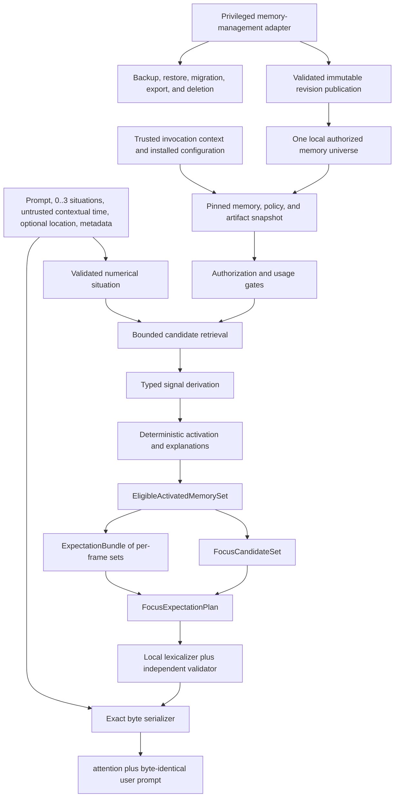

# V1 delivery program

Status: Proposed

## Purpose

This specification turns the accepted V1 product direction into an ordered,
reviewable, and evidence-gated delivery program from research through shipment.
It inventories the current repository truth, assigns one owner to every
contract, records consolidation decisions, defines work-package interfaces,
maps every product requirement to implementation and evidence, and fixes the
dependency and promotion order.

It is not evidence that V1 works and is not permission to implement the entire
architecture at once. A later work package may begin only when its entrance
criteria are met. A simpler component that passes the same gate remains
preferred over a more complex one. A failed premise, safety boundary, or
resource gate stops or narrows the program instead of being hidden by schedule
pressure.

No software can be proved complete for every future environment. In this
program, **V1 complete** means that the frozen supported claim, configuration,
platforms, languages, and failure boundaries pass every named gate with
inspectable evidence and one reproducible release rehearsal. Everything
outside that envelope remains unsupported.

## Definitions

### Program states

| State | Meaning | Promotion condition |
| --- | --- | --- |
| `Proposed` | Contract or work package is documented but not selected or implemented | Focused review and any required accepted decision |
| `Selected` | Scope, owner, dependencies, interfaces, and gates are frozen for one implementation attempt | Entrance criteria and predecessor receipts pass |
| `Implemented` | Code and tests exist for the selected contract | Repository checks and package verification pass |
| `Evaluated` | Frozen implementation has a retained development or calibration receipt | Named component gate passes |
| `Qualified` | One exact artifact/configuration passes its promotion contract | Independent held-out or sealed gate passes |
| `Shippable` | One release candidate passes G0 through G10 | Signed shipment receipt and rollback rehearsal |
| `Stopped` | A mandatory premise or gate failed | New evidence-backed decision narrows, replaces, or ends the path |

These are delivery states, not specification statuses. A work package never
marks a specification `Validated` merely because code exists.

### Current repository inventory

The inventory at the start of this program is:

| Surface | Current truth | Maturity | Program treatment |
| --- | --- | --- | --- |
| `nemosyne-core` activation kernel | Deterministic ranking of already normalized evidence and inhibition signals with explanations | Experimental implementation | Preserve as a replaceable numerical primitive; do not call it the V1 retriever |
| `nemosyne-evaluation` | Deterministic evaluation of fixed activation parameters | Experimental implementation | Reuse for fixed-intermediate evidence only |
| `nemosyne-evaluation-corpus` | Small versioned coding-agent activation corpus | Experimental evidence | Retain as development regression data; never relabel as sealed V1 evidence |
| Product contract | One local read-only compile call returning attention plus byte-identical prompt | Proposed specification; historical Decision 0011 is superseded and its retained boundary is carried forward by Decision 0014 | Canonical observable V1 boundary |
| Numerical cognitive memory and focus | Hybrid exact/numerical memory and focus-candidate contract | Proposed specification; earlier terminal focus decision superseded | Canonical focus branch and memory representation boundary |
| Predictive attention | Transition evidence, alternatives, abstention, observation assessment, and support math | Proposed specification, accepted direction in Decision 0014 | Canonical expectation branch |
| Combined planning | One source-bound focus-and-expectation plan | Proposed specification, accepted direction in Decisions 0014 and 0015 | Canonical renderer-facing semantic object |
| Renderer | Local lexicalizer with exact slots and independent validation | Proposed specification, accepted direction in Decision 0015 | Must not become a predictor, answerer, or action planner |
| Memory store, encoder, retriever, expectation kernel, planner, renderer, compiler, and CLI | Not implemented | Proposed only | Build in risk order after predecessor gates |
| V1 usefulness and resource claims | No end-to-end observations | Unproven | G1 headroom before broad implementation; G9 sealed evaluation before claim |

### Documentation ownership matrix

Each normative subject has one canonical owner. Other documents link to the
owner and may describe placement but must not redefine the contract.

| Subject | Canonical owner |
| --- | --- |
| Observable input, output, non-scope, and requirements `V1-R01..R25` | [`v1-product-contract.md`](v1-product-contract.md) |
| Component graph, callable API, CLI, persistence concept, trust boundary, resources, and release shape | [`v1-reference-architecture.md`](v1-reference-architecture.md) |
| Privileged management-adapter topology, authority boundary, and compile exclusion | [`v1-reference-architecture.md`](v1-reference-architecture.md); `MEM-03` is the implementation owner |
| Formal obligations, experiments, statistics, gates, and evidence receipts | [`v1-proof-program.md`](v1-proof-program.md) |
| Cognitive memory planes, numerical facets, activation preparation, consolidation, and `FocusCandidateSet` | [`cognitive-memory-activation-and-focus.md`](cognitive-memory-activation-and-focus.md) |
| `EligibleActivatedMemorySet` eligibility, completeness, lineage, and canonical order | [`predictive-attention-and-expectation.md`](predictive-attention-and-expectation.md); `COMP-01` is only its runtime builder |
| Transition schema, expectation equations, alternative families, uncertainty, abstention, and observation assessment | [`predictive-attention-and-expectation.md`](predictive-attention-and-expectation.md) |
| `FocusExpectationPlan`, roles, closure, cost, selection, controls, and plan shapes | [`focus-and-expectation-planning.md`](focus-and-expectation-planning.md) |
| Numerical-prefix bridge, exact slots, lexical generation, semantic validator, and renderer errors | [`vector-to-attention-renderer.md`](vector-to-attention-renderer.md) |
| Candidate-model cohort, training comparison, promotion thresholds, resource measurement, and deployment artifact | [`local-renderer-model-qualification.md`](local-renderer-model-qualification.md) |
| Existing activation equation and public Rust behavior | [`situation-conditioned-activation.md`](situation-conditioned-activation.md) |
| Fixed-parameter activation evaluation | [`activation-parameter-evaluation.md`](activation-parameter-evaluation.md) |
| Revision-1 activation corpus | [`curated-activation-evidence.md`](curated-activation-evidence.md) |
| Delivery order, work-package interfaces, traceability, risks, and shipment process | This specification |
| Historical rationale | `docs/decisions` |
| Implemented public API | Rustdoc |
| Executable behavior | Tests and retained evidence receipts |

### Consolidation record

Three consolidation passes govern this document set.

| Pass | Conflict or duplication | Resolution |
| --- | --- | --- |
| Semantic | Focus, expectation, goal, action, answer, fact, confidence, and probability were easy to collapse in prose | Canonical distinct types in the predictive-attention specification and requirement `V1-R15` |
| Semantic | “Expectation” could mean one guessed outcome | Finite competing hypotheses grouped only by explicit mutually exclusive alternative family, with unknown and omitted support |
| Semantic | A normalized score could be described as probability | Rename it family-relative evidence share and prohibit probabilistic interpretation until a separate calibrated model passes |
| Semantic | An observed action in a transition could be rendered as advice | Conditions and actions remain distinct; V1 selects no action |
| Architecture | Decision 0011's focus-only product semantics no longer covered qualified prediction | Decision 0011 is superseded by Decision 0014; its local, read-only, one-result, and prompt-integrity boundaries are retained explicitly |
| Architecture | The earlier terminal `AttentionPlan` was focus-only | Decisions 0012 and 0013 are superseded; focus and expectation branch from one shared set and join in `FocusExpectationPlan` |
| Architecture | Focus pruning could erase transition evidence before prediction | Branch from the complete eligible activated set before final plan selection |
| Architecture | Separate renderer calls could diverge | One combined plan, one lexicalization pass, one validator boundary |
| Architecture | Request authority was attached to `Compiler::open` or exposed as a caller-constructible compile input | `Compiler::open` accepts only a bounded untrusted installation locator and resolves bootstrap trust, registries, and platform handles itself; each public `compile` accepts only bounded untrusted `CompileCallClaims`, and the compiler-owned platform authenticator derives a fresh crate-private `InvocationContext` |
| Architecture | A free configuration path could bypass installation trust | CLI selects only an authenticated installed configuration identity |
| API | Configuration fingerprint appeared as a second product result | `CompiledPrompt` exposes only compiled bytes; privileged receipts are separate |
| Delivery | Atomic stdout was claimed for an external stream | Buffer before delivery, report exit `10`, and require callers to discard possible partial bytes |
| Mathematical | Compatible outcomes shared one denominator | Normalize only within explicit mutually exclusive alternative families |
| Mathematical | Duplicate and correlated records could multiply support | Content canonicalization plus one bounded support budget per dependency group and family |
| Mathematical | Missing facets and numeric zero were indistinguishable | Retain presence masks and coverage diagnostics even where numerical support is zero |
| Mathematical | Later observation could implicitly rewrite prediction support | Offline assessment uses immutable fixtures; product recomputation requires separately managed evidence and a new explicit compile |
| Mathematical | Planning required an abstention proposition that the expectation set did not supply | Define one exclusive, content-identified, source-bound `FrameAbstentionCandidate` with complete reason/control closure |
| Mathematical | Renderer cost could enter feasibility without a total finite comparison domain or distinguish optional infeasibility from mandatory failure | Define checked nonnegative integer cost domains, empty identities, complete supported-domain bounds, optional infeasibility, mandatory minimum failure, and renderer-owned bound violation |
| Architecture | Bundle serialization order or request-local IDs could silently become semantic planning priority | Keep serialization keys order-only; define static semantic frame, family, and role classes plus separate planning-priority keys |
| Data contract | Transition status and uncertainty had duplicate or undefined ownership | Define complete state/outcome observations, one status field per observation, and distinct observation versus transition uncertainty |
| Mathematical governance | Cross-document notation duplicated formulas and reused symbols | Establish one global notation and derivation-owner registry; focused specifications own formulas and other documents link |
| ML research | Parallel learned-predictor slots lacked a typed semantic boundary | Define candidate, abstention, and null slots with frame, horizon, logits, dispersion, and source-attribution constraints without adopting the model |
| Delivery | Implementation order followed component familiarity rather than premise risk | Headroom and evidence harness precede broad architecture implementation |

The consolidation claims above are backed by named source-pass records for
this proposed revision. They become immutable receipts only when the final
`DOC-00` merge receipt binds their reviewed blob and the required independent
reviews:

| Receipt / status | Pass and reviewed scope | Before → after evidence | Reviewer independence and disposition |
| --- | --- | --- | --- |
| `CONSOL-01` / Source pass | Semantic and mathematical pass over product, memory, predictive, planning, renderer, evaluation, and proof contracts | Ambiguous focus/expectation/action/fact/probability terms and duplicated notation → one ownership matrix, distinct types, global notation and trace links; native versus migrated reliability semantics are explicit in `FND-039`, private authority is absent from \(Q\) under `FND-046`, coverage uses only attribution-bearing visible positions under `FND-049`, and non-vacuous threshold domains are explicit under `FND-051`; conflicts remain in the finding ledger | Principal-architect pass; independent confirmation pending `REV-02`, `REV-03`, `REV-04`, and `REV-17` |
| `CONSOL-02` / Source pass | Architecture/API pass over component graph, authority, interfaces, API/CLI, persistence, renderer and release | Overlapping shared-set/focus, compiler/CLI, validator/qualification and authorization/shipment ownership → split packages and sole interface owners `FND-027..031`, `FND-036..037`; trust boundary, cancellation, prompt binding, ingress identity, authority-free planning, sole ingress ownership, narrow combined-planner inputs, and the proof-model authentication sequence close through `FND-040..047` and `FND-052` | Principal-architect pass; independent confirmation pending `REV-05..09`, `REV-11`, `REV-13`, `REV-15`, and `REV-16` |
| `CONSOL-03` / Source pass | Delivery/evidence pass over packages, dependencies, gates, risks, decisions, reviews and shipment | Prose roadmap and checklists → normalized package records, DAG, critical paths, milestones, waves, registers, review plan, trace schema and release state machine `FND-016..019`, `FND-026`, `FND-032..035`, `FND-038`; stale conformance claims append a receipt under `FND-048`, and evaluator complexity includes its per-scenario canonicalization under `FND-050` | Principal-architect pass; confirmation pending `REV-04`, `REV-10`, `REV-14`, `REV-17`, and `REV-18`; all empirical choices remain Open |

The merge receipt converts these source passes into content-bound receipts. A
later semantic, architecture, or delivery change appends a new consolidation
receipt and never rewrites the bound result.

### Research evidence ledger

Research informs hypotheses and constraints; it does not validate Nemosyne's
implementation or prove biological fidelity.

| Claim used by the program | Source and evidence type | Engineering implication | Limitation and non-proof |
| --- | --- | --- | --- |
| Episodic remembering and imagined future construction recruit overlapping memory systems | Addis, Wong, and Schacter 2007, primary fMRI experiment, “Remembering the past and imagining the future” | Test whether retrieved episode structure can support future-state hypotheses | Neural overlap does not specify a software schema, equation, or benefit |
| Mnemonic prediction errors can bias hippocampal state representations | Bein, Duncan, and Davachi 2020, primary behavioral/neuroimaging experiment, “Mnemonic prediction errors bias hippocampal states” | Preserve transition, temporal, and context structure and test error-sensitive alternatives | Laboratory effects do not prove coding-agent utility |
| Successor-like representations can guide prediction of future events | Ekman, Kusch, and de Lange 2023, primary experiment, “Successor-like representation guides the prediction of future events in human visual cortex and hippocampus” | Treat activated memory as one input to expectation formation | Does not justify treating support as probability or truth |
| Prospection and constructive memory are related but fallible | Buckner 2010 and Schacter et al. reviews | Preserve alternatives, uncertainty, and abstention | Reviews motivate questions; they do not select thresholds |
| Predictions can transform later memories | Bein et al. 2023 review, “Predictions transform memories” | Separate prediction output from independently authorized observation and memory management | Does not imply V1 should learn automatically |
| Attention and expectation can have distinct effects | Alink and Blank 2019 primary experiment plus Summerfield and Egner review | Keep focus and expectation as separate branches and evaluate their interaction factorially | Experimental definitions vary by task and do not establish Nemosyne's ontology |
| Predictive-processing evidence is mixed and theory-sensitive | Walsh et al. review | State falsifiable software hypotheses and negative controls rather than a universal brain claim | No conclusion about the exact V1 mechanism |
| Set models can represent unordered evidence with learned interactions | Lee et al. 2019, Set Transformer | Retain a learned set predictor as a later comparison after the deterministic baseline | Architecture capacity is not evidence of calibration or superiority |
| Neural confidence is often miscalibrated | Guo et al. 2017 | Never expose model scores as probabilities without a frozen calibration protocol | Classification calibration results do not automatically transfer to expectation sets |
| Distance-aware methods can improve out-of-distribution detection | Sun et al. 2022 | Measure novelty and selective abstention separately from support | OOD score quality is dataset- and representation-specific |
| Selective prediction requires explicit coverage-risk tradeoffs | Gangrade et al. 2021 | Gate positive expectations and report abstention by reason | Theory assumptions may not match generative downstream tasks |
| Local small language models and multilingual checkpoints exist | Official Qwen3 release materials | A local lexicalizer is technically testable | Advertised language support and benchmark scores do not qualify the renderer |
| SQLite supports transactions, WAL, backup, and integrity checks | Official SQLite documentation | It is one viable local persistence candidate to evaluate | Base SQLite does not provide encryption at rest; storage selection remains open |

### Canonical architecture wireframe



The compile path has read-only capabilities. Provisioning, memory management,
artifact installation, training, calibration, and evaluation are separate
offline or privileged paths. `MEM-03` owns the privileged management-adapter
boundary; the compiler dependency graph cannot construct or receive that
adapter.

### Work-package contract

Every work package is one normalized record joined by `id` across the full work
breakdown, execution metadata, responsibility, verification, dependency, and
gate registries in this specification. Absence is never inferred: an
inapplicable field is written as `none` with a reason. All packages in this
revision are `Proposed`; changing one to `Selected` requires its named entrance
receipt, an accountable human assignment, and any required accepted decision.

The canonical record is:

```text
WorkPackage
├── id, concise title, status, work type, priority, milestone, and target date
├── owner role and accountable human (`unassigned` until selection; no target
│   date before a human and high-confidence estimate are recorded)
├── objective, user value, and architecture value
├── product requirements and canonical specifications
├── accepted decisions or explicitly open decision
├── explicit predecessors, entrance receipts, and unlocked successors
├── exact scope and non-scope
├── versioned interfaces and artifacts consumed and produced
├── likely files or crates
├── documentation, mathematical, API, and migration impact
├── deterministic tests, adversarial cases, benchmarks, and proof obligations
├── security and privacy review
├── failure behavior and rollback or deletion path
├── measurable acceptance criteria and evidence required before merge
├── complexity estimate and estimate confidence
├── parallel lane and authority-surface conflicts
├── normal or stacked pull-request mode and stack parent
└── contributed gates and residual risks
```

A package is the smallest mergeable unit whose behavior, tests,
documentation, and rollback remain coherent. A pull request may implement one
package or a tightly coupled pair only when the dependency table explicitly
permits stacking. It may not combine an upstream experiment with downstream
production adoption before the evidence is reviewed.

`WorkType` is one of `Documentation`, `Decision`, `ResearchSpike`,
`Implementation`, `Evaluation`, `Qualification`, `Integration`,
`Verification`, or `Release`. Complexity is independently one of `S`, `M`, or
`L`; a research spike is not itself a complexity estimate. Every estimate also
states `low`, `medium`, or `high` confidence. A low-confidence estimate is
planning metadata, not permission to expand scope, and must be replaced by a
measured estimate before selection.

Two packages may share a parallel lane only after all predecessors pass and
only when the parallel-safety registry shows no incompatible edit to the same
authority surface. A stacked pull request is never a substitute for an
unpassed gate.

### Full work breakdown

#### Foundation and premise

| ID | Concise title, objective, scope, and non-scope | Depends on | Acceptance and exit evidence | Contributes to |
| --- | --- | --- | --- | --- |
| `DOC-00` | **Re-found the V1 contracts.** Reconcile product, architecture, mathematics, renderer, proof, and delivery documents; add Decisions 0014 and 0015; supersede Decisions 0011–0013 without rewriting history; retain conflict and ownership maps; no production code or selected empirical threshold | None | Documentation checks, three consolidation receipts, eighteen signed independent review receipts, and committed-blob manual conformance receipt | G0 |
| `EVD-01` | **Establish the evidence envelope.** Implement the sole versioned experiment-manifest and immutable receipt envelope, semantic-lineage split, failure retention, baseline runner, and deterministic analysis skeleton; no product algorithm | `DOC-00` | Golden receipts, envelope migration tests, and reproducible failed and inconclusive runs | G2 and evidence entrance |
| `TGT-00` | **Freeze the G1 evaluation envelope.** Before outcomes are visible, freeze target population and sampling frame, task taxonomy, downstream-agent and language cohort, baselines, G1 margins, harm and anchoring limits, subgroup rules, exclusions, and analysis identity; no operational or release claim | `EVD-01` | Independently reviewed, content-identified G1 manifest with pre-outcome signatures and unsupported cases | G1 entrance |
| `EVD-02` | **Test product headroom.** Execute the expert-authored corpus and harness within `TGT-00`, covering focus-only, correct expectation, abstaining, wrong expectation, prompt-only, situation-only, and token-matched baselines; do not tune the frozen envelope | `EVD-01`, `TGT-00` | Blinded labels and one retained pass, fail, or inconclusive G1 receipt against frozen margins | G1 |
| `BND-01` | **Encode formal boundary fixtures.** Implement executable fixtures for authorization, snapshots, exact slots, transition alternatives, abstention, plan roles, and prohibited capabilities; select no implementation technology | `EVD-01` | Every F1–F17 obligation has at least one positive fixture and one counterexample | G2 |
| `TGT-01` | **Freeze the operational envelope.** After G1, freeze a supported subset of the `TGT-00` task, agent, and language cohort, hardware and OS cohort, installation and redistribution profile, process topology, model-residency policy, deterministic inference boundary, offline boundary, and measurable resource ceilings; select no model, storage engine, or semantic algorithm | Passing G1 receipt from `EVD-02` | Accepted operational-envelope decision and content-identified conformance manifest with unsupported cases | G3 entrance |
| `SEC-00` | **Freeze the security architecture.** Select principals, prompt origin, trust roots and rotation, request authority, snapshot revocation, capability/process graph, no-network enforcement, management and diagnostic authority, secrets, and failure posture before production code | `BND-01`, `TGT-01` | Accepted threat model and security decision, misuse cases, boundary fixtures, and zero unresolved architecture-level critical finding | G3 entrance |

#### Dependency-light semantics

| ID | Concise title, objective, scope, and non-scope | Depends on | Acceptance and exit evidence | Contributes to |
| --- | --- | --- | --- | --- |
| `CORE-01` | **Implement canonical primitives.** Inventory and reuse the existing public `CandidateId`, `ChannelId`, `UnitInterval`, and evaluation-owned `ScenarioId`; add only nonduplicative validated identifiers, finite values, presence states, schema and configuration identities, provenance roots, dependency groups, authority labels, and canonical ordering; no storage or runtime model | Passing G1 receipt from `EVD-02`, `BND-01` | Public-contract, old/new-path compatibility, deprecation, downstream compile, arbitrary-order, primitive-duplication, and dependency tests | G3 entrance |
| `CORE-02` | **Implement shared domain records.** Add request, situation, memory-facet, exact-sidecar-reference, and `EligibleActivatedMemorySet` domain contracts; no encoding, retrieval, or shared-set construction | `CORE-01`, `SEC-00` | Cross-object lineage, authority, invalid-state, and canonical-order tests | G3 entrance |
| `EVAL-01` | **Implement typed evaluation payloads.** Add generic case, split, metric, comparison, and payload types inside the `EVD-01` receipt envelope; do not redefine the envelope or add runtime dependencies | `EVD-01`, `CORE-01` | Deterministic payload reconstruction and permutation tests | G3 entrance |
| `EVAL-02` | **Govern evaluation corpora.** Add a counterexample-corpus registry with semantic-root split enforcement and coverage reports; do not admit model-generated truth | `EVAL-01`, `BND-01` | Leakage rejection, corpus-inventory, and content-identity receipts | G3 entrance |

#### Predictive semantics and planning

| ID | Concise title, objective, scope, and non-scope | Depends on | Acceptance and exit evidence | Contributes to |
| --- | --- | --- | --- | --- |
| `EXP-01` | **Implement predictive domain contracts.** Add transition, condition, horizon, outcome, status, alternative-family, query, and typed `TransitionReliability { schema, state, migration }` records; `ReliabilityState` is exactly `Derived { value, derivation, calibration_domain }`, `Missing`, `Unknown`, or `Inapplicable`; optional migration lineage lives on `TransitionReliability` and binds the migration ID, exact source record revision/schema, typed `ReliabilityMigrationSource`, and source-state digest; no prediction algorithm or compile-time auto-migration | `CORE-02`, `EVAL-02` | Constructor, state-identity, derived `0`/`1`, unavailable-state, malformed-identity, schema/domain compatibility, every source/target-state migration, malformed source-state metadata, exact rollback, stale/missing/mismatched migration, contradiction, exclusivity, and lineage tests | G3 and G7 |
| `EXP-02` | **Implement the deterministic expectation baseline.** Add typed reliability admission before \(\alpha\), piecewise \(\alpha\) with no fabricated neutral reliability, hard eligibility, facet compatibility, dependency budgets, grouping, medoids, relative support, diagnostics, finite alternatives, and abstention; define \(E_{\mathrm{cov}}\) by the coverage threshold and compute \(\Gamma\)/novelty maxima only over \(E_{\mathrm{cov}}\), with distinct empty-\(E\) and empty-\(E_{\mathrm{cov}}\) behavior; no learned predictor or probability | `EXP-01` | Hand calculations, reliability-admission failures, split-maxima counterexample/oracle, no-qualified-coverage, F13–F16 properties, and exhaustive small-case oracle | G3 and G7 |
| `EXP-03` | **Evaluate expectation semantics.** Add a versioned evaluator and curated corpus for alternatives, dependence, typed reliability compatibility/migration/lineage, unknown support, abstention, later observations, numerical boundaries, empty qualified coverage, and split maxima; no runtime calibration | `EXP-02`, `EVAL-02` | Reproducible reports; incompatible reliability schema/domain, missing/unknown/inapplicable, registered/unregistered migration, exact-lineage, high-coverage/distant plus low-coverage/near counterexamples; and two intentionally different kernel configurations | G3 and G7 |
| `PLAN-01` | **Construct focus candidates.** Own `deriveRequestPropositions(Q, Lambda_A, K)`, exact \(B_Q=\pi_Q(\Lambda_A)\), its ephemeral `RequestPropositionSet`, five-field receipt copied solely from \(\Lambda_A\), pure authority-lowering source mapping, the complete `FocusCandidateSet`, and request-local/memory-supported compatible-proposition consolidation over the one complete frozen activated input produced by `COMP-01`; receive no principal, policy object, authorization view/service, or direct authorization projection and perform no authorization, expectation derivation, final budget selection, shared-set construction, or persistent write | `CORE-02`, `EVAL-02`, `SIT-01`, `COMP-01` | Q schema/no-auth dependency, mandatory `COMP-01` predecessor, mismatched request/situation/configuration, prompt/situation/metadata locator/content binding, five-field receipt lineage, all twelve typed reasons, duplicate, conflict, authority-ceiling, provenance, bounded-candidate, and empty-memory situation-only focus tests | G4 entrance and G7 |
| `PLAN-02` | **Select the combined plan.** Add `FocusExpectationPlan`, mandatory closure, exhaustive reference selector, cost contract, plan shapes, controls, immutable branch-owned `PlanningSourceProjection` fields, and a minimized permissionless exact-surface inventory; consume no principal, policy service, authorization/disclosure view, or live grant and perform no lexical generation or optimized approximation | Passing G3 receipt from `EXP-03`, `PLAN-01` | Exact small-fixture oracle, lineage, ceiling-meet/lowering, source-projection, exact-slot/content-identity, inventory-minimization, ambient-authority noninterference, budget, alternatives, control-only, and no-action tests | G4 entrance and G7 |

#### Renderer feasibility

| ID | Concise title, objective, scope, and non-scope | Depends on | Acceptance and exit evidence | Contributes to |
| --- | --- | --- | --- | --- |
| `REN-01` | **Implement the deterministic renderer.** Add a multilingual controlled-template lexicalizer and exact-slot substitution baseline; no neural model or semantic selection | `PLAN-02`, `EVD-01`, `TGT-01` | Complete role and shape fixtures, byte preservation, no network, and target-envelope resource receipt | G4 |
| `REN-02` | **Define renderer evidence data.** Add the training/evaluation dataset schema, exhaustive plan-field bindings, target corruptions, lineage splits, and deterministic generation pipeline; no training adoption | `REN-01`, `EVAL-02`, `TGT-01` | Dataset and field-mapping audit, zero cross-split semantic-root leakage, and retained provenance | G4 |
| `REN-03` | **Prototype an optional vector-prefix renderer.** Build direct bridge and local-model candidates, bridge-only before LoRA; no runtime adoption or release selection | `REN-02`, `TGT-01` | Frozen candidate artifacts and identical-plan comparison receipts, or explicit no-generative-cohort record | Conditional G4 evidence |
| `VAL-01` | **Implement the independent renderer validator.** Freeze typed deterministic checks, semantic-validation interface, corruption corpus, thresholds, and failure behavior independently of candidate outputs; do not qualify or select a renderer | `REN-01`, `REN-02`, `TGT-01` | Validator false-accept and false-reject receipt, corruption coverage, deterministic identity, and independence review | G4 entrance |
| `REN-04` | **Qualify the deterministic renderer.** Evaluate the exact `REN-01` artifact with the frozen `VAL-01` validator and target envelope; do not change renderer or validator after outcomes | `REN-01`, `REN-02`, `VAL-01`, `TGT-01` | Passing deterministic-baseline qualification or retained stop receipt | G4 |
| `REN-05` | **Qualify the optional generative cohort.** Compare bridge, model, quantization, language, semantic fidelity, and resources against the qualified deterministic baseline without deployment mutation | `REN-03`, `REN-04`, `VAL-01`, `TGT-01` | Smallest fully passing generative candidate or explicit rejected or waived cohort receipt | Conditional G4 evidence |
| `REN-06` | **Select the deployed renderer pair.** Freeze renderer and validator identities from the qualified deterministic baseline or a passing generative candidate; no new training or threshold change | `REN-04`; `REN-05` only when a generative cohort is authorized | Accepted selection decision and authenticated deployment manifest bound to the target envelope | G4 |

`REN-02` must enumerate every field in the content-identified plan schema and
map it to exactly one renderer transport class owned by the renderer
specification: numerical facet, exact slot, typed relation/control, or
disposition/diagnostic. Missing, duplicate, lossy exact-value, and
schema-mismatched mappings are construction errors, not best-effort omissions.

#### Local memory and representations

| ID | Concise title, objective, scope, and non-scope | Depends on | Acceptance and exit evidence | Contributes to |
| --- | --- | --- | --- | --- |
| `MEM-01` | **Select local persistence.** Compare file layout, SQL or alternative store, schema, authorization view, encryption position, permissions, and recovery feasibility under the accepted envelopes; no product selection by preference alone | `CORE-02`, `BND-01`, `SEC-00`, `TGT-01` | Accepted decision plus prototype measurements and rejected-alternative record | G5 entrance |
| `MEM-02` | **Implement immutable memory reads.** Add read-only revision API, policy revision, authorization-before-search view, exact-plane schema, transition storage, and empty-store behavior; no management writes | `MEM-01`, `EXP-01` | Snapshot, revocation, canary, corruption, and concurrent-reader tests | G5 |
| `MEM-03` | **Implement minimum memory publication.** Add privileged initialization, authenticated import, integrity validation, and crash-safe publication of immutable memory and policy revisions; never link it into compile and do not add correction, deletion, migration, or backup | `MEM-02`, `SEC-00` | Capability-isolation tests, minimum-provisioning fixture, crash matrix, and validated-publication receipt | G5 |
| `MEM-04` | **Implement recovery and migration.** Add backup, restore, forward migration, interrupted-migration recovery, authoritative source and target migration manifests, registered deterministic transformation correspondence, integrity verification, and supported rollback; no unregistered semantic correction and no count-only equivalence | `MEM-03`, `TGT-01` | Versioned fixtures plus exact record/version, sidecar, provenance, policy, validity, supersession, deletion, and retention correspondence; equal-count replacement/corruption rejection; backup, restore, migration, and rollback rehearsal without data loss | G5 and G10 readiness |
| `MEM-05` | **Implement privacy export and deletion.** Add privileged export and deletion, derived-index invalidation, tombstone/revision semantics, authorization, and privacy receipts; no consolidation | `MEM-03`, `SEC-00` | Export fidelity, deletion completeness, stale-index non-retrieval, backup-retention disclosure, and authorization tests | G5 and G10 readiness |
| `ENC-01` | **Select and implement numerical encoding.** Add versioned facet encoders, exact/numerical binding, presence masks, reproducible rebuild, perturbation tests, and artifact identity; never claim embeddings are invertible | `MEM-02`, `EVAL-02`, `TGT-01` | Reconstruction-limit, incompatibility, drift, corruption, and resource receipts plus accepted selection decision | G6 |
| `SIT-01` | **Construct ingress identities and the numerical situation.** Under authenticated pinned `K`, derive one sealed \(\widehat B_{\mathrm{in}}\) with domain-separated typed `request_id` and `situation_id` over canonical exact request/situation envelopes plus authoritative `configuration_id`; independently project \(B_Q\) to `Q` and the same binding to shared-set construction; implement \(Q=\operatorname{encode}(P,S,\Xi;K)\), validated locators, and source-buffer identities; accept no caller IDs and do not receive trusted authorization time, discover ambient state, or infer authorization | `CORE-02`, `ENC-01`, `TGT-01` | Canonical-envelope/map-permutation, field mutation, same-content/configuration determinism, configuration binding, branch projection, cross-request swap, constant/reused/caller-ID, recomputation, observed-collision fail-closed, digest-assumption, missing/unknown, language, contextual-time/location, locator, trusted-time/private-authorization noninterference, and no-discovery tests | G6 and G7 entrance |
| `RET-01` | **Implement bounded authorized retrieval.** Add exact reference scan, measured approximate candidate comparison, degradation semantics, and completeness diagnostics against one `SIT-01` situation; never authorize after search | `ENC-01`, `SIT-01` | Recall, crowding noninterference, empty and index-failure, and scaling receipts | G6 |
| `SIG-01` | **Derive typed activation signals.** Convert one `SIT-01` numerical situation and retrieved candidate set into normalized signals and dynamic gates; no learned hidden defaults | `RET-01`, `SIT-01`, `CORE-02` | Hand calculations, range, presence, monotonicity, and fixed-intermediate ablations | G7 |
| `ACT-00` | **Compare and freeze activation parameters.** Evaluate registered parameter sets and simpler baselines on frozen signal evidence, then content-identify one candidate configuration; do not adopt runtime behavior | `SIG-01`, `EVAL-02`, `EVD-02` | Reproducible comparison, sensitivity and boundary report, and immutable parameter-candidate receipt | G7 entrance |
| `ACT-01` | **Adopt the runtime activation kernel.** Adopt, revise, or replace the experimental kernel using the frozen `ACT-00` evidence and parameter candidate; no calibration, goal selection, or action selection | `ACT-00` | Accepted decision, public-contract tests, and strongest-simple-baseline receipt | G7 |
| `COMP-01` | **Build the shared activated set.** Construct the complete `EligibleActivatedMemorySet` from adopted activation while preserving lineage, conflict, eligibility, and limits; perform no focus proposition consolidation and no persistent write | `ACT-01`, `CORE-02` | Lineage, conflict, duplicate, finite-limit, authorization, and deterministic reconstruction tests | G7 |

#### Callable product, hardening, and shipment

| ID | Concise title, objective, scope, and non-scope | Depends on | Acceptance and exit evidence | Contributes to |
| --- | --- | --- | --- | --- |
| `E2E-00` | **Freeze sealed release evaluation.** Before candidate outcomes are visible, freeze the G9 population, sampling, baselines, margins, harm and subgroup rules, analysis, sealed-set custody, and manifest; do not execute against a candidate | `EVD-01`, passing `EVD-02`, `TGT-01`, `EVAL-02` | Independent pre-outcome signatures, sealed lineage audit, and content-identified G9 evaluation manifest | G9 entrance |
| `API-01` | **Implement the callable compiler API.** Add public externally constructible `InstallationLocator`, `PromptOriginPresentation`, `CompileCallClaims`, request, `CancellationSource`/clonable `CancellationToken`, open, and `compile(&CompileCallClaims, &CompileRequest, &CancellationToken)` boundaries; origin presentation binds exact prompt bytes and one configuration-independent request-presentation identity before the authenticator creates request-local `AuthenticatedPrompt`; after authenticated configuration resolution, orchestrate the sole `SIT-01` constructor and consume its validated \(\widehat B_{\mathrm{in}}\) without redefining ingress semantics; keep compiler-owned installation/registry/bootstrap-trust/handle/clock resolution, the sole `LocalPlatformAuthenticator`, a fresh crate-private `InvocationContext`, and a private context-taking core; expose no caller-supplied path, manifest, trust root, registry, credential, platform handle, terminal transport, memory management, trusted-context constructor, or private core | `COMP-01`, `EXP-03`, `PLAN-02`, `REN-06`, `MEM-03`, `SIT-01`, `SEC-00`, `TGT-01` | External downstream-crate complete-call cases; source/token construction, clone, monotonic/idempotent cross-thread cancellation and every stage/final race; compile-fail privacy; exact prompt/request substitution, cross-pair and replay rejection; `SIT-01` delegation plus ingress-binding/collision source mapping; every closed constructor/open/compatibility/stage error; all-field forgery; no fallback; topology; forbidden capability; total request-proposition mapping; and one complete result or error | G8 entrance |
| `CLI-01` | **Implement the CLI adapter.** Add argument parsing, exact request bytes, public untrusted locator/origin/claims construction, exact request-bound opaque presentation transport, requested installed-configuration identity, one public `CancellationSource`/token pair, public open/compile invocation, buffered stdout attempt, diagnostic separation, stable typed exit mapping, and partial-transport failure behavior; accept no installation path, trust root, registry, credential, or platform handle; construct no `InvocationContext`, `AuthenticatedPrompt`, or ingress identity; authenticate no presentation; perform no installation/trust/configuration resolution; and duplicate no compiler logic | `API-01` | CLI/library golden parity, arbitrary-byte ingress, origin/request cross-pair and replay rejection, cancellation/signal mapping, closed-constructor/open/error mapping, locator/origin/claim/context forgery, no path/trust/handle option, request-construction-versus-compatibility mapping, complete source/exit mapping, broken-pipe, partial-write, and discard-rule tests | G8 |
| `OBS-01` | **Implement privileged diagnostics.** Add a separately authorized diagnostic and `EVD-01`-enveloped stage-receipt API that reconstructs identities without changing the product result or logging private content by default | `API-01`, `EVD-01`, `SEC-00` | Authorization, redaction, reconstruction, envelope-conformance, and result-isolation tests | G8 |
| `SEC-01` | **Verify integrated security.** Test the accepted threat model against the integrated candidate: capability graph, network denial, authorization noninterference, artifact authenticity, secret/log audit, malformed-store fuzzing, and dependency review; invent no new architecture | `OBS-01`, `MEM-04`, `MEM-05`, `API-01`, `CLI-01`, `TGT-01` | Independent security receipt with zero open critical findings | G8 |
| `PERF-01` | **Verify operational budgets.** Measure cold and warm library and CLI paths, model load/unload, memory/database scaling, cancellation, and deadline enforcement on frozen hardware; do not publish estimates as results | `API-01`, `CLI-01`, `TGT-01` | Reproducible operational receipt within frozen ceilings | G8 |
| `SYS-01` | **Verify the local vertical slice.** Integrate empty, focus-only, expectation-only, combined, abstaining, wrong-expectation, corrupted, revoked, and resource-limit cases; make no packaging claim | `CLI-01`, `OBS-01`, `SEC-01`, `PERF-01` | Cross-platform invariant, recovery, and failure-injection receipt | G8 |
| `REL-01` | **Freeze a release candidate.** Reproducibly package binary/library, renderer and encoder artifacts, authenticated manifest, licenses, SBOM, signatures, installer/update metadata, support matrix, deprecation metadata, and rollback identity; do not publish | `SYS-01`, `MEM-04`, `MEM-05`, `REN-06`, `TGT-01`, `E2E-00` | Content-identified packaged candidate and reproducible-build receipt | G9 and G10 entrance |
| `RCV-01` | **Verify the exact package.** Without rebuilding or retuning, verify clean install, offline compile, cross-platform behavior, security, resource ceilings, migration, backup/restore, update, uninstall, downgrade policy, and rollback | `REL-01`, `SEC-01`, `PERF-01`, `MEM-04`, `MEM-05` | Packaged-candidate verification receipt bound to the exact manifest and target envelope | G9 and G10 entrance |
| `E2E-01` | **Execute sealed product evaluation.** Run the exact `RCV-01` candidate once under the frozen `E2E-00` protocol; perform no tuning or threshold change | `RCV-01`, `E2E-00` | Permanent pass, fail, or inconclusive G9 receipt bound to candidate and evaluation manifests, including all failures | G9 |
| `REL-02` | **Authorize shipment or stop.** Assemble G0–G9 receipts, G10-readiness artifacts, limitations, release notes, deprecation/EOL statement, and vulnerability/support channels; mutate no candidate and consume no G10 result | `RCV-01`, `E2E-01` | Signed `ShipAuthorizationReceipt` or explicit immutable `StopReceipt` | G10 entrance |
| `REL-03` | **Publish and verify shipment.** Publish only the exact `REL-02`-authorized candidate, verify distribution hashes, channel metadata, clean retrieval/install, support and rollback endpoints, and initiate rollback on failure | `REL-02` with `ShipAuthorizationReceipt` | Signed `ShipmentReceipt` closing G10, or publication-failure and verified rollback receipt | G10 |

#### Post-V1 evidence-gated options

| ID | Concise title, objective, scope, and non-scope | Depends on | Acceptance and exit evidence | Contributes to |
| --- | --- | --- | --- | --- |
| `DATA-01` | **Govern real transition data.** Add a separately consented collection path with provenance, deletion, retention, subject, dependency, and time-later split controls; no compile-time learning | Shipped or stopped V1 plus focused data-governance decision | Consent, deletion, leakage, and dataset-accounting receipt | New post-V1 decision |
| `MEM-06` | **Research persistent memory evolution.** Define correction and consolidation semantics; never learn implicitly from compile or generated output | Shipped or stopped V1 plus focused memory-evolution decision | Correction provenance, conflict, reversibility, consolidation-loss, and authorization receipt | New post-V1 decision |
| `ML-01` | **Build a governed predictor corpus.** Generate a curated expectation-set training corpus from accepted deterministic semantics and governed transition observations; no model adoption | `EXP-03`, `DATA-01` | Data-governance, lineage, license, and split receipt | New post-V1 decision |
| `ML-02` | **Research a learned set predictor.** Produce typed hypothesis, abstention, and null candidates over the same eligible activated set; no probabilities or open-world prose | `ML-01` | Frozen deterministic-baseline, OOD, permutation, and attribution comparison | New post-V1 decision |
| `ML-03` | **Research calibration.** Evaluate selective prediction and probability calibration on disjoint time-later data; expose no probability before a new accepted contract | `ML-02` | Disjoint reliability, OOD, coverage-risk, and subgroup evidence | New post-V1 decision |
| `P3-01` | **Research an open-world proposer.** Evaluate an additional local model call only after a proven coverage gap; no V1 action selection or persistent truth | Shipped V1 plus documented unresolved coverage failure and new product, threat, and data decisions | Bounded research receipt or rejection | Outside V1 |

### Work-package interface and execution metadata

Complexity is relative (`S`, `M`, or `L`) and does not promise
calendar duration. A low-confidence estimate must be replaced before package
selection. `Parallel` names the lane after dependencies pass. `Normal` means a
pull request against `main`; `Stack 1/2` and `Stack 2/2` are the only
preauthorized two-level stacks.

| ID | Consumes → produces; explicit non-scope | Likely surfaces | Type / P / complexity-confidence / lane / PR / milestone | Security, privacy, migration, failure, and rollback review |
| --- | --- | --- | --- | --- |
| `DOC-00` | Current docs and research → canonical proposed contracts and ADRs; no production code or selected thresholds | `docs/specifications`, `docs/decisions` | Documentation / P0 / L-high / documentation / Normal / M0 | Historical immutability, no private data, no migration; revert the complete documentation revision before dependent work |
| `EVD-01` | Proof contract → sole manifest and receipt envelope, split, baseline, and analysis interfaces; no product algorithm | new offline evaluation modules and docs | Implementation / P0 / M-medium / evidence / Normal / M1 | Receipts contain no private user data; envelope versions are append-only or migratable; failed receipts remain immutable |
| `TGT-00` | `EVD-01` → frozen evaluation population, sampling, cohorts, baselines, margins, harm/subgroup rules, and analysis identity; no operational support claim | evaluation-envelope manifest and review receipt | Decision / P0 / M-medium / evidence-governance / Normal / M1 | Pre-outcome independence and licensed or consented sampling frame; changing it invalidates G1 |
| `EVD-02` | `EVD-01`, `TGT-00` → expert headroom dataset and G1 receipt; no post-outcome tuning | evaluation corpus and offline harness | Evaluation / P0 / L-medium / evidence / Normal / M1 | Licensed or consented fixtures, blind labels, immutable failed receipts; failure stops or narrows V1 |
| `BND-01` | F1–F17 → executable boundary fixtures; no implementation selection | evaluation fixtures and docs | Implementation / P0 / M-high / evidence / Normal / M1 | Synthetic canaries only, no private data or migration; revert fixtures and retain failed evidence |
| `TGT-01` | Passing headroom premise and `TGT-00` → immutable operational/release envelope; no semantic expansion or component selection | target-envelope spec, manifest schema, measurement fixtures | Decision / P0 / M-medium / product-boundary / Normal / M1 | Deterministic inference, license, redistribution, and offline constraints explicit; widening requires new G1 evidence |
| `SEC-00` | Boundary fixtures and target envelope → accepted principal, trust, and capability architecture; no integrated security claim | threat model, security ADR, misuse-case corpus | Decision / P0 / L-medium / security-architecture / Normal / M1 | Trust rotation, revocation, diagnostics, secrets, privacy, and management authority fixed before code; supersede to roll back |
| `CORE-01` | Existing public primitive inventory plus canonical terminology → reused or compatibility-re-exported dependency-light primitives with no duplicate semantic domains; no storage or model runtime | `nemosyne-core`, compile-only downstream compatibility fixtures | Implementation / P0 / M-high / semantic-core / Stack 1/2 / M2 | Unsafe forbidden, preserve `CandidateId`/`ChannelId`/`UnitInterval` and evaluation-owned `ScenarioId` paths or provide a declared deprecated exact re-export; no private data or persistent migration; revert before downstream API stabilizes |
| `CORE-02` | `CORE-01` and security architecture → request, situation, facet, sidecar-ref, and shared-set domain contracts; no construction algorithm | `nemosyne-core` | Implementation / P0 / L-medium / semantic-core / Stack 2/2 / M2 | Authority and provenance mandatory, no persistent migration; revert stack with `CORE-01` if compatibility is not yet frozen |
| `EVAL-01` | `EVD-01`, core IDs → typed offline payloads and comparisons; no envelope redefinition or runtime dependency | `nemosyne-evaluation` | Implementation / P0 / M-medium / evidence / Normal / M2 | Untrusted fixture parsing bounded, no private data; payload schema versions migrate inside the envelope |
| `EVAL-02` | `EVAL-01`, boundary fixtures → corpus registry and split audit; no model-generated truth | evaluation crates and corpus | Implementation / P0 / M-medium / evidence / Normal / M2 | Leakage and provenance audit; corpus revisions roll back by content ID |
| `EXP-01` | Shared-set types → transition/query/alternative API with typed reliability schema/state/derivation/calibration/migration lineage; no support calculation or implicit reliability migration | `nemosyne-core`, expectation spec | Implementation / P0 / L-medium / predictive-semantics / Stack 1/2 / M2 | Authority, provenance, exact sidecars, and authenticated migration references required; reject stale/missing/mismatched migration and retain prior reader |
| `EXP-02` | Admitted compatible transitions → deterministic per-frame expectation sets using piecewise reliability and coverage-qualified split maxima; no fabricated neutral value, learned predictor, or probability | `nemosyne-core` expectation module | Implementation / P0 / L-medium / predictive-semantics / Stack 2/2 / M2 | Bounded input, fail-closed reliability/dependency handling, distinct empty eligibility/coverage outcomes, and exhaustive split-maxima oracle permit rollback |
| `EXP-03` | `EXP-02`, corpus registry → expectation reports and curated reliability/migration/coverage counterexamples; no runtime calibration | evaluation and corpus crates | Evaluation / P0 / M-high / evidence / Normal / M2 | Synthetic or deidentified fixtures; exact reliability lineage, registered/unregistered migration, split-maxima and no-qualified-coverage cases; content-version rollback and immutable failures |
| `PLAN-01` | Authority-free validated `Q` with \(B_Q\)/locators/content identities, pinned `K`, and the complete `COMP-01` shared set carrying sole \(\Lambda_A\) → exact join, ephemeral `RequestPropositionSet`, and complete `FocusCandidateSet`; `COMP-01` is a mandatory predecessor; no direct authorization input/call, expectation truth, shared-set construction, final budget selection, or persistence | `nemosyne-core` focus module | Implementation / P0 / L-medium / planning / Normal / M3 | Preserve exact source locators, receipt lineage from \(\Lambda_A\), exclusions, allowed-use ceilings, typed failures, and authority; situation-only focus must survive an empty memory set; reject any invocation without the complete shared-set receipt and revert the request-local module independently |
| `PLAN-02` | Focus and expectation sets with immutable branch-owned source projections plus minimized permissionless exact surfaces → canonical bounded plan; no authority/disclosure view, live authorization, lexical generation, or approximation | `nemosyne-core` planning module | Implementation / P0 / L-medium / planning / Normal / M3 | Exact common lineage, meet/copy/lowering-only ceilings, content-identical upstream slot bindings, no ambient authority dependency, and exhaustive oracle retained as rollback and reference |
| `REN-01` | Canonical plan and target envelope → deterministic attention text and exact substitution; no neural model | new renderer crate and fixtures | Implementation / P1 / L-medium / renderer / Normal / M4 | Injection-safe slots, no network or private logging; candidate is independently removable |
| `REN-02` | Plan and target contracts → exhaustive field mapping, renderer dataset, and corruptions; no training adoption | offline data tooling | Implementation / P1 / L-medium / renderer-data / Normal / M4 | Dataset licensing, provenance, privacy, split, and deletion; mapping rollback by content ID |
| `REN-03` | Frozen renderer data → optional bridge/model candidate artifacts; no release selection | offline training scripts/artifacts | ResearchSpike / P1 / L-low / renderer-ML / Normal / M4 | Artifact sandbox, no private memory, supply-chain inventory; delete or waive cohort without runtime migration |
| `VAL-01` | Renderer schema and corruption data → frozen independent validator identity; no candidate qualification | validator crate and corruption harness | Implementation / P1 / L-medium / renderer-validation / Normal / M4 | Independent implementation/data review, private-content minimization, no migration; stop and delete candidate if false-accept gate fails |
| `REN-04` | Frozen deterministic renderer and validator → qualification receipt; no generative selection or threshold change | offline qualification harness | Qualification / P1 / M-medium / renderer-validation / Normal / M4 | Independent evaluator and signed identities; retained stop receipt and no deployment on failure |
| `REN-05` | Qualified validator plus model candidates → optional generative comparison receipt; no deployment mutation | offline qualification harness and artifacts | Qualification / P1 / L-low / renderer-ML / Normal / M4 | Language/resource/subgroup failures retained; rejected candidates are removable |
| `REN-06` | Qualified deterministic baseline and optional passing model → one authenticated deployment manifest; no training | renderer selection ADR and artifact registry | Decision / P1 / M-medium / renderer / Normal / M4 | Select smallest passing artifact; rollback atomically to prior renderer-plus-validator identity |
| `MEM-01` | Logical memory contract and threat model → physical-storage decision; no production store | prototype area, benchmark docs, ADR | ResearchSpike / P1 / L-low / persistence / Normal / M3 | Encryption, permissions, deletion, recovery threat review; prototypes disposable |
| `MEM-02` | Accepted storage choice and domain records → read-only revision API; no management writes in compile | new memory crate, schema, migrations | Implementation / P1 / L-low / persistence / Normal / M3 | Authorization-before-search, corruption isolation, encrypted/private storage posture; forward and restore fixtures provide rollback |
| `MEM-03` | `MEM-02` → minimum privileged initialization, import, and publication adapter; no correction, deletion, migration, backup, or compile write | dedicated management crate or binary, never a compiler dependency | Implementation / P1 / L-low / persistence-management / Normal / M3 | Dedicated principal and capability, crash atomicity, authenticated import; discard unpublished revision on rollback |
| `MEM-04` | Published revisions → backup, restore, authoritative source/target manifests, registered migration correspondence, and rollback tools; no unregistered semantic correction or count-only proof | privileged recovery modules and adversarial migration fixtures | Implementation / P1 / L-low / persistence-recovery / Normal / M3 | Exact records, sidecars, provenance, policy, validity, supersession, deletion and retention survive or name an approved transform; equal-count corruption fails; previous schema remains readable until verified restore |
| `MEM-05` | Published revisions → authorized export/deletion and derived-state invalidation; no consolidation | privileged privacy modules and receipts | Implementation / P1 / M-low / privacy / Normal / M3 | User authority, complete index invalidation, backup-retention policy; restore only through explicit authorized path |
| `ENC-01` | Exact-plane revision → rebuildable typed numerical facets; no claim of invertible embeddings | encoder adapter and artifact registry | Implementation / P1 / L-low / representation / Normal / M3 | Artifact authenticity, exact-value minimization; rebuild permits rollback |
| `SIT-01` | Exact validated request plus authenticated pinned \(K\)/encoders → sealed compiler-owned \(\widehat B_{\mathrm{in}}\), independent branch projections, deterministic `Q`, locators, and content identities; no caller IDs, trusted time, discovery, or authority inference | compiler/core ingress and situation module | Implementation / P1 / L-medium / situation / Normal / M3 | Canonical domain-separated request/situation identities bind configuration; retained-byte recomputation and observed-collision witnesses fail closed; principal, policy, authorization-view, and `t_auth` perturbations cannot affect `Q`; reject incompatible schema/configuration and retain the collision assumption |
| `RET-01` | Authorized revision, facets, and situation → bounded candidates/diagnostics; no post-search authorization | memory/retrieval modules | Implementation / P1 / L-medium / retrieval / Normal / M3 | Noninterference, candidate DoS, stale index; exact scan is reference fallback |
| `SIG-01` | Situation and candidates → typed normalized signals/gates; no learned hidden defaults | compiler/core signal module | Implementation / P1 / L-medium / activation / Normal / M3 | Finite and presence validation, no private logs or migration; versioned configuration rollback |
| `ACT-00` | Frozen signals and evaluation interfaces → content-identified activation parameter candidate; no runtime adoption | offline evaluation/corpus crates and manifests | Evaluation / P1 / M-medium / activation-evidence / Normal / M3 | Synthetic or governed evidence only, no migration; retain all failed candidates and delete no receipt |
| `ACT-01` | Frozen parameter evidence → adopted activation kernel/configuration; no calibration or goal/action selection | core activation and ADR/spec | Implementation / P1 / M-medium / activation / Normal / M3 | Explainability and deterministic failure; retain prior kernel as comparison, not parallel truth |
| `COMP-01` | Adopted activation and eligible sources → complete shared activated set; no focus consolidation or persistent consolidation | compiler/core shared-set builder | Implementation / P1 / L-medium / activation / Normal / M3 | Provenance, authority, and conflict preservation; request-local state is disposable |
| `E2E-00` | Evidence and target envelopes → frozen G9 protocol and sealed-set manifest; no candidate execution | evaluation manifests and independent custody tooling | Evaluation / P1 / L-low / sealed-evidence / Normal / M2 | No private memory without consent, blind custody, no migration; exposed set is permanently retired from fresh use |
| `API-01` | Closed untrusted installation selectors and exact request-bound origin bytes plus qualified components → public locator/presentation/claims/request/cancellation constructors, compiler-owned trust resolution, prompt/request authentication, orchestration of the `SIT-01`-owned sealed ingress binding, fresh private context, and callable compile API; no caller path/root/handle/identity input, ingress construction or validation semantics, terminal transport, memory management, or downstream model call | new compiler crate and private installation-resolution/platform-authentication modules; consumes the `SIT-01` ingress interface | Integration / P1 / L-medium / integration / Normal / M5 | External callers construct the complete path but cannot construct context, authenticated prompt, ingress identity, or trust inputs; `API-01` cannot construct or reinterpret ingress outside `SIT-01`; cancellation is monotonic and authority-free; substitution/replay/collision and typed error routing remain compiler-owned; rollback compiler/config atomically |
| `CLI-01` | Callable API → public untrusted locator, exact request-bound origin presentation, request, cancellation pair, and installed-identity claim transport plus delivery adapter; no path/trust/handle/identity input, private constructor, presentation authentication, installation/trust/configuration resolution, compiler logic, or management command | new CLI crate | Integration / P1 / M-high / integration / Normal / M5 | Untrusted selectors, arguments, presentations, and cancellation transport are bounded; constructor/open/compatibility/stage errors map by type; cross-pair/replay fails; diagnostics are separated; no migration; rollback adapter independently when API compatible |
| `OBS-01` | Compile stage identities and evidence envelope → privileged diagnostics; no second normal result or default private logs | compiler diagnostics and receipt API | Implementation / P1 / M-medium / observability / Normal / M5 | Explicit authorization/redaction, retention off by default; disable surface without compile change |
| `SEC-01` | Integrated candidate and accepted threat model → independent verification receipt; no architecture invention | tests, policies, dependency config, docs | Verification / P1 / L-medium / hardening / Normal / M5 | Independent review, privacy, network denial, and artifact trust; critical finding returns to owner and blocks integration |
| `PERF-01` | Frozen vertical candidate and target envelope → measured ceilings and degradation behavior; no marketing estimate | benchmark harness and manifests | Verification / P1 / L-medium / operations / Normal / M5 | No private payload retention or migration; narrow support or revert costly component |
| `SYS-01` | All runtime components → local vertical slice; no packaging claim | workspace integration tests | Integration / P1 / L-medium / integration / Normal / M5 | Full capability, privacy, recovery, and failure audit; slice remains unreleased until gate passes |
| `REL-01` | Passing vertical slice and frozen G9 protocol → reproducibly packaged, signed, immutable candidate; no publication or evidence tuning | packaging, CI, manifests, install docs | Release / P1 / L-medium / release-packaging / Normal / M6 | Signing, SBOM, permissions, deprecation/EOL metadata, exact rollback identity; rebuilding creates a different candidate |
| `RCV-01` | Exact packaged candidate → install, security, performance, migration, recovery, and offline receipt; no rebuild or retune | isolated package-verification jobs and target machines | Verification / P1 / L-medium / release-verification / Normal / M6 | Verify artifact bytes and privacy posture; any fix creates a new candidate and invalidates downstream receipts |
| `E2E-01` | Verified exact packaged candidate and frozen G9 manifest → permanent product-evidence receipt; no tuning | isolated evaluation infrastructure | Evaluation / P1 / L-medium / sealed-evidence / Normal / M6 | Private-data prohibition and blinded adjudication; failure is retained and blocks release |
| `REL-02` | G0–G9 plus G10-readiness artifacts → ship authorization or stop record; no publication, scope expansion, or G10 input | release workflow, notes, evidence bundle | Release / P1 / M-high / release / Normal / M6 | Human sign-off, vulnerability channel, deprecation/EOL and rollback verified; no authorization on partial gate |
| `REL-03` | Authorized exact candidate → publication and post-publication verification; no rebuild or candidate mutation | release workflow, distribution channel, verification jobs | Release / P1 / M-low / release / Normal / M6 | Verify channel bytes, support and rollback endpoints; failed publication triggers verified rollback and no G10 pass |
| `DATA-01` | Separate consent decision → governed real transition observations; no automatic compile learning | future collection and governance tools | ResearchSpike / P2 / L-low / data / Normal / M7 | Consent, subject rights, deletion, retention, provenance; removable dataset lineage |
| `MEM-06` | Shipped memory contract plus new decision → correction and persistent consolidation; no compile-time or generated-output learning | future privileged management modules | ResearchSpike / P2 / L-low / memory-evolution / Normal / M7 | Provenance, reversibility, authorization, and loss measurement; delete feature without changing read-only compile |
| `ML-01` | Deterministic semantics and governed data → training corpus; no model adoption | future offline corpus tooling | Implementation / P2 / L-low / predictive-ML / Normal / M7 | Strict split, license, consent, and deletion governance; version rollback |
| `ML-02` | `ML-01` → learned typed set predictor candidate; no probabilities or open-world prose | future model/training modules | ResearchSpike / P2 / L-low / predictive-ML / Stack 1/2 / M7 | OOD/abstention, no private data, sandbox artifacts; deterministic baseline remains |
| `ML-03` | Passing predictor → calibration proposal; no probability exposure before gate | future calibration harness | ResearchSpike / P2 / M-low / predictive-ML / Stack 2/2 / M7 | Disjoint time-later data and subgroup bounds; reject probability feature independently |
| `P3-01` | Proven deterministic/set coverage gap → speculative proposer research; no V1/action/persistent truth | separate future research boundary | ResearchSpike / P3 / L-low / none before new decision / Normal / post-V1 | New threat/product/data contracts; fully deletable experiment |

### Work-package responsibility registry

Every package is owned by the named role. The accountable human is
`unassigned` and the target date is `unassigned` for every package while this
specification remains `Proposed`; selection is invalid until an individual,
high-confidence estimate, and target date are recorded in the entrance
receipt.
Specification aliases in this table are canonical and do not create parallel
contracts:

- `PC`: `v1-product-contract.md`;
- `ARCH`: `v1-reference-architecture.md`;
- `PROOF`: `v1-proof-program.md`;
- `MEM`: `cognitive-memory-activation-and-focus.md`;
- `EXP`: `predictive-attention-and-expectation.md`;
- `PLAN`: `focus-and-expectation-planning.md`;
- `REN`: `vector-to-attention-renderer.md`;
- `QUAL`: `local-renderer-model-qualification.md`;
- `ACT`: `situation-conditioned-activation.md`;
- `AEVAL`: `activation-parameter-evaluation.md`;
- `CORPUS`: `curated-activation-evidence.md`; and
- `DEL`: this specification.

`D14` and `D15` mean Decisions 0014 and 0015. `New ADR` means that selection is
blocked until the package's significant long-lived choice is accepted. Every
production-source package updates its owning specification and Rustdoc in the
same pull request; every package updates `DEL` status and receipt links.

| ID | Owner role / value | Requirements and canonical specifications | Decision requirement | Documentation, mathematics, API, and migration impact | Verification and merge evidence |
| --- | --- | --- | --- | --- | --- |
| `DOC-00` | Principal architect / makes one reviewable V1 truth | All `V1-R01` through `V1-R25`; all aliases | `D14`, `D15` | Documentation only; reconcile every formula and API owner; no migration | G0 checklist, consolidation and review receipts, repository checks |
| `EVD-01` | Evidence architect / makes every later claim reproducible | `V1-R12`, `V1-R25`; `PROOF`, `DEL` | New ADR only if receipt compatibility becomes public policy | Receipt/envelope specification and offline API; no product mathematics or persistent migration | Golden envelope, schema-evolution, failure-retention, and reproducibility tests |
| `TGT-00` | Product-evidence owner / prevents outcome-driven G1 claims | `V1-R12`; `PC`, `PROOF`, `DEL` | New ADR | Frozen manifest only; no product API or migration | Independent pre-outcome review receipt and signed manifest |
| `EVD-02` | Evaluation lead / falsifies weak product premise early | `V1-R07`, `V1-R12`; `PC`, `PROOF`, `DEL` | none; executes `TGT-00` | Corpus and analysis documentation; no product API, formula, or migration | Permanent G1 pass, fail, or inconclusive receipt |
| `BND-01` | Formal-verification lead / turns boundaries into counterexamples | `V1-R01` through `V1-R25`; `PROOF`, `DEL` | none | Fixture contracts only; no production API or migration | Positive/counterexample coverage for F1–F17 |
| `TGT-01` | Product/operations owner / bounds support and resources | `V1-R01`, `V1-R02`, `V1-R08` through `V1-R12`, `V1-R25`; `PC`, `ARCH`, `PROOF`, `DEL` | New ADR | Target-envelope document and manifest; no algorithm or migration | Accepted envelope and unsupported-case receipt |
| `SEC-00` | Security architect / fixes trust before implementation | `V1-R04`, `V1-R05`, `V1-R09`, `V1-R10`, `V1-R13`, `V1-R23`, `V1-R25`; `ARCH`, `PROOF`, `DEL` | New ADR | Threat model, capability API constraints, no mathematical change or migration | Independent threat review and zero open architecture-critical finding |
| `CORE-01` | Core API owner / prevents invalid primitive state and duplicate semantic primitives | `V1-R06`, `V1-R11`, `V1-R14` through `V1-R21`, `V1-R25`; `MEM`, `EXP`, `PLAN` | `D14`, `D15`; new ADR before any primitive move or replacement | Rustdoc, public primitive inventory, reuse/re-export/conversion policy, and value/ID APIs; finite/canonical proofs; no persistence migration | Constructor, type-identity, old/new-path compile compatibility, deprecation, ordering, hashing, finite-domain, and duplicate-domain tests |
| `CORE-02` | Domain-model owner / shares one typed boundary | `V1-R01`, `V1-R04` through `V1-R06`, `V1-R11`, `V1-R14` through `V1-R18`, `V1-R25`; `ARCH`, `MEM`, `EXP` | `D14` | Rustdoc for request/domain records; no scoring formula or physical migration | Cross-object, lineage, authority, and invalid-state tests |
| `EVAL-01` | Evaluation API owner / reuses one evidence envelope | `V1-R12`, `V1-R25`; `PROOF`, `DEL` | none | Offline payload API only; report reconstruction mathematics; payload migration inside `EVD-01` envelope | Reconstruction and permutation tests |
| `EVAL-02` | Corpus-governance owner / prevents leakage | `V1-R12`, `V1-R18`, `V1-R23`; `PROOF`, `DEL` | none | Corpus registry and split API; no product mathematics or migration | Root-disjointness, duplicate, and coverage audit |
| `EXP-01` | Predictive-domain owner / makes transitions and reliability states constructible, compatible, migratable, and rejectable | `V1-R14` through `V1-R23`, `V1-R25`; `EXP` | `D14`; new ADR for stored reliability schema or migration-policy changes | Rustdoc and predictive records; typed reliability schema/state/derivation/calibration/migration and compatibility definitions; physical migration executed by `MEM-02/04` | State/identity, derived-boundary, unavailable, compatibility, authenticated-migration, stale/mismatch, exclusivity, contradiction, and lineage tests |
| `EXP-02` | Expectation-kernel owner / supplies deterministic predictive baseline without fabricated reliability | `V1-R16` through `V1-R22`, `V1-R25`; `EXP`, `PROOF` | `D14` plus New ADR for adopted thresholds | Reliability admission, piecewise \(\alpha\), coverage-qualified \(\Gamma\)/novelty maxima, expectation API, and canonical formulas; no persistent migration | Hand calculations, empty-\(E\)/empty-\(E_{\mathrm{cov}}\), split-maxima exhaustive oracle, metamorphic and F13–F16 tests |
| `EXP-03` | Expectation-evaluation owner / measures reliability compatibility/lineage, alternatives, coverage, and abstention | `V1-R14`, `V1-R16` through `V1-R22`; `EXP`, `PROOF`, `DEL` | none | Offline evaluator/corpus; no runtime mathematics or migration | Reconstructible reliability lineage, registered/unregistered migration, no-qualified-coverage, split-maxima counterexample, and adversarial reports |
| `PLAN-01` | Focus owner / consumes the complete `COMP-01` shared set, derives request-supported propositions after an exact shared-lineage join, and produces complete evidence-bound focus candidates without reauthorizing | `V1-R01`, `V1-R06` through `V1-R08`, `V1-R15`, `V1-R25`; `ARCH`, `MEM`, `PLAN` | `D14`, `D15` | `RequestPropositionSet`, focus API, \(B_Q=\pi_Q(\Lambda_A)\), source-receipt binding solely from \(\Lambda_A\), authority-lowering mapping, and consolidation definitions; no authorization API, expectation truth, shared-set construction, or persistence migration | Mandatory `COMP-01` predecessor; Q has no policy/auth-view field; static no-authorization dependency; source-locator/content-identity, join mismatch, five-field receipt, all twelve error reasons, duplicate, conflict, authority, bounded-candidate, and empty-memory situation-only tests |
| `PLAN-02` | Plan owner / deterministically joins focus and expectation without an authorization capability | `V1-R06` through `V1-R08`, `V1-R15` through `V1-R25`; `PLAN`, `PROOF` | `D15`; New ADR only for approximation | Plan API, branch-owned `PlanningSourceProjection`, permissionless minimized exact-surface inventory, lowering-only ceilings, canonical exhaustive objective/reference, cost and serialization; no live authorization or migration | Exhaustive equivalence, lineage, meet/lowering, ambient-authority noninterference, exact-slot/content-identity, inventory-minimization, budget, shape, control, and no-action tests |
| `REN-01` | Deterministic-renderer owner / proves a model-free lexical baseline | `V1-R02`, `V1-R03`, `V1-R07`, `V1-R08`, `V1-R15`, `V1-R17`, `V1-R19`, `V1-R24`, `V1-R25`; `REN` | `D15` | Renderer API, deterministic grammar and exact slots; no migration | Golden language/shape cases, exact slots, byte and resource tests |
| `REN-02` | Renderer-data owner / maps every plan field exactly once | `V1-R07`, `V1-R08`, `V1-R15`, `V1-R17`, `V1-R24`; `REN`, `QUAL` | none | Dataset/transport schema; no runtime formula or persistent migration | Field audit, corruption coverage, split and provenance checks |
| `REN-03` | Renderer-ML research owner / tests vector-prefix feasibility | `V1-R08`, `V1-R24`, `V1-R25`; `REN`, `QUAL` | none until adoption | Research artifacts only; bridge/training math documented; no product API or migration | Frozen candidate and identical-plan comparison receipts |
| `VAL-01` | Independent-validator owner / detects renderer amplification | `V1-R06` through `V1-R08`, `V1-R15`, `V1-R17`, `V1-R19`, `V1-R24`; `REN`, `QUAL` | New ADR if validator contract becomes stable | Validator API, registered thresholds, corruption semantics; no migration | False-accept/reject, independence, determinism, and corruption receipts |
| `REN-04` | Independent qualification owner / qualifies deterministic rendering | Same renderer requirements; `REN`, `QUAL`, `PROOF` | none; executes frozen contracts | Qualification manifest only; no API, formula, or migration change | Passing qualification or immutable stop receipt |
| `REN-05` | Model-qualification owner / permits only a smaller passing candidate | Same renderer requirements plus `V1-R25`; `QUAL`, `PROOF` | none until `REN-06` | Offline comparison only; no product API or migration | Language, fidelity, subgroup, and resource receipt |
| `REN-06` | Artifact-selection owner / freezes one renderer-validator pair | `V1-R06` through `V1-R08`, `V1-R15`, `V1-R17`, `V1-R19`, `V1-R24`, `V1-R25`; `REN`, `QUAL`, `ARCH` | New ADR | Deployment manifest and compatibility identity; no new math or data migration | Accepted artifact-selection receipt and rollback identity |
| `MEM-01` | Persistence architect / selects recoverable local truth storage | `V1-R04`, `V1-R05`, `V1-R09`, `V1-R13`, `V1-R14`, `V1-R23`, `V1-R25`; `ARCH`, `MEM` | New ADR | Prototype/benchmark docs and physical-schema proposal; migration design only | Measured alternatives and accepted decision |
| `MEM-02` | Memory-read owner / exposes one immutable authorized revision | Same memory requirements; `ARCH`, `MEM`, `EXP` | Selected by `MEM-01` ADR | Read API, storage schema and initial migration | Snapshot, revocation, corruption, canary, and concurrent-reader tests |
| `MEM-03` | Management-boundary owner / publishes valid revisions without compile authority | `V1-R04`, `V1-R05`, `V1-R09`, `V1-R13`, `V1-R23`; `ARCH`, `MEM` | New ADR for process/capability topology | Privileged API and publication protocol; initial-store migration | Capability-isolation and crash/publication matrix |
| `MEM-04` | Recovery owner / proves authoritative memory correspondence across versions and failure | `V1-R04`, `V1-R09`, `V1-R13`, `V1-R14`; `ARCH`, `MEM`, `DEL` | New ADR for compatibility window and every meaning-changing transform | Backup/restore APIs, source/target migration manifests, transform registry, and schemas; no unregistered semantic formula | Interrupted migration, exact authoritative correspondence, equal-count corruption rejection, and backup/restore/rollback rehearsal |
| `MEM-05` | Privacy-lifecycle owner / gives the user export and deletion control | `V1-R05`, `V1-R09`, `V1-R13`, `V1-R23`; `ARCH`, `MEM`, `DEL` | New ADR for deletion/retention | Export/deletion API, index invalidation and retention migration | Fidelity, authorization, stale-index, backup-retention, and deletion receipt |
| `ENC-01` | Representation owner / makes numerical state rebuildable and bounded | `V1-R11`, `V1-R14`, `V1-R25`; `MEM`, `ARCH`, `PROOF` | New ADR | Encoder adapter API, vector-space/artifact identities and reconstruction limits; derived-state rebuild migration | Drift, perturbation, incompatibility, corruption, and resource receipt |
| `SIT-01` | Ingress/situation owner / creates one sealed exact-content binding and explicit request-local numerical state | `V1-R01`, `V1-R10`, `V1-R11`, `V1-R25`; `ARCH`, `MEM`, `PROOF` | New ADR for identity schema/digest or selected encoder composition | `IngressRequestBinding`, domain-separated typed content identities, independent branch projections, situation API, deterministic transform, and exact source-byte locators; no caller-owned ID, focus consolidation, or persistent migration | Canonical encoding, same/mutated content, configuration pin, swap/reuse/constant/caller ID, collision-witness, source-locator, ablation, order, time, language, and no-discovery tests |
| `RET-01` | Retrieval owner / bounds recall without authority leakage | `V1-R05`, `V1-R06`, `V1-R09`, `V1-R11`, `V1-R14`, `V1-R25`; `ARCH`, `MEM`, `PROOF` | New ADR | Retrieval API and complexity contract; derived-index rebuild migration | Exact-baseline recall, noninterference, degradation, and scale receipt |
| `SIG-01` | Signal owner / derives typed finite cues without hidden defaults | `V1-R06`, `V1-R11`, `V1-R25`; `MEM`, `ACT` | New ADR for selected channels | Signal/gate API and normalization math; configuration migration only | Hand calculations, ranges, monotonicity, and fixed-intermediate tests |
| `ACT-00` | Activation-evidence owner / freezes parameters before adoption | `V1-R06`, `V1-R11`, `V1-R25`; `ACT`, `AEVAL`, `CORPUS`, `PROOF` | none | Offline comparison and sensitivity math; no product API or migration | Reproducible candidate receipt retaining failures |
| `ACT-01` | Activation runtime owner / adopts one explainable kernel | Same activation requirements; `ACT`, `MEM`, `PROOF` | New ADR | Runtime API/spec and adopted parameters; configuration migration | Baseline comparison, public tests, and accepted decision |
| `COMP-01` | Shared-set owner / gives both branches one complete activated input | `V1-R04` through `V1-R06`, `V1-R11`, `V1-R14`, `V1-R18`, `V1-R25`; `EXP`, `MEM`, `ARCH` | `D14` | Shared-set builder API only; no focus consolidation or persistent migration | Authorization, lineage, conflict, limit, order, and reconstruction tests |
| `E2E-00` | Sealed-evidence custodian / prevents G9 outcome-driven claims | `V1-R07`, `V1-R08`, `V1-R12`, `V1-R15` through `V1-R25`; `PC`, `PROOF`, `DEL` | New ADR for release margins | Frozen manifest/custody only; no product API or migration | Independent pre-outcome signature and split audit |
| `API-01` | Compiler API, installation resolver, origin authenticator, ingress-interface orchestrator, and cancellation owner / exposes the single reusable local call while keeping trust acquisition private; `SIT-01` solely owns ingress construction, validation, and identity semantics | `V1-R01` through `V1-R10`, `V1-R12`, `V1-R13`, `V1-R15` through `V1-R25`; `PC`, `ARCH`, `PROOF` | New ADR for stabilized locator/presentation/claims/cancellation/API/error/context/topology compatibility | Public locator, presentation, claims, request, cancellation, open and compile API; compiler-owned bootstrap trust/handles, exact prompt/request binding, crate-private authenticated prompt/context/core, delegation to and consumption of the `SIT-01` ingress interface, and total typed error map; no ingress algorithm or persistent migration | External complete-path/privacy, cross-pair/replay, cancellation concurrency/races, sole `SIT-01` ingress ownership/collision routing, all-field forgery, no-fallback, topology, bytes, capability, retryability, and typed-source tests |
| `CLI-01` | CLI transport owner / makes the public API callable without supplying or authenticating trust or duplicating semantics | `V1-R01` through `V1-R03`, `V1-R08` through `V1-R10`, `V1-R25`; `PC`, `ARCH` | New ADR only for stable CLI compatibility | CLI public locator/presentation/request/cancellation/bounded-claims/installed-identity transport and typed exit map; no path/root/handle/ID input, private construction, authentication, configuration resolution, math, or storage migration | Golden library parity, request-bound presentation cross-pair/replay, cancellation/signal, closed-constructor/open, forgery, complete error-class, broken transport, exit and discard tests |
| `OBS-01` | Diagnostics owner / enables authorized reconstruction without a second result | `V1-R02`, `V1-R05`, `V1-R09`, `V1-R13`, `V1-R23`; `ARCH`, `PROOF` | New ADR | Privileged diagnostics API using `EVD-01`; no math or memory migration | Authorization, redaction, isolation, and reconstruction tests |
| `SEC-01` | Security-verification owner / tests the exact integrated capability graph | Security requirements above; `ARCH`, `PROOF`, `DEL` | none; verifies `SEC-00` | Tests and receipts only; no architecture or migration invention | Independent threat, fuzz, dependency, egress, secret, and privacy receipt |
| `PERF-01` | Performance owner / measures every declared local ceiling | `V1-R08`, `V1-R09`, `V1-R25`; `ARCH`, `PROOF` | none; verifies `TGT-01` | Benchmarks and manifests; no product API, math, or migration | Cold/warm, scaling, cancellation, deadline, energy/resource receipt |
| `SYS-01` | Integration owner / proves one coherent local vertical slice | All `V1-R01` through `V1-R25`; `PC`, `ARCH`, `PROOF` | none | Integration fixtures only; no new semantics or migration | Cross-platform, failure-injection, recovery, and invariant receipt |
| `REL-01` | Release-engineering owner / freezes one reproducible candidate | `V1-R02`, `V1-R03`, `V1-R08` through `V1-R10`, `V1-R12`, `V1-R25`; `ARCH`, `DEL` | New ADR for distribution/version policy | Packaging/manifests/docs, no semantic math; package/migration metadata | Reproducible-build, signature, SBOM, license, support, deprecation and rollback receipt |
| `RCV-01` | Independent release-verification owner / tests shipped bytes, not a rebuild | All release-bound requirements; `ARCH`, `PROOF`, `DEL` | none | Verification only; no API, math, or migration mutation | Clean install, exact bytes, offline, security, resource, migration, update and rollback receipt |
| `E2E-01` | Independent evaluation owner / executes the sealed G9 protocol once | `V1-R07`, `V1-R08`, `V1-R12`, `V1-R15` through `V1-R25`; `PC`, `PROOF` | none; executes `E2E-00` | Evidence only; no API, math, threshold, or migration change | Permanent G9 pass, fail, or inconclusive receipt |
| `REL-02` | Release authority / makes an evidence-bound ship-or-stop decision | All release-bound requirements; `PC`, `ARCH`, `PROOF`, `DEL` | New ADR only for policy changes | Release notes, limitations, support and EOL documents; no candidate mutation | Signed authorization or stop receipt after complete G0–G9 audit |
| `REL-03` | Shipment owner / publishes exactly the authorized candidate | Same release requirements; `ARCH`, `DEL` | none; executes `REL-02` | Distribution metadata only; no build, API, math, or migration mutation | Channel hash/install/support checks and shipment or rollback receipt |
| `DATA-01` | Data-governance owner / enables consented post-V1 evidence | Post-V1; `EXP`, `PROOF`, `DEL` | New ADR | New privileged data APIs and retention/deletion migration; no compile learning | Consent, lineage, split, deletion, and accounting receipt |
| `MEM-06` | Memory-evolution owner / researches reversible correction and consolidation | Post-V1; `MEM`, `ARCH` | New ADR | Future management APIs and consolidation math/migration | Provenance, reversibility, authority and measured-loss receipt |
| `ML-01` | Predictor-data owner / creates governed training evidence | Post-V1; `EXP`, `PROOF` | New ADR | Future corpus contract; no runtime API or memory migration | License, consent, lineage, split, and deletion receipt |
| `ML-02` | Predictor-research owner / compares a typed learned set model | Post-V1; `EXP`, `PROOF` | New ADR only after evidence | Research model/API candidate and training math; no runtime migration | Deterministic baseline, OOD, permutation, attribution and abstention receipt |
| `ML-03` | Calibration-research owner / is the only probability proposal path | Post-V1; `EXP`, `PROOF` | New ADR before probability language | Calibration models only; no V1 API or migration | Disjoint time-later reliability, coverage-risk, OOD, and subgroup receipt |
| `P3-01` | Speculative-research owner / tests a bounded open-world proposer | Outside V1; `PC`, `EXP`, `PROOF` | New product, threat, and data ADRs | Separate research API/model only; no V1 or memory migration | Coverage-gap premise, authority, evidence-binding, safety, and deletion receipt |

### Interface and artifact ownership registry

Every cross-package transfer uses a content-identified artifact and an immutable
receipt. `ART:<interface-id>:<schema-version>:<digest>` identifies bytes or a
typed in-memory schema; `RCPT:<package-id>:<receipt-version>:<digest>` identifies
the producer's result, all consumed artifact identities, disposition, raw
evidence references, and accountable sign-off. A successor may consume an
artifact only through the producer receipt. Compatible additive evolution
increments the minor schema version; removal, reinterpretation, changed
authority, or changed canonicalization increments the major version and
requires a decision plus consumer migration. Rollback restores the complete
previous producer artifact and all dependent manifests; it never translates a
failed artifact in place.

The owner below is the sole semantic owner. A consumer may adapt transport but
may not redefine meaning, validation, authority, canonical order, or error
behavior.

| Interface ID | Producer | Authorized consumers | Contract and authority | Acceptance, compatibility, and rollback |
| --- | --- | --- | --- | --- |
| `IF-EVIDENCE-ENVELOPE` | `EVD-01` | Every evaluation, qualification, verification, and release package | Versioned manifest, split, observation, analysis, failure-retention, and receipt envelope; offline evidence only | Golden round trip and unknown-version rejection; append or migrate, otherwise retain prior reader |
| `IF-G1-ENVELOPE` | `TGT-00` | `EVD-02`, `TGT-01`, `E2E-00` | Pre-outcome population, sampling, cohort, baselines, margins, harm, subgroup, exclusions, and analysis identity | Independent signature before outcomes; any mutation invalidates the G1 attempt |
| `IF-G1-RECEIPT` | `EVD-02` | `TGT-01`, `CORE-01`, release audit | Immutable pass, fail, or inconclusive headroom evidence | Reconstructible analysis and raw-case references; failure stops or requires a new envelope |
| `IF-BOUNDARY-FIXTURES` | `BND-01` | Every implementation and verification package | Positive and counterexample fixtures for F1 through F17; no technology selection | Complete boundary coverage; consumer failure blocks merge, fixture correction creates a new identity |
| `IF-TARGET-ENVELOPE` | `TGT-01` | Runtime, qualification, performance, packaging, and release packages | Same-or-narrower supported cohort, platforms, hardware, runtime topology, artifacts, and finite limits | Unsupported-case tests and accepted decision; widening returns to `TGT-00` and G1 |
| `IF-SECURITY-ARCH` | `SEC-00` | `CORE-02`, memory, renderer deployment, compiler, diagnostics, packaging, security verification | Principals, capabilities, trust roots, revocation, process topology, secret and diagnostic policy | Independent threat review; incompatible change supersedes the decision and invalidates downstream security receipts |
| `IF-CORE-PRIMITIVES` | `CORE-01` | All semantic and numerical domain packages | Finite values, stable IDs, canonical maps/sets, digests, exact sidecars, and errors; reuse current `nemosyne_core::activation::{CandidateId, ChannelId, UnitInterval}` and the evaluation-owned `ScenarioId` rather than redefining their domains | Type-identity, old/new-path downstream compilation, deprecation, validation/equality/hash/order, property, and duplicate-semantic-domain tests; move/replacement requires a decision, compatibility re-export, and major-version plan |
| `IF-DOMAIN-REQUEST` | `CORE-02` | `SIT-01`, memory authorization, `API-01`, `CLI-01` transport, tests | Validated prompt reference, ordered zero-to-three situation statements, caller-supplied contextual time, optional declared location, explicit metadata, language, and optional untrusted installed-configuration request; no caller-owned request/situation/content/configuration binding, principal, policy, authorization-view identity, trusted time, capability, or trusted context | Intrinsic request-construction, unknown identity-field rejection, count/order/presence, compiler-compatibility, boundary, and authority-isolation tests; no ambient information discovery or transport-owned trust |
| `IF-EVALUATION-PAYLOADS` | `EVAL-01` | `EVAL-02`, `EXP-03`, `ACT-00`, renderer qualification, `E2E-01` | Typed payloads and comparisons inside `IF-EVIDENCE-ENVELOPE`; never redefines the envelope | Permutation and reconstruction tests; payload migration preserves original evidence |
| `IF-CORPUS-REGISTRY` | `EVAL-02` | `EXP-01..03`, `REN-02..05`, `ACT-00`, `E2E-00/01` | Content roots, lineage, licenses, semantic-root split, duplicate and leakage audit | Root-disjointness receipt; exposed sealed roots are permanently retired |
| `IF-TRANSITION-DOMAIN` | `EXP-01` | `EXP-02`, `MEM-02`, `ENC-01`, `EXP-03` | Typed before/action/after transition, status, uncertainty, frame, alternative family, dependency, source, exact sidecars, and `TransitionReliability { schema, state, migration }`; the current state remains independently tagged, while optional authenticated migration lineage carries the exact source record revision/schema, typed source-state metadata, and source-state digest | Constructor/state-ID, derived `0`/`1`, unavailable, compatibility, every source/target-state migration, malformed source-state metadata, exact rollback, stale/missing/mismatched migration, exclusivity, contradiction, and lineage tests; numeric equality never establishes compatibility and compile never auto-migrates |
| `IF-EXPECTATION-SETS` | `EXP-02` | `EXP-03`, `PLAN-02`, `COMP-01`, learned comparison | Finite per-frame hypotheses after typed reliability admission and piecewise \(\alpha\); evidence shares, coverage-qualified split maxima, unknown/omitted support, abstention, controls, and errors | Exhaustive reliability-admission, empty-\(E\)/empty-\(E_{\mathrm{cov}}\), split-maxima, and metamorphic tests; never fabricate neutral reliability or expose support as probability/fact |
| `IF-EXPECTATION-REPORT` | `EXP-03` | `PLAN-02`, G3 audit, `E2E-00/01` | Reconstructible component outcomes, exact reliability lineage/migration disposition, no-qualified-coverage cases, split-maxima cases, and adversarial coverage | Recompute from payload plus manifest; registered/unregistered migration and high-coverage/distant plus low-coverage/near counterexamples mandatory; corrections create a new receipt |
| `IF-FOCUS-CANDIDATES` | `PLAN-01` after mandatory `COMP-01` completion | `PLAN-02` | Complete focus propositions after `deriveRequestPropositions(Q, Lambda_A, K)` consumes the complete `IF-SHARED-SET`, checks exact \(B_Q=\pi_Q(\Lambda_A)\), creates an ephemeral locator/content-identity-bound `RequestPropositionSet`, copies its five-field source receipt solely from \(\Lambda_A\), applies only the compatible authority-lowering source-ceiling artifact, and joins request support with authorized memory support; no direct authorization input, authorization call, or shared-set construction | Static dependency and merge-order checks require `COMP-01` before `PLAN-01`; Q-schema absence of policy/authorization fields, absence of principal/policy/view/service edges, exact join and mismatched request/situation/configuration, five-field receipt, source-locator, duplicate, conflict, authority, provenance, bounded-cardinality, all twelve typed reason mappings, and empty-memory situation-only tests; request propositions never become memory or expectation truth |
| `IF-PLAN` | `PLAN-02` | `REN-01..06`, `VAL-01`, `API-01` | Canonical `FocusExpectationPlan` from branch-owned immutable `PlanningSourceProjection` fields plus a minimized permissionless exact-surface inventory; exact common lineage, lowering-only authority/allowed-use/surface ceilings, valid shapes, controls, bound exact slots, cost, and exhaustive selection; no principal, policy, authorization/disclosure view, live grant, or retrieval | Static no-authority dependency, lineage, projection/meet/lowering, ambient-authority noninterference, slot/content-identity, inventory-minimization, exhaustive equivalence, closure, budget, and order tests; approximation requires a new decision |
| `IF-RENDER-TEXT` | `REN-01` | `REN-04`, `REN-06`, `API-01`, `VAL-01` | Deterministic plan-to-attention candidate plus exact-slot map; no prediction, answer, or action planning | Golden languages/shapes and byte bounds; renderer can be deleted without changing `IF-PLAN` |
| `IF-RENDER-DATA` | `REN-02` | `VAL-01`, `REN-03..05` | Exhaustive plan-field mapping, licensed examples, corruptions, splits, and expected validation outcomes | Field-once audit, lineage, privacy, and split checks; rollback by corpus content root |
| `IF-RENDER-CANDIDATE` | `REN-03` | `REN-05` only | Optional bridge/model/tokenizer artifact bound to one plan and target schema | Reproducible training manifest; rejection deletes deployment eligibility, not evidence |
| `IF-VALIDATOR` | `VAL-01` | `REN-04..06`, `API-01` | Independent plan/output semantic conformance verdict and typed rejection; not a second generator | Frozen false-accept/reject gates and corruption audit; validator and renderer identities roll back atomically |
| `IF-RENDER-QUALIFICATION` | `REN-04` | `REN-05`, `REN-06`, G4 audit | Immutable deterministic-baseline qualification receipt | Renderer- and validator-bound pass/fail; threshold changes require a fresh attempt |
| `IF-RENDER-MODEL-QUALIFICATION` | `REN-05` | `REN-06`, G4 audit | Optional model-candidate comparison or explicit rejected/waived-cohort receipt | Candidate-, baseline- and validator-bound; never required when no cohort is authorized |
| `IF-RENDER-DEPLOYMENT` | `REN-06` | `API-01`, `PERF-01`, `REL-01` | Authenticated renderer, validator, tokenizer, limits, and compatibility manifest | Smallest fully passing selection; atomic rollback to the prior complete pair |
| `IF-MEMORY-DECISION` | `MEM-01` | `MEM-02..05`, `SEC-01`, `REL-01` | Accepted storage, confidentiality, physical schema, compatibility, and benchmark choice | Decision plus measured alternatives; replacement starts a new migration path |
| `IF-MEMORY-REVISION` | `MEM-02` | `ENC-01`, `RET-01`, `COMP-01`, `API-01`, recovery/privacy tools | Immutable authorized logical revision, exact/numerical planes, index identities, canaries, and snapshot lease | Authorization-before-search, integrity, concurrency, and revocation tests; fail closed on mismatch |
| `IF-MEMORY-MANAGEMENT` | `MEM-03` | Privileged provisioning only | Dedicated capability for validated import and atomic revision publication; compiler cannot depend on it | Capability-graph and crash matrix; discard unpublished revision on failure |
| `IF-RECOVERY` | `MEM-04` | `RCV-01`, `REL-01..03` | Backup, restore, source/target authoritative migration manifests, registered deterministic transformation correspondence, integrity, downgrade, and rollback artifacts/receipts | Exact or registered-transform correspondence for records/versions, sidecars, provenance, policy, validity, supersession, deletion, and retention; equal-count corruption and interruption must fail; retain previous readable format through verification |
| `IF-PRIVACY-LIFECYCLE` | `MEM-05` | `SEC-01`, `RCV-01`, `REL-01..03` | Authorized export/deletion, tombstone/removal, index invalidation, retention disclosure, and receipt | Fidelity and stale-index tests; backup restoration is separately authorized and disclosed |
| `IF-ENCODED-FACETS` | `ENC-01` | `SIT-01`, `RET-01`, `SIG-01` | Rebuildable typed numerical facets plus presence masks, exact bindings, artifact and vector-space identities | Drift, perturbation, incompatibility, and resource tests; rebuild from exact plane |
| `IF-SITUATION` | `SIT-01` | `RET-01`, `SIG-01`, `COMP-01`, `PLAN-01`, diagnostics | One sealed compiler-owned \(\widehat B_{\mathrm{in}}\) with typed domain-separated request/situation content identities bound to authenticated `configuration_id`; independent \(B_Q\) projections to \(Q=\operatorname{encode}(P,S,\Xi;K)\) and shared-set construction; validated locators/content identities; no caller identity, trusted time, principal, policy, or authorization field | Same canonical content/configuration determinism, field/configuration mutation separation subject to the digest assumption, map permutation, independent projection, cross-request swap, constant/reused/caller ID, recomputation, observed-collision fail-closed, private-authority noninterference, and no-discovery/static-dependency tests |
| `IF-RETRIEVAL` | `RET-01` | `SIG-01`, `COMP-01`, diagnostics | Bounded authorized candidates, exact-baseline comparison, degradation and completeness diagnostics | Recall/noninterference/scale receipt; exact scan is the reference fallback |
| `IF-SIGNALS` | `SIG-01` | `ACT-00`, `ACT-01`, diagnostics | Typed finite evidence, inhibition signals, gates, presence, and registered channel identities | Hand calculations, monotonicity, missing/unknown rejection; configuration rollback by identity |
| `IF-ACTIVATION-PARAMETERS` | `ACT-00` | `ACT-01`, G7 audit | Frozen candidate parameters plus comparison, sensitivity, failures, and evidence identity | Pre-adoption immutable receipt; no hidden default or post-selection tuning |
| `IF-ACTIVATION` | `ACT-01` | `COMP-01`, diagnostics | Deterministic ranked activations and complete explanation under one adopted configuration | Existing public-kernel properties plus adopted comparison; revert whole kernel/configuration pair |
| `IF-SHARED-SET` | `COMP-01` | `PLAN-01`, `EXP-02`, `API-01` | Complete eligible activated-memory set carrying the sole complete \(\Lambda_A\), including the independent ingress projection, policy-revision and authorization-view identities, authority/allowed-use/surface ceilings, conflicts, exact-slot bindings, limits, and canonical order | Deterministic reconstruction, exact typed \(B_Q=\pi_Q(\Lambda_A)=\pi(\widehat B_{\mathrm{in}})\) join, cross-request/reuse/collision rejection, and projection noninterference; no proposition consolidation or repeated authorization |
| `IF-G9-PROTOCOL` | `E2E-00` | `REL-01`, `E2E-01`, `REL-02` | Frozen sealed population, margins, adjudication, custody, analysis, subgroup and harm protocol | Independent pre-outcome signature; exposure permanently retires the set |
| `IF-COMPILE-API` | `API-01` | External Rust callers, `CLI-01`, `OBS-01`, `SEC-01`, `PERF-01`, `SYS-01` | Public untrusted locator/presentation/claims/request and `CancellationSource`/clonable token; compiler-owned open/trust/handle resolution; exact prompt-content plus configuration-independent request-presentation binding before crate-private `AuthenticatedPrompt`; authenticated configuration pinning followed by delegation to and consumption of the sole `SIT-01` ingress interface; sole authenticator creates fresh crate-private context; one local read-only compile returns complete bytes or one typed error | External complete-path/privacy, constructor exhaustiveness, prompt/request substitution and replay, cancellation clone/idempotence/monotonicity/stage/final-race, sole `SIT-01` ingress ownership plus recomputation/collision routing, all-field forgery, no caller trust/ID/fallback, topology, complete source/exit/retryability, byte and capability tests; compiler/configuration rolls back atomically |
| `IF-CLI` | `CLI-01` | Humans, agents, `SEC-01`, `PERF-01`, `SYS-01` | Terminal request bytes; public untrusted locator, request-bound origin presentation, claims, requested installed identity, and cancellation source/token; public open/compile calls; stdout framing, stderr diagnostics, typed exit map, and discard-on-failure | Golden library parity, cross-pair/replay, cancellation/signal, closed-constructor/open, forgery, construction/open/compatibility/stage mapping, and broken-pipe tests; no caller path/root/registry/credential/handle/content-ID option, presentation authentication, private construction, installation/trust/configuration resolution, compiler, or management semantics |
| `IF-DIAGNOSTICS` | `OBS-01` | Authorized operators, `SEC-01`, support tooling | Privileged redacted stage identities and receipt reference; never a second normal result | Authorization/redaction/noninterference tests; surface can be disabled independently |
| `IF-SECURITY-RECEIPT` | `SEC-01` | `SYS-01`, `REL-01`, `RCV-01`, release audit | Exact-candidate capability, egress, trust, dependency, secret, fuzz and privacy evidence | Binds target/component manifests and raw findings; an open critical finding blocks integration |
| `IF-PERFORMANCE-RECEIPT` | `PERF-01` | `SYS-01`, `REL-01`, `RCV-01`, release audit | Exact-candidate cold/warm, scaling, cancellation, deadline and resource evidence | Binds target hardware and manifests; failed ceiling narrows support or rejects candidate |
| `IF-SYSTEM-RECEIPT` | `SYS-01` | `REL-01`, `RCV-01`, release audit | Vertical-slice evidence referencing the exact security and performance receipts | Reconstructs every runtime path and failure; does not absorb or redefine component receipts |
| `IF-RELEASE-CANDIDATE` | `REL-01` | `RCV-01`, `E2E-01`, `REL-02`, `REL-03` | Reproducible signed package, SBOM, licenses, support, compatibility, deprecation/EOL, install/update/rollback identities | Rebuild changes identity; never patch a frozen candidate |
| `IF-RCV-RECEIPT` | `RCV-01` | `E2E-01`, `REL-02`, `REL-03` | Exact-byte clean-install, offline, security, resource, migration, recovery, update and rollback verification | Any failure creates a stop receipt; a fix requires a new `IF-RELEASE-CANDIDATE` |
| `IF-G9-RECEIPT` | `E2E-01` | `REL-02`, public limitations | Permanent sealed pass, fail, or inconclusive result bound to `IF-RELEASE-CANDIDATE` | Never retune or overwrite; a new attempt requires a new independently authored sealed root |
| `IF-SHIP-AUTHORIZATION` | `REL-02` | `REL-03` only | Signed authorization of one exact candidate and claim envelope, or immutable stop record | Partial gates cannot authorize; authorization expires on any candidate/support mutation |
| `IF-SHIPMENT` | `REL-03` | Users, support, post-V1 entry gates | Distribution hashes, channel metadata, clean retrieval/install, support/rollback verification, and publication or rollback receipt | G10 passes only on verified published bytes; failed publication invokes and proves rollback |

### Dependency graph and critical path

```mermaid
flowchart LR
    D["DOC-00"] --> E1["EVD-01"]
    E1 --> T0["TGT-00: pre-G1 envelope"]
    E1 --> G1["EVD-02 / G1"]
    T0 --> G1
    E1 --> B["BND-01"]
    G1 --> T["TGT-01"]
    B --> S0["SEC-00"]
    T --> S0

    G1 --> C1["CORE-01"]
    B --> C1
    C1 --> C2["CORE-02"]
    S0 --> C2
    E1 --> V1["EVAL-01"]
    C1 --> V1
    V1 --> V2["EVAL-02"]
    B --> V2

    C2 --> X1["EXP-01"]
    V2 --> X1
    X1 --> X2["EXP-02"]
    X2 --> X3["EXP-03"]
    V2 --> X3
    C2 --> P1["PLAN-01"]
    V2 --> P1
    Q --> P1
    X3 --> P2["PLAN-02"]
    P1 --> P2

    P2 --> R1["REN-01"]
    E1 --> R1
    T --> R1
    R1 --> R2["REN-02"]
    V2 --> R2
    T --> R2
    R2 --> R3["REN-03 optional"]
    T --> R3
    R1 --> VAL["VAL-01"]
    R2 --> VAL
    T --> VAL
    R1 --> R4["REN-04"]
    R2 --> R4
    VAL --> R4
    T --> R4
    R3 --> R5["REN-05 optional"]
    R4 --> R5
    VAL --> R5
    T --> R5
    R4 --> R6["REN-06"]
    R5 -. "only when authorized" .-> R6

    C2 --> M1["MEM-01"]
    B --> M1
    S0 --> M1
    T --> M1
    M1 --> M2["MEM-02"]
    X1 --> M2
    M2 --> M3["MEM-03"]
    S0 --> M3
    M3 --> M4["MEM-04"]
    T --> M4
    M3 --> M5["MEM-05"]
    S0 --> M5
    M2 --> EN["ENC-01"]
    V2 --> EN
    T --> EN
    C2 --> Q["SIT-01"]
    EN --> Q
    T --> Q
    EN --> RT["RET-01"]
    Q --> RT
    RT --> SG["SIG-01"]
    Q --> SG
    C2 --> SG
    SG --> A0["ACT-00"]
    V2 --> A0
    G1 --> A0
    A0 --> A["ACT-01"]
    A --> C["COMP-01"]
    C2 --> C
    C --> P1

    E1 --> G9["E2E-00: freeze G9"]
    G1 --> G9
    T --> G9
    V2 --> G9

    C --> API["API-01"]
    X3 --> API
    P2 --> API
    R6 --> API
    M3 --> API
    Q --> API
    S0 --> API
    T --> API
    API --> CLI["CLI-01"]
    API --> OBS["OBS-01"]
    E1 --> OBS
    S0 --> OBS
    OBS --> S1["SEC-01"]
    M4 --> S1
    M5 --> S1
    API --> S1
    CLI --> S1
    T --> S1
    API --> PERF["PERF-01"]
    CLI --> PERF["PERF-01"]
    T --> PERF
    CLI --> SYS["SYS-01"]
    OBS --> SYS["SYS-01"]
    S1 --> SYS
    PERF --> SYS

    SYS --> REL1["REL-01: freeze package"]
    M4 --> REL1
    M5 --> REL1
    R6 --> REL1
    T --> REL1
    G9 --> REL1
    REL1 --> RCV["RCV-01: verify exact package"]
    S1 --> RCV
    PERF --> RCV
    M4 --> RCV
    M5 --> RCV
    RCV --> E2E["E2E-01: sealed exact package"]
    G9 --> E2E
    RCV --> REL2["REL-02: authorize or stop"]
    E2E --> REL2
    REL2 --> REL3["REL-03: publish and verify"]

    REL2 -. "stopped V1 plus new governance decision" .-> DATA["DATA-01 post-V1"]
    REL3 -. "shipped V1 plus new governance decision" .-> DATA
    REL2 -. "stopped V1 plus new memory-evolution decision" .-> M6["MEM-06 post-V1"]
    REL3 -. "shipped V1 plus new memory-evolution decision" .-> M6
    DATA --> ML1["ML-01 post-V1"]
    X3 --> ML1
    ML1 --> ML2["ML-02 post-V1"]
    ML2 --> ML3["ML-03 post-V1"]
    REL3 -. "proven coverage gap plus new contract" .-> P3["P3-01"]
```



This graph is canonical for mandatory V1 dependencies. The dashed `REN-05`
edge is conditional: a deterministic deployment may proceed from `REN-04`
directly to `REN-06`; authorizing a generative cohort makes a passing or
explicitly rejected `REN-05` receipt mandatory. Dotted post-V1 edges require
the new decisions written on those edges; they are not V1 shipment
dependencies.

The mandatory risk-first sequence is:

```text
DOC-00
→ EVD-01
  ├─ premise lane: TGT-00 → EVD-02 and G1
  └─ formal-boundary lane: BND-01 and G2
→ {TGT-01, SEC-00, CORE-01, EVAL-01/02}
→ CORE-02
→ {EXP-01/02/03 and G3, E2E-00 freezes G9}
→ MEM-01/02/03
  ├─ situation/activation lane: ENC-01 → SIT-01 → RET-01 → SIG-01
  │  → ACT-00 → ACT-01 → COMP-01
  └─ management lane: MEM-04 and MEM-05
→ {SIT-01, COMP-01} → PLAN-01 → PLAN-02
→ REN-01/02 → VAL-01 → REN-04 → optional REN-03/05 → REN-06 and G4
→ API-01 → CLI-01 and OBS-01
→ {API/CLI/OBS + MEM-04/05 → SEC-01, API/CLI → PERF-01}
→ SYS-01
→ REL-01 freezes one exact package
→ RCV-01 verifies that package
→ E2E-01 evaluates that same package under E2E-00
→ REL-02 authorizes that unchanged package or stops
→ REL-03 publishes and verifies the authorized bytes or proves rollback
```

This is a dependency sequence, not a calendar-duration claim. `MEM-04/05` may
run in parallel with the situation and activation chain after their respective
prerequisites pass. `PLAN-01` cannot start from `SIT-01` alone: the exact
`COMP-01` shared-set receipt is also mandatory, and renderer work begins only
after `PLAN-02`. `API-01` cannot merge until memory, activation, prediction,
planning, renderer, security, and target paths have produced their named
receipts. The actual calendar critical path remains unknown until every
package on the selected path replaces any low-confidence estimate with
measured planning evidence.

G1 is intentionally early and consumes only the pre-outcome `TGT-00`
evaluation envelope. If expert-authored focus-plus-expectation does not create
useful headroom inside that frozen population, cohort, comparison, and harm
contract, the program stops before paying the operational-envelope, memory,
retrieval, and renderer integration cost. `TGT-01` may narrow that cohort for
operations; it cannot expand it without new G1 evidence.

#### Critical-path registry

`Critical path` has two meanings here. A **premise-critical path** delays the
earliest safe stop decision; a **dependency-critical path** is a mandatory
chain into shipment. Neither is a duration estimate. A calendar critical path
is published only after selected packages have accountable humans and
measured, high-confidence duration estimates.

| Path | Mandatory chain and joins | Why critical | Stop or recovery |
| --- | --- | --- | --- |
| `CP-PREMISE` | `DOC-00 → EVD-01 → TGT-00 → EVD-02` | Earliest falsification of product headroom; broad implementation must not precede it | Failed or inconclusive G1 stops or narrows the product before M2 |
| `CP-SEMANTIC` | `{EVD-02, BND-01} → CORE-01 → EVAL-01 → EVAL-02 → EXP-01 → EXP-02 → EXP-03`, joined with the mandatory `{SIT-01, COMP-01} → PLAN-01 → PLAN-02` producer-consumer chain | Defines typed predictive and request-bound planning truth consumed by every renderer and end-to-end evaluation; focus construction cannot precede its complete shared-set producer | Reject invalid domain, request-source binding, shared-set completeness, or algorithm; retain exhaustive references and failed receipts |
| `CP-RENDERER` | `PLAN-02 → REN-01 → REN-02 → VAL-01 → REN-04 → REN-06`; add `REN-03 → REN-05 → REN-06` only for an authorized generative cohort | No compiled bytes exist without one qualified renderer-validator pair | Select deterministic baseline, reject optional model, or stop G4 |
| `CP-MEMORY` | `{CORE-02, SEC-00, TGT-01} → MEM-01 → MEM-02 → ENC-01 → SIT-01 → RET-01 → SIG-01 → ACT-00 → ACT-01 → COMP-01`, followed by the mandatory `{SIT-01, COMP-01} → PLAN-01` request-focus join | Produces both the validated request-local situation/source bindings and the complete authorized activated set before focus consolidation begins | Exact-scan and prior-kernel references support rollback; failed authorization, source binding, shared-set completeness, or recovery stops |
| `CP-MANAGEMENT` | `MEM-02 → MEM-03 → {MEM-04, MEM-05} → {SEC-01, REL-01, RCV-01}` | User memory cannot ship without publication isolation, recovery, export, and deletion | Retain prior readable revision and prohibit candidate freeze |
| `CP-INTEGRATION` | `{SIT-01, COMP-01, EXP-03, PLAN-02, REN-06, MEM-03, SEC-00, TGT-01} → API-01 → {CLI-01, OBS-01} → {SEC-01, PERF-01} → SYS-01` | All implementation lanes, including the sole ingress producer, join at the reusable call before transport and integrated evidence | Roll back the failing adapter/component; do not bypass through CLI logic or reconstruct ingress in the API |
| `CP-RELEASE` | `E2E-00` joins `SYS-01 → REL-01 → RCV-01 → E2E-01 → REL-02 → REL-03` | Preserves the exact candidate from freeze through sealed evaluation, authorization, publication, and post-publication verification | Any byte or support mutation creates a new candidate; publication failure invokes verified rollback |

#### Milestone registry

Milestones are evidence states, not dates. A milestone is complete only when
every mandatory package below has its merge receipt and the named gate
conditions pass. Optional packages never block a milestone unless explicitly
authorized into the supported configuration.

| Milestone | Purpose and entrance | Mandatory packages | Exit evidence and next claim | Stop rule |
| --- | --- | --- | --- | --- |
| `M0` | Reconcile current truth; entrance is this focused documentation change | `DOC-00` | G0 contract, review, consolidation, conformance, and repository-check receipts; permits `EVD-01` selection | Unresolved P0/P1 contract conflict |
| `M1` | Falsify the premise and freeze boundaries; entrance is M0 | `EVD-01`, `TGT-00`, `EVD-02`, `BND-01`, `TGT-01`, `SEC-00` | G1 and G2 plus target/security entrance receipts; permits implementation selection | G1 fail/inconclusive without accepted narrowing, or open critical threat |
| `M2` | Establish deterministic predictive and evaluation cores; entrance is M1 | `CORE-01`, `CORE-02`, `EVAL-01`, `EVAL-02`, `EXP-01`, `EXP-02`, `EXP-03`, `E2E-00` | G3 predictive evidence and frozen G9 protocol; permits persistence and situation work | Reference mismatch or semantic leakage |
| `M3` | Establish authorized memory-to-activation and close the request-bound plan; entrance is M2 | `MEM-01..05`, `ENC-01`, `SIT-01`, `RET-01`, `SIG-01`, `ACT-00`, `ACT-01`, then `COMP-01 → PLAN-01 → PLAN-02` | G5 through G7, a complete shared-set receipt before focus construction, a closed plan, and recovery/privacy readiness; permits renderer work | Data loss, authority leak, request-source mismatch, unrecoverable migration, missing activation evidence, focus construction before `COMP-01`, or unclosed plan |
| `M4` | Qualify one renderer-validator pair; entrance is M3 | `REN-01`, `REN-02`, `VAL-01`, `REN-04`, `REN-06`; `REN-03/05` only if authorized | G4 and deployment manifest; permits compiler integration | Deterministic baseline fails or no validator meets false-accept gate |
| `M5` | Integrate and harden the callable product; entrance is M3 and M4 | `API-01`, `CLI-01`, `OBS-01`, `SEC-01`, `PERF-01`, `SYS-01` | G8 exact vertical-slice receipt; permits candidate freeze | Open critical security, unsupported resource bound, or byte/result invariant failure |
| `M6` | Freeze, verify, evaluate, authorize, publish, and verify one candidate; entrance is M5 plus `E2E-00` | `REL-01`, `RCV-01`, `E2E-01`, `REL-02`, `REL-03` | G9 and G10 shipment receipt, or immutable stop/rollback receipt | Any manifest mismatch, failed sealed gate, missing authorization, or failed post-publication verification |
| `M7` | Explore evidence-gated post-V1 evolution; entrance is shipped or explicitly stopped M6 plus a new decision | `DATA-01`, `MEM-06`, `ML-01..03`, or `P3-01` only when separately selected | Independent research or adoption receipt; never retroactively alters V1 evidence | Missing consent, new threat/data contract, or unproven coverage premise |

#### Merge-wave registry

A wave is a maximum parallel set after every prior-wave predecessor receipt is
available. Packages within a wave still merge independently unless the
work-package contract explicitly allows a coupled pair. A package may move to
a later wave without changing semantics; it may never move earlier.

| Wave | Packages eligible to proceed | Required join before next wave |
| --- | --- | --- |
| `W00` | `DOC-00` | G0 documentation receipt |
| `W01` | `EVD-01` | Versioned evidence envelope |
| `W02` | `TGT-00` ∥ `BND-01` | Signed G1 envelope and boundary fixtures |
| `W03` | `EVD-02` | Passing or accepted-narrowing G1 receipt |
| `W04` | `TGT-01` ∥ `CORE-01` | Target envelope and canonical primitives |
| `W05` | `SEC-00` ∥ `EVAL-01` | Accepted security architecture and payload API |
| `W06` | `CORE-02` ∥ `EVAL-02` | Shared domain and leakage-audited corpus registry |
| `W07` | `EXP-01` ∥ `MEM-01` ∥ `E2E-00` | Predictive domain, persistence decision, and frozen G9 protocol |
| `W08` | `EXP-02` ∥ `MEM-02` | Expectation baseline and immutable memory reads |
| `W09` | `EXP-03` ∥ `MEM-03` ∥ `ENC-01` | G3 evidence, isolated publication, and selected encoder |
| `W10` | `MEM-04` ∥ `MEM-05` ∥ `SIT-01` | Recovery/privacy readiness and numerical situation with validated source bindings |
| `W11` | `RET-01` | Authorized retrieval receipt |
| `W12` | `SIG-01` | Typed activation-signal receipt |
| `W13` | `ACT-00` | Frozen activation-parameter candidate |
| `W14` | `ACT-01` | Adopted activation kernel and configuration |
| `W15` | `COMP-01` | Complete shared activated-set receipt |
| `W16` | `PLAN-01` | Request-bound focus candidates constructed only from the complete shared set |
| `W17` | `PLAN-02` | Closed focus-expectation plan |
| `W18` | `REN-01` | Deterministic lexical baseline |
| `W19` | `REN-02` | Exhaustive renderer field mapping and corpus |
| `W20` | `VAL-01` ∥ optional `REN-03` | Frozen independent validator and optional model artifacts |
| `W21` | `REN-04` | Qualified deterministic renderer |
| `W22` | optional `REN-05` | Optional model disposition, or explicit waived cohort |
| `W23` | `REN-06` | Authenticated renderer-validator deployment |
| `W24` | `API-01` | Reusable one-call compiler boundary |
| `W25` | `CLI-01` ∥ `OBS-01` | Transport and authorized diagnostics |
| `W26` | `SEC-01` ∥ `PERF-01` | Independent security and operational receipts |
| `W27` | `SYS-01` | G8 vertical-slice receipt |
| `W28` | `REL-01` | Frozen content-identified candidate |
| `W29` | `RCV-01` | Exact-package verification receipt |
| `W30` | `E2E-01` | Permanent G9 receipt |
| `W31` | `REL-02` | Signed ship authorization or stop receipt |
| `W32` | `REL-03` | Verified shipment or publication rollback receipt closing G10 |

#### Work-package selection and merge lifecycle

| Stage | Required record and action | Exit or failure |
| --- | --- | --- |
| `Proposed` | Package exists in every joined registry with no selected technology presented as truth | Selection waits for wave entrance and decisions |
| `Selected` | Record accountable human, target date, high-confidence estimate, exact predecessors/receipts, interface versions, artifact/test plan, security/privacy/migration review, PR mode and rollback | Missing field returns to `Proposed`; no branch starts |
| `InProgress` | Create one focused `task/*` branch from current `main`; preserve unrelated work; update specification/Rustdoc/tests with production source | Discovered predecessor stops scope and creates that package first |
| `ReviewReady` | Produce candidate artifact/receipt, raw evidence, change-aware documentation declaration, repository checks, adversarial/edge evidence and residual-risk update | Failed check/finding stays on branch; P0/P1 cannot be self-waived |
| `MergeAuthorized` | Independent package reviewer confirms exact diff, interfaces, trace links, acceptance, rollback and predecessor identities; any stack parent is already mergeable | Interface or semantic change returns to owner/decision; no partial receipt |
| `Merged` | Merge to `main`, rerun cross-platform/evidence regression, content-identify merge commit/artifacts, and publish immutable merge receipt | Main failure reverts package or blocks successors; receipt retains failure |
| `Promoted` | Gate owner verifies the merged receipt and exact upstream identities, then marks `Implemented`, `Evaluated`, or `Qualified` as evidence permits | A later failure marks the artifact `Stopped`/rejected; status is never inferred from age |

A package normally changes one semantic contract or one independently
replaceable implementation/evidence boundary. A package that would
simultaneously introduce a public interface, persistence migration, new
algorithm, deployment decision, and integration must split unless the
responsibility registry explicitly defines one inseparable atomic change.
Splits occur at versioned interfaces; each child gets its own rollback and
receipt. Combining files for convenience or reducing pull-request count is not
an exception.

### Parallel lanes, stacking, and merge order

After G1, the allowed parallel lanes are:

- semantic core and expectation contracts;
- evidence tooling and counterexample corpus;
- post-G1 operational-envelope and early security architecture;
- deterministic renderer feasibility after `COMP-01 → PLAN-01 → PLAN-02`;
- persistence prototype research after `CORE-02` and `SEC-00`; and
- recovery and privacy tooling after `MEM-03`, in parallel with
  encoding/retrieval and CLI integration; and
- package-verification harness design without an unfrozen release artifact.

Production pull requests merge in topological dependency order. Maximum open
stack depth is two, and only these pairs are preauthorized:

- `CORE-01` followed by `CORE-02`;
- `EXP-01` followed by `EXP-02`; and
- post-V1 `ML-02` followed by `ML-03`.

The dependent pull request targets the predecessor branch and is retargeted to
`main` only after the predecessor merges. Evidence, decisions, migrations,
runtime integration, and release packaging are not stacked across an unpassed
gate. Every branch is rebased or merged from current `main`, reruns all checks,
and retains its own coherent rollback.

The parallel-safety matrix is normative:

| Concurrent lanes | Safe only when | Forbidden overlap or required serialization |
| --- | --- | --- |
| Evidence and semantic core | Both consume frozen `EVD-01` schemas and edit distinct crates | Envelope, boundary, identifier, or canonical-order changes serialize through the owner |
| Predictive semantics and persistence | `EXP-01` is frozen before `MEM-02` stores its records | Transition schema, equivalence, or migration changes cannot merge concurrently |
| Activation/shared-set construction and request-focus planning | Never concurrently at the producer-consumer boundary: `PLAN-01` starts only after the complete `COMP-01` receipt and then consumes that exact shared-set identity | A `PLAN-01` branch from `SIT-01` alone, partial activated input, shared-set reconstruction inside planning, or concurrent shared-set semantic change is forbidden |
| Renderer and memory management/recovery | Renderer work consumes the frozen `PLAN-02` output after `COMP-01`; management/recovery work consumes `MEM-03` and edits separate privileged surfaces | Target limits, exact-slot types, shared-set semantics, persistent schema, or recovery contracts serialize through their owners; renderer work never overlaps unfinished activation/shared-set construction |
| Recovery and privacy | Both consume one immutable `MEM-03` publication protocol | Schema, transaction, tombstone, backup-retention, or rollback rules require a joint migration review |
| CLI and diagnostics | `API-01` is merged; only its compiler-owned installation resolver and platform authenticator acquire trust, authenticate the exact prompt/request presentation, and construct crate-private `AuthenticatedPrompt` and `InvocationContext`; `SIT-01` alone constructs the sealed ingress binding after authenticated configuration resolution; both consumers call the public locator/presentation/claims/request/cancellation boundary and neither reimplements compiler semantics | Public acquisition/errors, presentation binding or freshness, cancellation lifecycle, installation or trust resolution, trusted-type construction, ingress identity, installed-configuration resolution, result bytes, redaction, or authority changes serialize through `API-01`/`SEC-00`/`SIT-01` |
| Security and performance verification | Candidate, target, and manifests are frozen and jobs are read-only | A finding that changes bytes, topology, limits, or policy invalidates both receipts |
| Package verification and sealed-evaluation preparation | `E2E-00` is already frozen and `REL-01` bytes are immutable | `E2E-01` execution waits for passing `RCV-01`; no shared unblinded case access |
| Any documentation work | Each normative subject retains one owner and changes are coordinated | Two branches may not redefine the same formula, requirement, interface version, decision, or gate |

### Requirement-to-delivery traceability

| Requirement | Owning packages | Required promotion evidence | Final gate |
| --- | --- | --- | --- |
| `V1-R01` | `TGT-01`, `CORE-02`, `SIT-01`, `PLAN-01`, `API-01`, `CLI-01` | Intrinsic locator/presentation/claims/request versus open/installed-compatibility errors; external-crate complete-path callability; exact prompt-byte plus complete request-presentation binding, freshness, substitution, cross-pair, and replay rejection; compiler-owned canonical domain-separated request/situation content identities bound to authenticated configuration; same-content determinism plus field/configuration mutation, independent branch projection, swap/reuse/constant/caller-ID, recomputation, and observed-collision fail-closed fixtures; deterministic \(P,S,\Xi,K\)-to-\(Q\) evidence, source locators, exact \(B_Q=\pi_Q(\Lambda_A)\), five-field request-proposition receipts, all twelve reason mappings, empty-memory situation-only focus, zero-to-three count/order, contextual-time/location/metadata presence, language, trusted-time noninterference, and forged-time authority-isolation cases | G8 |
| `V1-R02` | `TGT-01`, `API-01`, `CLI-01`, `SYS-01`, `RCV-01`, `REL-03` | Complete-or-error, identical request/snapshot repeatability, prohibited request-randomness, cancellation source-drop/token-clone/concurrent-idempotence/monotonic-visibility/every-stage/final-return-race, partial-transport failure injection, and published-byte verification | G8/G10 |
| `V1-R03` | `API-01`, `CLI-01` | Arbitrary valid UTF-8, exact in-memory framing, and adapter delivery properties | G8 |
| `V1-R04` | `MEM-02`, `COMP-01`, `SYS-01` | Snapshot, no-write, concurrent publication, and capability tests | G8 |
| `V1-R05` | `SEC-00`, `MEM-02`, `RET-01`, `SEC-01` | Authorization-before-search, crowding noninterference, revocation | G8 |
| `V1-R06` | `CORE-01`, `PLAN-02`, `REN-04`, `REN-06` | Exact branch-owned `PlanningSourceProjection` lineage, closed authority/allowed-use/surface-ceiling meet and lowering-only behavior, immutable exact-slot binding/content-identity match, minimized permissionless surface inventory, ambient-authority noninterference, provenance, qualification, conflict, and semantic-validator evidence | G4/G8 |
| `V1-R07` | `PLAN-01`, `PLAN-02`, `REN-04`, `REN-06` | Focus coverage, raw-copy, unsupported-claim, and answer-leakage gates | G4/G9 |
| `V1-R08` | `TGT-00`, `TGT-01`, `PLAN-02`, `REN-04`, `REN-06`, `CLI-01` | Frozen language cohort, language resolution, empty, cost bound, exact budget, and insufficient-budget cases | G4/G8 |
| `V1-R09` | `TGT-01`, `MEM-01..05`, `SEC-00`, `SEC-01`, `REL-01`, `RCV-01` | Local path, no-network, artifact trust, packaging, authoritative migration correspondence, equal-count corruption, recovery, privacy, and permission receipts | G8/G10 |
| `V1-R10` | `SEC-00`, `API-01`, `CLI-01`, `SEC-01`, `RCV-01` | Private compiler-owned installation/trust/handle resolution, exact prompt/request authentication, and `AuthenticatedPrompt`/`InvocationContext`/ingress-binding construction; public locator/presentation/claims/internal-identity/trusted-type compile-fail privacy; all-field library/CLI forgery, cross-pair, replay, caller-ID, and collision rejection; no environment/current-directory/caller-path trust fallback; cancellation authority-noninterference; in-process versus authenticated-peer runtime topology; no focus/planning authorization capability or direct authorization edge/call; prohibited capability; and dependency-graph audits | G8/G10 |
| `V1-R11` | `CORE-02`, `ENC-01`, `SIG-01` | Typed-space, presence, exact binding, perturbation, and reconstruction-limit evidence | G7 |
| `V1-R12` | `TGT-00`, `EVD-02`, `E2E-00`, `RCV-01`, `E2E-01`, `REL-02`, `REL-03` | Frozen coding-agent population/cohort, headroom evidence, sealed outcomes, authorization, and published bytes bound to the exact candidate and bounded support statement | G1/G9/G10 |
| `V1-R13` | `SEC-00`, `MEM-03..05`, `COMP-01`, `SEC-01` | Separate capability graphs and persistent-write detection | G8 |
| `V1-R14` | `EXP-01`, `EXP-03`, `MEM-02`, `MEM-04` | Transition schema/status/provenance/version, typed reliability state/schema/calibration/migration lineage, incompatible domain/schema, unavailable state, registered/unregistered migration, exact source-to-target correspondence, and equal-count corruption fixtures | G3/G5 |
| `V1-R15` | `CORE-01`, `PLAN-02`, `REN-04`, `REN-06` | Existing primitive reuse/re-export compatibility, duplicate-domain rejection, type-boundary, and semantic-corruption suite | G4 |
| `V1-R16` | `EXP-02`, `EXP-03`, `PLAN-02` | Empty eligibility, empty qualified coverage, single, alternative, tie, piecewise reliability, split-maxima, finite-limit, and order properties | G3 |
| `V1-R17` | `EXP-02`, `PLAN-02`, `REN-04`, `REN-06` | Complete expectation closure and renderer fidelity | G4 |
| `V1-R18` | `EXP-02`, `EXP-03` | Duplicate, dependency-budget, typed reliability admission, and split-maxima metamorphic/counterexample tests | G3 |
| `V1-R19` | `EXP-02`, `PLAN-02`, `REN-04`, `REN-06` | Evidence-share labels and forbidden probability promotion | G4 |
| `V1-R20` | `EXP-02`, `EXP-03`, `PLAN-02` | Every valid-insufficiency reason including no qualified coverage, versus incompatible/unmigrated reliability, malformed canonicalization, dependency, lineage, and global-budget errors | G3/G7 |
| `V1-R21` | `EXP-02`, `PLAN-02`, `REN-04`, `REN-06` | Material alternative, unknown, omitted, and one-sided budget cases | G4 |
| `V1-R22` | `EXP-02`, `EXP-03` | Offline total immutable observation-assessment matrix plus compile-API absence checks | G3 |
| `V1-R23` | `SEC-00`, `MEM-03`, `MEM-05`, `API-01`, `CLI-01`, `SEC-01` | Generated-output taint, compile-capability, and unauthorized-ingestion tests | G8 |
| `V1-R24` | `PLAN-02`, `REN-01`, `REN-04`, `REN-06` | No semantic invention, answer, action, fact, or probability promotion | G4 |
| `V1-R25` | `TGT-01`, every runtime package, `PERF-01`, `RCV-01` | Boundary, complexity, cancellation, memory, latency, and artifact-size receipts | G8/G10 |

Every selected package materializes a `TraceLink` in its receipt:

```text
TraceLink
├── requirement_id and exact canonical specification anchor
├── accepted decision or open-decision identifier
├── producer and consumer work-package IDs
├── interface and artifact identities
├── invariant, error, test, and raw-evidence identities
├── merge receipt and release-gate receipt
└── unsupported remainder and residual risk identifiers
```

The following companion registry fixes the required interface/error/evidence
chain. `PC` remains the observable-requirement owner; the other alias is the
normative detailed contract. Exact heading anchors are frozen when the package
is selected and stored in its receipt so later heading edits do not erase
historical traceability.

| Requirement | Detailed contract | Primary interfaces | Required error or abstention evidence | Release evidence |
| --- | --- | --- | --- | --- |
| `V1-R01` | `PC`, `ARCH` input | `IF-DOMAIN-REQUEST`, `IF-SITUATION`, `IF-FOCUS-CANDIDATES`, `IF-COMPILE-API`, `IF-CLI` | Intrinsic malformed locator/presentation/claims/request, valid-but-unresolvable locator, valid-but-incompatible request, external-crate complete public call, exact prompt/request-presentation substitution/cross-pair/replay rejection, canonical compiler-owned request/situation/configuration identity determinism and mutation, independent ingress projection, constant/reused/caller-ID/recomputation/observed-collision rejection, deterministic Q-domain and trusted-time/private-authorization noninterference, source-locator/receipt mismatch, exact request/situation/configuration join, total request-proposition reason map, empty-memory situation-only focus, language/principal, and unknown/trusted-field fixtures | G8 boundary receipt |
| `V1-R02` | `PC`, `ARCH` one-result determinism | `IF-COMPILE-API`, `IF-CLI`, `IF-RELEASE-CANDIDATE`, `IF-SHIPMENT` | Same input/snapshot byte equality, same typed error, cancellation source/token lifecycle plus every stage/final race, and partial-delivery failure | G8, exact-package G9, G10 shipment |
| `V1-R03` | `PC`, `ARCH` serialization | `IF-COMPILE-API`, `IF-CLI` | Arbitrary UTF-8, separator, empty-attention, suffix, stdout-failure fixtures | G8 byte receipt |
| `V1-R04` | `PC`, `ARCH`, `MEM` read-only compile | `IF-MEMORY-REVISION`, `IF-SHARED-SET`, `IF-COMPILE-API` | No-write capability graph, concurrent publication, snapshot and canary failure | G5/G8 |
| `V1-R05` | `PC`, `ARCH`, `MEM` authority | `IF-SECURITY-ARCH`, `IF-MEMORY-REVISION`, `IF-RETRIEVAL` | Unauthorized projection noninterference, revocation and crowding cases | G5/G6/G8 security receipt |
| `V1-R06` | `PC`, `MEM`, `PLAN`, `REN` grounding | `IF-SHARED-SET`, `IF-FOCUS-CANDIDATES`, `IF-PLAN`, `IF-VALIDATOR` | Missing lineage, unsupported proposition, branch-source projection mismatch, authority/allowed-use/surface-ceiling escalation, exact-slot/content-identity mismatch, unreferenced inventory surface, ambient-authority noninterference, source/control closure, and semantic-corruption cases | G4/G8 |
| `V1-R07` | `PC`, `PLAN`, `REN` focus | `IF-FOCUS-CANDIDATES`, `IF-PLAN`, `IF-RENDER-TEXT` | Raw-copy, irrelevant focus, answer leakage, empty and conflict cases | G4/G9 |
| `V1-R08` | `PC`, `PLAN`, `REN` bounded multilingual output | `IF-TARGET-ENVELOPE`, `IF-PLAN`, `IF-RENDER-DEPLOYMENT`, `IF-COMPILE-API` | Unsupported language, insufficient mandatory budget, cost overflow and renderer-bound violation | G4/G8/G9 |
| `V1-R09` | `PC`, `ARCH` local installation | `IF-TARGET-ENVELOPE`, `IF-SECURITY-ARCH`, `IF-RECOVERY`, `IF-RELEASE-CANDIDATE`, `IF-RCV-RECEIPT` | Network denial, artifact authenticity, authoritative source/target correspondence, equal-count corruption, path/permission, recovery and privacy cases | G8/G10 |
| `V1-R10` | `PC`, `ARCH` process capability | `IF-SECURITY-ARCH`, `IF-COMPILE-API`, `IF-CLI` | Library and CLI all-field locator/presentation/claim/internal-identity/trusted-type forgery, exact prompt/request cross-pair and replay, cancellation authority-noninterference, public trust-root/registry/credential/handle and private-core compile-fail privacy, no environment/current-directory/caller-path fallback, forbidden management/network/downstream-model construction, sole installation-resolver/authenticator ownership, compiler-only `AuthenticatedPrompt`/`InvocationContext`/ingress construction, Q/focus/planning no-authorization-capability static audit, and in-process/authenticated-peer topology audit | G8/G10 |
| `V1-R11` | `PC`, `MEM` numerical representation | `IF-ENCODED-FACETS`, `IF-SITUATION`, `IF-SIGNALS` | Missing versus zero, exact-slot loss, incompatible space, drift and perturbation | G6/G7 |
| `V1-R12` | `PC`, `PROOF` bounded claim | `IF-G1-ENVELOPE`, `IF-G1-RECEIPT`, `IF-G9-PROTOCOL`, `IF-G9-RECEIPT`, `IF-SHIPMENT` | Pre-outcome independence, harm/subgroup/critical-rate, manifest-mismatch and unsupported-cohort cases | G1/G9/G10 |
| `V1-R13` | `PC`, `ARCH`, `MEM` privileged writes | `IF-SECURITY-ARCH`, `IF-MEMORY-MANAGEMENT`, `IF-PRIVACY-LIFECYCLE` | Capability separation, taint, publication-crash and persistent-write detection | G5/G8 |
| `V1-R14` | `PC`, `EXP`, `MEM` transitions | `IF-TRANSITION-DOMAIN`, `IF-EXPECTATION-REPORT`, `IF-MEMORY-REVISION`, `IF-RECOVERY` | Invalid status, missing source/version/time, typed reliability schema/domain/state/lineage, unavailable states, authenticated versus stale/missing/mismatched migration, exact migration correspondence, and count-preserving corruption fixtures | G3/G5 |
| `V1-R15` | `PC`, `EXP`, `PLAN`, `REN` type boundaries | `IF-CORE-PRIMITIVES`, `IF-EXPECTATION-SETS`, `IF-FOCUS-CANDIDATES`, `IF-PLAN`, `IF-VALIDATOR` | Primitive type identity/re-export/deprecation plus focus/condition/expectation/action/fact/probability promotion corruption cases | G4 |
| `V1-R16` | `PC`, `EXP` finite hypotheses | `IF-EXPECTATION-SETS`, `IF-EXPECTATION-REPORT`, `IF-PLAN` | Empty eligibility, empty qualified coverage, piecewise reliability, split-maxima high-coverage/distant plus low-coverage/near, single, alternative, tie, limit and order cases | G3/G7 |
| `V1-R17` | `PC`, `EXP`, `PLAN`, `REN` expectation rendering | `IF-EXPECTATION-SETS`, `IF-PLAN`, `IF-RENDER-TEXT`, `IF-VALIDATOR` | Missing outcome/horizon/evidence-share/alternative/unknown/control fields | G4/G9 |
| `V1-R18` | `PC`, `EXP` dependence | `IF-TRANSITION-DOMAIN`, `IF-EXPECTATION-SETS`, `IF-EXPECTATION-REPORT`, `IF-SHARED-SET` | Duplicate, correlated-source, dependency-budget, reliability-admission, split-maxima, and hidden-dependence sensitivity | G3/G7 |
| `V1-R19` | `PC`, `EXP`, `REN` non-probabilistic support | `IF-EXPECTATION-SETS`, `IF-PLAN`, `IF-VALIDATOR` | Confidence/likelihood/percentage/fact-label promotion rejection | G4/G9 |
| `V1-R20` | `PC`, `EXP`, `PLAN` abstention/error | `IF-EXPECTATION-SETS`, `IF-EXPECTATION-REPORT`, `IF-PLAN`, `IF-COMPILE-API` | No-qualified-coverage and every other valid insufficiency reason versus incompatible or unmigrated reliability, malformed canonicalization/dependency/lineage/budget error | G3/G7/G8 |
| `V1-R21` | `PC`, `EXP`, `PLAN` alternatives | `IF-EXPECTATION-SETS`, `IF-PLAN`, `IF-RENDER-TEXT` | Material alternative, unknown, omitted, one-sided budget and abstention closure | G4/G9 |
| `V1-R22` | `PC`, `EXP`, `PROOF` observation assessment | `IF-EXPECTATION-REPORT`, `IF-EVIDENCE-ENVELOPE` | Total immutable assessment matrix and absence from compile capability/API | G3 |
| `V1-R23` | `PC`, `ARCH`, `MEM` no implicit learning | `IF-MEMORY-MANAGEMENT`, `IF-PRIVACY-LIFECYCLE`, `IF-COMPILE-API` | Generated-output taint and unauthorized observation ingestion | G5/G8 |
| `V1-R24` | `PC`, `PLAN`, `REN` no answer/action | `IF-PLAN`, `IF-RENDER-TEXT`, `IF-VALIDATOR` | Invented semantic, answer, recommendation, selected action, fact, and probability corruptions | G4/G9 |
| `V1-R25` | `PC`, `ARCH`, `PROOF` bounded resources | Every runtime interface plus `IF-SECURITY-RECEIPT`, `IF-PERFORMANCE-RECEIPT`, `IF-SYSTEM-RECEIPT`, and `IF-RCV-RECEIPT` | Cardinality, overflow, timeout, cancellation, memory, latency, model-load, database-scale and artifact-size boundaries | G8/G10 |

### Risk register

Likelihood (`L`) and impact (`I`) use `Low`, `Medium`, `High`, or `Critical`
and are reassessed at each gate. `Status` is `Open`, `Mitigated`, `Accepted`,
or `Closed`; only evidence closes a risk. `Owner` names the accountable work
package, while the selected-package receipt names the human.

| ID | Risk; early signal | L / I / status | Owner and affected requirements | Mitigation, closure evidence, and stop condition |
| --- | --- | --- | --- | --- |
| `RSK-01` | No downstream headroom; expert attention fails to beat predeclared prompt/situation baselines | High / Critical / Open | `TGT-00`, `EVD-02`; `V1-R07`, `V1-R12` | Frozen G1 pass closes; fail/inconclusive stops or narrows V1 |
| `RSK-02` | Expectation anchors the agent incorrectly; wrong-expectation reversal or harm limit breaches | High / Critical / Open | `TGT-00`, `EVD-02`, `E2E-01`; `V1-R12`, `V1-R17`, `V1-R21` | Preserve alternatives/abstention and pass G1/G9 harm gates; otherwise supersede scope or stop |
| `RSK-03` | Support is mistaken for probability; output uses confidence, likelihood, percentage, or fact language | Medium / High / Open | `EXP-02`, `VAL-01`, `REN-04`; `V1-R15`, `V1-R19`, `V1-R24` | Typed prohibition plus zero critical false accepts in frozen corruption suite |
| `RSK-04` | Hidden evidence dependence; correlated records dominate one outcome | High / High / Open | `EXP-02`, `EXP-03`; `V1-R18`, `V1-R20` | Provenance budgets, sensitivity receipt and conservative abstention; unresolved dependence blocks G3 |
| `RSK-05` | Retrieval authority leak; unauthorized neighbors change authorized results | Medium / Critical / Open | `SEC-00`, `MEM-02`, `RET-01`, `SEC-01`; `V1-R05`, `V1-R13` | Authorization-before-search and projection-noninterference receipt; any leak blocks G8 |
| `RSK-06` | Exact value loss; name, path, time, number, or identifier changes | High / High / Open | `ENC-01`, `PLAN-02`, `REN-01`; `V1-R03`, `V1-R11` | Exact plane/slots and rejection of unreconstructible mandatory values; mismatch blocks G4/G6 |
| `RSK-07` | Stale derived state; deleted or superseded record remains retrievable | Medium / Critical / Open | `MEM-02`, `MEM-05`, `RET-01`; `V1-R05`, `V1-R23` | Revision binding, index invalidation and stale-index tests; failure blocks G5/G6 |
| `RSK-08` | Renderer invents semantics; fluent output adds action, cause, fact, or answer | High / Critical / Open | `REN-01`, `VAL-01`, `REN-04`; `V1-R06`, `V1-R15`, `V1-R24` | Deterministic baseline, source binding, independent validator and frozen false-accept gate |
| `RSK-09` | Validator shares renderer failure; both accept the same unsupported claim | Medium / Critical / Open | `VAL-01`, `REN-04`; `V1-R06`, `V1-R24` | Independent implementation/data review and adversarial corruptions; failure stops renderer deployment |
| `RSK-10` | Local resource envelope fails; cold load, memory, latency, energy, or scale exceeds ceiling | High / High / Open | `TGT-01`, `PERF-01`, `RCV-01`; `V1-R08`, `V1-R25` | Smallest passing artifact or deterministic fallback; narrow unsupported hardware prospectively |
| `RSK-11` | Selected store lacks required confidentiality or deletion semantics | Medium / Critical / Open | `MEM-01`, `MEM-05`, `SEC-01`; `V1-R05`, `V1-R09`, `V1-R23` | Accepted storage/security decision and privacy lifecycle receipt; no store selection or shipment otherwise |
| `RSK-12` | Cross-platform numerical, path, time, tokenizer, or byte behavior diverges | Medium / High / Open | `CORE-01`, `EXP-02`, `PLAN-02`, `SYS-01`; `V1-R02`, `V1-R03`, `V1-R25` | Canonical order and cross-platform golden receipt; narrow platform support if unresolved |
| `RSK-13` | Synthetic evidence hides real distribution; fixtures pass while coding-agent cases fail | High / Critical / Open | `TGT-00`, `EVD-02`, `E2E-00`, `E2E-01`; `V1-R12` | Predeclared sampling, blind labels and sealed representative G9 receipt |
| `RSK-14` | Evaluation leakage; one semantic root or variant crosses splits | Medium / Critical / Open | `EVAL-02`, `E2E-00`; `V1-R12`, `V1-R18` | Root-level split and duplicate audit; exposure retires sealed roots |
| `RSK-15` | Schedule pressure couples unproven components or bypasses a gate | High / High / Open | Program owner, every package; all requirements | DAG/wave enforcement, maximum stack depth two and immutable stop receipts |
| `RSK-16` | Documentation or Rustdoc drifts from runtime truth | Medium / High / Open | Every production package; all requirements | Same-PR spec/Rustdoc/tests plus trace-link audit; drift blocks merge |
| `RSK-17` | Backup, restore, or migration loses user memory | Medium / Critical / Open | `MEM-04`, `RCV-01`; `V1-R04`, `V1-R09`, `V1-R14` | Interrupted-operation and rollback rehearsal without loss; failure blocks candidate freeze |
| `RSK-18` | Artifact substitution; self-consistent but unauthenticated bundle passes digest checks | Medium / Critical / Open | `SEC-00`, `SEC-01`, `REL-01`, `RCV-01`; `V1-R09`, `V1-R10` | Authenticate trust root before digest identity; mismatch blocks install and shipment |
| `RSK-19` | Partial CLI bytes are mistaken for success | Medium / High / Open | `CLI-01`, `SYS-01`; `V1-R02`, `V1-R03` | Buffered attempt, exit `10`, documented discard rule and broken-transport tests |
| `RSK-20` | Compile gains persistent-write, network, management, or downstream-agent capability, or a public caller can construct trusted context or raise authority through a locator, presentation, claim, path, trust root, registry, credential, or platform handle | Low / Critical / Open | `SEC-00`, `API-01`, `CLI-01`, `SEC-01`; `V1-R04`, `V1-R10`, `V1-R13`, `V1-R23` | Private-context and trust-acquisition compile-fail proof, all-field forgery and no-fallback suites, dependency/capability graph proof, topology audit, and runtime denial; any path blocks G8 |
| `RSK-21` | Revocation race exposes a superseded snapshot or policy | Medium / Critical / Open | `SEC-00`, `MEM-02`, `API-01`; `V1-R05`, `V1-R13` | Frozen revocation semantics and concurrent-publication tests; fail closed |
| `RSK-22` | Release authorization, evaluated package, and distributed bytes differ | Medium / Critical / Open | `REL-01..03`, `RCV-01`, `E2E-01`; `V1-R02`, `V1-R09`, `V1-R12` | One digest chain through all receipts; mismatch creates a new candidate or verified rollback |

### Assumption register

Assumptions are hypotheses, never project facts. Each remains `Open` until the
named falsifier produces a retained receipt.

| ID | Assumption / status | Owner | Falsifier and resolution point | Consequence if false |
| --- | --- | --- | --- | --- |
| `ASM-01` | A bounded attention prefix improves coding-agent behavior / Open | `TGT-00`, `EVD-02` | Expert headroom plus prompt-only/situation-only controls at G1 | Stop or narrow V1 |
| `ASM-02` | Memory adds value beyond explicit situation metadata / Open | `EVD-02`, `E2E-01` | Full-memory versus situation-only factorial at G1/G9 | Ship no memory claim; supersede product scope |
| `ASM-03` | Observed transitions support useful qualified expectations / Open | `EXP-03`, `E2E-01` | Deterministic expectation corpus and focus-only ablation at G3/G9 | Remove predictive claim only through new decision |
| `ASM-04` | A deterministic baseline is sufficient for V1 prediction semantics / Open | `EXP-02`, `EXP-03` | Strong heuristic comparisons at G3 | Stop, narrow, or open post-V1 learned comparison; no silent model insertion |
| `ASM-05` | A local renderer can lexicalize the complete plan / Open | `REN-04`, `REN-05` | Deterministic baseline and optional cohort qualification at G4 | Stop G4 or narrow supported plan/language cohort prospectively |
| `ASM-06` | Exact sidecars preserve fidelity within token/resource limits / Open | `REN-01`, `PERF-01` | Exact-slot fidelity and resource comparison at G4/G8 | Revise bounded transport with new decision |
| `ASM-07` | One local memory universe remains performant and authorized / Open | `MEM-02`, `RET-01`, `SEC-01` | Scale, crowding and authorization noninterference at G5/G6/G8 | Narrow volume/support or stop local store design |
| `ASM-08` | Coding-agent cases can be sampled and adjudicated reproducibly / Open | `TGT-00`, `E2E-00` | Agreement, lineage, sampling and sealed-protocol evidence at G1/G9 | No product-effect claim |
| `ASM-09` | Reference hardware runs the complete path locally / Open | `PERF-01`, `RCV-01` | Cold/warm exact-package measurements at G8/G10 | Narrow hardware support or choose a smaller qualified artifact |
| `ASM-10` | The cognitive analogy is useful without biological fidelity / Open | `EVD-02`, `E2E-01` | Software outcomes and negative controls, never neurological similarity | Remove analogy from claim; architecture stands only on software evidence |
| `ASM-11` | Independent semantic validation can fail closed at acceptable false-reject cost / Open | `VAL-01`, `REN-04` | Frozen corruptions, false-accept and false-reject gates at G4 | Stop renderer deployment or redesign validator with a new identity |

### Open-decision register

These decisions remain deliberately unresolved. Their owners must produce the
named evidence before selection. Each record remains `Open` until an accepted
decision or a package receipt records `Selected`, `Rejected`, or `Deferred`
with the exact evidence identity.

| ID / status | Decision and options | Owner and prerequisite | Closure evidence and blocked successor |
| --- | --- | --- | --- |
| `OD-01` / Open | Pre-G1 population, sampling, task/agent/language cohort, baselines, margins, harm/subgroup rules, exclusions, and analysis identity | `TGT-00` after `EVD-01`, before `EVD-02` outcomes | Signed `IF-G1-ENVELOPE`; blocks `EVD-02` |
| `OD-02` / Open | Same-or-narrower operational cohort, hardware/OS, distribution, offline topology, residency, and numeric ceilings | `TGT-01` after passing G1 | Accepted target envelope; blocks `SEC-00`, runtime selection, qualification, and packaging |
| `OD-03` / Open | Stable externally constructible `InstallationLocator`, `PromptOriginPresentation`, `CompileCallClaims`, `CompileRequest`, `CancellationSource`/clonable `CancellationToken`, result, open, and compile contracts; the presentation binds exact prompt bytes plus one complete configuration-independent request-presentation identity; cancellation is monotonic, idempotent, authority-free, cross-thread visible, never reset, and explicitly defined for source drop, ownership lifetime, stage checks, and the final-return race; closed locator/presentation/claims/request/token construction errors remain distinct from open/configuration compatibility, prompt-origin, ingress-binding, planning, and other stage errors; total typed source, retryability, resource, and CLI exit mappings remain adapter-visible while transport behavior stays adapter-owned | `API-01` with `BND-01`, `SEC-00`, and `TGT-01`; `CLI-01` constructs only the accepted untrusted public inputs and cancellation pair, then maps the accepted typed API | Accepted API ADR plus external-crate complete-path callability/privacy, exact prompt/request substitution and replay rejection, constructor/open/compatibility/stage separation, complete typed-source/exit/retryability mapping, cancellation clone/concurrency/lifetime/stage/final-race fixtures, and one complete result or error; blocks `API-01`, then `CLI-01` |
| `OD-04` / Open | OS identity, installation principal, bootstrap trust and authenticated installation-registry resolution, caller capability, exact prompt/request origin attestation and freshness, compiler-owned handles/channel binding/trusted clock, in-process versus helper/service isolation, untrusted locator/claims/metadata treatment, and the `API-01` authenticator that combines public presentation bytes plus compiler-derived prompt/request-presentation identities with compiler-owned trust sources; the authenticator alone constructs crate-private `AuthenticatedPrompt` and `InvocationContext`, after which authenticated configuration resolution creates sealed compiler-owned \(\widehat B_{\mathrm{in}}\); callers can supply no internal identity, path, manifest, trust root, registry, credential, platform handle, authenticated prompt, or trusted context | `SEC-00` before `CORE-02` and `MEM-01`; `API-01` implements; `SIT-01` constructs the post-authentication ingress identity; `CLI-01` only transports bounded untrusted public selectors, presentations, claims, requests, and cancellation | Security/topology ADR, exact prompt/request cross-pair and replay cases, all-field locator/presentation/claims/identity forgery and privacy misuse cases, compile-fail trusted-type/handle privacy, ingress recomputation/collision cases, and sole-owner/no-fallback receipt; blocks domain/security consumers |
| `OD-05` / Open | Reject-at-open, reject-at-compile, bounded lease, or generation check for revocation | `SEC-00`, `MEM-02` before `API-01` | Concurrent-publication and fail-closed receipt; blocks compiler integration |
| `OD-06` / Open | Dedicated library capability, separate binary, or supervised service for privileged management | `MEM-03` after `SEC-00`, `MEM-02` | Capability-topology ADR and crash matrix; blocks G5/G8 |
| `OD-07` / Open | Diagnostic principal/token/disabled mode, field redaction, retention, and support access | `SEC-00`, `OBS-01` | Accepted diagnostics ADR and redaction receipt; blocks `SEC-01` |
| `OD-08` / Open | In-process library, short-lived helper, or resident service; model load/unload and crash isolation | `TGT-01`, `SEC-00` before `REN-06`, `API-01` | Runtime-topology ADR and resource/threat evidence; stochastic inference remains outside V1 |
| `OD-09` / Open | Keychain/keystore, signed manifest root, offline recovery root, rotation overlap, compromise response | `SEC-00`; `REL-01` implements, `RCV-01` verifies | Trust-root ADR and rotation/rollback receipt; blocks packaging |
| `OD-10` / Open | Empty initialized store, authenticated seed import, mandatory policy/config revisions, missing-revision failure | `MEM-03` before `API-01` | Minimum-provisioning and publication receipt; blocks vertical slice |
| `OD-11` / Open | SQLite, alternative embedded store, OS protection, or supported encrypted variant | `MEM-01` after `CORE-02`, `SEC-00` | Measured decision; blocks `MEM-02` |
| `OD-12` / Open | Normalized relational, append-only event/projection, or measured hybrid physical schema | `MEM-01` | Schema and rejected-alternative decision; blocks `MEM-02` |
| `OD-13` / Open | Source schema window, authoritative source/target migration manifests, registered deterministic transformations, interruption, backup format, restore, downgrade and rollback | `MEM-04` before `REL-01` | Accepted compatibility ADR plus exact-correspondence, equal-count corruption, and lossless rehearsal; blocks candidate freeze |
| `OD-14` / Open | Export format, tombstone/removal, index invalidation, backup retention, completion proof | `MEM-05` before `REL-01` | Privacy ADR and lifecycle receipt; blocks candidate freeze |
| `OD-15` / Open | Text/code/state encoders, typed transforms, dimensionality, quantization, drift and artifact identity | `ENC-01` after transition/facet fixtures | Selection decision and reconstruction/resource receipt; blocks `SIT-01`/`RET-01` |
| `OD-16` / Open | Exact scan, graph/ANN candidate generation, or measured hybrid | `RET-01` after `ENC-01`, `SIT-01` | Recall/noninterference/scale receipt and retrieval ADR; blocks `SIG-01` |
| `OD-17` / Open | Strongest simple registered evidence, inhibition and gate channels | `SIG-01` | Fixed-intermediate ablation and channel decision; blocks `ACT-00` |
| `OD-18` / Open | Existing activation kernel, simpler baseline, or evidence-backed revision plus parameters | `ACT-00` proposes; `ACT-01` adopts | Comparison/sensitivity receipt and accepted ADR; blocks `COMP-01` |
| `OD-19` / Open | Reliability compatibility/admission and piecewise-\(\alpha\) policy, expectation materiality, coverage threshold, coverage-qualified split maxima, effective groups, unknown mass, and `Kmax` | `EXP-02` with `EXP-03` reliability/migration and split-maxima evidence | Frozen configuration decision; blocks G3 |
| `OD-20` / Open | Exhaustive reference, exactly equivalent optimized solver, or explicit bounded approximation | `PLAN-02` | Exhaustive-equivalence receipt; approximation requires an ADR and new degradation contract |
| `OD-21` / Open | Tokenizer tokens, bytes, or conservative dual attention-cost bound and maximum | `PLAN-02`, `REN-01`, `TGT-01` | Artifact-bound cost decision and overflow/budget tests; blocks G4 |
| `OD-22` / Open | Which semantically valid plan shapes the first release claims to improve | `REN-04`, `REN-06`, `E2E-00` | Qualified same-or-narrower cohort in G9 manifest; blocks claim |
| `OD-23` / Open | Qualified deterministic baseline or smallest fully passing local model, with qualified validator | `REN-06` after `REN-04` and optional `REN-05` | Accepted selection plus `IF-RENDER-DEPLOYMENT`; blocks `API-01` |
| `OD-24` / Open | Pre-G1 language candidates and same-or-narrower operational subset | `TGT-00`, `TGT-01`; `REN-04/05`, `RCV-01`, `E2E-01` verify | Support manifest and subgroup/language receipts; blocks release claim |
| `OD-25` / Open | Frozen reference machines and retained support after cold/warm measurements | `TGT-01`; `PERF-01`, `RCV-01` verify | Measured target receipt; blocks release support matrix |
| `OD-26` / Open | G9 superiority, non-inferiority, harm, anchoring, critical-rate, and subgroup bounds | `E2E-00` before candidate outcomes | Signed `IF-G9-PROTOCOL`; blocks `E2E-01` |
| `OD-27` / Open | Library/binary packaging, package manager/installer, signing, channel, update and rollback path | `TGT-01`, `SEC-00`; `REL-01` freezes, `RCV-01` verifies | Distribution ADR and exact-package receipt; blocks `REL-02` |
| `OD-28` / Open | Evidence receipt encoding, signing, access, retention class, and long-term immutable location | `EVD-01`, security and release owners | Envelope compatibility ADR and restore/readback rehearsal; blocks first claim-bearing receipt |
| `OD-29` / Open | Compatibility window, deprecation notice, security-support duration, EOL criteria, archive and migration assistance | `REL-01` before candidate freeze | Accepted support/EOL policy embedded in candidate; blocks `REL-02` |
| `OD-30` / Open | Which ID, DAG, trace, receipt, interface, and release-state audits become automated | `DOC-00`, then governance package selected before broad production work | Executable checker receipt or explicitly retained manual-control receipt; blocks only the package named by its rollout plan |

### Multi-perspective validation

The program is reviewed from at least these perspectives. Each review records
findings, disposition, owner, and evidence rather than a generic approval.

| Perspective | Required questions | Current architectural response |
| --- | --- | --- |
| Product | Is one call useful, narrow, and observable? What is explicitly not the product? | `V1-R01..R25`, one compiled text, coding-agent-only first claim |
| Cognitive science | Which ideas are evidence-informed versus biological claims? | Research ledger and explicit non-biological claim discipline |
| Mathematics | Are domains, denominators, edge cases, duplicates, alternatives, and bounds total? | Typed families, dependency budgets, abstention, F1–F17 |
| Statistics | Are hypotheses falsifiable, splits independent, and harms visible? | G1/G9, sealed protocol, cluster-aware paired analysis |
| Rust/API | Can invalid state be constructed? Are ownership and errors explicit? | Private fields, validated constructors, one product return, typed sources |
| Data modeling | Are exact truth and lossy computation separable and migratable? | Exact authoritative plane plus rebuildable numerical plane |
| Security/privacy | Is authorization before relevance? Can input, artifacts, or diagnostics escalate authority? | Trusted invocation context, authenticated manifests, local no-network compile |
| Adversarial robustness | What happens with injections, collisions, stale indexes, wrong expectations, and malformed stores? | Counterexample suite, fail-closed validation, negative controls |
| ML/rendering | Does the local model only lexicalize? Can a simpler renderer win? | One canonical plan, deterministic baseline, independent validator |
| Performance | Are cardinality, time, memory, model load, and database growth bounded? | `V1-R25`, `PERF-01`, finite limits at every stage |
| Operability | Can users initialize, install, inspect failures, export/delete, back up, restore, upgrade, and roll back? | Separate management path, stable CLI errors, `MEM-03..05`, `REL-01`, `RCV-01` |
| Cross-platform | Are byte, path, time, float, tokenizer, and packaging semantics portable? | Canonical order, explicit UTF-8/time rules, OS matrix, platform narrowing if needed |
| Maintainability | Does every concept have one owner and can components be replaced independently? | Ownership matrix, dependency direction, frozen intermediate comparisons |
| Delivery management | Are dependencies, critical path, PR size, stop gates, and shipment criteria explicit? | Work-package DAG, stack limit, G0–G10, release checklist |
| Reliability, observability, and failure recovery | Can every failure be reconstructed without private-data leakage, and can state/transport/publication failures recover without ambiguity? | Typed errors, privileged receipts, backup/restore, fail-closed transitions and rollback |
| Downstream-agent integration and usability | Can an arbitrary agent call one stable API/CLI, interpret failure, preserve bytes, and avoid treating attention as truth or command? | `API-01`/`CLI-01` split, exact framing, controls, discard rule and support examples |
| Documentation governance and historical correctness | Are current truth, historical decisions, proposed choices, evidence and implementation claims separated? | Ownership, supersession, `OD-*`, trace links, consolidation and immutable receipts |
| Testing, CI, release, and supply chain | Do unit/property/fuzz/integration/package/sealed tests prove the right artifact from PR through distribution? | Layered checks, manifest digest chain, SBOM/signing, release state machine and post-publication verification |

#### Independent documentation-review receipt plan

These records define the mandatory independent focused reviews over the
proposed contract set and this delivery revision. They are **planned, not
completed**: reviewer identity and reviewed blob digest remain unassigned until
the final `DOC-00` candidate is frozen. `Independent` then means that the named
reviewer did not own the reviewed contract or its remediation; it does not
mean external certification, a human-factors study, or product validation. The
principal architect integrates dispositions but cannot self-approve a P0/P1
finding. G0 remains blocked until every record is replaced by an immutable
receipt containing reviewer identity, reviewed digest, findings, disposition,
owner, prerequisite, and evidence.

The prerequisite for every `REV-*` execution is one frozen `DOC-00` candidate
digest plus the independence declaration. Evidence is the reviewed contract
anchor, finding ID, and any reproduced check. Any remediation changes the
digest and requires affected reviewers to re-review before signing.

| Receipt | Perspective / independence basis | Status and findings | Disposition, owner, prerequisite, and evidence |
| --- | --- | --- | --- |
| `REV-01` | Product reviewer; no architecture ownership | Planned; reviewer/digest pending; inspect `FND-007`, `FND-016`, `FND-030`, `FND-042`, `FND-046`, `FND-052` | Verify product/G1/release-state, authentic-prompt, situation, and trace contracts; owner principal architect/release authority |
| `REV-02` | Cognitive-science reviewer; no software-contract ownership | Planned; reviewer/digest pending; inspect `FND-001`, `FND-004`, `FND-015`, `FND-039`, `FND-046` | Verify alternative/assessment/non-biological, situation, and reliability-evidence boundaries; owner predictive-semantics owner |
| `REV-03` | Formal-mathematics reviewer; no implementation ownership | Planned; reviewer/digest pending; inspect `FND-001..003`, `FND-020..024`, `FND-039`, `FND-043`, `FND-044`, `FND-046`, `FND-049`, `FND-051`, `FND-052` | Verify total domains, exact identity/projection contracts, exhaustive reference, and notation registry; owners expectation/planning |
| `REV-04` | Statistics/evaluation reviewer; no product-scope ownership | Planned; reviewer/digest pending; inspect `FND-002`, `FND-017`, `FND-018`, `FND-034`, `FND-039`, `FND-050`, `FND-051` | Verify pre-outcome G1/G9 manifests, reliability reconstruction, complexity, threshold, root-split, and retained-failure contracts; owner evidence architect |
| `REV-05` | Rust/API reviewer; no product or CLI ownership | Planned; reviewer/digest pending; inspect `FND-009`, `FND-010`, `FND-028`, `FND-040..045`, `FND-052` | Verify public/private domain, compile, cancellation, origin, ingress, and typed-error interfaces; owner compiler API |
| `REV-06` | Data-model reviewer; no storage-selection ownership | Planned; reviewer/digest pending; inspect `FND-003`, `FND-004`, `FND-023`, `FND-029`, `FND-039`, `FND-043`, `FND-045`, `FND-046`, `FND-052` | Verify exact/numerical split, transition/situation, identity, ingress, and migration interfaces; owners domain/memory/situation |
| `REV-07` | Security/privacy reviewer; no runtime architecture ownership | Planned; reviewer/digest pending; inspect `FND-009`, `FND-010`, `FND-011`, `FND-031`, `FND-040`, `FND-042..047`, `FND-052` | Verify capability, trust, prompt/ingress binding, least-authority planning, privacy, and interface registries; owner security architect |
| `REV-08` | Adversarial-robustness reviewer; no algorithm ownership | Planned; reviewer/digest pending; inspect `FND-002`, `FND-005`, `FND-008`, `FND-020`, `FND-042`, `FND-043`, `FND-045..047`, `FND-052` | Verify counterexamples, substitution/replay/collision, poisoning/noninterference, and fail-closed behavior; relevant algorithm owners |
| `REV-09` | ML/rendering reviewer; no renderer-selection ownership | Planned; reviewer/digest pending; inspect `FND-006`, `FND-008`, `FND-014`, `FND-025`, `FND-036`, `FND-049` | Verify deterministic baseline, optional cohort, validator independence, typed learned slots, and attribution/coverage domains; renderer owners |
| `REV-10` | Performance reviewer; no target-envelope ownership | Planned; reviewer/digest pending; inspect `FND-021`, `FND-026`, `FND-032`, `FND-050` | Verify bounded domains, complete complexity estimates, and measurement gates; target/performance owners |
| `REV-11` | Operability/release reviewer; no component ownership | Planned; reviewer/digest pending; inspect `FND-011`, `FND-012`, `FND-030`, `FND-037`, `FND-041` | Verify failure transport, cancellation lifecycle, management/recovery, release state and EOL; operations/release owners |
| `REV-12` | Cross-platform reviewer; no numerical owner | Planned; reviewer/digest pending; inspect `FND-003`, `FND-012`, `FND-024`, `FND-050` | Verify canonical order, bytes, path, time, float, complexity, and artifact identity; core/integration owners |
| `REV-13` | Maintainability reviewer; no canonical-subject ownership | Planned; reviewer/digest pending; inspect `FND-005`, `FND-026..031`, `FND-035`, `FND-038`, `FND-040..045`, `FND-047`, `FND-048`, `FND-052` | Verify package, responsibility, public/private interface, producer-consumer dependency, formal-stage, and conformance registries; principal architect/interface owners |
| `REV-14` | Delivery-program reviewer; no product/math ownership | Planned; reviewer/digest pending; inspect `FND-016..019`, `FND-026`, `FND-030`, `FND-032..035`, `FND-038`, `FND-043`, `FND-045`, `FND-048` | Verify DAG, waves, milestones, ingress producer-consumer ordering, gates, and receipts; program/release owners |
| `REV-15` | Reliability/observability/failure-recovery reviewer; no diagnostics or recovery ownership | Planned; reviewer/digest pending; inspect `FND-004`, `FND-012`, `FND-030`, `FND-037`, `FND-041`, `FND-045`, `FND-052` | Verify typed failures, reconstruction, cancellation, ingress-stage failures, crash/migration, rollback and publication failure; reliability owners |
| `REV-16` | Downstream-agent integration/usability reviewer; no compiler/CLI ownership | Planned; reviewer/digest pending; inspect `FND-007`, `FND-012`, `FND-028`, `FND-040..047`, `FND-052` | Verify one-call usability, exact request binding, cancellation, ingress ownership, planner minimization, byte/discard semantics, controls, examples, and unsupported behavior; API/CLI/product owners |
| `REV-17` | Documentation-governance/historical-correctness reviewer; no decision authorship | Planned; reviewer/digest pending; inspect `FND-006`, `FND-007`, `FND-024`, `FND-026`, `FND-035`, `FND-040`, `FND-042..052` | Verify ownership, trust/identity/planning contract consistency, supersession, historical immutability, statuses, counts, and non-claims; principal architect |
| `REV-18` | Testing/CI/release/supply-chain reviewer; no packaging ownership | Planned; reviewer/digest pending; inspect `FND-017..019`, `FND-030..052` | Verify layered tests, CI gates, manifests, dependency-order checks, trust/identity/cancellation fixtures, signing/SBOM, candidate identity, and publication rollback; release/security owners |

### Review finding and resolution ledger

`Severity` is the pre-remediation severity. `Accepted` means the finding was
valid; `Resolved in contract` means the proposed documentation now has one
coherent answer but implementation evidence is still required at the named
gate.

| ID / severity | Finding / perspective | Disposition, resolution, and owner | Residual status and evidence |
| --- | --- | --- | --- |
| `FND-001` / P1 | Compatible outcomes falsely competed under one denominator / mathematics, cognitive semantics | Accepted; explicit `AlternativeSetId` families; `EXP-02` | Resolved in contract; G3 family-authoring evidence remains |
| `FND-002` / P1 | One dependency could support contradictory outcomes at full weight / statistics, poisoning | Accepted; one bounded dependency budget per family; `EXP-02` | Resolved in contract; `RSK-04` closes only with sensitivity evidence |
| `FND-003` / P1 | Missing facet and numeric zero were indistinguishable / numerical/data | Accepted; presence masks, coverage and conditional match; `CORE-01`, `ENC-01` | Resolved in contract; G6 representation evidence remains |
| `FND-004` / P1 | Later observations could rewrite support / cognitive, ML, reliability | Accepted; immutable assessment and separate managed recomputation; `EXP-03`, `MEM-06` | Compile-time loop closed; real ingestion remains post-V1 |
| `FND-005` / P1 | Focus pruning could erase predictive evidence / architecture | Accepted; branch from `IF-SHARED-SET`; `COMP-01` | Resolved in contract; G7 completeness evidence remains |
| `FND-006` / P1 | Renderer contract accepted focus only / ML, rendering | Accepted; Decisions 0014/0015 and `IF-PLAN`; `REN-01` | Resolved in contract; G4 feasibility remains |
| `FND-007` / P1 | Product decision defined attention as focus only / product, governance | Accepted; Decision 0014 retains local/read-only/byte boundaries and adds qualified expectation; product owner | Resolved in contract; G1/G9 headroom remains |
| `FND-008` / P1 | Renderer could become predictor / product, ML | Accepted; expectation kernel owns hypotheses, renderer lexicalizes only; `EXP-02`, `REN-01` | Resolved in contract; validator evidence remains |
| `FND-009` / P1 | Request authority was retained at open or required a caller-constructible trusted context / API, security | Accepted; public open receives only a bounded untrusted locator and resolves installation trust/registries/handles internally; every public compile receives only a route-tagged bounded opaque presentation inside untrusted `CompileCallClaims`; `API-01` combines it with compiler-owned trusted sources to derive a fresh crate-private `InvocationContext` | Resolved in callable contract; external-crate acquisition/privacy, no-fallback, forgery, topology, cancellation, and capability tests remain at G8 |
| `FND-010` / P1 | Free configuration path bypassed installation trust / supply chain | Accepted; installed authenticated identity only; `SEC-00`, `API-01`, `CLI-01` | Resolved in contract; `OD-09` remains |
| `FND-011` / P2 | Product result exposed configuration fingerprint / API, privacy | Accepted; bytes only, privileged diagnostics separate; `OBS-01` | Resolved in contract; `OD-07` remains |
| `FND-012` / P1 | stdout was described as atomic / reliability, CLI | Accepted; buffered attempt, exit `10`, discard possible partial bytes; `CLI-01` | Resolved in contract; G8 failure injection remains |
| `FND-013` / P1 | Plan shapes contradicted focus-plus-abstention and expectation-only cases / API, tests | Accepted; five closed valid shapes; `PLAN-02` | Resolved in contract; G4/G9 cohort evidence remains |
| `FND-014` / P2 | Candidate model names looked selected / product, ML | Accepted; proposed cohort, deterministic baseline may win; `REN-03..06` | Resolved; no model selected |
| `FND-015` / P2 | Research analogy implied brain simulation / cognitive science | Accepted; evidence ledger and explicit non-biological limits; product owner | Resolved; biological equivalence unclaimed |
| `FND-016` / P1 | Production work preceded product headroom / delivery | Accepted; `CORE-01` depends on G1; program owner | Resolved in DAG; G1 remains unexecuted |
| `FND-017` / P1 | G1 envelope could be chosen after outcomes / statistics | Accepted; `TGT-00` pre-outcome signature; evidence owner | Resolved in process; first receipt remains |
| `FND-018` / P1 | Delivery map broadened proof-owned G2 / proof governance | Accepted; G2 only `EVD-01`/`BND-01`; proof owner | Resolved in gate table |
| `FND-019` / P1 | Evaluation, diagnostics and real-data governance lacked owners / operations, privacy | Accepted; `EXP-03`, `OBS-01`, `DATA-01`; program owner | Resolved in package registry; interfaces proposed |
| `FND-020` / P1 | Abstention lacked a source-bound proposition and no-qualified-coverage state / mathematics, API | Accepted; exclusive `FrameAbstentionCandidate`, explicit empty-\(E\) versus empty-\(E_{\mathrm{cov}}\), and coverage-qualified split maxima; `EXP-02/03` | Resolved in contract; G3/G4 thresholds remain |
| `FND-021` / P1 | Planning cost was not total or finite / numerical, performance | Accepted; checked finite domain, empty identity, optional/mandatory failure split; `PLAN-02` | Resolved in contract; `OD-21` remains |
| `FND-022` / P1 | Serialization keys acted as semantic priority / architecture | Accepted; static semantic classes and separate priority keys; `PLAN-02` | Resolved in contract; configuration evidence remains |
| `FND-023` / P1 | Transition status, uncertainty, and reliability compatibility/migration ownership were incomplete / data, reliability | Accepted; canonical observation schema, distinct uncertainties, typed `TransitionReliability` states, authenticated migration binding, fail-closed admission, and split-maxima corpus; `EXP-01..03` | Resolved in contract; physical schema remains `OD-12` |
| `FND-024` / P1 | Formulas/symbols duplicated and drifted / formal methods | Accepted; notation and derivation-owner registry; documentation owners | Resolved in contract; executable package conformance remains |
| `FND-025` / P2 | Learned parallel slots lacked typed boundary / ML, evaluation | Accepted; bounded candidate/abstention/null slots; `ML-02` | Deferred post-V1, no adoption |
| `FND-026` / P1 | Work packages were prose fragments without normalized status, value, owner, estimate confidence or merge evidence / delivery | Accepted; normalized package contract plus joined registries; program owner | Resolved in contract; selection must fill human/date/estimate |
| `FND-027` / P1 | `PLAN-01` and `COMP-01` both owned focus consolidation / maintainability | Accepted; `COMP-01` only builds shared set, `PLAN-01` solely consolidates focus; domain owners | Resolved in ownership/interface registries |
| `FND-028` / P1 | Library API and CLI transport were conflated / API, delivery | Accepted; `API-01` exposes public untrusted locator/presentation/claims/request construction plus open/compile, and solely owns installation/trust/handle resolution, authentication, crate-private context/private core, installed compatibility, and typed error sources; `CLI-01` constructs and transports only those public untrusted values and maps typed errors | Resolved in API/CLI contracts, ownership, tests, trace and open decisions |
| `FND-029` / P1 | No package owned prompt/situation-to-numerical-state construction or request-supported focus provenance, and a direct authorization projection could leak into focus / architecture, data | Accepted; `SIT-01` owns authority-free `Q`, \(B_Q\), locators, and content identities; `COMP-01` alone supplies complete \(\Lambda_A\); `PLAN-01` performs their exact join, copies the five-field receipt solely from \(\Lambda_A\), and never reauthorizes | Resolved in contract, interfaces, error map, and current 131-edge DAG; encoder composition remains evidence-gated |
| `FND-030` / P1 | `REL-02` both decided and claimed shipment before publication / release | Accepted; split authorization (`REL-02`) from publish/verify (`REL-03`); release authority | Resolved in release state machine; execution remains |
| `FND-031` / P1 | Cross-package artifacts and existing public primitives had no sole owner/version/rollback / maintainability, security | Accepted; interface/artifact registry, digest chain, primitive inventory, reuse/re-export policy, and compatibility tests; interface owners | Resolved in contract; formats and any primitive move remain focused package work |
| `FND-032` / P1 | DAG lacked explicit critical paths, milestones and complete merge waves / delivery | Accepted; critical-path, milestone, wave and parallel-safety registries; program owner | Resolved in contract; calendar path intentionally unknown |
| `FND-033` / P1 | Risks and assumptions lacked IDs, status, impact, falsifiers and closure / management | Accepted; normalized `RSK-*` and `ASM-*` registers; program owner | Resolved in contract; statuses remain Open |
| `FND-034` / P1 | Open choices were not stable decision records with blockers / governance | Accepted; `OD-*` register with owner, prerequisite, closure and successor; program owner | Resolved in contract; decisions remain Open honestly |
| `FND-035` / P1 | Consolidation and manual conformance were asserted without receipts / governance | Accepted; `CONSOL-*` and `DOC-CONF-01` receipts; principal architect | Resolved for this proposed revision subject to repository checks |
| `FND-036` / P1 | Validator implementation and renderer qualification had one owner/package / ML, test independence | Accepted; split `VAL-01` from `REN-04`; validator/qualification owners | Resolved in package/interface registries |
| `FND-037` / P1 | Compatibility, migration equivalence, deprecation, EOL and post-publication checks were incomplete / operability | Accepted; authoritative source/target migration correspondence, registered transforms, `OD-13`, `OD-29`, release lifecycle, and `REL-03`; recovery/release owners | Resolved in contract; policy selection remains |
| `FND-038` / P2 | `PLAN-01` consumed the complete shared activated set but did not depend on its sole producer `COMP-01`, allowing focus construction before activation completion / architecture, maintainability, delivery | Accepted; add `COMP-01 → PLAN-01` to the package contract, canonical DAG, mandatory sequence, critical paths, milestone, merge waves, interface ownership, and parallel-safety rules; planning and program owners | Resolved in current 131-edge contract; implementation selection must enforce predecessor-receipt identity and topological merge order |
| `FND-039` / P2 | Reliability receipts required migration lineage even for native values whose typed contract intentionally has no migration / mathematics, evaluation, data | Accepted; bind target schema/state/derivation/calibration for every admitted value and require source-state/migration lineage exactly when `migration.is_some()`; predictive/proof owners | Resolved in contract; native and migrated reconstruction fixtures remain G3 evidence |
| `FND-040` / P1 | The trust-boundary diagram let a caller appear to supply trusted invocation context / security, API, governance | Accepted; caller crosses only untrusted locator, claims, request, and token; compiler-owned handles, registries, and clock feed the sole authenticator, which creates private trusted values; architecture/security owners | Resolved in component, sequence, trust, package, interface, and capability contracts; G8 topology evidence remains |
| `FND-041` / P2 | Public cancellation lacked a constructible source, ownership lifetime, thread, reset, drop, idempotence, and final-return race semantics / Rust API, reliability | Accepted; add `CancellationSource` plus clonable read-only token with shared monotonic state, no reset or source-drop cancellation, explicit last-owner lifetime, cross-thread visibility, stage checks, and final-race rule; API owner | Resolved in API, CLI, error, package, trace, and test contracts; G8 concurrency evidence remains |
| `FND-042` / P1 | Prompt-origin evidence was not bound to the exact prompt/request pair, permitting substitution, replay, or cross-pair authentication / security, product, API | Accepted; authenticate exact prompt bytes plus a complete configuration-independent request-presentation identity before constructing request-local `AuthenticatedPrompt`; keep later configuration-bound ingress identities distinct; security/API owners | Resolved in authentication sequence, typed errors, tests, trust boundary, package, and trace contracts; concrete cryptography remains `OD-04` |
| `FND-043` / P1 | Request/situation join identities lacked canonical content ownership, configuration binding, collision behavior, and independent branch derivation / data, formal methods, maintainability | Accepted; compiler ingress owns sealed \(\widehat B_{\mathrm{in}}\), injective canonical envelopes, domain-separated typed content identities, authenticated configuration binding, independent branch projection, and fail-closed recomputation/collision handling; situation/API owners | Resolved in memory, proof, reference, package, interface, error, and trace contracts subject to the explicit digest assumption |
| `FND-044` / P2 | Combined planning depended on an undefined direct authority/disclosure view / architecture, least authority, maintainability | Accepted; each branch carries immutable `PlanningSourceProjection`; planner may only compare lineage, meet/copy/lower ceilings, and join upstream-permitted exact slots to a minimized permissionless surface inventory; planning owner | Resolved in planning, proof, package, interface, error, and trace contracts; static no-capability and noninterference evidence remain G4/G8 |
| `FND-045` / P1 | `API-01` and `SIT-01` both appeared to own ingress construction and identity semantics / API, data, maintainability | Accepted; `SIT-01` solely constructs and validates \(\widehat B_{\mathrm{in}}\); `API-01` depends on, orchestrates, and consumes that interface without redefining it; API/situation owners | Resolved in package, execution, responsibility, interface, critical-path, and current 131-edge DAG contracts; static sole-owner evidence remains G8 |
| `FND-046` / P1 | The predictive situation wireframe included principal, authorization time, policy, and configuration fingerprint despite the authority-free \(Q\) contract / product, security, formal methods | Accepted; define situation exactly as \(Q=\operatorname{encode}(P,S,\Xi;K)\), retain exact prompt bytes separately, keep private authority state on the pre-retrieval path, and expose only opaque authorized lineage in \(\Lambda_A\); predictive owner | Resolved in canonical terminology and query wireframe; authority-noninterference evidence remains G3/G8 |
| `FND-047` / P2 | The combined planner still appeared to receive raw request and numerical-situation inputs beyond its canonical branch inputs / privacy, maintainability | Accepted; remove raw request and \(Q\) from combined planning; request meaning must arrive as validated source-bound focus items and exact values only through upstream slot bindings; planning owner | Resolved in input and API contracts; static API-shape and no-reread/nonrecomputation evidence remain G4 |
| `FND-048` / P2 | `DOC-CONF-03` was still described as current after the ledger and DAG changed / documentation governance | Accepted; preserve `DOC-CONF-01..03` as historical source audits and append a new count-, graph-, finding-, and review-bound conformance receipt; documentation owner | Resolved in `DOC-CONF-04`; final committed blob, re-review, and PR checks remain G0 work |
| `FND-049` / P2 | Mandatory renderer coverage maximized over complete target positions even though the terminal position has no proposition attribution / ML, mathematics | Accepted; define a nonempty visible attribution-bearing position set per mandatory proposition, exclude terminator/padding/unavailable labels by construction, and reject invalid training examples rather than taking a maximum over an undefined domain; renderer owner | Resolved in the training contract; corpus validation and learned-renderer evidence remain G4 |
| `FND-050` / P2 | Activation-evaluation complexity omitted the parameter sort performed by `ActivationProfile::new` for every scenario / performance, maintainability | Accepted; include \(N_{\mathrm{param}}\log N_{\mathrm{param}}\) per evaluated scenario and require a separate contract before claiming a canonical fast path; evaluation owner | Resolved in the exact complexity bound; measured scale evidence remains outside this documentation revision |
| `FND-051` / P2 | Release domains admitted non-inferiority and harm thresholds equal to one, permitting vacuous gates / statistics, release | Accepted; require every effect margin and harm ceiling to lie strictly inside its estimand domain and require pre-outcome operational justification beyond syntactic validity; evidence/release owners | Resolved in the proof contract; actual values remain an explicit later decision before sealed evaluation |
| `FND-052` / P1 | The formal compile derivation began with authorization and numerical encoding, bypassed exact prompt-origin authentication and sealed ingress construction, and passed raw \(Q\) directly to planning / security, formal methods, API | Accepted; make compiler-owned authentication the first prompt-dependent stage, resolve \(K\) afterward, construct and independently project \(\widehat B_{\mathrm{in}}\), bind \(B_A\) into the shared set, and call planning only with minimized \(\mathcal I_{\mathrm{plan}}\) plus branch outputs; proof/API/planning owners | Resolved in the global notation and derivation path; external privacy, substitution, projection, and no-reread evidence remain G4/G8 |

### CI and release flow

```mermaid
flowchart LR
    B["task branch"] --> L["Local documentation, fmt, Clippy, Rustdoc, tests"]
    L --> PR["Draft pull request"]
    PR --> R["Focused review and change-aware documentation gate"]
    R --> M["Merge to main"]
    M --> C["Main cross-platform and evidence regression"]
    C --> RC["REL-01: freeze content-identified package"]
    RC --> V["RCV-01: verify exact package"]
    V --> E["E2E-01: sealed evaluation of exact package"]
    E -->|G0-G9 pass| A["REL-02: signed ship authorization"]
    A --> P["REL-03: publish exact bytes"]
    P -->|distribution checks pass| SHIP["Signed shipment receipt / G10"]
    V -->|failure| STOP["Retain failure; new candidate identity required"]
    E -->|failure| STOP
    A -->|stop disposition| STOP
    P -->|failure| RB["Verify rollback; G10 does not pass"]
```



Pull-request CI proves repository conformance, not product usefulness. Main CI
never retrains or silently recalibrates a release artifact. Expensive
qualification and sealed evaluations run only from frozen manifests, retain
raw receipts, and cannot be overridden by a green unit-test job.

#### Release state machine

Only the transition owner may advance a candidate, and every transition
consumes and produces the exact interfaces listed below. No state can be
inferred from a Git tag, green CI job, uploaded file, or release note alone.

| From | Transition owner and required input | To / output | Failure state |
| --- | --- | --- | --- |
| `Unfrozen` | `REL-01` consumes G0–G8, `E2E-00`, target, support, compatibility and rollback identities | `CandidateFrozen` / `IF-RELEASE-CANDIDATE` | `Stopped`; no release identity |
| `CandidateFrozen` | `RCV-01` verifies the exact candidate without rebuild | `CandidateVerified` / `IF-RCV-RECEIPT` | `CandidateRejected`; fix creates a new candidate |
| `CandidateVerified` | `E2E-01` executes frozen `IF-G9-PROTOCOL` once | `CandidateEvaluated` / permanent `IF-G9-RECEIPT` | `CandidateRejected`; exposed sealed root is retired |
| `CandidateEvaluated` | `REL-02` audits G0–G9, G10 readiness, limitations, support, deprecation/EOL, vulnerability and rollback channels | `Authorized` / `IF-SHIP-AUTHORIZATION`, or `Stopped` / stop receipt | `Stopped`; missing evidence cannot be waived |
| `Authorized` | `REL-03` verifies authorization/candidate identity and begins distribution | `Publishing` / append-only distribution attempt | `Stopped`; no mutation or reauthorization in place |
| `Publishing` | `REL-03` verifies channel hashes, metadata, clean retrieval/install, support, vulnerability and rollback endpoints | `Shipped` / `IF-SHIPMENT`; G10 passes | `PublicationRolledBack` / failure plus verified rollback receipt; G10 fails |
| `Shipped` | A later release repeats the complete state machine with a new identity | `Superseded` only after compatibility/deprecation policy permits | Emergency withdrawal uses signed security incident and verified rollback/withdrawal receipt |

`CandidateRejected`, `Stopped`, and `PublicationRolledBack` are terminal for that
candidate identity. `Superseded` remains installed/restore-readable for the
support window fixed by its manifest. A rollback target must already have a
passing shipment receipt and remain compatible with the current memory
revision or first restore an independently verified backup.

#### Compatibility, deprecation, and EOL contract

- Public library/API versions use the compatibility policy selected by
  `OD-03`; persisted schemas, evidence envelopes, interfaces, renderer/encoder
  artifacts, and release candidates each retain independent version and
  content identities. A product version never hides an incompatible component
  change.
- Additive compatible fields require consumers to reject unknown mandatory
  semantics and preserve unknown optional evidence on round trip. Removal,
  reinterpretation, authority change, canonical-order change, or changed
  numeric meaning is breaking and requires a major interface revision,
  migration/rollback evidence, and a decision.
- `REL-01` records the supported predecessor set, source schema window,
  upgrade/downgrade behavior, backup/export path, security-support window,
  deprecation notice interval, EOL date/condition, support and vulnerability
  contacts, and rollback target. Exact durations remain `OD-29`; absence is a
  release blocker, not an infinite-support promise.
- Deprecation begins only through a signed release-policy record and
  prospective notice. During the notice/support window, supported versions
  retain security handling, readable user-memory export, documented migration,
  recovery artifacts, and verified install/rollback paths.
- EOL requires a final support notice, archived signed artifacts and
  documentation where redistribution permits, a tested export/backup path,
  explicit vulnerability-channel disposition, and a statement of unsupported
  platforms/schemas. EOL never deletes local user memory or silently upgrades
  it.
- Emergency withdrawal may shorten distribution availability for a critical
  security or data-loss issue, but requires an incident receipt, user-facing
  notice, supported rollback/mitigation, and retention of the withdrawn
  candidate's evidence. It does not convert a failed candidate into a passing
  one.

### Release gates

Each gate requires every listed package receipt for the exact upstream
identities it names. Passing a later gate never substitutes for a missing
earlier receipt.

| Gate | Required packages | Required owner receipt |
| --- | --- | --- |
| G0 | `DOC-00` | Contract ownership, conflict resolution, three content-bound consolidation receipts, committed-blob manual conformance, repository checks, and all eighteen signed independent review receipts |
| G1 | `TGT-00`, `EVD-02` | Pre-outcome evaluation envelope plus expert product-headroom and wrong-expectation negative-control receipt |
| G2 | `EVD-01`, `BND-01` | Evidence harness and executable positive/counterexample fixtures for every formal boundary; no implementation-technology selection |
| G3 | `TGT-01`, `SEC-00`, `CORE-01`, `CORE-02`, `EVAL-01`, `EVAL-02`, `EXP-01`, `EXP-02`, `EXP-03` | Operational-envelope and security-architecture entrance receipts plus deterministic predictive-semantics and expectation-evaluation evidence |
| G4 | `PLAN-01`, `PLAN-02`, `REN-01`, `REN-02`, `VAL-01`, `REN-04`, `REN-06`; also `REN-03` and `REN-05` only when a generative cohort is authorized | Plan closure, deterministic renderer, independently implemented and qualified validator, optional model comparison, and deployment-selection receipt |
| G5 | `MEM-01`, `MEM-02`, `MEM-03`, `MEM-04`, `MEM-05` | Storage, snapshot, authorization, minimum publication, recovery, export/deletion, and memory-boundary receipt |
| G6 | `ENC-01`, `SIT-01`, `RET-01` | Representation, numerical-situation construction, retrieval recall, authorization noninterference, degradation, and scale receipt |
| G7 | `EXP-01`, `EXP-02`, `EXP-03`, `SIT-01`, `SIG-01`, `ACT-00`, `ACT-01`, `COMP-01`, `PLAN-01`, `PLAN-02` | Situation, signal, parameter freeze, activation, complete shared-set construction, then focus and combined-planning component evidence |
| G8 | `API-01`, `CLI-01`, `OBS-01`, `SEC-01`, `PERF-01`, `SYS-01` | Callable API, terminal adapter, diagnostic isolation, security, resource, cross-platform, and failure-injection receipt |
| G9 | `E2E-00`, `REL-01`, `RCV-01`, `E2E-01` | Pre-outcome sealed protocol, exact packaged-candidate verification, then permanent superiority, non-inferiority, harm, anchoring, subgroup, and critical-rate evidence |
| G10 | `REL-01`, `RCV-01`, `E2E-01`, `REL-02`, `REL-03`, with retained `MEM-04` and `MEM-05` receipts | Reproducible package, authenticated artifacts, licenses, SBOM, clean install, migration, backup/restore, export/deletion, update, rollback, support/deprecation/EOL, exact authorization, verified publication, and shipment receipt |

### Shipment checklist

`REL-02` may authorize a candidate only when every pre-publication item below
passes for the exact identity. The candidate becomes `Shippable` only after
`REL-03` also completes every publication item and G10 records
`IF-SHIPMENT`.

- the exact commit, Cargo lockfile, compiler toolchain, models, tokenizers,
  encoders, indexes, policies, configurations, and manifests are
  content-identified;
- the target hardware/OS, languages, downstream agents, distribution profile,
  runtime topology, and resource ceilings equal the frozen `TGT-01` envelope;
- the release task/agent/language cohort is a subset of `TGT-00`, and every
  claim-bearing member has both G1 and G9 evidence under its frozen rules;
- the packaged V1 configuration has no request-time random source, and repeated
  compilation against identical pinned inputs is byte-identical or returns
  the same typed error;
- G0 through G9 pass and every non-publication G10 readiness artifact exists
  for that exact identity;
- every specification claimed by the release is `Validated` with named
  implementation and evidence, while unsupported proposed contracts are
  clearly excluded;
- Linux, macOS, and Windows CI pass where the support matrix claims them;
- reproducible build and clean-install checks pass without network use during
  compile;
- dependency licenses and SBOM are complete;
- artifact authenticity and installation trust-root checks pass;
- schema migration, interrupted migration, backup, restore, integrity,
  privacy export/deletion, downgrade or rollback, and uninstall rehearsals
  pass;
- CLI and library golden behavior, typed errors, cancellation, and partial
  transport handling pass;
- no open critical security, memory-loss, prompt-mutation, unauthorized
  disclosure, persistent-write, network-egress, answer-leakage, action-
  selection, probability-promotion, or critical subgroup-harm finding remains;
- cold and warm resource limits pass on every declared reference machine;
- sealed results, raw failures, limitations, supported languages, downstream
  models, hardware, and non-goals are published in an inspectable receipt;
- the manifest evaluated by `E2E-01` is byte-for-byte the candidate verified
  by `RCV-01`, and no later build, training, threshold, configuration, or
  packaging mutation occurred;
- release notes name migrations, compatibility, known limitations, rollback,
  deprecation/EOL, and the exact support envelope;
- one accountable human authorization decision signs the immutable
  `IF-SHIP-AUTHORIZATION`; and
- `REL-03` publishes only those authorized bytes, verifies channel hashes,
  metadata, clean retrieval/install, support/vulnerability/rollback endpoints,
  and signs `IF-SHIPMENT`; only then does G10 pass.

## Preconditions

- `DOC-00` is reviewed and all canonical documents pass structural governance.
- Decisions 0014 and 0015 are accepted and Decisions 0011, 0012, and 0013 are
  marked superseded without rewriting their history.
- Work starts from current `main` on one focused `task/*` branch.
- Every selected work package names its requirements, owner, dependencies,
  entrance receipt, non-scope, limits, tests, documentation impact, and
  rollback.
- No package treats a proposed equation, threshold, model, encoder, database,
  or performance target as selected without its required decision and
  evidence.
- `TGT-00` is frozen before any G1 outcome is visible, and `TGT-01` may only
  narrow its task, downstream-agent, and language cohort.
- Development, calibration, and sealed semantic roots remain disjoint.
- Private user memory is excluded from training and evaluation without a
  separately accepted consent and data-governance contract.

## Invariants

- Product, architecture, mathematics, planning, rendering, proof, and delivery
  subjects retain exactly one canonical owner.
- Accepted or superseded decisions are historical; replacement uses a later
  decision.
- Focus and expectation remain separate semantic branches over one shared
  eligible activated-memory set.
- One combined plan is the sole renderer semantic input.
- Compile remains local, read-only, bounded, and network-free.
- V1 compile has no request-time random input; stochastic training and
  evaluation remain offline research and never alter a pinned compile.
- The original prompt remains byte-identical and the final bytes of a
  successful product result.
- Relative support is never called probability without a later calibrated
  contract.
- A condition is never promoted to a selected action, and an expectation is
  never promoted to fact.
- Invalid state is an error; insufficient evidence is abstention; failed
  transport is an unsuccessful adapter outcome.
- No work package crosses an unpassed gate by hiding complexity in a stacked
  pull request.
- Every empirical result retains failures, exclusions, configuration identity,
  semantic lineage, and raw observations.
- Every shipped claim is bounded to its evaluated configuration and support
  envelope.

## Edge cases

- If G1 fails, documentation and existing experimental kernels remain useful,
  but the end-to-end V1 product path stops or is narrowed.
- If correct expectation is neutral while focus is useful, V1 may ship
  focus-only only after a new decision supersedes the predictive product
  contract; it is not silently redefined.
- If a deterministic renderer passes and every local model fails, the
  deterministic renderer may be selected through a focused decision.
- If no persistent-memory design meets security or recovery requirements, V1
  does not ship an ephemeral substitute under the same claim.
- If one platform cannot meet byte, resource, security, or packaging
  invariants, that platform is removed prospectively from the support matrix;
  failures are not averaged away.
- If a migration is irreversible, release requires an explicit backup,
  restore, and compatibility decision before publication.
- If an optimized expectation or plan algorithm differs from its exhaustive
  reference inside supported limits, the optimization is rejected or adopted
  as an approximation with explicit degradation semantics.
- If one pull request discovers a required predecessor contract, it stops and
  creates that predecessor rather than expanding scope implicitly.
- If a sealed result fails, the exposed set remains permanent evidence and a
  new product revision requires a new independently authored sealed set.
- If a release transport emits partial bytes and returns exit `10`, the
  invocation failed and consumers discard the bytes.

## Verification

### Documentation completion

`DOC-00` is complete only when:

- every `V1-R01..R25` row appears in the product contract, proof traceability,
  and this delivery traceability table;
- each normative subject in the ownership matrix has exactly one owner;
- all current specifications link to Decisions 0014 and 0015 where applicable;
- Decisions 0011, 0012, and 0013 are superseded and retain their historical
  content;
- all formulas use defined domains, total edge behavior, canonical ordering,
  and explicit non-claims;
- API, CLI, plan, expectation, renderer, persistence, security, performance,
  and release wireframes agree on inputs and outputs;
- every open choice appears in the open-decision register rather than as an
  accidental default;
- every work package has an entrance, artifact, evidence, rollback, and gate;
  and
- repository documentation checks pass.

### Program conformance

Automated governance should eventually verify:

- unique work-package and requirement identifiers;
- references from packages to existing specifications and decisions;
- an acyclic package dependency graph;
- no selected package with an unmet predecessor receipt;
- no release receipt missing a mandatory G0–G10 artifact;
- semantic-root split disjointness;
- content identities for every frozen configuration and evidence artifact;
- permanent retention of failed and inconclusive sealed attempts; and
- the source/specification/test/Rustdoc traceability required by `AGENTS.md`.

Until those checks are implemented, pull-request review performs the same audit
manually and records it in the package receipt.

#### Manual conformance receipt

`DOC-CONF-01` records a read-only source audit of this proposed revision. Its
status is **Pass for source structure; content-identity binding pending the
`DOC-00` merge receipt**. It is not implementation evidence and does not
replace repository checks.

| Check | Actual result in this revision | Method and limitation |
| --- | --- | --- |
| Package identity and joined records | 53 unique packages; each appears exactly once in the full breakdown, execution metadata, and responsibility registry | Section-bounded ID extraction and set equality; semantic correctness remains review-owned |
| Mandatory-path coverage | All 47 packages from `DOC-00` through `REL-03` appear in both the DAG and merge-wave registry; six post-V1 packages appear only on conditional paths | Set comparison against the full breakdown |
| Estimate completeness | All 53 records have one allowed work type and explicit `S`, `M`, or `L` complexity plus `low`, `medium`, or `high` confidence | Metadata-cell audit; estimates remain relative and low-confidence values must be replaced before selection |
| DAG conformance | 53 nodes and 128 declared edges; topological traversal visits every node with no cycle | Read-only alias/edge extraction from the Mermaid graph; conditional edges are included conservatively |
| Interface ownership | 46 unique `IF-*` records, each with one producer, explicit consumers, contract, acceptance, compatibility, and rollback behavior | Interface-table uniqueness and producer audit; concrete schema bytes remain package work |
| Requirement traceability | `V1-R01` through `V1-R25` each appear once in the primary delivery table and once in the detailed interface/error/evidence companion table | Exact numeric sequence and duplicate audit |
| Review and finding governance | 18 unique planned `REV-*` records and 37 unique `FND-*` records; G0 remains blocked until every review has a reviewer identity, reviewed digest, findings and disposition | Registry count/uniqueness audit; planned records are not review evidence or external product validation |
| Management registers | 22 unique risks, 11 unique assumptions, and 30 unique open decisions | ID sequence/uniqueness audit; all unresolved empirical records remain honestly Open |
| Consolidation | Three unique `CONSOL-*` source passes cover semantic, architecture/API, and delivery/evidence passes; immutable binding and independent confirmation remain G0 work | Pass-to-finding cross-review; later changes append content-bound receipts |
| Release closure | Authorization (`REL-02`) is distinct from publish/verify/rollback (`REL-03`), and G10 requires `REL-03` shipment evidence | DAG, interface, state-machine, gate, checklist and stale-owner phrase audit |

The final `DOC-00` receipt must rerun this audit against the committed blob,
bind the blob and review receipt identities, include the required repository
check outputs, and replace this pending binding with an immutable digest. Any
count or graph change invalidates this source receipt and requires
`DOC-CONF-02` or later.

#### Manual conformance receipt `DOC-CONF-02`

`DOC-CONF-02` is the append-only source audit for the current proposed
revision. `DOC-CONF-01` remains unchanged as historical evidence, but its
128-edge source binding does not describe this revision and is therefore
superseded for current-source conformance by `DOC-CONF-02`. The new status is
**Pass for source structure; content-identity binding pending the `DOC-00`
merge receipt**. This is still documentation evidence only.

| Check | Actual result in this revision | Method and limitation |
| --- | --- | --- |
| Package identity and joined records | 53 unique packages; each appears exactly once in the full breakdown, execution metadata, and responsibility registry | Section-bounded ID extraction and set equality; semantic correctness remains review-owned |
| Mandatory-path coverage | All 47 packages from `DOC-00` through `REL-03` appear in both the DAG and merge-wave registry; six post-V1 packages appear only on conditional paths | Set comparison against the full breakdown; conditional paths do not become V1 scope |
| Estimate completeness | All 53 records have one allowed work type and explicit `S`, `M`, or `L` complexity plus `low`, `medium`, or `high` confidence | Metadata-cell audit; estimates remain relative and low-confidence values must be replaced before selection |
| DAG conformance | 53 nodes and 129 declared edges; topological traversal visits every node with no cycle | Read-only alias/edge extraction from the Mermaid graph; the deliberate new `Q`/`SIT-01` to `PLAN-01` dependency makes request-local focus provenance explicit and changes no package, owner, or interface count |
| Interface ownership | 46 unique `IF-*` records, each with one producer, explicit consumers, contract, acceptance, compatibility, and rollback behavior | Interface-table uniqueness and producer audit; concrete schema bytes remain package work |
| Requirement traceability | `V1-R01` through `V1-R25` each appear once in the primary delivery table and once in the detailed interface/error/evidence companion table | Exact numeric sequence and duplicate audit |
| Review and finding governance | 18 unique planned `REV-*` records and 37 unique `FND-*` records; G0 remains blocked until every review has a reviewer identity, reviewed digest, findings, and disposition | Registry count/uniqueness audit; planned records are not review evidence or external product validation |
| Management registers | 22 unique risks, 11 unique assumptions, and 30 unique open decisions | ID sequence/uniqueness audit; all unresolved empirical records remain honestly Open |
| Consolidation | Three unique `CONSOL-*` source passes cover semantic, architecture/API, and delivery/evidence passes; immutable binding and independent confirmation remain G0 work | Pass-to-finding cross-review; later changes append content-bound receipts |
| Release closure | Authorization (`REL-02`) is distinct from publish/verify/rollback (`REL-03`), and G10 requires `REL-03` shipment evidence | DAG, interface, state-machine, gate, checklist, and stale-owner phrase audit |

The final `DOC-00` receipt reruns `DOC-CONF-02` against the committed blob,
binds the blob and review receipt identities, and records repository-check
outputs. Any later count, interface, ownership, or graph change appends
`DOC-CONF-03` or later; it never edits either historical receipt.

#### Manual conformance receipt `DOC-CONF-03`

`DOC-CONF-03` is the append-only source audit for the current proposed
revision after closing `FND-038`. `DOC-CONF-01` and `DOC-CONF-02` remain
unchanged as historical evidence; their 128-edge and 129-edge source bindings
do not describe the current graph. `DOC-CONF-03` therefore supersedes them
only for current-source conformance. Its status is **Pass for source structure;
content-identity binding pending the `DOC-00` merge receipt**. This remains
documentation evidence, not implementation or product evidence.

| Check | Actual result in this revision | Method and limitation |
| --- | --- | --- |
| Package identity and joined records | 53 unique packages; each appears exactly once in the full breakdown, execution metadata, and responsibility registry | Independent section-bounded, read-only ID extraction and set equality; semantic correctness remains review-owned |
| Mandatory-path coverage | All 47 V1 packages from `DOC-00` through `REL-03`, including the two conditional renderer packages, appear exactly once in the merge-wave registry; six post-V1 packages appear only on conditional DAG paths and in post-V1 registries | Independent set and multiplicity comparison against the full breakdown; conditional packages do not become unconditional shipment dependencies |
| Estimate completeness | All 53 records have one allowed work type and explicit `S`, `M`, or `L` complexity plus `low`, `medium`, or `high` confidence | Metadata-cell audit; estimates remain relative and low-confidence values must be replaced before selection |
| DAG conformance | 53 nodes and 130 declared edges; topological traversal visits every node with no cycle | Independent read-only alias/edge extraction from the Mermaid graph; the sole new edge is the mandatory `COMP-01 → PLAN-01` producer-consumer dependency |
| Merge-wave conformance | `W00` through `W32` are contiguous; every V1 package appears exactly once, and every V1 dependency, including conditional `REN-05 → REN-06`, points from an earlier to a later wave | Read-only wave/dependency comparison; post-V1 packages intentionally have no V1 merge wave |
| Interface ownership | 46 unique `IF-*` records, each with one producer, explicit consumers, contract, acceptance, compatibility, and rollback behavior | Interface-table uniqueness and producer audit; concrete schema bytes remain package work |
| Requirement traceability | `V1-R01` through `V1-R25` each appear once in the primary delivery table and once in the detailed interface/error/evidence companion table | Exact numeric sequence and duplicate audit |
| Review and finding governance | 18 unique planned `REV-*` records and 38 unique `FND-*` records; the relevant maintainability, delivery, and release reviewers reference `FND-038`; G0 remains blocked until every review has a reviewer identity, reviewed digest, findings, and disposition | Registry count, sequence, uniqueness, and reference audit; planned records are not review evidence or external product validation |
| Management registers | 22 unique risks, 11 unique assumptions, and 30 unique open decisions | ID sequence/uniqueness audit; all unresolved empirical records remain honestly Open |
| Consolidation | Three unique `CONSOL-*` source passes cover semantic, architecture/API, and delivery/evidence passes; `CONSOL-03` includes `FND-038`; immutable binding and independent confirmation remain G0 work | Pass-to-finding cross-review; later changes append content-bound receipts |
| Release closure | Authorization (`REL-02`) is distinct from publish/verify/rollback (`REL-03`), and G10 requires `REL-03` shipment evidence | DAG, interface, state-machine, gate, checklist, and stale-owner phrase audit |

The final `DOC-00` receipt reruns `DOC-CONF-03` against the committed blob,
binds the blob and review receipt identities, and records repository-check
outputs. Any later count, interface, ownership, finding, or graph change
appends `DOC-CONF-04` or later; it never edits historical receipts.

#### Manual conformance receipt `DOC-CONF-04`

`DOC-CONF-04` is the append-only source audit after closing
`FND-039..052`. `DOC-CONF-01..03` remain unchanged as historical evidence;
their earlier graph, finding, and review-reference bindings do not describe
the current source. This receipt supersedes them only for current-source
conformance. Its status is **Pass for source structure; exact review and
content-identity binding pending G0**. It is documentation evidence, not
implementation, empirical product evidence, external certification, or a
completed independent-review receipt.

| Check | Actual result in this revision | Method and limitation |
| --- | --- | --- |
| Package identity and joined records | 53 unique packages; each appears exactly once in the full breakdown, execution metadata, and responsibility registry | Independent section-bounded ID extraction and set equality; semantic correctness remains review-owned |
| Mandatory-path coverage | All 47 V1 packages from `DOC-00` through `REL-03`, including the two conditional renderer packages, appear exactly once in `W00..W32`; six post-V1 packages appear only on conditional DAG paths and in post-V1 registries | Set, multiplicity, and predecessor-wave comparison; conditional packages do not become unconditional shipment dependencies |
| Estimate completeness | All 53 records have one allowed work type and explicit `S`, `M`, or `L` complexity plus `low`, `medium`, or `high` confidence | Metadata-cell audit; estimates remain relative and low-confidence values must be replaced before selection |
| DAG conformance | 53 nodes and 131 declared edges; topological traversal visits every node with no cycle | Independent read-only alias/edge extraction; the current graph includes both `COMP-01 → PLAN-01` and the sole-ingress-producer dependency `SIT-01 → API-01` |
| Merge-wave conformance | `W00` through `W32` are contiguous; every V1 package appears exactly once, and every V1 dependency, including conditional `REN-05 → REN-06`, points from an earlier to a later wave | Read-only wave/dependency comparison; post-V1 packages intentionally have no V1 merge wave |
| Interface ownership | 46 unique `IF-*` records, each with one producer, explicit consumers, contract, acceptance, compatibility, and rollback behavior | Interface-table uniqueness and producer audit; concrete schema bytes remain package work |
| Requirement traceability | `V1-R01` through `V1-R25` each appear once in the primary delivery table and once in the detailed interface/error/evidence companion table | Exact numeric sequence and duplicate audit |
| Review and finding governance | 18 unique planned `REV-*` records and 52 unique `FND-*` records; affected review records cite `FND-039..052`, but reviewer identities and final reviewed digests are not yet immutable receipts | Registry count, sequence, uniqueness, and finding-reference audit; machine-agent review findings inform remediation but do not constitute external certification |
| Management registers | 22 unique risks, 11 unique assumptions, and 30 unique open decisions | ID sequence/uniqueness audit; all unresolved empirical records remain honestly Open |
| Consolidation | Three unique `CONSOL-*` source passes cover semantic/mathematical, architecture/API, and delivery/evidence concerns and cite the applicable `FND-039..052` remediations | Pass-to-finding cross-review; exact digest review and final binding remain G0 work |
| Release closure | Authorization (`REL-02`) remains distinct from publish/verify/rollback (`REL-03`), and G10 requires `REL-03` shipment evidence | DAG, interface, state-machine, gate, checklist, and stale-owner phrase audit |

The final `DOC-00` receipt reruns `DOC-CONF-04` against the committed blob,
binds the blob, complete review receipts, and repository-check outputs, and
fails if any count or relationship differs. Any later source, count,
interface, ownership, finding, review-status, or graph change appends
`DOC-CONF-05` or later; it never edits historical receipts.

### Required repository checks

Every documentation or implementation package runs the commands required by
`AGENTS.md`, including structural and change-aware documentation checks,
formatting, Clippy, Rustdoc, all workspace tests, and `git diff --check`.
Runtime packages additionally run their platform, fuzz, security, resource,
failure-injection, migration, or evaluation suites named in the work table.

### Completion audit

Before `REL-02`, independent reviewers repeat the eighteen-perspective matrix,
reconstruct traceability from product requirement to shipped binary and
receipt, sample raw failed cases, reproduce one cold compile and one
backup/restore/rollback cycle, verify one authorized export/deletion cycle,
prove the compiler cannot obtain the privileged management adapter, match the
sealed-evaluation manifest to the packaged-candidate manifest, and verify that
no proposed or post-V1 feature is described as shipped.

## Open questions

The `OD-*` register is exhaustive for this revision; free-form questions do not
carry hidden authority. Accountable humans, target dates, and replacement
high-confidence estimates are execution metadata written when a package moves
from `Proposed` to `Selected`, not architecture decisions. A newly discovered
unresolved choice first receives a stable `OD-*` record with owner,
prerequisite, closure evidence, and blocked successor before dependent work
continues.

## References

- [V1 product contract](v1-product-contract.md)
- [V1 reference architecture](v1-reference-architecture.md)
- [V1 proof program](v1-proof-program.md)
- [Cognitive memory activation and focus](cognitive-memory-activation-and-focus.md)
- [Predictive attention and expectation](predictive-attention-and-expectation.md)
- [Focus-and-expectation planning](focus-and-expectation-planning.md)
- [Vector-to-attention renderer](vector-to-attention-renderer.md)
- [Local renderer model qualification](local-renderer-model-qualification.md)
- [Situation-conditioned activation](situation-conditioned-activation.md)
- [Activation parameter evaluation](activation-parameter-evaluation.md)
- [Curated activation evidence](curated-activation-evidence.md)
- [Superseded Decision 0011: Adopt a local read-only attention compiler for V1](../decisions/0011-adopt-local-read-only-attention-compiler-v1.md)
- [Superseded Decision 0012: Adopt numerical cognitive memory and focus compilation](../decisions/0012-adopt-numerical-cognitive-memory-and-focus-compilation.md)
- [Superseded Decision 0013: Adopt a vector-prefix local renderer qualification path](../decisions/0013-adopt-a-vector-prefix-local-renderer-qualification-path.md)
- [Decision 0014: Adopt memory-grounded predictive attention](../decisions/0014-adopt-memory-grounded-predictive-attention.md)
- [Decision 0015: Render qualified focus-and-expectation plans](../decisions/0015-render-qualified-focus-and-expectation-plans.md)
- Addis, Wong, and Schacter, [Remembering the past and imagining the future:
  common and distinct neural substrates during event construction and
  elaboration](https://pubmed.ncbi.nlm.nih.gov/17126370/)
- Bein, Duncan, and Davachi, [Mnemonic prediction errors bias hippocampal
  states](https://www.nature.com/articles/s41467-020-17287-1)
- Ekman, Kusch, and de Lange, [Successor-like representation guides the
  prediction of future events in human visual cortex and
  hippocampus](https://doi.org/10.7554/eLife.78904)
- Buckner, [The role of the hippocampus in prediction and imagination](https://doi.org/10.1146/annurev.psych.60.110707.163508)
- Schacter et al., [The future of memory](https://pmc.ncbi.nlm.nih.gov/articles/PMC3815616/)
- Bein et al., [Predictions transform
  memories](https://pmc.ncbi.nlm.nih.gov/articles/PMC10591973/)
- Alink and Blank, [Distinct Neural Mechanisms of Spatial Attention and
  Expectation](https://pmc.ncbi.nlm.nih.gov/articles/PMC6433765/)
- Summerfield and Egner, [Dissociating the impact of attention and
  expectation](https://pmc.ncbi.nlm.nih.gov/articles/PMC6756985/)
- Walsh et al., [Evaluating the neurophysiological evidence for predictive
  processing](https://pmc.ncbi.nlm.nih.gov/articles/PMC7187369/)
- Lee et al., [Set Transformer](https://proceedings.mlr.press/v97/lee19d.html)
- Guo et al., [On calibration of modern neural networks](https://proceedings.mlr.press/v70/guo17a.html)
- Sun et al., [Out-of-distribution detection with deep nearest neighbors](https://proceedings.mlr.press/v162/sun22d.html)
- Gangrade et al., [Selective classification via one-sided prediction](https://proceedings.mlr.press/v130/gangrade21a.html)
- Qwen, [Qwen3 release](https://qwenlm.github.io/blog/qwen3/)
- SQLite, [Transactions](https://www.sqlite.org/lang_transaction.html),
  [write-ahead logging](https://www.sqlite.org/wal.html),
  [online backup](https://www.sqlite.org/backup.html), and
  [integrity pragmas](https://www.sqlite.org/pragma.html)
