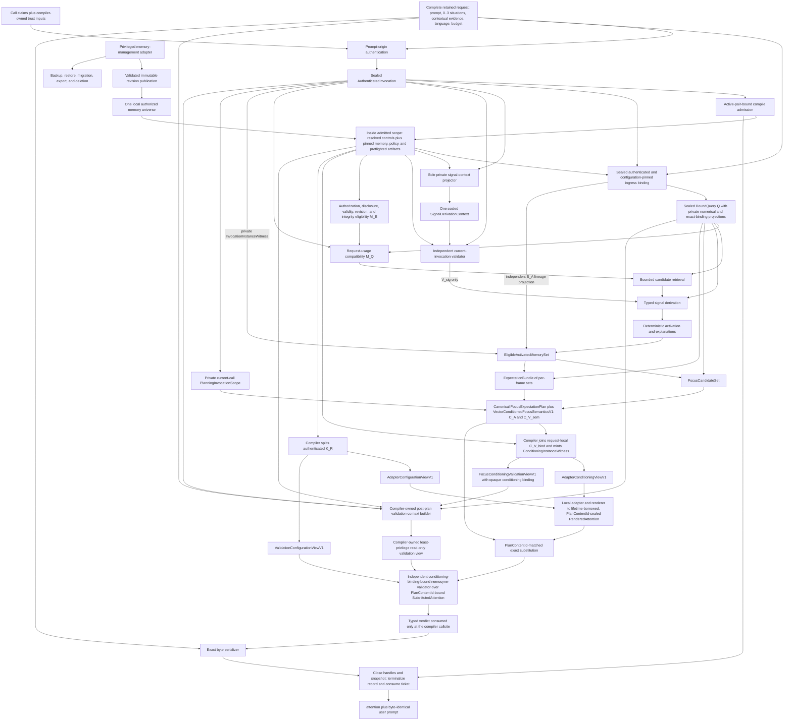

# V1 delivery program

Status: Proposed

## Purpose

This specification turns the accepted V1 product direction into an ordered,
reviewable, and evidence-gated delivery program from research through shipment.
It inventories the current repository truth, assigns one owner to every
contract, records consolidation decisions, defines work-package interfaces,
maps every product requirement to implementation and evidence, and fixes the
dependency and promotion order.

It is not evidence that V1 works and is not permission to implement the entire
architecture at once. A later work package may begin only when its entrance
criteria are met. A simpler component that passes the same gate remains
preferred over a more complex one. A failed premise, safety boundary, or
resource gate stops or narrows the program instead of being hidden by schedule
pressure.

No software can be proved complete for every future environment. In this
program, **V1 complete** means that the frozen supported claim, configuration,
platforms, languages, and failure boundaries pass every named gate with
inspectable evidence and one reproducible release rehearsal. Everything
outside that envelope remains unsupported.

## Definitions

### Program states

| State | Meaning | Promotion condition |
| --- | --- | --- |
| `Proposed` | Contract or work package is documented but not selected or implemented | Focused review and any required accepted decision |
| `Selected` | Scope, owner, dependencies, interfaces, and gates are frozen for one implementation attempt | Entrance criteria and predecessor receipts pass |
| `Implemented` | Code and tests exist for the selected contract | Repository checks and package verification pass |
| `Evaluated` | Frozen implementation has a retained development or calibration receipt | Named component gate passes |
| `Qualified` | One exact artifact/configuration passes its promotion contract | Independent held-out or sealed gate passes |
| `Shippable` | One release candidate passes G0 through G10 | Signed shipment receipt and rehearsal of the selected closed recovery disposition |
| `Stopped` | A mandatory premise or gate failed | New evidence-backed decision narrows, replaces, or ends the path |

These are delivery states, not specification statuses. A work package never
marks a specification `Validated` merely because code exists.

### Current repository inventory

The inventory at the start of this program is:

| Surface | Current truth | Maturity | Program treatment |
| --- | --- | --- | --- |
| `nemosyne-core` activation kernel | Deterministic ranking of already normalized evidence and inhibition signals with explanations | Experimental implementation | Preserve as a replaceable numerical primitive; do not call it the V1 retriever |
| `nemosyne-evaluation` | Deterministic evaluation of fixed activation parameters | Experimental implementation | Reuse for fixed-intermediate evidence only |
| `nemosyne-evaluation-corpus` | Small versioned coding-agent activation corpus | Experimental evidence | Retain as development regression data; never relabel as sealed V1 evidence |
| Product contract | One local semantically read-only compile call returning attention plus byte-identical prompt; only content-free durable admission coordination may change | Proposed specification; historical Decision 0011 is superseded and its retained boundary is carried forward by Decisions 0014 and 0031 | Canonical observable V1 boundary |
| Numerical cognitive memory and focus | Hybrid exact/numerical memory and focus-candidate contract | Proposed specification; earlier terminal focus decision superseded | Canonical focus branch and memory representation boundary |
| Predictive attention | Transition evidence, alternatives, abstention, observation assessment, and support math | Proposed specification, accepted direction in Decision 0014 | Canonical expectation branch |
| Combined planning | One source-bound focus-and-expectation plan plus one sealed vector-conditioned focus input | Proposed specification, accepted direction in Decisions 0014, 0020, 0034, and 0035 | Canonical adapter-facing semantic and numerical object |
| Focus adapter and renderer | Architecture-neutral vector-conditioned adapter, bounded focus shape, optional lexical realization, exact slots, and independent validation | Proposed specification, accepted direction in Decision 0034 | Must not receive memory text, semantic keys/provenance, validator configuration, become a predictor or answerer, or acquire authority |
| Compile-integrity boundaries | Aggregate-only query flow, exact same shared-set instance, distinct runtime/content/configuration identities, exact-byte collision checks, live conditioning-instance binding, independent validation, closed errors, and no partial success | Proposed specification, accepted direction in Decision 0034, re-adopting superseded Decision 0016's integrity rules | Re-adopts the relevant historical 0015/0016 rules without changing the observable result |
| Memory store, encoder, retriever, expectation kernel, planner, renderer, compiler, and CLI | Not implemented | Proposed only | Build in risk order after predecessor gates |
| V1 usefulness and resource claims | No end-to-end observations | Unproven | G1 headroom before broad implementation; G9 sealed evaluation before claim |

### Documentation ownership matrix

Each normative subject has one canonical owner. Other documents link to the
owner and may describe placement but must not redefine the contract.

| Subject | Canonical owner |
| --- | --- |
| Observable input, output, non-scope, and requirements `V1-R01..R25` | [`v1-product-contract.md`](v1-product-contract.md) |
| Component graph, callable API, CLI, persistence concept, trust boundary, resources, and release shape | [`v1-reference-architecture.md`](v1-reference-architecture.md) |
| Privileged management-adapter topology, authority boundary, and compile exclusion | [`v1-reference-architecture.md`](v1-reference-architecture.md); `MEM-03` is the implementation owner |
| Formal obligations, G1/G9 condition roles, experiments, estimands, thresholds, multiplicity, gates, and evidence-receipt semantics | [`v1-proof-program.md`](v1-proof-program.md), specifically `PROOF-G1-CONDITIONS-001`, `PROOF-G1-HEADROOM-001`, `PROOF-EXPECTATION-BRANCH-001`, `PROOF-G9-PROTOCOL-001`, and `PROOF-EVIDENCE-RECEIPTS-001` |
| Cognitive memory planes, numerical facets, activation preparation, consolidation, and `FocusCandidateSet` | [`cognitive-memory-activation-and-focus.md`](cognitive-memory-activation-and-focus.md) |
| `EligibleActivatedMemorySet` eligibility, completeness, lineage, and canonical order | [`predictive-attention-and-expectation.md`](predictive-attention-and-expectation.md); `COMP-01` is only its runtime builder |
| Transition schema, expectation equations, alternative families, uncertainty, abstention, and observation assessment | [`predictive-attention-and-expectation.md`](predictive-attention-and-expectation.md) |
| `FocusExpectationPlan`, roles, closure, cost, selection, controls, plan shapes, `PlanCanonicalEnvelopeV1`, and `PlanContentId` content domain | [`focus-and-expectation-planning.md`](focus-and-expectation-planning.md) |
| Vector-conditioned adapter input, least-privilege adapter/validation views, bounded focus shape and support trace, exact slots, candidate realization, identity sealing, validation, and errors | [`vector-to-attention-renderer.md`](vector-to-attention-renderer.md); `REN-01` first freezes their common boundary through Decision 0034 |
| Aggregate-only compile flow, independently provable shared-set instance, plan-semantic versus renderer configuration identity, authenticated renderer-configuration content equality, least-privilege configuration views, conditioning-instance joins, closed error ownership, bounded ingress, and no partial semantic success | [Decision 0034](../decisions/0034-adopt-vector-conditioned-focus-adapter-boundary.md), re-adopting [superseded Decision 0016](../decisions/0016-adopt-sealed-compile-integrity-boundaries.md), realized by the focused planning, renderer, reference-architecture, and proof specifications |
| Candidate-model cohort, training comparison, promotion thresholds, resource measurement, and deployment artifact | [`local-renderer-model-qualification.md`](local-renderer-model-qualification.md) |
| Existing activation equation and public Rust behavior | [`situation-conditioned-activation.md`](situation-conditioned-activation.md) |
| Fixed-parameter activation evaluation | [`activation-parameter-evaluation.md`](activation-parameter-evaluation.md) |
| Revision-1 activation corpus | [`curated-activation-evidence.md`](curated-activation-evidence.md) |
| Delivery order, work-package interfaces, traceability, risks, and shipment process | This specification |
| Historical rationale | `docs/decisions` |
| Implemented public API | Rustdoc |
| Executable behavior | Tests and retained evidence receipts |

### Consolidation record

Three consolidation passes govern this document set.

| Pass | Conflict or duplication | Resolution |
| --- | --- | --- |
| Semantic | Focus, expectation, goal, action, answer, fact, confidence, and probability were easy to collapse in prose | Canonical distinct types in the predictive-attention specification and requirement `V1-R15` |
| Semantic | “Expectation” could mean one guessed outcome | Finite competing hypotheses grouped only by explicit mutually exclusive alternative family, with unknown and omitted support |
| Semantic | A normalized score could be described as probability | Rename it family-relative evidence share and prohibit probabilistic interpretation until a separate calibrated model passes |
| Semantic | An observed action in a transition could be rendered as advice | Conditions and actions remain distinct; V1 selects no action |
| Architecture | Decision 0011's focus-only product semantics no longer covered qualified prediction | Decision 0011 is superseded by Decision 0014; its local, read-only, one-result, and prompt-integrity boundaries are retained explicitly |
| Architecture | The earlier terminal `AttentionPlan` was focus-only | Decisions 0012 and 0013 are superseded; focus and expectation branch from one shared set and join in `FocusExpectationPlan` |
| Architecture | Focus pruning could erase transition evidence before prediction | Branch from the complete eligible activated set before final plan selection |
| Architecture | Separate renderer calls could diverge | One combined plan, one lexicalization pass, one validator boundary |
| Architecture | Request authority was attached to `Compiler::open` or exposed as a caller-constructible compile input | `Compiler::open` accepts only a bounded untrusted installation locator, resolves bootstrap trust, coordinator capability, and platform handles, then retains only an opaque runtime-registration ticket; each public `compile` accepts only bounded untrusted `CompileCallClaims`, the compiler-owned platform authenticator derives a fresh crate-private `InvocationContext`, and active registries resolve only after per-call admission |
| Architecture | The earlier private-authentication refinement exposed independently mixable projections and overloaded content binding as call identity | One sealed crate-private `AuthenticatedInvocation` owns the complete retained request, authenticated comparisons, trusted authorization time, and fresh call-instance brand; downstream private projectors borrow the aggregate, while one separate nonserializable `InvocationInstanceWitness` preserves call membership without changing semantics |
| Architecture | A free configuration path could bypass installation trust | CLI selects only an authenticated installed configuration identity |
| API | Configuration fingerprint appeared as a second product result | `CompiledPrompt` exposes only compiled bytes; privileged receipts are separate |
| Delivery | Atomic stdout was claimed for an external stream | Buffer before delivery, report exit `10`, and require callers to discard possible partial bytes |
| Mathematical | Compatible outcomes shared one denominator | Normalize only within explicit mutually exclusive alternative families |
| Mathematical | Duplicate and correlated records could multiply support | Content canonicalization plus one bounded support budget per dependency group and family |
| Mathematical | Missing facets and numeric zero were indistinguishable | Retain presence masks and coverage diagnostics even where numerical support is zero |
| Mathematical | Later observation could implicitly rewrite prediction support | Offline assessment uses immutable fixtures; product recomputation requires separately managed evidence and a new explicit compile |
| Mathematical | Planning required an abstention proposition that the expectation set did not supply | Define one exclusive, content-identified, source-bound `FrameAbstentionCandidate` with complete reason/control closure |
| Mathematical | Renderer cost could enter feasibility without a total finite comparison domain or distinguish optional infeasibility from mandatory failure | Define checked nonnegative integer cost domains, empty identities, complete supported-domain bounds, optional infeasibility, mandatory minimum failure, and renderer-owned bound violation |
| Architecture | Bundle serialization order or request-local IDs could silently become semantic planning priority | Keep serialization keys order-only; define static semantic frame, family, and role classes plus separate planning-priority keys |
| Data contract | Transition status and uncertainty had duplicate or undefined ownership | Define complete state/outcome observations, one status field per observation, and distinct observation versus transition uncertainty |
| Mathematical governance | Cross-document notation duplicated formulas and reused symbols | Establish one global notation and derivation-owner registry; focused specifications own formulas and other documents link |
| Mathematical governance | Later refinements left cue absence, graph expansion, executable floating-point normalization, and effective-denominator notation underspecified | Use disjoint present/absent cue states, canonical bounded breadth-by-depth expansion, exact binary-rational accumulation with pinned binary64 division, distinct denominator symbols, and closed typed failures |
| Semantic identity | Frame-local controls and exact values could collide or leak content into model-visible identities | Use one closed frame-qualified expectation-control key domain; let branches carry only a value-, lineage-, and request-independent `ExactSlotOwnerSemanticDescriptor`, let planning alone verify and map that descriptor to `ExactSlotOwnerSemanticKey`, and group exact slots only by the complete `(ExactSlotOwnerSemanticKey, ExactSlotSemanticLocator)` pair; exact content and request-local instances remain privileged sidecars, never semantic or tensor identities |
| Security and validation | Separately supplied query projections, a self-validating signal context, a validator-visible invocation witness, or an injectable validation result could create mixed-call or stale-call joins | Pass one sealed `BoundQuery` aggregate to every downstream boundary, validate the single projected signal context independently against the current sealed invocation, let the compiler alone consume the plan witness and own the private context/product callsite, and expose only a one-way least-privilege read-only view to a no-compiler-dependency validator |
| Compile integrity | Lifetimes, digest equality, reconstructed branch inputs, overloaded configuration access, and request-local validation bindings outside plan identity could not prove one coherent compile | Decision 0034 re-adopts aggregate-only `BoundQuery`, independent invocation/set witnesses, a \(K_R\)-independent `PlanContentId`, exact renderer-configuration identity/content, collision checks, bounded ingress and no partial success from superseded Decision 0016, then adds disjoint configuration views and a private conditioning-instance join |
| Lifecycle integrity | The normative compile sequence skipped admission, durable ticket state contradicted unqualified read-only wording, and update/recovery could reopen access before exact registration and terminal verification | Decision 0031 orders admission before pair-dependent resolution, partitions immutable semantic state from a closed content-free coordination allowlist, and adds update-verification and recovery-registration pending states with fresh generations and deterministic failure handoffs |
| ML research | Parallel learned-predictor slots lacked a typed semantic boundary | Define candidate, abstention, and null slots with frame, horizon, logits, dispersion, and source-attribution constraints without adopting the model |
| Delivery | Implementation order followed component familiarity rather than premise risk | Headroom and evidence harness precede broad architecture implementation |

The consolidation claims above are backed by three named
**non-cryptographic content-bound attestations**. `CONSOL-01..03`,
`REV-01..18`, and `DOC-CONF-24` live at the exact paths declared by the
interim `DOC-00` receipt contract in `docs/receipts/README.md`. Each record
contains its schema version, stable record ID, reviewed relative-path set,
canonical archive algorithm, SHA-256 archive digest, repository commit and
tree, author or reviewer identity, independence declaration where applicable,
UTC completion time, disposition, findings or `none`, and evidence
references. A record is invalid if a required field is absent, its path or ID
differs, the archive cannot be reconstructed, or its digest differs.
Correction before merge replaces the draft at the same exact path; correction
after merge writes a new Git revision at the same canonical path whose
`Replaces` field names the prior record and digest. Git history retains the
earlier revision.

| Receipt / status | Pass and reviewed scope | Current evidence | Reviewer independence and disposition |
| --- | --- | --- | --- |
| `CONSOL-01` / Content-bound attestation | Semantic and mathematical pass over product, memory, predictive, planning, renderer, evaluation, and proof contracts | Exact scope, archive digest, `FND-152..384` reconciliation, and disposition in [`docs/receipts/consolidations/consol-01.md`](../receipts/consolidations/consol-01.md) | Completed only by the referenced record; machine-agent review is not external certification |
| `CONSOL-02` / Content-bound attestation | Architecture/API pass over component graph, authority, interfaces, API/CLI, persistence, renderer, and release | Exact scope, archive digest, `FND-152..384` reconciliation, and disposition in [`docs/receipts/consolidations/consol-02.md`](../receipts/consolidations/consol-02.md) | Completed only by the referenced record; machine-agent review is not external certification |
| `CONSOL-03` / Content-bound attestation | Delivery/evidence pass over packages, dependencies, gates, risks, decisions, and shipment | Exact scope, archive digest, `FND-152..384` reconciliation, and disposition in [`docs/receipts/consolidations/consol-03.md`](../receipts/consolidations/consol-03.md) | Completed only by the referenced record; all empirical choices remain Open |

These attestations are repository review evidence, not digital signatures,
durable evidence custody, external certification, or product validation.
Decision 0022 owns this interim contract. Cryptographic signing, compatible
receipt evolution, and durable custody remain `EVD-01` and Decision 0017.

### Research evidence ledger

Research informs hypotheses and constraints; it does not validate Nemosyne's
implementation or prove biological fidelity.

| Claim used by the program | Source and evidence type | Engineering implication | Limitation and non-proof |
| --- | --- | --- | --- |
| Episodic remembering and imagined future construction recruit overlapping memory systems | Addis, Wong, and Schacter 2007, primary fMRI experiment, “Remembering the past and imagining the future” | Test whether retrieved episode structure can support future-state hypotheses | Neural overlap does not specify a software schema, equation, or benefit |
| Mnemonic prediction errors can bias hippocampal state representations | Bein, Duncan, and Davachi 2020, primary behavioral/neuroimaging experiment, “Mnemonic prediction errors bias hippocampal states” | Preserve transition, temporal, and context structure and test error-sensitive alternatives | Laboratory effects do not prove coding-agent utility |
| Successor-like representations can guide prediction of future events | Ekman, Kusch, and de Lange 2023, primary experiment, “Successor-like representation guides the prediction of future events in human visual cortex and hippocampus” | Treat activated memory as one input to expectation formation | Does not justify treating support as probability or truth |
| Prospection and constructive memory are related but fallible | Buckner 2010 and Schacter et al. reviews | Preserve alternatives, uncertainty, and abstention | Reviews motivate questions; they do not select thresholds |
| Predictions can transform later memories | Bein et al. 2023 review, “Predictions transform memories” | Separate prediction output from independently authorized observation and memory management | Does not imply V1 should learn automatically |
| Attention and expectation can have distinct effects | Zuanazzi, A. and Noppeney, U. (2019), primary experiment, plus Rungratsameetaweemana, N. and Serences, J. T. (2019), review | Keep focus and expectation as separate branches and evaluate their interaction factorially | Experimental definitions vary by task and do not establish Nemosyne's ontology |
| Predictive-processing evidence is mixed and theory-sensitive | Walsh et al. review | State falsifiable software hypotheses and negative controls rather than a universal brain claim | No conclusion about the exact V1 mechanism |
| Set models can represent unordered evidence with learned interactions | Lee et al. 2019, Set Transformer | Retain a learned set predictor as a later comparison after the deterministic baseline | Architecture capacity is not evidence of calibration or superiority |
| Neural confidence is often miscalibrated | Guo et al. 2017 | Never expose model scores as probabilities without a frozen calibration protocol | Classification calibration results do not automatically transfer to expectation sets |
| Distance-aware methods can improve out-of-distribution detection | Sun et al. 2022 | Measure novelty and selective abstention separately from support | OOD score quality is dataset- and representation-specific |
| Selective prediction requires explicit coverage-risk tradeoffs | Gangrade et al. 2021 | Gate positive expectations and report abstention by reason | Theory assumptions may not match generative downstream tasks |
| Local small language models and multilingual checkpoints exist | Official Qwen3 release materials | A local lexicalizer is technically testable | Advertised language support and benchmark scores do not qualify the renderer |
| SQLite supports transactions, WAL, backup, and integrity checks | Official SQLite documentation | It is one viable local persistence candidate to evaluate | Base SQLite does not provide encryption at rest; storage selection remains open |
| Isolated vector-focus feasibility retained more relative behavior with model-native token vectors than with generic semantic embeddings or an aggressive compact codec | Internal synthetic feasibility run, outside this repository and outside the formal evidence path | Keep exact applicability controls outside lossy vectors; compare a deterministic typed baseline before any optional learned realization | Internal synthetic direction only: not G1, V1, factual-memory, downstream-utility, or promotion evidence; no metric is adopted as a threshold |

### Canonical architecture wireframe


```mermaid
flowchart TD
    IN["Complete retained request: prompt, 0..3 situations, contextual evidence, language, budget"] --> ORIGIN["Prompt-origin authentication"]
    CALL["Call claims plus compiler-owned trust inputs"] --> ORIGIN
    ORIGIN --> AI["Sealed AuthenticatedInvocation"]
    AI --> ADM["Active-pair-bound compile admission"]
    ADM --> SNAP["Inside admitted scope: resolved controls plus pinned memory, policy, and preflighted artifacts"]
    IN --> IB["Sealed authenticated and configuration-pinned ingress binding"]
    AI --> IB
    SNAP --> IB
    IB --> Q["Sealed BoundQuery Q with private numerical and exact-binding projections"]
    AI --> SCP["Sole private signal-context projector"]
    SNAP --> SCP
    SCP --> SC["One sealed SignalDerivationContext"]
    AI --> SV["Independent current-invocation validator"]
    SNAP --> SV
    SC --> SV
    DB["One local authorized memory universe"] --> SNAP
    SNAP --> ELIG["Authorization, disclosure, validity, revision, and integrity eligibility M_E"]
    ELIG --> USE["Request-usage compatibility M_Q"]
    Q --> USE
    AI --> USE
    Q --> RET["Bounded candidate retrieval"]
    USE --> RET
    RET --> SIG["Typed signal derivation"]
    Q --> SIG
    SV -->|"V_sig only"| SIG
    SIG --> ACT["Deterministic activation and explanations"]
    ACT --> SET["EligibleActivatedMemorySet"]
    AI -->|"private InvocationInstanceWitness"| SET
    IB -->|"independent B_A lineage projection"| SET
    Q --> F["FocusCandidateSet"]
    SET --> F
    Q --> E["ExpectationBundle of per-frame sets"]
    SET --> E
    F --> PLAN["Canonical FocusExpectationPlan plus VectorConditionedFocusSemanticsV1: C_A and C_V_sem"]
    E --> PLAN
    AI --> PS["Private current-call PlanningInvocationScope"]
    PS --> PLAN
    PLAN --> LIVE["Compiler joins request-local C_V_bind and mints ConditioningInstanceWitness"]
    SNAP --> LIVE
    LIVE --> AV["AdapterConditioningViewV1"]
    LIVE --> CV["FocusConditioningValidationViewV1 with opaque conditioning binding"]
    SNAP --> KS["Compiler splits authenticated K_R"]
    KS --> AK["AdapterConfigurationViewV1"]
    KS --> VK["ValidationConfigurationViewV1"]
    AI --> VC["Compiler-owned post-plan validation-context builder"]
    IN --> VC
    Q --> VC
    SNAP --> VC
    CV --> VC
    AV --> R["Local adapter and renderer to lifetime-borrowed, PlanContentId-sealed RenderedAttention"]
    AK --> R
    PLAN --> SUB["PlanContentId-matched exact substitution"]
    R --> SUB
    VC --> VV["Compiler-owned least-privilege read-only validation view"]
    SUB --> V["Independent conditioning-binding-bound nemosyne-validator over PlanContentId-bound SubstitutedAttention"]
    VV --> V
    VK --> V
    V --> VERDICT["Typed verdict consumed only at the compiler callsite"]
    VERDICT --> SER["Exact byte serializer"]
    IN --> SER
    SER --> CLOSE["Close handles and snapshot; terminalize record and consume ticket"]
    ADM --> CLOSE
    CLOSE --> OUT["attention plus byte-identical user prompt"]

    ADMIN["Privileged memory-management adapter"] --> PUB["Validated immutable revision publication"]
    PUB --> DB
    ADMIN --> REC["Backup, restore, migration, export, and deletion"]
```

The compile path has read-only semantic-storage capabilities plus the sole
narrow `IF-COMPILE-ADMISSION` capability for closed content-free coordination
transitions. Provisioning, memory management, artifact installation, training,
calibration, and evaluation are separate offline or privileged paths. `MEM-03`
owns the privileged management-adapter boundary; the compiler dependency graph
cannot construct or receive that adapter.

Renderer and validation lifetimes prevent a candidate or context from
outliving its borrowed plan and prevent unchecked detachment; they do not
prove that two borrows refer to the same object. The deterministic
`PlanContentId` derived from complete canonical plan content is the sole
candidate-to-plan content identity. The independently sealed
`RendererConfigurationId` identifies the exact authenticated \(K_R\), which
contains every applicable renderer implementation, artifact, precision,
platform-dependent execution selection, resource limit, and other field
capable of changing emitted bytes. Decoder, tokenizer, vocabulary, lexical
model, generation, and decoding fields are present only for a candidate that
uses them and otherwise carry closed explicit absent variants. Equal
configuration IDs therefore imply byte-identical output for successful,
uninterrupted execution over equal plan content and equal deterministic
work-unit, byte, and memory ceilings; a target-platform class groups claims
only and is not an execution identity. Separately constructed
canonical-content-identical plans under matching \(K_R\) must independently
yield identical substitution, validation, and product bytes under that
semantic execution domain. Their live candidate wrappers are not
interchangeable across distinct opaque conditioning bindings. The
compiler quarantines equal `PlanContentId` with different retained canonical
bytes before validator entry; the independent validator owns ordinary
candidate/validation-view `PlanIdentityMismatch` and
`RendererConfigurationMismatch`.

Throughout this program, semantic determinism excludes invocation-local
wall-clock observations, cancellation transitions, and output-transport
behavior. Deterministic byte, work-unit, and memory ceilings are part of the
authenticated semantic execution domain. A claim that an interrupted attempt
returns the same typed outcome additionally requires the same deadline
identity, start instant, cancellation-token generation, observed external-event
trace, and transport behavior. Changed external observations may change
success into a typed operational failure without changing renderer semantics;
every such failure still returns no partial product result.

`API-01` authenticated preflight is the sole trust-establishing constructor of
immutable shared-domain `AuthenticatedRendererConfiguration` values. Compiler
context construction and exact substitution borrow the complete value. The
compiler alone derives unconstructible, nonowning
`AdapterConfigurationViewV1` and `ValidationConfigurationViewV1` values for
their respective domains. Both carry the selected `RendererConfigurationId`
and exact full-\(K_R\) commitment, but neither is an independently
authenticated partial configuration. The adapter view excludes verifier
artifacts, thresholds, calibration, validation-corpus identities, and
validator-only limits; neither view exposes the other's fields. Referent
identity is not the contract: separately authenticated canonical-content-
identical full values are equivalent, while unauthenticated partial
reconstructions or same-ID/different-byte values fail closed. No value or view
grants trust-resolution, update, filesystem, network, registry, installation,
or artifact-mutation capability.

### Work-package contract

Every work package is one normalized record joined by `id` across the full work
breakdown, execution metadata, responsibility, verification, dependency, and
gate registries in this specification. Absence is never inferred: an
inapplicable field is written as `none` with a reason. Every package except the
bootstrap `DOC-00` package is `Proposed`; changing one to `Selected` requires
its named entrance receipt, an accountable human assignment, and any required
accepted decision. The source-owned bootstrap selection below governs
`DOC-00`.

The canonical record is:

```text
WorkPackage
├── id, concise title, status, work type, priority, milestone, and target date
├── owner role and accountable human (`unassigned` until selection; no target
│   date before a human and high-confidence estimate are recorded)
├── objective, user value, and architecture value
├── product requirements and canonical specifications
├── accepted decisions or explicitly open decision
├── explicit predecessors, entrance receipts, and unlocked successors
├── exact scope and non-scope
├── versioned interfaces and artifacts consumed and produced
├── likely files or crates
├── documentation, mathematical, API, and migration impact
├── deterministic tests, adversarial cases, benchmarks, and proof obligations
├── security and privacy review
├── failure behavior and rollback or deletion path
├── measurable acceptance criteria and evidence required before merge
├── complexity estimate and estimate confidence
├── parallel lane and authority-surface conflicts
├── normal or stacked pull-request mode and stack parent
└── contributed gates and residual risks
```

A package is the smallest mergeable unit whose behavior, tests,
documentation, and rollback remain coherent. A pull request may implement one
package or a tightly coupled pair only when the dependency table explicitly
permits stacking. It may not combine an upstream experiment with downstream
production adoption before the evidence is reviewed.

`WorkType` is one of `Documentation`, `Decision`, `ResearchSpike`,
`Implementation`, `Evaluation`, `Qualification`, `Integration`,
`Verification`, or `Release`. Complexity is independently one of `S`, `M`, or
`L`; a research spike is not itself a complexity estimate. Every estimate also
states `low`, `medium`, or `high` confidence. A low-confidence estimate is
planning metadata, not permission to expand scope, and must be replaced by a
measured estimate before selection.

#### DOC-00 bootstrap selection

`DOC-00` establishes the lifecycle and attestation schema that later packages
consume, so it cannot depend on an earlier receipt in that same schema. This is
the sole bootstrap exception:

| Field | Selected value |
| --- | --- |
| Package state at source freeze | `ReviewReady`; the separate evidence commit may advance only to `MergeAuthorized` |
| Owner role | Principal architect |
| Accountable human | `EliasPapavlassopoulos` |
| Selection and target | Selected `2026-07-24`; target `2026-07-24` |
| Estimate | `L-high`, based on twelve non-template specifications, Decisions 0011–0031, three consolidation perspectives, eighteen fixed review perspectives, one deterministic governance checker, and the complete repository verification suite |
| Predecessors and entrance | None; `DOC-00` is the dependency-free `W00` package and its accepted predecessor decisions were present on `main` |
| Interfaces | None; the package changes no runtime or cross-package interface |
| Artifact plan | Freeze one specification-and-decision commit, bind three consolidations and eighteen independent reviews to it, then add one separate merge-authorization evidence commit |
| Test plan | Structural and negative-fixture checks before the source freeze; all repository checks, strict archive reconstruction, exact receipt-set validation, and change-aware documentation validation before merge authorization |
| Security, privacy, and migration | Documentation-only; no private user data, secret, runtime authority, capability, network behavior, or migration enters the artifact |
| Pull-request mode | Normal `task/complete-doc-00` pull request; **Rebase and merge** is mandatory and squash is forbidden |
| Rollback | Revert the integrated DOC-00 commit range before selecting a successor package; retain failed review evidence in Git history |

`DOC-CONF-24` with all subordinate passing attestations authorizes the merge but
does not claim that the branch is already merged or promoted. G0 closes only
when `main` contains the direct, ordered, content-equivalent rebased DOC-00
source/evidence pair and the strict main-push CI run passes. The accountable
human's merge action is the G0 promotion decision; this state is derived from
exact ancestry, content bindings, and CI evidence, never from age.

Two packages may share a parallel lane only after all predecessors pass and
only when the parallel-safety registry shows no incompatible edit to the same
authority surface. A stacked pull request is never a substitute for an
unpassed gate.

### Full work breakdown

#### Foundation and premise

| ID | Concise title, objective, scope, and non-scope | Depends on | Acceptance and exit evidence | Contributes to |
| --- | --- | --- | --- | --- |
| `DOC-00` | **Re-found the V1 contracts.** Reconcile all canonical documents; add Decisions 0014–0038; supersede Decisions 0011–0013, 0015, 0016, 0019, 0023, and 0028 without rewriting their history; retain conflict and ownership maps; establish the interim content-bound attestation contract and deterministic delivery-program checker; reject any tracked root `.gitattributes` or nested `docs/**/.gitattributes` that could transform the reviewed archive; no production code or selected empirical threshold | None | Documentation checks; `scripts/check-v1-delivery-program.py` and `scripts/test-v1-delivery-program-check.sh`, including hostile root/nested archive-attribute fixtures; three content-bound consolidation attestations; eighteen independent content-bound review attestations; and current committed-archive conformance attestation governed by Decisions 0022, 0033, 0034, 0035, 0036, 0037, and 0038 | G0 |
| `EVD-01` | **Establish the evidence envelope.** Implement the sole versioned experiment manifest and the three disjoint pre-access results owned by `PROOF-EVIDENCE-RECEIPTS-001` and Decisions 0017 and 0025. A guarded rejection persists no raw attempted bytes or raw prefix: only domain-separated digest, length, completeness, typed stage and field, allowlisted established identities, closed reason, and a custodian-signed `PreAccessGuardWitnessV1::RejectedAttempt` bound to that attempt and commitment without fabricated run identity. Missing, invalid, wrong-subject, or mismatched guard evidence instead produces the validator-authenticated minimal `PreAccessCustodyFailureRecord`, which blocks access but makes no custody or no-access claim. A full reconstructible `ValidExperimentReceipt` exists only after the sole checked `ValidForOutcomeAccess::new` transition accepts a matching `ValidatedRun` witness and binds the complete execution identity. Preserve semantic-lineage split, failure retention, baseline runner, and deterministic analysis skeleton; no product algorithm | `DOC-00` | Golden valid, rejection, and custody-failure results; digest/length/completeness reconstruction; raw-byte, raw-witness, and secret-canary non-retention; allowlisted-field enforcement; rejection-witness attempt/kind/commitment/explicit absent-versus-established sealed-source matching with fixed error precedence, cross-attempt and source-state replay rejection, and no partial receipt; successful admission matching over the same attempt, exact signed run manifest, sealed source, validation window, closed validation/analysis principal sets, capability state, and access/analysis ledger boundaries; wrong-variant and field-by-field missing/invalid/mismatch errors with fixed multi-mismatch precedence; exact three-way result totality; no false custodian/no-access claim; no admission value or capability on either failure; permutation and multiple-corruption fixtures; rejection of fabricated identities, outcome dispositions, analysis ingress, unchecked construction, or mismatched witness scope; and reproducible failed and inconclusive valid runs. A valid witness is conditional evidence for the controlled custody system, never universal proof that no computation occurred | G2 and evidence entrance |
| `TGT-00` | **Freeze the G1 evaluation envelope.** Instantiate, without redefining, the seven closed expert-authored conditions and all pre-outcome statistical, matching, safety, multiplicity, exposure, lineage, and missingness contracts owned by `PROOF-G1-CONDITIONS-001`, `PROOF-G1-HEADROOM-001`, and `PROOF-EXPECTATION-BRANCH-001`. The set includes original-prompt, situation-only, matched-size placebo attention, focus with a frozen neutral expectation carrier, correct expectation, deliberately wrong expectation, and explicit abstention. The expert-attention conditions share independently authored focus, language, placement, tokenizer identity, effective budget, and exact token count; only the typed expectation intervention changes. Wrong-expectation harm, anchoring, and leakage are safety upper bounds, never required positive effects. Freeze one G1-local family-wise or sequential multiplicity procedure across every mandatory G1 comparison, cohort, subgroup, repetition, and seed aggregation. Adapter candidate families, candidate-specific hyperparameters, optional decoder/tokenizer artifacts, precision pairs, release gates, and fallbacks remain exclusively in later renderer qualification. Never alias G1 identities or evidence with G9; no operational or release claim | `EVD-01` | Independently reviewed, content-identified envelope whose construction and controls resolve every required field in the three proof anchors, including the seven-role injective map, neutral carrier, placebo comparison, exact tokenizer/count equality, correct-contribution and both wrong-control differentiation estimands, upper-bounded negative-control harms, G1-local family-wise/sequential multiplicity, complete exposure, unsupported cases, and one complete signed G1 execution identity plus matching guard witness before outcomes. Invalid attempts retain only the owner-defined guarded rejection or custody-failure result and never obtain a valid envelope identity | G1 entrance |
| `EVD-02` | **Test product headroom.** Execute exactly the frozen seven-condition `TGT-00` envelope and evaluate only the owner-defined estimands and gates in `PROOF-G1-HEADROOM-001` and `PROOF-EXPECTATION-BRANCH-001`. Evaluate focus against both no-attention baselines and matched-size placebo; evaluate correct contribution and both wrong-control differentiation checks without requiring the wrong intervention to harm; apply only the frozen G1-local multiplicity procedure across its mandatory comparisons, cohorts, subgroups, repetitions, and seed aggregations. Validate the complete envelope, execution identity, and matching guard witness before outcomes; invalid envelopes are rejected rather than observed as `Inconclusive`. After valid access, owner-defined missing, invalid, empty, zero-denominator, or underexposed cells become `Inconclusive` before affected arithmetic. Preserve G1 evidence for audit only and never tune or reuse it in renderer qualification or G9 | `EVD-01`, `TGT-00` | Blinded seven-condition execution and one retained pass, fail, or `Inconclusive` receipt reconstructing every proof-owned headroom, placebo, contribution, both semantic-differentiation, sensitivity, harm, anchoring, leakage, exposure, subgroup, and G1-local multiplicity result without copying their normative formulas into this program | G1 |
| `BND-01` | **Encode formal boundary fixtures.** Implement executable fixtures for authorization, snapshots, exact slots, transition alternatives, abstention, plan roles, and prohibited capabilities; select no implementation technology | `EVD-01` | Every F1–F17 obligation has at least one positive fixture and one counterexample | G2 |
| `TGT-01` | **Freeze the operational envelope.** After G1, freeze a supported subset of the `TGT-00` task, agent, and language cohort, hardware and OS cohort, installation and redistribution profile, process topology, model-residency policy, deterministic inference boundary, offline boundary, measurable resource ceilings, and exact finite positive `AbsoluteIngressLimitsV1` ceilings for every prompt source plus aggregate request bytes. Installed configurations may only lower those public context-independent limits; select no model, storage engine, or semantic algorithm | Passing G1 receipt from `EVD-02` | Accepted operational-envelope decision and content-identified conformance manifest with unsupported cases and exact absolute ingress ceilings | G3 entrance |
| `SEC-00` | **Freeze the security architecture.** Select principals, prompt origin, trust roots and rotation, request authority, snapshot revocation, capability/process graph, no-network enforcement, management and diagnostic authority, secrets, and failure posture before production code | `BND-01`, `TGT-01` | Accepted threat model and security decision, misuse cases, boundary fixtures, and zero unresolved architecture-level critical finding | G3 entrance |

#### Dependency-light semantics

| ID | Concise title, objective, scope, and non-scope | Depends on | Acceptance and exit evidence | Contributes to |
| --- | --- | --- | --- | --- |
| `CORE-01` | **Implement canonical primitives.** Inventory and reuse the existing public `CandidateId`, `ChannelId`, `UnitInterval`, and evaluation-owned `ScenarioId`; add only nonduplicative validated identifiers, finite values, presence states, schema and configuration identities, domain-separated typed content identities, provenance roots, dependency groups, authority labels, and canonical ordering. A typed-content collision exists only when two distinct canonical envelopes independently recompute as digest-valid under the same complete identity regime and produce one typed ID; a supplied ID that does not recompute from its bytes is `ReferenceMismatch`, not a collision. No storage or runtime model | Passing G1 receipt from `EVD-02`, `BND-01` | Public-contract, old/new-path compatibility, deprecation, downstream compile, arbitrary-order, primitive-duplication, canonical-byte identity, reference-mismatch versus collision precedence, and dependency tests | G3 entrance |
| `CORE-02` | **Implement shared domain records.** Add request, situation, memory-facet, checked content-derived `ExactSidecarSchemaDefinitionV1`/`ExactSidecarSchemaId`, `ExactSidecarIdentityRegimeV1`/`ExactSidecarIdentityRegimeId`, `ExactSidecarCustodyDomainDefinitionV1`/`ExactSidecarCustodyDomainId`, `ExactSidecarContentEnvelopeV1`/`ExactSidecarContentId`, `ExactSidecarRefV1 { regime_id, schema, content_id }`, and record-bound `ExactSidecarCustodyBindingV1 { custody_domain_id, sidecar_ref }`; the closed `AuthoritativePropositionSourceV1::{Request, Memory}` union and immutable projections; versioned source-tagged social identity; opaque `SignalDerivationContext`; validated `SignalValues`; spreading-graph; `EligibleActivatedMemorySet`; private noncloneable `EligibleSetInstanceWitness<'call>`; `SemanticConfigurationId`; `PlanSemanticSourceProjectionV1`; and public `AbsoluteIngressLimitsV1` domain contracts. Schema, regime, and custody-domain IDs derive from their complete immutable bounded definitions and expose no rebind path. Exact-sidecar and authoritative-projection constructors canonicalize complete bounded content, and nested record references may target only an already published, independently verified prior revision, never self or the same publication. The signal context exposes no public constructor or authority-bearing field; only validated values expose read-only signal inputs; ingress limits are finite, positive, versioned, and can only be narrowed by installed configuration; no authentication aggregate, encoding, retrieval, signal algorithm, shared-set construction, persistence, or sidecar publication | `CORE-01`, `SEC-00` | Cross-object lineage; schema/regime/custody-domain content derivation and no-rebind; exact-sidecar reference/custody canonicalization and identity; prior-revision reference well-foundedness and cycle exclusion; exhaustive Request/Memory source-tag handling and cross-plane joins; authoritative-projection and record-version binding; authority; social-schema/source-tag; signal-context field/privacy; graph-shape; invalid-state; brand-erasure; canonical order; set-witness privacy/nonsemantic behavior; \(K_S/K_R\) projection; and ingress-limit validation tests | G3 entrance |
| `EVAL-01` | **Implement typed evaluation payloads.** Add generic case, split, metric, comparison, and payload types inside the `EVD-01` receipt envelope; do not redefine the envelope or add runtime dependencies | `EVD-01`, `CORE-01` | Deterministic payload reconstruction and permutation tests | G3 entrance |
| `EVAL-02` | **Govern evaluation corpora.** Add a counterexample-corpus registry with semantic-root split enforcement and coverage reports, including content-derived schema/regime/custody identities, exact-ref/custody rebind or corruption, record/regime/schema/custody prelookup precedence and no-side-effect failure, reference mismatch versus complete-domain collision quarantine, all three collision origins, live-resource-safe idempotent finalization, atomic concurrent-reader revocation and final-release fencing, full witness/custody/tombstone collision recovery under both new-regime and erasure branches, nested-reference typed failures and inbound-reference erasure, complete custody-ledger/no-resurrection behavior, ordinary same-regime versus collision new-regime recovery, exhaustive Request/Memory joins, paired eligible-set planes, all unordered consolidation pairs, nontransitive compatibility triads, canonical complete-link partitioning, optimized equality-witness failures, every explicitly enumerated variant of all six `FocusCandidateError` inner families, numerical-order-only perturbations, and derived-only versus exact-only consolidation cases; do not admit model-generated truth | `EVAL-01`, `BND-01` | Leakage rejection, corpus-inventory, content-identity receipts, and required schema/regime/custody/sidecar/collision-origin/resource/fence/recovery-branch/two-plane/pair-completeness/closed-error counterexample coverage | G3 entrance |

#### Predictive semantics and planning

| ID | Concise title, objective, scope, and non-scope | Depends on | Acceptance and exit evidence | Contributes to |
| --- | --- | --- | --- | --- |
| `EXP-01` | **Implement predictive domain contracts.** Add transition, condition, horizon, outcome, status, alternative-family, query, and typed `TransitionReliability { schema, state, migration }` records. The sole checked authoritative-record constructor derives `TransitionRecordVersionId` from the closed `TransitionRecordVersionEnvelopeV1`, which includes the record-bound `ExactSidecarCustodyBindingV1 { custody_domain_id, sidecar_ref: ExactSidecarRefV1 { regime_id, schema, content_id } }`; `TransitionId` identifies one logical transition chain, while every exact-content correction, identity-regime rotation, custody-domain change, or reliability migration creates a distinct immutable version. Schema, regime, and custody-domain IDs are content-derived from complete definitions. The sidecar preimage excludes the record-version ID, and every nested record reference points only to an already verified prior published revision, so the association remains well founded. Add a pure checked `TransitionFacetArtifact` constructor that validates the complete artifact schema, source-version ID value, transform/revision, encoder/vector spaces, and canonical facet manifest and derives its content identity without claiming that the source exists or publishing anything. `ReliabilityState` is exactly `Derived { value, derivation, calibration_domain }`, `Missing`, `Unknown`, or `Inapplicable`; optional migration lineage binds the migration ID, exact source record version/schema, typed `ReliabilityMigrationSource`, and source-state digest. `EXP-01` owns only dependency-light logical schemas, validation, and identities; `MEM-02/03` own physical existence and publication. No prediction algorithm, store dependency, compile-time auto-migration, opaque sidecar locator, or reverse record/artifact edge | `CORE-02`, `EVAL-02` | Closed-envelope field/exclusion; content-derived schema/regime/custody definitions; exact ref and record-bound custody pinning; prior-revision reference and typed nested-reference fixtures; same-regime/schema/custody byte identity preserves content identity while regime rotation, custody change, or exact-content mutation changes the containing record-version identity; pure artifact canonicalization/identity fixtures; logical-chain/version constructor and uniqueness; deterministic version order/tie-break; derived `0`/`1`; unavailable-state; schema/domain compatibility; every source/target-version migration; policy-permitted exact rollback; and rejection of malformed fields, caller-supplied identity, `ReferenceMismatch`, independently established identity collision, stale/missing/mismatched migration, contradiction, exclusivity, or incomplete lineage. Source existence, publication atomicity, revision-pinned revalidation, custody-ledger state, and retention/erasure eligibility are explicitly deferred to the management/read boundaries | G3 and G7 |
| `EXP-02` | **Implement the deterministic expectation baseline.** Consume the complete sealed shared set and propagate both its invocation-instance and set-instance witnesses unchanged. Add typed reliability admission before \(\alpha\), piecewise \(\alpha\) with no fabricated neutral reliability, hard eligibility, facet compatibility, dependency budgets, grouping, medoids, relative support, diagnostics, finite alternatives, abstention, distinct lineage-bearing instance versus lineage-independent `ExpectationItemSemanticKey` identities, and one closed frame-qualified `ExpectationControlSemanticKey` union; define \(E_{\mathrm{cov}}\) by the coverage threshold and compute \(\Gamma\)/novelty maxima only over \(E_{\mathrm{cov}}\), with distinct empty-\(E\) and empty-\(E_{\mathrm{cov}}\) behavior; no learned predictor or probability | `EXP-01` | Hand calculations, both-witness propagation, same-call reconstructed-set distinction, reliability-admission failures, item/control semantic-key collision, cross-frame control collision, lineage-renaming, split-maxima counterexample/oracle, no-qualified-coverage, F13–F16 properties, and exhaustive small-case oracle | G3 and G7 |
| `EXP-03` | **Evaluate expectation semantics.** Add a versioned evaluator and curated corpus for alternatives, dependence, typed reliability compatibility/migration/lineage, unknown support, abstention, later observations, numerical boundaries, empty qualified coverage, and split maxima. Its checked observation-assessment constructor keys relations by exact prior `ExpectationHypothesisInstanceId` and accepts only a complete canonical one-to-one map over that immutable prior; no runtime calibration | `EXP-02`, `EVAL-02` | Reproducible reports; incompatible reliability schema/domain, missing/unknown/inapplicable, registered/unregistered migration, exact-lineage, high-coverage/distant plus low-coverage/near counterexamples; unknown, duplicate, missing, or extra hypothesis-instance key rejection with no partial report; permutation-invariant canonical maps; and two intentionally different kernel configurations | G3 and G7 |
| `PLAN-01` | **Construct focus candidates.** Own the outer `focusCandidates(&BoundQuery, &EligibleActivatedMemorySet<'call>, K) -> FocusCandidateSet` boundary. Its internal `deriveRequestPropositions` substep creates the ephemeral `RequestPropositionSet`; the outer boundary copies the five-field receipt solely from the shared set's \(\Lambda_A\), preserves both private invocation-instance and set-instance witnesses solely from that complete set, performs pure authority-lowering source mapping, and runs request-local/memory-supported two-plane consolidation over the one complete frozen activated input produced by `COMP-01`. It validates every Request or Memory source against its distinct complete receipt, attribution, record/artifact/revision, sole custody binding, and lineage join before grouping; a Memory source cannot carry or reconstruct a parallel free sidecar ref. Numerical meanings may only order the complete already-admitted pair/comparison work and contribute bounded relevance; compatibility, equivalence, grouping, exact-value agreement, scope, attribution, provenance, disclosure, authority, validity, supersession, and conflict come exclusively from the independently validated tagged authoritative projections. The bounded reference algorithm flattens each record's canonical proposition-plane sources, defines \(n=n_Q+\sum_i|\mathcal S_i^M|\), checks the authenticated per-record, source, workspace, and \(n(n-1)/2\) ceilings before materialization, enumerates every unordered tagged-source pair, defines equivalence as equality of canonical `EquivalenceIdentityProjectionV1` keys, and constructs the canonical first-compatible complete-link partition in tagged-source order. An optimized path is admissible only with machine-checked `ExhaustiveConsolidationPairSetWitnessV1` binding that exact flattened source-set identity, complete unordered pair set, equivalence-contract identity, and checked pair-work ceiling. Pair-work overflow returns `FocusCandidateError::Consolidation(PairWorkCapacityExceeded)`; `FocusCandidateError::Capacity` is reserved for post-consolidation candidate construction. Failure returns no partial set and exactly one closed `FocusCandidateError` in outer precedence `EligibleActivatedSet`, `RequestProposition`, `AuthoritativeProjection`, `Consolidation`, `Capacity`, then `CandidateInvariant`; within one stage, closed inner declaration order and then the smallest canonical source, pair, cluster, or candidate key select the retained typed source. `FocusAggregateValidationError`, `RequestPropositionError`, `AuthoritativePropositionProjectionError`, `PropositionConsolidationError`, `FocusCandidateCapacityError`, and `FocusCandidateConstructionError` are each finite, explicitly enumerated owner-defined sums; every variant has exactly one public compile class, CLI exit, retry posture, and disposition. Missing, stale, mismatched, derived-only, exact-only, same-publication-reference, cross-plane, free-ref, or unvalidated inputs fail closed. The package receives no independently supplied \(Q_{\mathrm{num}}\), \(B_Q\), \(\Lambda_A\), witness, principal, policy object, authorization view/service, or direct authorization projection and performs no store reread, current-call or selected-set witness validation, authorization, expectation derivation, final budget selection, shared-set construction, or persistent write | `CORE-02`, `EVAL-02`, `SIT-01`, `COMP-01` | Sealed-aggregate construction and no-auth dependency; mandatory `COMP-01` predecessor; whole-query and whole-shared-set input tests; compile-fail split-projection/witness/free-ref inputs; fixed-\(B_Q\) noninterference under permitted nonsemantic instance changes; malformed/different whole-query join rejection; mismatched request/situation/configuration; prompt/situation/metadata locator/content binding; five-field receipt lineage; both-witness preservation without current-call/selected-set classification; same-call reconstructed-set distinction; exhaustive Request/Memory tag and cross-plane join handling; independent validation of every singleton and pair member; zero/one/many proposition sources per record; exact flattened source and unordered-pair count/set; equivalence-key laws; nontransitive compatibility triads; canonical complete-link and permutation invariance; omitted/extra pair, activated-record-count substitution, plus wrong source-set, pair-set, equivalence-contract, ceiling, or optimized witness rejection; pair-overflow versus post-consolidation-capacity error ownership; reference/optimized equality; all six outer tags plus every explicitly enumerated variant of all six closed inner families, including projection-limit and exact-slot-conflict mappings, one-to-one public adaptation, within-stage precedence, typed-source retention, and no partial set; identical-vector/different-authoritative-meaning separation; numerical reordering cannot change admission, compatibility, equivalence, or partition; missing/stale/cross-bound projection rejection; exact-only non-equivalence; valid two-plane consolidation; all twelve typed proposition reasons; duplicate; conflict; authority-ceiling; provenance; bounded-candidate; and empty-memory situation-only focus tests | G4 entrance and G7 |
| `PLAN-02` | **Select the combined plan.** Add `FocusExpectationPlan`, branch-tagged `PlanItemSemanticKey`, `RelationSemanticKey`, mandatory closure, exhaustive reference selector, cost contract, plan shapes, controls, immutable branch-owned `PlanningSourceProjection` fields, `PlanSemanticSourceProjectionV1`, `SemanticConfigurationId`, one compiler-private `PlanningInvocationScope` independently borrowed from both the current sealed invocation and the exact selected shared set, and a minimized permissionless exact-surface inventory with content-independent semantic slot assignment. Validate each branch's invocation and set-instance witnesses against that scope before copying only the scope's invocation witness into the live plan; branch-to-branch agreement alone is insufficient and the set witness is erased after the join. Canonical plan identity uses \(K_S\), \(d_R\), \(d_S\), and selected lineage-independent semantics, excluding full configuration-bound IDs, \(B_Q\), \(\Lambda_A\), \(K_R\), and both instance witnesses. Owning focus or expectation constructors reject invalid descriptor construction/schema/shape as typed `InvalidExactSlotSemanticDescriptor` before admitting a branch projection. Accept only admitted pre-planning `ExactSlotOwnerSemanticDescriptor` values that exclude exact value, surface bytes/content identity, and lineage/request-local identities; for every selected item-owned binding independently derive its owner descriptor from the fixed source item's non-slot semantics, reject inequality after admission as `SourceProjectionViolation`, and perform the sole `mapExactSlotOwner` conversion to `ExactSlotOwnerSemanticKey`. Reserve ordinary `InvalidExactSlot` for a planning-owned locator, mapped-owner, or plan-shape failure after source equality passes. Group mapped exact bindings only by `(ExactSlotOwnerSemanticKey, ExactSlotSemanticLocator)` before constructing `SlotSemanticKey` and contiguous renderer-slot identities. Consume no principal, policy service, authorization/disclosure view, live grant, caller-supplied final owner/slot key, or lexical generator, and perform no optimized approximation | Passing G3 receipt from `EXP-03`, `PLAN-01` | Exact small-fixture oracle; paired valid same-content calls; distinct valid invocation/set witnesses and corresponding nonsemantic instance identities; missing, mixed, expired, foreign, mutually agreeing foreign, and same-call reconstructed-set rejection against independently anchored scope; \(K_R\)-only/full-bound-ID noninterference for `PlanCanonicalEnvelopeV1`/`PlanContentId`; \(K_S\) sensitivity; equal-priority one-of-two selection; item/control/relation semantic-key collision; upstream invalid descriptor construction/schema/shape retaining `InvalidExactSlotSemanticDescriptor`; exact-value-free valid item/shared owner-descriptor mapping; independent non-slot owner rederivation; admitted owner-descriptor mismatch as `SourceProjectionViolation → InternalInvariantViolation → 70`; planning-owned locator/mapped-owner/shape failure as `InvalidExactSlot`; cross-item descriptor attachment rejection; recursion avoidance; compile-fail upstream final-owner/final-slot inputs; owner/locator grouping and same-locator/different-owner coexistence; conflicting complete owner/locator pair; ceiling-meet/lowering; source projection; and exact-value noninterference only under fixed type, final owner key, locator, role, bounds, complete semantic bindings, schema, and formatter; exact-value-independent slot key/ID/order/tensor identity, inventory minimization, ambient-authority noninterference, every closed `PlanningError` disposition, budget, alternatives, control-only, and no-action tests | G4 entrance and G7 |

#### Renderer feasibility

`REN-01` begins by freezing the common vector-conditioned adapter, focus-shape,
support-trace, realization, and render-domain contracts before any renderer
source is added. Decision 0034 makes that package the owner of a
dependency-light shared `nemosyne-render-domain` surface containing only sealed
adapter input, validator-only support/provenance input, opaque candidate,
configuration, and content-identity records with checked, non-forgeable
constructors. The compile orchestrator alone splits one
`VectorConditionedFocusInputV1` into disjoint
`AdapterConditioningViewV1` and `FocusConditioningValidationViewV1` values.
Adapters cannot import or inspect the validator-only view. Renderer, validator,
and compiler may depend on the shared domain; the validator never depends on
adapter implementation or compiler-private types. Decision 0034 also preserves
the eleven substitution variants and their deterministic precedence while
leaving the empirical adapter family open.

| ID | Concise title, objective, scope, and non-scope | Depends on | Acceptance and exit evidence | Contributes to |
| --- | --- | --- | --- | --- |
| `REN-01` | **Implement the deterministic focus-adapter baseline.** Add one model-free candidate whose sole checked entry point accepts `&AdapterConditioningViewV1` plus `&AdapterConfigurationViewV1`, both compiler-derived from the live conditioning input and complete authenticated immutable `AuthenticatedRendererConfiguration` \(K_R\). It uses admitted query/task vectors, actual selected semantic memory vectors, finite weights, masks, language, bounds, and dense adapter handles and emits one `UntrustedBoundedFocusShapeV1` with an opaque equality-only binding derived from the private conditioning-instance witness and the common closed `FocusSupportTraceV1`; no memory text, semantic key, validator configuration, or validator-only provenance is present. Deterministic realization then recomputes `PlanCanonicalEnvelopeV1`, seals `PlanContentId`, private plan-byte comparison commitment, separate `RendererConfigurationId`, and private exact canonical-\(K_R\)-byte commitment in opaque `RenderedAttention<'plan>`. Exact-slot substitution compares configuration ID/content, plan ID/bytes, slots, exact surfaces, and final cost in fixed order. Preserve the closed eleven-variant `RendererSubstitutionError`; every variant maps totally and returns no partial candidate. The adapter configuration view exposes no verifier, threshold, corpus, trust, update, filesystem, network, registry, installation, or mutation capability. Expose no unchecked constructor, caller-supplied identity, identity mutator, learned model, semantic selection, or text fallback | `PLAN-02`, `EVD-01`, `TGT-01` | Compile-fail proof that the adapter cannot name or access `FocusConditioningValidationViewV1`, `ValidationConfigurationViewV1`, provenance, semantic keys, policy, authority, exact values, or memory text; vector/weight/query sensitivity, zero-weight and admitted-noise noninterference, input permutation/canonical-order, common shape/trace reconstruction, forged/out-of-range/remapped-handle and trace duplicate/unknown/dangling/overlap/order/bound failures, canonical semantic/binding inclusion/exclusion, conditioning-binding and configuration-view commitment checks, authenticated-configuration equality/rejection, byte determinism across independent equal-content runs, collision quarantine, all eleven substitution variants and precedence, no partial output, no network, and target-envelope resource receipt | G4 |
| `REN-02` | **Define focus-adapter evidence data.** Add the architecture-neutral training/evaluation schema binding canonical `VectorConditionedFocusSemanticsV1`, request-local `VectorConditionedFocusInputV1`, disjoint runtime `AdapterConditioningViewV1`/`FocusConditioningValidationViewV1`, paired `AdapterConfigurationViewV1`/`ValidationConfigurationViewV1`, private conditioning-instance witness, dense handle map, target bounded focus shape/text where applicable, common support trace, `PlanContentId`, and `RendererConfigurationId`. Include query-only, memory-only, uniform-weight, zero-memory, shuffled-memory, deterministic weighted-pooling, set-model, and stronger local-model baselines; licensed lineage-root-disjoint examples; positive independently executed canonical-content-identical pairs; negative semantic/binding/witness/handle/configuration corruptions; and candidate-specific manifests. No candidate family, decoder, tokenizer, latent count, or fixed dimension is selected | `REN-01`, `EVAL-02`, `TGT-01` | Field-once and no-memory-text audit; exact vector/weight/mask/query/plan/configuration-view binding; canonical \(C_A/C_V^{sem}\) versus request-local \(C_V^{bind}\) partition; witness and total handle-map reconstruction; support-trace reconstruction; query, memory, weight, zero-weight, permutation, irrelevant-input, provenance, configuration leakage, language, output-bound, plan/configuration mismatch, collision, root-disjoint split, and retained-license evidence | G4 |
| `REN-03` | **Prototype optional vector-conditioned focus adapters.** Build independently removable candidates from the architecture-neutral cohort, which may include deterministic projection or pooling, learned projection, set encoders, cross-attention, soft prompting, fused decoder conditioning, or another bounded architecture. Every manifest fixes only that candidate's complete architecture, adapter and optional decoder/tokenizer artifacts, tensor shapes, numeric formats, inference settings, support-trace mechanism, and executable parameter/activation/KV/validator/verifier workspace functions. No candidate may substitute memory text for vectors, receive the validator-only view, or gain runtime adoption or release selection | `REN-02`, `TGT-01` | Frozen candidate artifacts, compile/dependency isolation, complete candidate-specific manifests, scaling and peak-workspace reconstruction, query/memory/weight sensitivity, irrelevant/zero-weight noninterference, common shape/trace compatibility, and canonical-content-identical input equality; or explicit no-learned-cohort record | Conditional G4 evidence |
| `VAL-01` | **Implement the independent semantic validator.** Create the separate `nemosyne-validator` crate as sole implementation owner of conditioning-binding validation over shared opaque candidate-domain types. The compiler lends a least-privilege read-only validation view plus `ValidationConfigurationViewV1`; they retain, respectively, an opaque equality-only conditioning binding and exact full-\(K_R\) commitment matching their paired candidate-side values without exposing either private witness or the complete `AuthenticatedRendererConfiguration`. The validation configuration view alone exposes typed verifier artifacts, thresholds, bounded projection consumption, corruption-corpus identity, and resource functions required for deterministic validation. The validator accepts no independently authenticated partial configuration, projection, or narrower reconstruction and has no dependency on the compiler; it receives neither compiler-private `ValidationContext<'plan>`, `AuthenticatedInvocation`, plan witness, raw plan, exact plan-byte capsule, complete \(K_R\), nor any context-construction, trust, update, filesystem, network, registry, installation, or mutation capability. After the compiler-owned equal-plan-ID/different-plan-byte precheck passes, the validator checks the opaque conditioning binding, candidate/validation-view `PlanContentId`, candidate/validation-view/configuration-view `RendererConfigurationId` and exact canonical \(K_R\) content commitments, and every dense handle through the total validator-only map before bounded semantic checks. It owns `RendererValidationError::PlanIdentityMismatch` and `RendererValidationError::RendererConfigurationMismatch`; the latter includes same-ID/different-\(K_R\)-bytes. Each maps to `InternalInvariantViolation` and exit `70`. It never owns post-expansion `RendererCostBoundViolation`. The validation view's plan-borrowing lifetime prevents outliving/unchecked detachment but is not referent identity. Independent canonical-content-identical executions validate identically but their live candidate wrappers are not interchangeable across conditioning bindings. `API-01` alone owns the private context and plan collision precheck, supplies its read-only view and `ValidationConfigurationViewV1` at the sole product callsite, and consumes the verdict without admitting caller-created views or accepted results. Exact trait/adapter mechanics remain open under `OD-03`/`OD-04`. Do not implement, qualify, or select a renderer or construct a validation context | `REN-01`, `REN-02`, `TGT-01` | One-way crate/dependency/resource-bound ownership audit plus validator false-accept and false-reject receipt; conditioning-binding and full-configuration-commitment checks; independent authenticated equal-content execution acceptance; forged/out-of-range/remapped-handle, reconstructed view, unauthenticated/same-ID-different-byte, and forbidden-capability rejection; plan/control/configuration cases; canonical-content-identical same-configuration equal-verdict/product-byte cases; validator-owned conditioning/plan/configuration mismatches; substitution-only cost overflow; compiler-owned pre-validator plan collision quarantine with no validator call; bidirectional compile-fail proof that validator and adapter cannot access the other's conditioning/configuration fields and that the validator cannot import compiler types, receive invocation/raw plan/exact plan-byte capsules/renderer internals/complete \(K_R\), or construct a context; external validation-view and accepted-result injection/re-entry rejection; projection/verification scaling, corruption coverage, deterministic identity, and independence review | G4 entrance |
| `REN-04` | **Qualify the deterministic focus-adapter baseline.** Evaluate the exact `REN-01` adapter, bounded shape/trace, realization, configuration, and `VAL-01` validator under the target envelope; do not change any bound component after outcomes | `REN-01`, `REN-02`, `VAL-01`, `TGT-01` | Passing deterministic-baseline qualification or retained stop receipt | G4 |
| `REN-05` | **Qualify the optional adapter cohort.** Compare every authorized candidate against the deterministic baseline and all mandatory ablations on semantic fidelity, focus utility, language, query/memory/weight sensitivity, irrelevant and zero-weight noninterference, support-trace faithfulness, subgroup behavior, output bounds, and complete candidate-specific peak resources. Freeze all candidate manifests and thresholds before outcomes and perform no deployment mutation | `REN-03`, `REN-04`, `VAL-01`, `TGT-01` | Smallest fully passing and fully accounted candidate or explicit rejected or waived cohort receipt; architecture choice remains empirical until this receipt exists | Conditional G4 evidence |
| `REN-06` | **Select the deployed focus-adapter and validator pair.** Freeze the deterministic baseline or one passing candidate together with validator, optional decoder/tokenizer, complete configuration, resource ceilings, and rollback identities; no new training or threshold change | `REN-04`; `REN-05` only when an optional cohort is authorized | Accepted selection decision and authenticated deployment manifest bound to the target envelope | G4 |

`REN-02` must enumerate every field in the content-identified plan schema and
map it to exactly one renderer transport class owned by the renderer
specification: numerical facet, exact slot, typed relation/control, or
disposition/diagnostic. Missing, duplicate, lossy exact-value, and
schema-mismatched mappings are construction errors, not best-effort omissions.

For every optional candidate comparison, the candidate manifest freezes its
own finite architecture and hyperparameter domain before outcomes. No latent
query count, projection width, block count, decoder, tokenizer, or training
method is a cross-candidate default. The qualification owner freezes one
family-wise or sequential procedure across every mandatory language cohort,
seed, gate, candidate family, candidate-specific dimension, and authorized
fallback before outcomes.

#### Local memory and representations

| ID | Concise title, objective, scope, and non-scope | Depends on | Acceptance and exit evidence | Contributes to |
| --- | --- | --- | --- | --- |
| `MEM-01` | **Select local persistence.** Compare file layout, SQL or alternative store, schema, authorization view, encryption position, permissions, and recovery feasibility under the accepted envelopes; no product selection by preference alone | `CORE-02`, `BND-01`, `SEC-00`, `TGT-01` | Accepted decision plus prototype measurements and rejected-alternative record | G5 entrance |
| `MEM-02` | **Implement immutable memory reads.** Add read-only revision API, policy revision, authorization-before-search view, exact-plane schema, authoritative transition-record-version and exact-sidecar storage, one owner-defined content-derived identity-regime preimage plus content-derived schema/custody definitions and IDs, record-bound `ExactSidecarCustodyBindingV1` with no parallel free ref in authoritative Memory values, closed Request/Memory authoritative proposition projections, separate derived-artifact lookup, and empty-store behavior. Every read runs two phases with one public precedence. Effect-free prelookup verifies from retained local bytes the containing record-version identity, authenticated regime definition/reference, schema definition/reference, and custody-domain definition/record binding/logical ledger/authorization; it resolves no physical object, collision witness, cache, nested target, backup, or export. Only then may one immutable revision-, ledger-, and integrity-fence-bound resolved snapshot expose presence, physical custody, bytes, collision evidence, and bounded nested handles. Postlookup evaluates every applicable envelope-schema, physical-custody, presence, canonical-content, reference, collision, and nested predicate before selecting the earliest public cause, never encounter order. Invalid nested references preserve the outer ref, canonical path, target identity, and typed inner cause as `ExactSidecarNestedReferenceInvalid`; missing, rebound, stale, cross-bound, same-publication, cyclic, or mismatched content fails the entire snapshot. A supplied ID that does not recompute is `ReferenceMismatch`; collision requires two distinct canonical envelopes that each independently recompute to the same typed ID under one regime and can return only after `MEM-03` durably completes the crash-atomic complete-domain quarantine handoff or returns a typed coordination failure with no product. Every handoff binds exactly one closed origin—normal compile admission, terminal-verification probe, or authenticated management operation—and its exact admission/probe/management identity; no caller may omit, infer, or cross-bind the origin. Snapshot creation for ordinary compile is reachable only inside a live `MEM-03` compile-admission scope, and terminal verification uses only its exact attempt-bound compile-probe scope while the update owner keeps normal admission closed; privileged management collision inspection remains in its separately authenticated management scope. Each origin binds store, active pair, installation manifest, configuration-registry revision, runtime generation, writer epoch, revision, policy, derived manifest, and every handle to that exact scope; neither `API-01` nor the probe driver can open a raw snapshot. Collision containment atomically records logical revocation and the exact origin-specific terminal collision disposition with its final guard rejected for every affected already-admitted reader, without synchronously closing or destroying any live resource. On an ordinary noncollision success path, after each resource owner closes its bound resources or durably recovery-fences them under `MEM-03`, the exact origin owner must validate the current integrity fence at its final result-producing linearization point: compile-product release, passing terminal-probe receipt release, or authenticated management lifecycle-mutation commit. A concurrently committed collision therefore suppresses every such result. Record rows cannot contain facet artifacts or their identities; artifact lookup must join through exact source `TransitionRecordVersionId`. No management authority or semantic write | `MEM-01`, `EXP-01` | Normal-admission, terminal-probe, and authenticated-management origin/scope binding; absent/unknown/cross-origin rejection; scope/no-detachment; old-runtime and cross-store/pair/install/registry/generation/epoch/admission/probe rejection; atomic terminal collision disposition at containment; snapshot and handle close or durable recovery fence before retained origin-record removal; ordinary noncollision completion and passing terminal-probe receipt only after resource closure/fencing and the typed final guard; logically atomic revocation separated from physical cleanup; resource-bounded idempotent collision finalization; restart fencing of in-flight resources; atomic revocation and linearizable final-fence validation for already-admitted concurrent readers; stale-fence suppression for compile products, probe passes, and management lifecycle commits; canary; identical regime-preimage derivation; effect-spy prelookup, postlookup dependency-inapplicability, and forged-record no-lookup/no-side-effect fixtures; multi-fault order and permutation across both phases; missing/rebound/truncated/reference-mismatch/collision sidecars; crash-before/after/unknown quarantine handoff with startup reconciliation; typed nested path/cycle/missing/erased/inner-cause/precedence failures; prior-revision well-foundedness; exhaustive Request/Memory source tags and joins; free-ref and authoritative-projection cross-binding rejection; concurrent-reader atomicity; authoritative/derived separation; exact source-version join; and stale/missing/multiply bound artifact tests | G5 |
| `MEM-03` | **Implement minimum memory publication and exclusion.** Add privileged initialization, authenticated import, integrity validation, and crash-safe atomic publication of each immutable record together with its physical canonical exact-sidecar object, record-bound custody binding, complete logical-reference/copy ledger, content-derived schema/regime/custody definitions, closed tagged authoritative proposition projection, immutable memory and policy revisions, and the sole management operation for derived transition-facet artifacts. Every controlled record/artifact/cache/backup/import/export copy and deduplication reference belongs to the authenticated custody domain; publication, reference-count, copy-state, and revision visibility change atomically or expose only the prior valid state. Recompute all content-derived and record identities, distinguish `ReferenceMismatch` from an independently established two-preimage collision, require nested references to resolve only to already verified prior published revisions, reject rebinds/cycles/same-publication references, and reject deletion while any active inbound nested reference remains. Implement one durable management/read-admission barrier and `StoreExclusiveLifecycleStateV1` covering operational update, content-free compile admission, update terminal verification, quarantine recovery registration, and purge from operational or quarantined stores. Issue opaque non-cloneable `CompileAdmissionTicketV1` values through `IF-COMPILE-ADMISSION`; admission durably records only the closed coordination binding and occurs after authentication but before pair-dependent resolution. A collision handoff binds one closed normal-compile, terminal-probe, or management origin and atomically creates or verifies the permanent tombstone, advances the integrity fence, records logical revocation for every already-admitted read, records that origin's terminal collision disposition with its final guard rejected and no product, passing probe receipt, or intended management lifecycle mutation, prevents new semantic and lifecycle admission, and initializes `CollisionTerminalRemovalStateV1` as `NotStarted` at the removal scope's exact canonical start cursor. That transition never synchronously destroys or closes a live snapshot or handle. The origin record and its resources remain retained in that durable removal state; each resource owner must separately close its bound resources or durably recovery-fence them. Only then may bounded idempotent removal steps remove or compact retained records. Before any first-step effect becomes durable or externally visible, `NotStarted` atomically changes to one exact `Committed`, `Aborted`, or `ReconciliationRequired` step outcome; existing progress never resets to `NotStarted`. Those steps never create or change the terminal origin disposition, publish a product or passing receipt, or complete the intended management mutation; retries never fabricate outcomes, duplicate tombstones, consume unrelated admission, or grow unbounded state. Terminalize or conservatively generation-fence every ordinary noncollision record only after all bound handles and snapshots close or are durably recovery-fenced, and require a final linearizable unchanged-fence check before compile-product release, passing terminal-probe receipt release, or authenticated management lifecycle-mutation commit. Update or purge closes the gate at the same linearization point, captures every writer, ticket, handle, and snapshot, and cannot become active until all are terminal. Normal update finalization and quarantine restoration each retire prior runtime generations, allocate one fresh empty generation, and retain exclusive ownership through their respective pending state. Serialize every normal mutation through the same barrier. Recovery and purge contend atomically; only the winner claims authority, while a losing CAS has no effect and does not consume valid authority. Persist complete owners, phases, origins, manifests, scopes, handoffs, epochs, registrations, probes, custody-ledger state, and restart state. Purge exits only through no-effect abort, verified `PurgedUninitialized`, or purge-only blocked continuation under new exact authority. Artifact publication retains its one-way validated source binding. Never link management authority into compile and do not execute correction, deletion, migration, backup, purge, or recovery | `MEM-02`, `SEC-00` | Capability isolation; record/physical-sidecar/custody/ledger/projection atomicity and every-boundary fault injection; content-derived schema/regime/custody no-rebind; same-regime same-ID/same-byte deduplication idempotence; regime rotation, custody mismatch, same-ID/nonrecomputing-byte, two-valid-preimage collision, rebind, prior/inbound-reference, partial-publication, and deletion-while-referenced rejection; complete controlled-copy accounting; semantic-state invariance and closed coordination-write allowlist; admission-before-preflight; all three collision origins and cross-origin rejection; atomically recorded logical revocation without synchronous resource destruction; atomic `NotStarted` creation, both canonical start-cursor modes, crash-before-first-step replay, first-transition closure, and no regression or fabricated outcome; owner cleanup and durable recovery fencing; live-resource handoff blocking; atomic terminal origin disposition at containment; bounded idempotent terminal removal only after closure/fence proof; atomic revocation of already-admitted reads; final compile-product, probe-pass, and management-commit fence races; old-runtime commit/rollback/restart races; ticket/close and gate interleavings; update-verification and recovery-registration pending-state restart; fresh-generation allocation and exact registration; delayed snapshot; cancellation-before-close; cross-binding/replay rejection; proof that exclusion never coexists with normal live work; update-versus-purge and recovery-versus-purge races; losing-authority retention; complete owner/restart/epoch drift; every purge close/drain/effect/handoff/continuation boundary; failed-recovery handback; terminal reprovision-only semantics; and no resurrection | G5 |
| `MEM-04` | **Implement recovery, migration, collision containment, and the update transaction.** Add backup, restore, forward migration, interrupted-migration recovery, authoritative source and target migration manifests, registered deterministic transformation correspondence, integrity verification, policy-permitted rollback, the selected ordinary `UpdateTransactionV1`, the exact-old-pair `QuarantineRecoveryTransactionV1`, complete update and ordinary-recovery mechanism/fault-boundary manifests, crash-recoverable terminal verification and access resumption, and a disjoint collision-specific recovery basis and transaction under the exact quarantined old pair. The collision basis is not an ordinary rollback source: it commits to the complete collision witness trust domain, all reachable logical references and controlled holdings, permanent tombstone, custody/retention/erasure closure, and exactly one terminal branch—republish every retained meaning under a new content-derived regime and new containing record versions, or completely erase every authorized controlled copy while retaining the tombstone. Source and target manifests retain canonical sidecar bytes, complete content-derived schema/regime/custody definitions and IDs, record-bound custody refs, complete custody-ledger/copy state, record-version IDs, tagged authoritative proposition projections, prior-reference order, one-to-one bindings, and the authenticated retention/erasure policy. Byte-identical content preserves the ref only when the complete schema and identity regime are identical; any regime rotation or exact schema/type/presence/value/locator/content change requires a new sidecar identity and containing record-version identity, with a registered transformation where meaning changes. An established collision permanently quarantines the complete `(regime_id, content_id)` trust domain and every reachable record, artifact, cache, backup, import, and export; recovery validates the complete bound witness/custody closure and never chooses a winner, reuses the old identity, clears the tombstone, deletes a single witness to resume, or enters an ordinary same-regime rollback. Rollback eligibility for noncollision recovery requires the authenticated policy and custody ledger to retain every required source artifact; erasure removes them and makes that source ineligible. A normal commit or rollback enters `UpdateTerminalVerificationPending`, atomically retires prior registrations and installs one fresh empty generation, permits only attempt-bound exact registration plus the full compile and authenticated management-readiness probes, and enters `Operational` only after both pass; any failed or unreconstructible registration/probe deterministically quarantines without opening normal access. Successful collision recovery enters `RecoveryRegistrationPending` only after its selected new-regime or erasure branch proves complete custody closure, atomically retires every prior registration and installs one fresh empty generation, and permits neither normal compile nor authenticated management access until exact registration completes the operational handoff. Consume only the narrow `MEM-03` exclusion, terminal-verification, and quarantine-recovery capabilities through `IF-MEMORY-MANAGEMENT`; no unregistered semantic correction, count-only equivalence, purge execution, or target selection during quarantine recovery | `MEM-03`, `TGT-01` | Versioned fixtures plus exact record/version, canonical sidecar bytes/ref/schema/regime/custody binding, complete custody ledger, tagged authoritative projection, provenance, policy, validity, supersession, deletion, retention, erasure, and prior-reference correspondence; packaged implementation-to-manifest completeness; every quarantine-emitting update boundary represented by exactly one reachable fixture-backed input cell; nonempty fault-boundary derivation; equal-count replacement/cross-binding/truncation/corruption, reference mismatch, and independently established collision rejection; collision basis completeness over the full witness trust domain, tombstone, reachable copies/holdings, custody closure, and selected new-regime-or-erasure branch; ordinary-recovery/collision-recovery type separation; whole-domain quarantine propagation; all-witness validation; winner-selection/single-witness-clear/old-identity-reuse rejection; backup; restore; ordinary same-regime migration; new-regime collision recovery; complete collision erasure; policy-permitted noncollision rollback; erasure-ineligible rollback; every update fault boundary; terminal-verification registration/probe/restart/success/failure boundary; negative containment fixtures; post-commit/post-rollback access resumption; and uninterrupted plus every-boundary ordinary quarantine recovery for every quarantine-input cell, ending only in an exact-old-pair registration-pending handoff followed by registration and operational resumption, or a crash-recoverable failed handback that preserves the original ordinary quarantine. Separately, every-boundary collision recovery must prove the complete collision basis and exactly one new-regime-republication or complete-erasure branch before registration pending, or preserve the complete blocked collision basis and retire the attempt under a new epoch | G5 and G10 readiness |
| `MEM-05` | **Implement privacy export and deletion.** Add privileged export and deletion, derived-index invalidation, tombstone/revision semantics, authorization, privacy receipts, and an exact purge implementation with complete nonempty `PurgeMechanismManifestV1` and mechanically derived `PurgeFaultBoundaryManifestV1`. Erasure is custody-domain and ledger complete: it blocks while active inbound nested references exist, removes or cryptographically renders unreadable every controlled record, physical sidecar, derived artifact, index, cache, backup, retained import/export, and authorization to restore it, atomically updates the logical-reference/copy ledger, and prevents resurrection through deduplication, retention holdings, rollback, restore, import, another record, or garbage collection. Sealed holdings remain non-readable and ineligible until policy-authorized destruction; physical collection occurs only after the final logical and inbound reference is gone. Purge of an operational or quarantined store uses only the shared `MEM-03` lifecycle admission, begins no destructive work before captured writers/tickets/handles/snapshots drain, supports no-effect abort only before its first declared destructive effect, resumes the exact owner and phase after restart, and ends only in verified uninitialized purge or purge-only blocked continuation under a newly bound authority; no consolidation, independent admission, or recovery execution | `MEM-03`, `SEC-00` | Export fidelity; all-controlled-copy and ledger deletion completeness; inbound-reference blocking; final-reference collection; sealed-holding non-readability; stale-index non-retrieval; backup/import/export retention disclosure; authorization; deduplication/rollback/restore no-resurrection; update/purge and recovery/purge mutual exclusion; losing-CAS authority retention; control-record survival; operational/quarantined close-and-drain; every pre/post-destructive crash and terminal-handoff boundary; exact continuation; terminal capability invalidation; authenticated reprovisioning; and no-resurrection tests | G5 and G10 readiness |
| `ENC-01` | **Select and implement numerical encoding.** Add versioned facet encoders, verified exact/numerical source binding, presence masks, and reproducible rebuild. It reads one content-verified tagged exact-plane source without owning or rebinding it, feeds the complete source-version ID, transform/revision, encoder/vector-space, facet-manifest, and artifact-schema values into the pure `EXP-01` constructor, and returns an unpersisted `TransitionFacetArtifact` candidate. It owns no store lookup, management capability, registry, source-existence claim, authoritative proposition, identity regime, sidecar reference, or publication. Never claim embeddings are invertible | `MEM-02`, `EVAL-02`, `TGT-01` | Reconstruction-limit, incompatibility, drift, corruption, perturbation, and resource receipts; accepted selection decision; deterministic candidate identity; incomplete-manifest and incompatible-vector-space rejection; exact-plane immutability/non-rebinding; exhaustive source-tag boundary; and integration fixtures proving only `IF-MEMORY-MANAGEMENT` can verify the exact source join and publish atomically | G6 |
| `SIT-01` | **Construct ingress identities and the bound numerical situation.** From the authenticated complete retained request and pinned `K`, derive one sealed \(\widehat B_{\mathrm{in}}\) with domain-separated typed `request_id` and `situation_id` over canonical exact request/situation envelopes plus authoritative `configuration_id`; call the sole constructor \(Q=\operatorname{bindQuery}(\mathsf R,\widehat B_{\mathrm{in}};K)\), which internally derives pure \(Q_{\mathrm{num}}\), exact \(B_Q\), private read-only projections, and canonical `BoundQueryContentId`; expose no constructor from projections or downstream field replacement. Independently project \(B_A\) directly from \(\widehat B_{\mathrm{in}}\) for shared-set construction rather than deriving it from \(Q\), preserving the later \(B_Q(Q)=\pi_Q(\Lambda_A)\) check; validate locators and source-buffer identities; accept no caller IDs and do not receive memory state, facets, a management capability, trusted authorization time, discover ambient state, or infer authorization | `CORE-02`, `ENC-01`, `TGT-01` | Complete-request canonical-envelope/map-permutation, field mutation, same-content/configuration determinism, configuration binding, memory-revision/facet noninterference, no management capability or write, numerical/binding noninterference, whole-query propagation, compile-fail split construction, defensive one-sided corruption, independent \(B_A\) projection and query/lineage join, cross-request whole-query or shared-set swap, constant/reused/caller-ID, recomputation, observed-collision fail-closed, digest-assumption, missing/unknown, contextual-time/location, locator, trusted-time/private-authorization noninterference, and no-discovery tests | G6 and G7 entrance |
| `RET-01` | **Implement bounded authorized retrieval.** Add exact reference scan, measured approximate candidate comparison, degradation semantics, and completeness diagnostics against one sealed `SIT-01` `BoundQuery` and one read-only authorized memory revision whose facet artifacts were atomically admitted through `IF-MEMORY-MANAGEMENT`; privately borrow only the numerical query projection required for comparison and never accept independently supplied query projections, a management capability, an unpersisted artifact candidate, or authorize after search | `ENC-01`, `MEM-03`, `SIT-01` | Recall, crowding noninterference, aggregate-only API/compile-fail split-input, exact published artifact/source-version join, absent/unpublished/partial/stale artifact rejection, no-write/no-management-capability, empty and index-failure, and scaling receipts | G6 |
| `SIG-01` | **Derive typed activation signals.** Convert one sealed `SIT-01` `BoundQuery`, the retrieved candidate set, bounded eligible relation expansion, and exactly one validated \(V_{\mathrm{sig}}\) from `IF-SIGNAL-CONTEXT` into normalized signals, dynamic gates, complete typed cue masks, canonical spreading seeds, graph matrix, and bounded propagation; privately project only the numerical query view and accept no independently supplied \(Q_{\mathrm{num}}\) or \(B_Q\). Canonicalize and validate direct candidates before arithmetic; expand through the revision-bound ordered relation projection without materializing an unbounded frontier; fail without a partial graph on node, edge, or integer bounds. Reaching a valid configured hop ceiling is the successful declared semantic depth; only a malformed or unsupported hop configuration fails. The raw context, call brand, policy, authorization, disclosure, store capability, and ambient clock never cross this boundary | `RET-01`, `SIT-01`, `CORE-02` | Aggregate-only API and split-input compile-fail tests, hand calculations, range, presence, trusted-time recency, source-tagged social schema/rotation/migration and registry-backed comparison key, mixed-authentication-projection and cross-call/schema rejection, brand erasure, no-ambient fallback, context noninterference, deadline arithmetic, social-family, absent-without-lineage versus present-zero cue behavior, canonical invalid-input precedence, bounded iterator and graph/node/edge/hop/row-budget construction, exact binary-rational seed/matrix mass, pinned binary64 division and post-normalization counterexamples, zero-domain complexity, monotonicity, and fixed-intermediate ablations. `InvalidGraphLimit` and an invalid relation-rank artifact map to `ArtifactUnavailable`; graph node, edge, or integer bound failures map to same-input nonretryable `ResourceFailure`; all remaining graph-construction failures map to `ActivationFailure`; none returns a partial graph or prefix | G7 |
| `ACT-00` | **Compare and freeze activation parameters.** Evaluate registered parameter sets and simpler baselines on frozen signal evidence, then content-identify one candidate configuration; do not adopt runtime behavior | `SIG-01`, `EVAL-02`, `EVD-02` | Reproducible comparison, sensitivity and boundary report, and immutable parameter-candidate receipt | G7 entrance |
| `ACT-01` | **Adopt the runtime activation kernel.** Adopt, revise, or replace the experimental kernel using the frozen `ACT-00` evidence and parameter candidate; rank the complete activated graph-domain candidate set of size \(n_{\mathrm{act}}\leq N_g^{\max}\), not merely the direct retrieval count \(n_r\), and declare \(O(n_{\mathrm{act}})\) ranking output/workspace; no calibration, goal selection, or action selection | `ACT-00` | Accepted decision, public-contract tests, graph-expanded \(n_{\mathrm{act}}>n_r\) resource fixture, and strongest-simple-baseline receipt | G7 |
| `COMP-01` | **Build the shared activated set.** Construct exactly one complete `EligibleActivatedMemorySet<'call>` from adopted activation, \(B_A\) independently projected directly from \(\widehat B_{\mathrm{in}}\), the current invocation witness, and one freshly minted private noncloneable `EligibleSetInstanceWitness<'call>`. Every focus-visible source contributes exactly one paired derived numerical plane and one independently validated immutable `AuthoritativePropositionSourceV1::Memory` plane, bound to the same record version, derived artifact, revision, content lineage, `ExactSidecarCustodyBindingV1`, conflict, eligibility, limits, and canonical order; missing, duplicate, or cross-bound planes fail the whole set. Store custody bindings only as `CanonicalSet<ExactSidecarCustodyBindingV1>`. Supply that same immutable instance to both semantic branches; derive no lineage from `BoundQuery` and perform no focus proposition consolidation or persistent write | `ACT-01`, `CORE-02` | Independent-\(B_A\), exact query/lineage join, fresh set witness, exact-instance branch input, both-witness propagation, same-call reconstructed-set distinction, same-content cross-call isolation, exactly-one paired derived/authoritative plane per focus-visible source, complete record/artifact/revision/ref/custody cross-binding integrity, canonical custody-binding collection/type/schema consistency, missing/duplicate/cross-bound plane rejection, conflict, finite-limit, authorization, and deterministic semantic-reconstruction tests | G7 |

#### Callable product, hardening, and shipment

| ID | Concise title, objective, scope, and non-scope | Depends on | Acceptance and exit evidence | Contributes to |
| --- | --- | --- | --- | --- |
| `E2E-00` | **Freeze sealed release-evaluation design.** Instantiate, without redefining, the complete candidate-independent population, partition, condition, baseline, estimand, threshold, multiplicity, safety, exposure, subgroup, custody, operational, and resource protocol owned by `PROOF-G9-PROTOCOL-001`. The strongest baseline comparison includes matched-size placebo attention. Every G9 identity and semantic root remains lineage-disjoint from G1. Freeze only the candidate-independent protocol and deterministic post-RCV finalization rule; do not bind or execute a candidate | `EVD-01`, passing `EVD-02`, `TGT-01`, `EVAL-02` | Independently reviewed signed protocol resolving every field and validation rule in `PROOF-G9-PROTOCOL-001`, including placebo eligibility for strongest-baseline selection, frozen family-wise/sequential multiplicity, invalid-protocol rejection, custody, and no-outcome-access behavior | G9 entrance |
| `API-01` | **Implement the callable compiler API.** Add public externally constructible `InstallationLocator`, `PromptOriginPresentation`, `CompileCallClaims`, request, `CancellationSource`/clonable `CancellationToken`, open, `compile(&CompileCallClaims, &CompileRequest, &CancellationToken)`, and consuming `close(self)` boundaries. `Compiler::open` submits atomic operational-runtime registration as its last fallible step, retains only bootstrap capabilities plus its opaque runtime-registration ticket, and resolves no active-pair-dependent state. Validate `AbsoluteIngressLimitsV1` at public construction and configured lower ceilings during compile. After authentication, acquire `IF-COMPILE-ADMISSION` before resolving any active-pair-dependent state. Inside that scope, construct one complete authenticated immutable renderer configuration \(K_R\), whose `RendererConfigurationId` and exact canonical-content commitment bind every byte-affecting execution field. Orchestrate the sole sealed `BoundQuery`, exact shared activated set, focus and expectation branches, and independently anchored `PlanningInvocationScope`. `PLAN-02` returns canonical `VectorConditionedFocusSemanticsV1`; the compiler joins request-local \(C_V^{bind}\), mints one private `ConditioningInstanceWitness`, and derives disjoint `AdapterConditioningViewV1`/`FocusConditioningValidationViewV1` plus commitment-bound `AdapterConfigurationViewV1`/`ValidationConfigurationViewV1`. The adapter receives only the two adapter views. The compiler retains complete \(K_R\) for substitution and collision handling. The validator receives only the two validator views, including an opaque equality-only conditioning binding and full-\(K_R\) identity/commitment but no readable witness or complete configuration. No view can be independently authenticated, reconstructed, widened, or used to inspect its opposite. Construct opaque `RenderedAttention<'plan>` and `SubstitutedAttention<'plan>` sealing exact `PlanCanonicalEnvelopeV1`/`PlanContentId`, private plan-byte commitments, separate `RendererConfigurationId`, private canonical-\(K_R\)-byte commitment, and the conditioning binding. Construct the sole private post-plan `ValidationContext<'plan>` with the same bindings while erasing invocation capability under the closed five-variant `ValidationContextError`. Before the sole validator call, equal plan ID with different exact plan bytes is compiler-owned `PlanContentIdentityCollision → InternalInvariantViolation → 70`, quarantine, and no validator call. The validator rejects a conditioning-binding mismatch before semantics, then owns different plan ID as `PlanIdentityMismatch` and renderer-configuration identity or commitment disagreement as `RendererConfigurationMismatch`. Consume the verdict without accepting external views or accepted results. Equal semantic/configuration content produces byte-identical results only across independent full executions; live wrappers cannot cross conditioning witnesses. All eleven substitution sources, validation mismatches, collision, absolute-ingress failure, and substitution-owned renderer-cost failure map exhaustively with fixed precedence and no partial candidate, verdict, or compiled bytes. Close every handle and snapshot before terminalizing and consuming the per-call ticket; supply the sole production update probe driver; conditionally remove operational registration only through consuming close. Keep installation, registry, bootstrap trust, handle, clock, authentication, and private aggregate orchestration compiler-owned; expose no caller-supplied privileged input or trusted constructor. Exact validation-view adapter mechanics remain `OD-03`/`OD-04` | `COMP-01`, `EXP-03`, `PLAN-02`, `REN-06`, `MEM-03`, `SIT-01`, `SEC-00`, `TGT-01` | External downstream-crate complete-call cases; max/max+1 ingress; cancellation and final races; admission-before-preflight; semantic-state invariance and coordination-write allowlist; update/rollback/restart and runtime-generation cases; consuming-close and probe-driver binding; exact request/query/shared-set and invocation/set-witness joins; sole authenticated-\(K_R\) construction; canonical semantic/binding partition; conditioning/configuration view derivation and bidirectional compile isolation; actual-vector/weight/query/handle preservation; foreign/reconstructed conditioning witness and malformed handle rejection; ID-plus-exact-commitment checks; \(K_R\)-only plan-ID noninterference; independent equal-content execution determinism; cross-witness wrapper rejection; compiler pre-validator plan collision; validator conditioning/plan/configuration mismatch order; five context-builder and eleven substitution variants; no partial output; one-way validator dependency; external view/result injection rejection; topology, capability, privacy, resource-close, final-fence, and one-complete-result-or-error evidence | G8 entrance |
| `CLI-01` | **Implement the CLI adapter.** Add argument parsing; streaming file/stdin reads capped at the relevant `AbsoluteIngressLimitsV1` ceiling plus one detection byte before allocation; exact request bytes; public untrusted locator/origin/claims construction; exact request-bound opaque presentation transport; requested installed-configuration identity; one public `CancellationSource`/token pair; public open/compile/consuming-close invocation; complete output buffering before delivery; zero stdout bytes until consuming close succeeds and delivery begins; diagnostic separation; stable typed exit mapping; and partial-transport failure behavior in which exit `10` invalidates any exposed prefix without claiming rollback. Accept no installation path, trust root, registry, credential, or platform handle; construct no `AuthenticatedInvocation`, private projection, signal context, witness, or ingress identity; authenticate no presentation; perform no installation/trust/configuration resolution; and duplicate no compiler logic | `API-01` | CLI/library golden parity; arbitrary-byte ingress; exact max/max+1 file, stdin, direct-prompt, field, and aggregate boundaries; bounded allocation; origin/request cross-pair and replay rejection; cancellation/signal mapping; closed-constructor/open/error mapping; locator/origin/claim/context forgery; no path/trust/handle option; request-construction-versus-compatibility mapping; complete source/exit mapping; close-before-stdout and close-failure-zero-output, broken-pipe, partial-write-prefix exit `10`, and discard-rule tests | G8 |
| `OBS-01` | **Implement privileged diagnostics.** Add a separately authorized bounded and redacted request-local typed diagnostic event plus opaque diagnostic-reference API that reconstructs identities without changing the product result, error, admission terminalization, or close result and without logging private content by default. Runtime diagnostics are nonpersistent and neither import nor emit the offline `EVD-01` receipt schema. A future persistent diagnostic store requires a separate accepted decision and privileged post-call operation; offline evidence tooling may import and wrap an explicitly supplied ephemeral record | `API-01`, `SEC-00` | Authorization, bounds, redaction, request-local lifetime, reconstruction, offline wrapping, no-runtime-evidence-dependency, result/error/terminalization noninterference, and proof that disabling diagnostics changes no compile or close behavior | G8 |
| `SEC-01` | **Verify integrated security and supply chain.** Test the accepted threat model and Decision 0021 policy against the exact integrated candidate: capability graph, network denial, authorization noninterference, artifact authenticity, secret/log audit, malformed-store fuzzing, dependency review, advisory-source identity and snapshot, full transitive dependency scan, severity and known-exploitation disposition, and authorized time-bounded waiver identity. Invent no new architecture | `OBS-01`, `MEM-04`, `MEM-05`, `API-01`, `CLI-01`, `TGT-01` | Independent exact-candidate security receipt with the advisory snapshot, complete transitive inventory, findings, severity/exploit-policy evaluation, and every waiver authority/justification/expiry; any unresolved blocking finding or expired/invalid waiver fails closed | G8 |
| `PERF-01` | **Verify operational budgets.** Measure cold and warm library and CLI paths, retrieval versus graph-expanded activation size \(n_{\mathrm{act}}\), selected adapter and optional decoder/tokenizer load/unload, candidate-specific projection/pooling/set/attention/activation/KV workspace where applicable, bounded validation projection and semantic verifier state, memory/database scaling, cancellation, and deadline enforcement on frozen hardware; do not publish estimates as results | `API-01`, `CLI-01`, `TGT-01` | Reproducible complete-stage operational receipt within frozen ceilings and exact selected-candidate manifest | G8 |
| `SYS-01` | **Verify the local vertical slice.** Integrate empty, focus-only, expectation-only, combined, abstaining, wrong-expectation, corrupted, revoked, and resource-limit cases; make no packaging claim | `CLI-01`, `OBS-01`, `SEC-01`, `PERF-01` | Cross-platform invariant, recovery, and failure-injection receipt | G8 |
| `REL-01` | **Freeze a release candidate.** Reproducibly package the binary, library, `nemosyne-admin`, renderer and encoder artifacts, authenticated manifest, licenses, SBOM, signatures, exact update, collision-specific recovery, purge, and branch-specific publication-recovery implementations. Bind finite canonical `SupportedUpdateTupleSetV1`; per advertised tuple bind complete nonempty update mechanism/fault-boundary, update coverage, quarantine-input coverage, and ordinary exact-old-pair quarantine-recovery mechanism/fault-boundary manifests. Separately bind all three collision-handoff origins, atomic terminal origin dispositions, live-resource-safe bounded idempotent terminal removal, atomic read revocation and final product/probe/management guard validation, the full collision witness-domain/custody/tombstone recovery basis, both new-regime-republication and complete-erasure branches, normal-update terminal-verification pending, fresh-generation allocation, registration/probes, deterministic verification failure, and quarantine-recovery registration-pending boundaries. Bind complete nonempty operational/quarantined purge mechanism/fault-boundary manifests and lifecycle handoffs. Bind exactly one closed `RollbackDispositionV1` plus its exact `PublicationRecoveryContractV1`, complete nonempty publication-recovery mechanism/fault-boundary manifests, nonempty exact-one surface coverage, authorization-lease/effect-permit/recovery-capability operations, the permit adapter's terminal commit, abort-before-commit, or durable commit-fence acknowledgements, and closed exposure dispositions. Also bind writer/read exclusion, active-pair/runtime-generation handoff, terminal resumption, support, lifecycle, and exact `SEC-01` supply-chain evidence. Only `NoShippedPredecessor` has an empty update tuple set and no tuple-scoped update/quarantine manifests; it still requires complete branch publication-recovery artifacts | `SYS-01`, `MEM-04`, `MEM-05`, `REN-06`, `TGT-01`, `E2E-00` | Reproducible content-identified package receipt binding every implementation, complete step/effect manifest, derived fault boundary, exact-one coverage predicate and fixture; pair-bound compile admission, collision-origin/resource/final-fence containment, disjoint collision-recovery basis and branch closure, semantic-state invariance, runtime retirement, fresh empty normal-update and recovery generations, pending-state registration barriers, terminal probes/failures, lifecycle ownership, purge terminal handoffs, authorization races, terminal permit acknowledgements, exposure inventory/disposition, support, supply chain, and either eligible-predecessor or authenticated domain-scoped first-release history and branch recovery identities | G9 and G10 entrance |
| `RCV-01` | **Verify the exact package.** Without rebuilding or retuning, verify clean install, authenticated empty-store provisioning, one admitted offline compile, semantic-state invariance plus the closed content-free coordination-write allowlist, supply chain, security, resources, migration, backup/restore, uninstall/reinstall, and every packaged implementation-to-manifest relation. For each normal compile, terminal probe, and authenticated management collision origin, inject collision before and after resource acquisition, atomic origin disposition, terminal removal, and the final product-release, probe-result, or management-lifecycle-commit guard; prove no retained origin record is removed with live resources, repeated removal is bounded and idempotent, every already-admitted reader observes atomic revocation, and no stale-fence product, passing receipt, or management mutation escapes. For every update tuple and update-coverage cell, run uninterrupted `UpdateCommitted` plus every update, live-compile-ticket, old-runtime, active-pair, writer, fresh-generation allocation, terminal-registration/probe, success/failure-handoff, and restart boundary; ordinary positive/interruption cases must finalize and resume only after exact-generation registration and both probes, and any ordinary `UpdateQuarantined` result rejects the candidate. Separately run stale/mismatched registration and failed-probe negative fixtures, which must quarantine without normal access and cannot satisfy positive/fault evidence. For every quarantine-input cell mechanically covering each ordinary quarantine-emitting update boundary, run the exact-old-pair `QuarantineRecoveryTransactionV1` uninterrupted and across every recovery, restoration, registration-pending, registration, and handoff boundary. Successful ordinary recovery returns the exact old pair only after fresh-generation registration and operational handoff; failure preserves the original ordinary quarantine, and collision-specific recovery cannot satisfy these fixtures. Separately, for every closed collision-origin fixture, reconstruct the complete collision witness trust domain, custody closure, and permanent tombstone; run `CollisionRecoveryTransactionV1` through both the new-regime-republication and complete-erasure branches plus every recovery, registration-pending, registration, and handoff boundary, and reject ordinary exact-old-pair recovery, incomplete branch proof, or old-identity reuse. Successful collision recovery must reject normal compile and authenticated management access until registration enters the exact newly installed generation. Run update-versus-purge and recovery-versus-purge acquisition in both orders; verify losing authority remains valid when otherwise current; execute every operational/quarantined purge close, drain, effect, restart, abort, block, continuation, completion, epoch, and reprovision boundary. For every publication-surface cell, execute authorization lease, effect permits, revocation/expiry races, recovery-capability handoff, exposure enablement/inventory, every affected-installation disposition, selected branch recovery, restart, and every fault boundary. Pause an issued permit before effect acknowledgement, observe timeout and conservative exposure without terminalizing it, install and durably acknowledge the effect-generation commit fence, then resume the old executor and prove that it cannot commit; also verify confirmed commit and abort-before-commit terminal paths. Verify exact predecessor restoration with complete exposure resolution or complete first-release/rollback-failure containment | `REL-01`, `SEC-01`, `PERF-01`, `MEM-04`, `MEM-05` | Exact-manifest receipt binding all tuple, update-coverage, quarantine-input, ordinary-quarantine-recovery, collision-origin/disposition/resource/final-guard, collision-recovery basis/branch, purge, publication-surface, authorization, exposure, installation, permit-terminalization, normal-update and recovery-generation memberships and fixtures; implementation completeness; positive update; every update/recovery/purge/publication/race outcome; pair-bound compile quiescence; terminal verification/handoff/resumption; negative containment; mutual exclusion; and branch terminality. Empty/incomplete manifests, missing/ambiguous membership or origin, uncovered boundary/surface/installation, live-resource admission removal, non-idempotent/unbounded finalization, stale-fence product/pass/management commit, collision-recovery substitution for ordinary quarantine, incomplete collision witness/custody/tombstone basis, ordinary-recovery substitution for collision, old-identity reuse, missing new-regime-or-erasure branch proof, old runtime admission, missing fresh generation, access before exact registration and required terminal verification, a negative fixture that fails to quarantine, unfenced permit, nonterminal containment, unresolved exposure, weakened recovery basis, or `UpdateQuarantined` in the ordinary positive/interruption matrix requires a new candidate | G9 and G10 entrance |
| `E2E-02` | **Finalize and admit the sealed G9 run.** Apply the immutable `PROOF-G9-PROTOCOL-001` finalization contract after exact `RCV-01` verification and before sealed access. Bind the verified candidate, runtime, prompt, decoding, hardware, budget, execution identity, all whole-population and separately weighted \(I_I\) harm/reversal thresholds, exposure and zero-denominator dispositions, and one G1-disjoint root; validate every proof-owned protocol field and custody prerequisite without duplicating formulas. After signature, obtain the same-attempt authenticated `PreAccessGuardWitnessV1::ValidatedRun` and call the sole `ValidForOutcomeAccess::new`; keep outcome capability disabled and do not deliver it to the executor in this package. Invalid attempts receive only the applicable `PROOF-EVIDENCE-RECEIPTS-001` guarded rejection or custody-failure result and never a successful admission. Do not execute evaluation, inspect outcomes, or mutate protocol choices | `E2E-00`, `RCV-01` | Signed immutable `IF-G9-RUN-MANIFEST` plus matching sealed `ValidForOutcomeAccess` from `IF-EVIDENCE-ENVELOPE` only after every proof-owned validation and field-by-field witness join passes; wrong/missing witness, omitted \(I_I\) gate, invalid execution field, or premature access retires the attempt and returns no admission or capability. A custody-failure result never masquerades as a rejection receipt or no-access claim | G9 execution entrance |
| `E2E-01` | **Execute sealed product evaluation.** Accept the exact unchanged `E2E-02` manifest only together with its matching sealed `ValidForOutcomeAccess` value, use that value as the sole outcome-capability unlock, execute once, and evaluate only the estimands, gates, missingness rules, and receipt fields owned by `PROOF-G9-PROTOCOL-001` and `PROOF-EVIDENCE-RECEIPTS-001`, including separate \(I_I\) population-harm and conditional-reversal gates. Perform no manifest-only access, reconstruction, substitution, tuning, threshold change, manifest mutation, or post-outcome reassignment | `E2E-02` | Permanent pass, fail, or `Inconclusive` G9 receipt reconstructing the admission, every proof-owned field and gate from the unchanged run manifest, separate \(I_I\) thresholds/exposure/zero-denominator dispositions, and all outputs; missing/mismatched admission or any failed/`Inconclusive` gate blocks release | G9 |
| `REL-02` | **Authorize shipment or stop.** Assemble G0–G9, G10-readiness, limitations, support/lifecycle/vulnerability, and complete update, quarantine-input, recovery, purge, branch publication-recovery, authorization-race, and exposure-disposition evidence. Bind the exact `IF-RCV-RECEIPT` identity/digest, every manifest and cell result, lifecycle and terminal handoff/resumption, terminal-verification negative-containment result, and rollback disposition. Any failed or `Inconclusive` gate, empty/incomplete manifest, missing/ambiguous membership or boundary, unresolved exposure, weakened recovery basis, nonterminal publication containment, negative fixture that did not quarantine, or `UpdateQuarantined` ordinary positive/interruption result cannot authorize release | `RCV-01`, `E2E-01` | Signed `ShipAuthorizationReceipt` only after complete passing gates and exact verification-evidence binding, otherwise explicit immutable `StopReceipt` | G10 entrance |
| `REL-03` | **Publish and verify shipment.** Before the first effect, atomically derive a recovery-only capability and acquire a bounded `PublicationAuthorizationLeaseV1`. Every distribution effect consumes one surface/effect-bound permit whose issue linearizes with authorization revocation and expiry. A permit becomes terminal only after the bound adapter durably acknowledges effect commit, abort-before-commit, or a generation-advancing commit fence that makes any later commit impossible; timeout, expiry observation, process loss, or conservative exposure is accounting evidence only. Publish only the authorized candidate; verify hashes, channel metadata, retrieval/install, support, vulnerability, recovery endpoints, and exposure inventory. Create `Shipped` only through an atomic terminal compare-and-consume against the same live lease/status epoch after every permit is terminal. On failed permit, lease, comparison, publication, or unresolved permit, stop distribution through the recovery capability and enter durable `PublicationRecoveryPending` under the frozen branch and surface cell. Resume the same attempt after restart until every permit is terminal and predecessor restoration plus complete exposure disposition or complete first-release/rollback-failure containment completes; no inventory cutoff, terminal recovery, new publication, or G10 pass while a permit remains unfenced | `REL-02` with the exact `ShipAuthorizationReceipt` identity and digest | Lease/permit/terminal-consume-bound `ShipmentReceipt`, otherwise verified `PublicationRolledBack` with a complete terminal permit ledger and exposure resolution or complete `PartialPublicationQuarantined`. Rollback failure, unresolved or unfenced permit, unresolved installation, and interrupted containment remain nonterminal `PublicationRecoveryPending`; no failure state passes G10 | G10 |

The lifecycle assignments above include these mandatory subcontracts:
`MEM-03` owns `RegisterOperationalRuntimeV1`, the bounded live registration
registry, conditional close/fence/generation-retirement commands, exact
retirement receipts, and the `UpdateCompileProbeDriverV1` callback contract. It
persists `UpdateClosing` with the complete update owner and captured admission
set before drainage, owns `UpdateTerminalVerificationPending` and
`RecoveryRegistrationPending`, persists the closed content-free compile-
admission records separately from semantic product state, and persists every
purge continuation contract. `MEM-04` implements both crash-atomic
pending-state handoffs and consumes the injected probe callback without a
compiler dependency. G5 uses the contract's conformance driver. Normal commit
or rollback retires every prior registration, atomically installs a fresh empty
runtime-registration generation, requires exact attempt-bound registration
plus the full compile and authenticated management-readiness probes, and either
resumes access or deterministically quarantines without opening it. Successful
quarantine restoration independently retires every prior registration,
atomically installs a fresh empty runtime-registration generation, and requires
exact attempt-bound registration before either normal compile or authenticated
management access resumes;
`MEM-05` preserves the original purge owner and implementation/manifests across
every blocked continuation and reopens normal admission only for an
operational no-effect abort. `REL-01` freezes the permit ledger, the
commit/abort/durable-commit-fence terminal protocol, recovery-capability
terminal retirement, and typed local-installation receipt contracts. `RCV-01`
verifies that timeout and conservative exposure leave a permit outstanding,
that a durably acknowledged fence defeats a resumed old executor, every
capability-terminal race, and the local lifecycle and fresh-generation
bindings.
`REL-03` may emit `PublicationRolledBack` only when every exposed installation
has an exact predecessor-restoration receipt; any local quarantine closes only
as `PartialPublicationQuarantined`.

After invocation authentication and before active-pair-dependent configuration
resolution or artifact preflight, `API-01` acquires exactly one opaque
`CompileAdmissionTicketV1` through `IF-COMPILE-ADMISSION`. Configuration,
artifact, and `MEM-02` snapshot handles are available only inside that admitted
scope and must match its active pair, installation manifest, configuration
registry, executing program, runtime registration, writer epoch, and barrier
generation. `API-01` holds the ticket through the last handle, snapshot, and
stage, closes every handle and snapshot first, and terminalizes the durable
content-free admission record on every success, error, panic-containment, and
cancellation path. Abrupt process loss remains conservatively active until
restart terminalization or generation fencing proves that no holder or
snapshot can survive. It cannot construct, clone, serialize, detach, replay, or
inspect management authority from the ticket. Compile preserves semantic
product state byte- and identity-equally; every durable compile-side transition
must belong to the closed operational-coordination allowlist, contain no
content, and remain unavailable to semantic computation. Gate closure either
captures that ticket or wins before issuance; cancellation request alone does
not count as drainage.

`API-01` also owns the ordinary runtime lifecycle at the public boundary.
`Compiler::open` resolves only bootstrap trust and coordinator capabilities,
then performs exact operational registration as its final fallible step; it
retains only the opaque runtime ticket and no pair-dependent handle.
`Compiler::close(self)` conditionally removes that exact registration, and the
CLI invokes it before stdout delivery with close failure taking precedence.
`API-01` is the sole production implementation of
`UpdateCompileProbeDriverV1`; G8 proves that it executes the exact full compiler
pipeline through the attempt-bound terminal-verification scope. `MEM-04`
receives that driver only through `IF-MEMORY-MANAGEMENT`, and `REL-01` plus
`RCV-01` bind and execute the exact packaged producer.

`API-01` post-plan integrity validation never invokes `bindQuery` or a semantic
encoder a second time. It revalidates the retained request, canonical ingress
binding, and original sealed `BoundQuery` content/integrity commitments
directly. The independent plan-envelope recomputation selected by Decision
0016 remains, but both canonical-envelope passes and every integrity check have
frozen input-byte, elapsed-time, cancellation-check, and peak-workspace
ceilings; `PERF-01` measures each pass separately and rejects an overrun.

Decision 0020 freezes the public success value as an owned
`CompiledPrompt`: `as_bytes()` borrows the complete bytes, `into_bytes()`
returns their ownership, `len()` is the exact byte length, and the guaranteed
UTF-8 view is fallible only at construction and therefore infallible on every
public value. The contract does not require `Clone`. Cancellation is
monotonic, idempotent, authority-free, and checked at every frozen stage and
immediately before the success return. Cancellation observed before that
linearization point wins and returns no `CompiledPrompt`; a later signal
cannot revoke an already returned value. `CLI-01` freezes an OS-specific closed
signal map, first-signal behavior, repeated-signal behavior, unsupported-signal
behavior, stable cancellation exit, and final-return race before source is
added; unsupported platforms narrow support rather than guess.

The same decision makes public constructors the sole semantic classifiers for
empty and whitespace-only text. V1 whitespace is exactly U+0009..U+000D,
U+0020, U+0085, U+00A0, U+1680, U+2000..U+200A, U+2028, U+2029, U+202F,
U+205F, and U+3000; U+200B is not whitespace. Empty remains a distinct case.
CLI parsing delegates to these constructors, and boundary fixtures pin every
included range endpoint, adjacent excluded code point, U+200B, and mixed input.

#### Post-V1 evidence-gated options

| ID | Concise title, objective, scope, and non-scope | Depends on | Acceptance and exit evidence | Contributes to |
| --- | --- | --- | --- | --- |
| `DATA-01` | **Govern real transition data.** Add a separately consented collection path with provenance, deletion, retention, subject, dependency, and time-later split controls; no compile-time learning | Shipped or stopped V1 plus focused data-governance decision | Consent, deletion, leakage, and dataset-accounting receipt | New post-V1 decision |
| `MEM-06` | **Research persistent memory evolution.** Define correction and consolidation semantics; never learn implicitly from compile or generated output | Shipped or stopped V1 plus focused memory-evolution decision | Correction provenance, conflict, reversibility, consolidation-loss, and authorization receipt | New post-V1 decision |
| `ML-01` | **Build a governed predictor corpus.** Generate a curated expectation-set training corpus from accepted deterministic semantics and governed transition observations; no model adoption | `EXP-03`, `DATA-01` | Data-governance, lineage, license, and split receipt | New post-V1 decision |
| `ML-02` | **Research a learned set predictor.** Produce typed hypothesis, abstention, and null candidates over the same eligible activated set; no probabilities or open-world prose | `ML-01` | Frozen deterministic-baseline, OOD, permutation, and attribution comparison | New post-V1 decision |
| `ML-03` | **Research calibration.** Evaluate selective prediction and probability calibration on disjoint time-later data; expose no probability before a new accepted contract | `ML-02` | Disjoint reliability, OOD, coverage-risk, and subgroup evidence | New post-V1 decision |
| `P3-01` | **Research an open-world proposer.** Evaluate an additional local model call only after a proven coverage gap; no V1 action selection or persistent truth | Shipped V1 plus documented unresolved coverage failure and new product, threat, and data decisions | Bounded research receipt or rejection | Outside V1 |

`API-01` is the sole production orchestrator for the Decision-0034 boundary.
After `PLAN-02`, it receives one sealed `VectorConditionedFocusInputV1`,
derives `AdapterConditioningViewV1` and
`FocusConditioningValidationViewV1` exactly once, supplies only the former to
the selected adapter, retains only the latter for validation, and rejects any
unauthorized, unselected, incompatible, duplicate, malformed, or cross-bound
member before adapter execution. The adapter returns one bounded
`UntrustedBoundedFocusShapeV1` and `FocusSupportTraceV1`; candidate-specific
realization, exact substitution, independent validation, and compiled-byte
assembly follow. No product path may substitute memory text, nearest-text
lookup, decimal vector serialization, or validator-only provenance for that
flow.

### Work-package interface and execution metadata

#### Applicability/readiness refinement and next implementation package

Decision 0049 refines the existing package chain without adding a top-level
package or changing its dependency counts:

```text
CORE-01 typed controls/outcomes
→ CORE-02 controls embedded in shared records
→ PLAN-01 applicability evaluation before focus candidates
→ PLAN-02 validated TypedFocusStructureV1
→ REN-01 deterministic realization
→ optional evidence-gated adapter work
```

This order is normative. No attention/focus adapter or LLM integration may
start before `PLAN-02` has emitted and validated the typed structure. Terminal
`Abstain` and `Conflict` bypass every adapter and cannot be overridden.

`CORE-01` is the exact next bounded implementation package, but it is not yet
unlocked: the `EVD-02` harness and `BND-01` fixtures are present on current
`main`, while the package's required passing G1 receipt does not exist. The
package remains `Proposed` until that entrance evidence passes and the
ordinary selection record assigns an accountable human; this statement does
not fabricate selection or empirical readiness. Its implementation candidate
has these exact boundaries:

- **Owning crate/module:** `crates/nemosyne-core/src/applicability/{mod.rs,
  model.rs, error.rs}`, publicly re-exported from
  `nemosyne_core::applicability`.
- **Candidate APIs:** checked constructors for `ApplicabilityBoundaryV1`, its
  closed subject/project, status, revision/cycle, validity,
  supersession/replacement, authority, and priority controls;
  `ApplicabilityOutcomeV1::{Applicable, Abstain, Conflict}`;
  `FocusReadinessOutcomeV1::{Ready, Abstain, Conflict}`; and a dependency-light
  structural shell for `TypedFocusStructureV1`.
- **Non-scope:** no store, encoder, retrieval, activation, focus selection,
  prose, adapter, model, LLM call, persistent migration, or new production
  dependency.
- **Package-local fixtures:** positive all-controls-valid canonical `Ready`;
  negative each missing, malformed, out-of-range, or noncanonical control;
  counterexamples for project match with wrong subject, active record replaced
  by a newer valid revision, stale cycle with high vector similarity,
  lower-authority priority win attempts, equal-authority incompatible
  replacements, and attempts to attach a ready payload or prose to terminal
  `Abstain` or `Conflict`.
- **Measurable merge evidence:** every closed control and error variant;
  canonical ordering/hash equality under input permutation; max/max+1 bounds;
  no ready payload or prose constructor on terminal variants; compile-fail
  proof that callers cannot construct invalid states; existing primitive
  compatibility; `cargo test -p nemosyne-core --all-features --locked`,
  workspace Clippy/Rustdoc/tests, and all documentation gates.

`CORE-01` owns vocabulary and invalid-state prevention only. `CORE-02` owns
record composition; `PLAN-01` owns evaluation of the complete boundary;
`PLAN-02` owns the complete typed focus structure. This split prevents the
first package from silently implementing the memory or focus system.

Complexity is relative (`S`, `M`, or `L`) and does not promise
calendar duration. A low-confidence estimate must be replaced before package
selection. `Parallel` names the lane after dependencies pass. `Normal` means a
pull request against `main`; `Stack 1/2` and `Stack 2/2` are the only
preauthorized two-level stacks.

| ID | Consumes → produces; explicit non-scope | Likely surfaces | Type / P / complexity-confidence / lane / PR / milestone | Security, privacy, migration, failure, and rollback review |
| --- | --- | --- | --- | --- |
| `DOC-00` | Current docs and research → one canonical proposed program, Decisions 0014–0038, deterministic governance checks, and external content-bound attestations; no production code or selected thresholds | `docs/specifications`, `docs/decisions`, `docs/receipts`, documentation-check scripts | Documentation / P0 / L-high / documentation / Normal / M0 | Historical records are immutable; the checker verifies identifier continuity, references, ownership, graph structure, successor conformance, receipt paths, and absence of tracked root `.gitattributes` or nested `docs/**/.gitattributes`; hostile archive-attribute fixtures prove rejection. Revert the complete documentation revision before dependent work |
| `EVD-01` | Proof contract → the sole versioned evidence envelope and disjoint valid, guarded-rejection, and custody-failure domains owned by `PROOF-EVIDENCE-RECEIPTS-001`; no product algorithm | new offline evaluation modules and docs | Implementation / P0 / M-medium / evidence / Normal / M1 | A guarded rejection persists only the owner-defined commitment, typed failure data, allowlisted established identities, and signed guard witness—never attempted raw bytes or a raw prefix. Missing, invalid, wrong-subject, or mismatched guard evidence produces only the validator-authenticated custody-failure record and no custody claim. A full receipt exists only after `ValidForOutcomeAccess`; every terminal record is immutable |
| `TGT-00` | `EVD-01` → the complete pre-outcome G1 envelope owned by `PROOF-G1-CONDITIONS-001`, `PROOF-G1-HEADROOM-001`, and `PROOF-EXPECTATION-BRANCH-001`; no duplicated formulas, operational support claim, or G9 reuse | evaluation-envelope manifest and review receipt | Decision / P0 / M-medium / evidence-governance / Normal / M1 | Freeze all seven injective roles, matched-size placebo, neutral expectation carrier, exact matching, exposure, multiplicity, leakage, and safety-upper-bound fields before access. Missing or malformed owner-required fields reject the envelope; any post-access mutation invalidates G1 |
| `EVD-02` | `EVD-01`, valid `TGT-00` → one blinded execution of the seven-condition G1 envelope and reconstructible receipt under the three G1 proof anchors; no post-outcome tuning, formula duplication, or G9 reuse | evaluation corpus and offline harness | Evaluation / P0 / L-medium / evidence / Normal / M1 | Validate the complete envelope before access; then evaluate only proof-owned estimands and gates. Owner-defined invalid or underexposed observed cells are pre-arithmetic `Inconclusive`; immutable fail or `Inconclusive` evidence cannot support V1 |
| `BND-01` | F1–F17 → executable boundary fixtures; no implementation selection | evaluation fixtures and docs | Implementation / P0 / M-high / evidence / Normal / M1 | Synthetic canaries only, no private data or migration; revert fixtures and retain failed evidence |
| `TGT-01` | Passing headroom premise and `TGT-00` → immutable operational/release envelope plus exact finite positive `AbsoluteIngressLimitsV1`; no semantic expansion or component selection | target-envelope spec, manifest schema, ingress-boundary and measurement fixtures | Decision / P0 / M-medium / product-boundary / Normal / M1 | Deterministic inference, license, redistribution, offline, and context-independent absolute ingress ceilings explicit; installed configuration only narrows; widening requires new G1 evidence |
| `SEC-00` | Boundary fixtures and target envelope → accepted principal, trust, and capability architecture; no integrated security claim | threat model, security ADR, misuse-case corpus | Decision / P0 / L-medium / security-architecture / Normal / M1 | Trust rotation, revocation, diagnostics, secrets, privacy, and management authority fixed before code; supersede to roll back |
| `CORE-01` | Existing public primitive inventory plus canonical terminology → reused or compatibility-re-exported dependency-light primitives with no duplicate semantic domains, including domain-separated typed content identities and fail-closed collision handling; no storage or model runtime | `nemosyne-core`, compile-only downstream compatibility fixtures | Implementation / P0 / M-high / semantic-core / Stack 1/2 / M2 | Unsafe forbidden, preserve `CandidateId`/`ChannelId`/`UnitInterval` and evaluation-owned `ScenarioId` paths or provide a declared deprecated exact re-export; equal typed identity with unequal canonical bytes never compares equal; no private data or persistent migration; revert before downstream API stabilizes |
| `CORE-02` | `CORE-01` and security architecture → request, situation, facet, checked content-derived sidecar schema/regime/custody definitions and IDs, `ExactSidecarRefV1`, record-bound `ExactSidecarCustodyBindingV1`, immutable tagged authoritative-proposition projections, source-tagged social identity, opaque signal context, validated signal values, spreading graph, paired-plane shared set, private set-instance witness, \(K_S\)/plan-source projection, and absolute-ingress-limit contracts; no authentication aggregate, semantic derivation algorithm, persistence/publication, or unchecked constructor | `nemosyne-core` | Implementation / P0 / L-medium / semantic-core / Stack 2/2 / M2 | Authority and provenance mandatory; schema/regime/custody/ref/proposition constructors are canonical, immutable, content-derived, record-version-bound, and non-rebindable; Request/Memory joins and nested refs are typed; signal context and set witness are caller-unconstructible and nonsemantic; \(K_S\) excludes \(K_R\); ingress ceilings are finite and only lowerable; only validated brand-erased values cross into math; no persistent migration; revert stack with `CORE-01` if compatibility is not yet frozen |
| `EVAL-01` | `EVD-01`, core IDs → typed offline payloads and comparisons; no envelope redefinition or runtime dependency | `nemosyne-evaluation` | Implementation / P0 / M-medium / evidence / Normal / M2 | Untrusted fixture parsing bounded, no private data; payload schema versions migrate inside the envelope |
| `EVAL-02` | `EVAL-01`, boundary fixtures → corpus registry and split audit covering schema/regime/custody/ref corruption, prelookup side effects, complete custody-ledger lifecycle, all-origin/resource-safe/final-fence collision containment, disjoint full-domain collision recovery, paired planes, Request/Memory joins, nested failures, exhaustive pair work, authoritative equivalence/complete-link partitioning under numerical-order perturbation, optimized witnesses, and every variant of all six closed focus inner-error families; no model-generated truth | evaluation crates and corpus | Implementation / P0 / M-medium / evidence / Normal / M2 | Leakage, provenance, content-identity, lifecycle, collision-origin/resource/fence/recovery-branch, pair-completeness, closed-error precedence/adaptation, and mandatory adversarial-coverage audit; corpus revisions roll back by content ID |
| `EXP-01` | Shared-set and checked exact-sidecar types → transition/query/alternative API with content-bound record-version identity containing `ExactSidecarCustodyBindingV1 { custody_domain_id, sidecar_ref: ExactSidecarRefV1 { regime_id, schema, content_id } }` and typed reliability schema/state/derivation/calibration/migration lineage; no support calculation, store lookup, publication, or implicit reliability migration | `nemosyne-core`, expectation spec | Implementation / P0 / L-medium / predictive-semantics / Stack 1/2 / M2 | Content-derived schema/regime/custody identities, authority, provenance, canonical exact content, acyclic typed nested refs, and authenticated migration references required; reject caller identity, rebind, collision, stale/missing/mismatched migration and retain prior reader |
| `EXP-02` | Admitted compatible transitions → deterministic per-frame expectation sets with separate instance/semantic identities, piecewise reliability, and coverage-qualified split maxima; no fabricated neutral value, learned predictor, or probability | `nemosyne-core` expectation module | Implementation / P0 / L-medium / predictive-semantics / Stack 2/2 / M2 | Bounded input, fail-closed semantic-key/reliability/dependency handling, lineage-renaming invariance, distinct empty eligibility/coverage outcomes, and exhaustive split-maxima oracle permit rollback |
| `EXP-03` | `EXP-02`, corpus registry → expectation reports and curated reliability/migration/coverage counterexamples; no runtime calibration | evaluation and corpus crates | Evaluation / P0 / M-high / evidence / Normal / M2 | Synthetic or deidentified fixtures; exact reliability lineage, registered/unregistered migration, split-maxima and no-qualified-coverage cases; content-version rollback and immutable failures |
| `PLAN-01` | Sealed `BoundQuery`, pinned \(K\), and complete paired-plane `EligibleActivatedMemorySet<'call>` → independently validated Request/Memory joins, ephemeral `RequestPropositionSet`, exhaustive bounded two-plane consolidation, and complete `FocusCandidateSet`. The reference path enumerates every unordered source pair, uses numerical projections only for canonical ordering and bounded relevance, compares authoritative canonical equivalence-key equality, and applies canonical first-compatible complete-link partitioning; optimized paths require `ExhaustiveConsolidationPairSetWitnessV1` binding source-set identity, complete pair set, equivalence-contract identity, and checked pair-work ceiling. `COMP-01` is mandatory; no numerical compatibility/equivalence/grouping authority, split query/lineage/witness/projection, authorization, store reread, shared-set construction, or persistence | `nemosyne-core` focus module | Implementation / P0 / L-medium / planning / Normal / M3 | Preserve exact joins, \(\Lambda_A\), and both witnesses; reject missing/stale/cross-bound/derived-only/exact-only pairs, nontransitive-triad partition drift, omitted/extra pairs, and wrong optimized witness. Pair-work overflow is `Consolidation(PairWorkCapacityExceeded)`; `Capacity` is post-consolidation only. Explicitly enumerate `FocusAggregateValidationError`, `RequestPropositionError`, `AuthoritativePropositionProjectionError`, `PropositionConsolidationError`, `FocusCandidateCapacityError`, and `FocusCandidateConstructionError`, and prove every variant's one-to-one public mapping, precedence, typed source, and no-partial behavior plus numerical-order perturbation, permutation invariance, and reference/optimized equality; situation-only focus survives empty memory |
| `PLAN-02` | Focus and expectation sets whose owning constructors reject invalid descriptor construction/schema/shape as typed `InvalidExactSlotSemanticDescriptor`, leaving immutable branch-owned source projections carrying only admitted exact-value-, lineage-, and request-independent pre-planning `ExactSlotOwnerSemanticDescriptor` values, both private witnesses, one compiler-private `PlanningInvocationScope` independently borrowed from the current invocation and exact selected set, and minimized permissionless exact surfaces → both-witness validation and a canonical bounded plan using \(K_S\), `PlanSemanticSourceProjectionV1`, branch/control/relation semantic keys, planner-only independent owner rederivation plus `mapExactSlotOwner`, and complete `(ExactSlotOwnerSemanticKey, ExactSlotSemanticLocator)` grouping; no authority/disclosure view, live authorization, caller-supplied final owner/slot key, lexical generation, or approximation | `nemosyne-core` planning module plus compiler-private scope adapter | Implementation / P0 / L-medium / planning / Normal / M3 | Validate each branch invocation/set witness against the independent scope, reject mutually agreeing foreign branches and same-call reconstructed sets, copy only the scope invocation witness, and erase the set witness. \(K_R\)-only/full-bound-ID perturbations leave plan bytes/ID invariant while \(K_S\) may change them; frame-qualified control-key closure, total closed errors, meet/copy/lowering-only ceilings, descriptor cause retention, independent owner equality, `SourceProjectionViolation` versus `InvalidExactSlot`, complete owner/locator grouping, exact-value noninterference, stable slot keys/tensors/renderer IDs, no ambient authority dependency, and exhaustive oracle remain rollback/reference evidence |
| `REN-01` | Canonical plan-bound `VectorConditionedFocusSemanticsV1`, compiler-joined live `AdapterConditioningViewV1`, private conditioning-instance witness, `AdapterConfigurationViewV1`, and target envelope → deterministic bounded focus shape with an opaque equality-only conditioning binding, dense adapter handles, and common support trace, then recomputed \(K_R\)-independent `PlanCanonicalEnvelopeV1`, lifetime-borrowed opaque `RenderedAttention<'plan>`, and fixed-order exact substitution to `SubstitutedAttention<'plan>`; closed eleven-variant errors include configuration, plan/collision, slot, and substitution-owned final cost failures; no memory text, semantic keys, provenance, validator conditioning/configuration view, caller identity, mutation, unchecked constructor, learned model, semantic selection, or partial candidate | new renderer/domain crates and fixtures | Implementation / P1 / L-medium / renderer / Normal / M4 | Compile-fail conditioning/configuration-view separation; query/memory/weight/noninterference, conditioning-binding, handle-map, and trace evidence; injection-safe slots; canonical-envelope and \(K_R\) tests; collision quarantine; plan/config equality/mismatch; exhaustive eleven-variant source/public/exit/no-partial mapping; lifetime, no network/private logging, resource receipt; candidate independently removable |
| `REN-02` | Plan, vector-conditioning, target, shape, trace, and validation contracts → exhaustive field/view/identity mapping, actual-vector/weight/query examples, target shape/text where applicable, mandatory baselines/ablations, negative corruptions, and candidate-specific manifests; no memory-text fallback, training adoption, or optimal family/dimension | offline data tooling | Implementation / P1 / L-medium / renderer-data / Normal / M4 | Dataset licensing, provenance, privacy, root-disjoint split, vector/view/trace/identity completeness, baseline/ablation coverage, content-equivalence, mismatch, leakage, and deletion; mapping rollback by content ID |
| `REN-03` | Frozen architecture-neutral adapter data → optional independently removable vector-conditioned candidate artifacts across projection, pooling, set, cross-attention, soft-prompt, fused, or other bounded families, with complete candidate-specific adapter/optional-decoder/validator/verifier resource functions; no release selection | offline training scripts/artifacts | ResearchSpike / P1 / L-low / renderer-ML / Normal / M4 | Adapter cannot receive memory text or validator-only provenance; artifact sandbox, complete peak-workspace accounting, no private memory, supply-chain inventory, and common shape/trace compatibility; delete or waive cohort without runtime migration |
| `VAL-01` | Shared opaque candidate-domain types, `FocusConditioningValidationViewV1`, `ValidationConfigurationViewV1`, common bounded shape/trace, opaque equality-only conditioning binding, validator schema, bounded projection, and corruption data → frozen independent validator identity and typed verdict after compiler-owned plan-collision precheck; no readable or constructible private witness, adapter-view reinjection, memory-text reconstruction, compiler dependency, private context, raw plan, invocation, adapter implementation, context construction, product callsite, accepted-result reinjection, or candidate qualification | `crates/nemosyne-validator`, shared opaque candidate/view domain, and its independent corruption harness; exact internal type placement remains `OD-03`/`OD-04` | Implementation / P1 / L-medium / renderer-validation / Normal / M4 | Validator owns conditioning-binding and plan/config mismatches before semantic/trace checks. One-way dependency/resource and bidirectional conditioning/configuration-view isolation audits forbid compiler/adapter internals and context authority; forged/out-of-range/remapped handle, duplicate/unknown/dangling/overlap/order/bound trace, unsupported-claim, answer-leakage, exact-value, false-accept/reject, independently rerun canonical-content-identical, and bounded-workspace evidence; stop/delete on false-accept failure |
| `REN-04` | Frozen deterministic vector-conditioned adapter baseline and validator → qualification receipt; no optional architecture selection or threshold change | offline qualification harness | Qualification / P1 / M-medium / renderer-validation / Normal / M4 | Independent evaluator and signed input/adapter/trace/validator identities; retained stop receipt and no deployment on failure |
| `REN-05` | Qualified validator plus authorized vector-conditioned candidates → optional architecture-selection receipt over mandatory baselines, ablations, fidelity, trace, noninterference, subgroup, and complete candidate-specific resource evidence; no deployment mutation | offline qualification harness and artifacts | Qualification / P1 / L-low / renderer-ML / Normal / M4 | Any fidelity, trace, leakage, language, subgroup, output-bound, adapter/decoder/validator/verifier resource, or noninterference failure is retained; rejected candidates are removable |
| `REN-06` | Qualified deterministic baseline and optional passing adapter candidate → one authenticated adapter/validator/optional-decoder deployment manifest; no training | renderer selection ADR and artifact registry | Decision / P1 / M-medium / renderer / Normal / M4 | Select the smallest fully passing complete artifact set; rollback atomically to the prior adapter-plus-validator configuration |
| `MEM-01` | Logical memory contract and threat model → physical-storage decision; no production store | prototype area, benchmark docs, ADR | ResearchSpike / P1 / L-low / persistence / Normal / M3 | Encryption, permissions, deletion, recovery threat review; prototypes disposable |
| `MEM-02` | Accepted storage choice and closed-origin live scope → one compile-ticket-, terminal-probe-, or authenticated-management-bound read-only revision snapshot whose retained local record, regime, schema, and custody identities are verified in that order before any external lookup or side effect, then whose exact content, nested refs, authoritative projection, and derived-artifact bindings are verified; no raw snapshot path or management writes | new memory crate, scoped `MEM-03` admission adapter, versioned read schema, and migration-read compatibility fixtures | Implementation / P1 / L-low / persistence / Normal / M3 | Authorization-before-search; no-lookup/no-side-effect forged-record tests; all-origin/store/epoch/snapshot binding; complete ref/custody and paired-plane joins; typed `ExactSidecarNestedReferenceInvalid`; reference-mismatch/collision precedence; bound-resource close ordering; atomic revocation and final-release fence; forward-version and restored-revision compatibility |
| `MEM-03` | `MEM-02` → privileged initialization/import and atomic record/physical-sidecar/custody-binding/projection/reference-ledger/copy-state publication, one durable writer/read-admission barrier, content-free compile-admission records, active-pair-bound tickets, closed-origin collision handoff with atomic terminal disposition, bounded idempotent `CollisionTerminalRemovalStateV1`, atomic integrity-fence revocation, pending lifecycle states, update/purge exclusion, and complete store-lifecycle ownership; no correction, deletion, migration, backup, purge/recovery execution, semantic compile write, or content-bearing coordination record | memory admission/management coordinator plus dedicated management adapter; compiler consumes only `IF-COMPILE-ADMISSION`, never management authority | Implementation / P1 / L-low / persistence-management / Normal / M3 | Content-derived schema/regime/custody and ref/record/projection recomputation; all-controlled-copy ledger atomicity; deduplication idempotence; inbound-ref deletion block; all-origin complete-domain collision quarantine; no admission removal with live resources; atomic origin disposition; bounded repeated terminal removal; concurrent-reader revocation and final product/probe/management guard validation; admission/barrier/generation/epoch invariants; update/purge and recovery/purge exclusion; failed-recovery handback; and every terminal/continuation handoff |
| `MEM-04` | Published revisions plus narrow update/recovery capabilities → backup, restore, registered schema/regime/custody-aware migration, ordinary update transaction, complete-domain collision quarantine, quarantine-input coverage, disjoint collision-recovery basis/transaction, update/recovery manifests, terminal verification, and exact-old-pair recovery through registration pending; no purge execution, winner selection, single-witness quarantine clear, old-identity reuse, ordinary-recovery substitution, unverified target recovery, or access before exact handoff | privileged recovery/update modules and adversarial identity/custody/ledger/collision/update/restart/probe/concurrency fixtures | Implementation / P1 / L-medium / persistence-recovery / Normal / M3 | Preserve complete witness trust-domain and custody/copy correspondence plus permanent tombstone; validate every retained collision witness; recover only by complete new-regime/new-record republication or complete authorized erasure; prove branch closure, noncollision rollback eligibility, and no resurrection; exact-one quarantine inputs; and every update/recovery/handoff terminal, registration, probe, quarantine, and access boundary |
| `MEM-05` | Operational/quarantined state → authorized export, inbound-reference-aware custody-domain erasure, complete controlled-copy/ledger invalidation, and manifest-complete crash-safe purge under shared lifecycle admission; no independent admission, consolidation, or recovery | privileged privacy/purge modules, external durable lifecycle/control records, custody ledger, and receipts | Implementation / P1 / M-low / privacy / Normal / M3 | Block on active inbound refs; remove or render unreadable every controlled record/sidecar/artifact/index/cache/backup/import/export copy and restore authority; collect only after the last reference; prove close/drain, crash continuation, sealed-retention non-readability, dedup/rollback/restore no-resurrection, and terminal reprovision handoff |
| `ENC-01` | Content-verified exact-plane revision → rebuildable typed numerical facets and one pure unpersisted artifact candidate by invoking the `EXP-01` checked constructor; no claim of invertible embeddings, source existence, exact-sidecar ownership/rebinding, authoritative-proposition ownership, artifact-ID authority, or publication | encoder adapter plus canonical candidate-input assembly and encoder, transform, and vector-space identities | Implementation / P1 / L-low / representation / Normal / M3 | `EXP-01` alone derives artifact content identity; privileged registry publication remains solely behind `IF-MEMORY-MANAGEMENT`; derived rebuild cannot change authoritative meaning and permits rollback |
| `SIT-01` | Exact validated request plus sealed \(\widehat B_{\mathrm{in}}\) and authenticated pinned \(K\)/encoders → exactly one sealed `BoundQuery` whose sole complete-input constructor internally derives pure \(Q_{\mathrm{num}}\), exact \(B_Q\), private projections, and canonical content identity; separately derive \(B_A\) directly from \(\widehat B_{\mathrm{in}}\) for shared-set construction; plus locators and content identities; no constructor from projections, shared-lineage derivation from query, caller IDs, trusted time, discovery, or authority inference | compiler/core ingress and situation module | Implementation / P1 / L-medium / situation / Normal / M3 | Canonical domain-separated request/situation identities bind configuration; retained-byte recomputation and observed-collision witnesses fail closed; principal, policy, authorization-view, and `t_auth` perturbations cannot affect the sealed query's semantic projection; binding-only mutation cannot change numerical semantics; whole-query propagation, independent \(B_A\), exact query/lineage join, and split-input compile-fail fixtures; reject incompatible schema/configuration and retain the collision assumption |
| `RET-01` | Authorized revision, facets, and one sealed `BoundQuery` → bounded candidates/diagnostics through a private numerical projection; no split-query input or post-search authorization | memory/retrieval modules | Implementation / P1 / L-medium / retrieval / Normal / M3 | Aggregate-only API, noninterference, candidate DoS, stale index; exact scan is reference fallback |
| `SIG-01` | One sealed `BoundQuery`, canonical direct candidates, one revision-bound bounded eligible-relation projection, and brand-erased validated \(V_{\mathrm{sig}}\) → typed normalized signals/gates, complete cue masks, graph-node-aligned seeds, exact row-validated matrix, and bounded propagation through a private numerical projection; independently supplied query projections, raw `SignalDerivationContext`, call brand, learned hidden defaults, ambient time, authorization, policy, disclosure, and store access remain outside | compiler/core signal module | Implementation / P1 / L-medium / activation / Normal / M3 | Aggregate-only API; finite/presence and absent-without-lineage validation; deadline arithmetic; registry-backed social-subject comparison; deterministic pre-validation and error precedence; canonical bounded expansion without prefix truncation, partial graph, or unbounded frontier materialization; a valid hop ceiling terminates successfully, while malformed/unsupported hop configuration is an artifact failure; node/edge/integer ceilings are same-input nonretryable resource failures; remaining construction errors are activation failures; exact binary-rational seed/matrix mass, pinned binary64 division, spreading correction, and zero-domain complexity; mixed-projection/wrong-instance/schema rejection occurs before this boundary; no ambient fallback, private logs, or migration; versioned configuration rollback |
| `ACT-00` | Frozen signals and evaluation interfaces → content-identified activation parameter candidate; no runtime adoption | offline evaluation/corpus crates and manifests | Evaluation / P1 / M-medium / activation-evidence / Normal / M3 | Synthetic or governed evidence only, no migration; retain all failed candidates and delete no receipt |
| `ACT-01` | Frozen parameter evidence plus graph-domain candidate set of size \(n_{\mathrm{act}}\leq N_g^{\max}\) → adopted activation kernel/configuration and \(O(n_{\mathrm{act}})\) ranking output/workspace; no direct-candidate-only \(n_r\) substitution, calibration, or goal/action selection | core activation and ADR/spec | Implementation / P1 / M-medium / activation / Normal / M3 | Explainability, graph-expanded resource fixtures, and deterministic failure; retain prior kernel as comparison, not parallel truth |
| `COMP-01` | Adopted activation plus eligible sources carrying exactly one paired derived numerical and independently validated authoritative Memory plane, jointly bound to one record/artifact/revision and `ExactSidecarCustodyBindingV1`, independent \(B_A\), and both private witnesses → one complete shared activated set supplied unchanged to both branches; no query-derived lineage, focus consolidation, or persistent consolidation | compiler/core shared-set builder | Implementation / P1 / L-medium / activation / Normal / M3 | Reject missing/duplicate/cross-bound planes; preserve custody/ref/projection/record/artifact/revision lineage in canonical `CanonicalSet<ExactSidecarCustodyBindingV1>`; prove exact-instance branch use, witness isolation, cross-call isolation, conflict preservation, and deterministic reconstruction |
| `E2E-00` | Evidence and target envelopes → signed candidate-independent G9 design over finite nonempty \(\mathcal T_H^{(\mathrm{G9})}=I_D^{(\mathrm{G9})}\uplus I_I^{(\mathrm{G9})}\), positive normalized base weights, separate \(I_E\subseteq I_D\) membership/weights, \(\kappa_e\)/\(Y\)/\(A\)/\(L_{r,c}\) schemas, and deterministic post-RCV finalization; complete superiority/non-inferiority/\(I_E\)-contribution-and-wrong-sensitivity/multiplicity/four-leakage/whole-population and separately weighted \(I_I\) population-harm-and-conditional-reversal/anchoring/task-independent-cluster-required-language-task-family-risk-subgroup-exposure/subgroup/critical-rate/operational/resource gates, including \(I_I\) exposure and zero-denominator dispositions; no G1 reuse, candidate binding, or execution | evaluation manifests and independent custody tooling | Evaluation / P1 / L-low / sealed-evidence / Normal / M2 | Reject invalid partition, membership, weights, exposure minima, zero-denominator disposition, or thresholds before sealed access; freeze corpus/template/placement, baselines, complete analysis/gates/minima/dispositions, runtime/hardware/resource fields, custody, disjoint lineage, and finalization. Under a valid manifest, missing/invalid/empty/underexposed/zero-denominator outcome cells are pre-arithmetic `Inconclusive`; exposed roots retire permanently |
| `API-01` | Closed untrusted selectors and qualified components → bootstrap-only open with atomic operational registration, one callable compiler returning owned `CompiledPrompt` bytes or one typed error, and conditional consuming close; after authentication it acquires one active-pair-bound opaque ticket before any pair-dependent resolution, resolves handles and memory only inside that scope, closes handles/snapshot before per-call admission terminalization on every terminal path, supplies the sole production `UpdateCompileProbeDriverV1`, conditionally removes operational registration on consuming close, preserves semantic product state, and otherwise preserves the closed cancellation/sealed-flow/no-partial contract. No caller authority, terminal transport, memory management, downstream model call, raw snapshot, ticket constructor, or semantic persistent write | compiler crate and private installation/authentication modules; consumes `IF-COMPILE-ADMISSION`, `SIT-01`, `PLAN-02`, renderer, shared opaque candidate/view domain, and no-compiler-dependency validator; owns `IF-SIGNAL-CONTEXT`, planning scope, private context, collision precheck, sole validator callsite, and `ALG-VAL-00` | Integration / P1 / L-medium / integration / Normal / M5 | Open-registration and consuming-close state machines, sole production probe-driver binding, admission-before-all-pair-dependent-resolution, semantic-state invariance, exact content-free coordination-write allowlist, terminalization/fencing, idle old runtime after commit/rollback/restart, cross-pair/install/registry/runtime generation, cancellation-not-drain, handle/snapshot/ticket close order, replay, and every error/panic/cancellation cleanup join existing owned-output, non-reencoding, substitution, collision, validation, and no-partial evidence |
| `CLI-01` | Callable API → bounded source acquisition, exact request transport, closed platform-signal-to-cancellation mapping, complete output buffer, consuming close before stdout, and delivery adapter; no trust/configuration resolution, compiler logic, or management command | new CLI crate | Integration / P1 / M-high / integration / Normal / M5 | File/stdin use ceiling-plus-one bounded reads; owned values are checked before further internal allocation. The first supported signal monotonically cancels, repeats are idempotent, a pre-success cancellation wins, unsupported signals are not silently remapped; consuming close precedes stdout, close failure returns its typed exit with zero stdout, and exit `10` invalidates any exposed delivery prefix |
| `OBS-01` | Compile stage identities → a separately authorized bounded/redacted request-local nonpersistent runtime diagnostic event and opaque reference; no second normal result, default private logs, durable runtime sink, or runtime evidence-envelope dependency | compiler diagnostics API | Implementation / P1 / M-medium / observability / Normal / M5 | Runtime diagnostics use their own typed schema and cannot affect result, error, admission terminalization, or close. Any persistent support record is a future separately authorized post-call design |
| `SEC-01` | Integrated candidate and accepted threat model → independent capability, privacy, artifact, and supply-chain verification receipt; no architecture invention | tests, policies, dependency config, docs | Verification / P1 / L-medium / hardening / Normal / M5 | Bind advisory source and snapshot, complete transitive inventory, severity/known-exploitation disposition, and every authorized unexpired waiver. Unresolved blocking findings fail closed |
| `PERF-01` | Frozen vertical candidate and target envelope → measured ceilings and degradation over graph-domain \(n_{\mathrm{act}}\), renderer dimensions, FFN/projection/KV workspaces, bounded validation projection, and semantic verifier; no marketing estimate | benchmark harness and manifests | Verification / P1 / L-medium / operations / Normal / M5 | Complete-stage peak-memory receipt with no private payload retention or migration; narrow support or revert costly component |
| `SYS-01` | All runtime components → local vertical slice; no packaging claim | workspace integration tests | Integration / P1 / L-medium / integration / Normal / M5 | Full capability, privacy, recovery, and failure audit; slice remains unreleased until gate passes |
| `REL-01` | Passing vertical slice and frozen G9 protocol → one reproducibly packaged candidate binding exact update/collision-recovery/purge/publication-recovery implementations; update, quarantine-input, recovery, purge, and publication mechanism/fault/coverage manifests; all three collision origins with atomic terminal dispositions, resource-safe bounded terminal removal, atomic read revocation and final product/probe/management guards, full witness/custody/tombstone collision basis, new-regime-or-erasure branches; semantic compile-state invariance and coordination allowlist; fresh empty normal-update and recovery generations; terminal verification, registration-pending, failure, and access-resumption handoffs; terminal permit commit/abort/fence protocol; support/lifecycle; supply chain; and closed `RollbackDispositionV1`. The true-first-release branch has no update tuples but retains complete publication-recovery artifacts | packaging, CI, manifests, install docs | Release / P1 / L-medium / release-packaging / Normal / M6 | Any implementation, manifest, coverage cell, collision origin/resource/fence/basis/branch, coordination transition, generation/registration/probe/failure handoff, permit terminal protocol, supply-chain, predecessor/history, support, or recovery contract change changes candidate identity; uninstall preserves memory and purge remains explicit |
| `RCV-01` | Exact candidate → clean install/admitted semantically read-only compile plus complete collision-origin/disposition/resource/terminal-removal/revocation/final-guard and collision-basis/branch matrices, plus distinct ordinary exact-old-pair quarantine-input recovery, update, compile-ticket, writer, normal-update and recovery-generation, terminal-probe, negative-containment, purge, permit-fence, and publication-recovery matrices without rebuild or retune | isolated verification jobs and target machines | Verification / P1 / L-medium / release-verification / Normal / M6 | Exact implementation/manifest/cell binding; semantic-state invariance and coordination allowlist; positive update; every collision origin, atomic disposition, live-resource, repeated terminal-removal, concurrent-reader, final product/probe/management guard, full-domain basis, new-regime/erasure branch, fault, race, restart, terminal handoff and resumption; atomic fresh empty normal-update and recovery generations; exact registration barriers; full compile and authenticated management-readiness probes; deterministic quarantine on negative terminal-verification fixtures; timeout/conservative-exposure nonterminality; resumed-executor fence rejection; recovery-purge exclusion; purge no-resurrection; branch-specific publication terminality. Missing or ambiguous evidence yields stop and a new candidate |
| `E2E-02` | Candidate-independent G9 protocol plus exact `IF-RCV-RECEIPT` → signed immutable composite run manifest binding finite \(\mathcal T_H=I_D\uplus I_I\), positive normalized base weights, \(I_E\subseteq I_D\), separate memberships/weights/minima/dispositions, \(\kappa_e\), \(Y/A/L_{r,c}\) schemas, candidate, runtime, prompt, decoding, baselines, complete superiority/non-inferiority/\(I_E\)-contribution-and-wrong-sensitivity/multiplicity/four-leakage/whole-population and separately weighted \(I_I\) population-harm-and-conditional-reversal/anchoring/task-independent-cluster-required-language-task-family-risk-subgroup-exposure/subgroup/critical-rate/operational/resource gates, including \(I_I\) exposure and zero-denominator dispositions, G1-disjoint lineage, hardware, and budgets before sealed access; then matching `PreAccessGuardWitnessV1::ValidatedRun` and sealed `ValidForOutcomeAccess`; no execution | isolated manifest-finalization and custody tooling | Evaluation / P1 / M-medium / sealed-evidence / Normal / M6 | Distinct pre-execution capability cannot read sealed cases/labels/outcomes; reject invalid population/partition/subset/weight/threshold, omitted gate, or missing/mismatched witness before access; deterministic join, complete-gate/schema/minima/disposition, disjoint-lineage, signature, and admission audit; mutation or access failure retires the attempt |
| `E2E-01` | Valid signed `IF-G9-RUN-MANIFEST` plus its matching sealed `ValidForOutcomeAccess` → permanent complete-gate product-evidence receipt after exact admission/envelope/run identity, partition/subset, \(I_E/I_D/I_I\) membership, \(\kappa_e\), per-case mapped role/\(Y\)/\(A\)/all \(L_{r,c}\), base/normalized-weight, exposure/minimum, and per-role disposition reconstruction; the admission value is the sole sealed-capability unlock; execute unchanged once; no manifest-only access, reconstruction, tuning, manifest mutation, post-outcome reclassification, or zero-denominator evaluation | isolated evaluation infrastructure | Evaluation / P1 / L-medium / sealed-evidence / Normal / M6 | Private-data prohibition and blinded adjudication; bind every superiority/non-inferiority/\(I_E\)/multiplicity/four-leakage/whole-population and separate \(I_I\) harm/reversal/anchoring/exposure/subgroup/critical-rate/operational/resource output and failure to the unchanged digest; affected invalid cells have no arithmetic/interval; missing/mismatched admission, failure, or `Inconclusive` blocks release |
| `REL-02` | Complete passing G0–G9 and G10-readiness → exact evidence-bound ship authorization; any failed, partial, nonterminal recovery, or `Inconclusive` gate → stop | release workflow, notes, evidence bundle | Release / P1 / M-high / release / Normal / M6 | Human sign-off binds exact RCV digest, all update/quarantine/recovery/purge/publication manifests and cell results, lifecycle, and disposition; no missing or ambiguous evidence is waivable |
| `REL-03` | Exact authorized candidate → bounded authorization lease, one-shot effect permits, commit/abort/durable-fence terminal acknowledgements, atomic terminal consume, publication, or durable recovery-only branch until one verified terminal result; no rebuild or mutation | release workflow, distribution channel, durable recovery coordinator, effect-generation fence adapter, verification jobs | Release / P1 / M-low / release / Normal / M6 | Revocation/expiry linearizes with permit issue; timeout or conservative exposure never terminalizes a permit; every terminal receipt binds the lease, terminal permit ledger, recovery capability, exposure disposition, and winning transition; every surface/fault resumes the same branch after restart; an unfenced permit keeps recovery pending and never passes G10 |
| `DATA-01` | Separate consent decision → governed real transition observations; no automatic compile learning | future collection and governance tools | ResearchSpike / P2 / L-low / data / Normal / M7 | Consent, subject rights, deletion, retention, provenance; removable dataset lineage |
| `MEM-06` | Shipped memory contract plus new decision → correction and persistent consolidation; no compile-time or generated-output learning | future privileged management modules | ResearchSpike / P2 / L-low / memory-evolution / Normal / M7 | Provenance, reversibility, authorization, and loss measurement; delete feature without changing read-only compile |
| `ML-01` | Deterministic semantics and governed data → training corpus; no model adoption | future offline corpus tooling | Implementation / P2 / L-low / predictive-ML / Normal / M7 | Strict split, license, consent, and deletion governance; version rollback |
| `ML-02` | `ML-01` → learned typed set predictor candidate; no probabilities or open-world prose | future model/training modules | ResearchSpike / P2 / L-low / predictive-ML / Stack 1/2 / M7 | OOD/abstention, no private data, sandbox artifacts; deterministic baseline remains |
| `ML-03` | Passing predictor → calibration proposal; no probability exposure before gate | future calibration harness | ResearchSpike / P2 / M-low / predictive-ML / Stack 2/2 / M7 | Disjoint time-later data and subgroup bounds; reject probability feature independently |
| `P3-01` | Proven deterministic/set coverage gap → speculative proposer research; no V1/action/persistent truth | separate future research boundary | ResearchSpike / P3 / L-low / none before new decision / Normal / post-V1 | New threat/product/data contracts; fully deletable experiment |

### Work-package responsibility registry

Every package is owned by the named role. Except for the source-owned `DOC-00`
bootstrap selection above, the accountable human and target date are
`unassigned` for every package while this specification remains `Proposed`;
selection is invalid until an individual, high-confidence estimate, and target
date are recorded in the entrance receipt.
Specification aliases in this table are canonical and do not create parallel
contracts:

- `PC`: `v1-product-contract.md`;
- `ARCH`: `v1-reference-architecture.md`;
- `PROOF`: `v1-proof-program.md`;
- `MEM`: `cognitive-memory-activation-and-focus.md`;
- `EXP`: `predictive-attention-and-expectation.md`;
- `PLAN`: `focus-and-expectation-planning.md`;
- `REN`: `vector-to-attention-renderer.md`;
- `QUAL`: `local-renderer-model-qualification.md`;
- `ACT`: `situation-conditioned-activation.md`;
- `AEVAL`: `activation-parameter-evaluation.md`;
- `CORPUS`: `curated-activation-evidence.md`; and
- `DEL`: this specification.

`D14` is retained as an alias for Decision 0014. Decision 0015 is historical
and has no current alias. Accepted Decisions 0014, 0017–0018, 0020–0022,
0024–0027, and 0029–0038 collectively govern the current DOC-00 baseline;
Decisions 0011–0013, 0015, 0016, 0019, 0023, and 0028 are superseded. Each row
names additional decision dependencies where relevant. `New ADR` means that
selection is blocked until the package's significant long-lived choice is
accepted. Every production-source package updates its owning specification and
Rustdoc in the same pull request; every package updates `DEL` status and
receipt links.

| ID | Owner role / value | Requirements and canonical specifications | Decision requirement | Documentation, mathematics, API, and migration impact | Verification and merge evidence |
| --- | --- | --- | --- | --- | --- |
| `DOC-00` | Principal architect / makes one reviewable V1 truth | All `V1-R01` through `V1-R25`; all aliases | Decisions 0014–0038 with supersession status resolved by the decision register | Documentation, deterministic governance checker, tracked root/nested-docs `.gitattributes` prohibition, and external content-bound attestations only; no production implementation or migration | G0 checker output including hostile archive-attribute fixtures, three consolidation attestations, eighteen independent review attestations, stable `DOC-CONF-24` external G0 identity, exact archive binding, and repository checks |
| `EVD-01` | Evidence architect / makes valid experiments, guarded pre-access rejections, and terminal guard-evidence failures reproducible without conflating their domains | `V1-R12`, `V1-R25`; `PROOF`, `DEL` | Decisions 0017 and 0025; new ADR only for later public compatibility changes | Implement `PROOF-EVIDENCE-RECEIPTS-001`: rejection records retain no raw attempted content, only the closed minimal fields and matching signed guard witness; custody-failure records retain only validator-authenticated minimal metadata and make no custodian/no-access claim; successful access binds the matching guard witness before full experiment fields exist. No product mathematics or persistent migration | Golden three-way result, schema evolution, raw-secret/raw-witness non-retention, allowlist, successful/rejected guard-ledger joins, no-fabrication, no false custody claim, no-analysis-ingress, failure-retention, and reproducibility tests |
| `TGT-00` | Product-evidence owner / freezes the complete seven-condition G1 design without becoming a second mathematics owner | `V1-R12`; `PC`, `PROOF`, `DEL` | Decisions 0017 and 0025 plus the three G1 proof anchors | Frozen manifest and pre-estimand eligibility rule resolving every owner-required role, placebo, neutral carrier, matching, exposure, G1-local multiplicity, both negative-control discriminators, leakage, and safety-upper-bound field; no renderer-selection family, product API, or migration | Independent pre-outcome validation and signature against `PROOF-G1-CONDITIONS-001`, `PROOF-G1-HEADROOM-001`, and `PROOF-EXPECTATION-BRANCH-001`; malformed fields reject before access |
| `EVD-02` | Evaluation lead / executes the valid seven-condition G1 envelope and reconstructs only the proof-owned estimands and gates | `V1-R07`, `V1-R12`; `PC`, `PROOF`, `DEL` | none; executes valid `TGT-00` | Corpus and analysis documentation; no product API, formula duplication, post-outcome mutation, lineage reuse, or migration | Invalid envelope has no outcome access; valid execution yields permanent pass/fail/`Inconclusive`, with owner-defined invalid cells classified before arithmetic and no G1 evidence donated to G9 |
| `BND-01` | Formal-verification lead / turns boundaries into counterexamples | `V1-R01` through `V1-R25`; `PROOF`, `DEL` | none | Fixture contracts only; no production API or migration | Positive/counterexample coverage for F1–F17 |
| `TGT-01` | Product/operations owner / bounds support, resources, and context-independent absolute ingress | `V1-R01`, `V1-R02`, `V1-R08` through `V1-R12`, `V1-R25`; `PC`, `ARCH`, `PROOF`, `DEL` | New ADR | Target-envelope document, exact `AbsoluteIngressLimitsV1`, and manifest; no algorithm or migration | Accepted envelope, max/max+1 fixtures, and unsupported-case receipt |
| `SEC-00` | Security architect / fixes trust before implementation | `V1-R04`, `V1-R05`, `V1-R09`, `V1-R10`, `V1-R13`, `V1-R23`, `V1-R25`; `ARCH`, `PROOF`, `DEL` | New ADR | Threat model, capability API constraints, no mathematical change or migration | Independent threat review and zero open architecture-critical finding |
| `CORE-01` | Core API owner / prevents invalid primitive state, duplicate semantic primitives, unchecked typed content identities, and collision/reference-mismatch ambiguity | `V1-R06`, `V1-R11`, `V1-R14` through `V1-R21`, `V1-R25`; `MEM`, `EXP`, `PLAN` | `D14`, Decisions 0032 and 0034; new ADR before any primitive move or replacement | Rustdoc, public primitive inventory, reuse/re-export/conversion policy, canonical-byte content-ID and value APIs; finite/canonical, reference-mismatch, and independently established collision proofs; no persistence migration | Constructor, type-identity, old/new-path compile compatibility, deprecation, ordering, hashing, reference-mismatch/collision precedence, finite-domain, and duplicate-domain tests |
| `CORE-02` | Domain-model owner / shares one typed boundary containing content-derived sidecar schema/regime/custody definitions and IDs, exact ref, record-bound custody binding, closed Request/Memory authoritative sources, prior-only nested refs, opaque signal context, paired-plane shared set, private witness, \(K_S\)/plan-source projection, and ingress limits | `V1-R01`, `V1-R04` through `V1-R06`, `V1-R11`, `V1-R14` through `V1-R18`, `V1-R25`; `ARCH`, `MEM`, `EXP`, `PROOF` | `D14`, Decision 0032 | Rustdoc and checked accessors for schema/regime/custody/ref, tagged projections, nested refs, and signal context; no unchecked identity/rebind, trusted-context/witness constructor, scoring, publication, or physical migration | Content derivation/no-rebind; exact ref/custody/record/projection joins; prior-reference and typed nested failures; exhaustive Request/Memory sources; paired planes; lineage/authority/privacy/order/ingress invalid-state tests |
| `EVAL-01` | Evaluation API owner / reuses one evidence envelope | `V1-R12`, `V1-R25`; `PROOF`, `DEL` | none | Offline payload API only; report reconstruction mathematics; payload migration inside `EVD-01` envelope | Reconstruction and permutation tests |
| `EVAL-02` | Corpus-governance owner / prevents leakage and missing mandatory schema/regime/custody, prelookup, ledger, collision-origin/resource/fence/recovery-branch, lifecycle, paired-plane, join, pair-completeness, authoritative partition, witness, and closed-error counterexamples | `V1-R12`, `V1-R18`, `V1-R23`; `PROOF`, `DEL` | Decision 0032 | Corpus registry and split API; no product mathematics or migration | Root-disjointness, coverage, identity/no-rebind, no-side-effect, no-resurrection, all-origin collision containment, full-domain new-regime/erasure recovery, typed nested refs, exhaustive joins/pairs, numerical-order nonauthority, equivalence/complete-link, optimized-witness, and all-variants-of-six-inner-families audit |
| `EXP-01` | Predictive-domain owner / makes schema/regime/custody-bound transitions and reliability states constructible, compatible, migratable, and rejectable | `V1-R14` through `V1-R23`, `V1-R25`; `EXP` | `D14`, Decisions 0024 and 0032; new ADR for stored reliability schema or migration-policy changes | Rustdoc for the closed transition envelope containing `ExactSidecarCustodyBindingV1 { custody_domain_id, sidecar_ref: ExactSidecarRefV1 { regime_id, schema, content_id } }`, prior-only nested refs, separate facet artifact, and typed reliability contracts; `MEM-02` validates reads, `MEM-03` publishes atomically, and `MEM-04` migrates | Content-derived identities, ref/custody/record/artifact well-foundedness, typed nested failures, canonical content, reliability/migration compatibility, same/new-regime behavior, rollback, reference-mismatch/collision/rebind/lineage tests |
| `EXP-02` | Expectation-kernel owner / supplies deterministic predictive baseline and lineage-independent expectation semantic identities without fabricated reliability | `V1-R16` through `V1-R22`, `V1-R25`; `EXP`, `PROOF` | `D14` plus New ADR for adopted thresholds | Instance/semantic key API, one closed frame-qualified control-key union, reliability admission, piecewise \(\alpha\), coverage-qualified \(\Gamma\)/novelty maxima, expectation API, and canonical formulas; no persistent migration | Item/control semantic-key collision, cross-frame control collision, lineage-renaming, hand calculations, empty-\(E\)/empty-\(E_{\mathrm{cov}}\), split-maxima exhaustive oracle, metamorphic and F13–F16 tests |
| `EXP-03` | Expectation-evaluation owner / measures reliability compatibility/lineage, alternatives, coverage, and abstention | `V1-R14`, `V1-R16` through `V1-R22`; `EXP`, `PROOF`, `DEL` | none | Offline evaluator/corpus; no runtime mathematics or migration | Reconstructible reliability lineage, registered/unregistered migration, no-qualified-coverage, split-maxima counterexample, and adversarial reports |
| `PLAN-01` | Focus owner / owns aggregate-only `focusCandidates`, exhaustive Request/Memory joins, complete unordered-pair comparison, authoritative canonical equivalence-key equality and first-compatible complete-link partitioning, numerical order/relevance only, optimized equality-witness admission, and the closed six-tag error surface without partial output | `V1-R01`, `V1-R06` through `V1-R08`, `V1-R15`, `V1-R25`; `ARCH`, `MEM`, `PLAN` | `D14`, Decisions 0032 and 0034 | `RequestPropositionSet`, paired-plane API, exact joins, six explicitly finite owner-defined inner-error sums, `ExhaustiveConsolidationPairSetWitnessV1` with source/pair/equivalence/ceiling bindings, witness preservation, authority lowering, and consolidation; no numerical compatibility/equivalence/grouping authority, split input, authorization, store reread, expectation, shared-set construction, or migration | Exhaustive joins/pairs, equivalence laws, nontransitive triads, canonical partition/permutation, numerical-order perturbation, omitted/extra pair and wrong-witness rejection, pair-overflow ownership, all variants of all six inner families with one-to-one public mapping/precedence/typed causes/no-partial, paired-source and empty-memory tests |
| `PLAN-02` | Plan and vector-conditioning owner / independently anchors each branch's invocation and set-instance witnesses to one compiler-private current-invocation/current-set scope, deterministically joins focus and expectation, stores canonical `VectorConditionedFocusSemanticsV1`, and creates one sealed live `VectorConditionedFocusInputV1` with private `ConditioningInstanceWitness` without granting authorization capability | `V1-R06` through `V1-R08`, `V1-R15` through `V1-R25`; `PLAN`, `PROOF` | Decision 0034; New ADR only for approximation | Plan API, dual-anchored `PlanningInvocationScope`, `PlanningSourceProjection`, `PlanSemanticSourceProjectionV1`, `SemanticConfigurationId`, branch/control/relation/slot semantics, actual selected vectors/weights/masks/query context, dense adapter handles, canonical \(C_A/C_V^{sem}\), request-local \(C_V^{bind}\), invocation witness copied from scope, set witness erased, permissionless exact surfaces, closed errors, lowering-only ceilings, canonical exhaustive objective/reference, cost/serialization; \(K_R\), full config-bound IDs, \(B_Q\), \(\Lambda_A\), all live witnesses, request-local provenance, policy, authority, and memory text excluded from the adapter view and plan identity; no live authorization/migration | Both-witness missing/mixed/foreign/mutually-agreeing-foreign/same-call-reconstructed rejection; semantic/binding and adapter/validator view partition; conditioning-witness/handle mapping and compile-fail privacy; actual-vector, weight, query, mask, language, and bound preservation; unauthorized/unselected/incompatible source rejection before construction; \(K_R\)-only/full-bound-ID plan-ID noninterference and \(K_S\) sensitivity; semantic-key/descriptor/owner/slot/error/closure/budget/shape/control/no-action exhaustive evidence |
| `REN-01` | Deterministic focus-adapter owner / proves a model-free vector-conditioned baseline over `AdapterConditioningViewV1` and `AdapterConfigurationViewV1` whose common bounded shape/trace, dense handles, opaque equality-only conditioning binding, and realized candidate bind separately to \(K_R\)-independent `PlanCanonicalEnvelopeV1`/`PlanContentId` and authenticated `RendererConfigurationId` plus exact canonical-content commitment | `V1-R02`, `V1-R03`, `V1-R06` through `V1-R08`, `V1-R15`, `V1-R17`, `V1-R19`, `V1-R24`, `V1-R25`; `REN` | Decision 0034, re-adopting the integrity rules of superseded Decision 0016 | Adapter/renderer API, deterministic baseline, sealed runtime view, bounded focus shape, common support trace, deterministic grammar, exact slots, opaque candidates, plan/config commitments, closed eleven-variant substitution errors with substitution-owned cost; no memory text, semantic keys, validator conditioning/configuration view, provenance, policy, authority, caller identity/mutation, partial configuration, trust/update/filesystem/network capability, migration, or partial candidate | Compile-fail conditioning/configuration-view isolation; query/memory/weight sensitivity; irrelevant/zero-weight noninterference; conditioning-binding, handle, and trace reconstruction/failure; golden language/shape/slot; \(K_R\)-only plan-ID noninterference; authenticated equal-content independent-run equality; invalid-config rejection; byte determinism, collisions, plan/config equality/mismatch, exhaustive precedence/source/class/exit/no-partial, lifetime, byte, and resource tests |
| `REN-02` | Adapter-data owner / binds every composite input, disjoint view, target shape/text, support-trace, plan, configuration, baseline, and candidate-manifest field exactly once | `V1-R06` through `V1-R08`, `V1-R15`, `V1-R17`, `V1-R24`; `REN`, `QUAL` | Decision 0034 | Architecture-neutral dataset/transport, view-partition, trace, baseline/ablation, and candidate-manifest schemas; no memory text adapter input, runtime formula, fixed optimum, or persistent migration | Field/view/identity audit; actual-vector/weight/query binding; trace reconstruction; mandatory baseline/ablation coverage; positive canonical-content-identical pairs; negative content/configuration corruptions; root-disjoint split, privacy, provenance, and leakage checks |
| `REN-03` | Focus-adapter research owner / compares architecture-neutral vector-conditioned candidate families and complete candidate-specific workspace accounting | `V1-R08`, `V1-R24`, `V1-R25`; `REN`, `QUAL` | Decision 0034; no family is adopted until `REN-06` | Research artifacts only; complete candidate architecture, adapter and optional decoder/tokenizer tensors, numeric formats, inference settings, support-trace mechanism, and adapter/activation/KV/validator/verifier resource functions documented; no memory text fallback, validator-view access, product API, or migration | Frozen candidate, dependency isolation, query/memory/weight/noninterference/trace evidence, scaling, peak-workspace, and canonical-content-identical-input equality receipts |
| `VAL-01` | Separate `nemosyne-validator` owner / validates bounded focus shape/text and common support trace through `FocusConditioningValidationViewV1`, `ValidationConfigurationViewV1`, and the retained opaque conditioning binding, without exposing a readable/constructible witness, semantic keys/provenance/configuration controls to adapters, or depending on compiler/adapter internals | `V1-R06` through `V1-R08`, `V1-R15`, `V1-R17`, `V1-R19`, `V1-R24`, `V1-R25`; `REN`, `QUAL` | Decision 0034, re-adopting the integrity rules of superseded Decision 0016; exact internal type placement remains `OD-03`/`OD-04` | Opaque-domain validation, conditioning-binding equality, plan/config identity and exact-content comparison, handle-to-semantic-key resolution, trace closure/support, semantic faithfulness, unsupported-claim and answer-leakage checks, bounded resource functions, typed failures, and independent boundary; no memory-text reconstruction, adapter-view reinjection, compiler dependency, context builder, trust/update/filesystem/network capability, product callsite, post-expansion cost ownership, or migration | Compiler quarantines plan collisions; validator owns conditioning mismatch then plan/config mismatch before semantics; substitution alone owns cost. One-way dependency/resource, bidirectional conditioning/configuration-view compile isolation, authenticated equal-content independent-run equality, invalid-config, handle, and trace rejection, scaling, false-accept/reject, independence, determinism, corruption, leakage, and noninterference receipts |
| `REN-04` | Independent qualification owner / qualifies deterministic rendering | Same renderer requirements; `REN`, `QUAL`, `PROOF` | none; executes frozen contracts | Qualification manifest only; no API, formula, or migration change | Passing qualification or immutable stop receipt |
| `REN-05` | Adapter-qualification owner / permits only the smallest fully passing and fully accounted candidate under architecture-neutral baselines and ablations | Same renderer requirements plus `V1-R25`; `QUAL`, `PROOF` | Decision 0034; no selection until `REN-06` | Offline comparison only; no product API or migration | Query/memory/weight sensitivity, irrelevant/zero-weight noninterference, trace, language, fidelity, subgroup, output-bound, candidate-specific adapter/optional-decoder/validator/verifier resource, and multiplicity-controlled comparison receipt |
| `REN-06` | Artifact-selection owner / freezes one complete adapter-validator and optional decoder/tokenizer configuration | `V1-R06` through `V1-R08`, `V1-R15`, `V1-R17`, `V1-R19`, `V1-R24`, `V1-R25`; `REN`, `QUAL`, `ARCH` | New evidence-backed ADR under Decision 0034 | Complete deployment manifest, compatibility identity, resource ceilings, explicit absent optional artifacts, and rollback identity; no new math, training, or data migration | Accepted artifact-selection receipt and atomic rollback identity |
| `MEM-01` | Persistence architect / selects recoverable local truth storage | `V1-R04`, `V1-R05`, `V1-R09`, `V1-R13`, `V1-R14`, `V1-R23`, `V1-R25`; `ARCH`, `MEM` | New ADR | Prototype/benchmark docs and physical-schema proposal; migration design only | Measured alternatives and accepted decision |
| `MEM-02` | Memory-read owner / exposes one admitted immutable revision only after retained-local record, regime, schema, and custody validation precedes any external lookup/side effect, followed by exact content, nested-ref, projection, and artifact verification | Same memory requirements; `ARCH`, `MEM`, `EXP` | Selected by `MEM-01` ADR and constrained by Decisions 0031 and 0032 | Scoped read API, complete ticket/probe/management-origin-bound snapshot, typed nested error, atomic collision revocation plus final release-fence observation, independently verified paired planes, and migration-read compatibility; no raw snapshot, store creation, transformation, or repair | Prelookup/no-side-effect, all-origin scope/close, ref/custody/record/projection joins, nested path/cycle/inner cause, source tags, reference-mismatch/collision precedence, live-resource-safe quarantine handoff, atomic terminal origin disposition, bounded idempotent terminal removal, already-admitted-reader revocation/final product/probe/management guard races, and atomic-reader tests |
| `MEM-03` | Admission/management owner / atomically publishes record, physical sidecar, content-derived schema/regime/custody, record-bound ref, tagged projection, complete reference/copy ledger, and controlled-copy state; serializes writers and owns lifecycle admission without compile semantics | `V1-R04`, `V1-R05`, `V1-R09`, `V1-R13`, `V1-R23`; `ARCH`, `MEM` | Decisions 0031 and 0032 plus new ADR for process/capability topology | Privileged publication and lifecycle API, custody ledger, prior/inbound-reference checks, closed-origin collision handoff, atomic integrity fence, bounded idempotent resource-aware finalizer, barrier/generation/epoch/terminal handoffs; no transformation, purge, recovery execution, semantic compile write, or content-bearing coordination record | Atomic every-boundary visibility, content derivation/no-rebind, deduplication, all-copy accounting, inbound-ref deletion block, all-origin/resource/revocation/final-release races, barrier/restart/terminal evidence |
| `MEM-04` | Recovery/update owner / implements ordinary update/recovery separately from collision recovery over the whole `(regime_id, content_id)` witness trust domain and every controlled copy | `V1-R04`, `V1-R09`, `V1-R13`, `V1-R14`; `ARCH`, `MEM`, `DEL` | Decisions 0027, 0029, 0031, and 0032 plus new ADR for compatibility, retention/erasure, and transforms | Schema/regime/custody/ledger-aware backup/restore/migration, retention policy, transforms, collision-specific basis and transaction, permanent tombstone, complete quarantine/recovery manifests, terminal probes and handoffs; no winner selection, single-witness clear, old-identity reuse, ordinary rollback substitution, purge, erased-source rollback, or early access | Whole-domain propagation, all-witness/custody-closure validation, complete new-regime/new-record republication or erasure branch, no resurrection, exact correspondence, noncollision rollback eligibility, every fault/quarantine/registration/probe/handoff boundary |
| `MEM-05` | Privacy-lifecycle owner / gives export and custody-domain erasure control and executes manifest-complete operational/quarantined purge without independent admission | `V1-R05`, `V1-R09`, `V1-R13`, `V1-R23`; `ARCH`, `MEM`, `DEL` | Decision 0031 plus new ADR for deletion/retention details | Inbound-reference-aware deletion, complete record/sidecar/artifact/index/cache/backup/import/export and ledger invalidation, sealed-retention handling, exact purge manifests, and durable handoffs; no recovery or admission ownership | Fidelity, all-copy completeness, final-reference collection, non-readability, close/drain/races/crashes, dedup/retention/rollback/restore no-resurrection, capability invalidation, and reprovision-only completion |
| `ENC-01` | Representation owner / makes numerical state rebuildable and bounded without owning or rebinding authoritative exact content | `V1-R11`, `V1-R14`, `V1-R25`; `MEM`, `ARCH`, `PROOF` | Decision 0032 plus a new ADR for encoder selection | Encoder adapter API, encoder/transform/vector-space identities, one verified read-only tagged exact-plane source, canonical inputs to the sole `EXP-01` artifact constructor, and reconstruction limits; no identity-regime/sidecar/proposition/artifact-ID derivation or publication; derived-state rebuild only | Drift, perturbation, incompatibility, exhaustive source-tag boundary, exact-plane noninterference, corruption, and resource receipt |
| `SIT-01` | Ingress/situation owner / creates one sealed exact-content ingress binding, exactly one sealed `BoundQuery` through the complete-request-plus-ingress constructor, and one independent shared-set lineage projection directly from that ingress binding | `V1-R01`, `V1-R10`, `V1-R11`, `V1-R25`; `ARCH`, `MEM`, `PROOF` | New ADR for identity schema/digest or selected encoder composition | `IngressRequestBinding`, domain-separated typed content identities, sole complete-input `BoundQuery` constructor/content identity/private projectors, independent \(B_A\) projector, deterministic transform, and exact source-byte locators; no downstream split constructor, query-derived shared lineage, caller-owned ID, focus consolidation, or persistent migration | Canonical encoding, same/mutated content, configuration pin, whole-query/shared-set swap and exact join, split-construction compile failure, one-sided corruption, constant/caller ID, collision-witness, source-locator, ablation, order, time, language, and no-discovery tests |
| `RET-01` | Retrieval owner / bounds recall without authority leakage and accepts only the sealed `BoundQuery` | `V1-R05`, `V1-R06`, `V1-R09`, `V1-R11`, `V1-R14`, `V1-R25`; `ARCH`, `MEM`, `PROOF` | New ADR | Aggregate-only retrieval API and complexity contract; derived-index rebuild migration | Exact-baseline recall, split-input compile-fail, noninterference, degradation, and scale receipt |
| `SIG-01` | Signal, cue-mask, spreading-seed, and spreading-graph owner / derives typed finite cues from one sealed `BoundQuery`, canonical candidates, the bounded revision projection, and brand-erased validated \(V_{\mathrm{sig}}\) without hidden defaults or ambient authority | `V1-R06`, `V1-R11`, `V1-R25`; `MEM`, `ACT`, `PROOF` | New ADR for selected channels, signal/social schema, comparison registry, cue schema, or spreading artifacts | Aggregate-only signal API; private numerical projection; signal/gate, disjoint cue presence/mask, canonical expansion, graph/matrix, exact-mass, executable binary64 normalization, correction, complexity, and propagation math; consumes no independent query projection, raw `SignalDerivationContext`, or call brand; configuration migration only | Aggregate-only compile-fail fixtures, hand calculations, ranges, deadline arithmetic, social schema/family/comparison key, absent-without-lineage versus present-zero seeds, relation-only nodes, deterministic error precedence, bounded iterator/frontier, graph/node/edge/row budgets, successful valid-hop termination, malformed/unsupported-hop artifact failure, exact error-category routing without partial output, exact mass and stored normalization/correction, zero-domain complexity, trusted-time/social provenance, wrong-instance/schema and no-fallback failures at producer boundary, context noninterference, monotonicity, and fixed-intermediate tests |
| `ACT-00` | Activation-evidence owner / freezes parameters before adoption | `V1-R06`, `V1-R11`, `V1-R25`; `ACT`, `AEVAL`, `CORPUS`, `PROOF` | none | Offline comparison and sensitivity math; no product API or migration | Reproducible candidate receipt retaining failures |
| `ACT-01` | Activation runtime owner / adopts one explainable kernel over the complete bounded graph-domain candidate set | Same activation requirements; `ACT`, `MEM`, `PROOF` | New ADR | Runtime API/spec, adopted parameters, \(n_{\mathrm{act}}\leq N_g^{\max}\), and \(O(n_{\mathrm{act}})\) ranking workspace; configuration migration | Baseline comparison, graph-expanded \(n_{\mathrm{act}}>n_r\) resource fixture, public tests, and accepted decision |
| `COMP-01` | Shared-set owner / copies \(B_A\) from ingress and gives both branches one complete activated input with exactly one paired derived numerical and independently validated authoritative Memory plane per focus-visible source, plus both private witnesses | `V1-R04` through `V1-R06`, `V1-R11`, `V1-R14`, `V1-R18`, `V1-R25`; `EXP`, `MEM`, `ARCH` | `D14`, Decision 0032 | Shared-set builder API only; preserves complete record/artifact/revision/ref/custody/lineage binding in canonical `CanonicalSet<ExactSidecarCustodyBindingV1>`; no query-derived lineage, branch-local reconstruction, focus consolidation, repair, or migration | Authorization, exactly-one paired-plane validation, missing/duplicate/cross-bound rejection, canonical custody-binding identity/order, exact-instance branch use, witness propagation, same-call reconstruction rejection, cross-call isolation, conflict, limit, and semantic reconstruction tests |
| `E2E-00` | Sealed-protocol custodian / freezes finite nonempty \(\mathcal T_H^{(\mathrm{G9})}=I_D\uplus I_I\), candidate-independent semantic membership, positive normalized base weights, \(I_E\subseteq I_D\), \(\kappa_e\)/\(Y\)/\(A\)/\(L_{r,c}\) schemas, complete superiority/non-inferiority/\(I_E\)-contribution-and-wrong-sensitivity/multiplicity/four-leakage/whole-population and separately weighted \(I_I\) population-harm-and-conditional-reversal/anchoring/task-independent-cluster-required-language-task-family-risk-subgroup-exposure/subgroup/critical-rate/operational/resource gates, including \(I_I\) exposure and zero-denominator dispositions, separate memberships/weights/minima/dispositions, and no G1 reuse before candidate/outcome access | `V1-R07`, `V1-R08`, `V1-R12`, `V1-R15` through `V1-R25`; `PC`, `PROOF`, `DEL` | New ADR for release margins | Frozen population/partition/corpus/template/placement, baselines, metrics/analysis/thresholds, subgroup, custody, runtime/hardware/resource fields, all minima, disjoint lineage, and deterministic finalization; invalid partition/weights/thresholds reject protocol, while invalid observed cells under a valid manifest are pre-arithmetic `Inconclusive`; no candidate binding, API, or migration | Independent pre-candidate signature, protocol digest, partition/subset/weight/four-leakage/complete-gate/exposure/disjoint-root audit |
| `API-01` | Compiler API/trust owner / performs bootstrap-only operational registration, returns one owned result or typed error while holding exactly one active-pair-bound admitted scope from before every pair-dependent resolution through resource close, admission finalization, and final integrity-fence product release, supplies the sole production update probe driver, and conditionally removes registration through consuming close | `V1-R01` through `V1-R10`, `V1-R12`, `V1-R13`, `V1-R15` through `V1-R25`; `PC`, `ARCH`, `PROOF` | Decisions 0020, 0031, 0032, and 0034, with Decision 0034 re-adopting the relevant rules of superseded Decisions 0016 and 0019; exact validation-view adapter remains `OD-03`/`OD-04` | Compiler API, owned bytes, trust, limits, operational registration, consuming close, production probe driver, admission-before-pair-resolution, semantic-state invariance, closed coordination transitions, resource-before-ordinary-admission-close ordering, atomic collision terminal disposition, bounded idempotent collision terminal removal, atomic collision revocation, final linearizable product/probe-fence validation, witnesses, plan/config commitments, validation, and no-partial duties; no management, raw snapshot, transport, migration, or semantic persistent write | Complete path plus open/register/close, probe-driver binding, update/admission/resolution, idle-old-runtime commit/rollback/restart, collision-origin/resource/atomic-disposition/removal/final-fence races, cleanup on every terminal path, cancellation-not-drain, cross-pair/install/registry/runtime generation, replay, privacy, max+1, identity, validation, ownership, and exhaustive error mapping |
| `CLI-01` | CLI transport owner / makes the API callable with bounded ingress, closed signal semantics, consuming close before stdout, and truthful buffered delivery without duplicating compiler semantics | `V1-R01` through `V1-R03`, `V1-R08` through `V1-R10`, `V1-R25`; `PC`, `ARCH` | Decision 0020; new ADR only for later stable CLI compatibility | Public request/open/compile/consuming-close transport, platform-signal adapter, `AbsoluteIngressLimitsV1`, complete buffering, and typed exits; no authentication, configuration resolution, math, or management | Golden parity, max/max+1, bounded reads/allocation, first/repeat/unsupported signal behavior, final-return race, close-before-stdout, zero pre-delivery stdout, close-failure zero-output, broken/partial transport exit `10`, and discard tests |
| `OBS-01` | Diagnostics owner / enables separately authorized request-local reconstruction without a second result, durable runtime sink, or runtime evidence dependency | `V1-R02`, `V1-R05`, `V1-R09`, `V1-R13`, `V1-R23`; `ARCH`, `PROOF` | New ADR | Own bounded/redacted ephemeral event and opaque-reference schema. Any persistence is a future privileged post-call operation under a separate decision. No math, `EVD-01` runtime dependency, or memory migration | Authorization, bounds, redaction, lifetime, result/error/terminalization isolation, reconstruction, offline wrapping, and dependency-direction tests |
| `SEC-01` | Security-verification owner / tests the exact integrated capability graph and supply chain | Security requirements above; `ARCH`, `PROOF`, `DEL` | Decision 0021; verifies `SEC-00` | Tests and receipts only; no architecture or migration invention | Independent threat, fuzz, egress, secret, privacy, advisory-source/snapshot, full-transitive-inventory, severity/exploitation, and waiver-validity receipt |
| `PERF-01` | Performance owner / measures every declared local ceiling, including graph-domain activation and complete renderer-validator peak workspace | `V1-R08`, `V1-R09`, `V1-R25`; `ARCH`, `PROOF` | none; verifies `TGT-01` | Benchmarks and manifests over \(n_{\mathrm{act}}\), renderer dimensions, FFN/projection/KV state, bounded validation projection, and verifier; no product API, math, or migration | Cold/warm, scaling, cancellation, deadline, energy and complete peak-resource receipt |
| `SYS-01` | Integration owner / proves one coherent local vertical slice | All `V1-R01` through `V1-R25`; `PC`, `ARCH`, `PROOF` | none | Integration fixtures only; no new semantics or migration | Cross-platform, failure-injection, recovery, and invariant receipt |
| `REL-01` | Release-engineering owner / freezes one reproducible, completely recoverable candidate | `V1-R02`, `V1-R03`, `V1-R08` through `V1-R10`, `V1-R12`, `V1-R25`; `ARCH`, `DEL` | Decisions 0021, 0026, 0027, 0029, and 0031; later distribution/version-policy changes require a new ADR | Package, supply chain, lifecycle, exact update/recovery/purge/publication implementations, complete mechanism/fault/coverage/exposure manifests, semantic compile-state/coordination contract, fresh empty normal-update and recovery generations, terminal verification/registration/failure handoffs, authorization-lease and terminal permit operations, terminal identities, and closed disposition; no semantic math | Reproducibility plus exact implementation/step/effect/boundary/cell/fixture binding, pair-bound admission/runtime retirement, semantic-state invariance, both pending-state registration barriers, update probes/failure containment, lifecycle purge, authorization races, permit commit/abort/fence closure, exposure resolution, and complete predecessor or first-release publication recovery |
| `RCV-01` | Independent release-verification owner / tests exact bytes and every lifecycle recovery surface, not a rebuild | All release-bound requirements; `ARCH`, `PROOF`, `DEL` | Decisions 0021, 0026, 0027, 0029, and 0031 | Verification only; no API, math, candidate, migration, or manifest mutation | Clean install/pair-bound semantically read-only compile, coordination allowlist, old-runtime rejection, positive update, fresh empty normal-update and recovery generations, update exact-registration/probe barrier and negative containment, recovery registration pending, every update/quarantine-input/recovery/purge/publication boundary, update/purge and recovery/purge races, authorization permit/revocation/fence races, timeout/conservative-exposure nonterminality, exposure disposition, restart, terminal handoffs, reprovisioning, and exact branch terminality |
| `E2E-02` | Pre-execution manifest and admission custodian / after `RCV-01`, deterministically validates finite \(\mathcal T_H=I_D\uplus I_I\), normalized weights, \(I_E\subseteq I_D\), separate memberships/minima/dispositions, \(\kappa_e\), \(Y/A/L_{r,c}\) schemas, and the complete superiority/non-inferiority/\(I_E\)-contribution-and-wrong-sensitivity/multiplicity/four-leakage/whole-population and separately weighted \(I_I\) population-harm-and-conditional-reversal/anchoring/task-independent-cluster-required-language-task-family-risk-subgroup-exposure/subgroup/critical-rate/operational/resource gate list with \(I_I\) exposure and zero-denominator dispositions; joins them to one exact verified candidate and G1-disjoint sealed root; signs the manifest; then obtains a matching `ValidatedRun` witness and sealed `ValidForOutcomeAccess` before sealed access | `V1-R07`, `V1-R08`, `V1-R12`, `V1-R15` through `V1-R25`; `PC`, `PROOF`, `DEL` | none; executes the `E2E-00` finalization and `IF-EVIDENCE-ENVELOPE` admission rules | Signed `IF-G9-RUN-MANIFEST` plus sealed admission only; invalid population/partition/subset/weight/threshold/gate or missing/mismatched witness rejects before access; no outcome access, execution, threshold, lineage substitution, or migration change | Exact `IF-RCV-RECEIPT`/protocol/population/partition/subset/weight/schema/complete-gate/runtime/prompt/decoding/hardware/resource join, disjoint-lineage proof, independent signature, witness/admission join, no-access audit, and immutable digest |
| `E2E-01` | Independent evaluation owner / consumes one valid signed immutable G9 manifest together with its matching sealed `ValidForOutcomeAccess`, uses only that admission value to unlock the sealed capability, executes once, reconstructs admission/envelope/run identity, exact partition/subset, memberships, \(\kappa_e\), per-case mapped role/\(Y\)/\(A\)/all \(L_{r,c}\), base/normalized weights, exposures/minima/per-role dispositions, evaluates every superiority/non-inferiority/\(I_E\)/multiplicity/four-leakage/whole-population and separate \(I_I\) harm/reversal/anchoring/exposure/subgroup/critical-rate/operational/resource gate, and classifies each required cell before arithmetic | `V1-R07`, `V1-R08`, `V1-R12`, `V1-R15` through `V1-R25`; `PC`, `PROOF` | none; executes `E2E-02` | Evidence only; no manifest-only capability, API, math, manifest reconstruction, threshold, post-outcome reclassification, or migration change | Permanent digest-bound pass/fail/`Inconclusive` with exact admission, memberships/weights, \(\kappa_e\), per-case role/\(Y\)/\(A\)/\(L_{r,c}\), every gate, realized exposure/resources, absent affected estimate/interval, no zero division, and all failures; missing/mismatched admission or anything nonpassing blocks release |
| `REL-02` | Release authority / makes one evidence-bound ship-or-stop decision and cannot waive inconclusive or nonterminal recovery | All release-bound requirements; `PC`, `ARCH`, `PROOF`, `DEL` | Decisions 0029 and 0031 | Notes, limitations, support/EOL, and exact authorization only; no candidate mutation | Authorization binds the exact RCV digest, every implementation/manifest/cell/terminal result, terminal-verification negative-containment result, and disposition; anything missing, ambiguous, failed, pending, or `Inconclusive` stops |
| `REL-03` | Shipment/recovery owner / publishes exactly one authorized candidate through a linearized lease/permit protocol or resumes its frozen recovery-only branch | Same release requirements; `ARCH`, `DEL` | Decision 0031; executes `REL-02` | Authorization-lease, one-shot effect-permit, commit/abort/durable-fence acknowledgement, recovery-capability, exposure, distribution, and recovery metadata only; no build, API, math, or migration mutation | Revocation/expiry/effect/terminal races; timeout/conservative-exposure nonterminality; resumed-old-executor rejection after fence; exact surface, installation, and boundary recovery; restart-persistent pending; terminal shipment, predecessor restoration with complete exposure disposition, or partial-publication quarantine |
| `DATA-01` | Data-governance owner / enables consented post-V1 evidence | Post-V1; `EXP`, `PROOF`, `DEL` | New ADR | New privileged data APIs and retention/deletion migration; no compile learning | Consent, lineage, split, deletion, and accounting receipt |
| `MEM-06` | Memory-evolution owner / researches reversible correction and consolidation | Post-V1; `MEM`, `ARCH` | New ADR | Future management APIs and consolidation math/migration | Provenance, reversibility, authority and measured-loss receipt |
| `ML-01` | Predictor-data owner / creates governed training evidence | Post-V1; `EXP`, `PROOF` | New ADR | Future corpus contract; no runtime API or memory migration | License, consent, lineage, split, and deletion receipt |
| `ML-02` | Predictor-research owner / compares a typed learned set model | Post-V1; `EXP`, `PROOF` | New ADR only after evidence | Research model/API candidate and training math; no runtime migration | Deterministic baseline, OOD, permutation, attribution and abstention receipt |
| `ML-03` | Calibration-research owner / is the only probability proposal path | Post-V1; `EXP`, `PROOF` | New ADR before probability language | Calibration models only; no V1 API or migration | Disjoint time-later reliability, coverage-risk, OOD, and subgroup receipt |
| `P3-01` | Speculative-research owner / tests a bounded open-world proposer | Outside V1; `PC`, `EXP`, `PROOF` | New product, threat, and data ADRs | Separate research API/model only; no V1 or memory migration | Coverage-gap premise, authority, evidence-binding, safety, and deletion receipt |

### Interface and artifact ownership registry

Every cross-package transfer uses a content-identified artifact and an immutable
receipt. `ART:<interface-id>:<schema-version>:<digest>` identifies bytes or a
typed in-memory schema; `RCPT:<package-id>:<receipt-version>:<digest>` identifies
the producer's result, all consumed artifact identities, disposition, raw
evidence references, and accountable sign-off. A successor may consume an
artifact only through the producer receipt. Compatible additive evolution
increments the minor schema version; removal, reinterpretation, changed
authority, or changed canonicalization increments the major version and
requires a decision plus consumer migration. Rollback restores the complete
previous producer artifact and all dependent manifests; it never translates a
failed artifact in place.

The owner below is the sole semantic owner. A consumer may adapt transport but
may not redefine meaning, validation, authority, canonical order, or error
behavior.

`Producer` names the package that first emits the real runtime artifact, not
necessarily the package that owns its shared type schema. A consumer package
may be implemented earlier only when an already available schema owner and
`IF-BOUNDARY-FIXTURES` provide checked synthetic values; those fixture builders
are test-only, cannot enter a production call, and confer no runtime producer
receipt. Such a consumer may not run an integration path or claim end-to-end
evidence until the real producer receipt exists. This staged rule applies
specifically to the `EXP-02` consumer of the `CORE-02`-owned `BoundQuery` and
`EligibleActivatedMemorySet` schemas before `SIT-01`/`COMP-01` integration,
and to the `SIG-01` consumer of the `CORE-02`-owned signal-value schema before
`API-01` becomes its sole production projector.

| Interface ID | Producer | Authorized consumers | Contract and authority | Acceptance, compatibility, and rollback |
| --- | --- | --- | --- | --- |
| `IF-EVIDENCE-ENVELOPE` | `EVD-01` | Every evaluation, qualification, verification, and release package | Versioned offline envelope implementing `PROOF-EVIDENCE-RECEIPTS-001` with exactly three disjoint results. Guarded rejection records contain only opaque attempt identity, domain-separated attempted-input or consumed-prefix digest, length, completeness, typed stage/field, allowlisted established identities, one closed reason, and custodian-signed `PreAccessGuardWitnessV1::RejectedAttempt`; no raw bytes/prefixes, outcome fields, or fabricated identities. Missing, invalid, wrong-subject, or mismatched guard evidence produces a validator-authenticated `PreAccessCustodyFailureRecord` with the closed failure class/field and no raw witness, custodian signature, no-access claim, admission, or capability. The closed witness subject is either commitment-bound `RejectedAttempt` with explicit absent-or-established sealed-source state, or manifest-bound `ValidatedRun`. The rejection constructor accepts only the first and compares attempt, kind, commitment, and sealed-source presence/value in fixed precedence. The sole checked `ValidForOutcomeAccess::new(validated_manifest, witness)` accepts only the second and compares the same attempt, exact signed run manifest, sealed source, validation window, closed validation/analysis principal sets, capability state, and access/analysis ledger boundaries in the proof-owned fixed field precedence before producing the sealed admission value. Both paths distinguish missing, structurally invalid, structurally valid wrong-subject, and field-mismatch failures without outer reclassification. Only a successful admission permits a `ValidExperimentReceipt` or sealed capability | Golden round trips, unknown-version rejection, raw-secret/raw-witness non-retention, allowlist and cross-schema construction, early rejection without run-manifest fabrication, cross-attempt replay, rejected-kind/commitment/source-state mismatch, explicit absent/present sealed-source state, fabricated identity/outcome/analysis-ingress rejection, signed protocol without outcome capability, `RejectionGuardMismatch`/`GuardWitnessMismatch` closed-field cases, `MissingGuardWitness`, `InvalidGuardWitness`, and `WrongGuardSubject`, fixed cross-class and multi-mismatch precedence, permutation tests, exact three-way result totality, no false custody/no-access claim, no partial receipt/admission/capability, and custodian-ledger witness verification. A valid witness is conditional custody evidence, not universal proof of no external computation |
| `IF-G1-ENVELOPE` | `TGT-00` | `EVD-02`, `TGT-01`, `E2E-00` | Content-identified pre-outcome envelope resolving every field in `PROOF-G1-CONDITIONS-001`, `PROOF-G1-HEADROOM-001`, and `PROOF-EXPECTATION-BRANCH-001`, including seven injective roles, matched placebo, neutral carrier/token equality, frozen multiplicity, exposure, safety upper bounds, and G1/G9 disjointness | Independent signature only after complete validation and execution identity binding; malformed or mutated fields reject before outcome access. Realized insufficiency under a valid envelope follows the proof-owned pre-arithmetic `Inconclusive` contract |
| `IF-G1-RECEIPT` | `EVD-02` | `TGT-01`, `CORE-01`, release audit | Immutable pass, fail, or `Inconclusive` `ValidExperimentReceipt` that reconstructs the exact envelope, execution, roles, memberships, weights, outcomes, exposures, dispositions, and every result required by `PROOF-G1-CONDITIONS-001`, `PROOF-G1-HEADROOM-001`, `PROOF-EXPECTATION-BRANCH-001`, and `PROOF-EVIDENCE-RECEIPTS-001` | Exists only after valid outcome access; no raw attempted content is imported from a rejection record. Proof-owned invalid-cell semantics apply before arithmetic; no G1 identity, case, outcome, parameter, threshold, or estimand enters G9; fail or `Inconclusive` stops or requires a new envelope |
| `IF-BOUNDARY-FIXTURES` | `BND-01` | Every implementation and verification package | Positive and counterexample fixtures for F1 through F17; no technology selection | Complete boundary coverage; consumer failure blocks merge, fixture correction creates a new identity |
| `IF-TARGET-ENVELOPE` | `TGT-01` | Runtime, qualification, performance, packaging, and release packages | Same-or-narrower supported cohort, platforms, hardware, runtime topology, artifacts, and finite limits | Unsupported-case tests and accepted decision; widening returns to `TGT-00` and G1 |
| `IF-SECURITY-ARCH` | `SEC-00` | `CORE-02`, memory, renderer deployment, compiler, diagnostics, packaging, security verification | Principals, capabilities, trust roots, revocation, process topology, secret and diagnostic policy | Independent threat review; incompatible change supersedes the decision and invalidates downstream security receipts |
| `IF-CORE-PRIMITIVES` | `CORE-01` | All semantic and numerical domain packages | Finite values, stable IDs, canonical maps/sets, domain-separated typed content identities, canonical-byte digests, observed-collision errors, and exact-value primitives; reuse current `nemosyne_core::activation::{CandidateId, ChannelId, UnitInterval}` and the evaluation-owned `ScenarioId` rather than redefining their domains | Type-identity, old/new-path downstream compilation, deprecation, canonical-byte identity, equal-ID/unequal-byte collision, validation/equality/hash/order, property, and duplicate-semantic-domain tests; move/replacement requires a decision, compatibility re-export, and major-version plan |
| `IF-DOMAIN-REQUEST` | `CORE-02` | `SIT-01`, memory authorization, `API-01`, `CLI-01` transport, tests | One complete validated `CompileRequest`: prompt reference, ordered zero-to-three situation statements, caller-supplied contextual time, optional declared location, explicit metadata, optional output language, and optional attention-budget ceiling; requested installed configuration and disclosure are separate `CompileCallClaims` fields owned by `IF-COMPILE-API`; no caller-owned request/situation/content/configuration binding, principal, policy, authorization-view identity, trusted time, capability, or trusted context | Intrinsic request-construction, every request-field presence, unknown identity-field rejection, count/order, compiler-compatibility, request-versus-claim separation, boundary, and authority-isolation tests; no ambient information discovery or transport-owned trust |
| `IF-EVALUATION-PAYLOADS` | `EVAL-01` | `EVAL-02`, `EXP-03`, `ACT-00`, renderer qualification, `E2E-01` | Typed payloads and comparisons inside `IF-EVIDENCE-ENVELOPE`; never redefines the envelope | Permutation and reconstruction tests; payload migration preserves original evidence |
| `IF-CORPUS-REGISTRY` | `EVAL-02` | `EXP-01..03`, `REN-02..05`, `ACT-00`, `E2E-00/01` | Content roots, lineage, licenses, semantic-root split, duplicate and leakage audit | Root-disjointness receipt; exposed sealed roots are permanently retired |
| `IF-TRANSITION-DOMAIN` | `EXP-01` | `EXP-02`, `MEM-02..04`, `ENC-01`, `EXP-03` | Dependency-light logical schema only. The sole checked record constructor derives immutable `TransitionRecordVersionId` from the closed authoritative `TransitionRecordVersionEnvelopeV1`, containing the transition semantics and record-bound `ExactSidecarCustodyBindingV1 { custody_domain_id, sidecar_ref: ExactSidecarRefV1 { regime_id, schema, content_id } }`; it excludes the derived record identity, sidecar back-reference, derived artifacts/indexes, rebuild metadata, and request-local state. Schema, regime, and custody IDs derive from complete immutable definitions. Byte identity preserves a typed content ID only under the identical schema and regime; regime rotation, custody rebinding, exact correction, or reliability migration creates a new record-version value. Nested refs target only verified prior published revisions. A separate pure checked `TransitionFacetArtifact` constructor derives a one-way source-version-bound artifact ID without verifying source existence or publishing | Content-derived schema/regime/custody identity and no-rebind; record/ref/custody envelope inclusion/exclusion; prior-reference and typed nested-reference well-foundedness; same-regime/schema/custody unchanged-content preservation; mutation/caller identity/reference-mismatch/collision precedence; pure artifact construction; chain/version order; reliability boundaries; migration and rollback fixtures. Physical existence, atomic record/sidecar/custody-ledger/projection publication, prelookup validation, retention/erasure eligibility, and complete collision quarantine belong only to `IF-MEMORY-MANAGEMENT`/`IF-MEMORY-REVISION`; numeric equality never establishes compatibility and compile never auto-migrates |
| `IF-EXPECTATION-SETS` | `EXP-02` | `EXP-03`, `PLAN-02`, learned comparison | `deriveExpectationBundle(&BoundQuery, &EligibleActivatedMemorySet<'call>, K)` consumes the complete shared-set instance also supplied to `PLAN-01`, privately projects query views only inside the boundary, validates \(B_Q(Q)=\pi_Q(\Lambda_A)\), preserves both private invocation- and set-instance witnesses, and produces finite per-frame hypotheses after typed reliability admission and piecewise \(\alpha\). No independent query projection or copied, filtered, equivalent, or reconstructed set is accepted. Every hypothesis, frame control, and abstention carries separate instance and lineage-independent semantic identities; evidence shares, coverage-qualified split maxima, unknown/omitted support, abstention, controls, and closed errors remain frame-local | Aggregate-only/split-input compile-fail proof; both branches receive one complete object carrying inseparable \(\Lambda_A\) and both witnesses; invalid query-binding mappings; same-call reconstructed-set distinction; valid same-content repetition; semantic/control collisions; paired-valid nonsemantic-instance noninterference; both-witness preservation; exhaustive reliability, zero-frame, limit, empty-domain, split-maxima, permutation, metamorphic tests; never fabricate neutral reliability or expose support as probability/fact |
| `IF-EXPECTATION-REPORT` | `EXP-03` | `PLAN-02`, G3 audit, `E2E-01` | Reconstructible component outcomes, exact reliability lineage/migration disposition, no-qualified-coverage cases, split-maxima cases, adversarial coverage, and one sealed observation-assessment disposition. A positive prior uses a complete canonical one-to-one map keyed by each and only each exact prior `ExpectationHypothesisInstanceId`; semantic keys cannot substitute for fixture identity | Checked constructor rejects unknown, duplicate, missing, or extra instance keys and returns no partial report. Recompute from payload plus manifest; registered/unregistered migration, permutation invariance, and high-coverage/distant plus low-coverage/near counterexamples are mandatory; corrections create a new receipt |
| `IF-FOCUS-CANDIDATES` | `PLAN-01` after mandatory `COMP-01` completion | `PLAN-02` | Complete `FocusCandidateSet` returned by outer `focusCandidates(&BoundQuery, &EligibleActivatedMemorySet<'call>, K)`. The outer boundary consumes the complete paired-plane `IF-SHARED-SET`, checks \(B_Q(Q)=\pi_Q(\Lambda_A)\), preserves both private witnesses, and independently validates every Request/Memory receipt, attribution, record/artifact/revision, custody binding, and lineage join. Numerical meanings may order only the complete admitted comparison work and contribute bounded relevance; authoritative projections alone determine compatibility, equivalence, grouping, and exact agreement. The bounded reference path flattens every admitted proposition-plane source, uses \(n=n_Q+\sum_i|\mathcal S_i^M|\), checks the resulting \(n(n-1)/2\), enumerates every unordered tagged-source pair, compares canonical `EquivalenceIdentityProjectionV1` key equality, and applies canonical first-compatible complete-link partitioning. An optimized path requires `ExhaustiveConsolidationPairSetWitnessV1` binding that exact flattened source-set identity, complete unordered pair set, equivalence-contract identity, and checked pair-work ceiling. No split input, direct authorization, store reread, repair, or shared-set construction | Mandatory `COMP-01`; zero/one/many proposition sources per record; exhaustive Request/Memory joins and unordered pairs; equivalence laws; nontransitive triads; permutation and reference/optimized equality; omitted/extra pair, record-count substitution, and every witness-binding failure; pair overflow as `Consolidation(PairWorkCapacityExceeded)` and post-consolidation-only `Capacity`; exactly six `FocusCandidateError` tags and explicitly finite `FocusAggregateValidationError`, `RequestPropositionError`, `AuthoritativePropositionProjectionError`, `PropositionConsolidationError`, `FocusCandidateCapacityError`, and `FocusCandidateConstructionError` families with exhaustive one-to-one typed public mappings, outer-stage then inner-declaration then canonical-key precedence, and no partial set; numerical-order perturbation without admission/partition change; paired-plane/stale/cross-bound/free-ref rejection; witness/receipt/authority/provenance/bounds/empty-memory tests |
| `IF-PLAN` | `PLAN-02` | `REN-01..06`, `API-01` | Canonical `FocusExpectationPlan` with `VectorConditionedFocusSemanticsV1`, plus a compiler-joined live `VectorConditionedFocusInputV1`. Both arise only after each branch's invocation and set-instance witnesses validate against one compiler-private `PlanningInvocationScope`. Canonical \(C_A\) and \(C_V^{sem}\) bind `PlanContentId`, `SemanticConfigurationId(K_S)`, admitted query/task context, actual selected semantic memory vectors, canonical weights/masks/order/handles, language, output bounds, exact-slot references, and validator semantics. Request-local \(C_V^{bind}\) and the private `ConditioningInstanceWitness` are excluded from plan identity. The compiler alone derives `AdapterConditioningViewV1` and `FocusConditioningValidationViewV1`; the adapter view contains no memory text, semantic key, exact value, provenance, source identity, policy, authority, disclosure, or validator label | Static no-authority dependency; compile-fail proof that adapter code cannot name or access validation fields; unauthorized, unselected, incompatible, missing, duplicate, cross-bound, foreign-witness, and malformed-handle cases reject; actual-vector/weight/mask/query/order/language/bound preservation; canonical semantic sensitivity and binding/witness noninterference; both upstream witness rejection; canonical inclusion/exclusion/permutation/domain/collision fixtures; \(K_R\)-only and full-bound-ID plan-ID noninterference plus \(K_S\) sensitivity; descriptor/owner/slot/collision/error/closure/budget/order exhaustive tests; approximation requires a new decision |
| `IF-RENDER-TEXT` | `REN-01` | `REN-04`, `REN-06`, `API-01`, `VAL-01` | The checked deterministic adapter accepts only `&AdapterConditioningViewV1` plus `&AdapterConfigurationViewV1` and emits one bounded `UntrustedBoundedFocusShapeV1` carrying an opaque equality-only binding derived from the private conditioning witness, dense adapter handles, and common closed `FocusSupportTraceV1`. Deterministic realization then recomputes the \(K_R\)-independent plan envelope and seals `PlanContentId`, private plan-byte commitment, `RendererConfigurationId`, and private exact full-\(K_R\) commitment in opaque `RenderedAttention<'plan>`. Substitution compares configuration ID/content, plan ID/bytes, slots, exact surfaces, and final cost in fixed order. Independent equal-content executions imply byte-identical output; live wrappers cannot cross conditioning bindings. Closed eleven substitution variants map totally with no partial candidate | Vector-first/no-memory-text and conditioning/configuration-view compile isolation; query/memory/weight sensitivity; validator-only configuration noninterference; admitted irrelevant and zero-weight noninterference; conditioning-binding/handle/shape/trace bounds, reconstruction, canonical ordering, and closed failures; golden language/shape/bounds; plan/config equality and corruption; all variants/precedence/mapping/no-partial; compile-fail lifetime/identity; adapter deletion leaves `IF-PLAN` unchanged |
| `IF-RENDER-DATA` | `REN-02` | `VAL-01`, `REN-03..05` | Architecture-neutral examples bind the exact composite input, disjoint adapter/validation views, actual vectors/weights/masks/query context, target bounded focus shape/text where applicable, common support trace, plan/configuration identities, licensed lineage-root-disjoint splits, mandatory baselines/ablations, negative corruptions, candidate-specific manifests, and expected outcomes. Memory text is never an adapter input or fallback label | Field-once/sealed-view audit; vector/weight/query/trace reconstruction; query-only, memory-only, uniform, zero-memory, shuffled, deterministic-pooling, set-model, stronger-model, irrelevant/zero-weight, language, output-bound, equivalence, mismatch, collision, provenance, privacy, leakage, and split checks; rollback by corpus content root |
| `IF-RENDER-CANDIDATE` | `REN-03` | `REN-05` only | Optional vector-conditioned candidate artifact compatible with `AdapterConditioningViewV1`, `AdapterConfigurationViewV1`, dense handle/common bounded shape/trace schema, one canonical plan, and exact authenticated full-\(K_R\) commitment. Each manifest identifies one complete candidate family and all adapter plus optional decoder/tokenizer artifacts, tensors, numeric formats, inference settings, trace mechanism, byte-affecting fields, and resource functions. Projection, pooling, set, cross-attention, soft-prompt, fused-decoder, or another bounded architecture may compete; none is the default. No candidate receives memory text, semantic keys/provenance, `FocusConditioningValidationViewV1`, or `ValidationConfigurationViewV1` | Reproducible candidate-specific manifest; compile/dependency isolation; plan/config identity and independent-run canonical-content equality; query/memory/weight sensitivity; validator-config, irrelevant, and zero-weight noninterference; handle/support-trace reconstruction; complete parameter/activation/KV plus bounded validator/verifier resource functions; rejection deletes deployment eligibility, not evidence |
| `IF-VALIDATOR` | `VAL-01` in separate `nemosyne-validator`; `API-01` owns private context, plan collision precheck, sole product callsite, and verdict consumption | `REN-04..06`, `API-01` | The compiler alone constructs `ValidationContext<'plan>` from `FocusConditioningValidationViewV1`, erases the private witness while retaining only its opaque equality binding, and seals plan ID/bytes, renderer configuration ID/exact full-content commitment, bounded expected semantics, total adapter-handle mapping, provenance/support constraints, and the common trace schema. Equal plan ID/different plan bytes is compiler-owned quarantine with no validator call. The compiler lends only this least-privilege validator view, opaque substituted candidate, and `ValidationConfigurationViewV1`. The independent validator checks conditioning-binding equality, plan/config identity/content, handle resolution, output bounds, trace closure/support, semantic faithfulness, unsupported claims, answer leakage, and exact-value invention. It never receives a readable or constructible witness, reconstructs original memory text, or exposes validator-only data/configuration to the adapter. It has no compiler dependency/context constructor/exact plan-byte capsule/invocation/raw plan/adapter internals; caller-created views/results cannot enter or re-enter | One-way ownership/resource and conditioning/configuration-view separation audit; compile-fail forbidden access in both directions; false-accept/reject; authenticated equal-content independent-run equality; invalid-config and foreign-binding rejection; compiler plan collision/no validator; validator conditioning-binding then plan/config mismatch before semantics; forged/out-of-range/remapped handle and duplicate/unknown/dangling/overlapping/out-of-order/out-of-bound trace rejection; unsupported-claim, answer-leakage, exact-slot, output-bound, noninterference, corruption, and atomic rollback evidence |
| `IF-RENDER-QUALIFICATION` | `REN-04` | `REN-05`, `REN-06`, G4 audit | Immutable deterministic vector-conditioned baseline qualification receipt bound to the common adapter input, bounded shape/trace, validator, and target envelope | Adapter-, plan-, configuration-, trace-, and validator-bound pass/fail; threshold changes require a fresh attempt |
| `IF-RENDER-MODEL-QUALIFICATION` | `REN-05` | `REN-06`, G4 audit | Optional architecture-neutral candidate comparison across the mandatory baselines and ablations, or explicit rejected/waived-cohort receipt | Candidate-family-, artifact-, input-schema-, trace-, baseline-, validator-, split-, threshold-, and resource-bound; never required when no optional cohort is authorized |
| `IF-RENDER-DEPLOYMENT` | `REN-06` | `API-01`, `PERF-01`, `REL-01` | Exact authenticated \(K_R\) with selected adapter, validator, optional decoder/tokenizer, every byte-affecting setting, support-trace schema, resource limit, `RendererConfigurationId`, and compatibility manifest; absent optional artifacts are explicitly closed absent, and target-platform class is evidence grouping rather than execution identity | Select the smallest fully passing complete artifact set; equal plan/input plus equal ID and byte-identical authenticated canonical \(K_R\) content requires candidate-family-specific deterministic equality; atomic rollback to the prior complete adapter/validator configuration |
| `IF-MEMORY-DECISION` | `MEM-01` | `MEM-02..05`, `SEC-01`, `REL-01` | Accepted storage, confidentiality, physical schema, compatibility, and benchmark choice | Decision plus measured alternatives; replacement starts a new migration path |
| `IF-MEMORY-REVISION` | `MEM-02` | `ENC-01`, `RET-01`, `COMP-01`, recovery/privacy tools; `API-01` only through an admitted normal or exact terminal-probe scope | Immutable authorized logical revision with one owner-defined content-derived regime preimage, content-derived schema/custody definitions and IDs, canonical sidecar bytes, record-bound custody bindings with no parallel free ref, tagged authoritative propositions, paired derived artifacts, complete custody-ledger/copy state, indexes, canaries, and exact scope binding. An effect-free prelookup validates retained local record identity, then regime, schema reference, and custody ledger. Only a successful prelookup may create one immutable resolved snapshot for postlookup content, envelope-schema, physical-custody, collision, nested-ref, projection, and artifact checks; both phases select from one public precedence independent of encounter order. Collision classification binds one closed compile, terminal-probe, or management origin and atomically revokes one root integrity fence; every already-admitted reader closes its bound resources and validates that fence at its final product-or-pass release point | Authorization-before-search; forged-record no-lookup/no-side-effect; postlookup dependency-inapplicability and multi-fault precedence; all three handoff origins and cross-origin rejection; scope/no-detachment; exact custody and paired-plane joins; free-ref rejection; canonical `ExactSidecarNestedReferenceInvalid`; reference-mismatch/collision precedence; crash-atomic complete trust-domain quarantine handoff and restart reconciliation; bounded idempotent resource finalization; atomic concurrent-reader revocation and linearizable final-fence race; old-runtime/replay/close-order; no partial revision or released product |
| `IF-COMPILE-ADMISSION` | `MEM-03` | `API-01`; bootstrap resolution may obtain only trust/resolver/coordinator capabilities and an opaque runtime-registration ticket; every normal pair-dependent control/artifact resolution, handle pin, and `MEM-02` snapshot occurs only inside the resulting compile scope; never public callers, CLI, retrieval, or management tools | Provisioning creates a fresh empty runtime-registration generation. Atomic `RegisterOperationalRuntimeV1` authenticates an ordinary compiler process and creates a bounded content-free registration plus opaque runtime ticket without exposing pair-dependent handles; clean `Compiler::close` removes it, update/recovery retires its generation, and abrupt loss is recovery-fenced. Per call, one durable active-only content-free `CompileAdmissionRecordV1` binds store, barrier/writer generations, active pair, installation, configuration registry, executing program, runtime-registration generation, compiler runtime, admission sequence, cancellation registration, drain policy, and admitted root integrity fence. The nonpersistent ticket adds the private exact authenticated-call brand; no durable identity derives from prompt, situation, metadata, memory, semantic state, or output. Admission follows authentication and precedes every pair-dependent resolution. Issue, collision revocation, and gate-close linearize through one authority state. Normal handles/snapshots imply one live ticket/record; the only non-ticket snapshot is the separately bound terminal probe scope. A collision handoff atomically records the compile-origin terminal collision-revoked disposition, rejects `product_release_guard_id`, and logically revokes affected readers, but never synchronously destroys or closes bound resources and cannot remove the retained record while they remain live. Resource owners separately close each resource or durably recovery-fence it; only then may bounded idempotent `CollisionTerminalRemovalStateV1` steps remove or compact the retained record. Those steps cannot change its terminal disposition or publish a product. On an ordinary noncollision path, after resource closure or durable recovery fencing and ordinary record terminalization, compile success requires one final linearizable comparison of the admitted fence with the current root fence before ticket consumption and product release. Typed acquisition, capacity, finalization, runtime-registration, close, revocation, and final-fence errors have fixed precedence; any mismatch or provisional error is suppressed by finalization failure or a newer collision fence, and abrupt loss returns nothing. Startup reconciles or conservatively fences visible work; ambiguous liveness remains blocked | Semantic-state invariance; exact coordination allowlist/content exclusion; bounded registration and active-record churn; clean provision/open/close/drop and ordinary restart; registration-versus-lifecycle and issue/revocation/close linearization; capacity/error mapping; update between authentication/admission; every issue/logical-revocation/atomic-disposition/owner-close/terminal-removal/fence/final-release interleaving; delayed preflight/snapshot; collision with already-admitted readers; proof that containment never synchronously destroys a live resource; repeated terminal-removal steps and bounded state; commit/rollback with idle old runtime; multiple compiles; cancellation; cross-store/pair/install/registry/program/runtime/call/generation/epoch/replay; content-canary/taint; no-detachment; and proof that exclusion cannot coexist with live admitted work or an escaped stale-fence product |
| `IF-MEMORY-MANAGEMENT` | `MEM-03` | Privileged provisioning/artifact tooling, `MEM-04`, `MEM-05`, packaged `nemosyne-admin`, `REL-01`, and `RCV-01`; `API-01` implements only the injected probe driver and receives no management authority | Dedicated initialization/import plus atomic record, physical sidecar, content-derived schema/regime/custody, record-bound custody binding, tagged projection, complete logical-reference ledger, stable independently identified sealed-retention holdings, and controlled-copy publication; derived-artifact publication; terminal probes; and durable lifecycle state. Every nested ref resolves to a prior verified revision, every active inbound ref blocks deletion, every controlled copy belongs to the authenticated custody domain, and any failure exposes only the prior complete state. Postlookup collision classification enters one crash-atomic store-owned handoff carrying exactly one closed compile, terminal-probe, or management origin plus its exact scope identity. The transition durably creates the permanent tombstone, atomically advances the root integrity fence for new and already-admitted reads, records logical revocation and the exact origin-specific terminal collision disposition, rejects that origin's `product_release_guard_id`, `terminal_probe_result_guard_id`, or `lifecycle_commit_guard_id`, and blocks affected semantic/lifecycle access without synchronously destroying or closing live origin-bound resources. It never commits the intended management lifecycle mutation. Each resource owner closes its resources or durably recovery-fences them. Only after that proof may bounded idempotent `CollisionTerminalRemovalStateV1` steps remove or compact the retained origin record; they cannot change the terminal disposition or complete the interrupted operation. Compile product release, terminal-probe passing-receipt release, and management lifecycle-mutation commit each require their typed final linearizable unchanged-fence guard. Startup reconciles every nonterminal containment outcome before reopening and returns `IntegrityQuarantineReconciliationRequired` without a terminal origin disposition until commit or abort is proven. The existing barrier, generation, terminal-verification, recovery-registration, purge, and probe contracts remain closed | Atomic every-boundary fault injection; no-rebind/identical regime-preimage derivation; holding source-event uniqueness, idempotence, move/revoke stability, and no obligation merge; deduplication idempotence; inbound-ref deletion rejection; complete copy accounting; no resurrection; all three collision origins and cross-origin rejection; atomically recorded logical revocation separated from owner cleanup; atomic terminal origin dispositions; live-resource handoff blocking; closure-or-durable-recovery-fence proof; repeated bounded terminal removal; concurrent-reader atomic revocation and final product/probe/management guard races; crash-before/after/unknown-outcome collision handoff and whole-store fallback fence; permanent tombstone; capability/barrier/generation/probe/recovery/purge tests |
| `IF-RECOVERY` | `MEM-04` | `RCV-01`, `REL-01..03` | Backup/restore and authoritative migration manifests bind canonical bytes, content-derived schema/regime/custody definitions, record-bound refs, complete custody-ledger/copy state, record/projection/prior-reference identities, retention/erasure policy, and registered transforms. Ordinary repair, migration, eligible rollback, and exact-old-pair `QuarantineRecoveryTransactionV1` consume only their noncollision basis and ordinary quarantine-input manifests. The disjoint `CollisionRecoveryTransactionV1` binds the entire `(regime_id, content_id)` witness trust domain, every reachable logical reference and controlled holding, the permanent tombstone, complete custody/retention/erasure closure, and exactly one new-regime republication-of-all-retained-meanings or complete-authorized-erasure branch. They never select a winner, clear/reuse the old identity, delete one witness to resume, or enter same-regime rollback. Existing update/terminal-verification/registration barriers remain | Complete identity/custody correspondence; ordinary quarantine-input versus collision-origin fixture and recovery-type separation; whole-domain propagation; all-witness and custody-closure validation; permanent tombstone; new-regime republication and complete-erasure branches; winner/single-delete/old-identity-reuse rejection; noncollision rollback eligibility versus erasure; no resurrection; and every update/recovery/handoff/probe/access boundary |
| `IF-PRIVACY-LIFECYCLE` | `MEM-05` | `SEC-01`, `RCV-01`, `REL-01..03` | Authorized export and custody-domain erasure with complete ledger/copy invalidation; inbound-reference blocking; sealed-retention non-readability; exact operational/quarantined purge; complete manifests, lifecycle owner, continuation records, and terminal receipt | Fidelity; all controlled record/sidecar/artifact/index/cache/backup/import/export copies; final-reference collection; close/drain/race/crash/handoff coverage; deduplication/retention/rollback/restore/import no-resurrection; capability invalidation and authenticated reprovisioning |
| `IF-ENCODED-FACETS` | `ENC-01` | Privileged publication tooling passes candidates through `IF-MEMORY-MANAGEMENT`; after publication `MEM-02` exposes separate lookup to `RET-01` and `SIG-01` | Rebuildable numerical facets plus one verified read-only Memory-tagged exact source and its record-bound custody ref, carried by a pure unpersisted `TransitionFacetArtifact` candidate. Artifact identity binds source record version, schema, transform/revision, encoder/vector spaces, and facet manifest; encoding cannot construct, own, rewrite, or rebind schema/regime/custody identities, exact refs, or authoritative projections | Deterministic candidate identity and exact source/ref/custody join; exhaustive source tag; exact-plane noninterference; drift/corruption/resource tests; management rejection of absent/stale/cross-bound source or interrupted publication; no reverse edge |
| `IF-SITUATION` | Runtime artifact: `SIT-01`; sealed aggregate schema: `CORE-02` | `RET-01`, `SIG-01`, `COMP-01`, `PLAN-01`, `EXP-02`, `API-01`, diagnostics | One sealed compiler-owned \(\widehat B_{\mathrm{in}}\) with typed domain-separated complete-request/situation content identities bound to authenticated `configuration_id`; the sole `bindQuery(&ValidatedCompileRequest, &IngressRequestBinding, &K)` boundary internally derives \(Q_{\mathrm{num}}\), \(B_Q\), exactly one sealed `BoundQuery`, private read-only projections, and canonical `BoundQueryContentId`. Downstream boundaries accept only `&BoundQuery`; no public or sibling-private constructor from projections, field replacement, or overload taking independently supplied projections exists. `SIT-01` separately projects \(B_A\) directly from \(\widehat B_{\mathrm{in}}\) for `COMP-01`; neither the `BoundQuery` nor \(B_Q\) produces shared-set lineage. The aggregate carries validated locators/content identities but no caller identity, trusted time, principal, policy, authorization field, or runtime call identity | Before `SIT-01`, `EXP-02` may use only checked test fixtures over the `CORE-02` schema and cannot claim runtime or integration evidence. After the producer receipt: same canonical content/configuration determinism, private numerical/binding separation, non-situational request-control mutations that can change \(B_Q(Q)\) while preserving \(Q_{\mathrm{num}}(Q)\), fixed-content malformed/different whole-query rejection, independent \(B_A\) projection and \(B_Q(Q)=\pi_Q(\Lambda_A)\) join tests, field/configuration mutation separation subject to the digest assumption, map permutation, whole-query and shared-set cross-request swaps, compile-fail split construction, defensive one-sided corruption, constant/reused/caller ID, recomputation, observed-collision fail-closed, private-authority noninterference, exclusion of \(B_Q(Q)\) from semantic computations, and no-discovery/static-dependency tests |
| `IF-SIGNAL-CONTEXT` | Runtime value: `API-01`; opaque context/value schema: `CORE-02` | `SIG-01` receives only \(V_{\mathrm{sig}}\); compile orchestration and tests observe typed success/failure | One sealed `AuthenticatedInvocation` and preflighted \(K\) enter the sole private projector. It returns one `SignalDerivationContext(context_schema, carried_brand, trusted_authorization_time, social_identity_schema, authenticated_social_subject)`. The sole validator receives the current sealed invocation independently, validates the carried brand, both schemas, copied trusted time, and registry-derived social subject against that aggregate, erases all membership evidence, and returns only typed \(V_{\mathrm{sig}}=(t_{\mathrm{auth}},u_{\mathrm{auth}})\). A complete context from another valid call cannot validate itself. Authenticated, declared, and memory participant identities are disjoint source tags in one pinned comparison schema; one private registry-backed comparison key supplies the only cross-tag subject comparison, and rotation requires an authenticated one-to-one migration. No public constructor, independently supplied authentication projection, serialization/digest identity, policy or disclosure handle, authorization result, store or memory capability, raw credential, caller claim, prompt/location content, bound-query identity, or ambient clock exists | Before `API-01`, `SIG-01` may compile and test only against `CORE-02` schema fixtures whose builders are unavailable to production code; it cannot claim the production projector or integrated trust boundary. Final evidence requires exact post-preflight projection and independently anchored validation; aggregate lifetime and context/social schema identity; mixed-\(\Gamma_A\), mixed-`I`, mixed-time, wrong-owner/lifetime, missing, duplicate, malformed, copied-value mutation, whole-context cross-call, cross-schema, unknown social identity, incompatible memory participant, comparison-key collision/integrity, and invalid social rotation/migration rejection; trusted-time recency and source-tagged social fixtures; brand erasure and excluded-field noninterference; no ambient/request fallback or renderer exposure; all context errors map totally; rollback with the owning compiler/configuration identity |
| `IF-RETRIEVAL` | `RET-01` | `SIG-01`, `COMP-01`, diagnostics | One sealed `BoundQuery` plus one authorized revision produce bounded authorized candidates, exact-baseline comparison, degradation, and completeness diagnostics; retrieval may privately borrow the numerical projection but accepts no independently supplied query projection | Aggregate-only API, split-input compile-fail, recall/noninterference/scale receipt; exact scan is the reference fallback |
| `IF-SIGNALS` | `SIG-01` | `ACT-00`, `ACT-01`, diagnostics | One sealed `BoundQuery`, retrieval output, and validated \(V_{\mathrm{sig}}\) produce typed finite evidence, inhibition signals, gates, presence, registered channel identities, registry-backed social-subject comparison, complete disjoint cue presence/lineage masks, canonical graph-node-aligned direct seeds, revision-bound canonical breadth-by-depth graph expansion, exact row-validated relation matrix, bounded spreading values, and explanation/resource receipts; the numerical query view is a private projection and no split query enters the interface | Aggregate-only API and split-input compile-fail; hand calculations, monotonicity, missing/unknown rejection, absent-without-lineage versus present-zero seed law, deterministic validation/error precedence, node/matrix dimension/order, bounded relation iterator, graph/node/edge/row budgets without prefix truncation, partial graphs, or unbounded frontier materialization; valid configured hop-depth success versus malformed/unsupported-hop `ArtifactUnavailable`; invalid relation-rank artifact to `ArtifactUnavailable`; node/edge/integer bounds to same-input nonretryable `ResourceFailure`; remaining graph-construction errors to `ActivationFailure`; exact binary-rational seed/matrix mass, upward-denominator pinned binary64 division and exact stored post-check/correction, and zero-domain complexity; configuration rollback by identity |
| `IF-ACTIVATION-PARAMETERS` | `ACT-00` | `ACT-01`, G7 audit | Frozen candidate parameters plus comparison, sensitivity, failures, and evidence identity | Pre-adoption immutable receipt; no hidden default or post-selection tuning |
| `IF-ACTIVATION` | `ACT-01` | `COMP-01`, diagnostics | Deterministic ranked activations and complete explanation over the complete activated graph domain \(n_{\mathrm{act}}=|V_g|\leq N_g^{\max}\), including graph-expanded nodes not present in retrieval output | Existing public-kernel properties, \(n_{\mathrm{act}}>n_r\) fixtures, and adopted comparison; output and ranking workspace are \(O(n_{\mathrm{act}})\); revert whole kernel/configuration pair |
| `IF-SHARED-SET` | Runtime artifact: `COMP-01`; complete set schema and fixture constructor: `CORE-02` | `PLAN-01`, `EXP-02`, `API-01` | One immutable complete eligible activated-memory set carrying \(\Lambda_A\), both private witnesses, and a canonical per-record set of zero, one, or several focus-visible proposition-plane sources; each source has exactly one derived numerical plane plus one independently validated `AuthoritativePropositionSourceV1::Memory` plane, all bound to the same record version, artifact, revision, lineage, and sole `ExactSidecarCustodyBindingV1`. The Memory wire shape contains no parallel free `ExactSidecarRefV1`; custody bindings are stored only as `CanonicalSet<ExactSidecarCustodyBindingV1>`. Missing, duplicate, cross-bound, or free-ref pairs fail the whole set. The compiler supplies the same instance to both branches; witnesses remain nonsemantic | Deterministic flattened-source reconstruction; zero/one/many sources per record; exactly-one paired plane per source; complete Request/Memory-compatible record/artifact/revision/custody join; canonical custody collection; duplicated/free-ref/missing/stale/duplicate/cross-bound rejection; current-invocation/set-witness checks; same-call reconstruction and cross-call isolation; no branch-local repair or consolidation |
| `IF-G9-PROTOCOL` | `E2E-00` | `REL-01`, `E2E-02`, `REL-02` | Candidate-independent signed protocol resolving every population, intervention, metric, multiplicity, safety, exposure, custody, runtime, and resource field owned by `PROOF-G9-PROTOCOL-001` and the terminal pre-access rules in `PROOF-EVIDENCE-RECEIPTS-001`; no G1 reuse or duplicate formulas | Complete pre-candidate validation and signature grant neither outcome access nor a `ValidExperimentReceipt`. Invalid attempts emit a minimal guarded rejection only with matching rejection evidence; otherwise they emit the validator-authenticated custody-failure record with no custody/no-access claim. Candidate-dependent mutation retires the protocol |
| `IF-G9-RUN-MANIFEST` | `E2E-02` | The `IF-EVIDENCE-ENVELOPE` admission constructor, `E2E-01`, and `REL-02` | Signed immutable post-RCV binding of the exact verified candidate to the complete `IF-G9-PROTOCOL`, execution identity, sealed root, every owner-required execution field, and all whole-population plus separately weighted \(I_I\) harm/reversal thresholds, exposure minima, and zero-denominator dispositions in `PROOF-G9-PROTOCOL-001`. The manifest is not an outcome capability | Only a fully valid manifest plus a matching `PreAccessGuardWitnessV1::ValidatedRun` may produce sealed `ValidForOutcomeAccess`; `E2E-01` requires both manifest and admission. Missing fields, omitted \(I_I\) gates, invalid joins, wrong/missing witness, G1 lineage, mutation, manifest-only access, or premature access retire the attempt; realized invalid cells follow proof-owned pre-arithmetic `Inconclusive` semantics |
| `IF-COMPILE-API` | `API-01` | External Rust callers, `CLI-01`, `OBS-01`, `SEC-01`, `PERF-01`, `SYS-01` | Public closed request/open/compile/consuming-close/cancellation contract. Open performs atomic operational registration as its last fallible step and retains no active-pair-dependent state. One local semantically read-only compile returns owned UTF-8 `CompiledPrompt` bytes or one typed error. Internally it authenticates, acquires exactly one active-pair-bound `IF-COMPILE-ADMISSION` scope before every pair-dependent configuration, policy, artifact, runtime, or memory resolution, and supplies the sole production `UpdateCompileProbeDriverV1` over the same bounded pipeline. On an ordinary noncollision terminal path it closes every handle and snapshot, invokes the bounded idempotent admission finalizer, terminalizes the durable admission record without removing it while resources are live, validates the admitted root integrity fence against the current fence at one final linearizable product-or-probe-pass release point, and only then consumes the per-call ticket and exposes bytes or a passing probe receipt. If collision containment linearizes first, it atomically records the origin's terminal collision disposition and rejects its final guard; the API closes or durably recovery-fences its resources and drives only bounded idempotent `CollisionTerminalRemovalStateV1` cleanup, which cannot change that disposition or expose bytes or a passing receipt. A concurrent collision/revocation, ordinary finalization failure, or terminal-removal failure suppresses every provisional product and retains one typed error. The compiler conditionally removes operational registration through consuming close and otherwise owns sealed semantic flow, authenticated \(K_R\), non-reencoding validation, collision precheck, sole validator call, and verdict consumption. Its only durable transitions belong to the content-free coordination allowlist and cannot enter semantic computation. Tickets, records, handles, and snapshots are never public | Existing max/identity/validation/no-partial evidence plus open registration, consuming close, stale-close and `Drop` behavior, production probe-driver identity/exact-pipeline binding, admission-before-all-pair-resolution, semantic-state byte/identity invariance, coordination allowlist/content exclusion, preflight-versus-update, old-runtime commit/rollback/restart, issue-versus-revocation/close/atomic-disposition/terminal-removal/final-fence linearization, collision with an already-admitted reader at every final-release boundary, repeated bounded ordinary finalization and collision terminal removal, cancellation-not-drain, cleanup on success/error/panic/cancel, no ticket/raw-snapshot construction or detachment, cross-binding replay rejection, no stale-fence product/pass, and no caller authority |
| `IF-CLI` | `CLI-01` | Humans, agents, `SEC-01`, `PERF-01`, `SYS-01` | File/stdin are read under `AbsoluteIngressLimitsV1` with one detection byte; owned inputs are checked before further internal allocation. The adapter transports only public untrusted values, creates one cancellation source/token, maps the first supported platform signal monotonically and repeats idempotently, calls public open/compile, serializes completely, invokes consuming close, emits zero stdout until close succeeds and delivery begins, and uses typed exits; exit `10` invalidates any transport-exposed prefix | Golden API parity; source and aggregate max/max+1; bounded allocation; first/repeat/final-return signal races; explicitly unsupported-platform behavior; cross-pair/replay and error mapping; close-before-stdout and close-failure-zero-output, zero-pre-delivery output, broken-pipe/prefix discard; no trust/configuration/compiler/management semantics |
| `IF-DIAGNOSTICS` | `OBS-01` | Authorized request-local operators and `SEC-01`; offline evidence tooling may wrap an explicitly supplied ephemeral event | Privileged bounded/redacted nonpersistent stage event and opaque reference; no runtime dependency on `EVD-01`, durable sink, second normal result, or influence on product result, error, admission terminalization, or close | Authorization/bounds/redaction/lifetime/noninterference and offline-wrapper tests; surface can be disabled independently. Persistent support diagnostics require a separate accepted decision and privileged post-call interface |
| `IF-SECURITY-RECEIPT` | `SEC-01` | `SYS-01`, `REL-01`, `RCV-01`, release audit | Exact-candidate capability, egress, trust, dependency, secret, fuzz, privacy, and supply-chain evidence, including advisory source/snapshot, complete transitive inventory, severity/known-exploitation disposition, and authorized time-bounded waivers | Binds target/component manifests and raw findings. An unresolved blocking finding or expired, invalid, or untraceable waiver blocks integration |
| `IF-PERFORMANCE-RECEIPT` | `PERF-01` | `SYS-01`, `REL-01`, `RCV-01`, release audit | Exact-candidate cold/warm, scaling, cancellation, deadline, and complete resource evidence, including \(n_{\mathrm{act}}\), renderer parameter/KV/FFN workspace, bounded validator projection, and verifier workspace | Binds target hardware and parameterized manifests; executable resource functions must reconstruct the measured peak; failed ceiling narrows support or rejects candidate |
| `IF-SYSTEM-RECEIPT` | `SYS-01` | `REL-01`, `RCV-01`, release audit | Vertical-slice evidence referencing the exact security and performance receipts | Reconstructs every runtime path and failure; does not absorb or redefine component receipts |
| `IF-RELEASE-CANDIDATE` | `REL-01` | `RCV-01`, `E2E-02`, `REL-02`, `REL-03` | Reproducible signed package, supply-chain/lifecycle data, exact update/recovery/operational-and-quarantined-purge/publication-recovery implementations, finite supported update tuples, complete nonempty mechanism/fault manifests, update/quarantine-input/publication-surface coverage with exact-one fixtures, semantic compile-state and coordination contracts, all three collision-handoff origins, atomic terminal origin dispositions, live-resource-safe bounded idempotent terminal removal, atomic integrity-fence revocation and final product/probe/management guard validation, the disjoint full-domain collision-recovery basis and new-regime-or-erasure transaction branches, complete lifecycle handoffs including fresh empty normal-update and recovery generations, terminal-verification registration/probe/failure, recovery-registration-pending and access-resumption transitions, authorization-lease/effect-permit/recovery-capability operations including terminal commit/abort/durable-fence acknowledgements, closed exposure dispositions, and exactly one `RollbackDispositionV1`. `NoShippedPredecessor` alone has no update tuples or tuple-scoped manifests but still binds complete first-release recovery artifacts | Any implementation, mechanism, boundary, cell/predicate/fixture, lifecycle/terminal, collision origin/resource/fence/recovery basis/branch, coordination transition, generation/registration/probe/failure handoff, authority or permit-terminal protocol, exposure disposition, supply-chain, predecessor/history, or branch-recovery change changes identity; never patch a frozen candidate |
| `IF-RCV-RECEIPT` | `RCV-01` | `E2E-02`, `REL-02`, `REL-03` | Exact-byte clean install, pair-bound admitted semantically read-only compile, semantic-state invariance and closed coordination-transition evidence, supply chain, security, resource, migration, and lifecycle evidence. It binds every implementation and complete update, quarantine-input, recovery, purge, publication, authorization, and exposure mechanism/fault/coverage manifest; exact cell/install memberships and fixtures; all three collision origins and atomic terminal dispositions; live-resource handoff blocking and bounded idempotent terminal removal; concurrent already-admitted read revocation and linearizable final product/probe/management guard results; the complete collision witness trust-domain/custody/tombstone recovery basis and both disjoint new-regime-republication and complete-erasure branches; positive update; separate terminal-verification negative containment; all old-runtime, fresh-empty normal-update and recovery generations, registration/probe/failure/access barriers, fault, race, restart, handoff, continuation, resumption, revocation, permit commit/abort/fence, timeout, conservative-exposure, and resumed-executor results; lifecycle exclusion; purge terminality; and branch terminality. The true-first-release branch has no update tuples but retains full publication recovery evidence | Only `UpdateCommitted` is update success. Evidence cannot substitute across obligations. Any incomplete/empty manifest, uncovered boundary/surface/installation, ambiguous collision origin, live-resource removal, unbounded or non-idempotent terminal removal, stale-fence released product/probe pass/management commit, incomplete collision trust domain/custody closure, old tombstone clearing/reuse, ordinary-recovery substitution for the collision transaction, missing branch proof, semantic-state mutation, unallowlisted/content-bearing coordination transition, live or stale-runtime admitted work at exclusion, missing or nonempty fresh generation, normal update access before exact registration and both probes, recovery access before exact registration, negative fixture that fails to quarantine, consumed losing authority, weakened recovery basis, unresolved or unfenced permit, unresolved exposure, nonterminal containment, `UpdateQuarantined` ordinary update-matrix result, or lifecycle/lease/epoch/restart/pair ambiguity blocks authorization |
| `IF-G9-RECEIPT` | `E2E-01` | `REL-02`, public limitations | Permanent pass, fail, or `Inconclusive` `ValidExperimentReceipt` reconstructing the unchanged protocol, run manifest, execution, and every result required by `PROOF-G9-PROTOCOL-001` and `PROOF-EVIDENCE-RECEIPTS-001` | Execute unchanged once; never reconstruct, retune, or mutate. Proof-owned invalid-cell handling applies before arithmetic; any failed or `Inconclusive` gate blocks authorization and a new attempt requires a new protocol, manifest, and sealed root |
| `IF-SHIP-AUTHORIZATION` | `REL-02` | `REL-03` only | Signed authorization of one exact candidate, claim envelope, complete `IF-RCV-RECEIPT` identity/digest, every update/quarantine/recovery/purge/publication/authorization/exposure manifest and cell result, terminal handoff/resumption, and `RollbackDispositionV1`, or immutable stop. Runtime consumption is only through the linearized bounded publication-lease state | Missing, partial, failed, pending, ambiguous, unresolved exposure, quarantined update-matrix, weakened basis, or `Inconclusive` evidence cannot authorize; any candidate/support/receipt/manifest/cell/terminal/disposition change expires it |
| `IF-SHIPMENT` | `REL-03` | Users, support, post-V1 entry gates | Exact authorization, bounded publication lease, complete permit ledger whose every issued permit has a durable adapter acknowledgement of effect commit, abort-before-commit, or a generation-advancing commit fence, attempt/epoch-bound recovery capability, distribution identity, typed local lifecycle receipts, exposure disposition, and terminal linearization result. `PublicationRolledBack` requires no exposure or exact predecessor restoration at every exposed installation; any local quarantine closes only as complete `PartialPublicationQuarantined`. Interrupted or failed branch execution remains durable `PublicationRecoveryPending` and is not terminal | Lease issue/renew/revoke/expire, permit issue and commit/abort/fence acknowledgement, capability activation/consume, and terminal transition share durable authority state. Expiry observation, timeout, process loss, or conservative exposure does not terminalize a permit or authorize inventory cutoff. No terminal state has an outstanding or unfenced permit or live recovery capability. Every surface, installation lifecycle, and fault resumes the same branch after restart, and only verified shipment passes G10 |

`IF-COMPILE-API` includes the public `Compiler::open`, `compile`, and consuming
`close` lifecycle. Open performs exact operational registration as its last
fallible step and retains no active-pair-dependent handle; close uses the
conditional registration transition, and the CLI closes before stdout.
`IF-COMPILE-ADMISSION` carries the exact runtime generation, binding digest,
and record-state sequence required by conditional close/fence operations;
whole-generation retirement removes all old rows and retains only the bounded
content-free lifecycle handoff metadata.
For every `IF-COMPILE-ADMISSION`, `IF-MEMORY-MANAGEMENT`, `IF-COMPILE-API`,
`IF-RELEASE-CANDIDATE`, and `IF-RCV-RECEIPT` use of collision terminal
removal, Decision 0036 additionally requires the containment commit to create
`NotStarted` at the exact scope-specific canonical start cursor. Evidence must
cover crash and replay before the first step, every legal first transition,
and rejection of reset, fabricated-outcome, or cursor-mismatch states.

For `IF-DOMAIN-REQUEST`, `IF-COMPILE-API`, and `IF-CLI`, the optional output
language has the conditional semantics in Decision 0037. The prompt resolver
runs exactly once over the original prompt. A matching supported tag confirms
one clearly resolved supported identity; a different supported tag is
`RequestIncompatible`; a valid unsupported tag is `UnsupportedLanguage`; and
a supported tag acts as a fallback only for an unsupported, undetermined,
neutral, or mixed prompt. Request construction owns intrinsic tag syntax only;
authenticated compatibility owns canonicalization and support. A present
unsupported tag has source precedence over simultaneous prompt-support
failures. No interface performs a later language decision.
`API-01` also implements the sole production `UpdateCompileProbeDriverV1`.
`IF-MEMORY-MANAGEMENT` supplies only its attempt-bound probe scope to that
driver, while `MEM-04` consumes the injected implementation. G5 uses the
conformance driver; G8 and the exact release package require the production
binding. `IF-DIAGNOSTICS` remains request-local and nonpersistent throughout
all three public operations.

`IF-G1-ENVELOPE`, `IF-G9-PROTOCOL`, and `IF-G9-RUN-MANIFEST` identify only
fully validated and signed artifacts. A valid candidate-independent G9
protocol grants neither outcome access nor a full experiment receipt; only the
post-RCV run manifest may admit access. Rejected `TGT-00`, `E2E-00`, and
`E2E-02` attempts produce only one owner-defined terminal result. A
`PreAccessRejectionReceipt` requires a valid matching `RejectedAttempt`
witness; unavailable or invalid guard evidence instead produces the minimal
`PreAccessCustodyFailureRecord`. Neither contains raw attempted bytes or a raw
prefix, a fabricated artifact identity, an outcome disposition, or an
analysis admission. Only the guarded rejection has conditional custody
evidence; the custody-failure record makes no no-access claim.
`IF-G1-RECEIPT` and `IF-G9-RECEIPT` exist only after their respective
owner-defined valid-access transition.

#### Closed planning-error adaptation

`PLAN-02` owns the closed `PlanningError` domain; `API-01` owns its public
adaptation and `CLI-01` owns only the stable exit transport. The adapter
preserves the typed planning source and maps every current variant exactly
once:

| `PlanningError` reason | Public `CompileError` | CLI exit | Required disposition |
| --- | --- | ---: | --- |
| `SchemaMismatch` | `InternalInvariantViolation` | `70` | Stop; a preflight-validated schema or immutable branch projection no longer matches |
| `LineageMismatch` | `InternalInvariantViolation` | `70` | Stop; the branch content-lineage join failed |
| `PlanCallBindingMismatch` | `InternalInvariantViolation` | `70` | Stop; at least one branch witness does not match the independently anchored current-call planning scope |
| `UnknownSource` | `InternalInvariantViolation` | `70` | Stop; an item references a source absent from its immutable upstream projection |
| `AuthorityEscalation` | `InternalInvariantViolation` | `70` | Stop; planning attempted to raise an authority or surface-authority ceiling |
| `AllowedUseEscalation` | `InternalInvariantViolation` | `70` | Stop; planning attempted to broaden permitted use |
| `SourceProjectionViolation` | `InternalInvariantViolation` | `70` | Stop; after source existence, authority, and allowed-use checks pass, a residual admitted immutable branch-source field differs from independent source rederivation |
| `InvalidRole` | `PlanningFailure` | `6` | Return the typed planning source; no partial plan |
| `MissingQualifier` | `PlanningFailure` | `6` | Return the typed planning source; no partial plan |
| `MissingRelation` | `PlanningFailure` | `6` | Return the typed planning source; no partial plan |
| `InvalidExpectationDisposition` | `PlanningFailure` | `6` | Return the typed planning source; no partial plan |
| `InvalidPlanningPriority` | `ArtifactUnavailable` | `5` | Repair the malformed or incompatible pinned priority artifact before retry |
| `InvalidExactSlot` | `PlanningFailure` | `6` | Reject an otherwise projection-consistent but invalid or ambiguous slot descriptor, locator, registered owner role or shared meaning, or shape without guessing; branch-owner projection mismatch is not this variant |
| `ConflictingExactSlot` | `PlanningFailure` | `6` | Reject incompatible values or metadata under one exact-slot owner-plus-locator; never collapse independent owners or choose a value |
| `InvalidCostContract` | `ArtifactUnavailable` | `5` | Repair the malformed, incompatible, or falsely declared pinned cost artifact before retry |
| `CostOverflow` | `InternalInvariantViolation` | `70` | Stop; checked arithmetic left the domain accepted during artifact preflight; never saturate |
| `PlanningLimitExceeded` | `ResourceFailure` | `8` | Reject before subset enumeration when canonical closure or member ceilings are exceeded |
| `ConflictingControl` | `PlanningFailure` | `6` | Reject mutually inconsistent validated planning controls; no partial plan |
| `NoFeasiblePlan` | `PlanningFailure` | `6` | Return no partial plan when structural constraints admit none |
| `InsufficientAttentionBudget` | `InsufficientAttentionBudget` | `8` | Return no product result; do not emit a budget-driven empty attention block |

Expectation abstention is valid plan data, not a `PlanningError`. `PLAN-01`
cannot produce `PlanCallBindingMismatch`; it only preserves the opaque witness.
Exhaustive variant tests must fail when any of the twenty source variants is
unhandled, maps to more than one public class, loses its typed source, or
changes exit semantics. Requested-language support is resolved and pinned
before planning under Decision 0020; it is not a `PlanningError`. A later
language mismatch is an authenticated artifact/schema invariant failure, not a
second caller-language classification. The audit asserts
`InsufficientAttentionBudget → InsufficientAttentionBudget → 8` explicitly.

Planning validation uses the table order as its exact variant priority from
top to bottom. Within one variant, it reports the smallest canonical failure
evidence key, defined by the variant's versioned domain tag followed by the
canonical semantic ID tuple and then canonical locator bytes. Collection or
sidecar iteration order never selects the failure.

Renderer substitution separately uses the eleven-variant order preserved by
Decision 0034. An identifier absent from the authenticated registry is
`UnknownSlot`; a registry entry with the global `Forbidden` disposition is
`ForbiddenSlot`; a registry-authorized identifier that is absent from or not
permitted by the selected plan is `SlotBindingMismatch`. Within one variant,
the smallest canonical slot key wins. Multi-invalid permutation fixtures must
reconstruct one identical variant and evidence key.

### Dependency graph and critical path


```mermaid
flowchart LR
    D["DOC-00"] --> E1["EVD-01"]
    E1 --> T0["TGT-00: pre-G1 envelope"]
    E1 --> G1["EVD-02 / G1"]
    T0 --> G1
    E1 --> B["BND-01"]
    G1 --> T["TGT-01"]
    B --> S0["SEC-00"]
    T --> S0

    G1 --> C1["CORE-01"]
    B --> C1
    C1 --> C2["CORE-02"]
    S0 --> C2
    E1 --> V1["EVAL-01"]
    C1 --> V1
    V1 --> V2["EVAL-02"]
    B --> V2

    C2 --> X1["EXP-01"]
    V2 --> X1
    X1 --> X2["EXP-02"]
    X2 --> X3["EXP-03"]
    V2 --> X3
    C2 --> P1["PLAN-01"]
    V2 --> P1
    Q --> P1
    X3 --> P2["PLAN-02"]
    P1 --> P2

    P2 --> R1["REN-01"]
    E1 --> R1
    T --> R1
    R1 --> R2["REN-02"]
    V2 --> R2
    T --> R2
    R2 --> R3["REN-03 optional"]
    T --> R3
    R1 --> VAL["VAL-01"]
    R2 --> VAL
    T --> VAL
    R1 --> R4["REN-04"]
    R2 --> R4
    VAL --> R4
    T --> R4
    R3 --> R5["REN-05 optional"]
    R4 --> R5
    VAL --> R5
    T --> R5
    R4 --> R6["REN-06"]
    R5 -. "only when authorized" .-> R6

    C2 --> M1["MEM-01"]
    B --> M1
    S0 --> M1
    T --> M1
    M1 --> M2["MEM-02"]
    X1 --> M2
    M2 --> M3["MEM-03"]
    S0 --> M3
    M3 --> M4["MEM-04"]
    T --> M4
    M3 --> M5["MEM-05"]
    S0 --> M5
    M2 --> EN["ENC-01"]
    V2 --> EN
    T --> EN
    C2 --> Q["SIT-01"]
    EN --> Q
    M3 --> RT
    T --> Q
    EN --> RT["RET-01"]
    Q --> RT
    RT --> SG["SIG-01"]
    Q --> SG
    C2 --> SG
    SG --> A0["ACT-00"]
    V2 --> A0
    G1 --> A0
    A0 --> A["ACT-01"]
    A --> C["COMP-01"]
    C2 --> C
    C --> P1

    E1 --> G9["E2E-00: freeze G9"]
    G1 --> G9
    T --> G9
    V2 --> G9

    C --> API["API-01"]
    X3 --> API
    P2 --> API
    R6 --> API
    M3 --> API
    Q --> API
    S0 --> API
    T --> API
    API --> CLI["CLI-01"]
    API --> OBS["OBS-01"]
    S0 --> OBS
    OBS --> S1["SEC-01"]
    M4 --> S1
    M5 --> S1
    API --> S1
    CLI --> S1
    T --> S1
    API --> PERF["PERF-01"]
    CLI --> PERF["PERF-01"]
    T --> PERF
    CLI --> SYS["SYS-01"]
    OBS --> SYS["SYS-01"]
    S1 --> SYS
    PERF --> SYS

    SYS --> REL1["REL-01: freeze package"]
    M4 --> REL1
    M5 --> REL1
    R6 --> REL1
    T --> REL1
    G9 --> REL1
    REL1 --> RCV["RCV-01: verify exact package"]
    S1 --> RCV
    PERF --> RCV
    M4 --> RCV
    M5 --> RCV
    RCV --> G9M["E2E-02: sign exact run manifest before sealed access"]
    G9 --> G9M
    G9M --> E2E["E2E-01: execute exact signed run manifest"]
    RCV --> REL2["REL-02: authorize or stop"]
    E2E --> REL2
    REL2 --> REL3["REL-03: publish and verify"]

    REL2 -. "stopped V1 plus new governance decision" .-> DATA["DATA-01 post-V1"]
    REL3 -. "shipped V1 plus new governance decision" .-> DATA
    REL2 -. "stopped V1 plus new memory-evolution decision" .-> M6["MEM-06 post-V1"]
    REL3 -. "shipped V1 plus new memory-evolution decision" .-> M6
    DATA --> ML1["ML-01 post-V1"]
    X3 --> ML1
    ML1 --> ML2["ML-02 post-V1"]
    ML2 --> ML3["ML-03 post-V1"]
    REL3 -. "proven coverage gap plus new contract" .-> P3["P3-01"]
```

This graph is canonical for mandatory V1 dependencies. The dashed `REN-05`
edge is conditional: a deterministic deployment may proceed from `REN-04`
directly to `REN-06`; authorizing an optional adapter cohort makes a passing or
explicitly rejected `REN-05` receipt mandatory. Dotted post-V1 edges require
the new decisions written on those edges; they are not V1 shipment
dependencies.

The mandatory risk-first sequence is:

```text
DOC-00
→ EVD-01
  ├─ premise lane: TGT-00 → EVD-02 and G1
  └─ formal-boundary lane: BND-01 and G2
→ {TGT-01, SEC-00, CORE-01, EVAL-01/02}
→ CORE-02
→ {EXP-01/02/03 and G3, E2E-00 freezes G9}
→ MEM-01/02
  ├─ situation/activation lane: ENC-01 → SIT-01; {MEM-03, SIT-01} → RET-01 → SIG-01
  │  → ACT-00 → ACT-01 → COMP-01
  └─ management lane: MEM-04 and MEM-05
→ {SIT-01, COMP-01} → PLAN-01 → PLAN-02
→ REN-01/02 → VAL-01 witness-bound validation → REN-04
  → optional REN-03/05 → REN-06 and G4
→ API-01 owns witness-consuming context construction and calls VAL-01
  → CLI-01 and OBS-01
→ {API/CLI/OBS + MEM-04/05 → SEC-01, API/CLI → PERF-01}
→ SYS-01
→ REL-01 freezes one exact package
→ RCV-01 verifies that package
→ E2E-02 signs the exact post-RCV run manifest before sealed access
→ E2E-01 evaluates that unchanged manifest under the E2E-00 protocol
→ REL-02 authorizes that unchanged package or stops
→ REL-03 publishes and verifies the authorized bytes or enters branch-specific
  recovery pending until verified predecessor restoration or complete partial
  publication quarantine
```

This is a dependency sequence, not a calendar-duration claim. `MEM-04/05` may
run in parallel with the situation and activation chain after their respective
prerequisites pass. `PLAN-01` cannot start from `SIT-01` alone: the exact
`COMP-01` shared-set receipt is also mandatory, and renderer work begins only
after `PLAN-02`. `API-01` cannot merge until memory, activation, prediction,
planning, renderer, security, and target paths have produced their named
receipts. The actual calendar critical path remains unknown until every
package on the selected path replaces any low-confidence estimate with
measured planning evidence.

G1 is intentionally early and consumes only the pre-outcome `TGT-00`
evaluation envelope. Its paired \(I_E\) contribution gates and separate
\(I_D/I_I\) gates use a root that cannot enter G9. If expert-authored
focus-plus-expectation does not create useful headroom inside that frozen
population, cohort, comparison, exposure, anchoring, leakage, and harm
contract, the program stops before paying the operational-envelope, memory,
retrieval, and renderer integration cost. `TGT-01` may narrow that cohort for
operations; it cannot expand it without new G1 evidence.

#### Critical-path registry

`Critical path` has two meanings here. A **premise-critical path** delays the
earliest safe stop decision; a **dependency-critical path** is a mandatory
chain into shipment. Neither is a duration estimate. A calendar critical path
is published only after selected packages have accountable humans and
measured, high-confidence duration estimates.

| Path | Mandatory chain and joins | Why critical | Stop or recovery |
| --- | --- | --- | --- |
| `CP-PREMISE` | `DOC-00 → EVD-01 → TGT-00 → EVD-02` | Earliest falsification of product headroom; broad implementation must not precede it | Failed or inconclusive G1 stops or narrows the product before M2 |
| `CP-SEMANTIC` | `{EVD-02, BND-01} → CORE-01`; `{CORE-01, SEC-00} → CORE-02`; `{EVD-01, CORE-01} → EVAL-01`; `{EVAL-01, BND-01} → EVAL-02`; `{CORE-02, EVAL-02} → EXP-01 → EXP-02`; `{EXP-02, EVAL-02} → EXP-03`; then `{EXP-03, SIT-01, COMP-01} → PLAN-01/PLAN-02` through their declared producer-consumer joins | Defines typed predictive and request-bound planning truth consumed by every renderer and end-to-end evaluation; focus construction cannot precede its complete shared-set producer | Reject invalid domain, request-source binding, shared-set completeness, or algorithm; retain exhaustive references and failed receipts |
| `CP-RENDERER` | `PLAN-02 → REN-01 → REN-02 → VAL-01` conditioning-binding-bound validation `→ REN-04 → REN-06`; add `REN-03 → REN-05 → REN-06` only for an authorized optional adapter cohort; `API-01` later owns the compiler-only split from the sealed composite into adapter and validator conditioning/configuration views | No compiled bytes exist without one qualified adapter-validator pair; memory text, semantic keys, and validator-only provenance/configuration never enter the adapter, while compiler-private invocation state and readable witness values never enter the validator crate | Select deterministic baseline, reject the optional cohort, or stop G4 |
| `CP-MEMORY` | `{CORE-02, SEC-00, TGT-01} → MEM-01`; `{MEM-01, EXP-01} → MEM-02`; `{MEM-02, SEC-00} → MEM-03`; `{MEM-02, EVAL-02, TGT-01} → ENC-01`; then `{CORE-02, ENC-01, TGT-01} → SIT-01`; `{MEM-03, ENC-01, SIT-01} → RET-01 → SIG-01 → ACT-00 → ACT-01 → COMP-01`, followed by the mandatory `{SIT-01, COMP-01} → PLAN-01` request-focus join | Keeps query encoding independent of memory revision, separates pure artifact construction from privileged atomic publication, and joins published facets only at retrieval before producing the complete authorized activated set | Exact-scan and prior-kernel references support rollback; failed authorization, artifact publication/join, source binding, shared-set completeness, or recovery stops |
| `CP-MANAGEMENT` | `MEM-02 → MEM-03 → {MEM-04, MEM-05} → {SEC-01, REL-01, RCV-01}` | User memory cannot ship without publication isolation, recovery, export, and deletion | Retain prior readable revision and prohibit candidate freeze |
| `CP-INTEGRATION` | `{SIT-01, COMP-01, EXP-03, PLAN-02, REN-06, MEM-03, SEC-00, TGT-01} → API-01 → {CLI-01, OBS-01}`; `MEM-03 → MEM-04 ← API-01` binds the terminal-probe callback (conformance driver at G5, production driver at G8); `{API-01, CLI-01, OBS-01, MEM-04, MEM-05, TGT-01} → SEC-01`; `{API-01, CLI-01, TGT-01} → PERF-01`; `{CLI-01, OBS-01, SEC-01, PERF-01} → SYS-01` | All implementation lanes, including operational registration/open/close, the sole ingress and production probe-driver owner, and request-local nonpersistent diagnostics, join at the reusable call before transport and integrated evidence | Roll back the failing adapter/component; do not bypass through CLI logic or reconstruct ingress in the API |
| `CP-RELEASE` | Candidate-independent `E2E-00` joins `SYS-01 → REL-01 → RCV-01 → E2E-02 → E2E-01 → REL-02 → REL-03` | Preserves the exact candidate, freezes its complete run manifest before sealed access, and carries that immutable identity through evaluation, authorization, publication, and post-publication verification | Any protocol, candidate, run-manifest, byte, support, recovery-generation, or permit-terminal protocol mutation creates a new attempt/candidate; publication failure remains pending until every issued permit has confirmed commit, abort-before-commit, or a durable commit fence and eligible-predecessor restoration or first-release/failed-rollback containment completes |

#### Milestone registry

Milestones are evidence states, not serial execution phases or dates. A
package may begin as soon as all of its canonical DAG predecessors have
passing receipts, even while another package assigned to an earlier milestone
is still open. Therefore M1/M2 and M2/M3 work may overlap exactly as the wave
registry permits. A milestone is complete only when every mandatory package
below has its merge receipt, every lower-numbered milestone is complete, and
the named gate conditions pass. Optional packages never block a milestone
unless explicitly authorized into the supported configuration.

| Milestone | Purpose and entrance | Mandatory packages | Exit evidence and next claim | Stop rule |
| --- | --- | --- | --- | --- |
| `M0` | Reconcile current truth; entrance is this focused documentation change | `DOC-00` | G0 contract, review, consolidation, conformance, and repository-check receipts; permits `EVD-01` selection | Unresolved P0/P1 contract conflict |
| `M1` | Falsify the premise and freeze boundaries; entrance is M0 | `EVD-01`, `TGT-00`, `EVD-02`, `BND-01`, `TGT-01`, `SEC-00` | G1 and G2 plus target/security entrance receipts; permits implementation selection | G1 fail/inconclusive without accepted narrowing, or open critical threat |
| `M2` | Establish deterministic predictive and evaluation cores; individual packages enter from their named M1 predecessor receipts, while M2 completion requires complete M1 | `CORE-01`, `CORE-02`, `EVAL-01`, `EVAL-02`, `EXP-01`, `EXP-02`, `EXP-03`, `E2E-00` | G3 predictive evidence and frozen G9 protocol; permits persistence and situation work | Reference mismatch or semantic leakage |
| `M3` | Establish authorized memory-to-activation and close the request-bound plan; individual packages enter from their named M1/M2 predecessor receipts, while M3 completion requires complete M2 | `MEM-01..05`, `ENC-01`, `SIT-01`, `RET-01`, `SIG-01`, `ACT-00`, `ACT-01`, then `COMP-01 → PLAN-01 → PLAN-02` | G5 through G7, a complete shared-set receipt before focus construction, a closed plan, and recovery/privacy readiness; permits renderer work | Data loss, authority leak, request-source mismatch, unrecoverable migration, missing activation evidence, focus construction before `COMP-01`, or unclosed plan |
| `M4` | Qualify one renderer-validator pair; entrance is M3 | `REN-01`, `REN-02`, `VAL-01`, `REN-04`, `REN-06`; `REN-03/05` only if authorized | G4 and deployment manifest; permits compiler integration | Deterministic baseline fails or no validator meets false-accept gate |
| `M5` | Integrate and harden the callable product; entrance is M3 and M4 | `API-01`, `CLI-01`, `OBS-01`, `SEC-01`, `PERF-01`, `SYS-01` | G8 exact vertical-slice receipt; permits candidate freeze | Open critical security, unsupported resource bound, or byte/result invariant failure |
| `M6` | Freeze, verify, finalize the pre-access run manifest, evaluate, authorize, publish, and verify one candidate; entrance is M5 plus `E2E-00` | `REL-01`, `RCV-01`, `E2E-02`, `E2E-01`, `REL-02`, `REL-03` | G9 and G10 shipment receipt, or immutable stop, rollback, or quarantine receipt | Any protocol/run-manifest mismatch, sealed access before signature, failed sealed gate, missing authorization, or failed post-publication verification |
| `M7` | Explore evidence-gated post-V1 evolution; entrance is shipped or explicitly stopped M6 plus a new decision | `DATA-01`, `MEM-06`, `ML-01..03`, or `P3-01` only when separately selected | Independent research or adoption receipt; never retroactively alters V1 evidence | Missing consent, new threat/data contract, or unproven coverage premise |

#### Merge-wave registry

A wave is a conservative dependency layer for the complete authorized graph,
including the optional renderer-model path. It is a stable traceability label,
not a calendar barrier or a claim that every lower-numbered optional package
must run. Packages within a wave still merge independently unless the
work-package contract explicitly allows a coupled pair, and any package may
start as soon as all of its canonical predecessor receipts pass. Consequently,
when no generative renderer cohort is authorized, `REN-06` may proceed directly
after `REN-04` even though it retains label `W23`; `W22` has no executable
package on that selected path. When the cohort is authorized, `REN-05` occupies
`W22` and its disposition becomes a predecessor of `REN-06`. A package may be
delayed without changing semantics; moving a package to an earlier numbered
layer requires revalidating the complete DAG and wave registry.

| Wave | Packages eligible to proceed | Layer completion evidence |
| --- | --- | --- |
| `W00` | `DOC-00` | G0 documentation receipt |
| `W01` | `EVD-01` | Versioned evidence envelope |
| `W02` | `TGT-00` ∥ `BND-01` | Signed G1 envelope and boundary fixtures |
| `W03` | `EVD-02` | Passing or accepted-narrowing G1 receipt |
| `W04` | `TGT-01` ∥ `CORE-01` | Target envelope and canonical primitives |
| `W05` | `SEC-00` ∥ `EVAL-01` | Accepted security architecture and payload API |
| `W06` | `CORE-02` ∥ `EVAL-02` | Shared domain and leakage-audited corpus registry |
| `W07` | `EXP-01` ∥ `MEM-01` ∥ `E2E-00` | Predictive domain, persistence decision, and frozen G9 protocol |
| `W08` | `EXP-02` ∥ `MEM-02` | Expectation baseline and immutable memory reads |
| `W09` | `EXP-03` ∥ `MEM-03` ∥ `ENC-01` | G3 evidence, isolated publication, and selected encoder |
| `W10` | `MEM-04` ∥ `MEM-05` ∥ `SIT-01` | Recovery/privacy readiness and numerical situation with validated source bindings |
| `W11` | `RET-01` | Authorized retrieval receipt |
| `W12` | `SIG-01` | Typed activation-signal receipt |
| `W13` | `ACT-00` | Frozen activation-parameter candidate |
| `W14` | `ACT-01` | Adopted activation kernel and configuration |
| `W15` | `COMP-01` | Complete shared activated-set receipt |
| `W16` | `PLAN-01` | Request-bound focus candidates constructed only from the complete shared set |
| `W17` | `PLAN-02` | Closed focus-expectation plan |
| `W18` | `REN-01` | Deterministic lexical baseline |
| `W19` | `REN-02` | Exhaustive renderer field mapping and corpus |
| `W20` | `VAL-01` conditioning-binding-bound validation ∥ optional `REN-03` | Frozen independent validator without context-construction authority and optional model artifacts |
| `W21` | `REN-04` | Qualified deterministic renderer |
| `W22` | optional `REN-05` when a model cohort is authorized; otherwise no package | Passing or rejected model disposition when authorized; otherwise deterministic `REN-04 → REN-06` remains directly eligible |
| `W23` | `REN-06` | Authenticated renderer-validator deployment |
| `W24` | `API-01` | Reusable one-call compiler boundary |
| `W25` | `CLI-01` ∥ `OBS-01` | Transport and authorized diagnostics |
| `W26` | `SEC-01` ∥ `PERF-01` | Independent security and operational receipts |
| `W27` | `SYS-01` | G8 vertical-slice receipt |
| `W28` | `REL-01` | Frozen content-identified candidate |
| `W29` | `RCV-01` | Exact-package verification receipt |
| `W30` | `E2E-02` | Signed exact run manifest with sealed data/outcome access still disabled |
| `W31` | `E2E-01` | Permanent G9 receipt |
| `W32` | `REL-02` | Signed ship authorization or stop receipt |
| `W33` | `REL-03` | Verified shipment or branch-specific publication-failure receipt; only shipment closes G10 |

#### Work-package selection and merge lifecycle

| Stage | Required record and action | Exit or failure |
| --- | --- | --- |
| `Proposed` | Package exists in every joined registry with no selected technology presented as truth | Selection waits for wave entrance and decisions |
| `Selected` | Record accountable human, target date, high-confidence estimate, exact predecessors/receipts, interface versions, artifact/test plan, security/privacy/migration review, PR mode and rollback | Missing field returns to `Proposed`; no branch starts |
| `InProgress` | Create one focused `task/*` branch from current `main`; preserve unrelated work; update specification/Rustdoc/tests with production source | Discovered predecessor stops scope and creates that package first |
| `ReviewReady` | Produce candidate artifact/receipt, raw evidence, change-aware documentation declaration, repository checks, adversarial/edge evidence and residual-risk update | Failed check/finding stays on branch; P0/P1 cannot be self-waived |
| `MergeAuthorized` | Independent package reviewer confirms exact diff, interfaces, trace links, acceptance, rollback and predecessor identities; any stack parent is already mergeable | Interface or semantic change returns to owner/decision; no partial receipt |
| `Merged` | Merge to `main`, rerun cross-platform/evidence regression, content-identify merge commit/artifacts, and publish immutable merge receipt | Main failure reverts package or blocks successors; receipt retains failure |
| `Promoted` | Gate owner verifies the merged receipt and exact upstream identities, then marks `Implemented`, `Evaluated`, or `Qualified` as evidence permits | A later failure marks the artifact `Stopped`/rejected; status is never inferred from age |

A package normally changes one semantic contract or one independently
replaceable implementation/evidence boundary. A package that would
simultaneously introduce a public interface, persistence migration, new
algorithm, deployment decision, and integration must split unless the
responsibility registry explicitly defines one inseparable atomic change.
Splits occur at versioned interfaces; each child gets its own rollback and
receipt. Combining files for convenience or reducing pull-request count is not
an exception.

### Parallel lanes, stacking, and merge order

After G1, the allowed parallel lanes are:

- semantic core and expectation contracts;
- evidence tooling and counterexample corpus;
- post-G1 operational-envelope and early security architecture;
- deterministic renderer feasibility after `COMP-01 → PLAN-01 → PLAN-02`;
- persistence prototype research after `CORE-02` and `SEC-00`; and
- recovery and privacy tooling after `MEM-03`, in parallel with
  encoding/retrieval and CLI integration; and
- package-verification harness design without an unfrozen release artifact.

Production pull requests merge in topological dependency order. Maximum open
stack depth is two, and only these pairs are preauthorized:

- `CORE-01` followed by `CORE-02`;
- `EXP-01` followed by `EXP-02`; and
- post-V1 `ML-02` followed by `ML-03`.

The dependent pull request targets the predecessor branch and is retargeted to
`main` only after the predecessor merges. Evidence, decisions, migrations,
runtime integration, and release packaging are not stacked across an unpassed
gate. Every branch is rebased or merged from current `main`, reruns all checks,
and retains its own coherent rollback.

The parallel-safety matrix is normative:

| Concurrent lanes | Safe only when | Forbidden overlap or required serialization |
| --- | --- | --- |
| Evidence and semantic core | Both consume frozen `EVD-01` schemas and edit distinct crates | Envelope, boundary, identifier, or canonical-order changes serialize through the owner |
| Predictive semantics and persistence | `EXP-01` is frozen before `MEM-02` stores its records | Transition schema, equivalence, or migration changes cannot merge concurrently |
| Activation/shared-set construction and request-focus planning | Never concurrently at the producer-consumer boundary: `PLAN-01` starts only after the complete `COMP-01` receipt and then consumes that exact shared-set identity | A `PLAN-01` branch from `SIT-01` alone, partial activated input, shared-set reconstruction inside planning, or concurrent shared-set semantic change is forbidden |
| Renderer and memory management/recovery | Renderer work consumes the frozen `PLAN-02` output after `COMP-01`; management/recovery work consumes `MEM-03` and edits separate privileged surfaces | Target limits, exact-slot types, shared-set semantics, persistent schema, or recovery contracts serialize through their owners; renderer work never overlaps unfinished activation/shared-set construction |
| Recovery and privacy | Both consume one immutable `MEM-03` publication protocol | Schema, transaction, tombstone, backup-retention, or rollback rules require a joint migration review |
| CLI and diagnostics | `API-01` is merged; only its compiler-owned installation resolver and platform authenticator acquire trust, authenticate the exact prompt/request presentation, and construct one sealed crate-private `AuthenticatedInvocation`; `SIT-01` alone constructs the sealed ingress binding after authenticated configuration resolution; both consumers call the public locator/presentation/claims/request/cancellation boundary and neither reimplements compiler semantics | Public acquisition/errors, presentation binding or freshness, cancellation lifecycle, installation or trust resolution, sealed trusted-type construction, signal-context projection/validation, ingress identity, installed-configuration resolution, result bytes, redaction, or authority changes serialize through `API-01`/`SEC-00`/`SIT-01` |
| Security and performance verification | Candidate, target, and manifests are frozen and jobs are read-only | A finding that changes bytes, topology, limits, or policy invalidates both receipts |
| Package verification and sealed-evaluation preparation | Candidate-independent `E2E-00` is frozen and `REL-01` bytes are immutable | `E2E-02` waits for passing `RCV-01`, signs the exact run manifest without sealed case/label/outcome access, binds a same-attempt `ValidatedRun` witness, and obtains sealed `ValidForOutcomeAccess`; only that admission value unlocks `E2E-01`. The manifest alone never does; no shared unblinded access |
| Any documentation work | Each normative subject retains one owner and changes are coordinated | Two branches may not redefine the same formula, requirement, interface version, decision, or gate |

### Requirement-to-delivery traceability

| Requirement | Owning packages | Required promotion evidence | Final gate |
| --- | --- | --- | --- |
| `V1-R01` | `TGT-01`, `CORE-02`, `SIT-01`, `PLAN-01`, `API-01`, `CLI-01` | Intrinsic locator/presentation/claims/request versus open/installed-compatibility errors; external-crate complete-path callability; exact prompt-byte plus complete request-presentation binding, freshness, substitution, cross-pair, and replay rejection; compiler-owned canonical domain-separated request/situation content identities bound to authenticated configuration; same-content determinism plus field/configuration mutation, whole-query swap/reuse/constant/caller-ID, recomputation, and observed-collision fail-closed fixtures; deterministic \(P,S,\Xi,K\)-to-private-\(Q_{\mathrm{num}}\), complete-request/configuration-to-private-\(B_Q\), and sole sealed-`BoundQuery` construction evidence with split-construction compile failures; source locators, exact \(B_Q(Q)=\pi_Q(\Lambda_A)\), aggregate-only focus inputs, five-field request-proposition receipts, all twelve proposition reason mappings, empty-memory situation-only focus, zero-to-three count/order, contextual-time/location/metadata presence, language, trusted-time noninterference, and forged-time authority-isolation cases | G8 |
| `V1-R02` | `TGT-01`, `API-01`, `CLI-01`, `SYS-01`, `RCV-01`, `REL-03` | Complete-or-error, identical request/snapshot repeatability, prohibited request-randomness, cancellation source-drop/token-clone/concurrent-idempotence/monotonic-visibility/every-stage/final-return-race, collision-revocation-versus-final-product-release linearization, partial-transport failure injection, and published-byte verification | G8/G10 |
| `V1-R03` | `API-01`, `CLI-01` | Arbitrary valid UTF-8, exact in-memory framing, and adapter delivery properties | G8 |
| `V1-R04` | `MEM-02`, `MEM-03`, `COMP-01`, `API-01`, `SYS-01` | Snapshot; semantic-state byte/identity invariance; closed content-free coordination-transition allowlist; closed compile/terminal-probe/management collision origins; no admission removal with live bound resources; atomic terminal origin disposition; bounded idempotent terminal removal; atomic already-admitted-reader revocation; final product/probe/management-guard linearization; record content exclusion, restart, and conservative generation fencing; concurrent publication; and capability tests | G5/G8 |
| `V1-R05` | `SEC-00`, `MEM-02`, `RET-01`, `SEC-01` | Authorization-before-search, crowding noninterference, revocation at search admission and atomic collision-fence revocation for already-admitted reads through final product release | G8 |
| `V1-R06` | `CORE-01`, `EXP-02`, `PLAN-02`, `REN-01`, `VAL-01`, `API-01`, `REN-04`, `REN-06` | Existing shared-set, branch, dual-witness, semantic-key, authority, exact-slot, and noninterference evidence; both branches receive one complete set and planning verifies its fresh set witness against an independent scope. Descriptor errors retain their defined owners. Lifetime candidates/contexts prove only no-outlive/no-detach. \(K_R\)-independent `PlanCanonicalEnvelopeV1`/`PlanContentId`, separate `RendererConfigurationId`, exact canonical-\(K_R\)-content commitment, and opaque conditioning-binding equality bind rendering. Independent authenticated same-content executions yield identical bytes, while live wrappers cannot cross conditioning bindings; substitution owns config/plan/collision/final cost, compiler owns only equal-plan-ID/different-plan-byte collision, validator owns conditioning/plan/config ID-or-content mismatch; all map exhaustively with no partial semantic success | G4/G8 |
| `V1-R07` | `PLAN-01`, `PLAN-02`, `REN-04`, `REN-06` | Focus coverage; numerical-order/relevance-only perturbation with authoritative compatibility/equivalence/partition invariance; every explicitly enumerated variant of all six `FocusCandidateError` inner families with one-to-one public mapping and no partial set; raw-copy, unsupported-claim, and answer-leakage gates | G4/G9 |
| `V1-R08` | `TGT-00`, `TGT-01`, `PLAN-02`, `REN-04`, `REN-06`, `API-01`, `CLI-01` | Frozen language cohort; exact prompt-first resolution table before planning, intrinsic tag syntax separated from authenticated canonicalization/support, single resolver call, original-prompt-only detection, canonical identity comparison, `RequestedLanguageUnsupported` precedence, `ExplicitLanguageConflictsWithPrompt → RequestIncompatible → exit 5`, unsupported/no-result sources to `UnsupportedLanguage → exit 2`, no downstream re-resolution, and prompt-byte preservation; insufficient mandatory attention budget with `InsufficientAttentionBudget → exit 8`; renderer cost/bound cases; and closed cancellation/signal races | G4/G8 |
| `V1-R09` | `TGT-01`, `MEM-01..05`, `SEC-00`, `SEC-01`, `REL-01`, `RCV-01` | Local path, no-network, artifact trust, packaging, authoritative migration correspondence, equal-count corruption, disjoint ordinary versus collision recovery, complete collision witness-domain/custody/tombstone basis, exhaustive new-regime-republication and erasure branches, old-identity non-use, privacy, and permission receipts | G8/G10 |
| `V1-R10` | `SEC-00`, `API-01`, `CLI-01`, `SEC-01`, `RCV-01` | Private trust/authentication, absolute bounded ingress, aggregate query, exact set-instance witness, current-call witness, conditioning-instance witness, and capability controls; compiler-only witness validation/erasure, equality-binding derivation, and context construction; lifetimes are no-outlive/no-detach only. Plan identity excludes \(K_R\); renderer identity plus canonical-content commitment is non-caller-supplied. Substitution retains complete authenticated \(K_R\), while adapter and validator receive only their disjoint commitment-bound configuration views; mixed/stale/foreign/reconstructed/replay/collision/conditioning/config rejection, no fallback/partial semantic result, truthful transport-prefix invalidation, cancellation, topology, and dependency audits | G8/G10 |
| `V1-R11` | `CORE-02`, `ENC-01`, `RET-01`, `SIG-01`, `API-01` | Typed-space, disjoint presence/mask, sealed exact/numerical query binding with private projections, aggregate-only `&BoundQuery` retrieval/signal/focus/expectation inputs, compiler-built invocation-witness-free validation context retaining only an opaque equality-comparable conditioning binding, private signal-context projection and current-invocation-anchored validation, context/social schema, source-tag, registry-backed comparison-key and authenticated rotation/migration integrity, brand erasure, mixed-\(\Gamma_A\)/`I`/time and wrong-instance/schema rejection, direct-seed zero laws, canonical bounded graph/matrix construction and error routing, exact binary-rational mass, pinned binary64 division and post-normalization checks, no ambient/request fallback, perturbation, and reconstruction-limit evidence | G7 |
| `V1-R12` | `TGT-00`, `EVD-02`, `E2E-00`, `RCV-01`, `E2E-02`, `E2E-01`, `REL-02`, `REL-03` | G1 executes the seven-role, matched-placebo, neutral-carrier, multiplicity, exposure, leakage, and safety-upper-bound contracts in `PROOF-G1-CONDITIONS-001`, `PROOF-G1-HEADROOM-001`, and `PROOF-EXPECTATION-BRANCH-001`. Disjoint G9 executes `PROOF-G9-PROTOCOL-001`; both use `PROOF-EVIDENCE-RECEIPTS-001`. Invalid designs stop before access; guarded rejection records retain no raw attempted content; custody-failure records retain no raw attempted or witness content and make no custody/no-access claim; owner-defined invalid observed cells are pre-arithmetic `Inconclusive`; and any nonpass blocks release | G1/G9/G10 |
| `V1-R13` | `SEC-00`, `MEM-03..05`, `COMP-01`, `API-01`, `SEC-01` | Separate capability graphs, forbidden semantic-write detection, and exact operational-coordination transition auditing | G5/G8 |
| `V1-R14` | `EXP-01`, `EXP-03`, `MEM-02`, `MEM-04` | Transition schema/status/provenance/version, typed reliability state/schema/calibration/migration lineage, incompatible domain/schema, unavailable state, registered/unregistered migration, exact source-to-target correspondence, equal-count corruption, collision full-trust-domain basis, custody closure, permanent tombstone, and new-regime-or-erasure branch fixtures | G3/G5 |
| `V1-R15` | `CORE-01`, `PLAN-02`, `REN-04`, `REN-06` | Existing primitive reuse/re-export compatibility, duplicate-domain rejection, type-boundary, and semantic-corruption suite | G4 |
| `V1-R16` | `EXP-02`, `EXP-03`, `PLAN-02` | Empty eligibility, empty qualified coverage, single, alternative, tie, piecewise reliability, split-maxima, finite-limit, and order properties | G3 |
| `V1-R17` | `EXP-02`, `PLAN-02`, `REN-04`, `REN-06` | Complete expectation closure and renderer fidelity | G4 |
| `V1-R18` | `EXP-02`, `EXP-03` | Duplicate, dependency-budget, typed reliability admission, and split-maxima metamorphic/counterexample tests | G3 |
| `V1-R19` | `EXP-02`, `PLAN-02`, `REN-04`, `REN-06` | Evidence-share labels and forbidden probability promotion | G4 |
| `V1-R20` | `EXP-02`, `EXP-03`, `PLAN-02`, `API-01`, `CLI-01` | Every valid insufficiency versus incompatible/unmigrated reliability and malformed canonicalization, dependency, lineage, and budget errors; requested-language support is resolved before planning; all twenty `PlanningError` variants map one-to-one with fixed variant/evidence precedence, typed source retention, public class, CLI exit, and no partial plan | G3/G7/G8 |
| `V1-R21` | `EXP-02`, `PLAN-02`, `REN-04`, `REN-06` | Material alternative, unknown, omitted, and one-sided budget cases | G4 |
| `V1-R22` | `EXP-02`, `EXP-03` | Offline total immutable observation-assessment matrix plus compile-API absence checks | G3 |
| `V1-R23` | `SEC-00`, `MEM-03`, `MEM-05`, `API-01`, `CLI-01`, `SEC-01` | Generated-output taint, compile-capability, and unauthorized-ingestion tests | G8 |
| `V1-R24` | `PLAN-02`, `REN-01`, `VAL-01`, `API-01`, `REN-04`, `REN-06` | Sealed vector-conditioned composite; compile-only disjoint adapter/validator views; opaque lifetime candidates/context; bounded common focus shape and support trace; \(K_R\)-independent plan identity, separate renderer configuration ID/exact-content commitment, and retained plan-byte collision precheck precede semantics. Authenticated same-content plan/input/config values satisfy the selected candidate's determinism contract; substitution owns config/plan/collision/cost, compiler owns equal-plan-ID/different-plan-byte collision only, validator owns plan/config ID-or-content mismatch plus trace/semantic verdict; exhaustive no-partial errors, no memory-text fallback, and no semantic invention, answer, action, fact, or probability promotion | G4 |
| `V1-R25` | `TGT-01`, every runtime package, `PERF-01`, `RCV-01` | Boundary, complexity, cancellation, memory, latency, artifact-size, and no-partial receipts, including \(n_{\mathrm{act}}=|V_g|\leq N_g^{\max}\), \(O(n_{\mathrm{act}})\) activation workspace, selected-candidate-specific adapter/optional-decoder/validator/verifier peak-space functions, exact substitution cost as the substitution-owned final `RendererCostBoundViolation`, and configuration-bound resource manifests | G8/G10 |

Every selected package materializes a `TraceLink` in its receipt:

```text
TraceLink
├── requirement_id and exact canonical specification anchor
├── accepted decision or open-decision identifier
├── producer and consumer work-package IDs
├── interface and artifact identities
├── invariant, error, test, and raw-evidence identities
├── merge receipt and release-gate receipt
└── unsupported remainder and residual risk identifiers
```

The following companion registry fixes the required interface/error/evidence
chain. `PC` remains the observable-requirement owner; the other alias is the
normative detailed contract. Exact heading anchors are frozen when the package
is selected and stored in its receipt so later heading edits do not erase
historical traceability.

| Requirement | Detailed contract | Primary interfaces | Required error or abstention evidence | Release evidence |
| --- | --- | --- | --- | --- |
| `V1-R01` | `PC`, `ARCH` input | `IF-DOMAIN-REQUEST`, `IF-SITUATION`, `IF-FOCUS-CANDIDATES`, `IF-COMPILE-API`, `IF-CLI` | Intrinsic malformed locator/presentation/claims/request, valid-but-unresolvable locator, valid-but-incompatible request, external-crate complete public call, exact prompt/request-presentation substitution/cross-pair/replay rejection, canonical compiler-owned request/situation/configuration identity determinism and mutation, whole-query propagation, constant/reused/caller-ID/recomputation/observed-collision rejection, private \(Q_{\mathrm{num}}\) and \(B_Q\) determinism inside one sealed `BoundQuery`, split-construction/replacement compile failures, content-binding and private-witness semantic noninterference, trusted-time/private-authorization noninterference, source-locator/receipt mismatch, exact request/situation/configuration join, aggregate-only focus API, total request-proposition reason map, empty-memory situation-only focus, language/principal, and unknown/trusted-field fixtures | G8 boundary receipt |
| `V1-R02` | `PC`, `ARCH` one-result determinism | `IF-COMPILE-API`, `IF-CLI`, `IF-RELEASE-CANDIDATE`, `IF-SHIPMENT` | Successful uninterrupted same-semantic-domain byte equality; same deterministic-ceiling error; same typed operational error only for an equal complete attempt domain and external-event trace; cancellation source/token lifecycle plus every stage/final race; collision revocation versus the linearizable final product-release fence; and partial-delivery failure | G8, exact-package G9, G10 shipment |
| `V1-R03` | `PC`, `ARCH` serialization | `IF-COMPILE-API`, `IF-CLI` | Arbitrary UTF-8, separator, empty-attention, suffix, stdout-failure fixtures | G8 byte receipt |
| `V1-R04` | `PC`, `ARCH`, `MEM`, `PROOF` semantically read-only compile | `IF-COMPILE-ADMISSION`, `IF-MEMORY-REVISION`, `IF-SHARED-SET`, `IF-COMPILE-API` | Semantic-state byte/identity invariance; exact content-free coordination-transition allowlist; closed compile/terminal-probe/management collision origins; bound-resource quiescence before admission removal; atomic terminal origin disposition; bounded idempotent terminal removal; atomic already-admitted-reader revocation; final product/probe/management-guard linearization; record content exclusion, restart, and conservative generation fencing; concurrent publication; snapshot; and canary failure | G5/G8 |
| `V1-R05` | `PC`, `ARCH`, `MEM` authority | `IF-SECURITY-ARCH`, `IF-MEMORY-REVISION`, `IF-RETRIEVAL` | Unauthorized projection noninterference, admission-time revocation, atomic collision-fence revocation for already-admitted reads through final release, and crowding cases | G5/G6/G8 security receipt |
| `V1-R06` | `PC`, `MEM`, `EXP`, `PLAN`, `REN` grounding | `IF-SHARED-SET`, `IF-EXPECTATION-SETS`, `IF-FOCUS-CANDIDATES`, `IF-PLAN`, `IF-RENDER-TEXT`, `IF-VALIDATOR` | Exact same complete shared-set object and separate witness/content/config identity; existing descriptor/slot/source/control/corruption cases; lifetime no-outlive/no-detach; canonical-envelope and separate-config fixtures; same-content/same-config equality; substitution-owned config/plan/collision/final-cost across eleven variants; compiler equal-ID/different-byte precheck with no validator call; validator-owned plan/config mismatches; exhaustive source/class/exit/no-partial mapping; current-call witness rejection stays builder-owned | G4/G8 |
| `V1-R07` | `PC`, `PLAN`, `REN` focus | `IF-FOCUS-CANDIDATES`, `IF-PLAN`, `IF-RENDER-TEXT` | Numerical-order/relevance-only perturbation with unchanged authoritative compatibility/equivalence/partition; every explicitly enumerated variant of all six closed focus inner-error families with one-to-one public mapping and no partial set; raw-copy, irrelevant focus, answer leakage, empty and conflict cases | G4/G9 |
| `V1-R08` | `PC`, `PLAN`, `REN` bounded multilingual output | `IF-TARGET-ENVELOPE`, `IF-PLAN`, `IF-RENDER-DEPLOYMENT`, `IF-COMPILE-API`, `IF-CLI` | Pre-planning prompt-first language resolution with the complete Decision-0037 table, intrinsic syntax versus installed support, one resolver call, exact canonical identity, unsupported-tag source precedence, conflict to `RequestIncompatible → exit 5`, missing/unsupported resolution to `UnsupportedLanguage → exit 2`, and no downstream re-resolution; `InsufficientAttentionBudget → exit 8`; cost/renderer bounds; first/repeat/unsupported signal behavior; and final cancellation-versus-success race | G4/G8/G9 |
| `V1-R09` | `PC`, `ARCH` local installation | `IF-TARGET-ENVELOPE`, `IF-SECURITY-ARCH`, `IF-RECOVERY`, `IF-RELEASE-CANDIDATE`, `IF-RCV-RECEIPT` | Network denial, artifact authenticity, authoritative source/target correspondence, equal-count corruption, path/permission, disjoint ordinary/collision recovery, complete collision witness-domain/custody/tombstone basis, both new-regime-republication and complete-erasure branches, old-identity non-use, and privacy cases | G8/G10 |
| `V1-R10` | `PC`, `ARCH` process capability | `IF-SECURITY-ARCH`, `IF-COMPILE-API`, `IF-CLI` | Forgery/authentication/cancellation/trust/privacy/capability/topology plus aggregate query, exact shared object, current-call scope, invocation-witness erasure with opaque conditioning-binding retention, one-way validator, split conditioning/configuration views, injection/re-entry; separate lifetime, witness, `PlanContentId`, `RendererConfigurationId`, compiler collision-precheck, and validator conditioning/plan/config-mismatch ownership; no caller construction/mutation, complete-\(K_R\) or canonical-plan-byte leakage to the validator, or partial success | G8/G10 |
| `V1-R11` | `PC`, `MEM` numerical representation | `IF-ENCODED-FACETS`, `IF-SITUATION`, `IF-SIGNAL-CONTEXT`, `IF-RETRIEVAL`, `IF-SIGNALS`, `IF-COMPILE-API` | Missing versus zero, exact-slot loss, incompatible space, drift, perturbation, sealed `BoundQuery` provenance and aggregate-only retrieval/signal/focus/expectation consumers, compiler-built least-privilege validation view, mixed-\(\Gamma_A\)/`I`/time rejection, independently current-invocation-anchored context/social-schema validation, social source-tag/comparison-key/rotation/migration integrity, brand erasure, absent-without-lineage versus present-zero seed distinction, deterministic bounded graph/node/edge/hop/row validation and error routing, exact stored-mass/pinned-binary64 post-normalization failures, and no ambient/request fallback | G6/G7 |
| `V1-R12` | `PC`, `PROOF` bounded claim | `IF-G1-ENVELOPE`, `IF-G1-RECEIPT`, `IF-G9-PROTOCOL`, `IF-RCV-RECEIPT`, `IF-G9-RUN-MANIFEST`, `IF-G9-RECEIPT`, `IF-SHIP-AUTHORIZATION`, `IF-SHIPMENT` | Exact conformance to the four evidence proof anchors: seven G1 roles including matched-size placebo and neutral carrier, frozen multiplicity/exposure/leakage/safety bounds, disjoint post-RCV G9 protocol and manifest, minimal raw-free guarded rejection evidence, distinct validator-authenticated raw-witness-free custody failure with no custody claim, valid-only full receipts, pre-arithmetic `Inconclusive`, and nonpass authorization blocking | G1/G9/G10 |
| `V1-R13` | `PC`, `ARCH`, `MEM` privileged semantic writes and isolated operational coordination | `IF-SECURITY-ARCH`, `IF-COMPILE-ADMISSION`, `IF-MEMORY-MANAGEMENT`, `IF-PRIVACY-LIFECYCLE` | Capability separation, taint, publication-crash, forbidden semantic-write detection, and exact coordination-transition audit | G5/G8 |
| `V1-R14` | `PC`, `EXP`, `MEM` transitions | `IF-TRANSITION-DOMAIN`, `IF-EXPECTATION-REPORT`, `IF-MEMORY-REVISION`, `IF-RECOVERY` | Invalid status, missing source/version/time, typed reliability schema/domain/state/lineage, unavailable states, authenticated versus stale/missing/mismatched migration, exact migration correspondence, count-preserving corruption, collision trust-domain basis/custody/tombstone closure, new-regime republication, and complete-erasure fixtures | G3/G5 |
| `V1-R15` | `PC`, `EXP`, `PLAN`, `REN` type boundaries | `IF-CORE-PRIMITIVES`, `IF-EXPECTATION-SETS`, `IF-FOCUS-CANDIDATES`, `IF-PLAN`, `IF-VALIDATOR` | Primitive type identity/re-export/deprecation plus focus/condition/expectation/action/fact/probability promotion corruption cases | G4 |
| `V1-R16` | `PC`, `EXP` finite hypotheses | `IF-EXPECTATION-SETS`, `IF-EXPECTATION-REPORT`, `IF-PLAN` | Empty eligibility, empty qualified coverage, piecewise reliability, split-maxima high-coverage/distant plus low-coverage/near, single, alternative, tie, limit and order cases | G3/G7 |
| `V1-R17` | `PC`, `EXP`, `PLAN`, `REN` expectation rendering | `IF-EXPECTATION-SETS`, `IF-PLAN`, `IF-RENDER-TEXT`, `IF-VALIDATOR` | Missing outcome/horizon/evidence-share/alternative/unknown/control fields | G4/G9 |
| `V1-R18` | `PC`, `EXP` dependence | `IF-TRANSITION-DOMAIN`, `IF-EXPECTATION-SETS`, `IF-EXPECTATION-REPORT`, `IF-SHARED-SET` | Duplicate, correlated-source, dependency-budget, reliability-admission, split-maxima, and hidden-dependence sensitivity | G3/G7 |
| `V1-R19` | `PC`, `EXP`, `REN` non-probabilistic support | `IF-EXPECTATION-SETS`, `IF-PLAN`, `IF-VALIDATOR` | Confidence/likelihood/percentage/fact-label promotion rejection | G4/G9 |
| `V1-R20` | `PC`, `EXP`, `PLAN` abstention/error | `IF-EXPECTATION-SETS`, `IF-EXPECTATION-REPORT`, `IF-PLAN`, `IF-COMPILE-API` | No-qualified-coverage and every other valid insufficiency versus incompatible/unmigrated reliability; total expectation binding failures; pre-planning requested-language ownership; exhaustive mapping of all twenty closed `PlanningError` variants, including `ConflictingExactSlot`, with fixed variant and canonical evidence-key precedence, exact public class, CLI exit, typed source retention, and no partial plan | G3/G7/G8 |
| `V1-R21` | `PC`, `EXP`, `PLAN` alternatives | `IF-EXPECTATION-SETS`, `IF-PLAN`, `IF-RENDER-TEXT` | Material alternative, unknown, omitted, one-sided budget and abstention closure | G4/G9 |
| `V1-R22` | `PC`, `EXP`, `PROOF` observation assessment | `IF-EXPECTATION-REPORT`, `IF-EVIDENCE-ENVELOPE` | Total immutable assessment matrix and absence from compile capability/API | G3 |
| `V1-R23` | `PC`, `ARCH`, `MEM` no implicit learning | `IF-MEMORY-MANAGEMENT`, `IF-PRIVACY-LIFECYCLE`, `IF-COMPILE-API` | Generated-output taint and unauthorized observation ingestion | G5/G8 |
| `V1-R24` | `PC`, `PLAN`, `REN` no answer/action | `IF-PLAN`, `IF-RENDER-TEXT`, `IF-VALIDATOR` | Lifetime failures; exact plan envelope/ID, separate renderer-config ID, and compiler collision precheck; same-content/same-config equality; substitution config/plan/collision/cost across eleven variants; validator plan/config mismatch; no-partial/context/view/re-entry and invented semantic/answer/recommendation/action/fact/probability corruptions | G4/G9 |
| `V1-R25` | `PC`, `ARCH`, `PROOF` bounded resources | Every runtime interface plus `IF-SECURITY-RECEIPT`, `IF-PERFORMANCE-RECEIPT`, `IF-SYSTEM-RECEIPT`, and `IF-RCV-RECEIPT` | Cardinality, overflow, timeout, cancellation, memory, latency, model-load, database-scale, artifact-size, graph activation, complete renderer/validator peak-space, configuration-bound resource manifests, and exact substitution-cost boundary with substitution-owned `RendererCostBoundViolation`; no partial result on resource failure | G8/G10 |

### Risk register

Likelihood (`L`) and impact (`I`) use `Low`, `Medium`, `High`, or `Critical`
and are reassessed at each gate. `Status` is `Open`, `Mitigated`, `Accepted`,
or `Closed`; only evidence closes a risk. `Owner` names the accountable work
package, while the selected-package receipt names the human.

| ID | Risk; early signal | L / I / status | Owner and affected requirements | Mitigation, closure evidence, and stop condition |
| --- | --- | --- | --- | --- |
| `RSK-01` | No downstream headroom; expert attention fails to beat predeclared prompt/situation baselines | High / Critical / Open | `TGT-00`, `EVD-02`; `V1-R07`, `V1-R12` | Frozen G1 pass closes; fail/inconclusive stops or narrows V1 |
| `RSK-02` | Expectation anchors the agent incorrectly; wrong-expectation reversal or harm limit breaches | High / Critical / Open | `TGT-00`, `EVD-02`, `E2E-01`; `V1-R12`, `V1-R17`, `V1-R21` | Preserve alternatives/abstention and pass G1/G9 harm gates; otherwise supersede scope or stop |
| `RSK-03` | Support is mistaken for probability; output uses confidence, likelihood, percentage, or fact language | Medium / High / Open | `EXP-02`, `VAL-01`, `REN-04`; `V1-R15`, `V1-R19`, `V1-R24` | Typed prohibition plus zero critical false accepts in frozen corruption suite |
| `RSK-04` | Hidden evidence dependence; correlated records dominate one outcome | High / High / Open | `EXP-02`, `EXP-03`; `V1-R18`, `V1-R20` | Provenance budgets, sensitivity receipt and conservative abstention; unresolved dependence blocks G3 |
| `RSK-05` | Retrieval authority leak; unauthorized neighbors change authorized results | Medium / Critical / Open | `SEC-00`, `MEM-02`, `RET-01`, `SEC-01`; `V1-R05`, `V1-R13` | Authorization-before-search and projection-noninterference receipt; any leak blocks G8 |
| `RSK-06` | Exact value loss; name, path, time, number, or identifier changes | High / High / Open | `ENC-01`, `PLAN-02`, `REN-01`; `V1-R03`, `V1-R11` | Exact plane/slots and rejection of unreconstructible mandatory values; mismatch blocks G4/G6 |
| `RSK-07` | Stale derived state; deleted or superseded record remains retrievable | Medium / Critical / Open | `MEM-02`, `MEM-05`, `RET-01`; `V1-R05`, `V1-R23` | Revision binding, index invalidation and stale-index tests; failure blocks G5/G6 |
| `RSK-08` | Renderer invents semantics; fluent output adds action, cause, fact, or answer | High / Critical / Open | `REN-01`, `VAL-01`, `REN-04`; `V1-R06`, `V1-R15`, `V1-R24` | Deterministic baseline, source binding, independent validator and frozen false-accept gate |
| `RSK-09` | Validator shares renderer failure; both accept the same unsupported claim | Medium / Critical / Open | `VAL-01`, `REN-04`; `V1-R06`, `V1-R24` | Independent implementation/data review and adversarial corruptions; failure stops renderer deployment |
| `RSK-10` | Local resource envelope fails; cold load, memory, latency, energy, or scale exceeds ceiling | High / High / Open | `TGT-01`, `PERF-01`, `RCV-01`; `V1-R08`, `V1-R25` | Smallest passing artifact or deterministic fallback; narrow unsupported hardware prospectively |
| `RSK-11` | Selected store lacks required confidentiality or deletion semantics | Medium / Critical / Open | `MEM-01`, `MEM-05`, `SEC-01`; `V1-R05`, `V1-R09`, `V1-R23` | Accepted storage/security decision and privacy lifecycle receipt; no store selection or shipment otherwise |
| `RSK-12` | Cross-platform numerical, path, time, tokenizer, or byte behavior diverges | Medium / High / Open | `CORE-01`, `EXP-02`, `PLAN-02`, `SYS-01`; `V1-R02`, `V1-R03`, `V1-R25` | Canonical order and cross-platform golden receipt; narrow platform support if unresolved |
| `RSK-13` | Synthetic evidence hides real distribution; fixtures pass while coding-agent cases fail | High / Critical / Open | `TGT-00`, `EVD-02`, `E2E-00`, `E2E-02`, `E2E-01`; `V1-R12` | Predeclared sampling, exact post-RCV run manifest, blind labels, and sealed representative G9 receipt |
| `RSK-14` | Evaluation leakage; one semantic root or variant crosses splits | Medium / Critical / Open | `EVAL-02`, `E2E-00`, `E2E-02`; `V1-R12`, `V1-R18` | Root-level split and duplicate audit, no sealed access before signed run manifest, and permanent retirement of exposed roots |
| `RSK-15` | Schedule pressure couples unproven components or bypasses a gate | High / High / Open | Program owner, every package; all requirements | DAG/wave enforcement, maximum stack depth two and immutable stop receipts |
| `RSK-16` | Documentation or Rustdoc drifts from runtime truth | Medium / High / Open | Every production package; all requirements | Same-PR spec/Rustdoc/tests plus trace-link audit; drift blocks merge |
| `RSK-17` | Backup, restore, or migration loses user memory | Medium / Critical / Open | `MEM-04`, `RCV-01`; `V1-R04`, `V1-R09`, `V1-R14` | Interrupted-operation and rollback rehearsal without loss; failure blocks candidate freeze |
| `RSK-18` | Artifact substitution; self-consistent but unauthenticated bundle passes digest checks | Medium / Critical / Open | `SEC-00`, `SEC-01`, `REL-01`, `RCV-01`; `V1-R09`, `V1-R10` | Authenticate trust root before digest identity; mismatch blocks install and shipment |
| `RSK-19` | Partial CLI bytes are mistaken for success | Medium / High / Open | `CLI-01`, `SYS-01`; `V1-R02`, `V1-R03` | Buffered attempt, exit `10`, documented discard rule and broken-transport tests |
| `RSK-20` | Compile gains an unallowlisted or content-bearing persistent-write, network, management, or downstream-agent capability, or a public caller can construct trusted context or raise authority through a locator, presentation, claim, path, trust root, registry, credential, or platform handle | Low / Critical / Open | `SEC-00`, `MEM-03`, `API-01`, `CLI-01`, `SEC-01`; `V1-R04`, `V1-R10`, `V1-R13`, `V1-R23` | Private-context and trust-acquisition compile-fail proof, semantic-state invariance, exact coordination-write allowlist/content exclusion, all-field forgery and no-fallback suites, dependency/capability graph proof, topology audit, and runtime denial; any path blocks G8 |
| `RSK-21` | Revocation race exposes a superseded snapshot or policy | Medium / Critical / Open | `SEC-00`, `MEM-02`, `API-01`; `V1-R05`, `V1-R13` | Frozen revocation semantics and concurrent-publication tests; fail closed |
| `RSK-22` | Release authorization, evaluated package, and distributed bytes differ | Medium / Critical / Open | `REL-01..03`, `RCV-01`, `E2E-02`, `E2E-01`; `V1-R02`, `V1-R09`, `V1-R12` | One protocol-to-run-manifest-to-receipt digest chain through all release states; mismatch creates a new attempt, candidate, or verified rollback |

### Assumption register

Assumptions are hypotheses, never project facts. Each remains `Open` until the
named falsifier produces a retained receipt.

| ID | Assumption / status | Owner | Falsifier and resolution point | Consequence if false |
| --- | --- | --- | --- | --- |
| `ASM-01` | A bounded attention prefix improves coding-agent behavior / Open | `TGT-00`, `EVD-02` | Expert headroom plus prompt-only/situation-only controls at G1 | Stop or narrow V1 |
| `ASM-02` | Memory adds value beyond explicit situation metadata / Open | `EVD-02`, `E2E-01` | Full-memory versus situation-only factorial at G1/G9 | Ship no memory claim; supersede product scope |
| `ASM-03` | Observed transitions support useful qualified expectations / Open | `EXP-03`, `E2E-01` | Deterministic expectation corpus and focus-only ablation at G3/G9 | Remove predictive claim only through new decision |
| `ASM-04` | A deterministic baseline is sufficient for V1 prediction semantics / Open | `EXP-02`, `EXP-03` | Strong heuristic comparisons at G3 | Stop, narrow, or open post-V1 learned comparison; no silent model insertion |
| `ASM-05` | A local renderer can lexicalize the complete plan / Open | `REN-04`, `REN-05` | Deterministic baseline and optional cohort qualification at G4 | Stop G4 or narrow supported plan/language cohort prospectively |
| `ASM-06` | Exact sidecars preserve fidelity within token/resource limits / Open | `REN-01`, `PERF-01` | Exact-slot fidelity and resource comparison at G4/G8 | Revise bounded transport with new decision |
| `ASM-07` | One local memory universe remains performant and authorized / Open | `MEM-02`, `RET-01`, `SEC-01` | Scale, crowding and authorization noninterference at G5/G6/G8 | Narrow volume/support or stop local store design |
| `ASM-08` | Coding-agent cases can be sampled and adjudicated reproducibly / Open | `TGT-00`, `E2E-00` | Agreement, lineage, sampling and sealed-protocol evidence at G1/G9 | No product-effect claim |
| `ASM-09` | Reference hardware runs the complete path locally / Open | `PERF-01`, `RCV-01` | Cold/warm exact-package measurements at G8/G10 | Narrow hardware support or choose a smaller qualified artifact |
| `ASM-10` | The cognitive analogy is useful without biological fidelity / Open | `EVD-02`, `E2E-01` | Software outcomes and negative controls, never neurological similarity | Remove analogy from claim; architecture stands only on software evidence |
| `ASM-11` | Independent semantic validation can fail closed at acceptable false-reject cost / Open | `VAL-01`, `REN-04` | Frozen corruptions, false-accept and false-reject gates at G4 | Stop renderer deployment or redesign validator with a new identity |

### Open-decision register

These decisions remain deliberately unresolved. Their owners must produce the
named evidence before selection. Each record remains `Open` until an accepted
decision or a package receipt records `Selected`, `Rejected`, or `Deferred`
with the exact evidence identity.

| ID / status | Decision and options | Owner and prerequisite | Closure evidence and blocked successor |
| --- | --- | --- | --- |
| `OD-01` / Open | Instantiate the exact seven-condition G1 population, cohort, thresholds, multiplicity, exposure, safety, missingness, and receipt fields owned by `PROOF-G1-CONDITIONS-001`, `PROOF-G1-HEADROOM-001`, `PROOF-EXPECTATION-BRANCH-001`, and `PROOF-EVIDENCE-RECEIPTS-001` without redefining them | `TGT-00` after `EVD-01`, before `EVD-02` outcome access | Signed complete `IF-G1-ENVELOPE`; invalid construction blocks outcomes |
| `OD-02` / Open | Same-or-narrower operational cohort, hardware/OS, distribution, offline topology, residency, and numeric ceilings | `TGT-01` after passing G1 | Accepted target envelope; blocks `SEC-00`, runtime selection, qualification, and packaging |
| `OD-03` / Open | Select exact Rust names and adapter mechanics within Decision 0020: externally constructible locator/origin/claims/request/cancellation types; owned `CompiledPrompt` with `as_bytes`, `into_bytes`, `len`, guaranteed UTF-8 view and no required `Clone`; closed construction/open/stage errors; monotonic cancellation linearization; and total retry/resource/CLI mappings | `API-01` with `BND-01`, `SEC-00`, and `TGT-01`; `CLI-01` maps only the public contract | Accepted API ADR and external-crate byte ownership, privacy, error, cancellation, and one-result fixtures; blocks `API-01`, then `CLI-01` |
| `OD-04` / Open | OS identity, installation principal, bootstrap trust and authenticated bootstrap-resolver resolution, caller capability, exact prompt/request origin attestation and freshness, compiler-owned handles/channel binding/trusted clock, in-process versus helper/service isolation, untrusted locator/claims/metadata treatment, and the `API-01` authenticator that combines the complete retained request, public presentation/claims, compiler-derived prompt/request-presentation identities, and compiler-owned trust sources; the compiler remains sole authoritative identity producer while the authenticator computes only private comparison witnesses; the authenticator alone constructs one sealed crate-private `AuthenticatedInvocation` with a generative call-instance brand, after which admitted authenticated configuration resolution creates sealed compiler-owned \(\widehat B_{\mathrm{in}}\); callers can supply no internal identity, path, manifest, trust root, active registry, credential, platform handle, authenticated aggregate/projection, or trusted context | `SEC-00` before `CORE-02` and `MEM-01`; `API-01` implements; `SIT-01` constructs the post-authentication ingress identity; `CLI-01` only transports bounded untrusted public selectors, presentations, claims, requests, and cancellation | Security/topology ADR, concrete private brand lifetime/object representation, exact prompt/request cross-pair and replay cases, mixed-\(\Gamma_A\)/`I`/time cases, all-field locator/presentation/claims/identity forgery and privacy misuse cases, compile-fail trusted-type/handle privacy, ingress recomputation/collision cases, and sole-owner/no-fallback receipt; blocks domain/security consumers |
| `OD-05` / Open | Reject-at-open, reject-at-compile, bounded lease, or generation check for revocation | `SEC-00`, `MEM-02` before `API-01` | Concurrent-publication and fail-closed receipt; blocks compiler integration |
| `OD-06` / Open | Dedicated library capability, separate binary, or supervised service for privileged management | `MEM-03` after `SEC-00`, `MEM-02` | Capability-topology ADR and crash matrix; blocks G5/G8 |
| `OD-07` / Open | Select diagnostic principal/token/disabled mode and field redaction for the request-local nonpersistent runtime event. Any persistent support record is a separately authorized post-call operation requiring its own accepted decision, retention contract, and access boundary | `SEC-00`, `OBS-01` | Accepted diagnostics ADR plus redaction, lifetime, disabled-mode, result/error/terminalization noninterference, and no-durable-runtime-sink receipt; blocks `SEC-01` |
| `OD-08` / Open | In-process library, short-lived helper, or resident service; model load/unload and crash isolation | `TGT-01`, `SEC-00` before `REN-06`, `API-01` | Runtime-topology ADR and resource/threat evidence; stochastic inference remains outside V1 |
| `OD-09` / Open | Keychain/keystore, signed manifest root, offline recovery root, rotation overlap, compromise response | `SEC-00`; `REL-01` implements, `RCV-01` verifies | Trust-root ADR and rotation/rollback receipt; blocks packaging |
| `OD-10` / Open | Empty initialized store, authenticated seed import, mandatory policy/config revisions, missing-revision failure | `MEM-03` before `API-01` | Minimum-provisioning and publication receipt; blocks vertical slice |
| `OD-11` / Open | SQLite, alternative embedded store, OS protection, or supported encrypted variant | `MEM-01` after `CORE-02`, `SEC-00` | Measured decision; blocks `MEM-02` |
| `OD-12` / Open | Normalized relational, append-only event/projection, or measured hybrid physical schema | `MEM-01` | Schema and rejected-alternative decision; blocks `MEM-02` |
| `OD-13` / Open | Source schema window, authoritative source/target migration manifests, registered deterministic transformations, interruption, backup format, restore, downgrade and rollback | `MEM-04` before `REL-01` | Accepted compatibility ADR plus exact-correspondence, equal-count corruption, and lossless rehearsal; blocks candidate freeze |
| `OD-14` / Open | Export format, tombstone/removal, index invalidation, backup retention, completion proof | `MEM-05` before `REL-01` | Privacy ADR and lifecycle receipt; blocks candidate freeze |
| `OD-15` / Open | Text/code/state encoders, typed transforms, dimensionality, quantization, drift and artifact identity | `ENC-01` after transition/facet fixtures | Selection decision and reconstruction/resource receipt; blocks `SIT-01`/`RET-01` |
| `OD-16` / Open | Exact scan, graph/ANN candidate generation, or measured hybrid | `RET-01` after `ENC-01`, `SIT-01` | Recall/noninterference/scale receipt and retrieval ADR; blocks `SIG-01` |
| `OD-17` / Open | Strongest simple registered evidence, inhibition and gate channels | `SIG-01` | Fixed-intermediate ablation and channel decision; blocks `ACT-00` |
| `OD-18` / Open | Existing activation kernel, simpler baseline, or evidence-backed revision plus parameters | `ACT-00` proposes; `ACT-01` adopts | Comparison/sensitivity receipt and accepted ADR; blocks `COMP-01` |
| `OD-19` / Open | Reliability compatibility/admission and piecewise-\(\alpha\) policy, expectation materiality, coverage threshold, coverage-qualified split maxima, effective groups, unknown mass, and `Kmax` | `EXP-02` with `EXP-03` reliability/migration and split-maxima evidence | Frozen configuration decision; blocks G3 |
| `OD-20` / Open | Exhaustive reference, exactly equivalent optimized solver, or explicit bounded approximation | `PLAN-02` | Exhaustive-equivalence receipt; approximation requires an ADR and new degradation contract |
| `OD-21` / Open | Tokenizer tokens, bytes, or conservative dual attention-cost bound and maximum | `PLAN-02`, `REN-01`, `TGT-01` | Artifact-bound cost decision and overflow/budget tests; blocks G4 |
| `OD-22` / Open | Which semantically valid plan shapes the first release claims to improve | `REN-04`, `REN-06`, `E2E-00` | Qualified same-or-narrower cohort in G9 manifest; blocks claim |
| `OD-23` / Open | Qualified deterministic vector-conditioned baseline or smallest fully passing adapter candidate, with qualified validator and any candidate-required decoder/tokenizer | `REN-06` after `REN-04` and optional `REN-05` | Evidence-backed accepted selection plus `IF-RENDER-DEPLOYMENT`; blocks `API-01` |
| `OD-24` / Open | Pre-G1 language candidates and same-or-narrower operational subset | `TGT-00`, `TGT-01`; `REN-04/05`, `RCV-01`, `E2E-01` verify | Support manifest and subgroup/language receipts; blocks release claim |
| `OD-25` / Open | Frozen reference machines and retained support after cold/warm measurements | `TGT-01`; `PERF-01`, `RCV-01` verify | Measured target receipt; blocks release support matrix |
| `OD-26` / Open | Instantiate every candidate-independent and post-RCV G9 field, strongest-baseline placebo rule, multiplicity procedure, gate, missingness rule, custody state, and receipt field owned by `PROOF-G9-PROTOCOL-001` and `PROOF-EVIDENCE-RECEIPTS-001`, without redefining them | `E2E-00` freezes; `E2E-02` binds exact candidate before access | Complete signed protocol and run manifest; omission, failure, or `Inconclusive` blocks `REL-02` |
| `OD-27` / Open | Library/binary packaging, package manager/installer, signing, channel, supported-update tuple/coverage policy, and mechanisms implementing the fixed `UpdateTransactionV1` and rollback-disposition contracts | `TGT-01`, `SEC-00`; `REL-01` freezes, `RCV-01` verifies | Distribution ADR plus exact-package, canonical tuple/coverage-manifest sets, exact-one membership, per-cell uninterrupted-success, and full fault-matrix receipt; blocks `REL-02` |
| `OD-28` / Open | Evidence receipt encoding, signing, access, retention class, and long-term immutable location | `EVD-01`, security and release owners | Envelope compatibility ADR and restore/readback rehearsal; blocks first claim-bearing receipt |
| `OD-29` / Open | Compatibility window, deprecation notice, security-support duration, EOL criteria, archive and migration assistance | `REL-01` before candidate freeze | Accepted support/EOL policy embedded in candidate; blocks `REL-02` |
| `OD-30` / Selected | Deterministic delivery-program checker for historical identifier continuity, IDs, counts, references, DAG, waves, interfaces, decisions, proof anchors, and receipt paths | Decision 0022; implemented by `DOC-00` before any successor | Passing checker regression suite and required PR CI receipt; historical byte preservation remains separately reviewed |
| `OD-31` / Open | Exact deterministic baseline grammar, versioned language packs, placement of the Decision-0034 shared vector-conditioning/focus-shape/trace domain, canonical serialization, eleven-variant precedence, and compiler-owned adapter/validator view split. Projection, pooling, set, cross-attention, soft-prompt, fused-decoder, and other candidate internals remain empirical alternatives rather than part of this open decision | `REN-01` before any renderer source; `VAL-01` consumes only `FocusConditioningValidationViewV1`; `REN-03/05/06` own empirical candidate comparison and selection | Focused implementation ADR/spec plus bidirectional compile-fail view isolation, dependency, forgery, trace, and deterministic-baseline fixtures; blocks renderer implementation |

### Multi-perspective validation

The program is reviewed from at least these perspectives. Each review records
findings, disposition, owner, and evidence rather than a generic approval.

| Perspective | Required questions | Current architectural response |
| --- | --- | --- |
| Product | Is one call useful, narrow, and observable? What is explicitly not the product? | `V1-R01..R25`, one compiled text, coding-agent-only first claim |
| Cognitive science | Which ideas are evidence-informed versus biological claims? | Research ledger and explicit non-biological claim discipline |
| Mathematics | Are domains, denominators, edge cases, duplicates, alternatives, and bounds total? | Typed families, dependency budgets, abstention, F1–F17 |
| Statistics | Are hypotheses falsifiable, splits independent, and harms visible? | G1/G9, sealed protocol, cluster-aware paired analysis |
| Rust/API | Can invalid state be constructed? Are ownership and errors explicit? | Private fields, validated constructors, one product return, typed sources |
| Data modeling | Are exact truth and lossy computation separable and migratable? | Exact authoritative plane plus rebuildable numerical plane |
| Security/privacy | Is authorization before relevance? Can input, artifacts, or diagnostics escalate authority? | Trusted invocation context, authenticated manifests, local no-network compile |
| Adversarial robustness | What happens with injections, collisions, stale indexes, wrong expectations, and malformed stores? | Counterexample suite, fail-closed validation, negative controls |
| ML/rendering | Does the local model only lexicalize? Can a simpler renderer win? | One canonical plan, deterministic baseline, independent validator |
| Performance | Are cardinality, time, memory, model load, and database growth bounded? | `V1-R25`, `PERF-01`, finite limits at every stage |
| Operability | Can users initialize, install, inspect failures, export/delete, back up, restore, complete every advertised update, and recover every declared update fault without ambiguity? | Separate management path, stable CLI errors, `MEM-03..05`, canonical update tuple/coverage cells, exact-one membership, and positive-success/fault-recovery evidence in `REL-01`/`RCV-01` |
| Cross-platform | Are byte, path, time, float, tokenizer, and packaging semantics portable? | Canonical order, explicit UTF-8/time rules, OS matrix, platform narrowing if needed |
| Maintainability | Does every concept have one owner and can components be replaced independently? | Ownership matrix, dependency direction, frozen intermediate comparisons |
| Delivery management | Are dependencies, critical path, PR size, stop gates, and shipment criteria explicit? | Work-package DAG, stack limit, G0–G10, release checklist |
| Reliability, observability, and failure recovery | Can every failure be reconstructed without private-data leakage, and can state/transport/publication failures recover without ambiguity? | Typed errors, privileged receipts, backup/restore, fail-closed transitions and rollback |
| Downstream-agent integration and usability | Can an arbitrary agent call one stable API/CLI, interpret failure, preserve bytes, and avoid treating attention as truth or command? | `API-01`/`CLI-01` split, exact framing, controls, discard rule and support examples |
| Documentation governance and historical correctness | Are current truth, historical decisions, proposed choices, evidence and implementation claims separated? | Ownership, supersession, `OD-*`, trace links, consolidation, and Decision-0022 content-bound attestations |
| Testing, CI, release, and supply chain | Do unit/property/fuzz/integration/package/sealed tests prove the right artifact from PR through distribution? | Layered checks, manifest digest chain, SBOM/signing, release state machine and post-publication verification |

#### Independent documentation-review receipt plan

These records are completed only by the stable external receipt paths shown
below. Each receipt follows Decision 0022's non-cryptographic content-bound
attestation schema and binds the same frozen canonical documentation archive.
`Independent` means that the named reviewer did not own the reviewed contract
or its remediation; it does not mean external certification, a human-factors
study, or product validation. The principal architect integrates dispositions
but cannot self-approve a P0/P1 finding.

The prerequisite for every `REV-*` execution is one frozen `DOC-00` archive
digest plus the independence declaration. Any remediation changes the archive
digest and requires every affected reviewer to re-review before the external
receipt can record `Pass`.

| Receipt | Perspective / independence basis | Status and findings | Disposition, owner, prerequisite, and evidence |
| --- | --- | --- | --- |
| `REV-01` | Product reviewer; no architecture ownership | Completed only by [external content-bound record](../receipts/reviews/rev-01.md) | Exact reviewer identity, independence declaration, archive digest, findings, disposition, evidence, and completion time live only in that record; machine-agent review is not external certification |
| `REV-02` | Cognitive-science reviewer; no software-contract ownership | Completed only by [external content-bound record](../receipts/reviews/rev-02.md) | Exact reviewer identity, independence declaration, archive digest, findings, disposition, evidence, and completion time live only in that record; machine-agent review is not external certification |
| `REV-03` | Formal-mathematics reviewer; no implementation ownership | Completed only by [external content-bound record](../receipts/reviews/rev-03.md) | Exact reviewer identity, independence declaration, archive digest, findings, disposition, evidence, and completion time live only in that record; machine-agent review is not external certification |
| `REV-04` | Statistics/evaluation reviewer; no product-scope ownership | Completed only by [external content-bound record](../receipts/reviews/rev-04.md) | Exact reviewer identity, independence declaration, archive digest, findings, disposition, evidence, and completion time live only in that record; machine-agent review is not external certification |
| `REV-05` | Rust/API reviewer; no product or CLI ownership | Completed only by [external content-bound record](../receipts/reviews/rev-05.md) | Exact reviewer identity, independence declaration, archive digest, findings, disposition, evidence, and completion time live only in that record; machine-agent review is not external certification |
| `REV-06` | Data-model reviewer; no storage-selection ownership | Completed only by [external content-bound record](../receipts/reviews/rev-06.md) | Exact reviewer identity, independence declaration, archive digest, findings, disposition, evidence, and completion time live only in that record; machine-agent review is not external certification |
| `REV-07` | Security/privacy reviewer; no runtime architecture ownership | Completed only by [external content-bound record](../receipts/reviews/rev-07.md) | Exact reviewer identity, independence declaration, archive digest, findings, disposition, evidence, and completion time live only in that record; machine-agent review is not external certification |
| `REV-08` | Adversarial-robustness reviewer; no algorithm ownership | Completed only by [external content-bound record](../receipts/reviews/rev-08.md) | Exact reviewer identity, independence declaration, archive digest, findings, disposition, evidence, and completion time live only in that record; machine-agent review is not external certification |
| `REV-09` | ML/rendering reviewer; no renderer-selection ownership | Completed only by [external content-bound record](../receipts/reviews/rev-09.md) | Exact reviewer identity, independence declaration, archive digest, findings, disposition, evidence, and completion time live only in that record; machine-agent review is not external certification |
| `REV-10` | Performance reviewer; no target-envelope ownership | Completed only by [external content-bound record](../receipts/reviews/rev-10.md) | Exact reviewer identity, independence declaration, archive digest, findings, disposition, evidence, and completion time live only in that record; machine-agent review is not external certification |
| `REV-11` | Operability/release reviewer; no component ownership | Completed only by [external content-bound record](../receipts/reviews/rev-11.md) | Exact reviewer identity, independence declaration, archive digest, findings, disposition, evidence, and completion time live only in that record; machine-agent review is not external certification |
| `REV-12` | Cross-platform reviewer; no numerical owner | Completed only by [external content-bound record](../receipts/reviews/rev-12.md) | Exact reviewer identity, independence declaration, archive digest, findings, disposition, evidence, and completion time live only in that record; machine-agent review is not external certification |
| `REV-13` | Maintainability reviewer; no canonical-subject ownership | Completed only by [external content-bound record](../receipts/reviews/rev-13.md) | Exact reviewer identity, independence declaration, archive digest, findings, disposition, evidence, and completion time live only in that record; machine-agent review is not external certification |
| `REV-14` | Delivery-program reviewer; no product/math ownership | Completed only by [external content-bound record](../receipts/reviews/rev-14.md) | Exact reviewer identity, independence declaration, archive digest, findings, disposition, evidence, and completion time live only in that record; machine-agent review is not external certification |
| `REV-15` | Reliability/observability/failure-recovery reviewer; no diagnostics or recovery ownership | Completed only by [external content-bound record](../receipts/reviews/rev-15.md) | Exact reviewer identity, independence declaration, archive digest, findings, disposition, evidence, and completion time live only in that record; machine-agent review is not external certification |
| `REV-16` | Downstream-agent integration/usability reviewer; no compiler/CLI ownership | Completed only by [external content-bound record](../receipts/reviews/rev-16.md) | Exact reviewer identity, independence declaration, archive digest, findings, disposition, evidence, and completion time live only in that record; machine-agent review is not external certification |
| `REV-17` | Documentation-governance/historical-correctness reviewer; no decision authorship | Completed only by [external content-bound record](../receipts/reviews/rev-17.md) | Exact reviewer identity, independence declaration, archive digest, findings, disposition, evidence, and completion time live only in that record; machine-agent review is not external certification |
| `REV-18` | Testing/CI/release/supply-chain reviewer; no packaging ownership | Completed only by [external content-bound record](../receipts/reviews/rev-18.md) | Exact reviewer identity, independence declaration, archive digest, findings, disposition, evidence, and completion time live only in that record; machine-agent review is not external certification |

### Review finding and resolution ledger

`Severity` is the pre-remediation severity. `Accepted` means the finding was
valid; `Resolved in contract` means the proposed documentation now has one
coherent answer but implementation evidence is still required at the named
gate.

| ID / severity | Finding / perspective | Disposition, resolution, and owner | Residual status and evidence |
| --- | --- | --- | --- |
| `FND-001` / P1 | Compatible outcomes falsely competed under one denominator / mathematics, cognitive semantics | Accepted; explicit `AlternativeSetId` families; `EXP-02` | Resolved in contract; G3 family-authoring evidence remains |
| `FND-002` / P1 | One dependency could support contradictory outcomes at full weight / statistics, poisoning | Accepted; one bounded dependency budget per family; `EXP-02` | Resolved in contract; `RSK-04` closes only with sensitivity evidence |
| `FND-003` / P1 | Missing facet and numeric zero were indistinguishable / numerical/data | Accepted; presence masks, coverage and conditional match; `CORE-01`, `ENC-01` | Resolved in contract; G6 representation evidence remains |
| `FND-004` / P1 | Later observations could rewrite support / cognitive, ML, reliability | Accepted; immutable assessment and separate managed recomputation; `EXP-03`, `MEM-06` | Compile-time loop closed; real ingestion remains post-V1 |
| `FND-005` / P1 | Focus pruning could erase predictive evidence / architecture | Accepted; branch from `IF-SHARED-SET`; `COMP-01` | Resolved in contract; G7 completeness evidence remains |
| `FND-006` / P1 | Renderer contract accepted focus only / ML, rendering | Accepted; Decisions 0014/0015 and `IF-PLAN`; `REN-01` | Resolved in contract; G4 feasibility remains |
| `FND-007` / P1 | Product decision defined attention as focus only / product, governance | Accepted; Decision 0014 retains local/read-only/byte boundaries and adds qualified expectation; product owner | Resolved in contract; G1/G9 headroom remains |
| `FND-008` / P1 | Renderer could become predictor / product, ML | Accepted; expectation kernel owns hypotheses, renderer lexicalizes only; `EXP-02`, `REN-01` | Resolved in contract; validator evidence remains |
| `FND-009` / P1 | Request authority was retained at open or required a caller-constructible trusted context / API, security | Accepted; public open receives only a bounded untrusted locator and resolves installation trust/registries/handles internally; every public compile receives only a route-tagged bounded opaque presentation inside untrusted `CompileCallClaims`; `API-01` combines it with compiler-owned trusted sources to derive a fresh crate-private `InvocationContext` | Resolved in callable contract; external-crate acquisition/privacy, no-fallback, forgery, topology, cancellation, and capability tests remain at G8 |
| `FND-010` / P1 | Free configuration path bypassed installation trust / supply chain | Accepted; installed authenticated identity only; `SEC-00`, `API-01`, `CLI-01` | Resolved in contract; `OD-09` remains |
| `FND-011` / P2 | Product result exposed configuration fingerprint / API, privacy | Accepted; bytes only, privileged diagnostics separate; `OBS-01` | Resolved in contract; `OD-07` remains |
| `FND-012` / P1 | stdout was described as atomic / reliability, CLI | Accepted; buffered attempt, exit `10`, discard possible partial bytes; `CLI-01` | Resolved in contract; G8 failure injection remains |
| `FND-013` / P1 | Plan shapes contradicted focus-plus-abstention and expectation-only cases / API, tests | Accepted; five closed valid shapes; `PLAN-02` | Resolved in contract; G4/G9 cohort evidence remains |
| `FND-014` / P2 | Candidate model names looked selected / product, ML | Accepted; proposed cohort, deterministic baseline may win; `REN-03..06` | Resolved; no model selected |
| `FND-015` / P2 | Research analogy implied brain simulation / cognitive science | Accepted; evidence ledger and explicit non-biological limits; product owner | Resolved; biological equivalence unclaimed |
| `FND-016` / P1 | Production work preceded product headroom / delivery | Accepted; `CORE-01` depends on G1; program owner | Resolved in DAG; G1 remains unexecuted |
| `FND-017` / P1 | G1 envelope could be chosen after outcomes / statistics | Accepted; `TGT-00` pre-outcome signature; evidence owner | Resolved in process; first receipt remains |
| `FND-018` / P1 | Delivery map broadened proof-owned G2 / proof governance | Accepted; G2 only `EVD-01`/`BND-01`; proof owner | Resolved in gate table |
| `FND-019` / P1 | Evaluation, diagnostics and real-data governance lacked owners / operations, privacy | Accepted; `EXP-03`, `OBS-01`, `DATA-01`; program owner | Resolved in package registry; interfaces proposed |
| `FND-020` / P1 | Abstention lacked a source-bound proposition and no-qualified-coverage state / mathematics, API | Accepted; exclusive `FrameAbstentionCandidate`, explicit empty-\(E\) versus empty-\(E_{\mathrm{cov}}\), and coverage-qualified split maxima; `EXP-02/03` | Resolved in contract; G3/G4 thresholds remain |
| `FND-021` / P1 | Planning cost was not total or finite / numerical, performance | Accepted; checked finite domain, empty identity, optional/mandatory failure split; `PLAN-02` | Resolved in contract; `OD-21` remains |
| `FND-022` / P1 | Serialization keys acted as semantic priority / architecture | Accepted; static semantic classes and separate priority keys; `PLAN-02` | Resolved in contract; configuration evidence remains |
| `FND-023` / P1 | Transition status, uncertainty, and reliability compatibility/migration ownership were incomplete / data, reliability | Accepted; canonical observation schema, distinct uncertainties, typed `TransitionReliability` states, authenticated migration binding, fail-closed admission, and split-maxima corpus; `EXP-01..03` | Resolved in contract; physical schema remains `OD-12` |
| `FND-024` / P1 | Formulas/symbols duplicated and drifted / formal methods | Accepted; notation and derivation-owner registry; documentation owners | Resolved in contract; executable package conformance remains |
| `FND-025` / P2 | Learned parallel slots lacked typed boundary / ML, evaluation | Accepted; bounded candidate/abstention/null slots; `ML-02` | Deferred post-V1, no adoption |
| `FND-026` / P1 | Work packages were prose fragments without normalized status, value, owner, estimate confidence or merge evidence / delivery | Accepted; normalized package contract plus joined registries; program owner | Resolved in contract; selection must fill human/date/estimate |
| `FND-027` / P1 | `PLAN-01` and `COMP-01` both owned focus consolidation / maintainability | Accepted; `COMP-01` only builds shared set, `PLAN-01` solely consolidates focus; domain owners | Resolved in ownership/interface registries |
| `FND-028` / P1 | Library API and CLI transport were conflated / API, delivery | Accepted; `API-01` exposes public untrusted locator/presentation/claims/request construction plus open/compile, and solely owns installation/trust/handle resolution, authentication, crate-private context/private core, installed compatibility, and typed error sources; `CLI-01` constructs and transports only those public untrusted values and maps typed errors | Resolved in API/CLI contracts, ownership, tests, trace and open decisions |
| `FND-029` / P1 | No package owned prompt/situation-to-numerical-state construction or request-supported focus provenance, and a direct authorization projection could leak into focus / architecture, data | Accepted; `SIT-01` owns authority-free `Q`, \(B_Q\), locators, and content identities; `COMP-01` alone supplies complete \(\Lambda_A\); `PLAN-01` performs their exact join, copies the five-field receipt solely from \(\Lambda_A\), and never reauthorizes | Resolved in contract, interfaces, error map, and current 131-edge DAG; encoder composition remains evidence-gated |
| `FND-030` / P1 | `REL-02` both decided and claimed shipment before publication / release | Accepted; split authorization (`REL-02`) from publish/verify (`REL-03`); release authority | Resolved in release state machine; execution remains |
| `FND-031` / P1 | Cross-package artifacts and existing public primitives had no sole owner/version/rollback / maintainability, security | Accepted; interface/artifact registry, digest chain, primitive inventory, reuse/re-export policy, and compatibility tests; interface owners | Resolved in contract; formats and any primitive move remain focused package work |
| `FND-032` / P1 | DAG lacked explicit critical paths, milestones and complete merge waves / delivery | Accepted; critical-path, milestone, wave and parallel-safety registries; program owner | Resolved in contract; calendar path intentionally unknown |
| `FND-033` / P1 | Risks and assumptions lacked IDs, status, impact, falsifiers and closure / management | Accepted; normalized `RSK-*` and `ASM-*` registers; program owner | Resolved in contract; statuses remain Open |
| `FND-034` / P1 | Open choices were not stable decision records with blockers / governance | Accepted; `OD-*` register with owner, prerequisite, closure and successor; program owner | Resolved in contract; decisions remain Open honestly |
| `FND-035` / P1 | Consolidation and manual conformance were asserted without receipts / governance | Accepted; `CONSOL-*` and `DOC-CONF-01` receipts; principal architect | Resolved for this proposed revision subject to repository checks |
| `FND-036` / P1 | Validator implementation and renderer qualification had one owner/package / ML, test independence | Accepted; split `VAL-01` from `REN-04`; validator/qualification owners | Resolved in package/interface registries |
| `FND-037` / P1 | Compatibility, migration equivalence, deprecation, EOL and post-publication checks were incomplete / operability | Accepted; authoritative source/target migration correspondence, registered transforms, `OD-13`, `OD-29`, release lifecycle, and `REL-03`; recovery/release owners | Resolved in contract; policy selection remains |
| `FND-038` / P2 | `PLAN-01` consumed the complete shared activated set but did not depend on its sole producer `COMP-01`, allowing focus construction before activation completion / architecture, maintainability, delivery | Accepted; add `COMP-01 → PLAN-01` to the package contract, canonical DAG, mandatory sequence, critical paths, milestone, merge waves, interface ownership, and parallel-safety rules; planning and program owners | Resolved in current 131-edge contract; implementation selection must enforce predecessor-receipt identity and topological merge order |
| `FND-039` / P2 | Reliability receipts required migration lineage even for native values whose typed contract intentionally has no migration / mathematics, evaluation, data | Accepted; bind target schema/state/derivation/calibration for every admitted value and require source-state/migration lineage exactly when `migration.is_some()`; predictive/proof owners | Resolved in contract; native and migrated reconstruction fixtures remain G3 evidence |
| `FND-040` / P1 | The trust-boundary diagram let a caller appear to supply trusted invocation context / security, API, governance | Accepted; caller crosses only untrusted locator, claims, request, and token; compiler-owned handles, registries, and clock feed the sole authenticator, which creates private trusted values; architecture/security owners | Resolved in component, sequence, trust, package, interface, and capability contracts; G8 topology evidence remains |
| `FND-041` / P2 | Public cancellation lacked a constructible source, ownership lifetime, thread, reset, drop, idempotence, and final-return race semantics / Rust API, reliability | Accepted; add `CancellationSource` plus clonable read-only token with shared monotonic state, no reset or source-drop cancellation, explicit last-owner lifetime, cross-thread visibility, stage checks, and final-race rule; API owner | Resolved in API, CLI, error, package, trace, and test contracts; G8 concurrency evidence remains |
| `FND-042` / P1 | Prompt-origin evidence was not bound to the exact prompt/request pair, permitting substitution, replay, or cross-pair authentication / security, product, API | Accepted; authenticate exact prompt bytes plus a complete configuration-independent request-presentation identity before constructing request-local `AuthenticatedPrompt`; keep later configuration-bound ingress identities distinct; security/API owners | Resolved in authentication sequence, typed errors, tests, trust boundary, package, and trace contracts; concrete cryptography remains `OD-04` |
| `FND-043` / P1 | Request/situation join identities lacked canonical content ownership, configuration binding, collision behavior, and independent branch derivation / data, formal methods, maintainability | Accepted; compiler ingress owns sealed \(\widehat B_{\mathrm{in}}\), injective canonical envelopes, domain-separated typed content identities, authenticated configuration binding, independent branch projection, and fail-closed recomputation/collision handling; situation/API owners | Resolved in memory, proof, reference, package, interface, error, and trace contracts subject to the explicit digest assumption |
| `FND-044` / P2 | Combined planning depended on an undefined direct authority/disclosure view / architecture, least authority, maintainability | Accepted; each branch carries immutable `PlanningSourceProjection`; planner may only compare lineage, meet/copy/lower ceilings, and join upstream-permitted exact slots to a minimized permissionless surface inventory; planning owner | Resolved in planning, proof, package, interface, error, and trace contracts; static no-capability and noninterference evidence remain G4/G8 |
| `FND-045` / P1 | `API-01` and `SIT-01` both appeared to own ingress construction and identity semantics / API, data, maintainability | Accepted; `SIT-01` solely constructs and validates \(\widehat B_{\mathrm{in}}\); `API-01` depends on, orchestrates, and consumes that interface without redefining it; API/situation owners | Resolved in package, execution, responsibility, interface, critical-path, and current 131-edge DAG contracts; static sole-owner evidence remains G8 |
| `FND-046` / P1 | The predictive situation wireframe included principal, authorization time, policy, and configuration fingerprint despite the authority-free situation contract / product, security, formal methods | Accepted; define situation semantics exactly as \(Q_{\mathrm{num}}=\operatorname{encode}(P,S,\Xi;K)\), attach only independent exact \(B_Q\) through `bindQuery`, retain exact prompt bytes separately, keep private authority state on the pre-retrieval path, and expose only opaque authorized lineage in \(\Lambda_A\); predictive owner | Resolved in canonical terminology and query wireframe; authority-noninterference evidence remains G3/G8 |
| `FND-047` / P2 | The combined planner still appeared to receive raw request and numerical-situation inputs beyond its canonical branch inputs / privacy, maintainability | Accepted; remove raw request and \(Q\) from combined planning; request meaning must arrive as validated source-bound focus items and exact values only through upstream slot bindings; planning owner | Resolved in input and API contracts; static API-shape and no-reread/nonrecomputation evidence remain G4 |
| `FND-048` / P2 | `DOC-CONF-03` was still described as current after the ledger and DAG changed / documentation governance | Accepted; preserve `DOC-CONF-01..03` as historical source audits and append a new count-, graph-, finding-, and review-bound conformance receipt; documentation owner | Resolved in `DOC-CONF-04`; final committed blob, re-review, and PR checks remain G0 work |
| `FND-049` / P2 | Mandatory renderer coverage maximized over complete target positions even though the terminal position has no proposition attribution / ML, mathematics | Accepted; define a nonempty visible attribution-bearing position set per mandatory proposition, exclude terminator/padding/unavailable labels by construction, and reject invalid training examples rather than taking a maximum over an undefined domain; renderer owner | Resolved in the training contract; corpus validation and learned-renderer evidence remain G4 |
| `FND-050` / P2 | Activation-evaluation complexity omitted the parameter sort performed by `ActivationProfile::new` for every scenario / performance, maintainability | Accepted; include \(N_{\mathrm{param}}\log N_{\mathrm{param}}\) per evaluated scenario and require a separate contract before claiming a canonical fast path; evaluation owner | Resolved in the exact complexity bound; measured scale evidence remains outside this documentation revision |
| `FND-051` / P2 | Release domains admitted non-inferiority and harm thresholds equal to one, permitting vacuous gates / statistics, release | Accepted; require every effect margin and harm ceiling to lie strictly inside its estimand domain and require pre-outcome operational justification beyond syntactic validity; evidence/release owners | Resolved in the proof contract; actual values remain an explicit later decision before sealed evaluation |
| `FND-052` / P1 | The formal compile derivation began with authorization and numerical encoding, bypassed exact prompt-origin authentication and sealed ingress construction, and passed raw \(Q\) directly to planning / security, formal methods, API | Accepted; make compiler-owned authentication the first prompt-dependent stage, resolve \(K\) afterward, construct and independently project \(\widehat B_{\mathrm{in}}\), bind \(B_A\) into the shared set, and call planning only with minimized \(\mathcal I_{\mathrm{plan}}\) plus branch outputs; proof/API/planning owners | Resolved in the global notation and derivation path; external privacy, substitution, projection, and no-reread evidence remain G4/G8 |
| `FND-053` / P1 | The formal authentication and ingress path retained only prompt and partial situation fields, so it could not recompute the complete request-presentation or configuration-bound request identity / security, API, formal methods | Accepted; introduce immutable complete request \(\mathsf R\), derive configuration-independent \(\rho_P,\rho_R\) before authentication, bind them with exact claims into \(P_A,\Gamma_A\), and pass the same complete request through control resolution and `SIT-01`; API/proof owners | Resolved in reference, memory, and proof contracts; cross-field substitution, freshness, replay, and complete-envelope evidence remain G8 |
| `FND-054` / P1 | The canonical equation called `Q` both a pure encoding of \(P,S,\Xi\) and an object containing \(B_Q\), even though non-situational controls can change `request_id` / data, mathematics | Accepted; define pure \(Q_{\mathrm{num}}=\operatorname{encode}(P,S,\Xi;K)\) and exact bound \(Q=\operatorname{bindQuery}(Q_{\mathrm{num}},B_Q)\); binding changes no numerical semantics and may change independently for language, budget, or other request controls; situation/data owners | Resolved across terminology, memory, reference, proof, package, and interface contracts; bit-level binding noninterference remains G6/G8 evidence |
| `FND-055` / P2 | Renderer mandatory coverage maximized over negative as well as positive attribution labels / ML, mathematics | Accepted; define each coverage domain only from visible attribution labels with \(a_{t,i}^{*}=1\), while retaining the prior terminator/padding/unavailable-label exclusions; renderer owner | Resolved in the training objective; corpus validation and learned-renderer qualification remain G4 |
| `FND-056` / P2 | The minimized exact-surface planning inventory appeared as a free formal input without a producer / architecture, least authority | Accepted; add the sole deterministic `projectExactSurfaces` stage from canonical branch bindings and narrowly projected immutable request/shared-set sidecars; reject missing, duplicate, inconsistent, or unreferenced surfaces before constructing permissionless `PlanningInput`; planning owner | Resolved in planning and proof contracts; no-ambient-source and projection tests remain G4/G8 |
| `FND-057` / P1 | High-level architecture resolved policy/configuration/limits before prompt-origin authentication while the detailed API required the opposite order, and resolved language, budget, policy, and disclosure lacked one formal producer / security, product, API | Accepted; make intrinsic retention and configuration-independent identity derivation the only pre-auth request work; authenticate exact request/claims first; then make `resolveAndPinControls` the sole producer of \(\Theta_{\mathrm{call}}=(K,\ell,B,p,\mathcal D_{\mathrm{eff}})\) before preflight, ingress, or memory access; API/security owners | Resolved in logical flow, sequence, preflight, invocation-context, notation, and formal derivation contracts; topology, control-substitution, and typed error evidence remain G8 |
| `FND-058` / P1 | `X_Q` was defined as part of pure \(Q_{\mathrm{num}}\) while still containing exact \(B_Q\), contradicting the numerical/envelope noninterference contract / data, mathematics | Accepted; remove \(B_Q\), resolved controls, and authorization state from every \(Q_{\mathrm{num}}\) component and require the independent `bindQuery` envelope as the only attachment path; situation/data owners | Resolved in query field semantics and formal verification obligations; representation and noninterference evidence remain G6/G8 |
| `FND-059` / P2 | The reference flowchart reused Mermaid node identities for different stages, causing identity derivation to collapse into signal derivation and request retention into retrieval / architecture, documentation | Accepted; assign one unique diagram identity per logical stage and retain the same dependency order as the normative derivation; documentation/architecture owner | Resolved in the reference data-flow wireframe; rendered-diagram and source-graph verification remain G0 |
| `FND-060` / P1 | The generic ingress section still claimed output-language resolution and the API sequence repinned authorization time after authentication, recreating duplicate control and time ownership / API, security, maintainability | Accepted; split intrinsic request, post-authentication `resolveAndPinControls`, and `SIT-01` responsibilities; keep `t_auth` solely produced by authentication and pin only the returned call controls, artifacts, and compatible memory revision afterward; API/security owners | Resolved in responsibility prose, sequence, and proof contracts; typed-stage and control-substitution evidence remain G8 |
| `FND-061` / P1 | Later compile stages reconstructed a partial request tuple instead of retaining the complete validated `CompileRequest`, so authentication, ingress, and validation could disagree about language, budget, contextual evidence, or metadata / product, API, reliability | Accepted; retain one immutable complete request through the private compile core, prompt-origin authentication, `SIT-01`, and post-plan validation-context construction; API/product owners | Resolved in callable, architecture, proof, package, and interface contracts; all-field substitution and complete-envelope evidence remain G8 |
| `FND-062` / P1 | Compiler and authenticator both appeared to mint authoritative identities, leaving no sole producer and permitting independently assembled trusted projections / security, API, maintainability | Accepted; the compiler is the sole authoritative identity producer, while the authenticator proves private comparisons and constructs one sealed crate-private `AuthenticatedInvocation` with a fresh generative runtime-instance brand; API/security owners | Resolved in trust, identity, and aggregate contracts; concrete platform representation, lifetime, and compile-fail evidence remain `OD-04` and G8 |
| `FND-063` / P1 | Pure numerical \(Q_{\mathrm{num}}\), deterministic content/configuration binding \(B_Q\), and bound \(Q\) were still treated interchangeably in examples and noninterference claims / mathematics, data, API | Accepted; make \(Q_{\mathrm{num}}\) the sole semantic numerical query, make \(B_Q\) an independently recomputable exact content/configuration join, and define bound \(Q\) only as their structural attachment; situation/formal owners | Resolved across package, interface, proof, focus, expectation, and validator contracts; bit-level projection and mutation evidence remain G6/G8 |
| `FND-064` / P1 | A paired signal scope/context could validate itself, so a complete stale or foreign pair remained internally consistent / security, API, signal derivation | Accepted; project one opaque `SignalDerivationContext` from the sealed invocation and pinned configuration, then validate its brand, copied trusted time, schemas, and social subject independently against the current sealed invocation; API/signal owners | Resolved in signal-context, architecture, package, and interface contracts; lifetime, whole-context substitution, and total error-routing evidence remain G7/G8 |
| `FND-065` / P1 | Request-local lineage, invocation identity, exact content, or authority could silently influence semantic selection, numerical scores, canonical order, renderer tensors, diagnostics, or product bytes / formal methods, security, ML | Accepted; define stage-by-stage semantic projections and explicit noninterference domains; keep content joins and private witnesses structural, and keep exact content in privileged sidecars; formal/domain owners | Resolved in memory, predictive, planning, renderer, proof, package, and interface contracts; paired-valid metamorphic and static dependency evidence remain G3/G4/G7/G8 |
| `FND-066` / P2 | Cross-document notation reused denominator and social-identity symbols for different domains and did not distinguish ideal real values from stored executable values / mathematical governance, cross-platform | Accepted; assign distinct global symbols and owners for activation, expectation, social comparison, exact sums, upward denominators, and stored binary64 values; documentation/formal owners | Resolved in notation registries and linked derivations; executable conformance and independent formal review remain G0/G7 |
| `FND-067` / P1 | Downstream private functions could receive independently supplied authentication projections, permitting mixed request identity, caller identity, trusted time, or brand / security, Rust API | Accepted; accept only the sealed `AuthenticatedInvocation` at private trust-sensitive boundaries and expose narrow borrow-only projectors whose outputs cannot be recombined into authority; API/security owners | Resolved in aggregate-taking API, flow, and capability contracts; compile-fail privacy and mixed-projection tests remain G8 |
| `FND-068` / P1 | A previously valid authentication aggregate could be retained across retries or calls and bypass freshness, pinned-control, snapshot, or current-call checks / reliability, security | Accepted; construct one fresh request-local aggregate per compile, bind private scopes and witnesses to its lifetime, revalidate copied values against the independently supplied current aggregate, and reject expired or foreign call membership; API/reliability owners | Resolved in lifecycle, signal, planning, and validation contracts; retry, cancellation, expiry, reuse, and race evidence remain G8 |
| `FND-069` / P1 | \(B_Q\) was used as both deterministic content identity and invocation identity, even though equal same-content calls must share \(B_Q\) / data, formal methods, security | Accepted; keep \(B_Q\) deterministic over canonical request/situation/configuration content and introduce a separate private nonserializable call-membership witness; situation/compiler owners | Resolved in query, shared-set, branch, plan, and validator contracts; same-content equal-\(B_Q\) plus foreign-call fixtures remain G4/G7/G8 |
| `FND-070` / P1 | Branch-to-branch witness equality could accept two mutually agreeing foreign branches, and the plan had no independently anchored current-call membership / security, planning, API | Accepted; propagate one private `InvocationInstanceWitness` through the shared set and both branches, supply one compiler-private `PlanningInvocationScope` borrowed independently from the current invocation, validate each branch against that scope, and copy only the scope's witness into the plan; planner/API owners | Resolved in architecture, planning, proof, package, responsibility, and interface contracts; missing, mixed, expired, foreign, and mutually agreeing foreign-branch evidence remain G4/G8 |
| `FND-071` / P1 | Direct cue values did not carry a total disjoint presence contract, allowing absent cues to masquerade as zero or to carry impossible lineage / mathematics, data modeling | Accepted; pair sparse cue values with one complete typed mask whose states are exactly `Present(lineage)` or `Absent(reason)`; absent states carry neither value nor lineage, and present zero remains distinct; signal/domain owners | Resolved in cue and seed contracts; exhaustive mask/value/key/lineage and absence-reason fixtures remain G7 |
| `FND-072` / P1 | Eligible relation expansion lacked a canonical direct set, frontier order, total relation rank, edge identity, and breadth-by-depth rule / determinism, maintainability | Accepted; define finite unique \(C^r\), injective node keys, a revision-bound ordered relation projection, canonical breadth-by-depth frontier construction, total/injective relation ranks, accepted edge keys, and no traversal-order-dependent prefix; signal owner | Resolved in graph construction, proof, package, and interface contracts; permutation, collision, frontier, and rank-artifact evidence remain G7 |
| `FND-073` / P1 | Graph ceilings were checked after unbounded enumeration or materialization and could silently truncate a graph; valid hop-depth completion was also confused with failure / performance, reliability | Accepted; require bounded relation iteration and pre-admission node/edge/integer checks, return no partial graph, treat a valid configured hop ceiling as successful semantic depth, and fail only malformed/unsupported hop configuration; signal/performance owners | Resolved in graph, package, interface, and error-routing contracts; `InvalidGraphLimit`/rank artifacts map to `ArtifactUnavailable`, node/edge/integer ceilings to same-input nonretryable `ResourceFailure`, and measurement evidence remains G7 |
| `FND-074` / P1 | Validation before canonicalization made the selected graph error depend on caller order, and graph-construction failures lacked total public error ownership / determinism, API | Accepted; canonicalize raw candidates/relations first, pin field and entry validation precedence, map remaining graph-construction errors to `ActivationFailure`, and preserve the typed source without a partial graph; signal/API owners | Resolved in graph, package, interface, and proof contracts; multiple-invalid permutation and total source/exit/retryability evidence remain G7/G8 |
| `FND-075` / P1 | Ideal real normalization was presented as the stored implementation even when the exact denominator or division is not representable in binary64 / numerical analysis, cross-platform | Accepted; retain the ideal reference separately, compute exact binary-rational sums, round the positive denominator upward, use pinned componentwise binary64 division, reconstruct stored mass exactly, and fail or correct only under the proved bound; numerical/signal owners | Resolved in seed/spreading mathematics and verification contracts; counterexamples and cross-platform bit-level evidence remain G7 |
| `FND-076` / P1 | Expectation controls used frame-local payload labels without one closed frame-qualified semantic key, so equal controls in different frames could collide during planning / predictive semantics, planning | Accepted; define the complete eight-variant `ExpectationControlSemanticKey` union with `PredictionFrameKey` first in every variant; keep hypothesis and abstention as separate outer semantic variants and exclude request-local lineage; expectation/planning owners | Resolved in expectation, planning, package, interface, and renderer contracts; cross-frame collisions and exhaustive closed-union fixtures remain G3/G4 |
| `FND-077` / P1 | Exact value bytes or content identity participated in `SlotSemanticKey` and renderer slot assignment, leaking exact content into model-visible order and tensors / ML, privacy, determinism | Accepted; introduce schema-owned `ExactSlotSemanticLocator`, derive content-independent `SlotSemanticKey` from type, locator, role, bounds, permitted semantic bindings, schema, and formatter, and retain values/content identities only in the privileged sidecar; planning/renderer owners | Resolved in planning, renderer, package, and interface contracts; exact-value substitution with invariant slot keys, IDs, order, and tensors remains G4 |
| `FND-078` / P1 | Authenticated, declared, and memory participant identities had source tags but no sole safe cross-tag equality operation, allowing raw-ID comparison or ambiguous rotation / privacy, data, social semantics | Accepted; use one pinned comparison schema and private registry-backed `SocialSubjectComparisonKey`; require authenticated one-to-one migration for rotation and reject unknown, incompatible, or colliding keys; signal/security owners | Resolved in signal-context, social-channel, package, and interface contracts; comparison integrity, schema, rotation, and migration evidence remain G7/G8 |
| `FND-079` / P1 | Renderer validation context was assembled before planning or from duplicated controls/content, so it could validate a different plan, call, or control set / architecture, security, test independence | Accepted; make `VAL-01` the sole post-plan `buildValidationContext` owner over the retained request, current sealed invocation, \(Q_{\mathrm{num}}\), recomputed \(B_Q\), selected plan, and sole resolved controls; check content join, plan witness, plan controls, and plan identity before semantic projection; validator/API owners | Resolved in renderer, reference, proof, package, responsibility, interface, and error contracts; false-accept/reject, foreign-plan, control, identity, and equal-\(B_Q\) paired-valid evidence remain G4/G8 |
| `FND-080` / P2 | Complexity and edge-case contracts omitted zero-sized retrieval/graph domains, used undefined \(\log 0\), undercounted traversed edges, and allowed absent-cue lineage in prose / performance, mathematics, documentation | Accepted; count \(|E_g|\) explicitly, use zero-safe sort terms such as \(n\log\max(1,n)\), define empty graph/seed identities, include validation and bounded-iteration work, and align every absent-cue statement with the disjoint mask type; signal/performance/documentation owners | Resolved in mathematics, proof, tests, package, and interface contracts; implementation measurement and independent performance/formal review remain G7 |
| `FND-081` / P1 | Downstream stages still accepted independently supplied \(Q_{\mathrm{num}}\) and \(B_Q\), so a caller or sibling module could assemble a numerically valid but content-foreign query pair / architecture, Rust API, formal methods | Accepted; make `SIT-01` the sole `BoundQuery` constructor over the complete validated request and sealed ingress binding, derive both projections and `BoundQueryContentId` internally, expose only borrow-only private projectors, and pass `&BoundQuery` to every downstream boundary. Project \(B_A\) independently and directly from \(\widehat B_{\mathrm{in}}\), never from `BoundQuery`, so the later content-lineage join remains independent; situation/API owners | Resolved in architecture, memory, predictive, planning, renderer, proof, package, responsibility, interface, trace, and diagram contracts; split-construction compile-fail, defensive one-sided corruption, whole-query swap, independent-\(B_A\), and exact-join evidence remain G6/G8 |
| `FND-082` / P1 | Focus construction accepted query, lineage, and witness components independently even though only their sealed aggregate pairing was valid / Rust API, planning, maintainability | Accepted; define `deriveRequestPropositions(&BoundQuery, &EligibleActivatedMemorySet<'call>, K)`, permit private projection only inside the boundary, and prohibit overloads or constructors accepting \(Q_{\mathrm{num}}\), \(B_Q\), \(\Lambda_A\), or the witness separately; focus owner | Resolved in focus, architecture, proof, package, responsibility, interface, and trace contracts; aggregate-only compile-fail, malformed whole-aggregate join, and witness-preservation evidence remain G4/G7 |
| `FND-083` / P1 | The post-plan validation context retained invocation membership evidence and candidate validation could observe or rejoin a raw plan witness / security, renderer independence, API | Accepted; make `buildValidationContext` consume the plan witness against a fresh current-call scope and return an opaque plan-borrowing `ValidationContext<'plan>` with no witness, invocation, raw-plan accessor, or rebinding path; `validate` receives only candidate, context, and validator configuration; validator/API owners | Resolved in renderer, reference, proof, package, responsibility, interface, and trace contracts; compile-fail witness/raw-plan access, foreign-plan builder rejection, lifetime/rebinding, and candidate plan-content identity evidence remain G4/G8 |
| `FND-084` / P1 | `ExactSlotSemanticLocator` alone could collapse identical field paths owned by different semantic plan items, while value- or lineage-derived disambiguation would leak exact content; allowing an upstream branch to precompute the final owner key would also let it bind a slot to a different selected item / data model, planning, ML privacy | Accepted; branches carry only value-, lineage-, and request-independent item/shared `ExactSlotOwnerSemanticDescriptor` values; planning independently rederives each selected item owner's non-slot descriptor, treats mismatch as `SourceProjectionViolation`, alone maps the descriptor to final `ExactSlotOwnerSemanticKey`, groups only by `(ExactSlotOwnerSemanticKey, ExactSlotSemanticLocator)`, allows equal locators under distinct owners, and raises `ConflictingExactSlot` only for disagreement within one complete pair; planning/renderer owners | Resolved in planning, renderer, proof, package, responsibility, interface, error, and trace contracts; descriptor boundary, cross-item, recursion, final-key compile-fail, same-locator/different-owner, shared-owner, complete-pair conflict, exact-value substitution, and stable tensor identity evidence remain G4 |
| `FND-085` / P1 | The delivery contract required typed planning failures but did not map every closed `PlanningError` variant to exactly one public `CompileError` and CLI exit / API, reliability, operability | Accepted; mirror the canonical 21-variant mapping, including `ConflictingExactSlot`, preserve the typed source, distinguish invariant, artifact, planning, resource, language, and budget classes, and forbid partial plans or message-text classification; planner/API/CLI owners | Resolved in planning, reference, proof, package, responsibility, interface, trace, and the closed adaptation table; exhaustive variant/source/exit/retryability evidence remains G4/G8 |
| `FND-086` / P1 | `PLAN-01` claimed it could reject a foreign invocation witness although it had no independently anchored current-call authority against which to compare that witness / security, formal methods, ownership | Accepted; `PLAN-01` only preserves the witness embedded in the complete shared set and makes independent lineage/witness combinations unrepresentable; `PLAN-02` validates both branch witnesses against `PlanningInvocationScope`, and the post-plan builder validates the selected plan against its fresh current-call scope; planning/API owners | Resolved in planning, renderer, reference, proof, package, responsibility, interface, and trace contracts; static ownership plus foreign/mixed/expired branch and plan fixtures remain G4/G8 |
| `FND-087` / P1 | The compile sequence did not prove that focus and expectation consumed the same complete activated-memory set, allowing branch-local filtering or reconstruction before their semantic split / architecture, cognitive semantics, determinism | Accepted; construct one immutable `EligibleActivatedMemorySet<'call>` in `COMP-01` and pass that exact complete instance, with identical \(\Lambda_A\) and witness, to both aggregate-only branch calls before planning; compiler/branch owners | Resolved in reference sequence, predictive, planning, proof, package, interface, trace, and canonical wireframe contracts; shared-object identity, no branch-local reconstruction, permutation, and branch noninterference evidence remain G3/G7/G8 |
| `FND-088` / P1 | Retrieval and signal derivation could still accept independently supplied numerical and binding projections even though only the sealed query aggregate is valid / Rust API, architecture, formal methods | Accepted; require both boundaries to accept only `&BoundQuery`, project \(Q_{\mathrm{num}}\) or \(B_Q\) privately, and expose no split overload or unchecked reconstruction; retrieval/signal owners | Resolved in architecture, package, responsibility, interface, and trace contracts; split-input compile-fail and aggregate noninterference evidence remain G6/G7/G8 |
| `FND-089` / P1 | A renderer candidate could be detached from its source plan, assigned a caller identity, or rebound to another plan before substitution or validation / Rust API, renderer integrity, security | Accepted; make the sole checked renderer constructor borrow `&FocusExpectationPlan` and return opaque `RenderedAttention<'plan>`, require same-plan substitution into opaque `SubstitutedAttention<'plan>`, copy sealed identity internally, keep fields private, and expose no free/unchecked constructor, caller identity, or rebinding path; renderer/API owners | Resolved in renderer, package, responsibility, interface, trace, and wireframe contracts; cross-plan and compile-fail mutation/rebinding evidence remain G4/G8 |
| `FND-090` / P1 | `ExactSlotOwnerSemanticDescriptor` could accidentally include exact value, formatted surface, content lineage, request identity, or invocation identity and thereby leak content into semantic ownership / data model, planning, privacy | Accepted; define the descriptor exclusively from stable non-slot semantics and explicitly exclude every exact or request-local value/identity; planning owner | Resolved in planning, package, responsibility, interface, and trace contracts; descriptor substitution and privacy fixtures remain G4/G7 |
| `FND-091` / P1 | The exact-value noninterference claim varied content without fixing every other slot-identity input, so invariant slot keys or tensors did not follow / formal methods, planning, renderer | Accepted; vary only exact value, exact content identity, and formatted bytes while fixing final owner key, locator, exact type, semantic role, bounds, complete semantic bindings, schema, and formatter, then require unchanged slot key, ID, order, and tensor identity; planning/renderer owners | Resolved in planning, package, responsibility, interface, trace, and review contracts; paired substitution proof remains G4 |
| `FND-092` / P1 | Renderer and validator ownership could collapse into one implementation, making semantic validation share generator internals and failure modes / architecture, ML assurance, maintainability | Accepted; establish a separate `nemosyne-validator` crate that owns independent witness-free validation only and cannot depend on renderer implementation internals; validator/architecture owners | Resolved in architecture, renderer, package, responsibility, interface, trace, and review contracts; dependency and independence evidence remain G4/G8 |
| `FND-093` / P1 | Empty or underexposed \(I_D/I_I\) cells permitted undefined division, fabricated estimates, or release claims from an absent estimand / statistics, product evidence, release | Accepted; freeze positive task- and independent-cluster minima before outcomes, classify eligibility before estimand construction, leave affected estimate and interval absent, perform no division or post-outcome reassignment, return `Inconclusive`, and block release; evidence/release owners | Resolved in G1/G9 packages, responsibilities, interfaces, trace, reviews, and release contracts; sealed exposure and no-division evidence remain G1/G9/G10 |
| `FND-094` / P2 | Activation workspace was bounded by retrieval count \(n_r\), although graph spreading can create additional activated nodes / mathematics, performance, activation | Accepted; define \(n_{\mathrm{act}}=|V_g|\leq N_g^{\max}\), rank the complete activated graph domain, and bound output plus ranking workspace by \(O(n_{\mathrm{act}})\); activation/performance owners | Resolved in activation package, responsibility, interface, trace, performance, and review contracts; \(n_{\mathrm{act}}>n_r\) fixtures and measurements remain G7/G8 |
| `FND-095` / P2 | Renderer feasibility equations hard-coded `32`, adapter width `512`, and two blocks as if they were selected architecture / ML research, mathematics, delivery | Accepted; parameterize every candidate by \(N_R^{\mathrm{latent}},d_a,\ell_R,d_{\mathrm{ff}}\) in its manifest and retain `32/512/2` only as initial non-optimal comparison values; renderer owner | Resolved in renderer packages, responsibilities, interfaces, trace, performance, and review contracts; smaller/larger comparison evidence remains G4/G8 |
| `FND-096` / P1 | Renderer resource accounting omitted FFN activation workspace and bounded validator projection/verifier work, understating local peak memory and complexity / performance, ML, verification | Accepted; add executable parameter/KV/FFN, bounded validator-projection, and verifier resource functions and require their reconstruction of measured peak space; renderer/validator/performance owners | Resolved in renderer packages, responsibilities, interfaces, trace, performance, and review contracts; scaling and complete peak-resource receipts remain G4/G8/G10 |
| `FND-097` / P1 | Assigning `buildValidationContext` to the validator required the independent validator crate to consume compiler-private `AuthenticatedInvocation` and witness state / capability architecture, security, Rust API | Accepted; make the compiler solely own private context construction, current-call witness validation and erasure, while the separate validator owns only witness-free independent validation; compiler/validator owners | Resolved in architecture, sequence, package, responsibility, interface, trace, consolidation, and review contracts; compiler-versus-validator dependency and compile-fail evidence remain G4/G8 |
| `FND-098` / P1 | A naive ownership split still created a compiler-validator dependency cycle or let caller-created validation views and accepted results enter the product path / architecture, security, integration | Accepted; keep `ValidationContext<'plan>` private to the compiler, expose only a least-privilege read-only view over shared opaque candidate-domain types at the sole compiler callsite, give `nemosyne-validator` no compiler dependency or context constructor, keep the renderer blind to validation context, and reject external view/result injection or compiler re-entry; compiler/validator owners | Resolved in wireframe, packages, responsibilities, interfaces, traces, consolidation, and review contracts; exact trait/adapter mechanics remain `OD-03`/`OD-04`, while one-way dependency and no-injection evidence remain G4/G8 |
| `FND-099` / P1 | The proof compile equation destructured \(Z_{\mathrm{slot}}\) into text, segments, bindings, and origins, omitting its sealed plan identity and claimed exact-slot occurrences / formal methods, renderer integrity, documentation | Accepted; retain the opaque equation \(Z_{\mathrm{slot}}=\operatorname{render}_{K_R}(L)\) and expand the symbol table instead of destructuring away identity-bearing fields; proof/renderer owners | Resolved in the proof contract and mapped through consolidation and formal/rendering/adversarial reviews; opaque identity and occurrence evidence remain G4 |
| `FND-100` / P1 | The delivery error table assigned `UnsupportedRequestedLanguage` exit `4` and `InsufficientAttentionBudget` exit `7`, contradicting canonical exits `2` and `8` / API, CLI, operability | Accepted; map `UnsupportedRequestedLanguage → UnsupportedLanguage → 2` and `InsufficientAttentionBudget → InsufficientAttentionBudget → 8`, and pin both in the exhaustive variant audit; API/CLI owners | Resolved in the closed error table, trace, consolidation, and reviews; exhaustive source/class/exit evidence remains G8 |
| `FND-101` / P1 | G9 lacked paired predictive-contribution gates, so a combined candidate could pass without proving expectations help beyond its own focus or without bounding harm from wrong expectations / product evidence, statistics, safety | Accepted; predeclare candidate-combined versus same-candidate-focus-only and wrong-expectation versus correct/abstaining gates with multiplicity, positive task/cluster exposure per \(I_D/I_I\) estimand, anchoring, answer-leakage, and harm bounds; empty or underexposed cells have no estimate/interval, are `Inconclusive`, and block release; evidence owner | Resolved in E2E packages, responsibilities, interfaces, trace, consolidation, reviews, and release gates; paired sealed evaluation remains G9/G10 |
| `FND-102` / P1 | G9 could begin without one complete frozen execution manifest, allowing candidate, downstream model, prompt placement, decoding, baseline, metric, hardware, or resource choices to change after outcomes / evaluation governance, reproducibility, release | Accepted; before outcome visibility freeze one digest over exact verified candidate architecture/artifacts/configuration, downstream model/runtime, prompt corpus/template/placement, decoding/seeds, baselines, metrics/analysis/multiplicity/thresholds, hardware, and resource limits/budgets; bind every `E2E-01` output and exposure receipt to it and forbid mutation; evidence/release owners | Resolved in E2E packages, responsibilities, interfaces, trace, consolidation, and reviews; digest-bound no-mutation evidence remains G9/G10 |
| `FND-103` / P1 | The paired predictive-contribution comparisons were assigned to \(I_D/I_I\), conflating the domain where an expectation contribution is identifiable with the existing context-dependence domains and leaving subgroup exposure under-specified / product evidence, statistics, safety | Accepted; define a prospectively frozen expectation-contribution domain \(I_E\) for paired combined-versus-same-candidate-focus-only and wrong-expectation-versus-correct/abstaining comparisons, require lineage-disjoint G1/G9 instances, positive task and independent-cluster minima plus required subgroup exposure, and retain multiplicity, anchoring, answer-leakage, and harm bounds; keep \(I_D/I_I\) gates and minima separate; empty or underexposed required cells have no estimand or interval, perform no division, are `Inconclusive`, and block release; evidence owner | Resolved in E2E packages, responsibilities, interfaces, trace, consolidation, reviews, gates, and release contracts; prospectively frozen \(I_E\) sampling and sealed paired evidence remain G9/G10 |
| `FND-104` / P1 | `E2E-00` was scheduled before candidate verification yet was also required to freeze the exact verified candidate and complete execution manifest, creating an impossible temporal contract and allowing either premature candidate binding or post-access mutation / evaluation governance, architecture, release | Accepted; make `E2E-00` freeze only the candidate-independent protocol and deterministic finalization rule, add `E2E-02` after `RCV-01` and before any sealed case, label, or outcome access to sign `IF-G9-RUN-MANIFEST` over the exact verified candidate and complete execution identity, and require `E2E-01` to execute that manifest unchanged once; evidence/release owners | Resolved in packages, metadata, responsibilities, interfaces, DAG, sequence, critical path, waves, trace, risks, open decisions, reviews, release flow, state machine, gates, checklist, consolidation, and active conformance receipt; implementation, no-access, signature, and unchanged-execution evidence remain G9/G10 |
| `FND-105` / P1 | The active renderer contract treated a Rust lifetime and same object reference as enforceable plan identity, falsely rejecting separately constructed canonical-content-identical plans and leaving substitution/validation semantics dependent on allocation identity / Rust API, renderer integrity, formal identity | Accepted; retain `<'plan>` only to prevent outliving and unchecked detachment, derive sealed deterministic `PlanContentId` from the complete canonical plan content, accept separate canonical-content-identical plans/candidates with identical substitution, verdict, and product bytes, and return `PlanIdentityMismatch` only for canonical-content-different pairs; renderer/API/validator owners | Resolved in wireframe, packages, metadata, responsibilities, interfaces, trace, reviews, checklist, invariants, consolidation, and active conformance receipt; implementation, compile-fail lifetime, positive equivalence, and negative mismatch evidence remain G4/G8 |
| `FND-106` / P1 | G1 prose named generic baselines but lacked one executable closed condition map, matched expert-control construction, and separately reconstructible headroom, expectation-contribution, and wrong-sensitivity estimands / product evidence, statistics, governance | Accepted; freeze `g1_prompt`, `g1_situation`, `g1_focus`, `g1_correct`, `g1_wrong`, and `g1_abstain`; match the four expert conditions on independently authored focus, language, placement, effective budget, and attention-token count; separately evaluate focus headroom, correct contribution over \(I_E^{(\mathrm{G1})}\), and wrong-versus-correct/abstain sensitivity; keep \(I_D/I_I\) and the G9 \(I_E^{(\mathrm{G9})}\) instance separate and forbid cross-envelope case/weight/estimand reuse; evidence owner | Resolved in G1 packages, metadata, responsibilities, interfaces, trace, risks, decisions, reviews, gate, checklist, preconditions, consolidation, and active conformance receipt; frozen manifests and retained executable evidence remain G1 |
| `FND-107` / P1 | Cross-document G9 summaries retained a stale proof sequence that could bind or execute the candidate before exact package verification or permit sealed access before the signed execution manifest / evaluation governance, release architecture | Accepted; require candidate-independent `E2E-00`, then `REL-01`/`RCV-01`, then post-RCV and pre-access `E2E-02` signing of the exact run manifest, then exactly one unchanged `E2E-01` execution before `REL-02`/`REL-03`; evidence/release owners | Resolved in packages, metadata, responsibilities, interfaces, DAG, sequence, critical path, waves, trace, reviews, release flow, state machine, gates, checklist, consolidation, and active conformance receipt; implementation, no-access, signature, and unchanged-once evidence remain G9/G10 |
| `FND-108` / P1 | G9 package and handoff summaries could omit mandatory gates while still appearing complete, allowing a receipt to pass without superiority, non-inferiority, predictive contribution, leakage, harm, anchoring, exposure, subgroup, critical-rate, or operational evidence / product evidence, release governance | Accepted; carry one complete gate list through protocol, manifest, execution, receipt, trace, review, gate, and checklist: superiority, non-inferiority, paired \(I_E^{(\mathrm{G9})}\) contribution, multiplicity, answer/action/fact/probability leakage, harm, anchoring, positive task/independent-cluster/required-subgroup exposure minima, subgroup, critical-rate, operational evidence, plus separate \(I_D/I_I\); missing, invalid, empty, or underexposed required cells are `Inconclusive` before arithmetic with no estimate, interval, or division and block release; evidence/release owners | Resolved in active G9 contracts, open decisions, reviews, release gate, checklist, consolidation, and active conformance receipt; frozen thresholds and sealed complete-gate evidence remain G9/G10 |
| `FND-109` / P2 | The cognitive-memory contract classified a planner-owned independent exact-slot owner rederivation mismatch as `InvalidExactSlotSemanticDescriptor`, contradicting the planning and reference contracts that treat disagreement between an admitted immutable branch projection and its selected source as `SourceProjectionViolation` / data model, planning, API, error taxonomy | Accepted; reserve `InvalidExactSlotSemanticDescriptor` for upstream descriptor construction, schema, or shape invalidity; once a branch projection has been admitted, map disagreement with planner-owned independent rederivation from the selected source to `SourceProjectionViolation → InternalInvariantViolation → 70`; memory/planning/API owners | Resolved in cognitive, planning, reference, delivery-error, consolidation, review, fixture, and active conformance contracts; exhaustive typed source/class/exit evidence remains G4/G8 |
| `FND-110` / P1 | G1 used \(I_D^{(\mathrm{G1})}\) and \(I_I^{(\mathrm{G1})}\) without defining their population, membership, outcomes, weights, estimands, thresholds, or empty-domain arithmetic, permitting G9-local formulas or post-outcome membership to fill the gap / statistics, product evidence, formal methods | Accepted; define the closed G1 condition and baseline domains, frozen \(\mathcal T_H^{(\mathrm{G1})}=I_D^{(\mathrm{G1})}\uplus I_I^{(\mathrm{G1})}\), pre-outcome membership and positive weights, binary outcomes, domain-specific headroom, population-harm and conditional-reversal formulas, thresholds/exposure, and no-arithmetic `Inconclusive` semantics; scope the generic release aliases exclusively to G9; evidence/proof owners | Resolved in the proof mathematics and active G1 delivery contracts; signed pre-outcome G1 envelope and reconstructible execution remain G1 |
| `FND-111` / P1 | `FND-106` claimed the exact six-condition G1 design was propagated, while active open-decision, gate, shipment-checklist, and precondition surfaces still used generic controls and estimands / governance, release, statistics | Accepted; repeat the exact six labels, injective role map, matched expert construction, complete G1 domains/formulas/thresholds/exposure, expectation controls, disjointness, and `Inconclusive` behavior on every controlling surface; evidence/release owners | Resolved in packages, metadata, responsibilities, interfaces, trace, `OD-01`, G1, shipment checklist, preconditions, consolidation, reviews, and current receipt; implementation evidence remains G1 |
| `FND-112` / P1 | `FND-108` claimed complete G9 propagation, while `OD-26`, G9, the shipment checklist, and compressed proof/delivery summaries omitted gates or the no-arithmetic authorization block / governance, release, statistics | Accepted; carry one exact list everywhere: \(I_D^{(\mathrm{G9})}\) superiority, \(I_I^{(\mathrm{G9})}\) non-inferiority, \(I_E^{(\mathrm{G9})}\) contribution and wrong sensitivity, multiplicity, separate answer/action/fact/probability leakage, population/reversal harm, anchoring, task/cluster/required-subgroup exposure, subgroup, critical-rate, operational/resource evidence, separate memberships/weights, and pre-arithmetic `Inconclusive`; evidence/release owners | Resolved in protocol/run-manifest/receipt interfaces, trace, `OD-26`, G9, shipment checklist, consolidation, reviews, and current receipt; sealed execution remains G9/G10 |
| `FND-113` / P2 | `FND-109` was recorded as closed before the active `PLAN-02`, `IF-PLAN`, `V1-R06`, and reference mappings distinguished upstream descriptor invalidity, later immutable-source disagreement, and ordinary planning-owned exact-slot failure / documentation governance, API, error taxonomy | Accepted; propagate `InvalidExactSlotSemanticDescriptor` before branch admission, `SourceProjectionViolation → InternalInvariantViolation → 70` after admitted projection disagrees with independent source rederivation, and reserve `InvalidExactSlot` for planner-owned locator/mapped-owner/plan-shape failure; planning/API owners | Resolved across active package, metadata, responsibility, interface, trace, reference, consolidation, review, and receipt surfaces; exhaustive executable mapping remains G4/G8 |
| `FND-114` / P1 | The reference sequence passed only a projection of the shared activated set to the expectation branch, reopening the branch-local filtering/reconstruction path excluded by `FND-087` / architecture, determinism, cognitive semantics | Accepted; construct one complete sealed `EligibleActivatedMemorySet<'call>` and pass the exact same object and borrow, with inseparable \(\Lambda_A\) and witness, to both branches; any branch-specific view is private and derived only inside that branch call; compiler/branch owners | Resolved in reference sequence, compiler package, interfaces, trace, consolidation, reviews, and current receipt; same-object/no-reconstruction executable evidence remains G3/G7/G8 |
| `FND-115` / P1 | Canonically different candidate/plan content could fail during exact substitution, but only validator-owned `RendererValidationError::PlanIdentityMismatch` existed, leaving the earlier source, public class, exit, and precedence undefined / renderer API, reliability, error taxonomy | Accepted; define the closed ten-variant `RendererSubstitutionError`, distinguish substitution-owned from validator-owned identity mismatch, impose one fixed check order, map every variant to one public `CompileError` and CLI exit, preserve typed sources, and return no partial candidate; renderer/API owners | Resolved in renderer, reference error table, proof algorithm, package, metadata, responsibility, interfaces, trace, tests, consolidation, reviews, and current receipt; exhaustive executable mapping remains G4/G8 |
| `FND-116` / P1 | `PlanContentId` was authoritative but its canonical envelope, included exact content, excluded request-local identities, serialization, configuration relationship, and collision behavior were incomplete or contradictory / formal identity, security, data model, renderer integrity | Accepted; define `PlanCanonicalEnvelopeV1` as a versioned, domain-separated, injectively encoded complete product-relevant projection; include all plan semantics/controls/structure/cost/language/budget/exact surfaces, exclude witnesses/request-local/receipt-only identity, keep \(K_R\) separately identified, derive a typed ID, recompute it at trusted boundaries, and quarantine observed same-ID/different-byte collisions; planning/renderer/API owners | Resolved in planning, renderer, reference, proof, packages, responsibilities, interfaces, trace, tests, consolidation, reviews, and current receipt; implementation and collision-witness evidence remain G4/G8 |
| `FND-117` / P1 | G1 named headroom and expectation controls without making every threshold finite, strictly interior, and non-vacuous, so zero, negative, one, nonfinite, or missing values could make the entrance gate meaningless / formal mathematics, statistics, product evidence | Accepted; before outcome access require finite thresholds with \(0<\delta_{F,b,D}^{\min,(\mathrm{G1})}<1\), \(0<\delta_{F,b,I}^{\mathrm{NI},(\mathrm{G1})}<1\), \(0<h_{F,b,d}^{\max,(\mathrm{G1})}<1\), and \(0<h_{F,b,d\mid b}^{\max,(\mathrm{G1})}<1\) for every \(b\in\{P,S\}\) and \(d\in\{D,I\}\). Envelope-local \(I_E^{(\mathrm{G1})}\) additionally requires \(lowerCI(\Delta_{E,+})>\delta_{E,+}^{\min}\), \(upperCI(h_{E,+})<h_{E,+}^{\max}\), \(upperCI(h_{E,+\mid focus})<h_{E,+\mid focus}^{\max}\), \(upperCI(a_+)<a_{E,+}^{\max}\), \(upperCI(\Delta a_{+,focus})<\Delta a_{E,+}^{\max}\), \(upperCI(\ell_{r,c})<\ell_{E,r,c}^{\max}\) for every role/leakage class, and \(upperCI(\Delta\ell_{+,focus,c})<\Delta\ell_{E,+,c}^{\max}\); for both \(r\in\{+,A\}\), wrong sensitivity requires \(lowerCI(\Delta_{E,wrong,r})>\delta_{E,wrong,r}^{\min}\), \(lowerCI(h_{E,wrong,r})>h_{E,wrong,r}^{\min}\), and \(lowerCI(\Delta a_{wrong,r})>\Delta a_{E,wrong,r}^{\min}\). Every minimum effect, negative-control bound, and absolute maximum rate is finite in \((0,1)\); every maximum paired rate difference is finite in \([0,1)\); evidence/proof owners | Resolved in active G1 package, interface, gate, checklist, precondition, trace, review, and current receipt surfaces; a signed valid envelope and observed evidence remain G1 |
| `FND-118` / P1 | G1 conflated an invalid pre-outcome envelope with insufficiency discovered after a valid envelope was opened, and compressed distinct answer, action, fact, and probability leakage into an under-specified control / statistics, release authorization, cognitive semantics | Accepted; reject missing, nonfinite, zero, negative, or out-of-domain G1 thresholds and malformed membership/weight/exposure fields before any outcome access, normalization, estimate, interval, or division; only missing, invalid, empty, underexposed, or zero-denominator observed cells under a valid envelope become no-arithmetic `Inconclusive`; retain four separate leakage domains; evidence/release owners | Resolved across G1 package, interfaces, gate, checklist, preconditions, trace, reviews, and current receipt; sealed execution evidence remains G1 |
| `FND-119` / P1 | G9 did not close one finite target population, an exact disjoint development/non-inferiority partition, positive normalized base weights, or a prospectively frozen expectation subset before sealed outcomes became accessible / formal mathematics, statistics, release protocol | Accepted; freeze finite nonempty \(\mathcal T_H^{(\mathrm{G9})}=\{i_1,\ldots,i_N\}=I_D^{(\mathrm{G9})}\uplus I_I^{(\mathrm{G9})}\), reject gaps, overlap, duplicates, and unknown or out-of-population members, require \(v_i>0\) and \(\sum_{i\in\mathcal T_H^{(\mathrm{G9})}}v_i=1\), and freeze \(I_E^{(\mathrm{G9})}\subseteq I_D^{(\mathrm{G9})}\) prospectively; evidence/release owners | Resolved in E2E packages, protocol/manifest/receipt interfaces, gate, checklist, preconditions, trace, reviews, and current receipt; candidate-independent signed execution remains G9 |
| `FND-120` / P1 | Active E2E package, metadata, responsibility, interface, gate, and shipment summaries did not carry one complete G9 decision domain and could authorize from a partial metric set / release governance, statistics, traceability | Accepted; every controlling G9 surface must repeat superiority on \(I_D\), non-inferiority on \(I_I\), \(I_E\) contribution and wrong sensitivity, multiplicity, separate answer/action/fact/probability leakage, whole-population harm and reversal, anchoring, task/independent-cluster/required language-task-family-risk subgroup exposure, subgroup, critical-rate, operational, and resource gates with separate memberships and weights; evidence/release owners | Resolved across all active G9 work, metadata, responsibility, interface, trace, gate, checklist, review, and receipt surfaces; threshold selection and sealed evidence remain G9/G10 |
| `FND-121` / P1 | Neither envelope's receipt contract completely reconstructed its expectation-subset and leakage computations from retained inputs, so an independent reviewer could not distinguish G1 from G9 execution identity, membership, mapped role, missingness, or arithmetic failure / evidence provenance, statistics, auditability | Accepted; for each \(e\in\{\mathrm{G1},\mathrm{G9}\}\), bind its receipt to that envelope's own content identity and separate execution identity and record exact \(I_D^{(e)}/I_I^{(e)}/I_E^{(e)}\) memberships, \(\kappa_e\), every case's mapped role, \(Y\), \(A\), every \(L_{r,c}\), base and every applicable normalized weight, task/independent-cluster/required-subgroup exposures and minima, and per-role missing/failure disposition; never reuse identities or evidence across envelopes; evidence/release owners | Resolved in both active G1 and G9 envelope/execution/receipt, package, review, completion-audit, and current-receipt surfaces; retained signed evidence remains G1 and G9/G10 respectively |
| `FND-122` / P1 | `PlanContentId`-only canonical equivalence could silently accept an observed equal identifier with different retained canonical envelope bytes / formal identity, collision safety, compiler integrity | Accepted; retain private exact canonical bytes or an exact comparison capsule at trusted joins and let the compiler compare them only when candidate/context IDs are equal; unequal bytes are standalone `PlanContentIdentityCollision → InternalInvariantViolation → 70`, quarantine, no validator call, and no partial result; compiler owner | Resolved in Decision 0016 and active renderer/compiler/validator/interface/trace/review/receipt surfaces; concrete encoding, collision fixtures, and source mapping remain G4/G8 |
| `FND-123` / P1 | Renderer configuration was omitted or overloaded in formal state, determinism, candidate, context, and validator contracts, allowing two byte-changing deployments or a claim-only platform class to appear equivalent / renderer identity, reproducibility, validation | Accepted; define exact authenticated \(K_R\) over every byte-affecting implementation, artifact, tokenizer, grammar/model, precision, decoding, platform-dependent execution selection, and resource field; authenticated preflight alone constructs immutable shared-domain `AuthenticatedRendererConfiguration`, derives separate `RendererConfigurationId`, and lends the exact same capability-free value to compiler, renderer, substitution, and validator without projection/reconstruction; require equal IDs to imply byte-identical deterministic output for equal plan content and never admit a narrower validation configuration; renderer/compiler/validator owners | Resolved in Decision 0016 and active renderer, validator, compiler, interface, trace, review, and receipt surfaces; target platform remains claim grouping only and executable configuration evidence remains G4/G8 |
| `FND-124` / P1 | Some architecture surfaces permitted an equivalent projection or reconstructed copy instead of the exact complete activated-memory object, reopening branch drift despite shared semantic labels / architecture, determinism, cognitive semantics | Accepted; pass the exact same complete sealed `EligibleActivatedMemorySet<'call>` object and borrow, with inseparable activation lineage and invocation witness, to focus and expectation; branch-private views may be created only inside each call and never replace the common input; compiler/branch owners | Resolved across architecture, packages, metadata, responsibilities, interfaces, trace, review, Decision 0016, and current receipt; same-object and no-reconstruction executable evidence remains G3/G7/G8 |
| `FND-125` / P1 | Compile-integrity failures lacked one closed owner: context, substitution, compiler collision, validator mismatches, and post-expansion cost could overlap or leak partial products / API, reliability, error taxonomy, validator independence | Accepted; keep exactly five `ValidationContextError` variants; give substitution its ordered eleven variants `RendererConfigurationMismatch`, `PlanIdentityMismatch`, `PlanContentIdentityCollision`, `UnknownSlot`, `ForbiddenSlot`, `SlotBindingMismatch`, `SlotOccurrenceMismatch`, `ExactSurfaceUnavailable`, `InvalidExactSurface`, `InvalidExactPlacement`, and final `RendererCostBoundViolation`; let the compiler own only equal-ID/different-byte candidate/context collision; let the validator over exact authenticated \(K_R\) own `PlanIdentityMismatch` and `RendererConfigurationMismatch`; map every source exhaustively and return no partial candidate, verdict, or bytes; renderer/compiler/validator owners | Resolved in Decision 0016 and active package, metadata, responsibility, interface, trace, review, error, and receipt surfaces; executable precedence, dependency, mapping, cost, and no-partial evidence remain G4/G8 |
| `FND-126` / P1 | The aggregate query, exact shared-object, instance/content/configuration separation, collision join, validator boundary, error ownership, and no-partial rules were durable cross-component choices without an accepted historical record / decision governance, architecture | Accepted; adopt Decision 0016 as the canonical compile-integrity record, explicitly refining rather than superseding Decisions 0014 and 0015, and propagate it through inventory, prerequisites, completion audit, references, reviews, and receipt; principal architect | Resolved in Decision 0016 and current delivery-program surfaces; implementation and independent review evidence remain at their named gates |
| `FND-127` / P1 | One shared receipt list required attempts rejected before outcome access to carry complete signed valid G1-envelope, G9-protocol, or G9-run-manifest identities, memberships, weights, mappings, execution identity, and outcome dispositions that may not exist and whose absence caused rejection / evidence provenance, statistics, security, auditability | Accepted; define disjoint schemas: a minimal `PreAccessRejectionReceipt` preserves opaque attempt identity, attempted bytes/digest or bounded failure prefix, only established identities, closed rejection stage/reason, verifier/validation-implementation/hardware/OS/time identity, and proof of no sealed access or arithmetic without assigning a valid signed artifact identity or fabricating absent fields; a full `ValidExperimentReceipt` exists only after `ValidForOutcomeAccess` and alone carries complete envelope/run, execution, membership, weight, mapping, outcome, disposition, exposure, and metric evidence; a valid candidate-independent G9 protocol is a signed artifact but grants no outcome access and creates neither receipt; evidence owner | Resolved in the proof receipt contract and active evidence package, metadata, responsibility, interface, consolidation, review, and current conformance surfaces; executable cross-schema, no-fabrication, no-access, and analysis-ingress evidence remains G2/G1/G9 |
| `FND-128` / P1 | Milestone entrance prose implied strict serial completion while canonical waves validly start selected M2/M3 packages before all lower-milestone packages finish / delivery management, DAG semantics | Accepted; define milestones as completion states rather than serial phases, allow a package to start whenever all canonical predecessor receipts pass, and retain lower-milestone completion only as a milestone-completion condition; delivery owner | Resolved in milestone semantics and package/wave interpretation; selected-package scheduling receipts remain G0 onward |
| `FND-129` / P1 | `IF-SITUATION`, `IF-SHARED-SET`, and `IF-SIGNAL-CONTEXT` appeared to require later runtime producers before earlier component consumers could test their contracts / interface ownership, integration sequencing | Accepted; distinguish `CORE-02` schema plus checked fixture constructors from later runtime artifact production, prohibit fixture evidence from being claimed as integrated producer evidence, and retain runtime joins at their canonical waves; core/interface owners | Resolved in interface producer labels and verification language; executable fixture/runtime separation remains G3/G6/G7/G8 |
| `FND-130` / P1 | Critical-path summaries omitted mandatory joins through `CORE-02`, `EXP-01`, `MEM-04`, and `MEM-05`, making the operational registry weaker than the canonical DAG / delivery correctness, dependency governance | Accepted; add every omitted join to `CP-SEMANTIC`, `CP-MEMORY`, and `CP-INTEGRATION` while leaving the canonical edge set unchanged; delivery owner | Resolved in the critical-path registry; machine-checked DAG/wave evidence remains G0 |
| `FND-131` / P1 | `PlanContentId` transitively admitted full configuration-bound request/query identities and therefore \(K_R\), contradicting the separate plan-versus-renderer identity contract / formal identity, determinism, renderer architecture | Accepted; define authenticated \(K_S=\pi_{\mathrm{plan}}(K)\), `SemanticConfigurationId`, and `PlanSemanticSourceProjectionV1` over \(d_R,d_S\) plus selected lineage-independent semantics; exclude \(K_R\), full configuration identity, configuration-bound request/situation/query IDs, \(B_Q\), \(\Lambda_A\), receipts, and instance witnesses from canonical plan content; planning/renderer owners | Resolved in Decision 0016 and active planning, reference, renderer, proof, package, interface, trace, review, and receipt surfaces; \(K_R\)-only noninterference and \(K_S\)-sensitivity evidence remain G4/G8 |
| `FND-132` / P1 | Requiring both branches to receive the exact same activated-set object was not independently observable after two APIs accepted separate borrows; same-call reconstructed sets could carry identical invocation/content lineage / Rust API, compile integrity, cognitive semantics | Accepted; mint one fresh private noncloneable/nonserializable `EligibleSetInstanceWitness<'call>` per complete set, propagate it through both branches, independently anchor the expected witness in `PlanningInvocationScope` from the selected set, reject each branch against that anchor, and erase it after the join; shared-set/planning/compiler owners | Resolved in Decision 0016 and active predictive, focus, planning, reference, proof, package, interface, trace, review, and receipt surfaces; same-call reconstruction and compile-fail evidence remain G3/G7/G8 |
| `FND-133` / P1 | The prior exact-\(K_R\)-referent requirement was unenforceable and unnecessarily rejected separately authenticated canonical-content-identical values / Rust API, renderer integrity, validator independence | Accepted; make `RendererConfigurationId` plus exact authenticated canonical-\(K_R\)-content equality the enforceable contract, retain private commitments in candidate/context, accept separately authenticated equal-content values, and reject projections, narrower reconstructions, unauthenticated values, or same-ID/different-byte content as `RendererConfigurationMismatch`; renderer/compiler/validator owners | Resolved in Decision 0016 and active renderer, reference, proof, package, interface, trace, review, and receipt surfaces; positive equivalence and negative corruption evidence remain G4/G8 |
| `FND-134` / P2 | One renderer budget manifest row assigned final post-substitution budget enforcement partly to the validator despite substitution's exclusive error ownership / ownership, error taxonomy | Accepted; restore substitution as sole owner of `RendererCostBoundViolation` and limit the validator to bounded semantic checks; renderer/validator owners | Resolved in renderer manifest and active package/interface/error surfaces; exhaustive ownership evidence remains G4/G8 |
| `FND-135` / P1 | CLI file/stdin input could be read into unbounded memory before configured request ceilings were checked / resource safety, API, CLI | Accepted; freeze versioned finite positive `AbsoluteIngressLimitsV1`, stream every source with a ceiling-plus-one detection byte before allocation, validate public construction against the absolute ceiling, and permit installed configuration only to lower limits; target/core/API/CLI owners | Resolved in active reference, proof, package, responsibility, interface, trace, precondition, review, and receipt surfaces; exact max/max+1 and bounded-allocation evidence remain G8 |
| `FND-136` / P2 | “No partial stdout” was impossible once an operating-system transport accepted a prefix before failing / API truthfulness, operability | Accepted; require complete serialization and zero stdout before delivery starts, classify any later transport failure as unsuccessful exit `10`, require consumers to discard a possible prefix, and make no rollback claim for bytes already accepted by the transport; CLI/API owners | Resolved in active reference, proof, package, responsibility, interface, trace, invariant, review, and receipt surfaces; broken/partial transport evidence remains G8 |
| `FND-137` / P1 | Active focus, expectation, fixture, and sequence prose propagated only the invocation witness even though exact shared-set identity requires an independent set-instance witness in both branches / compile integrity, Rust API, cognitive semantics | Accepted; require the complete shared set, `FocusCandidateSet`, and `ExpectationBundle` to carry both private witnesses unchanged; let neither affect semantics or bytes; independently anchor both expected witnesses in `PlanningInvocationScope`; reject foreign-invocation and same-call reconstructed-set inputs; shared-set/planning/compiler owners | Resolved in active focus, predictive, reference, proof, interface, and Decision 0016 surfaces; compile-fail and runtime dual-witness evidence remains G3/G7/G8 |
| `FND-138` / P1 | Several renderer, substitution, validation, determinism, and deployment clauses treated `RendererConfigurationId` equality alone as sufficient or omitted the retained exact \(K_R\) commitment / renderer identity, security, reproducibility | Accepted; make every success, interchangeability, and determinism premise require both equal `RendererConfigurationId` and byte-identical authenticated canonical \(K_R\) content; retain private commitments in candidates, substituted values, and validation context; reject same-ID/different-byte state before semantic interpretation; renderer/compiler/validator owners | Resolved in Decision 0016 and active renderer, reference, proof, interface, and deployment surfaces; positive equivalence, corruption, and deterministic replay evidence remains G4/G8 |
| `FND-139` / P1 | The planning API still equated a planning configuration identifier with full `configuration_id` and copied raw \(\Lambda_A\) into canonical plan content, reintroducing \(K_R\) and runtime lineage despite the \(K_S\) split / canonical identity, architecture | Accepted; compare full configuration and \(\Lambda_A\) only as a noncanonical current-call lineage join; pass authenticated \(K_S\) with `SemanticConfigurationId` and exact canonical commitment as the planning-semantic input; derive `PlanSemanticSourceProjectionV1` from selected lineage-independent content; exclude raw \(\Lambda_A\) and full IDs from `PlanCanonicalEnvelopeV1`; planning owner | Resolved in active planning, reference, renderer, proof, interface, and Decision 0016 surfaces; canonical-inclusion, \(K_R\)-noninterference, and \(K_S\)-sensitivity evidence remains G4/G8 |
| `FND-140` / P2 | Planning edge-case and proof prose still allowed final validation to detect post-substitution budget overflow despite substitution's sole closed error ownership / error taxonomy, renderer architecture | Accepted; require checked substitution to measure exact post-expansion cost and return `RendererCostBoundViolation` before constructing `SubstitutedAttention`; the validator receives only an already in-budget candidate and owns no cost check; renderer/planning/proof owners | Resolved in active planning, renderer, reference, proof, interface, and Decision 0016 surfaces; exhaustive ownership and precedence evidence remains G4/G8 |
| `FND-141` / P1 | The first bounded-ingress correction claimed every source was streamed before allocation and lacked a durable owned-input versus stream-backed and transport boundary decision / resource safety, API truthfulness, governance | Accepted; preserve `FND-135` and `DOC-CONF-15` as historical; specify bounded ceiling-plus-one reads only for file/stdin; check already-materialized direct arguments and API values before request construction or further internal allocation; exclude caller/process preallocation; retain exact field/aggregate max/max+1; record absolute-ingress and semantic-result-versus-transport-prefix contracts in Decision 0016; target/core/API/CLI owners | Supersedes the active interpretation of `FND-135`; resolved in Decision 0016 and active reference, proof, package, responsibility, interface, trace, precondition, review, and current receipt surfaces; bounded-read, no-further-internal-allocation, and transport-failure evidence remains G8 |
| `FND-142` / P1 | `IF-EXPECTATION-REPORT` named `E2E-00` as a consumer two waves before `EXP-03` produces the report, violating the producer-receipt rule without a fixture exception / interface ownership, delivery DAG | Accepted; remove `E2E-00` as a report consumer; keep the candidate-independent G9 protocol dependent only on its declared earlier schemas and envelopes; retain `PLAN-02`, G3 audit, and later `E2E-01` as authorized consumers; delivery/interface owners | Resolved in the active interface registry without changing a package, edge, or interface identity; executable producer-consumer validation remains G0/G9 |
| `FND-143` / P2 | The fixed merge-wave prose called every wave a maximum parallel set although the deterministic renderer path may skip optional `REN-05` and proceed directly from `REN-04` to `REN-06` / scheduling semantics, delivery efficiency | Accepted; define wave labels as conservative dependency layers for the complete optional graph rather than calendar barriers; permit every package to start as soon as its canonical predecessors pass; make `W22` empty when no model cohort is authorized while `REN-06` retains stable `W23` traceability; delivery owner | Resolved in merge-wave semantics and `W22`; package, edge, wave-label, and interface counts remain unchanged, and selected-path scheduling evidence remains G0 onward |
| `FND-144` / P2 | The merge-wave table still labeled its evidence column “Required join before next wave,” contradicting the non-barrier semantics and falsely implying undeclared cross-wave dependencies / scheduling semantics, delivery correctness | Accepted; rename the column to “Layer completion evidence” and retain canonical predecessor receipts as the only package-start gate; delivery owner | Resolved in the active merge-wave registry without changing any package, dependency, layer, milestone, or interface; DAG and selected-path evidence remains G0 onward |
| `FND-145` / P1 | Two active focus/planning clauses still enumerated only the invocation witness, despite the shared-set contract requiring both the invocation and exact-set-instance witnesses through each branch and independent planning scope / compile integrity, Rust API, cognitive semantics | Accepted; include \(\sigma_A\) in focus-private aggregate access; borrow `PlanningInvocationScope` independently from both the current invocation and exact selected set; require both branch witness pairs; focus/planning owners | Resolved in active focus construction and planning preconditions without changing either public semantic object; compile-time and runtime dual-witness evidence remains G3/G7/G8 |
| `FND-146` / P1 | The reference validation sequence and prose passed compiler-private `ValidationContext<'plan>` directly to the separate validator, contradicting its one-way least-privilege no-compiler-dependency boundary / architecture, security, API ownership | Accepted; keep `ValidationContext<'plan>` compiler-private and pass only a `ValidationView<'plan>` implemented or projected by that context; expose no raw plan, private commitment, witness, or context constructor; compiler/validator owners | Resolved in the active sequence and validation boundary; dependency, compile-fail, injection, and least-privilege evidence remains G4/G8 |
| `FND-147` / P2 | The reference complexity table described whole-ingress enforcement as streaming, reviving the rejected universal-streaming claim for already-materialized direct/API values / resource semantics, architecture | Accepted; state source-appropriate enforcement: bounded reads for file/stdin and pre-construction/no-further-internal-allocation checks for already-owned values; architecture/performance owners | Resolved in the active complexity contract without changing `AbsoluteIngressLimitsV1`; max/max+1, bounded-read, owned-input allocation, and measurement evidence remains G8 |
| `FND-148` / P1 | Later reference and renderer signatures, validation prose, fixtures, the proof program's formal validation equation, and two Decision 0016 comparison clauses still supplied or compared compiler-private `ValidationContext<'plan>` at the independent validator boundary after the main sequence had adopted `ValidationView<'plan>` / architecture, security, API consistency | Accepted; make every validator call, identity comparison, fixture, formal equation, and decision clause use the logical least-privilege \(V_{\mathrm{view}}=\pi_{\mathrm{val}}(V_{\mathrm{ctx}})\); let the private context only retain state and implement or project that view; keep concrete adapter mechanics open under `OD-03`/`OD-04`; compiler/validator/renderer/proof owners | Resolved across Decision 0016 and active renderer, reference, and proof call signatures, identity checks, failure prose, equations, algorithm registry, and fixtures; no-compiler-dependency, compile-fail, injection, and semantic-validation evidence remains G4/G8 |
| `FND-149` / P2 | The planning wireframe still labeled its sole scope input as current-call-only after the canonical API had added an independently anchored expected-set witness / architecture communication, compile integrity | Accepted; label the diagram input as the private current-call and expected-set scope while retaining the canonical API and semantics unchanged; planning owner | Resolved in the active planning wireframe; dual-witness runtime and documentation evidence remains G3/G7/G8 |
| `FND-150` / P1 | Active reference, proof, package, and interface clauses still described validator-owned plan/configuration comparison as candidate/context after the validator boundary had been narrowed to a projected least-privilege `ValidationView<'plan>` / architecture, security, API consistency | Accepted; reserve candidate/context wording for the compiler-owned private plan-byte collision precheck and express every validator-owned comparison and fixture as candidate/validation-view/supplied-\(K_R\); compiler/validator/proof/delivery owners | Resolved in active reference, proof, package, interface, and overview clauses without exposing the backing context; compiler-private collision wording remains intentionally unchanged, and compile-fail, no-injection, mismatch, and semantic-validation evidence remains G4/G8 |
| `FND-151` / P1 | The renderer specification's local notation, formal validation equation, semantic-verifier inputs, and precondition still exposed compiler-private \(V_{\mathrm{ctx}}\) directly to the independent validator despite its canonical `ValidationView<'plan>` boundary / formal contract, security, renderer architecture | Accepted; define \(V_{\mathrm{view}}=\pi_{\mathrm{val}}(V_{\mathrm{ctx}})\), use only that projected least-privilege view in validator mathematics and verifier inputs, and state that \(V_{\mathrm{ctx}}\) remains compiler-private; renderer/compiler/validator owners | Resolved in the active renderer notation, equation, semantic-layer and verifier descriptions, and preconditions; cross-spec signature, dependency, compile-fail, injection, and semantic-validation evidence remains G4/G8 |
| `FND-152` / P1 | The focus-only G1 condition had no expectation slot, making exact expert-condition token matching impossible / evaluation design | Accepted; add a frozen neutral expectation carrier to the focus condition under `PROOF-G1-CONDITIONS-001`; evidence owner | Resolved in Decision 0017 and proof-owned G1 construction; execution evidence remains G1 |
| `FND-153` / P1 | G1 lacked a matched-size placebo-attention baseline, confounding focus content with framing and token headroom / statistics, product | Accepted; add the seventh placebo condition and mandatory focus-versus-placebo gate; evidence owner | Resolved in Decision 0017 and proof anchors; evidence remains G1 |
| `FND-154` / P1 | The wrong-expectation control required measurable harm or anchoring, making an unsafe effect a success criterion / safety, statistics | Accepted; retain differentiation sensitivity but make wrong-condition harm, anchoring, and leakage upper-bounded diagnostics only; evidence owner | Resolved in Decision 0017 and proof anchors; evidence remains G1/G9 |
| `FND-155` / P1 | G1 shorthand reused global product, situation, and focus symbols / formal notation | Accepted; use explicit typed condition roles and injective labels rather than `P,S,F,+,W,A`; proof owner | Resolved in the proof-owned condition map |
| `FND-156` / P1 | Candidate/context identity omitted the exact renderer-configuration commitment / render integrity | Accepted; every comparison binds `(plan_content_id, plan_bytes_commitment, renderer_configuration_id, renderer_configuration_bytes_commitment)`; renderer/compiler/validator owners | Resolved in Decisions 0016 and 0019; executable evidence remains G4/G8 |
| `FND-157` / P1 | `PlanningError` was described as representative while consumed as closed, and `SourceProjectionViolation` overlapped specific failures / API totality | Accepted; freeze twenty exhaustive variants, disjoint predicates, ordered precedence, and a residual source-projection predicate only after specific checks pass; planning/API owners | Resolved in Decision 0018 and the active error adaptation; exhaustive tests remain G4/G8 |
| `FND-158` / P1 | `UnknownSlot` and `ForbiddenSlot` overlapped / renderer errors | Accepted; check authenticated registry existence before plan authorization; missing is unknown and existing-but-unauthorized is forbidden; renderer owner | Resolved in Decision 0019; permutation evidence remains G4 |
| `FND-159` / P1 | G1 outcome admission lacked complete construction, custody, execution, and signing identity / evidence provenance | Accepted; `ValidForOutcomeAccess` requires the complete signed G1 execution identity and custodian witness first; evidence owner | Resolved in Decision 0017 and proof receipt anchor; executable evidence remains G2/G1 |
| `FND-160` / P1 | G9 strongest-baseline selection could omit placebo attention / product evidence | Accepted; make placebo eligible for strongest-baseline selection and mandatory comparison under the proof-owned protocol; evidence owner | Resolved in `PROOF-G9-PROTOCOL-001`; evidence remains G9 |
| `FND-161` / P2 | Renderer cohorts, seeds, gates, and fallback lacked family-wise or sequential multiplicity control / statistics, ML | Accepted; freeze one procedure over every mandatory comparison before outcomes; evidence/qualification owners | Resolved in Decision 0017 and renderer qualification package; evidence remains G1/G4/G9 |
| `FND-162` / P1 | Logical `TransitionId` was reused as immutable revision identity / data model | Accepted; add canonical `TransitionRecordVersionId` and use it for migration, ordering, representative selection, and provenance; predictive owner | Resolved in Decision 0018 and `EXP-01`; executable evidence remains G3/G7 |
| `FND-163` / P2 | Requested-language support had both pre-planning control and planning-error owners / API taxonomy | Accepted; resolve and pin language before planning; remove `UnsupportedRequestedLanguage` from the closed planning domain; API/planning owners | Resolved in Decisions 0018 and 0020; tests remain G4/G8 |
| `FND-164` / P2 | Whitespace-only input depended on an unversioned host/library classifier / determinism, cross-platform | Accepted; freeze the exact V1 code-point set and sole public constructor classification; API owner | Resolved in Decision 0020; boundary evidence remains G8 |
| `FND-165` / P1 | Pre-access rejection receipts retained attempted raw bytes or prefixes and could persist secrets / privacy | Accepted; retain only domain-separated digest, length, completeness, typed stage/field, and allowlisted identities; evidence/security owners | Resolved in Decision 0017 and `PROOF-EVIDENCE-RECEIPTS-001`; secret-canary evidence remains G2 |
| `FND-166` / P1 | “Proof of no outcome access or arithmetic” lacked a witness and made a universal negative claim / custody, formal methods | Accepted; use a custodian-signed guard witness over sealed-source capability, access-ledger, and outcome-dependent analysis-job ledger state; call it conditional controlled-system evidence; evidence owner | Resolved in Decision 0017; executable custody evidence remains G2/G1/G9 |
| `FND-167` / P1 | Text labels cannot enforce authority separation in an arbitrary downstream model / security, usability | Accepted; limit the compiler claim to no internal semantic-authority amplification and imperative-leakage validation; require callers to treat compiled text as untrusted at no higher authority than the original prompt; product/API owners | Resolved in current product/API contract; downstream evidence remains G8/G9 |
| `FND-168` / P2 | Multi-invalid substitution and planning inputs had order-dependent failure selection / determinism | Accepted; freeze variant priority and canonical smallest evidence-key tie-break independent of collection order; planning/renderer owners | Resolved in Decisions 0018/0019; permutation evidence remains G4 |
| `FND-169` / P1 | Publication rollback failure had no terminal state or mitigation contract / reliability, release | Accepted; add `PublicationRollbackFailed` and `PartialPublicationQuarantined`, stop distribution, quarantine, incident, channel-status, notification, and mitigation evidence; shipment owner | Resolved in Decision 0021 and release state machine; rehearsal remains G10 |
| `FND-170` / P1 | Uninstall could ambiguously delete authoritative user memory or keys / data safety | Accepted; preserve database, backups, and required decryption keys by default; make purge a separate explicit authorized management operation; memory/release owners | Resolved in Decision 0021; install/reinstall/purge evidence remains G5/G10 |
| `FND-171` / P1 | Withdrawn or EOL releases could remain rollback targets / lifecycle safety | Accepted; add explicit lifecycle states and require a currently supported, shipped, non-withdrawn, non-EOL, memory-compatible rollback target; release owner | Resolved in Decision 0021; package rehearsal remains G10 |
| `FND-172` / P1 | `REN-01` scheduled lexicalizer source before its grammar and domain contract were selected / delivery order | Accepted; freeze an accepted focused specification and Decision 0019 before renderer source within `REN-01`; renderer owner | Resolved in renderer-feasibility entrance; evidence remains G4 |
| `FND-173` / P1 | Renderer algorithm ownership was assigned to post-V1 ML packages / ownership | Accepted; assign lexical/render algorithms to `REN-02`, `REN-03`, and `REN-05` as applicable; renderer owners | Resolved in active ownership; checker evidence remains G0 |
| `FND-174` / P2 | Selectable latent-query domains conflicted between specifications / ML configuration | Accepted; selectable values are `{8,16,32}` and `64` is diagnostic-only; renderer qualification owner | Resolved in renderer feasibility; evidence remains G4 |
| `FND-175` / P1 | Post-plan validation could re-encode/rebind the query and duplicated canonical-envelope work lacked budgets / performance, integrity | Accepted; revalidate retained query commitments without `bindQuery`/encoding; retain independent plan-envelope recomputation under explicit byte/time/space/cancellation ceilings; compiler/performance owners | Resolved in Decision 0019 and API package; evidence remains G8 |
| `FND-176` / P1 | Delivery duplicated normative G1/G9 formulas owned by the proof program / documentation ownership | Accepted; proof stable anchors are sole normative owners and delivery records only package placement and consequences; documentation owner | Resolved in ownership, packages, interfaces, gates, and checklist; checker evidence remains G0 |
| `FND-177` / P1 | Validator consumed renderer-owned candidate types despite a forbidden validator-to-renderer dependency / architecture | Accepted; `REN-01` owns a dependency-light checked `nemosyne-render-domain` shared by renderer, validator, and compiler; renderer/validator owners | Resolved in Decision 0019; dependency evidence remains G4/G8 |
| `FND-178` / P2 | Runtime diagnostics depended on the offline evidence envelope / dependency direction | Accepted; runtime owns bounded redacted diagnostic events; offline evidence may import and wrap them; diagnostics owner | Resolved in `OBS-01` and `IF-DIAGNOSTICS`; dependency evidence remains G8 |
| `FND-179` / P1 | `IF-PLAN` incorrectly listed the isolated validator as a raw-plan consumer / least privilege | Accepted; remove `VAL-01`; interface owner | Resolved in the interface registry |
| `FND-180` / P2 | `IF-EXPECTATION-SETS` listed its upstream shared-set producer as a consumer / interface direction | Accepted; remove `COMP-01`; interface owner | Resolved in the interface registry |
| `FND-181` / P1 | Release verification did not prove a fresh install can provision and use an empty store / operability | Accepted; package `nemosyne-admin` and verify clean install → authenticated empty provisioning → offline compile through `IF-MEMORY-MANAGEMENT`; release/memory owners | Resolved in `REL-01`, `RCV-01`, and interfaces; evidence remains G10 |
| `FND-182` / P1 | `DOC-00` required signed immutable receipts before `EVD-01` defines encoding, signing, and custody / documentation governance | Accepted; Decision 0022 defines named non-cryptographic content-bound attestations under `docs/receipts`, exact archive SHA/fields/path and re-review rules; cryptographic custody remains `EVD-01`; documentation owner | Resolved in the interim receipt contract; exact archive binding remains external |
| `FND-183` / P2 | `CompiledPrompt` lacked a public byte-access and ownership contract / downstream API | Accepted; own complete bytes and expose `as_bytes`, `into_bytes`, `len`, and guaranteed UTF-8 view without requiring `Clone`; API owner | Resolved in Decision 0020 and `OD-03`; executable evidence remains G8 |
| `FND-184` / P2 | CLI signal/cancellation behavior was unspecified / cross-platform usability | Accepted; freeze closed platform signal, first/repeat/final-return/exit, and unsupported-platform semantics before `CLI-01`; CLI/API owners | Resolved in Decision 0020; platform evidence remains G8 |
| `FND-185` / P1 | Generic SBOM/license checks omitted advisory identity, transitive scanning, severity/exploit policy, waiver authority/expiry, and exact-candidate binding / supply chain | Accepted; Decision 0021 requires all fields and fail-closed `SEC-01`/`REL-01`/`RCV-01` receipts; security/release owners | Resolved in active packages/interfaces; evidence remains G8/G10 |
| `FND-186` / P2 | Delivery-registry consistency was asserted only manually / governance, CI | Accepted; Decision 0022 requires a deterministic checker, regression tests, and CI enforcement for IDs, counts, links, graph, waves, interfaces, decisions, and receipt references before successors; documentation owner | Resolved by `DOC-00` acceptance; executable checker evidence required at G0 |
| `FND-187` / P1 | The learned renderer bridge was described by architecture fields without binding every trained tensor to \(K_R\), so materially different bridge checkpoints could share a renderer identity or reuse qualification evidence / ML, renderer identity, reproducibility | Accepted; define the exhaustive Phase-A trainable set, bind the complete content-identified \((\phi_s,r_{\phi_s})\) checkpoint and canonical tensor inventory into \(K_R\), and make any learned-tensor change require a new `RendererConfigurationId` and qualification; renderer and qualification owners | Resolved in the renderer, qualification, reference, and Decision 0023 contracts; implementation, artifact, and qualification evidence remain G4 |
| `FND-188` / P1 | Learned appended slot rows and bridge embeddings had overlapping ownership language, leaving the complete qualification identity ambiguous / ML artifacts, qualification, reproducibility | Accepted; partition learned state disjointly so \((e_s,r_{e_s})\) owns derived-model slot rows, \((\phi_s,r_{\phi_s})\) owns bridge tensors without vocabulary rows, optional \((\Delta_s,r_{\Delta_s})\) owns only LoRA, and qualification binds the exact composite; renderer and qualification owners | Resolved in Decision 0023 and the renderer, qualification, and reference contracts; artifact-partition and negative evidence remain G4 |
| `FND-189` / P2 | Soft-prefix and attribution tensors remained listed both inside the complete bridge checkpoint and as standalone \(K_R\) artifacts / renderer identity, maintainability | Accepted; retain a single tensor owner in \((\phi_s,r_{\phi_s})\) and remove duplicate standalone artifact entries; renderer owner | Resolved in the renderer artifact inventory; canonical manifest and mutation evidence remain G4 |
| `FND-190` / P1 | Transition record identity ambiguously included a rebuildable facet manifest and let reliability migrate either as authoritative state or a derived artifact / data model, migration, provenance | Accepted; define the closed `TransitionRecordVersionEnvelopeV1`, keep reliability authoritative, and move facets to a separately identified acyclic artifact bound to the source record version; predictive owner | Resolved in Decision 0024, the predictive contract, and the package/interface ownership and checked-constructor contracts; implementation and migration evidence remain G3/G7 |
| `FND-191` / P2 | Observation assessment used an undefined `HypothesisId`, leaving semantic-versus-instance binding unspecified / predictive API, determinism | Accepted; key relations by exact `ExpectationHypothesisInstanceId` and validate complete canonical coverage against the immutable prior fixture; predictive owner | Resolved in Decision 0024, the observation-assessment contract, and `IF-EXPECTATION-REPORT`; executable evidence remains G7/G9 |
| `FND-192` / P1 | Successful `ValidForOutcomeAccess` admission did not explicitly bind the custodian guard witness required for the no-prior-access claim / evidence custody, statistics | Accepted; require the same-attempt authenticated witness with run-manifest, sealed-source, principal, capability-state, time-window, and ledger-boundary joins before successful access; evidence owner | Resolved in Decision 0025, `PROOF-EVIDENCE-RECEIPTS-001`, and `IF-EVIDENCE-ENVELOPE` through the closed witness envelope and sole field-checking admission constructor; custody evidence remains G2/G1/G9 |
| `FND-193` / P1 | Whole-population G9 harm could dilute concentrated regressions within context-independent cases / statistics, product safety | Accepted; add separately weighted and gated \(I_I\) population-harm and conditional-reversal estimands, frozen maxima, exposure and zero-denominator behavior, multiplicity, and receipt fields; proof owner | Resolved in Decision 0025 and the G9 proof contract; sealed evidence remains G9 |
| `FND-194` / P2 | The accepted wrong-expectation control required distinction from both correct and abstaining conditions but gated only correct-versus-wrong / statistics, negative controls | Accepted; add a blinded abstaining-versus-wrong discriminator, prospectively frozen minimum, multiplicity membership, gate, and receipt field while retaining upper-bound-only wrong-condition safety; proof owner | Resolved in Decision 0025 and the expectation-branch proof contract; empirical evidence remains G1/G9 |
| `FND-195` / P2 | Pre-renderer G1 delivery packages incorrectly included future renderer cohorts and fallbacks in their multiplicity family / delivery order, statistics ownership | Accepted; make G1 multiplicity envelope-local and leave checkpoint, bridge, latent, precision, gate, and fallback selection exclusively to renderer qualification; delivery and qualification owners | Resolved in Decision 0025 and `TGT-00`/`EVD-02`; manifest evidence remains G1/G4 |
| `FND-196` / P1 | Pre-access validation promised a rejection receipt for every missing, invalid, wrong-subject, or mismatched guard witness even though that receipt itself requires a distinct valid matching rejection witness / evidence API, custody, auditability | Accepted; define exactly three terminal validation results and use a validator-authenticated minimal `PreAccessCustodyFailureRecord` when guard evidence cannot support either admission or a guarded rejection; evidence owner | Resolved in Decision 0025, `PROOF-EVIDENCE-RECEIPTS-001`, and `IF-EVIDENCE-ENVELOPE`; executable totality, no-false-claim, and no-partial evidence remains G2/G1/G9 |
| `FND-197` / P1 | Every release candidate required a previously shipped eligible rollback target, making the first V1 shipment unreachable / product, release lifecycle | Accepted; require exactly one closed `RollbackDispositionV1`, permit `NoShippedPredecessor` only with authenticated complete channel history, and define a non-rollback initial-publication quarantine path; release owner | Resolved in Decision 0026, the architecture-owned state machine, `REL-01`, `RCV-01`, `REL-03`, interfaces, G10, and the shipment checklist; executable channel-history and recovery evidence remains G10 |
| `FND-198` / P2 | Two cognitive-science source entries bound the linked works to the wrong authors / research provenance | Accepted; correct the primary experiment to Zuanazzi and Noppeney and the review to Rungratsameetaweemana and Serences; cognitive-specification owner | Resolved in the canonical research-evidence section; systematic literature review and scientific validation remain outside DOC-00 |
| `FND-199` / P1 | The proof called \((c_L,\beta_L,c_R)\) the complete validation identity and omitted the exact renderer-configuration commitment \(\beta_R\) required by the renderer and accepted decision / formal mathematics, compile integrity | Accepted; retain \(\beta_R\) in `ValidationContext` and require the complete \((c_L,\beta_L,c_R,\beta_R)\) comparison before semantic validation; proof owner | Resolved in the proof contract consistently with Decision 0016 and the renderer specification; executable identity and same-ID/different-byte counterexamples remain G4/G8 |
| `FND-200` / P1 | The closed release graph made `Superseded` terminal, so a normally superseded release could never later become withdrawn or EOL / operability, support lifecycle | Accepted; add authenticated `Superseded → Withdrawn` and `Superseded → EndOfLife` transitions with retained channel, support, reason, guidance, and notification evidence; release owner | Resolved in Decision 0027 and the architecture-owned release graph; lifecycle tooling and channel evidence remain G10 |
| `FND-201` / P1 | Update rehearsal was required without a normative success, quiescence, program-memory cutover, interruption-recovery, rollback, or quarantine contract / operability, recovery | Accepted; define closed `UpdateTransactionV1` states and invariants, leave only mechanism choice open, and require the full interruption matrix in `RCV-01`; release and recovery owners | Resolved in Decision 0027, architecture, release packages, interfaces, G10, `OD-27`, and the shipment checklist; platform-specific executable recovery evidence remains G10 |
| `FND-202` / P1 | Update quiescence excluded compiler reads but not authenticated management writers, so a concurrent publication could invalidate the backup basis or be lost during migration / operability, memory integrity | Accepted; acquire one durable management-bound `UpdateExclusionLeaseV1`, bind a monotonic writer epoch, drain the current writer, block new writes and compiles, revalidate at every state-changing boundary, and fail closed through restart and quarantine; memory-management and release owners | Resolved in Decision 0028, architecture, `IF-MEMORY-MANAGEMENT`, release packages, interfaces, G10, and the shipment checklist; platform-specific concurrency and recovery evidence remains G10 |
| `FND-203` / P1 | Shipment authorization did not bind the exact release-verification receipt and its update disposition, so authorization could detach from the recovery evidence it claimed / release integrity | Accepted; bind the exact candidate, claim envelope, `IF-RCV-RECEIPT` identity/digest, complete tuple/coverage-manifest sets, cell-indexed update results, and rollback disposition into `IF-SHIP-AUTHORIZATION`; release authority | Resolved in Decision 0028 as refined by Decision 0029, release packages, responsibilities, interfaces, operational execution, G10, and the shipment checklist; signed authorization evidence remains G10 |
| `FND-204` / P1 | A campaign in which every supported update failed but restored the old pair could satisfy recovery checks without proving any advertised update can reach the target / product, operability, release | Accepted; bind a finite canonical `SupportedUpdateTupleSetV1`, require one uninterrupted `UpdateCommitted` target result plus the complete fault matrix per tuple, and define the empty-set first-release branch; release and verification owners | Resolved in Decision 0029, architecture, release packages, interfaces, G10, `OD-27`, and the shipment checklist; exact-package positive and fault-injection evidence remains G10 |
| `FND-205` / P1 | Active compiles were quiesced in Decision 0027 but omitted from the architecture and release evidence, permitting a compile to span the active-pair switch / operability, runtime consistency | Accepted; require bounded active-compile drain or cancellation before target activation and retain switch-race evidence in `RCV-01`; runtime and release-verification owners | Resolved in Decision 0027, architecture, release packages, interfaces, G10, and the shipment checklist; executable active-compile interruption evidence remains G10 |
| `FND-206` / P1 | The advertised update tuple bound an exact source memory revision, making a finite release matrix unable to represent arbitrary users' immutable authoritative revisions / product, data model, upgrade support | Accepted; bind source schema and migration/compatibility class in the advertised tuple while every finite fixture or runtime execution binds its exact authenticated source and target revision IDs; release and verification owners | Resolved in Decision 0029, architecture, `RCV-01`, and `IF-RCV-RECEIPT`; executable class-coverage and exact-instance evidence remains G10 |
| `FND-207` / P2 | Generic empty-evidence and positive-success wording conflicted with the legitimate empty supported-update tuple set for a true first release / product, release clarity | Accepted; restrict the empty-evidence stop rule to required G1/G9 evaluation cells, make positive update evidence tuple-applicable, and explicitly substitute clean-install/initial-publication recovery for the authenticated first-release empty tuple branch; architecture and release authorities | Resolved in the architecture authorization transition and `REL-02` metadata consistently with Decision 0029; authorization evidence remains G10 |
| `FND-208` / P1 | One arbitrary fixture could assert coverage of an unbounded advertised migration class because no prospective partition or exact runtime membership predicate existed / product, migration evidence | Accepted; freeze a finite canonical `UpdateCoverageManifestV1` per tuple, require mutually exclusive cells with exact predicates and fixtures, validate exact-one runtime membership before mutation, and execute positive/fault evidence per cell without claiming unmodeled coverage; release, migration, and verification owners | Resolved in Decision 0029, architecture, release packages, interfaces, G10, and the shipment checklist; executable membership, migration-invariant, and cell-matrix evidence remains G10 |
| `FND-209` / P1 | A per-tuple coverage manifest could contain zero cells, making every positive-success and fault-matrix obligation vacuously true / product, migration evidence, release integrity | Accepted; require every advertised tuple to bind a nonempty manifest with at least one exact fixture per cell, while only `NoShippedPredecessor` may bind an empty tuple set and no manifests; release and verification owners | Resolved in Decision 0029, architecture, release packages, responsibilities, interfaces, G10, and the shipment checklist; executable nonempty-manifest and fixture evidence remains G10 |
| `FND-210` / P1 | Final shipment and publication-failure receipts did not retain the exact ship-authorization identity/digest, so post-V1 consumers could not reconstruct which still-valid authorization approved the bytes / release integrity, provenance | Accepted; require `REL-03` to revalidate the exact authorization before distribution and bind its identity/digest into every shipment, rollback, or quarantine receipt; shipment owner | Resolved in Decision 0028, architecture, `REL-03`, `IF-SHIPMENT`, G10, and the shipment checklist; executable authorization-revalidation and receipt-binding evidence remains G10 |
| `FND-211` / P1 | The update interruption matrix covered only self-declared boundaries, allowing a selected mechanism to omit a crash-sensitive durable or externally visible step and pass vacuously / operability, recovery evidence | Accepted; bind the exact implementation to a finite nonempty `UpdateMechanismManifestV1`, mechanically derive a complete `UpdateFaultBoundaryManifestV1` over every effectful transition, permit coalescing only with atomic-primitive evidence, and test every frozen boundary; recovery/update and verification owners | Resolved in Decisions 0027 and 0029, architecture, `MEM-04`, release packages, interfaces, G10, and the shipment checklist; executable implementation-to-manifest and every-boundary evidence remains G5/G10 |
| `FND-212` / P1 | The release graph entered `Publishing` after only candidate/authorization identity matching and deferred authorization validity until after publication had begun / release state integrity | Accepted; require identity/digest/signature/status/expiry/candidate/recovery-disposition revalidation before any distribution effect and bind the exact authorization into the distribution-attempt record; shipment owner | Resolved in Decision 0028, the architecture-owned `Authorized → Publishing` transition, `REL-03`, `IF-SHIPMENT`, and the shipment checklist; executable pre-distribution rejection evidence remains G10 |
| `FND-213` / P1 | Committed and rolled-back update states lacked an atomic pending-marker/lease-release handoff and post-terminal access proof, so verification could pass while compile and management remained blocked / operability, availability | Accepted; make terminal finalization crash-recoverable and idempotent, clear pending state, advance the epoch, release exclusion before access resumes, and require compile plus authenticated fixture-management probes; recovery/update and verification owners | Resolved in Decisions 0027 and 0028, architecture, `MEM-04`, management/recovery interfaces, release packages, G10, and the shipment checklist; executable finalization/restart/resumption evidence remains G5/G10 |
| `FND-214` / P1 | No work package implemented `UpdateTransactionV1`; packaging selected a mechanism and verification expected it, leaving the release path without a producer / delivery reachability, ownership | Accepted; assign the selected update implementation, manifests, terminal handoff, and recovery transaction to `MEM-04`, keep `MEM-03` limited to the exclusion capability, and package only that produced artifact; recovery/update owner | Resolved in the `MEM-04` package, metadata, responsibility, `IF-RECOVERY`, release dependencies, and Decisions 0027–0029; implementation evidence remains G5 |
| `FND-215` / P1 | `UpdateQuarantined` was terminal for the update while an undefined later recovery was assumed, with no closed states, authority, owner, interface, or receipt / recovery architecture | Accepted; define a separately authenticated `QuarantineRecoveryTransactionV1` owned by `MEM-04` that restores only the verified old pair and either resumes access with a terminal receipt or remains blocked; recovery/update owner | Resolved in Decision 0028, architecture, `MEM-04`, `IF-MEMORY-MANAGEMENT`, `IF-RECOVERY`, release verification, G10, and the shipment checklist; executable quarantine fixture and recovery evidence remains G5/G10 |
| `FND-216` / P2 | Authorization binding was not explicitly propagated to eligible-predecessor rollback-failure and subsequent partial-publication-quarantine receipts / release provenance | Accepted; enumerate successful rollback, rollback failure, subsequent quarantine, and direct first-release quarantine as authorization-bound terminal publication evidence; shipment owner | Resolved in Decision 0028, release package metadata/responsibility, architecture, `IF-SHIPMENT`, and the shipment checklist; executable failure-path receipt evidence remains G10 |
| `FND-217` / P2 | Active G10 and verification wording required a generic nonempty coverage-manifest set, ambiguously conflicting with the valid first-release empty tuple/no-manifest branch / documentation consistency | Accepted; state cardinality as exactly one nonempty manifest for every advertised tuple and explicitly preserve `NoShippedPredecessor` as an empty tuple set with no tuple-scoped update manifests; release and documentation owners | Resolved throughout release packages, interfaces, operational execution, G10, and the shipment checklist consistently with Decision 0029; exact-branch executable evidence remains G10 |
| `FND-218` / P1 | `MEM-04` consumed an update exclusion lease that `IF-MEMORY-MANAGEMENT` attributed to `MEM-03`, but the `MEM-03` work package, metadata, and responsibility never implemented its admission, epoch, persistence, restart, or release mechanics / delivery reachability, ownership | Accepted; make `MEM-03` own the durable management-admission barrier, writer epoch, update lease, restart/release protocol, and their executable evidence while `MEM-04` remains the transaction consumer; management owner | Resolved in Decision 0028, the `MEM-03` package/metadata/responsibility, `IF-MEMORY-MANAGEMENT`, architecture, and release evidence; implementation remains G5 |
| `FND-219` / P1 | Update exclusion drained only one unspecified in-flight management writer without proving that management mutations were single-writer serialized, allowing another admitted writer to race backup or migration / concurrency, data integrity | Accepted; serialize every normal management mutation through one durable admission barrier, atomically close admission, capture and drain/cancel all earlier admissions, and reject bypass paths; management and verification owners | Resolved in Decision 0028, architecture, `MEM-03`, management interface, `RCV-01`, G10, and the shipment checklist; concurrency evidence remains G5/G10 |
| `FND-220` / P1 | `QuarantineRecoveryTransactionV1` had durable restore, marker, epoch, lease, and visibility effects but no complete mechanism/fault-boundary manifests or every-boundary verification / recovery safety, non-vacuous evidence | Accepted; bind exact recovery implementation and complete nonempty recovery mechanism/fault-boundary manifests, derive boundaries over every effectful transition, and execute uninterrupted plus every-boundary recovery for each advertised tuple/cell; recovery and verification owners | Resolved in Decision 0028, architecture, `MEM-04`, release packages/interfaces, G10, and the shipment checklist; executable recovery evidence remains G5/G10 |
| `FND-221` / P1 | Quarantine blocked every management mutation while recovery assumed a dedicated lease, leaving no authorized transition that could admit recovery without reopening normal writes / capability reachability, fail-closed recovery | Accepted; define `BeginQuarantineRecoveryV1` as the sole quarantined mutation, guard it with an exact narrow capability, and atomically transfer durable quarantine exclusion to a recovery lease while all normal compile and mutation admission remains closed; management and recovery owners | Resolved in Decision 0028, architecture, `MEM-03`, `MEM-04`, `IF-MEMORY-MANAGEMENT`, and recovery verification; executable admission evidence remains G5/G10 |
| `FND-222` / P2 | `IF-RCV-RECEIPT` still described globally nonempty manifest sets without locally preserving the authenticated first-release empty-tuple branch / interface consistency | Accepted; require complete nonempty manifests for every advertised tuple and state the first-release empty tuple/no-tuple-scoped-manifest branch in the interface itself; release-verification owner | Resolved in `IF-RCV-RECEIPT` and propagated candidate, operational, G10, and checklist wording; exact-branch evidence remains G10 |
| `FND-223` / P2 | Decision 0029 prohibited every later release from using `NoShippedPredecessor`, conflicting with the architecture's domain-scoped first release on a newly supported platform or support domain / release reachability, compatibility | Accepted; scope predecessor history to the same product, channel, platform, and support domain and require authenticated complete history for that domain; release owner | Resolved in Decision 0029 and the domain-scoped architecture/release verification language; executable channel-history evidence remains G10 |
| `FND-224` / P1 | Quarantine wording made recovery appear to be the only admitted mutation and did not preserve the independently authorized user-data purge from Decision 0021 / user authority, lifecycle consistency | Accepted; retain purge as a distinct explicitly authorized mutation that never reopens compile and invalidates recovery material only through its own crash-safe terminal protocol; management/privacy owners | Resolved in Decision 0028, architecture, `MEM-03`, `MEM-05`, management/privacy interfaces, and G5/G10 verification |
| `FND-225` / P1 | `QuarantineRecoveryFailed` preserved data but had no atomic terminal handback from its live recovery lease, so restart or retry could leave ambiguous ownership / recovery operability | Accepted; atomically re-establish quarantine exclusion, retire lease, consume attempt capability, advance epoch, and keep incomplete handback recovery-in-progress; management/recovery owners | Resolved in Decision 0028, architecture states, `MEM-03/04`, interfaces, RCV restart/replay tests, and G10 |
| `FND-226` / P1 | Authorization was revalidated before distribution but could expire or be revoked before a terminal shipment or failure receipt / release authority, TOCTOU | Accepted; repeat full identity/digest/signature/status/expiry/candidate/disposition validation immediately before every terminal transition/receipt and bind its result; shipment owner | Resolved in Decision 0028, release state machine, `REL-03`, `IF-SHIPMENT`, operational flow, G10, and checklist |
| `FND-227` / P1 | The update barrier promised to capture active compiles, but the compiler had no read-side admission interface and could open a snapshot after closure / concurrency, capability reachability | Accepted; add opaque non-authority-bearing `IF-COMPILE-ADMISSION`, one linearization point for ticket issue/gate close, scoped snapshot creation, terminal ticket cleanup, restart reconciliation, and complete race tests; admission/read/API owners | Resolved in Decision 0028, architecture memory protocol, `MEM-02/03`, `API-01`, new interface, G5/G8/G10, and shipment evidence |
| `FND-228` / P1 | Recovery and purge were independently admitted while quarantined, so purge could destroy an active recovery basis or recovery could restore data after purge / data safety, concurrency | Accepted; use one durable exclusive quarantine-operation state, exact attempt capabilities, restart-stable ownership, manifest-complete purge, pre-destructive no-effect abort only, and post-destructive purge-only terminal handling; management/privacy/recovery owners | Resolved in Decision 0028, architecture state machine, `MEM-03/05`, management/privacy interfaces, and complete mutual-exclusion/fault evidence |
| `FND-229` / P2 | Decision 0029 said it refined singular result wording even though Decision 0028 already required all tuple/cell results / decision consistency | Accepted; describe the aggregate tuple-indexed result as explicit shared cardinality rather than a correction of nonexistent singular wording; decision owner | Resolved in Decision 0029 |
| `FND-230` / P1 | One quarantine fixture per update compatibility cell could not cover every failed stage and durable state that may emit `UpdateQuarantined` / recovery coverage, non-vacuous evidence | Accepted; derive a finite nonempty exact-one `QuarantineInputCoverageManifestV1` from every quarantine-emitting update boundary and execute uninterrupted plus every recovery boundary for every reachable fixture-backed input cell; recovery/release-verification owners | Resolved in Decision 0028, architecture, `MEM-04`, `IF-RECOVERY`, release artifacts/receipt, G10, and checklist |
| `FND-231` / P1 | Eligible-predecessor rollback and first-publication containment had effectful multi-step recovery but no complete implementation, fault-boundary, surface-coverage, or restart-pending contract / release recovery | Accepted; freeze branch-specific implementations with complete mechanism/fault manifests and exact-one surface cells, run every boundary, and persist `PublicationRecoveryPending` until verified predecessor restoration or complete quarantine containment; release owners | Resolved in Decision 0028, architecture release graph, `REL-01..03`, RCV, release interfaces, G9/G10, and checklist |
| `FND-232` / P2 | Strict attestation validation did not bind consolidation evidence ranges or active DOC-CONF range/count prose to the canonical finding count / governance, stale evidence | Accepted; derive and validate the canonical current range from `EXPECTED_FINDING_COUNT`, guard active conformance fragments, and add negative mutations; documentation-governance owner | Resolved in the delivery-program checker and regression fixtures; final receipts remain pending exact-source freeze |
| `FND-233` / P1 | Purge from an operational store did not close compile and writer admission or drain every admitted ticket, handle, and snapshot before its first destructive effect / lifecycle concurrency, data integrity | Accepted; route operational and quarantined purge through one durable lifecycle barrier whose close captures and drains all work before effect; management/privacy owners | Resolved in Decision 0028, architecture, `MEM-03/05`, management/privacy interfaces, G5/G10, and the shipment checklist |
| `FND-234` / P1 | Persisted recovery and purge ownership omitted exact origin, phase, manifest, scope, authority, epoch, and handoff bindings needed to reconstruct one owner after restart / recovery determinism | Accepted; persist the complete lifecycle owner and restart state and reopen no admission until reconciliation establishes one exact continuation; management/recovery/privacy owners | Resolved in Decision 0028, architecture lifecycle schemas, `MEM-03/05`, recovery/privacy interfaces, and G5/G10 |
| `FND-235` / P1 | Purge abort, completion, blocked continuation, and restart transitions lacked atomic authority-and-epoch handoffs, permitting ambiguous or replayable continuation / lifecycle authority, crash safety | Accepted; define exact one-shot terminal and continuation handoffs whose state transition, authority consume/issue, epoch advance, and receipt commit linearize atomically; management/privacy owners | Resolved in Decision 0028, architecture purge handoff schemas, `MEM-03/05`, interfaces, and complete boundary evidence |
| `FND-236` / P2 | A losing recovery-versus-purge compare-and-swap consumed otherwise current authority even though no lifecycle operation was admitted / authority availability | Accepted; make losing admission attempts effect-free and leave still-current authority unconsumed; management/recovery/privacy owners | Resolved in Decision 0028, architecture lifecycle admission, `MEM-03/05`, interfaces, and race verification |
| `FND-237` / P1 | Compile admission did not bind the executing program, active pair, installation manifest, configuration registry, and runtime generation before pair-dependent preflight, allowing one invocation to mix generations / compile integrity, update concurrency | Accepted; acquire admission before pair-dependent resolution and bind every handle and snapshot to the complete ticket identity; compiler/memory owners | Resolved in Decision 0028, reference architecture, `MEM-02/03`, `API-01`, `IF-COMPILE-ADMISSION`, `IF-COMPILE-API`, and G5/G8/G10 |
| `FND-238` / P1 | `PublicationRollbackFailed` was described as terminal while the same release contract required unresolved recovery to remain `PublicationRecoveryPending` / release-state consistency | Accepted; retain rollback failure only as a nonterminal recovery phase marker and permit terminality solely after complete verified rollback or quarantine containment; release owners | Resolved in Decision 0028, the release state machine, `REL-01..03`, RCV, shipment interfaces, and G10 |
| `FND-239` / P1 | Point-in-time authorization revalidation left a revocation/expiry race between validation and distribution effects or terminal shipment / release authority, TOCTOU | Accepted; use a bounded authorization lease, per-effect permits whose issue linearizes with revocation/expiry, and atomic terminal compare-and-consume; shipment owner | Resolved in Decision 0028, architecture authorization schemas/state machine, `REL-01..03`, RCV, shipment interfaces, and G10 |
| `FND-240` / P1 | Eligible-predecessor rollback could restore channel metadata while leaving already exposed or installed candidate copies unresolved / release recovery, client safety | Accepted; freeze an exposure inventory and require a closed disposition for every affected installation before rollback terminality; release owners | Resolved in Decision 0028, architecture exposure schemas/state machine, `REL-01..03`, RCV, shipment interfaces, and G10 |
| `FND-241` / P1 | Publication rollback still admitted locally quarantined installations even though rollback claims exact predecessor restoration / release recovery, result integrity | Accepted; allow `PublicationRolledBack` only after complete no-exposure evidence or exact predecessor restoration for every exposed installation and route any local quarantine to `PartialPublicationQuarantined`; release owners | Resolved in Decision 0028, the publication state machine, typed installation dispositions, RCV, and shipment interfaces |
| `FND-242` / P1 | The publication-recovery capability could survive a terminal shipment or recovery result and authorize later effects / authority lifetime, replay | Accepted; bind it to one attempt and state epoch and atomically retire it with every terminal publication transition; shipment owner | Resolved in Decision 0028, the recovery-capability contract, terminal transitions, and `IF-SHIPMENT` |
| `FND-243` / P2 | The top-level logical flow placed active-pair preflight before compile admission despite the detailed barrier contract requiring admission first / architecture consistency | Accepted; acquire compile admission before any active-pair-dependent preflight, snapshot, configuration, or handle resolution; API and memory owners | Resolved in the reference architecture logical flow and compile-admission contract |
| `FND-244` / P2 | Delivery and CI summaries routed every publication failure to rollback although first release, failed rollback, and local quarantine require containment / release-branch clarity | Accepted; route publication failure through durable recovery pending and branch only to verified rollback or complete partial-publication quarantine; release owners | Resolved in the delivery summary, CI flow, Decision 0028, and RCV wording |
| `FND-245` / P3 | The affected-installation disposition schema contained a malformed closing delimiter / documentation correctness | Accepted; repair the schema rendering; architecture owner | Resolved in the reference architecture |
| `FND-246` / P1 | Update drainage had no durable closing state that owned the exact captured work set before `UpdateActive` / update concurrency, restart safety | Accepted; atomically enter durable `UpdateClosing`, persist the complete owner and captured set, resume that drain after restart, and enter active only when all captured work is terminal; management owner | Resolved in Decision 0028, `StoreExclusiveLifecycleStateV1`, update schemas, and management interfaces |
| `FND-247` / P1 | Successful quarantine recovery restored bytes without terminally retiring prior runtimes or binding new admission generations / recovery integrity, stale access | Accepted; make recovery completion one crash-atomic handoff that retires old registrations, advances writer and barrier generations, binds the terminal pair and registries, allocates and installs a fresh empty runtime-registration generation, and requires registration into that exact generation before access; recovery and management owners | Resolved in Decision 0028, `QuarantineRecoveryCompletedHandoffV1`, recovery states, RCV, and interfaces |
| `FND-248` / P1 | An issued non-revocable distribution permit could remain executable after shipment or recovery inventory cutoff / release authority, exposure completeness | Accepted; persist a complete permit ledger and allow terminality only after durable adapter acknowledgement of effect commit, abort-before-commit, or a generation-advancing commit fence; timeout, expiry observation, process loss, and conservative exposure remain nonterminal accounting evidence; shipment owner | Resolved in Decision 0028, `PublicationPermitLedgerV1`, shipment transitions, RCV fence/resume tests, and `IF-SHIPMENT` |
| `FND-249` / P1 | Local predecessor-restoration and quarantine dispositions were opaque identifiers without bindings to the local lifecycle transaction, memory, drain, runtime, or handoff / release evidence, client recovery | Accepted; define typed receipts binding installation, pair, store, authoritative revision, lifecycle transaction, drain, runtime retirement, quarantine basis, and terminal handoff; release and lifecycle owners | Resolved in Decision 0028, typed local receipt schemas, exposure inventory, RCV, and shipment interfaces |
| `FND-250` / P2 | `PurgeOnlyBlocked` continuation could lose the original implementation and mechanism/fault-manifest identities / purge determinism, restart recovery | Accepted; bind an immutable continuation contract and original-owner digest through the blocked handoff and every successor admission; privacy and management owners | Resolved in Decision 0028, `PurgeContinuationContractV1`, purge handoffs, and privacy interfaces |
| `FND-251` / P2 | A verified no-effect purge abort did not distinguish operational from quarantined origin and could reopen normal admission from quarantine / fail-closed lifecycle | Accepted; reopen admission only for operational origin and return a quarantined origin to closed `QuarantineIdle`; privacy and management owners | Resolved in Decision 0028 and the lifecycle state contract |
| `FND-252` / P1 | A historical `DOC-CONF-10` row was rewritten while the active record claimed `DOC-CONF-01..21` remained byte-unchanged / governance, audit history | Accepted; restore the original bytes and bind the complete historical conformance region to one frozen digest; documentation-governance owner | Resolved by restoration plus Decision 0030 and structural protected-history validation |
| `FND-253` / P1 | A replacement source freeze could delete or forge prior canonical attestations and then derive `Replaces` from that altered source / attestation history, provenance | Accepted; require source-parent receipt entries to survive the source freeze byte-for-byte and derive replacement history only from that parent; documentation-governance owner | Resolved in Decision 0030, strict validation, and destructive-history regression fixtures |
| `FND-254` / P2 | `DOC-CONF-22` stated a complete structural inventory while the checker bound only its finding and interface counts / governance, stale claims | Accepted; validate the complete canonical inventory statement including every declared count and decision-status split; documentation-governance owner | Resolved in Decision 0030 and the structural checker regressions |
| `FND-255` / P2 | Changes to the DOC-00 checker and its regression script were not classified as documentation-governance changes / governance bypass | Accepted; add both paths to change-aware governance classification and test undecided changes to each path; documentation-governance owner | Resolved in Decision 0030 and documentation-policy regressions |
| `FND-256` / P1 | Timeout or conservative exposure could terminalize a non-revocable distribution permit even though a paused executor could later resume and commit / release authority, terminal-state integrity | Accepted; keep those observations nonterminal and require durable adapter acknowledgement of commit, abort-before-commit, or a generation-advancing commit fence before inventory cutoff or any terminal result; shipment owner | Resolved in Decision 0028, `REL-01/03`, `RCV-01`, permit-ledger contracts, and `IF-SHIPMENT` |
| `FND-257` / P2 | `Operational` required a current runtime-registration generation while successful quarantine recovery only required later re-registration and did not create that generation / recovery-state completeness | Accepted; atomically allocate and install one fresh empty runtime-registration generation in the terminal recovery handoff, retire every prior registration, and require registration into that exact generation before compile or authenticated management access; recovery and management owners | Resolved in Decision 0028, `MEM-04`, recovery handoffs, RCV, and management/recovery interfaces |
| `FND-258` / P1 | Validating replacement receipts only against the immediate source parent allowed an earlier preparatory commit to forge the complete predecessor set before a clean source freeze / attestation history, provenance | Accepted; require every historical receipt head to contain either the complete canonical set or none, resolve a present set to one unchanged canonical evidence/source pair, and recursively verify the full predecessor chain; documentation-governance owner | Resolved in Decision 0030, strict receipt-chain validation, and preparatory-forgery and partial-set regressions |
| `FND-259` / P2 | The active conformance record claimed `FND-001..151` remained byte-unchanged while only the historical conformance-receipt region was digest-protected / governance, audit history | Accepted; bind the exact historical finding-ledger byte region to a separate frozen SHA-256 digest and reject any mutation; documentation-governance owner | Resolved in Decision 0030, structural protected-history validation, and a finding-mutation regression |
| `FND-260` / P2 | An accepted decision unrelated to the protected baseline could accompany a changed historical digest and satisfy generic governance validation / governance, history rebaseline | Accepted; require an explicit accepted-to-superseded transition of Decision 0030 to a newly added accepted replacement before either protected digest may change; documentation-governance owner | Resolved in Decision 0030, the change-aware documentation policy, and authorized and unauthorized rebaseline regressions |
| `FND-261` / P2 | Recursive validation applied the current G0 check inventory to historical receipts, so a legitimate later governance addition would invalidate an immutable earlier evidence pair / attestation compatibility, temporal coupling | Accepted; parse the required-check tuple and change-aware prefix as bounded literals from each historical set's own attested source checker without executing it, while validating the current set against current constants; documentation-governance owner | Resolved in Decision 0030, source-bound historical record-set validation, and the evolved-checker replacement regression |
| `FND-262` / P1 | Treating an absent receipt tree as first-attestation state allowed a preparatory commit to delete the complete prior set before a clean source child restarted history with `Replaces: None` / attestation history, destructive reset | Accepted; accept an absent base only when no canonical receipt path has earlier reachable history and reject any all-path deletion reset; documentation-governance owner | Resolved in Decision 0030, recursive absence validation, and the preparatory full-deletion regression |
| `FND-263` / P2 | Recursive predecessor validation accepted a historical evidence pair without rechecking that its bound receipt schema was canonical and both governance programs were executable regular files / attestation provenance, asymmetric validation | Accepted; validate the historical source's README schema and tree mode plus both governance-program tree modes before accepting the pair, using the same schema semantics as the current set; documentation-governance owner | Resolved in Decision 0030, symmetric prior-source validation, and the malformed-prior-source regression |
| `FND-264` / P1 | The frozen digests protected only `FND-001..151` and `DOC-CONF-01..21`, so a later replacement source could rewrite newer attested finding rows or conformance sections before issuing replacement receipts / append-only history, provenance | Accepted; compare every existing finding row and complete canonical conformance-section text as an exact ordered prefix against both the pull-request base and the recursively validated predecessor source, while permitting only sequential append operations; documentation-governance owner | Resolved in Decision 0030, change-aware and strict append-only validation, and finding/conformance rewrite regressions |
| `FND-265` / P2 | Protected-history digests hashed checkout bytes directly, so Git's CRLF translation could reject an unchanged canonical source on Windows / cross-platform governance, false negative | Accepted; normalize CRLF checkout translation to canonical LF text bytes before locating and hashing protected regions while retaining content-mutation failures; documentation-governance owner | Resolved in Decision 0030, canonical text-byte hashing, and the CRLF checkout regression |
| `FND-266` / P2 | The receipt README documented recursive predecessor semantics that its validator did not require, allowing the normative history contract to be removed while strict validation still passed / schema governance, incomplete binding | Accepted; bind the complete normalized recursive-history paragraph as a required schema value for both current and historical sources and add a negative mutation; documentation-governance owner | Resolved in Decision 0030, `ATTESTATION_HISTORY_CONTRACT`, and the README-history regression |
| `FND-267` / P2 | Historical G0 extraction accepted one top-level literal but ignored later or nested rebindings such as `AugAssign`, allowing the parsed requirement set to differ from the source checker's declared runtime binding / attestation compatibility, static-analysis bypass | Accepted; allow exactly one module-level literal binding for each G0 contract name and reject every additional AST binding or mutation without executing historical code; documentation-governance owner | Resolved in Decision 0030, exhaustive binding-target validation, and the AugAssign and nested-binding replacement regressions |
| `FND-268` / P1 | The normative `Compiler::compile` sequence authenticated the invocation and then resolved active-pair-dependent controls without first acquiring the selected compile-admission ticket / compile integrity, update concurrency | Accepted; acquire one active-pair-bound admission scope immediately after authentication and before every pair-dependent configuration, policy, artifact, runtime, or memory resolution; compiler and admission owners | Resolved in Decision 0031, the reference architecture, `MEM-02/03`, `API-01`, `IF-COMPILE-ADMISSION`, `IF-COMPILE-API`, and G5/G8/G10; executable order and race evidence remains G5/G8/G10 |
| `FND-269` / P1 | The durable active-ticket registry required by restart-safe exclusion contradicted the unqualified requirement that compile preserve every persistent state byte / product/proof consistency, lifecycle safety | Accepted; partition persistent semantic product state from a closed content-free operational-coordination state, preserve the former byte- and identity-equally, and allow only terminalized or conservatively generation-fenced admission transitions that cannot enter semantic computation; product, proof, admission, and API owners | Resolved in Decision 0031, product/proof/reference/cognitive-memory specifications, `MEM-03`, `API-01`, admission/API interfaces, trace, risks, and G5/G8/G10; executable invariance, allowlist, content-exclusion, and lifecycle evidence remains G5/G8/G10 |
| `FND-270` / P1 | Normal update reopened access before the required compile and authenticated fixture-management probes and defined no deterministic transition when registration or a probe failed / update integrity, fail-closed availability | Accepted; enter durable `UpdateTerminalVerificationPending`, retain exclusive ownership, require exact attempt-bound registration plus both probes, reopen only through one successful handoff, and route any failed or unreconstructible verification to `UpdateQuarantined` without normal access; update, management, and verification owners | Resolved in Decision 0031, reference lifecycle schemas, `MEM-03/04`, release packages/interfaces, G5/G9/G10, and the shipment checklist; executable success, negative-containment, restart, and access-visibility evidence remains G5/G10 |
| `FND-271` / P1 | Normal commit or rollback retired prior runtime-registration generations but allocated no replacement even though `Operational` requires one current generation / lifecycle completeness, stale runtime rejection | Accepted; allocate and install a fresh empty attempt-bound runtime-registration generation on every normal commit/rollback candidate handoff and require exact registration before terminal probes or access resumption; management, update, and verification owners | Resolved in Decision 0031, reference update schemas/manifests, `MEM-03/04`, recovery/release interfaces, G5/G9/G10, and the shipment checklist; executable allocation, emptiness, registration, restart, and replay evidence remains G5/G10 |
| `FND-272` / P2 | Successful quarantine restoration entered `Operational` before exact-generation registration and guarded only compile, allowing authenticated normal management mutation against an unregistered runtime generation / recovery integrity, access control | Accepted; transition first to durable `RecoveryRegistrationPending`, retain recovery ownership, keep both normal compile and authenticated management admission closed, and enter `Operational` only after exact attempt-bound registration; recovery and management owners | Resolved in Decision 0031, reference recovery schemas/state machine, `MEM-03/04`, recovery/release interfaces, G5/G9/G10, and the shipment checklist; executable registration, restart, failure-handback, and access-visibility evidence remains G5/G10 |
| `FND-273` / P1 | Proof obligation F4 represented a multi-step admission lifecycle as one primitive transition / proof correctness, state-machine semantics | Accepted; define a closed primitive relation and its reflexive-transitive closure, distinguish zero-transition rejection from admitted traces, and bind every adjacent state-changing pair; proof and admission owners | Resolved in proof-program F4, Decision 0031, and the reference admission state machine; executable transition coverage remains G5/G8/G10 |
| `FND-274` / P1 | Admission rejection lacked one closed source taxonomy, public compile error, CLI exit, retry posture, and precedence / API completeness, failure determinism | Accepted; define exhaustive admission sources, deterministic evaluation order, public mappings, exits, retry restrictions, no-record semantics, and no automatic compile retry; API and admission owners | Resolved in Decision 0031, `CompileAdmissionErrorV1`, compile/API error tables, and `IF-COMPILE-ADMISSION`; exhaustive executable mappings remain G5/G8 |
| `FND-275` / P2 | Active delivery invariants restated read-only compilation without the selected content-free coordination exception / cross-contract consistency | Accepted; distinguish immutable semantic product state from the closed operational-coordination transition allowlist everywhere the read-only claim is consumed; product, proof, and delivery owners | Resolved across product, proof, reference, cognitive-memory, delivery, and Decision 0031 contracts; executable noninterference remains G5/G8/G10 |
| `FND-276` / P1 | The canonical delivery wireframe performed pair-dependent resolution before compile admission / architecture ordering, stale-pair safety | Accepted; authenticate, register and acquire admission before any active-pair-dependent configuration, policy, artifact, runtime, or memory resolution; architecture and API owners | Resolved in the canonical sequence, wireframes, package contracts, interfaces, and Decision 0031; order and update-race evidence remains G5/G8/G10 |
| `FND-277` / P1 | Terminal admission rows had no bounded retirement contract and could accumulate indefinitely / resource safety, privacy retention | Accepted; keep only bounded active records, remove each record crash-atomically after bound resources close, and retain no per-invocation terminal row; admission and proof owners | Resolved in Decision 0031, F4, admission schemas, and resource contracts; churn, crash, and registry-ceiling evidence remains G5/G8/G10 |
| `FND-278` / P2 | Shipment criteria rejected every persistent compile write, including the selected coordination allowlist / release consistency | Accepted; permit only the exact bounded content-free coordination transitions and reject every semantic, content-bearing, diagnostic, or otherwise unallowlisted persistent write; release and verification owners | Resolved in shipment, RCV, G10, product/proof, and Decision 0031 wording; executable allowlist evidence remains G5/G8/G10 |
| `FND-279` / P1 | The active-admission ceiling had no closed source, public mapping, CLI exit, retry rule, or precedence / resource failure semantics | Accepted; add `ActiveAdmissionLimitReached`, map it to resource failure and exit `8`, evaluate it at a fixed rank, and permit retry only after externally observed capacity changes; admission and API owners | Resolved in Decision 0031, reference acquisition schema and error tables, and interface verification; exhaustive mapping remains G5/G8 |
| `FND-280` / P1 | Admission terminalization failure had no closed taxonomy, no-output rule, precedence, or fail-closed recovery disposition / cleanup integrity | Accepted; define exhaustive terminalization sources, suppress every provisional result or core error, return one typed finalization failure with no product bytes, close admission, and transfer resolution to reconciliation or authorized repair; API and admission owners | Resolved in Decision 0031, reference cleanup sequence/error tables, product contract, and F4; failure-injection evidence remains G5/G8/G10 |
| `FND-281` / P1 | F4 claimed every compile attempt returned a finite terminal trace, contradicting abrupt process loss / proof totality | Accepted; restrict result-bearing finite traces to returning calls and model abrupt loss as a no-result prefix followed by a separate fail-closed startup continuation; proof owner | Resolved in F4, product/reference loss semantics, and Decision 0031; crash evidence remains G5/G8/G10 |
| `FND-282` / P1 | Product, proof, and reference contracts assigned inconsistent dispositions to abrupt admission loss / lifecycle consistency | Accepted; use the same visible-live, unavailable-coordination, or conservative `RecoveryFenced` state and forbid timeout release or a fabricated return; product, proof, admission, and recovery owners | Resolved across product, proof, reference, and Decision 0031; restart and liveness evidence remains G5/G8/G10 |
| `FND-283` / P1 | Terminal probes lacked isolated operations, mutation prohibition, exact request/receipt identity, bounded resources, and post-probe invariance / update verification | Accepted; freeze one compile-readiness driver and one authenticated management-readiness view with exact bindings, finite envelopes, semantic before/after equality, durable receipts, cleanup, and deterministic quarantine on failure; update and management owners | Resolved in Decision 0031 and terminal-verification schemas, manifests, interfaces, and G5/G10 contracts; executable probe evidence remains G5/G10 |
| `FND-284` / P1 | Durable coordination identities were not proven independent of prompt, situation, metadata, memory, semantic state, and output / privacy, noninterference | Accepted; derive every persistent coordination identity only from domain-separated operational values and require canary, taint, and noninterference evidence; proof and admission owners | Resolved in Decision 0031, F4, reference identity schemas, and verification requirements; executable proof remains G5/G8/G10 |
| `FND-285` / P2 | The opaque compile ticket was described as authority-free even though it grants scoped read admission / capability-model accuracy | Accepted; classify the ticket as nonforgeable, noncloneable, nonserializable read-admission authority while explicitly denying semantic, write, update, recovery, purge, and management authority; API and admission owners | Resolved in proof notation, reference ticket contract, interfaces, and Decision 0031; compile-fail authority evidence remains G5/G8 |
| `FND-286` / P1 | No reachable production interface connected terminal compile-readiness verification to the compiler pipeline / dependency completeness | Accepted; define an exact bounded `UpdateCompileProbeDriverV1` dependency-inversion boundary owned by the compiler and invoked only through the attempt-bound terminal-verification scope; compiler, management, and update owners | Resolved in reference package dependencies, probe contract, delivery packages/interfaces, and Decision 0031; exact-driver evidence remains G5/G8/G10 |
| `FND-287` / P1 | Runtime diagnostics admitted durable compile-path sinks outside the closed coordination-write allowlist / semantic-state integrity, privacy | Accepted; keep compile diagnostics bounded, redacted, request-local, and nonpersistent, and require any durable support record to be a separately authorized post-call operation; observability and API owners | Resolved in reference observability ownership, package contracts, delivery traceability, OD-07, and Decision 0031; runtime evidence remains G8/G10 |
| `FND-288` / P1 | A clean installation or ordinary later process start had no reachable operation to register its runtime in the current generation / bootstrap liveness | Accepted; let `Compiler::open` use bootstrap-only trust and resolver capabilities to authenticate and conditionally register one runtime against the current operational generation before compile can begin; API and management owners | Resolved in Decision 0031, reference open/registration schemas, lifecycle sequence, and delivery G5/G8/G10 contracts; clean-start evidence remains G5/G8/G10 |
| `FND-289` / P1 | `Compiler::open` retained active pair, configuration, policy, artifact, or memory state that could become stale across update / lifecycle safety | Accepted; retain only bootstrap trust, resolvers, coordinator capability, and the opaque runtime ticket; resolve every active-pair-dependent handle freshly per call inside admission; API owner | Resolved in Decision 0031, compiler type and open/compile sequences, and package/interface contracts; stale-handle evidence remains G5/G8/G10 |
| `FND-290` / P1 | Runtime-registration rows lacked binding digests and state sequences, and close, fence, or retirement could race through stale ABA state / concurrency integrity | Accepted; bind each row and conditional command to exact store, pair, installation, registry, generations, program, runtime, binding digest, and monotonic state sequence; reject stale or duplicate transitions without side effects; management and API owners | Resolved in Decision 0031 and runtime-registration schemas/transitions/error taxonomy; interleaving and ABA evidence remains G5/G8/G10 |
| `FND-291` / P1 | The canonical logical sequence omitted operational registration after open and explicit public close before output delivery / lifecycle completeness | Accepted; freeze `open → operational registration → compile calls → Compiler::close(self) → delivery`, require close before stdout, and make `Drop` best-effort without claiming terminal success; API and CLI owners | Resolved in Decision 0031, reference sequence diagrams, callable API, CLI precedence, and delivery traceability; lifecycle evidence remains G5/G8/G10 |
| `FND-292` / P1 | Runtime registration and compiler close lacked closed local source precedence, public mappings, retry rules, and partial-effect dispositions / API determinism | Accepted; define exhaustive source enums, ordered evaluation, public `OpenError` or `CompilerCloseError`, CLI exits, no-output precedence, and retry only after named external state change; API and management owners | Resolved in reference runtime/close schemas and error tables plus Decision 0031; exhaustive executable mappings remain G5/G8 |
| `FND-293` / P1 | Probe execution could disappear before its durable terminal receipt, leaving restart unable to distinguish completion from loss / crash consistency | Accepted; commit the exact terminal receipt before removing the execution record, consume a durable pass without rerunning, route a durable failure directly to quarantine, and fence unresolved prior execution; update and management owners | Resolved in Decision 0031, terminal-probe execution phases, restart rules, and failure handoffs; crash-boundary evidence remains G5/G10 |
| `FND-294` / P2 | Retired runtime-generation rows and retained handoff metadata had no explicit boundedness or garbage-collection contract / resource retention | Accepted; remove retired runtime rows, retain only bounded content-free generation handoff metadata, and prove repeated generation turnover cannot grow without bound; management and proof owners | Resolved in Decision 0031, proof resource obligations, reference retirement schemas, and G5/G10 verification; turnover evidence remains G5/G10 |
| `FND-295` / P2 | Active text still used fixture-management terminology after selecting the exact management-readiness view / contract clarity | Accepted; use `management-readiness` and `OpenManagementReadinessView` on every active normative surface while preserving historical finding bytes; documentation owners | Resolved across Decision 0031 and active product, proof, reference, and delivery contracts; historical rows remain immutable |
| `FND-296` / P1 | Delivery traceability omitted operational runtime registration, public close, the production probe driver, and nonpersistent diagnostics / implementation planning | Accepted; bind those responsibilities, dependencies, interfaces, gates, tests, and shipment checks to `MEM-03`, `MEM-04`, `API-01`, `OBS-01`, G5, G8, and G10; delivery owners | Resolved in delivery package, responsibility, interface, wave, gate, and checklist tables plus Decision 0031; executable package evidence remains at the named gates |
| `FND-297` / P2 | OD-07 implied compile-path runtime diagnostic persistence after the architecture selected nonpersistent delivery / open-decision consistency | Accepted; state that runtime diagnostics disappear with the call and reserve durable support diagnostics for a separately authorized, redacted, post-call path; observability owner | Resolved in OD-07, reference observability contract, delivery package/interface text, and Decision 0031; later persistence requires its own decision |
| `FND-298` / P1 | Path-limited or history-simplified Git traversal could omit reachable attestation ancestry / governance provenance | Accepted; traverse the complete parent DAG without path simplification, memoize every reachable state, and validate all merge parents; documentation-governance owner | Resolved in Decision 0030, strict attestation-history traversal, and merge/history regression fixtures |
| `FND-299` / P1 | Protected digest declarations were not restricted to one immutable AST literal binding / governance integrity | Accepted; require exactly one module-level lowercase SHA-256 literal and reject every additional binding or mutation in current and historical checkers; documentation-governance owner | Resolved in Decision 0030, static checker parsing, and rebinding regressions |
| `FND-300` / P1 | Replace objects, grafts, shallow history, and inherited Git overrides could substitute or truncate the history under attestation / provenance security | Accepted; disable replacement objects in command and environment, strip caller Git overrides, pin the worktree, reject nonempty grafts and shallow repositories, and check out full CI history; documentation-governance owner | Resolved in Decision 0030, immutable Git helpers, receipt schema, CI, and hostile-environment fixtures |
| `FND-301` / P1 | Validation could accept the current path while stale reachable branches contained partial, deleted, or divergent receipt states / merge-history integrity | Accepted; validate every HEAD-reachable commit and parent state, reject disappearance or divergence, and allow convergence only through the exact preserving two-parent merge shape; documentation-governance owner | Resolved in Decision 0030, recursive state validation, and stale-branch/merge regressions |
| `FND-302` / P1 | Direct dynamic namespace or code-execution primitives and wildcard imports could mutate parsed checker contracts / static-analysis bypass | Accepted; prohibit direct `globals`, `locals`, `vars`, `exec`, `eval`, wildcard-import, and equivalent namespace mutation within the bounded checker AST; documentation-governance owner | Resolved in Decision 0030, checker AST validation, and direct primitive regressions |
| `FND-303` / P2 | Attribute, subscript, builtin-module, or aliased dynamic mutations could bypass direct-name checker protections / static-analysis bypass | Accepted; reject protected attribute/subscript stores and direct, imported, builtin-qualified, or transitive aliases of namespace and execution primitives; documentation-governance owner | Resolved in Decision 0030, alias-aware AST validation, and module/alias adversarial fixtures |
| `FND-304` / P1 | A modified head checker could report its own protected digest declarations and hide an unauthorized rebaseline / trusted-comparison integrity | Accepted; extract the comparison-base checker and use it to parse both base and head declarations; the head checker never validates its own digest claim; documentation-governance owner | Resolved in Decision 0030, change-aware trusted comparator, and lying-head digest regression |
| `FND-305` / P1 | Append-only pull-request validation executed the modified head checker, which could accept rewritten findings or conformance sections / governance bypass | Accepted; once Decision 0030 exists in the base, execute the extracted base checker for both revisions and add a lying-head append-only fixture; documentation-governance owner | Resolved in Decision 0030, `check-documentation.sh`, and append-only adversarial regression |
| `FND-306` / P1 | The extracted trusted Python comparator inherited `PYTHONPATH`, user-site, and `sitecustomize` startup behavior / local code-injection risk | Accepted; run trusted comparator paths with isolated `python3 -I -S` startup and verify hostile startup code is not imported; documentation-governance owner | Resolved in Decision 0030, isolated trusted-checker execution, and sitecustomize regression |
| `FND-307` / P1 | Current protected-region and G0 validation consumed mutable module globals after static extraction / runtime contract divergence | Accepted; use only the parsed immutable local contract values throughout current digest and receipt validation; documentation-governance owner | Resolved in Decision 0030, parsed-contract data flow, and rebinding/mutation regressions |
| `FND-308` / P2 | The documented archive recipe omitted immutable-Git controls used by strict validation / evidence reproducibility | Accepted; canonically bind `GIT_NO_REPLACE_OBJECTS=1` and `git --no-replace-objects` with the attribute and tar settings in one schema-checked command; documentation-governance owner | Resolved in Decision 0030, receipt README, `ATTESTATION_ARCHIVE_COMMAND`, and archive-command drift regression |
| `FND-309` / P2 | The five-minute Documentation CI timeout left insufficient margin for the expanded recursive governance suites / CI reliability | Accepted; retain one fail-fast documentation job but raise its finite timeout to fifteen minutes without skipping or weakening checks; CI and documentation-governance owners | Resolved in Decision 0030 and `.github/workflows/ci.yml`; CI duration remains observable operational evidence |
| `FND-310` / P1 | A provisional `DOC-CONF-23` duplicated the active `DOC-CONF-22` mutation target, broke regression fixtures, and prematurely advanced the conformance count / governance consistency | Accepted; fold every pre-freeze correction into the still-unattested `DOC-CONF-22`, remove the provisional successor, retain 22 conformance records, and reserve `DOC-CONF-23` for the next source revision; documentation-governance owner | Resolved in the delivery program, checker constants, and documentation regression fixtures; exact-source external attestations remain pending the source freeze |
| `FND-311` / P1 | Digest-parser failure was counted inside command substitution, so the subshell discarded the failure counter and an invalid head binding could pass change-aware validation / shell-process isolation, governance bypass | Accepted; make the parser helper return status only and record the failure in the parent validation function before cleanup and return; documentation-governance owner | Resolved in `check-documentation.sh`, the rebound-digest fixture, and Decision 0030's fail-closed trusted-comparator contract |
| `FND-312` / P1 | The compile-success contract consumed the long-lived runtime-registration ticket instead of the per-call admission ticket / API lifecycle, multi-call correctness | Accepted; consume only that call's `CompileAdmissionTicketV1` after record terminalization and retain the runtime-registration ticket until consuming compiler close or generation retirement; API and proof owners | Resolved in Decision 0031 and the proof/reference compile sequence; executable multi-call and close evidence remains G5/G8 |
| `FND-313` / P1 | Active manifest and policy registries entered bootstrap authentication before compile admission / stale-pair authority, lifecycle safety | Accepted; restrict open/authentication to bootstrap trust, platform handles, coordinator capability, runtime-registration ticket, and trusted clock, then resolve active registries only inside the admitted scope; API and security owners | Resolved in Decision 0031 and the proof/reference trust and compile-order contracts; update-race evidence remains G5/G8/G10 |
| `FND-314` / P1 | Failed terminal-probe receipts lacked a closed identity and observation-evidence contract / restart determinism, failure integrity | Accepted; bind every receipt identity to its result discriminant and complete canonical payload, and require failed receipts to retain available binding/state observations or explicit mismatch, inequality, or unavailability dispositions; update and recovery owners | Resolved in Decision 0031 and the terminal-probe result/receipt schemas; crash and failed-receipt evidence remains G5/G10 |
| `FND-315` / P1 | Canonical API and CLI package rows did not directly bind operational registration, consuming close, close-before-stdout, or the production probe driver / delivery traceability | Accepted; bind each responsibility in the package, execution-metadata, responsibility, interface, and acceptance-evidence rows; API, CLI, and delivery owners | Resolved in the normalized `API-01`, `CLI-01`, `IF-COMPILE-API`, and `IF-CLI` rows; executable package evidence remains G8/G10 |
| `FND-316` / P2 | Historical receipt reconstruction trimmed leading and trailing whitespace even though current receipt parsing consumed exact bytes / history-parser equivalence | Accepted; read historical Git blobs as raw UTF-8 without normalization and reject a replacement receipt that would fail current heading-at-byte-zero parsing; documentation-governance owner | Resolved in Decision 0030, the raw historical blob reader, and leading-whitespace replacement regression |
| `FND-317` / P2 | Computed namespace keys and indirect execution lookup could bypass literal-only checker AST guards / static-analysis bypass | Accepted; reject computed namespace attribute/subscript access or mutation and computed dynamic-primitive lookup in both current and historical checker validation; documentation-governance owner | Resolved in Decision 0030 and computed namespace/execution adversarial fixtures |
| `FND-318` / P1 | The active security-boundary diagram still routed active installation and policy registries into the pre-admission authenticator / cross-view architecture consistency | Accepted; route bootstrap handles, clock, and runtime-registration ticket to authentication, then route active registries only through admitted control resolution; architecture and security owners | Resolved in the reference security-boundary diagram; executable dependency and update-race evidence remains G5/G8/G10 |
| `FND-319` / P1 | Failed terminal-probe receipt reasons had no closed variants, precedence, or reconstructible canonical encoding / cross-implementation receipt identity | Accepted; define finite V1 failure and observation-unavailability enums, first-applicable precedence, and fixed schema-order discriminants independent of platform text or implementation layout; update and recovery owners | Resolved in Decision 0031 and the reference terminal-probe schema/identity contract; cross-implementation and crash evidence remains G5/G10 |
| `FND-320` / P2 | The active delivery evidence matrix and reference list reintroduced two cognitive-science source misattributions already corrected by `FND-198` / research provenance, cross-document consistency | Accepted; align both active entries with the canonical research-evidence section: Zuanazzi and Noppeney for the primary experiment, and Rungratsameetaweemana and Serences for the review; cognitive-specification owner | Resolved in the active research matrix and reference list; systematic literature review, replication, and scientific validation remain outside DOC-00 |
| `FND-321` / P1 | `TransitionRecordVersionId` committed only to an undefined exact-sidecar reference, so rebound, corrupted, or cross-bound exact bytes could change loss-sensitive output while retaining one immutable record-version identity / authoritative identity, persistence integrity | Accepted; define a closed canonical `ExactSidecarContentEnvelopeV1`, derive a domain-separated schema-and-content identity, include the complete content-bound ref in every containing record-version envelope, require checked construction plus atomic publication and revision-pinned revalidation, and fail closed on missing, rebound, mismatched, or colliding content; core, predictive-domain, memory-read, management, and recovery owners | Resolved in Decision 0032 and the memory, predictive, reference, proof, planning-boundary, package, interface, error, migration, and counterexample contracts; implementation, fault-injection, migration, recovery, and observed-collision evidence remains G3/G5/G6/G7/G8/G10 |
| `FND-322` / P2 | The reference architecture called the derived numerical plane the sole consolidation state while the normative consolidation contract required exact equality, scope, provenance, disclosure, authority, validity, supersession, and conflict from authoritative memory / cross-document semantics, data integrity | Accepted; restrict the derived plane to similarity, activation, propagation, and complete-recall candidate nomination, require each memory source to carry a validated immutable authoritative proposition projection bound to the same record version, artifact, and revision, and let only validated request/authoritative projections decide consolidation compatibility; memory-read, shared-set, and focus owners | Resolved in Decision 0032 and the memory, predictive, reference, proof, package, interface, and test contracts; paired-plane implementation and adversarial equivalence evidence remains G3/G4/G5/G7/G8 |
| `FND-323` / P1 | Two-plane consolidation required compatible pairs but did not require independent validation of both members before comparison / data integrity, substitution resistance | Accepted; independently validate each request or memory projection before any pair compatibility or grouping operation and reject either invalid member without partial candidates; core, shared-set, and focus owners | Resolved in Decision 0032 and the cognitive-memory, reference, proof, package, responsibility, interface, and test contracts; adversarial pair-substitution evidence remains G3/G4/G7 |
| `FND-324` / P1 | Exact-sidecar identity omitted a complete authenticated identity regime, so byte identity across encoder, digest, domain, or typed-schema rotation could silently preserve the wrong reference / identity integrity, migration | Accepted; authenticate and pin `ExactSidecarIdentityRegimeV1` with domain separator, typed-ID schema, digest algorithm/version, and canonical encoder/version; preserve a reference only when both bytes and the complete regime are identical; core, predictive-domain, memory, and recovery owners | Resolved in Decision 0032 and the memory, predictive, reference, proof, package, responsibility, interface, migration, and test contracts; selected-algorithm and rotation evidence remains G3/G5/G7/G10 |
| `FND-325` / P1 | Rollback wording assumed historical exact bytes remained available even when authenticated retention or erasure policy removed their source / lifecycle correctness, privacy | Accepted; bind rollback eligibility to the authenticated retention/erasure policy, retain source artifacts only while policy permits, and make erased sources ineligible rather than reconstructing them; recovery and privacy-lifecycle owners | Resolved in Decision 0032 and the memory, predictive, reference, proof, recovery package/interface, migration, and test contracts; retention, erasure, rollback, and no-resurrection evidence remains G5/G10 |
| `FND-326` / P2 | Equal typed identity with unequal supplied bytes was always called a collision even when one byte sequence did not recompute to the supplied ID / error precedence, diagnosability | Accepted; classify nonrecomputing bytes as `ReferenceMismatch`; reserve collision for two distinct canonical envelopes that each independently validate under one complete regime and recompute to the same typed ID; core and memory-integrity owners | Resolved in Decision 0032 and the memory, predictive, reference, proof, package, interface, error, and counterexample contracts; exact precedence and fault-injection evidence remains G3/G5/G7/G8 |
| `FND-327` / P2 | Authoritative proposition projections lacked a closed source discriminator, allowing request-local and memory-backed evidence to be mixed or interpreted by convention / type safety, provenance | Accepted; define the exhaustive `AuthoritativePropositionSourceV1::{Request, Memory}` union and reject unknown, missing, or inconsistent tags at checked boundaries; core, memory-read, encoder, shared-set, and focus owners | Resolved in Decision 0032 and the cognitive-memory, reference, proof, package, responsibility, interface, and test contracts; exhaustive tagged-source evidence remains G3/G4/G6/G7 |
| `FND-328` / P2 | `ALG-MEM-08` named `deriveRequestPropositions` as the focus algorithm even though its normative codomain was the complete `FocusCandidateSet` / mathematical ownership, API clarity | Accepted; make `focusCandidates` the sole outer algorithm boundary and retain `deriveRequestPropositions` only as its internal request-projection substep; focus owner | Resolved in the cognitive-memory, reference, proof, package, responsibility, interface, and verification contracts; API/codomain and aggregate-only executable evidence remains G4/G7 |
| `FND-329` / P2 | Exact-sidecar binding collection and record names drifted across specifications, obscuring whether order, duplicates, schema, and content identity were canonical / schema consistency, maintainability | Accepted; use the canonical `ExactSidecarContentBindingV1` element and `CanonicalSet<ExactSidecarContentBindingV1>` collection consistently, with schema field naming fixed by the owning contract; core and shared-set owners | Resolved in Decision 0032 and the cognitive-memory, reference, proof, package, responsibility, interface, and test contracts; cross-crate type identity and canonical-set evidence remains G3/G7 |
| `FND-330` / P2 | Nested record references were merely called acyclic without a construction rule that prevents self-reference or mutually recursive same-publication records / well-foundedness, persistence integrity | Accepted; permit nested record references only to independently verified already published prior revisions, prohibit self and same-publication targets, and validate the relation before atomic publication; core, predictive-domain, memory-read, and management owners | Resolved in Decision 0032 and the memory, predictive, reference, proof, package, responsibility, interface, and test contracts; prior-revision, cycle, and publication fault evidence remains G3/G5/G7 |
| `FND-331` / P1 | The governance regression mutation intended for protected `DOC-CONF-22` matched both `DOC-CONF-22` and appended `DOC-CONF-23`, making the fixture ambiguous and unable to prove the protected target / checker test validity | Accepted; scope the mutation to the exact protected `DOC-CONF-22` section and assert one target before executing the negative fixture; documentation-governance owner | Resolved in Decision 0033 and the focused delivery-program checker regression; adversarial governance tests remain G0 evidence |
| `FND-332` / P1 | A reviewed-source replacement could satisfy strict validation without appending exactly one successor conformance receipt, leaving new source outside an explicit current-source reconciliation / attestation completeness, governance bypass | Accepted; require exactly one new sequential conformance receipt for every changed reviewed archive, reject zero or multiple successors, retain the stable external G0 record identity, and cover positive and negative replacement histories; documentation-governance owner | Resolved in Decision 0033, the deterministic checker, and replacement-history regression fixtures; exact source/evidence ancestry remains G0 evidence |
| `FND-333` / P2 | The checker and receipt-transition changes introduced a long-lived governance boundary without one focused accepted decision / decision governance, maintainability | Accepted; record the protected-history boundary, stable `DOC-CONF-24` external G0 identity, exact successor-conformance rule, and future replacement behavior in Decision 0033 without rewriting Decisions 0022 or 0030; principal architect and documentation-governance owner | Resolved in Decision 0033, the delivery program, checker, and regression suite; final source freeze, reviews, consolidation, receipts, and strict CI remain G0 evidence |
| `FND-334` / P1 | `ExactSidecarRefV1` did not carry the identity-regime ID, so equal digest bytes under different authenticated regimes could alias one authoritative reference / identity integrity, migration | Accepted; make the sole reference the ordered typed tuple `ExactSidecarRefV1 { regime_id, schema, content_id }`, derive content meaning under the named regime, and transitively bind every referring record version; core, predictive-domain, memory, and recovery owners | Resolved in Decision 0032 and the cognitive-memory, predictive, reference, proof, package, responsibility, interface, migration, error, and test contracts; selected-regime implementation and rotation evidence remains G3/G5/G7/G10 |
| `FND-335` / P1 | `ExactSidecarSchemaId` was a mutable registry label rather than a content-derived identity of the complete schema definition / schema integrity, canonicalization | Accepted; derive the typed schema ID from the immutable bounded `ExactSidecarSchemaDefinitionV1` under the authenticated schema-definition identity policy and prohibit rebinding; core and memory-integrity owners | Resolved in Decision 0032 and the cognitive-memory, predictive, reference, proof, package, responsibility, interface, and constructor-test contracts; concrete schema-registry implementation remains G3/G5 |
| `FND-336` / P1 | Exact-sidecar custody, deduplication, retention, erasure, rollback, and atomic ledger updates did not cover all controlled retained copies or inbound nested references and could permit resurrection / lifecycle integrity, privacy | Accepted; derive an authenticated custody domain, bind every record through `ExactSidecarCustodyBindingV1 { custody_domain_id, sidecar_ref }`, atomically maintain the complete logical reference ledger and all controlled record/artifact/cache/backup/import/export copies, block erasure with inbound nested references, and prohibit resurrection through deduplication, retention holdings, rollback, or another record; management, recovery, and privacy owners | Resolved in Decision 0032 and the memory, predictive, reference, proof, package, responsibility, interface, migration, privacy, and test contracts; crash, retention, erasure, GC, rollback, and no-resurrection evidence remains G5/G10 |
| `FND-337` / P1 | A tracked root or `docs/**/.gitattributes` file could transform or omit reviewed paths during `git archive`, invalidating the supposedly content-bound source digest / attestation integrity, governance bypass | Accepted; reject every tracked root `.gitattributes` and nested `docs/**/.gitattributes` at the attested source commit and retain system, global, and repository-local attribute isolation in archive reconstruction; documentation-governance owner | Resolved in Decision 0033, the delivery program, [`docs/receipts/README.md`](../receipts/README.md), deterministic checker, and hostile root/nested archive-attribute fixtures; exact source/evidence binding remains G0 |
| `FND-338` / P2 | Collision handling quarantined only one observed revision, leaving aliases, derived artifacts, backups, exports, and other custody-ledger copies usable or eligible for winner selection / collision containment, recovery | Accepted; quarantine the complete `(regime_id, content_id)` trust domain and every reachable record, artifact, cache, backup, import, and export; resolve retained meaning only by republication under a new regime or by authorized complete erasure while retaining the old collision tombstone and permanent non-use rule, never by clearing the old identity, deleting one witness, or choosing a winner; memory-integrity, recovery, and privacy owners | Resolved in Decision 0032 and the cognitive-memory, predictive, reference, proof, package, responsibility, interface, recovery, and test contracts; collision injection, propagation, new-regime republication, erasure, permanent tombstone, and containment evidence remains G5/G7/G10 |
| `FND-339` / P1 | `EligibleActivatedMemorySet` exposed activated numerical records without requiring one independently validated authoritative proposition plane and complete binding per focus-visible source / shared-input integrity, branch grounding | Accepted; seal one paired derived-plus-authoritative proposition-plane entry per focus-visible source, bind it to the same record, artifact, revision, sidecar custody, and lineage, and reject missing, duplicate, or cross-bound pairs before either branch; core, shared-set, and focus owners | Resolved in Decision 0032 and the predictive, cognitive-memory, reference, proof, package, responsibility, interface, and test contracts; exact shared-object and paired-plane evidence remains G3/G4/G7/G8 |
| `FND-340` / P1 | Invalid nested sidecar references had no typed cause preserving the outer reference, canonical path, target identity, and inner failure / integrity diagnostics, deterministic errors | Accepted; add `ExactSidecarNestedReferenceInvalid` with typed retained evidence and place it in the closed canonical integrity-error precedence after collision; core, memory-read, management, and public-adapter owners | Resolved in Decision 0032 and the cognitive-memory, predictive, reference, proof, package, interface, error, and test contracts; nested path, cycle, missing/erased target, inner-cause, precedence, and mapping evidence remains G3/G5/G8 |
| `FND-341` / P1 | Request and memory authoritative propositions used disjoint tags but lacked complete checked joins for their distinct identities, receipts, attribution, record/artifact/revision, sidecar, and custody bindings / provenance integrity, namespace safety | Accepted; define exhaustive checked Request and Memory join contracts and reject same-tag swaps, namespace substitution, missing fields, and every cross-record/artifact/revision/sidecar/custody mismatch before grouping; focus and shared-set owners | Resolved in Decision 0032 and the cognitive-memory, predictive, reference, proof, package, responsibility, interface, and adversarial-test contracts; exhaustive join and namespace-substitution evidence remains G3/G4/G7 |
| `FND-342` / P1 | Proposition equivalence and clustering did not define a total equivalence-key law or deterministic behavior for nontransitive compatibility / mathematical determinism, permutation invariance | Accepted; define equivalence as equality over canonical `EquivalenceIdentityProjectionV1` keys, enumerate every unordered source pair, and use the canonical first-compatible complete-link partition in tagged-source order; optimized paths must supply an exact source/pair/contract equality witness and reproduce the reference partition and errors; focus owner | Resolved in the cognitive-memory, reference, proof, package, responsibility, interface, and test contracts under Decision 0032; laws, nontransitive triads, permutation, reference/optimized equality, and pair-work evidence remains G4/G7 |
| `FND-343` / P1 | Focus construction errors were open-ended and could collapse projection, consolidation, capacity, or invariant failures into empty focus or generic text / API reliability, error preservation | Accepted; close `FocusCandidateError` in canonical precedence as `EligibleActivatedSet`, `RequestProposition`, `AuthoritativeProjection`, `Consolidation`, `Capacity`, and `CandidateInvariant`, retain each typed inner source, and return no partial set; focus, compiler, storage, and public-adapter owners | Resolved in the cognitive-memory, reference, proof, package, responsibility, interface, trace, and error-test contracts under Decision 0032; six-tag exhaustiveness, multi-error precedence, public mapping, and no-fallback evidence remains G4/G7/G8 |
| `FND-344` / P1 | An unauthenticated containing record could trigger external sidecar resolution, cache fill, quarantine, backup, or export effects before its own record/regime/schema/custody identities were verified / trust boundary, side-effect safety | Accepted; validate in order the record-version identity, content-derived regime identity, content-derived schema identity, and record-bound custody identity from retained local bytes before external lookup or quarantine; only then resolve content and nested references; memory-read and management owners | Resolved in Decision 0032 and the cognitive-memory, predictive, reference, proof, package, responsibility, interface, error-precedence, and test contracts; forged-record no-lookup/no-side-effect evidence remains G3/G5/G8 |
| `FND-345` / P1 | “Complete-recall” consolidation nomination was not enforceable because an optimized path could omit authoritative source pairs or substitute representative-only comparison / recall completeness, optimization correctness | Accepted; check the bounded \(n(n-1)/2\) work ceiling, enumerate the exact complete unordered source-pair set in the reference algorithm, permit numerical facets only to order work, and admit an optimized path only with `ExhaustiveConsolidationPairSetWitnessV1` binding exact source-set identity, complete unordered pair set, equivalence-contract identity, and checked pair-work ceiling; pair-work overflow is `FocusCandidateError::Consolidation(PairWorkCapacityExceeded)`, while `Capacity` is reserved for post-consolidation candidate construction; focus and evaluation owners | Resolved in the cognitive-memory, reference, proof, package, responsibility, interface, and adversarial-test contracts under Decision 0032; omitted/extra pair, wrong ceiling or witness, error ownership, permutation, and reference/optimized equivalence evidence remains G4/G7 |
| `FND-346` / P1 | Collision classification during a semantically read-only compile lacked one crash-atomic store-owned quarantine handoff and restart reconciliation contract, so a detected collision could race ordinary reads or leave ambiguous admission state / integrity containment, crash safety | Accepted; after effect-free classification selects collision, atomically create the permanent tombstone, advance the integrity fence, terminalize the bound compile admission without a product, and close affected semantic and lifecycle admission; reconcile every nonterminal handoff before reopening on restart, while the compiler receives only typed coordination failure and no management capability; memory-read, management, recovery, API, and release owners | Resolved in Decision 0032 and the cognitive-memory, predictive, reference, proof, package, interface, gate, and fault-test contracts; crash-before/after, unknown-outcome, whole-store fallback fence, restart reconciliation, and read-only compile evidence remains G5/G8/G10 |
| `FND-347` / P1 | The stated prelookup checks could not establish postlookup envelope-schema or physical-custody mismatches, yet encounter-order behavior could change their public priority / integrity validation, deterministic errors | Accepted; split validation into an effect-free record/regime/schema-reference/custody-ledger prelookup and an immutable resolved-snapshot postlookup, evaluate every applicable postlookup predicate, and select exactly one cause through the single closed public precedence independent of collection order; memory-integrity and public-adapter owners | Resolved in Decision 0032 and the cognitive-memory, predictive, reference, proof, package, interface, error, and adversarial-test contracts; dependency-inapplicability, multi-fault, effect-spy, and order-permutation evidence remains G3/G5/G8 |
| `FND-348` / P2 | Sealed retention-bearing copies had no stable independent obligation identity, so physical deduplication or equal policy intervals could merge, shorten, satisfy, or delete distinct retention duties / custody accounting, privacy | Accepted; derive `SealedCustodyHoldingId` from one authenticated immutable retention obligation, complete custody binding, and purpose; bind a never-reused authenticated source-event identity, keep physical location and current authorization state outside the ID, and preserve one ledger entry per independent obligation across moves, revocation, and deduplication; management, recovery, and privacy owners | Resolved in Decision 0032 and the cognitive-memory, predictive, reference, proof, package, interface, privacy, and lifecycle-test contracts; source-event uniqueness, idempotence, independent-obligation retention, move/revoke, and no-merge evidence remains G5/G10 |
| `FND-349` / P1 | Exhaustive pair-work bounds counted activated records even though one record can contribute zero, one, or several proposition-plane sources / resource safety, recall completeness | Accepted; flatten the canonical per-record proposition-plane source sets, define \(n=n_Q+\sum_i|\mathcal S_i^M|\), check record/source/pair ceilings before materialization, and use that same flattened \(n\) for source-set identity, \(n(n-1)/2\), exhaustive pair witnesses, workspace bounds, and reference/optimized equality; focus and evaluation owners | Resolved in Decision 0032 and the cognitive-memory, reference, proof, package, interface, gate, and adversarial-test contracts; zero/one/many-source records, overflow, witness-count mismatch, and record-count-substitution evidence remains G4/G7 |
| `FND-350` / P1 | The authoritative Memory wire shape duplicated a free `ExactSidecarRefV1` beside `ExactSidecarCustodyBindingV1`, permitting two disagreeing references to describe one source / schema integrity, provenance | Accepted; carry the complete sidecar reference exactly once inside the custody binding and derive every Memory join from that binding; reject schemas, constructors, projections, and adapters that accept or reconstruct a parallel free reference; core, predictive, shared-set, and focus owners | Resolved in Decision 0032 and the cognitive-memory, predictive, reference, proof, package, interface, and compile-fail contract tests; duplicated/mismatched/free-ref construction evidence remains G3/G4/G7 |
| `FND-351` / P1 | Identity-regime ID contracts named overlapping but nonidentical preimages, so components could derive different regime IDs from the same retained definition / identity canonicalization, interoperability | Accepted; make `ExactSidecarIdentityRegimeV1` and its domain-separated canonical ID preimage one owner-defined normative contract and require every record, sidecar, migration, store, and adapter to consume the identical definition and derivation without local field subsets or reconstruction; core and memory-integrity owners | Resolved in Decision 0032 and the cognitive-memory, predictive, reference, proof, package, interface, migration, and constructor-test contracts; cross-component byte identity, omitted/extra-field, and no-rebind evidence remains G3/G5 |
| `FND-352` / P1 | Public adaptation covered only the six outer `FocusCandidateError` tags and left closed inner causes such as projection limits and exact-slot conflicts without total class, exit, retry, and no-partial behavior / API totality, operability | Accepted; enumerate every closed inner cause for all six variants, map each typed source exactly once to public compile class, CLI exit, retry posture, and disposition, preserve its outer tag, and reject message-only catch-alls or partial focus; focus, API, CLI, and evaluation owners | Resolved in Decision 0032 and the cognitive-memory, planning, reference, proof, package, interface, trace, and exhaustive-error-test contracts; projection-limit, exact-slot-conflict, all-inner-cause, uniqueness, precedence, and no-partial evidence remains G4/G7/G8 |
| `FND-353` / P2 | Multi-error focus construction specified stage order but not total selection within one stage, leaving result dependence on traversal or collection order / error determinism, permutation invariance | Accepted; within the fixed outer stage order, select by closed inner declaration order and then the smallest canonical affected source, pair, cluster, or candidate key; preserve the chosen typed source through every adapter and test arbitrary input permutation; focus and public-adapter owners | Resolved in Decision 0032 and the cognitive-memory, planning, reference, proof, package, interface, and error-test contracts; same-stage multi-fault and canonical-key permutation evidence remains G4/G7/G8 |
| `FND-354` / P1 | The FND-338 resolution text incorrectly said permanent collision quarantine could be cleared after validation, contradicting the accepted permanent non-use and tombstone contract / governance consistency, recovery safety | Accepted; correct the ledger so the old trust-domain identity is never cleared or reused, while recovery means only new-regime republication with new records or complete authorized erasure and always retains the old collision tombstone; principal architect and documentation-governance owner | Resolved in the corrected FND-338 row and Decision 0032-aligned active reconciliation; final source review, consolidation, and archive-bound G0 evidence remain pending |
| `FND-355` / P1 | General documentation-policy fixtures changed reviewed specifications or decisions without appending the now-required source-conformance successor, so the new governance check masked the behavior those fixtures were intended to test and made the required suite fail / governance regression, test validity | Accepted; make fixture construction append exactly one idempotent synthetic successor after the first reviewed-tree mutation in a prospective commit, append none for baseline or non-reviewed changes, retain dedicated missing/multiple/noncontiguous negative fixtures, and authorize the focused test-governance change in Decision 0033; documentation-governance owner | Resolved in Decision 0033 and `scripts/test-documentation-check.sh`; full documentation-policy and delivery-program regression suites remain required before source freeze |
| `FND-356` / P1 | Collision handoff was bound only to an ordinary compile admission even though the same integrity failure can arise during a terminal-verification probe or privileged management operation, leaving those paths without a closed origin, exact scope, or cross-origin rejection / lifecycle authority, deterministic recovery | Accepted; bind every handoff to exactly one closed normal-compile, terminal-probe, or authenticated-management origin plus its exact admission/probe/management identity and complete store/pair/generation scope; reject absent, unknown, inferred, or cross-bound origins; memory-read, admission/management, API, evaluation, and release owners | Resolved in the cognitive-memory, predictive, reference, proof, package, responsibility, interface, gate, trace, and corpus contracts under Decision 0032; all-origin construction, cross-binding, crash, restart, and release evidence remains G5/G8/G10 |
| `FND-357` / P1 | Collision containment could remove an admission or complete a probe while its bound snapshot or handles remained live, and its finalizer had no resource bound or idempotence contract / use-after-revocation, denial of service, crash safety | Accepted; atomically record logical revocation and the terminal collision disposition without synchronously destroying or closing live resources, require each resource owner to close its resources or durably recovery-fence them, retain every admission and snapshot record until that proof exists, and then use one separate bounded idempotent removal pass with a single committed/aborted/reconciliation-required outcome; retries cannot duplicate tombstones, consume unrelated authority, or grow state without bound; admission/management, memory-read, API, performance, and release owners | Resolved in the cognitive-memory, reference, proof, package, responsibility, interface, gate, trace, and release-verification contracts under Decision 0032; logical-revocation, owner-cleanup, live-resource, repeated-removal, bound-state, crash, and restart evidence remains G5/G8/G10 |
| `FND-358` / P1 | Advancing the collision fence blocked new reads but did not revoke an already-admitted reader that could still release a compiled product or passing terminal-probe receipt from the old fence / integrity TOCTOU, product correctness | Accepted; atomically revoke already-admitted readers and snapshots and require one final linearizable admitted-versus-current fence validation before any product or probe-pass release; physical resource closure or durable recovery fencing and delayed admission/snapshot record removal remain the separate FND-357 cleanup contract, and a collision or newer fence suppresses every provisional output; memory-read, admission/management, API, system, and release owners | Resolved in the cognitive-memory, reference, proof, package, responsibility, interface, gate, trace, and release-verification contracts under Decision 0032; every-stage concurrent collision and final-release race evidence remains G5/G8/G10 |
| `FND-359` / P1 | Collision recovery reused the ordinary quarantine/update basis and an exact-old-pair transaction without committing to the full collision witness trust domain, permanent tombstone, custody closure, or exclusive new-regime-versus-erasure branch / recovery authority, no-resurrection | Accepted; define a disjoint collision-recovery basis and transaction over every reachable witness, logical reference, controlled holding, custody/retention/erasure obligation, and the permanent tombstone, and admit only complete new-regime republication of every retained meaning or complete authorized erasure while preserving old-identity non-use; never substitute ordinary repair, migration, or rollback; recovery, management, privacy, evaluation, and release owners | Resolved in the cognitive-memory, predictive, reference, proof, package, responsibility, interface, gate, trace, corpus, and release-verification contracts under Decision 0032; basis completeness, custody closure, both branches, old-identity non-use, crash, and no-resurrection evidence remains G5/G10 |
| `FND-360` / P1 | The focus contract called all inner error families closed but only `RequestPropositionError` was actually enumerated and totally adapted; the other five families could acquire undocumented catch-alls or unmapped causes / API totality, deterministic failure | Accepted; explicitly enumerate the finite variants of `FocusAggregateValidationError`, `AuthoritativePropositionProjectionError`, `PropositionConsolidationError`, `FocusCandidateCapacityError`, and `FocusCandidateConstructionError` alongside `RequestPropositionError`, preserve every typed source, and map each variant exactly once to public compile class, CLI exit, retry posture, and disposition with no partial set; focus, API, CLI, evaluation, and governance owners | Resolved in the cognitive-memory, planning, predictive, reference, proof, package, responsibility, interface, gate, trace, and corpus contracts under Decision 0032; exhaustive all-variant construction, precedence, one-to-one adaptation, typed-source, and no-partial evidence remains G4/G7/G8 |
| `FND-361` / P2 | `PLAN-01` said numerical meanings may nominate compatible candidates, contradicting the authoritative-only compatibility/equivalence contract and permitting numerical proximity to change grouping / specification consistency, semantic correctness | Accepted; restrict numerical projections to canonical ordering of the complete admitted comparison set and bounded relevance contribution; require authoritative projections alone to decide compatibility, equivalence, grouping, exact agreement, and partition membership; focus, evaluation, and documentation owners | Resolved in the planning package, execution metadata, responsibility, `IF-FOCUS-CANDIDATES`, gate, trace, corpus, and active reconciliation contracts under Decision 0032; numerical-order perturbation and authoritative-partition invariance evidence remains G4/G7 |
| `FND-362` / P1 | The learned renderer contract selected one latent vector-prefix design and did not require query-conditioned actual selected memory vectors, allowing memory-text substitution, validator-provenance leakage, and ambiguous support evidence / architecture neutrality, privacy, evaluation validity | Accepted; adopt a sealed `VectorConditionedFocusInputV1`, expose only actual admitted query/task and selected semantic vectors, weights, masks, language, and bounds through `AdapterConditioningViewV1`, isolate provenance/support in `FocusConditioningValidationViewV1`, require one bounded focus shape and common support trace, forbid memory-text fallback, and defer projection, pooling, set, cross-attention, soft-prompt, fused-decoder, or other candidate selection to frozen evidence; planning, renderer, validator, qualification, and documentation owners | Resolved in Decision 0034 and the planning, renderer, qualification, reference, proof, package, responsibility, interface, open-decision, gate, trace, and active reconciliation contracts; compile-isolation, baseline, ablation, trace, noninterference, resource, and candidate-selection evidence remains G4 |
| `FND-363` / P1 | Passing the complete authenticated renderer configuration to adapter code exposed verifier models, thresholds, calibration, validation-corpus identities, and validator-only limits, creating an avoidable label/configuration side channel / least privilege, evaluation integrity, privacy | Accepted; compiler preflight retains one complete `AuthenticatedRendererConfiguration` and alone derives unconstructible nonowning `AdapterConfigurationViewV1` and `ValidationConfigurationViewV1` borrows carrying the same full-\(K_R\) identity/commitment; neither is an independently authenticated partial configuration and neither can inspect the other's fields; compiler, artifact, adapter, and validator owners | Resolved in Decision 0034 and active renderer, qualification, reference, proof, package, responsibility, interface, and reconciliation contracts; compile-fail isolation, full-commitment, field-noninterference, and invalid-view evidence remains G4/G8 |
| `FND-364` / P1 | The common support trace required model-visible `PlanItemSemanticKey` values even though semantic/source identities were intended to remain validator-only, allowing identity memorization and leaving no total validation mapping for candidate support / information flow, attribution integrity | Accepted; assign dense canonical `AdapterPlanItemHandleV1` values, expose only handles to candidates, retain one total \(C_V^{sem}\) handle-to-semantic-key/qualifier/slot/ceiling mapping, and reject forged, out-of-range, duplicate, noncanonical, or remapped handles before semantics; planning, adapter-domain, and validator owners | Resolved in Decision 0034 and active planning, renderer, qualification, cognitive-memory, reference, proof, package, responsibility, interface, and reconciliation contracts; mapping completeness, compile isolation, trace corruption, and attribution evidence remains G4 |
| `FND-365` / P2 | The conditioning composite was described as entirely bound into `PlanContentId` while also carrying request-local provenance explicitly excluded from canonical plan content, so a candidate could be paired with a foreign live validator binding without changing plan identity / canonical identity, live-instance integrity | Accepted; partition validator state into canonical \(C_V^{sem}\) and request-local \(C_V^{bind}\), include only \(C_A\) and \(C_V^{sem}\) in `VectorConditionedFocusSemanticsV1`/plan identity, and bind adapter view, candidate wrapper, and retained validation view with one private noncloneable `ConditioningInstanceWitness`; planning, compiler, render-domain, and validator owners | Resolved in Decision 0034 and active planning, renderer, qualification, cognitive-memory, reference, proof, package, responsibility, interface, and reconciliation contracts; canonical inclusion/exclusion, foreign/reconstructed-witness, independent equal-content execution, and byte-noninterference evidence remains G4/G8 |
| `FND-366` / P1 | The canonical product contract still named superseded Decisions 0015/0016 as the current path and fixed the vector-prefix candidate that Decision 0034 explicitly leaves evidence-gated / product truth, decision status, architecture neutrality | Accepted; bind the current hypothesis to Decisions 0014, 0031, 0032, 0034, and 0035, label superseded records accurately, replace the fixed vector-prefix wording with architecture-neutral registered candidates, and retain frozen comparative selection; product and documentation owners | Resolved in the product contract and current decision references; model-free and learned adapter selection evidence remains G4 |
| `FND-367` / P1 | A canonical authored proposition surface bypassed medoid selection without supplying the representative `TransitionRecordVersionId` or exact-sidecar owner required by planning and canonical hypothesis order / mathematical totality, identity, provenance | Accepted; always select one stored transition through the configured medoid or total fallback before lexical surface choice; authored surfaces cannot alter representative identity, sidecars, tie-break, order, support, or authority; predictive, planning, proof, performance, and documentation owners | Resolved in Decision 0035 and the predictive, planning, proof, product, and test contracts; distance/fallback, authored-surface invariance, exact-sidecar, and optimization-equivalence evidence remains G4/G6 |
| `FND-368` / P2 | Active reference-architecture and renderer prose still attributed current compile-integrity authority directly to superseded Decision 0016, while Decision 0034 supersedes that record and selectively re-adopts its relevant rules / decision status, specification consistency | Accepted; attribute the active boundary to Decision 0034, identify Decisions 0016 and 0019 only as superseded historical sources of re-adopted rules, and align the active compiler responsibility row; architecture, renderer, API, and documentation owners | Resolved in the reference architecture, renderer, active responsibility matrix, and current conformance receipt; executable compile-integrity evidence remains G4/G8 |
| `FND-369` / P1 | `CollisionTerminalRemovalStateV1` required one completed-step outcome although collision containment durably retains live resources before any removal step can run, leaving a crash after containment and before the first step without a truthful representable state / mathematical totality, crash recovery | Accepted; atomically create a closed `NotStarted` state with the quarantine scope's exact canonical initial cursor during containment, require the first possible effect to install one step outcome or reconciliation fence, preserve progress on replay, and reject fabricated, reset, or cursor-mismatched states; memory, architecture, proof, recovery, API, and release owners | Resolved in Decision 0036 and the memory, reference, proof, package, interface, gate, and test contracts; executable containment-to-first-step fault, restart, transition, and malformed-state evidence remains G5/G8/G10 |
| `FND-370` / P2 | Product and reference API contracts disagreed on whether an explicit output-language tag may override a clearly resolved supported prompt language / product behavior, API determinism | Accepted; run one prompt-only resolver, treat a matching supported tag as confirmation, reject a different supported tag as `RequestIncompatible`, retain `UnsupportedLanguage` for valid unsupported tags or no supported resolution, and permit a supported fallback only when the prompt is unsupported, undetermined, neutral, or mixed; product, API, CLI, proof, and delivery owners | Resolved in Decision 0037 and the product, reference, proof, interface, trace, error, CLI-help, and test contracts; executable table, typed-source, single-resolution, prompt-preservation, and API/CLI-parity evidence remains G4/G8 |
| `FND-371` / P2 | Simultaneous unsupported or nonunique prompt resolution and an unsupported explicit language tag admitted multiple typed causes without precedence / error determinism | Accepted; after authenticated schema preflight, make a present syntactically valid unsupported tag select `RequestedLanguageUnsupported` before prompt-result sources, then apply conflict and absent-tag prompt sources in a closed order; API, CLI, proof, and delivery owners | Resolved in Decision 0037 and the product, reference, proof, interface, trace, and test contracts; exhaustive executable source-precedence evidence remains G4/G8 |
| `FND-372` / P2 | The product request definition listed output language inside generic metadata while the callable API and CLI defined a separate field / public contract consistency | Accepted; define one optional output-language tag outside `RequestMetadata` on every public surface; product, API, CLI, and delivery owners | Resolved in the product contract, reference request shape, CLI contract, Decision 0037, and interface trace; public-constructor and API/CLI parity evidence remains G8 |
| `FND-373` / P2 | `LanguageTag` was described as validated under the pinned installed schema although intrinsic request construction cannot consult an installation or schema registry / phase separation, representability | Accepted; validate only versioned intrinsic BCP 47 syntax at construction and defer canonical identity and support classification to authenticated language-schema compatibility; API, proof, and CLI owners | Resolved in Decision 0037 and the product, reference, proof, and interface contracts; malformed-versus-unsupported and no-registry-constructor evidence remains G4/G8 |
| `FND-374` / P2 | The proof matrix claimed every language-resolution row while omitting a supported prompt paired with a syntactically valid unsupported explicit tag and combined-source precedence / evidence completeness | Accepted; enumerate that row and the simultaneous-failure precedence in proof fixtures; proof, API, and CLI owners | Resolved in the proof program, Decision 0037, and V1-R08 evidence trace; executable table coverage remains G4/G8 |
| `FND-375` / P2 | The CLI exit-2 summary named only an unsupported requested language although the same `UnsupportedLanguage` class also covers absent-tag unsupported or nonunique prompt results / diagnostic completeness | Accepted; name the complete public class and representative sources without changing exit `2`; CLI and API owners | Resolved in the reference CLI table and Decision-0037 mapping; exhaustive source/class/exit parity evidence remains G8 |
| `FND-376` / P1 | `CollisionTerminalRemovalStateV1` duplicated the effective cursor at top level and inside each step-state variant without requiring equality, permitting restart to skip or repeat removal work / mathematical totality, crash recovery | Accepted; make the top-level cursor a redundant integrity check, bind committed prior/post cursors exactly, preserve abort cursors, retain the last proven cursor during reconciliation, and reject every mismatch; memory, proof, recovery, and API owners | Resolved in Decision 0036 and the memory, reference, proof, test, and conformance contracts; executable transition and malformed-state evidence remains G5/G8/G10 |
| `FND-377` / P2 | Formal containment and fault-injection lists did not include atomic creation of the new `NotStarted` removal state with basis, tombstone, fence, and revoke dispositions / crash atomicity | Accepted; include the canonical initial removal state in the same containment visibility set and inject faults before, during, and after that commit; memory, proof, recovery, and verification owners | Resolved in Decision 0036 and the memory, proof, reference, package, and test contracts; executable atomic-visibility evidence remains G5/G8/G10 |
| `FND-378` / P2 | Active planning and predictive specifications retained outcome-only collision-cleanup summaries and the proof contract attributed all removal-state commitments only to Decision 0032 / cross-contract consistency | Accepted; state atomic `NotStarted` creation and first-effect transition on both downstream surfaces and identify Decision 0036 as the totalizing refinement; planning, predictive, proof, and documentation owners | Resolved across planning, predictive, proof, reference, memory, and Decision 0036; cross-specification and executable carry-forward evidence remains G4/G5/G8 |
| `FND-379` / P1 | The renderer item and latent-prefix candidate exposed the validator-only authority ceiling and current-versus-historical usage control as learned adapter features and allowed candidate families to consume the complete conditioning composite / least privilege, authority separation | Accepted; restrict every candidate to \(C_A\) and \(C_R^A\), retain \(\mathcal U_i\) only in validator semantics and controls, represent independently selected chronology only as a safe temporal facet or qualifier, and remove every authority tensor, vocabulary, decoder input, and adapter cost dependency; renderer, validator, planning, proof, and documentation owners | Resolved in Decision 0038 and the renderer item, candidate, artifact, training, complexity, injection, and validation contracts; compile isolation, information-flow, tensor-inventory, and authority noninterference evidence remains G4/G8 |
| `FND-380` / P2 | `VF-LATENT-PREFIX-01` was called query-conditioned although its complete equations projected only renderer items and supplied no path from \(Q_F\) or \(\mathcal Q_F\) into its latent prefix / mathematical completeness, evaluation validity | Accepted; project the canonical adapter-safe query and request/situation evidence into a bounded cue matrix \(H_Q\), concatenate it before \(H_R\), cross-attend the latent resampler to the fully masked \(H_C\), bind ordering and numerical policy in \(K_R\), account for cue costs, and define query-only plus evaluation-only query-removal controls; renderer, qualification, evaluation, and documentation owners | Resolved in Decision 0038 and the renderer projection, resampler, complexity, artifact, training, baseline, edge-case, test, and metric contracts; executable path, mask, order, ablation, and held-out utility evidence remains G4/G8/G9 |
| `FND-381` / P1 | The renderer contract retained validator-only support and provenance identities \(\mathcal B_i^{\mathrm{src}}\) for the learned attribution head even though Decision 0034 permits learned support attribution to address items only through safe dense adapter handles / least privilege, provenance separation | Accepted; keep \(\mathcal B_i^{\mathrm{src}}\) exclusively in \(C_V^{sem}\), prohibit it from every learned path, and let the attribution head address an item only through `AdapterPlanItemHandleV1` \(\eta_i\); renderer, validator, and documentation owners | Resolved in the renderer projection and attribution contracts under Decisions 0034 and 0038; compile isolation, tensor-inventory, handle-only attribution, and provenance-noninterference evidence remains G4/G8 |
| `FND-382` / P1 | Change-aware validation collapsed the complete pull-request range into one base-to-head comparison, rejecting real accepted-to-superseded and sequential conformance transitions while failing to distinguish them from fabricated final-state history / governance correctness, mergeability | Accepted; apply the existing decision, specification, and conformance transition validators to each consecutive first-parent commit, activate append-only conformance when Decision 0030 or its selected program contract exists, retain the direct-superseded negative rule, require Decision 0028 to possess a real accepted predecessor, and keep complete-range protected-digest validation unchanged; documentation-governance owner | Resolved in Decision 0039, the change-aware checker, and positive multi-commit plus negative direct-add regression fixtures; final clean-history, source-freeze, receipt, and CI evidence remains G0 |
| `FND-383` / P1 | DOC-00 required a preserving merge commit while the active `main` ruleset requires linear history, making the otherwise valid package impossible to integrate; naïve rebase would also invalidate commit-bound receipts / governance correctness, mergeability | Accepted; retain exact commit and archive validation in pull-request mode, require explicit main-push linear-integration validation of direct rebased counterparts through exact source-tree, byte-identical receipt/archive binding, evidence-delta, ordering, and recursive replacement equivalence, and continue rejecting squash; documentation-governance owner | Resolved in Decision 0040, receipt schema text, CI event split, checker modes, and exact/rebase/squash/drift regression fixtures; new source-freeze, replacement attestations, PR CI, and main-push CI remain G0 |
| `FND-384` / P1 | Selecting exact receipt mode for every pull request would reject every ordinary descendant after DOC-00's rebase because inherited receipts retain the original source identity; selecting linear mode on GitHub's synthetic merge preview would also violate the linear-history contract / governance correctness, future mergeability | Accepted; check out the exact pull-request head, select exact mode when the trusted base-to-head delta changes any of the 22 canonical attestations, select linear mode for unchanged descendants and pushes to `main`, and retain history-based rejection of reverted bound-path changes; documentation-governance owner | Resolved in Decision 0041, CI checkout and mode routing, the unchanged-descendant exact-failure/linear-success fixture, and existing exact receipt-change and bound-path-drift fixtures; new source-freeze, replacement attestations, PR CI, and main-push CI remain G0 |

### CI and release flow


```mermaid
flowchart LR
    B["task branch"] --> L["Local documentation, fmt, Clippy, Rustdoc, tests"]
    L --> PR["Draft pull request"]
    PR --> R["Focused review and change-aware documentation gate"]
    R --> M["Merge to main"]
    M --> C["Main cross-platform and evidence regression"]
    C --> RC["REL-01: freeze content-identified package"]
    RC --> V["RCV-01: verify exact package"]
    V --> F["E2E-02: sign exact run manifest before sealed access"]
    F --> E["E2E-01: execute unchanged signed manifest"]
    E -->|G0-G9 pass| A["REL-02: signed ship authorization"]
    A --> P["REL-03: publish exact bytes"]
    P -->|distribution checks pass| SHIP["Signed shipment receipt / G10"]
    V -->|failure| STOP["Retain failure; new candidate identity required"]
    E -->|failure| STOP
    A -->|stop disposition| STOP
    P -->|failure| RP["PublicationRecoveryPending; G10 does not pass"]
    RP -->|eligible predecessor fully restored| RB["PublicationRolledBack"]
    RP -->|first release, failed rollback, or local quarantine fully contained| PQ["PartialPublicationQuarantined"]
```

Pull-request CI proves repository conformance, not product usefulness. Main CI
never retrains or silently recalibrates a release artifact. Expensive
qualification and sealed evaluations run only from frozen manifests, retain
raw receipts, and cannot be overridden by a green unit-test job.

#### Operational release execution

The canonical release states, transitions, terminality, rollback eligibility,
compatibility, lifecycle, clean provisioning, uninstall/purge separation, and
supply-chain admission rules are owned by the
[reference architecture](v1-reference-architecture.md#compatibility-release-and-rollback-contract).
This program assigns packages to that graph and records their evidence; it does
not create a second state machine or alter an architecture-owned predicate.

| Work package | Operational input | Receipt produced and architecture transition exercised |
| --- | --- | --- |
| `REL-01` | G0–G8, `E2E-00`, target/support/lifecycle/supply-chain, semantic compile-state and coordination contracts, exact update/recovery/purge/publication implementations, every complete mechanism/fault/coverage manifest, fresh empty normal-update and recovery generations, terminal registration/probe/failure/access handoffs, permit commit/abort/fence protocol, and closed disposition | `IF-RELEASE-CANDIDATE`; requests `Unfrozen → CandidateFrozen`. First release has no update tuples but still freezes complete branch publication-recovery artifacts |
| `RCV-01` | The exact frozen candidate and all update-coverage, quarantine-input, normal-update/recovery-generation, terminal-verification, negative-containment, purge, publication-surface, permit-fence, mechanism, and fault manifests, without rebuild or retuning | `IF-RCV-RECEIPT` binding semantic-state invariance, the coordination allowlist, every exact membership, fixture, positive/fault/race/restart/registration/probe/failure/handoff/resumption, timeout/conservative-exposure nonterminal, resumed-executor fence, and branch-terminal result; requests `CandidateFrozen → CandidateVerified` |
| `E2E-02` | `IF-RCV-RECEIPT`, the frozen `IF-G9-PROTOCOL` finalization rule, and the `IF-EVIDENCE-ENVELOPE` witness/admission constructor | Signed immutable `IF-G9-RUN-MANIFEST` plus matching sealed `ValidForOutcomeAccess`; requests `CandidateVerified → RunManifestFrozen` only after admission succeeds |
| `E2E-01` | The unchanged signed run manifest and its matching sealed `ValidForOutcomeAccess` | Permanent `IF-G9-RECEIPT`; requests `RunManifestFrozen → CandidateEvaluated`; manifest-only input cannot transition |
| `REL-02` | G0–G9, G10-readiness, limitations, support/lifecycle/vulnerability, exact RCV digest, all manifests/cells/terminal results, and disposition | `IF-SHIP-AUTHORIZATION` or stop; any pending, missing, ambiguous, failed, or `Inconclusive` evidence stops |
| `REL-03` | Exact authorized candidate, exact authorization identity/digest, authenticated attempt, frozen branch contract and surface cell | Pre-effect lease acquisition, one-shot effect permits, durable commit/abort/fence acknowledgement for every issued permit, and atomic terminal compare-and-consume; timeout or conservative exposure leaves recovery pending. `IF-SHIPMENT` exists only for the winning verified transition, otherwise recovery-only `PublicationRecoveryPending` continues until all permits are terminal and verified predecessor restoration with complete exposure disposition or complete quarantine containment finishes |

Each package submits the complete canonical transition evidence and consumes
the returned state; no package infers state from a tag, CI result, uploaded
file, or release note. `REL-01` serializes the selected compatibility policy,
exact update/recovery/purge/publication implementations, every canonical
mechanism/fault/coverage manifest, the semantic compile-state and coordination
contract, both fresh-generation handoffs, terminal registration/probe/failure
transitions, the permit commit/abort/fence protocol, and support durations
without defaults. `RCV-01` executes clean provisioning, admitted semantically
read-only compile, coordination-state auditing, implementation completeness,
every update-coverage and quarantine-input cell, both empty-generation and
registration barriers, update terminal probes and negative containment, live-
ticket and writer races, terminal handoffs, recovery-purge exclusion, every purge boundary,
uninstall/reinstall, supply-chain reconstruction, and every selected
publication-recovery surface and fault against exact packaged bytes. It proves
that timeout and conservative exposure do not terminalize a permit and that a
durable fence rejects a resumed old executor. A true first release has no
update tuple or tuple-scoped manifest but still executes complete
first-publication surface/fault recovery.
`SEC-01` produces the exact-candidate security and supply-chain inputs;
`REL-02` binds them into one exact authorization. `REL-03` acquires a bounded
authorization lease before distribution, consumes one linearized permit per
effect, and creates `Shipped` only through an atomic terminal
compare-and-consume after every permit has an acknowledged commit,
abort-before-commit, or durable generation fence. Any authority loss,
interrupted effect, timeout-only permit, or unfenced conservative exposure
enters or remains `PublicationRecoveryPending`; cleanup continues only through
the frozen recovery capability and never reclassifies a disposition.

### Release gates

Each gate requires every listed package receipt for the exact upstream
identities it names. Passing a later gate never substitutes for a missing
earlier receipt.

| Gate | Required packages | Required owner receipt |
| --- | --- | --- |
| G0 | `DOC-00` | Stable `DOC-CONF-24` Decision-0041/0033 `MergeAuthorized` G0 record, three consolidation attestations, eighteen independent review attestations, deterministic delivery-program checker plus regression tests, repository checks, and exact pre-integration external archive binding; G0 closes only after Rebase and merge preserves the direct ordered pair through exact source-tree, receipt, and evidence-delta equivalence and strict main-push CI passes |
| G1 | `TGT-00`, `EVD-02` | Complete passing execution of `PROOF-G1-CONDITIONS-001`, `PROOF-G1-HEADROOM-001`, `PROOF-EXPECTATION-BRANCH-001`, and `PROOF-EVIDENCE-RECEIPTS-001`; invalid or `Inconclusive` evidence stops or narrows V1, and no G1 identity or evidence enters G9 |
| G2 | `EVD-01`, `BND-01` | Evidence harness and executable positive/counterexample fixtures for every formal boundary; no implementation-technology selection |
| G3 | `TGT-01`, `SEC-00`, `CORE-01`, `CORE-02`, `EVAL-01`, `EVAL-02`, `EXP-01`, `EXP-02`, `EXP-03` | Operational-envelope and security-architecture entrance receipts plus deterministic predictive-semantics and expectation-evaluation evidence |
| G4 | `PLAN-01`, `PLAN-02`, `REN-01`, `REN-02`, `VAL-01`, `REN-04`, `REN-06`; also `REN-03` and `REN-05` only when an optional adapter cohort is authorized | Focus evidence includes authoritative-only compatibility/equivalence/partitioning with numerical order/relevance only, exhaustive one-to-one adaptation of every explicitly enumerated variant in all six closed `FocusCandidateError` inner families, plan closure, sealed vector-conditioned input and disjoint adapter/validator views, deterministic focus-adapter baseline, bounded shape and common support trace, independently implemented and qualified validator, mandatory baselines and ablations, optional architecture-neutral candidate comparison, and deployment-selection receipt |
| G5 | `MEM-01`, `MEM-02`, `MEM-03`, `MEM-04`, `MEM-05` | Storage; bounded operational-runtime registration with conditional close/fence/generation retirement and ABA rejection; authentication-before-admission and admission-before-every-pair-dependent resolution; semantic-state invariance and closed content-free coordination transitions; active-pair/runtime-bound snapshot; closed compile/terminal-probe/management collision origins; atomic terminal origin disposition; live-resource-safe bounded idempotent terminal removal; atomic revocation for already-admitted readers plus linearizable final product/probe/management-guard validation; writer/read/update/purge exclusion; complete store-lifecycle and restart ownership; disjoint full-witness-domain collision recovery with permanent tombstone, custody closure, and complete new-regime-republication or erasure branch; normal-update terminal-verification pending with a fresh empty generation, exact registration, both probes through the conformance driver, durable-receipt restart completion without rerun, deterministic quarantine failure, and access resumption; recovery registration pending with a distinct fresh empty generation and exact-registration-before-access; operational/quarantined manifest-complete purge and handoffs; export/deletion; and memory-boundary receipt |
| G6 | `ENC-01`, `SIT-01`, `RET-01` | Representation, numerical-situation construction, retrieval recall, authorization noninterference, degradation, and scale receipt |
| G7 | `EXP-01`, `EXP-02`, `EXP-03`, `SIT-01`, `SIG-01`, `ACT-00`, `ACT-01`, `COMP-01`, `PLAN-01`, `PLAN-02` | Situation, signal, parameter freeze, activation, complete shared-set construction, then focus and combined-planning component evidence |
| G8 | `API-01`, `CLI-01`, `OBS-01`, `SEC-01`, `PERF-01`, `SYS-01` | Callable API with ordinary operational registration at open, admission before every pair-dependent resolution, public conditional close before CLI stdout, the sole production full-compile probe driver, semantic-state invariance, exact content-free coordination transitions, all-origin collision revocation, resource-safe bounded idempotent terminalization, final linearizable product/probe-fence validation, stale-runtime rejection, complete handle/snapshot/ticket lifetime and cleanup, request-local nonpersistent diagnostic isolation, terminal adapter, security, resources, cross-platform behavior, and failure-injection receipt |
| G9 | `E2E-00`, `REL-01`, `RCV-01`, `E2E-02`, `E2E-01` | Candidate-independent protocol; exact candidate; complete semantic compile-state/coordination, all-origin collision/resource/final-fence containment, disjoint full-domain collision recovery, update terminal-verification, negative-containment, quarantine-input, fresh-empty-generation recovery-registration, purge, and publication-recovery verification including permit commit/abort/fence terminality before run-manifest finalization; post-RCV pre-access manifest; unchanged-once execution; and permanent proof-owned receipt. Failure, stale-fence product/pass/management commit, incomplete collision branch, unfenced permit, pending lifecycle state, or `Inconclusive` blocks authorization |
| G10 | `REL-01`, `RCV-01`, `E2E-02`, `E2E-01`, `REL-02`, `REL-03`, with retained `MEM-04` and `MEM-05` receipts | Reproducible exact package and supply-chain evidence; clean install, ordinary runtime open/registration, pair-bound admitted semantically read-only compile, consuming close, exact production probe-driver binding, semantic-state invariance and exact coordination allowlist, migration/backup/privacy/uninstall/reinstall; complete collision-origin, atomic-disposition, live-resource, idempotent-terminal-removal, concurrent-revocation, final product/probe/management-guard, full witness/custody/tombstone recovery-basis, and new-regime-or-erasure branch fixtures; complete update, quarantine-input, normal-update/recovery-generation, terminal-registration/probe/failure, operational/quarantined purge, publication-surface, authorization-race, exposure, and affected-installation manifests/fixtures; implementation/fault completeness; writer/ticket/handle/snapshot quiescence and stale-runtime retirement; positive update and every lifecycle, permit/revocation/fence, fault, restart, handoff, continuation and resumption; no retained origin-record removal with live resources, stale-fence product/pass/management commit, collision-recovery substitution for ordinary quarantine, ordinary-recovery substitution for collision, old-identity reuse, incomplete collision branch, resurrection, mixed/quarantined ordinary update, negative fixture without quarantine, normal-update access before exact registration and both probes, recovery access before exact registration, timeout/conservative-exposure terminalization, unfenced permit, unresolved exposure, or nonterminal containment. First release alone has no update tuples but retains complete publication recovery. A bounded linearized authorization lease controls every effect; every permit terminalizes only through acknowledged commit, abort-before-commit, or durable commit fence before atomic `Shipped` consume; only verified shipment passes |

### Shipment checklist

`REL-02` may authorize a candidate only when every pre-publication item below
passes for the exact identity. The candidate becomes `Shippable` only after
`REL-03` also completes every publication item and G10 records
`IF-SHIPMENT`.

- the exact commit, Cargo lockfile, compiler toolchain, models, tokenizers,
  encoders, indexes, policies, configurations, and manifests are
  content-identified;
- the target hardware/OS, languages, downstream agents, distribution profile,
  runtime topology, and resource ceilings equal the frozen `TGT-01` envelope;
- the release cohort is a subset of `TGT-00`; the complete G1 execution and
  receipt conform to `PROOF-G1-CONDITIONS-001`,
  `PROOF-G1-HEADROOM-001`, `PROOF-EXPECTATION-BRANCH-001`, and
  `PROOF-EVIDENCE-RECEIPTS-001`, including all seven roles, matched-size
  placebo, neutral carrier, multiplicity, exposure, leakage, and
  safety-upper-bound requirements; G9 separately conforms to
  `PROOF-G9-PROTOCOL-001` and `PROOF-EVIDENCE-RECEIPTS-001`, with no identity,
  case, intervention, outcome, parameter, threshold, or estimand reused from
  G1;
- malformed G1 or G9 designs stopped before sealed outcome access with either
  a raw-free guarded rejection or, when guard evidence was unavailable or
  invalid, a raw-witness-free custody-failure record carrying no custody or
  no-access claim; under a valid artifact, every owner-defined invalid
  observed cell was classified before arithmetic as `Inconclusive`, and any
  fail or `Inconclusive` result blocks authorization;
- the packaged V1 configuration has no request-time random source; repeated
  successful uninterrupted compilation against the same semantic execution
  domain is byte-identical, deterministic byte/work/memory ceiling failures
  return the same typed reason, and other same-error claims bind the identical
  complete deadline, cancellation, external-event, and transport attempt
  domain;
- authenticated preflight constructed immutable
  `AuthenticatedRendererConfiguration` values whose
  `RendererConfigurationId` and exact canonical content bind every
  byte-affecting execution field. The compiler retained the complete value for
  substitution and context construction and derived disjoint
  `AdapterConfigurationViewV1` and `ValidationConfigurationViewV1` borrows
  carrying the same identity and commitment. Adapter and validator received
  only their respective least-privilege views; independently authenticated
  partial values, widened/reconstructed views, and same-ID/different-byte
  commitments failed closed. The validator never owned post-expansion
  `RendererCostBoundViolation`;
- G0 through G9 pass and every non-publication G10 readiness artifact exists
  for that exact identity;
- every specification claimed by the release is `Validated` with named
  implementation and evidence, while unsupported proposed contracts are
  clearly excluded;
- Linux, macOS, and Windows CI pass where the support matrix claims them;
- reproducible build and clean-install checks pass without network use during
  compile;
- dependency licenses and SBOM are complete, and the security receipt binds
  the advisory source and snapshot, complete transitive dependency inventory,
  severity and known-exploitation disposition, and every authorized,
  justified, unexpired waiver;
- artifact authenticity and installation trust-root checks pass;
- the packaged `nemosyne-admin` performs authenticated empty-store
  provisioning on a clean install, while compile remains unable to invoke the
  management boundary;
- schema migration, interruption, backup, restore, integrity, and privacy
  export/deletion pass. One admitted compile preserves semantic product state
  byte- and identity-equally; every durable compile-side transition belongs to
  the closed content-free coordination allowlist and terminalizes or remains
  conservatively fenced. Every advertised update tuple binds exact update and
  recovery implementations, complete nonempty update/recovery mechanism and
  fault manifests, nonempty exact-one update coverage, and nonempty exact-one
  quarantine-input coverage mechanically representing every
  quarantine-emitting update boundary. Every update cell has uninterrupted
  `UpdateCommitted` evidence and every ordinary update/live-ticket/writer fault
  ends in the exact target or old pair only after entering terminal-verification
  pending, retiring old registrations, allocating a fresh empty generation,
  registering exactly, passing both prescribed probes, and completing the
  access-resumption handoff. Separate stale/mismatched-registration and failed-
  probe fixtures must quarantine with normal access closed and cannot satisfy
  positive or ordinary fault evidence. Every quarantine-input cell runs
  uninterrupted and every-boundary recovery without substituting for update
  success. Successful quarantine recovery atomically retires all prior
  registrations, enters registration pending with a distinct fresh empty
  runtime-registration generation, and resumes compile or authenticated
  management access only after an exact attempt-bound registration completes
  its operational handoff. Update exclusion cannot coexist with a live compile
  ticket or snapshot; cancellation request alone is not drainage.
  Operational update/purge and quarantined recovery/purge contend on
  one durable lifecycle state, survive restart with complete owner/phase
  bindings, never overlap, and a losing CAS consumes no otherwise valid
  authority. Purge starts no destructive effect until every writer, ticket,
  handle, and snapshot drains, and every complete nonempty purge boundary is
  exercised. No-effect abort is pre-destructive only; post-destructive failure
  stays purge-only under an exact continuation handoff; completion remains
  uninitialized until authenticated reprovisioning; terminal purge cannot
  resurrect recovery. Empty/incomplete
  manifests, uncovered boundaries, missing/ambiguous cells or fixtures,
  weakened basis, and `UpdateQuarantined` update-matrix results block
  authorization. First release alone has no update tuples. Uninstall preserves
  the authoritative database, backups, and keys; reinstall recovers them, and
  separate authorized purge proves complete removal;
- `RollbackDispositionV1` is exactly one of: an eligible already shipped,
  currently supported, non-withdrawn, non-EOL, memory-compatible predecessor
  with its predecessor-to-target update tuple and verified rollback;
  or authenticated complete channel history proving no shipped predecessor,
  an empty update tuple set, and first-release containment. Both branches bind
  exact implementations, complete nonempty publication mechanism/fault
  manifests, exact-one fixture-backed surface coverage, authorization-lease
  operations, and closed exposure dispositions. Every surface, authorization
  race, and affected-installation case runs uninterrupted and at every
  boundary. Interruption or unresolved exposure remains durable
  `PublicationRecoveryPending` across restart and blocks new publication/G10
  until exact predecessor restoration plus complete no-exposure or
  installation resolution, or complete stop, withdrawal, inventory, memory
  preservation, notification, mitigation, and quarantine verifies;
- CLI and library golden behavior, typed errors, cancellation, and partial
  transport handling pass;
- no open critical security, memory-loss, prompt-mutation, unauthorized
  disclosure, semantic/content-bearing or unallowlisted persistent-write,
  network-egress, answer-leakage, action-
  selection, probability-promotion, or critical subgroup-harm finding remains;
- cold and warm resource limits pass on every declared reference machine;
- sealed results, failure dispositions and evidence references, limitations,
  supported languages, downstream models, hardware, and non-goals are
  published in an inspectable receipt;
- `E2E-02` signed `IF-G9-RUN-MANIFEST` only after `RCV-01` verified the exact
  candidate and before sealed cases, labels, or outcomes were accessible;
  `E2E-01` executed that manifest unchanged, and no later build, training,
  threshold, configuration, packaging, or manifest mutation occurred;
- release notes name migrations, compatibility, the exact supported-update
  tuple and coverage-cell scope, known limitations, uninstall preservation,
  purge, the selected rollback disposition and its limitations, withdrawal,
  deprecation/EOL, and the exact support envelope;
- one accountable human signs immutable `IF-SHIP-AUTHORIZATION` binding the
  exact candidate, RCV identity/digest, every update/quarantine/recovery/purge/
  publication manifest, cell, fixture, result, handoff, resumption, and
  rollback disposition; and
- before the first distribution effect, `REL-03` atomically derives a
  recovery-only capability and acquires a bounded
  `PublicationAuthorizationLeaseV1`; every distribution effect consumes one
  exact permit whose issue linearizes with revocation and expiry. Each permit
  becomes terminal only when its bound adapter durably acknowledges effect
  commit, abort-before-commit, or a generation-advancing commit fence that
  makes later commit impossible; expiry observation, timeout, process loss,
  and conservative exposure remain nonterminal accounting evidence. RCV pauses
  an issued permit, observes timeout and conservative exposure, installs and
  acknowledges the fence, resumes the old executor, and proves its commit is
  rejected. `Shipped` uses an atomic terminal compare-and-consume against the
  lease/status epoch only after every permit is terminal; cleanup survives
  authority loss through the recovery capability; and all lease, permit,
  fence, recovery, exposure, and terminal bindings enter shipment or recovery
  evidence. Invalidity, failure, or an unfenced permit enters or resumes
  `PublicationRecoveryPending` and blocks inventory cutoff; only the winning
  verified atomic shipment transition lets G10 pass.

## Preconditions

- `DOC-00` passes the deterministic delivery-program checker and repository
  governance checks; three consolidation and eighteen independent review
  attestations bind the exact reviewed archive through the external
  Decision-0022 G0 record.
- Decisions 0014, 0017, 0018, 0020 through 0022, 0024 through 0027, and
  0029 through 0038 are accepted; later focused decisions refine rather than
  rewrite the accepted records they cite. Decisions 0011, 0012, 0013, 0015,
  0016, 0019, 0023, and 0028 are marked superseded without rewriting their
  history.
- Work starts from current `main` on one focused `task/*` branch.
- Every selected work package names its requirements, owner, dependencies,
  entrance receipt, non-scope, limits, tests, documentation impact, and
  rollback.
- No package treats a proposed equation, threshold, model, encoder, database,
  or performance target as selected without its required decision and
  evidence.
- Before G1 access, `TGT-00` resolves and freezes every field required by
  `PROOF-G1-CONDITIONS-001`, `PROOF-G1-HEADROOM-001`,
  `PROOF-EXPECTATION-BRANCH-001`, and `PROOF-EVIDENCE-RECEIPTS-001`,
  including seven injective roles, matched-size placebo, neutral expectation
  carrier, exact matching, multiplicity, exposure, leakage, and
  safety-upper-bound fields. Malformed fields reject before access; only
  owner-defined observed-cell insufficiency under a valid envelope is
  pre-arithmetic `Inconclusive`. `TGT-01` may only narrow the frozen cohort.
- Before G9 access, `E2E-00` and `E2E-02` satisfy every protocol, candidate
  binding, intervention, metric, multiplicity, safety, exposure, custody,
  runtime, and resource field in `PROOF-G9-PROTOCOL-001` and
  `PROOF-EVIDENCE-RECEIPTS-001`. Invalid protocol or manifest attempts retain
  only the applicable raw-free guarded rejection or raw-witness-free
  custody-failure record; the latter makes no custody/no-access claim. Only
  owner-defined observed insufficiency under a valid signed manifest is
  pre-arithmetic `Inconclusive`.
- `TGT-01` freezes finite positive `AbsoluteIngressLimitsV1` ceilings before
  request-construction work. File/stdin paths enforce them while streaming
  with at most one detection byte; already-materialized direct-prompt and
  public API values enforce every field and aggregate limit before request
  construction or further internal allocation. Allocations performed by the
  shell, operating system, or caller before the boundary are out of scope, and
  installed configuration may only narrow the public ceilings.
- Authenticated compiler preflight is the sole trust-establishing constructor
  of immutable `AuthenticatedRendererConfiguration` \(K_R\) values. The
  compiler retains complete \(K_R\) for substitution and context construction
  and alone derives disjoint `AdapterConfigurationViewV1` and
  `ValidationConfigurationViewV1` borrows. Each carries the same
  `RendererConfigurationId` and exact full-\(K_R\) commitment without exposing
  the other side's fields or becoming an independently authenticated partial
  configuration. Independent equal-content executions are equivalent;
  reconstructed, widened, unauthenticated, or same-ID/different-byte views or
  commitments are rejected.
- Development, calibration, G1, and G9 semantic roots remain pairwise
  disjoint; no G1 case, variant, label, outcome, weight, threshold, membership,
  or estimand seeds or satisfies G9.
- Private user memory is excluded from training and evaluation without a
  separately accepted consent and data-governance contract.

## Invariants

- Product, architecture, mathematics, planning, rendering, proof, and delivery
  subjects retain exactly one canonical owner.
- Accepted or superseded decisions are historical; replacement uses a later
  decision.
- Focus and expectation remain separate semantic branches over one shared
  eligible activated-memory set; both outputs retain its fresh set-instance
  witness until planning validates it against an independent scope borrow.
- One combined plan is the sole renderer semantic input.
- Compile remains local, semantically read-only, bounded, and network-free; its
  only durable transitions are the closed content-free admission-coordination
  transitions.
- V1 compile has no request-time random input; stochastic training and
  evaluation remain offline research and never alter a pinned compile.
- The original prompt remains byte-identical and the final bytes of a
  successful product result.
- Relative support is never called probability without a later calibrated
  contract.
- A condition is never promoted to a selected action, and an expectation is
  never promoted to fact.
- Invalid state is an error; insufficient evidence is abstention; failed
  transport is an unsuccessful adapter outcome. No stdout precedes delivery;
  a prefix exposed after delivery begins is invalidated by exit `10`, not
  claimed to be rolled back.
- No work package crosses an unpassed gate by hiding complexity in a stacked
  pull request.
- Every empirical result retains failures, exclusions, configuration identity,
  semantic lineage, and raw observations.
- Every shipped claim is bounded to its evaluated configuration and support
  envelope.

## Edge cases

- If G1 fails, documentation and existing experimental kernels remain useful,
  but the end-to-end V1 product path stops or is narrowed.
- If correct expectation is neutral while focus is useful, V1 may ship
  focus-only only after a new decision supersedes the predictive product
  contract; it is not silently redefined.
- If a deterministic renderer passes and every local model fails, the
  deterministic renderer may be selected through a focused decision.
- If no persistent-memory design meets security or recovery requirements, V1
  does not ship an ephemeral substitute under the same claim.
- If one platform cannot meet byte, resource, security, or packaging
  invariants, that platform is removed prospectively from the support matrix;
  failures are not averaged away.
- If a migration is irreversible, release requires an explicit backup,
  restore, and compatibility decision before publication.
- If an optimized expectation or plan algorithm differs from its exhaustive
  reference inside supported limits, the optimization is rejected or adopted
  as an approximation with explicit degradation semantics.
- If one pull request discovers a required predecessor contract, it stops and
  creates that predecessor rather than expanding scope implicitly.
- If a sealed result fails, the exposed set remains permanent evidence and a
  new product revision requires a new independently authored sealed set.
- If a release transport emits partial bytes and returns exit `10`, the
  invocation failed and consumers discard the bytes.

## Verification

### Documentation completion

`DOC-00` is complete only when:

- every `V1-R01..R25` row appears in the product contract, proof traceability,
  and this delivery traceability table;
- each normative subject in the ownership matrix has exactly one owner;
- all current specifications link to Decisions 0014–0038 where applicable;
- Decisions 0011, 0012, 0013, 0015, 0016, 0019, 0023, and 0028 are superseded and
  retain their historical content;
- all formulas use defined domains, total edge behavior, canonical ordering,
  and explicit non-claims;
- API, CLI, plan, expectation, renderer, persistence, security, performance,
  and release wireframes agree on inputs and outputs;
- every open choice appears in the open-decision register rather than as an
  accidental default;
- every work package has an entrance, artifact, evidence, rollback, and gate;
- the deterministic delivery-program checker, its regression tests, and all
  repository documentation checks pass; and
- the external Decision-0022 G0 record binds the exact reviewed archive,
  repository outputs, three consolidation attestations, and eighteen
  independent review attestations.

### Program conformance

The deterministic delivery-program checker verifies:

- unique work-package and requirement identifiers;
- references to existing specifications, decisions, and canonical external
  receipt paths;
- historical identifier continuity and sequential governance IDs;
- package-table and Mermaid-graph counts, acyclicity, and
  producer-before-consumer relations;
- package, wave, milestone, interface, decision-status, and proof-anchor
  ownership invariants; and
- the review, consolidation, and G0 receipt path contract.

The checker proves source structure only. Runtime behavior, semantic-root
disjointness, artifact content identities, permanent evidence retention, gate
completion, and source/specification/test/Rustdoc conformance remain owned by
their named package evidence and repository checks.

#### Manual conformance receipt

`DOC-CONF-01` records a read-only source audit of this proposed revision. Its
status is **Pass for source structure; content-identity binding pending the
`DOC-00` merge receipt**. It is not implementation evidence and does not
replace repository checks.

| Check | Actual result in this revision | Method and limitation |
| --- | --- | --- |
| Package identity and joined records | 53 unique packages; each appears exactly once in the full breakdown, execution metadata, and responsibility registry | Section-bounded ID extraction and set equality; semantic correctness remains review-owned |
| Mandatory-path coverage | All 47 packages from `DOC-00` through `REL-03` appear in both the DAG and merge-wave registry; six post-V1 packages appear only on conditional paths | Set comparison against the full breakdown |
| Estimate completeness | All 53 records have one allowed work type and explicit `S`, `M`, or `L` complexity plus `low`, `medium`, or `high` confidence | Metadata-cell audit; estimates remain relative and low-confidence values must be replaced before selection |
| DAG conformance | 53 nodes and 128 declared edges; topological traversal visits every node with no cycle | Read-only alias/edge extraction from the Mermaid graph; conditional edges are included conservatively |
| Interface ownership | 46 unique `IF-*` records, each with one producer, explicit consumers, contract, acceptance, compatibility, and rollback behavior | Interface-table uniqueness and producer audit; concrete schema bytes remain package work |
| Requirement traceability | `V1-R01` through `V1-R25` each appear once in the primary delivery table and once in the detailed interface/error/evidence companion table | Exact numeric sequence and duplicate audit |
| Review and finding governance | 18 unique planned `REV-*` records and 37 unique `FND-*` records; G0 remains blocked until every review has a reviewer identity, reviewed digest, findings and disposition | Registry count/uniqueness audit; planned records are not review evidence or external product validation |
| Management registers | 22 unique risks, 11 unique assumptions, and 30 unique open decisions | ID sequence/uniqueness audit; all unresolved empirical records remain honestly Open |
| Consolidation | Three unique `CONSOL-*` source passes cover semantic, architecture/API, and delivery/evidence passes; immutable binding and independent confirmation remain G0 work | Pass-to-finding cross-review; later changes append content-bound receipts |
| Release closure | Authorization (`REL-02`) is distinct from publish/verify/rollback (`REL-03`), and G10 requires `REL-03` shipment evidence | DAG, interface, state-machine, gate, checklist and stale-owner phrase audit |

The final `DOC-00` receipt must rerun this audit against the committed blob,
bind the blob and review receipt identities, include the required repository
check outputs, and replace this pending binding with an immutable digest. Any
count or graph change invalidates this source receipt and requires
`DOC-CONF-02` or later.

#### Manual conformance receipt `DOC-CONF-02`

`DOC-CONF-02` is the append-only source audit for the current proposed
revision. `DOC-CONF-01` remains unchanged as historical evidence, but its
128-edge source binding does not describe this revision and is therefore
superseded for current-source conformance by `DOC-CONF-02`. The new status is
**Pass for source structure; content-identity binding pending the `DOC-00`
merge receipt**. This is still documentation evidence only.

| Check | Actual result in this revision | Method and limitation |
| --- | --- | --- |
| Package identity and joined records | 53 unique packages; each appears exactly once in the full breakdown, execution metadata, and responsibility registry | Section-bounded ID extraction and set equality; semantic correctness remains review-owned |
| Mandatory-path coverage | All 47 packages from `DOC-00` through `REL-03` appear in both the DAG and merge-wave registry; six post-V1 packages appear only on conditional paths | Set comparison against the full breakdown; conditional paths do not become V1 scope |
| Estimate completeness | All 53 records have one allowed work type and explicit `S`, `M`, or `L` complexity plus `low`, `medium`, or `high` confidence | Metadata-cell audit; estimates remain relative and low-confidence values must be replaced before selection |
| DAG conformance | 53 nodes and 129 declared edges; topological traversal visits every node with no cycle | Read-only alias/edge extraction from the Mermaid graph; the deliberate new `Q`/`SIT-01` to `PLAN-01` dependency makes request-local focus provenance explicit and changes no package, owner, or interface count |
| Interface ownership | 46 unique `IF-*` records, each with one producer, explicit consumers, contract, acceptance, compatibility, and rollback behavior | Interface-table uniqueness and producer audit; concrete schema bytes remain package work |
| Requirement traceability | `V1-R01` through `V1-R25` each appear once in the primary delivery table and once in the detailed interface/error/evidence companion table | Exact numeric sequence and duplicate audit |
| Review and finding governance | 18 unique planned `REV-*` records and 37 unique `FND-*` records; G0 remains blocked until every review has a reviewer identity, reviewed digest, findings, and disposition | Registry count/uniqueness audit; planned records are not review evidence or external product validation |
| Management registers | 22 unique risks, 11 unique assumptions, and 30 unique open decisions | ID sequence/uniqueness audit; all unresolved empirical records remain honestly Open |
| Consolidation | Three unique `CONSOL-*` source passes cover semantic, architecture/API, and delivery/evidence passes; immutable binding and independent confirmation remain G0 work | Pass-to-finding cross-review; later changes append content-bound receipts |
| Release closure | Authorization (`REL-02`) is distinct from publish/verify/rollback (`REL-03`), and G10 requires `REL-03` shipment evidence | DAG, interface, state-machine, gate, checklist, and stale-owner phrase audit |

The final `DOC-00` receipt reruns `DOC-CONF-02` against the committed blob,
binds the blob and review receipt identities, and records repository-check
outputs. Any later count, interface, ownership, or graph change appends
`DOC-CONF-03` or later; it never edits either historical receipt.

#### Manual conformance receipt `DOC-CONF-03`

`DOC-CONF-03` is the append-only source audit for the current proposed
revision after closing `FND-038`. `DOC-CONF-01` and `DOC-CONF-02` remain
unchanged as historical evidence; their 128-edge and 129-edge source bindings
do not describe the current graph. `DOC-CONF-03` therefore supersedes them
only for current-source conformance. Its status is **Pass for source structure;
content-identity binding pending the `DOC-00` merge receipt**. This remains
documentation evidence, not implementation or product evidence.

| Check | Actual result in this revision | Method and limitation |
| --- | --- | --- |
| Package identity and joined records | 53 unique packages; each appears exactly once in the full breakdown, execution metadata, and responsibility registry | Independent section-bounded, read-only ID extraction and set equality; semantic correctness remains review-owned |
| Mandatory-path coverage | All 47 V1 packages from `DOC-00` through `REL-03`, including the two conditional renderer packages, appear exactly once in the merge-wave registry; six post-V1 packages appear only on conditional DAG paths and in post-V1 registries | Independent set and multiplicity comparison against the full breakdown; conditional packages do not become unconditional shipment dependencies |
| Estimate completeness | All 53 records have one allowed work type and explicit `S`, `M`, or `L` complexity plus `low`, `medium`, or `high` confidence | Metadata-cell audit; estimates remain relative and low-confidence values must be replaced before selection |
| DAG conformance | 53 nodes and 130 declared edges; topological traversal visits every node with no cycle | Independent read-only alias/edge extraction from the Mermaid graph; the sole new edge is the mandatory `COMP-01 → PLAN-01` producer-consumer dependency |
| Merge-wave conformance | `W00` through `W32` are contiguous; every V1 package appears exactly once, and every V1 dependency, including conditional `REN-05 → REN-06`, points from an earlier to a later wave | Read-only wave/dependency comparison; post-V1 packages intentionally have no V1 merge wave |
| Interface ownership | 46 unique `IF-*` records, each with one producer, explicit consumers, contract, acceptance, compatibility, and rollback behavior | Interface-table uniqueness and producer audit; concrete schema bytes remain package work |
| Requirement traceability | `V1-R01` through `V1-R25` each appear once in the primary delivery table and once in the detailed interface/error/evidence companion table | Exact numeric sequence and duplicate audit |
| Review and finding governance | 18 unique planned `REV-*` records and 38 unique `FND-*` records; the relevant maintainability, delivery, and release reviewers reference `FND-038`; G0 remains blocked until every review has a reviewer identity, reviewed digest, findings, and disposition | Registry count, sequence, uniqueness, and reference audit; planned records are not review evidence or external product validation |
| Management registers | 22 unique risks, 11 unique assumptions, and 30 unique open decisions | ID sequence/uniqueness audit; all unresolved empirical records remain honestly Open |
| Consolidation | Three unique `CONSOL-*` source passes cover semantic, architecture/API, and delivery/evidence passes; `CONSOL-03` includes `FND-038`; immutable binding and independent confirmation remain G0 work | Pass-to-finding cross-review; later changes append content-bound receipts |
| Release closure | Authorization (`REL-02`) is distinct from publish/verify/rollback (`REL-03`), and G10 requires `REL-03` shipment evidence | DAG, interface, state-machine, gate, checklist, and stale-owner phrase audit |

The final `DOC-00` receipt reruns `DOC-CONF-03` against the committed blob,
binds the blob and review receipt identities, and records repository-check
outputs. Any later count, interface, ownership, finding, or graph change
appends `DOC-CONF-04` or later; it never edits historical receipts.

#### Manual conformance receipt `DOC-CONF-04`

`DOC-CONF-04` is the append-only source audit after closing
`FND-039..052`. `DOC-CONF-01..03` remain unchanged as historical evidence;
their earlier graph, finding, and review-reference bindings do not describe
the current source. This receipt supersedes them only for current-source
conformance. Its status is **Pass for source structure; exact review and
content-identity binding pending G0**. It is documentation evidence, not
implementation, empirical product evidence, external certification, or a
completed independent-review receipt.

| Check | Actual result in this revision | Method and limitation |
| --- | --- | --- |
| Package identity and joined records | 53 unique packages; each appears exactly once in the full breakdown, execution metadata, and responsibility registry | Independent section-bounded ID extraction and set equality; semantic correctness remains review-owned |
| Mandatory-path coverage | All 47 V1 packages from `DOC-00` through `REL-03`, including the two conditional renderer packages, appear exactly once in `W00..W32`; six post-V1 packages appear only on conditional DAG paths and in post-V1 registries | Set, multiplicity, and predecessor-wave comparison; conditional packages do not become unconditional shipment dependencies |
| Estimate completeness | All 53 records have one allowed work type and explicit `S`, `M`, or `L` complexity plus `low`, `medium`, or `high` confidence | Metadata-cell audit; estimates remain relative and low-confidence values must be replaced before selection |
| DAG conformance | 53 nodes and 131 declared edges; topological traversal visits every node with no cycle | Independent read-only alias/edge extraction; the current graph includes both `COMP-01 → PLAN-01` and the sole-ingress-producer dependency `SIT-01 → API-01` |
| Merge-wave conformance | `W00` through `W32` are contiguous; every V1 package appears exactly once, and every V1 dependency, including conditional `REN-05 → REN-06`, points from an earlier to a later wave | Read-only wave/dependency comparison; post-V1 packages intentionally have no V1 merge wave |
| Interface ownership | 46 unique `IF-*` records, each with one producer, explicit consumers, contract, acceptance, compatibility, and rollback behavior | Interface-table uniqueness and producer audit; concrete schema bytes remain package work |
| Requirement traceability | `V1-R01` through `V1-R25` each appear once in the primary delivery table and once in the detailed interface/error/evidence companion table | Exact numeric sequence and duplicate audit |
| Review and finding governance | 18 unique planned `REV-*` records and 52 unique `FND-*` records; affected review records cite `FND-039..052`, but reviewer identities and final reviewed digests are not yet immutable receipts | Registry count, sequence, uniqueness, and finding-reference audit; machine-agent review findings inform remediation but do not constitute external certification |
| Management registers | 22 unique risks, 11 unique assumptions, and 30 unique open decisions | ID sequence/uniqueness audit; all unresolved empirical records remain honestly Open |
| Consolidation | Three unique `CONSOL-*` source passes cover semantic/mathematical, architecture/API, and delivery/evidence concerns and cite the applicable `FND-039..052` remediations | Pass-to-finding cross-review; exact digest review and final binding remain G0 work |
| Release closure | Authorization (`REL-02`) remains distinct from publish/verify/rollback (`REL-03`), and G10 requires `REL-03` shipment evidence | DAG, interface, state-machine, gate, checklist, and stale-owner phrase audit |

The final `DOC-00` receipt reruns `DOC-CONF-04` against the committed blob,
binds the blob, complete review receipts, and repository-check outputs, and
fails if any count or relationship differs. Any later source, count,
interface, ownership, finding, review-status, or graph change appends
`DOC-CONF-05` or later; it never edits historical receipts.

#### Manual conformance receipt `DOC-CONF-05`

`DOC-CONF-05` is the append-only source audit after the exact
`be6a23f94641849bbc421a400bcdc5a841c3b6a2` machine-agent re-review produced
and remediation closed `FND-053..057`. `DOC-CONF-01..04` remain historical;
their earlier graph, finding, terminology, and review-reference bindings are
not current-source claims. This receipt supersedes them only for source
conformance. Its status is **Pass for source structure; remediation re-review
and content-identity binding pending G0**. It is not implementation evidence,
external certification, or a completed product review.

| Check | Actual result in this revision | Method and limitation |
| --- | --- | --- |
| Package identity and joined records | 53 unique packages; each appears exactly once in the full breakdown, execution metadata, and responsibility registry | Independent section-bounded ID extraction and set equality; semantic correctness remains review-owned |
| Mandatory-path coverage | All 47 V1 packages from `DOC-00` through `REL-03`, including the two conditional renderer packages, appear exactly once in `W00..W32`; six post-V1 packages appear only on conditional DAG paths and in post-V1 registries | Set, multiplicity, and predecessor-wave comparison; conditional packages do not become unconditional shipment dependencies |
| Estimate completeness | All 53 records have one allowed work type and explicit `S`, `M`, or `L` complexity plus `low`, `medium`, or `high` confidence | Metadata-cell audit; estimates remain relative and low-confidence values must be replaced before selection |
| DAG conformance | 53 nodes and 131 declared edges; topological traversal visits every node with no cycle | Independent read-only alias/edge extraction; no package or dependency changed while closing `FND-053..057` |
| Merge-wave conformance | `W00` through `W32` are contiguous; every V1 package appears exactly once, and every V1 dependency, including conditional `REN-05 → REN-06`, points from an earlier to a later wave | Read-only wave/dependency comparison; post-V1 packages intentionally have no V1 merge wave |
| Interface ownership | 46 unique `IF-*` records, each with one producer, explicit consumers, contract, acceptance, compatibility, and rollback behavior | Interface-table uniqueness and producer audit; complete request, pure/bound query, resolved-control, and surface-projection refinements change no producer |
| Requirement traceability | `V1-R01` through `V1-R25` each appear once in the primary delivery table and once in the detailed interface/error/evidence companion table | Exact numeric sequence and duplicate audit |
| Review and finding governance | 18 unique planned `REV-*` records and 57 unique `FND-*` records; the first exact-digest re-review is retained as machine-agent evidence, and affected records cite `FND-053..057`, but the remediated digest still requires re-review | Registry count, sequence, uniqueness, finding-reference, and reviewed-digest audit; machine-agent review does not constitute external certification |
| Management registers | 22 unique risks, 11 unique assumptions, and 30 unique open decisions | ID sequence/uniqueness audit; all unresolved empirical records remain honestly Open |
| Consolidation | Three unique `CONSOL-*` source passes cover semantic/mathematical, architecture/API, and delivery/evidence concerns and cite the applicable `FND-039..057` remediations | Pass-to-finding cross-review; final exact-digest review and binding remain G0 work |
| Release closure | Authorization (`REL-02`) remains distinct from publish/verify/rollback (`REL-03`), and G10 requires `REL-03` shipment evidence | DAG, interface, state-machine, gate, checklist, and stale-owner phrase audit |

The final `DOC-00` receipt reruns `DOC-CONF-05` against the committed blob,
binds that blob, complete review receipts, and repository-check outputs, and
fails if any count or relationship differs. A later source, count, interface,
ownership, finding, review-status, or graph change appends `DOC-CONF-06` or
later; it never edits historical receipts.

#### Manual conformance receipt `DOC-CONF-06`

`DOC-CONF-06` is the append-only source reconciliation after closing
`FND-061..080`. `DOC-CONF-01..05` remain unchanged as historical source
audits; their earlier finding, interface, terminology, and review-reference
bindings do not describe this working-tree candidate. This receipt supersedes
them only for current-source conformance. Its status is **Pass for the
enumerated source-structure relations; cross-document remediation re-review,
repository checks, and committed-blob identity binding remain pending G0**.
It is documentation evidence only. It is not implementation evidence,
empirical product validation, external certification, a completed independent
review, or a shipment authorization.

| Check | Actual result in this revision | Method and limitation |
| --- | --- | --- |
| Package identity and joined records | 53 unique packages; each appears exactly once in the full breakdown, execution metadata, and responsibility registry | Independent section-bounded, read-only ID extraction and set equality; semantic correctness remains review-owned |
| Mandatory-path coverage | 47 V1 packages and six post-V1 packages; every V1 package appears exactly once in `W00..W32`, while post-V1 packages remain outside the V1 wave registry | Set and multiplicity comparison against the full breakdown; conditional renderer packages remain governed by their explicit authorization rule |
| Estimate completeness | All 53 package records have one allowed work type, explicit `S`, `M`, or `L` complexity, and `low`, `medium`, or `high` confidence | Metadata-cell audit; estimates remain relative planning metadata and do not authorize selection |
| DAG conformance | 53 nodes and 131 unique declared edges; topological traversal visits all 53 nodes with no cycle | Read-only alias, label, edge, and topological extraction from the canonical Mermaid graph; conditional and post-V1 edges are included conservatively |
| Merge-wave conformance | 33 contiguous waves `W00..W32`; all 47 V1 packages occur exactly once, and all 122 V1-to-V1 edges point from an earlier to a later wave | Read-only wave/dependency comparison; post-V1 packages intentionally have no V1 merge wave |
| Interface ownership | 47 unique `IF-*` records, each with one producer, explicit consumers, contract, acceptance, compatibility, and rollback behavior | Interface-table uniqueness and producer audit; concrete schema bytes and implementations remain future package work |
| Requirement traceability | `V1-R01` through `V1-R25` each appear exactly twice in the traceability section: once in the primary delivery table and once in the detailed interface/error/evidence companion table | Exact sequence, multiplicity, and gap audit; this verifies references, not product behavior |
| Review and finding governance | 18 unique planned `REV-*` records and 80 unique sequential `FND-*` records; `REV-03`, `REV-05`, `REV-08`, `REV-16`, and `REV-18` include `FND-013`, and affected reviews reference `FND-061..080` | Registry sequence, uniqueness, and reference audit; reviewer identities, independence declarations, final reviewed digest, and signed dispositions remain pending |
| Management registers | 22 unique risks, 11 unique assumptions, and 30 unique open decisions | ID sequence and uniqueness audit; every unresolved empirical choice remains honestly Open |
| Consolidation and research | Three unique `CONSOL-*` source passes map the applicable `FND-061..080` remediations, and the research ledger contains 13 evidence rows | Section-bounded count and reference audit; cited research motivates hypotheses and proves neither biological fidelity nor product utility |
| Documentation inventory and decision status | 12 non-template specifications and 15 numbered decisions: 12 `Accepted` and three `Superseded` | Filesystem inventory plus exact `Status:` extraction; status consistency and historical correctness still require the planned independent governance review |
| Release closure and non-claims | Authorization (`REL-02`) remains distinct from publication/verification/rollback (`REL-03`), and no package, evaluation, implementation, product, certification, or shipment evidence is claimed by this source receipt | DAG, interface, state-machine, gate, checklist, and claim-language audit; final repository checks, exact committed digest, and all eighteen completed independent review receipts remain mandatory |

The final `DOC-00` receipt must rerun `DOC-CONF-06` against the exact committed
blob, bind that blob to the complete independent review receipts and repository
check outputs, and fail if any count or relationship differs. Any later source,
count, interface, ownership, finding, review-status, decision-status, or graph
change appends `DOC-CONF-07` or later; it never edits historical receipts.

#### Manual conformance receipt `DOC-CONF-07`

`DOC-CONF-07` is the append-only source reconciliation after closing
`FND-081..087`. `DOC-CONF-01..06` remain unchanged as historical source
audits; their earlier query-construction, branch-input, validation-context,
exact-slot, error-adaptation, witness-ownership, finding-count, and
review-reference bindings do not describe this working-tree candidate. This
receipt supersedes them only for current-source conformance. Its status is
**Pass for the enumerated source-structure relations; independent
cross-document re-review, repository checks, and committed-blob identity
binding remain pending G0**. It is documentation evidence only. It is not
implementation evidence, empirical product validation, external certification,
a completed independent review, or a shipment authorization.

| Check | Actual result in this revision | Method and limitation |
| --- | --- | --- |
| Package identity and joined records | 53 unique packages; each appears exactly once in the full breakdown, execution metadata, and responsibility registry | Independent section-bounded, read-only ID extraction and set equality; semantic correctness remains review-owned |
| Mandatory-path coverage | 47 V1 packages and six post-V1 packages; every V1 package appears exactly once in `W00..W32`, while post-V1 packages remain outside the V1 wave registry | Set and multiplicity comparison against the full breakdown; conditional renderer packages remain governed by their explicit authorization rule |
| Estimate completeness | All 53 package records have one allowed work type, explicit `S`, `M`, or `L` complexity, and `low`, `medium`, or `high` confidence | Metadata-cell audit; estimates remain relative planning metadata and do not authorize selection |
| DAG conformance | 53 nodes and 131 unique declared edges; topological traversal visits all 53 nodes with no cycle | Read-only alias, label, edge, and topological extraction from the canonical Mermaid graph; conditional and post-V1 edges are included conservatively |
| Merge-wave conformance | 33 contiguous waves `W00..W32`; all 47 V1 packages occur exactly once, and all 122 V1-to-V1 edges point from an earlier to a later wave | Read-only wave/dependency comparison; post-V1 packages intentionally have no V1 merge wave |
| Interface ownership | 47 unique `IF-*` records, each with one producer, explicit consumers, contract, acceptance, compatibility, and rollback behavior | Interface-table uniqueness and producer audit; concrete schema bytes and implementations remain future package work |
| Sealed query and branch-input topology | `SIT-01` remains the sole complete-input constructor \(Q=\operatorname{bindQuery}(\mathsf R,\widehat B_{\mathrm{in}};K)\); every downstream query consumer receives the sealed `BoundQuery`; \(B_A\) is projected independently and directly from \(\widehat B_{\mathrm{in}}\); focus and expectation receive the exact same `EligibleActivatedMemorySet`; `PLAN-01` receives no separately supplied query projection, lineage, or witness | Cross-document signature, package, responsibility, interface, trace, and canonical-wireframe audit; compile-fail and runtime evidence remain G3/G4/G6/G7/G8 work |
| Witness and validation ownership | `PLAN-01` only preserves the shared-set witness; `PLAN-02` or the post-plan builder performs current-call rejection; the builder consumes the selected plan witness and returns opaque witness-free `ValidationContext<'plan>`; `validate` receives neither raw plan nor witness | Boundary/signature, negative-capability, package, interface, and trace audit; lifetime, foreign-call, corruption, and compile-fail evidence remain G4/G8 work |
| Validator package ownership | `VAL-01` and `IF-VALIDATOR` assign the post-plan builder, opaque context, and validator implementation solely to the separate `nemosyne-validator` crate; renderer packages consume the verdict and cannot own or reach validator internals | Package, metadata, responsibility, interface, dependency, and wireframe ownership audit; concrete crate-boundary and compile-fail dependency evidence remain G4 work |
| Exact-slot ownership | Branch projections carry only pre-planning `ExactSlotOwnerSemanticDescriptor`; planning independently rederives item-owner non-slot semantics, maps mismatch to `SourceProjectionViolation`, alone derives final `ExactSlotOwnerSemanticKey`, and groups by the complete `(ExactSlotOwnerSemanticKey, ExactSlotSemanticLocator)` pair | Planning/renderer/proof/reference/package/interface/error/trace comparison; descriptor, recursion, cross-item, conflict, content-substitution, and tensor-identity evidence remain G4 work |
| Closed planning-error adaptation | 21 unique `PlanningError` variants each have exactly one explicit `CompileError`, CLI-exit, and disposition row; `SourceProjectionViolation` includes branch-owner descriptor mismatch, while projection-consistent `InvalidExactSlot` remains an ordinary planning failure | Exact variant-set and row-uniqueness comparison against planning and reference contracts; exhaustive typed-source, retryability, exit, and no-partial-plan tests remain G4/G8 work |
| Requirement traceability | `V1-R01` through `V1-R25` each appear exactly twice in the traceability section: once in the primary delivery table and once in the detailed interface/error/evidence companion table | Exact sequence, multiplicity, and gap audit; this verifies references, not product behavior |
| Review and finding governance | 18 unique planned `REV-*` records and 87 unique sequential `FND-*` records; `REV-03`, `REV-05`, `REV-08`, `REV-16`, and `REV-18` still include `FND-013`, and affected reviews reference `FND-081..087` | Registry sequence, uniqueness, and reference audit; reviewer identities, independence declarations, final reviewed digest, and signed dispositions remain pending |
| Management registers | 22 unique risks, 11 unique assumptions, and 30 unique open decisions | ID sequence and uniqueness audit; every unresolved empirical choice remains honestly Open |
| Consolidation and research | Three unique `CONSOL-*` source passes map the applicable `FND-081..087` remediations, and the research ledger contains 13 evidence rows | Section-bounded count and reference audit; cited research motivates hypotheses and proves neither biological fidelity nor product utility |
| Documentation inventory and decision status | 12 non-template specifications and 15 numbered decisions: 12 `Accepted` and three `Superseded` | Filesystem inventory plus exact `Status:` extraction; status consistency and historical correctness still require the planned independent governance review |
| Release closure and non-claims | Authorization (`REL-02`) remains distinct from publication/verification/rollback (`REL-03`), and no package, evaluation, implementation, product, certification, or shipment evidence is claimed by this source receipt | DAG, interface, state-machine, gate, checklist, and claim-language audit; final repository checks, exact committed digest, and all eighteen completed independent review receipts remain mandatory |

The final `DOC-00` receipt must rerun `DOC-CONF-07` against the exact committed
blob, bind that blob to the complete independent review receipts and repository
check outputs, and fail if any count or relationship differs. Any later source,
count, interface, ownership, finding, review-status, decision-status, or graph
change appends `DOC-CONF-08` or later; it never edits historical receipts.

#### Manual conformance receipt `DOC-CONF-08`

`DOC-CONF-08` is the append-only source reconciliation after closing
`FND-088..102`. `DOC-CONF-01..07` remain unchanged as historical source
audits; their earlier aggregate-input, renderer-candidate, exact-slot,
validation ownership, evidence-eligibility, activation-resource,
renderer-resource, error-exit, and G9-manifest bindings do not describe this
working-tree candidate. This receipt supersedes them only for current-source
conformance. Its status is **Pass for the enumerated source-structure
relations; independent cross-document re-review, repository checks, and
committed-blob identity binding remain pending G0**. It is documentation
evidence only. It is not implementation evidence, empirical product
validation, external certification, a completed independent review, or a
shipment authorization.

| Check | Actual result in this revision | Method and limitation |
| --- | --- | --- |
| Package identity and joined records | 53 unique packages; each appears exactly once in the full breakdown, execution metadata, and responsibility registry | Independent section-bounded, read-only ID extraction and set equality; semantic correctness remains review-owned |
| Mandatory-path coverage | 47 V1 packages and six post-V1 packages; every V1 package appears exactly once in `W00..W32`, while post-V1 packages remain outside the V1 wave registry | Set and multiplicity comparison against the full breakdown; conditional renderer packages remain governed by their explicit authorization rule |
| Estimate completeness | All 53 package records have one allowed work type, explicit `S`, `M`, or `L` complexity, and `low`, `medium`, or `high` confidence | Metadata-cell audit; estimates remain relative planning metadata and do not authorize selection |
| DAG conformance | 53 nodes and 131 unique declared edges; topological traversal visits all 53 nodes with no cycle | Read-only alias, label, edge, and topological extraction from the canonical Mermaid graph; the compiler-to-validator realization changes no package dependency edge |
| Merge-wave conformance | 33 contiguous waves `W00..W32`; all 47 V1 packages occur exactly once, and all 122 V1-to-V1 edges point from an earlier to a later wave | Read-only wave/dependency comparison; post-V1 packages intentionally have no V1 merge wave |
| Interface ownership | 47 unique `IF-*` records, each with one producer, explicit consumers, contract, acceptance, compatibility, and rollback behavior | Interface-table uniqueness and producer audit; concrete schema bytes and implementations remain future package work |
| Aggregate query consumers | `RET-01` and `SIG-01` accept only `&BoundQuery`; their numerical or binding views are private projections and no split-input overload or unchecked reconstruction is permitted | Architecture, package, responsibility, interface, trace, and negative-capability comparison; compile-fail and runtime evidence remain G6/G7/G8 work |
| Plan-bound renderer identity | The sole checked renderer constructor borrows `&FocusExpectationPlan` and returns opaque `RenderedAttention<'plan>`; same-plan substitution returns opaque `SubstitutedAttention<'plan>`; fields, plan identity, and construction remain private with no caller identity or rebinding | Renderer/package/interface/API/trace/wireframe audit; cross-plan and compile-fail evidence remain G4/G8 work |
| Exact-slot descriptor and noninterference | `ExactSlotOwnerSemanticDescriptor` excludes exact value/surface, content lineage, request, and invocation identity; exact-value substitution fixes final owner key, locator, type, role, bounds, complete semantic bindings, schema, and formatter before claiming invariant slot keys, IDs, order, and tensors | Planning/renderer/package/interface/trace review; paired formal and executable evidence remain G4/G7 work |
| Validator realization and ownership | The compiler privately owns `ValidationContext<'plan>`, current-call witness validation/erasure, least-privilege read-only view creation, the sole product validator callsite, and verdict consumption; the separate `nemosyne-validator` owns only witness-free validation over shared opaque candidate/view domains, has no compiler dependency or context constructor, and the renderer never receives validation context; caller-created views or accepted results cannot enter or re-enter the product path | Wireframe, package, metadata, responsibility, interface, dependency, trace, consolidation, and review audit; exact trait/adapter mechanics remain `OD-03`/`OD-04`, while one-way dependency and no-injection compile-fail evidence remain G4/G8 |
| Activation domain and complexity | Runtime activation ranks \(n_{\mathrm{act}}=|V_g|\leq N_g^{\max}\) complete graph-domain nodes, not merely \(n_r\) retrieval candidates, with \(O(n_{\mathrm{act}})\) output and ranking workspace | Package, responsibility, interface, trace, and performance audit; graph-expanded fixtures and measurements remain G7/G8 |
| Renderer and validator resource contract | Candidate manifests parameterize \(N_R^{\mathrm{latent}},d_a,\ell_R,d_{\mathrm{ff}}\); `32/512/2` remains an initial non-optimal comparison only; executable peak functions include parameter, KV, FFN activation, bounded validator projection, and verifier work | Renderer package/interface/trace/performance comparison; candidate scaling and measured peak reconstruction remain G4/G8/G10 |
| Renderer proof identity | The proof compile equation retains opaque \(Z_{\mathrm{slot}}=\operatorname{render}_{K_R}(L)\), while its symbol table accounts for sealed plan identity and claimed exact-slot occurrences instead of destructuring them away | Proof/consolidation/review comparison; independent formal and renderer re-review remain G4 |
| Closed planning-error adaptation | 21 unique `PlanningError` variants each have exactly one explicit `CompileError`, CLI exit, and disposition row; the exhaustive audit pins `UnsupportedRequestedLanguage → UnsupportedLanguage → 2` and `InsufficientAttentionBudget → InsufficientAttentionBudget → 8` | Exact variant-set and row-uniqueness comparison against architecture and planning contracts; exhaustive typed-source, retryability, exit, and no-partial-plan tests remain G4/G8 work |
| G1/G9 exposure eligibility | Separate positive task- and independent-cluster minima are frozen for every required \(I_D/I_I\) estimand; an empty or underexposed cell is classified before estimand construction, leaves estimate and interval absent, performs no division, yields `Inconclusive`, and blocks release | Package, responsibility, interface, trace, gate, and release audit; sealed exposure evidence remains G1/G9/G10 |
| G9 paired contribution and run manifest | Before outcomes, `E2E-00` freezes one digest over the exact verified candidate architecture/artifacts/configuration, downstream model/runtime, prompt corpus/template/placement, decoding/seeds, baselines, metrics/analysis/multiplicity/thresholds, hardware, and resource limits/budgets, plus paired combined-versus-focus-only and wrong-versus-correct/abstaining gates with exposure, anchoring, answer-leakage, and harm bounds; `E2E-01` binds all outputs and realized evidence to that digest without mutation | E2E package, responsibility, interface, trace, review, and release-flow audit; sealed execution and independent adjudication remain G9/G10 |
| Requirement traceability | `V1-R01` through `V1-R25` each appear exactly twice in the traceability section: once in the primary delivery table and once in the detailed interface/error/evidence companion table | Exact sequence, multiplicity, and gap audit; this verifies references, not product behavior |
| Review and finding governance | 18 unique planned `REV-*` records and 102 unique sequential `FND-*` records; `REV-03`, `REV-05`, `REV-08`, `REV-16`, and `REV-18` still include `FND-013`, and affected reviews reference `FND-088..102` | Registry sequence, uniqueness, and reference audit; reviewer identities, independence declarations, final reviewed digest, and signed dispositions remain pending |
| Management registers | 22 unique risks, 11 unique assumptions, and 30 unique open decisions | ID sequence and uniqueness audit; every unresolved empirical choice remains honestly Open |
| Consolidation and research | Three unique `CONSOL-*` source passes map the applicable `FND-088..102` remediations, and the research ledger contains 13 evidence rows | Section-bounded count and reference audit; cited research motivates hypotheses and proves neither biological fidelity nor product utility |
| Documentation inventory and decision status | 12 non-template specifications and 15 numbered decisions: 12 `Accepted` and three `Superseded` | Filesystem inventory plus exact `Status:` extraction; status consistency and historical correctness still require the planned independent governance review |
| Release closure and non-claims | Authorization (`REL-02`) remains distinct from publication/verification/rollback (`REL-03`); failed or `Inconclusive` G9 cannot authorize; no package, evaluation, implementation, product, certification, or shipment evidence is claimed by this source receipt | DAG, interface, state-machine, gate, checklist, and claim-language audit; final repository checks, exact committed digest, and all eighteen completed independent review receipts remain mandatory |

The final `DOC-00` receipt must rerun `DOC-CONF-08` against the exact committed
blob, bind that blob to the complete independent review receipts and repository
check outputs, and fail if any count or relationship differs. Any later source,
count, interface, ownership, finding, review-status, decision-status, or graph
change appends `DOC-CONF-09` or later; it never edits historical receipts.

#### Manual conformance receipt `DOC-CONF-09`

`DOC-CONF-09` is the append-only source reconciliation after closing
`FND-088..104`. `DOC-CONF-01..08` remain unchanged as historical source
audits; their earlier aggregate-input, renderer-candidate, exact-slot,
validation ownership, evidence-eligibility, activation-resource,
renderer-resource, error-exit, and G9-manifest bindings do not describe this
working-tree candidate. This receipt supersedes them only for current-source
conformance. Its status is **Pass for the enumerated source-structure
relations; independent cross-document re-review, repository checks, and
committed-blob identity binding remain pending G0**. It is documentation
evidence only. It is not implementation evidence, empirical product
validation, external certification, a completed independent review, or a
shipment authorization.

| Check | Actual result in this revision | Method and limitation |
| --- | --- | --- |
| Package identity and joined records | 54 unique packages; each appears exactly once in the full breakdown, execution metadata, and responsibility registry | Independent section-bounded, read-only ID extraction and set equality; semantic correctness remains review-owned |
| Mandatory-path coverage | 48 V1 packages and six post-V1 packages; every V1 package appears exactly once in `W00..W33`, while post-V1 packages remain outside the V1 wave registry | Set and multiplicity comparison against the full breakdown; conditional renderer packages remain governed by their explicit authorization rule |
| Estimate completeness | All 54 package records have one allowed work type, explicit `S`, `M`, or `L` complexity, and `low`, `medium`, or `high` confidence | Metadata-cell audit; estimates remain relative planning metadata and do not authorize selection |
| DAG conformance | 54 nodes and 132 unique declared edges; topological traversal visits all 54 nodes with no cycle | Read-only alias, label, edge, and topological extraction from the canonical Mermaid graph; `E2E-02` adds one node and replaces the impossible direct verification-to-evaluation transition with an acyclic post-RCV finalization path |
| Merge-wave conformance | 34 contiguous waves `W00..W33`; all 48 V1 packages occur exactly once, and all 123 V1-to-V1 edges point from an earlier to a later wave | Read-only wave/dependency comparison; post-V1 packages intentionally have no V1 merge wave |
| Interface ownership | 48 unique `IF-*` records, each with one producer, explicit consumers, contract, acceptance, compatibility, and rollback behavior | Interface-table uniqueness and producer audit; concrete schema bytes and implementations remain future package work |
| Aggregate query consumers | `RET-01` and `SIG-01` accept only `&BoundQuery`; their numerical or binding views are private projections and no split-input overload or unchecked reconstruction is permitted | Architecture, package, responsibility, interface, trace, and negative-capability comparison; compile-fail and runtime evidence remain G6/G7/G8 work |
| Plan-bound renderer identity | The sole checked renderer constructor borrows `&FocusExpectationPlan` and returns opaque `RenderedAttention<'plan>`; same-plan substitution returns opaque `SubstitutedAttention<'plan>`; fields, plan identity, and construction remain private with no caller identity or rebinding | Renderer/package/interface/API/trace/wireframe audit; cross-plan and compile-fail evidence remain G4/G8 work |
| Exact-slot descriptor and noninterference | `ExactSlotOwnerSemanticDescriptor` excludes exact value/surface, content lineage, request, and invocation identity; exact-value substitution fixes final owner key, locator, type, role, bounds, complete semantic bindings, schema, and formatter before claiming invariant slot keys, IDs, order, and tensors | Planning/renderer/package/interface/trace review; paired formal and executable evidence remain G4/G7 work |
| Validator realization and ownership | The compiler privately owns `ValidationContext<'plan>`, current-call witness validation/erasure, least-privilege read-only view creation, the sole product validator callsite, and verdict consumption; the separate `nemosyne-validator` owns only witness-free validation over shared opaque candidate/view domains, has no compiler dependency or context constructor, and the renderer never receives validation context; caller-created views or accepted results cannot enter or re-enter the product path | Wireframe, package, metadata, responsibility, interface, dependency, trace, consolidation, and review audit; exact trait/adapter mechanics remain `OD-03`/`OD-04`, while one-way dependency and no-injection compile-fail evidence remain G4/G8 |
| Activation domain and complexity | Runtime activation ranks \(n_{\mathrm{act}}=|V_g|\leq N_g^{\max}\) complete graph-domain nodes, not merely \(n_r\) retrieval candidates, with \(O(n_{\mathrm{act}})\) output and ranking workspace | Package, responsibility, interface, trace, and performance audit; graph-expanded fixtures and measurements remain G7/G8 |
| Renderer and validator resource contract | Candidate manifests parameterize \(N_R^{\mathrm{latent}},d_a,\ell_R,d_{\mathrm{ff}}\); `32/512/2` remains an initial non-optimal comparison only; executable peak functions include parameter, KV, FFN activation, bounded validator projection, and verifier work | Renderer package/interface/trace/performance comparison; candidate scaling and measured peak reconstruction remain G4/G8/G10 |
| Renderer proof identity | The proof compile equation retains opaque \(Z_{\mathrm{slot}}=\operatorname{render}_{K_R}(L)\), while its symbol table accounts for sealed plan identity and claimed exact-slot occurrences instead of destructuring them away | Proof/consolidation/review comparison; independent formal and renderer re-review remain G4 |
| Closed planning-error adaptation | 21 unique `PlanningError` variants each have exactly one explicit `CompileError`, CLI exit, and disposition row; the exhaustive audit pins `UnsupportedRequestedLanguage → UnsupportedLanguage → 2` and `InsufficientAttentionBudget → InsufficientAttentionBudget → 8` | Exact variant-set and row-uniqueness comparison against architecture and planning contracts; exhaustive typed-source, retryability, exit, and no-partial-plan tests remain G4/G8 work |
| G1/G9 exposure eligibility | G1 and G9 each freeze lineage-disjoint paired combined-versus-focus-only and wrong-expectation-versus-correct/abstaining \(I_E\) instances with positive task, independent-cluster, and required subgroup exposure, multiplicity, anchoring, answer-leakage, and harm bounds; their existing \(I_D/I_I\) gates and minima remain separate. Every empty or underexposed required cell is classified before estimand construction, leaves estimate and interval absent, performs no division, yields `Inconclusive`, and blocks promotion or release | Package, responsibility, interface, trace, gate, and release audit; distinct-root G1/G9 exposure evidence remains G1/G9/G10 |
| G9 protocol, run manifest, and execution | `E2E-00` freezes the candidate-independent G9 protocol and deterministic finalization rule before candidate selection; after `RCV-01` verifies exact bytes and before sealed access, `E2E-02` signs `IF-G9-RUN-MANIFEST` over the exact candidate and complete runtime/prompt/decoding/baseline/metric/analysis/hardware/resource identity; `E2E-01` executes that manifest unchanged once and binds all outputs and realized evidence to it | E2E package, metadata, responsibility, interface, DAG, sequence, critical-path, wave, trace, risk, decision, review, release-flow, state-machine, gate, and checklist audit; sealed no-access/signature/unchanged-execution evidence remains G9/G10 |
| Requirement traceability | `V1-R01` through `V1-R25` each appear exactly twice in the traceability section: once in the primary delivery table and once in the detailed interface/error/evidence companion table | Exact sequence, multiplicity, and gap audit; this verifies references, not product behavior |
| Review and finding governance | 18 unique planned `REV-*` records and 104 unique sequential `FND-*` records; `REV-03`, `REV-05`, `REV-08`, `REV-16`, and `REV-18` still include `FND-013`, affected reviews reference `FND-088..104`, and historical `FND-101/102` remain verbatim while `FND-103/104` supersede their active domain and lifecycle interpretations | Registry sequence, uniqueness, historical-text, and reference audit; reviewer identities, independence declarations, final reviewed digest, and signed dispositions remain pending |
| Management registers | 22 unique risks, 11 unique assumptions, and 30 unique open decisions | ID sequence and uniqueness audit; every unresolved empirical choice remains honestly Open |
| Consolidation and research | Three unique `CONSOL-*` source passes map the applicable `FND-088..104` remediations, including distinct \(I_E/I_D/I_I\) domains and the post-RCV `E2E-02` lifecycle, and the research ledger contains 13 evidence rows | Section-bounded count and reference audit; cited research motivates hypotheses and proves neither biological fidelity nor product utility |
| Documentation inventory and decision status | 12 non-template specifications and 15 numbered decisions: 12 `Accepted` and three `Superseded` | Filesystem inventory plus exact `Status:` extraction; status consistency and historical correctness still require the planned independent governance review |
| Release closure and non-claims | Authorization (`REL-02`) remains distinct from publication/verification/rollback (`REL-03`); failed or `Inconclusive` G9 cannot authorize; no package, evaluation, implementation, product, certification, or shipment evidence is claimed by this source receipt | DAG, interface, state-machine, gate, checklist, and claim-language audit; final repository checks, exact committed digest, and all eighteen completed independent review receipts remain mandatory |

The final `DOC-00` receipt must rerun `DOC-CONF-09` against the exact committed
blob, bind that blob to the complete independent review receipts and repository
check outputs, and fail if any count or relationship differs. Any later source,
count, interface, ownership, finding, review-status, decision-status, or graph
change appends `DOC-CONF-10` or later; it never edits historical receipts.

#### Manual conformance receipt `DOC-CONF-10`

`DOC-CONF-10` is the append-only current-source reconciliation after closing
`FND-105..108`. `DOC-CONF-01..09` remain byte-unchanged historical source
audits; `DOC-CONF-09` is historical and its same-referent renderer wording,
generic G1 controls, and earlier G9 summary do not govern this working-tree
candidate. This receipt supersedes earlier receipts only for current-source
conformance. Its status is **Pass for the enumerated source-structure
relations; independent cross-document re-review, repository checks, and
committed-blob identity binding remain pending G0**. It is documentation
evidence only, not implementation evidence, empirical validation, external
certification, or shipment authorization.

| Check | Actual result in this revision | Method and limitation |
| --- | --- | --- |
| Package identity and joined records | 54 unique packages; each appears exactly once in the full breakdown, execution metadata, and responsibility registry | Section-bounded ID extraction and set equality; semantic correctness remains review-owned |
| Mandatory-path coverage | 48 V1 packages and six post-V1 packages; every V1 package appears exactly once in `W00..W33` | Full-package/wave set and multiplicity audit; conditional renderer packages retain their authorization rule |
| Estimate completeness | All 54 package records have one allowed work type, explicit `S`, `M`, or `L` complexity, and `low`, `medium`, or `high` confidence | Metadata-cell audit; estimates remain planning metadata |
| DAG conformance | 54 nodes and 132 unique declared edges; topological traversal visits all 54 nodes without a cycle | Canonical Mermaid node/edge extraction and traversal; this proves graph structure, not implementation |
| Merge-wave conformance | 34 contiguous waves `W00..W33`; all 48 V1 packages occur exactly once and all 123 V1-to-V1 edges point forward | Wave/dependency comparison; six post-V1 packages intentionally remain outside the V1 wave registry |
| Interface ownership | 48 unique `IF-*` records, each with one producer and explicit consumers, contract, acceptance, compatibility, and rollback behavior | Interface-table uniqueness/producer audit; schema bytes remain future work |
| Renderer binding | Rust lifetimes prevent candidate/context outliving and unchecked detachment but do not encode referent identity. Complete canonical plan content deterministically yields the authoritative `PlanContentId`; separately constructed canonical-content-identical plans/candidates must produce identical substitution, validation, and product bytes; only canonical-content-different pairs return `PlanIdentityMismatch` | Wireframe, package, metadata, responsibility, interface, requirement, review, checklist, and invariant audit; implementation and positive/negative executable evidence remain G4/G8 |
| G1 executable controls | The active G1 contract freezes `g1_prompt`, `g1_situation`, `g1_focus`, `g1_correct`, `g1_wrong`, and `g1_abstain`; matches the four expert conditions on independently authored focus, language, placement, effective budget, and attention-token count; and reports separate headroom, correct-contribution, and wrong-versus-correct/abstain estimands over envelope-local \(I_E^{(\mathrm{G1})}\), with \(I_D/I_I\) and G9 cases/weights/estimands separate | G1 package, metadata, responsibility, interface, requirement, risk, decision, review, gate, checklist, and precondition audit; frozen executable evidence remains G1 |
| G9 protocol and gates | `E2E-00` freezes only the candidate-independent protocol and deterministic finalization rule; `REL-01`/`RCV-01` package and verify exact bytes; pre-access `E2E-02` signs the exact run manifest; `E2E-01` executes it unchanged once. The manifest and receipt carry superiority, non-inferiority, paired \(I_E^{(\mathrm{G9})}\) contribution, multiplicity, answer/action/fact/probability leakage, harm, anchoring, positive task/independent-cluster/required-subgroup exposure minima, subgroup, critical-rate, operational evidence, and separate \(I_D/I_I\); missing, invalid, empty, or underexposed required cells are `Inconclusive` before arithmetic and block release | Package, metadata, responsibility, interface, DAG, sequence, wave, trace, decision, review, state, gate, and checklist audit; sealed execution evidence remains G9/G10 |
| Requirement traceability | `V1-R01` through `V1-R25` each appear exactly twice in the traceability section, once in the primary table and once in the detailed companion table | Exact sequence, multiplicity, and gap audit; reference coverage is not behavior evidence |
| Review and finding governance | 18 unique planned `REV-*` records and 108 unique sequential `FND-*` records; current reviews reference `FND-105..108` while `FND-001..104` remain byte-unchanged | Registry sequence, uniqueness, protected-region hash, and current-reference audit; reviewer signatures remain pending |
| Management registers | 22 unique risks, 11 unique assumptions, and 30 unique open decisions | Sequence and uniqueness audit; unresolved empirical choices remain Open |
| Consolidation and research | Three unique `CONSOL-*` source passes map the current `FND-105..108` reconciliations and the research ledger retains 13 evidence rows | Section-bounded count/reference audit; research motivates hypotheses but proves neither biological fidelity nor utility |
| Documentation inventory and decision status | 12 non-template specifications and 15 numbered decisions: 12 `Accepted` and three `Superseded` | Filesystem inventory and exact `Status:` extraction; independent governance review remains pending |
| Release closure and non-claims | `REL-02` authorization remains distinct from `REL-03` publication/verification/rollback; any failed or `Inconclusive` G9 gate blocks release; this receipt claims no implementation, product, certification, or shipment evidence | Release-flow, state-machine, gate, checklist, and claim-language audit |

The final `DOC-00` handoff must rerun `DOC-CONF-10` against the exact committed
blob, bind that blob to all eighteen independent review receipts and repository
check outputs, and fail if any count or relationship differs. Any later
source, count, interface, ownership, finding, review-status, decision-status,
or graph change appends `DOC-CONF-11` or later; it never edits historical
receipts.

#### Manual conformance receipt `DOC-CONF-11`

`DOC-CONF-11` is the append-only current-source reconciliation after closing
`FND-109`. `FND-001..108` and `DOC-CONF-01..10` remain byte-unchanged
historical records. This receipt supersedes `DOC-CONF-10` only for
current-source conformance. Its status is **Pass for the enumerated
source-structure relations; independent cross-document re-review, repository
checks, and committed-blob identity binding remain pending G0**. It is
documentation evidence only, not implementation evidence, empirical
validation, external certification, or shipment authorization.

| Check | Actual result in this revision | Method and limitation |
| --- | --- | --- |
| Package, DAG, wave, and interface structure | The structure remains 54 unique packages, 48 V1 packages plus six post-V1 packages, 132 unique declared edges, 34 contiguous waves `W00..W33`, 123 forward V1-to-V1 edges, and 48 uniquely produced `IF-*` interfaces | Reuse of the unchanged structural extraction domain from `DOC-CONF-10` plus a diff-scoped audit proving `FND-109` changes no package, edge, wave, or interface record; behavior remains unimplemented |
| Requirement and review structure | `V1-R01..V1-R25` remain present exactly twice in the traceability section and all 18 planned `REV-*` records remain unique; affected formal, Rust/API, data-model, adversarial, maintainability, delivery, reliability, integration, governance, and test reviews now inspect `FND-109` | Sequence, multiplicity, and current-reference audit; reviewer identities, reviewed digest, and signed dispositions remain pending |
| Exact-slot error ownership | Upstream descriptor construction, schema, or shape invalidity is `InvalidExactSlotSemanticDescriptor`; after admission into an immutable branch projection, disagreement with the planner's independent rederivation from its selected source is `SourceProjectionViolation → InternalInvariantViolation → 70` | Cognitive, planning, reference, delivery-error, finding, consolidation, review, and fixture-language comparison; exhaustive executable source/class/exit evidence remains G4/G8 |
| Finding and consolidation governance | 109 unique sequential `FND-*` records exist; `CONSOL-01..03` map `FND-109` to semantic, architecture/API, and delivery/error reconciliation while preserving every earlier finding and receipt | Registry sequence, uniqueness, protected-history, and current-reference audit; this is source conformance, not a completed independent review |
| Renderer, G1, and G9 contracts | The `PlanContentId` renderer binding, six executable G1 conditions with envelope-local estimands, and candidate-independent protocol → exact candidate verification → pre-access signed run manifest → unchanged-once G9 execution with the complete gate set remain unchanged from `DOC-CONF-10` | Diff-scoped semantic audit; implementation and sealed empirical evidence remain G1/G4/G8/G9/G10 |
| Management, inventory, and non-claims | The registers remain 22 risks, 11 assumptions, and 30 open decisions; the inventory remains 12 non-template specifications and 15 numbered decisions with 12 `Accepted` and three `Superseded`; failed or `Inconclusive` G9 cannot authorize release and no implementation, product, certification, or shipment evidence is claimed | Registry and status extraction plus release/non-claim language audit; unresolved empirical choices remain Open |

The final `DOC-00` handoff must rerun `DOC-CONF-11` against the exact committed
blob, bind that blob to all eighteen completed independent review receipts and
repository check outputs, and fail if any count or relationship differs. Any
later source, count, interface, ownership, finding, review-status,
decision-status, or graph change appends `DOC-CONF-12` or later; it never
edits historical receipts.

#### Manual conformance receipt `DOC-CONF-12`

`DOC-CONF-12` is the append-only current-source reconciliation after closing
`FND-110..116`. `FND-001..109` and `DOC-CONF-01..11` remain byte-unchanged
historical records. This receipt supersedes `DOC-CONF-11` only for
current-source conformance. Its status is **Pass for the enumerated
source-structure relations; independent cross-document re-review, repository
checks, and committed-blob identity binding remain pending G0**. It is
documentation evidence only, not implementation evidence, empirical
validation, external certification, or shipment authorization.

| Check | Actual result in this revision | Method and limitation |
| --- | --- | --- |
| Package, DAG, wave, and interface structure | The structure remains 54 unique packages, 48 V1 packages plus six post-V1 packages, 132 unique declared edges, 34 contiguous waves `W00..W33`, 123 forward V1-to-V1 edges, and 48 uniquely produced `IF-*` interfaces | Reuse of the unchanged structural extraction domain plus a diff-scoped audit proving `FND-110..116` add no package, edge, wave, or interface identity; behavior remains unimplemented |
| Requirement and review structure | `V1-R01..V1-R25` remain present exactly twice in the traceability section and all 18 planned `REV-*` records remain unique; affected reviews inspect `FND-110..116` | Sequence, multiplicity, and current-reference audit; reviewer identities, reviewed digest, independence, and signed dispositions remain pending |
| G1 mathematics and controlling surfaces | The active G1 contract defines the exact six conditions and injective \(P,S,F,+,W,A\) map, matched expert construction, frozen \(\mathcal T_H^{(\mathrm{G1})}=I_D^{(\mathrm{G1})}\uplus I_I^{(\mathrm{G1})}\), positive weights, domain-specific headroom/harm/reversal formulas and thresholds, \(I_E^{(\mathrm{G1})}\) contribution/wrong-sensitivity gates, complete exposure, disjointness, and pre-arithmetic `Inconclusive` semantics across package, metadata, responsibility, interface, trace, `OD-01`, gate, checklist, and precondition surfaces | Cross-document formula/label/domain/gate comparison; signed pre-outcome envelope and empirical evidence remain G1 |
| G9 complete-product gates | Protocol, exact-candidate run manifest, receipt, trace, `OD-26`, G9, checklist, and proof summaries carry superiority on \(I_D^{(\mathrm{G9})}\), non-inferiority on \(I_I^{(\mathrm{G9})}\), \(I_E^{(\mathrm{G9})}\) contribution and wrong sensitivity, multiplicity, separate answer/action/fact/probability leakage, population/reversal harm, anchoring, task/cluster/required-subgroup exposure, subgroup, critical-rate, operational/resource evidence, separate memberships/weights, and no-arithmetic `Inconclusive` authorization blocking | Exact-list comparison across every controlling surface; sealed execution and thresholds remain G9/G10 |
| Exact-slot source ownership | Upstream construction/schema/shape invalidity remains `InvalidExactSlotSemanticDescriptor`; disagreement after immutable branch admission remains `SourceProjectionViolation → InternalInvariantViolation → 70`; planner-owned locator/mapped-owner/plan-shape invalidity remains `InvalidExactSlot` | Package, metadata, responsibility, interface, trace, reference, fixture, and review comparison; exhaustive executable source/class/exit evidence remains G4/G8 |
| Shared branch input | Reference sequence, compiler package, interfaces, and trace require both branches to borrow the exact same complete sealed `EligibleActivatedMemorySet<'call>` object with inseparable \(\Lambda_A\) and witness; no projection, filtering, or reconstruction occurs before the split | Signature and sequence comparison; same-object runtime and compile-fail evidence remains G3/G7/G8 |
| Canonical plan-content identity | `PlanCanonicalEnvelopeV1` has one owner and a complete included/excluded field domain, versioned domain-separated canonical encoding, typed `PlanContentId`, separately identified \(K_R\), recomputation at trusted boundaries, and fail-closed observed same-ID/different-byte collision behavior. Request-local IDs and witness do not affect identity; exact surface identity and bytes do | Planning, renderer, reference, proof, package, responsibility, interface, trace, error, test, and review comparison; concrete encoding implementation, digest selection, and collision fixtures remain G4/G8 |
| Substitution error totality | The ten unique `RendererSubstitutionError` variants have one fixed precedence and one typed source-to-`CompileError`-to-CLI-exit mapping; substitution-owned `PlanIdentityMismatch` is distinct from validator-owned `RendererValidationError::PlanIdentityMismatch`; no variant yields a partial candidate | Renderer list/table, reference adaptation, proof algorithm, package, API, interface, trace, and review comparison; exhaustive executable source/precedence/mapping evidence remains G4/G8 |
| Finding and consolidation governance | 116 unique sequential `FND-*` records exist; `CONSOL-01..03` map `FND-110..116` while preserving every earlier finding and receipt | Registry sequence, uniqueness, protected-history, and current-reference audit; this is source conformance, not a completed independent review |
| Management, inventory, and non-claims | The registers remain 22 risks, 11 assumptions, and 30 open decisions; the inventory remains 12 non-template specifications and 15 numbered decisions with 12 `Accepted` and three `Superseded`; failed or `Inconclusive` G9 cannot authorize release and no implementation, product, certification, or shipment evidence is claimed | Registry/status extraction plus release/non-claim audit; unresolved empirical choices remain Open |

The final `DOC-00` handoff must rerun `DOC-CONF-12` against the exact committed
blob, bind that blob to all eighteen completed independent review receipts and
repository check outputs, and fail if any count or relationship differs. Any
later source, count, interface, ownership, finding, review-status,
decision-status, or graph change appends `DOC-CONF-13` or later; it never edits
historical receipts.

#### Manual conformance receipt `DOC-CONF-13`

`DOC-CONF-13` is the append-only current-source reconciliation after closing
`FND-117..126` and accepting Decision 0016. `FND-001..116` and
`DOC-CONF-01..12` remain byte-unchanged historical records. This receipt
supersedes `DOC-CONF-12` only for current-source conformance. Its status is
**Pass for the enumerated source-structure relations; independent
cross-document re-review, repository checks, and committed-blob identity
binding remain pending G0**. It is documentation evidence only, not
implementation evidence, empirical validation, external certification, or
shipment authorization.

| Check | Actual result in this revision | Method and limitation |
| --- | --- | --- |
| Package, DAG, wave, and interface structure | The structure remains 54 unique packages, 48 V1 packages plus six post-V1 packages, 132 unique declared edges, 34 contiguous waves `W00..W33`, 123 forward V1-to-V1 edges, and 48 uniquely produced `IF-*` interfaces | Unchanged structural extraction domain plus a diff-scoped audit that `FND-117..126` and Decision 0016 add no package, edge, wave, or interface identity; behavior remains unimplemented |
| Requirement and review structure | `V1-R01..V1-R25` remain present exactly twice in the traceability section and all 18 planned `REV-*` records remain unique; every review now inspects its relevant subset of `FND-117..126` | Sequence, multiplicity, uniqueness, and current-reference audit; reviewer identities, reviewed digest, independence, and signed dispositions remain pending |
| G1 finite entrance and expectation gates | Every \(b\in\{P,S\}\), \(d\in\{D,I\}\) has finite strictly interior \(\delta_{F,b,D}^{\min,(\mathrm{G1})}\), \(\delta_{F,b,I}^{\mathrm{NI},(\mathrm{G1})}\), \(h_{F,b,d}^{\max,(\mathrm{G1})}\), and \(h_{F,b,d\mid b}^{\max,(\mathrm{G1})}\). Envelope-local \(I_E^{(\mathrm{G1})}\) additionally requires \(lowerCI(\Delta_{E,+})>\delta_{E,+}^{\min}\), \(upperCI(h_{E,+})<h_{E,+}^{\max}\), \(upperCI(h_{E,+\mid focus})<h_{E,+\mid focus}^{\max}\), \(upperCI(a_+)<a_{E,+}^{\max}\), \(upperCI(\Delta a_{+,focus})<\Delta a_{E,+}^{\max}\), \(upperCI(\ell_{r,c})<\ell_{E,r,c}^{\max}\) for every role/leakage class, and \(upperCI(\Delta\ell_{+,focus,c})<\Delta\ell_{E,+,c}^{\max}\); for both \(r\in\{+,A\}\), wrong sensitivity requires \(lowerCI(\Delta_{E,wrong,r})>\delta_{E,wrong,r}^{\min}\), \(lowerCI(h_{E,wrong,r})>h_{E,wrong,r}^{\min}\), and \(lowerCI(\Delta a_{wrong,r})>\Delta a_{E,wrong,r}^{\min}\). All minimum effects/negative-control bounds and absolute maximum rates are finite in \((0,1)\); maximum paired rate differences are finite in \([0,1)\). Missing, nonfinite, vacuous, or out-of-domain envelope fields reject before outcome access; only invalid observed cells under a valid envelope are no-arithmetic `Inconclusive`; answer, action, fact, and probability leakage remain separate | Active package, interface, proof, trace, gate, checklist, precondition, review, and finding comparison; signed pre-outcome envelope and empirical evidence remain G1 |
| G9 population, gates, and evidence | Active G9 package, metadata, responsibility, interface, trace, gate, checklist, and precondition surfaces freeze finite \(\mathcal T_H^{(\mathrm{G9})}=I_D\uplus I_I\), positive normalized base weights, prospective \(I_E\subseteq I_D\), separate memberships/weights/minima/dispositions, superiority, non-inferiority, \(I_E\) contribution/wrong sensitivity, multiplicity, four leakage domains, whole-population harm/reversal, anchoring, task/independent-cluster/required language-task-family-risk-subgroup exposure, subgroup, critical-rate, operational, and resource gates. Invalid protocol/manifest fields reject before sealed access; only invalid observed cells under a valid manifest are no-arithmetic `Inconclusive` | Exact-list and arithmetic-domain comparison; sealed execution and threshold evidence remain G9/G10 |
| Reconstructible G1 and G9 receipts | For each \(e\in\{\mathrm{G1},\mathrm{G9}\}\), its active envelope/execution/receipt surfaces bind that envelope's own content identity and separate execution identity, exact \(I_D^{(e)}/I_I^{(e)}/I_E^{(e)}\) memberships, \(\kappa_e\), per-case mapped role, \(Y\), \(A\), every \(L_{r,c}\), base and every applicable normalized weight, exposures/minima, and per-role missing/failure disposition; no identity, case, weight, threshold, outcome, or estimand crosses envelopes | `IF-G1-ENVELOPE`/`IF-G1-RECEIPT` and `IF-G9-PROTOCOL`/run-manifest/`IF-G9-RECEIPT` field-presence and ownership comparison; no sealed cases or outcomes have been accessed |
| Aggregate and exact shared-object flow | Every numerical stage receives one complete sealed `BoundQuery`; both focus and expectation borrow the exact same complete `EligibleActivatedMemorySet<'call>` with inseparable lineage and invocation witness, and branch views exist only inside their calls | Package, ownership, interface, trace, Decision 0016, and review comparison; executable same-object and split-input evidence remains G3/G7/G8 |
| Plan/configuration identity and collision boundary | `PlanCanonicalEnvelopeV1` includes all product-relevant plan bytes and excludes request-local identity, witness, receipt-only lineage, and renderer configuration. `PlanContentId`, invocation witness, and `RendererConfigurationId` are distinct. Authenticated preflight alone constructs immutable shared-domain `AuthenticatedRendererConfiguration` \(K_R\), whose ID binds every byte-affecting execution field; compiler, renderer, substitution, context, and validator borrow that exact capability-free value. Same plan/config IDs require deterministic byte equality; target platform is claim grouping only. Equal plan ID with different retained canonical bytes is compiler-owned `PlanContentIdentityCollision` with quarantine and no validator call | Decision 0016 plus active architecture, package, responsibility, interface, trace, review, and shipment comparison; concrete encoding, digest, configuration, and collision fixtures remain G4/G8 |
| Closed error and no-partial ownership | `ValidationContextError` remains exactly five variants. Substitution owns the ordered eleven variants, including final post-expansion `RendererCostBoundViolation`; the compiler owns only candidate/context equal-ID/different-byte collision; the independent validator over exact authenticated \(K_R\) owns plan and configuration mismatches and never owns renderer cost. Every failure maps totally and returns no partial candidate, verdict, or compiled bytes | Error-list/precedence/owner and one-way-dependency comparison; executable mapping, injection, dependency, and no-partial evidence remain G4/G8 |
| Finding, decision, and inventory governance | 126 unique sequential `FND-*` records exist; `CONSOL-01..03` map `FND-117..126` while preserving prior history. The inventory remains 12 non-template specifications and now contains 16 numbered decisions: 13 `Accepted` and three `Superseded`; Decision 0016 refines but does not supersede Decisions 0014 or 0015 | Registry sequence, protected-history, inventory, status, consolidation, precondition, completion, and reference audit; independent governance review remains pending |
| Management and non-claims | The requirement, risk, assumption, open-decision, package, graph, wave, and interface counts not named as changed above remain unchanged; failed or `Inconclusive` G9 cannot authorize release, and no implementation, product, certification, or shipment evidence is claimed | Diff-scoped registry and release/non-claim audit; unresolved empirical choices remain Open |

The final `DOC-00` handoff must rerun `DOC-CONF-13` against the exact committed
blob, bind that blob to all eighteen completed independent review receipts and
repository check outputs, and fail if any count or relationship differs. Any
later source, count, interface, ownership, finding, review-status,
decision-status, or graph change appends `DOC-CONF-14` or later; it never edits
historical receipts.

#### Manual conformance receipt `DOC-CONF-14`

`DOC-CONF-14` is the append-only current-source reconciliation after closing
`FND-127`. `FND-001..126` and `DOC-CONF-01..13` remain byte-unchanged
historical records. This receipt supersedes `DOC-CONF-13` only for
current-source conformance. Focused read-only formal, cross-contract, and
governance rechecks identified the receipt-schema ambiguity and checked its
source-level reconciliation; named reviewer identities, independent signed
dispositions, repository checks, and committed-blob identity binding remain
pending G0. Its status is **Pass for the enumerated source-structure
relations only**. It is not implementation evidence, empirical validation,
external certification, release authorization, or shipment evidence.

| Check | Actual result in this revision | Method and limitation |
| --- | --- | --- |
| Package, DAG, wave, and interface structure | The structure remains 54 unique packages, comprising 48 V1 and six post-V1 packages, 132 unique declared edges, 123 forward V1-to-V1 edges, 34 contiguous waves `W00..W33` containing every V1 package exactly once, and 48 uniquely produced `IF-*` interfaces | Registry extraction and uniqueness, direction, cardinality, and coverage checks; `FND-127` splits schemas within existing `IF-EVIDENCE-ENVELOPE` and adds no package, edge, wave, or interface identity; behavior remains unimplemented |
| Requirement and review structure | `V1-R01..V1-R25` remain present exactly twice in the traceability section and all 18 planned `REV-*` records remain unique. `REV-03`, `REV-04`, `REV-06`, `REV-07`, `REV-08`, `REV-11`, `REV-13`, `REV-14`, `REV-15`, `REV-17`, and `REV-18` cover the relevant formal, statistical, data-model, security, adversarial, operational, maintainability, delivery, reliability, governance, and test aspects of `FND-127` | Sequence, multiplicity, uniqueness, and review-mapping audit; reviewer identities, reviewed digest, independence declarations, and signed dispositions remain pending |
| Rejected-attempt evidence domain | An invalid attempted G1 envelope, G9 protocol, or G9 run manifest produces only a minimal `PreAccessRejectionReceipt`: attempted bytes and digest when available or a bounded parse prefix with failing stage and field, an opaque attempt identity, only identities actually established before rejection, one closed stage and reason, verifier/validation-implementation/hardware/OS/time identity, and auditable proof that no sealed outcome access or arithmetic occurred. It cannot assign a valid envelope, protocol, or run-manifest identity, fabricate absent fields, carry an outcome disposition, or enter analysis | Cross-document comparison of proof, package, metadata, responsibility, interface, trace, gate, review, and finding surfaces; executable cross-schema, no-fabrication, no-access, and no-analysis-ingress evidence remains G1/G2/G9 |
| Valid-protocol and valid-experiment evidence domains | A successfully validated candidate-independent G9 protocol becomes a signed `IF-G9-PROTOCOL` but grants no outcome access and creates neither receipt schema. A full `ValidExperimentReceipt` exists only after a G1 envelope or post-RCV G9 run manifest produces `ValidForOutcomeAccess`; it binds the complete valid artifact and execution identities, exact memberships, base and applicable normalized weights, thresholds and mappings, per-case outcomes and dispositions, exposure/minimum evidence, and metrics needed to reconstruct the admitted G1 or G9 experiment | Field-presence, entrance-state, and ownership comparison; no valid experiment has yet been executed and no sealed outcomes have been accessed |
| G1/G9 and compile integrity carry-forward | All `DOC-CONF-13` relations for finite G1 thresholds and complete expectation gates; finite G9 population, partition, weights, prospective \(I_E\), manifest lifecycle, and complete gates; no cross-envelope identity or evidence reuse; exact same shared-memory-set branching; canonical plan/configuration identities and collision handling; closed error ownership; and no partial success remain unchanged. Pre-access design rejection remains distinct from `Inconclusive` realized cells under an already valid artifact | Diff-scoped comparison against the active product, architecture, proof, delivery, renderer, planning, decision, and review surfaces; executable and empirical evidence remains at the gates named by `DOC-CONF-13` |
| Finding, decision, and inventory governance | 127 unique sequential `FND-*` records exist; `CONSOL-01` and `CONSOL-03` map `FND-127`, while all prior findings and receipts remain historical. The inventory remains 12 non-template specifications and 16 numbered decisions: 13 `Accepted` and three `Superseded` | Registry sequence, uniqueness, protected-history, inventory, status, consolidation, precondition, completion, and current-reference audit; final committed-source reconciliation remains pending |
| Management and non-claims | Requirement, risk, assumption, open-decision, package, graph, wave, and interface counts not named as changed above remain unchanged. Rejected and `Inconclusive` evidence cannot authorize release, and no implementation, product-effect, certification, release, or shipment claim is made | Diff-scoped management and release-state audit; unresolved empirical choices remain Open |

The final `DOC-00` handoff must rerun `DOC-CONF-14` against the exact committed
blob, bind that blob to all eighteen completed independent review receipts and
repository check outputs, and fail if any count or relationship differs. Any
later source, count, interface, ownership, finding, review-status,
decision-status, or graph change appends `DOC-CONF-15` or later; it never edits
historical receipts.

#### Manual conformance receipt `DOC-CONF-15`

`DOC-CONF-15` is the append-only current-source reconciliation after closing
`FND-128..136`. `FND-001..127` and `DOC-CONF-01..14` remain byte-unchanged
historical records. This receipt supersedes `DOC-CONF-14` only for
current-source conformance. Focused independent delivery, architecture, and
security/API audits identified the nine gaps and rechecked their source-level
closure. Named signed reviewer identities, repository checks, and committed
blob identity binding remain pending G0. Its status is **Pass for the
enumerated source-structure relations only**. It is not implementation
evidence, empirical validation, external certification, release authorization,
or shipment evidence.

| Check | Actual result in this revision | Method and limitation |
| --- | --- | --- |
| Package, DAG, wave, milestone, and interface structure | The structure remains 54 unique packages, comprising 48 V1 and six post-V1 packages, 132 unique declared edges, 123 forward V1-to-V1 edges, 34 contiguous waves `W00..W33` containing every V1 package exactly once, and 48 uniquely produced `IF-*` interfaces. Milestones are completion states; package starts follow predecessor receipts, so the documented M1/M2 and M2/M3 overlaps are valid. `CP-SEMANTIC`, `CP-MEMORY`, and `CP-INTEGRATION` now retain every mandatory join. Early consumers use only checked `CORE-02` schema fixtures until their runtime producers pass | Registry extraction, DAG acyclicity/direction, wave coverage/order, milestone-semantics, critical-path-versus-edge, and producer/fixture timing checks; behavior remains unimplemented |
| Requirement and review structure | `V1-R01..V1-R25` remain present exactly twice in the traceability section and all 18 planned `REV-*` records remain unique. The review matrix assigns `FND-128..136` to delivery, formal, Rust/API, security, adversarial, rendering, performance, operability, maintainability, reliability, usability, governance, and release perspectives | Sequence, multiplicity, uniqueness, and review-mapping audit; reviewer names, reviewed digest, independence declarations, and signed dispositions remain pending |
| Exact shared-set instance | Every complete set receives a fresh private `EligibleSetInstanceWitness<'call>` distinct from its invocation witness. Focus and expectation propagate both; `PlanningInvocationScope` independently anchors the expected current invocation and exact selected set; planning rejects each branch against both anchors and erases the set witness after the join. Same-call same-content reconstruction is therefore distinguishable and rejected | Decision, predictive, focus, planning, reference, proof, package, responsibility, interface, trace, invariant, test, and finding comparison; compile-time/runtime executable evidence remains G3/G7/G8 |
| Plan-semantic identity | \(K_S=\pi_{\mathrm{plan}}(K)\), `SemanticConfigurationId`, and `PlanSemanticSourceProjectionV1` bind plan-semantic configuration, \(d_R,d_S\), selected lineage-independent semantics, exact surfaces, controls, cost, language, and budget. Full configuration-bound IDs, \(B_Q\), `BoundQueryContentId`, \(\Lambda_A\), receipts, instance witnesses, and \(K_R\) are excluded. A \(K_R\)-only change therefore leaves canonical plan bytes and `PlanContentId` unchanged; a \(K_S\) change may alter them | Decision, planning, reference, renderer, proof, package, responsibility, interface, trace, test, and finding comparison; concrete canonical encoding/digest and noninterference fixtures remain G4/G8 |
| Renderer-configuration equality and ownership | Candidate, substituted candidate, and private validation context carry `RendererConfigurationId` plus private exact canonical-\(K_R\)-content commitments. Separately authenticated equal-content values are equivalent; projections, narrower reconstructions, unauthenticated values, and same-ID/different-byte values fail as `RendererConfigurationMismatch`. Rust referent identity is not claimed. Substitution alone owns final post-expansion `RendererCostBoundViolation`; the validator owns no renderer-cost failure | Decision, renderer, reference, proof, package, responsibility, interface, error, test, and finding comparison; positive equivalence, negative corruption, and independent-validator evidence remain G4/G8 |
| Bounded ingress and truthful transport | `TGT-01` freezes finite positive `AbsoluteIngressLimitsV1`; `CORE-02` exposes its validated schema; direct prompt, file, stdin, field, and aggregate paths stream under the ceiling plus one detection byte before unbounded allocation, while installed configuration may only narrow. Output is completely serialized before delivery and emits zero stdout before delivery begins. A later write failure may expose a prefix; exit `10` invalidates it and no rollback is claimed | Reference, proof, package, responsibility, interface, resource, error, precondition, invariant, test, and finding comparison; exact max/max+1, allocation, broken-pipe, and partial-prefix executable evidence remains G8 |
| G1/G9 and evidence-domain carry-forward | All `DOC-CONF-14` relations for the disjoint minimal `PreAccessRejectionReceipt` and full post-admission `ValidExperimentReceipt`, finite G1/G9 domains, complete gates, immutable protocol/run lifecycle, no cross-envelope reuse, closed error ownership, and no partial semantic success remain unchanged | Diff-scoped comparison against active product, proof, delivery, and evidence surfaces; executable and empirical evidence remains at the previously named gates |
| Finding, decision, and inventory governance | 136 unique sequential `FND-*` records exist; `CONSOL-01..03` map the applicable `FND-128..136` corrections while preserving history. The inventory remains 12 non-template specifications and 16 numbered decisions: 13 `Accepted` and three `Superseded`; Decision 0016 contains the final compile-integrity refinement without superseding Decisions 0014 or 0015 | Registry sequence/uniqueness, protected-history, inventory, status, consolidation, precondition, completion, and current-reference audit; final committed-source reconciliation remains pending |
| Management and non-claims | Requirement, risk, assumption, open-decision, package, edge, wave, and interface counts remain unchanged. The corrections select no implementation, algorithm candidate, threshold, model, or shipment. Failed or `Inconclusive` evidence cannot authorize release | Diff-scoped management and release-state audit; unresolved empirical choices remain Open |

The final `DOC-00` handoff must rerun `DOC-CONF-15` against the exact committed
blob, bind that blob to all eighteen completed independent review receipts and
repository check outputs, and fail if any count or relationship differs. Any
later source, count, interface, ownership, finding, review-status,
decision-status, or graph change appends `DOC-CONF-16` or later; it never edits
historical receipts.

#### Manual conformance receipt `DOC-CONF-16`

`DOC-CONF-16` is the append-only current-source reconciliation after closing
`FND-137..143`. `FND-001..136` and `DOC-CONF-01..15` remain byte-unchanged
historical records. This receipt supersedes `DOC-CONF-15` only for
current-source conformance. Focused independent architecture, security/API,
and delivery/DAG audits identified the seven gaps and rechecked their
source-level closure. Named signed reviewer identities, repository checks, and
committed-blob identity binding remain pending G0. Its status is **Pass for the
enumerated source-structure relations only**. It is not implementation
evidence, empirical validation, external certification, release authorization,
or shipment evidence.

| Check | Actual result in this revision | Method and limitation |
| --- | --- | --- |
| Package, DAG, wave, milestone, and interface structure | The structure remains 54 unique packages, comprising 48 V1 and six post-V1 packages, 132 unique declared edges, 123 forward V1-to-V1 edges, 34 stable contiguous wave labels `W00..W33`, and 48 uniquely produced `IF-*` interfaces. Wave labels are conservative layers for the complete optional graph, not calendar barriers: an unauthorized model cohort leaves `W22` empty and permits direct `REN-04 → REN-06` eligibility. `E2E-00` no longer consumes the later `IF-EXPECTATION-REPORT`; the producer-receipt rule is preserved | Registry extraction, DAG acyclicity/direction, selected-path predecessor, wave-label coverage, optional-path, and producer-consumer timing checks; behavior remains unimplemented |
| Requirement and review structure | `V1-R01..V1-R25` remain present exactly twice in the traceability section and all 18 planned `REV-*` records remain unique. The review matrix assigns `FND-137..143` to the relevant product, cognitive, formal, Rust/API, data, security, adversarial, rendering, performance, operability, cross-platform, maintainability, delivery, reliability, integration, governance, and test perspectives | Sequence, multiplicity, uniqueness, and review-mapping audit; reviewer names, reviewed digest, independence declarations, and signed dispositions remain pending |
| Dual-witness branch integrity | The exact complete shared set, focus result, and expectation result carry both the private invocation witness and fresh exact-set-instance witness without semantic effect. `PlanningInvocationScope` anchors each independently and rejects a foreign invocation or same-call reconstructed set before erasing the set witness | Decision, focus, predictive, planning, reference, proof, package, interface, sequence, fixture, review, and finding comparison; compile-time/runtime evidence remains G3/G7/G8 |
| Plan and renderer identity | Runtime full-configuration lineage is checked only through noncanonical \(\Lambda_A\) and private scope state. Canonical plan identity uses authenticated \(K_S\), `SemanticConfigurationId`, \(d_R,d_S\), and selected lineage-independent semantics while excluding full IDs and \(K_R\). Every renderer success, determinism, substitution, context, validation, and deployment premise requires both equal `RendererConfigurationId` and byte-identical authenticated canonical \(K_R\) content; candidates and contexts retain private commitments | Decision, planning, renderer, reference, proof, package, interface, test, review, and finding comparison; canonical encoding, equivalence, corruption, and deterministic replay evidence remains G4/G8 |
| Budget ownership | Checked substitution alone measures exact post-expansion cost and returns `RendererCostBoundViolation` before constructing `SubstitutedAttention`; the independent validator receives an already in-budget candidate and owns no cost-overflow variant | Decision, planning, renderer, reference, proof, interface, error, review, and finding comparison; exhaustive ownership and precedence evidence remains G4/G8 |
| Bounded ingress and truthful transport | Decision 0016 now records finite public `AbsoluteIngressLimitsV1`, installed-only narrowing, bounded ceiling-plus-one reads for file/stdin, and the distinct already-owned input boundary. Direct arguments and API values are checked before request construction or further internal allocation; caller/process preallocation is outside the guarantee. Semantic compilation remains all-or-error, while a transport may expose a prefix that exit `10` invalidates without a rollback claim | Decision, reference, proof, package, responsibility, interface, resource, error, precondition, invariant, review, and finding comparison; exact max/max+1, bounded-read, no-further-internal-allocation, broken-pipe, and prefix-discard evidence remains G8 |
| Finding, decision, and inventory governance | 143 unique sequential `FND-*` records exist; `CONSOL-01..03` map `FND-137..143` while preserving earlier findings and receipts. The inventory remains 12 non-template specifications and 16 numbered decisions: 13 `Accepted` and three `Superseded`; Decision 0016 now durably includes the final ingress and transport boundaries without superseding Decisions 0014 or 0015 | Registry sequence/uniqueness, protected-history, inventory, status, consolidation, precondition, completion, and current-reference audit; final committed-source reconciliation remains pending |
| Management and non-claims | Requirement, risk, assumption, open-decision, package, edge, wave-label, and interface counts remain unchanged. The corrections select no implementation, algorithm candidate, threshold, model, or shipment. Failed or `Inconclusive` evidence cannot authorize release | Diff-scoped management and release-state audit; unresolved empirical choices remain Open |

The final `DOC-00` handoff must rerun `DOC-CONF-16` against the exact committed
blob, bind that blob to all eighteen completed independent review receipts and
repository check outputs, and fail if any count or relationship differs. Any
later source, count, interface, ownership, finding, review-status,
decision-status, or graph change appends `DOC-CONF-17` or later; it never edits
historical receipts.

#### Manual conformance receipt `DOC-CONF-17`

`DOC-CONF-17` is the append-only current-source reconciliation after closing
`FND-144`. `FND-001..143` and `DOC-CONF-01..16` remain byte-unchanged
historical records. This receipt supersedes `DOC-CONF-16` only for
current-source conformance. A focused independent delivery/DAG re-audit found
the one remaining wording conflict and rechecked the complete package graph
after correction. Named signed reviewer identities, repository checks, and
committed-blob identity binding remain pending G0. Its status is **Pass for the
enumerated source-structure relations only**. It is not implementation
evidence, empirical validation, external certification, release authorization,
or shipment evidence.

| Check | Actual result in this revision | Method and limitation |
| --- | --- | --- |
| Wave semantics and dependency authority | The wave table now labels its third column “Layer completion evidence.” Waves remain stable conservative traceability layers, not calendar barriers or implicit edges. A package starts when its canonical predecessor receipts pass; no lower-numbered unrelated or optional package becomes a hidden prerequisite | Header/prose/DAG comparison plus selected deterministic and optional renderer-path audit; executable scheduling policy remains G0 implementation evidence |
| Structural carry-forward | The current graph remains 54 unique packages, comprising 48 V1 and six post-V1 packages, 132 unique declared edges, 123 forward V1-to-V1 edges, 34 stable contiguous wave labels `W00..W33`, and 48 uniquely produced `IF-*` interfaces. Every V1 package appears in exactly one wave and the graph is acyclic with sole root `DOC-00` | Registry extraction, uniqueness, coverage, acyclicity, edge-direction, producer-consumer, and optional-path audit; behavior remains unimplemented |
| Requirement, review, finding, decision, and specification governance | `V1-R01..V1-R25` remain present exactly twice in the traceability section; all 18 `REV-*` records remain unique and the applicable delivery, maintainability, governance, and test reviews include `FND-144`. There are 144 unique sequential findings, 12 non-template specifications, and 16 numbered decisions: 13 `Accepted` and three `Superseded` | Sequence, multiplicity, uniqueness, status, protected-history, consolidation, review-mapping, and inventory audit; signed review dispositions and final committed-source reconciliation remain pending |
| Prior current-source relations | Every dual-witness, \(K_S/K_R\), renderer identity/content, substitution-budget, bounded-ingress, transport, closed-error, G1/G9, receipt-domain, non-claim, and producer-timing relation enumerated by `DOC-CONF-16` remains unchanged in active source | Diff-scoped carry-forward plus focused architecture, security/API, delivery/DAG, and mechanical re-audits; executable and empirical evidence remains at the previously named gates |

The final `DOC-00` handoff must rerun `DOC-CONF-17` against the exact committed
blob, bind that blob to all eighteen completed independent review receipts and
repository check outputs, and fail if any count or relationship differs. Any
later source, count, interface, ownership, finding, review-status,
decision-status, or graph change appends `DOC-CONF-18` or later; it never edits
historical receipts.

#### Manual conformance receipt `DOC-CONF-18`

`DOC-CONF-18` is the append-only current-source reconciliation after closing
`FND-145..147`. `FND-001..144` and `DOC-CONF-01..17` remain byte-unchanged
historical records. This receipt supersedes `DOC-CONF-17` only for
current-source conformance. A focused independent architecture-coherence
re-audit found the three remaining active wording/type-boundary gaps and
rechecked the surrounding identity, error, budget, and transport contracts
after correction. Named signed reviewer identities, repository checks, and
committed-blob identity binding remain pending G0. Its status is **Pass for the
enumerated source-structure relations only**. It is not implementation
evidence, empirical validation, external certification, release authorization,
or shipment evidence.

| Check | Actual result in this revision | Method and limitation |
| --- | --- | --- |
| Dual-witness closure | Focus-private aggregate access now names both \(\omega_A\) and \(\sigma_A\). Planning preconditions independently derive current invocation and exact selected-set expectations and require both witnesses from each branch before the set witness is erased | Active focus/planning/API/invariant/Decision comparison; compile-time and runtime witness evidence remains G3/G7/G8 |
| Validator type and dependency boundary | `ValidationContext<'plan>` remains compiler-private. The sequence and validation contract pass only a least-privilege read-only `ValidationView<'plan>` implemented or projected by that context, with no raw plan, private commitment, witness, compiler type import, or context-construction authority | Active sequence, architecture ownership, Decision 0016, renderer, package, and interface comparison; dependency, injection, compile-fail, and semantic-validation evidence remains G4/G8 |
| Source-appropriate ingress complexity | The reference complexity table distinguishes bounded file/stdin reads from already-materialized direct/API value checks before request construction or further internal allocation. Its time/space and max/max+1 obligations now match Decision 0016 without claiming universal streaming | Active decision/reference/proof/package/interface/complexity comparison; bounded-read, owned-input allocation, and operational measurement evidence remains G8 |
| Structural and governance carry-forward | The graph remains 54 unique packages, 48 V1 and six post-V1, 132 unique edges, 123 forward V1-to-V1 edges, 34 stable contiguous wave labels, and 48 unique interfaces. Requirements remain exactly twice in the trace, reviews remain 18 unique records, and the inventory remains 12 non-template specifications plus 16 decisions: 13 `Accepted` and three `Superseded`. There are 147 unique sequential findings and the applicable review records cover `FND-145..147` | Registry extraction, protected-history, multiplicity, uniqueness, DAG, review-mapping, decision-status, specification-inventory, and diff-scoped carry-forward audit; final committed-source binding and signed dispositions remain pending |
| Prior current-source relations | Every \(K_S/K_R\), renderer ID/content, substitution-budget, closed-error, G1/G9, receipt-domain, wave, producer-timing, transport, and non-claim relation enumerated by `DOC-CONF-17` remains unchanged in active source | Diff-scoped carry-forward plus focused architecture, security/API, delivery/DAG, and mechanical review; executable and empirical evidence remains at the previously named gates |

The final `DOC-00` handoff must rerun `DOC-CONF-18` against the exact committed
blob, bind that blob to all eighteen completed independent review receipts and
repository check outputs, and fail if any count or relationship differs. Any
later source, count, interface, ownership, finding, review-status,
decision-status, or graph change appends `DOC-CONF-19` or later; it never edits
historical receipts.

#### Manual conformance receipt `DOC-CONF-19`

`DOC-CONF-19` is the append-only current-source reconciliation after closing
`FND-148..149`. `FND-001..147` and `DOC-CONF-01..18` remain byte-unchanged
historical records. This receipt supersedes `DOC-CONF-18` only for
current-source conformance. Focused independent architecture and mechanical
re-audits traced the private-context leak through every later signature,
equation, decision clause, identity comparison, and fixture, and rechecked the
planning diagram after correction. Named signed reviewer identities,
repository checks, and committed-blob identity binding remain pending G0. Its
status is **Pass for the enumerated source-structure relations only**. It is
not implementation evidence, empirical validation, external certification,
release authorization, or shipment evidence.

| Check | Actual result in this revision | Method and limitation |
| --- | --- | --- |
| End-to-end validator view boundary | Decision 0016, the reference sequence and error contract, renderer logical Rust boundary and fixtures, and the proof equation/algorithm registry now agree: the compiler privately constructs \(V_{\mathrm{ctx}}\), projects \(V_{\mathrm{view}}=\pi_{\mathrm{val}}(V_{\mathrm{ctx}})\), and supplies only that logical least-privilege view plus candidate and authenticated \(K_R\) to the separate validator. The view exposes no backing context type, raw plan, witness, private comparison capsule, or construction authority; concrete adapter mechanics remain `OD-03`/`OD-04` | Decision/reference/renderer/proof/package/interface/dependency/signature/equation/fixture comparison; compile-fail, no-injection, and semantic-validation evidence remains G4/G8 |
| Planning-scope communication | The planning wireframe now names both independently anchored inputs to `PlanningInvocationScope`: current invocation and exact selected set. It matches the canonical API, preconditions, invariants, dual-witness checks, and set-witness erasure contract | Diagram/API/precondition/invariant/Decision comparison; compile-time and runtime dual-witness evidence remains G3/G7/G8 |
| Structural and governance carry-forward | The graph remains 54 unique packages, 48 V1 and six post-V1, 132 unique edges, 123 forward V1-to-V1 edges, 34 stable contiguous wave labels, and 48 unique interfaces. Requirements remain exactly twice in the trace, reviews remain 18 unique records, and the inventory remains 12 non-template specifications plus 16 decisions: 13 `Accepted` and three `Superseded`. There are 149 unique sequential findings and 19 append-only conformance receipts; applicable reviews include `FND-148..149` | Registry extraction, protected-history, multiplicity, uniqueness, DAG, review-mapping, decision-status, specification-inventory, and diff-scoped carry-forward audit; final committed-source binding and signed dispositions remain pending |
| Prior current-source relations | Every dual-witness, \(K_S/K_R\), renderer ID/content, substitution-budget, closed-error, ingress, transport, G1/G9, receipt-domain, wave, producer-timing, and non-claim relation enumerated by `DOC-CONF-18` remains unchanged in active source | Diff-scoped carry-forward plus focused architecture, security/API, delivery/DAG, and mechanical review; executable and empirical evidence remains at the previously named gates |

The final `DOC-00` handoff must rerun `DOC-CONF-19` against the exact committed
blob, bind that blob to all eighteen completed independent review receipts and
repository check outputs, and fail if any count or relationship differs. Any
later source, count, interface, ownership, finding, review-status,
decision-status, or graph change appends `DOC-CONF-20` or later; it never edits
historical receipts.

#### Manual conformance receipt `DOC-CONF-20`

`DOC-CONF-20` is the append-only current-source reconciliation after closing
`FND-150`. `FND-001..149` and `DOC-CONF-01..19` remain byte-unchanged
historical records. This receipt supersedes `DOC-CONF-19` only for
current-source conformance. Focused independent architecture and mechanical
re-audits separated the compiler-owned private capsule collision precheck from
every validator-owned identity comparison, fixture, package, interface, and
ownership clause, then rechecked the complete validator boundary after
correction. Named signed reviewer identities, repository checks, and
committed-blob identity binding remain pending G0. Its status is **Pass for the
enumerated source-structure relations only**. It is not implementation
evidence, empirical validation, external certification, release authorization,
or shipment evidence.

| Check | Actual result in this revision | Method and limitation |
| --- | --- | --- |
| Validator comparison boundary | Every active validator-owned comparison now uses the opaque substituted candidate, projected least-privilege `ValidationView<'plan>`, and authenticated supplied \(K_R\). The validator receives no backing `ValidationContext<'plan>`, raw plan, private comparison capsule, witness, or compiler construction authority. Candidate/context language remains only where the compiler compares private equal-ID plan-byte capsules before validator entry | Decision/reference/renderer/proof/package/interface/ownership/signature/equation/fixture search and independent focused re-audit; compile-fail, no-injection, mismatch, and semantic-validation evidence remains G4/G8 |
| Structural and governance carry-forward | The graph remains 54 unique packages, 48 V1 and six post-V1, 132 unique edges, 123 forward V1-to-V1 edges, 34 stable contiguous wave labels, and 48 unique interfaces. Requirements remain exactly twice in the trace, reviews remain 18 unique records, and the inventory remains 12 non-template specifications plus 16 decisions: 13 `Accepted` and three `Superseded`. There are 150 unique sequential findings and 20 append-only conformance receipts; applicable reviews include `FND-150` | Registry extraction, protected-history, multiplicity, uniqueness, DAG, review-mapping, decision-status, specification-inventory, and diff-scoped carry-forward audit; final committed-source binding and signed dispositions remain pending |
| Prior current-source relations | Every dual-witness, \(K_S/K_R\), renderer ID/content, substitution-budget, closed-error, ingress, transport, G1/G9, receipt-domain, wave, producer-timing, planning-scope, and non-claim relation enumerated by `DOC-CONF-19` remains unchanged in active source | Diff-scoped carry-forward plus focused architecture, security/API, delivery/DAG, and mechanical review; executable and empirical evidence remains at the previously named gates |

The final `DOC-00` handoff must rerun `DOC-CONF-20` against the exact committed
blob, bind that blob to all eighteen completed independent review receipts and
repository check outputs, and fail if any count or relationship differs. Any
later source, count, interface, ownership, finding, review-status,
decision-status, or graph change appends `DOC-CONF-21` or later; it never edits
historical receipts.

#### Manual conformance receipt `DOC-CONF-21`

`DOC-CONF-21` is the append-only current-source reconciliation after closing
`FND-151`. `FND-001..150` and `DOC-CONF-01..20` remain byte-unchanged
historical records. This receipt supersedes `DOC-CONF-20` only for
current-source conformance. A final independent architecture pass traced every
renderer-side \(V_{\mathrm{ctx}}\) and `ValidationContext` occurrence through
notation, equations, verifier inputs, resource accounting, preconditions, and
crate ownership, then confirmed that only
\(V_{\mathrm{view}}=\pi_{\mathrm{val}}(V_{\mathrm{ctx}})\) crosses the
independent validator boundary. Named signed reviewer identities, repository
checks, and committed-blob identity binding remain pending G0. Its status is
**Pass for the enumerated source-structure relations only**. It is not
implementation evidence, empirical validation, external certification,
release authorization, or shipment evidence.

| Check | Actual result in this revision | Method and limitation |
| --- | --- | --- |
| Renderer validation projection | Renderer notation defines the bounded validation resource domain over \(V_{\mathrm{view}}\), the formal validation equation calls `validate` with \(V_{\mathrm{view}}\), semantic and verifier inputs are fields exposed through that view, and preconditions keep \(V_{\mathrm{ctx}}\) compiler-private. The canonical Rust signature, proof equation, Decision 0016, reference architecture, package and interface contracts use the same boundary | Exhaustive `V_ctx`/`ValidationContext` occurrence audit plus independent renderer/reference/proof/decision/package/interface comparison; compile-fail, no-injection, resource, mismatch, and semantic-validation evidence remains G4/G8 |
| Structural and governance carry-forward | The graph remains 54 unique packages, 48 V1 and six post-V1, 132 unique edges, 123 forward V1-to-V1 edges, 34 stable contiguous wave labels, and 48 unique interfaces. Requirements remain exactly twice in the trace, reviews remain 18 unique records, and the inventory remains 12 non-template specifications plus 16 decisions: 13 `Accepted` and three `Superseded`. There are 151 unique sequential findings and 21 append-only conformance receipts; applicable reviews include `FND-151` | Registry extraction, protected-history, multiplicity, uniqueness, DAG, review-mapping, decision-status, specification-inventory, and diff-scoped carry-forward audit; final committed-source binding and signed dispositions remain pending |
| Prior current-source relations | Every dual-witness, \(K_S/K_R\), renderer ID/content, substitution-budget, closed-error, ingress, transport, G1/G9, receipt-domain, wave, producer-timing, planning-scope, validator-comparison, and non-claim relation enumerated by `DOC-CONF-20` remains unchanged in active source | Diff-scoped carry-forward plus focused architecture, security/API, delivery/DAG, and mechanical review; executable and empirical evidence remains at the previously named gates |

The final `DOC-00` handoff must rerun `DOC-CONF-21` against the exact committed
blob, bind that blob to all eighteen completed independent review receipts and
repository check outputs, and fail if any count or relationship differs. Any
later source, count, interface, ownership, finding, review-status,
decision-status, or graph change appends `DOC-CONF-22` or later; it never edits
historical receipts.

#### Manual conformance receipt `DOC-CONF-22`

`DOC-CONF-22` is the append-only current-source reconciliation after
`FND-152..320`. `FND-001..151` and `DOC-CONF-01..21` remain byte-unchanged
historical records. This receipt supersedes `DOC-CONF-21` only for
current-source conformance. Its status is **Pass for the enumerated
source-structure relations; exact external archive binding pending**. The
content-bound record at
[`docs/receipts/doc-00-g0.md`](../receipts/doc-00-g0.md) supplies the final
commit, tree, reviewed-path set, archive algorithm and digest, names every
required repository check, and links to all consolidation and review
attestations. The committed-head and CI check results remain external evidence;
the record's authorization is ineffective until they pass. This source receipt
contains no self-referential final digest and is not implementation evidence,
empirical validation, external certification, release authorization, or
shipment evidence.

| Check | Actual result in this revision | Method and limitation |
| --- | --- | --- |
| Formal and evidence ownership | The proof program alone owns the G1/G9 conditions, formulas, estimands, thresholds, domain-local multiplicity, custody, and receipt semantics through five stable anchors. Pre-access validation has exactly three disjoint terminal results; successful access binds the same-attempt guard witness; a custody-failure record makes no no-access claim; G9 separately gates \(I_I\) population harm and conditional reversal; and both negative-control discriminators are mandatory. Delivery consumes those contracts, adds no competing formula owner, and records only package placement and operational consequences | Cross-reference and duplicate-normative-owner audit; executable and empirical evidence remains G1/G2/G9 |
| API, data, renderer, and performance reconciliation | The active program defines a closed authoritative transition-version envelope, separately identified acyclic facet artifacts, instance-keyed observation assessment, one pre-planning language owner, twenty disjoint planning errors, deterministic planning/substitution precedence, dependency-light render-domain ownership, contract-before-source lexicalization, selectable latent set `{8,16,32}`, the complete \((c_L,\beta_L,c_R,\beta_R)\) validation identity, no semantic re-encoding during validation, source-appropriate bounded recomputation, owned `CompiledPrompt` bytes, and closed cancellation/signal semantics | Package/interface/open-decision/finding comparison; source and executable evidence remains at G3/G4/G7/G8 |
| Compile admission and runtime lifecycle | Authentication precedes one active-pair-bound compile admission; every pair-dependent control, artifact, runtime, and memory handle is resolved only inside that scope. Semantic product state is byte- and identity-invariant, while the only durable compile-side transitions belong to a closed, content-free coordination relation. Ordinary process start registers one bounded runtime record through bootstrap-only capabilities; `Compiler::open` retains no active pair, policy, artifact, or memory handle. Conditional register, close, fence, retire, and terminalization commands bind digest plus state sequence, remove terminal rows, and fail closed under ambiguity or abrupt loss | Product/proof/reference/Decision-0031/package/interface/trace comparison; executable ordering, ABA, boundedness, invariance, allowlist, crash, restart, open/register/close, and error-precedence evidence remains G5/G8/G10 |
| Update, recovery, and probe handoffs | Normal update remains in `UpdateTerminalVerificationPending` with exclusive ownership, a fresh empty runtime generation, exact registration, one bounded compile-readiness driver, and one authenticated nonmutating management-readiness view. Durable probe receipts precede execution-record removal and are consumed idempotently after restart; a durable failed receipt quarantines without rerunning the probe. Quarantine restoration remains in `RecoveryRegistrationPending` until exact registration. Normal compile and management access reopen only through the successful atomic handoff | Decision/reference/proof/package/interface/release-state/G5/G9/G10/checklist audit; implementation, crash-boundary, receipt-consumption, negative-containment, and exact-package evidence remains G5/G10 |
| Privacy, observability, and release lifecycle | Rejection receipts persist no raw attempted content; rejection and successful access bind custodian guards as conditional no-prior-access evidence; custody-failure records persist no raw attempted or witness content and make no custodian/no-access claim. Compile-path runtime diagnostics are bounded, redacted, request-local, and nonpersistent; a durable support record would require a separate privileged post-call operation. Release supply-chain checks bind advisory provenance and transitive results; uninstall preserves user memory by default; explicit purge is separate. `RollbackDispositionV1` admits only eligible-predecessor rollback with its required update tuple or authenticated domain-scoped true-first-release containment with an empty tuple set. Both branches freeze complete implementation, mechanism, fault-boundary, and publication-surface manifests; incomplete recovery remains durably `PublicationRecoveryPending`. Shipment accepts only the closed content-free coordination allowlist during compile and rejects every semantic, content-bearing, or unallowlisted persistent write. It uses a bounded authorization lease and linearized effect permits whose terminalization requires durable acknowledgement of commit, abort-before-commit, or a generation-advancing commit fence; timeout and conservative exposure alone remain pending | Decision/package/interface/observability/release-state/checklist audit; implementation and rehearsal evidence remains G2/G5/G8/G10 |
| Structural and governance carry-forward | The program remains 54 unique packages, 48 V1 and 6 post-V1. The canonical dependency table has 127 total and 123 V1-to-V1 relations; the Mermaid graph has 132 total and 123 V1-to-V1 edges after removing the stale `EVD-01 → OBS-01` edge and adding the management-publication predecessor for `RET-01`. The active registry retains 49 unique interfaces and 34 stable wave labels. There are 320 unique sequential findings, 22 append-only conformance receipts, 18 external review paths, 12 non-template specifications, and 31 numbered decisions: 27 `Accepted` and 4 `Superseded` | Deterministic checker for identifier continuity, registries, table/graph DAG, waves, interfaces, decision status, links, receipt paths, complete current-inventory binding, protected-history bytes, append-only successor history, immutable Git traversal, trusted comparison-base execution, and replacement ancestry. Counts must match the external G0 record; this source does not self-certify them |
| Governance and attestation hardening | Historical finding and conformance regions are digest-protected; all successor rows and sections are exact append-only prefixes. Strict validation traverses every reachable commit and merge parent, rejects partial, deleted, divergent, replaced, grafted, shallow, or environment-substituted history, and binds one canonical source/evidence ancestry. Protected checker literals have one statically parsed binding, reject direct and indirect namespace mutation, and are compared by an isolated trusted base checker. The canonical archive command disables replacement objects in both environment and Git arguments | Decision 0030, structural and change-aware checker, adversarial fixtures, receipt schema, and full-history CI audit; final exact-source receipts remain pending the source freeze |
| DOC-00 evidence state | Three consolidation and eighteen independent-review rows point only to stable external attestation paths. Decision 0022 defines the exact interim archive/field/path/replacement contract; cryptographic signing and durable custody remain `EVD-01` | Receipt-path and schema audit; final archive digest and repository outputs remain external to avoid self-reference |

Any later source, count, interface, ownership, finding, review disposition,
decision status, or graph change appends `DOC-CONF-23` or later and reruns all
affected external reviews; it never edits historical receipts.

#### Manual conformance receipt `DOC-CONF-23`

`DOC-CONF-23` is the append-only current-source reconciliation after
`FND-152..322`. `FND-001..320` and `DOC-CONF-01..22` remain byte-unchanged
historical records. This receipt supersedes `DOC-CONF-22` only for
current-source conformance. Its status is **Pass for the enumerated
source-structure relations; exact external archive binding pending**. The
canonical content-bound completion record declared above supplies the final
commit, tree, reviewed-path set, archive algorithm and digest, names every
required repository check, and links to all consolidation and review
attestations. The committed-head and CI check results remain external evidence;
the record's authorization is ineffective until they pass. This source receipt
contains no self-referential final digest and is not implementation evidence,
empirical validation, external certification, release authorization, or
shipment evidence.

| Check | Actual result in this revision | Method and limitation |
| --- | --- | --- |
| Authoritative exact-content identity | `ExactSidecarContentEnvelopeV1` is one closed canonical acyclic envelope; its schema-and-content identity forms `ExactSidecarRefV1`, and every containing record-version envelope commits to that complete reference. Checked construction, atomic publication, revision-pinned read validation, migration correspondence, and rollback recompute the identities. Missing, rebound, cross-bound, mismatched, or partially published content fails closed; observed equal typed identity with unequal canonical bytes quarantines the affected revision | Decision 0032 plus cognitive-memory, predictive, reference, proof, package, interface, migration, error, and finding comparison; implementation, collision-resistance assumptions, fault injection, and recovery evidence remains G3/G5/G6/G7/G8/G10 |
| Two-plane consolidation | Derived numerical facets are the sole input to similarity, activation, propagation, and complete-recall consolidation nomination, but they cannot establish claim identity or compatibility. Request-local consolidation additionally consumes validated request sources and immutable authoritative proposition projections bound to the same record version, derived artifact, and revision for exact agreement, scope, attribution, provenance, disclosure, authority, validity, supersession, and conflict. Missing, stale, cross-bound, derived-only, or exact-only inputs fail closed; neither planner nor renderer repairs an upstream pair | Decision 0032 plus memory, predictive, reference, proof, planning, package, interface, and adversarial-test comparison; paired-plane implementation and evidence remains G3/G4/G5/G7/G8 |
| Prior contract carry-forward | Product bytes, sealed query and shared-set lineage, focus/expectation branch identity, planning authority lowering, renderer substitution and validation, compile admission, update/recovery, privacy, observability, evaluation, release, and shipment boundaries selected before these findings remain unchanged except for the stricter upstream exact-content and consolidation inputs. No production implementation or empirical threshold is claimed | Diff-scoped specification and decision comparison; executable and empirical evidence remains at the previously assigned gates |
| Structural and governance carry-forward | The program remains 54 unique packages, 48 V1 and 6 post-V1. The canonical dependency table has 127 total and 123 V1-to-V1 relations; the Mermaid graph has 132 total and 123 V1-to-V1 edges after removing the stale `EVD-01 → OBS-01` edge and adding the management-publication predecessor for `RET-01`. The active registry retains 49 unique interfaces and 34 stable wave labels. There are 322 unique sequential findings, 23 append-only conformance receipts, 18 external review paths, 12 non-template specifications, and 32 numbered decisions: 28 `Accepted` and 4 `Superseded` | Deterministic checker for identifier continuity, registries, table/graph DAG, waves, interfaces, decision status, links, receipt paths, complete current-inventory binding, protected-history bytes, append-only successor history, immutable Git traversal, trusted comparison-base execution, and replacement ancestry. Counts must match the external G0 record; this source does not self-certify them |
| DOC-00 evidence state | Three consolidation and eighteen independent-review rows point only to stable external attestation paths. Decision 0022 defines the exact interim archive/field/path/replacement contract; all reviews and consolidations must rerun against the new immutable source archive because the prior reviewed source is superseded. Cryptographic signing and durable custody remain `EVD-01` | Receipt-path, schema, ancestry, and archive-binding audit; final archive digest and repository outputs remain external to avoid self-reference |

Any later source, count, interface, ownership, finding, review disposition,
decision status, or graph change appends `DOC-CONF-24` or later and reruns all
affected external reviews; it never edits historical receipts.

#### Manual conformance receipt `DOC-CONF-24`

`DOC-CONF-24` is the append-only current-source reconciliation after
`FND-152..365`. `FND-001..361` and `DOC-CONF-01..23` remain byte-unchanged
historical records. This receipt supersedes `DOC-CONF-23` only for
current-source conformance. Its status is **Pass for the enumerated
source-structure relations; exact external archive binding pending**. The
canonical content-bound completion record has the stable record ID
`DOC-CONF-24` and supplies the final commit, tree, reviewed-path set, archive
algorithm and digest, required repository checks, and links to every
consolidation and independent-review attestation. The committed head, exact
archive, and CI outputs remain external evidence, so merge authorization is
ineffective until all bindings and checks pass. This source receipt contains no
self-referential digest and is not implementation evidence, empirical
validation, external certification, release authorization, or shipment
evidence.

| Check | Actual result in this revision | Method and limitation |
| --- | --- | --- |
| Content-derived authority and prelookup | Complete immutable `ExactSidecarSchemaDefinitionV1`, `ExactSidecarIdentityRegimeV1`, and `ExactSidecarCustodyDomainDefinitionV1` values produce their typed IDs. The sole ref is `ExactSidecarRefV1 { regime_id, schema, content_id }`, and each containing record commits to `ExactSidecarCustodyBindingV1 { custody_domain_id, sidecar_ref }`. Before external lookup or quarantine side effects, retained local bytes validate record-version identity, then regime, schema, and custody; content and typed nested references resolve only afterward. `ExactSidecarNestedReferenceInvalid` preserves the outer ref, canonical path, target identity, and typed inner cause | Decision 0032 plus cognitive-memory, predictive, reference, proof, package, responsibility, interface, error, and adversarial-test comparison; identity algorithms, implementation, collision-resistance assumptions, and prelookup evidence remain G3/G5/G7/G8 |
| Custody, collision, rollback, and erasure | Publication atomically binds the record, physical sidecar, custody binding, authoritative projection, complete logical-reference/copy ledger, and every controlled record/artifact/cache/backup/import/export copy. Active inbound nested refs block erasure; sealed holdings are non-readable; final collection requires the last logical and inbound ref; deduplication, retention, rollback, restore, import, or another record cannot resurrect erased content. A collision permanently quarantines the whole `(regime_id, content_id)` trust domain and all reachable copies; recovery validates every retained witness and republishes under a new regime/new record versions or performs complete erasure, never winner selection or single-witness clearing | Decision 0032 plus memory, predictive, reference, proof, recovery/privacy package, responsibility, interface, migration, and test comparison; atomicity, crash, retention, deletion, collision, rollback, and no-resurrection evidence remain G5/G10 |
| Paired source planes and complete consolidation | Every focus-visible `EligibleActivatedMemorySet` source contains exactly one derived numerical plane and one independently validated authoritative Memory plane bound to the same record, artifact, revision, ref, custody, and lineage. Request and Memory sources use distinct exhaustive joins. The bounded reference algorithm checks \(n(n-1)/2\), enumerates every unordered pair, defines equivalence as canonical-key equality, and applies canonical first-compatible complete-link partitioning. `ExhaustiveConsolidationPairSetWitnessV1` binds exact source-set identity, complete pair set, equivalence-contract identity, and checked pair-work ceiling. Pair overflow is `Consolidation(PairWorkCapacityExceeded)`; `Capacity` is post-consolidation only. `FocusCandidateError` has exactly six canonical tags and never accompanies a partial set | Decision 0032 plus cognitive-memory, predictive, reference, proof, planning, package, responsibility, interface, and adversarial-test comparison; paired-plane, exhaustive-pair, equality-witness, error-precedence, and optimized-path evidence remain G3/G4/G5/G7/G8 |
| Collision execution and recovery closure | Every integrity handoff binds exactly one normal-compile, terminal-probe, or management origin. It advances one atomic root fence, records logical revocation and terminal collision dispositions for already-admitted readers, and blocks new admission without synchronously destroying live resources. Each resource owner closes or durably recovery-fences its resources; every admission/probe/management record remains until that proof exists, after which one separate bounded idempotent removal pass may remove or compact it. Already-admitted readers and probes validate the current fence at one final linearizable product/pass release point. Collision recovery is disjoint from ordinary repair/rollback and binds the complete witness trust domain, logical/custody holdings, permanent tombstone, and exactly one complete new-regime republication or authorized-erasure branch | Decision 0032 plus memory, reference, proof, package, responsibility, interface, gate, trace, corpus, and release-verification comparison; all-origin, logical-revocation, owner-cleanup, resource-removal, concurrent-revocation, final-fence, recovery-basis, branch, crash, and restart evidence remains G5/G8/G10 |
| Focus error and numerical-authority closure | Numerical projections only order the complete already-admitted pair/comparison work and contribute bounded relevance; authoritative projections alone determine compatibility, equivalence, grouping, exact agreement, and partition membership. `FocusAggregateValidationError`, `RequestPropositionError`, `AuthoritativePropositionProjectionError`, `PropositionConsolidationError`, `FocusCandidateCapacityError`, and `FocusCandidateConstructionError` are finite explicitly enumerated owner-defined sums whose every variant has one public class, CLI exit, retry posture, disposition, typed source, and no-partial behavior | Decision 0032 plus cognitive-memory, predictive, planning, reference, proof, package, responsibility, interface, gate, trace, and corpus comparison; all-variant construction, precedence, one-to-one adaptation, typed-source retention, numerical-order perturbation, and authoritative-partition invariance evidence remains G4/G7/G8 |
| Vector-conditioned focus-adapter boundary | Canonical `VectorConditionedFocusSemanticsV1` binds \(C_A\), \(C_V^{sem}\), current query/task context, actual selected semantic memory vectors, weights/masks/order, dense adapter handles and their validator-only semantic map, language, and bounds into plan identity. The compiler joins request-local \(C_V^{bind}\) in one live `VectorConditionedFocusInputV1`, mints a private nonsemantic `ConditioningInstanceWitness`, and retains only opaque equality bindings derived from it in the adapter result and validator view. It alone derives commitment-bound `AdapterConfigurationViewV1` and `ValidationConfigurationViewV1` from complete authenticated \(K_R\). The adapter receives no memory text, semantic keys, exact values, provenance, validator configuration, policy, authority, disclosure, or labels. Every candidate emits the common bounded focus shape and handle-based `FocusSupportTraceV1`; architecture selection remains evidence-gated | Decision 0034 plus planning, renderer, qualification, cognitive-memory, reference, proof, package, responsibility, interface, open-decision, and FND-362..365 comparison; conditioning/configuration compile isolation, canonical partition, witness erasure and binding equality, handle-map, runtime, training, qualification, and empirical candidate evidence remains G4/G8 |
| Governance transition | Decision 0033 preserves the protected `DOC-CONF-22` history, scopes its regression mutation exactly, and requires every later reviewed-source replacement to append exactly one sequential conformance receipt. `DOC-CONF-24` is the stable external G0 record ID; a future source change appends `DOC-CONF-25` or later while retaining that external identity and naming the prior canonical G0 archive digest through `Replaces`. The attested source commit contains no tracked root `.gitattributes` or nested `docs/**/.gitattributes`; the checker rejects both so archive semantics cannot silently transform reviewed paths | Decision 0033, [`docs/receipts/README.md`](../receipts/README.md), deterministic delivery-program checker, change-aware documentation policy, hostile root/nested archive-attribute fixtures, and positive/negative replacement-history fixtures; final source/evidence ancestry remains pending the source freeze and evidence commit |
| Prior contract carry-forward | Product bytes, sealed query and shared-set lineage, focus/expectation branch identity, planning authority lowering, renderer substitution and validation, compile admission, update/recovery, privacy, observability, evaluation, release, and shipment boundaries selected before these findings remain unchanged except for the stricter exact-content, consolidation, migration, and documentation-governance inputs. No production implementation or empirical threshold is claimed | Diff-scoped specification and decision comparison; executable and empirical evidence remains at the previously assigned gates |
| Structural and governance carry-forward | The program remains 54 unique packages, 48 V1 and 6 post-V1. The canonical dependency table has 127 total and 123 V1-to-V1 relations; the Mermaid graph has 132 total and 123 V1-to-V1 edges after removing the stale `EVD-01 → OBS-01` edge and adding the management-publication predecessor for `RET-01`. The active registry retains 49 unique interfaces and 34 stable wave labels. There are 365 unique sequential findings, 24 append-only conformance receipts, 18 external review paths, 12 non-template specifications, and 34 numbered decisions: 26 `Accepted` and 8 `Superseded` | Deterministic checker for identifier continuity, registries, table/graph DAG, waves, interfaces, decision status, links, receipt paths, current-inventory binding, protected-history bytes, exact successor conformance, immutable Git traversal, trusted comparison-base execution, replacement ancestry, tracked root/nested-docs archive-attribute rejection, and conformance-aware general documentation fixtures. Counts must match the external G0 record; this source does not self-certify them |
| DOC-00 evidence state | Three consolidation and eighteen independent-review rows point only to stable external attestation paths. Every review and consolidation must rerun against the immutable new source archive. Decision 0022 owns the content-bound receipt schema, Decision 0030 owns protected history, and Decision 0033 owns the stable G0 identity and successor transition | Receipt-path, schema, ancestry, archive-binding, and replacement audit; final archive digest and repository outputs remain external to avoid self-reference |

Any later source, count, interface, ownership, finding, review disposition,
decision status, or graph change appends exactly one `DOC-CONF-25` or later
receipt, retains the stable external G0 record ID `DOC-CONF-24`, reruns every
affected review, and never edits historical receipts.

#### Manual conformance receipt `DOC-CONF-25`

`DOC-CONF-25` is the append-only current-source reconciliation after
`FND-152..368`. `FND-001..365` and `DOC-CONF-01..24` remain byte-unchanged
historical records. This receipt supersedes `DOC-CONF-24` only for
current-source conformance; `DOC-CONF-24` remains the stable external G0
record ID. Its status is **Pass for the enumerated source-structure relations;
exact external archive binding pending**. The immutable source commit, archive
digest, fresh review and consolidation attestations, receipt-only evidence
commit, and CI outputs remain external evidence. This source receipt is not
implementation evidence, empirical validation, external certification,
release authorization, or shipment evidence.

| Check | Actual result in this revision | Method and limitation |
| --- | --- | --- |
| Product decision and adapter-selection reconciliation | The current product hypothesis cites Decisions 0014, 0031, 0032, 0034, and 0035. Superseded Decisions 0015, 0016, and 0019 remain historical sources rather than current selections; Decision 0034 owns the relevant re-adopted compile-integrity and render-domain rules. Registered vector-conditioned adapter families remain evidence-gated; no vector-prefix, projection, pooling, set, cross-attention, soft-prompt, fused-decoder, or other candidate is selected by documentation | Product, reference-architecture, renderer, API responsibility, qualification, decision-status, and `FND-366`/`FND-368` comparison; candidate and compile-integrity implementation evidence remains G4/G8 |
| Total representative selection | Every nonempty positive-support outcome group selects exactly one stored transition before lexical surface choice. Valid configured distance uses the weighted medoid and canonical tie-break; legitimately unavailable distance uses the existing total fallback; malformed distance remains an error. An authored surface cannot change representative identity, exact-sidecar ownership, selection inputs, tie-break, order, support, uncertainty, authority, or provenance | Decision 0035 plus predictive, planning, proof, product, and `FND-367` comparison; distance/fallback, authored-surface invariance, sidecar, performance, and optimized-equivalence evidence remains G4/G6 |
| Prior contract carry-forward | Product bytes, sealed query and shared-set lineage, focus/expectation branch identity, planning authority lowering, architecture-neutral vector conditioning, renderer substitution and validation, compile admission, update/recovery, privacy, observability, evaluation, release, and shipment boundaries remain unchanged except for the two reconciliations above. No production implementation, selected adapter, empirical threshold, or product validation is claimed | Diff-scoped specification and decision comparison; executable and empirical evidence remains at the previously assigned gates |
| Structural and governance carry-forward | The program remains 54 unique packages, 48 V1 and 6 post-V1. The canonical dependency table has 127 total and 123 V1-to-V1 relations; the Mermaid graph has 132 total and 123 V1-to-V1 edges after removing the stale `EVD-01 → OBS-01` edge and adding the management-publication predecessor for `RET-01`. The active registry retains 49 unique interfaces and 34 stable wave labels. There are 368 unique sequential findings, 25 append-only conformance receipts, 18 external review paths, 12 non-template specifications, and 35 numbered decisions: 27 `Accepted` and 8 `Superseded` | Deterministic checker for identifier continuity, registries, table/graph DAG, waves, interfaces, decision status, links, receipt paths, current-inventory binding, protected-history bytes, exact successor conformance, immutable Git traversal, trusted comparison-base execution, replacement ancestry, and archive-attribute rejection. Counts must match the external G0 record; this source does not self-certify them |
| DOC-00 evidence state | The prior source freeze was rejected by independent product and formal-mathematical review. All three consolidation passes and all eighteen independent reviews must run fresh against one new immutable source archive before the canonical receipt set may be written. Decision 0022 owns the receipt schema, Decision 0030 owns protected history, and Decision 0033 owns the stable G0 identity and successor transition | Receipt-path, schema, ancestry, archive-binding, replacement, review-independence, and blocker-disposition audit; final archive digest and repository outputs remain external to avoid self-reference |

Any later source, count, interface, ownership, finding, review disposition,
decision status, or graph change appends exactly one `DOC-CONF-26` or later
receipt, retains the stable external G0 record ID `DOC-CONF-24`, reruns every
affected review, and never edits historical receipts.

#### Manual conformance receipt `DOC-CONF-26`

`DOC-CONF-26` is the append-only current-source reconciliation after
`FND-152..378`. `FND-001..368` and `DOC-CONF-01..25` remain byte-unchanged
historical records. This receipt supersedes `DOC-CONF-25` only for
current-source conformance; `DOC-CONF-24` remains the stable external G0
record ID. Its status is **Pass for the enumerated source-structure relations;
exact external archive binding pending**. The immutable source commit, archive
digest, fresh review and consolidation attestations, receipt-only evidence
commit, and CI outputs remain external evidence. This source receipt is not
implementation evidence, empirical validation, external certification,
release authorization, or shipment evidence.

| Check | Actual result in this revision | Method and limitation |
| --- | --- | --- |
| Collision-removal state totality | Containment atomically creates `NotStarted` with the exact canonical cursor. The top-level cursor is a redundant integrity check equal to the active variant cursor; committed prior/post, no-effect abort, and reconciliation-at-last-proven-cursor transitions are total, mismatch-rejecting, and nonregressive | Decision 0036 plus memory, reference, proof, planning, predictive, package, interface, gate, and `FND-369`/`FND-376..378` comparison; executable containment, cursor, fault, restart, and cross-surface evidence remains G4/G5/G8/G10 |
| Output-language boundary totality | The optional output-language tag is separate from metadata. Construction validates intrinsic syntax only; authenticated compatibility owns canonicalization and support. One original-prompt resolution and a complete precedence table select matching confirmation, supported fallback, conflict, unsupported-tag, unsupported-prompt, or nonunique-prompt outcomes without downstream re-resolution | Decision 0037 plus product, reference, proof, interface, trace, CLI, and `FND-370..375` comparison; executable table, phase, source-precedence, byte-preservation, and API/CLI-parity evidence remains G4/G8 |
| Prior contract carry-forward | Product bytes, sealed query and shared-set lineage, focus/expectation branch identity, planning authority lowering, architecture-neutral vector conditioning, renderer substitution and validation, compile admission, update/recovery, privacy, observability, evaluation, release, and shipment boundaries remain unchanged except for the totality corrections above. No production implementation, selected adapter, empirical threshold, or product validation is claimed | Diff-scoped specification and decision comparison; executable and empirical evidence remains at the previously assigned gates |
| Structural and governance carry-forward | The program remains 54 unique packages, 48 V1 and 6 post-V1. The canonical dependency table has 127 total and 123 V1-to-V1 relations; the Mermaid graph has 132 total and 123 V1-to-V1 edges after removing the stale `EVD-01 → OBS-01` edge and adding the management-publication predecessor for `RET-01`. The active registry retains 49 unique interfaces and 34 stable wave labels. There are 378 unique sequential findings, 26 append-only conformance receipts, 18 external review paths, 12 non-template specifications, and 37 numbered decisions: 29 `Accepted` and 8 `Superseded` | Deterministic checker for identifier continuity, registries, table/graph DAG, waves, interfaces, decision status, links, receipt paths, current-inventory binding, protected-history bytes, exact successor conformance, immutable Git traversal, trusted comparison-base execution, replacement ancestry, and archive-attribute rejection. Counts must match the external G0 record; this source does not self-certify them |
| DOC-00 evidence state | Source freeze `20d7aff3c41677a2d37cb03de333932c86c66740` was rejected for `FND-369/370`; subsequent pre-freeze product and mathematical audits found `FND-371..378`. All are source-remediated, but the three consolidation passes and eighteen independent reviews must still run fresh against one later immutable source archive before canonical receipts may be written | Receipt-path, schema, ancestry, archive-binding, replacement, review-independence, and blocker-disposition audit; the later archive digest, independent dispositions, and repository outputs remain external to avoid self-reference |

Any later source, count, interface, ownership, finding, review disposition,
decision status, or graph change appends exactly one `DOC-CONF-27` or later
receipt, retains the stable external G0 record ID `DOC-CONF-24`, reruns every
affected review, and never edits historical receipts.

#### Manual conformance receipt `DOC-CONF-27`

`DOC-CONF-27` is the append-only current-source reconciliation after
`FND-152..380`. `FND-001..378` and `DOC-CONF-01..26` remain byte-unchanged
historical records. This receipt supersedes `DOC-CONF-26` only for
current-source conformance; `DOC-CONF-24` remains the stable external G0
record ID. Its status is **Pass for the enumerated source-structure relations;
exact external archive binding pending**. The immutable source commit, archive
digest, required review and consolidation attestations, receipt-only evidence
commit, and CI outputs remain external evidence. This source receipt is not
implementation evidence, empirical validation, external certification,
release authorization, or shipment evidence.

| Check | Actual result in this revision | Method and limitation |
| --- | --- | --- |
| Adapter least-privilege boundary | Every learned family consumes only \(C_A\) and \(C_R^A\). Authority ceiling and historical/current usage control remain validator-only; no authority tensor, vocabulary, decoder input, or adapter resource function survives. Independently selected chronology is a safe temporal facet or qualifier rather than an authority feature | Decision 0038 plus renderer, planning, proof, interface, training, artifact, complexity, and `FND-379` comparison; executable compile-isolation, tensor-inventory, information-flow, and authority-noninterference evidence remains G4/G8 |
| Latent-prefix query conditioning | `VF-LATENT-PREFIX-01` projects the canonical \(Q_F\) and \(\mathcal Q_F\) cue sequence into \(H_Q\), concatenates it before \(H_R\) as \(H_C\), and cross-attends under a total mask/order/numerical contract. Product query presence, query-only operation, evaluation-only cue removal, cue costs, and no-cue-attribution are explicit | Decision 0038 plus renderer projection, resampler, complexity, artifact, training, baseline, edge-case, test, metric, and `FND-380` comparison; executable query-path and empirical-use evidence remains G4/G8/G9 |
| Prior contract carry-forward | Product bytes, sealed query and shared-set lineage, focus/expectation branch identity, planning authority lowering, architecture-neutral adapter selection, renderer substitution and validation, compile admission, update/recovery, privacy, observability, evaluation, release, and shipment boundaries remain unchanged except for the two renderer corrections above. No production implementation, selected adapter, empirical threshold, or product validation is claimed | Diff-scoped specification and decision comparison; executable and empirical evidence remains at the previously assigned gates |
| Structural and governance carry-forward | The program remains 54 unique packages, 48 V1 and 6 post-V1. The canonical dependency table has 127 total and 123 V1-to-V1 relations; the Mermaid graph has 132 total and 123 V1-to-V1 edges after removing the stale `EVD-01 → OBS-01` edge and adding the management-publication predecessor for `RET-01`. The active registry retains 49 unique interfaces and 34 stable wave labels. There are 380 unique sequential findings, 27 append-only conformance receipts, 18 external review paths, 12 non-template specifications, and 38 numbered decisions: 30 `Accepted` and 8 `Superseded` | Deterministic checker for identifier continuity, registries, table/graph DAG, waves, interfaces, decision status, links, receipt paths, current-inventory binding, protected-history bytes, exact successor conformance, immutable Git traversal, trusted comparison-base execution, replacement ancestry, and archive-attribute rejection. Counts must match the external G0 record; this source does not self-certify them |
| DOC-00 evidence state | Source freeze `cd1b3b3ae3bca812068722bd483a2128ef8a5af2` was rejected by independent cognitive-architecture and formal-mathematics review for `FND-379/380`. Both findings are source-remediated, but every attestation required by the unchanged Decision-0022/0033 receipt contract must bind one later immutable source archive before canonical receipts may be written | Receipt-path, schema, ancestry, archive-binding, replacement, review-independence, and blocker-disposition audit; the later archive digest, independent dispositions, and repository outputs remain external to avoid self-reference |

Any later source, count, interface, ownership, finding, review disposition,
decision status, or graph change appends exactly one `DOC-CONF-28` or later
receipt, retains the stable external G0 record ID `DOC-CONF-24`, reruns every
affected review, and never edits historical receipts.

#### Manual conformance receipt `DOC-CONF-28`

`DOC-CONF-28` is the append-only current-source reconciliation after
`FND-152..382`. `FND-001..380` and `DOC-CONF-01..27` remain byte-unchanged
historical records. This receipt supersedes `DOC-CONF-27` only for
current-source conformance; `DOC-CONF-24` remains the stable external G0
record ID. Its status is **Pass for the enumerated source-structure relations;
exact external archive binding pending**. The immutable source commit, archive
digest, required review and consolidation attestations, receipt-only evidence
commit, and CI outputs remain external evidence. This source receipt is not
implementation evidence, empirical validation, external certification,
release authorization, or shipment evidence.

| Check | Actual result in this revision | Method and limitation |
| --- | --- | --- |
| Attribution least-privilege closure | Validator-only support and provenance identities \(\mathcal B_i^{\mathrm{src}}\) remain exclusively in \(C_V^{sem}\). No learned path receives them; the attribution head addresses each renderer item only through its dense canonical `AdapterPlanItemHandleV1` \(\eta_i\) and cannot infer semantic key, provenance, source truth, or authority from that handle | Decisions 0034/0038 plus renderer projection, attribution, validation, and `FND-381` comparison; executable compile-isolation, tensor-inventory, handle-only attribution, and provenance-noninterference evidence remains G4/G8 |
| Commit-preserving documentation history | Change-aware validation applies the unchanged decision and specification rules to every consecutive first-parent commit and applies reviewed-source conformance from the commit that selects Decision 0030. A genuine accepted-to-superseded sequence and its exact replacement pass; direct addition in superseded state still fails. Complete-range protected-history validation remains unchanged | Decision 0039 plus checker orchestration, positive two-commit supersession fixture, retained direct-add negative fixture, and `FND-382` comparison; clean branch history, CI, and final merge ancestry remain G0 |
| Prior contract carry-forward | Product bytes, vector-conditioned query and memory semantics, focus/expectation branch identity, planning authority lowering, renderer substitution and validation, compile admission, lifecycle, privacy, evaluation, release, and shipment contracts remain unchanged except for the attribution correction above. No production implementation, selected adapter, empirical threshold, or product validation is claimed | Diff-scoped specification and decision comparison; executable and empirical evidence remains at the previously assigned gates |
| Structural and governance carry-forward | The program remains 54 unique packages, 48 V1 and 6 post-V1. The canonical dependency table has 127 total and 123 V1-to-V1 relations; the Mermaid graph has 132 total and 123 V1-to-V1 edges after removing the stale `EVD-01 → OBS-01` edge and adding the management-publication predecessor for `RET-01`. The active registry retains 49 unique interfaces and 34 stable wave labels. There are 382 unique sequential findings, 28 append-only conformance receipts, 18 external review paths, 12 non-template specifications, and 39 numbered decisions: 31 `Accepted` and 8 `Superseded` | Deterministic checker for identifier continuity, registries, table/graph DAG, waves, interfaces, decision status, links, receipt paths, current-inventory binding, protected-history bytes, per-commit successor conformance, replacement history, archive-attribute rejection, and change-aware regression fixtures. Counts must match the external G0 record; this source does not self-certify them |
| DOC-00 evidence state | Source freeze `208eaacfbab6eb8ee441c5741918445e796adbe1` was rejected for `FND-381/382`. Both findings are source-remediated, but Decision 0028 still requires a real accepted predecessor in the final pull-request history and every Decision-0022/0033 attestation must bind one later immutable source archive before canonical receipts may be written | Receipt-path, schema, ancestry, archive-binding, replacement, review-independence, and blocker-disposition audit; corrected history, later archive digest, independent dispositions, and repository outputs remain external |

Any later source, count, interface, ownership, finding, review disposition,
decision status, or graph change appends exactly one `DOC-CONF-29` or later
receipt, retains the stable external G0 record ID `DOC-CONF-24`, reruns every
affected review, and never edits historical receipts.

#### Manual conformance receipt `DOC-CONF-29`

`DOC-CONF-29` is the append-only current-source reconciliation after
`FND-152..383`. `FND-001..382` and `DOC-CONF-01..28` remain byte-unchanged
historical records. This receipt supersedes `DOC-CONF-28` only for
current-source conformance; `DOC-CONF-24` remains the stable external G0
record ID. Its status is **Pass for the enumerated source-structure relations;
exact external archive binding pending**. The immutable source commit, archive
digest, replacement review and consolidation attestations, receipt-only
evidence commit, and CI outputs remain external evidence.

| Check | Actual result in this revision | Method and limitation |
| --- | --- | --- |
| Linear DOC-00 integration | Pull-request mode requires the recorded source commit as the exact direct parent of the evidence commit and reconstructs its reviewed archive digest. Main-push linear mode accepts only the directly ordered rebased counterparts with the exact recorded source tree, byte-identical receipt/archive binding, common canonical receipt commit, 22-path evidence-only delta, recursive replacement history, and no later bound-path change; it does not falsely reconstruct a commit-metadata-sensitive Tar archive from the rewritten commit. Squash remains invalid | Decision 0040 plus checker exact/linear modes, CI event split, receipt contract, and positive rebase plus negative exact-mismatch/squash/drift fixtures; replacement source/evidence commits and GitHub CI remain external G0 evidence |
| Prior contract carry-forward | Protected findings and conformance bytes, stable G0 identity, trusted comparison-base execution, immutable Git view, exact pull-request attestation, replacement semantics, product contracts, and prior evidence boundaries remain unchanged | Decisions 0030/0033/0039 plus append-only, protected-digest, historical-checker, and strict exact-mode regressions |
| Structural and governance carry-forward | The program remains 54 unique packages, 48 V1 and 6 post-V1. The canonical dependency table has 127 total and 123 V1-to-V1 relations; the Mermaid graph has 132 total and 123 V1-to-V1 edges after removing the stale `EVD-01 → OBS-01` edge and adding the management-publication predecessor for `RET-01`. The active registry retains 49 unique interfaces and 34 stable wave labels. There are 383 unique sequential findings, 29 append-only conformance receipts, 18 external review paths, 12 non-template specifications, and 40 numbered decisions: 31 `Accepted` and 9 `Superseded` | Deterministic checker for identifier continuity, registries, table/graph DAG, waves, interfaces, decision status, links, receipt paths, current-inventory binding, protected-history bytes, per-commit successor conformance, exact and linear integration modes, replacement history, archive-attribute rejection, and change-aware regression fixtures. Counts must match the external G0 record; this source does not self-certify them |
| DOC-00 evidence state | The prior source/evidence pair passed exact checks and PR CI but could not satisfy the repository's selected linear-history rule. Every Decision-0040/0033 attestation must bind this later immutable source archive before integration | Receipt-path, schema, exact pre-integration ancestry, content-equivalent rebase, replacement, review-independence, and blocker-disposition audit; new archive digest, replacement dispositions, PR CI, and main-push CI remain external |

Any later source, count, interface, ownership, finding, review disposition,
decision status, or graph change appends exactly one `DOC-CONF-30` or later
receipt, retains the stable external G0 record ID `DOC-CONF-24`, reruns every
affected review, and never edits historical receipts.

#### Manual conformance receipt `DOC-CONF-30`

`DOC-CONF-30` is the append-only current-source reconciliation after
`FND-152..384`. `FND-001..383` and `DOC-CONF-01..29` remain byte-unchanged
historical records. This receipt supersedes `DOC-CONF-29` only for
current-source conformance; `DOC-CONF-24` remains the stable external G0
record ID. Its status is **Pass for the enumerated source-structure relations;
exact external archive binding pending**. The immutable source commit, archive
digest, replacement review and consolidation attestations, receipt-only
evidence commit, and CI outputs remain external evidence.

| Check | Actual result in this revision | Method and limitation |
| --- | --- | --- |
| Linear DOC-00 integration | A receipt-changing pull request checks its exact head and requires the recorded source commit as the exact direct parent of the evidence commit while reconstructing the reviewed archive digest. An unchanged descendant or push to `main` uses linear mode and accepts only the directly ordered rebased counterparts with the exact recorded source tree, byte-identical receipt/archive binding, common canonical receipt commit, 22-path evidence-only delta, recursive replacement history, and no later bound-path change; it does not falsely reconstruct a commit-metadata-sensitive Tar archive from the rewritten commit. Squash remains invalid | Decision 0041, Decision 0040's retained topology, checker exact/linear modes, attestation-delta CI routing, receipt contract, positive rebase/descendant fixtures, and negative exact-mismatch/squash/drift fixtures; replacement source/evidence commits and GitHub CI remain external G0 evidence |
| Prior contract carry-forward | Protected findings and conformance bytes, stable G0 identity, trusted comparison-base execution, immutable Git view, exact pull-request attestation, replacement semantics, product contracts, and prior evidence boundaries remain unchanged | Decisions 0030/0033/0039 plus append-only, protected-digest, historical-checker, and strict exact-mode regressions |
| Structural and governance carry-forward | The program remains 54 unique packages, 48 V1 and 6 post-V1. The canonical dependency table has 127 total and 123 V1-to-V1 relations; the Mermaid graph has 132 total and 123 V1-to-V1 edges after removing the stale `EVD-01 → OBS-01` edge and adding the management-publication predecessor for `RET-01`. The active registry retains 49 unique interfaces and 34 stable wave labels. There are 384 unique sequential findings, 30 append-only conformance receipts, 18 external review paths, 12 non-template specifications, and 41 numbered decisions: 31 `Accepted` and 10 `Superseded` | Deterministic checker for identifier continuity, registries, table/graph DAG, waves, interfaces, decision status, links, receipt paths, current-inventory binding, protected-history bytes, per-commit successor conformance, exact and linear integration modes, attestation-delta routing, replacement history, archive-attribute rejection, and change-aware regression fixtures. Counts must match the external G0 record; this source does not self-certify them |
| DOC-00 evidence state | Source freeze `208fb4c769532da7c986d59eb995a3c867db10bb` was rejected for `FND-384`. The finding is source-remediated, but every Decision-0041/0033 attestation must bind one later immutable source archive before integration | Receipt-path, schema, exact pre-integration ancestry, content-equivalent rebase, replacement, review-independence, and blocker-disposition audit; new archive digest, replacement dispositions, PR CI, and main-push CI remain external |

Any later source, count, interface, ownership, finding, review disposition,
decision status, or graph change appends exactly one `DOC-CONF-31` or later
receipt, retains the stable external G0 record ID `DOC-CONF-24`, reruns every
affected review, and never edits historical receipts.

#### Manual conformance receipt `DOC-CONF-31`

| Field | Value |
| --- | --- |
| Schema | `post-doc-history-conformance-v1` |
| Record ID | `DOC-CONF-31` |
| Status | `HistoryPass` |
| Parent | `DOC-CONF-30` |
| Scope | `append-only findings, conformance history, and documentation file/status inventory` |
| Finding range | `FND-152..384` |
| Inventory | `findings=384; conformances=31; specifications=12; decisions=42; accepted=32; superseded=10` |
| Claim boundary | `History and inventory continuity only; no complete source-structure, product, implementation, empirical, security, or cognitive validation.` |

Any later reviewed-source change appends exactly one `DOC-CONF-32` successor.
An unchanged reviewed source appends none. Canonical DOC-00 attestations and governance programs remain unchanged.

#### Manual conformance receipt `DOC-CONF-32`

| Field | Value |
| --- | --- |
| Schema | `post-doc-history-conformance-v1` |
| Record ID | `DOC-CONF-32` |
| Status | `HistoryPass` |
| Parent | `DOC-CONF-31` |
| Scope | `append-only findings, conformance history, and documentation file/status inventory` |
| Finding range | `FND-152..384` |
| Inventory | `findings=384; conformances=32; specifications=12; decisions=43; accepted=33; superseded=10` |
| Claim boundary | `History and inventory continuity only; no complete source-structure, product, implementation, empirical, security, or cognitive validation.` |

Any later reviewed-source change appends exactly one `DOC-CONF-33` successor.
An unchanged reviewed source appends none. Canonical DOC-00 attestations and governance programs remain unchanged.

#### Manual conformance receipt `DOC-CONF-33`

| Field | Value |
| --- | --- |
| Schema | `post-doc-history-conformance-v1` |
| Record ID | `DOC-CONF-33` |
| Status | `HistoryPass` |
| Parent | `DOC-CONF-32` |
| Scope | `append-only findings, conformance history, and documentation file/status inventory` |
| Finding range | `FND-152..384` |
| Inventory | `findings=384; conformances=33; specifications=12; decisions=44; accepted=34; superseded=10` |
| Claim boundary | `History and inventory continuity only; no complete source-structure, product, implementation, empirical, security, or cognitive validation.` |

Any later reviewed-source change appends exactly one `DOC-CONF-34` successor.
An unchanged reviewed source appends none. Canonical DOC-00 attestations and governance programs remain unchanged.

#### Manual conformance receipt `DOC-CONF-34`

| Field | Value |
| --- | --- |
| Schema | `post-doc-history-conformance-v1` |
| Record ID | `DOC-CONF-34` |
| Status | `HistoryPass` |
| Parent | `DOC-CONF-33` |
| Scope | `append-only findings, conformance history, and documentation file/status inventory` |
| Finding range | `FND-152..384` |
| Inventory | `findings=384; conformances=34; specifications=13; decisions=45; accepted=35; superseded=10` |
| Claim boundary | `History and inventory continuity only; no complete source-structure, product, implementation, empirical, security, or cognitive validation.` |

Any later reviewed-source change appends exactly one `DOC-CONF-35` successor.
An unchanged reviewed source appends none. Canonical DOC-00 attestations and governance programs remain unchanged.

#### Manual conformance receipt `DOC-CONF-35`

| Field | Value |
| --- | --- |
| Schema | `post-doc-history-conformance-v1` |
| Record ID | `DOC-CONF-35` |
| Status | `HistoryPass` |
| Parent | `DOC-CONF-34` |
| Scope | `append-only findings, conformance history, and documentation file/status inventory` |
| Finding range | `FND-152..384` |
| Inventory | `findings=384; conformances=35; specifications=14; decisions=46; accepted=36; superseded=10` |
| Claim boundary | `History and inventory continuity only; no complete source-structure, product, implementation, empirical, security, or cognitive validation.` |

Any later reviewed-source change appends exactly one `DOC-CONF-36` successor.
An unchanged reviewed source appends none. Canonical DOC-00 attestations and governance programs remain unchanged.

#### Manual conformance receipt `DOC-CONF-36`

| Field | Value |
| --- | --- |
| Schema | `post-doc-history-conformance-v1` |
| Record ID | `DOC-CONF-36` |
| Status | `HistoryPass` |
| Parent | `DOC-CONF-35` |
| Scope | `append-only findings, conformance history, and documentation file/status inventory` |
| Finding range | `FND-152..384` |
| Inventory | `findings=384; conformances=36; specifications=15; decisions=47; accepted=37; superseded=10` |
| Claim boundary | `History and inventory continuity only; no complete source-structure, product, implementation, empirical, security, or cognitive validation.` |

Any later reviewed-source change appends exactly one `DOC-CONF-37` successor.
An unchanged reviewed source appends none. Canonical DOC-00 attestations and governance programs remain unchanged.

#### Manual conformance receipt `DOC-CONF-37`

| Field | Value |
| --- | --- |
| Schema | `post-doc-history-conformance-v1` |
| Record ID | `DOC-CONF-37` |
| Status | `HistoryPass` |
| Parent | `DOC-CONF-36` |
| Scope | `append-only findings, conformance history, and documentation file/status inventory` |
| Finding range | `FND-152..384` |
| Inventory | `findings=384; conformances=37; specifications=16; decisions=48; accepted=38; superseded=10` |
| Claim boundary | `History and inventory continuity only; no complete source-structure, product, implementation, empirical, security, or cognitive validation.` |

Any later reviewed-source change appends exactly one `DOC-CONF-38` successor.
An unchanged reviewed source appends none. Canonical DOC-00 attestations and governance programs remain unchanged.

#### Manual conformance receipt `DOC-CONF-38`

| Field | Value |
| --- | --- |
| Schema | `post-doc-history-conformance-v1` |
| Record ID | `DOC-CONF-38` |
| Status | `HistoryPass` |
| Parent | `DOC-CONF-37` |
| Scope | `append-only findings, conformance history, and documentation file/status inventory` |
| Finding range | `FND-152..384` |
| Inventory | `findings=384; conformances=38; specifications=16; decisions=49; accepted=39; superseded=10` |
| Claim boundary | `History and inventory continuity only; no complete source-structure, product, implementation, empirical, security, or cognitive validation.` |

Any later reviewed-source change appends exactly one `DOC-CONF-39` successor.
An unchanged reviewed source appends none. Canonical DOC-00 attestations and governance programs remain unchanged.

#### Manual conformance receipt `DOC-CONF-39`

| Field | Value |
| --- | --- |
| Schema | `post-doc-history-conformance-v1` |
| Record ID | `DOC-CONF-39` |
| Status | `HistoryPass` |
| Parent | `DOC-CONF-38` |
| Scope | `append-only findings, conformance history, and documentation file/status inventory` |
| Finding range | `FND-152..384` |
| Inventory | `findings=384; conformances=39; specifications=17; decisions=50; accepted=40; superseded=10` |
| Claim boundary | `History and inventory continuity only; no complete source-structure, product, implementation, empirical, security, or cognitive validation.` |

Any later reviewed-source change appends exactly one `DOC-CONF-40` successor.
An unchanged reviewed source appends none. Canonical DOC-00 attestations and governance programs remain unchanged.

#### Manual conformance receipt `DOC-CONF-40`

| Field | Value |
| --- | --- |
| Schema | `post-doc-history-conformance-v1` |
| Record ID | `DOC-CONF-40` |
| Status | `HistoryPass` |
| Parent | `DOC-CONF-39` |
| Scope | `append-only findings, conformance history, and documentation file/status inventory` |
| Finding range | `FND-152..384` |
| Inventory | `findings=384; conformances=40; specifications=17; decisions=50; accepted=40; superseded=10` |
| Claim boundary | `History and inventory continuity only; no complete source-structure, product, implementation, empirical, security, or cognitive validation.` |

Any later reviewed-source change appends exactly one `DOC-CONF-41` successor.
An unchanged reviewed source appends none. Canonical DOC-00 attestations and governance programs remain unchanged.

### Required repository checks

Every documentation or implementation package runs the commands required by
`AGENTS.md`, including structural and change-aware documentation checks,
formatting, Clippy, Rustdoc, all workspace tests, and `git diff --check`.
Runtime packages additionally run their platform, fuzz, security, resource,
failure-injection, migration, or evaluation suites named in the work table.

`DOC-00` uses the two-commit sequence retained by Decision 0041 and selected by
Decision 0040. Its source-freeze commit runs the structural
`scripts/check-v1-delivery-program.py` mode and
`scripts/test-v1-delivery-program-check.sh`. The later evidence commit changes
no reviewed source path and must make
`scripts/check-v1-delivery-program.py --require-receipts` pass. Decision 0041
makes exact strict mode the required gate for a pull request that changes
canonical attestations and linear mode the required gate for an unchanged
descendant.
GitHub Rebase and merge rewrites both commit identities but must preserve their
direct order, source tree, receipt entries including the original archive
binding, and exact evidence-only delta. Main-push CI proves that counterpart relation with
`scripts/check-v1-delivery-program.py --require-receipts --linear-integration`.
Squash integration remains invalid. The checker
verifies historical identifier continuity and append-only sequence;
sequential and unique `FND-*`/`DOC-CONF-*`/`REV-*`/package/interface/decision
IDs; referenced paths and decision files; package, edge, wave, milestone and
interface counts; DAG acyclicity and producer-before-consumer relations;
review/receipt paths; and the proof-anchor single-owner links. Success is a G0
artifact, not product validation.

### Completion audit

Before `REL-02`, independent reviewers repeat the eighteen-perspective matrix,
reconstruct traceability from product requirement to shipped binary and
receipt, sample raw failed cases, reproduce one cold compile and one
backup/restore/rollback cycle, verify one authorized export/deletion cycle,
prove the compiler cannot obtain the privileged management adapter, match the
sealed-evaluation manifest to the packaged-candidate manifest, and verify that
no proposed or post-V1 feature is described as shipped. They additionally
prove aggregate-only `BoundQuery` flow; exact shared-set instance use through
independent invocation- and set-witness anchors, including same-call
reconstruction rejection; \(K_R\)-independent canonical plan identity through
\(K_S\), \(d_R\), \(d_S\), and lineage-independent selected semantics;
authenticated renderer configuration equality by both ID and exact canonical
content, including equal-content acceptance and projection/narrower/
unauthenticated/same-ID-different-byte rejection; same-plan-ID/different-plan-
byte compiler quarantine before an independent validator call; validator-owned
plan/configuration mismatches through only a least-privilege validation view,
without compiler dependency, private context exposure, or cost ownership;
absolute-ingress max/max+1 for every field and aggregate, ceiling-plus-one
bounded reads for stream-backed sources, and no further internal allocation
after oversized owned-input detection; non-barrier optional-renderer
selected-path wave semantics and expectation-report producer timing; zero
stdout before delivery
and exit-`10` invalidation of any transport-exposed prefix; all five
context and eleven substitution variants with substitution-owned final cost,
fixed mapping, and no partial semantic success. For each
\(e\in\{\mathrm{G1},\mathrm{G9}\}\), they reconstruct the envelope's own
content and execution identities, memberships, weights, \(\kappa_e\),
per-case role/\(Y\)/\(A\)/all \(L_{r,c}\), exposures, minima, dispositions,
complete gates, and no-arithmetic `Inconclusive` behavior from its permanent
receipt; the G9 audit additionally reconstructs the finite
population/partition/subset and unchanged signed run manifest.

## Open questions

The `OD-*` register is exhaustive for this revision; free-form questions do not
carry hidden authority. Accountable humans, target dates, and replacement
high-confidence estimates are execution metadata written when a package moves
from `Proposed` to `Selected`, not architecture decisions. A newly discovered
unresolved choice first receives a stable `OD-*` record with owner,
prerequisite, closure evidence, and blocked successor before dependent work
continues.

## References

- [V1 product contract](v1-product-contract.md)
- [V1 reference architecture](v1-reference-architecture.md)
- [V1 proof program](v1-proof-program.md)
- [Cognitive memory activation and focus](cognitive-memory-activation-and-focus.md)
- [Predictive attention and expectation](predictive-attention-and-expectation.md)
- [Focus-and-expectation planning](focus-and-expectation-planning.md)
- [Vector-to-attention renderer](vector-to-attention-renderer.md)
- [Local renderer model qualification](local-renderer-model-qualification.md)
- [Situation-conditioned activation](situation-conditioned-activation.md)
- [Activation parameter evaluation](activation-parameter-evaluation.md)
- [Curated activation evidence](curated-activation-evidence.md)
- [G1 evaluation envelope](g1-evaluation-envelope.md)
- [G1 execution admission harness](g1-execution-admission-harness.md)
- [Formal boundary fixtures](formal-boundary-fixtures.md)
- [Superseded Decision 0011: Adopt a local read-only attention compiler for V1](../decisions/0011-adopt-local-read-only-attention-compiler-v1.md)
- [Superseded Decision 0012: Adopt numerical cognitive memory and focus compilation](../decisions/0012-adopt-numerical-cognitive-memory-and-focus-compilation.md)
- [Superseded Decision 0013: Adopt a vector-prefix local renderer qualification path](../decisions/0013-adopt-a-vector-prefix-local-renderer-qualification-path.md)
- [Decision 0014: Adopt memory-grounded predictive attention](../decisions/0014-adopt-memory-grounded-predictive-attention.md)
- [Superseded Decision 0015: Render qualified focus-and-expectation plans](../decisions/0015-render-qualified-focus-and-expectation-plans.md)
- [Superseded Decision 0016: Adopt sealed compile-integrity boundaries](../decisions/0016-adopt-sealed-compile-integrity-boundaries.md)
- [Decision 0017: Control evaluation interventions and pre-access evidence](../decisions/0017-control-evaluation-interventions-and-pre-access-evidence.md)
- [Decision 0018: Canonicalize predictive and planning identities](../decisions/0018-canonicalize-predictive-and-planning-identities.md)
- [Superseded Decision 0019: Establish the render domain and bounded validation](../decisions/0019-establish-render-domain-and-bounded-validation.md)
- [Decision 0020: Freeze deterministic public call semantics](../decisions/0020-freeze-deterministic-public-call-semantics.md)
- [Decision 0021: Adopt a recoverable and verifiable release lifecycle](../decisions/0021-adopt-a-recoverable-verifiable-release-lifecycle.md)
- [Superseded Decision 0022: Establish content-bound DOC-00 attestations](../decisions/0022-establish-content-bound-doc-00-attestations.md)
- [Superseded Decision 0023: Bind complete renderer training state](../decisions/0023-bind-complete-renderer-training-state.md)
- [Decision 0024: Separate transition records from derived artifacts](../decisions/0024-separate-transition-records-from-derived-artifacts.md)
- [Decision 0025: Complete pre-access and statistical guards](../decisions/0025-complete-pre-access-and-statistical-guards.md)
- [Decision 0026: Distinguish initial release from predecessor rollback](../decisions/0026-distinguish-initial-release-from-predecessor-rollback.md)
- [Decision 0027: Complete release support and update recovery](../decisions/0027-complete-release-support-and-update-recovery.md)
- [Superseded Decision 0028: Bind update writer exclusion and ship authorization](../decisions/0028-bind-update-writer-exclusion-and-ship-authorization.md)
- [Decision 0029: Require positive update success per supported tuple](../decisions/0029-require-positive-update-success-per-supported-tuple.md)
- [Decision 0030: Protect DOC-00 history and governance](../decisions/0030-protect-doc-00-history-and-governance.md)
- [Decision 0031: Complete compile and update admission handoffs](../decisions/0031-complete-compile-and-update-admission-handoffs.md)
- [Decision 0032: Bind authoritative exact sidecars and two-plane consolidation](../decisions/0032-bind-authoritative-exact-sidecars-and-two-plane-consolidation.md)
- [Decision 0033: Separate source conformance from stable G0 identity](../decisions/0033-separate-source-conformance-from-stable-g0-identity.md)
- [Decision 0034: Adopt the vector-conditioned focus-adapter boundary](../decisions/0034-adopt-vector-conditioned-focus-adapter-boundary.md)
- [Decision 0035: Keep representative selection independent of authored surfaces](../decisions/0035-keep-representative-selection-independent-of-authored-surfaces.md)
- [Decision 0036: Represent the initial collision-removal state](../decisions/0036-represent-the-initial-collision-removal-state.md)
- [Decision 0037: Resolve output language without overriding a supported prompt](../decisions/0037-resolve-output-language-without-overriding-a-supported-prompt.md)
- [Decision 0038: Enforce adapter least privilege and query conditioning](../decisions/0038-enforce-adapter-least-privilege-and-query-conditioning.md)
- [Decision 0039: Validate documentation history per commit](../decisions/0039-validate-documentation-history-per-commit.md)
- [Superseded Decision 0040: Integrate DOC-00 through content-equivalent rebase](../decisions/0040-integrate-doc-00-through-content-equivalent-rebase.md)
- [Decision 0041: Route DOC-00 validation by attestation delta](../decisions/0041-route-doc-00-validation-by-attestation-delta.md)
- [Decision 0045: Adopt a typed G1 evaluation envelope](../decisions/0045-adopt-a-typed-g1-evaluation-envelope.md)
- [Decision 0046: Bind EVD-02 to the exact admitted G1 run](../decisions/0046-bind-evd-02-to-the-exact-admitted-g1-run.md)
- [Decision 0047: Adopt content-identified formal boundary fixtures](../decisions/0047-adopt-content-identified-formal-boundary-fixtures.md)
- [Decision 0049: Gate focus generation with applicability and typed readiness](../decisions/0049-gate-focus-generation-with-applicability-and-typed-readiness.md)
- Addis, Wong, and Schacter, [Remembering the past and imagining the future:
  common and distinct neural substrates during event construction and
  elaboration](https://pubmed.ncbi.nlm.nih.gov/17126370/)
- Bein, Duncan, and Davachi, [Mnemonic prediction errors bias hippocampal
  states](https://www.nature.com/articles/s41467-020-17287-1)
- Ekman, Kusch, and de Lange, [Successor-like representation guides the
  prediction of future events in human visual cortex and
  hippocampus](https://doi.org/10.7554/eLife.78904)
- Buckner, [The role of the hippocampus in prediction and imagination](https://doi.org/10.1146/annurev.psych.60.110707.163508)
- Schacter et al., [The future of memory](https://pmc.ncbi.nlm.nih.gov/articles/PMC3815616/)
- Bein et al., [Predictions transform
  memories](https://pmc.ncbi.nlm.nih.gov/articles/PMC10591973/)
- Zuanazzi, A. and Noppeney, U. (2019),
  [Distinct Neural Mechanisms of Spatial Attention and
  Expectation Guide Perceptual Inference in a Multisensory
  World](https://pmc.ncbi.nlm.nih.gov/articles/PMC6433765/).
- Rungratsameetaweemana, N. and Serences, J. T. (2019),
  [Dissociating the impact of attention and
  expectation on early sensory
  processing](https://pmc.ncbi.nlm.nih.gov/articles/PMC6756985/).
- Walsh et al., [Evaluating the neurophysiological evidence for predictive
  processing](https://pmc.ncbi.nlm.nih.gov/articles/PMC7187369/)
- Lee et al., [Set Transformer](https://proceedings.mlr.press/v97/lee19d.html)
- Guo et al., [On calibration of modern neural networks](https://proceedings.mlr.press/v70/guo17a.html)
- Sun et al., [Out-of-distribution detection with deep nearest neighbors](https://proceedings.mlr.press/v162/sun22d.html)
- Gangrade et al., [Selective classification via one-sided prediction](https://proceedings.mlr.press/v130/gangrade21a.html)
- Qwen, [Qwen3 release](https://qwenlm.github.io/blog/qwen3/)
- SQLite, [Transactions](https://www.sqlite.org/lang_transaction.html),
  [write-ahead logging](https://www.sqlite.org/wal.html),
  [online backup](https://www.sqlite.org/backup.html), and
  [integrity pragmas](https://www.sqlite.org/pragma.html)
