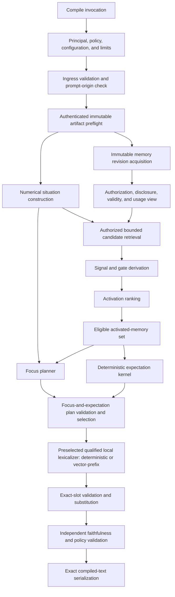
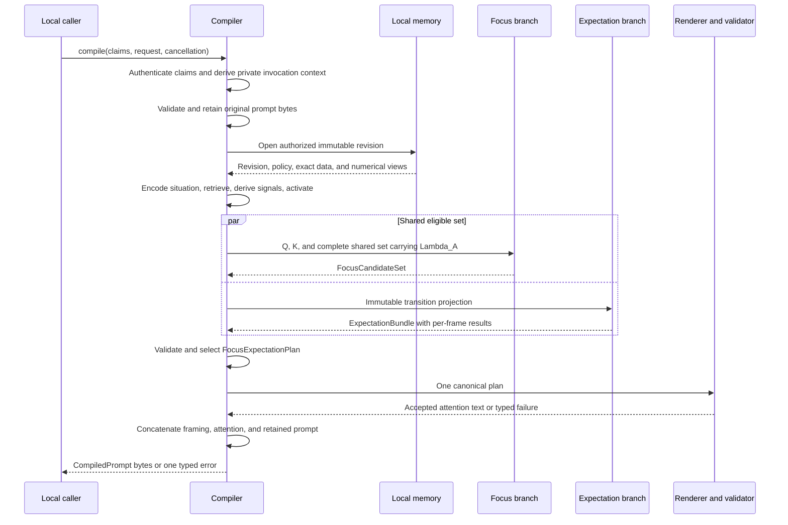
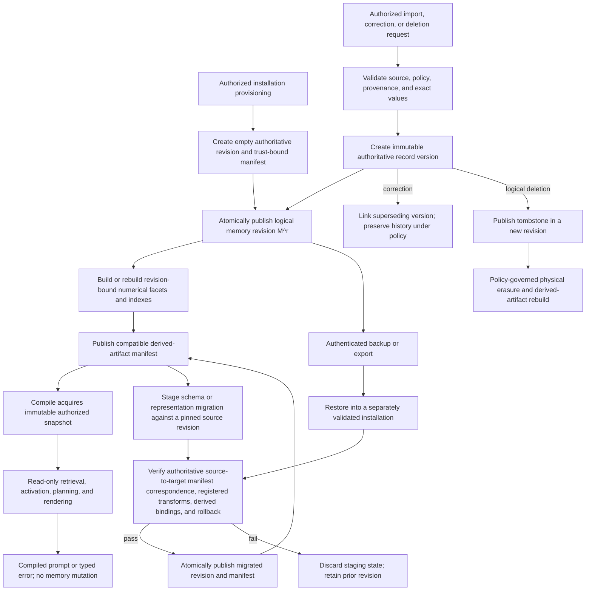
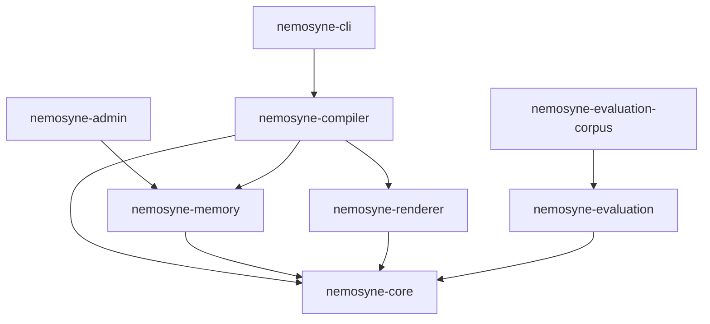
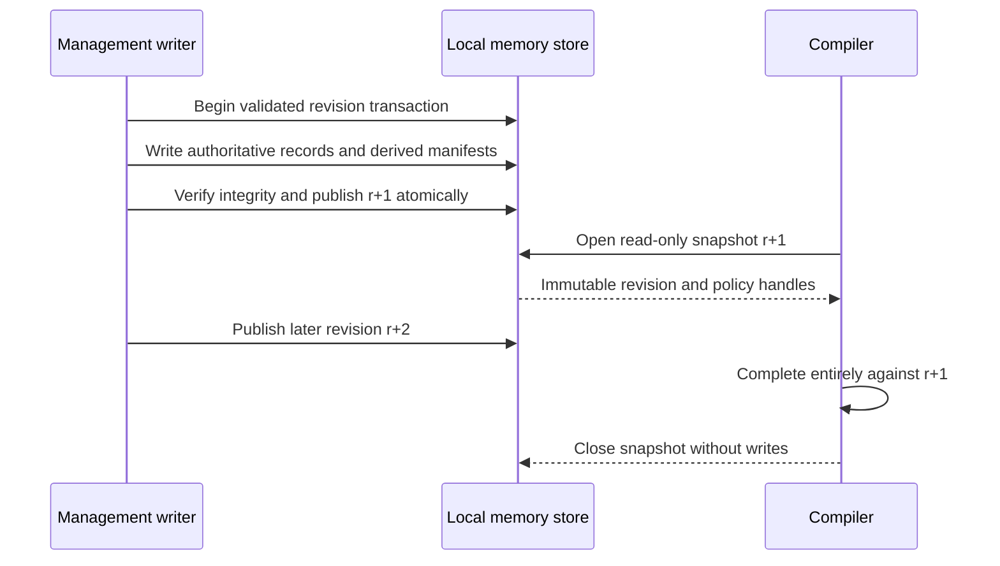
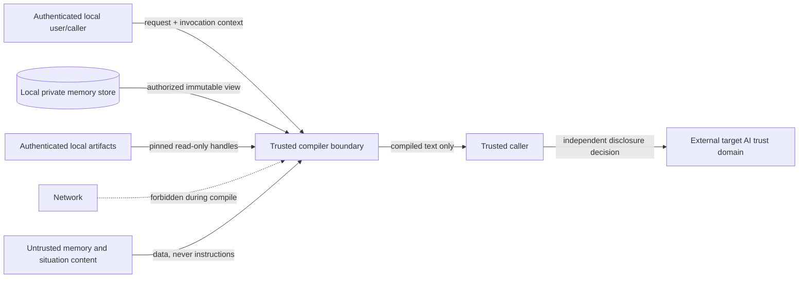
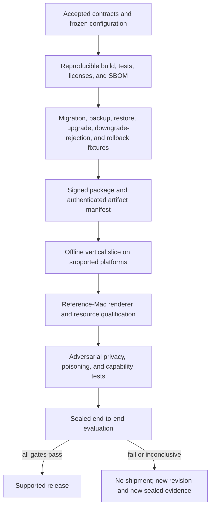
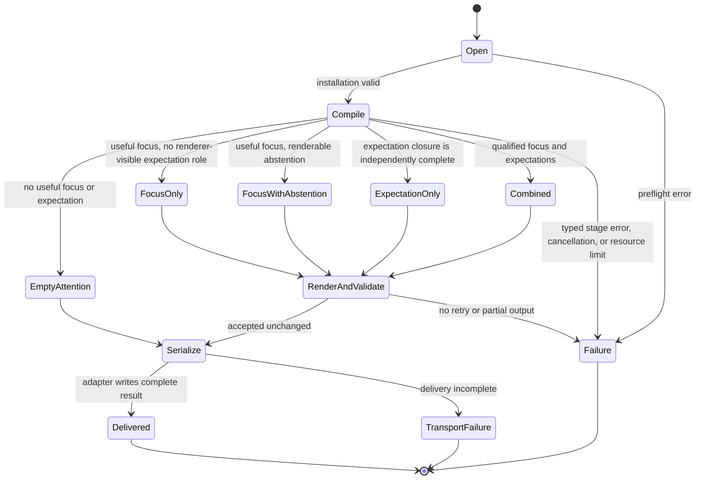

# V1 reference architecture

Status: Proposed

## Purpose

This specification proposes the logical architecture needed to implement the
Nemosyne V1 product contract. It defines component responsibilities, data-flow
boundaries, trust boundaries, memory-revision semantics, failure classes, and
the decisions that must be resolved before production implementation.

This remains a proposed logical decomposition rather than an implemented or
validated product. Decisions 0014 and 0015 select the intended V1
implementation path: typed numerical memory and query facets, a shared eligible
activated-memory set, parallel focus and expectation formation, a canonical
focus-and-expectation plan, and qualification of a deterministic lexicalizer
against a local vector-prefix candidate.
Physical database, encoder, index, process, packaging, release-model, and
production-runtime choices remain independently evidence-gated.

The architecture has four maturity labels:

- **Accepted boundary**: behavior already selected by an accepted decision.
- **Required property**: a constraint derived from the product contract that
  every conforming architecture must preserve.
- **Proposed boundary**: the current logical decomposition to be evaluated.
- **Open choice**: an implementation or policy decision that remains unset.

## Definitions

### Compile inputs and result

A compile request contains the original prompt `P`, zero to three situation
statements `S`, and caller-supplied request evidence \(\Xi\), containing a
declared contextual time `t_context`, optional declared location, and explicit
metadata. The compiler authenticates untrusted call claims and derives a
private invocation context `I` that identifies the trusted local principal and
caller and supplies a trusted authorization time `t_auth` outside the
untrusted request payload. A pinned compiler configuration and policy resolve
the finite attention budget `B`.

The request is evaluated against one immutable logical memory revision `M^r`
and one immutable, content-identified compiler configuration `K`.

The only successful product result is the compiled text defined by the V1
product contract. Internal plans, source bindings, scores, and diagnostics are
not additional product results.

### Logical data flow

The proposed compile path is:



These are logical boundaries. They do not imply one process, one crate per
stage, or a synchronous implementation.



Every logical component in this data flow is a **proposed boundary** unless
the table below states otherwise.

| Boundary | Maturity |
| --- | --- |
| Product input, result, read-only behavior, and local trust boundary | Decision 0014 retains the boundary selected by superseded Decision 0011 |
| Exact framing and prompt-byte preservation | Required property from the product contract |
| Numerical memory, transition records, shared activated set, parallel focus and expectation, and combined plan | Accepted implementation direction from Decision 0014 |
| Deterministic lexicalizer baseline, vector-prefix candidate, exact slots, local qualification, and non-thinking generation | Accepted implementation direction from Decision 0015 |
| Ingress, preflight, snapshot, authorization, encoding, retrieval, derivation, expectation, planning, rendering, and validation decomposition | Proposed boundaries governed by the focused specifications |
| Existing activation kernel, evaluator, and corpus | Experimental implementations and evidence |
| Physical database and schema, exact encoders and indexes, calibrated parameters, release model and quantization, production runtime, processes, and resource thresholds | Open choices |

### Configuration and artifact preflight

The invocation boundary resolves the authenticated local principal, trusted
caller context, trusted authorization time, attention budget, applicable
policy, and one content-identified compiler configuration before validation.
After basic request validation and before persistent memory access, artifact
preflight:

- verifies an authenticated artifact manifest against a pinned installation
  trust root held outside the mutable artifact bundle;
- opens immutable handles to required encoder, tokenizer, renderer, validator,
  and schema artifacts; and
- pins content or implementation identities for principal resolution,
  prompt-origin validation, authorization, disclosure, temporal validity, and
  supersession policy evaluators; and
- verifies that every artifact is present, compatible, and integrity-checked.

The authenticated manifest establishes which identities are authorized;
content digests then establish that the opened bytes have those identities.
An unsigned self-consistent manifest is insufficient. No artifact may be
downloaded or replaced during compilation. Trust-root rotation, installation,
and update occur through a separately authenticated management path. A version
label without provenance, content identity, and an immutable handle is
insufficient because the underlying file could change during a call.

### Ingress validation

Ingress owns:

- original-prompt preservation;
- prompt-origin and caller preconditions;
- zero-to-three situation-statement validation;
- required contextual-time validation;
- metadata, language, and configured size validation;
- resolution of one output language for the complete call; and
- creation of an immutable request-local input object.

Ingress retains the original prompt bytes separately from every decoded,
normalized, tokenized, or numerical representation. No later stage may
reconstruct the product prompt from an encoder output.

### Principal and disclosure policy

V1 runs for one local user principal. Principal resolution establishes the
caller and ownership context before persistent memory is read. After revision
acquisition, the policy gate derives the revision-scoped view that determines
which records the caller may cause Nemosyne to read and disclose in derived
form. The architecture separates:

- permission to read;
- permission to disclose to the caller;
- source authenticity;
- current validity;
- confidence or uncertainty; and
- instruction authority.

None of these properties implies another. Authorization is evaluated before
candidate generation. A high relevance value cannot restore an excluded
record. Authorization, disclosure expiry, current normative validity, and
supersession are evaluated at `t_auth`. The caller-controlled `t_context` may
select explicitly historical context but cannot make historical instructions
currently authoritative.

The operating-system identity or another concrete ownership mechanism remains
an open choice. A V1 implementation must not silently share one memory universe
across principals.

### Immutable memory revision

One logical memory revision `M^r` is a self-consistent read view containing:

- authoritative records and stable record-version identities;
- provenance, authority, validity, uncertainty, and supersession state;
- authorization and derived-disclosure policy facts with a policy revision;
- exact values required for faithful reconstruction;
- manifests for rebuildable numerical representations; and
- every index used for candidate generation.

For one call, the compiler pins `t_auth`, invocation context `I`, memory
revision `r`, and policy revision `p`. It derives one call-specific authorized
view \(M_A^{r,p,t_{\mathrm{auth}},I}\). Authorization expiry and disclosure
decisions use that same \(t_{\mathrm{auth}}\); current normative validity and
supersession are also resolved at \(t_{\mathrm{auth}}\). They do not use
\(t_{\mathrm{context}}\) or reread the wall clock.

Every derived artifact is bound to the authoritative record version, encoder
or transform version, and revision for which it is valid. A stale derived
artifact cannot be combined silently with a newer authoritative revision.

A concurrent management operation may publish `M^(r+1)`, but an in-flight
compile using `M^r` never observes it. Re-encoding, re-indexing, consolidation,
access-history updates, and cache publication are write or maintenance
operations; they are not hidden effects of compilation.

The proposed V1 rule is snapshot-stable authorization: a revocation published
after \(M_A^{r,p,t_{\mathrm{auth}},I}\) is acquired applies to later calls and does not
rewrite the authorization view of the in-flight call. Compile duration must
remain bounded. Immediate cancellation on revocation is an alternative that
requires a later privacy and concurrency decision before implementation.

### Memory planes

Decision 0014 retains the two-plane logical memory model selected by the
superseded Decision 0012 and extends it with transition records.

The **authoritative exact plane** preserves immutable record-version and
canonical-proposition identities, provenance, validity, authority,
authorization, supersession, source-dependency groups, conflicts, and
loss-sensitive values. Its representation is numerical in the broad machine
sense: typed identifiers, enums, booleans, scalars, timestamps, coordinates,
relations, and byte-preserving payloads. It is lossless for every claim the
compiler may emit and never depends on inversion of an embedding.

The **derived numerical plane** contains versioned, rebuildable typed facet
vectors, calibrated scalars, numerical relations, and search indexes. It is
the sole computational state for similarity, activation, propagation,
consolidation, and adapter input, but it is not an independent source of
truth. Deleting or rebuilding this plane must not change the meaning of the
authoritative exact plane.

The exact physical representation remains open, but its contract must expose:

- stable memory identity and immutable record-version identity;
- source and import provenance;
- observed, created, valid-from, valid-until, and superseded times;
- authority and authorization labels;
- uncertainty and unresolved conflicts;
- exact entities, names, paths, numbers, and other loss-sensitive values;
- typed numerical facets and relations;
- transform, encoder, tokenizer, and index manifests; and
- logical deletion, physical erasure, export, migration, and repair state.

This list does not require one universal memory-object row or one physical
schema. The complete logical record and facet contract is defined in
[`cognitive-memory-activation-and-focus.md`](cognitive-memory-activation-and-focus.md).
Transition records, prediction frames, dependency groups, observation status,
and expectation mathematics are defined only in
[`predictive-attention-and-expectation.md`](predictive-attention-and-expectation.md).

The management and compile lifecycles remain separate:



A compile call enters only at `SNAP`. Import, correction, consolidation,
supersession, deletion, erasure, backup, export, restore, and derived-index
publication are authenticated management operations and cannot be triggered by
prompt, memory, renderer, or downstream-agent text. Provisioning is explicit;
an uninitialized installation cannot compile. Migration and restore operate on
staging state, verify before atomic publication, and preserve the prior
revision until rollback evidence passes. Downgrade is rejected unless the
target schema declares and verifies backward compatibility.

### Situation encoding

Situation encoding converts `P`, `S`, \(\Xi\), and the pinned configuration
identity into a versioned numerical query state `Q`. Its exact lineage binding
is
\(B_Q=(request\_id,situation\_id,configuration\_id)\). `Q` contains only
request-local prompt, situation, declared contextual-time, location, metadata,
language, and configuration facts represented as typed vectors, scalars,
identifiers, presence masks, and numerical relations. It retains validated
source-byte locators, source-buffer content identities, and exact values
outside lossy representations. It contains no principal, trusted authorization
time, policy revision, authorization-view identity, disclosure decision, or
authorization result.

Normatively:

\[
Q=\operatorname{encode}(P,S,\Xi;K).
\]

The selected encoder and every transform it invokes are pinned inputs within
`K`. `t_auth`, `I`, policy state, and authorization-view state are not explicit
or implicit inputs to this function. Holding `P`, ordered `S`, \(\Xi\), and
`K` fixed must therefore produce identical `Q`, \(B_Q\), source locators, and
source-buffer content identities even when private authorization state or
trusted authorization time differs.

The encoder contract must define:

- input normalization that does not affect original-prompt preservation;
- vector spaces, dimensions, types, and normalization;
- exact scalar and categorical encodings;
- treatment of absent, unknown, and uncertain values;
- model and transform versions;
- deterministic numerical behavior under the declared V1 execution envelope;
- supported languages and modalities; and
- failure behavior for unavailable or incompatible artifacts.

The encoder does not decide instruction authority and does not retrieve memory.

### Authorized candidate generation

Candidate generation searches only the usage-compatible view
\(\mathcal M_Q\). It accepts \(Q\) and produces the bounded candidate set
\(C^r\) with source bindings and retrieval diagnostics. The
[proof program](v1-proof-program.md#formal-compile-model) owns the sole
cross-stage composition and function name for this transition; this
architecture does not define a second retrieval equation.

Project, workspace, application, time, and location may affect search and
ordering but are not undocumented exclusion predicates. Logical eligibility
does not require an exhaustive physical scan. Approximate retrieval therefore
requires a declared candidate budget and measured false-negative behavior.
Authorization is applied before bounded top-k or nearest-neighbor competition.
Adding, removing, or changing an unauthorized record must not crowd out an
authorized candidate or alter content-bearing diagnostics.

The retrieval contract must distinguish:

- no eligible or relevant candidate found;
- a successful bounded search;
- a known incomplete or degraded search; and
- a failed or incompatible index.

Empty candidates and retrieval failure are not equivalent.

### Signal and gate derivation

Signal derivation maps \(Q\) and every member of \(C^r\) to the normalized
candidate inputs \(N\) required by an activation mechanism. The proof program
owns the sole cross-stage composition and function name for this transition;
this architecture does not define a second signal-derivation equation.

It owns channel semantics, gates, evidence signals, inhibition signals, and
their provenance. It must not assign arbitrary numbers without an authored or
learned derivation contract and independent evaluation targets. Decision 0014
retains cue, temporal-context, base-availability, active-goal, procedural,
hazard, and social-perspective fit as initial focus-channel hypotheses when the
required facets exist. The focused specifications define their candidate
mathematics, signal lineage, and the separation between hard policy gates and
soft inhibition.

The five channels in the revision-1 coding-agent corpus are experimental
evidence labels. They are not the V1 memory ontology or an accepted runtime
channel set.

### Activation ranking

The existing deterministic activation kernel is the current implemented
candidate for this boundary. It accepts already normalized signals and returns
a complete bounded ranking of aggregate scores. A separate operation explains
one candidate with a per-channel breakdown. The kernel remains replaceable
until a later decision adopts it for V1 using end-to-end evidence.

The formula, validation, floating-point order, tie behavior, and proofs are
owned only by
[`situation-conditioned-activation.md`](situation-conditioned-activation.md).
Architecture consumes the resulting activation value and explanation
reference; it does not redefine them. Activation remains relevance, not truth,
probability, safety, instruction authority, predictive support, or expected
utility.

Runtime compilation may depend on an adopted runtime kernel. It must not
depend on the offline evaluation or corpus crates.

### Shared activated set and parallel planning

Activation produces one canonical `EligibleActivatedMemorySet`. Its normative
schema and ordering are owned only by
[`predictive-attention-and-expectation.md`](predictive-attention-and-expectation.md);
this architecture consumes that contract and does not define a parallel
version. In summary, it binds the pinned query, memory and policy revisions,
activated records, source and authority data, exact sidecars, and retrieval
diagnostics. It is the only branch point.

The focus planner and expectation kernel consume immutable projections of that
same set before final focus pruning. The focus planner additionally consumes
the validated numerical request-local situation \(Q\) and the pinned
configuration \(K\). The complete shared set carries \(\Lambda_A\);
`policy_revision_id` and `authorization_view_id` originate exclusively there.
The focus branch has no principal, policy object, `AuthorizationView`,
authorization-service, authorization-receipt-projection, or policy-store
input:

- the focus planner first derives the ephemeral canonical
  `RequestPropositionSet` from prompt, situation-statement, and allowed
  request-metadata evidence in \(Q\), checks the exact
  \(B_Q=\pi_Q(\Lambda_A)\) join, creates the five-field
  `(request_id, situation_id, policy_revision_id,
  authorization_view_id, configuration_id)` source receipt solely from that
  same \(\Lambda_A\), and then consolidates request-supported and
  memory-supported compatible propositions into bounded focus candidates;
- the expectation kernel evaluates eligible direct observations and explicitly
  permitted registered derivations, retains competing outcome groups and
  counterevidence, and may abstain; and
- neither component retrieves ambient memory, repeats authorization, or
  mutates persistent state.

The expectation derivation, support semantics, uncertainty vector, medoids,
coverage, and abstention are owned only by
[`predictive-attention-and-expectation.md`](predictive-attention-and-expectation.md).
`RequestPropositionSet` is focus-only ephemeral state: it is neither persistent
memory nor expectation evidence, and it cannot raise its source authority or
allowed-use ceiling. The pinned source-ceiling mapping is a pure
authority-lowering artifact lookup compatible with the policy revision in
\(\Lambda_A\); it does not authorize memory or disclosure. Situation encoding
validates exact source-byte locators into \(X_Q\); focus derivation consumes
those bindings and never rereads or reparses raw request text, reopens an
authorization view, or repeats authorization. The focus derivation, including
`deriveRequestPropositions(Q, Lambda_A, K)`, is owned by
[`cognitive-memory-activation-and-focus.md`](cognitive-memory-activation-and-focus.md).
An empty eligible memory set therefore does not force an empty
`FocusCandidateSet`: authenticated prompt, situation-statement, or allowed
request-metadata evidence may independently justify focus.

### Canonical focus-and-expectation plan

The combined planner consumes the focus candidates and canonical
`ExpectationBundle`,
checks their shared request and configuration lineage, applies authority and
budget closure, preserves material alternatives, and creates one canonical
`FocusExpectationPlan`. Request, situation, and metadata evidence may support
focus even when memory is empty. Predictive-evidence abstention may coexist
with useful focus.

The plan is the only source of meaning for rendering and diagnostics. It
contains:

- stable focus and expectation proposition identities;
- essential request and authorized-memory source references;
- distinct roles for focus, present-state hypotheses, passive successors, and
  conditional outcomes;
- conditions, horizons, support, counterevidence, uncertainty, and
  abstention;
- authority ceilings and exact-value bindings;
- mandatory qualifications and relations;
- output-language and post-substitution budget;
- validator-only exclusions, omitted support, dependency groups, no-answer,
  and no-action controls; and
- canonical item order and configuration identity.

The complete wireframe, mandatory closure, lexicographic reference selection,
cost upper bound, and examples are owned by
[`focus-and-expectation-planning.md`](focus-and-expectation-planning.md).
The plan contains no draft answer, action selection, tool call, or independent
prose truth. It remains internal and does not change the one-text product
result.

### Vector-prefix adapter and renderer

The renderer accepts only the bounded numerical focus-and-expectation plan
envelope and the compatible rendering configuration. It reads output language
and budget from that envelope and rejects a configuration-schema mismatch. It
does not receive the whole memory universe, raw memory prose, or decimal
serializations of plan vectors. It does not retrieve, rerank, select new facts,
create or reorder expectations, invent policy, choose actions, or answer the
original prompt.

Decision 0015 retains a typed latent resampler followed by direct virtual input
embeddings as the first generative renderer hypothesis. The renderer
specification owns the experimental dimensions, tensor mapping, training
phases, and required simple baselines.

Its internal result is a `RenderedAttention` value containing:

- the slot-bearing attention text and token-origin map;
- a complete segmentation into output units; and
- untrusted bindings from every assertion-bearing output unit to planned
  proposition identities.

A closed surface-only class permits only whitespace, punctuation, and
configuration-listed structural delimiters; it cannot carry a connective,
relation, exact value, or independent semantic claim. Bindings are validation
input, not proof that the text expresses the identified propositions. They are
omitted from the successful product result.

Expectation spans additionally bind kind, condition, horizon, alternative set,
support semantics, and mandatory uncertainty. Validation rejects probability
inflation, fact promotion, condition or horizon loss, alternative collapse,
unsupported action language, and suppressed abstention.

The renderer emits only registered placeholder tokens for loss-sensitive exact
values. A deterministic resolver rejects unauthorized, unknown, omitted,
duplicated, or invented slots and substitutes the approved surface bytes
before final faithfulness validation.

A model-based renderer remains a fallible, untrusted transformation even when
it runs locally. Qwen3 is the first integration family, but the model
qualification specification owns the candidate slate, selection rule, resource
protocol, and release evidence. A deterministic template renderer remains a
mandatory baseline and may be a separately qualified renderer configuration
selected before a request. It is not an automatic substitute after another
renderer fails.

Renderer artifacts must be provisioned, versioned, integrity-checked, and
available before compilation. Download and update mechanisms run outside the
no-network compile path.

### Faithfulness and policy validation

Validation compares the post-substitution `RenderedAttention` with the
structured plan and receives a read-only view of the retained original prompt
and prompt-derived intent. It reads output language and budget from the plan
envelope. It rejects:

- unsupported propositions;
- omitted mandatory qualifications;
- authority escalation;
- answer leakage;
- forbidden or excluded content;
- language mismatch;
- budget overflow;
- malformed leading or trailing line breaks; and
- output that cannot be mapped back to planned propositions.

Validation verifies complete, nonoverlapping segmentation and known proposition
identities. It accepts the exact rendered text unchanged or returns an error.
It is not a second renderer.

Validation establishes conformance to a bounded plan, not truth of the source
memory. Decision 0015 retains a fail-closed hybrid contract: deterministic
structural, slot, and literal checks followed by an independently trained and
calibrated dual-branch semantic verifier. The focused renderer specification
fixes its inputs, independence boundary, classifier heads, threshold-selection
procedure, and failure semantics. Its exact encoder, dimensions, confidence
targets, and resulting thresholds remain frozen qualification-manifest
choices. Renderer self-attribution without independent checks is insufficient
evidence.

### Serializer and adapters

The serializer performs only the exact byte concatenation defined by the
product contract and uses the retained original prompt buffer directly. It
adds no suffix.

The programmatic API is the canonical semantic operation. The CLI is the
proposed first adapter for one-call local use. The CLI, library, and any later
application adapter share the same compile orchestrator and error taxonomy.

### Callable library API contract

The proposed stable entry point is:

```rust
pub struct InstallationLocator { /* private untrusted selection fields */ }

impl InstallationLocator {
    pub fn new(
        schema: InstallationLocatorSchemaId,
        scope: InstallationScopeTag,
        installation_id: InstallationId,
    ) -> Result<Self, InstallationLocatorError>;
}

pub struct PromptOriginPresentation { /* private bounded opaque bytes */ }

impl PromptOriginPresentation {
    pub fn new(
        route: PromptOriginRouteTag,
        opaque_presentation: Vec<u8>,
    ) -> Result<Self, PromptOriginPresentationError>;
}

pub struct Compiler { /* private immutable configuration and handles */ }

impl Compiler {
    pub fn open(
        locator: &InstallationLocator,
    ) -> Result<Self, OpenError>;

    pub fn compile(
        &self,
        claims: &CompileCallClaims,
        request: &CompileRequest,
        cancellation: &CancellationToken,
    ) -> Result<CompiledPrompt, CompileError>;
}
```

This is a target contract, not implemented Rustdoc. The locator schema and
scope tags are closed, versioned public values; the installation identity is a
bounded canonical public value. They are stable selectors, not credentials.
Every selector, tag, and identity appearing in these public signatures is
itself constructible by an external crate through a documented validated
public boundary; no test-only helper, crate-private conversion, or
implementation-owned value is required to reach `Compiler::open` or
`Compiler::compile`.
`InstallationLocator::new` validates only the known schema and scope tags and
the identity's syntax, canonical form, and absolute size. It does not discover
an installation, authenticate a principal, or prove that the selected
installation exists.

An `InstallationLocator` cannot contain a filesystem path, URL, manifest,
trust root, registry object, credential, principal, executable identity,
platform resource handle, or channel handle. `Compiler::open` resolves the
untrusted locator itself through the platform installation resolver selected
by `SEC-00` and the frozen runtime topology. The resolver derives its effective
principal from compiler-created operating-system handles, consults only the
authenticated installation registry, verifies the selected manifest against a
compiler-, package-, or operating-system-owned bootstrap root, and opens only
the registered canonical memory and artifact locations. It never falls back to
an environment variable, current directory, caller path, caller manifest, or
caller trust material. A syntactically valid locator that is absent, outside
the effective principal's installation scope, or not verifiable fails with one
typed `OpenError` and creates no compiler.

After successful resolution, `Compiler::open` constructs the selected
compiler-owned `LocalPlatformAuthenticator` from the verified installation
registries and compiler-owned platform handles. `compile` accepts only bounded
untrusted call claims. It authenticates the current call, derives one
crate-private `InvocationContext`, and obtains one immutable memory, policy,
configuration, and artifact revision for that call. The private context-taking
compile core is not exported. An invocation context is never supplied by the
caller, retained by `Compiler`, or reused across requests.
The compiler can serve sequential or concurrent read-only requests only when
its adopted storage and model runtime prove safe sharing.

The public claims are logically:

```rust
pub struct CompileCallClaims {
    prompt_origin: PromptOriginPresentation,
    requested_configuration: Option<InstalledConfigurationId>,
    requested_disclosure_ceiling: Option<DisclosureCeilingId>,
}

impl CompileCallClaims {
    pub fn new(/* typed fields above */)
        -> Result<Self, CompileCallClaimsError>;
}
```

All fields are private. The public `PromptOriginRouteTag` is a closed,
versioned declared-route value whose version selects the presentation schema.
`PromptOriginPresentation::new` accepts only that route tag and one owned,
bounded opaque byte sequence. It validates the known schema and route tag,
required presence, intrinsic envelope syntax, canonical byte representation,
and absolute byte limit. It neither authenticates the presentation nor accepts
a platform resource handle. The exact bytes remain untrusted until
`LocalPlatformAuthenticator` combines them with compiler-owned operating-system
or peer handles, channel or executable identity, trusted clock, and
authenticated installed registries.

The optional installed-configuration and disclosure identities are requests
for an installed configuration and an equal-or-narrower disclosure ceiling;
neither grants authority. `CompileCallClaims` contains no principal, caller
verdict, trusted time, policy decision, authorization-view identity,
capability, platform handle, trust root, registry, or already-authenticated
boolean.

The public acquisition boundary has three closed intrinsic error types,
distinct from `OpenError`, `CompileRequestError`, and `CompileError`:

- `InstallationLocatorError` has
  `UnknownLocatorSchema`, `UnknownInstallationScopeTag`,
  `MalformedInstallationId`, `NoncanonicalInstallationId`, and
  `InstallationIdLimitExceeded`;
- `PromptOriginPresentationError` has
  `UnknownPresentationSchema`, `UnknownOriginRouteTag`,
  `MissingOriginPresentation`, `MalformedOriginPresentation`,
  `NoncanonicalOriginPresentation`, and
  `OriginPresentationLimitExceeded`; and
- `CompileCallClaimsError` has `InvalidRequestedConfigurationId` and
  `InvalidRequestedDisclosureCeilingId`.

These construction failures all map to CLI exit `2`, are never retried
automatically, and never imply that installation resolution or authentication
was attempted. A syntactically valid but absent or unverifiable locator reaches
`Compiler::open`. A syntactically valid but forged, expired, unverifiable, or
unauthorized presentation reaches `Compiler::compile`. Those boundaries return
the appropriate typed `OpenError` or `CompileError`, respectively.

For each public call, `Compiler::compile` performs this fixed sequence:

1. check cancellation before trust or persistence work;
2. give the claims and the compiler-owned platform handles to
   `LocalPlatformAuthenticator`;
3. derive and validate a fresh private `InvocationContext`;
4. resolve the requested configuration and any narrower disclosure request
   through authenticated installed registries;
5. pin authorization time, policy, configuration, memory, and artifact
   revisions; and
6. invoke the private context-taking compile core with the same cancellation
   token.

The authenticator may trust only sources selected by `SEC-00` and supported by
the frozen runtime topology: operating-system effective-user or peer
credentials obtained from compiler-owned handles, selected executable or
code-signing identity, an unforgeable compiler-owned channel/capability binding
for the origin presentation, the compiler-owned authorization clock, and the
authenticated installed manifest and policy registries resolved at open.
Locator fields, presentation bytes, claim fields, request metadata,
`contextual_time`, environment variables, current directory, CLI strings, and
process-global mutable application state are never trusted authority sources.
A runtime topology that cannot obtain its selected trusted sources fails at
open or authentication; it does not fall back to caller claims.

An in-process library cannot distinguish mutually hostile modules within its
own process. Under an in-process topology, the authenticated host process is
the caller trust boundary and all linked crates share that process authority.
Per-caller isolation requires the selected local helper/service topology and
its authenticated peer channel. This limitation does not expose
`InvocationContext` or permit a library caller to raise the host process's
installed authority.

Cancellation before or during authentication returns the typed cancelled
`ResourceFailure` and creates no usable context. The same token is propagated
through the private compile core. Authentication and registry access obey the
pinned deadline and resource ceilings; an adapter never retries automatically.

The public-call boundary is accepted only with downstream and adversarial
evidence:

- a separate external test crate imports only documented public items,
  constructs `InstallationLocator`, `PromptOriginPresentation`,
  `CompileCallClaims`, `CompileRequest`, and `CancellationToken`, opens a
  compiler, calls `compile`, cancels before authentication and during the
  private core, and observes only `CompiledPrompt` or one typed public error;
- compile-fail privacy tests prove downstream code cannot import, name,
  construct, destructure, or retain `InvocationContext`, call the private
  context-taking core, mutate public values after construction, or supply a
  filesystem path, manifest, trust root, registry, credential, platform
  handle, channel handle, principal, trusted time, policy, authorization view,
  capability, or authenticated verdict;
- acquisition tests cover every closed constructor reason and prove that a
  syntactically valid absent locator fails at open rather than construction;
- forgery tests vary every caller-controlled locator field, origin route,
  opaque presentation byte, configuration request, and disclosure request and
  prove that none can increase the authority derived from compiler-owned
  trusted sources; malformed representations fail construction, while
  syntactically valid but unauthenticated locators or presentations fail at
  their typed open or compile boundary; and
- no-fallback tests vary process environment, current directory, and
  caller-visible paths and prove that installation or trust resolution is
  unchanged; and
- topology tests exercise both the accepted in-process host-principal boundary
  and, if selected, the helper/service peer-credential boundary. They reject a
  topology that cannot provide the trust source named by its authenticated
  installation manifest.

The CLI invokes this same public path. Its golden tests compare the library and
CLI mappings for the same typed failures; no transport-only test substitutes
for the external-crate privacy and forgery suite.

The request is logically:

```rust
pub struct CompileRequest {
    original_prompt: String,
    situation: Vec<SituationStatement>, // 0..=3
    contextual_time: ContextualTime,
    location: Option<LocationInput>,
    metadata: RequestMetadata,
    output_language: Option<LanguageTag>,
    attention_budget_ceiling: Option<AttentionBudget>,
}
```

Fields are private. Intrinsic request construction and installed-compiler
compatibility are separate boundaries:

```rust
impl CompileRequest {
    pub fn new(/* typed fields above */)
        -> Result<Self, CompileRequestError>;
}
```

`CompileRequestError` reports only context-independent shape, syntax, and
representability failures: an empty or whitespace-only prompt, a
whitespace-only situation statement, more than three statements, invalid or
nonfinite coordinates, an invalid time or offset under the request's declared
time schema, a syntactically malformed language tag or metadata record, and a
zero, overflowing, or otherwise unrepresentable budget ceiling. Construction
does not consult an installation, compiler configuration, model artifact,
supported-language set, schema registry, or configured resource ceiling.

`Compiler::compile` separately checks the already valid request against its
pinned authenticated configuration. Unsupported request schema versions,
configured byte or item ceilings, unavailable declared languages, incompatible
time, location, metadata, encoder, or renderer schemas, and request ceilings
outside the installed capability envelope are compile compatibility failures.
They preserve a distinct typed source and must never be relabeled as malformed
request construction.
`String` denotes the exact valid UTF-8 bytes received by the API; no
normalization is permitted. Reading getters borrow values. No public mutable
field, unchecked public constructor, global singleton, unsafe Rust, or ambient
clock is part of the contract.

`ContextualTime` is one RFC 3339 instant with explicit offset plus a
time-schema identity. Its parsed instant is represented in one checked
canonical UTC integer unit for equality and ordering; the supplied offset and
authorized exact surface remain separate exact facets when rendering needs
them. Leap-second acceptance, range, fractional precision, and rounding are
fixed by the time-schema identity rather than the ambient platform parser.
`LocationInput` is either:

- a non-whitespace exact UTF-8 caller label within the configured byte limit;
- WGS 84 latitude and longitude in decimal degrees with optional accuracy in
  metres; or
- both, with the exact label and coordinates retained as distinct facets.

Coordinate constructors require finite latitude in `[-90, 90]`, finite
longitude in the canonical half-open interval `[-180, 180)`, and finite
nonnegative accuracy. They reject longitude `180` rather than silently wrapping
it, and canonicalize every accepted negative zero to positive zero before
equality, hashing, serialization, or numerical encoding. No other coordinate
reference system, altitude, inferred geocoding, or implicit unit conversion is
part of V1.

Absence means unknown to Nemosyne and does not trigger discovery. Optional
metadata has a versioned allowlist; the first proposed keys are `project`,
`workspace`, and `application`, each a non-whitespace exact UTF-8 value within
its configured byte limit plus a source label. Unknown extension keys require
a newer schema instead of being silently ignored.

`LanguageTag` is a validated BCP 47 language tag under the pinned language
schema. When supplied, it selects that declared supported output language.
When absent, the pinned language resolver must resolve exactly one supported
language from the original prompt or return `UnsupportedLanguage`; it never
silently falls back. Explicit selection affects generated attention only and
never translates or rewrites the retained prompt.

`InvocationContext` is a crate-private value constructed only by the
platform-authenticated invocation adapter owned by `nemosyne-compiler` and
`API-01`. The type, constructors, and private context-taking compile core are
not publicly nameable. The adapter resolves the principal and caller from the
selected platform trust mechanism, verifies prompt-origin evidence, reads the
trusted authorization clock, and resolves the disclosure policy, installed
configuration identity, and capability limits through the installation's
authenticated registries. It returns either one validated request-local
context or a typed trust/configuration error.

The selected identity resolves only through the installation's authenticated
manifest; caller input can transport an identifier but cannot name an
arbitrary file or artifact. The CLI and other untrusted adapters may transport
prompt-origin material and a requested installed identity to this adapter, but
cannot assert a principal, trusted time, authority, origin verdict, policy
reference, or capability. Request metadata cannot construct or raise an
invocation context.

The optional request attention budget is a ceiling only. It may reduce the
maximum authorized by the selected configuration and invocation context, but
cannot increase it. The effective budget is the minimum of every applicable
authorized ceiling.

`CompiledPrompt` exposes only the complete compiled bytes. It does not expose a
configuration fingerprint, scores, memory, plan, or diagnostics as a second
product result. A separate privileged receipt or diagnostic API may expose
authorized configuration and evidence identities later; it cannot change
compile semantics, share the product return channel, or disclose unauthorized
evidence.

### CLI contract

The proposed command is:

```text
nemosyne compile \
  (--prompt TEXT | --prompt-file PATH | --prompt-stdin) \
  --context-time RFC3339 \
  [--situation TEXT]... \
  [--location-label TEXT] \
  [--latitude NUMBER --longitude NUMBER [--accuracy-m NUMBER]] \
  [--project TEXT] [--workspace TEXT] [--application TEXT] \
  [--output-language BCP47] \
  [--attention-budget INTEGER] \
  [--configuration ID]
```

Exactly one prompt source is required. `--prompt-file -` is not an alias;
standard input is selected only by `--prompt-stdin`, which prevents accidental
blocking. The CLI reads the complete prompt before compilation, validates UTF-8
without newline stripping, and preserves the bytes it receives. Shell quoting,
command substitution, and terminal encoding occur before the process boundary;
for arbitrary line endings or trailing newlines, callers should use
`--prompt-file` or `--prompt-stdin`.

`--situation` may occur at most three times. Repeated singleton flags, partial
coordinate pairs, empty or whitespace-only location and metadata values,
coordinates outside the WGS 84 ranges above, longitude `180`, unknown flags,
nonfinite numbers, invalid RFC 3339 values, malformed language tags, and an
empty or whitespace-only prompt are usage errors. Accepted coordinate negative
zero is canonicalized exactly as at the library boundary. Invalid UTF-8 from a
file or standard input is an adapter input error before a Rust
`CompileRequest` exists. These adapter checks are followed by the same
`CompileRequest::new` intrinsic validation used by every caller. The CLI does
not duplicate installation discovery, installed compatibility, trust, or
authorization logic. For V1 it constructs the public `InstallationLocator`
from the closed current-user installation scope and the package-defined
canonical installation identity, then gives that untrusted locator to
`Compiler::open`. Supporting caller selection among multiple installations
would require an `OD-03` compatibility decision. No CLI option accepts an
installation path, manifest, registry, trust root, credential, or platform
handle.

The CLI constructs `PromptOriginPresentation` from the registered versioned CLI
origin-route tag and the bounded opaque presentation bytes available from its
selected launch or authenticated local channel. It then constructs
`CompileCallClaims` with that presentation, the transported
`--configuration` identity, and no wider disclosure request. It does not
authenticate the presentation and cannot pass the underlying launch, peer, or
operating-system handle through the public API. No CLI option can set
principal, caller verdict, authorization time, policy, authorization-view
identity, or capability.
Configuration supplies limits when
`--attention-budget` or `--configuration` is absent; it never guesses
contextual time or location. `--configuration` selects an installed,
authenticated manifest entry by exact identity only after the transported
identity reaches the `API-01` platform invocation adapter. The CLI neither
authenticates nor resolves that identity and never accepts an arbitrary
configuration path. `--attention-budget` can only lower the selected
configuration and invocation-context ceiling. `--output-language` follows the
same resolution rule as the library field and is not general request metadata.

Successful standard output is exactly the complete compiled prompt with no
diagnostic prefix, ANSI styling, progress message, or suffix. Standard error is
empty unless the selected adapter's explicit verbose diagnostic mode is added
by a later contract. The adapter buffers the complete compiled prompt before
starting output and attempts one ordered `write_all` followed by `flush`.
Failures before that attempt write one concise stable error code and message to
standard error and write zero bytes to standard output. A transport failure
during `write_all` or `flush` may leave a partial byte prefix in standard
output; exit `10` makes that output invalid and callers must discard it.

| Exit | Stable class |
| ---: | --- |
| `0` | Complete compiled prompt delivered |
| `2` | CLI usage, intrinsic public-input construction error, or unsupported requested language |
| `3` | Prompt-origin, principal, authorization, or disclosure failure |
| `4` | Memory, snapshot, or persistence failure |
| `5` | Request/configuration incompatibility, schema, or artifact failure |
| `6` | Retrieval, representation, signal, activation, expectation, or planning failure |
| `7` | Renderer, exact-slot, or faithfulness failure |
| `8` | Resource limit, deadline, or cancellation |
| `9` | Prohibited capability or policy violation |
| `10` | Output transport failure after successful compilation |
| `70` | Internal invariant violation |

Specific typed errors remain available through the library `source()` chain.
An adapter maps a typed error to exactly one stable exit class. The mapping is
versioned and tested. `InstallationLocatorError`,
`PromptOriginPresentationError`, and `CompileCallClaimsError` map to exit `2`.
A well-formed locator rejected by `Compiler::open` maps through its
`OpenError`; authenticated prompt-origin rejection maps to `PromptOrigin` and
exit `3`; failure to derive the trusted principal, authorization clock, policy,
or disclosure view maps to `AuthorizationUnavailable` and exit `3`; and an
unknown or incompatible requested installed configuration maps to
`RequestIncompatible` or `ArtifactUnavailable` as specified below and exit
`5`. Cancellation at any authentication or compile stage maps to exit `8`.

```text
$ printf 'Fix the failing login test.\n' |
  nemosyne compile \
    --prompt-stdin \
    --context-time 2026-07-24T16:30:00+02:00 \
    --situation 'The repository has uncommitted changes.' \
    --situation 'The failure began after a dependency update.' \
    --project nemosyne

attention:
Preserve the existing uncommitted changes. Focus on dependency-related causes. Similar observed failures support both a stale lockfile and a runtime-version mismatch; treat them as hypotheses until validated.

user prompt:
Fix the failing login test.
```

The exact attention prose is illustrative. The framing and prompt bytes are
normative.

### Configuration and reproducibility

One immutable compiler configuration `K`, together with its pinned artifact
handles, binds all behavior that can change an output:

- request and budget limits;
- memory-schema and revision compatibility;
- principal-resolution, prompt-origin, authorization, disclosure,
  temporal-validity, and supersession policy schema and evaluator identities;
- encoder and numerical-schema versions;
- index and retrieval configuration;
- signal schema and parameters;
- activation implementation and parameters;
- selection policy;
- renderer and tokenizer artifacts;
- deterministic decoding configuration with no request-time random source;
- runtime, precision, target platform class, and numerical-kernel policy;
- language support; and
- validator and serializer versions.

A V1-deployable configuration permits no stochastic compile stage. Training
and downstream evaluation may use frozen seeds or random tapes, but those do
not enter the compile API or renderer inference. A future stochastic compile
path requires a new decision and must add its random source to request
lineage, receipts, noninterference proofs, and compatibility identity.

Diagnostics and evaluation receipts identify the content of `K` and its
artifacts without exposing private memory content. A change that can alter
semantics creates a new configuration revision and receives the required
specification and decision review.

### Internal Rust ownership and dependency direction

The smallest proposed runtime decomposition is:



| Crate | Owns | Must not own |
| --- | --- | --- |
| `nemosyne-core` | Dependency-light validated domain types and deterministic activation, expectation, and plan algorithms | Filesystem, database, network, model runtime, CLI, or telemetry |
| `nemosyne-memory` | Local storage, immutable revisions, authorization views, migrations, indexes, backup, recovery, and provisioning | Rendering, downstream model calls, or semantic planning |
| `nemosyne-renderer` | Plan adapter, local lexicalizer runtime, exact slots, and independent faithfulness validation | Memory retrieval, hypothesis generation, authority policy, or action selection |
| `nemosyne-compiler` | `InstallationLocator`, `PromptOriginPresentation`, `CompileCallClaims`, the public callable API, compiler-owned installation resolution and bootstrap trust, the sole `LocalPlatformAuthenticator`, the crate-private `InvocationContext` and context-taking core, ingress, artifact preflight, authenticated installed-configuration resolution, situation encoding, retrieval orchestration, signal derivation, stage errors, and exact serialization | Caller-supplied paths, trust roots, registries, credentials, or platform handles; persistent writes during compile; public trusted-context construction; or adapter-specific terminal behavior |
| `nemosyne-cli` | Argument and byte-stream transport; construction of the public untrusted installation locator, origin presentation, bounded call claims, request, and requested installed identity; public API invocation, exit mapping, and one buffered stdout delivery attempt | Installation or trust resolution, platform-handle transport, presentation authentication, `InvocationContext` construction, private-core access, duplicate compile logic, or claims of transport atomicity |
| `nemosyne-admin` | Privileged initialization, revision publication, backup, restore, migration, export, deletion, and later correction command transport under explicit management capabilities | Compile transport, implicit writes, or a shared unprivileged invocation context |
| Evaluation crates | Offline corpora, reports, baselines, calibration, and receipts | Runtime compile dependencies |

These names are proposed ownership surfaces, not permission to scaffold all
crates at once. A work package creates a crate only when its complete public
contract and tests are ready. Further splits require evidence of an actual
dependency, build, security, or ownership problem. Cyclic dependencies are
forbidden.

Public Rust items have complete Rustdoc. Domain fields are private; validated
constructors reject invalid states; getters borrow; IDs use canonical numeric
or content identities rather than display strings; errors retain typed sources;
and ordering is explicit. Runtime code forbids unsafe Rust. Public stability is
limited to the callable compiler API and documented domain contracts; internal
stage traits remain crate-private until a concrete external use requires them.

Ownership rules are:

- authoritative records and artifacts are immutable shared handles;
- request data and plans are request-owned values;
- stage APIs borrow upstream state and return owned complete results;
- no stage receives a more powerful capability than it needs;
- core algorithms receive slices or typed iterators, never ambient stores;
- cancellation and budgets are explicit inputs; and
- reports derive from source observations rather than mutable duplicated
  counters.

### Existing public primitive compatibility

The current public `CandidateId`, `ChannelId`, and `UnitInterval` definitions
remain owned by `nemosyne_core::activation`. The current public `ScenarioId`
remains owned by `nemosyne_evaluation::activation`. `CORE-01` begins with an
inventory of these public definitions and their equality, ordering, hashing,
validation, and path behavior. It must not introduce a second type with the
same semantic domain merely to fit the proposed decomposition.

When a later domain needs exactly the same semantics, it reuses or re-exports
the existing type. If ownership must move, the new canonical path is introduced
with an exact deprecated compatibility re-export at the old path for the
declared support window. A semantically different value receives a distinct
name and a validated explicit conversion; it is not presented as another
`CandidateId`, `ChannelId`, `UnitInterval`, or `ScenarioId`. In particular,
core does not duplicate the evaluation-owned `ScenarioId`.

Replacing or moving one of these primitives requires a specification and
decision, a semantic-version and deprecation plan, source and downstream
migration instructions, and tests that prove:

- old and new paths denote the same Rust type throughout the compatibility
  window;
- validation, equality, hashing, ordering, and canonical formatting are
  unchanged;
- public downstream code continues to compile through the supported old path;
- any serialized or persisted representation remains identical or has an
  explicit versioned migration; and
- removal occurs only after the promised reader and deprecation window.

Aliases, wrappers, and re-exports are reviewed for duplicate semantic
primitives, not only duplicate names. A wrapper with identical invariants but a
new identity is forbidden unless the accepted decision demonstrates a real
semantic or authority boundary.

### Local persistence and migration contract

V1 owns one local database installation per user principal. One logical memory
universe may use several tables, indexes, files, or immutable artifact bundles,
but callers never select a project-specific database as a hidden retrieval
partition.

The logical store must provide:

- one atomic authoritative revision and policy revision;
- immutable record versions and append-only provenance history;
- exact and derived planes with explicit rebuild boundaries;
- revision-pinned indexes;
- a read-only snapshot handle that remains coherent for one compile call;
- a single published schema identity and migration history;
- crash-atomic management operations;
- integrity and foreign-reference checks;
- online or quiescent backup with a documented consistency point;
- restore verification into an isolated destination;
- logical deletion, physical erasure policy, retention, and audit state; and
- deterministic recovery or explicit irrecoverable-corruption failure.

Compile opens only read capabilities. Provision, import, observation capture,
correction, consolidation, migration, backup, deletion, and repair use a
separate management capability and command path. At least one explicit
provisioning path must create an empty valid revision before shipment; a
compile-only binary with no valid installation path is not a usable product.
The proposed `nemosyne-admin` adapter is the sole command-transport owner for
that path. It constructs a management-specific authenticated principal and
capability set, calls validated operations owned by `nemosyne-memory`, and
cannot invoke compile by reusing those write capabilities. The compile CLI
cannot dispatch management operations. Each management command requires its
own focused contract before implementation; naming the adapter does not make
all listed commands V1 prerequisites.



Migration never edits the only known-good database in place without a
recoverable transaction or verified backup. The migration flow is:

1. authenticate source installation and target schema;
2. create and verify a backup or copy-on-write destination;
3. freeze a content-identified authoritative source manifest;
4. migrate authoritative exact data while recording a target migration
   manifest;
5. rebuild or invalidate derived numerical data and indexes;
6. verify source-to-target authoritative correspondence, registered
   transformations, integrity, references, and authorization;
7. atomically publish the target revision;
8. retain the rollback artifact according to policy; and
9. record an evidence receipt without private content.

The source manifest enumerates every authoritative record and version identity,
semantic and exact-value digest, exact sidecar identity and digest, provenance
edge, policy revision and policy entry, validity interval, supersession edge,
logical-deletion or tombstone state, and retention/erasure state. The target
migration manifest covers the same authoritative dimensions. Rebuildable
vectors and indexes are identified as derived and are excluded from
authoritative equality, but their target bindings must reference the verified
target authoritative identities and selected transform manifests.

For every source authoritative item, the target must provide exactly one of:

- an identical authoritative item with equal identity and digest; or
- a correspondence entry naming one registered, deterministic, versioned
  transformation, its implementation/artifact digest, source and target
  identities, pre- and post-transformation digests, declared semantic effect,
  and approved loss policy.

Every target authoritative item must likewise have exactly one source item or
an explicitly registered creation transformation authorized by the migration
contract. Missing, duplicated, colliding, orphaned, or unregistered
correspondence fails migration. Equal table, row, atom, relation, sidecar, or
policy counts are never evidence of equivalence: fixtures that replace,
reorder, cross-bind, truncate, or corrupt one item while preserving all counts
must fail. The verification suite separately covers provenance, policy,
validity, supersession, deletion/tombstone, retention, exact-sidecar, and
foreign-reference corruption so that a compensating count cannot hide loss.

Downgrade is not assumed. A release declares which prior schema versions it can
read, migrate, and roll back. An incompatible or partially migrated store is
rejected before retrieval.

SQLite is an implementation candidate, not an accepted dependency. Its
transaction, snapshot, single-writer, WAL, backup, and integrity behavior must
be tested against this contract. Base SQLite does not provide database
encryption or row-level `GRANT`/`REVOKE`; choosing it cannot create those
claims by implication.

At-rest protection requires an explicit release profile:

- owner-only operating-system file permissions are the minimum;
- any database encryption must name the implementation, authenticated mode,
  key origin, storage, rotation, backup, memory-exposure, and recovery policy;
- temporary, journal, WAL, backup, model cache, and crash artifacts are in
  scope; and
- when encryption is not selected or unavailable, the product states that
  plainly and makes no encryption claim.

Secure deletion is constrained by database pages, journals, backups,
filesystem behavior, snapshots, and solid-state storage. V1 may guarantee only
the tested deletion and retention contract, not universal forensic erasure.

### Concurrency, cancellation, and resource limits

One compile call pins all revision, policy, configuration, artifact, clock, and
budget inputs before memory-dependent work. No stage rereads ambient clock or
configuration.

Multiple compile calls may run concurrently only when:

- the store provides independent immutable snapshots;
- the renderer runtime proves cache and request isolation;
- global model or allocator state cannot leak one request into another;
- aggregate memory and compute admission limits are enforced; and
- cancellation of one call cannot corrupt another.

Until those properties are established, the reference adapter serializes model
inference while permitting safe read-only preparation. One management writer
may publish a later revision concurrently, but in-flight calls keep their
pinned view.

Every stage receives:

- a monotonic deadline derived by the trusted adapter;
- an explicit cancellation token;
- maximum input bytes, candidates, facets, relations, transition groups,
  alternatives, exact-sidecar bytes, plan items, attention cost, and memory;
  and
- a stage-specific work counter where input-controlled loops exist.

Cancellation is checked before persistent access, between bounded retrieval
batches, during quadratic medoid or validation work, before model inference,
and before serialization. Cancellation returns no product bytes and performs
no persistent write. A renderer process that cannot be safely interrupted is
terminated or isolated according to its runtime contract.

Degradation is explicit and deterministic:

| Condition | Allowed result |
| --- | --- |
| No renderer-visible attention is justified after structural validation, independently of budget | Faithful empty attention |
| Valid but insufficient predictive evidence | Focus-plus-abstention when useful focus exists; otherwise validator-only abstention and faithful empty attention only when no renderer-visible attention is otherwise justified |
| Bounded retrieval with declared incomplete status | Use only if the pinned policy permits that status; otherwise abstain or fail |
| A structurally faithful mandatory or otherwise justified nonempty attention projection cannot fit the resolved budget | `InsufficientAttentionBudget`; no product result and no budget-driven empty attention |
| Artifact, schema, integrity, authority, or policy failure | Error |
| Deadline, cancellation, memory, or compute limit | `ResourceFailure` |
| Renderer or validator failure | Error; no fallback retry inside the call |

Empty attention is a successful semantic result only when the validated inputs
justify no renderer-visible attention independently of budget. It is never a
fallback for an otherwise justified nonempty faithful plan that cannot fit.

The orchestrator does not silently switch models, thresholds, databases,
policies, or renderers after a call begins.

### Security and privacy boundaries



The compiler trusts authenticated identities and pinned policy/artifact roots;
it does not trust semantic content merely because it is local. Threats and
required controls include:

| Threat | Required control |
| --- | --- |
| Unauthorized or cross-user memory | Principal isolation and authorization before retrieval competition |
| Prompt injection stored in memory | Treat content as data; authority labels, exclusions, no raw prompt execution |
| Poisoned transition | Provenance, allowed-use status, dependency grouping, counterevidence, and abstention |
| Duplicate imports | One dependency support budget; duplicate diagnostics |
| Forged provenance/dependency ID | Authenticated import lineage and invariant failure |
| Stale derived index | Revision and representation fingerprints; fail closed |
| Unsafe expectation anchoring | Alternatives, uncertainty, no fact/probability promotion, wrong-expectation harm evaluation |
| Exact-value disclosure | Authorized slot bindings and independent literal checks |
| Resource denial | Input/cardinality/byte/time/memory limits before expensive work |
| Malicious model or tokenizer | Authenticated manifest, digests, compatibility checks, no runtime download |
| Renderer invents action or answer | Plan roles, independent verifier, fail closed |
| Model output feeds memory | Separate authenticated observation and management contract |
| Side-channel diagnostics | Content-minimized receipts and no unauthorized candidate diagnostics |

Local execution is a boundary, not a complete privacy proof. Process memory
contains plaintext prompts, selected evidence, exact values, and model states.
Crash dumps, swap, debugging, logs, terminal history, and downstream disclosure
must be addressed by the supported platform threat model. The successful
product channel contains no diagnostics, plan IDs, scores, or raw sources.

### Performance contract

No latency, memory, storage, or model-size number becomes normative without a
reproducible measurement receipt. The release manifest nevertheless must
declare finite budgets for:

- prompt, situation, metadata, and exact-sidecar bytes;
- database and active revision size;
- retrieved candidates and activated memories;
- facets, graph edges, transitions, outcome groups, and medoid representatives;
- plan items, alternatives, prefix tokens, attention output, and validation
  spans;
- cold artifact load, warm compile, and total wall time;
- peak resident and additional unified memory;
- CPU, GPU, accelerator, thread, and temporary-storage use; and
- cancellation and unload deadlines.

Measure four phases separately:

1. `open-cold`: process start, manifest verification, database open, and model
   load;
2. `compile-cold`: first request including lazy initialization;
3. `compile-warm`: request with permitted immutable artifacts resident; and
4. `idle-release`: time and memory after configured unload or process exit.

Reference hardware includes exact Mac model identifier, chip, CPU/GPU cores,
unified memory, storage state, macOS version, power mode, thermal state,
runtime, quantization, and artifact digests. `macos-latest` CI is portability
evidence, not reference-hardware performance evidence.

Benchmarks use fixed public or synthetic memory revisions, candidate scales,
languages, output budgets, cold/warm definitions, iteration counts, and
statistical summaries. Report median, p95, peak memory, load/unload time,
timeout rate, and scaling curves. Do not exclude failures or thermal runs after
seeing results. The focused specification linked from a registry row is the
sole owner of that component's algorithmic bound. This section owns only
ingress, open/preflight, end-to-end composition, transport, and explicitly
marked pre-selection obligations. The registry links to, rather than silently
redefines, focused formulas. The end-to-end budget includes every stage and
transport.

The following registry prevents a stage from disappearing from complexity and
benchmark planning. Let \(b_{\mathrm{in}}\) be validated request bytes,
\(n_r\) retrieved candidates, \(c_e,c_j\) activation evidence and inhibition
channels, \(n_g,e_g,k_g\) request-local graph nodes, edges, and propagation
iterations, \(n_t\) eligible transitions, \(n_p\) planning closures,
\(m_p\) tagged plan members, \(n_o\) emitted attention units, and
\(b_{\mathrm{out}}\) output bytes.

| Stage | Sole complexity owner or unresolved pre-selection obligation | Working-space contract | Mandatory measurement |
| --- | --- | --- | --- |
| Ingress, origin, and metadata validation | This section: \(O(b_{\mathrm{in}})\) over bounded inputs | \(O(b_{\mathrm{in}})\), including retained prompt | bytes versus wall time; invalid-input early exit |
| Artifact preflight and snapshot acquisition | This section requires a selected implementation to freeze \(T_{\mathrm{open}}\) by artifact count, manifest bytes, and database schema; unresolved before storage/runtime selection; no hidden download | Selected implementation must bound opened handles and authenticated manifest state | cold open, digest verification, database open, cancellation |
| Situation encoding | The selected encoder must freeze \(T_{\mathrm{enc}}(b_{\mathrm{in}})\) and encoder workspace; unresolved before encoder selection; deterministic formatters are linear in their bounded exact input | Bounded encoder state plus \(Q\) | language/input-length scaling and peak memory |
| Eligibility, retrieval, cue and signal derivation | [Cognitive-memory complexity](cognitive-memory-activation-and-focus.md#computational-complexity), including its exhaustive oracle and selected-index obligations | Bounded candidate heap, revision-bound index view, history traversal, and candidate/channel state | corpus scale, candidate scale, recall, excluded-record noninterference, channels, facets, nonfinite failures |
| Spreading activation and focus consolidation | [Cognitive-memory complexity](cognitive-memory-activation-and-focus.md#computational-complexity) | Bounded graph and proposition/source state | nodes, edges, iterations, duplicate/conflict density, source cardinality |
| Activation ranking | [Activation-kernel complexity](situation-conditioned-activation.md#computational-complexity) | \(O(n_r)\) ranking output/workspace; one separate explanation returns \(O(c_e+c_j)\) contribution output | channel/candidate scaling and permutation identity |
| Expectation kernel | [Predictive-attention complexity](predictive-attention-and-expectation.md#computational-complexity) | Bounded frame, group, provenance, medoid, and assessment state defined there | transitions, frames, groups, dependencies, medoid limits |
| Combined planning | [Planning complexity](focus-and-expectation-planning.md#canonical-unified-selection) and `ALG-PLAN-05` | Streaming oracle workspace and hard closure/member limits defined there | closure/member scales, cost calls, oracle-equivalence, limit rejection |
| Deterministic lexicalizer baseline | This section requires its selected template/grammar artifact to freeze an exact bound over \(m_p\), slots, language morphology, and output ceiling; unresolved before lexicalizer selection | Selected artifact must bound grammar, output, substitution, and validation buffers | items, slots, language, output length |
| Vector-prefix renderer candidate | [Renderer complexity](vector-to-attention-renderer.md#computational-complexity), including explicit unresolved model/verifier functions before artifact selection | Model weights, KV cache, prefix, output, exact sidecar, and verifier state defined there | cold/warm load, prefix items, output tokens, precision, peak unified memory |
| Substitution and independent validation | [Renderer complexity](vector-to-attention-renderer.md#computational-complexity) | Isolated exact sidecar, segment map, validator, and verifier state | output units, bindings, slots, adversarial validator cases |
| Product serialization and adapter delivery | This section: \(O(b_{\mathrm{out}}+\lvert P\rvert)\) exact copy | Complete buffered output before visible delivery | prompt/output bytes, short writes, broken pipe, no partial stdout |

The end-to-end declared upper bound is the checked sum of the selected stage
bounds plus transport. A release may use a tighter implementation-specific
bound only when its artifact identity, derivation, benchmark harness, and
failure behavior are retained. Big-O entries are architecture obligations, not
latency evidence.

Offline evidence tooling is not part of request latency but remains subject to
the same accounting discipline. The implemented activation evaluator's exact
construction, suite-evaluation, report-space, and graph-validation bounds are
owned by the
[activation-parameter evaluation specification](activation-parameter-evaluation.md#computational-complexity).
Every later corpus builder, parameter calibrator, training pipeline, and sealed
evaluation runner must add its own finite input, time, workspace, persistent
storage, and parallelism contract before execution.

### Compatibility, release, and rollback contract

Every persisted or exchanged internal format has a content-identified schema
name and `major.minor` version:

- a major change is incompatible or changes meaning;
- a minor change is backward-readable only when unknown optional fields can be
  ignored without changing semantics; and
- a semantic change never hides in a patch label.

Readers reject unknown mandatory features. Writers never downgrade a newer
authoritative store implicitly. Model, tokenizer, encoder, vector space,
normalization, index, policy, planner, renderer, validator, decoding, and
runtime identities form one compatibility matrix and configuration
fingerprint.

Before 1.0, callable APIs and schemas are explicitly experimental. A release
still provides migration and rollback evidence for every version it claims to
support. Deprecation includes replacement, warning window, last supported
reader, migration path, rollback limit, and removal decision.



Release artifacts include checksums, provenance, license inventory, software
bill of materials, schema/migration identities, model-artifact manifest,
configuration fingerprint, supported scope, known limitations, install,
backup, upgrade, rollback, uninstall, and recovery instructions. Compile never
downloads or updates them.

### Failure taxonomy

A failure to open an installation creates no compiler. `OpenError` preserves
one stable class, its typed source chain, retryability, and CLI mapping:

| Open class | Representative causes | Retryable without state change | CLI exit |
| --- | --- | :---: | ---: |
| `InvalidInstallation` | A well-formed locator names no registered installation in its closed scope, the installed installation schema is unsupported, or mandatory configuration is missing | No | `5` |
| `ManifestUnavailable` | Missing trust root, invalid manifest, digest mismatch, or unavailable required artifact | Only after an external installation or update repairs it | `5` |
| `MemoryOpenFailure` | Uninitialized, locked, unreadable, incompatible, or corrupt memory installation | Locked I/O may be; schema or corruption is not | `4` |
| `PolicyOpenFailure` | Missing or invalid installed policy evaluator or policy schema | Only after an authorized installation repair | `5` |
| `OpenResourceFailure` | Declared memory, file-descriptor, or initialization deadline exceeded | Yes when the resource condition is transient | `8` |
| `OpenPolicyViolation` | Preflight attempts network or a capability outside its installation contract | No | `9` |
| `OpenInvariantViolation` | Internal state violates a validated constructor or manifest invariant | No | `70` |

Retryability is a property of the typed error instance, not permission for an
adapter to retry automatically. The CLI performs one open attempt and maps an
`OpenError` to the listed stable exit without converting it to a
`CompileError`.

A compile failure returns no compiled prompt. `CompileError` preserves a stable
class and an inspectable underlying stage or cause.

| Variant | Representative causes | CLI exit |
| --- | --- | ---: |
| `RequestIncompatible` | A valid request uses a schema, shape, size, or budget unsupported by the pinned installed configuration | `5` |
| `PromptOrigin` | Caller cannot satisfy the authenticated prompt-origin precondition | `3` |
| `UnsupportedLanguage` | Language is absent, undetermined, or outside declared support | `2` |
| `AuthorizationUnavailable` | Caller trust or disclosure view cannot be established | `3` |
| `MemoryUnavailable` | Uninitialized, locked, unreadable, incompatible, or corrupt memory | `4` |
| `SnapshotUnavailable` | No coherent revision or a representation/index revision mismatch | `4` |
| `ArtifactUnavailable` | A pinned configuration, schema, encoder, renderer, validator, or other mandatory artifact is missing, unauthenticated, digest-invalid, or incompatible | `5` |
| `RepresentationFailure` | An installed compatible encoder or decoder produces an invalid numerical state | `6` |
| `RetrievalFailure` | Search cannot meet its declared completeness contract | `6` |
| `ActivationFailure` | Invalid profile, signal, parameter, or numerical evaluation | `6` |
| `ExpectationFailure` | Invalid transition, frame, grouping, provenance, or expectation derivation | `6` |
| `PlanningFailure` | Unresolvable selection, qualification, conflict, or plan state | `6` |
| `InsufficientAttentionBudget` | Mandatory or otherwise justified nonempty qualified attention cannot fit the resolved budget | `8` |
| `RendererFailure` | An installed compatible renderer produces malformed or unsupported generation | `7` |
| `FaithfulnessFailure` | Unsupported claim, lost qualification, escalation, answer leakage, or `RendererCostBoundViolation` after exact substitution | `7` |
| `ResourceFailure` | A declared memory, deadline, cancellation, or compute budget is exceeded at any stage | `8` |
| `PolicyViolation` | A compile component attempts prohibited network or persistent write access | `9` |
| `InternalInvariantViolation` | Internal state violates a validated constructor or unreachable-state invariant | `70` |

Invalid UTF-8 exists only at a byte-oriented adapter boundary because the
library accepts a valid Rust `String`; it is a CLI input failure mapped to exit
`2`, not a `CompileError`. `InstallationLocatorError` and
`PromptOriginPresentationError` are produced before `Compiler::open` or
`Compiler::compile`; `CompileCallClaimsError` and `CompileRequestError` are
likewise produced before `Compiler::compile`. All four intrinsic construction
errors map to exit `2`. `RequestIncompatible` is produced only after valid
claims and a valid request are checked against the pinned compiler
configuration. Adapter delivery errors are separate from `OpenError`, the
construction errors, and `CompileError`. A `TransportFailure` means
compilation succeeded but an adapter could not deliver the complete text. It
remains an unsuccessful invocation. CLI standard-output failure is one
possible adapter-specific mapping.

Classification is deterministic. An internal invariant violation takes its
dedicated variant; an attempted prohibited capability is `PolicyViolation`; an
external deadline, cancellation, or resource ceiling is `ResourceFailure`; and
a missing, unauthenticated, digest-invalid, schema-incompatible, or otherwise
unavailable pinned artifact is `ArtifactUnavailable`. Only after these
conditions are excluded does the owning computational stage return its stage
variant. A valid request unsupported by an otherwise valid selected
configuration is `RequestIncompatible`; a malformed request never reaches this
classification. The adapter does not inspect error-message text or nested I/O
causes to choose an exit.

The closed `RequestPropositionError` source reasons map totally and by variant,
never by message text. The current focused contract contains twelve reasons:

| `RequestPropositionError` reason | Public `CompileError` | CLI exit | Retryability and required disposition |
| --- | --- | ---: | --- |
| `InvalidQueryBinding` | `InternalInvariantViolation` | `70` | Not retryable for the same binary and pinned state; `Q` violated its validated three-field binding |
| `LineageMismatch` | `InternalInvariantViolation` | `70` | Not retryable for the same binary and pinned state; the exact \(B_Q=\pi_Q(\Lambda_A)\) join failed |
| `InvalidSourceLocator` | `InternalInvariantViolation` | `70` | Not retryable for the same binary and pinned state; focus received a locator that situation encoding was required to validate |
| `UnknownSourceKind` | `ArtifactUnavailable` | `5` | Retry only after an authorized schema or artifact repair installs a compatible source-kind registry |
| `UnknownDerivation` | `ArtifactUnavailable` | `5` | Retry only after an authorized artifact repair installs the named compatible derivation |
| `InvalidPropositionMeaning` | `PlanningFailure` | `6` | Not retryable for identical request, configuration, artifacts, and revision; return the typed source without a partial focus set |
| `AuthorityMappingUnavailable` | `ArtifactUnavailable` | `5` | Retry only after an authorized repair supplies an authenticated mapping compatible with the policy revision in \(\Lambda_A\) |
| `InvalidExactBinding` | `PlanningFailure` | `6` | Not retryable for identical request, configuration, artifacts, and revision; exact-value support is rejected rather than guessed |
| `InvalidSupportScore` | `RepresentationFailure` | `6` | Not retryable for identical input and artifacts; the numerical derivation must be repaired or replaced |
| `DuplicateSourceIdentity` | `PlanningFailure` | `6` | Not retryable for identical request, configuration, artifacts, and revision; duplicate support is rejected |
| `DuplicateSourceOrderKey` | `PlanningFailure` | `6` | Not retryable for identical request, configuration, artifacts, and revision; canonical order ambiguity is rejected |
| `RequestPropositionLimitExceeded` | `ResourceFailure` | `8` | Not retryable for the identical request and configuration; a caller may submit a narrower request or an authorized installation may select a different bounded configuration |

Focus construction never maps one of these reasons to
`AuthorizationUnavailable`: it receives no authorization service or view and
performs no authorization. Authority mapping is a pure lowering lookup; failure
of that authenticated artifact is `ArtifactUnavailable`. The error instance
retains the original reason as its typed `source()`, and the retryability value
above is deterministic from the variant and relevant pinned identities.

Planning-stage causes map as follows:

| Internal planning condition | Public `CompileError` | Required disposition |
| --- | --- | --- |
| Requested language is absent, undetermined, or outside the installed declared language set | `UnsupportedLanguage` | Reject before selection |
| Pinned priority table, classifier, schema, cost function, tokenizer identity, slot policy, or other required planning artifact is missing, malformed, digest-invalid, internally inconsistent, or falsely claims the selected language/domain | `ArtifactUnavailable` | Reject and invalidate that installed artifact identity |
| Validated input has a schema or lineage mismatch, invalid role or disposition, missing qualifier or relation, conflicting controls, invalid exact-slot shape, or no structurally feasible plan | `PlanningFailure` | Return the typed planning source; no partial plan |
| A source unknown to or excluded from the authorized shared set reaches planning, or planning would raise an authority ceiling | `InternalInvariantViolation` | Stop; authorization-before-relevance was violated |
| Checked planning-cost arithmetic overflows or exits the domain of a preflight-validated artifact | `InternalInvariantViolation` | Stop; do not saturate or reinterpret as budget pressure |
| Canonical planning candidates exceed the pinned closure or tagged-member ceiling | `ResourceFailure` | Reject before subset enumeration |
| A structurally faithful mandatory or otherwise justified nonempty attention projection cannot fit the resolved budget | `InsufficientAttentionBudget` | Return no product result; do not emit budget-driven empty attention |
| A valid optional closure is individually over budget while another faithful nonempty or faithfully empty plan remains possible | no error by itself | Mark only that closure infeasible |
| Measured post-substitution cost exceeds the accepted conservative bound or resolved budget | `FaithfulnessFailure` | Return no result and invalidate renderer qualification for the exact artifact identity |

Static artifact validation occurs during open/preflight. The planning mappings
remain defensive so a corrupted in-memory artifact cannot be mislabeled as a
request or planning error. Neither a rank table nor a cost contract may be
selected from ambient state after compilation starts.

`RendererCostBoundViolation` is an internal renderer-validation error mapped
deterministically to public `FaithfulnessFailure`. It means the measured
post-substitution attention cost exceeded the accepted qualified upper bound or
resolved budget after planning had accepted the plan. It is not a planning
failure or ordinary resource exhaustion; it invalidates qualification evidence
for the pinned rendering identity and returns no product result.

Memory import, correction, migration, deletion, and index-build failures belong
to the separate management plane.

Evidence abstention is a valid expectation disposition, not an
`ExpectationFailure`. A plan may render the abstention when it changes
interpretation as the distinct focus-plus-abstention shape, retain it only for
validation in a focus-only plan, or emit focus without any expectation
disposition according to the pinned plan configuration. A renderer-visible
abstention without focus is not a valid plan shape.



### Decision register

The following decisions are already accepted and constrain this proposal:

- one local user principal and trusted caller;
- local persistent memory and one logical memory universe;
- authorization before relevance;
- read-only compilation over one immutable logical revision;
- structured numerical relevance computation after ingress;
- exact combined text with byte-identical prompt bytes;
- no required network service, autonomous discovery, downstream model
  invocation, or automatic learning during compilation; and
- coding agents as the first domain eligible for a supported V1 claim;
- typed numerical memory and query facets with a parallel authoritative exact
  plane;
- transition memories and dependency-aware observed-outcome evidence;
- focus and expectation branching from one eligible activated-memory set;
- a bounded focus-and-expectation plan that preserves alternatives and
  abstention;
- evidence-bound attention rather than a claimed chain of thought;
- a direct vector-prefix bridge with deterministic exact-value slots; and
- a frozen, task-specific local lexicalizer qualification path before any
  release model is selected.

The proposed product contract additionally requires compilation without any
network access. This stricter boundary is a required property of this proposed
architecture, not an accepted decision, until a focused decision record adopts
an implementation that enforces it.

The following contracts must be decided before their production components are
implemented:

| Decision area | Required evidence before acceptance |
| --- | --- |
| Request and API | Boundary cases, exact time and metadata semantics, stable error behavior |
| Memory read and authority model | Provenance, validity, supersession, authorization, conflict, and exact-value cases over supplied revisions |
| Snapshot and derived indexes | Concurrent publication, revision binding, recovery, and corruption tests |
| Physical numerical representation | Encoder-specific reconstruction limits, perturbation tests, and artifact versioning under the accepted logical representation |
| Candidate generation | Recall, false-negative, cross-context, scale, and authorization measurements |
| Signal derivation | Grounded channel semantics, independent labels, sensitivity, and robustness |
| Activation adoption | Improvement over simpler ranking baselines on disjoint evidence |
| Expectation baseline | Transition corpus, deterministic grouping, dependency budgets, alternatives, coverage, abstention, and wrong-expectation cases |
| Attention planning | Accepted objective instantiated with focus/expectation separation, coverage, exclusion, conflict, redundancy, abstention, and budget evidence |
| Renderer and validation | Accepted vector-prefix path compared with templates and MLP; model selected by focus/expectation faithfulness, leakage, language, exact-slot, downstream, and resource evidence |
| Runtime topology | Offline enforcement, packaging, failure isolation, and reference-hardware measurements |
| Release claim | Sealed end-to-end evaluation and all predeclared gates |

Database engine, physical schema, concrete facet encoders and dimensions,
index, expectation thresholds, release renderer model and quantization,
production model runtime, caching strategy, and process topology are chosen
only after their owning contracts and minimum evidence exist. The logical
numerical representation, predictive branch, and renderer qualification path
are no longer open.
Initialization, create/import, correction, revocation, deletion, export,
consolidation, migration, and recovery are separately scoped management
operations. Each requires a contract before its own implementation, but this
proposal does not make all of them prerequisites for compile V1.

## Preconditions

A conforming implementation requires:

- the accepted V1 product boundary;
- one initialized local memory universe for one principal;
- an authorization and disclosure view;
- a coherent immutable memory revision;
- installed compatible numerical and rendering artifacts with immutable
  content identities;
- one pinned versioned compiler configuration and artifact set;
- declared language, input, resource, and attention-budget limits; and
- validated transition, expectation, and combined-plan schemas; and
- a compile dependency boundary that exposes no network capability and
  performs no network access.

## Invariants

- Original prompt bytes flow only from ingress retention to serialization.
- One call uses one immutable compiler configuration and artifact set.
- Every artifact identity is authorized by an authenticated manifest anchored
  outside the mutable artifact bundle before its content digest is trusted.
- Every source used after authorization belongs to the pinned authorized
  revision.
- No derived representation or proposition has greater instruction authority
  than its essential supporting sources.
- Every planned and rendered proposition has source bindings and preserves
  material qualifications.
- Focus and expectation consume the same eligible activated-memory set before
  final focus pruning.
- Expectation remains distinct from goal, action, answer, fact, and
  probability.
- Dependency grouping prevents one known evidence lineage from multiplying its
  total predictive-support budget.
- Material expectation alternatives are retained or the expectation branch
  abstains.
- No compile stage writes any persistent compiler state or performs a network
  call.
- Every index and numerical representation is compatible with the pinned
  authoritative revision.
- Empty attention, retrieval failure, renderer failure, and insufficient
  budget remain distinct outcomes.
- Expectation evidence abstention remains distinct from an invalid state or
  failed dependency.
- No stage silently substitutes missing data, guessed metadata, stale indexes,
  unsupported language, or truncated content.
- Offline evaluation artifacts are not runtime dependencies.
- One failure aborts compilation without a partial successful result.

## Edge cases

- An empty memory universe may still produce situation-supported attention.
- No useful request or memory context produces valid empty attention.
- An unauthorized record with perfect numerical similarity remains excluded.
- A cross-project record may be selected when it is relevant.
- A current-project record may be omitted when it is irrelevant.
- A stale index cannot silently supply candidates for a newer revision.
- A correction published concurrently affects only later compile calls.
- Under the proposed snapshot-stable rule, authorization revocation published
  after snapshot acquisition affects later calls; immediate cancellation
  remains an explicit alternative to decide.
- A relevant exact name, path, timestamp, or number must not be guessed from a
  lossy vector.
- Two copies derived from one source must not masquerade as independent
  corroboration.
- The same dependency group cannot contribute full predictive support to
  several contradictory outcomes.
- A predicted or rendered outcome cannot support a later expectation as an
  observed transition.
- A strong expectation remains a hypothesis and cannot become an action
  recommendation.
- Different horizons do not become contradictions merely because their
  outcomes differ.
- Conflicting propositions must not be averaged into a false compromise.
- A renderer must not expose a reasoning trace or label its focus narrative as
  human thought.
- Conflicting sources remain conflicting unless an accepted authority and
  supersession rule resolves them.
- Renderer inability to preserve a necessary qualification is a failure, not
  permission to weaken the claim.
- A budget just below the faithful minimum is an error; it does not justify
  truncation or empty attention.
- Missing model or encoder artifacts fail locally without a network download.

## Verification

Architecture conformance requires:

- request and serializer boundary tests;
- deterministic situation-encoding tests over prompt, ordered zero-to-three
  situation statements, caller-supplied contextual time, optional location,
  explicit metadata, and pinned encoder/configuration identity; perturbing
  only principal, `t_auth`, policy, or authorization-view state must not
  change `Q`, \(B_Q\), locators, or content identities;
- prompt-buffer aliasing or copy-path tests proving byte preservation;
- authorization-before-retrieval tests;
- memory-snapshot model tests with concurrent revision publication;
- authorization-revocation timing tests for the selected cancellation policy;
- representation and index revision-mismatch tests;
- cross-context candidate-generation tests and measured retrieval recall;
- signal-provenance and channel-grounding tests;
- existing activation-kernel verification where that kernel is used;
- transition eligibility, outcome relation, dependency aggregation, coverage,
  unknown-support, alternative, and prediction-abstention tests;
- focus-and-expectation plan coverage, exclusion, conflict, closure,
  abstention, and budget tests;
- renderer focus/expectation faithfulness, language, probability inflation,
  action and answer leakage, exact-slot, and qualification evaluation;
- compile/management capability separation, migration, backup, restore, and
  corruption tests;
- CLI prompt-source, byte-preservation, stdout-isolation, exit-map, and
  cancellation tests;
- network-blocked and persistent-write-detection integration tests;
- result isolation and transport-failure tests for every adopted adapter;
- resource measurements on frozen reference hardware; and
- end-to-end evaluation under the V1 proof program.

Any management operation added to the product requires its own specification
and evidence. Compile-path verification proves only that those capabilities are
absent from compilation and that supplied revisions obey the selected read
contract; it does not validate unimplemented management features.

The exact proof obligations, empirical hypotheses, metrics, gates, and stop
conditions are defined in
[`v1-proof-program.md`](v1-proof-program.md).

## Open questions

- Adoption and stabilization of the proposed callable and CLI contracts,
  concrete input limits, and budget unit.
- Authoritative memory representation and minimum provisioning operation.
- Storage engine, encryption policy, filesystem ownership, and physical
  deletion.
- Artifact-manifest signature format, installation trust root, rollback
  protection, and authenticated update and recovery path.
- Snapshot-stable versus immediate in-flight authorization revocation.
- Concrete vector spaces, dimensions, encoders, and relation-learning method
  within the accepted typed-facet and exact-value boundary.
- Retrieval indexes, candidate budgets, and permitted false-negative rates.
- Calibrated runtime channel parameters, inhibition strengths, and
  normalization artifacts.
- Transition outcome canonicalization, condition/horizon compatibility,
  expectation thresholds, and deterministic numerical policy.
- Plan role coverage, materiality, cost bounds, mandatory-set policy, and
  attention budget.
- Public diagnostic authorization for the internal plan and bindings.
- Release renderer checkpoint, adapter configuration, quantization, validator,
  supported languages, and reproducibility level selected by qualification.
- Crate, process, service, packaging, caching, and platform topology.
- Resource budgets, release thresholds, and artifact distribution.

Each open choice requires a focused specification and, when selected for
implementation, a decision record. This proposal must not be treated as one
omnibus acceptance of those choices.

## References

- [V1 product contract](v1-product-contract.md)
- [V1 proof program](v1-proof-program.md)
- [V1 delivery program](v1-delivery-program.md)
- [Situation-conditioned activation](situation-conditioned-activation.md)
- [Activation parameter evaluation](activation-parameter-evaluation.md)
- [Curated activation evidence](curated-activation-evidence.md)
- [Cognitive memory activation and focus](cognitive-memory-activation-and-focus.md)
- [Predictive attention and expectation](predictive-attention-and-expectation.md)
- [Focus-and-expectation planning](focus-and-expectation-planning.md)
- [Vector-to-attention renderer](vector-to-attention-renderer.md)
- [Local renderer model qualification](local-renderer-model-qualification.md)
- [Superseded Decision 0011: Adopt a local read-only attention compiler for V1](../decisions/0011-adopt-local-read-only-attention-compiler-v1.md)
- [Decision 0014: Adopt memory-grounded predictive attention](../decisions/0014-adopt-memory-grounded-predictive-attention.md)
- [Decision 0015: Render qualified focus-and-expectation plans](../decisions/0015-render-qualified-focus-and-expectation-plans.md)
- [SQLite transactions](https://www.sqlite.org/lang_transaction.html)
- [SQLite write-ahead logging](https://www.sqlite.org/wal.html)
- [SQLite backup API](https://www.sqlite.org/backup.html)
- [SQLite integrity and schema pragmas](https://www.sqlite.org/pragma.html)
