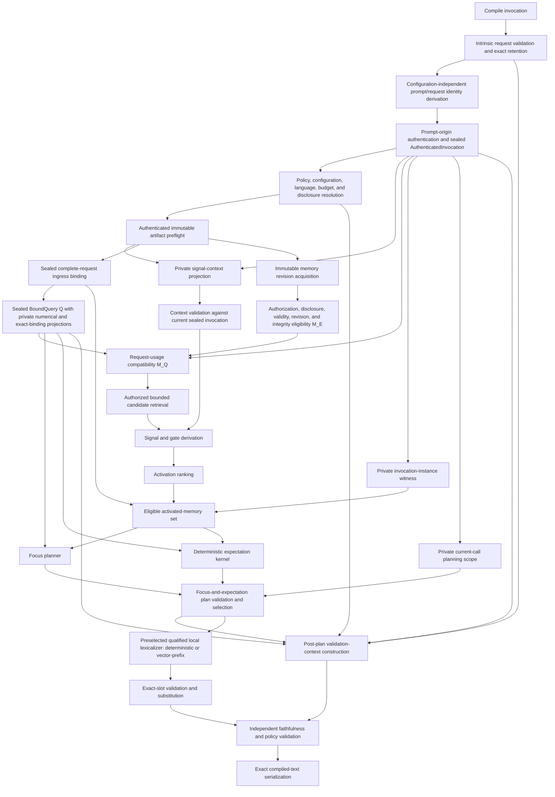
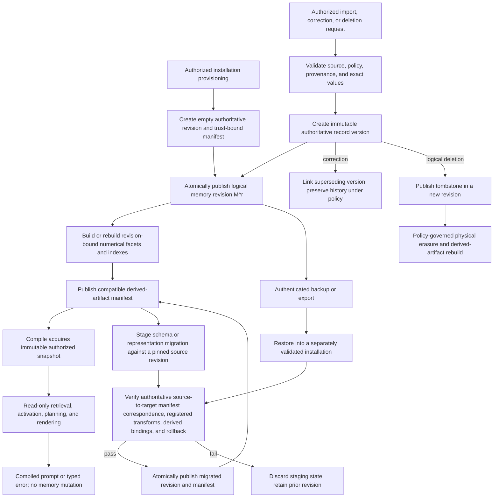
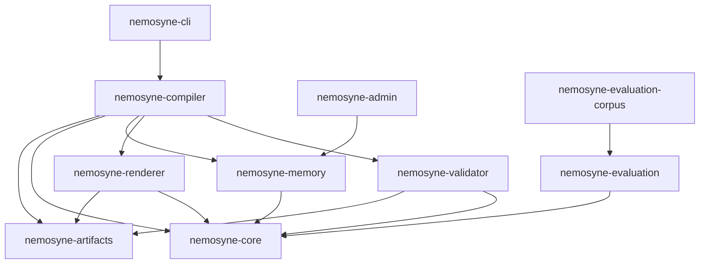
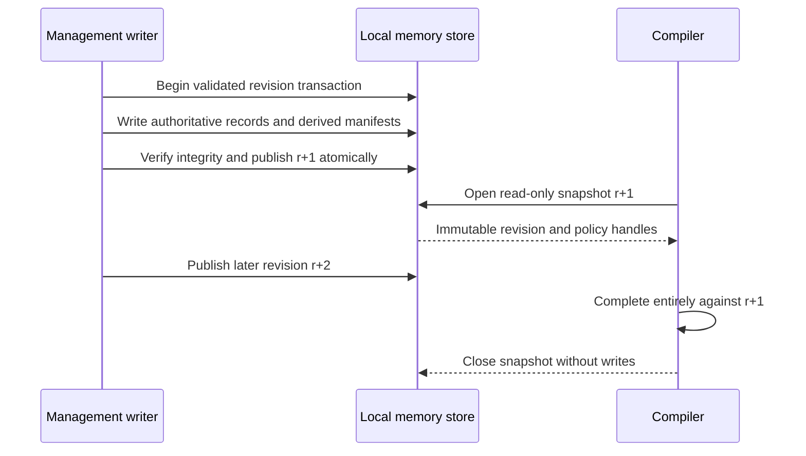
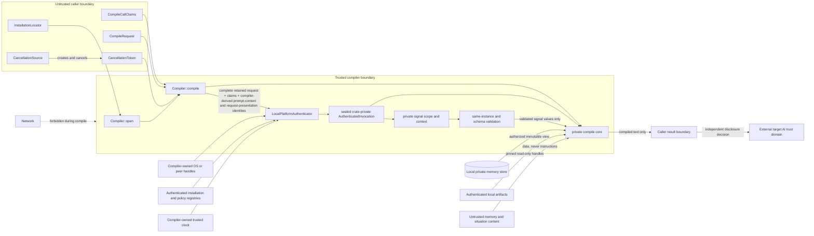
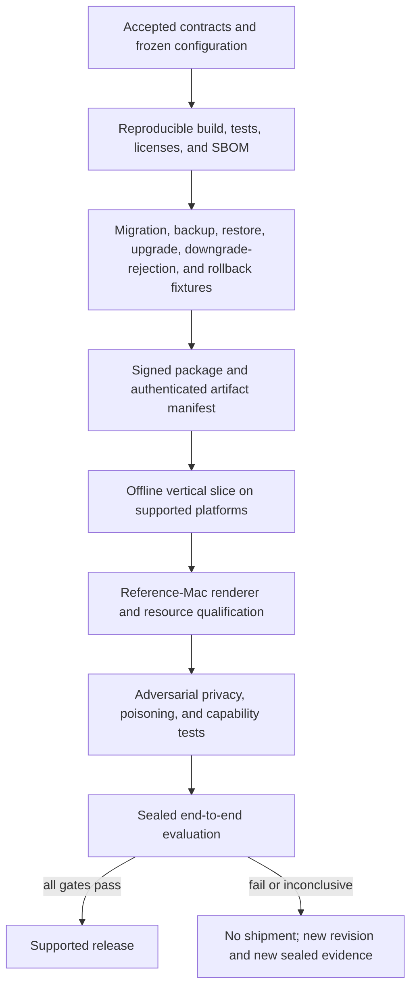
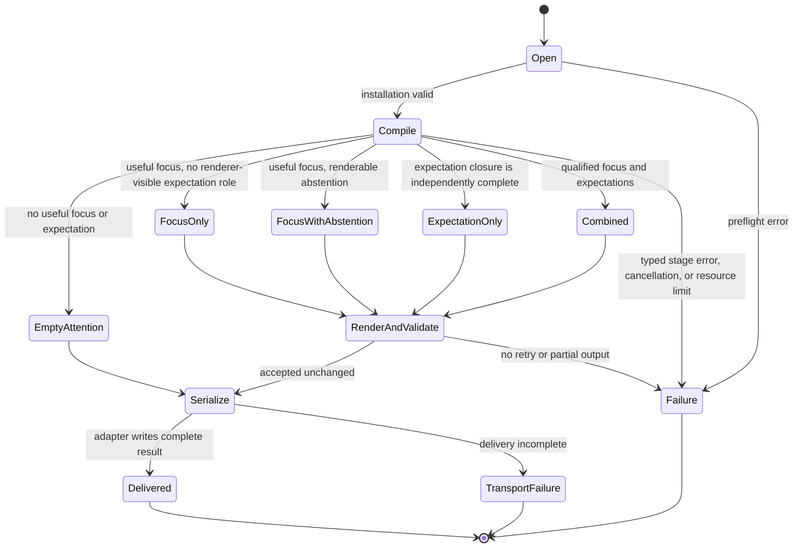

# V1 reference architecture

Status: Proposed

## Purpose

This specification proposes the logical architecture needed to implement the
Nemosyne V1 product contract. It defines component responsibilities, data-flow
boundaries, trust boundaries, memory-revision semantics, failure classes, and
the decisions that must be resolved before production implementation.

This remains a proposed logical decomposition rather than an implemented or
validated product. Decisions 0014 and 0015 select the intended V1
implementation path: typed numerical memory and query facets, a shared eligible
activated-memory set, parallel focus and expectation formation, a canonical
focus-and-expectation plan, and qualification of a deterministic lexicalizer
against a local vector-prefix candidate. Decision 0016 fixes the sealed
compile-integrity boundaries that keep complete queries, the one shared
activated-memory object, invocation membership, canonical plan content, exact
plan bytes, and renderer configuration distinct and fail closed at their
joins.
Physical database, encoder, index, process, packaging, release-model, and
production-runtime choices remain independently evidence-gated.

The architecture has four maturity labels:

- **Accepted boundary**: behavior already selected by an accepted decision.
- **Required property**: a constraint derived from the product contract that
  every conforming architecture must preserve.
- **Proposed boundary**: the current logical decomposition to be evaluated.
- **Open choice**: an implementation or policy decision that remains unset.

## Definitions

### Compile inputs and result

A compile request contains the original prompt `P`, zero to three situation
statements `S`, and caller-supplied request evidence \(\Xi\), containing a
declared contextual time `t_context`, optional declared location, and explicit
metadata. The compiler authenticates untrusted call claims and constructs one
sealed crate-private `AuthenticatedInvocation` \(\mathcal I_A\). Its
inseparable projections include the authenticated prompt, call binding,
invocation context `I`, trusted authorization time `t_auth`, and one opaque
generative call brand. Downstream stages consume the aggregate, never an
independently supplied authentication tuple. A pinned compiler configuration
and policy resolve the finite attention budget `B`.

The request is evaluated against one immutable logical memory revision `M^r`
and one immutable, content-identified compiler configuration `K`.

The only successful product result is the compiled text defined by the V1
product contract. Internal plans, source bindings, scores, and diagnostics are
not additional product results.

### Logical data flow

The proposed compile path is:



These are logical boundaries. They do not imply one process, one crate per
stage, or a synchronous implementation.

```mermaid
sequenceDiagram
    participant Caller as Local caller
    participant Compiler as Compiler
    participant Auth as LocalPlatformAuthenticator
    participant Store as Local memory
    participant Focus as Focus branch
    participant Expect as Expectation branch
    participant Renderer as Renderer
    participant Validator as Independent validator
    Caller->>Compiler: open(InstallationLocator)
    Caller->>Compiler: compile(CompileCallClaims, CompileRequest, CancellationToken)
    Compiler->>Compiler: Retain complete valid request; derive prompt/request identities
    Compiler->>Auth: Complete request + claims + both compiler-derived identities
    Auth->>Auth: Authenticate with compiler-owned handles, registries, and clock
    Auth-->>Compiler: One sealed AuthenticatedInvocation
    Compiler->>Compiler: Resolve/pin K, policy, language, budget, disclosure
    Compiler->>Compiler: Preflight artifacts; project and validate minimized signal context from sealed invocation
    Compiler->>Compiler: SIT-01 constructs sealed complete-request binding
    Compiler->>Store: Open authorized immutable revision
    Store-->>Compiler: Revision, policy, exact data, and numerical views
    Compiler->>Compiler: Encode situation, retrieve, derive signals, activate
    par Shared eligible set
        Compiler->>Focus: Sealed BoundQuery, K, and complete set carrying Lambda_A plus private invocation and fresh set-instance witnesses
        Focus-->>Compiler: FocusCandidateSet preserving both witnesses
    and
        Compiler->>Expect: Sealed BoundQuery, K, and the exact same complete sealed EligibleActivatedMemorySet object and borrow
        Expect-->>Compiler: ExpectationBundle with per-frame results preserving both witnesses
    end
    Compiler->>Compiler: Borrow current-call and exact-set planning scope; validate each branch's two witnesses; select FocusExpectationPlan
    Compiler->>Compiler: Build witness-erased validation context; recompute content/configuration joins and consume private plan witness
    Compiler->>Renderer: Plan borrow and authenticated K_R (ID plus exact canonical content)
    Renderer-->>Compiler: Plan-and-renderer-configuration-bound SubstitutedAttention or typed renderer failure
    Compiler->>Compiler: Compare equal-ID candidate/context canonical-plan byte capsules; quarantine collision
    Compiler->>Validator: SubstitutedAttention + shared &AuthenticatedRendererConfiguration K_R + least-privilege ValidationView projected by private context
    Validator-->>Compiler: AcceptedAttention or typed validation failure
    Compiler->>Compiler: Concatenate framing, attention, and retained prompt
    Compiler-->>Caller: CompiledPrompt bytes or one typed error
```

Every logical component in this data flow is a **proposed boundary** unless
the table below states otherwise.

| Boundary | Maturity |
| --- | --- |
| Product input, result, read-only behavior, and local trust boundary | Decision 0014 retains the boundary selected by superseded Decision 0011 |
| Exact framing and prompt-byte preservation | Required property from the product contract |
| Numerical memory, transition records, shared activated set, parallel focus and expectation, and combined plan | Accepted implementation direction from Decision 0014 |
| Deterministic lexicalizer baseline, vector-prefix candidate, exact slots, local qualification, and non-thinking generation | Accepted implementation direction from Decision 0015 |
| Aggregate query and shared-set boundaries, invocation witnesses, canonical plan identity, exact-byte collision detection, renderer-configuration identity, and closed renderer joins | Accepted integrity boundaries from Decision 0016 |
| Ingress, preflight, snapshot, authorization, encoding, retrieval, derivation, expectation, planning, rendering, and validation decomposition | Proposed boundaries governed by the focused specifications |
| Existing activation kernel, evaluator, and corpus | Experimental implementations and evidence |
| Physical database and schema, exact encoders and indexes, calibrated parameters, release model and quantization, production runtime, processes, and resource thresholds | Open choices |

### Configuration and artifact preflight

`Compiler::open` has already authenticated the installation bootstrap trust,
registries, and handles required to evaluate a call. The per-call boundary
first intrinsically validates and retains the complete immutable request,
derives only its configuration-independent prompt and request-presentation
identities, and authenticates their exact binding to the untrusted
presentation. That authentication produces the private local principal,
caller context, and trusted authorization time. Only then does the compiler
resolve the requested installed configuration and disclosure narrowing,
applicable policy, output language, effective attention budget, and immutable
artifact handles. Before persistent memory access, artifact preflight:

- verifies an authenticated artifact manifest against a pinned installation
  trust root held outside the mutable artifact bundle;
- opens immutable handles to required encoder, tokenizer, renderer, validator,
  and schema artifacts; and
- pins content or implementation identities for principal resolution,
  prompt-origin validation, authorization, disclosure, temporal validity, and
  supersession policy evaluators; and
- verifies that every artifact is present, compatible, and integrity-checked.

The authenticated manifest establishes which identities are authorized;
content digests then establish that the opened bytes have those identities.
An unsigned self-consistent manifest is insufficient. No artifact may be
downloaded or replaced during compilation. Trust-root rotation, installation,
and update occur through a separately authenticated management path. A version
label without provenance, content identity, and an immutable handle is
insufficient because the underlying file could change during a call.

### Request, control, and ingress validation

These three boundaries are distinct:

- intrinsic `CompileRequest` construction owns original-prompt preservation,
  zero-to-three situation-statement validation, required contextual-time
  validation, and context-independent metadata, language-tag, and budget
  syntax;
- after successful prompt-origin authentication,
  `resolveAndPinControls` solely owns installed compatibility and resolution
  of configuration, policy, output language, effective attention budget, and
  disclosure ceiling; and
- `SIT-01` solely owns configuration-bound complete-request ingress
  identities and the immutable request-local bound situation.

The compiler retains the original prompt bytes separately from every decoded,
normalized, tokenized, or numerical representation. No later stage may
reconstruct the product prompt from an encoder output.

### Principal and disclosure policy

V1 runs for one local user principal. Principal resolution establishes the
caller and ownership context before persistent memory is read. After revision
acquisition, the policy gate derives the revision-scoped view that determines
which records the caller may cause Nemosyne to read and disclose in derived
form. The architecture separates:

- permission to read;
- permission to disclose to the caller;
- source authenticity;
- current validity;
- confidence or uncertainty; and
- instruction authority.

None of these properties implies another. Authorization is evaluated before
candidate generation. A high relevance value cannot restore an excluded
record. Authorization, disclosure expiry, current normative validity, and
supersession are evaluated at `t_auth`. The caller-controlled `t_context` may
select explicitly historical context but cannot make historical instructions
currently authoritative.

The operating-system identity or another concrete ownership mechanism remains
an open choice. A V1 implementation must not silently share one memory universe
across principals.

### Immutable memory revision

One logical memory revision `M^r` is a self-consistent read view containing:

- authoritative records and stable record-version identities;
- provenance, authority, validity, uncertainty, and supersession state;
- authorization and derived-disclosure policy facts with a policy revision;
- exact values required for faithful reconstruction;
- manifests for rebuildable numerical representations; and
- every index used for candidate generation.

For one call, the compiler pins `t_auth`, invocation context `I`, memory
revision `r`, and policy revision \(p_{\mathrm{policy}}\). It derives one
call-specific authorized
view \(M_A^{r,p_{\mathrm{policy}},t_{\mathrm{auth}},I}\). Authorization expiry and disclosure
decisions use that same \(t_{\mathrm{auth}}\); current normative validity and
supersession are also resolved at \(t_{\mathrm{auth}}\). They do not use
\(t_{\mathrm{context}}\) or reread the wall clock.

Every derived artifact is bound to the authoritative record version, encoder
or transform version, and revision for which it is valid. A stale derived
artifact cannot be combined silently with a newer authoritative revision.

A concurrent management operation may publish `M^(r+1)`, but an in-flight
compile using `M^r` never observes it. Re-encoding, re-indexing, consolidation,
access-history updates, and cache publication are write or maintenance
operations; they are not hidden effects of compilation.

The proposed V1 rule is snapshot-stable authorization: a revocation published
after \(M_A^{r,p_{\mathrm{policy}},t_{\mathrm{auth}},I}\) is acquired applies to later calls and does not
rewrite the authorization view of the in-flight call. Compile duration must
remain bounded. Immediate cancellation on revocation is an alternative that
requires a later privacy and concurrency decision before implementation.

### Memory planes

Decision 0014 retains the two-plane logical memory model selected by the
superseded Decision 0012 and extends it with transition records.

The **authoritative exact plane** preserves immutable record-version and
canonical-proposition identities, provenance, validity, authority,
authorization, supersession, source-dependency groups, conflicts, and
loss-sensitive values. Its representation is numerical in the broad machine
sense: typed identifiers, enums, booleans, scalars, timestamps, coordinates,
relations, and byte-preserving payloads. It is lossless for every claim the
compiler may emit and never depends on inversion of an embedding.

The **derived numerical plane** contains versioned, rebuildable typed facet
vectors, calibrated scalars, numerical relations, and search indexes. It is
the sole computational state for similarity, activation, propagation,
consolidation, and adapter input, but it is not an independent source of
truth. Deleting or rebuilding this plane must not change the meaning of the
authoritative exact plane.

The exact physical representation remains open, but its contract must expose:

- stable memory identity and immutable record-version identity;
- source and import provenance;
- observed, created, valid-from, valid-until, and superseded times;
- authority and authorization labels;
- uncertainty and unresolved conflicts;
- exact entities, names, paths, numbers, and other loss-sensitive values;
- typed numerical facets and relations;
- transform, encoder, tokenizer, and index manifests; and
- logical deletion, physical erasure, export, migration, and repair state.

This list does not require one universal memory-object row or one physical
schema. The complete logical record and facet contract is defined in
[`cognitive-memory-activation-and-focus.md`](cognitive-memory-activation-and-focus.md).
Transition records, prediction frames, dependency groups, observation status,
and expectation mathematics are defined only in
[`predictive-attention-and-expectation.md`](predictive-attention-and-expectation.md).

The management and compile lifecycles remain separate:



A compile call enters only at `SNAP`. Import, correction, consolidation,
supersession, deletion, erasure, backup, export, restore, and derived-index
publication are authenticated management operations and cannot be triggered by
prompt, memory, renderer, or downstream-agent text. Provisioning is explicit;
an uninitialized installation cannot compile. Migration and restore operate on
staging state, verify before atomic publication, and preserve the prior
revision until rollback evidence passes. Downgrade is rejected unless the
target schema declares and verifies backward compatibility.

### Situation encoding

After prompt-origin authentication and configuration resolution, compiler
ingress constructs one sealed \(\widehat B_{\mathrm{in}}\) under the
authenticated pinned configuration `K`. Its `request_id` and `situation_id`
are distinct domain-separated typed content identities over the canonical
complete request and canonical ordered situation-evidence envelopes;
`configuration_id` is the authenticated content identity of `K`. The public
request accepts none of these fields. The canonical encoding, inner content
digests, configuration-bound digests, collision-resistance assumption, and
fail-closed collision-witness behavior are owned by the
[cognitive-memory specification](cognitive-memory-activation-and-focus.md#numerical-query-state).

Ingress independently projects
\(B_Q=(request\_id,situation\_id,configuration\_id)\) into situation encoding
and the same three fields into shared-set construction. Neither branch may
copy the binding from the other, derive it from a lossy vector, or accept it
from the caller. The later equality check therefore detects branch corruption,
reuse, and cross-request swaps; retained canonical bytes permit recomputation
and observed-collision rejection. Cryptographic collision resistance remains
an explicit assumption rather than an absolute uniqueness claim.

Situation encoding converts `P`, `S`, \(\Xi\), and `K` into a versioned pure
numerical situation \(Q_{\mathrm{num}}\). It contains only request-local
prompt, situation, declared contextual-time, location, metadata, derived
source-language, and observation-quality facts represented as typed vectors,
scalars, identifiers, presence masks, and numerical relations. It retains
validated source-byte locators, source-buffer content identities, and exact
values outside lossy representations. The situation boundary then constructs
the bound query
\(Q=\operatorname{bindQuery}(\mathsf R,\widehat B_{\mathrm{in}};K)\); that sole
constructor computes and seals both projections without allowing one to
change the other's semantics. `BoundQuery` is a sealed aggregate with private numerical and
binding fields plus a compiler-derived `BoundQueryContentId` over their
injective canonical envelope:

```text
BoundQuery {
  private numerical: NumericalQuery,
  private binding: ExactQueryBinding,
  private content_id: BoundQueryContentId
}
```

Only `SIT-01` may construct it, and it derives both projections from the same
retained complete request and pinned `K`. There is no public constructor from
independently supplied \(Q_{\mathrm{num}}\) and \(B_Q\), no field-replacement
operation, and no serialization path that can reconstitute an authenticated
value. Downstream boundaries accept `&BoundQuery`, not the two projections as
independent parameters. Narrow read-only accessors may lend the numerical
projection to semantic arithmetic or the exact binding to a structural join,
but neither accessor returns an independently constructible authenticated
query value. A mixed, stale, or corrupted projection pair therefore cannot be
represented by the public API; defensive content-identity and
canonical-envelope checks fail closed if internal corruption nevertheless
produces one. Neither projection contains a principal, trusted authorization
time, policy revision, authorization-view identity, disclosure decision, or
authorization result.

Normatively:

\[
Q_{\mathrm{num}}=\operatorname{encode}(P,S,\Xi;K),
\qquad
Q=\operatorname{bindQuery}(\mathsf R,\widehat B_{\mathrm{in}};K),
\qquad
\operatorname{numerical}(Q)=Q_{\mathrm{num}},
\quad
\operatorname{binding}(Q)=B_Q.
\]

The selected encoder and every transform it invokes are pinned inputs within
`K`. `t_auth`, `I`, policy state, and authorization-view state are not explicit
or implicit inputs to either function. The private `BoundQueryContentId` is
derived only from the canonical `BoundQuery` schema, \(Q_{\mathrm{num}}\),
\(B_Q\), and the pinned identity scheme in `K`; it is structural-integrity
metadata and never semantic evidence. Holding `P`, ordered `S`, \(\Xi\), and
`K` fixed must therefore produce identical \(Q_{\mathrm{num}}\), source
locators, and source-buffer content identities. Holding the complete request
and `K` fixed also produces identical \(B_Q\) and bound `Q`, even when private
authorization state or trusted authorization time differs. A change confined
to an output-language, budget, or other non-situational compile control may
change `request_id` and bound `Q` while leaving \(Q_{\mathrm{num}}\) and
`situation_id` unchanged.

The encoder contract must define:

- input normalization that does not affect original-prompt preservation;
- vector spaces, dimensions, types, and normalization;
- exact scalar and categorical encodings;
- treatment of absent, unknown, and uncertain values;
- model and transform versions;
- deterministic numerical behavior under the declared V1 execution envelope;
- supported languages and modalities; and
- failure behavior for unavailable or incompatible artifacts.

The encoder does not decide instruction authority and does not retrieve memory.

### Authorized candidate generation

Candidate generation searches only the usage-compatible view
\(\mathcal M_Q\). Its boundary accepts one sealed `&BoundQuery`, validates
that aggregate, and borrows its private numerical projection only inside the
retrieval implementation. It produces the bounded candidate set \(C^r\) with
source bindings and retrieval diagnostics. There is no overload accepting
\(Q_{\mathrm{num}}\), \(B_Q\), or a caller-assembled pair. The
[proof program](v1-proof-program.md#formal-compile-model) owns the sole
cross-stage composition and function name for this transition; this
architecture does not define a second retrieval equation.

Project, workspace, application, time, and location may affect search and
ordering but are not undocumented exclusion predicates. Logical eligibility
does not require an exhaustive physical scan. Approximate retrieval therefore
requires a declared candidate budget and measured false-negative behavior.
Authorization is applied before bounded top-k or nearest-neighbor competition.
Adding, removing, or changing an unauthorized record must not crowd out an
authorized candidate or alter content-bearing diagnostics.

The retrieval contract must distinguish:

- no eligible or relevant candidate found;
- a successful bounded search;
- a known incomplete or degraded search; and
- a failed or incompatible index.

Empty candidates and retrieval failure are not equivalent.

### Signal and gate derivation

The compiler projects one private \(\Sigma_{\mathrm{sig}}\) carrying an opaque
reference to the sealed invocation's call brand. It then validates that
reference, every copied trusted value, and both schemas against the current
`AuthenticatedInvocation`, supplied independently to validation, to obtain
\(V_{\mathrm{sig}}=(t_{\mathrm{auth}},u_{\mathrm{auth}})\). Signal derivation
accepts one sealed `&BoundQuery`, validated \(V_{\mathrm{sig}}\), and every
member of \(C^r\). After aggregate validation, it borrows the query's private
numerical projection internally and maps those inputs to the normalized
candidate inputs \(N\) required by an activation mechanism. It has no
split-query overload and cannot replace or retain either projection. The proof
program owns the sole cross-stage composition and function names for these
transitions; this architecture does not define a second signal-derivation
equation.

It owns channel semantics, gates, evidence signals, inhibition signals, and
their provenance. `SignalDerivationContext` carries pinned context and social
identity schemas, a non-semantic call brand, trusted authorization instant,
and typed authenticated social-subject identity; only trusted time and the
schema-validated subject value reach signal math. Authenticated, declared, and
memory-participant social identities remain disjoint source tags, and schema
rotation requires an authenticated one-to-one migration artifact. The context
carries no authorization, policy, disclosure, store, or ambient-time
capability. It
must not assign arbitrary numbers without an authored or learned derivation
contract and independent evaluation targets. Decision 0014
retains cue, temporal-context, base-availability, active-goal, procedural,
hazard, and social-perspective fit as initial focus-channel hypotheses when the
required facets exist. The focused specifications define their candidate
mathematics, signal lineage, and the separation between hard policy gates and
soft inhibition.

The five channels in the revision-1 coding-agent corpus are experimental
evidence labels. They are not the V1 memory ontology or an accepted runtime
channel set.

### Activation ranking

The existing deterministic activation kernel is the current implemented
candidate for this boundary. It accepts already normalized signals and returns
a complete bounded ranking of aggregate scores. A separate operation explains
one candidate with a per-channel breakdown. The kernel remains replaceable
until a later decision adopts it for V1 using end-to-end evidence.

The formula, validation, floating-point order, tie behavior, and proofs are
owned only by
[`situation-conditioned-activation.md`](situation-conditioned-activation.md).
Architecture consumes the resulting activation value and explanation
reference; it does not redefine them. Activation remains relevance, not truth,
probability, safety, instruction authority, predictive support, or expected
utility.

Runtime compilation may depend on an adopted runtime kernel. It must not
depend on the offline evaluation or corpus crates.

### Shared activated set and parallel planning

Activation produces one canonical `EligibleActivatedMemorySet`. Its normative
schema and ordering are owned only by
[`predictive-attention-and-expectation.md`](predictive-attention-and-expectation.md);
this architecture consumes that contract and does not define a parallel
version. In summary, it binds the pinned query, memory and policy revisions,
activated records, source and authority data, exact sidecars, and retrieval
diagnostics. Outside its deterministic content-lineage tuple, it also carries
one private nonserializable `InvocationInstanceWitness` borrowed from the
current sealed invocation and one fresh private nonserializable
`EligibleSetInstanceWitness` minted for that exact set object. The first proves
runtime call membership; the second distinguishes two set constructions even
inside one call. Neither can affect semantic keys, ordering, scores,
diagnostics, renderer tensors, or product bytes. The set is the only branch
point.

The focus planner and expectation kernel receive the exact same complete sealed
`EligibleActivatedMemorySet<'call>` object and immutable borrow before final
focus pruning. No projection, filtering, copy, or reconstruction occurs before
the branch calls. Each called branch may derive only its own private
least-privilege view inside that aggregate-taking boundary. Both additionally
consume the same sealed `BoundQuery` and pinned configuration \(K\); neither
accepts a separately supplied numerical query or exact binding. Semantic
derivation may borrow only the aggregate's read-only \(Q_{\mathrm{num}}\)
projection, while exact lineage validation and receipts may borrow only its
read-only \(B_Q\) projection.
The complete shared set carries \(\Lambda_A\);
`policy_revision_id` and `authorization_view_id` originate exclusively there.
The focus branch has no principal, policy object, `AuthorizationView`,
authorization-service, authorization-receipt-projection, or policy-store
input:

- the focus planner first derives the ephemeral canonical
  `RequestPropositionSet` from prompt, situation-statement, and allowed
  request-metadata evidence in \(Q_{\mathrm{num}}\), checks the exact
  \(B_Q=\pi_Q(\Lambda_A)\) join, creates the five-field
  `(request_id, situation_id, policy_revision_id,
  authorization_view_id, configuration_id)` source receipt solely from that
  same \(\Lambda_A\), and then consolidates request-supported and
  memory-supported compatible propositions into bounded focus candidates;
- the expectation kernel evaluates eligible direct observations and explicitly
  permitted registered derivations, retains competing outcome groups and
  counterevidence, and may abstain; and
- neither component retrieves ambient memory, repeats authorization, or
  mutates persistent state.

The two branch outputs preserve the same private invocation and set-instance
witnesses and carry immutable `PlanningSourceProjection` fields for every
consumable item: the
exact common \(\Lambda_A\), essential-source identities, authority,
allowed-use and surface-authority ceilings, mandatory qualifiers and
relations, and exact-slot bindings. The compiler invokes the combined planner
with one private `PlanningInvocationScope<'call>` borrowed independently from
the current sealed `AuthenticatedInvocation` and the exact shared set selected
by the compiler before the branch split. Before comparing content lineage, the
planner requires each branch's invocation witness to match the current-call
scope and each branch's set witness to match the scope's expected-set witness;
branch-to-branch equality alone is insufficient. It copies only the
current-call witness into the plan and erases the set witness after the join. A
missing, reconstructed, expired, foreign, mixed, or same-call-but-different-set
witness fails with `PlanCallBindingMismatch` even when \(B_Q\),
\(\Lambda_A\), and every content-derived identity are equal. The scope and
witnesses remain outside semantic keys, scores, ordering, tensors,
diagnostics, serialization, and product bytes.

The planner receives no authority or disclosure view, principal, policy
handle, or authorization service. It may only compare content lineage, take a
defined meet, copy
or lower those upstream ceilings, and join an upstream slot binding to the
same content identity in a minimized permissionless exact-surface inventory.
Inventory presence never grants slot use. Missing, inconsistent, or expanded
projections fail; planning never reauthorizes or widens disclosure. The
[planning specification](focus-and-expectation-planning.md#immutable-authority-and-disclosure-projections)
owns the complete projection contract.

Focus contributes a lineage-independent `PropositionSemanticKey`; expectation
contributes the closed tagged `ExpectationItemSemanticKey` for hypotheses,
controls, and abstention. Planning wraps these in the branch-tagged
`PlanItemSemanticKey`, uses `RelationSemanticKey` for relation order, and
assigns contiguous `RendererSlotId` values only after sorting distinct
lineage- and exact-content-independent `SlotSemanticKey` values constructed
from a value-independent `ExactSlotOwnerSemanticKey`, a schema-owned
`ExactSlotSemanticLocator`, type, role, bounds, permitted bindings, schema,
and formatter. Upstream branches carry only a value-, lineage-, and
request-independent `ExactSlotOwnerSemanticDescriptor`. Planning verifies
that descriptor against the selected item's non-slot semantic meaning and is
the sole stage that maps it to the final key. An item-owned key derives from
the owning `PlanItemSemanticKey` plus an owner role; an explicitly shared slot
instead uses a registered `SharedExactSlotMeaningKey`. Planning groups slots by
`(owner_semantic_key, locator)`, never by locator alone. Independent items
using the same schema field therefore remain distinct, while one semantic
owner and locator carrying incompatible exact values is a typed structural
conflict. Authoritative values, exact-surface content identities/bytes, and
request-local instance, transition, receipt, and exact-binding identities
remain privileged sidecar or audit lineage and cannot decide semantic
grouping, feasibility, priority, selection, renderer tensor order, or
pre-substitution model-visible input.

The expectation derivation, support semantics, uncertainty vector, medoids,
coverage, and abstention are owned only by
[`predictive-attention-and-expectation.md`](predictive-attention-and-expectation.md).
`RequestPropositionSet` is focus-only ephemeral state: it is neither persistent
memory nor expectation evidence, and it cannot raise its source authority or
allowed-use ceiling. The pinned source-ceiling mapping is a pure
authority-lowering artifact lookup compatible with the policy revision in
\(\Lambda_A\); it does not authorize memory or disclosure. Situation encoding
validates exact source-byte locators into the private \(X_Q\) projection;
focus derivation borrows those bindings internally from the sealed
`BoundQuery` and never rereads or reparses raw request text, reopens an
authorization view, or repeats authorization. The focus derivation, including
`deriveRequestPropositions(&BoundQuery, &EligibleActivatedMemorySet<'call>, K)`,
is owned by
[`cognitive-memory-activation-and-focus.md`](cognitive-memory-activation-and-focus.md).
The aggregate-only API may destructure \(\Lambda_A\), its private invocation
witness, and its private set-instance witness internally but cannot accept or
recombine them independently. It preserves both witnesses; current-call
membership and exact-selected-set identity are checked only later by a
boundary that possesses independently derived anchors for both.
An empty eligible memory set therefore does not force an empty
`FocusCandidateSet`: authenticated prompt, situation-statement, or allowed
request-metadata evidence may independently justify focus.

### Canonical focus-and-expectation plan

The combined planner consumes the focus candidates and canonical
`ExpectationBundle`,
checks their shared request and configuration lineage, applies authority and
budget closure, preserves material alternatives, and creates one canonical
`FocusExpectationPlan`. Request, situation, and metadata evidence may support
focus even when memory is empty. Predictive-evidence abstention may coexist
with useful focus.

The plan is the only source of meaning for rendering and diagnostics. Its live
form retains full runtime receipts for integrity checks, while its canonical
product identity uses only the planning specification's
`PlanSemanticSourceProjectionV1` and `SemanticConfigurationId`; full
configuration-bound query/lineage IDs and \(K_R\) cannot enter
`PlanContentId`. It contains:

- stable focus and expectation proposition identities;
- essential request and authorized-memory source references;
- distinct roles for focus, present-state hypotheses, passive successors, and
  conditional outcomes;
- conditions, horizons, support, counterevidence, uncertainty, and
  abstention;
- authority ceilings and exact-value bindings;
- mandatory qualifications and relations;
- output-language and post-substitution budget;
- validator-only exclusions, omitted support, dependency groups, no-answer,
  and no-action controls; and
- canonical item order and configuration identity.

The complete wireframe, mandatory closure, lexicographic reference selection,
cost upper bound, and examples are owned by
[`focus-and-expectation-planning.md`](focus-and-expectation-planning.md).
The plan contains no draft answer, action selection, tool call, or independent
prose truth. It remains internal and does not change the one-text product
result.

### Vector-prefix adapter and renderer

The renderer accepts only the bounded numerical focus-and-expectation plan
envelope and the compatible rendering configuration. It reads output language
and budget from that envelope and rejects a configuration-schema mismatch. It
does not receive the whole memory universe, raw memory prose, or decimal
serializations of plan vectors. It does not retrieve, rerank, select new facts,
create or reorder expectations, invent policy, choose actions, or answer the
original prompt.

Decision 0015 retains a typed latent resampler followed by direct virtual input
embeddings as the first generative renderer hypothesis. The renderer
specification owns the experimental dimensions, tensor mapping, training
phases, and required simple baselines.

Its internal result is an opaque `RenderedAttention<'plan>` value whose
lifetime is tied to the borrowed source plan. The Rust lifetime prevents the
candidate from outliving that borrow and prevents unchecked detachment; it does
not encode referent identity. The enforceable binding is the deterministic
`PlanContentId` derived from `PlanCanonicalEnvelopeV1`, the complete canonical
product-relevant plan content defined by the planning specification. The
envelope includes every semantic item, relation, control, selected structural
projection, exact-surface identity, and formatted substitution bytes, while
excluding both runtime witnesses, every request-local or configuration-bound
instance identity, the full `configuration_id`, and \(K_R\). It commits to the
plan-semantic configuration \(K_S\), configuration-independent request and
situation content digests \(d_R,d_S\), and complete selected
lineage-independent semantics.
The exact authenticated renderer configuration \(K_R\) separately yields the
domain-separated typed `RendererConfigurationId` defined by the renderer
specification. The shared `nemosyne-artifacts` domain crate represents exactly
\(K_R\) as an immutable sealed `AuthenticatedRendererConfiguration` whose
canonical-envelope bytes equal \(\operatorname{CE}_{v1}(K_R)\). Authenticated
artifact preflight is the only product-path constructor. The type is not
compiler-private: the compiler, renderer, substitution boundary, and validator
normally borrow or reborrow the one preflight-created sealed value without
receiving installation-resolution, trust-root, update, filesystem, network,
registry, installation, or mutation capabilities. Correctness is exact
authenticated canonical-content equality, not referent identity: a separately
authenticated value with identical canonical bytes and
`RendererConfigurationId` is equivalent, while a projection, narrower
configuration, unauthenticated reconstruction, or same-ID/different-byte value
is rejected. The sole checked
renderer constructor requires a plan borrow and
`&AuthenticatedRendererConfiguration`, recomputes the plan envelope and both
identities, and seals `PlanContentId`, `RendererConfigurationId`, a private
exact canonical-plan byte-comparison capsule, and a private exact canonical
\(K_R\)-content comparison commitment; neither the model nor a caller can
supply, replace, or mutate any of them. The value contains:

- the slot-bearing attention text and token-origin map;
- a complete segmentation into output units; and
- untrusted bindings from every assertion-bearing output unit to planned
  proposition identities; and
- the sealed plan content identity;
- the sealed renderer-configuration identity; and
- the private exact canonical-plan byte-comparison capsule; and
- the private exact canonical-renderer-configuration comparison commitment.

A closed surface-only class permits only whitespace, punctuation, and
configuration-listed structural delimiters; it cannot carry a connective,
relation, exact value, or independent semantic claim. Bindings are validation
input, not proof that the text expresses the identified propositions. They are
omitted from the successful product result.

Expectation spans additionally bind kind, condition, horizon, alternative set,
support semantics, and mandatory uncertainty. Validation rejects probability
inflation, fact promotion, condition or horizon loss, alternative collapse,
unsupported action language, and suppressed abstention.

The renderer emits only registered placeholder tokens for loss-sensitive exact
values. A deterministic resolver rejects unauthorized, unknown, omitted,
duplicated, or invented slots and substitutes the approved surface bytes into
an opaque `SubstitutedAttention<'plan>`. It first recomputes
`RendererConfigurationId` from the supplied
`&AuthenticatedRendererConfiguration` representing exact \(K_R\) and
requires both that identity and the exact canonical \(K_R\)-content commitment
to equal the candidate's sealed values. Any disagreement, including equal
identity with different canonical bytes, is
`RendererSubstitutionError::RendererConfigurationMismatch` and quarantines
the configuration path before any slot access. Substitution then requires a
borrowed plan with the same `PlanContentId`, preserves both identities, the
candidate and supplied renderer-configuration commitments, and the private
exact canonical-plan byte-comparison capsule without an independent identity
input, and runs before final faithfulness validation. A separately
constructed canonical-content-identical plan is valid only under an
authenticated renderer configuration with the same
`RendererConfigurationId` and exact canonical \(K_R\) content, and it must
produce identical substitution bytes. Canonically different plan content is
`RendererSubstitutionError::PlanIdentityMismatch`. Equal typed plan identity
associated with different retained canonical plan bytes is
`RendererSubstitutionError::PlanContentIdentityCollision` and quarantines the
plan-identity and renderer-configuration path before any slot access.

A model-based renderer remains a fallible, untrusted transformation even when
it runs locally. Qwen3 is the first integration family, but the model
qualification specification owns the candidate slate, selection rule, resource
protocol, and release evidence. A deterministic template renderer remains a
mandatory baseline and may be a separately qualified renderer configuration
selected before a request. It is not an automatic substitute after another
renderer fails.

Renderer artifacts must be provisioned, versioned, integrity-checked, and
available before compilation. Download and update mechanisms run outside the
no-network compile path.

### Faithfulness and policy validation

The separate `nemosyne-validator` crate compares the plan- and
renderer-configuration-bound `SubstitutedAttention<'plan>` through one
least-privilege read-only `ValidationView<'plan>`. The compiler privately owns
the underlying `ValidationContext<'plan>` and implements or projects only that
view at the validator call boundary; the validator never imports, receives, or
constructs the compiler-private context type.

The private context borrows its source structured plan and carries minimized
read-only projections of the retained original prompt, prompt-derived intent,
plan semantics, exact-slot validation data, validator controls, sealed
`PlanContentId`, sealed `RendererConfigurationId`, and one private exact
canonical-plan byte-comparison capsule plus one private exact canonical
renderer-configuration commitment. The view exposes no raw plan, private
commitment, or invocation witness, and the validator does not depend on
renderer implementation internals. Immediately before invoking it, the
compiler-owned callsite compares candidate and context capsules whenever their
plan identities are equal; same identity with different bytes is standalone
`PlanContentIdentityCollision`, quarantines the path, and returns
`InternalInvariantViolation`/exit `70` without invoking the independent
validator. Before interpreting candidate content, the validator requires the
candidate and validation-view plan identities to agree and the candidate,
validation view, and shared supplied
`&AuthenticatedRendererConfiguration` representing exact \(K_R\) to share one
`RendererConfigurationId` and byte-identical authenticated canonical \(K_R\)
content. Equal ID with different canonical bytes is
`RendererConfigurationMismatch` and quarantines the configuration path. It
rejects:

- unsupported propositions;
- omitted mandatory qualifications;
- authority escalation;
- answer leakage;
- forbidden or excluded content;
- language mismatch;
- malformed leading or trailing line breaks; and
- output that cannot be mapped back to planned propositions.

Validation verifies complete, nonoverlapping segmentation and known proposition
identities. It accepts the exact rendered text unchanged or returns an error.
The checked substitution constructor has already enforced the exact expanded
budget and returned no `SubstitutedAttention<'plan>` on
`RendererCostBoundViolation`; the validator owns no budget-overflow variant and
cannot reclassify that substitution error.
A candidate whose sealed `PlanContentId` differs from the validation view is
`PlanIdentityMismatch`; a candidate constructed from a separate
canonical-content-identical plan is valid at this boundary only when
candidate, view, and supplied authenticated \(K_R\) also have equal
`RendererConfigurationId` and byte-identical canonical content. A different
candidate, view, or supplied \(K_R\) configuration identity or
canonical-content commitment is
`RendererValidationError::RendererConfigurationMismatch`. The validator never
repairs or changes an identity. Validation is not a second renderer.

Validation establishes conformance to a bounded plan, not truth of the source
memory. Decision 0015 retains a fail-closed hybrid contract: deterministic
structural, slot, and literal checks followed by an independently trained and
calibrated dual-branch semantic verifier. The focused renderer specification
fixes its inputs, independence boundary, classifier heads, threshold-selection
procedure, and failure semantics. Its exact encoder, dimensions, confidence
targets, and resulting thresholds remain frozen qualification-manifest
choices. Renderer self-attribution without independent checks is insufficient
evidence.

### Serializer and adapters

The serializer performs only the exact byte concatenation defined by the
product contract and uses the retained original prompt buffer directly. It
adds no suffix.

The programmatic API is the canonical semantic operation. The CLI is the
proposed first adapter for one-call local use. The CLI, library, and any later
application adapter share the same compile orchestrator and error taxonomy.

### Callable library API contract

The proposed stable entry point is:

```rust
pub struct InstallationLocator { /* private untrusted selection fields */ }

impl InstallationLocator {
    pub fn new(
        schema: InstallationLocatorSchemaId,
        scope: InstallationScopeTag,
        installation_id: InstallationId,
    ) -> Result<Self, InstallationLocatorError>;
}

pub struct PromptOriginPresentation { /* private bounded opaque bytes */ }

impl PromptOriginPresentation {
    pub fn new(
        route: PromptOriginRouteTag,
        opaque_presentation: Vec<u8>,
    ) -> Result<Self, PromptOriginPresentationError>;
}

pub struct CancellationSource { /* private shared monotonic state */ }

#[derive(Clone)]
pub struct CancellationToken { /* private read-only shared state */ }

impl CancellationSource {
    pub fn new() -> Self;
    pub fn token(&self) -> CancellationToken;
    pub fn cancel(&self);
}

impl CancellationToken {
    pub fn is_cancelled(&self) -> bool;
}

pub struct Compiler { /* private immutable configuration and handles */ }

impl Compiler {
    pub fn open(
        locator: &InstallationLocator,
    ) -> Result<Self, OpenError>;

    pub fn compile(
        &self,
        claims: &CompileCallClaims,
        request: &CompileRequest,
        cancellation: &CancellationToken,
    ) -> Result<CompiledPrompt, CompileError>;
}
```

This is a target contract, not implemented Rustdoc. The locator schema and
scope tags are closed, versioned public values; the installation identity is a
bounded canonical public value. They are stable selectors, not credentials.
Every selector, tag, and identity appearing in these public signatures is
itself constructible by an external crate through a documented validated
public boundary; no test-only helper, crate-private conversion, or
implementation-owned value is required to reach `Compiler::open` or
`Compiler::compile`.
`InstallationLocator::new` validates only the known schema and scope tags and
the identity's syntax, canonical form, and absolute size. It does not discover
an installation, authenticate a principal, or prove that the selected
installation exists.

An `InstallationLocator` cannot contain a filesystem path, URL, manifest,
trust root, registry object, credential, principal, executable identity,
platform resource handle, or channel handle. `Compiler::open` resolves the
untrusted locator itself through the platform installation resolver selected
by `SEC-00` and the frozen runtime topology. The resolver derives its effective
principal from compiler-created operating-system handles, consults only the
authenticated installation registry, verifies the selected manifest against a
compiler-, package-, or operating-system-owned bootstrap root, and opens only
the registered canonical memory and artifact locations. It never falls back to
an environment variable, current directory, caller path, caller manifest, or
caller trust material. A syntactically valid locator that is absent, outside
the effective principal's installation scope, or not verifiable fails with one
typed `OpenError` and creates no compiler.

After successful resolution, `Compiler::open` constructs the selected
compiler-owned `LocalPlatformAuthenticator` from the verified installation
registries, compiler-owned platform handles, and compiler-owned trusted clock.
`compile` accepts only bounded untrusted call claims, one intrinsically valid
but untrusted request, and one read-only cancellation token. It authenticates
the current call and constructs one sealed crate-private
`AuthenticatedInvocation`. That aggregate owns one fresh opaque
runtime-instance brand and inseparably contains the `InvocationContext`,
`AuthenticatedPrompt`, authenticated call binding, and trusted authorization
time. Only aggregate-bound borrowed projections exist; no downstream
constructor accepts those fields independently. The compiler then obtains one
immutable memory, policy, configuration, and artifact revision for that call.
The private aggregate-taking compile core is not exported. An authenticated
invocation or any of its projections is never supplied by the caller, retained
by `Compiler`, or reused across requests.
The brand is a private generative capability or lifetime identity. Equality
means membership in the same runtime instance, not byte, digest, random-number,
or numerical-feature equality. It is never serialized, persisted, rendered,
hashed into content identity, or passed to semantic computation. Its
allocation may differ across otherwise identical calls without violating
product determinism because every semantic and byte-producing projection
erases it first. `SEC-00` and `OD-04` must select and verify the concrete
private lifetime or shared-object representation.
The compiler can serve sequential or concurrent read-only requests only when
its adopted storage and model runtime prove safe sharing.

`CancellationSource` and `CancellationToken` form the complete public logical
cancellation boundary. An external crate can create a source, derive any
number of clonable tokens, retain the source, and pass one token by shared
reference to each call it may cancel. Both types and every token clone are
`Send + Sync`. All tokens from one source observe one shared state. Calling
`cancel` is thread-safe, monotonic, and idempotent: the state changes at most
once from active to cancelled, can never be reset, and every check that occurs
after `cancel` returns observes cancellation. Dropping the source does not
cancel implicitly. The shared state lives until the last source or token clone
is dropped, so a token remains valid after the source is dropped.

The compiler checks the token before authentication and at every bounded
stage boundary defined below. A stage already executing may finish work before
its next check, but no later stage begins after that check reports
cancellation. A cancellation that linearizes before the final pre-return check
returns `ResourceFailure` and no `CompiledPrompt`; cancellation after a
successful return cannot retract the returned value. Cancellation does not
roll back immutable reads and never authorizes a retry. The source, token,
cancellation state, timing of cancellation, and token identity convey no
principal, origin, disclosure, configuration, policy, memory, or other
authority and cannot increase any limit.

The public claims are logically:

```rust
pub struct CompileCallClaims {
    prompt_origin: PromptOriginPresentation,
    requested_configuration: Option<InstalledConfigurationId>,
    requested_disclosure_ceiling: Option<DisclosureCeilingId>,
}

impl CompileCallClaims {
    pub fn new(/* typed fields above */)
        -> Result<Self, CompileCallClaimsError>;
}
```

All fields are private. The public `PromptOriginRouteTag` is a closed,
versioned declared-route value whose version selects the presentation schema.
`PromptOriginPresentation::new` accepts only that route tag and one owned,
bounded opaque byte sequence. It validates the known schema and route tag,
required presence, intrinsic envelope syntax, canonical byte representation,
and absolute byte limit. It neither authenticates the presentation nor accepts
a platform resource handle. The exact bytes remain untrusted until
`LocalPlatformAuthenticator` combines them with compiler-owned operating-system
or peer handles, channel or executable identity, trusted clock, and
authenticated installed registries.

Before constructing an `AuthenticatedInvocation`, the authenticator must prove
that the presentation is valid for this exact compile invocation and is bound
to both:

- the content identity of the retained `original_prompt`, computed over its
  exact length and UTF-8 bytes without normalization, trimming, newline
  conversion, transcoding, or reserialization; and
- a compiler-derived `request_presentation_identity` whose equality covers the
  request schema and the complete, ordered, intrinsically validated
  `CompileRequest`, including the prompt content identity, situation order,
  contextual time, location, metadata, output language, and attention-budget
  ceiling.

Neither identity is accepted from the caller as an authority claim. The
compiler is their sole authoritative producer. Inside authentication, the
authenticator computes private comparison witnesses from the same complete
retained request and exact prompt bytes; those witnesses can only verify the
compiler-carried identities and can never return, replace, or publish a second
authoritative identity. Changing any covered prompt byte or request field
creates a different witness and invalidates the presentation binding. A
presentation issued for one prompt/request pair cannot authenticate another
pair, and a stale presentation cannot authenticate a later invocation.
`SEC-00` must select the concrete authenticated encoding, domain separation,
freshness or one-time-use mechanism, and platform proof source; this
specification fixes the semantic binding and fail-closed behavior rather than
a cryptographic format.
`AuthenticatedPrompt` is the crate-private request-local prompt projection of
the sealed `AuthenticatedInvocation` and proves that this exact binding
succeeded. It grants only the prompt-origin precondition and cannot carry or
raise principal, disclosure, configuration, policy, memory, or capability
authority. The private core cannot be entered with a raw prompt or a separable
authentication tuple: it requires the sealed aggregate paired with the
retained request and validates that pair before any prompt-dependent retrieval
or rendering.

`request_presentation_identity` is configuration-independent and exists only
to authenticate this public request before configuration authority is
resolved. It is not the later `request_id` in
\(\widehat B_{\mathrm{in}}\). After authentication, the compiler resolves and
pins `K`; `SIT-01` then derives the configuration-bound `request_id` and
`situation_id` from the same retained canonical request content. Both identity
layers use registered domain-separated canonical encodings. Equality and
changed-content separation are conditional on the named collision-resistance
assumption; any observed same-identity/different-content witness fails closed.

The optional installed-configuration and disclosure identities are requests
for an installed configuration and an equal-or-narrower disclosure ceiling;
neither grants authority. `CompileCallClaims` contains no principal, caller
verdict, trusted time, policy decision, authorization-view identity,
capability, platform handle, trust root, registry, or already-authenticated
boolean.

The public acquisition boundary has three closed intrinsic error types,
distinct from `OpenError`, `CompileRequestError`, and `CompileError`:

- `InstallationLocatorError` has
  `UnknownLocatorSchema`, `UnknownInstallationScopeTag`,
  `MalformedInstallationId`, `NoncanonicalInstallationId`, and
  `InstallationIdLimitExceeded`;
- `PromptOriginPresentationError` has
  `UnknownPresentationSchema`, `UnknownOriginRouteTag`,
  `MissingOriginPresentation`, `MalformedOriginPresentation`,
  `NoncanonicalOriginPresentation`, and
  `OriginPresentationLimitExceeded`; and
- `CompileCallClaimsError` has `InvalidRequestedConfigurationId` and
  `InvalidRequestedDisclosureCeilingId`.

These construction failures all map to CLI exit `2`, are never retried
automatically, and never imply that installation resolution or authentication
was attempted. A syntactically valid but absent or unverifiable locator reaches
`Compiler::open`. A syntactically valid but forged, expired, unverifiable, or
unauthorized presentation reaches `Compiler::compile`. Those boundaries return
the appropriate typed `OpenError` or `CompileError`, respectively.

For each public call, `Compiler::compile` performs this fixed sequence:

1. check cancellation before trust or persistence work;
2. retain the request and its byte-identical prompt, then derive the
   compiler-internal prompt content identity and
   `request_presentation_identity`;
3. give the same complete retained request, the claims, both compiler-derived
   identities, and only compiler-owned platform handles, authenticated
   registries, and trusted clock to `LocalPlatformAuthenticator`;
4. authenticate freshness and the exact presentation-to-prompt/request
   binding, then construct one sealed private `AuthenticatedInvocation` whose
   inseparable projections are `InvocationContext`, `AuthenticatedPrompt`,
   the exact request-local authenticated call binding, and `t_auth`; allocate
   its fresh opaque runtime-instance brand without granting configuration or
   disclosure authority;
5. invoke the sole `resolveAndPinControls` stage to resolve the requested
   configuration and disclosure narrowing, policy revision, output language,
   and effective attention budget through authenticated installed registries;
6. pin the returned call-control tuple, preflight its immutable artifacts, and
   acquire the compatible immutable memory revision; `t_auth` remains the
   exact value already produced by step 4;
7. pass only the sealed `AuthenticatedInvocation` and preflighted context and
   social-identity schemas in `K` to the sole projector; place one reference
   to its opaque call brand in the immutable `SignalDerivationContext`, copy
   trusted time plus the typed authenticated social subject from the same
   aggregate and authenticated registry, and pass the current sealed
   invocation independently to the sole validator; validate exact
   same-instance/context-schema/social-schema membership, every copied trusted
   value, and any required one-to-one identity migration to obtain only
   \(V_{\mathrm{sig}}\) before signal math; a complete context from another
   valid call therefore fails against the current aggregate, and mixed
   invocation-context,
   trusted-time, or authenticated-binding fields are unrepresentable, and no
   request field, caller claim, ambient clock, policy, authorization,
   disclosure, or store capability enters the context or validated values;
8. construct one sealed \(\widehat B_{\mathrm{in}}\) from the retained
   canonical request content and authenticated pinned configuration, then
   independently project it into situation encoding and shared-set
   construction; and
9. invoke the private context-taking compile core with the same retained
   complete request, sealed `AuthenticatedInvocation`, pinned controls and
   snapshot, and cancellation token; the core may borrow narrow aggregate
   projections but accepts no independently constructible authenticated
   prompt or call-binding tuple.

The authenticator may trust only sources selected by `SEC-00` and supported by
the frozen runtime topology: operating-system effective-user or peer
credentials obtained from compiler-owned handles, selected executable or
code-signing identity, an unforgeable compiler-owned channel/capability binding
for the origin presentation, the compiler-owned authorization clock, and the
authenticated installed manifest and policy registries resolved at open.
Locator fields, presentation bytes, claim fields, request metadata,
`contextual_time`, environment variables, current directory, CLI strings, and
process-global mutable application state are never trusted authority sources.
A runtime topology that cannot obtain its selected trusted sources fails at
open or authentication; it does not fall back to caller claims.

An in-process library cannot distinguish mutually hostile modules within its
own process. Under an in-process topology, the authenticated host process is
the caller trust boundary and all linked crates share that process authority.
Per-caller isolation requires the selected local helper/service topology and
its authenticated peer channel. This limitation does not expose
`InvocationContext` or permit a library caller to raise the host process's
installed authority.

Cancellation before or during authentication returns the typed cancelled
`ResourceFailure` and creates no usable context. The same token is propagated
through the private compile core. Authentication and registry access obey the
pinned deadline and resource ceilings; an adapter never retries automatically.

The public-call boundary is accepted only with downstream and adversarial
evidence:

- a separate external test crate imports only documented public items,
  constructs `InstallationLocator`, `PromptOriginPresentation`,
  `CompileCallClaims`, `CompileRequest`, `CancellationSource`, and
  `CancellationToken`, opens a compiler, calls `compile`, cancels before
  authentication and during the private core, and observes only
  `CompiledPrompt` or one typed public error;
- compile-fail privacy tests prove downstream code cannot import, name,
  construct, destructure, or retain `InvocationContext`, call the private
  context-taking core, mutate public values after construction, or supply a
  filesystem path, manifest, trust root, registry, credential, platform
  handle, channel handle, principal, trusted time, policy, authorization view,
  capability, or authenticated verdict;
- acquisition tests cover every closed constructor reason and prove that a
  syntactically valid absent locator fails at open rather than construction;
- forgery tests vary every caller-controlled locator field, origin route,
  opaque presentation byte, configuration request, and disclosure request and
  prove that none can increase the authority derived from compiler-owned
  trusted sources; malformed representations fail construction, while
  syntactically valid but unauthenticated locators or presentations fail at
  their typed open or compile boundary;
- substitution, replay, and cross-pair tests change each exact prompt byte and
  each request-identity field independently, swap presentations between
  requests with equal and unequal prompts, reuse a presentation in a later
  invocation, and prove that no mismatched or stale pair can construct
  `AuthenticatedPrompt`;
- cancellation tests cover source drop without implicit cancellation, token
  cloning across threads, idempotent concurrent cancellation, monotonic
  visibility, every pre-stage and during-stage check, the final success race,
  and the invariant that cancellation can never increase authority or a
  resource ceiling;
- no-fallback tests vary process environment, current directory, and
  caller-visible paths and prove that installation or trust resolution is
  unchanged; and
- topology tests exercise both the accepted in-process host-principal boundary
  and, if selected, the helper/service peer-credential boundary. They reject a
  topology that cannot provide the trust source named by its authenticated
  installation manifest.

The CLI invokes this same public path. Its golden tests compare the library and
CLI mappings for the same typed failures; no transport-only test substitutes
for the external-crate privacy and forgery suite.

The request is logically:

```rust
pub struct CompileRequest {
    original_prompt: String,
    situation: Vec<SituationStatement>, // 0..=3
    contextual_time: ContextualTime,
    location: Option<LocationInput>,
    metadata: RequestMetadata,
    output_language: Option<LanguageTag>,
    attention_budget_ceiling: Option<AttentionBudget>,
}
```

Fields are private. Intrinsic request construction and installed-compiler
compatibility are separate boundaries:

```rust
impl CompileRequest {
    pub fn new(/* typed fields above */)
        -> Result<Self, CompileRequestError>;
}
```

`CompileRequestError` reports only context-independent shape, syntax, and
representability failures: an empty or whitespace-only prompt, a
whitespace-only situation statement, more than three statements, invalid or
nonfinite coordinates, an invalid time or offset under the request's declared
time schema, a syntactically malformed language tag or metadata record, and a
zero, overflowing, or otherwise unrepresentable budget ceiling.

It also owns
`CompileRequestError::AbsoluteInputLimitExceeded { field, observed_lower_bound,
limit }`. `AbsoluteIngressLimitsV1` is a context-independent versioned public
constant compiled into the API and CLI. It declares finite positive byte
ceilings for the prompt, each situation statement, location label, each
metadata value, origin presentation, every other byte-bearing public field,
and the complete canonical request. `TGT-01` must freeze the exact values
before `CORE-02`, `API-01`, or `CLI-01` implementation. A later installed
configuration may lower, but never raise, these absolute ceilings. The error's
lower bound is the first proven size beyond the limit; a streaming adapter need
not read or count the rest of an oversized source.

Construction does not consult an installation, compiler configuration, model
artifact, supported-language set, schema registry, or configured resource
ceiling. It enforces only the immutable V1 absolute ceiling and intrinsic
validity. This bounds internal retention for every public caller; callers
remain responsible for allocations they perform before calling the API.

`Compiler::compile` separately checks the already valid request against its
pinned authenticated configuration. Unsupported request schema versions,
configured byte or item ceilings, unavailable declared languages, incompatible
time, location, metadata, encoder, or renderer schemas, and request ceilings
outside the installed capability envelope are compile compatibility failures.
They preserve a distinct typed source and must never be relabeled as malformed
request construction.
`String` denotes the exact valid UTF-8 bytes received by the API; no
normalization is permitted. Reading getters borrow values. No public mutable
field, unchecked public constructor, global singleton, unsafe Rust, or ambient
clock is part of the contract.

`ContextualTime` is one RFC 3339 instant with explicit offset plus a
time-schema identity. Its parsed instant is represented in one checked
canonical UTC integer unit for equality and ordering; the supplied offset and
authorized exact surface remain separate exact facets when rendering needs
them. Leap-second acceptance, range, fractional precision, and rounding are
fixed by the time-schema identity rather than the ambient platform parser.
`LocationInput` is either:

- a non-whitespace exact UTF-8 caller label within the configured byte limit;
- WGS 84 latitude and longitude in decimal degrees with optional accuracy in
  metres; or
- both, with the exact label and coordinates retained as distinct facets.

Coordinate constructors require finite latitude in `[-90, 90]`, finite
longitude in the canonical half-open interval `[-180, 180)`, and finite
nonnegative accuracy. They reject longitude `180` rather than silently wrapping
it, and canonicalize every accepted negative zero to positive zero before
equality, hashing, serialization, or numerical encoding. No other coordinate
reference system, altitude, inferred geocoding, or implicit unit conversion is
part of V1.

Absence means unknown to Nemosyne and does not trigger discovery. Optional
metadata has a versioned allowlist; the first proposed keys are `project`,
`workspace`, and `application`, each a non-whitespace exact UTF-8 value within
its configured byte limit plus a source label. Unknown extension keys require
a newer schema instead of being silently ignored.

`LanguageTag` is a validated BCP 47 language tag under the pinned language
schema. When supplied, it selects that declared supported output language.
When absent, the pinned language resolver must resolve exactly one supported
language from the original prompt or return `UnsupportedLanguage`; it never
silently falls back. Explicit selection affects generated attention only and
never translates or rewrites the retained prompt.

`AuthenticatedInvocation` is a sealed crate-private aggregate constructed
only by the compiler-owned `LocalPlatformAuthenticator` in `nemosyne-compiler` and
`API-01`. Its narrow `InvocationContext`, `AuthenticatedPrompt`, authenticated
call-binding, and trusted-time projections cannot be constructed, returned, or
passed as an independent tuple. The aggregate type, constructors, and private
context-taking compile core are
not publicly nameable. Only the authenticator receives compiler-owned
operating-system or peer handles, authenticated installation and policy
registries, and the trusted authorization clock. It resolves the principal and
caller from the selected platform trust mechanism, authenticates the exact
prompt/request binding, and returns one validated request-local sealed
aggregate or a typed trust error. It does not select configuration, policy,
disclosure, language, or budget. The compiler resolves those controls only
after successful authentication, using the authenticated registries, the
bound complete request and claims, and narrow borrows from the sealed
aggregate; that separate stage returns typed configuration, policy, or compatibility
errors.

The selected identity resolves only through the installation's authenticated
manifest; caller input can transport an identifier but cannot name an
arbitrary file or artifact. The CLI and other untrusted adapters may transport
prompt-origin material and a requested installed identity to this adapter, but
cannot assert a principal, trusted time, authority, origin verdict, policy
reference, or capability. Request metadata cannot construct or raise an
invocation context.

The optional request attention budget is a ceiling only. It may reduce the
maximum authorized by the selected configuration and invocation context, but
cannot increase it. The effective budget is the minimum of every applicable
authorized ceiling.

`CompiledPrompt` exposes only the complete compiled bytes. It does not expose a
configuration fingerprint, scores, memory, plan, or diagnostics as a second
product result. A separate privileged receipt or diagnostic API may expose
authorized configuration and evidence identities later; it cannot change
compile semantics, share the product return channel, or disclose unauthorized
evidence.

### CLI contract

The proposed command is:

```text
nemosyne compile \
  (--prompt TEXT | --prompt-file PATH | --prompt-stdin) \
  --context-time RFC3339 \
  [--situation TEXT]... \
  [--location-label TEXT] \
  [--latitude NUMBER --longitude NUMBER [--accuracy-m NUMBER]] \
  [--project TEXT] [--workspace TEXT] [--application TEXT] \
  [--output-language BCP47] \
  [--attention-budget INTEGER] \
  [--configuration ID]
```

Exactly one prompt source is required. `--prompt-file -` is not an alias;
standard input is selected only by `--prompt-stdin`, which prevents accidental
blocking. For `--prompt-file` and `--prompt-stdin`, the CLI streams at most the
public V1 prompt ceiling plus one byte into a bounded buffer. Observing that
extra byte returns `AbsoluteInputLimitExceeded` immediately, closes the source,
and never allocates or reads the remainder into memory. Only a source within
the ceiling is completed, validated as UTF-8 without newline stripping, and
retained byte-identically. `--prompt TEXT` is checked against the same ceiling
before request construction. Shell quoting, command substitution, and terminal
encoding occur before the process boundary; for arbitrary line endings or
trailing newlines, callers should use `--prompt-file` or `--prompt-stdin`.

`--situation` may occur at most three times. Repeated singleton flags, partial
coordinate pairs, empty or whitespace-only location and metadata values,
coordinates outside the WGS 84 ranges above, longitude `180`, unknown flags,
nonfinite numbers, invalid RFC 3339 values, malformed language tags, and an
empty or whitespace-only prompt are usage errors. Accepted coordinate negative
zero is canonicalized exactly as at the library boundary. Invalid UTF-8 from a
file or standard input is an adapter input error before a Rust
`CompileRequest` exists. These adapter checks are followed by the same
`CompileRequest::new` intrinsic validation used by every caller. The CLI does
not duplicate installation discovery, installed compatibility, trust, or
authorization logic. For V1 it constructs the public `InstallationLocator`
from the closed current-user installation scope and the package-defined
canonical installation identity, then gives that untrusted locator to
`Compiler::open`. Supporting caller selection among multiple installations
would require an `OD-03` compatibility decision. No CLI option accepts an
installation path, manifest, registry, trust root, credential, or platform
handle.

After constructing the immutable `CompileRequest`, the CLI constructs
`PromptOriginPresentation` from the registered versioned CLI origin-route tag
and the bounded opaque presentation bytes produced by its selected launch or
authenticated local-channel protocol for that exact request and prompt. It
then constructs `CompileCallClaims` with that presentation, the transported
`--configuration` identity, and no wider disclosure request. The CLI does not
declare either internal identity, authenticate the presentation, or pass the
underlying launch, peer, or operating-system handle through the public API.
`LocalPlatformAuthenticator` independently computes private comparison
witnesses from the received complete request and uses them to verify the exact
prompt-content identity and configuration-independent
`request_presentation_identity`; the compiler remains their sole producer,
and the authenticator cannot return, replace, or publish an authoritative
identity. The authenticator then verifies the presentation binding against the
compiler-owned side of the selected channel.
Only after that succeeds does
`SIT-01` derive the configuration-bound `request_id` and `situation_id` from
the same retained request under authenticated pinned \(K\). No CLI option can
set principal, caller verdict, any of those internal identities,
authorization time, policy, authorization-view identity, or capability.
Configuration supplies limits when
`--attention-budget` or `--configuration` is absent; it never guesses
contextual time or location. `--configuration` selects an installed,
authenticated manifest entry by exact identity only after the transported
identity reaches the `API-01` platform invocation adapter. The CLI neither
authenticates nor resolves that identity and never accepts an arbitrary
configuration path. `--attention-budget` can only lower the selected
configuration and invocation-context ceiling. `--output-language` follows the
same resolution rule as the library field and is not general request metadata.

Successful standard output is exactly the complete compiled prompt with no
diagnostic prefix, ANSI styling, progress message, or suffix. Standard error is
empty unless the selected adapter's explicit verbose diagnostic mode is added
by a later contract. The adapter buffers the complete compiled prompt before
starting output and attempts one ordered `write_all` followed by `flush`.
Failures before that attempt write one concise stable error code and message to
standard error and write zero bytes to standard output. Once delivery begins,
the transport cannot promise rollback: a failure during `write_all` or `flush`
may leave a partial byte prefix in standard output. The adapter stops without
writing remaining bytes, returns exit `10`, and treats every emitted prefix as
invalid; callers must discard it. “No partial result” therefore means zero
stdout before successful compilation and validation plus no success status for
a failed transport, not physical atomicity of an external stream.

| Exit | Stable class |
| ---: | --- |
| `0` | Complete compiled prompt delivered |
| `2` | CLI usage, intrinsic public-input construction error, or unsupported requested language |
| `3` | Prompt-origin, principal, authorization, or disclosure failure |
| `4` | Memory, snapshot, or persistence failure |
| `5` | Request/configuration incompatibility, schema, or artifact failure |
| `6` | Retrieval, representation, signal, activation, expectation, or planning failure |
| `7` | Renderer, exact-slot, or faithfulness failure |
| `8` | Resource limit, deadline, or cancellation |
| `9` | Prohibited capability or policy violation |
| `10` | Output transport failure after successful compilation |
| `70` | Internal invariant violation |

Specific typed errors remain available through the library `source()` chain.
An adapter maps a typed error to exactly one stable exit class. The mapping is
versioned and tested. `InstallationLocatorError`,
`PromptOriginPresentationError`, and `CompileCallClaimsError` map to exit `2`.
A well-formed locator rejected by `Compiler::open` maps through its
`OpenError`; authenticated prompt-origin rejection maps to `PromptOrigin` and
exit `3`; failure to derive the trusted principal, authorization clock, policy,
or disclosure view maps to `AuthorizationUnavailable` and exit `3`; and an
unknown or incompatible requested installed configuration maps to
`RequestIncompatible` or `ArtifactUnavailable` as specified below and exit
`5`. Cancellation at any authentication or compile stage maps to exit `8`.

```text
$ printf 'Fix the failing login test.\n' |
  nemosyne compile \
    --prompt-stdin \
    --context-time 2026-07-24T16:30:00+02:00 \
    --situation 'The repository has uncommitted changes.' \
    --situation 'The failure began after a dependency update.' \
    --project nemosyne

attention:
Preserve the existing uncommitted changes. Focus on dependency-related causes. Similar observed failures support both a stale lockfile and a runtime-version mismatch; treat them as hypotheses until validated.

user prompt:
Fix the failing login test.
```

The exact attention prose is illustrative. The framing and prompt bytes are
normative.

### Configuration and reproducibility

One immutable compiler configuration `K`, together with its pinned artifact
handles, binds all behavior that can change an output:

- request and budget limits;
- memory-schema and revision compatibility;
- principal-resolution, prompt-origin, authorization, disclosure,
  temporal-validity, and supersession policy schema and evaluator identities;
- encoder and numerical-schema versions;
- index and retrieval configuration;
- signal schema and parameters;
- activation implementation and parameters;
- selection policy;
- renderer and tokenizer artifacts;
- deterministic decoding configuration with no request-time random source;
- precision, exact runtime implementation and build, execution backend,
  quantization format and parameters, math libraries and numerical kernels,
  fusion/graph choices, deterministic algorithm and threading controls,
  byte-affecting cache behavior, and byte-affecting device/accelerator
  architecture, feature-set, driver, and runtime execution identity;
- language support; and
- validator and serializer versions.

The configuration has two non-overloaded authenticated projections:

- \(K_S=\pi_{\mathrm{plan}}(K)\) contains every field that can change semantic
  encoding, eligibility, retrieval, signals, activation, focus, expectation,
  planning, language resolution, or plan-cost interpretation and yields
  `SemanticConfigurationId`; and
- \(K_R=\pi_{\mathrm{renderer}}(K)\) contains every field that can change
  renderer or validator bytes and yields `RendererConfigurationId`.

Fields that affect both domains appear by value in both projections. \(K_S\)
excludes renderer-only and validator-execution fields, serializer/transport
settings, and the full `configuration_id`; \(K_R\) excludes semantic source
lineage and plan selection. The full configuration identity remains an
integrity and reproducibility receipt, not plan semantic content. Therefore a
renderer-only deployment change may change `configuration_id`,
configuration-bound `request_id`/`situation_id`, \(B_Q\), and \(\Lambda_A\)
while leaving `PlanCanonicalEnvelopeV1` and `PlanContentId` unchanged. Planning
uses \(d_R,d_S\), `SemanticConfigurationId`, and selected
lineage-independent semantics for that comparison.

Every byte-affecting renderer or validator execution field belongs to the exact
authenticated \(K_R\) canonical envelope and therefore to
`RendererConfigurationId`. A target platform class is qualification and
measurement grouping metadata outside that identity: it cannot replace, merge,
or hide different exact execution identities. Non-byte-affecting hostnames,
hardware serials, and installation identifiers are excluded. With one plan,
exact sidecar, `RendererConfigurationId`, and exact canonical \(K_R\) content
fixed, renderer and validator outputs must be bit-identical; with retained
prompt bytes, framing, and
serializer configuration also fixed, complete product bytes must be
bit-identical. Same-identity drift invalidates and quarantines the configuration
rather than becoming accepted platform variance.

A V1-deployable configuration permits no stochastic compile stage. Training
and downstream evaluation may use frozen seeds or random tapes, but those do
not enter the compile API or renderer inference. A future stochastic compile
path requires a new decision and must add its random source to request
lineage, receipts, noninterference proofs, and compatibility identity.

Diagnostics and evaluation receipts identify the content of `K` and its
artifacts without exposing private memory content. A change that can alter
semantics creates a new configuration revision and receives the required
specification and decision review.

### Internal Rust ownership and dependency direction

The smallest proposed runtime decomposition is:



| Crate | Owns | Must not own |
| --- | --- | --- |
| `nemosyne-core` | Dependency-light validated domain types and deterministic activation, expectation, and plan algorithms | Filesystem, database, network, model runtime, CLI, or telemetry |
| `nemosyne-artifacts` | Shared sealed immutable authenticated artifact/configuration domain values, including `AuthenticatedRendererConfiguration`, injective canonical envelopes, and typed content identities | Installation selection, trust-root ownership, update authority, compiler orchestration, filesystem or network access, rendering, or validation verdicts |
| `nemosyne-memory` | Local storage, immutable revisions, authorization views, migrations, indexes, backup, recovery, and provisioning | Rendering, downstream model calls, or semantic planning |
| `nemosyne-renderer` | Plan adapter, local lexicalizer runtime, plan- and renderer-configuration-bound candidate construction, deterministic exact substitution, and substitution-owned exact cost enforcement | Memory retrieval, hypothesis generation, authority policy, action selection, validation-context construction, or final faithfulness verdicts |
| `nemosyne-validator` | Independent structural, semantic, exact-slot, and faithfulness validation over shared opaque candidate and witness-free validation-view contracts | Validation-context construction, compiler-private invocation or plan witnesses, renderer implementation internals, lexical generation, memory retrieval, hypothesis generation, authority policy, or action selection |
| `nemosyne-compiler` | `InstallationLocator`, `PromptOriginPresentation`, `CompileCallClaims`, `CancellationSource`, `CancellationToken`, the public callable API, compiler-owned installation resolution and bootstrap trust, the sole `LocalPlatformAuthenticator`, the sealed crate-private `AuthenticatedInvocation` and aggregate-taking core, private signal scope/context projection and validation, ingress, artifact preflight, authenticated installed-configuration resolution, situation encoding, retrieval orchestration, signal derivation, compiler-private post-plan `ValidationContext<'plan>` construction and witness erasure, the private exact-byte pre-validator collision join, stage errors, and exact serialization | Caller-supplied paths, trust roots, registries, credentials, or platform handles; persistent writes during compile; public trusted-context or separable authentication-projection construction; or adapter-specific terminal behavior |
| `nemosyne-cli` | Argument and byte-stream transport; construction of the public untrusted installation locator, origin presentation, bounded call claims, request, cancellation source and token, and requested installed identity; public API invocation, exit mapping, and one buffered stdout delivery attempt | Installation or trust resolution, platform-handle transport, presentation authentication, `InvocationContext` or `AuthenticatedPrompt` construction, private-core access, duplicate compile logic, or claims of transport atomicity |
| `nemosyne-admin` | Privileged initialization, revision publication, backup, restore, migration, export, deletion, and later correction command transport under explicit management capabilities | Compile transport, implicit writes, or a shared unprivileged invocation context |
| Evaluation crates | Offline corpora, reports, baselines, calibration, and receipts | Runtime compile dependencies |

These names are proposed ownership surfaces, not permission to scaffold all
crates at once. A work package creates a crate only when its complete public
contract and tests are ready. Further splits require evidence of an actual
dependency, build, security, or ownership problem. Cyclic dependencies are
forbidden.

The separate validator boundary must not create a
`compiler ↔ validator` dependency cycle. `nemosyne-validator` owns a
least-privilege read-only validation-view contract over shared opaque candidate
and domain types. `nemosyne-compiler` owns the private
`ValidationContext<'plan>`, implements or projects exactly that view, invokes
the validator, and accepts no externally supplied context or
`AcceptedAttention`. The validator never depends on the compiler crate and
cannot construct or rebind the backing context or widen the view. A public Rust
trait used to realize the view is not an authority token: untrusted code may
implement or call it for its own purposes, but no such value can enter the
compiler's private product path. The concrete trait, sealed adapter, or equivalent
representation remains an implementation decision under `OD-03` and `OD-04`;
the ownership, one-way dependency, and no-external-injection properties do
not.

Public Rust items have complete Rustdoc. Domain fields are private; validated
constructors reject invalid states; getters borrow; IDs use canonical numeric
or content identities rather than display strings; errors retain typed sources;
and ordering is explicit. Runtime code forbids unsafe Rust. Public stability is
limited to the callable compiler API and documented domain contracts; internal
stage traits remain crate-private until a concrete external use requires them.

Ownership rules are:

- authoritative records and artifacts are immutable shared handles;
- request data and plans are request-owned values;
- stage APIs borrow upstream state and return owned complete results;
- no stage receives a more powerful capability than it needs;
- core algorithms receive slices or typed iterators, never ambient stores;
- cancellation and budgets are explicit inputs; and
- reports derive from source observations rather than mutable duplicated
  counters.

### Existing public primitive compatibility

The current public `CandidateId`, `ChannelId`, and `UnitInterval` definitions
remain owned by `nemosyne_core::activation`. The current public `ScenarioId`
remains owned by `nemosyne_evaluation::activation`. `CORE-01` begins with an
inventory of these public definitions and their equality, ordering, hashing,
validation, and path behavior. It must not introduce a second type with the
same semantic domain merely to fit the proposed decomposition.

When a later domain needs exactly the same semantics, it reuses or re-exports
the existing type. If ownership must move, the new canonical path is introduced
with an exact deprecated compatibility re-export at the old path for the
declared support window. A semantically different value receives a distinct
name and a validated explicit conversion; it is not presented as another
`CandidateId`, `ChannelId`, `UnitInterval`, or `ScenarioId`. In particular,
core does not duplicate the evaluation-owned `ScenarioId`.

Replacing or moving one of these primitives requires a specification and
decision, a semantic-version and deprecation plan, source and downstream
migration instructions, and tests that prove:

- old and new paths denote the same Rust type throughout the compatibility
  window;
- validation, equality, hashing, ordering, and canonical formatting are
  unchanged;
- public downstream code continues to compile through the supported old path;
- any serialized or persisted representation remains identical or has an
  explicit versioned migration; and
- removal occurs only after the promised reader and deprecation window.

Aliases, wrappers, and re-exports are reviewed for duplicate semantic
primitives, not only duplicate names. A wrapper with identical invariants but a
new identity is forbidden unless the accepted decision demonstrates a real
semantic or authority boundary.

### Local persistence and migration contract

V1 owns one local database installation per user principal. One logical memory
universe may use several tables, indexes, files, or immutable artifact bundles,
but callers never select a project-specific database as a hidden retrieval
partition.

The logical store must provide:

- one atomic authoritative revision and policy revision;
- immutable record versions and append-only provenance history;
- exact and derived planes with explicit rebuild boundaries;
- revision-pinned indexes;
- a read-only snapshot handle that remains coherent for one compile call;
- a single published schema identity and migration history;
- crash-atomic management operations;
- integrity and foreign-reference checks;
- online or quiescent backup with a documented consistency point;
- restore verification into an isolated destination;
- logical deletion, physical erasure policy, retention, and audit state; and
- deterministic recovery or explicit irrecoverable-corruption failure.

Compile opens only read capabilities. Provision, import, observation capture,
correction, consolidation, migration, backup, deletion, and repair use a
separate management capability and command path. At least one explicit
provisioning path must create an empty valid revision before shipment; a
compile-only binary with no valid installation path is not a usable product.
The proposed `nemosyne-admin` adapter is the sole command-transport owner for
that path. It constructs a management-specific authenticated principal and
capability set, calls validated operations owned by `nemosyne-memory`, and
cannot invoke compile by reusing those write capabilities. The compile CLI
cannot dispatch management operations. Each management command requires its
own focused contract before implementation; naming the adapter does not make
all listed commands V1 prerequisites.



Migration never edits the only known-good database in place without a
recoverable transaction or verified backup. The migration flow is:

1. authenticate source installation and target schema;
2. create and verify a backup or copy-on-write destination;
3. freeze a content-identified authoritative source manifest;
4. migrate authoritative exact data while recording a target migration
   manifest;
5. rebuild or invalidate derived numerical data and indexes;
6. verify source-to-target authoritative correspondence, registered
   transformations, integrity, references, and authorization;
7. atomically publish the target revision;
8. retain the rollback artifact according to policy; and
9. record an evidence receipt without private content.

The source manifest enumerates every authoritative record and version identity,
semantic and exact-value digest, exact sidecar identity and digest, provenance
edge, policy revision and policy entry, validity interval, supersession edge,
logical-deletion or tombstone state, and retention/erasure state. The target
migration manifest covers the same authoritative dimensions. Rebuildable
vectors and indexes are identified as derived and are excluded from
authoritative equality, but their target bindings must reference the verified
target authoritative identities and selected transform manifests.

For every source authoritative item, the target must provide exactly one of:

- an identical authoritative item with equal identity and digest; or
- a correspondence entry naming one registered, deterministic, versioned
  transformation, its implementation/artifact digest, source and target
  identities, pre- and post-transformation digests, declared semantic effect,
  and approved loss policy.

Every target authoritative item must likewise have exactly one source item or
an explicitly registered creation transformation authorized by the migration
contract. Missing, duplicated, colliding, orphaned, or unregistered
correspondence fails migration. Equal table, row, atom, relation, sidecar, or
policy counts are never evidence of equivalence: fixtures that replace,
reorder, cross-bind, truncate, or corrupt one item while preserving all counts
must fail. The verification suite separately covers provenance, policy,
validity, supersession, deletion/tombstone, retention, exact-sidecar, and
foreign-reference corruption so that a compensating count cannot hide loss.

Downgrade is not assumed. A release declares which prior schema versions it can
read, migrate, and roll back. An incompatible or partially migrated store is
rejected before retrieval.

SQLite is an implementation candidate, not an accepted dependency. Its
transaction, snapshot, single-writer, WAL, backup, and integrity behavior must
be tested against this contract. Base SQLite does not provide database
encryption or row-level `GRANT`/`REVOKE`; choosing it cannot create those
claims by implication.

At-rest protection requires an explicit release profile:

- owner-only operating-system file permissions are the minimum;
- any database encryption must name the implementation, authenticated mode,
  key origin, storage, rotation, backup, memory-exposure, and recovery policy;
- temporary, journal, WAL, backup, model cache, and crash artifacts are in
  scope; and
- when encryption is not selected or unavailable, the product states that
  plainly and makes no encryption claim.

Secure deletion is constrained by database pages, journals, backups,
filesystem behavior, snapshots, and solid-state storage. V1 may guarantee only
the tested deletion and retention contract, not universal forensic erasure.

### Concurrency, cancellation, and resource limits

One compile call pins all revision, policy, configuration, artifact, clock, and
budget inputs before memory-dependent work. No stage rereads ambient clock or
configuration.

Multiple compile calls may run concurrently only when:

- the store provides independent immutable snapshots;
- the renderer runtime proves cache and request isolation;
- global model or allocator state cannot leak one request into another;
- aggregate memory and compute admission limits are enforced; and
- cancellation of one call cannot corrupt another.

Until those properties are established, the reference adapter serializes model
inference while permitting safe read-only preparation. One management writer
may publish a later revision concurrently, but in-flight calls keep their
pinned view.

Every stage receives:

- a monotonic deadline derived by the trusted adapter;
- an explicit cancellation token;
- maximum input bytes, candidates, facets, relations, transition groups,
  alternatives, exact-sidecar bytes, plan items, attention cost, and memory;
  and
- a stage-specific work counter where input-controlled loops exist.

Cancellation is checked before persistent access, between bounded retrieval
batches, during quadratic medoid or validation work, before model inference,
and before serialization. Cancellation returns no product bytes and performs
no persistent write. A renderer process that cannot be safely interrupted is
terminated or isolated according to its runtime contract.

Degradation is explicit and deterministic:

| Condition | Allowed result |
| --- | --- |
| No renderer-visible attention is justified after structural validation, independently of budget | Faithful empty attention |
| Valid but insufficient predictive evidence | Focus-plus-abstention when useful focus exists; otherwise validator-only abstention and faithful empty attention only when no renderer-visible attention is otherwise justified |
| Bounded retrieval with declared incomplete status | Use only if the pinned policy permits that status; otherwise abstain or fail |
| A structurally faithful mandatory or otherwise justified nonempty attention projection cannot fit the resolved budget | `InsufficientAttentionBudget`; no product result and no budget-driven empty attention |
| Artifact, schema, integrity, authority, or policy failure | Error |
| Deadline, cancellation, memory, or compute limit | `ResourceFailure` |
| Renderer or validator failure | Error; no fallback retry inside the call |

Empty attention is a successful semantic result only when the validated inputs
justify no renderer-visible attention independently of budget. It is never a
fallback for an otherwise justified nonempty faithful plan that cannot fit.

The orchestrator does not silently switch models, thresholds, databases,
policies, or renderers after a call begins.

### Security and privacy boundaries



The four values crossing from the caller are exactly `InstallationLocator`,
`CompileCallClaims`, `CompileRequest`, and `CancellationToken`; all remain
untrusted at entry. `CancellationSource` remains caller-side. No caller-owned
handle, root, registry, clock, principal, context, or authenticated-prompt
value crosses the boundary. The compiler trusts only identities derived by
`LocalPlatformAuthenticator` and pinned policy/artifact roots; it does not
trust semantic content merely because it is local. Threats and required
controls include:

| Threat | Required control |
| --- | --- |
| Unauthorized or cross-user memory | Principal isolation and authorization before retrieval competition |
| Prompt substitution, origin replay, or cross-request presentation reuse | Exact prompt-byte and complete request-identity binding, authenticated freshness or one-time use, and request-local `AuthenticatedPrompt` construction |
| Prompt injection stored in memory | Treat content as data; authority labels, exclusions, no raw prompt execution |
| Poisoned transition | Provenance, allowed-use status, dependency grouping, counterevidence, and abstention |
| Duplicate imports | One dependency support budget; duplicate diagnostics |
| Forged provenance/dependency ID | Authenticated import lineage and invariant failure |
| Stale derived index | Revision and representation fingerprints; fail closed |
| Unsafe expectation anchoring | Alternatives, uncertainty, no fact/probability promotion, wrong-expectation harm evaluation |
| Exact-value disclosure | Authorized slot bindings and independent literal checks |
| Resource denial | Input/cardinality/byte/time/memory limits before expensive work |
| Malicious model or tokenizer | Authenticated manifest, digests, compatibility checks, no runtime download |
| Renderer invents action or answer | Plan roles, independent verifier, fail closed |
| Model output feeds memory | Separate authenticated observation and management contract |
| Side-channel diagnostics | Content-minimized receipts and no unauthorized candidate diagnostics |

Local execution is a boundary, not a complete privacy proof. Process memory
contains plaintext prompts, selected evidence, exact values, and model states.
Crash dumps, swap, debugging, logs, terminal history, and downstream disclosure
must be addressed by the supported platform threat model. The successful
product channel contains no diagnostics, plan IDs, scores, or raw sources.

### Performance contract

No latency, memory, storage, or model-size number becomes normative without a
reproducible measurement receipt. The release manifest nevertheless must
declare finite budgets for:

- prompt, situation, metadata, and exact-sidecar bytes;
- database and active revision size;
- retrieved candidates and activated memories;
- facets, graph edges, transitions, outcome groups, and medoid representatives;
- plan items, alternatives, prefix tokens, attention output, and validation
  spans;
- cold artifact load, warm compile, and total wall time;
- peak resident and additional unified memory;
- CPU, GPU, accelerator, thread, and temporary-storage use; and
- cancellation and unload deadlines.

Measure four phases separately:

1. `open-cold`: process start, manifest verification, database open, and model
   load;
2. `compile-cold`: first request including lazy initialization;
3. `compile-warm`: request with permitted immutable artifacts resident; and
4. `idle-release`: time and memory after configured unload or process exit.

Reference hardware includes exact Mac model identifier, chip, CPU/GPU cores,
unified memory, storage state, macOS version, power mode, thermal state,
`RendererConfigurationId`, its byte-affecting runtime, backend, kernel,
quantization, device-feature, driver, deterministic-control identities, and
artifact digests. A broader target platform class groups claims only and never
substitutes for that exact execution identity. `macos-latest` CI is portability
evidence, not reference-hardware performance evidence.

Benchmarks use fixed public or synthetic memory revisions, candidate scales,
languages, output budgets, cold/warm definitions, iteration counts, and
statistical summaries. Report median, p95, peak memory, load/unload time,
timeout rate, and scaling curves. Do not exclude failures or thermal runs after
seeing results. The focused specification linked from a registry row is the
sole owner of that component's algorithmic bound. This section owns only
ingress, open/preflight, end-to-end composition, transport, and explicitly
marked pre-selection obligations. The registry links to, rather than silently
redefines, focused formulas. The end-to-end budget includes every stage and
transport.

The following registry prevents a stage from disappearing from complexity and
benchmark planning. Let \(b_{\mathrm{in}}\) be validated request bytes,
\(n_r\) retrieved direct candidates, \(n_g,e_g,k_g\) request-local graph nodes,
edges, and propagation iterations, \(n_{\mathrm{act}}\) activation candidates
after bounded graph expansion, \(c_e,c_j\) activation evidence and inhibition
channels, \(n_t\) eligible transitions, \(n_p\) planning closures,
\(m_p\) tagged plan members, \(n_o\) emitted attention units, and
\(b_{\mathrm{out}}\) output bytes. Graph construction establishes
\(0\leq n_{\mathrm{act}}\leq n_g\); a relation-reached graph node can therefore
enter activation without being one of the \(n_r\) direct candidates.

| Stage | Sole complexity owner or unresolved pre-selection obligation | Working-space contract | Mandatory measurement |
| --- | --- | --- | --- |
| Ingress, origin, and metadata validation | This section: \(O(b_{\mathrm{in}})\) after source-appropriate `AbsoluteIngressLimitsV1` enforcement; file/stdin are bounded while read, whereas already-owned API/direct-argument values are checked before request construction or further internal allocation; installed limits may only lower the public ceiling | \(O(b_{\mathrm{in}})\), including retained prompt, with no file/stdin allocation beyond the prompt ceiling plus one detection byte and no further internal allocation after oversized owned-input detection | bytes versus wall time; absolute-limit max/max+1 cases for each source; invalid-input early exit |
| Artifact preflight and snapshot acquisition | This section requires a selected implementation to freeze \(T_{\mathrm{open}}\) by artifact count, manifest bytes, and database schema; unresolved before storage/runtime selection; no hidden download | Selected implementation must bound opened handles and authenticated manifest state | cold open, digest verification, database open, cancellation |
| Situation encoding | The selected encoder must freeze \(T_{\mathrm{enc}}(b_{\mathrm{in}})\) and encoder workspace; unresolved before encoder selection; deterministic formatters are linear in their bounded exact input | Bounded encoder state plus \(Q_{\mathrm{num}}\), \(B_Q\), and bound \(Q\), with no duplicated semantic payload | language/input-length scaling, numerical/binding noninterference, and peak memory |
| Eligibility, retrieval, cue and signal derivation | [Cognitive-memory complexity](cognitive-memory-activation-and-focus.md#computational-complexity), including its exhaustive oracle and selected-index obligations | Bounded candidate heap, revision-bound index view, history traversal, and candidate/channel state | corpus scale, candidate scale, recall, excluded-record noninterference, channels, facets, nonfinite failures |
| Spreading activation and focus consolidation | [Cognitive-memory complexity](cognitive-memory-activation-and-focus.md#computational-complexity) | Bounded graph and proposition/source state | nodes, edges, iterations, duplicate/conflict density, source cardinality |
| Activation ranking | [Activation-kernel complexity](situation-conditioned-activation.md#computational-complexity) | \(O(n_{\mathrm{act}})\) ranking output/workspace under \(n_{\mathrm{act}}\leq n_g\); one separate explanation returns \(O(c_e+c_j)\) contribution output | activation-candidate/channel scaling, graph-expansion boundary, and permutation identity |
| Expectation kernel | [Predictive-attention complexity](predictive-attention-and-expectation.md#computational-complexity) | Bounded frame, group, provenance, medoid, and assessment state defined there | transitions, frames, groups, dependencies, medoid limits |
| Combined planning | [Planning complexity](focus-and-expectation-planning.md#canonical-unified-selection) and `ALG-PLAN-05` | Streaming oracle workspace and hard closure/member limits defined there | closure/member scales, cost calls, oracle-equivalence, limit rejection |
| Deterministic lexicalizer baseline | This section requires its selected template/grammar artifact to freeze an exact bound over \(m_p\), slots, language morphology, and output ceiling; unresolved before lexicalizer selection | Selected artifact must bound grammar, output, substitution, and validation buffers | items, slots, language, output length |
| Vector-prefix renderer candidate | [Renderer complexity](vector-to-attention-renderer.md#computational-complexity), including explicit unresolved model/verifier functions before artifact selection | Model weights, KV cache, prefix, output, exact sidecar, and verifier state defined there | cold/warm load, prefix items, output tokens, precision, peak unified memory |
| Substitution and independent validation | [Renderer complexity](vector-to-attention-renderer.md#computational-complexity) | Isolated exact sidecar, segment map, validator, and verifier state | output units, bindings, slots, adversarial validator cases |
| Product serialization and adapter delivery | This section: \(O(b_{\mathrm{out}}+\lvert P\rvert)\) exact copy | Complete buffered output before visible delivery | prompt/output bytes; zero stdout before delivery; short writes and broken pipe invalidate any prefix with exit `10`; no claim of stream rollback |

The end-to-end declared upper bound is the checked sum of the selected stage
bounds plus transport. A release may use a tighter implementation-specific
bound only when its artifact identity, derivation, benchmark harness, and
failure behavior are retained. Big-O entries are architecture obligations, not
latency evidence.

Offline evidence tooling is not part of request latency but remains subject to
the same accounting discipline. The implemented activation evaluator's exact
construction, suite-evaluation, report-space, and graph-validation bounds are
owned by the
[activation-parameter evaluation specification](activation-parameter-evaluation.md#computational-complexity).
Every later corpus builder, parameter calibrator, training pipeline, and sealed
evaluation runner must add its own finite input, time, workspace, persistent
storage, and parallelism contract before execution.

### Compatibility, release, and rollback contract

Every persisted or exchanged internal format has a content-identified schema
name and `major.minor` version:

- a major change is incompatible or changes meaning;
- a minor change is backward-readable only when unknown optional fields can be
  ignored without changing semantics; and
- a semantic change never hides in a patch label.

Readers reject unknown mandatory features. Writers never downgrade a newer
authoritative store implicitly. Model, tokenizer, encoder, vector space,
normalization, index, policy, planner, renderer, validator, decoding, and
runtime identities form one compatibility matrix and configuration
fingerprint.

Before 1.0, callable APIs and schemas are explicitly experimental. A release
still provides migration and rollback evidence for every version it claims to
support. Deprecation includes replacement, warning window, last supported
reader, migration path, rollback limit, and removal decision.



Release artifacts include checksums, provenance, license inventory, software
bill of materials, schema/migration identities, model-artifact manifest,
configuration fingerprint, supported scope, known limitations, install,
backup, upgrade, rollback, uninstall, and recovery instructions. Compile never
downloads or updates them.

### Failure taxonomy

A failure to open an installation creates no compiler. `OpenError` preserves
one stable class, its typed source chain, retryability, and CLI mapping:

| Open class | Representative causes | Retryable without state change | CLI exit |
| --- | --- | :---: | ---: |
| `InvalidInstallation` | A well-formed locator names no registered installation in its closed scope, the installed installation schema is unsupported, or mandatory configuration is missing | No | `5` |
| `ManifestUnavailable` | Missing trust root, invalid manifest, digest mismatch, or unavailable required artifact | Only after an external installation or update repairs it | `5` |
| `MemoryOpenFailure` | Uninitialized, locked, unreadable, incompatible, or corrupt memory installation | Locked I/O may be; schema or corruption is not | `4` |
| `PolicyOpenFailure` | Missing or invalid installed policy evaluator or policy schema | Only after an authorized installation repair | `5` |
| `OpenResourceFailure` | Declared memory, file-descriptor, or initialization deadline exceeded | Yes when the resource condition is transient | `8` |
| `OpenPolicyViolation` | Preflight attempts network or a capability outside its installation contract | No | `9` |
| `OpenInvariantViolation` | Internal state violates a validated constructor or manifest invariant | No | `70` |

Retryability is a property of the typed error instance, not permission for an
adapter to retry automatically. The CLI performs one open attempt and maps an
`OpenError` to the listed stable exit without converting it to a
`CompileError`.

A compile failure returns no compiled prompt. `CompileError` preserves a stable
class and an inspectable underlying stage or cause.

| Variant | Representative causes | CLI exit |
| --- | --- | ---: |
| `RequestIncompatible` | A valid request uses a schema, shape, size, or budget unsupported by the pinned installed configuration | `5` |
| `PromptOrigin` | Caller cannot satisfy the authenticated prompt-origin precondition | `3` |
| `UnsupportedLanguage` | Language is absent, undetermined, or outside declared support | `2` |
| `AuthorizationUnavailable` | Caller trust or disclosure view cannot be established | `3` |
| `MemoryUnavailable` | Uninitialized, locked, unreadable, incompatible, or corrupt memory | `4` |
| `SnapshotUnavailable` | No coherent revision or a representation/index revision mismatch | `4` |
| `ArtifactUnavailable` | A pinned configuration, schema, encoder, renderer, validator, or other mandatory artifact is missing, unauthenticated, digest-invalid, or incompatible | `5` |
| `RepresentationFailure` | An installed compatible encoder or decoder produces an invalid numerical state | `6` |
| `RetrievalFailure` | Search cannot meet its declared completeness contract | `6` |
| `ActivationFailure` | Invalid signal, seed, spreading graph/matrix, profile, parameter, propagation, or numerical evaluation | `6` |
| `ExpectationFailure` | Invalid transition, frame, grouping, provenance, or expectation derivation | `6` |
| `PlanningFailure` | Unresolvable selection, qualification, conflict, or plan state | `6` |
| `InsufficientAttentionBudget` | Mandatory or otherwise justified nonempty qualified attention cannot fit the resolved budget | `8` |
| `RendererFailure` | An installed compatible renderer produces malformed or unsupported generation | `7` |
| `FaithfulnessFailure` | Unsupported claim, lost qualification, escalation, answer leakage, or substitution-owned `RendererCostBoundViolation` during exact substitution | `7` |
| `ResourceFailure` | A declared memory, deadline, cancellation, or compute budget is exceeded at any stage | `8` |
| `PolicyViolation` | A compile component attempts prohibited network or persistent write access | `9` |
| `InternalInvariantViolation` | Internal state violates a validated constructor or unreachable-state invariant | `70` |

Canonical spreading-graph construction preserves its closed typed source when
mapping into this public taxonomy. `InvalidGraphLimit` and
`InvalidRelationRankArtifact` map to `ArtifactUnavailable`;
`GraphNodeLimitExceeded`, `GraphEdgeLimitExceeded`, and
`GraphIntegerOverflow` map to `ResourceFailure`; every other
`SpreadingGraphConstructionError` maps to `ActivationFailure`. A graph resource
failure is not automatically retryable: these three variants are non-retryable
for the same request, immutable revision, and configuration and return no
partial graph. This mapping distinguishes malformed installed artifacts,
bounded resource exhaustion, and invalid graph data without exposing
message-text classification.

`PromptOrigin` has closed typed source reasons
`OriginBindingMismatch`, `OriginPresentationExpired`,
`OriginReplayRejected`, and `OriginUnverifiable`. Each maps to exit `3`,
returns no `AuthenticatedPrompt`, and is not automatically retried. A mismatch
between the presentation and either the exact prompt content identity or
`request_presentation_identity` is `OriginBindingMismatch`; it is not
reclassified as request syntax, authorization-view availability, or a
renderer failure.

Pre-focus `IngressBindingError` is likewise closed and total.
`InvalidIngressBinding` covers malformed, noncanonical,
recomputation-inconsistent, reused, swapped, or configuration-inconsistent
branch projections. `ContentIdentityCollision` covers an observed
same-complete-identity/different-canonical-content witness. Both map to
`InternalInvariantViolation`, exit `70`, and are not retryable for the same
binary, identity schema, digest algorithm, configuration, and retained input.
The compiler quarantines the affected identity/configuration path; it never
regenerates an ID, accepts a caller replacement, or continues with lossy
facets. An unauthenticated, missing, or digest-invalid configuration manifest
remains `ArtifactUnavailable`; it is not an ingress-identity collision.

Invalid UTF-8 exists only at a byte-oriented adapter boundary because the
library accepts a valid Rust `String`; it is a CLI input failure mapped to exit
`2`, not a `CompileError`. `InstallationLocatorError` and
`PromptOriginPresentationError` are produced before `Compiler::open` or
`Compiler::compile`; `CompileCallClaimsError` and `CompileRequestError` are
likewise produced before `Compiler::compile`. All four intrinsic construction
errors map to exit `2`. `RequestIncompatible` is produced only after valid
claims and a valid request are checked against the pinned compiler
configuration. Adapter delivery errors are separate from `OpenError`, the
construction errors, and `CompileError`. A `TransportFailure` means
compilation succeeded but an adapter could not deliver the complete text. It
remains an unsuccessful invocation. CLI standard-output failure is one
possible adapter-specific mapping.

`SignalDerivationContextError` is also closed and total. An unknown, missing,
or incompatible pinned `signal_context_schema_id`,
`social_subject_identity_schema_id`, or required authenticated one-to-one
social-identity migration maps to
`ArtifactUnavailable`, exit `5`; retry requires an authorized installation
repair or compatible configuration. A malformed, duplicate, wrong-owner,
expired-lifetime, different-instance, cross-call, or otherwise internally
inconsistent context maps to `InternalInvariantViolation`, exit `70`, and
quarantines the affected compiler/configuration path. The generative brand is
never serialized or recomputed as a digest, so it has no content-collision
variant. An ambiguous or many-to-one social migration, same-schema
same-principal inconsistency, or same-schema distinct-principal collision
witness is a social-identity integrity violation and follows the same exit
`70` quarantine path. An incompatible memory participant is excluded from the
social comparison with a typed minimized diagnostic before calibration; it is
not converted to zero and does not reveal the identity. A caller cannot
construct or repair this object, and neither class falls back to request
metadata, process identity, an ambient clock, or a live authorization service.
Numerical signal failures after one valid context exists remain
`ActivationFailure`.

Classification is deterministic. An internal invariant violation takes its
dedicated variant; an attempted prohibited capability is `PolicyViolation`; an
external deadline, cancellation, or resource ceiling is `ResourceFailure`; and
a missing, unauthenticated, digest-invalid, schema-incompatible, or otherwise
unavailable pinned artifact is `ArtifactUnavailable`. Only after these
conditions are excluded does the owning computational stage return its stage
variant. A valid request unsupported by an otherwise valid selected
configuration is `RequestIncompatible`; a malformed request never reaches this
classification. The adapter does not inspect error-message text or nested I/O
causes to choose an exit.

The closed `RequestPropositionError` source reasons map totally and by variant,
never by message text. The current focused contract contains twelve reasons:

| `RequestPropositionError` reason | Public `CompileError` | CLI exit | Retryability and required disposition |
| --- | --- | ---: | --- |
| `InvalidQueryBinding` | `InternalInvariantViolation` | `70` | Not retryable for the same binary and pinned state; \(B_Q\) or bound `Q` violated the validated three-field binding |
| `LineageMismatch` | `InternalInvariantViolation` | `70` | Not retryable for the same binary and pinned state; the exact \(B_Q=\pi_Q(\Lambda_A)\) join failed |
| `InvalidSourceLocator` | `InternalInvariantViolation` | `70` | Not retryable for the same binary and pinned state; focus received a locator that situation encoding was required to validate |
| `UnknownSourceKind` | `ArtifactUnavailable` | `5` | Retry only after an authorized schema or artifact repair installs a compatible source-kind registry |
| `UnknownDerivation` | `ArtifactUnavailable` | `5` | Retry only after an authorized artifact repair installs the named compatible derivation |
| `InvalidPropositionMeaning` | `PlanningFailure` | `6` | Not retryable for identical request, configuration, artifacts, and revision; return the typed source without a partial focus set |
| `AuthorityMappingUnavailable` | `ArtifactUnavailable` | `5` | Retry only after an authorized repair supplies an authenticated mapping compatible with the policy revision in \(\Lambda_A\) |
| `InvalidExactBinding` | `PlanningFailure` | `6` | Not retryable for identical request, configuration, artifacts, and revision; exact-value support is rejected rather than guessed |
| `InvalidSupportScore` | `RepresentationFailure` | `6` | Not retryable for identical input and artifacts; the numerical derivation must be repaired or replaced |
| `DuplicateSourceIdentity` | `PlanningFailure` | `6` | Not retryable for identical request, configuration, artifacts, and revision; duplicate support is rejected |
| `DuplicateSourceOrderKey` | `PlanningFailure` | `6` | Not retryable for identical request, configuration, artifacts, and revision; canonical order ambiguity is rejected |
| `RequestPropositionLimitExceeded` | `ResourceFailure` | `8` | Not retryable for the identical request and configuration; a caller may submit a narrower request or an authorized installation may select a different bounded configuration |

Focus construction never maps one of these reasons to
`AuthorizationUnavailable`: it receives no authorization service or view and
performs no authorization. Authority mapping is a pure lowering lookup; failure
of that authenticated artifact is `ArtifactUnavailable`. The error instance
retains the original reason as its typed `source()`, and the retryability value
above is deterministic from the variant and relevant pinned identities.

The expectation branch preserves its exact-query join failures in the closed
`ExpectationQueryBindingError` source:

| `ExpectationQueryBindingError` reason | Public `CompileError` | CLI exit | Required disposition |
| --- | --- | ---: | --- |
| `InvalidQueryBinding` | `InternalInvariantViolation` | `70` | Reject missing, malformed, recomputation-inconsistent, configuration-inconsistent, or reused \(B_Q\) paired with different canonical content/configuration or an incompatible call/branch; valid same-content/configuration repetition is deterministic, not an error; no partial expectation bundle |
| `LineageMismatch` | `InternalInvariantViolation` | `70` | Reject a valid \(B_Q\) that differs from \(\pi_Q(\Lambda_A)\); quarantine the branch inputs |
| `ContentIdentityCollision` | `InternalInvariantViolation` through `IngressBindingError::ContentIdentityCollision` | `70` | Quarantine the affected identity/configuration path under the canonical collision contract; never regenerate or substitute an identity |
| `BindingArtifactUnavailable` | `ArtifactUnavailable` | `5` | Retry only after an authorized repair installs the missing, authenticated, compatible identity-schema and digest artifact |

These structural causes are not ordinary predictive insufficiency and never
map to `ExpectationFailure`. Their typed source is retained through
`CompileError`.

`buildValidationContext` preserves its closed `ValidationContextError`
source:

| `ValidationContextError` reason | Public `CompileError` | CLI exit | Required disposition |
| --- | --- | ---: | --- |
| `OriginBindingMismatch` | `InternalInvariantViolation` | `70` | Reject a retained request, prompt bytes, or sealed invocation that do not form the authenticated pair; quarantine the call |
| `BoundQueryMismatch` | `InternalInvariantViolation` | `70` | Reconstruct the expected sealed `BoundQuery` from the retained request and pinned `K`, then reject any numerical projection, exact binding, canonical envelope, or `BoundQueryContentId` mismatch, including a correct \(B_Q\) paired with a stale or foreign \(Q_{\mathrm{num}}\); also require \(B_Q=\pi_Q(\Lambda_A(L))\). A complete equal same-content/configuration `BoundQuery` from a separately valid call is content-equivalent and is not an error |
| `PlanCallBindingMismatch` | `InternalInvariantViolation` | `70` | Reject a plan whose private `InvocationInstanceWitness` does not belong to the independently supplied current sealed invocation, including a complete plan copied from another valid call with the same \(B_Q\) |
| `PlanControlMismatch` | `InternalInvariantViolation` | `70` | Reject a plan whose configuration, policy, language, or budget does not equal the already resolved call controls; do not repair or duplicate controls in the validation context |
| `ValidationArtifactUnavailable` | `ArtifactUnavailable` | `5` | Retry only after an authorized repair installs compatible authenticated validation schemas, limits, and semantic-projection artifacts |

These context errors are resolved before candidate-output validation. The
compiler-owned builder receives the current sealed invocation, validates the
plan's private witness against it, and consumes that proof while constructing
an opaque `ValidationContext<'plan>` borrowing its source plan. The lifetime
prevents the context from outliving that borrow or being detached unchecked;
it does not encode the source object's identity. The context contains a
minimized semantic/validator projection, one sealed deterministic
`PlanContentId`, one private exact canonical-plan byte-comparison capsule, and
one sealed `RendererConfigurationId` recomputed from the exact authenticated
\(K_R\) in the resolved controls, plus a private exact canonical-\(K_R\)
comparison commitment. It exposes no witness or capsule accessor or identity
mutator and cannot be changed to represent canonically different plan content
or renderer configuration. The builder observes only its one plan-byte
sequence, so `PlanContentIdentityCollision` is not a
`ValidationContextError`; the later compiler-owned two-capsule join owns that
classification. Neither the renderer model nor the semantic validator can
inspect, copy, compare, or reconstruct the witness or either capsule.

Plan-content/configuration binding and substitution preserve their closed typed
sources:

| Source reason | Public `CompileError` | CLI exit | Required disposition |
| --- | --- | ---: | --- |
| standalone compiler-owned pre-validator `PlanContentIdentityCollision` or `RendererSubstitutionError::PlanContentIdentityCollision` | `InternalInvariantViolation` | `70` | Quarantine the observed plan-identity and renderer-configuration path; equal typed plan identity with different retained canonical bytes is never treated as equivalence |
| `RendererSubstitutionError::RendererConfigurationMismatch` | `InternalInvariantViolation` | `70` | Stop before plan or slot interpretation; a candidate was mixed with a different valid exact renderer configuration |
| `RendererSubstitutionError::PlanIdentityMismatch` | `InternalInvariantViolation` | `70` | Stop before slot access; a product call mixed a candidate with canonically different plan content |
| `RendererSubstitutionError::UnknownSlot` | `RendererFailure` | `7` | Reject the complete candidate; do not infer a slot from text |
| `RendererSubstitutionError::ForbiddenSlot` | `RendererFailure` | `7` | Reject the complete candidate; do not expose a control-only or prohibited surface |
| `RendererSubstitutionError::SlotBindingMismatch` | `RendererFailure` | `7` | Reject the complete candidate; do not rebind a slot to another proposition or role |
| `RendererSubstitutionError::SlotOccurrenceMismatch` | `RendererFailure` | `7` | Reject the complete candidate; do not delete or synthesize occurrences |
| `RendererSubstitutionError::ExactSurfaceUnavailable` | `InternalInvariantViolation` | `70` | Stop; the valid sealed plan no longer contains the authoritative surface promised by its sidecar |
| `RendererSubstitutionError::InvalidExactSurface` | `InternalInvariantViolation` | `70` | Stop; retained exact bytes disagree with their pinned schema, formatter, language, or UTF-8 contract |
| `RendererSubstitutionError::InvalidExactPlacement` | `FaithfulnessFailure` | `7` | Reject the complete candidate; no model repair or relocation |
| `RendererSubstitutionError::RendererCostBoundViolation` | `FaithfulnessFailure` | `7` | Reject the complete candidate and invalidate qualification for that rendering identity |

The first failure follows the fixed substitution-check order in the renderer
specification. The adapter matches variants only, preserves the exact typed
source, and never classifies message text. A construction-time
`PlanContentIdentityCollision` does not exist: construction observes only one
canonical byte sequence. The standalone compiler-owned collision uses the
first row and prevents the independent validator call. These
substitution-owned failures are distinct from validator-owned
`RendererValidationError::PlanIdentityMismatch` and
`RendererValidationError::RendererConfigurationMismatch`, which can occur only
after a successfully substituted candidate reaches the independent validator.

Candidate validation is conceptually
`validate(candidate, &ValidationView, K_R)`; the compiler projects that
least-privilege view from its private `ValidationContext`, and the validator
receives neither the context type, a raw plan, an invocation witness, nor a
canonical-plan byte capsule. Before that call, the compiler compares private
candidate/context capsules whenever their
`PlanContentId` values are equal. Equal identity with different bytes is the
standalone collision above; different identities proceed to validation.
`RendererValidationError::PlanIdentityMismatch`
maps to `InternalInvariantViolation`, exit `70`, when a candidate's sealed plan
content identity differs from the one exposed by the validation view. The validator
also recomputes `RendererConfigurationId` from exact authenticated supplied
\(K_R\), compares its exact canonical content with the candidate and validation
view,
and returns
`RendererValidationError::RendererConfigurationMismatch`, mapped to
`InternalInvariantViolation`, exit `70`, unless candidate, validation-view, and
supplied configuration identities and canonical contents are equal. Equal ID with
different canonical bytes follows the same mismatch and quarantine path. The
validator never repairs either identity. A missing, unauthenticated,
digest-invalid, schema-incompatible, or
otherwise unavailable renderer or validator artifact detected during
open/preflight remains `ArtifactUnavailable`, exit `5`; it is not a runtime
configuration mismatch. Two separately valid same-content
invocations have the same bound-query and plan content identities and may have
corresponding different nonsemantic instance lineage while producing equal
semantic validation projections and verdicts. Their separately constructed
canonical-content-identical plan objects and candidates are intentionally
interchangeable at the witness-free validation boundary only under equal
`RendererConfigurationId` and byte-identical authenticated canonical \(K_R\)
content, and must produce identical substitution, validation, and product
bytes. Each context builder
must nevertheless consume the witness belonging to its own current invocation
before either candidate can reach validation. Canonically different plan
content always yields `PlanIdentityMismatch`; a different exact valid renderer
configuration always yields `RendererConfigurationMismatch`.

Planning-stage causes map as follows:

| `PlanningError` reason | Public `CompileError` | CLI exit | Required disposition |
| --- | --- | ---: | --- |
| `SchemaMismatch` | `InternalInvariantViolation` | `70` | Stop; a preflight-validated schema or immutable branch projection no longer matches |
| `LineageMismatch` | `InternalInvariantViolation` | `70` | Stop; the branch content-lineage join failed |
| `PlanCallBindingMismatch` | `InternalInvariantViolation` | `70` | Stop; at least one branch invocation witness or eligible-set witness does not match the independently anchored current-call and expected-set planning scope |
| `UnknownSource` | `InternalInvariantViolation` | `70` | Stop; an item references a source absent from its immutable upstream projection |
| `SourceProjectionViolation` | `InternalInvariantViolation` | `70` | Stop; a ceiling, qualifier, relation, exact binding, independently rederived exact-slot owner descriptor, or source field differs from its immutable projection |
| `AuthorityEscalation` | `InternalInvariantViolation` | `70` | Stop; planning attempted to raise an authority or surface-authority ceiling |
| `AllowedUseEscalation` | `InternalInvariantViolation` | `70` | Stop; planning attempted to broaden permitted use |
| `InvalidRole` | `PlanningFailure` | `6` | Return the typed planning source; no partial plan |
| `MissingQualifier` | `PlanningFailure` | `6` | Return the typed planning source; no partial plan |
| `MissingRelation` | `PlanningFailure` | `6` | Return the typed planning source; no partial plan |
| `InvalidExpectationDisposition` | `PlanningFailure` | `6` | Return the typed planning source; no partial plan |
| `InvalidPlanningPriority` | `ArtifactUnavailable` | `5` | Invalidate and repair the malformed or incompatible pinned priority artifact |
| `InvalidExactSlot` | `PlanningFailure` | `6` | Reject a planning-owned invalid or ambiguous locator, mapped owner, or plan shape after a valid upstream descriptor agrees with its immutable source projection; never flatten an upstream `InvalidExactSlotSemanticDescriptor` construction/schema/shape cause or a later `SourceProjectionViolation` into this variant |
| `ConflictingExactSlot` | `PlanningFailure` | `6` | Reject incompatible values or metadata under one exact-slot owner-plus-locator; never collapse independent owners or choose an arbitrary value |
| `InvalidCostContract` | `ArtifactUnavailable` | `5` | Invalidate and repair the malformed, incompatible, or falsely declared pinned cost artifact |
| `CostOverflow` | `InternalInvariantViolation` | `70` | Stop; checked arithmetic left the domain accepted during artifact preflight; never saturate |
| `PlanningLimitExceeded` | `ResourceFailure` | `8` | Reject before subset enumeration when canonical closure or member ceilings are exceeded |
| `ConflictingControl` | `PlanningFailure` | `6` | Reject mutually inconsistent validated planning controls; no partial plan |
| `UnsupportedRequestedLanguage` | `UnsupportedLanguage` | `2` | Reject before selection because the valid request chose a language outside declared support |
| `NoFeasiblePlan` | `PlanningFailure` | `6` | Return no partial plan when structural constraints admit none |
| `InsufficientAttentionBudget` | `InsufficientAttentionBudget` | `8` | Return no product result; do not emit a budget-driven empty attention block |

A valid optional closure that is individually over budget is not an error when
another faithful nonempty or faithfully empty plan remains possible; only that
closure becomes infeasible. `RendererCostBoundViolation` remains a distinct
substitution-time `FaithfulnessFailure`, exit `7`, because it invalidates
renderer qualification rather than reclassifying planning.

An owning focus or expectation constructor returns the typed
`InvalidExactSlotSemanticDescriptor` cause before admitting a descriptor with
an invalid construction, schema, or shape into an immutable branch projection.
That source error retains its owning stage's public mapping. `PLAN-02` receives
only admitted projections: disagreement between one such projection and the
planner's independent owner rederivation from the selected source is
`SourceProjectionViolation → InternalInvariantViolation → 70`.

Static artifact validation occurs during open/preflight. The planning mappings
remain defensive so a corrupted in-memory artifact cannot be mislabeled as a
request or planning error. Neither a rank table nor a cost contract may be
selected from ambient state after compilation starts.

`RendererCostBoundViolation` is a substitution-owned
`RendererSubstitutionError` mapped deterministically to public
`FaithfulnessFailure`. Substitution measures the exact expanded candidate after
all exact surfaces are inserted and before constructing
`SubstitutedAttention`; exceeding the accepted qualified upper bound or
resolved budget returns this error and no candidate. It is not a validator,
planning, or ordinary resource-exhaustion failure; it invalidates qualification
evidence for the pinned rendering identity and returns no product result.

Memory import, correction, migration, deletion, and index-build failures belong
to the separate management plane.

Evidence abstention is a valid expectation disposition, not an
`ExpectationFailure`. A plan may render the abstention when it changes
interpretation as the distinct focus-plus-abstention shape, retain it only for
validation in a focus-only plan, or emit focus without any expectation
disposition according to the pinned plan configuration. A renderer-visible
abstention without focus is not a valid plan shape.



### Decision register

The following decisions are already accepted and constrain this proposal:

- one local user principal and trusted caller;
- local persistent memory and one logical memory universe;
- authorization before relevance;
- read-only compilation over one immutable logical revision;
- structured numerical relevance computation after ingress;
- exact combined text with byte-identical prompt bytes;
- no required network service, autonomous discovery, downstream model
  invocation, or automatic learning during compilation; and
- coding agents as the first domain eligible for a supported V1 claim;
- typed numerical memory and query facets with a parallel authoritative exact
  plane;
- transition memories and dependency-aware observed-outcome evidence;
- focus and expectation branching from one eligible activated-memory set;
- a bounded focus-and-expectation plan that preserves alternatives and
  abstention;
- evidence-bound attention rather than a claimed chain of thought;
- a direct vector-prefix bridge with deterministic exact-value slots; and
- a frozen, task-specific local lexicalizer qualification path before any
  release model is selected.

The proposed product contract additionally requires compilation without any
network access. This stricter boundary is a required property of this proposed
architecture, not an accepted decision, until a focused decision record adopts
an implementation that enforces it.

The following contracts must be decided before their production components are
implemented:

| Decision area | Required evidence before acceptance |
| --- | --- |
| Request and API | Boundary cases, exact time and metadata semantics, stable error behavior |
| Memory read and authority model | Provenance, validity, supersession, authorization, conflict, and exact-value cases over supplied revisions |
| Snapshot and derived indexes | Concurrent publication, revision binding, recovery, and corruption tests |
| Physical numerical representation | Encoder-specific reconstruction limits, perturbation tests, and artifact versioning under the accepted logical representation |
| Candidate generation | Recall, false-negative, cross-context, scale, and authorization measurements |
| Signal derivation | Grounded channel semantics, independent labels, sensitivity, and robustness |
| Activation adoption | Improvement over simpler ranking baselines on disjoint evidence |
| Expectation baseline | Transition corpus, deterministic grouping, dependency budgets, alternatives, coverage, abstention, and wrong-expectation cases |
| Attention planning | Accepted objective instantiated with focus/expectation separation, coverage, exclusion, conflict, redundancy, abstention, and budget evidence |
| Renderer and validation | Accepted vector-prefix path compared with templates and MLP; model selected by focus/expectation faithfulness, leakage, language, exact-slot, downstream, and resource evidence |
| Runtime topology | Offline enforcement, packaging, failure isolation, and reference-hardware measurements |
| Release claim | Sealed end-to-end evaluation and all predeclared gates |

Database engine, physical schema, concrete facet encoders and dimensions,
index, expectation thresholds, release renderer model and quantization,
production model runtime, caching strategy, and process topology are chosen
only after their owning contracts and minimum evidence exist. The logical
numerical representation, predictive branch, and renderer qualification path
are no longer open.
Initialization, create/import, correction, revocation, deletion, export,
consolidation, migration, and recovery are separately scoped management
operations. Each requires a contract before its own implementation, but this
proposal does not make all of them prerequisites for compile V1.

## Preconditions

A conforming implementation requires:

- the accepted V1 product boundary;
- one initialized local memory universe for one principal;
- an authorization and disclosure view;
- a coherent immutable memory revision;
- installed compatible numerical and rendering artifacts with immutable
  content identities;
- one pinned versioned compiler configuration and artifact set;
- declared language, input, resource, and attention-budget limits; and
- validated transition, expectation, and combined-plan schemas; and
- a compile dependency boundary that exposes no network capability and
  performs no network access.

## Invariants

- Original prompt bytes flow only from ingress retention to serialization.
- One call uses one immutable compiler configuration and artifact set.
- Every artifact identity is authorized by an authenticated manifest anchored
  outside the mutable artifact bundle before its content digest is trusted.
- Every source used after authorization belongs to the pinned authorized
  revision.
- No derived representation or proposition has greater instruction authority
  than its essential supporting sources.
- Every planned and rendered proposition has source bindings and preserves
  material qualifications.
- Focus and expectation each borrow the exact same complete sealed
  `EligibleActivatedMemorySet<'call>` object before final focus pruning; no
  projection, filtering, copying, or reconstruction precedes either
  aggregate-taking call.
- Expectation remains distinct from goal, action, answer, fact, and
  probability.
- Dependency grouping prevents one known evidence lineage from multiplying its
  total predictive-support budget.
- Material expectation alternatives are retained or the expectation branch
  abstains.
- No compile stage writes any persistent compiler state or performs a network
  call.
- Every index and numerical representation is compatible with the pinned
  authoritative revision.
- Empty attention, retrieval failure, renderer failure, and insufficient
  budget remain distinct outcomes.
- Expectation evidence abstention remains distinct from an invalid state or
  failed dependency.
- No stage silently substitutes missing data, guessed metadata, stale indexes,
  unsupported language, or truncated content.
- Offline evaluation artifacts are not runtime dependencies.
- One failure aborts compilation without a partial successful result.

## Edge cases

- An empty memory universe may still produce situation-supported attention.
- No useful request or memory context produces valid empty attention.
- An unauthorized record with perfect numerical similarity remains excluded.
- A cross-project record may be selected when it is relevant.
- A current-project record may be omitted when it is irrelevant.
- A stale index cannot silently supply candidates for a newer revision.
- A correction published concurrently affects only later compile calls.
- Under the proposed snapshot-stable rule, authorization revocation published
  after snapshot acquisition affects later calls; immediate cancellation
  remains an explicit alternative to decide.
- A relevant exact name, path, timestamp, or number must not be guessed from a
  lossy vector.
- Two copies derived from one source must not masquerade as independent
  corroboration.
- The same dependency group cannot contribute full predictive support to
  several contradictory outcomes.
- A predicted or rendered outcome cannot support a later expectation as an
  observed transition.
- A strong expectation remains a hypothesis and cannot become an action
  recommendation.
- Different horizons do not become contradictions merely because their
  outcomes differ.
- Conflicting propositions must not be averaged into a false compromise.
- A renderer must not expose a reasoning trace or label its focus narrative as
  human thought.
- Conflicting sources remain conflicting unless an accepted authority and
  supersession rule resolves them.
- Renderer inability to preserve a necessary qualification is a failure, not
  permission to weaken the claim.
- A budget just below the faithful minimum is an error; it does not justify
  truncation or empty attention.
- Missing model or encoder artifacts fail locally without a network download.

## Verification

Architecture conformance requires:

- request and serializer boundary tests;
- deterministic situation-encoding tests over prompt, ordered zero-to-three
  situation statements, caller-supplied contextual time, optional location,
  explicit metadata, and pinned encoder/configuration identity; perturbing
  only principal, `t_auth`, policy, or authorization-view state must not
  change \(Q_{\mathrm{num}}\), \(B_Q\), bound `Q`, locators, or content
  identities; complete-request/control-only mutations must change only the
  specified binding layer; public and compile-fail API tests must prove that
  independently supplied or field-swapped numerical/binding projections
  cannot form a `BoundQuery`, while defensive corruption fixtures must reject
  them through `BoundQueryMismatch`;
- prompt-buffer aliasing or copy-path tests proving byte preservation;
- authorization-before-retrieval tests;
- memory-snapshot model tests with concurrent revision publication;
- authorization-revocation timing tests for the selected cancellation policy;
- representation and index revision-mismatch tests;
- cross-context candidate-generation tests and measured retrieval recall;
- signal-provenance, minimized-context construction, trusted-time/social-subject
  use, cross-call rejection, no-ambient-fallback, and channel-grounding tests;
- existing activation-kernel verification where that kernel is used;
- transition eligibility, outcome relation, dependency aggregation, coverage,
  unknown-support, alternative, and prediction-abstention tests;
- focus-and-expectation plan coverage, exclusion, conflict, closure,
  abstention, and budget tests, including aggregate-only query/shared-set
  boundaries, current-call anchoring only where an independent scope exists,
  fresh eligible-set instance branding and rejection of two reconstructed
  same-content sets inside one invocation,
  distinct exact-slot owners sharing one schema locator, and conflicting
  exact values under one owner-plus-locator;
- renderer focus/expectation faithfulness, language, probability inflation,
  action and answer leakage, exact-slot, and qualification evaluation,
  including proof that validation-context construction consumes but never
  exposes the call witness; the shared
  `AuthenticatedRendererConfiguration` has byte-identical
  \(\operatorname{CE}_{v1}(K_R)\), cannot be caller-constructed, field-mutated,
  or injected, and grants renderer and validator no installation, trust-root,
  update, filesystem, or network capability; candidate lifetimes prevent
  unchecked detachment without claiming referent identity;
  separately authenticated canonical-content-identical \(K_R\) values are
  equivalent, while projections, narrower values, and equal-ID/different-byte
  configurations fail `RendererConfigurationMismatch` and quarantine;
  canonical-content-identical plan
  candidates under equal `RendererConfigurationId` and byte-identical
  authenticated canonical \(K_R\) content produce bit-identical renderer
  traces, substitution bytes, and validation results, and also bit-identical
  product bytes when retained prompt bytes, framing, and serializer
  configuration are fixed; every byte-affecting execution-field
  perturbation creates a distinct renderer configuration and separate
  qualification, while target-platform claim grouping cannot merge identities;
  different valid renderer configurations are rejected as configuration
  mismatches; equal
  `PlanContentId` values with different retained canonical bytes are
  quarantined before independent validation; and canonically different
  `PlanContentId` values are rejected by the validator;
- compile/management capability separation, migration, backup, restore, and
  corruption tests;
- public-constructor and CLI prompt-source tests at every absolute byte ceiling
  and at ceiling plus one, including bounded file/stdin reads that retain at
  most max-plus-one bytes and configured lower ceilings that remain
  compatibility errors;
- CLI byte-preservation, zero-stdout-before-delivery, partial-prefix
  invalidation with exit `10`, exit-map, and cancellation tests;
- network-blocked and persistent-write-detection integration tests;
- result isolation and transport-failure tests for every adopted adapter;
- resource measurements on frozen reference hardware; and
- end-to-end evaluation under the V1 proof program.

Any management operation added to the product requires its own specification
and evidence. Compile-path verification proves only that those capabilities are
absent from compilation and that supplied revisions obey the selected read
contract; it does not validate unimplemented management features.

The exact proof obligations, empirical hypotheses, metrics, gates, and stop
conditions are defined in
[`v1-proof-program.md`](v1-proof-program.md).

## Open questions

- Adoption and stabilization of the proposed callable and CLI contracts,
  concrete input limits, and budget unit.
- Authoritative memory representation and minimum provisioning operation.
- Storage engine, encryption policy, filesystem ownership, and physical
  deletion.
- Artifact-manifest signature format, installation trust root, rollback
  protection, and authenticated update and recovery path.
- Snapshot-stable versus immediate in-flight authorization revocation.
- Concrete vector spaces, dimensions, encoders, and relation-learning method
  within the accepted typed-facet and exact-value boundary.
- Retrieval indexes, candidate budgets, and permitted false-negative rates.
- Calibrated runtime channel parameters, inhibition strengths, and
  normalization artifacts.
- Transition outcome canonicalization, condition/horizon compatibility,
  expectation thresholds, and deterministic numerical policy.
- Plan role coverage, materiality, cost bounds, mandatory-set policy, and
  attention budget.
- Public diagnostic authorization for the internal plan and bindings.
- Release renderer checkpoint, adapter configuration, quantization, validator,
  supported languages, and reproducibility level selected by qualification.
- Crate, process, service, packaging, caching, and platform topology.
- Resource budgets, release thresholds, and artifact distribution.

Each open choice requires a focused specification and, when selected for
implementation, a decision record. This proposal must not be treated as one
omnibus acceptance of those choices.

## References

- [V1 product contract](v1-product-contract.md)
- [V1 proof program](v1-proof-program.md)
- [V1 delivery program](v1-delivery-program.md)
- [Situation-conditioned activation](situation-conditioned-activation.md)
- [Activation parameter evaluation](activation-parameter-evaluation.md)
- [Curated activation evidence](curated-activation-evidence.md)
- [Cognitive memory activation and focus](cognitive-memory-activation-and-focus.md)
- [Predictive attention and expectation](predictive-attention-and-expectation.md)
- [Focus-and-expectation planning](focus-and-expectation-planning.md)
- [Vector-to-attention renderer](vector-to-attention-renderer.md)
- [Local renderer model qualification](local-renderer-model-qualification.md)
- [Superseded Decision 0011: Adopt a local read-only attention compiler for V1](../decisions/0011-adopt-local-read-only-attention-compiler-v1.md)
- [Decision 0014: Adopt memory-grounded predictive attention](../decisions/0014-adopt-memory-grounded-predictive-attention.md)
- [Decision 0015: Render qualified focus-and-expectation plans](../decisions/0015-render-qualified-focus-and-expectation-plans.md)
- [Decision 0016: Adopt sealed compile-integrity boundaries](../decisions/0016-adopt-sealed-compile-integrity-boundaries.md)
- [SQLite transactions](https://www.sqlite.org/lang_transaction.html)
- [SQLite write-ahead logging](https://www.sqlite.org/wal.html)
- [SQLite backup API](https://www.sqlite.org/backup.html)
- [SQLite integrity and schema pragmas](https://www.sqlite.org/pragma.html)
