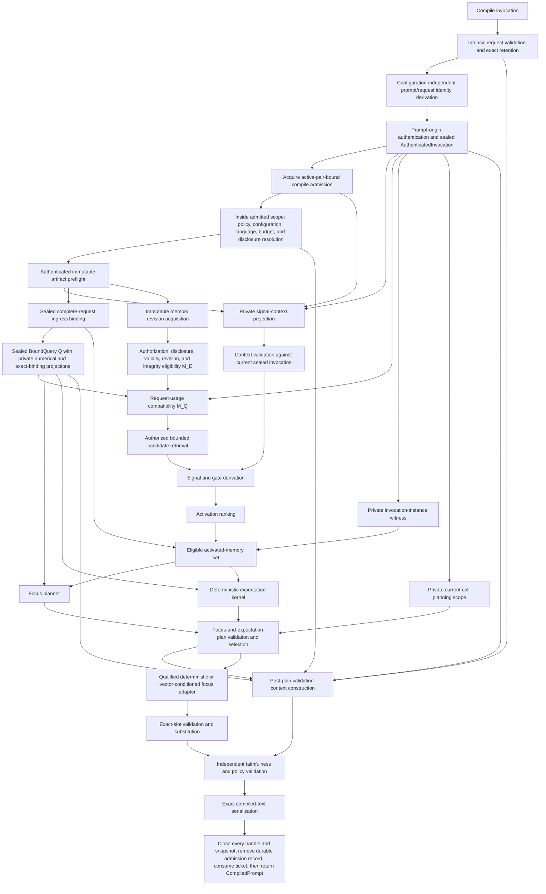
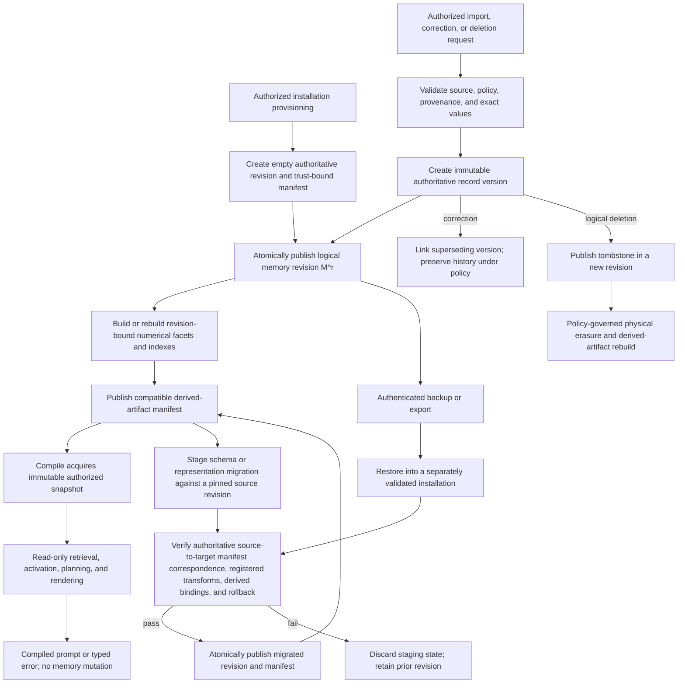
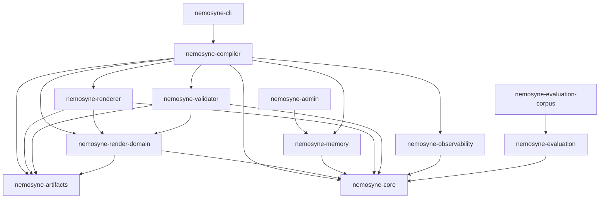
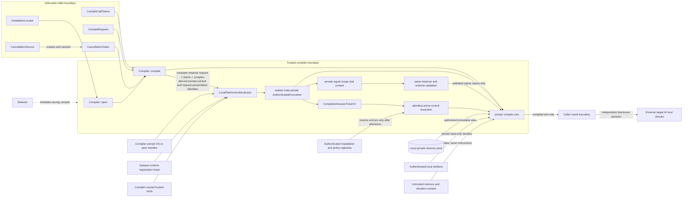
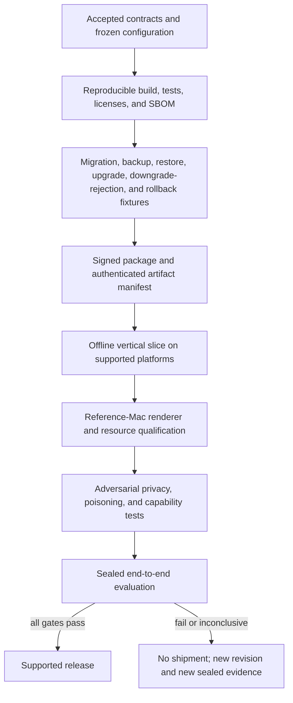
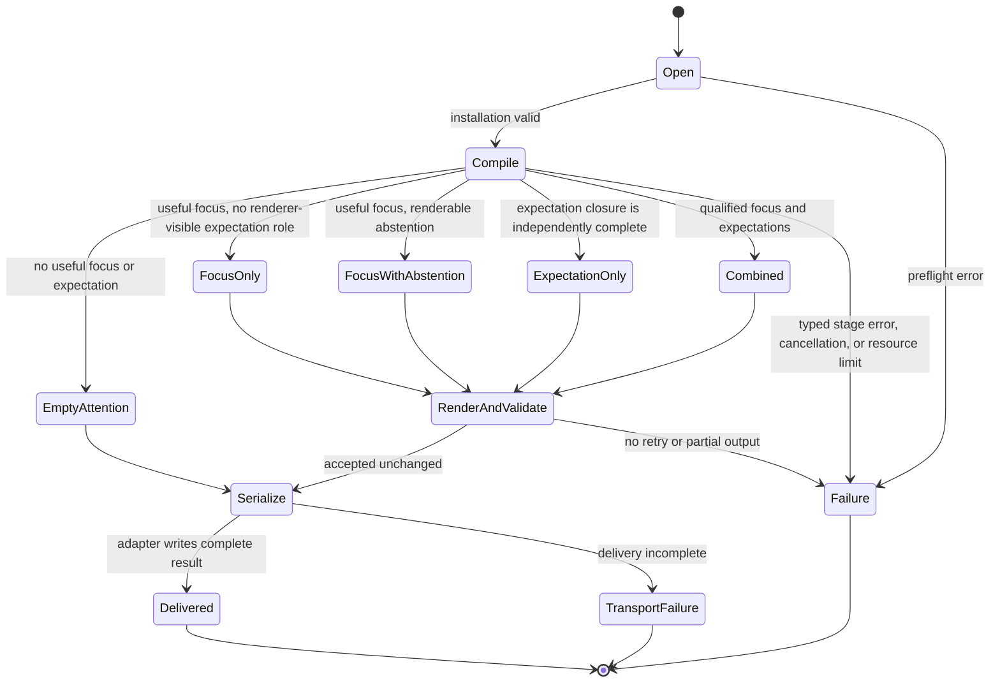

# V1 reference architecture

Status: Proposed

## Purpose

This specification proposes the logical architecture needed to implement the
Nemosyne V1 product contract. It defines component responsibilities, data-flow
boundaries, trust boundaries, memory-revision semantics, failure classes, and
the decisions that must be resolved before production implementation.

This remains a proposed logical decomposition rather than an implemented or
validated product. Decisions 0014 and 0034 select typed numerical memory and
query facets, a shared eligible activated-memory set, parallel focus and
expectation formation, a canonical focus-and-expectation plan, and an
architecture-neutral vector-conditioned focus-adapter boundary. Adapter
family, optional decoder, model, and checkpoint remain evidence-gated.
Decision 0016 fixes the sealed
compile-integrity boundaries that keep complete queries, the one shared
activated-memory object, invocation membership, canonical plan content, exact
plan bytes, and renderer configuration distinct and fail closed at their
joins.
Physical database, encoder, index, process, packaging, release-model, and
production-runtime choices remain independently evidence-gated.
Decision 0032 additionally fixes content-addressed exact-sidecar identity and
the two-plane proposition-consolidation boundary without selecting any of
those physical choices.

The architecture has four maturity labels:

- **Accepted boundary**: behavior already selected by an accepted decision.
- **Required property**: a constraint derived from the product contract that
  every conforming architecture must preserve.
- **Proposed boundary**: the current logical decomposition to be evaluated.
- **Open choice**: an implementation or policy decision that remains unset.

## Definitions

### Compile inputs and result

A compile request contains the original prompt `P`, zero to three situation
statements `S`, and caller-supplied request evidence \(\Xi\), containing a
declared contextual time `t_context`, optional declared location, and explicit
metadata. The compiler authenticates untrusted call claims and constructs one
sealed crate-private `AuthenticatedInvocation` \(\mathcal I_A\). Its
inseparable projections include the authenticated prompt, call binding,
invocation context `I`, trusted authorization time `t_auth`, and one opaque
generative call brand. Downstream stages consume the aggregate, never an
independently supplied authentication tuple. A pinned compiler configuration
and policy resolve the finite attention budget `B`.

The request is evaluated against one immutable logical memory revision `M^r`
and one immutable, content-identified compiler configuration `K`.

The only successful product result is the compiled text defined by the V1
product contract. Internal plans, source bindings, scores, and diagnostics are
not additional product results.

### Logical data flow

The proposed compile path is:


```mermaid
flowchart TD
    IV["Compile invocation"] --> IR["Intrinsic request validation and exact retention"]
    IR --> ID["Configuration-independent prompt/request identity derivation"]
    ID --> AU["Prompt-origin authentication and sealed AuthenticatedInvocation"]
    AU --> CA["Acquire active-pair-bound compile admission"]
    CA --> RC["Inside admitted scope: policy, configuration, language, budget, and disclosure resolution"]
    RC --> AP["Authenticated immutable artifact preflight"]
    AU --> SC["Private signal-context projection"]
    CA --> SC
    AP --> SC
    AP --> IB["Sealed complete-request ingress binding"]
    IB --> Q["Sealed BoundQuery Q with private numerical and exact-binding projections"]
    AP --> MR["Immutable memory revision acquisition"]
    MR --> ME["Authorization, disclosure, validity, revision, and integrity eligibility M_E"]
    ME --> MQ["Request-usage compatibility M_Q"]
    Q --> MQ
    AU --> MQ
    MQ --> RET["Authorized bounded candidate retrieval"]
    RET --> SIG["Signal and gate derivation"]
    SC --> SV["Context validation against current sealed invocation"]
    SV --> SIG
    SIG --> ACT["Activation ranking"]
    AU --> IW["Private invocation-instance witness"]
    AU --> PS["Private current-call planning scope"]
    ACT --> SH["Eligible activated-memory set"]
    IB --> SH
    IW --> SH
    Q --> FOC["Focus planner"]
    SH --> FOC
    Q --> EXP["Deterministic expectation kernel"]
    SH --> EXP
    FOC --> PLN["Focus-and-expectation plan validation and selection"]
    EXP --> PLN
    PS --> PLN
    PLN --> VCTX["Post-plan validation-context construction"]
    AU --> VCTX
    IR --> VCTX
    Q --> VCTX
    RC --> VCTX
    PLN --> LEX["Qualified deterministic or vector-conditioned focus adapter"]
    LEX --> SLOT["Exact-slot validation and substitution"]
    SLOT --> VAL["Independent faithfulness and policy validation"]
    VCTX --> VAL
    VAL --> OUT["Exact compiled-text serialization"]
    OUT --> CLOSE["Close every handle and snapshot, remove durable admission record, consume ticket, then return CompiledPrompt"]
```

These are logical boundaries. They do not imply one process, one crate per
stage, or a synchronous implementation.

```mermaid
sequenceDiagram
    participant Caller as Local caller
    participant Compiler as Compiler
    participant Auth as LocalPlatformAuthenticator
    participant Store as Local memory
    participant Focus as Focus branch
    participant Expect as Expectation branch
    participant Renderer as Renderer
    participant Validator as Independent validator
    Caller->>Compiler: open(InstallationLocator)
    Compiler->>Store: RegisterOperationalRuntimeV1 with authenticated bootstrap evidence
    Store-->>Compiler: Opaque RuntimeRegistrationTicketV1
    Caller->>Compiler: compile(CompileCallClaims, CompileRequest, CancellationToken)
    Compiler->>Compiler: Retain complete valid request; derive prompt/request identities
    Compiler->>Auth: Complete request + claims + both compiler-derived identities
    Auth->>Auth: Authenticate with compiler-owned handles, registries, and clock
    Auth-->>Compiler: One sealed AuthenticatedInvocation
    Compiler->>Store: Acquire compile admission for authenticated executing program
    Store-->>Compiler: Ticket bound to active pair, installation, registry, runtime generation, and epoch
    Compiler->>Compiler: Inside admitted scope, resolve/pin K, policy, language, budget, disclosure
    Compiler->>Compiler: Inside admitted scope, preflight artifacts; project and validate minimized signal context
    Compiler->>Compiler: SIT-01 constructs sealed complete-request binding
    Compiler->>Store: Open ticket-bound authorized immutable revision
    Store-->>Compiler: Revision, policy, exact data, and numerical views
    Compiler->>Compiler: Encode situation, retrieve, derive signals, activate
    par Shared eligible set
        Compiler->>Focus: Sealed BoundQuery, K, and complete set carrying Lambda_A plus private invocation and fresh set-instance witnesses
        Focus-->>Compiler: FocusCandidateSet preserving both witnesses
    and
        Compiler->>Expect: Sealed BoundQuery, K, and the exact same complete sealed EligibleActivatedMemorySet object and borrow
        Expect-->>Compiler: ExpectationBundle with per-frame results preserving both witnesses
    end
    Compiler->>Compiler: Borrow current-call and exact-set planning scope; validate each branch's two witnesses; select FocusExpectationPlan
    Compiler->>Compiler: Build live conditioning composite and disjoint C_A/C_V views; split authenticated K_R into commitment-bound adapter/validator configuration views
    Compiler->>Compiler: Build validation context; recompute content/configuration joins and retain opaque conditioning binding
    Compiler->>Renderer: C_A plus AdapterConfigurationViewV1
    Renderer-->>Compiler: Plan-and-renderer-configuration-bound SubstitutedAttention or typed renderer failure
    Compiler->>Compiler: Compare equal-ID candidate/context canonical-plan byte capsules; quarantine collision
    Compiler->>Validator: SubstitutedAttention + C_V-derived least-privilege ValidationView + ValidationConfigurationViewV1
    Validator-->>Compiler: AcceptedAttention or typed validation failure
    Compiler->>Compiler: Concatenate framing, attention, and retained prompt
    Compiler->>Store: Close snapshot and pinned handles; terminalize record and consume ticket
    Compiler-->>Caller: CompiledPrompt bytes or one typed error
    Caller->>Compiler: close()
    Compiler->>Store: Conditional close of exact runtime registration
    Store-->>Compiler: Removed, already retired, or typed close failure
    Compiler-->>Caller: Close success or CompilerCloseError
```

Every logical component in this data flow is a **proposed boundary** unless
the table below states otherwise.

| Boundary | Maturity |
| --- | --- |
| Product input, result, semantically read-only behavior, and local trust boundary | Decision 0014 retains the boundary selected by superseded Decision 0011 and completed by Decision 0031 |
| Exact framing and prompt-byte preservation | Required property from the product contract |
| Numerical memory, transition records, shared activated set, parallel focus and expectation, and combined plan | Accepted implementation direction from Decision 0014 |
| Content-addressed authoritative exact sidecars and validated two-plane proposition consolidation | Accepted integrity boundary from Decision 0032 |
| Vector-conditioned focus input, deterministic baseline, architecture-neutral adapter qualification, exact slots, and bounded untrusted focus output | Accepted boundary from Decision 0034 |
| Aggregate query and shared-set boundaries, invocation witnesses, canonical plan identity, exact-byte collision detection, renderer-configuration identity, and closed renderer joins | Accepted integrity boundaries from Decision 0016 |
| Ingress, preflight, snapshot, authorization, encoding, retrieval, derivation, expectation, planning, rendering, and validation decomposition | Proposed boundaries governed by the focused specifications |
| Existing activation kernel, evaluator, and corpus | Experimental implementations and evidence |
| Physical database and schema, exact encoders and indexes, calibrated parameters, release model and quantization, production runtime, processes, and resource thresholds | Open choices |

### Configuration and artifact preflight

`Compiler::open` has authenticated only the installation bootstrap trust,
platform resolver, executing-program identity, operational coordinator, and
one opaque runtime-registration ticket. It retains no active-pair-dependent
registry, manifest, configuration, artifact, policy, or memory handle. The
per-call boundary
first intrinsically validates and retains the complete immutable request,
derives only its configuration-independent prompt and request-presentation
identities, and authenticates their exact binding to the untrusted
presentation. That authentication produces the private local principal,
caller context, and trusted authorization time. It then acquires
`IF-COMPILE-ADMISSION` against its authenticated executing-program identity.
No active-pair-dependent configuration, registry, policy, or artifact handle
may be resolved or pinned before admission. Only inside that scope does the
compiler resolve the requested installed configuration and disclosure
narrowing, applicable policy, output language, effective attention budget, and
immutable artifact handles. Before persistent memory access, artifact
preflight:

- verifies an authenticated artifact manifest against a pinned installation
  trust root held outside the mutable artifact bundle;
- opens immutable handles to required encoder, registered adapter, renderer,
  validator, and schema artifacts, plus decoder, tokenizer, vocabulary, and
  token-control artifacts only when the selected candidate declares them
  present; and
- pins content or implementation identities for principal resolution,
  prompt-origin validation, authorization, disclosure, temporal validity, and
  supersession policy evaluators; and
- verifies that every artifact is present, compatible, and integrity-checked.

Every resolved identity and handle must match the ticket-bound active pair,
installation manifest, configuration-registry revision, and
runtime-registration generation. The authenticated manifest establishes which
identities are authorized; content digests then establish that the opened
bytes have those identities. An unsigned self-consistent manifest is
insufficient. No artifact may be downloaded or replaced during compilation.
Trust-root rotation, installation,
and update occur through a separately authenticated management path. A version
label without provenance, content identity, and an immutable handle is
insufficient because the underlying file could change during a call.

### Request, control, and ingress validation

These three boundaries are distinct:

- intrinsic `CompileRequest` construction owns original-prompt preservation,
  zero-to-three situation-statement validation, required contextual-time
  validation, and context-independent metadata, language-tag, and budget
  syntax;
- after successful prompt-origin authentication,
  `resolveAndPinControls` solely owns installed compatibility and resolution
  of configuration, policy, output language, effective attention budget, and
  disclosure ceiling; and
- `SIT-01` solely owns configuration-bound complete-request ingress
  identities and the immutable request-local bound situation.

The compiler retains the original prompt bytes separately from every decoded,
normalized, tokenized, or numerical representation. No later stage may
reconstruct the product prompt from an encoder output.

### Principal and disclosure policy

V1 runs for one local user principal. Principal resolution establishes the
caller and ownership context before persistent memory is read. After revision
acquisition, the policy gate derives the revision-scoped view that determines
which records the caller may cause Nemosyne to read and disclose in derived
form. The architecture separates:

- permission to read;
- permission to disclose to the caller;
- source authenticity;
- current validity;
- confidence or uncertainty; and
- instruction authority.

None of these properties implies another. Authorization is evaluated before
candidate generation. A high relevance value cannot restore an excluded
record. Authorization, disclosure expiry, current normative validity, and
supersession are evaluated at `t_auth`. The caller-controlled `t_context` may
select explicitly historical context but cannot make historical instructions
currently authoritative.

The operating-system identity or another concrete ownership mechanism remains
an open choice. A V1 implementation must not silently share one memory universe
across principals.

### Immutable memory revision

One logical memory revision `M^r` is a self-consistent read view containing:

- authoritative records and stable record-version identities;
- provenance, authority, validity, uncertainty, and supersession state;
- authorization and derived-disclosure policy facts with a policy revision;
- exact values required for faithful reconstruction;
- manifests for rebuildable numerical representations; and
- every index used for candidate generation.

For one call, the compiler pins `t_auth`, invocation context `I`, memory
revision `r`, and policy revision \(p_{\mathrm{policy}}\). It derives one
call-specific authorized
view \(M_A^{r,p_{\mathrm{policy}},t_{\mathrm{auth}},I}\). Authorization expiry and disclosure
decisions use that same \(t_{\mathrm{auth}}\); current normative validity and
supersession are also resolved at \(t_{\mathrm{auth}}\). They do not use
\(t_{\mathrm{context}}\) or reread the wall clock.

Every derived artifact is bound to the authoritative record version, encoder
or transform version, and revision for which it is valid. Predictive facets
use the separately content-identified, acyclic `TransitionFacetArtifact`
contract selected by Decision 0024; an authoritative transition record never
binds back to that derived artifact. Its dependency-light constructor validates
canonical fields and derives identity but does not prove source existence.
Only the authenticated memory-management operation may verify the exact source
version in the target revision and atomically publish the artifact; ordinary
encoder and compiler code has no such capability. Runtime reads expose only
the published read-only view. A stale, unverified, or partially published
derived artifact cannot be combined silently with an authoritative revision.

A concurrent management operation may publish `M^(r+1)`, but an in-flight
compile using `M^r` never observes it. Re-encoding, re-indexing, consolidation,
access-history updates, and cache publication are write or maintenance
operations; they are not hidden effects of compilation.

The proposed V1 rule is snapshot-stable authorization: a revocation published
after \(M_A^{r,p_{\mathrm{policy}},t_{\mathrm{auth}},I}\) is acquired applies to later calls and does not
rewrite the authorization view of the in-flight call. Compile duration must
remain bounded. Immediate cancellation on revocation is an alternative that
requires a later privacy and concurrency decision before implementation.

### Memory planes

Decision 0014 retains the two-plane logical memory model selected by the
superseded Decision 0012 and extends it with transition records.

The **authoritative exact plane** preserves immutable record-version and
canonical-proposition identities, provenance, validity, authority,
authorization, supersession, source-dependency groups, transition
reliability, conflicts, and loss-sensitive values. Its representation is
numerical in the broad machine sense: typed identifiers, enums, booleans,
scalars, timestamps, coordinates, relations, and byte-preserving payloads. It
is lossless for every claim the compiler may emit and never depends on
inversion of an embedding.

The **derived numerical plane** contains versioned, rebuildable typed facet
vectors, calibrated scalars, numerical relations, and search indexes. It is
the sole computational state for similarity, activation, propagation, and
adapter input, but it is not an independent source of truth. It may order the
complete bounded unordered source-pair set used by consolidation; it cannot
omit a pair or establish exact
equality, temporal, social, or modal scope, provenance, authority,
disclosure, supersession, or conflict. Deleting or rebuilding this plane must
not change the meaning of the authoritative exact plane.

Request-local proposition consolidation is therefore a validated two-plane
operation. Each focus-visible proposition-plane source contributed by an
eligible record carries an immutable `AuthoritativePropositionProjectionV1`
containing one record-bound `ExactSidecarCustodyBindingV1` whose nested
`ExactSidecarRefV1` is the only sidecar reference, plus canonical proposition,
proposition-schema, record-version, scope, provenance and dependency, validity,
supersession, conflict, authority, allowed-use, disclosure, and
surface-authority fields.
The projection is inseparably bound to the same memory revision, immutable
record version, and derived-artifact identity as the corresponding numerical
facets. The derived plane orders exhaustive pair work and supplies numerical
relevance;
the authoritative projection validates registered equivalence, exact-value
conditions, compatible scope, conflicts, source independence, and every
ceiling before a merge or corroboration effect is admitted. A missing,
foreign, cross-revision, cross-record, or cross-artifact projection is an
integrity error, never an absent value or a zero signal. Consolidation remains
ephemeral and read-only; it does not publish a consolidated memory record.

```text
AuthoritativePropositionProjectionV1 {
    source: Request {
        tagged_request_source_identity,
        validated_exact_request_projection,
        source_receipt,
        attribution,
    } | Memory {
        tagged_memory_source_identity,
        memory_revision_id,
        immutable_record_version_id,
        source_derived_artifact_id,
        exact_sidecar_custody_binding,
        provenance_root_id,
        dependency_group_id,
    },
    canonical_proposition_id,
    canonical_proposition_schema_id,
    required_exact_value_and_presence_bindings,
    temporal_scope,
    social_scope,
    modal_scope,
    validity_and_supersession,
    conflict_links,
    authority_ceiling,
    allowed_use_ceiling,
    disclosure_ceiling,
    surface_authority_ceiling,
}
```

The source is a closed tagged sum; optional or partially populated hybrids do
not exist. The store constructs `Memory`, and the validated request-proposition
substep constructs `Request`; callers cannot replace any field. A `Memory`
projection's three-field `(memory_revision_id, immutable_record_version_id,
source_derived_artifact_id)` binding must equal the corresponding derived
projection's binding before either projection enters the shared activated set.
A `Request` projection cannot acquire a persistent record, artifact, sidecar,
or provenance identity, while a `Memory` projection cannot carry request
attribution or a request receipt. A proposed complete-recall nomination
shortcut is not enforceable and is not part of V1. No approximate numerical
nomination may determine which sources are compared.

For every activated record \(i\in\mathcal A\), let
\(\mathcal S_i^M\) be its finite canonical set of validated focus-visible
memory proposition-plane sources. The record itself is not a consolidation
source and may contribute zero, one, or several sources. The compiler forms

\[
\mathcal S_M=
\operatorname{CanonicalSort}
\left(\mathop{\biguplus}_{i\in\mathcal A}\mathcal S_i^M\right),
\qquad
n_{\mathrm{src}}^M
=|\mathcal S_M|
=\sum_{i\in\mathcal A}|\mathcal S_i^M|.
\]

With the disjoint request set \(\mathcal R_Q\), the complete source set is
\(\mathcal S=\mathcal R_Q\uplus\mathcal S_M\) and
\(n=n_Q+n_{\mathrm{src}}^M\). Per-record, flattened-source, and pair-work
ceilings are authenticated. After validating this finite source set and
checking the complete \(n(n-1)/2\) pair-work ceiling,
the reference path enumerates every unordered source pair. Numerical facets
may order that complete pair set but cannot omit a pair. An optimized path is
admitted only when `ExhaustiveConsolidationPairSetWitnessV1` proves
machine-checked equality over the exact source set, complete unordered-pair
set, equivalence-contract identity, and checked pair-work ceiling before any
authoritative comparison; otherwise the bounded operation fails without a
partial partition. The optimized path must then produce the same final
partition as the reference path.

Numerical values may order work and contribute bounded relevance only.
Validated authoritative projections alone decide identity equivalence,
pairwise compatibility, conflict, and final grouping; no numerical equality,
similarity, threshold, activation, or traversal order can establish or repair
one of those authoritative relations.

The reference construction accounts for source enumeration and consolidation
as
\[
O\!\left(
n_a+n_{\mathrm{src}}^Mc_{\mathrm{src}}^M
+n\log(1+n)+n^2d_{\mathrm{eq}}
+s_\phi+n_\phi\log(1+n_\phi)
\right)
\]
time and \(O(n_a+n+s_\phi+n_\phi)\) request-local state, using the notation and
complete bounds owned by the cognitive-memory specification. Neither pair
count, source-set identity, witness, work ceiling, complexity term, nor test
oracle may substitute activated-record count \(n_a\) for the flattened
proposition-plane count \(n_{\mathrm{src}}^M\).

### Exact-sidecar content identity and verification

Decision 0032 selects one immutable content-addressed exact-sidecar contract.
Its canonical content is:

```text
ExactSidecarContentEnvelopeV1 {
    exact_sidecar_schema_id,
    bindings: CanonicalSet<ExactSidecarContentBindingV1>,
}

ExactSidecarContentBindingV1 {
    schema_owned_locator,
    exact_value_schema_id,
    exact_value_type,
    presence: Present(canonical_exact_value)
        | ExplicitNone
        | Missing(registered_reason)
        | Unknown(registered_reason)
        | Inapplicable(registered_reason),
}

ExactSidecarRefV1 {
    regime_id,
    schema,
    content_id,
}
```

The registered `ExactSidecarSchemaDefinitionV1` supplies the finite
cardinality and byte limits, locator grammar and total order, value schemas,
presence variants, and canonical encoding. `ExactSidecarSchemaId` is immutable
and content-derived from the authenticated complete canonical definition
bytes; it is never an
operator label, registry position, or caller-selected value. Likewise,
`ExactSidecarIdentityRegimeId` is content-derived from the complete canonical
`ExactSidecarIdentityRegimeV1`. This architecture normatively defers the closed
regime field set, definition-identity preimage, registry idempotence, and
no-rebinding rule to the
[owner contract](cognitive-memory-activation-and-focus.md#exact-sidecar-content-identity-and-verification);
no abbreviated field summary here defines a second regime shape. Checked
construction recomputes both schema and regime identities before trusting
either object. Each canonical identity preimage excludes its own derived
identity and any registry position, preventing self-reference.

Construction rejects an unknown or identity-mismatched regime, an unknown or
identity-mismatched schema, an unknown or identity-mismatched custody domain,
invalid values, duplicate locators, invalid presence states, over-limit
content, and noncanonical encodings. It then
derives `ExactSidecarContentId` under the verified regime from a
domain-separated digest of the complete canonical
`ExactSidecarContentEnvelopeV1` and returns the matching three-field
`ExactSidecarRefV1`; no member is caller-selectable. Identity comparison or
preservation is valid only inside one identical complete regime. The
transition-record version envelope commits to the complete
`ExactSidecarCustodyBindingV1`, which contains the sole complete reference, not
to a free duplicate reference or only the content digest. Changing a
custody-domain or regime member, its content-derived identity, or the
content-derived schema identity therefore requires a newly derived custody
binding and referring record-version identity even when the content digest or
canonical sidecar bytes happen to be equal.

The sidecar envelope excludes its own content identity,
`TransitionRecordVersionId`, every record-derived binding identity, derived
facet or index identities, renderer identities, and runtime or configuration
state. A schema-permitted nested record binding may name only an already
verified immutable record version published in a strict prior memory revision.
Current-revision, forward, self, unresolved, or unverified record references
are rejected. This strict revision order makes nested identity dependencies
well founded. Any violation is the explicit integrity cause
`ExactSidecarNestedReferenceInvalid`; it is neither a missing sidecar nor a
generic record mismatch. Management refuses logical deletion or physical
collection that would leave a retained record with an unresolved nested
reference. The closed transition-record version envelope includes only the
complete custody binding with its nested sidecar reference, so any change to
the custody domain, regime identity, sidecar schema identity, locator, type,
presence state, or exact value necessarily produces a new binding and
transition-record version identity under the declared collision-resistance
assumption.

The authoritative store retains canonical sidecar bytes under the complete
`(regime_id, content_id)` trust-domain key. Every referring immutable record
also owns one record-bound `ExactSidecarCustodyBindingV1` in a per-record
custody ledger:

```text
ExactSidecarCustodyBindingV1 {
    custody_domain_id,
    sidecar_ref,
}
```

The authenticated `ExactSidecarCustodyDomainDefinitionV1` content-derives
`ExactSidecarCustodyDomainId` and binds the retention, access, erasure,
backup/export, and reference-ledger policies. The referring record and its
`LogicalRecordSidecarReferenceV1` entry in the
`ExactSidecarReferenceLedgerV1` both commit to the complete custody binding.
Equal canonical bytes may be physically deduplicated only when the complete
`ExactSidecarCustodyBindingV1` values are field-for-field identical, which
requires the same custody-domain identity and same complete sidecar reference.
Deduplication never merges, weakens, or substitutes the per-record logical
ledger entries.

Every controlled retention-bearing rollback, backup, import, export, replica,
staging object, or other copy is represented by a distinct
`SealedCustodyHoldingReferenceV1`. Its stable content-derived
`SealedCustodyHoldingId` binds the complete authenticated retention obligation
`(owner_id, policy_revision_id, authorized_at, retain_from, retain_until,
source_kind, source_id, source_revision_id)`, the complete custody binding,
and the matching closed purpose. It excludes physical-object location and
authorization state, so the same obligation retains one identity across an
atomic move or revocation. The management boundary authenticates policy,
trusted time, and source identity; callers cannot select them or the holding
ID. Different authenticated source obligations remain different holdings even
when every other field and the physical bytes agree. One holding cannot
shorten, satisfy, or be merged with another, and it grants storage only, never
compile-time read, export, rollback, or resurrection.

A collision witness exists only when two distinct, independently valid
canonical contents each recompute under the same verified regime to the same
typed identity; it fails closed. Collision handling quarantines the complete
`(regime_id, content_id)` trust domain, every reachable referring record and
derived artifact, and every registered backup or export reachable from the
custody ledger. A noncolliding record under an unrelated complete trust-domain
key remains outside that quarantine. The collided identity and old trust-domain
key are permanently unusable: they cannot be repaired in place, cleared,
rolled back, or reused. Resolution either republishes every retained meaning
under a new identity regime and new referring record versions or erases every
authorized copy; the old collision tombstone remains. Malformed or
noncanonical content is instead a content mismatch, and canonical content
that recomputes to a different identity is a reference mismatch under the
declared error precedence. An authenticated management transaction verifies
the regime and schema identities, recomputes the sidecar content identity and
complete reference, verifies the record-bound custody binding, recomputes the
record version identity, and publishes the canonical sidecar, custody-ledger
entry, record version, and revision references atomically. No snapshot may
observe only one member of that set.

A revision-pinned read implements the owner's
`ExactSidecarIntegrityValidationV1` as two phases with one public precedence.
The effect-free prelookup phase uses only the retained record envelope and
authenticated local registries and ledger to validate, in order, record
identity, complete regime identity, schema identity, and custody binding. It
does not resolve a physical object, inspect collision witnesses, traverse a
nested target, fill a cache, or touch backup/export state.

Only after all four prechecks succeed may the store resolve one immutable,
revision-, ledger-, and integrity-fence-bound
`ExactSidecarResolvedSnapshotV1`. The sealed snapshot fixes presence,
authenticated physical custody metadata, retained bytes when present,
collision-witness view, and bounded nested-target handles for the postlookup
phase. Postlookup evaluates every applicable envelope-schema, physical-custody,
presence, canonical-byte, reference, collision, and nested-reference predicate
before choosing the earliest public cause; encounter order cannot reorder the
single integrity precedence. It exposes the sidecar or an
`AuthoritativePropositionProjectionV1` only on complete success. Missing,
truncated, corrupt, regime- or schema-mismatched, custody-mismatched, rebound,
or invalidly nested content, and any cross-record or cross-revision
substitution inconsistent with the referring binding, is not interpreted as
an empty sidecar. Byte-identical
canonical content with the same verified reference may validly be shared
across records only under field-identical complete custody bindings. Logical
erasure removes one record's eligibility and advances its custody state; it
does not delete shared bytes. Physical garbage collection is allowed only
after the last authorized logical ledger or sealed-holding reference, inbound
nested reference, retention duty, and rollback obligation has ended and no
collision quarantine applies. A rollback may restore only an authenticated
still-retained eligible custody state and cannot resurrect a record whose
policy-authorized erasure is final. A noncollision integrity failure may use
authenticated repair or a still-valid rollback. A collision instead follows
the permanent old-identity quarantine and new-regime republishing or complete
authorized erasure rule above. Every integrity failure returns no partial
candidate set or product.

When postlookup classification selects
`ExactSidecarContentIdentityCollision` after excluding every earlier cause,
the store, not the read-only compiler, first preserves exactly one closed
observation origin:

```text
CollisionObservationOriginV1
├── Compile
│   ├── compile_admission_id
│   ├── product_release_guard_id
│   └── resolved_snapshot_id
├── TerminalProbe
│   ├── terminal_probe_id
│   ├── terminal_probe_result_guard_id
│   └── resolved_snapshot_id
└── Management
    ├── management_admission_id
    ├── management_authorization_id
    ├── lifecycle_commit_guard_id
    └── resolved_snapshot_id
```

No fourth origin or cross-origin field substitution exists. `Management`
requires independently authenticated management authorization; compile or
probe admission never grants it. The store then authenticates one
`CollisionQuarantineBasisV1` binding the store, affected
`(regime_id, content_id)` trust key, exact observation origin, permanent
collision-tombstone identity, expected and next integrity-fence generations,
complete collision-witness-set commitment, complete affected-custody and
derived-artifact closure commitment, complete active-admission and
resolved-snapshot closure commitment, and either a proven
`CompleteReverseIndex` scope or a conservative `WholeStoreGeneration`
fallback.

One crash-atomic containment linearization creates or verifies the permanent
`ExactSidecarCollisionTombstoneV1`, advances
`ExactSidecarIntegrityFenceV1`, records the origin and intersecting
admission/snapshot revoke dispositions, and closes semantic-read,
product-release, terminal-probe-pass, lifecycle-mutation-commit, and lifecycle
admission for the contained scope. Incomplete reverse-index completeness
selects the whole captured store generation. This atomic transition performs
logical revocation only; it never waits for handles, buffers, files, or
snapshots to be destroyed.

Physical closure is the separate durable
`CollisionTerminalRemovalStateV1`. It binds the quarantine basis, either the
canonical revoke set or fenced-generation cursor, a monotonic next cursor,
positive per-step item/work/byte limits, and exactly one last-step outcome:
`Committed` with exact closure receipts, `Aborted` with verified no effect, or
`ReconciliationRequired` with the durable recovery fence. Each bounded step is
idempotent and resource-safe. Retry and restart resume the same cursor without
duplicating work, skipping an item, resetting a limit, changing the tombstone
or fence, reopening admission, publishing a product, or altering recovery
eligibility.

Immediately before externally observable success, every origin performs one
final linearizable validation of its typed guard, exact trust-key dependency
closure, and captured fence generation against the current root fence:
`Compile` validates `product_release_guard_id`, `TerminalProbe` validates
`terminal_probe_result_guard_id` before issuing a passing receipt, and
`Management` validates `lifecycle_commit_guard_id` before its intended
lifecycle mutation commits. These validations and containment have one total
order. A snapshot-time check cannot replace the final guard.

The compiler receives the collision source only after durable containment and
receives no management capability. A generation or witness mismatch,
unavailable commit, unknown outcome, or required reconciliation instead
preserves the corresponding closed `ExactSidecarIntegrityCoordinationError`
and returns no product. Startup replays the store log before opening normal
admission: it reconstructs a proved commit, its origin-specific terminal
disposition, and pending terminal-removal work, reruns both validation phases
for a proved abort, and keeps an ambiguous result fenced as
`IntegrityQuarantineReconciliationRequired` without a terminal origin
disposition until commit or abort is proven. After proved committed
containment, origin closure is total: `Compile` has no product and a rejected
release guard; `TerminalProbe` has no passing receipt and a rejected result
guard; `Management` has no intended lifecycle mutation, a rejected lifecycle
guard, and requires fresh authorization for any later operation.

Collision resolution is not ordinary exact-old-pair recovery. The disjoint
`CollisionRecoveryTransactionV1` revalidates the exact
`CollisionQuarantineBasisV1`, trust key, permanent tombstone, current fence,
complete witness commitment, and complete affected-custody commitment. Its
closed disposition is either `NewRegimeRepublication`, covering every retained
meaning and every new referring record version under a new authenticated
regime, or `CompleteAuthorizedErasure`, carrying exact erasure authorization
and the complete controlled-custody erasure-receipt commitment. It cannot
select one witness, restore the old key, use exact-old-pair rollback, or treat
later byte equality as repair. Both outcomes preserve the old permanent
tombstone and non-use rule across purge, restore, reprovisioning,
reinstallation, and store replacement.

Thus store-owned nonsemantic containment remains compatible with read-only
compilation, potentially blocking cleanup stays outside the atomic section,
and no crash permits an unfenced semantic read, probe pass, product release, or
lifecycle race.
The focused canonical envelope, constructor, lookup, and error contract is
owned by
[`cognitive-memory-activation-and-focus.md`](cognitive-memory-activation-and-focus.md#exact-sidecar-content-identity-and-verification).

The exact physical representation remains open, but its contract must expose:

- stable memory identity and immutable record-version identity;
- source and import provenance;
- observed, created, valid-from, valid-until, and superseded times;
- authority and authorization labels;
- uncertainty and unresolved conflicts;
- exact entities, names, paths, numbers, and other loss-sensitive values;
- content-derived exact-sidecar regime/schema identities and per-record
  custody bindings containing their sole complete references;
- typed numerical facets and relations;
- transform, encoder, tokenizer, and index manifests; and
- logical deletion, physical erasure, export, migration, and repair state.

This list does not require one universal memory-object row or one physical
schema. The complete logical record and facet contract is defined in
[`cognitive-memory-activation-and-focus.md`](cognitive-memory-activation-and-focus.md).
Transition records, prediction frames, dependency groups, observation status,
and expectation mathematics are defined only in
[`predictive-attention-and-expectation.md`](predictive-attention-and-expectation.md).

The management and compile lifecycles remain separate:


```mermaid
flowchart TD
    NEW["Authorized installation provisioning"] --> INIT["Create empty authoritative revision and trust-bound manifest"]
    INIT --> PUB
    SRC["Authorized import, correction, or deletion request"] --> VAL["Validate source, policy, provenance, and exact values"]
    VAL --> VER["Create immutable authoritative record version"]
    VER --> PUB["Atomically publish logical memory revision M^r"]
    PUB --> NUM["Build or rebuild revision-bound numerical facets and indexes"]
    NUM --> READY["Publish compatible derived-artifact manifest"]
    READY --> SNAP["Compile acquires immutable authorized snapshot"]
    SNAP --> READ["Read-only retrieval, activation, planning, and rendering"]
    READ --> OUT["Compiled prompt or typed error; no memory mutation"]
    VER -->|correction| SUP["Link superseding version; preserve history under policy"]
    VER -->|logical deletion| TOMB["Publish tombstone in a new revision"]
    TOMB --> ERASE["Policy-governed physical erasure and derived-artifact rebuild"]
    PUB --> BAK["Authenticated backup or export"]
    BAK --> REST["Restore into a separately validated installation"]
    READY --> MIG["Stage schema or representation migration against a pinned source revision"]
    MIG --> MVERIFY["Verify authoritative source-to-target manifest correspondence, registered transforms, derived bindings, and rollback"]
    MVERIFY -->|pass| MPUB["Atomically publish migrated revision and manifest"]
    MVERIFY -->|fail| MROLL["Discard staging state; retain prior revision"]
    MPUB --> READY
    REST --> MVERIFY
```

A compile call enters only at `SNAP`. Import, correction, consolidation,
supersession, deletion, erasure, backup, export, restore, and derived-index
publication are authenticated management operations and cannot be triggered by
prompt, memory, renderer, or downstream-agent text. Provisioning is explicit;
an uninitialized installation cannot compile. Migration and restore operate on
staging state, verify before atomic publication, and preserve the prior
revision until rollback evidence passes. Downgrade is rejected unless the
target schema declares and verifies backward compatibility.

### Situation encoding

After prompt-origin authentication and configuration resolution, compiler
ingress constructs one sealed \(\widehat B_{\mathrm{in}}\) under the
authenticated pinned configuration `K`. Its `request_id` and `situation_id`
are distinct domain-separated typed content identities over the canonical
complete request and canonical ordered situation-evidence envelopes;
`configuration_id` is the authenticated content identity of `K`. The public
request accepts none of these fields. The canonical encoding, inner content
digests, configuration-bound digests, collision-resistance assumption, and
fail-closed collision-witness behavior are owned by the
[cognitive-memory specification](cognitive-memory-activation-and-focus.md#numerical-query-state).

Ingress independently projects
\(B_Q=(request\_id,situation\_id,configuration\_id)\) into situation encoding
and the same three fields into shared-set construction. Neither branch may
copy the binding from the other, derive it from a lossy vector, or accept it
from the caller. The later equality check therefore detects branch corruption,
reuse, and cross-request swaps; retained canonical bytes permit recomputation
and observed-collision rejection. Cryptographic collision resistance remains
an explicit assumption rather than an absolute uniqueness claim.

Situation encoding converts `P`, `S`, \(\Xi\), and `K` into a versioned pure
numerical situation \(Q_{\mathrm{num}}\). It contains only request-local
prompt, situation, declared contextual-time, location, metadata, derived
source-language, and observation-quality facts represented as typed vectors,
scalars, identifiers, presence masks, and numerical relations. It retains
validated source-byte locators, source-buffer content identities, and exact
values outside lossy representations. The situation boundary then constructs
the bound query
\(Q=\operatorname{bindQuery}(\mathsf R,\widehat B_{\mathrm{in}};K)\); that sole
constructor computes and seals both projections without allowing one to
change the other's semantics. `BoundQuery` is a sealed aggregate with private numerical and
binding fields plus a compiler-derived `BoundQueryContentId` over their
injective canonical envelope:

```text
BoundQuery {
  private numerical: NumericalQuery,
  private binding: ExactQueryBinding,
  private content_id: BoundQueryContentId
}
```

Only `SIT-01` may construct it, and it derives both projections from the same
retained complete request and pinned `K`. There is no public constructor from
independently supplied \(Q_{\mathrm{num}}\) and \(B_Q\), no field-replacement
operation, and no serialization path that can reconstitute an authenticated
value. Downstream boundaries accept `&BoundQuery`, not the two projections as
independent parameters. Narrow read-only accessors may lend the numerical
projection to semantic arithmetic or the exact binding to a structural join,
but neither accessor returns an independently constructible authenticated
query value. A mixed, stale, or corrupted projection pair therefore cannot be
represented by the public API; defensive content-identity and
canonical-envelope checks fail closed if internal corruption nevertheless
produces one. Neither projection contains a principal, trusted authorization
time, policy revision, authorization-view identity, disclosure decision, or
authorization result.

Normatively:

\[
Q_{\mathrm{num}}=\operatorname{encode}(P,S,\Xi;K),
\qquad
Q=\operatorname{bindQuery}(\mathsf R,\widehat B_{\mathrm{in}};K),
\qquad
\operatorname{numerical}(Q)=Q_{\mathrm{num}},
\quad
\operatorname{binding}(Q)=B_Q.
\]

The selected encoder and every transform it invokes are pinned inputs within
`K`. `t_auth`, `I`, policy state, and authorization-view state are not explicit
or implicit inputs to either function. The private `BoundQueryContentId` is
derived only from the canonical `BoundQuery` schema, \(Q_{\mathrm{num}}\),
\(B_Q\), and the pinned identity scheme in `K`; it is structural-integrity
metadata and never semantic evidence. Holding `P`, ordered `S`, \(\Xi\), and
`K` fixed must therefore produce identical \(Q_{\mathrm{num}}\), source
locators, and source-buffer content identities. Holding the complete request
and `K` fixed also produces identical \(B_Q\) and bound `Q`, even when private
authorization state or trusted authorization time differs. A change confined
to an output-language, budget, or other non-situational compile control may
change `request_id` and bound `Q` while leaving \(Q_{\mathrm{num}}\) and
`situation_id` unchanged.

The encoder contract must define:

- input normalization that does not affect original-prompt preservation;
- vector spaces, dimensions, types, and normalization;
- exact scalar and categorical encodings;
- treatment of absent, unknown, and uncertain values;
- model and transform versions;
- deterministic numerical behavior under the declared V1 execution envelope;
- supported languages and modalities; and
- failure behavior for unavailable or incompatible artifacts.

The encoder does not decide instruction authority and does not retrieve memory.

### Authorized candidate generation

Candidate generation searches only the usage-compatible view
\(\mathcal M_Q\). Its boundary accepts one sealed `&BoundQuery`, validates
that aggregate, and borrows its private numerical projection only inside the
retrieval implementation. It produces the bounded candidate set \(C^r\) with
source bindings and retrieval diagnostics. There is no overload accepting
\(Q_{\mathrm{num}}\), \(B_Q\), or a caller-assembled pair. The
[proof program](v1-proof-program.md#formal-compile-model) owns the sole
cross-stage composition and function name for this transition; this
architecture does not define a second retrieval equation.

Project, workspace, application, time, and location may affect search and
ordering but are not undocumented exclusion predicates. Logical eligibility
does not require an exhaustive physical scan. Approximate retrieval therefore
requires a declared candidate budget and measured false-negative behavior.
Authorization is applied before bounded top-k or nearest-neighbor competition.
Adding, removing, or changing an unauthorized record must not crowd out an
authorized candidate or alter content-bearing diagnostics.

The retrieval contract must distinguish:

- no eligible or relevant candidate found;
- a successful bounded search;
- a known incomplete or degraded search; and
- a failed or incompatible index.

Empty candidates and retrieval failure are not equivalent.

### Signal and gate derivation

The compiler projects one private \(\Sigma_{\mathrm{sig}}\) carrying an opaque
reference to the sealed invocation's call brand. It then validates that
reference, every copied trusted value, and both schemas against the current
`AuthenticatedInvocation`, supplied independently to validation, to obtain
\(V_{\mathrm{sig}}=(t_{\mathrm{auth}},u_{\mathrm{auth}})\). Signal derivation
accepts one sealed `&BoundQuery`, validated \(V_{\mathrm{sig}}\), and every
member of \(C^r\). After aggregate validation, it borrows the query's private
numerical projection internally and maps those inputs to the normalized
candidate inputs \(N\) required by an activation mechanism. It has no
split-query overload and cannot replace or retain either projection. The proof
program owns the sole cross-stage composition and function names for these
transitions; this architecture does not define a second signal-derivation
equation.

It owns channel semantics, gates, evidence signals, inhibition signals, and
their provenance. `SignalDerivationContext` carries pinned context and social
identity schemas, a non-semantic call brand, trusted authorization instant,
and typed authenticated social-subject identity; only trusted time and the
schema-validated subject value reach signal math. Authenticated, declared, and
memory-participant social identities remain disjoint source tags, and schema
rotation requires an authenticated one-to-one migration artifact. The context
carries no authorization, policy, disclosure, store, or ambient-time
capability. It
must not assign arbitrary numbers without an authored or learned derivation
contract and independent evaluation targets. Decision 0014
retains cue, temporal-context, base-availability, active-goal, procedural,
hazard, and social-perspective fit as initial focus-channel hypotheses when the
required facets exist. The focused specifications define their candidate
mathematics, signal lineage, and the separation between hard policy gates and
soft inhibition.

The five channels in the revision-1 coding-agent corpus are experimental
evidence labels. They are not the V1 memory ontology or an accepted runtime
channel set.

### Activation ranking

The existing deterministic activation kernel is the current implemented
candidate for this boundary. It accepts already normalized signals and returns
a complete bounded ranking of aggregate scores. A separate operation explains
one candidate with a per-channel breakdown. The kernel remains replaceable
until a later decision adopts it for V1 using end-to-end evidence.

The formula, validation, floating-point order, tie behavior, and proofs are
owned only by
[`situation-conditioned-activation.md`](situation-conditioned-activation.md).
Architecture consumes the resulting activation value and explanation
reference; it does not redefine them. Activation remains relevance, not truth,
probability, safety, instruction authority, predictive support, or expected
utility.

Runtime compilation may depend on an adopted runtime kernel. It must not
depend on the offline evaluation or corpus crates.

### Shared activated set and parallel planning

Activation produces one canonical `EligibleActivatedMemorySet`. Its normative
schema and ordering are owned only by
[`predictive-attention-and-expectation.md`](predictive-attention-and-expectation.md);
this architecture consumes that contract and does not define a parallel
version. In summary, it binds the pinned query, memory and policy revisions,
activated records, source and authority data, verified exact-sidecar
custody bindings including their nested references, the paired numerical
facets and immutable
`AuthoritativePropositionProjectionV1` values for each record, and retrieval
diagnostics. Every pair carries the same record-version, derived-artifact, and
memory-revision binding, validated before activation and rechecked before
consolidation. Pairing is per admitted source, not one projection reused for a
record, bucket, or cluster: every numerical source projection has one
independently reconstructed and validated authoritative projection before the
set is sealed.

The two closed source variants have different cross-plane joins. `Memory`
requires equality of its tagged source identity, immutable record version,
source-derived artifact, memory revision, complete exact-sidecar reference,
and record-bound custody binding. The reference is the nested member of that
binding, never a second source field. `Request`, constructed only inside the focus
branch, instead requires equality of its tagged request-source identity,
validated exact request projection, source receipt, and attribution; it has
no persistent record, artifact, revision, sidecar, custody, or provenance
field. A join valid for one variant cannot be reinterpreted as the other.

Outside its deterministic content-lineage tuple, the shared set also carries
one private nonserializable `InvocationInstanceWitness` borrowed from the
current sealed invocation and one fresh private nonserializable
`EligibleSetInstanceWitness` minted for that exact set object. The first proves
runtime call membership; the second distinguishes two set constructions even
inside one call. Neither can affect semantic keys, ordering, scores,
diagnostics, renderer tensors, or product bytes. The set is the only branch
point.

The focus planner and expectation kernel receive the exact same complete sealed
`EligibleActivatedMemorySet<'call>` object and immutable borrow before final
focus pruning. No projection, filtering, copy, or reconstruction occurs before
the branch calls. Each called branch may derive only its own private
least-privilege view inside that aggregate-taking boundary. Both additionally
consume the same sealed `BoundQuery` and pinned configuration \(K\); neither
accepts a separately supplied numerical query or exact binding. Semantic
derivation may borrow only the aggregate's read-only \(Q_{\mathrm{num}}\)
projection, while exact lineage validation and receipts may borrow only its
read-only \(B_Q\) projection.
The complete shared set carries \(\Lambda_A\);
`policy_revision_id` and `authorization_view_id` originate exclusively there.
The focus branch has no principal, policy object, `AuthorizationView`,
authorization-service, authorization-receipt-projection, or policy-store
input:

- the focus planner first derives the ephemeral canonical
  `RequestPropositionSet` from prompt, situation-statement, and allowed
  request-metadata evidence in \(Q_{\mathrm{num}}\), checks the exact
  \(B_Q=\pi_Q(\Lambda_A)\) join, creates the five-field
  `(request_id, situation_id, policy_revision_id,
  authorization_view_id, configuration_id)` source receipt solely from that
  same \(\Lambda_A\), checks the exhaustive unordered-pair work ceiling, uses
  numerical proposition projections only to order that complete set, validates
  every memory-supported merge against its paired
  `AuthoritativePropositionProjectionV1`, and then consolidates
  request-supported and memory-supported compatible propositions into bounded
  focus candidates;
- the expectation kernel evaluates eligible direct observations and explicitly
  permitted registered derivations, retains competing outcome groups and
  counterevidence, and may abstain; and
- neither component retrieves ambient memory, repeats authorization, or
  mutates persistent state.

The two branch outputs preserve the same private invocation and set-instance
witnesses and carry immutable `PlanningSourceProjection` fields for every
consumable item: the
exact common \(\Lambda_A\), essential-source identities, authority,
allowed-use and surface-authority ceilings, mandatory qualifiers and
relations, and exact-slot bindings. The compiler invokes the combined planner
with one private `PlanningInvocationScope<'call>` borrowed independently from
the current sealed `AuthenticatedInvocation` and the exact shared set selected
by the compiler before the branch split. Before comparing content lineage, the
planner requires each branch's invocation witness to match the current-call
scope and each branch's set witness to match the scope's expected-set witness;
branch-to-branch equality alone is insufficient. It copies only the
current-call witness into the plan and erases the set witness after the join. A
missing, reconstructed, expired, foreign, mixed, or same-call-but-different-set
witness fails with `PlanCallBindingMismatch` even when \(B_Q\),
\(\Lambda_A\), and every content-derived identity are equal. The scope and
witnesses remain outside semantic keys, scores, ordering, tensors,
diagnostics, serialization, and product bytes.

The planner receives no authority or disclosure view, principal, policy
handle, or authorization service. It may only compare content lineage, take a
defined meet, copy
or lower those upstream ceilings, and join an upstream slot binding to the
same content identity in a minimized permissionless exact-surface inventory.
Inventory presence never grants slot use. Missing, inconsistent, or expanded
projections fail; planning never reauthorizes or widens disclosure. The
[planning specification](focus-and-expectation-planning.md#immutable-authority-and-disclosure-projections)
owns the complete projection contract.

Focus contributes a lineage-independent `PropositionSemanticKey`; expectation
contributes the closed tagged `ExpectationItemSemanticKey` for hypotheses,
controls, and abstention. Planning wraps these in the branch-tagged
`PlanItemSemanticKey`, uses `RelationSemanticKey` for relation order, and
assigns contiguous `RendererSlotId` values only after sorting distinct
lineage- and exact-content-independent `SlotSemanticKey` values constructed
from a value-independent `ExactSlotOwnerSemanticKey`, a schema-owned
`ExactSlotSemanticLocator`, type, role, bounds, permitted bindings, schema,
and formatter. Upstream branches carry only a value-, lineage-, and
request-independent `ExactSlotOwnerSemanticDescriptor`. Planning verifies
that descriptor against the selected item's non-slot semantic meaning and is
the sole stage that maps it to the final key. An item-owned key derives from
the owning `PlanItemSemanticKey` plus an owner role; an explicitly shared slot
instead uses a registered `SharedExactSlotMeaningKey`. Planning groups slots by
`(owner_semantic_key, locator)`, never by locator alone. Independent items
using the same schema field therefore remain distinct, while one semantic
owner and locator carrying incompatible exact values is a typed structural
conflict. Authoritative values, exact-surface content identities/bytes, and
request-local instance, transition, receipt, and exact-binding identities
remain privileged sidecar or audit lineage and cannot decide semantic
grouping, feasibility, priority, selection, renderer tensor order, or
pre-substitution model-visible input.

The expectation derivation, support semantics, uncertainty vector, medoids,
coverage, and abstention are owned only by
[`predictive-attention-and-expectation.md`](predictive-attention-and-expectation.md).
`RequestPropositionSet` is focus-only ephemeral state: it is neither persistent
memory nor expectation evidence, and it cannot raise its source authority or
allowed-use ceiling. The pinned source-ceiling mapping is a pure
authority-lowering artifact lookup compatible with the policy revision in
\(\Lambda_A\); it does not authorize memory or disclosure. Situation encoding
validates exact source-byte locators into the private \(X_Q\) projection;
focus derivation borrows those bindings internally from the sealed
`BoundQuery` and never rereads or reparses raw request text, reopens an
authorization view, or repeats authorization. The focus derivation, including
`deriveRequestPropositions(&BoundQuery, &EligibleActivatedMemorySet<'call>, K)`,
is owned by
[`cognitive-memory-activation-and-focus.md`](cognitive-memory-activation-and-focus.md).
The aggregate-only API may destructure \(\Lambda_A\), its private invocation
witness, and its private set-instance witness internally but cannot accept or
recombine them independently. It preserves both witnesses; current-call
membership and exact-selected-set identity are checked only later by a
boundary that possesses independently derived anchors for both.
An empty eligible memory set therefore does not force an empty
`FocusCandidateSet`: authenticated prompt, situation-statement, or allowed
request-metadata evidence may independently justify focus.

Consolidation is partition-safe. Equality over the canonical registered
`EquivalenceIdentityProjectionV1` key is an actual equivalence relation and
defines the only identity buckets within which consolidation may proceed.
Within one bucket, a cluster is valid only when every unordered pair of
independently validated source projections passes the complete-link exact-
value, scope, provenance, dependency, conflict, disclosure, authority, and
source-independence constraints and the union satisfies every cluster-level
invariant. Connected components, representative-only comparison, and
unconstrained union-find are forbidden because those compatibility constraints
need not be transitive. The canonical reference algorithm processes tagged
sources in order, keeps clusters ordered by their smallest member, and places
each source into the first cluster compatible with every existing member,
otherwise into a new singleton. Thus, for canonical
\(a<b<c\) with \(a\) compatible with \(b\), \(b\) with \(c\), but \(a\) not
with \(c\), it returns `{a,b}` and `{c}`. Every optimized implementation must
return the same canonical partition, qualifications, support bindings, and
order or the outer `FocusCandidateError`; no partial focus set is exposed.

### Canonical focus-and-expectation plan

The combined planner consumes the focus candidates and canonical
`ExpectationBundle`,
checks their shared request and configuration lineage, applies authority and
budget closure, preserves material alternatives, and creates one canonical
`FocusExpectationPlan`. Request, situation, and metadata evidence may support
focus even when memory is empty. Predictive-evidence abstention may coexist
with useful focus.

The plan is the only source of meaning for rendering and diagnostics. Its live
form retains full runtime receipts for integrity checks, while its canonical
product identity uses only the planning specification's
`PlanSemanticSourceProjectionV1` and `SemanticConfigurationId`; full
configuration-bound query/lineage IDs and \(K_R\) cannot enter
`PlanContentId`. It contains:

- stable focus and expectation proposition identities;
- essential request and authorized-memory source references;
- distinct roles for focus, present-state hypotheses, passive successors, and
  conditional outcomes;
- conditions, horizons, support, counterevidence, uncertainty, and
  abstention;
- authority ceilings and exact-value bindings;
- the canonical query-conditioned weighted vector input used by the focus
  adapter;
- mandatory qualifications and relations;
- output-language and post-substitution budget;
- validator-only exclusions, omitted support, dependency groups, no-answer,
  and no-action controls; and
- canonical item order and configuration identity.

The complete wireframe, mandatory closure, lexicographic reference selection,
cost upper bound, and examples are owned by
[`focus-and-expectation-planning.md`](focus-and-expectation-planning.md).
The plan contains no draft answer, action selection, tool call, or independent
prose truth. It remains internal and does not change the one-text product
result.

### Vector-conditioned focus adapter and renderer

The compiler-owned conditioning builder joins
`VectorConditionedFocusSemanticsV1` already sealed in the bounded plan with
compiler-held request-local validation bindings and derives one sealed
`VectorConditionedFocusInputV1` composite. Canonical \(C_A\) and
\(C_V^{sem}\) remain plan content; \(C_V^{bind}\) and the newly minted private
`ConditioningInstanceWitness` are live, nonsemantic join state. A candidate
adapter receives only its checked `AdapterConditioningViewV1` \(C_A\); the
independent validator receives only the disjoint
`FocusConditioningValidationViewV1`
\((C_V^{sem},C_V^{bind})\).
Neither boundary receives the complete builder inputs or can project the other
view.
The adapter-visible view carries the resolved output language and bounds. It
does not expose the whole memory universe, raw memory prose, validator-only
controls, or decimal serializations of plan vectors. The adapter does not
retrieve, rerank, select new facts, create or reorder expectations, invent
policy, choose actions, or answer the original prompt. Adapter-visible plan
references are dense `AdapterPlanItemHandleV1` values. Only
\(C_V^{sem}\) maps them to `PlanItemSemanticKey`, qualifier, slot, and ceiling
semantics.

Decision 0034 fixes the checked vector-first input and bounded untrusted output
contract while leaving projection, pooling, set encoding, cross-attention,
resampling, soft prompting, fused decoding, and decoder-free realization as
empirical candidates. The renderer specification records
`VF-LATENT-PREFIX-01` only as one comparison family and owns candidate
registration, training, qualification, and required simple baselines.
The common training and qualification target is the bounded focus shape plus
its canonical support trace. Focus text is an additional target only for a
registered text-generating candidate and cannot substitute for common
shape-and-trace evidence.

Every candidate adapter first produces one bounded
`UntrustedBoundedFocusShapeV1<'plan>` carrying the common canonical
`FocusSupportTraceV1`, an opaque equality-only conditioning binding derived
from the live private witness, and only dense adapter handles in its support
bindings. Its registered payload is either a structural shape for a
deterministic lexicalizer or bound text produced inside the adapter boundary.
Both variants expose the identical bounded shape-and-trace contract;
decoder, tokenizer, vocabulary, generation-marker, decoding, stop, and
token-budget controls are present only for a candidate that declares them
applicable and are explicitly absent otherwise. Candidate-side realization
uses only adapter views. A compiler-owned deterministic wrapper then seals,
without learned or semantic text generation, the renderer's final internal
opaque `RenderedAttention<'plan>` value whose
lifetime is tied to the borrowed source plan. The Rust lifetime prevents the
candidate from outliving that borrow and prevents unchecked detachment; it
does not encode referent identity. Let \(b_F\) be the opaque equality-only
`ConditioningBinding` derived from \(\omega_F\). The enforceable binding is the
complete tuple \((c_L,\beta_L,c_R,\beta_R,b_F)\): deterministic
`PlanContentId` \(c_L\), private exact `PlanCanonicalEnvelopeV1` capsule
\(\beta_L\), sealed `RendererConfigurationId` \(c_R\), and private exact
canonical-\(K_R\) commitment \(\beta_R\), plus the live nonsemantic
conditioning binding \(b_F\). The plan envelope is the complete canonical
product-relevant plan content defined by the planning specification. The
envelope includes every semantic item, relation, control, selected structural
projection, exact-surface identity, and formatted substitution bytes, while
excluding all runtime witnesses, \(C_V^{bind}\), every request-local or configuration-bound
instance identity, the full `configuration_id`, and \(K_R\). It commits to the
plan-semantic configuration \(K_S\), configuration-independent request and
situation content digests \(d_R,d_S\), and complete selected
lineage-independent semantics.
The exact authenticated renderer configuration \(K_R\) separately yields the
domain-separated typed `RendererConfigurationId` defined by the renderer
specification. The shared `nemosyne-artifacts` domain crate represents exactly
\(K_R\) as an immutable sealed `AuthenticatedRendererConfiguration` whose
canonical-envelope bytes equal \(\operatorname{CE}_{v1}(K_R)\). Authenticated
artifact preflight is the only product-path constructor. The type is not
compiler-private. Compiler context construction and substitution borrow the
full value. The adapter receives only `AdapterConfigurationViewV1`; the
validator receives only `ValidationConfigurationViewV1`. The compiler alone
derives both unconstructible nonowning views, and each carries the same full
\(K_R\) identity and commitment. The adapter view excludes verifier artifacts,
thresholds, calibration, validation-corpus identities, and validator-only
limits. Neither view grants installation-resolution, trust-root, update,
filesystem, network, registry, installation, or mutation capabilities.
Correctness is exact
authenticated canonical-content equality, not referent identity: a separately
authenticated value with identical canonical bytes and
`RendererConfigurationId` is equivalent, while an independently authenticated
partial configuration, unauthenticated reconstruction, or
same-ID/different-byte value is rejected. The sole checked
adapter constructor requires `&AdapterConditioningViewV1` and
`&AdapterConfigurationViewV1`; the orchestrator recomputes the plan envelope and both
identities, and seals `PlanContentId`, `RendererConfigurationId`, a private
exact canonical-plan byte-comparison capsule, and a private exact canonical
\(K_R\)-content comparison commitment; neither the model nor a caller can
supply, replace, or mutate any of them. The value contains:

- the slot-bearing attention text and token-origin map;
- a complete segmentation into output units; and
- untrusted bindings from every assertion-bearing output unit to dense
  adapter plan-item handles; and
- the opaque equality-only conditioning binding; and
- the sealed plan content identity;
- the sealed renderer-configuration identity; and
- the private exact canonical-plan byte-comparison capsule; and
- the private exact canonical-renderer-configuration comparison commitment.

A closed surface-only class permits only whitespace, punctuation, and
configuration-listed structural delimiters; it cannot carry a connective,
relation, exact value, or independent semantic claim. Bindings are validation
input, not proof that the text expresses the identified propositions. They are
omitted from the successful product result.

Expectation spans additionally bind kind, condition, horizon, alternative set,
support semantics, and mandatory uncertainty. Validation rejects probability
inflation, fact promotion, condition or horizon loss, alternative collapse,
unsupported action language, and suppressed abstention.

The renderer emits only registered placeholder tokens for loss-sensitive exact
values. A deterministic resolver rejects unauthorized, unknown, omitted,
duplicated, or invented slots and substitutes the approved surface bytes into
an opaque `SubstitutedAttention<'plan>`. It first recomputes
`RendererConfigurationId` from the supplied
`&AuthenticatedRendererConfiguration` representing exact \(K_R\) and
requires both that identity and the exact canonical \(K_R\)-content commitment
to equal the candidate's sealed values. Any disagreement, including equal
identity with different canonical bytes, is
`RendererSubstitutionError::RendererConfigurationMismatch` and quarantines
the configuration path before any slot access. Substitution then requires a
borrowed plan with the same `PlanContentId`, preserves both identities, the
candidate and supplied renderer-configuration commitments, and the private
exact canonical-plan byte-comparison capsule without an independent identity
input, and runs before final faithfulness validation. A separately
constructed canonical-content-identical plan is valid only under an
authenticated renderer configuration with the same
`RendererConfigurationId` and exact canonical \(K_R\) content, and it must
produce identical substitution bytes. Canonically different plan content is
`RendererSubstitutionError::PlanIdentityMismatch`. Equal typed plan identity
associated with different retained canonical plan bytes is
`RendererSubstitutionError::PlanContentIdentityCollision` and quarantines the
plan-identity and renderer-configuration path before any slot access.

A model-based renderer remains a fallible, untrusted transformation even when
it runs locally. Its accepted product text remains untrusted downstream data;
headers cannot enforce model authority separation, and no security decision
may rely on a downstream model respecting them. Qwen3 is the first integration
family, but the model
qualification specification owns the candidate slate, selection rule, resource
protocol, and release evidence. A deterministic template renderer remains a
mandatory baseline and may be a separately qualified renderer configuration
selected before a request. It is not an automatic substitute after another
renderer fails.

Renderer artifacts must be provisioned, versioned, integrity-checked, and
available before compilation. Download and update mechanisms run outside the
no-network compile path.

### Faithfulness and policy validation

The separate `nemosyne-validator` crate compares the plan- and
renderer-configuration-bound `SubstitutedAttention<'plan>` through one
least-privilege read-only `ValidationView<'plan>`. The compiler privately owns
the underlying `ValidationContext<'plan>` and implements or projects only that
view at the validator call boundary; the validator never imports, receives, or
constructs the compiler-private context type.

The private context borrows its source structured plan and carries minimized
read-only projections of the retained original prompt, prompt-derived intent,
plan semantics, exact-slot validation data, validator controls, sealed
`PlanContentId`, sealed `RendererConfigurationId`, and one private exact
canonical-plan byte-comparison capsule plus one private exact canonical
renderer-configuration commitment. The view exposes no raw plan, private
commitment, or invocation witness, and the validator does not depend on
renderer implementation internals. Immediately before invoking it, the
compiler-owned callsite first requires the candidate and context to carry equal
opaque conditioning bindings derived from the same private
`ConditioningInstanceWitness`, then compares candidate and context capsules whenever their
plan identities are equal; same identity with different bytes is standalone
`PlanContentIdentityCollision`, quarantines the path, and returns
`InternalInvariantViolation`/exit `70` without invoking the independent
validator. Before interpreting candidate content, the validator requires the
candidate and validation-view plan identities to agree and the candidate,
validation view, and supplied `ValidationConfigurationViewV1` to share one
`RendererConfigurationId` and byte-identical authenticated canonical \(K_R\)
content. Equal ID with different canonical bytes is
`RendererConfigurationMismatch` and quarantines the configuration path. It
rejects:

- unsupported propositions;
- omitted mandatory qualifications;
- authority escalation;
- answer leakage;
- forbidden or excluded content;
- language mismatch;
- malformed leading or trailing line breaks; and
- output that cannot be mapped back to planned propositions.

Every support handle is resolved through the total validator-only
`AdapterPlanItemHandleV1` to `PlanItemSemanticKey` mapping before these checks.
Foreign, forged, out-of-range, duplicate, noncanonical, or remapped handles
fail before semantic acceptance.

Validation verifies complete, nonoverlapping segmentation and known proposition
identities. It accepts the exact rendered text unchanged or returns an error.
The checked substitution constructor has already enforced the exact expanded
budget and returned no `SubstitutedAttention<'plan>` on
`RendererCostBoundViolation`; the validator owns no budget-overflow variant and
cannot reclassify that substitution error.
A candidate whose sealed `PlanContentId` differs from the validation view is
`PlanIdentityMismatch`; a candidate constructed from a separate
canonical-content-identical plan is valid at this boundary only when the
candidate, validation view, and supplied `ValidationConfigurationViewV1`
carry equal `RendererConfigurationId` values and opaque commitments to
byte-identical full-\(K_R\) canonical content. A different candidate,
validation view, or validation-configuration-view identity or commitment is
`RendererValidationError::RendererConfigurationMismatch`. The validator never
repairs or changes an identity. Validation is not a second renderer.

Validation establishes conformance to a bounded plan, not truth of the source
memory. Decision 0034 retains fail-closed independent validation without
selecting a semantic-verifier architecture. Deterministic structural, slot,
literal, binding, and budget checks are mandatory. Any learned verifier, its
encoder, dimensions, heads, thresholds, and calibration procedure remain
separately qualified renderer-configuration choices. Renderer
self-attribution without independent checks is insufficient evidence.

### Serializer and adapters

The serializer performs only the exact byte concatenation defined by the
product contract and uses the retained original prompt buffer directly. It
adds no suffix.

The programmatic API is the canonical semantic operation. The CLI is the
proposed first adapter for one-call local use. The CLI, library, and any later
application adapter share the same compile orchestrator and error taxonomy.

### Callable library API contract

The proposed stable entry point is:

```rust
pub struct InstallationLocator { /* private untrusted selection fields */ }

impl InstallationLocator {
    pub fn new(
        schema: InstallationLocatorSchemaId,
        scope: InstallationScopeTag,
        installation_id: InstallationId,
    ) -> Result<Self, InstallationLocatorError>;
}

pub struct PromptOriginPresentation { /* private bounded opaque bytes */ }

impl PromptOriginPresentation {
    pub fn new(
        route: PromptOriginRouteTag,
        opaque_presentation: Vec<u8>,
    ) -> Result<Self, PromptOriginPresentationError>;
}

pub struct CancellationSource { /* private shared monotonic state */ }

#[derive(Clone)]
pub struct CancellationToken { /* private read-only shared state */ }

impl CancellationSource {
    pub fn new() -> Self;
    pub fn token(&self) -> CancellationToken;
    pub fn cancel(&self);
}

impl CancellationToken {
    pub fn is_cancelled(&self) -> bool;
}

pub struct Compiler { /* private bootstrap capabilities and runtime ticket */ }

pub struct CompiledPrompt { /* private owned complete UTF-8 bytes */ }

impl CompiledPrompt {
    pub fn as_bytes(&self) -> &[u8];
    pub fn as_str(&self) -> &str;
    pub fn into_bytes(self) -> Vec<u8>;
    pub fn len(&self) -> usize;
    pub fn is_empty(&self) -> bool;
}

impl Compiler {
    pub fn open(
        locator: &InstallationLocator,
    ) -> Result<Self, OpenError>;

    pub fn compile(
        &self,
        claims: &CompileCallClaims,
        request: &CompileRequest,
        cancellation: &CancellationToken,
    ) -> Result<CompiledPrompt, CompileError>;

    pub fn close(self) -> Result<(), CompilerCloseError>;
}
```

`CompiledPrompt` exclusively owns one complete compiled byte buffer. Its
constructor is private to the successful serializer, and valid instances are
always complete UTF-8 under the product framing contract; `as_str` is
therefore infallible and performs no validation, allocation, or normalization.
`as_bytes`, `as_str`, and `len` borrow without copying. `into_bytes` transfers
the owned buffer without copying. `is_empty` is included with `len` and is
always false for a valid framed V1 result. The type deliberately does not
implement `Clone`, conversion from caller bytes, mutable byte access, or
partial-range ownership. A caller that needs a second copy must request that
copy explicitly from `as_bytes`.

`Compiler::close` consumes the compiler and conditionally removes its exact
runtime-registration record only after all calls, admission records, handles,
and snapshots owned by that runtime are gone. Its closed source errors are
`ActiveCompileWork`, `RuntimeRegistrationBindingMismatch`,
`CoordinationStateUnavailable`, and `DurableRemovalOutcomeUnknown`. The first
two are internal-invariant failures; the latter two are coordination failures.
If an authenticated lifecycle handoff has already retired the ticket's complete
registration generation, close is idempotent success; absence from the still-
current generation is not equivalent and remains a binding/integrity failure.
The CLI invokes `close` after compile and before starting stdout delivery,
mapping them to exit `70` or `4` respectively and exposing no stdout bytes.
For the CLI's single invocation, close failure takes precedence over both a
provisional compile success and a compile error: it suppresses success bytes,
selects the close error's one source/exit, and retains the earlier compile
disposition only in bounded request-local diagnostics. If close succeeds, the
original compile result or error keeps its normal mapping.
Library callers receive close failure separately from any already returned
`CompiledPrompt`. `Drop` performs only a non-panicking best-effort conditional
removal; failure leaves the bounded record visible or unavailable for startup
reconciliation and never silently fabricates successful removal.

Close evaluates one complete snapshot in this fixed order: coordination-state
availability; an authenticated exact-generation retirement receipt; current
generation and record presence; record binding digest; record state sequence;
absence of active compile work; then the crash-atomic removal result. An exact
retirement receipt yields idempotent success. Missing-current-record,
generation, digest, or sequence disagreement maps to
`RuntimeRegistrationBindingMismatch`; live work maps to `ActiveCompileWork`;
unavailable coordination and an unknown durable removal outcome map to their
same-named coordination variants. The first applicable source wins. This order,
combined with the ticket's private expected generation, digest, and state
sequence, prevents a stale close from removing a replacement record.

This is a target contract, not implemented Rustdoc. The locator schema and
scope tags are closed, versioned public values; the installation identity is a
bounded canonical public value. They are stable selectors, not credentials.
Every selector, tag, and identity appearing in these public signatures is
itself constructible by an external crate through a documented validated
public boundary; no test-only helper, crate-private conversion, or
implementation-owned value is required to reach `Compiler::open` or
`Compiler::compile`.
`InstallationLocator::new` validates only the known schema and scope tags and
the identity's syntax, canonical form, and absolute size. It does not discover
an installation, authenticate a principal, or prove that the selected
installation exists.

An `InstallationLocator` cannot contain a filesystem path, URL, manifest,
trust root, registry object, credential, principal, executable identity,
platform resource handle, or channel handle. `Compiler::open` resolves the
untrusted locator itself through the platform installation resolver selected
by `SEC-00` and the frozen runtime topology. The resolver derives its effective
principal from compiler-created operating-system handles and resolves only the
authenticated bootstrap scope, trust material, operational coordinator, and
executing-program evidence needed for the atomic operational-registration
command. The coordinator validates the current active installation internally;
`Compiler::open` neither opens nor retains its active manifest, configuration
registry, memory location, artifact location, policy, or pair-dependent
handle. It never falls back to
an environment variable, current directory, caller path, caller manifest, or
caller trust material. A syntactically valid locator that is absent, outside
the effective principal's installation scope, or not verifiable fails with one
typed `OpenError` and creates no compiler.

Before operational runtime registration, `Compiler::open` completes every
fallible bootstrap, platform-handle, trusted-clock, authenticator, allocation,
and capacity-independent construction step. The atomic registration is its
last fallible step. Success returns the opaque runtime ticket, after which
constructing `Compiler` is an infallible move of the already constructed
`LocalPlatformAuthenticator`, bootstrap capabilities, platform handles,
trusted clock, and ticket. Thus no post-registration `OpenError` can orphan a
record without a `Compiler::close` path.
`compile` accepts only bounded untrusted call claims, one intrinsically valid
but untrusted request, and one read-only cancellation token. It authenticates
the current call and constructs one sealed crate-private
`AuthenticatedInvocation`. That aggregate owns one fresh opaque
call-instance brand and inseparably contains the `InvocationContext`,
`AuthenticatedPrompt`, authenticated call binding, and trusted authorization
time. Only aggregate-bound borrowed projections exist; no downstream
constructor accepts those fields independently. Only after per-call admission
does the compiler freshly resolve and obtain one immutable memory, policy,
configuration, and artifact revision for that call; none was retained by
`Compiler::open`.
The private aggregate-taking compile core is not exported. An authenticated
invocation or any of its projections is never supplied by the caller, retained
by `Compiler`, or reused across requests.
The brand is a private generative capability or lifetime identity. Equality
means membership in the same authenticated call instance, not byte, digest,
random-number, or numerical-feature equality. It is never serialized, persisted, rendered,
hashed into content identity, or passed to semantic computation. Its
allocation may differ across otherwise identical calls without violating
product determinism because every semantic and byte-producing projection
erases it first. `SEC-00` and `OD-04` must select and verify the concrete
private lifetime or shared-object representation.
This per-call brand is distinct from the longer-lived
`compiler_runtime_instance_id`, `RuntimeRegistrationTicketV1` private runtime
brand, and `CompileAdmissionTicketV1` private runtime brand. The runtime
identities prove registered-process membership; the call-instance brand proves
membership in exactly one authenticated invocation.
The compiler can serve sequential or concurrent semantically read-only requests
only when its adopted storage, admission coordinator, and model runtime prove
safe sharing.

`CancellationSource` and `CancellationToken` form the complete public logical
cancellation boundary. An external crate can create a source, derive any
number of clonable tokens, retain the source, and pass one token by shared
reference to each call it may cancel. Both types and every token clone are
`Send + Sync`. All tokens from one source observe one shared state. Calling
`cancel` is thread-safe, monotonic, and idempotent: the state changes at most
once from active to cancelled, can never be reset, and every check that occurs
after `cancel` returns observes cancellation. Dropping the source does not
cancel implicitly. The shared state lives until the last source or token clone
is dropped, so a token remains valid after the source is dropped.

The compiler checks the token before authentication and at every bounded
stage boundary defined below. A stage already executing may finish work before
its next check, but no later stage begins after that check reports
cancellation. A cancellation that linearizes before the final pre-return check
returns `ResourceFailure` and no `CompiledPrompt`; cancellation after a
successful return cannot retract the returned value. Cancellation does not
roll back immutable reads and never authorizes a retry. The source, token,
cancellation state, timing of cancellation, and token identity convey no
principal, origin, disclosure, configuration, policy, memory, or other
authority and cannot increase any limit.

The public claims are logically:

```rust
pub struct CompileCallClaims {
    prompt_origin: PromptOriginPresentation,
    requested_configuration: Option<InstalledConfigurationId>,
    requested_disclosure_ceiling: Option<DisclosureCeilingId>,
}

impl CompileCallClaims {
    pub fn new(/* typed fields above */)
        -> Result<Self, CompileCallClaimsError>;
}
```

All fields are private. The public `PromptOriginRouteTag` is a closed,
versioned declared-route value whose version selects the presentation schema.
`PromptOriginPresentation::new` accepts only that route tag and one owned,
bounded opaque byte sequence. It validates the known schema and route tag,
required presence, intrinsic envelope syntax, canonical byte representation,
and absolute byte limit. It neither authenticates the presentation nor accepts
a platform resource handle. The exact bytes remain untrusted until
`LocalPlatformAuthenticator` combines them with compiler-owned operating-system
or peer handles, channel or executable identity, trusted clock, and
authenticated installed registries.

Before constructing an `AuthenticatedInvocation`, the authenticator must prove
that the presentation is valid for this exact compile invocation and is bound
to both:

- the content identity of the retained `original_prompt`, computed over its
  exact length and UTF-8 bytes without normalization, trimming, newline
  conversion, transcoding, or reserialization; and
- a compiler-derived `request_presentation_identity` whose equality covers the
  request schema and the complete, ordered, intrinsically validated
  `CompileRequest`, including the prompt content identity, situation order,
  contextual time, location, metadata, output language, and attention-budget
  ceiling.

Neither identity is accepted from the caller as an authority claim. The
compiler is their sole authoritative producer. Inside authentication, the
authenticator computes private comparison witnesses from the same complete
retained request and exact prompt bytes; those witnesses can only verify the
compiler-carried identities and can never return, replace, or publish a second
authoritative identity. Changing any covered prompt byte or request field
creates a different witness and invalidates the presentation binding. A
presentation issued for one prompt/request pair cannot authenticate another
pair, and a stale presentation cannot authenticate a later invocation.
`SEC-00` must select the concrete authenticated encoding, domain separation,
freshness or one-time-use mechanism, and platform proof source; this
specification fixes the semantic binding and fail-closed behavior rather than
a cryptographic format.
`AuthenticatedPrompt` is the crate-private request-local prompt projection of
the sealed `AuthenticatedInvocation` and proves that this exact binding
succeeded. It grants only the prompt-origin precondition and cannot carry or
raise principal, disclosure, configuration, policy, memory, or capability
authority. The private core cannot be entered with a raw prompt or a separable
authentication tuple: it requires the sealed aggregate paired with the
retained request and validates that pair before any prompt-dependent retrieval
or rendering.

`request_presentation_identity` is configuration-independent and exists only
to authenticate this public request before configuration authority is
resolved. It is not the later `request_id` in
\(\widehat B_{\mathrm{in}}\). After authentication, the compiler resolves and
pins `K`; `SIT-01` then derives the configuration-bound `request_id` and
`situation_id` from the same retained canonical request content. Both identity
layers use registered domain-separated canonical encodings. Equality and
changed-content separation are conditional on the named collision-resistance
assumption; any observed same-identity/different-content witness fails closed.

The optional installed-configuration and disclosure identities are requests
for an installed configuration and an equal-or-narrower disclosure ceiling;
neither grants authority. `CompileCallClaims` contains no principal, caller
verdict, trusted time, policy decision, authorization-view identity,
capability, platform handle, trust root, registry, or already-authenticated
boolean.

The public acquisition boundary has three closed intrinsic error types,
distinct from `OpenError`, `CompileRequestError`, and `CompileError`:

- `InstallationLocatorError` has
  `UnknownLocatorSchema`, `UnknownInstallationScopeTag`,
  `MalformedInstallationId`, `NoncanonicalInstallationId`, and
  `InstallationIdLimitExceeded`;
- `PromptOriginPresentationError` has
  `UnknownPresentationSchema`, `UnknownOriginRouteTag`,
  `MissingOriginPresentation`, `MalformedOriginPresentation`,
  `NoncanonicalOriginPresentation`, and
  `OriginPresentationLimitExceeded`; and
- `CompileCallClaimsError` has `InvalidRequestedConfigurationId` and
  `InvalidRequestedDisclosureCeilingId`.

These construction failures all map to CLI exit `2`, are never retried
automatically, and never imply that installation resolution or authentication
was attempted. A syntactically valid but absent or unverifiable locator reaches
`Compiler::open`. A syntactically valid but forged, expired, unverifiable, or
unauthorized presentation reaches `Compiler::compile`. Those boundaries return
the appropriate typed `OpenError` or `CompileError`, respectively.

For each public call, `Compiler::compile` performs this fixed sequence:

1. check cancellation before trust or persistence work;
2. retain the request and its byte-identical prompt, then derive the
   compiler-internal prompt content identity and
   `request_presentation_identity`;
3. give the same complete retained request, the claims, both compiler-derived
   identities, and only compiler-owned platform handles, bootstrap trust,
   opaque runtime-registration ticket, and trusted clock to
   `LocalPlatformAuthenticator`;
4. authenticate freshness and the exact presentation-to-prompt/request
   binding, then construct one sealed private `AuthenticatedInvocation` whose
   inseparable projections are `InvocationContext`, `AuthenticatedPrompt`,
   the exact request-local authenticated call binding, and `t_auth`; allocate
   its fresh opaque call-instance brand without granting configuration or
   disclosure authority;
5. acquire exactly one `CompileAdmissionTicketV1` from
   `IF-COMPILE-ADMISSION` against the authenticated executing program and
   invocation; if admission fails, resolve or pin no active-pair-dependent
   control, policy, artifact, runtime, or memory handle;
6. inside that admitted scope, invoke the sole `resolveAndPinControls` stage to
   resolve the requested
   configuration and disclosure narrowing, policy revision, output language,
   and effective attention budget through authenticated installed registries;
7. pin the returned call-control tuple, preflight its immutable artifacts, and
   acquire the compatible immutable memory revision; `t_auth` remains the
   exact value already produced by step 4;
8. pass only the sealed `AuthenticatedInvocation` and preflighted context and
   social-identity schemas in `K` to the sole projector; place one reference
   to its opaque call brand in the immutable `SignalDerivationContext`, copy
   trusted time plus the typed authenticated social subject from the same
   aggregate and authenticated registry, and pass the current sealed
   invocation independently to the sole validator; validate exact
   same-instance/context-schema/social-schema membership, every copied trusted
   value, and any required one-to-one identity migration to obtain only
   \(V_{\mathrm{sig}}\) before signal math; a complete context from another
   valid call therefore fails against the current aggregate, and mixed
   invocation-context,
   trusted-time, or authenticated-binding fields are unrepresentable, and no
   request field, caller claim, ambient clock, policy, authorization,
   disclosure, or store capability enters the context or validated values;
9. construct one sealed \(\widehat B_{\mathrm{in}}\) from the retained
   canonical request content and authenticated pinned configuration, then
   independently project it into situation encoding and shared-set
   construction; and
10. invoke the private context-taking compile core with the same retained
   complete request, sealed `AuthenticatedInvocation`, pinned controls and
   snapshot, and cancellation token; the core may borrow narrow aggregate
   projections but accepts no independently constructible authenticated
   prompt or call-binding tuple; then, on every ordinary noncollision success,
   error, cancellation, or panic-unwind path, close every bound handle and
   snapshot before terminalizing the record and consuming that call's
   `CompileAdmissionTicketV1`. A durably contained collision is the explicit
   exception: containment atomically rejects the release guard and records the
   revoke disposition, while the admission, snapshot, and live resources
   remain retained for bounded idempotent
   `CollisionTerminalRemovalStateV1` cleanup. Abrupt process loss
   returns no result. On an ordinary path startup reconciliation terminalizes
   the durable record or keeps it conservatively generation-fenced until the
   old runtime cannot survive. A committed collision reconstructs the exact
   basis, revoke disposition, rejected guard, and pending monotonic
   `CollisionTerminalRemovalStateV1` cursor; an ambiguous containment outcome
   remains under its exact reconciliation fence.

The authenticator may trust only bootstrap sources selected by `SEC-00` and
supported by the frozen runtime topology: operating-system effective-user or
peer credentials obtained from compiler-owned handles, selected executable or
code-signing identity, an unforgeable compiler-owned channel/capability binding
for the origin presentation, the compiler-owned authorization clock, and the
opaque runtime-registration ticket. It receives no active manifest,
configuration registry, policy registry, artifact, runtime, or memory handle.
Locator fields, presentation bytes, claim fields, request metadata,
`contextual_time`, environment variables, current directory, CLI strings, and
process-global mutable application state are never trusted authority sources.
A runtime topology that cannot obtain its selected trusted sources fails at
open or authentication; it does not fall back to caller claims.

An in-process library cannot distinguish mutually hostile modules within its
own process. Under an in-process topology, the authenticated host process is
the caller trust boundary and all linked crates share that process authority.
Per-caller isolation requires the selected local helper/service topology and
its authenticated peer channel. This limitation does not expose
`InvocationContext` or permit a library caller to raise the host process's
installed authority.

Cancellation before or during authentication returns the typed cancelled
`ResourceFailure` and creates no usable context. The same token is propagated
through the private compile core. Authentication and registry access obey the
pinned deadline and resource ceilings; an adapter never retries automatically.

The public-call boundary is accepted only with downstream and adversarial
evidence:

- a separate external test crate imports only documented public items,
  constructs `InstallationLocator`, `PromptOriginPresentation`,
  `CompileCallClaims`, `CompileRequest`, `CancellationSource`, and
  `CancellationToken`, opens a compiler, calls `compile`, cancels before
  authentication and during the private core, and observes only
  `CompiledPrompt` or one typed public error;
- compile-fail privacy tests prove downstream code cannot import, name,
  construct, destructure, or retain `InvocationContext`, call the private
  context-taking core, mutate public values after construction, or supply a
  filesystem path, manifest, trust root, registry, credential, platform
  handle, channel handle, principal, trusted time, policy, authorization view,
  capability, or authenticated verdict;
- acquisition tests cover every closed constructor reason and prove that a
  syntactically valid absent locator fails at open rather than construction;
- forgery tests vary every caller-controlled locator field, origin route,
  opaque presentation byte, configuration request, and disclosure request and
  prove that none can increase the authority derived from compiler-owned
  trusted sources; malformed representations fail construction, while
  syntactically valid but unauthenticated locators or presentations fail at
  their typed open or compile boundary;
- substitution, replay, and cross-pair tests change each exact prompt byte and
  each request-identity field independently, swap presentations between
  requests with equal and unequal prompts, reuse a presentation in a later
  invocation, and prove that no mismatched or stale pair can construct
  `AuthenticatedPrompt`;
- cancellation tests cover source drop without implicit cancellation, token
  cloning across threads, idempotent concurrent cancellation, monotonic
  visibility, every pre-stage and during-stage check, the final success race,
  and the invariant that cancellation can never increase authority or a
  resource ceiling;
- no-fallback tests vary process environment, current directory, and
  caller-visible paths and prove that installation or trust resolution is
  unchanged; and
- topology tests exercise both the accepted in-process host-principal boundary
  and, if selected, the helper/service peer-credential boundary. They reject a
  topology that cannot provide the trust source named by its authenticated
  installation manifest.

The CLI invokes this same public path. Its golden tests compare the library and
CLI mappings for the same typed failures; no transport-only test substitutes
for the external-crate privacy and forgery suite.

The request is logically:

```rust
pub struct CompileRequest {
    original_prompt: String,
    situation: Vec<SituationStatement>, // 0..=3
    contextual_time: ContextualTime,
    location: Option<LocationInput>,
    metadata: RequestMetadata,
    output_language: Option<LanguageTag>,
    attention_budget_ceiling: Option<AttentionBudget>,
}
```

Fields are private. Intrinsic request construction and installed-compiler
compatibility are separate boundaries:

```rust
impl CompileRequest {
    pub fn new(/* typed fields above */)
        -> Result<Self, CompileRequestError>;
}
```

`CompileRequestError` reports only context-independent shape, syntax, and
representability failures: an empty or whitespace-only prompt, a
whitespace-only situation statement, more than three statements, invalid or
nonfinite coordinates, an invalid time or offset under the request's declared
time schema, a syntactically malformed language tag or metadata record, and a
zero, overflowing, or otherwise unrepresentable budget ceiling.

Every `whitespace-only` predicate above uses the exact product-owned
`WhitespaceSetV1`: U+0009 through U+000D, U+0020, U+0085, U+00A0, U+1680,
U+2000 through U+200A, U+2028, U+2029, U+202F, U+205F, and U+3000. U+200B is
not whitespace. Empty and nonempty-whitespace-only inputs are distinct closed
constructor reasons. `CompileRequest::new` and the validated constructors for
location labels and metadata values are the sole semantic classifiers; the CLI
does not maintain a second character table. Boundary fixtures cover every
included range endpoint, the adjacent excluded code points, U+200B, empty
input, and mixed non-whitespace input.

It also owns
`CompileRequestError::AbsoluteInputLimitExceeded { field, observed_lower_bound,
limit }`. `AbsoluteIngressLimitsV1` is a context-independent versioned public
constant compiled into the API and CLI. It declares finite positive byte
ceilings for the prompt, each situation statement, location label, each
metadata value, origin presentation, every other byte-bearing public field,
and the complete canonical request. `TGT-01` must freeze the exact values
before `CORE-02`, `API-01`, or `CLI-01` implementation. A later installed
configuration may lower, but never raise, these absolute ceilings. The error's
lower bound is the first proven size beyond the limit; a streaming adapter need
not read or count the rest of an oversized source.

Construction does not consult an installation, compiler configuration, model
artifact, supported-language set, schema registry, or configured resource
ceiling. It enforces only the immutable V1 absolute ceiling and intrinsic
validity. This bounds internal retention for every public caller; callers
remain responsible for allocations they perform before calling the API.

`Compiler::compile` separately checks the already valid request against its
pinned authenticated configuration. Unsupported request schema versions,
configured byte or item ceilings, incompatible time, location, metadata,
encoder, or renderer schemas, and request ceilings outside the installed
capability envelope are `RequestIncompatible` or `ArtifactUnavailable`
according to the failure taxonomy. An absent, undetermined, or unsupported
resolved output language is exclusively `UnsupportedLanguage`. Each preserves
its distinct typed source and must never be relabeled as malformed request
construction or planning failure.
`String` denotes the exact valid UTF-8 bytes received by the API; no
normalization is permitted. Reading getters borrow values. No public mutable
field, unchecked public constructor, global singleton, unsafe Rust, or ambient
clock is part of the contract.

`ContextualTime` is one RFC 3339 instant with explicit offset plus a
time-schema identity. Its parsed instant is represented in one checked
canonical UTC integer unit for equality and ordering; the supplied offset and
authorized exact surface remain separate exact facets when rendering needs
them. Leap-second acceptance, range, fractional precision, and rounding are
fixed by the time-schema identity rather than the ambient platform parser.
`LocationInput` is either:

- a non-whitespace exact UTF-8 caller label within the configured byte limit;
- WGS 84 latitude and longitude in decimal degrees with optional accuracy in
  metres; or
- both, with the exact label and coordinates retained as distinct facets.

Coordinate constructors require finite latitude in `[-90, 90]`, finite
longitude in the canonical half-open interval `[-180, 180)`, and finite
nonnegative accuracy. They reject longitude `180` rather than silently wrapping
it, and canonicalize every accepted negative zero to positive zero before
equality, hashing, serialization, or numerical encoding. No other coordinate
reference system, altitude, inferred geocoding, or implicit unit conversion is
part of V1.

Absence means unknown to Nemosyne and does not trigger discovery. Optional
metadata has a versioned allowlist; the first proposed keys are `project`,
`workspace`, and `application`, each a non-whitespace exact UTF-8 value within
its configured byte limit plus a source label. Unknown extension keys require
a newer schema instead of being silently ignored.

`LanguageTag` is a validated BCP 47 language tag under the pinned language
schema. When supplied, it selects that declared supported output language.
When absent, the pinned language resolver must resolve exactly one supported
language from the original prompt or return `UnsupportedLanguage`; it never
silently falls back. Explicit selection affects generated attention only and
never translates or rewrites the retained prompt. This compatibility boundary
is the sole owner of unsupported-language classification. It seals one
`ResolvedOutputLanguage` before planning; planning, rendering, validation, and
serialization consume that value and cannot perform a second support lookup or
return a planning-layer unsupported-language variant.

`AuthenticatedInvocation` is a sealed crate-private aggregate constructed
only by the compiler-owned `LocalPlatformAuthenticator` in `nemosyne-compiler` and
`API-01`. Its narrow `InvocationContext`, `AuthenticatedPrompt`, authenticated
call-binding, and trusted-time projections cannot be constructed, returned, or
passed as an independent tuple. The aggregate type, constructors, and private
context-taking compile core are
not publicly nameable. Only the authenticator receives compiler-owned
operating-system or peer handles, bootstrap trust, the opaque
runtime-registration ticket, and the trusted authorization clock. It resolves
the principal and caller from the selected platform trust mechanism,
authenticates the exact prompt/request binding, and returns one validated
request-local sealed aggregate or a typed trust error. It does not receive or
select an active manifest, configuration, policy, disclosure, language, or
budget. After successful authentication, the compiler first acquires
`CompileAdmissionTicketV1`; only inside that admitted scope does it resolve and
authenticate the current installed manifest and configuration/policy
registries, then resolve controls from those pinned registries, the bound
complete request and claims, and narrow borrows from the sealed aggregate.
That separate stage returns typed admission, installation, configuration,
policy, or compatibility errors.

The selected identity resolves only through the installation's authenticated
manifest; caller input can transport an identifier but cannot name an
arbitrary file or artifact. The CLI and other untrusted adapters may transport
prompt-origin material and a requested installed identity to this adapter, but
cannot assert a principal, trusted time, authority, origin verdict, policy
reference, or capability. Request metadata cannot construct or raise an
invocation context.

The optional request attention budget is a ceiling only. It may reduce the
maximum authorized by the selected configuration and invocation context, but
cannot increase it. The effective budget is the minimum of every applicable
authorized ceiling.

`CompiledPrompt` exposes only the complete compiled bytes through the
ownership-preserving API above. It does not expose a
configuration fingerprint, scores, memory, plan, or diagnostics as a second
product result. A separate privileged receipt or diagnostic API may expose
authorized configuration and evidence identities later; it cannot change
compile semantics, share the product return channel, or disclose unauthorized
evidence.

The compiled bytes are untrusted downstream text. Compiler-internal types and
validation prevent semantic authority from being raised inside the product
pipeline, but the textual headers cannot force a downstream model to maintain
that separation. A caller must grant the complete string no more authority
than the authenticated original prompt, and no authorization, disclosure,
tool-permission, or other security decision may rely on the downstream model
respecting the headers.

### CLI contract

The proposed command is:

```text
nemosyne compile \
  (--prompt TEXT | --prompt-file PATH | --prompt-stdin) \
  --context-time RFC3339 \
  [--situation TEXT]... \
  [--location-label TEXT] \
  [--latitude NUMBER --longitude NUMBER [--accuracy-m NUMBER]] \
  [--project TEXT] [--workspace TEXT] [--application TEXT] \
  [--output-language BCP47] \
  [--attention-budget INTEGER] \
  [--configuration ID]
```

Exactly one prompt source is required. `--prompt-file -` is not an alias;
standard input is selected only by `--prompt-stdin`, which prevents accidental
blocking. For `--prompt-file` and `--prompt-stdin`, the CLI streams at most the
public V1 prompt ceiling plus one byte into a bounded buffer. Observing that
extra byte returns `AbsoluteInputLimitExceeded` immediately, closes the source,
and never allocates or reads the remainder into memory. Only a source within
the ceiling is completed, validated as UTF-8 without newline stripping, and
retained byte-identically. `--prompt TEXT` is checked against the same ceiling
before request construction. Shell quoting, command substitution, and terminal
encoding occur before the process boundary; for arbitrary line endings or
trailing newlines, callers should use `--prompt-file` or `--prompt-stdin`.

`--situation` may occur at most three times. Repeated singleton flags, partial
coordinate pairs, empty or whitespace-only location and metadata values,
coordinates outside the WGS 84 ranges above, longitude `180`, unknown flags,
nonfinite numbers, invalid RFC 3339 values, malformed language tags, and an
empty or whitespace-only prompt are usage errors. Accepted coordinate negative
zero is canonicalized exactly as at the library boundary. Invalid UTF-8 from a
file or standard input is an adapter input error before a Rust
`CompileRequest` exists. These adapter checks are followed by the same
`CompileRequest::new` intrinsic validation used by every caller. The CLI does
not duplicate installation discovery, installed compatibility, trust, or
authorization logic. For V1 it constructs the public `InstallationLocator`
from the closed current-user installation scope and the package-defined
canonical installation identity, then gives that untrusted locator to
`Compiler::open`. Supporting caller selection among multiple installations
would require an `OD-03` compatibility decision. No CLI option accepts an
installation path, manifest, registry, trust root, credential, or platform
handle.

After constructing the immutable `CompileRequest`, the CLI constructs
`PromptOriginPresentation` from the registered versioned CLI origin-route tag
and the bounded opaque presentation bytes produced by its selected launch or
authenticated local-channel protocol for that exact request and prompt. It
then constructs `CompileCallClaims` with that presentation, the transported
`--configuration` identity, and no wider disclosure request. The CLI does not
declare either internal identity, authenticate the presentation, or pass the
underlying launch, peer, or operating-system handle through the public API.
`LocalPlatformAuthenticator` independently computes private comparison
witnesses from the received complete request and uses them to verify the exact
prompt-content identity and configuration-independent
`request_presentation_identity`; the compiler remains their sole producer,
and the authenticator cannot return, replace, or publish an authoritative
identity. The authenticator then verifies the presentation binding against the
compiler-owned side of the selected channel.
Only after that succeeds does
`SIT-01` derive the configuration-bound `request_id` and `situation_id` from
the same retained request under authenticated pinned \(K\). No CLI option can
set principal, caller verdict, any of those internal identities,
authorization time, policy, authorization-view identity, or capability.
Configuration supplies limits when
`--attention-budget` or `--configuration` is absent; it never guesses
contextual time or location. `--configuration` selects an installed,
authenticated manifest entry by exact identity only after the transported
identity reaches the `API-01` platform invocation adapter. The CLI neither
authenticates nor resolves that identity and never accepts an arbitrary
configuration path. `--attention-budget` can only lower the selected
configuration and invocation-context ceiling. `--output-language` follows the
same resolution rule as the library field and is not general request metadata.

Successful standard output is exactly the complete compiled prompt with no
diagnostic prefix, ANSI styling, progress message, or suffix. Standard error is
empty unless the selected adapter's explicit verbose diagnostic mode is added
by a later contract. The adapter buffers the complete compiled prompt before
starting output and attempts one ordered `write_all` followed by `flush`.
Failures before that attempt write one concise stable error code and message to
standard error and write zero bytes to standard output. Once delivery begins,
the transport cannot promise rollback: a failure during `write_all` or `flush`
may leave a partial byte prefix in standard output. The adapter stops without
writing remaining bytes, returns exit `10`, and treats every emitted prefix as
invalid; callers must discard it. “No partial result” therefore means zero
stdout before successful compilation and validation plus no success status for
a failed transport, not physical atomicity of an external stream.

The V1 CLI installs its closed signal policy before `Compiler::open`. On Unix
it handles only `SIGINT` and `SIGTERM`; on Windows it handles console
`CTRL_C_EVENT` and `CTRL_BREAK_EVENT`. The first and every later handled event
call the same idempotent `CancellationSource::cancel`; there is no
second-signal force-exit path and no reset. If cancellation is observed before
the first stdout byte, the command emits no stdout and exits `8`. If a handled
event is observed after stdout delivery begins, the adapter stops at its next
delivery boundary and follows the existing invalid-prefix transport rule with
exit `10`. Unhandled signals, Unix `SIGKILL`, abrupt process termination,
Windows console-close/logoff/shutdown events, and host power loss remain
operating-system behavior outside graceful-cancellation guarantees. The CLI
does not claim cleanup or a stable application exit code for those events.
Signal identity and count are diagnostic-only and cannot alter authority,
limits, retryability, or compile semantics. Platform tests inject each handled
event before open, at every compile stage, at the final pre-return race, and
during delivery.

| Exit | Stable class |
| ---: | --- |
| `0` | Complete compiled prompt delivered |
| `2` | CLI usage, intrinsic public-input construction error, or unsupported requested language |
| `3` | Prompt-origin, principal, authorization, or disclosure failure |
| `4` | Compile admission, memory, snapshot, or persistence failure |
| `5` | Request/configuration incompatibility, schema, or artifact failure |
| `6` | Retrieval, representation, signal, activation, expectation, or planning failure |
| `7` | Renderer, exact-slot, or faithfulness failure |
| `8` | Resource limit, active-admission ceiling, deadline, or cancellation |
| `9` | Prohibited capability or policy violation |
| `10` | Output transport failure after successful compilation |
| `70` | Internal invariant violation |

Specific typed errors remain available through the library `source()` chain.
An adapter maps a typed error to exactly one stable exit class. The mapping is
versioned and tested. `InstallationLocatorError`,
`PromptOriginPresentationError`, and `CompileCallClaimsError` map to exit `2`.
A well-formed locator rejected by `Compiler::open` maps through its
`OpenError`; authenticated prompt-origin rejection maps to `PromptOrigin` and
exit `3`; failure to derive the trusted principal, authorization clock, policy,
or disclosure view maps to `AuthorizationUnavailable` and exit `3`; and an
unknown or incompatible requested installed configuration maps to
`RequestIncompatible` or `ArtifactUnavailable` as specified below and exit
`5`. Compile-admission rejection maps through `AdmissionUnavailable` to exit
`4`, except `ActiveAdmissionLimitReached`, which maps through `ResourceFailure`
to exit `8`. Admission finalization failure maps through
`AdmissionFinalizationFailure` to exit `4` or through
`InternalInvariantViolation` to exit `70` according to its closed source.
Cancellation at any authentication or compile stage maps to exit `8`.

```text
$ printf 'Fix the failing login test.\n' |
  nemosyne compile \
    --prompt-stdin \
    --context-time 2026-07-24T16:30:00+02:00 \
    --situation 'The repository has uncommitted changes.' \
    --situation 'The failure began after a dependency update.' \
    --project nemosyne

attention:
Preserve the existing uncommitted changes. Focus on dependency-related causes. Similar observed failures support both a stale lockfile and a runtime-version mismatch; treat them as hypotheses until validated.

user prompt:
Fix the failing login test.
```

The exact attention prose is illustrative. The framing and prompt bytes are
normative.

### Configuration and reproducibility

One immutable compiler configuration `K`, together with its pinned artifact
handles, binds all behavior that can change an output:

- request and budget limits;
- memory-schema and revision compatibility;
- principal-resolution, prompt-origin, authorization, disclosure,
  temporal-validity, and supersession policy schema and evaluator identities;
- encoder and numerical-schema versions;
- index and retrieval configuration;
- signal schema and parameters;
- activation implementation and parameters;
- selection policy;
- the registered adapter and renderer artifacts, plus decoder, tokenizer,
  vocabulary-extension, and optional LoRA artifacts only when declared present
  by that candidate family;
- deterministic decoding and stop configuration with no request-time random
  source only for a token-generating candidate, with an explicit absent
  disposition otherwise;
- precision, exact runtime implementation and build, execution backend,
  quantization format and parameters, math libraries and numerical kernels,
  fusion/graph choices, deterministic algorithm and threading controls,
  byte-affecting cache behavior, and byte-affecting device/accelerator
  architecture, feature-set, driver, and runtime execution identity;
- language support; and
- validator and serializer versions.

The configuration has two non-overloaded authenticated projections:

- \(K_S=\pi_{\mathrm{plan}}(K)\) contains every field that can change semantic
  encoding, eligibility, retrieval, signals, activation, focus, expectation,
  planning, language resolution, or plan-cost interpretation and yields
  `SemanticConfigurationId`; and
- \(K_R=\pi_{\mathrm{renderer}}(K)\) contains every field that can change
  renderer or validator bytes, including the complete registered adapter
  artifact and, only when applicable to that family, decoder, tokenizer,
  vocabulary-extension, and optional LoRA artifacts and revisions, and yields
  `RendererConfigurationId`.

Fields that affect both domains appear by value in both projections. \(K_S\)
excludes renderer-only and validator-execution fields, serializer/transport
settings, and the full `configuration_id`; \(K_R\) excludes semantic source
lineage and plan selection. The full configuration identity remains an
integrity and reproducibility receipt, not plan semantic content. Therefore a
renderer-only deployment change may change `configuration_id`,
configuration-bound `request_id`/`situation_id`, \(B_Q\), and \(\Lambda_A\)
while leaving `PlanCanonicalEnvelopeV1` and `PlanContentId` unchanged. Planning
uses \(d_R,d_S\), `SemanticConfigurationId`, and selected
lineage-independent semantics for that comparison.

Every byte-affecting renderer or validator execution field belongs to the exact
authenticated \(K_R\) canonical envelope and therefore to
`RendererConfigurationId`. A target platform class is qualification and
measurement grouping metadata outside that identity: it cannot replace, merge,
or hide different exact execution identities. Non-byte-affecting hostnames,
hardware serials, and installation identifiers are excluded. With one plan,
exact sidecar, `RendererConfigurationId`, and exact canonical \(K_R\) content
fixed, every successful uninterrupted renderer and validator execution under
the same deterministic byte, work-unit, and logical-memory ceilings must be
bit-identical. With retained prompt bytes, framing, and serializer configuration
also fixed, every successful uninterrupted compile produces bit-identical
product bytes. Same-identity drift within that semantic execution domain
invalidates and quarantines the configuration rather than becoming accepted
platform variance.

Wall-clock observations, cancellation transitions, ambient allocation failure,
and output-transport behavior are operational attempt inputs, not semantic or
byte-producing configuration. A same-operational-outcome comparison additionally
binds the deadline identity and start instant, cancellation-source generation,
observed external-event trace, ambient resource-admission result, and transport
behavior. Different external observations may turn the same semantic compile
into a typed deadline, cancellation, resource, or transport failure without
violating byte determinism. Deterministic byte, work-unit, and logical-memory
ceilings remain in the authenticated configuration and must produce the same
typed ceiling disposition for the same semantic domain. Every failure path
returns no partial product result.

A V1-deployable configuration permits no stochastic compile stage. Training
and downstream evaluation may use frozen seeds or random tapes, but those do
not enter the compile API or renderer inference. A future stochastic compile
path requires a new decision and must add its random source to request
lineage, receipts, noninterference proofs, and compatibility identity.

Diagnostics and evaluation receipts identify the content of `K` and its
artifacts without exposing private memory content. A change that can alter
semantics creates a new configuration revision and receives the required
specification and decision review.

### Internal Rust ownership and dependency direction

The smallest proposed runtime decomposition is:


```mermaid
flowchart TD
    CLI["nemosyne-cli"] --> COMP["nemosyne-compiler"]
    ADMIN["nemosyne-admin"] --> MEM["nemosyne-memory"]
    COMP --> ART["nemosyne-artifacts"]
    COMP --> CORE["nemosyne-core"]
    COMP --> MEM
    COMP --> REN["nemosyne-renderer"]
    COMP --> RDOM["nemosyne-render-domain"]
    COMP --> VAL["nemosyne-validator"]
    COMP --> OBS["nemosyne-observability"]
    REN --> ART
    REN --> RDOM
    VAL --> ART
    VAL --> RDOM
    RDOM --> ART
    RDOM --> CORE
    MEM --> CORE
    REN --> CORE
    VAL --> CORE
    OBS --> CORE
    EVAL["nemosyne-evaluation"] --> CORE
    CORPUS["nemosyne-evaluation-corpus"] --> EVAL
```

| Crate | Owns | Must not own |
| --- | --- | --- |
| `nemosyne-core` | Dependency-light validated domain types and deterministic activation, expectation, and plan algorithms | Filesystem, database, network, model runtime, CLI, or telemetry |
| `nemosyne-artifacts` | Shared sealed immutable authenticated artifact/configuration domain values, including `AuthenticatedRendererConfiguration`, injective canonical envelopes, and typed content identities | Installation selection, trust-root ownership, update authority, compiler orchestration, filesystem or network access, rendering, or validation verdicts |
| `nemosyne-memory` | Local storage, immutable revisions, authorization views, migrations, indexes, authenticated derived-artifact registry/publication, backup, recovery, and provisioning | Rendering, downstream model calls, semantic planning, or encoder mathematics |
| `nemosyne-render-domain` | Dependency-light opaque renderer-domain values and read-only contracts: candidate/token-origin and segmentation values, invocation-witness-free but conditioning-binding-bound validation views, authenticated renderer-configuration identity/commitment handles, exact plan/config validation identity \((c_L,\beta_L,c_R,\beta_R)\), slot-registry views, and closed renderer/validator error evidence | Model or lexicalizer runtime, compiler orchestration, raw-plan access, filesystem/network access, trust-root resolution, public unchecked construction, or an accepted product verdict |
| `nemosyne-renderer` | Plan adapter, local lexicalizer runtime, plan- and renderer-configuration-bound candidate construction, deterministic exact substitution, and substitution-owned exact cost enforcement | Memory retrieval, hypothesis generation, authority policy, action selection, validation-context construction, or final faithfulness verdicts |
| `nemosyne-validator` | Independent structural, semantic, exact-slot, and faithfulness validation over `nemosyne-render-domain` opaque candidates and equality-only conditioning-binding validation-view contracts | Raw `FocusExpectationPlan`, validation-context construction, readable or constructible invocation, plan, or conditioning witnesses, renderer implementation internals, lexical generation, memory retrieval, hypothesis generation, authority policy, or action selection |
| `nemosyne-observability` | Runtime-owned bounded and redacted `RuntimeDiagnosticEventV1` schema, deterministic event construction, and request-local nonpersistent delivery | Offline evaluation schemas, corpora, calibration, raw prompt/memory/candidate/exact-slot bytes, product output decoration, semantic decisions, persistent compile-side sinks, or a dependency on `nemosyne-evaluation` |
| `nemosyne-compiler` | `InstallationLocator`, `PromptOriginPresentation`, `CompileCallClaims`, `CancellationSource`, `CancellationToken`, the public callable API, compiler-owned installation resolution and bootstrap trust, the sole `LocalPlatformAuthenticator`, the sealed crate-private `AuthenticatedInvocation` and aggregate-taking core, private signal scope/context projection and validation, ingress, artifact preflight, authenticated installed-configuration resolution, situation encoding, retrieval orchestration, signal derivation, compiler-private post-plan `ValidationContext<'plan>` construction, invocation-witness erasure, opaque conditioning-binding retention, the private exact-byte pre-validator collision join, stage errors, and exact serialization | Caller-supplied paths, trust roots, registries, credentials, or platform handles; semantic, content-bearing, or unallowlisted persistent writes during compile; public trusted-context or separable authentication-projection construction; or adapter-specific terminal behavior |
| `nemosyne-cli` | Argument and byte-stream transport; construction of the public untrusted installation locator, origin presentation, bounded call claims, request, cancellation source and token, and requested installed identity; public API invocation, exit mapping, and one buffered stdout delivery attempt | Installation or trust resolution, platform-handle transport, presentation authentication, `InvocationContext` or `AuthenticatedPrompt` construction, private-core access, duplicate compile logic, or claims of transport atomicity |
| `nemosyne-admin` | Privileged initialization, revision publication, backup, restore, migration, export, deletion, and later correction command transport under explicit management capabilities | Compile transport, implicit writes, or a shared unprivileged invocation context |
| Evaluation crates | Offline corpora, reports, baselines, calibration, and receipts | Runtime compile dependencies |

These names are proposed ownership surfaces, not permission to scaffold all
crates at once. A work package creates a crate only when its complete public
contract and tests are ready. Further splits require evidence of an actual
dependency, build, security, or ownership problem. Cyclic dependencies are
forbidden.

The separate validator boundary must not create a
`compiler ↔ validator` dependency cycle. `nemosyne-validator` owns a
least-privilege validation algorithm over shared opaque candidate and
read-only view types owned by `nemosyne-render-domain`.
`nemosyne-compiler` owns the private
`ValidationContext<'plan>`, implements or projects exactly that view, invokes
the validator, and accepts no externally supplied context or
`AcceptedAttention`. The validator never depends on the compiler crate and
cannot construct or rebind the backing context or widen the view. A public Rust
trait used to realize the view is not an authority token: untrusted code may
implement or call it for its own purposes, but no such value can enter the
compiler's private product path. The concrete trait, sealed adapter, or equivalent
representation remains an implementation decision under `OD-03` and `OD-04`;
the ownership, one-way dependency, and no-external-injection properties do
not.

`nemosyne-render-domain` constructors are checked and accept only opaque
validated plan/configuration inputs, complete token-origin/segmentation data,
and the full \((c_L,\beta_L,c_R,\beta_R)\) identity. They reject missing,
detached, mutable, or independently supplied identity components. Public
callers cannot construct authenticated configuration handles or a product-path
plan, and `nemosyne-compiler` accepts no externally constructed candidate,
view, or accepted verdict, so a structurally valid test value cannot re-enter
the product path. The shared crate contains no renderer implementation and the
validator never depends on `nemosyne-renderer`.

Before any production deterministic-lexicalizer source is added, one focused
accepted decision must select its versioned grammar/template artifact,
language morphology boundary, exact slot-placement rules, complete cost
function, error contract, and compatibility/migration policy. Until that
decision and its Proposed specification are reviewable, the lexicalizer
remains an unresolved pre-selection obligation rather than an implementation
task.

Runtime diagnostics have an independent ownership boundary.
`RuntimeDiagnosticEventV1` contains only a closed event code, stage code,
monotonic duration bucket where authorized, declared bounded counters, and
allowlisted opaque content identities or commitments. Its constructor enforces
an authenticated maximum event byte length and rejects raw prompt, situation,
memory, exact-surface, candidate, plan-prose, or model-output bytes. The
runtime schema and sinks do not import an offline evidence type. During
`Compiler::compile`, construction and delivery are request-local and
nonpersistent; no diagnostic event, reference, queue, spool, counter, or
delivery acknowledgement is a durable compile-side transition. A future
persistent diagnostic store requires a separate accepted decision and a
separately authorized post-call operation after compile admission has
terminalized. It cannot be invoked by the compile path or become evidence that
the call returned.
`nemosyne-evaluation` may later depend on or losslessly wrap this schema when
ingesting authorized exported diagnostics, but neither
`nemosyne-observability` nor any compile-path crate may depend on evaluation
code. Diagnostic enablement, construction, request-local delivery, disablement,
or failure cannot alter success-versus-error class, typed error source,
retryability, product bytes, admission terminalization/fencing, or any other
compile behavior. In particular, diagnostics can neither suppress a valid
compiled result nor convert a failed compile into success.

Public Rust items have complete Rustdoc. Domain fields are private; validated
constructors reject invalid states; getters borrow; IDs use canonical numeric
or content identities rather than display strings; errors retain typed sources;
and ordering is explicit. Runtime code forbids unsafe Rust. Public stability is
limited to the callable compiler API and documented domain contracts; internal
stage traits remain crate-private until a concrete external use requires them.

Ownership rules are:

- authoritative records and artifacts are immutable shared handles;
- request data and plans are request-owned values;
- stage APIs borrow upstream state and return owned complete results;
- no stage receives a more powerful capability than it needs;
- core algorithms receive slices or typed iterators, never ambient stores;
- cancellation and budgets are explicit inputs; and
- reports derive from source observations rather than mutable duplicated
  counters.

### Existing public primitive compatibility

The current public `CandidateId`, `ChannelId`, and `UnitInterval` definitions
remain owned by `nemosyne_core::activation`. The current public `ScenarioId`
remains owned by `nemosyne_evaluation::activation`. `CORE-01` begins with an
inventory of these public definitions and their equality, ordering, hashing,
validation, and path behavior. It must not introduce a second type with the
same semantic domain merely to fit the proposed decomposition.

When a later domain needs exactly the same semantics, it reuses or re-exports
the existing type. If ownership must move, the new canonical path is introduced
with an exact deprecated compatibility re-export at the old path for the
declared support window. A semantically different value receives a distinct
name and a validated explicit conversion; it is not presented as another
`CandidateId`, `ChannelId`, `UnitInterval`, or `ScenarioId`. In particular,
core does not duplicate the evaluation-owned `ScenarioId`.

Replacing or moving one of these primitives requires a specification and
decision, a semantic-version and deprecation plan, source and downstream
migration instructions, and tests that prove:

- old and new paths denote the same Rust type throughout the compatibility
  window;
- validation, equality, hashing, ordering, and canonical formatting are
  unchanged;
- public downstream code continues to compile through the supported old path;
- any serialized or persisted representation remains identical or has an
  explicit versioned migration; and
- removal occurs only after the promised reader and deprecation window.

Aliases, wrappers, and re-exports are reviewed for duplicate semantic
primitives, not only duplicate names. A wrapper with identical invariants but a
new identity is forbidden unless the accepted decision demonstrates a real
semantic or authority boundary.

### Local persistence and migration contract

V1 owns one local database installation per user principal. One logical memory
universe may use several tables, indexes, files, or immutable artifact bundles,
but callers never select a project-specific database as a hidden retrieval
partition.

The logical store must provide:

- one atomic authoritative revision and policy revision;
- immutable record versions and append-only provenance history;
- exact and derived planes with explicit rebuild boundaries;
- revision-pinned indexes;
- a read-only snapshot handle that remains coherent for one compile call;
- a single published schema identity and migration history;
- crash-atomic management operations;
- integrity and foreign-reference checks;
- online or quiescent backup with a documented consistency point;
- restore verification into an isolated destination;
- logical deletion, physical erasure policy, retention, and audit state; and
- deterministic recovery or explicit irrecoverable-corruption failure.

Clean provisioning creates `Operational` with one fresh empty
runtime-registration generation; it does not fabricate a registered runtime.
Every ordinary compiler-process start must first register through the
`MEM-03`-owned operational-registration boundary:

```text
RegisterOperationalRuntimeV1 {
    store_id,
    bootstrap_scope_id,
    authenticated_executing_program_id,
    compiler_runtime_instance_id,
    registration_request_sequence,
}

RuntimeRegistrationRecordV1 {
    runtime_registration_id,
    binding_digest,
    store_id,
    active_pair_id,
    installation_manifest_id,
    configuration_registry_revision,
    executing_program_id,
    runtime_registration_generation,
    compiler_runtime_instance_id,
    registration_sequence,
    record_state_sequence,
    recovery_disposition,
}

RuntimeRegistrationRecoveryDispositionV1 =
    Live
  | RecoveryFenced {
        fence_generation,
        fence_reason,
    }

RuntimeRegistrationTicketV1 {
    runtime_registration_id,
    private_runtime_brand,
    private_expected_runtime_registration_generation,
    private_expected_binding_digest,
    private_expected_record_state_sequence,
}

OperationalRuntimeRegistrationErrorV1 =
    CoordinationStateUnavailable
  | LifecycleNotOperational
  | StartupReconciliationIncomplete
  | ExecutingProgramMismatch
  | ActivePairBindingMismatch
  | InstallationManifestBindingMismatch
  | ConfigurationRegistryBindingMismatch
  | RuntimeRegistrationGenerationMismatch
  | RuntimeRegistrationReplayRejected
  | RuntimeRegistrationLimitReached

CloseOperationalRuntimeRegistrationV1 {
    runtime_registration_id,
    expected_runtime_registration_generation,
    expected_binding_digest,
    expected_record_state_sequence,
}

FenceOperationalRuntimeRegistrationV1 {
    runtime_registration_id,
    expected_runtime_registration_generation,
    expected_binding_digest,
    expected_record_state_sequence,
    next_fence_generation,
    fence_reason,
}

RetireRuntimeRegistrationGenerationV1 {
    expected_runtime_registration_generation,
    expected_generation_binding_digest,
    expected_lifecycle_state_sequence,
}

RuntimeRegistrationTransitionResultV1 =
    Removed {
        next_lifecycle_state_sequence,
    }
  | RecoveryFenced {
        next_record_state_sequence,
    }
  | GenerationRetired {
        retirement_receipt_id,
        next_lifecycle_state_sequence,
    }
  | AlreadyRetired {
        retirement_receipt_id,
    }

RuntimeRegistrationTransitionErrorV1 =
    CoordinationStateUnavailable
  | ActiveRecordMissing
  | RuntimeRegistrationGenerationMismatch
  | GenerationBindingDigestMismatch
  | LifecycleStateSequenceMismatch
  | BindingDigestMismatch
  | RecordStateSequenceMismatch
  | ActiveCompileWork
  | DurableTransitionOutcomeUnknown
```

Only the compiler-owned bootstrap installation resolver may mint the
non-serializable one-shot registration request. It authenticates the executing
program and local process identity from compiler-created platform handles; it
grants no compile, memory, or management authority. One atomic coordinator
operation loads the current `Operational` state, validates the executing
program against that exact active installation, and either installs one
content-free record in the current generation and returns an opaque runtime
ticket or changes no state. The compiler receives no active-pair, registry,
manifest, configuration, artifact, policy, or memory handle from this
operation. The returned ticket is the only long-lived pair-related value, is
opaque, and must be revalidated by every later compile admission.

Registration checks one complete coordinator snapshot in this fixed order:
coordination-state availability, `Operational` lifecycle, completed startup
reconciliation, executing program, active pair, installation manifest,
configuration registry, current runtime-registration generation, replay, then
the registration ceiling. The first applicable
`OperationalRuntimeRegistrationErrorV1` source wins. Registration computes the
record binding digest from the complete canonical content-free binding and
initializes `record_state_sequence` exactly once; neither value depends on
semantic content.

Registration and lifecycle closure share one linearization boundary. A
registration that wins is either retired by the later generation switch or may
seek compile admission; closure that wins returns
`LifecycleNotOperational`. A clean `Compiler::close` removes its registration
only after every admission record and bound resource for that runtime is gone.
Abrupt loss leaves a content-free registration record; startup marks it
recovery-fenced and removes it only after topology-specific liveness proof, or
an update/recovery handoff retires its complete generation. A configured
registration ceiling bounds current-generation records. Close, recovery fence,
and whole-generation retirement are conditional crash-atomic transitions that
must match the expected generation, binding digest, and state sequence.
Fencing advances the per-record sequence; close removes only the exact matched
record; generation retirement matches the lifecycle sequence and generation
binding, removes every record plus the retired generation from the live
registry, and leaves no per-runtime terminal row. The live registry therefore
contains only the current generation. Operational state retains at most the
single content-free retirement receipt referenced by the current or pending
lifecycle handoff; completing that handoff replaces or clears it under the
fixed lifecycle-state bound. Longer-lived audit evidence is external release
evidence, not runtime-registration state.
Registration replay,
stale generation, cross-store/pair/install/registry/program/runtime binding,
and removal with live admission all fail closed. Before accepting an ordinary
registration, startup has reconciled the lifecycle state and every surviving
admission record; it never infers safety from elapsed time.

`CoordinationStateUnavailable`, `LifecycleNotOperational`, and
`StartupReconciliationIncomplete` map to
`OpenError::RuntimeRegistrationUnavailable` and CLI exit `4`.
Binding and replay variants map to `OpenError::InvalidInstallation` and exit
`5`; `RuntimeRegistrationLimitReached` maps to
`OpenError::OpenResourceFailure` and exit `8`. No source is retried
automatically. The caller may issue a new `Compiler::open` only after an
external lifecycle, installation, startup-reconciliation, or capacity change.
Close and fence transitions check, in this fixed order, coordination-state
availability, an exact authenticated retirement receipt for close, generation,
active-record presence, binding digest, record state sequence, active compile
work, then durable transition outcome. Generation retirement checks
coordination-state availability, an exact already-retired receipt, lifecycle
state sequence, generation, generation binding digest, absence of active work,
then durable transition outcome. `AlreadyRetired` is a success only for the
exact expected generation and retirement receipt. The first applicable source
wins; every other missing or mismatched source fails closed and cannot be
inferred from elapsed time.

Compile opens only semantic read capabilities, but every compile first crosses
the `MEM-03`-owned durable read-admission barrier through
`IF-COMPILE-ADMISSION`. After authenticating the invocation and before
resolving or pinning any active-pair-dependent configuration, policy, artifact,
or `MEM-02` snapshot, `API-01` acquires one
`CompileAdmissionTicketV1`:

```text
CompileAdmissionBindingV1 {
    store_id,
    barrier_generation,
    writer_epoch,
    active_pair_id,
    installation_manifest_id,
    configuration_registry_revision,
    executing_program_id,
    runtime_registration_generation,
    compiler_runtime_instance_id,
    admission_sequence,
    cancellation_registration_id,
    drain_policy_id,
}

CompileAdmissionRecordV1 {
    binding,
    recovery_disposition,
    record_state_sequence,
}

CompileAdmissionRecoveryDispositionV1 =
    Live
  | RecoveryFenced {
        fence_generation,
        fence_reason,
    }

CompileAdmissionTerminalDispositionV1 =
    ReturnedSuccess
  | ReturnedCompileError
  | Cancelled
  | PanicUnwind
  | RestartReconciled
  | RecoveryFenceProvenDead

TerminalizeCompileAdmissionV1 {
    admission_record_id,
    expected_binding_digest,
    disposition,
    expected_record_state_sequence,
}

CompileAdmissionTicketV1 {
    admission_record_id,
    private_runtime_brand,
    private_authenticated_call_brand_ref,
}

CompileAdmissionErrorV1 =
    LifecycleGateClosed
  | ExecutingProgramMismatch
  | ActivePairBindingMismatch
  | InstallationManifestBindingMismatch
  | ConfigurationRegistryBindingMismatch
  | RuntimeRegistrationGenerationMismatch
  | InvocationReplayRejected
  | CoordinationStateUnavailable
  | ActiveAdmissionLimitReached

CompileAdmissionTerminalizationErrorV1 =
    ActiveRecordMissing
  | BindingDigestMismatch
  | RecordStateSequenceMismatch
  | BoundResourcesStillLive
  | CoordinationStateUnavailable
  | DurableRemovalOutcomeUnknown
```

The opaque runtime ticket is non-cloneable and non-serializable. Its private
brands are never persisted. The authenticated-call brand reference binds the
runtime scope to the exact sealed invocation and cannot be reconstructed from
content. `compiler_runtime_instance_id` comes only from the exact runtime-
registration record. `admission_sequence` is a checked monotonic store-local
coordination counter; `admission_record_id` is the domain-separated typed
identity of `(store_id, barrier_generation, admission_sequence)`; and
`cancellation_registration_id` is a domain-separated operational identity
minted from that record identity and a closed cancellation-slot tag. None
depends on prompt, situation, metadata, memory, semantic features, or output.
`MEM-03` durably stores only the corresponding active content-free binding,
recovery disposition, and per-record state sequence so restart can reconstruct
exclusion without making concurrent admission records conflict on one global
sequence. Terminalization is one checked crash-atomic removal of that active
record; it advances the lifecycle state sequence but retains no
per-invocation terminal row. This is the ordinary noncollision path. A
collision containment instead atomically changes the same record to its closed
revoke disposition and leaves it, its snapshot, and live resources under
`CollisionTerminalRemovalStateV1`; bounded cleanup removes or compacts it only
after an exact closure receipt or durable generation recovery fence. The
configured active-admission ceiling therefore bounds registry cardinality.
Admission beyond that ceiling rejects with
`ActiveAdmissionLimitReached`, creates no record, and maps to
`CompileError::ResourceFailure` and CLI exit `8`.
A crash before removal commits leaves the active record visible to startup
reconciliation; a crash after commit leaves no record and cannot hide surviving
work because every bound handle and snapshot had already closed.
Neither the binding nor record contains prompt bytes, situation
statements, request
metadata payloads, memory content, derived semantic values, product output, or
write, management, update, purge, or recovery authority. They are operational
coordination state, unavailable to retrieval, scoring, planning, rendering,
learning, semantic logging, indexing, caching, or artifact mutation.

Admission evaluates the source reasons in this fixed order without changing
state: coordination-state availability, lifecycle gate, executing program,
active pair, installation manifest, configuration registry, runtime
registration generation, invocation replay, then active-admission ceiling.
The first eight closed reasons map to
`CompileError::AdmissionUnavailable` and CLI exit `4`;
`ActiveAdmissionLimitReached` maps to `CompileError::ResourceFailure` and CLI
exit `8`. Rejection creates no record and leaves operational coordination state
unchanged. `LifecycleGateClosed` may be retried only after an externally
observed lifecycle state change, and `ActiveAdmissionLimitReached` only after
the active registry is observed below its ceiling. Binding mismatch, replay,
and unavailable or unreconstructible coordination state are not automatically
retried by the compiler or CLI.
Pair-dependent configuration resolution, artifact preflight, and `MEM-02`
snapshot creation for a normal compile are reachable only inside the
`MEM-03`-admitted scope. The sole other snapshot authority is the opaque
attempt-bound `TerminalVerificationCompileProbeScopeV1` while
`UpdateTerminalVerificationPending` owns the store; it binds the exact update,
probe contract, registered runtime, terminal pair, installation, registry,
writer/barrier generations, runtime-registration generation, and in-flight
probe execution. It cannot escape the probe driver or be converted into a
normal admission ticket. A normal compile's handles and snapshot bind the exact
ticket record, store, epoch, memory revision, policy revision, derived
manifest, and snapshot handle; the probe equivalents bind the exact
verification scope and execution record. `API-01` cannot open a raw revision
snapshot directly. Every pinned handle must match its authorized scope.
`API-01` holds the ticket through the last handle, snapshot, and compile stage
and crash-atomically removes its active record on every ordinary noncollision
success, error, cancellation, and panic-unwind path. A cancellation request is
not drainage; the active record remains until every handle and snapshot is
closed and removal is durable. If verified read instead durably contains an
exact-sidecar collision, the containment commit atomically records the
compile-origin revoke disposition and rejects the release guard without
waiting for resource destruction. That active record and its resources remain
in the fixed `CollisionTerminalRemovalStateV1` scope until a bounded idempotent
step proves exact closure or the durable generation recovery fence proves them
permanently unreachable.

Terminalization checks, in order, coordination-state availability, exact active
record presence, binding digest, per-record state sequence, and absence of
bound live resources before attempting removal. `BindingDigestMismatch`,
`RecordStateSequenceMismatch`, and `BoundResourcesStillLive` map to
`CompileError::InternalInvariantViolation` and CLI exit `70`.
`ActiveRecordMissing`, `CoordinationStateUnavailable`, and
`DurableRemovalOutcomeUnknown` map to
`CompileError::AdmissionFinalizationFailure` and CLI exit `4`. Any
ordinary terminalization failure suppresses a provisional compiled result and takes
precedence over a provisional compile-core error: the call returns no product
bytes, normal admission remains closed for the affected store, and only startup
reconciliation or separately authorized repair may resolve the coordination
state. A panic or abrupt process loss returns no result and leaves either the
visible active record or an unavailable coordination state for that same
fail-closed recovery path. The compiler and CLI never retry the complete
compile automatically. A collision-revoked admission is not an ordinary
terminalization failure: after durable containment its retained record and
pending bounded cleanup are valid coordination state, and the preserved
collision or exact coordination error remains the public result.

Before startup can open any admission, every surviving `Live` record is either
reattached to its exact provably surviving runtime scope or crash-atomically
advanced to `RecoveryFenced` under a new fence generation. `RecoveryFenced` is
the conservative fenced disposition: it grants no semantic work, keeps normal
admission and every exclusive lifecycle operation closed, and remains in the
bounded active registry until topology-specific evidence proves that its holder
and snapshots cannot survive, at which point terminalization removes it. Lack
of such evidence may leave the store unavailable indefinitely; it never permits
an implicit timeout release. Ticket
acquisition and admission closure linearize at one durable boundary: either
acquisition wins and the ticket is in the update's captured set, or closure
wins and acquisition fails before any snapshot exists. Startup begins closed,
reconstructs durable update/recovery/purge state, and opens a new barrier
generation only after reconciliation. A prior runtime ticket may be retired
only when topology-specific evidence proves that its holder and snapshots
cannot survive; ambiguous liveness remains blocked. Active-pair switch or
rollback atomically advances the writer and barrier generations, retires every
old runtime-registration generation, and installs a fresh empty generation
before terminal verification begins. An old runtime, including one whose
program ID later becomes active again after rollback, must re-register against
the current installation manifest through the attempt-bound verification
scope. Normal admission does not reopen until exact registration, both required
update probes, and the access-resumption handoff are durable. The update lease
cannot be retired on the success path until every captured ticket and snapshot
is terminal and that complete handoff succeeds. On verification failure, it
remains live until the crash-atomic quarantine handoff transfers exclusion to
`QuarantineIdle`, retires the lease, and preserves closed normal admission.

For the read-only product and proof contract, persistent state is partitioned
as follows:

```text
PersistentCompilerStateV1 {
    semantic_product_state,
    operational_coordination_state,
}

semantic_product_state =
    memory
  + provenance
  + policy
  + derived representations
  + indexes and caches
  + installed artifacts
  + semantic diagnostics
  + every value available to semantic computation or product output

operational_coordination_state =
    lifecycle state
  + barrier and writer generations
  + runtime-registration state
  + content-free compile-admission records
  + collision tombstone and root integrity fence
  + CollisionQuarantineBasisV1 and revoke dispositions
  + CollisionTerminalRemovalStateV1
```

Compile preserves `semantic_product_state` byte- and identity-equally. Its only
compiler-owned durable writes are creation, ordinary terminalization, restart
reconciliation, or generation-fenced abandonment of its one content-free
admission record through the closed transition relation in proof obligation
F4. A compile-origin verified read may additionally induce only the
store-owned nonsemantic collision containment and bounded terminal-removal
transitions listed above; the compiler receives neither capability and cannot
induce `TerminalProbe` or `Management`. Those values contain typed identities,
generations, resource cursors, and commitments but no memory meaning or
sidecar bytes. `CollisionRecoveryTransactionV1` can republish or erase
authoritative semantic state and is therefore a separately authorized
management transition outside read-only compilation and outside the compile
coordination closure. Any content-bearing access log, semantic telemetry,
cache publication, re-indexing, consolidation, artifact mutation, or other
persistent compile-side transition violates the contract.

Provision, import, observation capture, correction, consolidation, migration,
backup, deletion, and repair use a separate management capability and command
path. At least one explicit provisioning path must create an empty valid
revision before shipment; a compile-only binary with no valid installation
path is not a usable product. The proposed `nemosyne-admin` adapter is the sole
command-transport owner for that path. It constructs a management-specific
authenticated principal and capability set, calls validated operations owned
by `nemosyne-memory`, and cannot invoke compile by reusing those write
capabilities. The compile CLI cannot dispatch management operations. Each
management command requires its own focused contract before implementation;
naming the adapter does not make all listed commands V1 prerequisites.

```mermaid
sequenceDiagram
    participant W as Management writer
    participant A as Admission barrier
    participant DB as Local memory store
    participant C as Compiler
    W->>DB: Begin validated revision transaction
    W->>DB: Write authoritative records and derived manifests
    W->>DB: Verify integrity and publish r+1 atomically
    C->>A: Acquire ticket at writer epoch e
    A-->>C: Narrow read-admission capability; no write or management authority
    C->>DB: Open read-only snapshot r+1 with ticket/e
    DB-->>C: Immutable revision and policy handles
    W->>DB: Publish later revision r+2
    C->>C: Complete entirely against r+1
    C-->>DB: Close snapshot without writes
    C-->>A: Ordinary path: terminalize record and consume ticket
    Note over DB,A: Collision path: atomically revoke and retain for bounded terminal removal
```

Migration never edits the only known-good database in place without a
recoverable transaction or verified backup. The migration flow is:

1. authenticate source installation and target schema;
2. create and verify a backup or copy-on-write destination;
3. freeze a content-identified authoritative source manifest;
4. migrate authoritative exact data while recording a target migration
   manifest;
5. rebuild or invalidate derived numerical data and indexes;
6. verify source-to-target authoritative correspondence, registered
   transformations, integrity, references, and authorization;
7. atomically publish the target revision;
8. retain the rollback artifact according to policy; and
9. record an evidence receipt without private content.

The source manifest enumerates every authoritative record and version identity,
semantic and exact-value digest, exact-sidecar schema, content identity and
canonical-byte digest, the content-derived regime and schema identities, the
complete record-to-sidecar reference, every
`ExactSidecarCustodyBindingV1`, its content-derived custody-domain identity,
inbound nested-reference edge, provenance edge, policy revision and policy entry,
validity interval, supersession edge, logical-deletion or tombstone state, and
retention/erasure state. The target migration manifest covers the same
authoritative dimensions. An unchanged canonical sidecar preserves its
content identity and reference only when the complete source and target
`ExactSidecarIdentityRegimeV1` values and their recomputed
`ExactSidecarIdentityRegimeId` values are identical and the recomputed
content-derived schema identities agree. A regime or schema-identity change
derives and verifies a new complete reference and record version even when the
canonical sidecar bytes or content digest are otherwise equal. Any registered
transformation that changes its locator, type, presence state, or exact value
likewise creates a new sidecar content identity and a new transition-record
version identity; migration cannot rebind the old reference. Nested record
bindings in the target must still resolve only to
already verified record versions in a strict prior published target revision;
a migration must construct and verify its staged target revision chain in that
dependency order and switch the active installation only after the complete
chain passes, rather than admit same-revision or forward references.
Rebuildable vectors and indexes are identified as derived and are excluded
from authoritative equality, but their target bindings must reference the
verified target authoritative identities and selected transform manifests.

For every source authoritative item, the target must provide exactly one of:

- an identical authoritative item with equal identity and digest; or
- a correspondence entry naming one registered, deterministic, versioned
  transformation, its implementation/artifact digest, source and target
  identities, pre- and post-transformation digests, declared semantic effect,
  and approved loss policy.

Every target authoritative item must likewise have exactly one source item or
an explicitly registered creation transformation authorized by the migration
contract. Missing, duplicated, colliding, orphaned, or unregistered
correspondence fails migration. Equal table, row, atom, relation, sidecar, or
policy counts are never evidence of equivalence: fixtures that replace,
reorder, cross-bind, truncate, or corrupt one item while preserving all counts
must fail. The verification suite separately covers provenance, policy,
validity, supersession, deletion/tombstone, retention, exact-sidecar, and
foreign-reference corruption so that a compensating count cannot hide loss.
Sidecar and record publication is one atomic visibility unit in normal
management, migration, restore, and recovery. Fault injection must show that
restart exposes either the complete prior pair or the complete verified new
pair, never a mixed record/reference/content state.

Rollback artifacts are retained only for the authenticated retention interval
and erasure policy recorded by the migration. A migration may claim rollback
only while the complete verified source record/sidecar pair remains retained
with its exact custody-ledger state and restorable under that policy. It cannot
reactivate a record whose final logical erasure forbids resurrection. Once
authorized retention expiry or physical erasure removes any required source
content or custody binding, the system records rollback as unavailable and
must not claim, synthesize, or reconstruct exact rollback from the target or
from numerical artifacts. Backup, migration, release, and support evidence
must distinguish a live verified rollback path from a
completed erasure. A collided old identity is never a live rollback source;
its permanent tombstone can be resolved only by new-regime republication of
every retained meaning or erasure of every authorized copy.

Downgrade is not assumed. A release declares which prior schema versions it can
read, migrate, and roll back. An incompatible or partially migrated store is
rejected before retrieval.

SQLite is an implementation candidate, not an accepted dependency. Its
transaction, snapshot, single-writer, WAL, backup, and integrity behavior must
be tested against this contract. Base SQLite does not provide database
encryption or row-level `GRANT`/`REVOKE`; choosing it cannot create those
claims by implication.

At-rest protection requires an explicit release profile:

- owner-only operating-system file permissions are the minimum;
- any database encryption must name the implementation, authenticated mode,
  key origin, storage, rotation, backup, memory-exposure, and recovery policy;
- temporary, journal, WAL, backup, model cache, and crash artifacts are in
  scope; and
- when encryption is not selected or unavailable, the product states that
  plainly and makes no encryption claim.

Secure deletion is constrained by database pages, journals, backups,
filesystem behavior, snapshots, and solid-state storage. V1 may guarantee only
the tested deletion and retention contract, not universal forensic erasure.

### Concurrency, cancellation, and resource limits

One compile call pins all revision, policy, configuration, artifact, clock, and
budget inputs before memory-dependent work. No stage rereads ambient clock or
configuration.

Multiple compile calls may run concurrently only when:

- the store provides independent immutable snapshots;
- the renderer runtime proves cache and request isolation;
- global model or allocator state cannot leak one request into another;
- aggregate memory and compute admission limits are enforced; and
- cancellation of one call cannot corrupt another.

Until those properties are established, the reference adapter serializes model
inference while permitting safe read-only preparation. One management writer
may publish a later revision concurrently, but in-flight calls keep their
pinned view.

Every stage receives:

- a monotonic deadline derived by the trusted adapter;
- an explicit cancellation token;
- maximum input bytes, candidates, facets, relations, transition groups,
  alternatives, exact-sidecar bytes, plan items, attention cost, and memory;
  and
- a stage-specific work counter where input-controlled loops exist.

Cancellation is checked before persistent access, between bounded retrieval
batches, during quadratic medoid or validation work, before model inference,
and before serialization. Cancellation returns no product bytes, preserves
semantic product state, and permits only terminalization or conservative
generation fencing of the already-created content-free admission record on an
ordinary noncollision path. If collision containment has already linearized,
cancellation cannot replace its revoke disposition; the record remains under
the same `CollisionTerminalRemovalStateV1` cursor until bounded cleanup or
reconciliation completes. A renderer process that cannot be safely
interrupted is terminated or isolated according to its runtime contract.

Degradation is explicit and deterministic:

| Condition | Allowed result |
| --- | --- |
| No renderer-visible attention is justified after structural validation, independently of budget | Faithful empty attention |
| Valid but insufficient predictive evidence | Focus-plus-abstention when useful focus exists; otherwise validator-only abstention and faithful empty attention only when no renderer-visible attention is otherwise justified |
| Bounded retrieval with declared incomplete status | Use only if the pinned policy permits that status; otherwise abstain or fail |
| A structurally faithful mandatory or otherwise justified nonempty attention projection cannot fit the resolved budget | `InsufficientAttentionBudget`; no product result and no budget-driven empty attention |
| Artifact, schema, integrity, authority, or policy failure | Error |
| Deadline, cancellation, memory, or compute limit | `ResourceFailure` |
| Renderer or validator failure | Error; no fallback retry inside the call |

Empty attention is a successful semantic result only when the validated inputs
justify no renderer-visible attention independently of budget. It is never a
fallback for an otherwise justified nonempty faithful plan that cannot fit.

The orchestrator does not silently switch models, thresholds, databases,
policies, or renderers after a call begins.

### Security and privacy boundaries


```mermaid
flowchart LR
    subgraph CALLER["Untrusted caller boundary"]
        LOC["InstallationLocator"]
        CLAIMS["CompileCallClaims"]
        REQ["CompileRequest"]
        CT["CancellationToken"]
        CS["CancellationSource"]
        CS -->|creates and cancels| CT
    end

    subgraph COMPILER["Trusted compiler boundary"]
        OPEN["Compiler::open"]
        API["Compiler::compile"]
        AUTH["LocalPlatformAuthenticator"]
        AI["sealed crate-private AuthenticatedInvocation"]
        ADMIT["CompileAdmissionTicketV1"]
        CTRL["admitted active-control resolution"]
        SC["private signal scope and context"]
        SV["same-instance and schema validation"]
        CORE["private compile core"]
        OPEN --> API
        API -->|complete retained request + claims + compiler-derived prompt-content and request-presentation identities| AUTH
        AUTH --> AI
        AI --> ADMIT
        ADMIT --> CTRL
        AI --> SC
        SC --> SV
        SV -->|validated signal values only| CORE
        AI --> CORE
        API --> CORE
    end

    LOC --> OPEN
    CLAIMS --> API
    REQ --> API
    CT --> API

    OS["Compiler-owned OS or peer handles"] --> AUTH
    RT["Opaque runtime-registration ticket"] --> AUTH
    REG["Authenticated installation and policy registries"] -->|resolve and pin only after admission| CTRL
    CTRL --> CORE
    CLOCK["Compiler-owned trusted clock"] --> AUTH
    DB[("Local private memory store")] -->|authorized immutable view| CORE
    ART["Authenticated local artifacts"] -->|pinned read-only handles| CORE
    CORE -->|compiled text only| RESULT["Caller result boundary"]
    RESULT -->|independent disclosure decision| EXT["External target AI trust domain"]
    NET["Network"] -. "forbidden during compile" .-> COMPILER
    MEM["Untrusted memory and situation content"] -->|data, never instructions| CORE
```

The four values crossing from the caller are exactly `InstallationLocator`,
`CompileCallClaims`, `CompileRequest`, and `CancellationToken`; all remain
untrusted at entry. `CancellationSource` remains caller-side. No caller-owned
handle, root, registry, clock, principal, context, or authenticated-prompt
value crosses the boundary. The compiler trusts only identities derived by
`LocalPlatformAuthenticator` and pinned policy/artifact roots; it does not
trust semantic content merely because it is local. Threats and required
controls include:

| Threat | Required control |
| --- | --- |
| Unauthorized or cross-user memory | Principal isolation and authorization before retrieval competition |
| Prompt substitution, origin replay, or cross-request presentation reuse | Exact prompt-byte and complete request-identity binding, authenticated freshness or one-time use, and request-local `AuthenticatedPrompt` construction |
| Prompt injection stored in memory | Treat content as data; authority labels, exclusions, no raw prompt execution |
| Poisoned transition | Provenance, allowed-use status, dependency grouping, counterevidence, and abstention |
| Duplicate imports | One dependency support budget; duplicate diagnostics |
| Forged provenance/dependency ID | Authenticated import lineage and invariant failure |
| Stale derived index | Revision and representation fingerprints; fail closed |
| Unsafe expectation anchoring | Alternatives, uncertainty, no fact/probability promotion, wrong-expectation harm evaluation |
| Exact-value disclosure | Authorized slot bindings and independent literal checks |
| Resource denial | Input/cardinality/byte/time/memory limits before expensive work |
| Malicious adapter, model, or tokenizer | Authenticated manifest, digests, compatibility checks for every applicable artifact, explicit absence for inapplicable artifacts, and no runtime download |
| Renderer invents action or answer | Plan roles, independent verifier, fail closed |
| Candidate output feeds memory | Separate authenticated observation and management contract |
| Side-channel diagnostics | Content-minimized receipts and no unauthorized candidate diagnostics |

Local execution is a boundary, not a complete privacy proof. Process memory
contains plaintext prompts, selected evidence, exact values, and model states.
Crash dumps, swap, debugging, logs, terminal history, and downstream disclosure
must be addressed by the supported platform threat model. The successful
product channel contains no diagnostics, plan IDs, scores, or raw sources.

### Performance contract

No latency, memory, storage, or model-size number becomes normative without a
reproducible measurement receipt. The release manifest nevertheless must
declare finite budgets for:

- prompt, situation, metadata, and exact-sidecar bytes;
- database and active revision size;
- retrieved candidates and activated memories;
- facets, graph edges, transitions, outcome groups, and medoid representatives;
- plan items, alternatives, prefix tokens, attention output, and validation
  spans;
- cold artifact load, warm compile, and total wall time;
- peak resident and additional unified memory;
- CPU, GPU, accelerator, thread, and temporary-storage use; and
- cancellation and unload deadlines.

Measure four phases separately:

1. `open-cold`: process start, manifest verification, database open, and model
   load;
2. `compile-cold`: first request including lazy initialization;
3. `compile-warm`: request with permitted immutable artifacts resident; and
4. `idle-release`: time and memory after configured unload or process exit.

Reference hardware includes exact Mac model identifier, chip, CPU/GPU cores,
unified memory, storage state, macOS version, power mode, thermal state,
`RendererConfigurationId`, its byte-affecting runtime, backend, kernel,
quantization, device-feature, driver, deterministic-control identities, and
artifact digests. A broader target platform class groups claims only and never
substitutes for that exact execution identity. `macos-latest` CI is portability
evidence, not reference-hardware performance evidence.

Benchmarks use fixed public or synthetic memory revisions, candidate scales,
languages, output budgets, cold/warm definitions, iteration counts, and
statistical summaries. Report median, p95, peak memory, load/unload time,
timeout rate, and scaling curves. Do not exclude failures or thermal runs after
seeing results. The focused specification linked from a registry row is the
sole owner of that component's algorithmic bound. This section owns only
ingress, open/preflight, end-to-end composition, transport, and explicitly
marked pre-selection obligations. The registry links to, rather than silently
redefines, focused formulas. The end-to-end budget includes every stage and
transport.

The following registry prevents a stage from disappearing from complexity and
benchmark planning. Let \(b_{\mathrm{in}}\) be validated request bytes,
\(n_r\) retrieved direct candidates, \(n_g,e_g,k_g\) request-local graph nodes,
edges, and propagation iterations, \(n_{\mathrm{act}}\) activation candidates
after bounded graph expansion, \(c_e,c_j\) activation evidence and inhibition
channels, \(n_t\) eligible transitions, \(n_p\) planning closures,
\(m_p\) tagged plan members, \(n_o\) emitted attention units, and
\(b_{\mathrm{out}}\) output bytes. Graph construction establishes
\(0\leq n_{\mathrm{act}}\leq n_g\); a relation-reached graph node can therefore
enter activation without being one of the \(n_r\) direct candidates.

| Stage | Sole complexity owner or unresolved pre-selection obligation | Working-space contract | Mandatory measurement |
| --- | --- | --- | --- |
| Ingress, origin, and metadata validation | This section: \(O(b_{\mathrm{in}})\) after source-appropriate `AbsoluteIngressLimitsV1` enforcement; file/stdin are bounded while read, whereas already-owned API/direct-argument values are checked before request construction or further internal allocation; installed limits may only lower the public ceiling | \(O(b_{\mathrm{in}})\), including retained prompt, with no file/stdin allocation beyond the prompt ceiling plus one detection byte and no further internal allocation after oversized owned-input detection | bytes versus wall time; absolute-limit max/max+1 cases for each source; invalid-input early exit |
| Artifact preflight and snapshot acquisition | This section requires a selected implementation to freeze \(T_{\mathrm{open}}\) by artifact count, manifest bytes, and database schema; unresolved before storage/runtime selection; no hidden download | Selected implementation must bound opened handles and authenticated manifest state | cold open, digest verification, database open, cancellation |
| Situation encoding | The selected encoder must freeze \(T_{\mathrm{enc}}(b_{\mathrm{in}})\) and encoder workspace; unresolved before encoder selection; deterministic formatters are linear in their bounded exact input | Bounded encoder state plus \(Q_{\mathrm{num}}\), \(B_Q\), and bound \(Q\), with no duplicated semantic payload | language/input-length scaling, numerical/binding noninterference, and peak memory |
| Eligibility, retrieval, cue and signal derivation | [Cognitive-memory complexity](cognitive-memory-activation-and-focus.md#computational-complexity), including its exhaustive oracle and selected-index obligations | Bounded candidate heap, revision-bound index view, history traversal, and candidate/channel state | corpus scale, candidate scale, recall, excluded-record noninterference, channels, facets, nonfinite failures |
| Spreading activation and focus consolidation | [Cognitive-memory complexity](cognitive-memory-activation-and-focus.md#computational-complexity) | Bounded graph and proposition/source state | nodes, edges, iterations, duplicate/conflict density, source cardinality |
| Activation ranking | [Activation-kernel complexity](situation-conditioned-activation.md#computational-complexity) | \(O(n_{\mathrm{act}})\) ranking output/workspace under \(n_{\mathrm{act}}\leq n_g\); one separate explanation returns \(O(c_e+c_j)\) contribution output | activation-candidate/channel scaling, graph-expansion boundary, and permutation identity |
| Expectation kernel | [Predictive-attention complexity](predictive-attention-and-expectation.md#computational-complexity) | Bounded frame, group, provenance, medoid, and assessment state defined there | transitions, frames, groups, dependencies, medoid limits |
| Combined planning | [Planning complexity](focus-and-expectation-planning.md#canonical-unified-selection) and `ALG-PLAN-05` | Streaming oracle workspace and hard closure/member limits defined there | closure/member scales, cost calls, oracle-equivalence, limit rejection |
| Post-plan integrity and candidate binding | Exactly two full canonical `PlanCanonicalEnvelopeV1` passes: one in `buildValidationContext` and one in checked candidate construction; each is \(O(b_{\mathrm{plan}})\) under authenticated byte/time/space ceilings, checked arithmetic, and field-boundary cancellation; no encoder or `bindQuery` rerun and no third envelope pass | At most two retained bounded exact capsules plus one bounded streaming-pass workspace; cancellation or any ceiling failure returns no context/candidate | both pass times and bytes separately and combined, peak retained/workspace bytes, cancellation at every field boundary, equal-content equality, collision, and proof of exactly two passes |
| Deterministic lexicalizer baseline | This section requires its selected template/grammar artifact to freeze an exact bound over \(m_p\), slots, language morphology, and output ceiling; unresolved before lexicalizer selection | Selected artifact must bound grammar, output, substitution, and validation buffers | items, slots, language, output length |
| Vector-conditioned focus-adapter candidate | [Renderer complexity](vector-to-attention-renderer.md#computational-complexity), including explicit unresolved adapter, optional decoder, and verifier functions before artifact selection | Complete adapter state, optional decoder/KV/prefix state, output, exact sidecar, support trace, and verifier state declared by the selected family | cold/warm load, vector and set cardinality, output size, precision, peak unified memory |
| Substitution and independent validation | [Renderer complexity](vector-to-attention-renderer.md#computational-complexity) | Isolated exact sidecar, segment map, validator, and verifier state | output units, bindings, slots, adversarial validator cases |
| Product serialization and adapter delivery | This section: \(O(b_{\mathrm{out}}+\lvert P\rvert)\) exact copy | Complete buffered output before visible delivery | prompt/output bytes; zero stdout before delivery; short writes and broken pipe invalidate any prefix with exit `10`; no claim of stream rollback |

The end-to-end declared upper bound is the checked sum of the selected stage
bounds plus transport. A release may use a tighter implementation-specific
bound only when its artifact identity, derivation, benchmark harness, and
failure behavior are retained. Big-O entries are architecture obligations, not
latency evidence.

Offline evidence tooling is not part of request latency but remains subject to
the same accounting discipline. The implemented activation evaluator's exact
construction, suite-evaluation, report-space, and graph-validation bounds are
owned by the
[activation-parameter evaluation specification](activation-parameter-evaluation.md#computational-complexity).
Every later corpus builder, parameter calibrator, training pipeline, and sealed
evaluation runner must add its own finite input, time, workspace, persistent
storage, and parallelism contract before execution.

### Compatibility, release, and rollback contract

Every persisted or exchanged internal format has a content-identified schema
name and `major.minor` version:

- a major change is incompatible or changes meaning;
- a minor change is backward-readable only when unknown optional fields can be
  ignored without changing semantics; and
- a semantic change never hides in a patch label.

Readers reject unknown mandatory features. Writers never downgrade a newer
authoritative store implicitly. Adapter, encoder, vector-space, normalization,
index, policy, planner, renderer, validator, and runtime identities, together
with applicable model, tokenizer, and decoding identities or their
authenticated absence dispositions, form one compatibility matrix and
configuration fingerprint.

Before 1.0, callable APIs and schemas are explicitly experimental. A release
still provides migration and rollback evidence for every version it claims to
support. Deprecation includes replacement, warning window, last supported
reader, migration path, rollback limit, and removal decision.

This section is the canonical owner of release-state, rollback-eligibility,
installation, uninstall, purge, and supply-chain admission semantics. The
delivery program assigns work packages and receipts to these transitions; it
does not redefine the states or their predicates.

The closed release-state transition graph is:

| From | Admission condition | To and required evidence | Failure state |
| --- | --- | --- | --- |
| `Unfrozen` | Accepted G0–G8 evidence, a frozen G9 protocol, and authenticated target, support, compatibility, canonical `SupportedUpdateTupleSetV1`, and closed `RollbackDispositionV1` identities | `CandidateFrozen` with one immutable `IF-RELEASE-CANDIDATE` | `Stopped`; no release identity exists |
| `CandidateFrozen` | Independent exact-byte verification without rebuild or retuning | `CandidateVerified` with `IF-RCV-RECEIPT` | `CandidateRejected`; every fix requires a new candidate identity |
| `CandidateVerified` | The frozen G9 finalization rule binds the exact verified candidate before sealed outcome access | `RunManifestFrozen` with one signed immutable `IF-G9-RUN-MANIFEST` | `CandidateRejected`; access-before-signature, join failure, or mutation retires the attempt |
| `RunManifestFrozen` | The unchanged signed run manifest executes exactly once | `CandidateEvaluated` with permanent `IF-G9-RECEIPT` | `CandidateRejected`; the exposed sealed root is retired |
| `CandidateEvaluated` | G0–G9 pass and every G10-readiness, limitation, support, lifecycle, vulnerability, supported-update tuple/coverage manifest, cell-applicable positive update-success and interruption-recovery, and selected recovery-disposition input is complete. Authenticated `NoShippedPredecessor` with an empty tuple set requires clean-install and initial-publication recovery evidence instead | `Authorized` with `IF-SHIP-AUTHORIZATION`, or `Stopped` with a stop receipt | `Stopped`; missing, quarantined, ambiguous, or inconclusive required evidence cannot be waived |
| `Authorized` | Before any distribution effect, `REL-03` atomically derives a least-privilege recovery capability and acquires a bounded `PublicationAuthorizationLeaseV1` whose issue linearizes with authorization revocation and expiry | `Publishing` with an append-only distribution-attempt record binding the authorization, lease/status epoch, recovery capability, and exact frozen branch | `Stopped`; stale, mismatched, expired, revoked, or mutated authorization cannot enter `Publishing` and requires a new candidate or authorization |
| `Publishing` | Every effect consumes one bounded effect-specific permit issued atomically from the live authorization lease; distributed bytes, channel metadata, clean retrieval and installation, support, vulnerability, and selected recovery endpoints verify; every issued permit is terminal; final authorization comparison, lease consumption, recovery-capability retirement, state transition, and receipt share one linearization point | `Shipped` with `IF-SHIPMENT` binding the authorization, lease, terminal permit ledger, retired recovery capability, and winning terminal consume | Any failed permit, lease loss, expiry, revocation, terminal comparison, uncertain permit, or publication verification stops distribution and enters durable `PublicationRecoveryPending`, binding the authorization, failed status epoch, activated recovery capability, frozen branch, surface cell, conservative exposure state, and progress |
| `PublicationRecoveryPending` | Resume the same frozen branch implementation through the matching live recovery capability and state epoch and stop new distribution immediately. An inventory cutoff or terminal recovery result requires every issued permit to carry an acknowledged `EffectCommitted`, `AbortedBeforeCommit`, or `CommitFenced` receipt; conservative exposure classification alone never makes a permit terminal. No new publication attempt or G10 success is admitted | With `EligiblePredecessor`, `PublicationRolledBack` only after verified predecessor restoration and either complete no-exposure evidence or `ExactPredecessorRestored` for every exposed installation. Any `LocallyQuarantined` installation, or a failed rollback, requires complete `PartialPublicationQuarantined`. With `NoShippedPredecessor`, complete `PartialPublicationQuarantined` without claiming rollback. Each terminal transition atomically consumes the recovery capability and advances the state epoch | Remains `PublicationRecoveryPending`; restart reconstructs and resumes the existing attempt, and incomplete permit fencing, inventory, exposure resolution, notification, mitigation, capability retirement, or containment is never terminal evidence |
| `Shipped` | A separately identified later release completes this graph, or an authenticated lifecycle transition is authorized | `Superseded`, `Withdrawn`, or `EndOfLife` with retained evidence and channel status | The previously shipped evidence remains immutable |
| `Superseded` | An authenticated withdrawal or support-expiry transition binds the exact release, effective time, reason, channel status, support disposition, replacement or recovery guidance, and retained notification evidence | `Withdrawn` or `EndOfLife` without changing prior shipment evidence | The release remains `Superseded`; missing or invalid lifecycle evidence cannot change channel or support status |

`CandidateRejected`, `Stopped`, `PublicationRolledBack`, and
`PartialPublicationQuarantined` are terminal for one attempt.
`PublicationRecoveryPending` is not terminal until the selected recovery
contract reaches one of those closed outcomes. A predecessor-rollback failure
is only a durable phase marker inside that same pending attempt; it switches
the frozen branch to containment and cannot itself emit terminal evidence. A
quarantined partial publication is never represented as a successful rollback
and never becomes a rollback target. `Superseded` remains installable or
restore-readable only for the support window authenticated by its manifest.

Every candidate binds exactly one closed `RollbackDispositionV1`:

```text
EligiblePredecessor {
    release_id,
    support_identity,
    compatibility_identity,
    rollback_procedure_identity,
    publication_recovery_contract_id,
}

NoShippedPredecessor {
    product_domain,
    channel,
    platform_domain,
    support_domain,
    complete_channel_history_commitment,
    initial_publication_recovery_identity,
    publication_recovery_contract_id,
}
```

An `EligiblePredecessor` target is eligible only when it:

- is currently supported;
- has previously passed this graph through `Shipped`;
- is neither `Withdrawn` nor `EndOfLife`; and
- is compatible with the current memory revision, or follows an independently
  verified backup-and-restore transition before rollback.

`NoShippedPredecessor` is valid only when authenticated complete channel
history proves that no Nemosyne release previously reached `Shipped` in the
same product, channel, platform, and support domain. If any prior shipped
release exists but none is eligible, candidate freeze stops. The
initial-release recovery path stops distribution, withdraws candidate
endpoints, inventories affected channels, preserves authoritative user memory,
notifies affected users or operators, and quarantines the partial publication.
It never emits `PublicationRolledBack`. The exact disposition and its
branch-specific evidence are part of the immutable candidate identity.

The selected disposition binds one branch-matching implementation plus:

```text
PublicationRecoveryContractV1 {
    rollback_disposition_id,
    implementation_artifact_id,
    mechanism_manifest_id,
    fault_boundary_manifest_id,
    surface_coverage_manifest_id,
}

PublicationRecoveryMechanismManifestV1 {
    implementation_artifact_id,
    ordered_step_ids,
    state_transition_ids,
    durable_or_external_effect_ids,
    authorization_lease_operation_ids,
    effect_permit_operation_ids,
    recovery_capability_handoff_ids,
    distribution_and_endpoint_operation_ids,
    exposure_and_installation_operation_ids,
    memory_preservation_check_ids,
    notification_and_quarantine_operation_ids,
}

PublicationRecoveryFaultBoundaryManifestV1 {
    mechanism_manifest_id,
    nonempty_boundary_ids,
    coalesced_atomic_primitive_evidence_ids,
}

PublicationSurfaceCoverageManifestV1 {
    nonempty_cells,
    exposure_disposition_manifest_id,
}

PublicationAuthorizationLeaseV1 {
    lease_id,
    ship_authorization_id,
    ship_authorization_digest,
    candidate_id,
    recovery_disposition_id,
    publication_attempt_id,
    authorization_status_epoch,
    allowed_surface_and_effect_set_id,
    issued_at,
    expires_at,
}

DistributionEffectPermitV1 {
    permit_id,
    publication_authorization_lease_id,
    surface_cell_id,
    effect_id,
    status_epoch,
    execution_adapter_id,
    effect_commit_generation,
    expires_at,
}

PublicationPermitLedgerV1 {
    publication_attempt_id,
    permit_set_commitment,
    permits: {
        permit_id,
        surface_cell_id,
        effect_id,
        state,
        terminal_effect_or_fence_receipt_id_or_none,
    }[],
}

permit state =
    Issued
  | EffectCommitted
  | AbortedBeforeCommit
  | CommitFenced

PublicationRecoveryCapabilityV1 {
    capability_id,
    publication_attempt_id,
    publication_recovery_contract_id,
    authorization_status_epoch,
    recovery_state_epoch,
    allowed_stop_rollback_inventory_notification_mitigation_quarantine_set_id,
}

PublicationExposureDispositionV1 =
    NoExternalInstallExposure {
        complete_inventory_commitment,
        distribution_stop_linearization_id,
    }
  | AffectedInstallationsResolved {
        complete_inventory_commitment,
        exact_one_installation_disposition_manifest_id,
    }

AffectedInstallationDispositionV1 =
    ExactPredecessorRestored {
        installation_commitment,
        local_recovery_receipt,
    }
  | LocallyQuarantined {
        installation_commitment,
        local_quarantine_receipt,
    }

LocalPredecessorRestorationReceiptV1 {
    publication_attempt_id,
    installation_commitment,
    candidate_id,
    exact_predecessor_id,
    local_store_id,
    authoritative_memory_revision_id,
    lifecycle_transaction_id,
    admission_drain_receipt_id,
    retired_runtime_generation_set_id,
    terminal_handoff_id,
    terminal_pair_id,
}

LocalInstallationQuarantineReceiptV1 {
    publication_attempt_id,
    installation_commitment,
    candidate_id,
    local_store_id,
    authoritative_memory_revision_id,
    lifecycle_transaction_id,
    admission_drain_receipt_id,
    retired_runtime_generation_set_id,
    quarantine_basis_id,
    notification_and_mitigation_receipt_id,
    terminal_handoff_id,
}
```

Lease issue, renewal, revocation, expiry, effect-permit issue, and terminal
consumption use one durable authority-owned state machine and permit ledger.
Revocation or expiry that wins the linearization point prevents every later
permit. A permit that wins first is non-revocable only for its one declared
effect and bounded lifetime, but the effect can commit only through its bound
execution adapter and `effect_commit_generation`. The adapter records
`EffectCommitted` atomically with effect submission or records
`AbortedBeforeCommit`; recovery may instead advance the surface commit
generation and record `CommitFenced` only after the surface or adapter
acknowledges that the old generation can never commit. Expiry, process loss,
timeout, or conservative exposure classification alone is not a fence and
leaves the permit `Issued`. An external operation without an acknowledged
commit-or-fence boundary is unsupported. Neither shipment nor recovery may
take an inventory cutoff while an issued permit remains nonterminal.
`Shipped` is one atomic
compare-and-consume against the same lease and authorization-status epoch;
there is no check/use interval. It additionally requires a terminal permit
ledger and atomically retires the recovery capability. Before the first
distribution permit, that capability is durably handed off but remains dormant
and grants no operation. Lease loss or a failed terminal comparison activates
it only by atomically entering the same `PublicationRecoveryPending` attempt
and recovery-state epoch. Every recovery operation must match that live state;
`Shipped`, `PublicationRolledBack`, and `PartialPublicationQuarantined`
atomically consume the capability so no post-terminal cleanup authority
survives.

The surface manifest canonically partitions every advertised product, channel,
platform, support endpoint, and publication surface. Every cell has an
exact-one membership predicate and at least one exact fixture. The mechanism
and fault manifests cover the entry and exit of every effectful distribution
stop, endpoint or channel mutation, predecessor restoration when applicable,
channel inventory, byte/status verification, authoritative-memory
preservation check, authorization-lease and effect-permit operation,
execution-adapter commit, abort, generation advance, and fence acknowledgment,
recovery-capability handoff, exposure enablement, download or installation,
affected-installation restoration or quarantine, incident, notification,
mitigation, and terminal receipt.
Coalescing is valid only for one proven atomic durable primitive with no
intermediate observable state.

`RCV-01` executes each surface cell uninterrupted and at every frozen fault
boundary. Eligible-predecessor recovery emits `PublicationRolledBack` only
after the exact predecessor bytes, endpoints, channel status, and required
memory-compatibility state verify and either complete no-exposure evidence or
one typed `LocalPredecessorRestorationReceiptV1` for every exposed installation
exists. If any installation instead reaches `LocallyQuarantined`, the attempt
can terminate only as `PartialPublicationQuarantined` after complete
containment; it never claims rollback. First-release recovery and failed
predecessor rollback likewise terminate only as
`PartialPublicationQuarantined` after distribution stop, endpoint withdrawal,
complete inventory, authoritative-memory preservation, notification,
mitigation, and quarantine verify. Every local disposition binds the exact
candidate/predecessor branch, store, memory revision, lifecycle transaction,
admission drain, retired runtime generations, and terminal handoff. Before any
inventory cutoff, every issued permit has an acknowledged commit, abort, or
generation-fence receipt. A committed effect with uncertain installation
outcome enters the inventory as conservative exposure, but that classification
does not fence an uncommitted permit. Unknown, offline, delayed, incomplete,
or ambiguous installation exposure is not no-exposure evidence. Interruption
remains durable `PublicationRecoveryPending`; restart resumes the same branch
and no new distribution, attempt, or G10 success is admitted. Empty,
incomplete, unrepresented, multiply matched, or unbound implementation,
mechanism, boundary, surface, permit, authorization-race, local-lifecycle, or
exposure evidence blocks candidate freeze or authorization.

Every candidate also binds one finite canonical `SupportedUpdateTupleSetV1`.
Each tuple identifies one authenticated shipped source release, source program
identity, source memory schema and migration/compatibility class, platform and
support domain, exact target candidate, selected update mechanism and
implementation identity, compatibility identity, one content-identified
`UpdateMechanismManifestV1`, its mechanically derived nonempty
`UpdateFaultBoundaryManifestV1`, and one content-identified
`UpdateCoverageManifestV1`. It also binds the exact
`QuarantineRecoveryTransactionV1` implementation, one complete nonempty
`QuarantineRecoveryMechanismManifestV1`, and its complete nonempty
`QuarantineRecoveryFaultBoundaryManifestV1`, and one finite nonempty
`QuarantineInputCoverageManifestV1`. It does not enumerate user-specific
authoritative memory revision IDs.

The coverage manifest partitions only the advertised compatibility domain into
a finite canonical set of mutually exclusive cells. Each cell declares one
content-identified membership predicate over compatibility-relevant
authenticated source properties and at least one exact fixture revision.
Canonical validation must produce exactly one cell for every claimed source
state; zero or multiple matches fail as unsupported before target mutation.
Every advertised tuple has at least one coverage cell; an empty manifest is
invalid.
Every verification or runtime execution binds one tuple and cell together with
the exact authenticated source and target memory revision identities used by
that attempt. Finite fixtures and the separately verified `MEM-04`
transformation invariants support only the declared cells and predicates, not
arbitrary unmodeled content.

The quarantine-input manifest is distinct from update compatibility coverage.
It is mechanically derived from every update step and fault boundary that can
emit `UpdateQuarantined` and partitions that finite recovery-input domain into
canonical exact-one cells. Each cell binds its emitting boundary and failed
stage, established program-and-memory state, quarantine-record schema, verified
exact-old-pair backup state, writer epoch, exclusion or lease-handoff state,
and at least one exact reachable fixture. Zero or multiple matches, an
unreachable cell, or an unrepresented quarantine-emitting boundary fails
candidate freeze and recovery admission.

`NoShippedPredecessor` requires an empty tuple set, therefore has no
tuple-scoped update or quarantine-recovery manifests, and uses clean-install
plus initial-publication recovery evidence.
`EligiblePredecessor` requires at least the selected predecessor-to-target
tuple. After any release exists in the same product, channel, platform, and
support domain, a later candidate cannot claim an empty tuple set merely to
avoid update verification.

Every tuple implements one closed `UpdateTransactionV1`. Mechanism selection
remains `OD-27`, but the following observable states and invariants are
mandatory:

```text
UpdatePrepared {
    current_program_id,
    current_memory_revision_id,
    writer_epoch,
    update_exclusion_lease_id,
    target_candidate_id,
    target_memory_revision_id,
    compatibility_id,
    update_tuple_id,
    coverage_cell_id,
    quiescence_policy_id,
    backup_id,
    recovery_plan_id,
}

UpdateApplying {
    prepared_transaction_id,
    stage,
    old_pair_retained,
}

UpdateCommitted {
    transaction_id,
    active_target_pair,
    pair_verification_receipt_id,
    runtime_registration_receipt_id,
    terminal_verification_receipt_id,
    terminal_handoff_receipt_id,
    resumed_access_receipt_id,
}

UpdateRolledBack {
    transaction_id,
    restored_old_pair,
    failed_stage,
    pair_verification_receipt_id,
    runtime_registration_receipt_id,
    terminal_verification_receipt_id,
    terminal_handoff_receipt_id,
    resumed_access_receipt_id,
}

UpdateQuarantined {
    transaction_id,
    established_program_and_memory_ids,
    backup_id,
    failed_stage,
    distribution_stop_id,
    notification_id,
    recovery_guidance_id,
    terminal_verification_failure_receipt_id_or_none,
}
```

The selected implementation also binds:

```text
UpdateMechanismManifestV1 {
    implementation_artifact_id,
    ordered_step_ids,
    state_transition_ids,
    durable_or_external_effect_ids,
    active_pair_visibility_ids,
    active_compile_binding_switch_ids,
    runtime_generation_retirement_ids,
    runtime_generation_allocation_ids,
    terminal_verification_ids,
    terminal_verification_failure_ids,
    admission_reopen_ids,
    lease_operation_ids,
    concurrency_boundary_ids,
}

UpdateFaultBoundaryManifestV1 {
    mechanism_manifest_id,
    nonempty_boundary_ids,
    coalesced_atomic_primitive_evidence_ids,
}
```

The fault-boundary set is derived from the entry and exit of every executable
step or transition that can mutate durable state, change externally visible
state, change active-pair visibility, allocate or retire a runtime generation,
register a terminal-verification runtime, execute or record a terminal probe,
operate on the lease, or race with a compile or management writer. Active-pair
commit or rollback, runtime-generation retirement and allocation, entry to
terminal verification, each registration/probe result, deterministic
verification failure, and admission reopening are separate covered boundaries
unless one proven atomic durable primitive makes their intermediate state
unobservable. Coalescing is valid only for one proven atomic durable
primitive with no intermediate observable state. Candidate freeze
fails when any packaged implementation step or effect is absent, the boundary
set is empty, or derivation is not reproducible.

Preparation first acquires one durable exclusive `UpdateExclusionLeaseV1`
through `IF-MEMORY-MANAGEMENT`. The lease binds the store, authoritative
revision, monotonic writer epoch, update transaction, management principal,
acquisition time, and expiry or recovery policy. `MEM-03` owns a durable
admission barrier through which every normal management mutation is serialized.
Lease acquisition atomically transitions `Operational → UpdateClosing`, closes
normal management and compile admission, installs the complete durable update
owner, and captures every already-admitted mutation,
`CompileAdmissionTicketV1`, handle, and snapshot. It requests cancellation
where the bounded policy permits but cannot enter `UpdateActive` until every
captured item is terminal. A cancellation request alone is not drainage.
Ticket issuance and gate closure share one linearization primitive, so no
snapshot can appear outside the captured set. No independent writer or raw
snapshot path may bypass that barrier. Restart reconstructs `UpdateClosing`,
the complete owner and captured set, barrier generation, and epoch and resumes
drainage; missing evidence remains blocked. Only after the durable
`UpdateClosing → UpdateActive` transition does preparation authenticate the
complete current program-and-memory pair and exact target candidate, validate
compatibility and exact-one coverage-cell membership, retain the complete old
program, readable memory revision and required keys, and verify the backup
before target mutation.

Applying stages and verifies target bytes and any registered source-to-target
memory transformation without making a mixed pair active. The lease and writer
epoch are revalidated before backup, transformation, active-pair switch,
committed verification, and verified rollback. At every successful boundary,
exactly one complete verified old pair or one complete verified new pair is
active.

Every frozen fault-manifest boundary must recover to an exact target-pair or
exact-old-pair candidate and then complete terminal verification before it may
claim `UpdateCommitted` or `UpdateRolledBack`. If neither pair can be proven
complete and usable, or if terminal registration or either required probe
cannot be proven, the terminal result is `UpdateQuarantined`; normal compile and
authenticated management remain unavailable, and the record makes no
successful-update or rollback claim. Only `UpdateCommitted` is update success.
The old pair and backup are retained until the committed target pair passes all
verification and the retention policy permits release.

An exact commit or rollback candidate first enters one crash-recoverable
`UpdateActive → UpdateTerminalVerificationPending` handoff. It binds the
terminal pair, installation manifest, configuration-registry revision,
candidate outcome, update owner, and exclusion lease; advances the writer and
barrier generations; retires every captured runtime-registration generation;
and allocates and installs one fresh empty runtime-registration generation.
The pending marker and exclusive owner remain active. Normal compile and
authenticated management admission stay closed.

Only an attempt-bound terminal-verification capability may register one runtime
against that exact pair, installation, registry, writer/barrier generation, and
fresh runtime-registration generation. After exact registration, the same
pending owner executes the two `UpdateTerminalProbeContractV1` operations:
the exact full compiler probe and authenticated `OpenManagementReadinessView`.
`MEM-03` owns the narrow scope and `UpdateCompileProbeDriverV1` callback
contract inside `IF-MEMORY-MANAGEMENT`; `API-01` produces its sole production
implementation, and
`MEM-04` consumes it together with the `MEM-03` management-readiness operation.
Neither is normal caller admission or carries general management capability.
Both follow the exact in-flight execution, resource-close, restart-fencing,
semantic-invariance, and receipt contracts below. Each result is durably bound
to the transaction, request identity, probe contract, and every terminal
identity.

If registration and both probes succeed, one crash-atomic
`UpdateTerminalVerificationPending → Operational` handoff records the
registration, terminal-verification, terminal-handoff, and resumed-access
receipts; clears the pending marker; retires the exclusion lease; and installs
the now-registered fresh generation as `Operational`'s current generation.
Normal compile and authenticated management admission reopen only after this
handoff is durable. A missing, failed, mismatched, or unreconstructible
registration or probe instead enters `QuarantineIdle`, records
`UpdateQuarantined` and its terminal-verification failure, preserves the exact
recovery basis, and opens no normal admission. Restart resumes the exact pending
phase or completes the same success or quarantine handoff before admitting any
normal capability. `RCV-01` covers registration, both probes, every failure,
and every restart boundary.

The exclusion remains effective through finalization or durable handoff to
`UpdateQuarantined`. Restart with a pending or quarantined update keeps compile
and management mutation unavailable. `UpdateQuarantined` is terminal for the
original update transaction. `MEM-04` owns the separate authenticated recovery
path. `MEM-03` owns one durable store-lifecycle state:

```text
StoreExclusiveLifecycleStateV1 {
    store_id,
    writer_epoch,
    barrier_generation,
    state_sequence,
    state,
}

state =
    Operational {
        active_pair_id,
        installation_manifest_id,
        configuration_registry_revision,
        current_runtime_registration_generation,
        prior_terminal_handoff_id_or_none,
    }
  | UpdateClosing {
        update_owner,
        captured_admission_set_id,
    }
  | UpdateActive {
        update_owner,
        phase,
    }
  | UpdateTerminalVerificationPending {
        update_owner,
        verification_owner,
        opened_handoff,
        verification_phase,
    }
  | QuarantineIdle {
        quarantine_basis,
    }
  | RecoveryActive {
        quarantine_basis,
        recovery_owner,
    }
  | RecoveryRegistrationPending {
        quarantine_basis,
        recovery_owner,
        registration_owner,
        restored_handoff,
    }
  | PurgeClosing {
        purge_origin,
        purge_owner,
        captured_admission_set_id,
    }
  | PurgeActive {
        purge_origin,
        purge_owner,
        phase,
    }
  | PurgeOnlyBlocked {
        purge_origin,
        blocked_handoff,
    }
  | PurgedUninitialized {
        completed_handoff,
    }

QuarantineBasisV1 {
    quarantine_record_id,
    quarantine_record_digest,
    exact_old_pair_id,
    verified_backup_id,
}

UpdateOwnerV1 {
    update_transaction_id,
    update_lease_id,
    principal_id,
    target_candidate_id,
    update_implementation_id,
    update_mechanism_manifest_id,
    update_fault_manifest_id,
    quiescence_policy_id,
    acquired_writer_epoch,
    acquired_barrier_generation,
    acquired_sequence,
}

UpdatePhaseV1 =
    Prepared
  | Applying {
        current_step_id,
    }

UpdateTerminalCandidateV1 =
    Commit {
        verified_target_pair_id,
    }
  | Rollback {
        verified_exact_old_pair_id,
        failed_stage_id,
    }

UpdateTerminalVerificationOwnerV1 {
    terminal_candidate,
    terminal_pair_id,
    terminal_installation_manifest_id,
    terminal_configuration_registry_revision,
    terminal_verification_capability_id,
    terminal_verification_capability_digest,
    new_runtime_registration_generation,
}

UpdateTerminalVerificationPhaseV1 =
    AwaitingRegistration
  | RuntimeRegistered {
        runtime_registration_receipt_id,
    }
  | CompileProbeRunning {
        runtime_registration_receipt_id,
        probe_execution_id,
    }
  | CompileProbePassed {
        runtime_registration_receipt_id,
        compile_probe_receipt_id,
    }
  | ManagementReadinessProbeRunning {
        runtime_registration_receipt_id,
        compile_probe_receipt_id,
        probe_execution_id,
    }
  | ProbesPassed {
        runtime_registration_receipt_id,
        compile_probe_receipt_id,
        management_readiness_probe_receipt_id,
    }

UpdateTerminalVerificationOpenedHandoffV1 {
    update_transaction_id,
    terminal_candidate,
    terminal_pair_id,
    terminal_installation_manifest_id,
    terminal_configuration_registry_revision,
    retained_update_lease_id,
    retired_runtime_generation_set_id,
    previous_writer_epoch,
    next_writer_epoch,
    previous_barrier_generation,
    next_barrier_generation,
    new_empty_runtime_registration_generation,
    pending_handoff_receipt_id,
}

UpdateTerminalAccessResumedHandoffV1 {
    update_transaction_id,
    terminal_candidate,
    terminal_pair_id,
    runtime_registration_receipt_id,
    terminal_verification_receipt_id,
    retired_update_lease_id,
    operational_state_sequence,
    terminal_handoff_receipt_id,
    resumed_access_receipt_id,
}

UpdateTerminalVerificationFailedHandoffV1 {
    update_transaction_id,
    terminal_candidate,
    terminal_pair_id,
    failed_verification_stage,
    terminal_verification_failure_receipt_id,
    retained_quarantine_basis_id,
    retired_update_lease_id,
    terminal_quarantine_handoff_receipt_id,
}

RuntimeRegistrationReceiptV1 {
    registration_id,
    store_id,
    active_pair_id,
    installation_manifest_id,
    configuration_registry_revision,
    writer_epoch,
    barrier_generation,
    runtime_registration_generation,
    registered_runtime_id,
    attempt_owner_id,
    attempt_capability_digest,
    registered_state_sequence,
}

UpdateTerminalProbeContractV1 {
    probe_contract_id,
    schema_version,
    compile_probe_fixture_id,
    compile_probe_success_predicate_id,
    management_readiness_operation_id,
    management_readiness_success_predicate_id,
    resource_envelope_id,
}

TerminalVerificationCompileProbeScopeV1 {
    probe_contract_id,
    update_transaction_id,
    terminal_verification_capability_digest,
    terminal_pair_id,
    terminal_installation_manifest_id,
    terminal_configuration_registry_revision,
    writer_epoch,
    barrier_generation,
    runtime_registration_generation,
    runtime_registration_receipt_id,
    probe_execution_id,
    private_runtime_brand,
}

UpdateTerminalProbeKindV1 =
    Compile
  | ManagementReadiness

UpdateTerminalProbeRecoveryDispositionV1 =
    Live
  | RecoveryFenced {
        fence_generation,
        fence_reason,
    }

UpdateTerminalProbeRequestV1 {
    probe_contract_id,
    update_transaction_id,
    probe_kind: UpdateTerminalProbeKindV1,
    terminal_pair_id,
    terminal_installation_manifest_id,
    terminal_configuration_registry_revision,
    writer_epoch,
    barrier_generation,
    runtime_registration_generation,
    runtime_registration_receipt_id,
    request_id,
}

UpdateTerminalProbeExecutionV1 {
    probe_execution_id,
    request_id,
    registered_runtime_id,
    execution_state_sequence,
    recovery_disposition: UpdateTerminalProbeRecoveryDispositionV1,
}

UpdateTerminalProbeResultV1 =
    Passed {
        observed_binding_digest,
        semantic_state_identity_before,
        semantic_state_identity_after,
    }
  | Failed {
        observed_binding_disposition:
            UpdateTerminalProbeBindingDispositionV1,
        semantic_state_disposition:
            UpdateTerminalProbeSemanticStateDispositionV1,
        failure_reason:
            UpdateTerminalProbeFailureReasonV1,
    }

UpdateTerminalProbeBindingDispositionV1 =
    Matched {
        observed_binding_digest,
    }
  | Mismatched {
        observed_binding_digest,
    }
  | Unavailable {
        reason:
            UpdateTerminalProbeObservationUnavailableReasonV1,
    }

UpdateTerminalProbeSemanticStateDispositionV1 =
    Equal {
        semantic_state_identity_before,
        semantic_state_identity_after,
    }
  | Unequal {
        semantic_state_identity_before,
        semantic_state_identity_after,
    }
  | Unavailable {
        reason:
            UpdateTerminalProbeObservationUnavailableReasonV1,
    }

UpdateTerminalProbeFailureReasonV1 =
    CleanupFailed
  | ResourceEnvelopeExceeded
  | BindingObservationUnavailable
  | BindingMismatch
  | SemanticStateObservationUnavailable
  | SemanticStateChanged
  | SuccessPredicateRejected
  | ProbeOperationFailed

UpdateTerminalProbeObservationUnavailableReasonV1 =
    ObservationNotReached
  | ObservationReadFailed
  | ObservationInvalidated

UpdateTerminalProbeReceiptV1 {
    request_id,
    probe_contract_id,
    probe_kind,
    result,
    receipt_id,
}

UpdateTerminalVerificationReceiptV1 {
    update_transaction_id,
    terminal_candidate,
    terminal_pair_id,
    runtime_registration_receipt_id,
    compile_probe_receipt_id,
    management_readiness_probe_receipt_id,
    verification_state_sequence,
}

RecoveryOwnerV1 {
    recovery_transaction_id,
    recovery_lease_id,
    capability_id,
    capability_digest,
    principal_id,
    recovery_implementation_id,
    recovery_mechanism_manifest_id,
    recovery_fault_manifest_id,
    recovery_policy_id,
    acquired_writer_epoch,
    acquired_barrier_generation,
    restored_installation_manifest_id,
    restored_configuration_registry_revision,
    captured_runtime_generation_set_id,
    acquired_sequence,
    phase,
}

RecoveryRegistrationOwnerV1 {
    recovery_transaction_id,
    recovery_lease_id,
    registration_capability_id,
    registration_capability_digest,
    restored_pair_id,
    restored_installation_manifest_id,
    restored_configuration_registry_revision,
    writer_epoch,
    barrier_generation,
    new_runtime_registration_generation,
    pending_state_sequence,
}

QuarantineRecoveryRegistrationPendingHandoffV1 {
    recovery_transaction_id,
    restored_pair_id,
    restored_installation_manifest_id,
    restored_configuration_registry_revision,
    retired_runtime_generation_set_id,
    previous_writer_epoch,
    next_writer_epoch,
    previous_barrier_generation,
    next_barrier_generation,
    new_empty_runtime_registration_generation,
    pending_registration_handoff_receipt_id,
}

QuarantineRecoveryAccessResumedHandoffV1 {
    recovery_transaction_id,
    restored_pair_id,
    runtime_registration_receipt_id,
    retired_recovery_lease_id,
    operational_state_sequence,
    terminal_handoff_receipt_id,
    resumed_access_receipt_id,
}

PurgeOriginV1 =
    Operational {
        authoritative_revision_id,
        policy_revision_id,
    }
  | Quarantined {
        quarantine_basis,
    }

PurgeOwnerV1 {
    purge_transaction_id,
    purge_lease_id,
    authorization_id,
    authorization_digest,
    confirmation_id,
    principal_id,
    purge_scope_digest,
    purge_implementation_id,
    purge_mechanism_manifest_id,
    purge_fault_manifest_id,
    recovery_policy_id,
    acquired_writer_epoch,
    acquired_sequence,
}

PurgePhaseV1 =
    Prepared
  | Applying {
        current_step_id,
        destructive_effect_started,
    }
  | TerminalHandoffPending {
        outcome,
    }
```

An operational purge revalidates authorization, confirmation, principal,
store, scope, and epoch, then atomically transitions
`Operational → PurgeClosing` at the same linearization point as compile-ticket,
writer, and update admission. `PurgeClosing` closes both admission paths and
binds the complete captured writer, ticket, and snapshot set. Cancellation
request is not drainage. Only an empty terminal captured set permits
`PurgeClosing → PurgeActive`; no destructive effect may precede that
transition. Thus:

\[
\operatorname{PurgeActive}\Rightarrow
\operatorname{GateClosed}\land
\operatorname{Writers}=\varnothing\land
\operatorname{Tickets}=\varnothing\land
\operatorname{Snapshots}=\varnothing .
\]

Update and purge contend on the same `Operational` transition and cannot own
the store concurrently. From `QuarantineIdle`, recovery and purge use the same
rule; the captured admission set is already empty because quarantine blocks
normal access. Capability or authorization is marked claimed only by the
successful compare-and-swap that durably installs its owner. A losing
contender receives `ExclusiveOperationBusy`, creates no lease, changes no
state, epoch, or data, and does not consume otherwise valid authority.

Restart begins closed and reconstructs the exact state, owner, origin, phase,
authority, implementation, manifest, scope, basis, epoch, runtime generation,
registration/probe receipt set, and captured set. `UpdateClosing` and
`PurgeClosing` resume their exact drainage; `UpdateActive` and `PurgeActive`
resume the exact manifest phase; `UpdateTerminalVerificationPending` resumes
only its exact registration/probe phase or completes its already-durable
success/quarantine handoff; `RecoveryActive` resumes the exact recovery;
`RecoveryRegistrationPending` resumes only exact-generation registration or
its already-durable operational/quarantine handoff; and `PurgeOnlyBlocked`
admits only an exact continuation. Neither pending state exposes normal compile
or authenticated management access. Missing, unknown, or contradictory durable
bindings remain blocked. Lease expiry or process loss never silently releases
ownership.

Every purge exit is one atomic crash-recoverable handoff:

- a no-effect abort before the first declared destructive effect writes
  `PurgeNoEffectAbortHandoffV1`, retires the lease, consumes the admitted
  authorization, advances the epoch, and restores byte- and identity-equal
  `Operational` or `QuarantineIdle`; admission opens after the handoff only for
  an operational origin, while a quarantined origin preserves closed normal
  compile and mutation admission;
- successful purge writes `PurgeCompletedHandoffV1` and its external receipt,
  verifies the deleted scope, invalidates every targeted recovery basis and
  capability, consumes authorization, retires the lease, advances the epoch
  and barrier generation, and enters `PurgedUninitialized`; only authenticated
  reprovisioning may later create `Operational`; and
- after a destructive effect, incomplete purge writes
  `PurgeBlockedHandoffV1` with first and last effect, deleted and remaining
  material digests, continuation scope, immutable original-owner and
  implementation/manifest bindings, retired lease, consumed authority, and
  next epoch, then enters `PurgeOnlyBlocked`. Its sole successor is
  `PurgeClosing` under a new `BeginPurgeContinuationV1` authority bound to that
  handoff, the same `PurgeContinuationContractV1`, original owner digest,
  remaining-material digest, scope, principal, and epoch. Recovery, compile,
  and normal mutation can never resume from the blocked state.

The lifecycle record, exclusion data, and terminal receipts live outside the
purged bytes. Every purge binds the exact implementation plus complete
nonempty mechanically derived `PurgeMechanismManifestV1` and
`PurgeFaultBoundaryManifestV1`. Any mismatch preserves the current state and
authority unchanged.

```text
PurgeMechanismManifestV1 {
    purge_implementation_artifact_id,
    ordered_step_ids,
    durable_or_external_effect_ids,
    destructive_effect_ids,
    recovery_material_invalidation_ids,
    lease_and_epoch_operation_ids,
    terminal_receipt_ids,
}

PurgeFaultBoundaryManifestV1 {
    purge_mechanism_manifest_id,
    nonempty_boundary_ids,
    coalesced_atomic_primitive_evidence_ids,
}

PurgeNoEffectAbortHandoffV1 {
    purge_transaction_id,
    retired_purge_lease_id,
    consumed_authorization_id,
    no_effect_proof_id,
    previous_writer_epoch,
    next_writer_epoch,
    restored_origin_state_id,
}

PurgeCompletedHandoffV1 {
    purge_transaction_id,
    retired_purge_lease_id,
    consumed_authorization_id,
    verified_deleted_scope_digest,
    purge_receipt_id,
    previous_writer_epoch,
    next_writer_epoch,
    previous_barrier_generation,
    next_barrier_generation,
}

PurgeBlockedHandoffV1 {
    purge_transaction_id,
    retired_purge_lease_id,
    consumed_authorization_id,
    first_destructive_effect_id,
    last_completed_step_id,
    deleted_material_digest,
    remaining_material_digest,
    continuation_scope_digest,
    purge_continuation_contract_id,
    original_purge_owner_digest,
    terminal_handoff_receipt_id,
    previous_writer_epoch,
    next_writer_epoch,
}

BeginPurgeContinuationV1 {
    blocked_handoff_receipt_id,
    purge_continuation_contract_id,
    expected_original_purge_owner_digest,
    expected_remaining_material_digest,
    expected_continuation_scope_digest,
    expected_writer_epoch,
    new_authorization_id,
    new_authorization_digest,
    new_confirmation_id,
    principal_id,
}

PurgeContinuationContractV1 {
    original_purge_transaction_id,
    original_purge_owner_digest,
    purge_implementation_id,
    purge_mechanism_manifest_id,
    purge_fault_manifest_id,
    original_scope_digest,
}

QuarantineRecoveryPrepared {
    quarantine_record_id,
    exact_old_pair_id,
    verified_backup_id,
    writer_epoch,
    recovery_lease_id,
    recovery_principal_id,
}

QuarantineRestoreApplying {
    prepared_recovery_id,
    stage,
}

QuarantineRecovered {
    recovery_transaction_id,
    restored_exact_old_pair,
    runtime_registration_receipt_id,
    terminal_handoff_receipt_id,
    resumed_access_receipt_id,
}

QuarantineRecoveryFailed {
    recovery_transaction_id,
    failed_stage,
    retained_quarantine_record_id,
    terminal_quarantine_handoff_receipt_id,
    retired_recovery_lease_id,
    consumed_recovery_capability_id,
    sealed_writer_epoch,
}

QuarantineInputCoverageManifestV1 {
    update_tuple_id,
    update_implementation_artifact_id,
    update_fault_boundary_manifest_id,
    nonempty_exact_one_cells,
}

QuarantineRecoveryMechanismManifestV1 {
    recovery_implementation_artifact_id,
    ordered_step_ids,
    state_transition_ids,
    durable_or_external_effect_ids,
    quarantine_marker_transition_ids,
    runtime_generation_retirement_ids,
    runtime_generation_allocation_ids,
    runtime_registration_ids,
    lease_operation_ids,
    access_visibility_ids,
}

QuarantineRecoveryFaultBoundaryManifestV1 {
    recovery_mechanism_manifest_id,
    nonempty_boundary_ids,
    coalesced_atomic_primitive_evidence_ids,
}
```

`UpdateTerminalProbeContractV1` is frozen into the candidate and defines both
readiness operations, their finite resource envelope, and their closed success
predicates. For each probe kind, `request_id` is the domain-separated typed
identity of the probe contract, kind, transaction, exact terminal binding, and
runtime-registration receipt. Every `receipt_id` is the domain-separated typed
identity of that exact request, the `Passed` or `Failed` discriminant, and the
complete canonical result payload. `Passed` binds the observed binding digest
and equal before/after semantic-state identities. `Failed` binds its closed
failure reason and explicit binding and semantic-state dispositions: available
digests and before/after identities remain in the payload, while mismatch,
inequality, or unavailability is represented by its closed variant. A failed
receipt cannot omit an observation and later have restart infer it as matched
or equal. Therefore an implementation cannot choose a different request,
convert failed evidence into success, or call an arbitrary result successful.

The failure-reason list above is closed for V1. When multiple failure
conditions apply, the first applicable variant in declaration order is the
sole `failure_reason`; the two observation dispositions still preserve every
available binding digest and before/after identity independently of that
primary reason. Each `Unavailable` uses the first applicable observation reason
in declaration order. Canonical receipt bytes use the registered
length-prefixed identity encoding with fixed one-byte discriminants in the
declaration order shown: result `Passed=0`, `Failed=1`; binding
`Matched=0`, `Mismatched=1`, `Unavailable=2`; semantic state `Equal=0`,
`Unequal=1`, `Unavailable=2`; failure and unavailability reasons use their
zero-based declaration indices. Nested fields are encoded in schema order, and
no display text, platform error text, or implementation enum layout enters the
identity.

`MEM-03` owns the dependency-inversion callback contract
`UpdateCompileProbeDriverV1` inside `IF-MEMORY-MANAGEMENT`. `API-01` is its
sole production producer, and
`MEM-04` consumes the injected implementation without importing the compiler
crate or receiving normal compile authority. The probe driver accepts only the
opaque attempt-bound `TerminalVerificationCompileProbeScopeV1` and the
candidate-frozen non-user fixture named by `compile_probe_fixture_id`. It
reuses the exact registered compiler pipeline, authenticated configuration,
renderer, validator, and serializer, but obtains the matching immutable
`MEM-02` handle and snapshot solely through that special verification scope
while normal `IF-COMPILE-ADMISSION` remains closed. The scope cannot be
constructed by `API-01`, a public caller, or the CLI and carries no management,
update, purge, or recovery authority.

The compile probe validates one complete no-partial result against the frozen
structural and byte-preservation predicate, then discards all product bytes.
Neither fixture content, output, an output digest, nor semantic-derived
diagnostic data is persisted in the execution record or receipt. `MEM-04`
proves the state-machine behavior at G5 with the contract's conformance driver;
`API-01` proves the sole real producer and the exact-pipeline integration at G8.
Update support is not release-eligible until `REL-01` binds that production
driver and `RCV-01` executes it for every supported tuple and fault boundary.

The management-readiness probe invokes only the `MEM-03`-owned authenticated
`OpenManagementReadinessView` operation through the same interface. That
operation authenticates the exact terminal principal and binding, opens and
closes a read-only readiness view, returns no semantic payload, and creates no
writer, mutation capability, lease, or normal caller admission. Neither
operation performs a semantic or operational transition other than its
content-free in-flight execution record and terminal probe receipt.

Before either probe scope opens, the pending verification owner durably
installs one `UpdateTerminalProbeExecutionV1`. The execution record is removed
only after every bound handle, snapshot, and view closes and the exact terminal
receipt is durable. Process loss leaves the pending state closed and the
execution record visible. If its exact matching terminal receipt is already
durable, restart must not execute the probe again: after proving that prior
resources cannot survive, it consumes a matching `Passed` receipt to remove the
execution record and advance the verification phase, or consumes a matching
`Failed` receipt to remove the record and enter the deterministic quarantine
handoff. A missing or mismatched receipt is not inferred. Without a receipt,
restart must reattach the live execution or conservatively fence it and may
retry only after topology-specific evidence proves that every old handle,
snapshot, and view cannot survive. Both probes require byte- and identity-equal
semantic state before and after the operation. Any attempted mutation, unknown
operation, mismatched
request or receipt identity, unequal semantic state, missing result,
resource-envelope failure, or unresolved prior execution is a failed probe and
enters the deterministic quarantine handoff.

Every advertised tuple binds its quarantine-input coverage manifest, the exact
recovery implementation, and both recovery manifests. The input cells are
mechanically derived from every update boundary capable of quarantine; every
cell is reachable and fixture-backed, and each admitted runtime quarantine
record matches exactly one cell. The recovery fault set is mechanically derived from the
entry and exit of every executable recovery step or transition that can mutate
durable state, change externally visible state, change the quarantine marker
or access visibility, or operate on the epoch or lease. Coalescing is valid
only for one proven atomic durable primitive with no intermediate observable
state. Candidate freeze fails on an empty manifest, an unbound implementation
step or effect, or a non-reproducible derivation.

`QuarantineRecovered` requires verified exact-old-pair restoration followed by
two crash-atomic handoffs. First,
`RecoveryActive → RecoveryRegistrationPending` binds the restored pair,
installation manifest, and configuration-registry revision; advances writer and
barrier generations; retires every captured prior runtime-registration
generation; records
`QuarantineRecoveryRegistrationPendingHandoffV1`; and allocates and installs
its bound empty runtime-registration generation while retaining the recovery
owner and lease. The quarantine marker becomes a recovery-registration-pending
marker rather than being cleared. Normal compile and authenticated management
admission remain closed.

Only the attempt-bound recovery-registration capability may register one
runtime against the restored pair, installation, configuration registry,
writer/barrier generations, and exact fresh generation. A stale, foreign,
duplicate, or mismatched registration changes no admission state. After the
matching `RuntimeRegistrationReceiptV1` is durable, one
`RecoveryRegistrationPending → Operational` handoff records
`QuarantineRecoveryAccessResumedHandoffV1`, clears the pending marker, retires
the recovery lease and capability, installs that registered generation as the
operational current generation, and reopens normal compile and authenticated
management admission. Failure or restart before that handoff remains pending
or completes the existing fail-closed `QuarantineRecoveryFailed` handback; it
cannot enter `Operational`.

`RCV-01` verifies every restoration, generation-allocation, registration,
restart, failure-handback, and access-visibility boundary, then requires
successful normal compile and authenticated management-access probes against
the exact terminal binding after `Operational` is durable.
`QuarantineRecoveryFailed` retains the original quarantine record, exact
old-pair backup, and future recovery basis. Its crash-recoverable terminal
handoff atomically re-establishes durable quarantine exclusion, retires the
dedicated recovery lease, consumes the attempt-bound recovery capability, and
advances the writer epoch while normal compile and management capabilities
remain blocked. Until that handoff completes, the state remains
recovery-in-progress and cannot admit another recovery. A later attempt
requires a separately authorized capability bound to the new epoch. The
recovery path cannot select an unverified target and never counts as update
success. Lease loss, writer-epoch drift, expiry without safe renewal, or
unreconstructible writer state cannot commit, claim rollback, or claim
quarantine recovery.

For every advertised tuple and every frozen update-coverage cell, `RCV-01` first
reconstructs and checks the packaged mechanism and nonempty fault-boundary
manifests. It then executes at least one uninterrupted transaction that ends
in `UpdateCommitted` with the exact target pair, a fresh registered runtime
generation, terminal probes, and access resumed. It
separately executes every frozen fault-manifest and concurrent-writer boundary
for that cell; each fault case must end in the same exact committed target pair
or an exact-old-pair `UpdateRolledBack`, with terminal verification complete,
the terminal lease released, and access resumed. A rollback fault case proves
recovery, not positive update success. Crash or interruption at a terminal-
verification boundary must resume the same pending phase and reach one of those
two successful terminal outcomes; `UpdateQuarantined` in this ordinary update
matrix invalidates the candidate.

RCV also runs distinct adversarial terminal-verification rejection fixtures
with a stale or mismatched registration and a failed compile or management
probe. Their required result is `UpdateQuarantined` with normal access still
closed and the recovery basis intact. These negative containment fixtures do
not satisfy or replace positive or ordinary fault-matrix obligations; failure
to quarantine them invalidates the candidate.

Separately, for every quarantine-input cell in that tuple, `RCV-01`
verifies exact-one input membership, the exact recovery implementation, and
complete nonempty recovery manifests, executes one uninterrupted
`QuarantineRecoveryTransactionV1`, and injects failure at every frozen recovery
boundary. Each recovery run either reaches
`QuarantineRecovered` with the exact old pair, a newly allocated generation,
registration in that exact generation, and access resumed or reaches
`QuarantineRecoveryFailed` with the original quarantine and verified recovery
basis intact while access remains blocked after its terminal quarantine
handoff retires the recovery lease/capability and advances the epoch. Restart
at every restoration, registration-pending, registration, terminal-handoff,
and access-visibility boundary must complete the same result before new
admission. It also proves recovery-versus-purge acquisition in both orderings,
restart at every owner/handoff boundary, pre-destructive purge abort,
post-destructive purge-only blocking, and terminal purge without recovery
resurrection. Recovery evidence cannot satisfy any per-cell positive or
update-fault obligation. The authenticated
`NoShippedPredecessor` branch has no update-quarantine matrix and instead uses
its separate initial-publication recovery path. Any incomplete or empty update,
quarantine-input, recovery, or purge manifest, unrepresented cell or
quarantine-emitting boundary, missing positive, update-fault, recovery-fault,
resumption, recovery, or purge case, ambiguous membership or pair, lease/epoch
failure without the required terminal state, or
`UpdateQuarantined` result in the ordinary positive/interruption update matrix
blocks authorization. The separately identified negative terminal-verification
fixtures require quarantine and are retained as containment evidence, never as
update success or fault recovery. The exact tuple
set, update, quarantine-input, recovery, purge, and publication-recovery
mechanism/fault-boundary/coverage manifests, cell memberships, all positive,
fault, terminal handoff, and recovery results are retained by
`IF-RCV-RECEIPT` and bound into `IF-SHIP-AUTHORIZATION`.


```mermaid
flowchart TD
    S["Accepted contracts and frozen configuration"] --> B["Reproducible build, tests, licenses, and SBOM"]
    B --> M["Migration, backup, restore, upgrade, downgrade-rejection, and rollback fixtures"]
    M --> P["Signed package and authenticated artifact manifest"]
    P --> V["Offline vertical slice on supported platforms"]
    V --> Q["Reference-Mac renderer and resource qualification"]
    Q --> A["Adversarial privacy, poisoning, and capability tests"]
    A --> E["Sealed end-to-end evaluation"]
    E -->|all gates pass| R["Supported release"]
    E -->|fail or inconclusive| X["No shipment; new revision and new sealed evidence"]
```

Release artifacts include checksums, provenance, license inventory, software
bill of materials, schema/migration identities, model-artifact manifest,
configuration fingerprint, supported scope, known limitations, install,
backup, upgrade, rollback, uninstall, and recovery instructions. Compile never
downloads or updates them.

A release candidate includes the authenticated management and provisioning
path. Verification on a clean supported machine performs, in order, exact-byte
installation, authenticated empty-store provisioning, and one offline compile.
The compiler cannot construct or receive the privileged management adapter used
for provisioning.

Uninstall removes program artifacts and disposable runtime caches but
preserves the authoritative user database, backups, and the keys required to
decrypt them by default. Purge is a separate explicit authorized management
operation with its own confirmation and receipt. No uninstall flag or package
manager hook may alias purge. Verification exercises uninstall-plus-reinstall
recovery and purge as separate scenarios.

Supply-chain admission is fail closed for the exact candidate. Its immutable
receipt binds the advisory-source identities, scan time and implementation,
complete transitive dependency inventory, severity and known-exploitability
policy, every exception's authority and expiry, license policy, and SBOM
identity. An unresolved prohibited vulnerability, an expired or unauthorized
exception, an incomplete transitive inventory, or a receipt bound to different
candidate bytes blocks verification and shipment.

### Failure taxonomy

A failure to open an installation creates no compiler. `OpenError` preserves
one stable class, its typed source chain, retryability, and CLI mapping. The
three stage-specific classes are disjoint; the first three cross-cutting classes
have total precedence over them:

| Open class | Representative causes | Retryable without state change | CLI exit |
| --- | --- | :---: | ---: |
| `OpenInvariantViolation` | Post-validation internal state violates a checked constructor or an invariant of an already authenticated manifest | No | `70` |
| `OpenPolicyViolation` | Bootstrap resolution or runtime registration attempts network access or a capability outside its installation contract | No | `9` |
| `OpenResourceFailure` | Declared bootstrap memory, file-descriptor, deterministic work, initialization deadline, or runtime-registration ceiling is exceeded | Yes when the external resource condition is transient | `8` |
| `InvalidInstallation` | A well-formed locator names no registered installation in its closed scope, or the installed installation-envelope schema is unsupported | No | `5` |
| `ManifestUnavailable` | Bootstrap trust or the exact active installation manifest needed to authorize the executing program is absent, unauthenticated, digest-invalid, or inconsistent | Only after an external installation or update repairs it | `5` |
| `RuntimeRegistrationUnavailable` | Operational coordination, startup reconciliation, or lifecycle state cannot admit the exact authenticated runtime registration | Only after the named external coordination or lifecycle condition changes | `4` |

Validation collects every applicable predicate and chooses the first class in
the table. Within one class, it reports the lexicographically smallest complete
canonical evidence key:

```text
OpenErrorEvidenceKeyV1 =
    domain_tag
    || open_stage_id
    || component_or_artifact_id
    || canonical_locator_bytes
    || closed_reason_code
```

All fields use length-prefixed canonical encoding. An absent optional identity
is encoded by its explicit absence tag, not an empty byte string. Caller,
filesystem, manifest-entry, and collection iteration order never choose the
error. Cross-cutting invariant, capability, and resource predicates therefore
take the first three ranks; the remaining three ranks follow bootstrap
resolution, active-installation authorization, then atomic operational runtime
registration. Policy, configuration, artifact, and memory bytes are not opened
or retained here; failures in their fresh post-admission resolution map to the
corresponding `CompileError`. An unsupported installation-envelope schema is
`InvalidInstallation`.

Retryability is a property of the typed error instance, not permission for an
adapter to retry automatically. The CLI performs one open attempt and maps an
`OpenError` to the listed stable exit without converting it to a
`CompileError`.

A compile failure returns no compiled prompt. `CompileError` preserves a stable
class and an inspectable underlying stage or cause.

| Variant | Representative causes | CLI exit |
| --- | --- | ---: |
| `RequestIncompatible` | A valid request uses a schema, shape, size, or budget unsupported by the pinned installed configuration | `5` |
| `PromptOrigin` | Caller cannot satisfy the authenticated prompt-origin precondition | `3` |
| `AdmissionUnavailable` | The lifecycle gate is closed, the authenticated runtime binding does not match the active pair, installation, registry, or runtime generation, the invocation is replayed, or coordination state is unavailable before admission | `4` |
| `AdmissionFinalizationFailure` | An ordinary noncollision admitted call cannot prove crash-atomic removal of its exact active record after every bound resource closes; a durably collision-revoked record pending `CollisionTerminalRemovalStateV1` is not this failure; no provisional result or compile-core error is returned | `4` |
| `UnsupportedLanguage` | Language is absent, undetermined, or outside declared support | `2` |
| `AuthorizationUnavailable` | Caller trust or disclosure view cannot be established | `3` |
| `MemoryUnavailable` | Uninitialized, locked, unreadable, incompatible, corrupt, quarantined, custody-mismatched, or invalidly nested memory | `4` |
| `SnapshotUnavailable` | No coherent revision or a representation/index revision mismatch | `4` |
| `ArtifactUnavailable` | A pinned configuration, schema, encoder, registered adapter, renderer, validator, applicable optional artifact, or other mandatory artifact is missing, unauthenticated, digest-invalid, or incompatible | `5` |
| `RepresentationFailure` | An installed compatible encoder, adapter, or applicable decoder produces an invalid numerical state | `6` |
| `RetrievalFailure` | Search cannot meet its declared completeness contract | `6` |
| `ActivationFailure` | Invalid signal, seed, spreading graph/matrix, profile, parameter, propagation, or numerical evaluation | `6` |
| `ExpectationFailure` | Invalid transition, frame, grouping, provenance, or expectation derivation | `6` |
| `PlanningFailure` | Unresolvable selection, qualification, conflict, or plan state | `6` |
| `InsufficientAttentionBudget` | Mandatory or otherwise justified nonempty qualified attention cannot fit the resolved budget | `8` |
| `RendererFailure` | An installed compatible renderer produces malformed or unsupported generation | `7` |
| `FaithfulnessFailure` | Unsupported claim, lost qualification, escalation, answer leakage, or substitution-owned `RendererCostBoundViolation` during exact substitution | `7` |
| `ResourceFailure` | A declared memory, deadline, cancellation, active-admission, or compute budget is exceeded at any stage | `8` |
| `PolicyViolation` | A compile component attempts network access or an unallowlisted or content-bearing persistent write | `9` |
| `InternalInvariantViolation` | Internal state violates a validated constructor or unreachable-state invariant | `70` |

Canonical spreading-graph construction preserves its closed typed source when
mapping into this public taxonomy. `InvalidGraphLimit` and
`InvalidRelationRankArtifact` map to `ArtifactUnavailable`;
`GraphNodeLimitExceeded`, `GraphEdgeLimitExceeded`, and
`GraphIntegerOverflow` map to `ResourceFailure`; every other
`SpreadingGraphConstructionError` maps to `ActivationFailure`. A graph resource
failure is not automatically retryable: these three variants are non-retryable
for the same request, immutable revision, and configuration and return no
partial graph. This mapping distinguishes malformed installed artifacts,
bounded resource exhaustion, and invalid graph data without exposing
message-text classification.

`PromptOrigin` has closed typed source reasons
`OriginBindingMismatch`, `OriginPresentationExpired`,
`OriginReplayRejected`, and `OriginUnverifiable`. Each maps to exit `3`,
returns no `AuthenticatedPrompt`, and is not automatically retried. A mismatch
between the presentation and either the exact prompt content identity or
`request_presentation_identity` is `OriginBindingMismatch`; it is not
reclassified as request syntax, authorization-view availability, or a
renderer failure.

An acquisition failure preserves exactly one `CompileAdmissionErrorV1` source
reason. The closed source order and mappings are defined at the admission
boundary above. `LifecycleGateClosed` is retryable only after an external
lifecycle state change. `ActiveAdmissionLimitReached` is retryable only after
the active registry is observed below its configured ceiling and maps to
`ResourceFailure`, not `AdmissionUnavailable`.
`ExecutingProgramMismatch`, `ActivePairBindingMismatch`,
`InstallationManifestBindingMismatch`,
`ConfigurationRegistryBindingMismatch`,
`RuntimeRegistrationGenerationMismatch`, and `InvocationReplayRejected` are
not retried for the same invocation and runtime binding.
`CoordinationStateUnavailable` remains blocked until separately authorized
repair or startup reconciliation establishes one exact state. No acquisition
source creates a ticket record, resolves a pair-dependent handle, or falls
through to `MemoryUnavailable`, `SnapshotUnavailable`, or message-text
classification.

A finalization failure preserves exactly one
`CompileAdmissionTerminalizationErrorV1` source reason.
`BindingDigestMismatch`, `RecordStateSequenceMismatch`, and
`BoundResourcesStillLive` map to `InternalInvariantViolation`; the remaining
three variants map to `AdmissionFinalizationFailure`. This mapping takes
precedence over every provisional core result or error, exposes no product
bytes, and is never classified by message text. The affected store remains
fail closed until exact startup reconciliation or separately authorized repair;
the CLI does not retry the compile automatically.

Pre-focus `IngressBindingError` is likewise closed and total.
`InvalidIngressBinding` covers malformed, noncanonical,
recomputation-inconsistent, reused, swapped, or configuration-inconsistent
branch projections. `ContentIdentityCollision` covers an observed
same-complete-identity/different-canonical-content witness. Both map to
`InternalInvariantViolation`, exit `70`, and are not retryable for the same
binary, identity schema, digest algorithm, configuration, and retained input.
The compiler quarantines the affected identity/configuration path; it never
regenerates an ID, accepts a caller replacement, or continues with lossy
facets. An unauthenticated, missing, or digest-invalid configuration manifest
remains `ArtifactUnavailable`; it is not an ingress-identity collision.

Exact-sidecar construction is a management-boundary operation. Its closed
construction reasons, in precedence order, are `UnknownIdentityRegime`,
`IdentityRegimeMismatch`, `UnknownSchema`, `SchemaIdentityMismatch`,
`UnknownCustodyDomain`, `CustodyDomainIdentityMismatch`, `InvalidBinding`,
`DuplicateLocator`, `InvalidPresence`, `LimitExceeded`, and
`NonCanonicalEncoding`; no failed construction is published. The first six
distinguish registry absence from a canonical object whose content-derived
identity does not recompute. They remain typed management-construction
failures and never enter `Compiler::compile`; if an already retained record's
custody binding cannot be authenticated, runtime instead preserves
`ExactSidecarCustodyMismatch` as `MemoryUnavailable`, exit `4`.

Runtime lookup preserves one closed `ExactSidecarIntegrityErrorV1` source
reason, in precedence order: `RecordVersionIdentityMismatch`,
`ExactSidecarIdentityRegimeMismatch`, `ExactSidecarSchemaMismatch`,
`ExactSidecarCustodyMismatch`, `ExactSidecarMissing`,
`ExactSidecarContentMismatch`, `ExactSidecarReferenceMismatch`,
`ExactSidecarContentIdentityCollision`, or
`ExactSidecarNestedReferenceInvalid`. Each, including
`ExactSidecarNestedReferenceInvalid`, maps by variant to `MemoryUnavailable`,
exit `4`, and returns no partial retrieval, focus, or product result.
Noncollision causes quarantine the affected path pending authenticated repair
or a still-retained verified rollback. A content-identity collision instead
permanently quarantines its complete old trust domain and permits neither
repair in place nor rollback under that identity. Validation uses this
declaration order and the smallest canonical affected
trust-domain/record/reference key within one class.

`RecordVersionIdentityMismatch` is decided solely by the retained record
envelope before any external reference resolution or quarantine effect.
`ExactSidecarIdentityRegimeMismatch` then owns disagreement among the pinned
regime, its recomputed content-derived identity, and the reference.
The effect-free schema-reference precheck classifies a missing, malformed, or
identity-mismatched authenticated schema definition as
`ExactSidecarSchemaMismatch`; it cannot yet inspect an external content
envelope. The effect-free custody-ledger precheck classifies a missing,
rebound, incompatible, unauthorized, or policy-inconsistent record-bound
custody value, custody definition, or logical ledger entry as
`ExactSidecarCustodyMismatch`; it cannot yet inspect physical-object custody.
Those record, regime, schema-reference, and custody-ledger prechecks use only
the authenticated retained record, registries, and ledger and perform no
external effect.

Only after they succeed may the store resolve the sealed
`ExactSidecarResolvedSnapshotV1`. Postlookup may discover that a complete
canonical content envelope disagrees with the already authenticated schema or
that authenticated physical-object metadata disagrees with the already
validated custody binding. Those discoveries retain the same
`ExactSidecarSchemaMismatch` and `ExactSidecarCustodyMismatch` public
positions; the implementation does not reorder them behind missing or content
errors. `ExactSidecarMissing` is the first cause whose required inputs arise
only after external sidecar resolution.
`ExactSidecarContentIdentityCollision` applies only after two distinct
canonical contents each independently pass regime, schema, and
canonical-content validation and recompute under one identical verified
regime to the same typed content identity. It quarantines the complete
`(regime_id, content_id)` trust domain and all custody-ledger-reachable
records, derived artifacts, backups, and exports; it does not narrow quarantine
to the first observed record. A malformed or noncanonical member remains
`ExactSidecarContentMismatch`; valid canonical content that does not recompute
to the stored complete reference remains `ExactSidecarReferenceMismatch`.
`ExactSidecarNestedReferenceInvalid` owns a self, current-revision,
forward, unresolved, unverified, erased, or otherwise non-prior nested target.
An unobserved digest collision remains outside deterministic proof and under
the declared collision-resistance assumption. Management rejects deletion that
would create an invalid nested target, collects shared bytes only after the
last eligible custody/reference obligation ends, and never resurrects a
finally erased record. When policy has erased the required source pair, repair
may quarantine or restore from another independently verified authorized
backup, but it cannot report rollback.

The compiler receives `ExactSidecarContentIdentityCollision` only after the
store has durably committed the authenticated `CollisionQuarantineBasisV1`,
permanent tombstone, fence advance, and logical revoke dispositions at the
crash-atomic containment point. Otherwise it
preserves exactly one closed `ExactSidecarIntegrityCoordinationError` source.
Public adaptation is total and never classified by message text:

| Coordination source | Public `CompileError` | CLI exit | Retryability and required disposition |
| --- | --- | ---: | --- |
| `IntegrityQuarantineGenerationMismatch` | `MemoryUnavailable` | `4` | Retry only after store reconciliation or authenticated repair establishes the expected fence generation |
| `IntegrityQuarantineWitnessMismatch` | `MemoryUnavailable` | `4` | Retry only after store reconciliation or authenticated repair establishes the committed witness set |
| `IntegrityQuarantineCommitUnavailable` | `MemoryUnavailable` | `4` | Retry only after the store can durably complete or abort containment |
| `IntegrityQuarantineOutcomeUnknown` | `MemoryUnavailable` | `4` | Do not retry compilation until startup or online store reconciliation proves one terminal outcome |
| `IntegrityQuarantineReconciliationRequired` | `MemoryUnavailable` | `4` | Do not retry compilation while the affected trust domain or conservative whole-store generation remains fenced |

All five return no product and retain the exact coordination source under
`MemoryUnavailable`; none is flattened into
`ExactSidecarContentIdentityCollision`, `SnapshotUnavailable`, generic I/O, or
an internal compiler write. Durable collision containment intentionally
retains the rejected compile-origin admission and its resources for
`CollisionTerminalRemovalStateV1`; that state is not
`AdmissionFinalizationFailure` and cleanup need not finish before the collision
is returned. A coordination error may instead mean containment was unavailable
or remains unknown; it returns only with the origin reconcilable or fenced
according to that exact source and is likewise not ordinary admission
finalization.

Invalid UTF-8 exists only at a byte-oriented adapter boundary because the
library accepts a valid Rust `String`; it is a CLI input failure mapped to exit
`2`, not a `CompileError`. `InstallationLocatorError` and
`PromptOriginPresentationError` are produced before `Compiler::open` or
`Compiler::compile`; `CompileCallClaimsError` and `CompileRequestError` are
likewise produced before `Compiler::compile`. All four intrinsic construction
errors map to exit `2`. `RequestIncompatible` is produced only after valid
claims and a valid request are checked against the pinned compiler
configuration. Adapter delivery errors are separate from `OpenError`, the
construction errors, and `CompileError`. A `TransportFailure` means
compilation succeeded but an adapter could not deliver the complete text. It
remains an unsuccessful invocation. CLI standard-output failure is one
possible adapter-specific mapping.

`SignalDerivationContextError` is also closed and total. An unknown, missing,
or incompatible pinned `signal_context_schema_id`,
`social_subject_identity_schema_id`, or required authenticated one-to-one
social-identity migration maps to
`ArtifactUnavailable`, exit `5`; retry requires an authorized installation
repair or compatible configuration. A malformed, duplicate, wrong-owner,
expired-lifetime, different-instance, cross-call, or otherwise internally
inconsistent context maps to `InternalInvariantViolation`, exit `70`, and
quarantines the affected compiler/configuration path. The generative brand is
never serialized or recomputed as a digest, so it has no content-collision
variant. An ambiguous or many-to-one social migration, same-schema
same-principal inconsistency, or same-schema distinct-principal collision
witness is a social-identity integrity violation and follows the same exit
`70` quarantine path. An incompatible memory participant is excluded from the
social comparison with a typed minimized diagnostic before calibration; it is
not converted to zero and does not reveal the identity. A caller cannot
construct or repair this object, and neither class falls back to request
metadata, process identity, an ambient clock, or a live authorization service.
Numerical signal failures after one valid context exists remain
`ActivationFailure`.

Classification is deterministic. An internal invariant violation takes its
dedicated variant; an attempted prohibited capability is `PolicyViolation`; an
external deadline, cancellation, or resource ceiling is `ResourceFailure`; and
a missing, unauthenticated, digest-invalid, schema-incompatible, or otherwise
unavailable pinned artifact is `ArtifactUnavailable`. Only after these
conditions are excluded does the owning computational stage return its stage
variant. A valid request unsupported by an otherwise valid selected
configuration is `RequestIncompatible`; a malformed request never reaches this
classification. The adapter does not inspect error-message text or nested I/O
causes to choose an exit.

`FocusCandidateError` is the closed outer tagged error sum:

```text
EligibleActivatedSet(FocusAggregateValidationError)
| RequestProposition(RequestPropositionError)
| AuthoritativeProjection(AuthoritativePropositionProjectionError)
| Consolidation(PropositionConsolidationError)
| Capacity(FocusCandidateCapacityError)
| CandidateInvariant(FocusCandidateConstructionError)
```

The five non-request inner families are finite, closed, and ordered exactly as
follows. These lists are derived from the cognitive-memory owner contract and
do not create extension points:

```text
FocusAggregateValidationError
├── UnknownEligibleSetSchema
├── EligibleSetSchemaMismatch
├── InvocationWitnessUnavailable
├── EligibleSetWitnessUnavailable
├── MissingSourceReceiptField
├── DuplicateSourceReceiptField
├── SourceReceiptIdentityMismatch
├── SourceReceiptConfigurationMismatch
├── ExactSidecarIntegrity(source: ExactSidecarIntegrityErrorV1)
├── ActivatedRecordBindingMismatch
├── InvalidActivationValue
├── ActivationExplanationReferenceMismatch
├── ProvenanceBindingMismatch
├── AuthorityCeilingMismatch
├── AllowedUseCeilingMismatch
├── DuplicateActivatedRecord
├── NonCanonicalActivatedRecordOrder
├── ActivatedRecordLimitExceeded
├── RetrievalCandidateLimitMismatch
├── RetrievalCompletenessClassMismatch
├── RetrievalIndexIdentityMismatch
└── RetrievalRepresentationIdentityMismatch
```

```text
AuthoritativePropositionProjectionError
├── ProjectionArtifactUnavailable
├── ProjectionArtifactIdentityMismatch
├── MissingProjection
├── DuplicateProjection
├── UnknownProjectionSchema
├── ProjectionSchemaMismatch
├── ForbiddenSourceVariant
├── MissingSourceBindingField
├── UnexpectedSourceBindingField
├── SourceBindingMismatch
├── ExactProjectionMismatch
├── ExactSidecarIntegrity(source: ExactSidecarIntegrityErrorV1)
├── CustodyBindingMismatch
└── ProjectionLimitExceeded
```

```text
PropositionConsolidationError
├── EquivalenceContractUnavailable
├── InvalidEquivalenceContract
├── CompleteLinkContractUnavailable
├── InvalidExhaustivePairSetWitness
├── ExhaustiveSourceSetMismatch
├── ExhaustivePairSetMismatch
├── ExhaustiveEquivalenceContractMismatch
├── ExhaustivePairWorkCeilingMismatch
├── PairWorkCapacityExceeded
├── ComparisonWorkCapacityExceeded
├── ConsolidationWorkspaceCapacityExceeded
├── ExactSlotValueConflict
├── ClusterCompatibilityViolation
├── NonCanonicalPartition
└── OptimizedPartitionMismatch
```

```text
FocusCandidateCapacityError
├── CandidateLimitExceeded
├── SupportBindingLimitExceeded
└── ControlExclusionLimitExceeded
```

```text
FocusCandidateConstructionError
├── UnknownFocusRole
├── DuplicateFocusRole
├── NonTotalFocusRoleOrder
├── FocusCandidateOrderKeyMismatch
├── DuplicateFocusCandidateOrderKey
├── MissingRequiredQualification
├── ExactBindingMismatch
├── UnresolvedContradiction
├── DuplicatePropositionSemanticKey
├── EmptyCandidateSupport
├── CandidateSupportPartitionMismatch
├── CandidatePropositionIdentityMismatch
├── InvalidCandidateActivation
├── CandidateSourceReceiptMismatch
├── CandidateInvocationWitnessMismatch
├── CandidateEligibleSetWitnessMismatch
├── CandidateAuthorityCeilingExceeded
├── CandidateAllowedUseCeilingExceeded
├── CandidateSurfaceAuthorityCeilingExceeded
├── InvalidMandatoryClassification
└── NonCanonicalCandidateSetOrder
```

There is no `Other`, `Malformed`, `Structural`, `Internal`, unknown-reason, or
message-only member. Authenticated schema decoding rejects an unknown
discriminant before focus evaluation. Changing a family requires a new
versioned contract and decision.

Validation uses that canonical pipeline order. Within a completed stage, the
inner error family's declaration order and then the smallest canonical
affected source, pair, cluster, or candidate key select the result. Every
variant retains its exact closed inner `source()`; the outer tag never replaces
it with prose, an empty focus set, or a later planning error. Public adaptation
for the five non-request families is exhaustive and disjoint by exact
discriminant:

| Exact inner family and discriminants | Public `CompileError` / CLI exit | Retry posture and required disposition |
| --- | --- | --- |
| `FocusAggregateValidationError::{ExactSidecarIntegrity}` | `MemoryUnavailable` / `4` | Preserve the exact `ExactSidecarIntegrityErrorV1` retry and containment disposition; return no candidate set |
| `FocusAggregateValidationError::{UnknownEligibleSetSchema, EligibleSetSchemaMismatch, InvocationWitnessUnavailable, EligibleSetWitnessUnavailable, MissingSourceReceiptField, DuplicateSourceReceiptField, SourceReceiptIdentityMismatch, SourceReceiptConfigurationMismatch, ActivatedRecordBindingMismatch, InvalidActivationValue, ActivationExplanationReferenceMismatch, ProvenanceBindingMismatch, AuthorityCeilingMismatch, AllowedUseCeilingMismatch, DuplicateActivatedRecord, NonCanonicalActivatedRecordOrder, ActivatedRecordLimitExceeded, RetrievalCandidateLimitMismatch, RetrievalCompletenessClassMismatch, RetrievalIndexIdentityMismatch, RetrievalRepresentationIdentityMismatch}` | `InternalInvariantViolation` / `70` | Not retryable for the same binary and pinned state; reject the whole aggregate and rebuild only through its owning validated stage |
| `AuthoritativePropositionProjectionError::{ExactSidecarIntegrity}` | `MemoryUnavailable` / `4` | Preserve the exact `ExactSidecarIntegrityErrorV1` retry and containment disposition; return no candidate set |
| `AuthoritativePropositionProjectionError::{ProjectionArtifactUnavailable, ProjectionArtifactIdentityMismatch, UnknownProjectionSchema, ProjectionSchemaMismatch}` | `ArtifactUnavailable` / `5` | Retry only after authorized repair installs the exact authenticated compatible projection artifact or schema |
| `AuthoritativePropositionProjectionError::{ProjectionLimitExceeded}` | `ResourceFailure` / `8` | Not retryable for the identical source set and configuration; reduce the bounded source set or install a different authenticated limit |
| `AuthoritativePropositionProjectionError::{MissingProjection, DuplicateProjection, ForbiddenSourceVariant, MissingSourceBindingField, UnexpectedSourceBindingField, SourceBindingMismatch, ExactProjectionMismatch, CustodyBindingMismatch}` | `InternalInvariantViolation` / `70` | Not retryable for the same binary and pinned state; reject the entire paired-plane aggregate and rebuild it through its owner |
| `PropositionConsolidationError::{EquivalenceContractUnavailable, InvalidEquivalenceContract, CompleteLinkContractUnavailable}` | `ArtifactUnavailable` / `5` | Retry only after authorized installation or repair of the exact authenticated equivalence/complete-link contract |
| `PropositionConsolidationError::{PairWorkCapacityExceeded, ComparisonWorkCapacityExceeded, ConsolidationWorkspaceCapacityExceeded}` | `ResourceFailure` / `8` | Not retryable for the identical source set and configuration; reduce bounded work or install a different authenticated limit before any partition |
| `PropositionConsolidationError::{ExactSlotValueConflict}` | `PlanningFailure` / `6` | Not retryable for identical inputs; preserve both exact values and reject consolidation without a partial partition |
| `PropositionConsolidationError::{InvalidExhaustivePairSetWitness, ExhaustiveSourceSetMismatch, ExhaustivePairSetMismatch, ExhaustiveEquivalenceContractMismatch, ExhaustivePairWorkCeilingMismatch, ClusterCompatibilityViolation, NonCanonicalPartition, OptimizedPartitionMismatch}` | `InternalInvariantViolation` / `70` | Not retryable for the same implementation and pinned state; discard the complete partition and optimized witness |
| `FocusCandidateCapacityError::{CandidateLimitExceeded, SupportBindingLimitExceeded, ControlExclusionLimitExceeded}` | `ResourceFailure` / `8` | Not retryable for the identical consolidated set and configuration; reduce bounded candidate/support/control state or install a different authenticated limit |
| `FocusCandidateConstructionError::{UnknownFocusRole, DuplicateFocusRole, NonTotalFocusRoleOrder, FocusCandidateOrderKeyMismatch, DuplicateFocusCandidateOrderKey, MissingRequiredQualification, ExactBindingMismatch, UnresolvedContradiction, DuplicatePropositionSemanticKey, EmptyCandidateSupport, CandidateSupportPartitionMismatch, CandidatePropositionIdentityMismatch, InvalidCandidateActivation, CandidateSourceReceiptMismatch, CandidateInvocationWitnessMismatch, CandidateEligibleSetWitnessMismatch, CandidateAuthorityCeilingExceeded, CandidateAllowedUseCeilingExceeded, CandidateSurfaceAuthorityCeilingExceeded, InvalidMandatoryClassification, NonCanonicalCandidateSetOrder}` | `InternalInvariantViolation` / `70` | Not retryable for the same binary and pinned state; discard the complete candidate set and repair the owning constructor |

No focus error maps to `PlanningError`; `plan_attention` is not called without
a complete valid `FocusCandidateSet`. The `PlanningFailure` mapping for an
upstream `ExactSlotValueConflict` is a public disposition, not a
`PlanningError` value and not a planning call.

The closed `RequestPropositionError` source reasons map totally and by variant,
never by message text. The current focused contract contains twelve reasons:

| `RequestPropositionError` reason | Public `CompileError` | CLI exit | Retryability and required disposition |
| --- | --- | ---: | --- |
| `InvalidQueryBinding` | `InternalInvariantViolation` | `70` | Not retryable for the same binary and pinned state; \(B_Q\) or bound `Q` violated the validated three-field binding |
| `LineageMismatch` | `InternalInvariantViolation` | `70` | Not retryable for the same binary and pinned state; the exact \(B_Q=\pi_Q(\Lambda_A)\) join failed |
| `InvalidSourceLocator` | `InternalInvariantViolation` | `70` | Not retryable for the same binary and pinned state; focus received a locator that situation encoding was required to validate |
| `UnknownSourceKind` | `ArtifactUnavailable` | `5` | Retry only after an authorized schema or artifact repair installs a compatible source-kind registry |
| `UnknownDerivation` | `ArtifactUnavailable` | `5` | Retry only after an authorized artifact repair installs the named compatible derivation |
| `InvalidPropositionMeaning` | `PlanningFailure` | `6` | Not retryable for identical request, configuration, artifacts, and revision; return the typed source without a partial focus set |
| `AuthorityMappingUnavailable` | `ArtifactUnavailable` | `5` | Retry only after an authorized repair supplies an authenticated mapping compatible with the policy revision in \(\Lambda_A\) |
| `InvalidExactBinding` | `PlanningFailure` | `6` | Not retryable for identical request, configuration, artifacts, and revision; exact-value support is rejected rather than guessed |
| `InvalidSupportScore` | `RepresentationFailure` | `6` | Not retryable for identical input and artifacts; the numerical derivation must be repaired or replaced |
| `DuplicateSourceIdentity` | `PlanningFailure` | `6` | Not retryable for identical request, configuration, artifacts, and revision; duplicate support is rejected |
| `DuplicateSourceOrderKey` | `PlanningFailure` | `6` | Not retryable for identical request, configuration, artifacts, and revision; canonical order ambiguity is rejected |
| `RequestPropositionLimitExceeded` | `ResourceFailure` | `8` | Not retryable for the identical request and configuration; a caller may submit a narrower request or an authorized installation may select a different bounded configuration |

The non-request table and this twelve-row request table jointly cover all
\(75+12=87\) inner discriminants of the outer `FocusCandidateError` exactly
once. No discriminant is inferred from message text, covered by two rows, or
left to an adapter default.

Focus construction never maps one of these reasons to
`AuthorizationUnavailable`: it receives no authorization service or view and
performs no authorization. Authority mapping is a pure lowering lookup; failure
of that authenticated artifact is `ArtifactUnavailable`. The error instance
retains the original reason as its typed `source()`, and the retryability value
above is deterministic from the variant and relevant pinned identities.

The expectation branch preserves its exact-query join failures in the closed
`ExpectationQueryBindingError` source:

| `ExpectationQueryBindingError` reason | Public `CompileError` | CLI exit | Required disposition |
| --- | --- | ---: | --- |
| `InvalidQueryBinding` | `InternalInvariantViolation` | `70` | Reject missing, malformed, recomputation-inconsistent, configuration-inconsistent, or reused \(B_Q\) paired with different canonical content/configuration or an incompatible call/branch; valid same-content/configuration repetition is deterministic, not an error; no partial expectation bundle |
| `LineageMismatch` | `InternalInvariantViolation` | `70` | Reject a valid \(B_Q\) that differs from \(\pi_Q(\Lambda_A)\); quarantine the branch inputs |
| `ContentIdentityCollision` | `InternalInvariantViolation` through `IngressBindingError::ContentIdentityCollision` | `70` | Quarantine the affected identity/configuration path under the canonical collision contract; never regenerate or substitute an identity |
| `BindingArtifactUnavailable` | `ArtifactUnavailable` | `5` | Retry only after an authorized repair installs the missing, authenticated, compatible identity-schema and digest artifact |

These structural causes are not ordinary predictive insufficiency and never
map to `ExpectationFailure`. Their typed source is retained through
`CompileError`.

`buildValidationContext` preserves its closed `ValidationContextError`
source:

| `ValidationContextError` reason | Public `CompileError` | CLI exit | Required disposition |
| --- | --- | ---: | --- |
| `OriginBindingMismatch` | `InternalInvariantViolation` | `70` | Reject a retained request, prompt bytes, or sealed invocation that do not form the authenticated pair; quarantine the call |
| `BoundQueryMismatch` | `InternalInvariantViolation` | `70` | Revalidate the retained canonical ingress envelope and original sealed request/configuration binding against `Q` without rerunning the semantic encoder or `bindQuery`; reject any ingress commitment, sealed numerical/exact projection, canonical content identity, or `BoundQueryContentId` mismatch, including a correct \(B_Q\) paired with stale or foreign \(Q_{\mathrm{num}}\); also require \(B_Q=\pi_Q(\Lambda_A(L))\). A complete equal same-content/configuration `BoundQuery` from a separately valid call is content-equivalent and is not an error |
| `PlanCallBindingMismatch` | `InternalInvariantViolation` | `70` | Reject a plan whose private `InvocationInstanceWitness` does not belong to the independently supplied current sealed invocation, including a complete plan copied from another valid call with the same \(B_Q\) |
| `PlanControlMismatch` | `InternalInvariantViolation` | `70` | Reject a plan whose configuration, policy, language, or budget does not equal the already resolved call controls; do not repair or duplicate controls in the validation context |
| `ValidationArtifactUnavailable` | `ArtifactUnavailable` | `5` | Retry only after an authorized repair installs compatible authenticated validation schemas, limits, and semantic-projection artifacts |

These context errors are resolved before candidate-output validation. The
compiler-owned builder receives the current sealed invocation, validates the
plan's private witness against it, and consumes that proof while constructing
an opaque `ValidationContext<'plan>` borrowing its source plan. The lifetime
prevents the context from outliving that borrow or being detached unchecked;
it does not encode the source object's identity. The context contains a
minimized semantic/validator projection, one sealed deterministic
`PlanContentId`, one private exact canonical-plan byte-comparison capsule, and
one sealed `RendererConfigurationId` recomputed from the exact authenticated
\(K_R\) in the resolved controls, plus a private exact canonical-\(K_R\)
comparison commitment. It exposes no witness or capsule accessor or identity
mutator and cannot be changed to represent canonically different plan content
or renderer configuration. The builder observes only its one plan-byte
sequence, so `PlanContentIdentityCollision` is not a
`ValidationContextError`; the later compiler-owned two-capsule join owns that
classification. Neither the renderer model nor the semantic validator can
inspect, copy, compare, or reconstruct the witness or either capsule.

Plan-content/configuration binding and substitution preserve their closed typed
sources:

| Source reason | Public `CompileError` | CLI exit | Required disposition |
| --- | --- | ---: | --- |
| standalone compiler-owned pre-validator `PlanContentIdentityCollision` or `RendererSubstitutionError::PlanContentIdentityCollision` | `InternalInvariantViolation` | `70` | Quarantine the observed plan-identity and renderer-configuration path; equal typed plan identity with different retained canonical bytes is never treated as equivalence |
| `RendererSubstitutionError::RendererConfigurationMismatch` | `InternalInvariantViolation` | `70` | Stop before plan or slot interpretation; a candidate was mixed with a different valid exact renderer configuration |
| `RendererSubstitutionError::PlanIdentityMismatch` | `InternalInvariantViolation` | `70` | Stop before slot access; a product call mixed a candidate with canonically different plan content |
| `RendererSubstitutionError::UnknownSlot` | `RendererFailure` | `7` | Reject the complete candidate; do not infer a slot from text |
| `RendererSubstitutionError::ForbiddenSlot` | `RendererFailure` | `7` | Reject the complete candidate; do not expose a control-only or prohibited surface |
| `RendererSubstitutionError::SlotBindingMismatch` | `RendererFailure` | `7` | Reject the complete candidate; do not rebind a slot to another proposition or role |
| `RendererSubstitutionError::SlotOccurrenceMismatch` | `RendererFailure` | `7` | Reject the complete candidate; do not delete or synthesize occurrences |
| `RendererSubstitutionError::ExactSurfaceUnavailable` | `InternalInvariantViolation` | `70` | Stop; the valid sealed plan no longer contains the authoritative surface promised by its sidecar |
| `RendererSubstitutionError::InvalidExactSurface` | `InternalInvariantViolation` | `70` | Stop; retained exact bytes disagree with their pinned schema, formatter, language, or UTF-8 contract |
| `RendererSubstitutionError::InvalidExactPlacement` | `FaithfulnessFailure` | `7` | Reject the complete candidate; no model repair or relocation |
| `RendererSubstitutionError::RendererCostBoundViolation` | `FaithfulnessFailure` | `7` | Reject the complete candidate and invalidate qualification for that rendering identity |

The first failure follows the fixed substitution-check order in the renderer
specification. The adapter matches variants only, preserves the exact typed
source, and never classifies message text. A construction-time
`PlanContentIdentityCollision` does not exist: construction observes only one
canonical byte sequence. The standalone compiler-owned collision uses the
first row and prevents the independent validator call. These
substitution-owned failures are distinct from validator-owned
`RendererValidationError::PlanIdentityMismatch` and
`RendererValidationError::RendererConfigurationMismatch`, which can occur only
after a successfully substituted candidate reaches the independent validator.

Candidate validation is conceptually
`validate(candidate, &ValidationView, &ValidationConfigurationViewV1)`; the
compiler projects both least-privilege views from its private
`ValidationContext` and complete authenticated renderer configuration. The
validator receives neither complete \(K_R\), the context type, a raw plan, an
invocation witness, nor a canonical-plan byte capsule. Candidate and
validation view retain only opaque equality-comparable bindings derived from
the same private `ConditioningInstanceWitness`; mismatch rejects before
semantic interpretation. Before that call, the compiler compares private
candidate/context capsules whenever their
`PlanContentId` values are equal. Equal identity with different bytes is the
standalone collision above; different identities proceed to validation.
`RendererValidationError::PlanIdentityMismatch`
maps to `InternalInvariantViolation`, exit `70`, when a candidate's sealed plan
content identity differs from the one exposed by the validation view. The validator
also reads `RendererConfigurationId` and the exact full-\(K_R\) commitment
from the supplied `ValidationConfigurationViewV1`, compares them with the
candidate and validation view,
and returns
`RendererValidationError::RendererConfigurationMismatch`, mapped to
`InternalInvariantViolation`, exit `70`, unless candidate, validation-view, and
supplied view identities and commitments are equal. Equal ID with
different canonical bytes follows the same mismatch and quarantine path. The
validator never repairs either identity. A missing, unauthenticated,
digest-invalid, schema-incompatible, or
otherwise unavailable renderer or validator artifact detected during
open/preflight remains `ArtifactUnavailable`, exit `5`; it is not a runtime
configuration mismatch. Two separately valid same-content
invocations have the same bound-query and plan content identities and may have
corresponding different nonsemantic instance lineage while producing equal
semantic validation projections and verdicts. Their separately constructed
canonical-content-identical plan objects have equal plan content, but their
live candidate wrappers are not interchangeable because each carries a
binding derived from its own `ConditioningInstanceWitness`. Independently
executing each compile
under equal `RendererConfigurationId` and byte-identical authenticated
canonical \(K_R\) content must produce identical substitution, validation, and
product bytes. Each context builder
must nevertheless consume the witness belonging to its own current invocation
before either candidate can reach validation. Canonically different plan
content always yields `PlanIdentityMismatch`; a different exact valid renderer
configuration always yields `RendererConfigurationMismatch`.

Planning-stage causes map as follows:

| `PlanningError` reason | Public `CompileError` | CLI exit | Required disposition |
| --- | --- | ---: | --- |
| `SchemaMismatch` | `InternalInvariantViolation` | `70` | Stop; a preflight-validated schema or immutable branch projection no longer matches |
| `LineageMismatch` | `InternalInvariantViolation` | `70` | Stop; the branch content-lineage join failed |
| `PlanCallBindingMismatch` | `InternalInvariantViolation` | `70` | Stop; at least one branch invocation witness or eligible-set witness does not match the independently anchored current-call and expected-set planning scope |
| `UnknownSource` | `InternalInvariantViolation` | `70` | Stop; an item references a `SourceId` absent from the authenticated immutable source registry; no projection comparison runs for that item |
| `AuthorityEscalation` | `InternalInvariantViolation` | `70` | Stop; planning attempted to raise an authority or surface-authority ceiling |
| `AllowedUseEscalation` | `InternalInvariantViolation` | `70` | Stop; planning attempted to broaden permitted use |
| `SourceProjectionViolation` | `InternalInvariantViolation` | `70` | Stop only for a known source whose residual qualifier, relation, exact binding, independently rederived exact-slot owner descriptor, or other projected field differs from its immutable canonical projection after authority-ceiling and allowed-use predicates have passed |
| `InvalidRole` | `PlanningFailure` | `6` | Return the typed planning source; no partial plan |
| `MissingQualifier` | `PlanningFailure` | `6` | Return the typed planning source; no partial plan |
| `MissingRelation` | `PlanningFailure` | `6` | Return the typed planning source; no partial plan |
| `InvalidExpectationDisposition` | `PlanningFailure` | `6` | Return the typed planning source; no partial plan |
| `InvalidPlanningPriority` | `ArtifactUnavailable` | `5` | Invalidate and repair the malformed or incompatible pinned priority artifact |
| `InvalidExactSlot` | `PlanningFailure` | `6` | Reject a planning-owned invalid or ambiguous locator, mapped owner, or plan shape after a valid upstream descriptor agrees with its immutable source projection; never flatten an upstream `InvalidExactSlotSemanticDescriptor` construction/schema/shape cause or a later `SourceProjectionViolation` into this variant |
| `ConflictingExactSlot` | `PlanningFailure` | `6` | Reject incompatible values or metadata under one exact-slot owner-plus-locator; never collapse independent owners or choose an arbitrary value |
| `InvalidCostContract` | `ArtifactUnavailable` | `5` | Invalidate and repair the malformed, incompatible, or falsely declared pinned cost artifact |
| `CostOverflow` | `InternalInvariantViolation` | `70` | Stop; checked arithmetic left the domain accepted during artifact preflight; never saturate |
| `PlanningLimitExceeded` | `ResourceFailure` | `8` | Reject before subset enumeration when canonical closure or member ceilings are exceeded |
| `ConflictingControl` | `PlanningFailure` | `6` | Reject mutually inconsistent validated planning controls; no partial plan |
| `NoFeasiblePlan` | `PlanningFailure` | `6` | Return no partial plan when structural constraints admit none |
| `InsufficientAttentionBudget` | `InsufficientAttentionBudget` | `8` | Return no product result; do not emit a budget-driven empty attention block |

These are the complete 20 planning variants in the exact precedence order
defined by the planning specification. Unsupported-language resolution is
owned earlier by request/configuration compatibility and is never adapted from
`PlanningError`. For multiple valid planning predicates, the stage returns the
earliest table-row variant and that class's lexicographically smallest
typed canonical evidence key; source iteration order and message text cannot
change this mapping. `SourceProjectionViolation` is residual and excludes every
field owned by `AuthorityEscalation` or `AllowedUseEscalation`.

A valid optional closure that is individually over budget is not an error when
another faithful nonempty or faithfully empty plan remains possible; only that
closure becomes infeasible. `RendererCostBoundViolation` remains a distinct
substitution-time `FaithfulnessFailure`, exit `7`, because it invalidates
renderer qualification rather than reclassifying planning.

An owning focus or expectation constructor returns the typed
`InvalidExactSlotSemanticDescriptor` cause before admitting a descriptor with
an invalid construction, schema, or shape into an immutable branch projection.
That source error retains its owning stage's public mapping. `PLAN-02` receives
only admitted projections: disagreement between one such projection and the
planner's independent owner rederivation from the selected source is
`SourceProjectionViolation → InternalInvariantViolation → 70`.

Static artifact validation occurs during open/preflight. The planning mappings
remain defensive so a corrupted in-memory artifact cannot be mislabeled as a
request or planning error. Neither a rank table nor a cost contract may be
selected from ambient state after compilation starts.

`RendererCostBoundViolation` is a substitution-owned
`RendererSubstitutionError` mapped deterministically to public
`FaithfulnessFailure`. Substitution measures the exact expanded candidate after
all exact surfaces are inserted and before constructing
`SubstitutedAttention`; exceeding the accepted qualified upper bound or
resolved budget returns this error and no candidate. It is not a validator,
planning, or ordinary resource-exhaustion failure; it invalidates qualification
evidence for the pinned rendering identity and returns no product result.

Memory import, correction, migration, deletion, and index-build failures belong
to the separate management plane.

Evidence abstention is a valid expectation disposition, not an
`ExpectationFailure`. A plan may render the abstention when it changes
interpretation as the distinct focus-plus-abstention shape, retain it only for
validation in a focus-only plan, or emit focus without any expectation
disposition according to the pinned plan configuration. A renderer-visible
abstention without focus is not a valid plan shape.


```mermaid
stateDiagram-v2
    [*] --> Open
    Open --> Compile: installation valid
    Open --> Failure: preflight error
    Compile --> EmptyAttention: no useful focus or expectation
    Compile --> FocusOnly: useful focus, no renderer-visible expectation role
    Compile --> FocusWithAbstention: useful focus, renderable abstention
    Compile --> ExpectationOnly: expectation closure is independently complete
    Compile --> Combined: qualified focus and expectations
    Compile --> Failure: typed stage error, cancellation, or resource limit
    EmptyAttention --> Serialize
    FocusOnly --> RenderAndValidate
    FocusWithAbstention --> RenderAndValidate
    ExpectationOnly --> RenderAndValidate
    Combined --> RenderAndValidate
    RenderAndValidate --> Serialize: accepted unchanged
    RenderAndValidate --> Failure: no retry or partial output
    Serialize --> Delivered: adapter writes complete result
    Serialize --> TransportFailure: delivery incomplete
    Failure --> [*]
    Delivered --> [*]
    TransportFailure --> [*]
```

### Decision register

The following decisions are already accepted and constrain this proposal:

- one local user principal and trusted caller;
- local persistent memory and one logical memory universe;
- authorization before relevance;
- semantically read-only compilation over one immutable logical revision, with
  only content-free durable admission coordination;
- structured numerical relevance computation after ingress;
- exact combined text with byte-identical prompt bytes;
- no required network service, autonomous discovery, downstream model
  invocation, or automatic learning during compilation; and
- coding agents as the first domain eligible for a supported V1 claim;
- typed numerical memory and query facets with a parallel authoritative exact
  plane;
- transition memories and dependency-aware observed-outcome evidence;
- focus and expectation branching from one eligible activated-memory set;
- a bounded focus-and-expectation plan that preserves alternatives and
  abstention;
- evidence-bound attention rather than a claimed chain of thought;
- an architecture-neutral vector-conditioned focus-adapter boundary with
  deterministic exact-value slots; and
- a frozen, task-specific local lexicalizer qualification path before any
  release model is selected.

The proposed product contract additionally requires compilation without any
network access. This stricter boundary is a required property of this proposed
architecture, not an accepted decision, until a focused decision record adopts
an implementation that enforces it.

The following contracts must be decided before their production components are
implemented:

| Decision area | Required evidence before acceptance |
| --- | --- |
| Request and API | Boundary cases, exact time and metadata semantics, stable error behavior |
| Memory read and authority model | Provenance, validity, supersession, authorization, conflict, and exact-value cases over supplied revisions |
| Snapshot and derived indexes | Concurrent publication, revision binding, recovery, and corruption tests |
| Physical numerical representation | Encoder-specific reconstruction limits, perturbation tests, and artifact versioning under the accepted logical representation |
| Candidate generation | Recall, false-negative, cross-context, scale, and authorization measurements |
| Signal derivation | Grounded channel semantics, independent labels, sensitivity, and robustness |
| Activation adoption | Improvement over simpler ranking baselines on disjoint evidence |
| Expectation baseline | Transition corpus, deterministic grouping, dependency budgets, alternatives, coverage, abstention, and wrong-expectation cases |
| Attention planning | Accepted objective instantiated with focus/expectation separation, coverage, exclusion, conflict, redundancy, abstention, and budget evidence |
| Renderer and validation | Architecture-neutral vector-conditioned boundary compared across deterministic, query-only, memory-only, weighted-pooling or linear, set-adapter, and every proposed stronger learned family; adapter and optional decoder selected by focus/expectation faithfulness, leakage, language, exact-slot, downstream, and resource evidence |
| Runtime topology | Offline enforcement, packaging, failure isolation, and reference-hardware measurements |
| Release claim | Sealed end-to-end evaluation and all predeclared gates |

Database engine, physical schema, concrete facet encoders and dimensions,
index, expectation thresholds, release renderer model and quantization,
production model runtime, caching strategy, and process topology are chosen
only after their owning contracts and minimum evidence exist. The logical
numerical representation, predictive branch, and vector-conditioned
qualification boundary are closed; the concrete adapter family and optional
decoder remain open.
Initialization, create/import, correction, revocation, deletion, export,
consolidation, migration, and recovery are separately scoped management
operations. Each requires a contract before its own implementation, but this
proposal does not make all of them prerequisites for compile V1.

## Preconditions

A conforming implementation requires:

- the accepted V1 product boundary;
- one initialized local memory universe for one principal;
- an authorization and disclosure view;
- a coherent immutable memory revision with content-derived exact-sidecar
  schema and identity-regime identities, complete references, and a verified
  per-record custody ledger;
- installed compatible numerical and rendering artifacts with immutable
  content identities;
- one pinned versioned compiler configuration and artifact set;
- declared language, input, resource, and attention-budget limits; and
- validated transition, expectation, and combined-plan schemas; and
- a compile dependency boundary that exposes no network capability and
  performs no network access.

## Invariants

- Original prompt bytes flow only from ingress retention to serialization.
- One call uses one immutable compiler configuration and artifact set.
- Every artifact identity is authorized by an authenticated manifest anchored
  outside the mutable artifact bundle before its content digest is trusted.
- Every source used after authorization belongs to the pinned authorized
  revision.
- Every memory source admitted to the shared activated set carries its own
  derived projection and independently validated authoritative projection
  joined through the same tagged source, record, artifact, revision, and
  complete custody binding containing the sole sidecar reference. Request
  sources use only their
  disjoint request-specific join.
- No derived representation or proposition has greater instruction authority
  than its essential supporting sources.
- Every planned and rendered proposition has source bindings and preserves
  material qualifications.
- Focus and expectation each borrow the exact same complete sealed
  `EligibleActivatedMemorySet<'call>` object before final focus pruning; no
  projection, filtering, copying, or reconstruction precedes either
  aggregate-taking call.
- Focus consolidation partitions only within true identity-equivalence
  classes after bounded exhaustive unordered-pair enumeration and admits a
  cluster only under complete-link pairwise compatibility plus all
  cluster-level invariants; numerical order, traversal order, and
  nontransitive compatibility cannot omit a pair or create a larger cluster.
- Expectation remains distinct from goal, action, answer, fact, and
  probability.
- Dependency grouping prevents one known evidence lineage from multiplying its
  total predictive-support budget.
- Material expectation alternatives are retained or the expectation branch
  abstains.
- No compile stage changes persistent semantic product state or performs a
  network call. Durable compile-side writes are limited to the content-free
  admission-record transitions defined by Decision 0031 and proof obligation
  F4; every other persistent transition is forbidden.
- Every index and numerical representation is compatible with the pinned
  authoritative revision.
- Empty attention, retrieval failure, renderer failure, and insufficient
  budget remain distinct outcomes.
- Expectation evidence abstention remains distinct from an invalid state or
  failed dependency.
- No stage silently substitutes missing data, guessed metadata, stale indexes,
  unsupported language, or truncated content.
- Offline evaluation artifacts are not runtime dependencies.
- One failure aborts compilation without a partial successful result.

## Edge cases

- An empty memory universe may still produce situation-supported attention.
- No useful request or memory context produces valid empty attention.
- An unauthorized record with perfect numerical similarity remains excluded.
- A cross-project record may be selected when it is relevant.
- A current-project record may be omitted when it is irrelevant.
- A stale index cannot silently supply candidates for a newer revision.
- Equal sidecar digests under different regime or schema identities cannot
  reuse a reference or record-version identity.
- Logical erasure of one deduplicated record cannot physically collect bytes
  still required by another field-identical complete custody binding or nested reference;
  final erasure cannot be reversed through rollback.
- A nontransitive three-source consolidation triad cannot collapse into one
  proposition through connected-component or representative-only grouping.
- A correction published concurrently affects only later compile calls.
- Under the proposed snapshot-stable rule, authorization revocation published
  after snapshot acquisition affects later calls; immediate cancellation
  remains an explicit alternative to decide.
- A relevant exact name, path, timestamp, or number must not be guessed from a
  lossy vector.
- Two copies derived from one source must not masquerade as independent
  corroboration.
- The same dependency group cannot contribute full predictive support to
  several contradictory outcomes.
- A predicted or rendered outcome cannot support a later expectation as an
  observed transition.
- A strong expectation remains a hypothesis and cannot become an action
  recommendation.
- Different horizons do not become contradictions merely because their
  outcomes differ.
- Conflicting propositions must not be averaged into a false compromise.
- A renderer must not expose a reasoning trace or label its focus narrative as
  human thought.
- Conflicting sources remain conflicting unless an accepted authority and
  supersession rule resolves them.
- Renderer inability to preserve a necessary qualification is a failure, not
  permission to weaken the claim.
- A budget just below the faithful minimum is an error; it does not justify
  truncation or empty attention.
- Missing model or encoder artifacts fail locally without a network download.

## Verification

Architecture conformance requires:

- request and serializer boundary tests;
- deterministic situation-encoding tests over prompt, ordered zero-to-three
  situation statements, caller-supplied contextual time, optional location,
  explicit metadata, and pinned encoder/configuration identity; perturbing
  only principal, `t_auth`, policy, or authorization-view state must not
  change \(Q_{\mathrm{num}}\), \(B_Q\), bound `Q`, locators, or content
  identities; complete-request/control-only mutations must change only the
  specified binding layer; public and compile-fail API tests must prove that
  independently supplied or field-swapped numerical/binding projections
  cannot form a `BoundQuery`, while defensive corruption fixtures must reject
  them through `BoundQueryMismatch`;
- prompt-buffer aliasing or copy-path tests proving byte preservation;
- authorization-before-retrieval tests;
- memory-snapshot model tests with concurrent revision publication;
- effect-free prelookup spies, immutable
  `ExactSidecarResolvedSnapshotV1` postlookup fixtures, every
  `CollisionObservationOriginV1::{Compile, TerminalProbe, Management}` member
  and cross-origin substitution, authenticated
  `CollisionQuarantineBasisV1` reverse-index and whole-generation scopes,
  containment fault injection around the atomic tombstone/fence/logical-revoke
  linearization without resource destruction, bounded idempotent
  `CollisionTerminalRemovalStateV1` cursor/limit/outcome retry and restart,
  final linearizable product/probe/management guard races,
  committed/aborted/unknown restart reconciliation, conservative whole-store
  fencing when reachability is unproved, exact
  `ExactSidecarIntegrityCoordinationError` public mappings, and separate
  `CollisionRecoveryTransactionV1` new-regime-or-erasure recovery with a
  permanent old tombstone;
- sealed-holding fixtures proving content-derived identity over the complete
  owner/policy/trusted-time/source/binding/purpose obligation, stability across
  physical movement, distinction of equal-looking independent source
  obligations, no caller-selected identity fields, and storage-only behavior;
- authorization-revocation timing tests for the selected cancellation policy;
- representation and index revision-mismatch tests;
- cross-context candidate-generation tests and measured retrieval recall;
- signal-provenance, minimized-context construction, trusted-time/social-subject
  use, cross-call rejection, no-ambient-fallback, and channel-grounding tests;
- existing activation-kernel verification where that kernel is used;
- transition eligibility, outcome relation, dependency aggregation, coverage,
  unknown-support, alternative, and prediction-abstention tests;
- focus-and-expectation plan coverage, exclusion, conflict, closure,
  abstention, and budget tests, including aggregate-only query/shared-set
  boundaries, current-call anchoring only where an independent scope exists,
  fresh eligible-set instance branding and rejection of two reconstructed
  same-content sets inside one invocation,
  distinct exact-slot owners sharing one schema locator, and conflicting
  exact values under one owner-plus-locator;
- flattened consolidation-source tests in which activated records contribute
  zero, one, and several focus-visible proposition-plane sources; source-set
  identity, \(n(n-1)/2\) pair count, work ceiling, complexity accounting, and
  optimized witness equality must use \(n_Q+n_{\mathrm{src}}^M\), never
  activated-record count;
- two-plane metamorphic tests proving numerical values may reorder complete
  work and change bounded relevance while fixed authoritative projections
  preserve identity equivalence, compatibility, conflict, and grouping; no
  numerical equality, similarity, activation, threshold, or traversal order
  can merge an authoritative mismatch;
- exhaustive `FocusCandidateError` tests for all 75 exact non-request and 12
  request inner reasons, authenticated unknown-discriminant rejection, and
  every public mapping, specifically projection, pair, comparison,
  consolidation-workspace, and post-consolidation limits, exact-slot
  conflicts, invalid witnesses/partitions, candidate invariants, cross-stage
  precedence, and within-stage inner declaration order followed by the
  smallest canonical affected key;
- renderer focus/expectation faithfulness, language, probability inflation,
  action and answer leakage, exact-slot, and qualification evaluation,
  including proof that validation-context construction consumes but never
  exposes the call witness; the live adapter result and validator view carry
  equal opaque bindings derived from one private nonsemantic
  conditioning-instance witness; dense adapter handles
  resolve only through a total validator-side semantic-key map and reject
  forged, out-of-range, duplicate, noncanonical, or remapped values; the shared
  `AuthenticatedRendererConfiguration` has byte-identical
  \(\operatorname{CE}_{v1}(K_R)\), cannot be caller-constructed, field-mutated,
  or injected; only the compiler can derive the commitment-bound
  `AdapterConfigurationViewV1` and `ValidationConfigurationViewV1`, and neither
  view grants cross-field, installation, trust-root, update, filesystem, or
  network capability; validator-only configuration perturbations cannot affect
  adapter execution; candidate lifetimes prevent
  unchecked detachment without claiming referent identity;
  separately authenticated canonical-content-identical \(K_R\) values are
  equivalent, while independently authenticated partial values and
  equal-ID/different-byte configurations fail
  `RendererConfigurationMismatch` and quarantine;
  canonical-content-identical plan
  candidates under equal `RendererConfigurationId` and byte-identical
  authenticated canonical \(K_R\) content produce bit-identical renderer
  traces, substitution bytes, and validation results, and also bit-identical
  product bytes when retained prompt bytes, framing, and serializer
  configuration are fixed; every byte-affecting execution-field
  perturbation creates a distinct renderer configuration and separate
  qualification, while target-platform claim grouping cannot merge identities;
  different valid renderer configurations are rejected as configuration
  mismatches; equal
  `PlanContentId` values with different retained canonical bytes are
  quarantined before independent validation; and canonically different
  `PlanContentId` values are rejected by the validator;
- compile/management capability separation, migration, backup, restore, and
  corruption tests;
- public-constructor and CLI prompt-source tests at every absolute byte ceiling
  and at ceiling plus one, including bounded file/stdin reads that retain at
  most max-plus-one bytes and configured lower ceilings that remain
  compatibility errors;
- CLI byte-preservation, zero-stdout-before-delivery, partial-prefix
  invalidation with exit `10`, exit-map, and cancellation tests;
- network-blocked integration tests plus semantic-state write detection,
  content-free admission-record allowlisting, and terminal/fenced record
  lifecycle tests;
- result isolation and transport-failure tests for every adopted adapter;
- resource measurements on frozen reference hardware; and
- end-to-end evaluation under the V1 proof program.

Any management operation added to the product requires its own specification
and evidence. Compile-path verification proves only that those capabilities are
absent from compilation and that supplied revisions obey the selected read
contract; it does not validate unimplemented management features.

The exact proof obligations, empirical hypotheses, metrics, gates, and stop
conditions are defined in
[`v1-proof-program.md`](v1-proof-program.md).

## Open questions

- Adoption and stabilization of the proposed callable and CLI contracts,
  concrete input limits, and budget unit.
- Concrete authoritative memory representation and management API within the
  accepted authenticated empty-store provisioning contract.
- Storage engine, encryption policy, filesystem ownership, and the physical
  deletion mechanism used by the accepted separate purge operation.
- Concrete cryptographic algorithms, signature encoding, trust-root rotation,
  authenticated update transport, and recovery implementation within the
  accepted release lifecycle and supply-chain admission contract.
- Snapshot-stable versus immediate in-flight authorization revocation.
- Concrete vector spaces, dimensions, encoders, and relation-learning method
  within the accepted typed-facet and exact-value boundary.
- Retrieval indexes, candidate budgets, and permitted false-negative rates.
- Calibrated runtime channel parameters, inhibition strengths, and
  normalization artifacts.
- Transition outcome canonicalization, condition/horizon compatibility,
  expectation thresholds, and deterministic numerical policy.
- Plan role coverage, materiality, cost bounds, mandatory-set policy, and
  attention budget.
- Public diagnostic authorization for the internal plan and bindings.
- Release renderer checkpoint, adapter configuration, quantization, validator,
  supported languages, and reproducibility level selected by qualification.
- Crate, process, service, packaging, caching, and platform topology.
- Resource budgets, release thresholds, and artifact distribution.

Each open choice requires a focused specification and, when selected for
implementation, a decision record. This proposal must not be treated as one
omnibus acceptance of those choices.

## References

- [V1 product contract](v1-product-contract.md)
- [V1 proof program](v1-proof-program.md)
- [V1 delivery program](v1-delivery-program.md)
- [Situation-conditioned activation](situation-conditioned-activation.md)
- [Activation parameter evaluation](activation-parameter-evaluation.md)
- [Curated activation evidence](curated-activation-evidence.md)
- [Cognitive memory activation and focus](cognitive-memory-activation-and-focus.md)
- [Predictive attention and expectation](predictive-attention-and-expectation.md)
- [Focus-and-expectation planning](focus-and-expectation-planning.md)
- [Vector-to-attention renderer](vector-to-attention-renderer.md)
- [Local renderer model qualification](local-renderer-model-qualification.md)
- [Superseded Decision 0011: Adopt a local read-only attention compiler for V1](../decisions/0011-adopt-local-read-only-attention-compiler-v1.md)
- [Decision 0014: Adopt memory-grounded predictive attention](../decisions/0014-adopt-memory-grounded-predictive-attention.md)
- [Superseded Decision 0015: Render qualified focus-and-expectation plans](../decisions/0015-render-qualified-focus-and-expectation-plans.md)
- [Superseded Decision 0016: Adopt sealed compile-integrity boundaries](../decisions/0016-adopt-sealed-compile-integrity-boundaries.md)
- [Decision 0020: Freeze deterministic public call semantics](../decisions/0020-freeze-deterministic-public-call-semantics.md)
- [Decision 0021: Adopt a recoverable, verifiable release lifecycle](../decisions/0021-adopt-a-recoverable-verifiable-release-lifecycle.md)
- [Superseded Decision 0019: Establish render-domain and bounded validation](../decisions/0019-establish-render-domain-and-bounded-validation.md)
- [Superseded Decision 0023: Bind complete renderer training state](../decisions/0023-bind-complete-renderer-training-state.md)
- [Decision 0024: Separate transition records from derived artifacts](../decisions/0024-separate-transition-records-from-derived-artifacts.md)
- [Decision 0025: Complete pre-access and statistical guards](../decisions/0025-complete-pre-access-and-statistical-guards.md)
- [Decision 0026: Distinguish initial release from predecessor rollback](../decisions/0026-distinguish-initial-release-from-predecessor-rollback.md)
- [Decision 0027: Complete release support and update recovery](../decisions/0027-complete-release-support-and-update-recovery.md)
- [Superseded Decision 0028: Bind update writer exclusion and ship authorization](../decisions/0028-bind-update-writer-exclusion-and-ship-authorization.md)
- [Decision 0029: Require positive update success per supported tuple](../decisions/0029-require-positive-update-success-per-supported-tuple.md)
- [Decision 0031: Complete compile and update admission handoffs](../decisions/0031-complete-compile-and-update-admission-handoffs.md)
- [Decision 0032: Bind authoritative exact sidecars and two-plane consolidation](../decisions/0032-bind-authoritative-exact-sidecars-and-two-plane-consolidation.md)
- [Decision 0034: Adopt the vector-conditioned focus-adapter boundary](../decisions/0034-adopt-vector-conditioned-focus-adapter-boundary.md)
- [SQLite transactions](https://www.sqlite.org/lang_transaction.html)
- [SQLite write-ahead logging](https://www.sqlite.org/wal.html)
- [SQLite backup API](https://www.sqlite.org/backup.html)
- [SQLite integrity and schema pragmas](https://www.sqlite.org/pragma.html)
